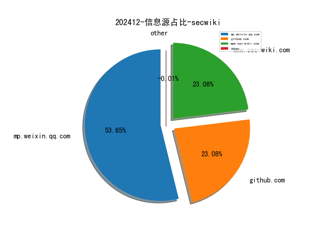
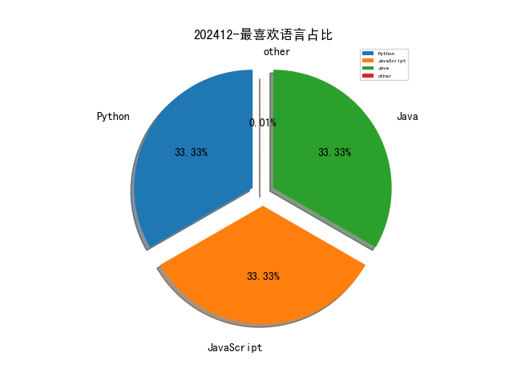

# [数据--所有](README_20.md)
# [数据--年度](README_2024.md)
# 202412 信息源与信息类型占比

# 网络安全书籍 推荐
| date_added | language | title | author | link | size| 
| --- | --- | --- | --- | --- | ---| 
| 2024-12-31 12:37:40 | English | Generative AI Apps with LangChain and Python | unknown | https://www.wowebook.org/generative-ai-apps-with-langchain-and-python/ | unknown| 
| 2024-12-31 10:08:54 | English | Principles of AI Governance and Model Risk Management | unknown | https://www.wowebook.org/principles-of-ai-governance-and-model-risk-management/ | unknown| 
| 2024-12-27 09:21:12 | English | Algorithmic Trading with Python: Fast-Track Your Trading Strategy: A comprehensive Guide | Bisette, Vincent; Strauss, Johann; Schwartz, Alice; Van Der Post, Hayden | http://libgen.is/book/index.php?md5=A58E85649276B4EED9CE62AEC78BAFB8 | 2 MB [EPUB]| 
| 2024-12-27 04:51:16 | English | The Public Speaking Playbook | Teri Kwal Gamble, Michael W. Gamble | http://libgen.is/book/index.php?md5=F2BBA93197F948499B0A2375494F1DAC | 29 MB [PDF]| 
| 2024-12-26 04:04:16 | English | Automotive Rust Repair & Prevention | Dennis W. Parks | http://libgen.is/book/index.php?md5=75E8302E921D328995D21070C9AC50E8 | 29 MB [PDF]| 
| 2024-12-26 16:32:37 | English | Software Testing with Generative AI | unknown | https://www.wowebook.org/software-testing-with-generative-ai/ | unknown| 
| 2024-12-24 06:01:01 | English | Mastering Microsoft 365 and SharePoint Online | unknown | https://www.wowebook.org/mastering-microsoft-365-and-sharepoint-online/ | unknown| 
| 2024-12-23 14:48:24 | English | Mastering Windows 365: Deploy and Manage Cloud PCs and Windows 365 Link devices, Copilot with Intune, and Intune Suite | Christiaan Brinkhoff, Sandeep Patnaik, Morten Pedholt | http://libgen.is/book/index.php?md5=5F52134ED48D374182DC76169BA3B831 | 83 MB [PDF]| 
| 2024-12-21 10:10:31 | English | The Kubernetes Bible, 2nd Edition | unknown | https://www.wowebook.org/the-kubernetes-bible-2nd-edition/ | unknown| 
| 2024-12-21 08:36:53 | English | Coding with ChatGPT and Other LLMs | unknown | https://www.wowebook.org/coding-with-chatgpt-and-other-llms/ | unknown| 
| 2024-12-20 07:12:02 | English | Learn Python Programming, 4th Edition | unknown | https://www.wowebook.org/learn-python-programming-4th-edition/ | unknown| 
| 2024-12-17 21:44:18 | English | Comics and the Body: Drawing, Reading, and Vulnerability | Eszter Szép | http://libgen.is/book/index.php?md5=F794615FE9FBF98092D8335EFD4ED0F8 | 7 MB [PDF]| 
| 2024-12-17 18:21:02 | English | Take Control of iOS & iPadOS Privacy and Security | Glenn Fleishman | http://libgen.is/book/index.php?md5=26B6B1BD19E45E64C5F9657AB4AD9798 | 18 MB [EPUB]| 
| 2024-12-17 23:33:37 | English | Logs and Telemetry: Using Fluent Bit, Kubernetes, streaming and more | Phil Wilkins | http://libgen.is/book/index.php?md5=1C7713A4A8670BB3844A254FE706780B | 13 MB [EPUB]| 
| 2024-12-16 12:05:19 | English | (Springer Undergraduate Texts in Mathematics and Technology) Computation and Simulation for Finance: An Introduction with Python | Cónall Kelly | http://libgen.is/book/index.php?md5=2E6CEF356FF81E62FED28A8FF48F1822 | 13 MB [PDF]| 
| 2024-12-15 15:58:01 | English | Hands-On Generative AI with Transformers and Diffusion Models | Omar Sanseviero, Pedro Cuenca, Apolinário Passos, Jonathan Whitaker | http://libgen.is/book/index.php?md5=29D6A564953FE4341A2F2B27054CB931 | 131 MB [PDF]| 
| 2024-12-15 14:21:57 | English | Secret Key Cryptography: Ciphers, from simple to unbreakable | Frank Rubin | http://libgen.is/book/index.php?md5=A6FB322E53ED42F7A9DF0BB7D5243208 | 7 MB [PDF]| 
| 2024-12-15 20:00:22 | English | (Springer Proceedings in Mathematics & Statistics, Volume 468) Mathematics of Computer Science, Cybersecurity and Artificial Intelligence | Cheikh Thiecoumba Gueye, Papa Ngom, Idy Diop (Eds.) | http://libgen.is/book/index.php?md5=C5AD750AC1E7B7B365BE9E3EAC2238F0 | 8 MB [PDF]| 
| 2024-12-15 18:40:08 | English | Cybersecurity: Technology and Governance | Audun Jøsang | http://libgen.is/book/index.php?md5=6837D9F6D5A386ED3995768C985355FB | 16 MB [PDF]| 
| 2024-12-15 21:44:39 | English | In Defense of Common Life: The Political Thought of Raquel Gutiérrez Aguilar | Raquel Gutiérrez Aguilar; Brian Whitener (editor) | http://libgen.is/book/index.php?md5=5D1AFB9B0BEC3557852A3079620DFE50 | 1 MB [EPUB]| 
| 2024-12-15 08:50:16 | English | Hands-On Generative AI with Transformers and Diffusion Models | unknown | https://www.wowebook.org/hands-on-generative-ai-with-transformers-and-diffusion-models/ | unknown| 
| 2024-12-15 08:06:30 | English | The Cybersecurity Trinity: Artificial Intelligence, Automation, and Active Cyber Defense | unknown | https://www.wowebook.org/the-cybersecurity-trinity-artificial-intelligence-automation-and-active-cyber-defense/ | unknown| 
| 2024-12-15 15:12:05 | English | Modern Business Analytics: Increasing the Value of Your Data with Python and R | unknown | https://www.wowebook.org/modern-business-analytics-increasing-the-value-of-your-data-with-python-and-r/ | unknown| 
| 2024-12-14 02:42:56 | English | The Quantitative Risk Management Exercise Book | Marius Hofert, Rüdiger Frey, Alexander J. McNeil | http://libgen.is/book/index.php?md5=4375D1C10FE08FF3A375F22BF055501B | 2 MB [PDF]| 
| 2024-12-11 14:43:53 | English | Cloud Observability with Azure Monitor | unknown | https://www.wowebook.org/cloud-observability-with-azure-monitor/ | unknown| 
| 2024-12-10 07:14:43 | English | DevOps Unleashed with Git and GitHub | Yuki Hattori | http://libgen.is/book/index.php?md5=1FAB97051493A971D0A27A2AF1FBC317 | 9 MB [PDF]| 
| 2024-12-10 06:57:27 | English | Django 5 for the Impatient: Learn the core concepts of Django to develop Python web applications | Daniel Correa; Greg Lim | http://libgen.is/book/index.php?md5=B04E91EB5CE424979A7880CA5199B4E9 | 7 MB [PDF]| 
| 2024-12-10 02:59:00 | English | Making Europe Unconquerable: The Potential of Civilian-Based Deterrence and Defense | Gene Sharp | http://libgen.is/book/index.php?md5=85BF56B8925870D19B9037F4EC048B72 | 5 MB [PDF]| 
| 2024-12-10 02:01:20 | English | Civilian-Based Defense: A Post-Military Weapons System | Gene Sharp | http://libgen.is/book/index.php?md5=2C76B606161466DCC48B762A38EF3BD0 | 4 MB [PDF]| 
| 2024-12-10 02:01:10 | English | National Security Through Civilian-Based Defense | Gene Sharp | http://libgen.is/book/index.php?md5=4A6CFA057980DD5DEDC29FFBB14D5AB4 | 2 MB [PDF]| 
| 2024-12-10 07:37:05 | English | (For Dummies: Learning Made Easy) Python All-in-One For Dummies | John C. Shovic, Alan Simpson | http://libgen.is/book/index.php?md5=7F07DCC8EE929B72C94844FA5E6C32D1 | 42 MB [PDF]| 
| 2024-12-10 07:34:59 | English | Geocomputation with Python | Dorman, Michael; Graser, Anita; Nowosad, Jakub; Lovelace, Robin | http://libgen.is/book/index.php?md5=7FD4F931DBCDBA29CDC9A7F0D981AA05 | 10 MB [EPUB]| 
| 2024-12-10 07:34:46 | English | (lermArte, 27) A Second Mona Lisa? Challenges of Attribution and Authentication and Various Possibilities for Evaluating a Work of Art | Salvatore Lorusso, Andrea Natali | http://libgen.is/book/index.php?md5=5ADC1E89C54207C320DB6C05138C34A6 | 18 MB [PDF]| 
| 2024-12-08 08:30:55 | English | DevOps Simplified: Zero-Maintenance Strategies for AWS EKS | unknown | https://www.wowebook.org/devops-simplified-zero-maintenance-strategies-for-aws-eks/ | unknown| 
| 2024-12-08 08:18:38 | English | So You Want to Work in Crypto | unknown | https://www.wowebook.org/so-you-want-to-work-in-crypto/ | unknown| 
| 2024-12-08 06:42:17 | English | Generative AI in Banking Financial Services and Insurance | unknown | https://www.wowebook.org/generative-ai-in-banking-financial-services-and-insurance/ | unknown| 
| 2024-12-08 09:01:55 | English | Full Stack Development with Microsoft Blazor, 4th Edition | unknown | https://www.wowebook.org/full-stack-development-with-microsoft-blazor-4th-edition/ | unknown| 
| 2024-12-07 17:44:18 | English | CompTIA A+ Certification Companion: Hands-on Preparation and Practice for Exams 220-1101 & 220-1102 | unknown | https://www.wowebook.org/comptia-a-certification-companion-hands-on-preparation-and-practice-for-exams-220-1101-220-1102/ | unknown| 
| 2024-12-07 18:27:18 | English | Automated Data Analytics : Combining Human Creativity and AI Power using ChatGPT | Soraya Sedkaoui; | http://libgen.is/book/index.php?md5=2B0AFBD80018A0079E5B89B3A2BCF04C | 2 MB [EPUB]| 
| 2024-12-07 18:01:55 | English | The Sword and the Olive: A Critical History of the Israeli Defense Force | Martin van Creveld | http://libgen.is/book/index.php?md5=C34308C47AE324E9016201EB21CE0B3A | 70 MB [PDF]| 
| 2024-12-05 22:04:56 | English | Mastering Spring AI: The Java Developer’s Guide for Large Language Models and Generative AI | unknown | https://www.wowebook.org/mastering-spring-ai-the-java-developers-guide-for-large-language-models-and-generative-ai/ | unknown| 
| 2024-12-05 21:19:27 | English | Hacking MySQL: Breaking, Optimizing, and Securing MySQL for Your Use Case | unknown | https://www.wowebook.org/hacking-mysql-breaking-optimizing-and-securing-mysql-for-your-use-case/ | unknown| 
| 2024-12-05 18:20:35 | English | Full Stack Development with Microsoft Blazor | Peter Himschoot | http://libgen.st/book/index.php?md5=993A13934BEB290011841638C70A9786 | 19 MB [PDF]| 
| 2024-12-03 08:13:34 | English | Quick Start Guide to Large Language Models: Strategies and Best Practices for Using ChatGPT and Other LLMs | unknown | https://www.wowebook.org/quick-start-guide-to-large-language-models-strategies-and-best-practices-for-using-chatgpt-and-other-llms/ | unknown| 
| 2024-12-02 08:39:26 | English | Building Applications with Large Language Models | unknown | https://www.wowebook.org/building-applications-with-large-language-models/ | unknown| 
| 2024-12-01 08:32:06 | English | MCQ for Python Users | unknown | https://www.wowebook.org/mcq-for-python-users/ | unknown| 
| 2024-12-01 07:16:26 | English | Working Smarter with Microsoft Project | unknown | https://www.wowebook.org/working-smarter-with-microsoft-project/ | unknown| 
| 2024-12-01 01:51:43 | English | How to Undertake Surveillance and Reconnaissance: From a Civilian and Military Perspective | Hank Prunckun | http://libgen.st/book/index.php?md5=10E4E480DF83D60BCFCB05B1F7621B4A | 26 MB [PDF]| 

# 微信公众号 推荐
| nickname_english | weixin_no | title | url| 
| --- | --- | --- | ---| 
| 0x727开源安全团队 | None | 我为什么坚信分工是创新的前提的内在逻辑（第五章） | https://mp.weixin.qq.com/s?__biz=MzkwNTI3MjIyOQ==&mid=2247484077&idx=1&sn=a9b0048b870881f2b1f7c47d60a48526 | 4| 
| Echo Reply | None | Cisco Nexus 9000 和 3000 升级指引 | https://mp.weixin.qq.com/s?__biz=MzA5NTUxODA0OA==&mid=2247493090&idx=1&sn=e4443e5051a013ee31958484d2527798 | 2| 
| FreeBuf | None | VECTR：一款红蓝队测试活动跟踪与分析评估工具 | https://mp.weixin.qq.com/s?__biz=MjM5NjA0NjgyMA==&mid=2651310927&idx=4&sn=9db34cdcaf7ede09db05e0c42c34f59b | 36| 
| Gh0xE9 | None | 详探传统以及链上网络安全，FORKS 链上风险与安全论坛「成都站」邀您一起！ | https://mp.weixin.qq.com/s?__biz=MzAwNTc5MTMyNg==&mid=2247500076&idx=1&sn=c5af2ebd0bde6a7a62ebb67d737d681e | 8| 
| Ghost Wolf Lab | None | 仅一年就5600本(文末福利) | https://mp.weixin.qq.com/s?__biz=MzI3OTM3OTAyNw==&mid=2247485913&idx=1&sn=72d2edfd28461f5b60d7479a0127c1ac | 1| 
| HACK之道 | None | 攻防演练：基于真实案例的7种CSP绕过与防御指南 | https://mp.weixin.qq.com/s?__biz=MzIwMzIyMjYzNA==&mid=2247517613&idx=1&sn=936587066327fa3c5b925a175bb7dfb8 | 9| 
| HackTips | None | 全球数据泄露事件分析：隐私保护的紧迫性 | https://mp.weixin.qq.com/s?__biz=Mzg3MTE0NTg4OQ==&mid=2247484063&idx=1&sn=6ad4eb2597ac1edb5b572b84ad67a3ab | 2| 
| IoT物联网技术 | None | 小米米家格局打开！拥抱开源，5.27 亿设备接入 Home Assistant 物联网平台，涂鸦智能将何去何从？ | https://mp.weixin.qq.com/s?__biz=MjM5OTA4MzA0MA==&mid=2454936278&idx=1&sn=3749735262f338fda6996af2b1d5b96e | 1| 
| Khan安全攻防实验室 | None | 国自然本子没中标？让十年评审专家帮你精修，中标率提升89.9%！另赠直播答疑 | https://mp.weixin.qq.com/s?__biz=MzAwMjQ2NTQ4Mg==&mid=2247496364&idx=2&sn=21fa25b5ed557590e42013e4bf6fad9b | 24| 
| Ms08067安全实验室 | None | 今晚8点 , 逆向工程-如何破解一个程序 | https://mp.weixin.qq.com/s?__biz=MzU1NjgzOTAyMg==&mid=2247522362&idx=1&sn=e89794b5bd379f8444d3cd08b2e1c44b | 4| 
| OSINT研习社 | None | 2024 年新的网络攻击趋势：LNK 文件和 SSH 命令 | https://mp.weixin.qq.com/s?__biz=Mzg4MzA4NTM0OA==&mid=2247493377&idx=1&sn=2fc5000257c212409649e780f7910460 | 4| 
| Ots安全 | None | 通过 X-Forwarded-Host 泄露密码重置令牌 | https://mp.weixin.qq.com/s?__biz=MzAxMjYyMzkwOA==&mid=2247526497&idx=3&sn=caf31731e63d13bd33e4fc65aa232bf0 | 26| 
| Theloner安全团队 | None | 网红“影子不会说谎”等35人被抓！自导自演“酒店发现偷拍摄像头”，非法牟利数百万元 | https://mp.weixin.qq.com/s?__biz=MzI2Mzc4ODc1NQ==&mid=2247489536&idx=1&sn=29466fab0a635f04cf654f9ed8649b58 | 1| 
| TtTeam | None | 自导自演，涉酒店窃听窃照，公安机关抓获35人 | https://mp.weixin.qq.com/s?__biz=Mzg2NTk4MTE1MQ==&mid=2247486382&idx=1&sn=db42244edb1904c56a1a48ece28b5636 | 10| 
| dotNet安全矩阵 | None | .NET , 剖析通过 TcpClient 实现内网端口转发 | https://mp.weixin.qq.com/s?__biz=MzUyOTc3NTQ5MA==&mid=2247497781&idx=3&sn=43e78470db7033736e9e07477a1c49e2 | 28| 
| goddemon的小屋 | None | 浅谈个人研究侧的ai代码审计思路 | https://mp.weixin.qq.com/s?__biz=MzI2NTc1ODY0Mw==&mid=2247486168&idx=1&sn=9cc2f54f581924c142ae2d3997a05464 | 2| 
| securitainment | None | 滥用服务控制管理器实现隐蔽和持久的本地权限提升 | https://mp.weixin.qq.com/s?__biz=MzAxODM5ODQzNQ==&mid=2247486063&idx=1&sn=5cc98ef79cb22d461c35b98678a7b18f | 11| 
| thelostworld | None | 赛克安全本周漏洞推送（12.22-12.27）涉及国威IP数字语音系统、黄药师、企企通、快云服务器、一卡通系统漏洞 | https://mp.weixin.qq.com/s?__biz=MzIyNjk0ODYxMA==&mid=2247487545&idx=1&sn=82701065b0b2e49d07c8800023b95016 | 2| 
| 七芒星实验室 | None | Windows应急响应之命令行排查 | https://mp.weixin.qq.com/s?__biz=Mzg4MTU4NTc2Nw==&mid=2247494383&idx=2&sn=f280f7b3f5558af3b5a6d3b3b8c97d29 | 16| 
| 中国电信安全 | None | 2025年，我们这样干！ | https://mp.weixin.qq.com/s?__biz=MzkxNDY0MjMxNQ==&mid=2247531993&idx=1&sn=bf4021fb37bae9d2e37e9e57008fda11 | 10| 
| 中国软件评测中心 | None | 鼎信杯 , 开源安全治理创新与实践分论坛在京成功举行 | https://mp.weixin.qq.com/s?__biz=MjM5NzYwNDU0Mg==&mid=2649248972&idx=1&sn=c3f63c8c77b0cd7d09e10993236a138f | 6| 
| 中龙技术 | None | 深信服内推福利（Sangfor） | https://mp.weixin.qq.com/s?__biz=Mzg3Mzg1OTYyMQ==&mid=2247487659&idx=7&sn=f70e57a6d0eebd447cd28bd171d0498d | 11| 
| 乌雲安全 | None | 实战｜记一次5KW资产的渗透测试 | https://mp.weixin.qq.com/s?__biz=MzAwMjA5OTY5Ng==&mid=2247525374&idx=1&sn=6405d885a0d3f82739f6876703395ded | 9| 
| 信安百科 | None | CVE-2024-55461｜SeaCMS海洋影视管理系统远程代码执行漏洞（POC） | https://mp.weixin.qq.com/s?__biz=Mzg2ODcxMjYzMA==&mid=2247485759&idx=3&sn=35fb3858f8e435c78c6ca1bfdf176f42 | 7| 
| 信息安全动态 | None | 从APT攻击到勒索软件：黑客的攻击链全解析 | https://mp.weixin.qq.com/s?__biz=Mzg4NDc0Njk1MQ==&mid=2247486743&idx=1&sn=b27d8774309e73ebb10b7980dc06bf9e | 3| 
| 儒道易行 | None | 【独孤九剑】攻防实战详情 | https://mp.weixin.qq.com/s?__biz=Mzg5NTU2NjA1Mw==&mid=2247495502&idx=1&sn=7742eb6e4ea91286c0ada72cf105089d | 8| 
| 全栈网络空间安全 | None | 从Gartner的三次定义，看微隔离技术发展与演进 | https://mp.weixin.qq.com/s?__biz=Mzg3NTUzOTg3NA==&mid=2247514875&idx=1&sn=8bfb1ac7ce30d2206b00352c56cd6d08 | 7| 
| 全球技术地图 | None | 科技赋能战场伪装问题探析 | https://mp.weixin.qq.com/s?__biz=MzI1OTExNDY1NQ==&mid=2651618189&idx=1&sn=bc9db7d057a49b969eaaa4ca43477e37 | 12| 
| 关键信息基础设施安全保护联盟 | None | 关于印发银行保险机构数据安全管理办法的通知 | https://mp.weixin.qq.com/s?__biz=MzkxNjU2NjY5MQ==&mid=2247509009&idx=1&sn=8c8c7078174afdbc3c2a85180f1f3a94 | 11| 
| 内生安全联盟 | None | 数字经济背景下产业融合发展的路径与策略研究 | https://mp.weixin.qq.com/s?__biz=Mzg4MDU0NTQ4Mw==&mid=2247528219&idx=2&sn=a8c640d7160d356470e96866d88bad6b | 19| 
| 军哥网络安全读报 | None | Apache MINA CVE-2024-52046：满分漏洞可通过不安全的序列化实现 RCE | https://mp.weixin.qq.com/s?__biz=MzI2NzAwOTg4NQ==&mid=2649793667&idx=3&sn=b07eadcd820da3a03e300e93d797e389 | 23| 
| 冲鸭安全 | None | 2024年终: 木马病毒自动化特征提取&云端机器学习的思路分享 | https://mp.weixin.qq.com/s?__biz=MzkyOTc0NDY2Nw==&mid=2247484551&idx=1&sn=4e0edcc586ec733f9d3a8b0ba93b9069 | 1| 
| 冷漠安全 | None | 「漏洞复现」博斯外贸管理软件V6.0 log/logined.jsp SQL注入漏洞 | https://mp.weixin.qq.com/s?__biz=MzkyNDY3MTY3MA==&mid=2247486527&idx=1&sn=36ec4ac9584fade2f68a64f0d92c9453 | 10| 
| 利刃信安 | None | 【扫盲系列】HTTPS 和 SSL/TLS 协议[0]：引子 | https://mp.weixin.qq.com/s?__biz=MzU1Mjk3MDY1OA==&mid=2247519027&idx=1&sn=5ab8d6a7fcfc9731eda8497ca93f767a | 7| 
| 励行安全 | None | 年末惊喜 , 测测新的国产大模型DeepSeek在渗透领域表现如何 | https://mp.weixin.qq.com/s?__biz=MzkxNTY4NTQwMg==&mid=2247484204&idx=1&sn=85372ce2284045e072d6465c42fa99a7 | 10| 
| 君说安全 | None | 奇葩！“网安践行者”居然系自导自演？ | https://mp.weixin.qq.com/s?__biz=MzUzNjkxODE5MA==&mid=2247487892&idx=1&sn=f0956f1c43affc10c02a7cad2c76afb8 | 13| 
| 听风安全 | None | 双层mitmproxy代理实现自动化加解密 | https://mp.weixin.qq.com/s?__biz=Mzg3NzIxMDYxMw==&mid=2247504287&idx=1&sn=276440e8743599a8120fe03fbd6d9814 | 3| 
| 商密君 | None | 特朗普网安政策重大转向：CISA收缩，减少监管 | https://mp.weixin.qq.com/s?__biz=MzI5NTM4OTQ5Mg==&mid=2247633418&idx=4&sn=2e520e46ae68a4941662de96d3b1bae6 | 26| 
| 嘶吼专业版 | None | “美亚柏科杯” 数据安全管理员职业技能竞赛总决赛在厦门盛大开幕 | https://mp.weixin.qq.com/s?__biz=MzI0MDY1MDU4MQ==&mid=2247580514&idx=1&sn=ebb5ae0a5627e887022ae1d5a8dc55c0 | 11| 
| 大山子雪人 | None | 鸿蒙系统服务攻击面分析 | https://mp.weixin.qq.com/s?__biz=Mzg2MDc0NTIxOQ==&mid=2247484653&idx=1&sn=a6bb93ef523d14f3f01c920165f63c77 | 1| 
| 天启互联网实验室 | None | 关于开源安全产品的使用测试--雷池WAF测试 | https://mp.weixin.qq.com/s?__biz=MzkzODQzNTU2NA==&mid=2247486205&idx=1&sn=966df0795857eb0e83b6a6360abdfa08 | 5| 
| 天津恒御科技有限公司 | None | 最常见的10种网络安全攻击类型 | https://mp.weixin.qq.com/s?__biz=MzU4NjY3OTAzMg==&mid=2247514564&idx=2&sn=ee6a05d66f4d823669df70335474688f | 8| 
| 威努特安全网络 | None | 一周全球重大网络安全事件速递（第五十二期） | https://mp.weixin.qq.com/s?__biz=MzAwNTgyODU3NQ==&mid=2651130070&idx=1&sn=950d386dc641dc9aef663422fcc2b694 | 5| 
| 安全内参 | None | 2024年安全运营技术趋势回顾 | https://mp.weixin.qq.com/s?__biz=MzI4NDY2MDMwMw==&mid=2247513370&idx=1&sn=21077de47c6a41dfb39fdb209448e15d | 11| 
| 安全圈 | None | 【安全圈】黑客组织 IntelBroker 披露 10 月入侵思科公司所获“机密文件”，自称掌握 4.5TB 内部数据 | https://mp.weixin.qq.com/s?__biz=MzIzMzE4NDU1OQ==&mid=2652066981&idx=3&sn=6130a0ca79f1c6a766695274487f0c50 | 28| 
| 安全学习那些事儿 | None | 通用动力公司员工遭网络钓鱼攻击导致信息泄露 | https://mp.weixin.qq.com/s?__biz=MzkxNTI2NTQxOA==&mid=2247495662&idx=5&sn=e3b6b80b04255c5036501b0ee3038a09 | 27| 
| 安全牛课堂 | None | 国内外这些攻防证书，一个比一个牛！ | https://mp.weixin.qq.com/s?__biz=MzIxNTM4NDY2MQ==&mid=2247515314&idx=1&sn=9443758f496087e77f6676c08a8e7aa6 | 11| 
| 安全狗的自我修养 | None | 反射型 XSS 绕过 WAF & Page 未找到 | https://mp.weixin.qq.com/s?__biz=MzkwOTE5MDY5NA==&mid=2247504079&idx=1&sn=e57a7a3f3adaba98f7513e9d009c258b | 9| 
| 安在 | None | 在看 , 厂商：本周热门网络安全产业动态 | https://mp.weixin.qq.com/s?__biz=MzU5ODgzNTExOQ==&mid=2247633768&idx=3&sn=b77759a082a5b10fe4e6dee1d2dfa6c8 | 15| 
| 安天集团 | None | 安天AVL SDK反病毒引擎升级通告（20241228） | https://mp.weixin.qq.com/s?__biz=MjM5MTA3Nzk4MQ==&mid=2650209459&idx=1&sn=b0672fae808f923d2e6ce52350292830 | 5| 
| 安帝Andisec | None | 工业网络安全周报-2024年第50期 | https://mp.weixin.qq.com/s?__biz=MzU3ODQ4NjA3Mg==&mid=2247563043&idx=1&sn=aba9743c96d33258ccc07bcdad90adf4 | 4| 
| 安知讯 | None | 宁波银行金融科技部社招，涉安全技术岗、技术运维岗等 | https://mp.weixin.qq.com/s?__biz=MzIxMDIwODM2MA==&mid=2653931334&idx=1&sn=c4efbe3add6c1fa67bc17e3fec89eacd | 8| 
| 实战安全研究 | None | 40种绕过WAF防火墙的Payload混淆技术，绝了！ | https://mp.weixin.qq.com/s?__biz=MzU0MTc2NTExNg==&mid=2247491295&idx=1&sn=1a82cfe7b5539a6e3b4d9c4080d5fec6 | 6| 
| 富贵安全 | None | 兄弟点我有惊喜撒 | https://mp.weixin.qq.com/s?__biz=MzkxNzY5MTg1Ng==&mid=2247485292&idx=1&sn=fa030937df4f1cc281207331ae6ce298 | 5| 
| 开源情报技术研究院 | None | 网络安全资讯周报(12/23- 12/27) | https://mp.weixin.qq.com/s?__biz=MzkwNjQxOTk1Mg==&mid=2247486032&idx=1&sn=b0414521ac90d584a875a6837d62d208 | 3| 
| 情报分析站 | None | OSINT调查,共享地图工具 | https://mp.weixin.qq.com/s?__biz=MzkxMDIwMTMxMw==&mid=2247494305&idx=1&sn=3231ed2c6e438e776010ae8e2ffaacd5 | 4| 
| 技术修道场 | None | 万豪数据泄露再敲警钟！FTC出手，强令其筑牢安全防线！ | https://mp.weixin.qq.com/s?__biz=MzA4NTY4MjAyMQ==&mid=2447899861&idx=1&sn=57ab3af64526216c668a197ed44b79f3 | 9| 
| 掌控安全EDU | None | 利用shuji还原webpack打包源码 | https://mp.weixin.qq.com/s?__biz=MzUyODkwNDIyMg==&mid=2247546341&idx=1&sn=8a23e8a6ad49eea24ddbc10b884fb0e2 | 14| 
| 星悦安全 | None | 【工具分享】CyberEdge - 强大，高效，精准的互联网资产测绘工具 | https://mp.weixin.qq.com/s?__biz=Mzg4MTkwMTI5Mw==&mid=2247488396&idx=1&sn=c63a1295ff1f3414a21b40cdb88326a0 | 7| 
| 极梦C | None | 关于开源安全产品的使用测试--雷池WAF测试 | https://mp.weixin.qq.com/s?__biz=MzU2NjgzMDM3Mg==&mid=2247493897&idx=1&sn=4cf7d9640f54434962edea428d310f3f | 3| 
| 沃克学安全 | None | 某渗透中代码审计到内网遨游 | https://mp.weixin.qq.com/s?__biz=MzkzMjIxNjExNg==&mid=2247486065&idx=1&sn=a8e4b6a05eac10b7eceb8217e35c587e | 3| 
| 河南等级保护测评 | None | 焦虑背后都是生意：“网安践行者”等系自导自演，“酒店窃听窃照”35人被抓 | https://mp.weixin.qq.com/s?__biz=Mzg2NjY2MTI3Mg==&mid=2247497959&idx=1&sn=d53f2519b1038cd97940ee5ef4ae1796 | 18| 
| 泰晓科技 | None | OSDT Weekly 2024-12-11 第284期 | https://mp.weixin.qq.com/s?__biz=MzA5NDQzODQ3MQ==&mid=2648194437&idx=2&sn=1e87fae037617d95beaceb359f81dd72 | 5| 
| 洞见网安 | None | 网安原创文章推荐【2024/12/27】 | https://mp.weixin.qq.com/s?__biz=MzAxNzg3NzMyNQ==&mid=2247489374&idx=1&sn=71c22c6a6d5a5cbb482062577c4d355a | 7| 
| 浅安安全 | None | 工具 , deal_shellcode | https://mp.weixin.qq.com/s?__biz=MzkwMTQ0NDA1NQ==&mid=2247491905&idx=4&sn=15b16f2ec18e285be224a3d6bb0f2552 | 25| 
| 火绒安全 | None | 诚邀渠道合作伙伴共启新征程 | https://mp.weixin.qq.com/s?__biz=MzI3NjYzMDM1Mg==&mid=2247521278&idx=2&sn=cc6d101d734d236f1dcda731c1f4df2f | 7| 
| 犀牛安全 | None | 俄罗斯联邦安全局缴获的手机中发现新型 Android 间谍软件 | https://mp.weixin.qq.com/s?__biz=Mzg3ODY0NTczMA==&mid=2247491805&idx=1&sn=e066c53e6ed17004a5a6ea98027ae78b | 11| 
| 独眼情报 | None | 软件更新将数十辆Tesla Cyberu200bu200btruck变砖 | https://mp.weixin.qq.com/s?__biz=MzkzNDIzNDUxOQ==&mid=2247493574&idx=3&sn=5a906e640446162f96d0a613c1037550 | 35| 
| 独立观察员博客 | None | 豆包AI智能体（WPF老师） | https://mp.weixin.qq.com/s?__biz=MzA3NDE0NTA0MA==&mid=2649212196&idx=1&sn=1c8f8158e838405c6edd7303c738226d | 1| 
| 狼蛛安全实验室 | None | APT-C-26（Lazarus）组织武器化IPMsg软件攻击金融机构和加密货币交易所 | https://mp.weixin.qq.com/s?__biz=Mzg4MDYwNDc5Nw==&mid=2247486495&idx=1&sn=49aa056538d110c8539556b2634a509d | 4| 
| 玄道夜谈 | None | 分享图片 | https://mp.weixin.qq.com/s?__biz=MzI3Njc1MjcxMg==&mid=2247493973&idx=1&sn=e869415846952409a415bab89fd15ff5 | 8| 
| 生有可恋 | None | Windows 挂载 Linux 系统目录 | https://mp.weixin.qq.com/s?__biz=Mzk0MTI4NTIzNQ==&mid=2247492058&idx=1&sn=8e109fe1fa95cb45a1338c0828df33e4 | 1| 
| 白帽学子 | None | 运维的日常 | https://mp.weixin.qq.com/s?__biz=MzkyNzIxMjM3Mg==&mid=2247488676&idx=2&sn=89bd414935cc39ae95d2f2e2d00ef7d4 | 16| 
| 白泽安全实验室 | None | 警惕！新型恶意软件针对讲中文的区域展开网络攻击活动 | https://mp.weixin.qq.com/s?__biz=MzI0MTE4ODY3Nw==&mid=2247492496&idx=1&sn=6481a7c85dac490a6d3ddd4bcb9973fa | 4| 
| 看雪学苑 | None | 【开课啦】数字取证训练营：打造数据安全领域核心竞争力 | https://mp.weixin.qq.com/s?__biz=MjM5NTc2MDYxMw==&mid=2458587797&idx=2&sn=9a9221da3ed2d8e5e5ddc769a973ceff | 14| 
| 知机安全 | None | 【2024-12-28】每日安全资讯 | https://mp.weixin.qq.com/s?__biz=MzIzNDU5NTI4OQ==&mid=2247488168&idx=1&sn=8cf3c136b0dddef3aaa430a125e73274 | 5| 
| 神农Sec | None | 分享Fastjson反序列化漏洞原理+漏洞复现+实战案例+POC收集 | https://mp.weixin.qq.com/s?__biz=Mzk0Mzc1MTI2Nw==&mid=2247486705&idx=1&sn=860b4533ad361eafd6ebae77dafdbc7e | 9| 
| 祺印说信安 | None | 国家金融监督管理总局有关司局负责人就《银行保险机构数据安全管理办法》答记者问 | https://mp.weixin.qq.com/s?__biz=MzA5MzU5MzQzMA==&mid=2652113431&idx=3&sn=9653e960250252e05bc4b2fdef22df2a | 31| 
| 网安守护 | None | 普及下什么是直连、中转、专线机场？ | https://mp.weixin.qq.com/s?__biz=MzU4NDY3MTk2NQ==&mid=2247490999&idx=1&sn=bdaa6ec5892bbf789c763412ac508610 | 8| 
| 网安百色 | None | 七国集团就AI风险监控达成协议 | https://mp.weixin.qq.com/s?__biz=MzI0NzE4ODk1Mw==&mid=2652094468&idx=2&sn=28c51a40a2fbe52a041987a2a06cf1d4 | 8| 
| 网空闲话plus | None | 5th域安全微讯早报【20241228】312期 | https://mp.weixin.qq.com/s?__biz=MzkyMjQ5ODk5OA==&mid=2247506405&idx=2&sn=0bcbf112ec460f66b99b961c4e24c25e | 27| 
| 网络与信息法学会 | None | 【资讯】上海市政府办公厅印发《关于人工智能“模塑申城”的实施方案》 | https://mp.weixin.qq.com/s?__biz=MzU1NDY3NDgwMQ==&mid=2247548660&idx=5&sn=83b9bcaee69509bd711aa257018715e4 | 14| 
| 网络与安全实验室 | None | 每周文章分享-192 | https://mp.weixin.qq.com/s?__biz=MzI1MTQwMjYwNA==&mid=2247501200&idx=1&sn=bad597dae3d955fb5eb4b336ba2ec43b | 3| 
| 网络安全007 | None | 【粉丝福利】年底了，回馈粉丝，先到先得！共计100份发完截止！ | https://mp.weixin.qq.com/s?__biz=MzI1NTE2NzQ3NQ==&mid=2247485421&idx=1&sn=9efb71f1e51275c89bf975911accb498 | 4| 
| 网络安全与人工智能研究中心 | None | 这个国家政务数据库因网络攻击离线，众多民众基本服务全面中断 | https://mp.weixin.qq.com/s?__biz=MzkwMTQyODI4Ng==&mid=2247495335&idx=3&sn=15846dff5d0ff686aac74d7a03041f99 | 12| 
| 网络安全与取证研究 | None | 取证工具 - Magnet AXIOM中文绿色版 | https://mp.weixin.qq.com/s?__biz=Mzg3NTU3NTY0Nw==&mid=2247489458&idx=1&sn=bfedfb1c1908319803dcdc93bf97e620 | 7| 
| 网络技术干货圈 | None | 万兆铜缆交换机与万兆光纤交换机有啥区别？如何选择？ | https://mp.weixin.qq.com/s?__biz=MzUyNTExOTY1Nw==&mid=2247527660&idx=1&sn=dd4ff47186792819f37b0d45a09a1a39 | 6| 
| 网络技术联盟站 | None | 普通网工可能整个工作生涯都不会用到VXLAN，但了解这15个术语，你会走得更远！ | https://mp.weixin.qq.com/s?__biz=MzIyMzIwNzAxMQ==&mid=2649463768&idx=1&sn=765bd7dad8873babc8a79757f5d5f840 | 11| 
| 老烦的草根安全观 | None | 数据安全规划设计简图 | https://mp.weixin.qq.com/s?__biz=MzA5MTYyMDQ0OQ==&mid=2247493471&idx=1&sn=783a94b03dce2a913c5a25de5a512c43 | 1| 
| 聚铭网络 | None | 【一周安全资讯1228】五部门联合印发《关于促进企业数据资源开发利用的意见》；平安夜不平安，美国航空因软件故障致旗下全美航班停飞 | https://mp.weixin.qq.com/s?__biz=MzIzMDQwMjg5NA==&mid=2247506367&idx=1&sn=0deb84f7d2c6d63a66ed2bac785796db | 6| 
| 船山信安 | None | 公安部第三研究所招聘！ | https://mp.weixin.qq.com/s?__biz=MzU2NDY2OTU4Nw==&mid=2247517875&idx=1&sn=75e730d44e406f526fd0a53d8c1f09fb | 10| 
| 苏说安全 | None | APT~APT~在网络安全的未来发展 | https://mp.weixin.qq.com/s?__biz=Mzg5OTg5OTI1NQ==&mid=2247489544&idx=1&sn=7d6a9c832611ddd852c42dcb0fd83888 | 9| 
| 蓝军开源情报 | None | 【作战译粹】《台湾山地游击战研究》（13.2万字干货） | https://mp.weixin.qq.com/s?__biz=MzkyMjY1MTg1MQ==&mid=2247491409&idx=5&sn=9913c1793cca114eed11f287e75a62b2 | 7| 
| 计算机与网络安全 | None | YD∕T 4985-2024 电信网和互联网图像篡改检测技术要求与测试方法 | https://mp.weixin.qq.com/s?__biz=MjM5OTk4MDE2MA==&mid=2655262833&idx=8&sn=72319986bb6b4de42875e55f18e7fcfb | 32| 
| 说安全 如何安全 | None | 智能制造新纪元：食品饮料行业的MES解决方案引领未来（附PPT下载） | https://mp.weixin.qq.com/s?__biz=MzkyODY5ODAyOA==&mid=2247488961&idx=1&sn=2e56a2239b632ccf26bed708bfc5ad2c | 8| 
| 谈思实验室 | None | 摸透以太网的PHY、MAC及其通信接口 | https://mp.weixin.qq.com/s?__biz=MzIzOTc2OTAxMg==&mid=2247548025&idx=2&sn=200430f5a28672101088ef83985d31bd | 19| 
| 谷安培训 | None | 收藏 , 2025年国内外网络数据安全领域12大证书 | https://mp.weixin.qq.com/s?__biz=MzU4MjUxNjQ1Ng==&mid=2247520595&idx=1&sn=23228d334b5ec72db6edb2e8d69f8baa | 11| 
| 赛博研究院 | None | 联合国通过《打击网络犯罪公约》 | https://mp.weixin.qq.com/s?__biz=MzUzODYyMDIzNw==&mid=2247516193&idx=3&sn=f52c5a65b528e71ba965054dcd7c6dfa | 15| 
| 赛欧思安全研究实验室 | None | 赛欧思一周资讯分类汇总(2024-12-23 ~ 2024-12-28) | https://mp.weixin.qq.com/s?__biz=MzU0MjE2Mjk3Ng==&mid=2247488285&idx=1&sn=20e08b7d8b5e41bc7efb0c642d014020 | 9| 
| 金盾信安 | None | 国家金融监督管理总局有关司局负责人就《银行保险机构数据安全管理办法》答记者问 | https://mp.weixin.qq.com/s?__biz=MjM5NjA2NzY3NA==&mid=2448681552&idx=2&sn=6bb810c50d0d79c16d80ebb827cb8713 | 13| 
| 银遁安全团队 | None | 【吃瓜】快去西天请360老祖 | https://mp.weixin.qq.com/s?__biz=MzU3MjU4MjM3MQ==&mid=2247489257&idx=2&sn=88ae894730485c6a9f07fc2a99d5baff | 18| 
| 长弓三皮 | None | 带你解锁编码新世界！--随波逐流CTF编码工具使用教程26 --猪圈密码 | https://mp.weixin.qq.com/s?__biz=MzU2NzIzNzU4Mg==&mid=2247488927&idx=1&sn=5c17925b0f4244d9f8067ba29d75a97e | 14| 
| 零漏安全 | None | Hacking Group 0971 | https://mp.weixin.qq.com/s?__biz=MzkyMDUzMzY1MA==&mid=2247499421&idx=1&sn=92c0e7b9957a0c2bf92d5ae9aa12a260 | 4| 
| 高等精灵实验室 | None | 那就水一篇，使用宝塔简单搭建MP企微通知反代 | https://mp.weixin.qq.com/s?__biz=MzA4MjkzMTcxMg==&mid=2449046617&idx=1&sn=b36e68fbc60c148e17d2e778cd48aa8c | 7| 
| 高级红队专家 | None | 【00-学前准备】高级渗透测试操作笔记 | https://mp.weixin.qq.com/s?__biz=MzIzODMyMzQxNQ==&mid=2247484380&idx=1&sn=6ae940833dfbdc0586f00f737dac2e53 | 7| 
| 黑客仓库 | None | 今晚8点 , 逆向工程-程序的执行 | https://mp.weixin.qq.com/s?__biz=MzU0MDUxMDEzNQ==&mid=2247489807&idx=1&sn=bf35fb293c34da61d3015fff810c5c6e | 4| 
| 黑猫安全 | None | 一种新的Mirai僵尸网络变种瞄准了DigiEver DS-2105 Pro DVR | https://mp.weixin.qq.com/s?__biz=Mzg3OTc0NDcyNQ==&mid=2247493068&idx=3&sn=cdf5fbadf4bfb095c357069f22fbd21b | 17| 
| 黑白之道 | None | Webshell自动解密流量分析工具 | https://mp.weixin.qq.com/s?__biz=MzAxMjE3ODU3MQ==&mid=2650605884&idx=4&sn=a76c7e518fcdda87f65db1edc9f39ab7 | 29| 
| 龙哥网络安全 | None | Linux安全（非常详细）零基础入门到精通，收藏这篇就够了 | https://mp.weixin.qq.com/s?__biz=MzU3MjczNzA1Ng==&mid=2247494700&idx=2&sn=3faf34ab83fba4a8b6dd17178c4c3e66 | 10| 
| CyberOk | None | 创纪录的赎金和数据泄露：2024 年勒索大事记 | https://mp.weixin.qq.com/s?__biz=MzU3MDM2NzkwNg==&mid=2247486505&idx=1&sn=33e984dbc6ec7df7b168d106fb6673ff | 1| 
| Hacking黑白红 | None | 大佬的一句“网安未死，不慌烧纸”，给多少网安博主带来些许希望 | https://mp.weixin.qq.com/s?__biz=Mzg2NDYwMDA1NA==&mid=2247543254&idx=1&sn=a83b2bbcf1377a84c4646c4fc27662e8 | 8| 
| 丁爸 情报分析师的工具箱 | None | 【资料】先进陆战 | https://mp.weixin.qq.com/s?__biz=MzI2MTE0NTE3Mw==&mid=2651148302&idx=1&sn=6b08b94780f4d073f37e0974b7ab64ef | 8| 
| 泛安全 | None | 【干货】笑傲职场的独家经验（1） | https://mp.weixin.qq.com/s?__biz=MzU3NjQ5NTIxNg==&mid=2247485323&idx=3&sn=cde93b877ed7c5c61d08fa6e1d3ef819 | 15| 
| 网络安全回收站 | None | 大模型应用之工具调用与流程编排 | https://mp.weixin.qq.com/s?__biz=Mzg2MTc1NDAxMA==&mid=2247484263&idx=1&sn=ce5f6b159da969b6c9e81ad34ddccfd0 | 1| 
| 菜狗安全 | None | JAVA安全-反序列化系列-CC3分析 | https://mp.weixin.qq.com/s?__biz=Mzg4MzkwNzI1OQ==&mid=2247485689&idx=1&sn=1275be3c00f1d1f7cea318bee321ed53 | 4| 
| 重生信息安全 | None | 自导自演，涉酒店窃听窃照，公安机关抓获35人 | https://mp.weixin.qq.com/s?__biz=MzU2MjM4NDYxOQ==&mid=2247489181&idx=1&sn=579220dc71953ac1a8fb6102313a1415 | 1| 
| CISSP | None | Frida 逆向一个 APP | https://mp.weixin.qq.com/s?__biz=Mzg4MTg0MjQ5OA==&mid=2247487503&idx=1&sn=45012c2e9db4cd2a2d6daf529acdbdec | 4| 
| RongRui安全团队 | None | 记录一次RCE无回显突破内网隔离 | https://mp.weixin.qq.com/s?__biz=MzkwMzcwMDU5OA==&mid=2247484107&idx=1&sn=efc2381710f01860a5727090f7f992f4 | 2| 
| StaticCodeAnalysis | None | 静态代码分析工具在软件工程中的重要性 | https://mp.weixin.qq.com/s?__biz=Mzk0MzY1NDc2MA==&mid=2247484229&idx=2&sn=fe9a30cce38eda4fc798ffc2fa22343d | 3| 
| Ting的安全笔记 | None | 【首发1day详情】CVE-2024-51479 全网首发漏洞复现分析+POC (Next.js权限绕过) | https://mp.weixin.qq.com/s?__biz=MzkyODY3NjkyNQ==&mid=2247484401&idx=1&sn=71dcfb268f5852a19c75d24153bb827e | 3| 
| UF安全团队 | None | 记一次逻辑漏洞修改任意用户密码 | https://mp.weixin.qq.com/s?__biz=MzkzNTQwNjQ4OA==&mid=2247484039&idx=1&sn=84848557aee5ef51ec87d5cd74607656 | 1| 
| WingBy安全团队 | None | 【首发1day详情】CVE-2024-51479 全网首发漏洞复现分析+POC (Next.js权限绕过) | https://mp.weixin.qq.com/s?__biz=MzkzNTY1MTg4Mg==&mid=2247484206&idx=1&sn=c6c8bc748d9cd6b3305a188a37b8c6b9 | 3| 
| W啥都学 | None | kali kde美化系统版导入 工具的方法2.0 | https://mp.weixin.qq.com/s?__biz=Mzg4NTgxNTc5Mg==&mid=2247486786&idx=1&sn=b471c1e152f7183c7262c1946c473fed | 2| 
| ZeroPointZero安全团队 | None | 2024楚慧杯Writeup | https://mp.weixin.qq.com/s?__biz=MzkyMDY5OTg5OA==&mid=2247492058&idx=1&sn=db62c3ca6cce41801abd1c946d5a7fed | 7| 
| solar应急响应团队 | None | 第一届“Solar杯”·应急响应挑战赛正式启动！【文末抽奖】 | https://mp.weixin.qq.com/s?__biz=MzkyOTQ0MjE1NQ==&mid=2247495062&idx=1&sn=767a2eef562c86bbd4e994e47a7db071 | 7| 
| ss0t 战队 | None | 2024年广西职工职业技能大赛-ss0t战队wp | https://mp.weixin.qq.com/s?__biz=Mzg2MTg0ODg2Ng==&mid=2247484195&idx=1&sn=0d9d31c069dde4b12dedabd76abcdfa4 | 1| 
| 一个不正经的黑客 | None | 年度终极福利！无需实名免费注册.news 顶级域名 | https://mp.weixin.qq.com/s?__biz=MzkwODI1ODgzOA==&mid=2247506308&idx=1&sn=5b67f5078571250ed17772e3e41d2101 | 2| 
| 二进制磨剑 | None | IDA技巧（89）批量操作 | https://mp.weixin.qq.com/s?__biz=MzI1Mjk2MTM1OQ==&mid=2247485131&idx=1&sn=0cf959a5e325a8b803999373cf31e793 | 6| 
| 人遁安全 | None | 烦恼是因为太久没导，动手吧，少年！！！ | https://mp.weixin.qq.com/s?__biz=Mzk0NDQwMDY1Nw==&mid=2247485476&idx=1&sn=f3a557afd8fd112295e50ebc09231b1d | 7| 
| 兜哥带你学安全 | None | 倒计时1天｜知其安产品发布会：精细运营，烛鉴前行，验证护航 | https://mp.weixin.qq.com/s?__biz=MzIwOTc0MDU3NA==&mid=2247485195&idx=1&sn=9ed191ca2ea363b221db35299ee5066d | 2| 
| 兰花豆说网络安全 | None | 倒计时1天 , 知其安产品发布会 | https://mp.weixin.qq.com/s?__biz=MzI3NzM5NDA0NA==&mid=2247490108&idx=2&sn=38f3d8de3d15f2ee2e77abd103b97109 | 8| 
| 天融信 | None | 天融信李雪莹出任中关村科学城软件和信息服务产业专委会党委书记、主任 | https://mp.weixin.qq.com/s?__biz=MzA3OTMxNTcxNA==&mid=2650956583&idx=1&sn=fe94f594ffd40bde0ba1c6304db45106 | 9| 
| 字节跳动技术团队 | None | NeurIPS 2024 , 从单图到3D：HumanSplat 基于Gaussian Splatting实现高保真人体3D生成 | https://mp.weixin.qq.com/s?__biz=MzI1MzYzMjE0MQ==&mid=2247512496&idx=1&sn=2e93dfa836d04030cded6042ef5b10e0 | 7| 
| 山石网科新视界 | None | CERNET教育年会看点7｜山石网科·数据安全治理框架 | https://mp.weixin.qq.com/s?__biz=MzAxMDE4MTAzMQ==&mid=2661296762&idx=4&sn=016e2801803d34541fa3134c55c174e2 | 16| 
| 情报分析师Pro | None | 【研究报告】澳大利亚与太平洋国家达成协议以遏制我国影响力 | https://mp.weixin.qq.com/s?__biz=MzkwNzM0NzA5MA==&mid=2247502541&idx=1&sn=3b8b7207fa6e29949fa435339235f108 | 5| 
| 格格巫和蓝精灵 | None | [靶场复现计划]春秋云境 CloudNet | https://mp.weixin.qq.com/s?__biz=MzI5NDg0ODkwMQ==&mid=2247486136&idx=1&sn=181b8c04c06163724b7307a30645a2ef | 6| 
| 洞源实验室 | None | 软件设计中的七类安全问题 | https://mp.weixin.qq.com/s?__biz=Mzg4Nzk3MTg3MA==&mid=2247487671&idx=1&sn=a15eb6c6e18968a8e57edf4e623cc223 | 1| 
| 白帽子左一 | None | 如何通过S3 Bucket接管子域名 | https://mp.weixin.qq.com/s?__biz=MzI4NTcxMjQ1MA==&mid=2247614758&idx=1&sn=e24128170e6133e42d54338c44641843 | 7| 
| 知其安科技 | None | 倒计时1天｜知其安产品发布会：精细运营，烛鉴前行，验证护航 | https://mp.weixin.qq.com/s?__biz=MzkzNTI5NTgyMw==&mid=2247510432&idx=1&sn=1032f903c0455bd9feeb7e716968c321 | 3| 
| 秦安战略 | None | 秦安：扰乱军心者，杀无赦！ | https://mp.weixin.qq.com/s?__biz=MzA5MDg1MDUyMA==&mid=2650475844&idx=2&sn=b14ddd5d29614f53a79e55059b97df97 | 12| 
| 网安日记本 | None | 渗透测试实战—某医院安全评估测试 | https://mp.weixin.qq.com/s?__biz=MzkyNjczNzgzMA==&mid=2247484394&idx=1&sn=59d8fb7001c22173a16367d61002753b | 1| 
| 网络安全与等保测评 | None | 网络安全100强企业都有哪些？ | https://mp.weixin.qq.com/s?__biz=MzIwNDYzNTYxNQ==&mid=2247502434&idx=1&sn=ad912c468173a25826188bc2215ba90e | 2| 
| 网络安全实验室 | None | 网络安全学习路线图免费领取 | https://mp.weixin.qq.com/s?__biz=MzU4OTg4Nzc4MQ==&mid=2247505202&idx=1&sn=ee162b95cf1ab7fe46516d4244988ac0 | 13| 
| 网络安全等保测评 | None | 深度学习VS机器学习 | https://mp.weixin.qq.com/s?__biz=MzI3MDY0Nzg1Nw==&mid=2247489393&idx=2&sn=9f7f768e93914f6a5fe40aeca7c64fa8 | 4| 
| 菜鸟学信安 | None | 武装你的burpsuite | https://mp.weixin.qq.com/s?__biz=MzU2NzY5MzI5Ng==&mid=2247504474&idx=1&sn=8aa7b9f0b2409a39abc14ed2346ce7e6 | 6| 
| 蝰蛇信息安全实验室 | None | Syscall入门之Hellsgate分析 | https://mp.weixin.qq.com/s?__biz=MzA3NzgyNjUwNA==&mid=2247492521&idx=1&sn=31e0251e0e15951ce92ae400bd69056b | 1| 
| 进击的HACK | None | 漏洞挖掘 , 某平台存储型XSS | https://mp.weixin.qq.com/s?__biz=MzkxNjMwNDUxNg==&mid=2247487133&idx=2&sn=e85f9ffecb8fa68f9544dbae2722aad0 | 20| 
| 透明魔方 | None | 如何根据风险评估结果调整安全措施 | https://mp.weixin.qq.com/s?__biz=MzI4NzA1Nzg5OA==&mid=2247485639&idx=1&sn=cdd0dceb3a7e263272f3072d005c0597 | 3| 
| 银天信息 | None | 大规模病毒攻击！微信紧急公告 | https://mp.weixin.qq.com/s?__biz=MzA4MDk4NTIwMg==&mid=2454063746&idx=1&sn=33e6c22f7563230c67323bb251986d25 | 3| 
| 青衣十三楼飞花堂 | None | 最近看的两部电影 | https://mp.weixin.qq.com/s?__biz=MzUzMjQyMDE3Ng==&mid=2247487809&idx=1&sn=83ebd6909dfc2c9e24eedd232c22093f | 3| 
| 风铃Sec | None | 工具集：WinHex安装和使用【附注册码】 | https://mp.weixin.qq.com/s?__biz=Mzk0MjY1ODE5Mg==&mid=2247484982&idx=1&sn=897d33f241f5aa8cba308f78eddccf40 | 6| 
| CertiK | None | CertiK七周年 ｜ 不负「七」待 · 未来可「七」 | https://mp.weixin.qq.com/s?__biz=MzU5OTg4MTIxMw==&mid=2247503750&idx=1&sn=24926c2d881f70a20032c71d87e08842 | 4| 
| Esn技术社区 | None | 年末闲谈一词#控制 | https://mp.weixin.qq.com/s?__biz=MzU5Njg5NzUzMw==&mid=2247490361&idx=1&sn=128962532161d88f5c60cfd7f6ae162b | 1| 
| HW安全之路 | None | 程序员常说的\"加盐\"到底是啥？一个案例让你秒懂密码存储的黑科技 | https://mp.weixin.qq.com/s?__biz=MzI5MjY4MTMyMQ==&mid=2247489050&idx=1&sn=97f86c619e96cbf946edab1f89780acf | 4| 
| IoVSecurity | None | API安全技术应用指南（2024版） | https://mp.weixin.qq.com/s?__biz=MzU2MDk1Nzg2MQ==&mid=2247617802&idx=3&sn=3580f43cce7e19802920ea61d1af2ea4 | 30| 
| Jiyou too beautiful | None | 交流群 | https://mp.weixin.qq.com/s?__biz=Mzk0MTQxOTA3Ng==&mid=2247489260&idx=1&sn=e74a2d83ecadb0a4136b278e2f40ab6e | 3| 
| TeamsSix | None | 云鉴正式发布！ | https://mp.weixin.qq.com/s?__biz=MzI5Mzk5NTIwMg==&mid=2247487418&idx=1&sn=30b28b8915b404b825599a5cf36aec6d | 2| 
| Web安全工具库 | None | Apache Tomcat（CVE-2024-50379）条件竞争致远程代码执行漏洞批量检测脚本 | https://mp.weixin.qq.com/s?__biz=MzI4MDQ5MjY1Mg==&mid=2247515286&idx=1&sn=f7ad70d62fef2564f484020c5716f9a2 | 11| 
| WgpSec狼组安全团队 | None | 云鉴正式发布！ | https://mp.weixin.qq.com/s?__biz=MzIyMjkzMzY4Ng==&mid=2247510252&idx=1&sn=3407927880fd290bb3b6eb448394895f | 2| 
| XDsecurity | None | 开源情报,国际动态,西方借“台湾韧性”布局台海 | https://mp.weixin.qq.com/s?__biz=Mzg2NTcyNjU4Nw==&mid=2247485784&idx=1&sn=53410092122adab82f201ed88a561905 | 6| 
| fkalis | None | 【新day】CVE-2024-56145（Craft CMS 模板注入导致 RCE） | https://mp.weixin.qq.com/s?__biz=MzkyODcwOTA4NA==&mid=2247487494&idx=1&sn=de643d61ba91eb9452c98cebeb61a56a | 3| 
| kali笔记 | None | Kali Linux 2024.4 发布！ | https://mp.weixin.qq.com/s?__biz=MzkxMzIwNTY1OA==&mid=2247509885&idx=1&sn=09646ca19f51dd85cda859ff0c3c4440 | 9| 
| nday POC | None | 用友U8 CRM lead/leadconversion.php SQL注入漏洞 | https://mp.weixin.qq.com/s?__biz=MzkzMTcwMTg1Mg==&mid=2247489832&idx=1&sn=fde1629c988f5c20a71bb26ba533d3be | 6| 
| xiaokpSec | None | 网安人体检报告：漏洞最多的人竟是我自己？！ | https://mp.weixin.qq.com/s?__biz=Mzg5MzcxNzg1Ng==&mid=2247485630&idx=1&sn=3d1301d407df653985532869ae3acfe1 | 1| 
| 三沐数安 | None | 利用 LFI 和文件上传进行 Web 服务器攻击 | https://mp.weixin.qq.com/s?__biz=MzU1NjczNjA0Nw==&mid=2247486074&idx=1&sn=692559a9a408094530ae7fc4be428396 | 6| 
| 中国信息安全 | None | 征订启事 , 欢迎订阅2025年《中国信息安全》杂志 | https://mp.weixin.qq.com/s?__biz=MzA5MzE5MDAzOA==&mid=2664232751&idx=2&sn=0fd9cc9d524a93e2562e7076e0c7392d | 23| 
| 云天网络空间安全 | None | 冬至已至，春归有期 | https://mp.weixin.qq.com/s?__biz=MzI2NDYzNjY0Mg==&mid=2247500774&idx=1&sn=7a60b5a6cda622dd1d25e8135de6778b | 1| 
| 信安网络技术 | None | 今日，冬至 | https://mp.weixin.qq.com/s?__biz=MzkyNDUxNTQ2Mw==&mid=2247485803&idx=1&sn=d6815ced13da1a0392547b0f0e9613f8 | 3| 
| 信息安全与通信保密杂志社 | None | 中国工程院院士吴世忠：相较AI技术发展，安全研究明显滞后 | https://mp.weixin.qq.com/s?__biz=MzkwMTMyMDQ3Mw==&mid=2247596977&idx=1&sn=c34fcdb90fccf23bd25234be179f7a8e | 11| 
| 信科共创检测认证 | None | 岁寒又冬至，团圆正当时！ | https://mp.weixin.qq.com/s?__biz=MzIyNTIyMTU1Nw==&mid=2247484965&idx=1&sn=11951c2b37113f06326b2621e71c7da0 | 1| 
| 全栈安全 | None | 搭建Web安全入门漏洞靶场DVWA其实只要10分钟！（附30个免费docker镜像加速源） | https://mp.weixin.qq.com/s?__biz=MzkyMTYyOTQ5NA==&mid=2247485993&idx=1&sn=a04b3a29e74391e6948c0ef6dc41969a | 1| 
| 启明星辰安全简讯 | None | 【漏洞通告】Apache Tomcat远程代码执行漏洞（CVE-2024-56337） | https://mp.weixin.qq.com/s?__biz=MzkzNzY5OTg2Ng==&mid=2247500418&idx=1&sn=dbe755575c1cc8ea303921c5c7ee9317 | 10| 
| 喵苗安全 | None | 超深度｜黑马Wiz的10亿之路，你不知道的那些事儿～ | https://mp.weixin.qq.com/s?__biz=Mzg5MjkwODc4MA==&mid=2247485776&idx=2&sn=d008211e77197c5ba7a3ddebf42428ee | 2| 
| 大头SEC | None | [靶场复现计划]春秋云境 CloudNet | https://mp.weixin.qq.com/s?__biz=MzkxOTYwMDI2OA==&mid=2247484301&idx=1&sn=cc09d0ed73141c9df1190979180a4bb6 | 1| 
| 天懋信息 | None | 冬至 , 团圆暖冬 | https://mp.weixin.qq.com/s?__biz=MzU3MDA0MTE2Mg==&mid=2247492315&idx=1&sn=10892d8a0dd59e4049c9528e0820ae4d | 3| 
| 奇安信 CERT | None | 【已复现】Apache Tomcat 远程代码执行漏洞(CVE-2024-56337)安全风险通告 | https://mp.weixin.qq.com/s?__biz=MzU5NDgxODU1MQ==&mid=2247502658&idx=1&sn=e1de6decc572e58a32c667c1ecd2ec0b | 3| 
| 奇安信集团 | None | 齐向东等民营经济代表参加学习贯彻中央经济工作会议精神专题研讨班 | https://mp.weixin.qq.com/s?__biz=MzU0NDk0NTAwMw==&mid=2247623732&idx=1&sn=c702050e8b54d2fb9db2b971c9391603 | 11| 
| 奉天安全团队 | None | Syscall入门之Hellsgate分析 | https://mp.weixin.qq.com/s?__biz=Mzk0NjQ2NzQ0Ng==&mid=2247484910&idx=1&sn=5aa99ab0d7759f648927957cfd5ee1f9 | 2| 
| 安全之道 | None | CVE-2024-56337 | https://mp.weixin.qq.com/s?__biz=Mzg5MzE4MjAxMw==&mid=2247484369&idx=1&sn=478b83aaba8f2dc1fbc47bd52655654b | 1| 
| 安全君呀 | None | 【Android（安卓）安全逆向05】某银行 , Android APP 去除自签名校验 | https://mp.weixin.qq.com/s?__biz=MzkyOTUxMzk2NQ==&mid=2247485867&idx=1&sn=3bcbd449076eb7e7dab369714463a3ca | 4| 
| 安全帮Live | None | 本次山寨季为什么不会普涨了？ | https://mp.weixin.qq.com/s?__biz=MzI3NTcwNTQ2Mg==&mid=2247487526&idx=1&sn=8b6bc5d86859851102ae39300a9a5f81 | 5| 
| 安全红蓝紫 | None | 吹上天的数据空间及平台概念起源 | https://mp.weixin.qq.com/s?__biz=MzI1NjQxMzIzMw==&mid=2247497373&idx=1&sn=af1fafa340bfa1ca723dcfb3a40beb2f | 1| 
| 安全视安 | None | 【翻译】身份验证失效：利用高级身份验证漏洞的完整指南 | https://mp.weixin.qq.com/s?__biz=Mzg4NzgzMjUzOA==&mid=2247485358&idx=1&sn=c180edecfc5c80fefafb15baea7e06d5 | 1| 
| 安小圈 | None | 国家安全部提醒：警惕开源信息成为泄密源头 | https://mp.weixin.qq.com/s?__biz=Mzg2MDg0ODg1NQ==&mid=2247537370&idx=4&sn=57c13c9a77a87e758aead38e159557de | 21| 
| 安恒信息 | None | 芜湖市公共资源交易数智共享平台正式发布｜安恒信息深度参与 | https://mp.weixin.qq.com/s?__biz=MjM5NTE0MjQyMg==&mid=2650622884&idx=1&sn=2b9167af85e1694598e872f331239d8b | 11| 
| 小兵搞安全 | None | SQLMAP注入神器MySQL注入使用总结 | https://mp.weixin.qq.com/s?__biz=MzA3NTc0MTA1Mg==&mid=2664712104&idx=1&sn=4c7af6bf68b87554a6183444c12996a8 | 1| 
| 工业互联网标识智库 | None | 2025深度观察 , 工业互联网标识创新发展分论坛即将于12月24日举办！ | https://mp.weixin.qq.com/s?__biz=MzU1OTUxNTI1NA==&mid=2247591774&idx=1&sn=3e79bfaa8959810f4260a0ed231b6a58 | 5| 
| 情报分析师 | None | 美首次在关岛成功进行弹道导弹拦截测试及风险评估 | https://mp.weixin.qq.com/s?__biz=MzA3Mjc1MTkwOA==&mid=2650558353&idx=2&sn=e4eaa62b9f52dda0d11380e9a9350758 | 8| 
| 扫地僧的茶饭日常 | None | [工具篇] 云安全工具推荐-云鉴(CloudSword) | https://mp.weixin.qq.com/s?__biz=Mzg5NTUyNTI5OA==&mid=2247486360&idx=1&sn=15a824cfa89e8d2d28d33cb1bc9275c6 | 5| 
| 教父爱分享 | None | 更新N份SRC挖洞报告 | https://mp.weixin.qq.com/s?__biz=MzI1Mjc3NTUwMQ==&mid=2247537990&idx=1&sn=825b941f9ee3aeb1e54c49b8d79eea4a | 6| 
| 数缘信安社区 | None | 【SAC 2025】Jan. 27@Toronto, Canada | https://mp.weixin.qq.com/s?__biz=MzI2NTUyODMwNA==&mid=2247494025&idx=7&sn=4af7a4a835df1256a30a46ce589d5701 | 7| 
| 有度安全 | None | 冬至,祝眉目舒展，顺祝冬安 | https://mp.weixin.qq.com/s?__biz=Mzg3NTEyMzU4OA==&mid=2247513350&idx=1&sn=835f90e6c6dc50e37477513e2360a1e8 | 1| 
| 柠檬赏金猎人 | None | KeymouseGo自动化解放双手工具 | https://mp.weixin.qq.com/s?__biz=Mzg2Mzg2NDM0NA==&mid=2247484854&idx=1&sn=d7b68be8f48851d6aa2a26f5a195beee | 1| 
| 梆梆安全 | None | 冬至 , 岁寒隆冬至 煮饺话团圆 | https://mp.weixin.qq.com/s?__biz=MjM5NzE0NTIxMg==&mid=2651134761&idx=1&sn=8ea89cde02eec3c83a176a940d5ed7e9 | 4| 
| 漏洞战争 | None | 网络安全顶会——CCS 2024 论文清单与摘要（3） | https://mp.weixin.qq.com/s?__biz=MzU0MzgzNTU0Mw==&mid=2247485929&idx=3&sn=1f0bfde286379c9cf00953be4950e742 | 3| 
| 犀利猪安全 | None | 最终章 , Tomcat条件竞争RCE的最终利用篇，带视频教学及POC | https://mp.weixin.qq.com/s?__biz=Mzk0NzQxNzY2OQ==&mid=2247487610&idx=1&sn=d3773f95c08472577d4c5dca4d24dc10 | 3| 
| 盛邦安全WebRAY | None | 今晚9点30分，欢迎关注中央广电总台 《对话》年终重磅策划———“以科创见未来” | https://mp.weixin.qq.com/s?__biz=MzAwNTAxMjUwNw==&mid=2650277272&idx=1&sn=189905c7ae62a5609611ba6e662f5643 | 1| 
| 紫队安全研究 | None | 俄罗斯APT29通过RDP发动间谍攻击：全球范围内的隐秘威胁 | https://mp.weixin.qq.com/s?__biz=Mzg3OTYxODQxNg==&mid=2247485524&idx=1&sn=1590f0095879f0354bdbb8ac748eba0a | 5| 
| 网络尖刀 | None | 网络尖刀成员【小笼包】荣获【字节跳动ByteSRC】年度No.2 | https://mp.weixin.qq.com/s?__biz=MjM5MDA3MzI0MA==&mid=2650091265&idx=1&sn=3ccec47c38923c5e743a34c882cfe8dc | 1| 
| 美亚柏科 | None | 国投智能（美亚柏科）在第五届中国人工智能大赛斩获三个赛道A级证书 | https://mp.weixin.qq.com/s?__biz=MjM5NTU4NjgzMg==&mid=2651430520&idx=1&sn=e64143882c9fe84291079e5b0e457ba8 | 3| 
| 草帽一只尔 | None | osint技巧,如何查找和监控武装冲突地区的WhatsApp群组聊天记录？ | https://mp.weixin.qq.com/s?__biz=Mzg2MTg3NzQ5OQ==&mid=2247485546&idx=1&sn=5417a199e0dfceb64f8371d84e81744b | 1| 
| 菜鸟小新 | None | 高速下载工具合集 | https://mp.weixin.qq.com/s?__biz=Mzg4OTI0MDk5MQ==&mid=2247493218&idx=1&sn=842acbae335bff771702107a0ed528cf | 7| 
| 表哥带我 | None | 网安圈震惊，\"嗨客\"们争先恐后卖哈尔滨冰雪大世界门票，这究竟是拿到了day还是？？？ | https://mp.weixin.qq.com/s?__biz=Mzg4NDg2NTM3NQ==&mid=2247484648&idx=1&sn=b4741693297b5a1df5d8cca3eed17819 | 3| 
| 观安信息 | None | 冬至｜冬至已至 春归有期 | https://mp.weixin.qq.com/s?__biz=MzIxNDIzNTcxMg==&mid=2247503620&idx=1&sn=8797d1b91df2cf1e5aa48a6b62032e77 | 5| 
| 走在网安路上的哥布林 | None | 哥斯拉（Godzilla）二开环境配置 | https://mp.weixin.qq.com/s?__biz=MzU5NjYwNDIyOQ==&mid=2247484759&idx=1&sn=13419dbd0d2b4e2f2134476460f5188b | 1| 
| 迪哥讲事 | None | IDOR的高阶技巧 | https://mp.weixin.qq.com/s?__biz=MzIzMTIzNTM0MA==&mid=2247496650&idx=1&sn=af1389627858fc9783ba880edc2f1f9a | 9| 
| 锦岳智慧 | None | 今日冬至 , 朔雪随冬至，万物始收藏 | https://mp.weixin.qq.com/s?__biz=MzkxMzQwNDcxNg==&mid=2247486719&idx=1&sn=d748cda0e29be341ab6154e795f36355 | 1| 
| 锦行科技 | None | 今宵冬尽至 年开明日长 | https://mp.weixin.qq.com/s?__biz=MzIxNTQxMjQyNg==&mid=2247493512&idx=1&sn=81112b5105da47f145c7257ff0d002f1 | 3| 
| 锦鲤安全 | None | 恶意代码逆向分析第一章 | https://mp.weixin.qq.com/s?__biz=Mzg5MDg0NzUzMw==&mid=2247484321&idx=1&sn=648b4b73f65804216cd29f6f715bb30d | 1| 
| 长风安全 | None | 2024秋招安全岗 ｜ 年包40W offer回忆录 | https://mp.weixin.qq.com/s?__biz=Mzg4MDkyMTE4OQ==&mid=2247488447&idx=1&sn=f58a4f621011c0e8b32b6d7b3b2983ea | 3| 
| 飞羽技术工坊 | None | 来和大模型斗智斗勇（一） | https://mp.weixin.qq.com/s?__biz=MzkwODQyMjgwNg==&mid=2247485393&idx=1&sn=9c95bd04b32af280d4949a6e6ab8156b | 2| 
| 马哥网络安全 | None | 牛批！阿里内部《Ansible运维自动化手册》，运维开发必须收藏（附高清PDF免费领取） | https://mp.weixin.qq.com/s?__biz=MzkxMzMyNzMyMA==&mid=2247568762&idx=2&sn=4a065d70f2e5e161f045bbacfae11c3a | 8| 
| 骏安检测 | None | 冬至｜冬至漫夜，如愿顺遂 | https://mp.weixin.qq.com/s?__biz=MzkxODczNjA4NQ==&mid=2247493957&idx=1&sn=c140d24cbbc27eaf0f70501f1e948cca | 1| 
| 黑白天实验室 | None | EKUwu-CVE-2024-49019 | https://mp.weixin.qq.com/s?__biz=MzU4NTY4MDEzMw==&mid=2247494030&idx=1&sn=330c20307561a3c8c3b1ad2dd17be0b0 | 1| 
| AlertSec | None | JWT攻击 | https://mp.weixin.qq.com/s?__biz=MzkwMjU5MzgzMQ==&mid=2247485114&idx=1&sn=7cebf9eac29ef5fe18fb1e871163f5c7 | 1| 
| DataCon大数据安全分析竞赛 | None | 重要通知 , InForSec 2025网络空间安全学术年会详细日程出炉，欢迎报名参会！ | https://mp.weixin.qq.com/s?__biz=MzU5Njg1NzMyNw==&mid=2247488868&idx=1&sn=b6bd1dfe3cf747f0b9b1bf992d15a1ff | 2| 
| Delta Insights | None | 网络安全动态 - 2024.12.20 | https://mp.weixin.qq.com/s?__biz=MzU1MzEzMzAxMA==&mid=2247496638&idx=1&sn=e1a120243886a097d68844ee1d3d9acc | 3| 
| GoUpSec | None | 谷歌不再是最好的搜索引擎？ | https://mp.weixin.qq.com/s?__biz=MzkxNTI2MTI1NA==&mid=2247501862&idx=2&sn=9a072418af03512ebb470be9d887cd02 | 7| 
| HackSee | None | 新的假分类账数据泄露电子邮件试图窃取加密钱包 | https://mp.weixin.qq.com/s?__biz=MzI5NTA0MTY2Mw==&mid=2247485719&idx=1&sn=ef9664047fb369298f203082f1e1f5ac | 3| 
| Hack分享吧 | None | 一款自动化授权测试工具 | https://mp.weixin.qq.com/s?__biz=MzA4NzU1Mjk4Mw==&mid=2247492225&idx=1&sn=af8405412c7e85b1fdb7d33669be1bf8 | 3| 
| ISC2网络安全 | None | 备考CISSP丨2025年CISSP官方培训课程计划 | https://mp.weixin.qq.com/s?__biz=MzUzNTg4NDAyMg==&mid=2247492208&idx=1&sn=2dc14e72d79ef24005b29c045f7e6953 | 5| 
| ISC平台 | None | 产学研用“严选”！ISC.AI 2024创新能力全景图谱发布 | https://mp.weixin.qq.com/s?__biz=MjM5ODI2MTg3Mw==&mid=2649818768&idx=2&sn=da7c8fab77c922217f3d8e824c9a5af2 | 2| 
| M01N Team | None | 每周蓝军技术推送（2024.12.14-12.20） | https://mp.weixin.qq.com/s?__biz=MzkyMTI0NjA3OA==&mid=2247493943&idx=1&sn=f270e4714111326a54b211b01ce37e94 | 2| 
| OPPO安珀实验室 | None | Fuzzing 技术应用介绍（一） | https://mp.weixin.qq.com/s?__biz=MjM5Njk1MDY5Ng==&mid=2247491142&idx=1&sn=069f9615bc2ad2b4189f614996f52218 | 1| 
| Security Followers | None | 一个在线使用的kali | https://mp.weixin.qq.com/s?__biz=MzkxOTMwODgyMA==&mid=2247484250&idx=1&sn=bbb0d63437849c2df37d9ce0de330c23 | 1| 
| Timeline Sec | None | TimelineSec助力补天2024白帽黑客年度盛典活动 | https://mp.weixin.qq.com/s?__biz=MzA4NzUwMzc3NQ==&mid=2247496974&idx=2&sn=c65abc69c683659d375186cd14b2ab2e | 4| 
| VEDA卫达信息 | None | 蝉联榜单 , 卫达信息亮相ISC 2024第五届数字安全创新百强，获多项荣誉 | https://mp.weixin.qq.com/s?__biz=Mzg5NDY0NTM2Nw==&mid=2247491663&idx=1&sn=a9ee366556183757b713f824e5a7c8f6 | 2| 
| e安在线 | None | 警惕 , 针对我国用户的“银狐”木马病毒出现新变种！ | https://mp.weixin.qq.com/s?__biz=MzI1OTA1MzQzNA==&mid=2651247246&idx=1&sn=a3d40954b6cc78a1503598e0e416aa4c | 12| 
| 一起聊安全 | None | 2024年重大网络安全政策法规盘点 | https://mp.weixin.qq.com/s?__biz=MzI3NjUzOTQ0NQ==&mid=2247516627&idx=1&sn=2607b5cae5b317c8f6092f05349d9fc8 | 6| 
| 中国网络空间安全协会 | None | 互联网网络技术自主可控企业交流研讨会成功举办 | https://mp.weixin.qq.com/s?__biz=MzA3ODE0NDA4MA==&mid=2649401084&idx=1&sn=96c35e87b4d2e664c3c7629ac94e9b86 | 2| 
| 中孚信息 | None | 2024 山东品牌年会落幕，中孚信息荣获多项殊荣 | https://mp.weixin.qq.com/s?__biz=MzAxMjE1MDY0NA==&mid=2247508624&idx=1&sn=391c2a62ab188aa1188a533b5f8e0000 | 1| 
| 云科安信Antira | None | 表单动态加固，Web应用安全常见威胁的最佳实践 | https://mp.weixin.qq.com/s?__biz=Mzg2NTk3NjczNQ==&mid=2247485460&idx=1&sn=6b1426711305ad4a16d4703608a42626 | 2| 
| 云起无垠 | None | 云起无垠荣获第八届“强网杯”高阶技术专项赛优秀奖 | https://mp.weixin.qq.com/s?__biz=Mzg3Mjg4NTcyNg==&mid=2247490011&idx=1&sn=d03ccd8762df36af5312af07d46f6c4d | 1| 
| 京东安全应急响应中心 | None | 【公告】JSRC十月英雄榜单揭晓 | https://mp.weixin.qq.com/s?__biz=MjM5OTk2MTMxOQ==&mid=2727841675&idx=1&sn=38862d07869b12a6679d807c22e241fd | 4| 
| 什么安全 | None | 【漏洞复现】ArcGIS地理空间平台 /arcgis/manager/接口任意文件读取 | https://mp.weixin.qq.com/s?__biz=Mzk0MjU5NTY2MQ==&mid=2247484312&idx=1&sn=6980c1075ab36cad87181e4eefe5641c | 1| 
| 代码卫士 | None | Chrome 131 更新修复高危内存安全漏洞，其中1个获奖5.5万美元 | https://mp.weixin.qq.com/s?__biz=MzI2NTg4OTc5Nw==&mid=2247521859&idx=2&sn=342840d67c1fbf01af15a41ea7621df8 | 5| 
| 信安世纪 | None | 签约速递丨信安世纪赋能某省人社厅，全面引领信创化革新 | https://mp.weixin.qq.com/s?__biz=MjM5NzgzMjMwNw==&mid=2650662529&idx=1&sn=2e6cba3dcfe879732ce1e03fb425d674 | 3| 
| 信息安全国家工程研究中心 | None | 国家中医药管理局关于印发《中医医院信息与数字化建设规范（2024版）》的通知 | https://mp.weixin.qq.com/s?__biz=MzU5OTQ0NzY3Ng==&mid=2247498611&idx=2&sn=45ef1310bc0076d718a2dc82e9680cfb | 4| 
| 信息安全研究 | None | 【业界动态】海南省人民政府印发《海南省省级政务信息化项目建设管理办法》 | https://mp.weixin.qq.com/s?__biz=MzA3NzgzNDM0OQ==&mid=2664992229&idx=3&sn=746c0203ca29877a60ed33f091ccff67 | 11| 
| 华为安全 | None | 连续两年！华为入选国际权威机构零信任边缘领域推荐厂商 | https://mp.weixin.qq.com/s?__biz=MzAwODU5NzYxOA==&mid=2247505697&idx=1&sn=2f4894c9056a6d94e53d364127394747 | 4| 
| 华云安 | None | ISC.AI 2024创新能力百强颁奖：华云安灵刃Ai.Bot荣获数字安全大奖 | https://mp.weixin.qq.com/s?__biz=MzI1Njc5NTY1MQ==&mid=2247500361&idx=1&sn=703af314c8e99b8f77a851b83458dcc7 | 1| 
| 启明星辰集团 | None | 全国赛“银奖”，就这么水灵灵拿下了！🤗🤗🤗 | https://mp.weixin.qq.com/s?__biz=MzA3NDQ0MzkzMA==&mid=2651730027&idx=1&sn=03e60a96059e1f730698c5778041ec98 | 6| 
| 哔哩哔哩技术 | None | B站装机系统实践：从初创到规模化的演进 | https://mp.weixin.qq.com/s?__biz=Mzg3Njc0NTgwMg==&mid=2247501767&idx=1&sn=1a6427e46ce4da17cf81633d35a8e706 | 4| 
| 天御攻防实验室 | None | 【CISO专栏】 , 人工智能对攻防平衡的影响 | https://mp.weixin.qq.com/s?__biz=MzU0MzgyMzM2Nw==&mid=2247486192&idx=1&sn=bd5c483fa4050fb574456de85ab2bdf5 | 1| 
| 天防安全 | None | 连续2年登榜,天防安全实力斩获ISC创新能力百强 | https://mp.weixin.qq.com/s?__biz=MzU1Mzk0MjU1OQ==&mid=2247493313&idx=1&sn=f615b53d7dd91d84158ae5a7033506f3 | 1| 
| 天际友盟 | None | [1220] 一周重点威胁情报｜天际友盟情报站 | https://mp.weixin.qq.com/s?__biz=MzIwNjQ4OTU3NA==&mid=2247509922&idx=1&sn=d2f6278ecbc7b34442362701a5c4ec9b | 2| 
| 奇安信威胁情报中心 | None | 每周高级威胁情报解读(2024.12.13~12.19) | https://mp.weixin.qq.com/s?__biz=MzI2MDc2MDA4OA==&mid=2247513489&idx=1&sn=70c348f38dc8b10fb71479a7aaa9d01c | 2| 
| 奇安信技术研究院 | None | 重要通知 , InForSec 2025网络空间安全学术年会详细日程出炉，欢迎报名参会！ | https://mp.weixin.qq.com/s?__biz=Mzg4OTU4MjQ4Mg==&mid=2247488236&idx=1&sn=9d986c30446358e1b32433a379ad2d5b | 2| 
| 奇安信病毒响应中心 | None | 每周勒索威胁摘要 | https://mp.weixin.qq.com/s?__biz=MzI5Mzg5MDM3NQ==&mid=2247498083&idx=1&sn=01c2f16a8695a6117092d8685a675d9d | 1| 
| 守护安全团队 | None | CTF从零基础入门到进阶，即将开班~ | https://mp.weixin.qq.com/s?__biz=MzIxMzE2NzI1MA==&mid=2648549582&idx=2&sn=63194ca51147527781a4c37bb9f3872d | 2| 
| 安世加 | None | 安全聘 , Adspower招人啦 | https://mp.weixin.qq.com/s?__biz=MzU2MTQwMzMxNA==&mid=2247541080&idx=1&sn=4f8840f7b9ffda447ff7a38530a5d651 | 5| 
| 安全419 | None | ISC.AI 2024创新能力百强圆满落幕，协同政企社校共推科创融合 | https://mp.weixin.qq.com/s?__biz=MzUyMDQ4OTkyMg==&mid=2247545968&idx=2&sn=27cf090483328c81bac399215ba9fe37 | 4| 
| 安全牛科技 | None | 【走进会员】河南省工业信息安全产业发展联盟深入理事单位郑州曙光云考察调研 | https://mp.weixin.qq.com/s?__biz=Mzk0MTQ5NjI2Ng==&mid=2247486419&idx=1&sn=01152a88f914c516e448bdb05b221e29 | 3| 
| 安全管理杂谈 | None | 简单聊聊网络安全框架（NIST CSFv2.0） | https://mp.weixin.qq.com/s?__biz=MzI5MjEyOTE4MA==&mid=2648520040&idx=1&sn=28a18cff5cbc1c7fd20e3ec1cd5de9ab | 1| 
| 安全绘景 | None | 实战 , 记一次无聊闲逛到某设备RCE | https://mp.weixin.qq.com/s?__biz=MzkyNzYxMDQ2MQ==&mid=2247484983&idx=2&sn=beb25e25e4704c8051cf00dfce0b33f3 | 3| 
| 安全逐梦人 | None | 某小程序源码审计 | https://mp.weixin.qq.com/s?__biz=MzkxNzUxMjU5OQ==&mid=2247485131&idx=1&sn=ce00bde31a7d117ef30ac0c76b97f58b | 1| 
| 安全驾驶舱 | None | 【内网安全】impacket横移常用工具分析 | https://mp.weixin.qq.com/s?__biz=MzkzMzYzNzIzNQ==&mid=2247485483&idx=1&sn=b1971f371f9b6f53660baa95c7d92351 | 1| 
| 小白学安全 | None | 挖洞需谨慎，又又判了... | https://mp.weixin.qq.com/s?__biz=Mzg2MDA5Mzg1Nw==&mid=2247486599&idx=1&sn=a54bbcb726600fa134897c89cadf4d7f | 1| 
| 小白安全工具 | None | 内网大杀器fscan2.0更新 | https://mp.weixin.qq.com/s?__biz=MzkyMTQwNjA4NA==&mid=2247485123&idx=1&sn=c5536c8e75fad8482c8c127e1cbf81d0 | 1| 
| 开源网安 | None | 网安公益 , 开源网安受邀参加“2024网络安全进基层系列教育活动” | https://mp.weixin.qq.com/s?__biz=MzI0NzY1MDgyMw==&mid=2247513742&idx=1&sn=578bd4d8be61baef9d462f4f08d906ae | 2| 
| 微博安全应急响应中心 | None | WSRC拍了拍你，年末福利来袭！ | https://mp.weixin.qq.com/s?__biz=MzI3MzQ0OTQ2MQ==&mid=2247485948&idx=1&sn=73014de1d1488bcdd43df0f65e309c07 | 1| 
| 教育网络信息安全 | None | 招贤纳士 | https://mp.weixin.qq.com/s?__biz=MzI0ODI4Njk0Ng==&mid=2247492283&idx=2&sn=62673cc9e55113f9e5188e2feb05f4ce | 2| 
| 数世咨询 | None | 直播预约｜知其安产品发布会：精细运营，烛鉴前行，验证护航 | https://mp.weixin.qq.com/s?__biz=MzkxNzA3MTgyNg==&mid=2247531975&idx=4&sn=5cabd1dcf5caded103e4d23c872c79fb | 10| 
| 新浪安全中心 | None | SSRC拍了拍你，年末福利来袭！ | https://mp.weixin.qq.com/s?__biz=MzIyNTg0MDAzOA==&mid=2247484547&idx=1&sn=1f1490e2dc014da2d7a76c6a90346401 | 1| 
| 李白你好 | None | 记一次5000万资产的渗透测试 | https://mp.weixin.qq.com/s?__biz=MzkwMzMwODg2Mw==&mid=2247510034&idx=1&sn=910dadccd1bf0d3430e5a7d4dd7ea5d6 | 5| 
| 江南信安 | None | 安全资讯汇总：2024.12.16-2024.12.20 | https://mp.weixin.qq.com/s?__biz=MzA4MTE0MTEwNQ==&mid=2668669942&idx=1&sn=5fc80fc8bbab72cc32adde4aed1bdf04 | 2| 
| 河北镌远网络科技有限公司 | None | HubPhish 利用 HubSpot 工具针对 20,000 名欧洲用户进行凭证盗窃 | https://mp.weixin.qq.com/s?__biz=MzU3MzU4NjI4OQ==&mid=2247515642&idx=1&sn=6c9db35057f5b9d9784830f025a50b38 | 2| 
| 河南信安世纪 | None | 信安世纪参加郑州工商学院网络安全产业学院暨网络安全知行工坊揭牌仪式 | https://mp.weixin.qq.com/s?__biz=MzIzMzA4OTE3NQ==&mid=2652259751&idx=1&sn=2c76cf8d6c2800512c320335d6f8263a | 1| 
| 深圳市网络与信息安全行业协会 | None | 网信部门严打网上侵害未成年人合法权益行为 | https://mp.weixin.qq.com/s?__biz=MzU0Mzk0NDQyOA==&mid=2247521016&idx=1&sn=712edf1eb30be1ff440aea97402bfc22 | 5| 
| 湖南金盾评估中心 | None | “飞鸽测评调度系统”荣获2024年湖南省职工“五小”优秀创新成果一等成果 | https://mp.weixin.qq.com/s?__biz=MzIyNTI0ODcwMw==&mid=2662129204&idx=1&sn=8be034ff78478454362589d86f016e96 | 1| 
| 滴滴安全应急响应中心 | None | DSRC 2024年度白帽排行榜 | https://mp.weixin.qq.com/s?__biz=MzA3Mzk1MDk1NA==&mid=2651908459&idx=1&sn=ba1e15ac9f7d92ef4975741665c437f9 | 1| 
| 玲珑安全 | None | 白帽世界大会 , HACKPROVE WORLD 2025（中国澳门）报名通道开启 | https://mp.weixin.qq.com/s?__biz=Mzg4NjY3OTQ3NA==&mid=2247486456&idx=1&sn=198219e82bd7d061f8631a0328aa7f33 | 2| 
| 珞安科技 | None | 珞安科技喜获河南省工业和信息化厅感谢信 | https://mp.weixin.qq.com/s?__biz=MzU2NjI5NzY1OA==&mid=2247511876&idx=1&sn=e362f786fa7ff301e4991f9d5b2a0f73 | 2| 
| 琴音安全 | None | Zabbix从环境搭建到漏洞利用，附批量漏洞利用工具 | https://mp.weixin.qq.com/s?__biz=Mzg3NTk4MzY0MA==&mid=2247487895&idx=1&sn=f6a8e98c8bbd2f91264c648e106570e5 | 2| 
| 甲方叫我安服仔 | None | 知名开源项目Vant + rspack被投毒，速排查 | https://mp.weixin.qq.com/s?__biz=MzIxMTczNzM1Ng==&mid=2247485600&idx=1&sn=037158a305c069d3de41e8fecfeb4f51 | 1| 
| 白帽攻防 | None | CVE-2024-11477：7-Zip 中的严重缺陷可让黑客控制 | https://mp.weixin.qq.com/s?__biz=MzkyMjcxNzE2MQ==&mid=2247484499&idx=1&sn=5e4e9c892b49d69df1a5ebc34b3ee227 | 2| 
| 盘古石取证 | None | 百万级“退费”诈骗背后：一场抽丝剥茧的溯源追击战 | https://mp.weixin.qq.com/s?__biz=Mzg3MjE1NjQ0NA==&mid=2247513949&idx=1&sn=0fa7444b64f00f0679e65cee980e6fcf | 2| 
| 盛邦安全应急响应中心 | None | 烽火狼烟丨暗网数据及攻击威胁情报分析周报（12/16-12/20） | https://mp.weixin.qq.com/s?__biz=Mzk0NjMxNTgyOQ==&mid=2247484487&idx=1&sn=474264793f260a307c1e528203a9e1f2 | 1| 
| 知攻善防实验室 | None | 【补档】关于阿里云学生优惠白嫖补充说明 | https://mp.weixin.qq.com/s?__biz=MzkxMTUwOTY1MA==&mid=2247489791&idx=1&sn=309966f85780d5804119b040d9e08667 | 3| 
| 知道创宇404实验室 | None | 找出披着羊皮的狼：通过文本摘要技术破解对抗性文本到图像提示 | https://mp.weixin.qq.com/s?__biz=MzAxNDY2MTQ2OQ==&mid=2650990266&idx=1&sn=4a08a4ac8c739deb398a5986a39997d3 | 2| 
| 第59号 | None | 每周安全速递³²³,Cl0p勒索组织利用Cleo漏洞攻击全球企业 | https://mp.weixin.qq.com/s?__biz=MzI0NDgxMzgxNA==&mid=2247496499&idx=1&sn=3ad526afdadb1d41245df21bd6cfbd64 | 1| 
| 米好信安 | None | 米好信安杯,全国科普活动-CTF线上挑战赛（CVE专题）秋季赛圆满成功！ | https://mp.weixin.qq.com/s?__biz=MzU1NTYxMjA5MA==&mid=2247504532&idx=5&sn=99af7d4f79bdb49c357a636907039b7f | 7| 
| 绿盟科技 | None | 绿盟科技携手杭州银行，荣获工信部2024年网络安全技术应用典型案例 | https://mp.weixin.qq.com/s?__biz=MjM5ODYyMTM4MA==&mid=2650463542&idx=3&sn=413f0e07eedf03be639a4c4a7bce2272 | 5| 
| 网安国际 | None | 【重要通知】InForSec 2025网络空间安全学术年会详细日程出炉，欢迎报名参会！ | https://mp.weixin.qq.com/s?__biz=MzA4ODYzMjU0NQ==&mid=2652317201&idx=1&sn=e8c7114fe8b446479abb147059e52931 | 2| 
| 网易易盾 | None | 当同行们疯狂卷“价格”的时候，这家车企却选择了…… | https://mp.weixin.qq.com/s?__biz=MzAwNTg2NjYxOA==&mid=2650742568&idx=1&sn=5bc4a3837b383f551f0ffc8337832582 | 2| 
| 网格信安 | None | 《重生之我在某力斯SRC讨口子》 | https://mp.weixin.qq.com/s?__biz=MzI2ODA1NjgwNg==&mid=2247483764&idx=1&sn=a4964c295ca7e72b290406f9384e33f6 | 1| 
| 网络安全和信息化 | None | 《网络安全标准实践指南—— 一键停止收集车外数据指引》发布 | https://mp.weixin.qq.com/s?__biz=MjM5MzMwMDU5NQ==&mid=2649169607&idx=3&sn=a095971a971d35868c01944f4d810c1f | 10| 
| 网络安全罗盘 | None | 【国外网安政策快评】美国国会表决通过2025年国防授权法案，网络安全预算略减 | https://mp.weixin.qq.com/s?__biz=Mzg3OTg0OTAyOQ==&mid=2247486171&idx=1&sn=b16836ed1d7a30cbbe1f1b4b81377142 | 1| 
| 网络空间信息安全学习 | None | 上新日 , Win 热键效率工具 OneQuick 10，Mac 管理安卓文件工具 Axchange 上架！ | https://mp.weixin.qq.com/s?__biz=MzI2MjcwMTgwOQ==&mid=2247492138&idx=1&sn=36d17e0a63cb60152cd7182ce9f26a08 | 3| 
| 腾讯安全 | None | 腾讯安全运营自动化平台亮相湾区金科沙龙，助力企业迈向主动安全 | https://mp.weixin.qq.com/s?__biz=Mzg5OTE4NTczMQ==&mid=2247526147&idx=1&sn=5887bf50cba307eda24c362db1f7da0c | 1| 
| 腾讯技术工程 | None | GoSkinning V4.0发布在即 ：解读人效提升6倍背后的AI蒙皮算法 | https://mp.weixin.qq.com/s?__biz=MjM5ODYwMjI2MA==&mid=2649788087&idx=2&sn=1c9d70f6daf1171c158201a30b7e045f | 3| 
| 腾讯玄武实验室 | None | 每日安全动态推送(24/12/20) | https://mp.weixin.qq.com/s?__biz=MzA5NDYyNDI0MA==&mid=2651959957&idx=1&sn=c0cea3067ebd1e4f3555e5026512af19 | 2| 
| 芳华绝代安全团队 | None | 白帽世界大会 , HACKPROVE WORLD 2025（中国澳门）报名通道开启 | https://mp.weixin.qq.com/s?__biz=MzI4NTYwMzc5OQ==&mid=2247500606&idx=1&sn=0bc2b7ee8aa690e6777d17952669e9ba | 2| 
| 落水轩 | None | 微软CEO眼中AI Agent商业模式和安全 | https://mp.weixin.qq.com/s?__biz=MzI1MjQwMTAyOQ==&mid=2247483886&idx=1&sn=4babd4b0b9d2cbbb3073bf7a9fbb80c8 | 1| 
| 蓝桥云课精选 | None | 蓝桥杯个人报名即将截止！这3点信息差，请重点关注！ | https://mp.weixin.qq.com/s?__biz=MzkwODM4NDM5OA==&mid=2247519644&idx=1&sn=6db423874d312e917cafcbead57f4072 | 3| 
| 蚁景网安 | None | AI + Nuclei 的挖洞方式 | https://mp.weixin.qq.com/s?__biz=MzkyNTY3Nzc3Mg==&mid=2247487944&idx=1&sn=3923be28f89c70fd52c528908cc0f819 | 5| 
| 蚁景网络安全 | None | 【免费领】Android软件安全与逆向分析技术教程 | https://mp.weixin.qq.com/s?__biz=MzkxNTIwNTkyNg==&mid=2247552089&idx=2&sn=c44b53a7093f56583f2f1f6afe7771bc | 7| 
| 蜚语科技 | None | xAST评价体系再升级 , 蜚语科技参编团体标准《金融业应用安全测试产品检测能力评估准则》正式发布 | https://mp.weixin.qq.com/s?__biz=MzI5NzI5NzY1MA==&mid=2247490225&idx=1&sn=c9e13ce150241cc9d98f6c25733777a1 | 5| 
| 观安无相实验室 | None | 安全威胁情报周报（2024/12/14-2024/12/20） | https://mp.weixin.qq.com/s?__biz=Mzg4NjYyMzUyNg==&mid=2247491025&idx=1&sn=5dc0492b03eeaf4be85e30d234697c0e | 1| 
| 赛查查 | None | 大赛通知 , 八载磨剑西湖畔，网安群英问鼎时——第八届西湖论剑大赛今日正式启动报名 | https://mp.weixin.qq.com/s?__biz=Mzk0NTU0ODc0Nw==&mid=2247491043&idx=1&sn=35838c826003a879dee38c1c12b75afa | 3| 
| 车小胖谈网络 | None | Wi-Fi环境下为什么下载东西很快，但看直播很卡？ | https://mp.weixin.qq.com/s?__biz=MzIxNTM3NDE2Nw==&mid=2247490279&idx=1&sn=f8c4080407f203d85560a17a92719f70 | 2| 
| 银基科技INGEEK | None | 银基科技荣膺上海市专利工作示范单位称号 | https://mp.weixin.qq.com/s?__biz=MzIxMjU2NTU4NQ==&mid=2247489408&idx=1&sn=d3d6e67f219db2b922ad0adbad3eb8d0 | 2| 
| 长亭安全观察 | None | 不可计算，无限可能，长亭科技荣获创业邦“100未来独角兽”称号 | https://mp.weixin.qq.com/s?__biz=MzkyNDUyNzU1MQ==&mid=2247486478&idx=1&sn=afad568fa259a0655d2b7f01bdd6d5fc | 5| 
| 长亭科技 | None | 雷池社区版技术札记03- 动态防护 | https://mp.weixin.qq.com/s?__biz=MzIwNDA2NDk5OQ==&mid=2651388622&idx=2&sn=ab9d90f5f7dcf98d84024a783a7c18c1 | 2| 
| 阿呆攻防 | None | 可以免费试用6小时的隧道代理——青果代理 | https://mp.weixin.qq.com/s?__biz=MzIzNDU5Mzk2OQ==&mid=2247486341&idx=1&sn=befe076dcc0674ab0b5afd81f8695627 | 1| 
| 马赛克安全实验室 | None | 赛克安全本周漏洞推送（12.15-12.20）涉及Cloudlog、bmcm、汉明科技-无线控制器、迈普无线系统等产品相关漏洞 | https://mp.weixin.qq.com/s?__biz=MzI5MzU4ODE5Mw==&mid=2247485633&idx=1&sn=250856a0c5df8005e7e4ccafa8fc5e53 | 1| 
| 骨哥说事 | None | 浏览器扩展逆向指北 | https://mp.weixin.qq.com/s?__biz=MjM5Mzc4MzUzMQ==&mid=2650260321&idx=1&sn=91e0d5ed04bb22be59dbc752af187320 | 3| 
| 360数字安全 | None | 安全+AI双重认证！360斩获ISC.AI 2024创新能力百强10余大奖 | https://mp.weixin.qq.com/s?__biz=MzA4MTg0MDQ4Nw==&mid=2247577580&idx=1&sn=5ed1046e9a6c3802818d937ccc8d33cb | 4| 
| CAICT可信安全 | None | 重磅发布 , 中国信通院发布2024下半年可信安全最新评估结果！ | https://mp.weixin.qq.com/s?__biz=Mzk0MjM1MDg2Mg==&mid=2247502204&idx=1&sn=62f2200d24daf5bfd799d82ac5b97d31 | 3| 
| CISP | None | 2025年1-6月CISP考试计划安排表 | https://mp.weixin.qq.com/s?__biz=MzI1NzQ0NTMxMQ==&mid=2247489970&idx=1&sn=fa5125ad905c426cc0c1953577b2f658 | 3| 
| CISSP Learning | None | CISSP管理者思路系列-2 | https://mp.weixin.qq.com/s?__biz=MzIyMjYzNDgzMg==&mid=2247487592&idx=1&sn=770c0c4caa50cd5a15604e9ecabbe557 | 1| 
| DFIR蘇小沐 | None | 【视频图像篇】Snipaste截图神器-Windows最强大的截图贴图神器 | https://mp.weixin.qq.com/s?__biz=MzI2MTUwNjI4Mw==&mid=2247488811&idx=1&sn=b7ef31f8e96097e6159d317fc6d9acfb | 2| 
| E安全 | None | 从台湾到韩国：TIDRONE威胁者以ERP软件为目标 | https://mp.weixin.qq.com/s?__biz=MzI4MjA1MzkyNA==&mid=2655348272&idx=1&sn=ea5fccf70ba93e2d1f71280c301f03fd | 4| 
| FreeBuf知识大陆APP | None | 新型Win PC客户端黑盒挖掘课程免费学！,玲珑安全公益行 | https://mp.weixin.qq.com/s?__biz=Mzk0OTY1NTI5Mw==&mid=2247490463&idx=1&sn=e44ab6529981527c0ae3522a225bc006 | 2| 
| GSDK安全团队 | None | 一款基于Tauri+Rust的免杀马生成工具 - MaLoader | https://mp.weixin.qq.com/s?__biz=MzIzNTE0Mzc0OA==&mid=2247485991&idx=1&sn=b8f78a668cb737785a90362e4a4586fe | 1| 
| Kokoxca安全 | None | 蓝凌OA-文件读取（在野） | https://mp.weixin.qq.com/s?__biz=Mzg3ODkzNjkxMg==&mid=2247483998&idx=1&sn=079d99e58f631ca79a0dda791b7416db | 1| 
| LHACK安全 | None | 海康综合安防平台深度利用 | https://mp.weixin.qq.com/s?__biz=MzkyMjU2Nzc1Mg==&mid=2247484456&idx=1&sn=ba35285e6236eb9cbb0416fcf732d7e4 | 1| 
| OSINT情报分析师 | None | 德国联邦情报局与美国国安局如何在玻璃纤维传输缆线共同搭建窃听通道 | https://mp.weixin.qq.com/s?__biz=MzkxNzU5MjE0OA==&mid=2247485397&idx=1&sn=5cba5e43d7fd21647bf8dad74665c0df | 3| 
| OWASP | None | 线下活动 , 2024 OWASP中国安全技术论坛（广东） | https://mp.weixin.qq.com/s?__biz=MjM5OTk5NDMyMw==&mid=2652098976&idx=1&sn=2245ff848262376dc0b9c88113499568 | 1| 
| OneTS安全团队 | None | 企业上云的新攻击面分析 | https://mp.weixin.qq.com/s?__biz=MzkxMDY3MzQyNQ==&mid=2247484752&idx=1&sn=fa5793d65347ade4ecccad30661a1601 | 2| 
| SCA御盾 | None | 【漏洞复现】某平台-getPicServlet-readfile任意文件读取漏洞 | https://mp.weixin.qq.com/s?__biz=MzkzNjYwODg3Ng==&mid=2247485811&idx=1&sn=e64daf3659180b8b3ccfa808c5a56017 | 2| 
| SSP安全研究 | None | 实战-某高校智慧校园app渗透 | https://mp.weixin.qq.com/s?__biz=Mzg5MzMzNTUzMA==&mid=2247485705&idx=1&sn=4690ef38859bf5900eb949a0efcc3bc4 | 2| 
| WK安全 | None | 拒绝摆烂｜密码爆破加密密码爆破的姿势 | https://mp.weixin.qq.com/s?__biz=Mzg2ODg3NzExNw==&mid=2247488385&idx=1&sn=10c05f629adf6c13ac772656688c5f44 | 1| 
| WebSec | None | (0day)安科瑞环保用电监管云平台存在SQL注入漏洞 | https://mp.weixin.qq.com/s?__biz=MzkyMzYwNTEyNg==&mid=2247487197&idx=1&sn=f0e9f21b1644944d1229df83969d9cc0 | 4| 
| YY的黑板报 | None | 关于推理小说 | https://mp.weixin.qq.com/s?__biz=Mzg5NzY5NjM5Mg==&mid=2247485029&idx=1&sn=33032df67aebf47da15401ffd83c0c2f | 1| 
| Yak Project | None | 超级牛的Java反编译大法！ | https://mp.weixin.qq.com/s?__biz=Mzk0MTM4NzIxMQ==&mid=2247527282&idx=1&sn=8679a0f23973f54b748acdc529c48013 | 2| 
| Z0安全 | None | 【代理工具】Proxifier v4.0.7 汉化版 | https://mp.weixin.qq.com/s?__biz=Mzk0OTY2ODE1NA==&mid=2247484932&idx=1&sn=64c3aff328fff11cce973871947cad45 | 3| 
| e0m安全屋 | None | Apache Tomcat CVE-2024-50379 | https://mp.weixin.qq.com/s?__biz=Mzg5MjY2NTU4Mw==&mid=2247486515&idx=1&sn=519f6f8f6b6913d1ad0394f7ea6f9f61 | 1| 
| 专注安管平台 | None | SANS：2024年检测与响应（DR）报告解读 | https://mp.weixin.qq.com/s?__biz=MzUyNzMxOTAwMw==&mid=2247484836&idx=1&sn=05ff688d9865a0d5bc38815a37d63725 | 1| 
| 东方隐侠安全团队 | None | 网安瞭望台第16期：u200b | https://mp.weixin.qq.com/s?__biz=Mzg2NTkwODU3Ng==&mid=2247514517&idx=1&sn=ffce7e73051a16ca9796ca9f59991ec7 | 5| 
| 中国保密协会科学技术分会 | None | 屏幕之“漏”：计算机视频电磁辐射泄漏及其恢复研究（上篇） | https://mp.weixin.qq.com/s?__biz=MzIxMzI4ODI1MA==&mid=2247488875&idx=1&sn=c3f3033bca4c5fd812d4258fc41ec6b3 | 1| 
| 中科天齐软件安全中心 | None | 2024年十大网络安全趋势盘点 | https://mp.weixin.qq.com/s?__biz=MzU5Njc4NjM3NA==&mid=2247496026&idx=1&sn=6885281545fca473fc827fad5ca973bf | 1| 
| 亚信安全 | None | 亚信安全CEO马红军荣膺“2024年度科技行业CEO” | https://mp.weixin.qq.com/s?__biz=MjM5NjY2MTIzMw==&mid=2650620240&idx=1&sn=8d8c1908e25d175782dcd333d43d513d | 3| 
| 交大捷普 | None | 年末提升计划 , 2024年最后一次JCSE培训报名开始！ | https://mp.weixin.qq.com/s?__biz=MzI2MzU0NTk3OA==&mid=2247505372&idx=1&sn=7acd9a1f3f6507234582020160d780fc | 3| 
| 信安路漫漫 | None | 常见的API漏洞 | https://mp.weixin.qq.com/s?__biz=Mzg2MzkwNDU1Mw==&mid=2247485381&idx=1&sn=79215a9a9657a0915aa63ef5fa6fd754 | 1| 
| 信息安全D1net | None | 消费者错误地将所有数据泄露归咎于网络犯罪分子 | https://mp.weixin.qq.com/s?__biz=MzA3NTIyNzgwNA==&mid=2650259701&idx=1&sn=82a476d257107ed4fe5db1599198b6b2 | 2| 
| 信息安全大事件 | None | Fortinet 警告可能导致管理员访问漏洞的关键 FortiWLM 漏洞 | https://mp.weixin.qq.com/s?__biz=MzkzNjIzMjM5Ng==&mid=2247490119&idx=1&sn=b4ee325a5b5ff4787c6b6b1290e0f9e8 | 5| 
| 信息安全最新论文技术交流 | None | 中国工程院《全球工程前沿2024》 | https://mp.weixin.qq.com/s?__biz=MzI2NDg5NjY0OA==&mid=2247491400&idx=1&sn=28be91c6138be796a1e0d9a23e38d693 | 1| 
| 像梦又似花 | None | 分享:Python好用的函数和实例-1.0 | https://mp.weixin.qq.com/s?__biz=MzkwMjQyNjAxMA==&mid=2247484773&idx=1&sn=ebe363913d1d18894f83e2f58f9655db | 1| 
| 创宇安全智脑 | None | 创宇安全智脑 , 灵当 CRM uploadify.php 任意文件上传等70个漏洞可检测 | https://mp.weixin.qq.com/s?__biz=MzIwNjU0NjAyNg==&mid=2247490111&idx=1&sn=0c1158934db85f02099fd8f3d919c930 | 1| 
| 君立渗透测试研究中心 | None | Struts2漏洞深度解析 ：CVE-2024-53677任意文件上传逻辑绕过及修复建议 | https://mp.weixin.qq.com/s?__biz=Mzg5OTEzMjc4OA==&mid=2247488982&idx=1&sn=94a03c5d2886be42631e3fc9eef6db7f | 2| 
| 嘉韦思 | None | 四部委：全面增强中小企业数据与网络安全防护能力 | https://mp.weixin.qq.com/s?__biz=MzIxNTA4OTI5Mg==&mid=2647712549&idx=1&sn=18d73936dbe0c7df6d44eb2da7aa127c | 1| 
| 国家网络安全通报中心 | None | CNCERT发现处置两起美对我大型科技企业机构网络攻击事件 | https://mp.weixin.qq.com/s?__biz=MzU1MTE1MjU5Nw==&mid=2247485389&idx=1&sn=86aa7ec6530847633fb0c7714f52404d | 1| 
| 夜组安全 | None | Redeemer 是一款平台型C2，旨在滥用可信域名的API平台进行命令控制，用来对抗恶意域名巡查，是一款专注于权限维持的C2 | https://mp.weixin.qq.com/s?__biz=Mzk0ODM0NDIxNQ==&mid=2247493003&idx=1&sn=8ac5287c7390bd2e0fa0c4d6a57dc058 | 5| 
| 天唯信息安全 | None | 从台湾到韩国：TIDRONE威胁者以ERP软件为目标 | https://mp.weixin.qq.com/s?__biz=MzkzMjE5MTY5NQ==&mid=2247503191&idx=2&sn=17effaf41ece1d595a2e412f02274226 | 6| 
| 天空卫士SkyGuard | None | 天空卫士揽获专项研发资金，加码数据安全研发创新 | https://mp.weixin.qq.com/s?__biz=MzA5MjQyODY1Mw==&mid=2648515362&idx=1&sn=a9429cd2b1734f56e4a9d7e513787ff7 | 2| 
| 天融信教育 | None | 每日安全提醒~ | https://mp.weixin.qq.com/s?__biz=MzU0MjEwNTM5Ng==&mid=2247520300&idx=3&sn=2a68884f5f777468e463634db72b42cb | 3| 
| 奇安网情局 | None | 从技术抗衡走向体系化国家力量比拼——2024全球网络战呈现五大特点 | https://mp.weixin.qq.com/s?__biz=MzI4ODQzMzk3MA==&mid=2247489457&idx=1&sn=dce221c36ed7fccc86ed68bbf735d74d | 2| 
| 安全小白 | None | 永恒的外包 | https://mp.weixin.qq.com/s?__biz=MzI1NDU2MzAzNQ==&mid=2247487742&idx=1&sn=35af1f5d029eb679ad1739afd1678666 | 1| 
| 安全攻防团队 | None | u200b云安全风险态势（12.1-12.15） | https://mp.weixin.qq.com/s?__biz=MzkzNTI4NjU1Mw==&mid=2247485025&idx=1&sn=6b7f681c9bf444c1c7f9bbaf4c6e61bc | 1| 
| 安全极客 | None | 附原文 ,《2024年漏洞与威胁趋势报告》深度解读 | https://mp.weixin.qq.com/s?__biz=MzkzNDUxOTk2Mw==&mid=2247495461&idx=1&sn=dc63c0a29d46b90e275110fbfdf9c5f0 | 3| 
| 安全洞察知识图谱 | None | .NET 内网攻防实战电子报刊 | https://mp.weixin.qq.com/s?__biz=MzkyMDM4NDM5Ng==&mid=2247489452&idx=2&sn=33e228955d413b87fef7869e6410565f | 6| 
| 安全牛 | None | 如果网络攻击不可避免，那就部署好自助式密码重置解决方案吧 | https://mp.weixin.qq.com/s?__biz=MjM5Njc3NjM4MA==&mid=2651134136&idx=2&sn=d0da95a01eeb0a0aba36c36b29a2a9d0 | 7| 
| 安全脉脉 | None | 【内推】某车企车联网安全招聘看这里！ | https://mp.weixin.qq.com/s?__biz=Mzk0MzQzNzMxOA==&mid=2247487601&idx=1&sn=28f7c9b51bfafc272e870d6afcac356f | 1| 
| 安博通 | None | 不止攻防实战，安博通还有这些安全服务 | https://mp.weixin.qq.com/s?__biz=MzIyNTA5Mzc2OA==&mid=2651137310&idx=1&sn=b055228eb1dda61d651b4e7e37640fae | 4| 
| 安迈信科应急响应中心 | None | 【漏洞通告】Cleo 远程代码执行漏洞 ( CVE-2024-50623 ) | https://mp.weixin.qq.com/s?__biz=Mzg2NjczMzc1NA==&mid=2247486475&idx=5&sn=4d662930a1561be456356a31827c5a92 | 8| 
| 小毅安全阵地 | None | 转发,2025年1-6月CISP考试计划安排表 | https://mp.weixin.qq.com/s?__biz=Mzg4MDE0MzQzMw==&mid=2247487930&idx=1&sn=ab00975fb7a479a9d82b235289805ffc | 1| 
| 小白安全记录 | None | 自定义加解密算法让Burp支持APP RPC加解密报文重放 | https://mp.weixin.qq.com/s?__biz=MzkwNTI5ODc3NA==&mid=2247484408&idx=1&sn=9d8c91196cf679047bd972ab0b2f556a | 1| 
| 小红书技术REDtech | None | 小红书MySQL数据一致性校验能力探索与实践 | https://mp.weixin.qq.com/s?__biz=Mzg4OTc2MzczNg==&mid=2247491668&idx=1&sn=849a23c682af7e09c4ebcac7d5177a1f | 1| 
| 常行科技 | None | 【漏洞通告】Apache Tomcat远程代码执行漏洞(CVE-2024-50379) | https://mp.weixin.qq.com/s?__biz=MzA4NjMwMzI3Mg==&mid=2247500501&idx=1&sn=0b2c3d4cdb4a3205d1ec94183b5108b1 | 1| 
| 平航科技 | None | 【技术分享】Skype数据提取的三种方式 | https://mp.weixin.qq.com/s?__biz=MzI0OTEyMTk5OQ==&mid=2247493906&idx=1&sn=6e7a74226003327e1445ba397e9e4df6 | 1| 
| 度小满安全应急响应中心 | None | 年终狂欢！翻倍奖励、年终奖金、新年礼盒buff叠满！ | https://mp.weixin.qq.com/s?__biz=Mzg2MjIzODI3Mw==&mid=2247492954&idx=1&sn=b402789eed4a4786522032785db2fcf6 | 1| 
| 张无瑕思密达 | None | 完全免费的2款国产浏览器插件，替代谷歌翻译没有问题 | https://mp.weixin.qq.com/s?__biz=MzkwMzI1ODUwNA==&mid=2247487718&idx=1&sn=9915297b32beb39e75bd4a4d5ba15a49 | 3| 
| 微步在线研究响应中心 | None | 近期活跃利用高危漏洞自查！含文档管理、Exchange、Apache多个产品 | https://mp.weixin.qq.com/s?__biz=Mzg5MTc3ODY4Mw==&mid=2247507585&idx=1&sn=5ece95159551948b0ffa7cd719aefdf7 | 3| 
| 恒星EDU | None | 倒计时两天！DASCTF2024最后一战｜寒夜破晓，冬至终章 | https://mp.weixin.qq.com/s?__biz=MzU1MzE3Njg2Mw==&mid=2247510045&idx=2&sn=cedbef3efde786c0e3d95681c7dcae91 | 4| 
| 我的安全视界观 | None | SDL 38/100问：sdl会对项目变更代码做review吗？ | https://mp.weixin.qq.com/s?__biz=MzI3Njk2OTIzOQ==&mid=2247486421&idx=1&sn=fbf8a9de57820463b84570203f14a67c | 4| 
| 携程技术 | None | 干货 , 携程从零构建多端一致的设计研发体系实践 | https://mp.weixin.qq.com/s?__biz=MjM5MDI3MjA5MQ==&mid=2697276518&idx=1&sn=50c7d97c8db2c3a8334beaeb782ad113 | 1| 
| 数据安全合规交流部落 | None | Tomcat RCE , CVE-2024-50379条件竞争RCE复现，带视频教程及POC | https://mp.weixin.qq.com/s?__biz=MzU2MDQ0NzkyMw==&mid=2247484874&idx=1&sn=1194a0db6a495eb8cd39c65505111aca | 1| 
| 数说安全 | None | 美创科技完成新一轮融资 | https://mp.weixin.qq.com/s?__biz=MzkzMDE5MDI5Mg==&mid=2247508268&idx=2&sn=a0f65022ff79c1ed8cebbf69313ad9a6 | 3| 
| 斗象科技 | None | 斗象高分斩获2024“磐石行动-龙虎榜” | https://mp.weixin.qq.com/s?__biz=MzU0MDI1MjUxMg==&mid=2247532345&idx=1&sn=1c5bcf3d51e988996557769d68e86633 | 1| 
| 星尘安全 | None | 科技巨头Cisco遭攻击，黑客提供 2.9 GB 数据样本下载 | https://mp.weixin.qq.com/s?__biz=Mzg3NTY0MjIwNg==&mid=2247485153&idx=1&sn=54b50d7eff68f4a1097e21c1419993b6 | 2| 
| 星落安全团队 | None | 干货 , 哥斯拉源码解读+如何绕过waf检测 | https://mp.weixin.qq.com/s?__biz=MzkwNjczOTQwOA==&mid=2247492986&idx=1&sn=1ef3d7a9e52ea5f182102124e0b26a68 | 4| 
| 汇能云安全 | None | 纳米比亚电信遭遇大规模网络攻击，超40万份文件泄露 | https://mp.weixin.qq.com/s?__biz=MzIwNzAwOTQxMg==&mid=2652251062&idx=1&sn=f4b9f590ed1820c86593dbe8b3a331f0 | 5| 
| 汽车电子嵌入式 | None | 免费下载 , 《汽车行业全面拥抱AI智能化时代》白皮书 | https://mp.weixin.qq.com/s?__biz=Mzg2NTYxOTcxMw==&mid=2247492957&idx=1&sn=04240a8906e9333aea013083239e71df | 3| 
| 泷羽Sec | None | 啊，打飞机？无人机渗透测试框架DroneSploit | https://mp.weixin.qq.com/s?__biz=Mzg2Nzk0NjA4Mg==&mid=2247497194&idx=1&sn=eec8739ed2ed0fe5249b4a53a8d0a82f | 2| 
| 海云安 | None | 软件供应链安全评估方案 | https://mp.weixin.qq.com/s?__biz=MzI2MjY2NTM0MA==&mid=2247492107&idx=1&sn=1faa0abb6790e0e6bf1808922bfd3d1c | 1| 
| 深信服科技 | None | 行业最高认可！深信服获“大禹奖”，为数字孪生水利构筑坚实安全底座 | https://mp.weixin.qq.com/s?__biz=MjM5MTAzNjYyMA==&mid=2650595741&idx=1&sn=e1c8a0a974b775dde3b96b17191179b2 | 2| 
| 渊亭科技 | None | 渊亭科技入选甲子光年「2024中国AI应用领域最具商业潜力榜」 | https://mp.weixin.qq.com/s?__biz=MzIzNjE1ODE2OA==&mid=2660189960&idx=1&sn=946a139c31cf7ae15a130205eba6a7c0 | 2| 
| 渗透安全HackTwo | None | 一个Linux通用应急响应脚本适用大多数情况,应急响应 | https://mp.weixin.qq.com/s?__biz=Mzg3ODE2MjkxMQ==&mid=2247489479&idx=1&sn=fc78c6eff48c1b93c5236b5269307752 | 4| 
| 潇湘信安 | None | 信息收集实战，进入某校内网 | https://mp.weixin.qq.com/s?__biz=Mzg4NTUwMzM1Ng==&mid=2247512877&idx=1&sn=b8e1537593d2b6619e7fc93e38d4ccd9 | 3| 
| 炼石网络CipherGateway | None | 喜报！炼石中标某全球领先家电制造商数据安全项目 | https://mp.weixin.qq.com/s?__biz=MzkyNzE5MDUzMw==&mid=2247561229&idx=1&sn=c95e19d184ea8387d84e10f7d28dbb13 | 5| 
| 爱奇艺技术产品团队 | None | TOP 100Summit 主题分享 , AI助力爱奇艺项目管理实践 | https://mp.weixin.qq.com/s?__biz=MzI0MjczMjM2NA==&mid=2247498656&idx=1&sn=b94f287a3884a7191a3342f3214be2c8 | 1| 
| 独角鲸网络安全实验室 | None | 未成年黑客的网络战参与：现象、影响与对策研究 | https://mp.weixin.qq.com/s?__biz=MzA4MzMzOTQ4Mw==&mid=2453672469&idx=1&sn=5b6ac6b04df257ab5ef736faa30e4044 | 1| 
| 白帽子 | None | 原创 Paper , 失控的 PCDN：观察 PCDN 技术现状与案例分析 | https://mp.weixin.qq.com/s?__biz=MzAwMDQwNTE5MA==&mid=2650247697&idx=1&sn=dfa8f87502809742b2295488392289b4 | 1| 
| 矢安科技 | None | 从APT组织Kimsuky的MSC攻击样本到免杀伪装 | https://mp.weixin.qq.com/s?__biz=Mzg2Mjc3NTMxOA==&mid=2247516713&idx=1&sn=1737270c496483b9340832f3f479cf14 | 2| 
| 知道创宇 | None | 五度入选！知道创宇NDR流量监测系统获评ISC 2024数字安全创新能力百强 | https://mp.weixin.qq.com/s?__biz=MjM5NzA3Nzg2MA==&mid=2649870398&idx=1&sn=352d7f6fb132332a15146d0c6abbfd46 | 1| 
| 网安加社区 | None | 活动报名｜2024 OWASP中国安全技术论坛（广东）即将举办 | https://mp.weixin.qq.com/s?__biz=Mzg4MjQ4MjM4OA==&mid=2247523121&idx=1&sn=5fa9556933c0003f7ca5eac5a96ba527 | 3| 
| 网安观察室XQ | None | 国内外网络安全热点情报（2024年第49期） | https://mp.weixin.qq.com/s?__biz=MzkzNjM4ODc3OQ==&mid=2247485593&idx=1&sn=2c3cc2e0e7d4cb561ea372785b555cbb | 2| 
| 网络安全备忘录 | None | 中医医院信息与数字化建设规范(2024版) | https://mp.weixin.qq.com/s?__biz=MzA3NDMyNDM0NQ==&mid=2247484636&idx=1&sn=a4db1af0e4145b4cedb410d6b85f3b16 | 2| 
| 网络安全者 | None | 渗透测试 -- 暴力破解 | https://mp.weixin.qq.com/s?__biz=MzU3NzY3MzYzMw==&mid=2247499020&idx=2&sn=ea32a718590857af30079a2821dcb447 | 6| 
| 网络空间安全军民融合创新中心 | None | 从技术抗衡走向体系化国家力量比拼——2024全球网络战呈现五大特点 | https://mp.weixin.qq.com/s?__biz=MzU0ODg5Mjc2NA==&mid=2247490126&idx=1&sn=f5e0521417c1c5b8f1cf79396d5063c7 | 1| 
| 美团安全应急响应中心 | None | 白帽世界大会 , 美团SRC期待与您在澳门相见 | https://mp.weixin.qq.com/s?__biz=MzI5MDc4MTM3Mg==&mid=2247493590&idx=1&sn=0281d8d3faa07d26a91b338102cb7c61 | 1| 
| 美团技术团队 | None | 让迪拜，见证中国配送新速度 | https://mp.weixin.qq.com/s?__biz=MjM5NjQ5MTI5OA==&mid=2651779664&idx=2&sn=f106d35c5378da6bfe64f51d8f6c8eec | 2| 
| 虎符智库 | None | 从技术抗衡走向体系化国家力量比拼——2024全球网络战呈现五大特点 | https://mp.weixin.qq.com/s?__biz=MzIwNjYwMTMyNQ==&mid=2247492874&idx=1&sn=aee2c0bc7d09cc25c9d45102e54de73d | 1| 
| 蚂蚁安全响应中心 | None | 蚂蚁SRC成长体系 , 美好探索即刻启程 | https://mp.weixin.qq.com/s?__biz=MzI3NDEzNzIxMg==&mid=2650492183&idx=1&sn=83ad24b29241a6582f2bb7a153c1c276 | 1| 
| 行长叠报 | None | 谋乐科技荣获2024年磐石行动“突出进步奖”及“磐石之星网络与数据安全领域本土最具实力企业”两大奖项 | https://mp.weixin.qq.com/s?__biz=MzAxODg1MDMwOQ==&mid=2247506851&idx=1&sn=f4166c490ff93b4d9348bc67173b29b0 | 1| 
| 补天平台 | None | 倒计时2天，2024补天白帽黑客年度盛典全攻略！ | https://mp.weixin.qq.com/s?__biz=MzI2NzY5MDI3NQ==&mid=2247506974&idx=1&sn=da0f4d98bd082a2d5b3d81ef6348f441 | 1| 
| 谢公子学安全 | None | Splunk 客户高峰会--北京站（2025.01.09 / 周四） | https://mp.weixin.qq.com/s?__biz=MzI2NDQyNzg1OA==&mid=2247493780&idx=1&sn=ffcb52b9a1a42b51b233d8abbb0ab52f | 1| 
| 进击安全 | None | 某源码前台RCE漏洞分析 | https://mp.weixin.qq.com/s?__biz=MzkyMjM5NDM3NQ==&mid=2247486178&idx=1&sn=dd7fcb1a42bf494271b785f176d6d1b5 | 3| 
| 逆向有你 | None | PC逆向 -- 隐藏驱动集成自动化签名 | https://mp.weixin.qq.com/s?__biz=MzA4MzgzNTU5MA==&mid=2652037282&idx=2&sn=ed81f14b2005695570cb9db957867c5b | 7| 
| 阿乐你好 | None | 外包能提升安全水准 | https://mp.weixin.qq.com/s?__biz=MzIxNTIzNTExMQ==&mid=2247490526&idx=1&sn=fcaa2f435287f19cfff0e46345cb5e12 | 5| 
| 飞天诚信 | None | “一小时攻破微软MFA”？飞天诚信：专业的事还是…… | https://mp.weixin.qq.com/s?__biz=MjM5NDE1MjU2Mg==&mid=2649876601&idx=1&sn=6a30156b43ade1da85254a6f4d7c8b00 | 1| 
| 黑客技术与网络安全 | None | 周鸿祎称超95%中国电脑都装了360：不受微软蓝屏事件的影响 | https://mp.weixin.qq.com/s?__biz=MzIyMDEzMTA2MQ==&mid=2651168254&idx=1&sn=a8e4f4dc4aa5122168c4896e3d4c439b | 1| 
| 黑熊安全 | None | SharpHunter - Windows 主机信息自动化狩猎工具 | https://mp.weixin.qq.com/s?__biz=Mzg2MTg2NzI5OA==&mid=2247484856&idx=1&sn=e11dcfd0960e7dfb0860e4b56b3fe5f9 | 3| 
| 默安科技 | None | 创新引领 不断突破：默安科技软件供应链安全和信创安全斩获双奖 | https://mp.weixin.qq.com/s?__biz=MzIzODQxMjM2NQ==&mid=2247499726&idx=1&sn=8c04dc27dea7a61148f4054bf8939006 | 2| 
| AI与安全 | None | 智谱，豆包，及国外大模型的发展路线分析 | https://mp.weixin.qq.com/s?__biz=Mzg5NTMxMjQ4OA==&mid=2247485334&idx=1&sn=e8e17007f393277f8ee5fae1d6f50a5e | 2| 
| flowers-boy | None | 第二届长城杯&CISCN 部分WP | https://mp.weixin.qq.com/s?__biz=MzkxMzY5NDUyMQ==&mid=2247484940&idx=1&sn=c5283608a44ac381c134beb4a85f9390 | 1| 
| leveryd | None | 一起聊聊x-waf的新功能和未来发展吧！ | https://mp.weixin.qq.com/s?__biz=MzkyMDIxMjE5MA==&mid=2247485477&idx=1&sn=8d86658b9e9763f98b6f28ac35a59973 | 1| 
| 国家互联网应急中心CNCERT | None | CNCERT发现处置两起美对我大型科技企业机构网络攻击事件 | https://mp.weixin.qq.com/s?__biz=MzIwNDk0MDgxMw==&mid=2247499548&idx=1&sn=aef7744a4cfd92994d4765c6b37c6474 | 2| 
| 安全帮 | None | 黑客新招：伪造 GitHub 仓库成恶意软件温床，网络安全拉响警报！ | https://mp.weixin.qq.com/s?__biz=MzkzNjQwOTc4MQ==&mid=2247490033&idx=1&sn=ccfb123e226a4fd6548823ac5b98a17c | 2| 
| 安全研究GoSSIP | None | G.O.S.S.I.P 阅读推荐 谁是Sanitizer中的六边形战士？ | https://mp.weixin.qq.com/s?__biz=Mzg5ODUxMzg0Ng==&mid=2247499441&idx=1&sn=e4cb173febe5fa45eb1f92f5d430cc41 | 4| 
| 弱口令验证机器人 | None | 记一次渗透到审计 | https://mp.weixin.qq.com/s?__biz=MzkzNzM0OTcyOQ==&mid=2247484784&idx=1&sn=89c93d86429b3dda5166afe16bc995c5 | 1| 
| 永信至诚 | None | 霄壤实验室获Apache社区致谢，永信至诚「数字风洞」测评中心提醒：Apache Tomcat 存在远程执行漏洞请尽快修复 | https://mp.weixin.qq.com/s?__biz=MzAwNDUyMjk4MQ==&mid=2454828910&idx=1&sn=34a18dd889f688ac490b7a5764d9ae6f | 4| 
| 银针安全 | None | 企业上云的新攻击面分析 | https://mp.weixin.qq.com/s?__biz=Mzg2MDY2ODc5MA==&mid=2247484101&idx=1&sn=eb8769f08a921e7fd668ec522ee48faa | 1| 
| 闲聊趣说 | None | 双城之战二三事 | https://mp.weixin.qq.com/s?__biz=MzIwODc2NjgxNA==&mid=2247484932&idx=1&sn=4851e96c68c05891edb02bcdf5d7b7e3 | 1| 
| 顺丰安全应急响应中心 | None | 白帽世界大会 , 顺丰SRC邀您共赴盛会 | https://mp.weixin.qq.com/s?__biz=MzU3OTAyODk4MQ==&mid=2247491159&idx=1&sn=a28ca23276eeea05d89971728b9190ea | 1| 
| 360威胁情报中心 | None | APT-C-36（盲眼鹰）持续针对哥伦比亚开展攻击活动 | https://mp.weixin.qq.com/s?__biz=MzUyMjk4NzExMA==&mid=2247505396&idx=1&sn=246dc14d6334adef35ae64237bc03119 | 1| 
| CNVD漏洞平台 | None | 上周关注度较高的产品安全漏洞(20241209-20241215) | https://mp.weixin.qq.com/s?__biz=MzU3ODM2NTg2Mg==&mid=2247495600&idx=2&sn=e5180e3d367866b22424a2c460e81b51 | 2| 
| CatalyzeSec | None | 工具推荐-testssl | https://mp.weixin.qq.com/s?__biz=MzkxNjY1MjY3OQ==&mid=2247488076&idx=1&sn=f591664072cbd9774c88b3fcc09558d0 | 1| 
| Day1安全团队 | None | 进击的极客--2024京麒白帽大会暨JSRC年终盛典圆满落幕！ | https://mp.weixin.qq.com/s?__biz=MzU1NDU1NTI5Nw==&mid=2247488169&idx=1&sn=da6685eb8aabde0912b97b19ea66603e | 3| 
| Eonian Sharp | None | Rust GUI 免杀生成器 - MaLoader | https://mp.weixin.qq.com/s?__biz=Mzg3NzUyMTM0NA==&mid=2247487787&idx=1&sn=fa428942b02d36306cbf5261cf6886ba | 2| 
| Tide安全团队 | None | 攻防演练实战小记 | https://mp.weixin.qq.com/s?__biz=Mzg2NTA4OTI5NA==&mid=2247517699&idx=1&sn=12fff27bf783f329eda85e40479f79e5 | 1| 
| vExpert | None | vSAN故障场景应对 | https://mp.weixin.qq.com/s?__biz=MzUyOTkzMjk1Ng==&mid=2247486134&idx=1&sn=df502b3d1ef2cdf46b5373ddbe0c30a3 | 1| 
| 亿人安全 | None | 记一次DA梦数据库DMSQL-SQL注入小记 | https://mp.weixin.qq.com/s?__biz=Mzk0MTIzNTgzMQ==&mid=2247518649&idx=1&sn=d9864cc2770aff67360ebdcfa20f54cf | 3| 
| 信安保密 | None | 石梁：说说“诗和远方” | https://mp.weixin.qq.com/s?__biz=MjM5MzUyMzM2NA==&mid=2652914630&idx=4&sn=1669da0905dd2946e2ea641addeefe53 | 4| 
| 信息网络安全公安部重点实验室 | None | 软件供应链安全解析 | https://mp.weixin.qq.com/s?__biz=MzI0NjM3MTY1MA==&mid=2247484444&idx=1&sn=e51f4a0c226ebfe3f34f58e8300b1132 | 1| 
| 偏远酒馆 | None | [xss bypass]补0绕过 | https://mp.weixin.qq.com/s?__biz=MzkwMDMwNDgwNQ==&mid=2247485596&idx=1&sn=9bcab7bba8abc52e5dcaf5baafbd2a64 | 1| 
| 创信华通 | None | 政策解读丨2024年新版《电力监控系统安全防护规定》解读 | https://mp.weixin.qq.com/s?__biz=MzUxNTQxMzUxMw==&mid=2247524690&idx=1&sn=5133686520f3738db7e0ddbfb8508927 | 2| 
| 北京磐石安科技有限公司 | None | 开展数据安全检测评估和提供咨询服务的专业评估人员 | https://mp.weixin.qq.com/s?__biz=MzkwNDI0MjkzOA==&mid=2247485628&idx=1&sn=44d74a31a9f6a08dc1fa99821fdf0979 | 4| 
| 北邮 GAMMA Lab | None | 专题解读 , 大语言模型在推荐场景的实践 | https://mp.weixin.qq.com/s?__biz=Mzg4MzE1MTQzNw==&mid=2247491343&idx=1&sn=7a85da4835a6009a11ed3a5479264c5a | 3| 
| 国源天顺 | None | 2024“安满周”亮点抢鲜看（第二轮） | https://mp.weixin.qq.com/s?__biz=Mzg3MTU1MTIzMQ==&mid=2247495479&idx=3&sn=29c0ab7a25cc36bea395fd76a441b760 | 4| 
| 埋藏酱油瓶 | None | 【Poc】-Spring Framework路径遍历漏洞(CVE-2024-38819) | https://mp.weixin.qq.com/s?__biz=MzA5OTI3MTE5MQ==&mid=2247485438&idx=1&sn=8d03a526fda42f52f94b334d0a290708 | 1| 
| 字节跳动安全中心 | None | 3倍积分奖励！抖音电商情报专测上线 | https://mp.weixin.qq.com/s?__biz=MzUzMzcyMDYzMw==&mid=2247494243&idx=1&sn=615b86970a35613e4ee903ac6cab66d7 | 1| 
| 安信安全 | None | AI机器人的头号威胁：大模型越狱 | https://mp.weixin.qq.com/s?__biz=MzAxNTYwOTU1Mw==&mid=2650092751&idx=1&sn=b242d3ddc73abfd30ead4931a5c2e8d8 | 2| 
| 安全客 | None | 警惕！微软Azure MFA漏洞曝光：数百万用户面临安全风险 | https://mp.weixin.qq.com/s?__biz=MzA5ODA0NDE2MA==&mid=2649787627&idx=1&sn=4aca62c5aa480dccf358e90b043f3dcc | 2| 
| 安势信息 | None | 「职」等你来！WE ARE HIRING！ | https://mp.weixin.qq.com/s?__biz=Mzg3MDgyMzkwOA==&mid=2247491432&idx=1&sn=7d0f217667e48040617ee37dd31e6a85 | 2| 
| 安恒信息CERT | None | 【已复现】Apache Struts存在文件上传漏洞（CVE-2024-53677） | https://mp.weixin.qq.com/s?__biz=MzUzOTE2OTM5Mg==&mid=2247490204&idx=1&sn=badaacd6921113d2a4a11f94f32db2fa | 2| 
| 宸极实验室 | None | 『CTF』一道题目赛后分享 | https://mp.weixin.qq.com/s?__biz=Mzg4NTA0MzgxNQ==&mid=2247489691&idx=1&sn=b76b039631a54612072f51d8e74440a4 | 1| 
| 小明今天拿站了吗 | None | liveportrait | https://mp.weixin.qq.com/s?__biz=Mzg2Njg1OTYyOA==&mid=2247484022&idx=1&sn=a05c2f4fcef8310620ef3f2fce3d0a34 | 1| 
| 小羊安全屋 | None | 【漏洞文章】JeecgBoot  任意用户密码重置 | https://mp.weixin.qq.com/s?__biz=MzkyMTY1NDc2OA==&mid=2247487236&idx=1&sn=acedfe7140658fa3d8b8e6bf994b390e | 1| 
| 小肥羊安全 | None | fscan存在命令注入漏洞[doge][doge] | https://mp.weixin.qq.com/s?__biz=Mzg5NjY4NDg1Nw==&mid=2247483861&idx=1&sn=5c201134f7e14bd55bdd5d4923f0a60c | 1| 
| 小艾搞安全 | None | 一款轻量化可定制模板的邮件批量发送工具 , 可用于攻防钓鱼或其他邮件个性化的场景 | https://mp.weixin.qq.com/s?__biz=Mzg3MTY3NzUwMQ==&mid=2247490065&idx=1&sn=d9c4bc691728dff3f51ab9e1183faaf5 | 1| 
| 山石网科 | None | 聚势港澳｜山石网科成功举办港澳客户及合作伙伴答谢会 | https://mp.weixin.qq.com/s?__biz=MjM5MTk4MjA2MA==&mid=2650107164&idx=2&sn=e61ff9a3182ece77d7a94dcd704f5486 | 2| 
| 工业信息安全产业发展联盟 | None | 专家解读｜《全球数据跨境流动合作倡议》：为全球数据治理奠定坚实基础 | https://mp.weixin.qq.com/s?__biz=MzUyMzA1MTM2NA==&mid=2247498774&idx=2&sn=c1cf710e7e05d9d89057df5efb3d00c2 | 3| 
| 工业安全产业联盟平台 | None | 专家解读丨《电力监控系统安全防护规定》：强化电力监控安全防护体系，支撑新型电力系统建设 | https://mp.weixin.qq.com/s?__biz=MzI2MDk2NDA0OA==&mid=2247530507&idx=2&sn=8b61591b97595b6f5d067839899d82b8 | 2| 
| 微言晓意 | None | 现在的数字化、智能化与十年前提的科技引领业务其实是一回事 | https://mp.weixin.qq.com/s?__biz=MzI5MTEyMDUzMw==&mid=2650046721&idx=1&sn=808b5e01a1fdace6c26efe8859bd1b9d | 2| 
| 攻城狮成长日记 | None | Linux磁盘爆满？别慌！这几个命令轻松搞定 | https://mp.weixin.qq.com/s?__biz=MjM5OTc5MjM4Nw==&mid=2457384781&idx=1&sn=e52c6cd02563e33624ce306046e15815 | 2| 
| 杰哥就是逊 | None | 中国牛马 无声，无偿 牛马 | https://mp.weixin.qq.com/s?__biz=MzkxNTczMjA1Ng==&mid=2247483947&idx=1&sn=174a56a57132509e04a38dd440c5d1eb | 1| 
| 海底生残月 | None | Exp-Tools:一款集成高危漏洞EXP的实用工具 | https://mp.weixin.qq.com/s?__biz=MzkyOTQyOTk3Mg==&mid=2247484933&idx=1&sn=620e7c286ce724019856a285ec016318 | 2| 
| 百灵猫开源情报分析师 | None | 【工具类】Hawker——查邮箱、号码、比特币地址等 | https://mp.weixin.qq.com/s?__biz=MzkxMTA3MDk3NA==&mid=2247486913&idx=3&sn=fd53aeaa311e1583b88fac69d198f6b1 | 4| 
| 神州希望网络安全 | None | 攻防实战防护篇——强化分层防御阻击能力经验分享 | https://mp.weixin.qq.com/s?__biz=MzA4Mzg1ODMwMg==&mid=2650724521&idx=1&sn=d4b55bb066b86ddb816f43fb5a27a29a | 2| 
| 绿盟科技威胁情报 | None | 开源前哨 · 热点情报速览（2024.12.10-2024.12.16） | https://mp.weixin.qq.com/s?__biz=Mzg2Nzg0NDkwMw==&mid=2247493109&idx=1&sn=e546a45af3bbda86a48199e46690e2bf | 1| 
| 绿盟科技研究通讯 | None | 绿盟科技作为联合牵头单位参与的《金融行业云原生安全体系研究》获得2024年度优秀课题荣誉 | https://mp.weixin.qq.com/s?__biz=MzIyODYzNTU2OA==&mid=2247498120&idx=1&sn=1b27bed4b8263681cfab2402e50d970f | 2| 
| 网星安全 | None | SaaS应用安全-ITDR有优势 | https://mp.weixin.qq.com/s?__biz=MzkxNTEzMTA0Mw==&mid=2247496520&idx=1&sn=a4860425287110bd49fec875c2a801db | 1| 
| 老鑫安全 | None | 74cms v4.2.1 v4.2.129 后台getshell漏洞 | https://mp.weixin.qq.com/s?__biz=MzU0NDc0NTY3OQ==&mid=2247488136&idx=1&sn=14450790f5794d22fd18e3322758aee8 | 2| 
| 迪普科技 | None | 迪普科技参与全国网络安全标准化技术委员会“标准周”，积极推动国家标准制定 | https://mp.weixin.qq.com/s?__biz=MzA4NzE5MzkzNA==&mid=2650368115&idx=1&sn=252181da1fd82a50f44e64d19df06e57 | 3| 
| 金瀚信安 | None | IT/OT融合时代 OT网络安全的变化与对策 | https://mp.weixin.qq.com/s?__biz=MzIxNjI2NjUzNw==&mid=2247492780&idx=2&sn=46601a4600a61f44a7404e46a6419fab | 2| 
| 长风实验室 | None | 机器人攻击防护方案 | https://mp.weixin.qq.com/s?__biz=Mzg4MDY1MzUzNw==&mid=2247498006&idx=1&sn=884b52fba91732ff8a2d0fcf060c4420 | 2| 
| 阿里安全响应中心 | None | 先知先行——灯塔系列城市沙龙 · 上海站成功举办！ | https://mp.weixin.qq.com/s?__biz=MzIxMjEwNTc4NA==&mid=2652997216&idx=1&sn=f36a7b79f4ebfe089f10ebbb4924f6c5 | 1| 
| 魔方安全 | None | 安全卫士 , 魔方安全漏洞周报 | https://mp.weixin.qq.com/s?__biz=MzI3NzA5NDc0MA==&mid=2649291918&idx=1&sn=2d9ffa6d537500e9ed7afcdf5ed01864 | 1| 
| 黑哥虾撩 | None | MCP实现了我在1年+前的想法 | https://mp.weixin.qq.com/s?__biz=Mzg5OTU1NTEwMg==&mid=2247484304&idx=1&sn=112438c7fe43760bc25b7fd7a53cec35 | 1| 
| 鼎信安全 | None | 鼎信安全 , 网络安全一周资讯 | https://mp.weixin.qq.com/s?__biz=MzIwOTc4MTE4Nw==&mid=2247500819&idx=1&sn=21db6007115f9c67d44625df788844f2 | 1| 
| 钟毓安全 | None | 网安牛马怎么样才能找到女朋友？ | https://mp.weixin.qq.com/s?__biz=MzkzNjM5NDU0OA==&mid=2247486215&idx=1&sn=48e5d03022dcc3b58f058c4e1d299dfe | 1| 
| Cubs i安全 | None | 飞利猫黄金款WiFi【经典】 | https://mp.weixin.qq.com/s?__biz=MzkwOTM5MTUxNQ==&mid=2247483817&idx=1&sn=04e7eb1ed9c57af4aaf345c39847105c | 1| 
| Desync InfoSec | None | 从目录浏览分析幽盾攻击组织 | https://mp.weixin.qq.com/s?__biz=MzkzMDE3ODc1Mw==&mid=2247488850&idx=1&sn=01d5793dd2794a1e702dd4d2608fadde | 2| 
| Secu的矛与盾 | None | 北京时空智友科技有限公司企业流程化管控系统存在SQL注入漏洞（2024-新） | https://mp.weixin.qq.com/s?__biz=Mzk0MzY3MDE5Mg==&mid=2247483870&idx=1&sn=f2d83df755a6168806722398cf014828 | 1| 
| Urkc安全 | None | 写给小白的大模型应用科普：RAG篇 | https://mp.weixin.qq.com/s?__biz=MzkxNTU5NTI1Ng==&mid=2247486416&idx=1&sn=35adf1b679e89dadba86e200a3962a19 | 2| 
| Zacarx随笔 | None | 写给小白的大模型应用科普：RAG篇 | https://mp.weixin.qq.com/s?__biz=MzkxMDU5MzY0NQ==&mid=2247484391&idx=1&sn=46032b2ca4f85b082624546a143f23f2 | 1| 
| leison安全 | None | 2025蛇年定制款红包封面(leison安全)提前限量发布 | https://mp.weixin.qq.com/s?__biz=Mzg4Mjg5MjMxOA==&mid=2247483899&idx=1&sn=9c657a8f9021ed539b8177570bc066a2 | 1| 
| 大学生信息安全竞赛 | None | 关于公布调整后赛区的通知 | https://mp.weixin.qq.com/s?__biz=MzAxNTc1ODU5OA==&mid=2665516300&idx=1&sn=53b2107d3e03ad454ba600ed1aebddcd | 4| 
| 大象只为你 | None | RocketMQ-为什么需要集群？主从架构搭建 | https://mp.weixin.qq.com/s?__biz=MzI5NzUyNzMzMQ==&mid=2247485469&idx=1&sn=6982b45a0ee98a6230b9801ad16cf313 | 1| 
| 天幕安全团队 | None | 开源WAF预告 | https://mp.weixin.qq.com/s?__biz=Mzk0NDI2MTQzMw==&mid=2247484588&idx=1&sn=58baf1defa8793b7f426809fefd119f4 | 1| 
| 夺旗赛小萌新 | None | 《渗透真人》 | https://mp.weixin.qq.com/s?__biz=MzkxOTI5NzY4MA==&mid=2247486088&idx=1&sn=a97bdd8697e9e48dd4c088ad0f79ac59 | 1| 
| 安全引擎 | None | 探索 AI 驱动的代码安全工具 VulnHuntr | https://mp.weixin.qq.com/s?__biz=MzAxNTg0ODU4OQ==&mid=2650358583&idx=1&sn=825ce4fe98145a5b6744dd6a1e3a86b5 | 1| 
| 小C学安全 | None | 【Python基础】Python知识库更新中。。。。 | https://mp.weixin.qq.com/s?__biz=MzU5NTEwMTMxMw==&mid=2247485494&idx=1&sn=f58a6c79926c6c704a793a0769094610 | 1| 
| 悟安 | None | 区别与联系：等保测评与密码应用安全性评估 | https://mp.weixin.qq.com/s?__biz=MzU5MTIxNzg0Ng==&mid=2247488079&idx=1&sn=384dedf7dd155bfd7affcbeb18be9e53 | 7| 
| 明暗安全 | None | 网络安全人才缺口真实吗 | https://mp.weixin.qq.com/s?__biz=MzkxMjYxODcyNA==&mid=2247485339&idx=1&sn=e0b9dff8055ca591abef0f92fc642d80 | 1| 
| 杭师大网安 | None | 实验室学生在2024年全国大学生软件测试大赛喜获佳绩 | https://mp.weixin.qq.com/s?__biz=Mzg5MzA1MDIzMg==&mid=2247496874&idx=1&sn=3959cb938711f060eb80822cc946bf1a | 3| 
| 梅苑安全 | None | 《APT视角下的攻防实践》--曾哥 | https://mp.weixin.qq.com/s?__biz=MzkwMTU2NzMwOQ==&mid=2247484453&idx=1&sn=9cee11f1dd306dbff73969bc8c534311 | 1| 
| 渊龙Sec安全团队 | None | 相约江夏·智汇攻防，武汉站走起~ | https://mp.weixin.qq.com/s?__biz=Mzg4NTY0MDg1Mg==&mid=2247485612&idx=1&sn=c6a717a5a10be174080837f90b14295e | 1| 
| 紫金山实验室 | None | 培育积极心智、提升家庭抗逆力——紫金山实验室妇联开展家庭教育分享会 | https://mp.weixin.qq.com/s?__biz=MzU4NDc2MzcwNw==&mid=2247498353&idx=1&sn=3189bc45b9340f45e629074b9645467b | 1| 
| 红紫蓝攻防实验室 | None | 磐石行动龙虎榜（2024） | https://mp.weixin.qq.com/s?__biz=MzkyNjQ0NTQ2NA==&mid=2247494073&idx=1&sn=4b3a5199faaaf19941ea2ed90d5620a7 | 1| 
| 网络安全杂记 | None | Linux三剑客（grep、sed、awk） | https://mp.weixin.qq.com/s?__biz=MzU2MDU5MDE2MA==&mid=2247484130&idx=1&sn=8ce2ab366032e837fb64695d73edb42e | 1| 
| 网络研究观 | None | 俄罗斯因涉嫌违法而封锁 Viber Messenger | https://mp.weixin.qq.com/s?__biz=MzkxNDM4OTM3OQ==&mid=2247505179&idx=2&sn=aed5e8e65969ca0b6467c9d653778e12 | 13| 
| 谷安天下 | None | @网安人，别人问你考过什么证？把这文章丢给他，说里面你有好几个！拽不拽！ | https://mp.weixin.qq.com/s?__biz=MzU4NDExNDQwNA==&mid=2247489831&idx=1&sn=b1f43a39b4cfb0de5cb51fe58014289b | 6| 
| 黑客街安全团队 | None | 稿费翻倍 , 奇安信攻防社区2024年刊编撰启动！ | https://mp.weixin.qq.com/s?__biz=Mzg5OTQzNTI4Nw==&mid=2247488950&idx=1&sn=02110d5e9a92cbb41549f93260d73813 | 2| 
| CNNVD安全动态 | None | CNNVD关于微软多个安全漏洞的通报 | https://mp.weixin.qq.com/s?__biz=MzAxODY1OTM5OQ==&mid=2651462062&idx=2&sn=51b3e8ee84acc08434a2309ef838b85d | 2| 
| Code4th安全团队 | None | 稿费翻倍 , 奇安信攻防社区2024年刊编撰启动！ | https://mp.weixin.qq.com/s?__biz=MzkzMzE5OTQzMA==&mid=2247485629&idx=1&sn=2b49864cdddef5a4d11b84bab2a4a153 | 2| 
| IRTeam工业安全 | None | 内置WEB服务的PLC已经成为网络攻击重灾区 | https://mp.weixin.qq.com/s?__biz=MzAwNDI0MDYwMw==&mid=2247485827&idx=1&sn=fdc80aeb715992c8d8b34623f04979b5 | 1| 
| KK安全说 | None | 网警提醒：警惕暗链威胁 | https://mp.weixin.qq.com/s?__biz=Mzg4NzgyODEzNQ==&mid=2247488490&idx=1&sn=b3ec540cba253112511fa7674faa8218 | 1| 
| LemonSec | None | 网络安全的未来在哪里 | https://mp.weixin.qq.com/s?__biz=MzUyMTA0MjQ4NA==&mid=2247551263&idx=1&sn=9aa64debc0c8a26be669fcbabc3c17ea | 1| 
| SecretTeam安全团队 | None | 探索开源 C2 框架中的漏洞 | https://mp.weixin.qq.com/s?__biz=MzkzMDQ5MDM3NA==&mid=2247487448&idx=1&sn=7ee29c06eeab215458a3c97c371e9d36 | 2| 
| fraud安全 | None | DMC Airin Blog Plugin 反序列化 CVE-2024-52413分析 | https://mp.weixin.qq.com/s?__biz=MzkyMDY1NzA2Mw==&mid=2247483820&idx=1&sn=a23aeb71510508774f10b307c7147e14 | 1| 
| simple学安全 | None | 安全沙龙,腾讯安全沙龙（武汉站） | https://mp.weixin.qq.com/s?__biz=Mzk0NTY5Nzc1OA==&mid=2247484187&idx=1&sn=6c7a3badf93b6dc1e370b53a7001e959 | 1| 
| 代码小铺 | None | 解锁 JVM 性能调优奥秘：让你的 Java 应用飞速驰骋 | https://mp.weixin.qq.com/s?__biz=Mzg4NDY4Mzk3Mw==&mid=2247485450&idx=1&sn=9e273181e277230b4fd971bdbf600709 | 1| 
| 众安安全应急响应中心 | None | ZASRC漏洞接收资产范围更新 | https://mp.weixin.qq.com/s?__biz=MzI5NTQwMjYxNg==&mid=2247483809&idx=1&sn=37e28e355bfced41d98b9f2197d5022d | 1| 
| 剁椒鱼头没剁椒 | None | Cleo 0day漏洞  CVE-2024-50623 poc 公开 | https://mp.weixin.qq.com/s?__biz=Mzg3MDk0OTc1Nw==&mid=2247487889&idx=1&sn=d63e39882d747cd1ed7c3c59635dd669 | 1| 
| 北信源 | None | 实力上榜！北信源荣膺2024信创安全领域十大代表厂商 | https://mp.weixin.qq.com/s?__biz=MzA5MTM1MjMzNA==&mid=2653425675&idx=1&sn=b3be5f7aefa97211d5d880dd588be8e5 | 3| 
| 哈拉少安全小队 | None | 最近打点用的一些java漏洞 | https://mp.weixin.qq.com/s?__biz=MzAxNzkyOTgxMw==&mid=2247493731&idx=1&sn=9c7f57a06c7845b2562623c29f591d50 | 1| 
| 嘉诚安全 | None | 【漏洞通告】Apache Struts 2远程代码执行漏洞安全风险通告 | https://mp.weixin.qq.com/s?__biz=MzU4NjY4MDAyNQ==&mid=2247496866&idx=1&sn=bbb30a60616ec1cf4ea6804a05eac048 | 2| 
| 国信安全 | None | “可信人工智能研究”——国家信息中心举办第35期“国信智汇讲堂”系列培训 | https://mp.weixin.qq.com/s?__biz=MzU5MzYzMzU5NA==&mid=2247489268&idx=1&sn=668a79c2094a4e95e4b67a01d7334e46 | 1| 
| 奇安信天工实验室 | None | 天工实验室安全研究成果入选BlackHat ASIA 2025 | https://mp.weixin.qq.com/s?__biz=Mzk0OTU2ODQ4Mw==&mid=2247486541&idx=1&sn=e11834846bfbc7b3194699106d9fdd13 | 1| 
| 安全info | None | AI生成式安全威胁：企业数据将如何被重新定义？ | https://mp.weixin.qq.com/s?__biz=Mzg2MTc0NTYyNg==&mid=2247486826&idx=1&sn=dd68a14876a012d54e1a6110ecd0191c | 2| 
| 小迪安全 | None | 双12,刚开的V2024-11小迪安全培训 | https://mp.weixin.qq.com/s?__biz=MzA5MzQ3MDE1NQ==&mid=2653940622&idx=1&sn=519d355103bbe283126ae7465832f663 | 1| 
| 工业信息安全创新中心 | None | 工信安创受邀参加“拓市场稳增长”新一代信息技术产业供需对接活动 | https://mp.weixin.qq.com/s?__biz=MzAwNTc0ODM3Nw==&mid=2247488431&idx=1&sn=60d139fe4a20dbbdcfcddbd5c0893d3c | 1| 
| 御盾安全 | None | 一文读懂：通信网络单元定级备案全解析 | https://mp.weixin.qq.com/s?__biz=MzU4ODgxMjE0Mw==&mid=2247486333&idx=1&sn=e76ffaa36f0450fa04b927f86d7076d1 | 1| 
| 微步在线 | None | 微步荣获中国通信学会科学技术奖一等奖 | https://mp.weixin.qq.com/s?__biz=MzI5NjA0NjI5MQ==&mid=2650182768&idx=2&sn=ad9a906a06471e67c4dda020affed700 | 2| 
| 数据机器人 | None | 资讯,新版《电力监控系统安全防护规定》2025年1月1日正式实施 | https://mp.weixin.qq.com/s?__biz=MzI4MDE2MzA4Mw==&mid=2667650964&idx=1&sn=bdc7b86d507ef1bba51d6fafbd7384e9 | 1| 
| 无糖反网络犯罪研究中心 | None | <大狗Unlock>活动即将上线！输入口令解锁豪华大奖！ | https://mp.weixin.qq.com/s?__biz=MzAxMzkzNDA1Mg==&mid=2247513500&idx=1&sn=c74be2ae1d4edf61c1fe07fe7f043d94 | 1| 
| 淮橘安全 | None | poc管理工具,精准漏扫,附10w+poc,Wavely,有他就够了 | https://mp.weixin.qq.com/s?__biz=MzkxOTUyNTg2MA==&mid=2247483968&idx=1&sn=3974d5a946237beacb754ffe0e2fdf68 | 1| 
| 深信服千里目安全技术中心 | None | 【漏洞通告】Apache Struts 2 任意文件上传漏洞(S2-067)(CVE-2024-53677) | https://mp.weixin.qq.com/s?__biz=Mzg2NjgzNjA5NQ==&mid=2247523950&idx=1&sn=c7f7b9fa14789faf8a6c75b897452a46 | 1| 
| 深安安全 | None | 深安科技荣获2024年\"鹤城杯\"护网攻防实战演习第二名 | https://mp.weixin.qq.com/s?__biz=MzkyNzc0MzcwMA==&mid=2247483957&idx=1&sn=d86373872fb0578facf95198ff9c09bb | 1| 
| 渗透Xiao白帽 | None | 稿费翻倍 , 奇安信攻防社区2024年刊编撰启动！ | https://mp.weixin.qq.com/s?__biz=MzI1NTM4ODIxMw==&mid=2247501226&idx=1&sn=276f9451e37cf1362540ab389ee9aa2c | 1| 
| 渗透攻击红队 | None | 2024 渗透攻击红队知识库 | https://mp.weixin.qq.com/s?__biz=MzkxNDEwMDA4Mw==&mid=2247492295&idx=1&sn=c3a51f95529f987b4a988430d0780ac6 | 1| 
| 百度安全 | None | 大模型安全 , “创造未来，安全同行” 北京站·第九期「度安讲」 技术沙龙开放报名 | https://mp.weixin.qq.com/s?__biz=MjM5MTAwNzUzNQ==&mid=2650511063&idx=1&sn=3bf0016fd02b6286f1cc9e8f4dbc9f0e | 1| 
| 百度安全应急响应中心 | None | 大模型安全 , “创造未来，安全同行” 北京站·第九期「度安讲」 技术沙龙开放报名 | https://mp.weixin.qq.com/s?__biz=MzA4ODc0MTIwMw==&mid=2652541941&idx=1&sn=b42c81b27ca5d3c198bfe644f452ea35 | 1| 
| 绿盟科技CERT | None | 【安全更新】微软12月安全更新多个产品高危漏洞通告 | https://mp.weixin.qq.com/s?__biz=Mzk0MjE3ODkxNg==&mid=2247488718&idx=1&sn=a1dc37b8103bff225bac31cc7d4623a6 | 1| 
| 网络安全等保与关保 | None | 今日分享,强制国标 GB 44495-2024汽车整车信息安全技术要求 | https://mp.weixin.qq.com/s?__biz=MzUyNjk2MDU4MQ==&mid=2247486390&idx=1&sn=5d97f0d357277156acf01a4300e8c829 | 1| 
| 美创资讯 | None | 美创跻身信创独角兽Top100！ | https://mp.weixin.qq.com/s?__biz=MzA3NDE0NDUyNA==&mid=2650801918&idx=2&sn=2edc1c790e02674ac8a5c1a9fb20aa36 | 3| 
| 补天漏洞响应平台 | None | 2024补天白帽黑客年度盛典，议程公布！ | https://mp.weixin.qq.com/s?__biz=MzU4MzgwODc3Ng==&mid=2247497509&idx=1&sn=0ac5873664a0519ecaf9ac61b28ed273 | 1| 
| 道一安全 | None | chatgpt出现故障 | https://mp.weixin.qq.com/s?__biz=MzU5OTMxNjkxMA==&mid=2247488219&idx=1&sn=85da3d235b3f837e8f51d13b711b722f | 3| 
| 阿肯的不惑之年 | None | 数据安全之企业跨境数据合规实践 | https://mp.weixin.qq.com/s?__biz=MzIyMjUzNzYyNA==&mid=2247484633&idx=1&sn=f3548268a926a21e489b3c21c005bd48 | 1| 
| 阿里云应急响应 | None | Apache Struts FileUploadInterceptor 目录遍历与文件上传漏洞（CVE-2024-53677） | https://mp.weixin.qq.com/s?__biz=MzI5MzY2MzM0Mw==&mid=2247486362&idx=1&sn=7817b14339852f25f402164121d84609 | 1| 
| 隼目安全 | None | 第二届CN-fnst::CTF今日开赛！ | https://mp.weixin.qq.com/s?__biz=Mzk0OTUwNTU5Nw==&mid=2247487449&idx=1&sn=290c918c051b25c28f05de618b67d733 | 1| 
| Docker中文社区 | None | Nginx中的正则表达式，location路径匹配规则和优先级 | https://mp.weixin.qq.com/s?__biz=MzI1NzI5NDM4Mw==&mid=2247498433&idx=1&sn=5aa13db5200cd19b51eb2f1a98c3dbf9 | 1| 
| 不秃头的安全 | None | 一些最近常用的bp插件分享 | https://mp.weixin.qq.com/s?__biz=Mzg3NzkwMTYyOQ==&mid=2247488080&idx=1&sn=90b1ff38989593339c87d67aefd76d45 | 1| 
| 二进制空间安全 | None | 利用损坏的文件绕过防病毒软件 | https://mp.weixin.qq.com/s?__biz=MzkxOTUyOTc0NQ==&mid=2247492736&idx=1&sn=b5f0252e59634a98b43987a0be02514f | 1| 
| 公安部网络安全等级保护中心 | None | 等保中心供应链安全解决方案入选“2024年度上海市网络安全产业创新攻关成果目录” | https://mp.weixin.qq.com/s?__biz=MzU3NTQwNDYyNA==&mid=2247488375&idx=1&sn=98d6ac70f44ba74c4392a59e99359247 | 1| 
| 前沿信安资讯阵地 | None | 现实的字节 , 人为错误（剧场版） | https://mp.weixin.qq.com/s?__biz=MzA3MTM0NTQzNA==&mid=2455780058&idx=1&sn=e51d1de3c52fdd2f733876a9ada3143d | 2| 
| 卡巴斯基网络安全大百科 | None | 年度案例：全球 IT 中断和供应链攻击 | https://mp.weixin.qq.com/s?__biz=MzAxNjg3MjczOA==&mid=2247486334&idx=1&sn=3ac4c3befde2af9cfb6a1d3fee112b04 | 1| 
| 威零安全实验室 | None | 文末获取 , 哥斯拉webshell二次开发规避流量检测设备 | https://mp.weixin.qq.com/s?__biz=Mzg4Mzg4OTIyMA==&mid=2247485861&idx=1&sn=985211efc3ad1b0b4ac4b1ea74e53ad9 | 3| 
| 安全分析与研究 | None | Linux UEFI BootKit样本分析 | https://mp.weixin.qq.com/s?__biz=MzA4ODEyODA3MQ==&mid=2247489681&idx=1&sn=db979eeea2772c3628882e836b8b6c59 | 2| 
| 安全喵喵站 | None | 深度全景分析｜AI生态系统的安全挑战大总结 | https://mp.weixin.qq.com/s?__biz=MzkzNjE5NjQ4Mw==&mid=2247542541&idx=2&sn=01b60f736623c6760f8efd299ecd0de9 | 3| 
| 安全架构 | None | 大模型安全的漏洞 | https://mp.weixin.qq.com/s?__biz=Mzg5MjgxNTQ1MA==&mid=2247488111&idx=1&sn=94afaf884447ae0b2f77400c0ee18bd2 | 1| 
| 安服仔的救赎 | None | linux应急之grep命令在应急实战中的使用 | https://mp.weixin.qq.com/s?__biz=MjM5ODkxMTEzOA==&mid=2247484466&idx=1&sn=26cd7406cb5b3ea19d1332c0a32988ad | 1| 
| 弥天安全实验室 | None | 【失败复现】Zabbix SQL注入漏洞(CVE-2024-42327) | https://mp.weixin.qq.com/s?__biz=MzU2NDgzOTQzNw==&mid=2247502726&idx=1&sn=f74cad3a1971f2f2530634d3b57b676f | 1| 
| 数字人才创研院 | None | 2024“领航杯”-初赛WP（二） | https://mp.weixin.qq.com/s?__biz=MzkwODMzOTA2NA==&mid=2247494338&idx=1&sn=5cb3c621ff82e53fdf67afa21296d025 | 1| 
| 棉花糖fans | None | MySQL高交互蜜罐速成 | https://mp.weixin.qq.com/s?__biz=MzkyOTQzNjIwNw==&mid=2247490682&idx=1&sn=78568f977e21320a93985790fb50b8e8 | 2| 
| 混入安全圈的程序猿 | None | 《黑客帝国》里面的黑客技术居然是真的？ | https://mp.weixin.qq.com/s?__biz=MzU3ODI3NDc4NA==&mid=2247484605&idx=1&sn=e09db9fd11c5e8c63a6412f3bd1149bd | 1| 
| 猫蛋儿安全 | None | 美国制裁中国网安公司！悬赏1000万美元征集工程师个人线索 | https://mp.weixin.qq.com/s?__biz=MzkxMTUyMjUxMw==&mid=2247523353&idx=1&sn=36e7825c1baff9eaeebff550a4448a74 | 1| 
| 电子物证 | None | 【“微信聊天记录”作为电子证据使用的举证要点】 | https://mp.weixin.qq.com/s?__biz=MzAwNDcwMDgzMA==&mid=2651048087&idx=1&sn=729e8b4cb50993eed514efd4152747f1 | 1| 
| 秋风的安全之路 | None | CVE-2019-13288复现笔记及其国产化pdf生成挖掘 | https://mp.weixin.qq.com/s?__biz=MzkzMzczODA0OQ==&mid=2247483997&idx=1&sn=7ab4b5b9d865dae859a2b7b4077c6c1f | 1| 
| 秦国商鞅 | None | 原创——鬼谷子到死都没说的几十个汉字，看完你会发现你看到上辈子的自己和国家，未完待续 | https://mp.weixin.qq.com/s?__biz=Mzg4NzAwNzA4NA==&mid=2247485020&idx=1&sn=e25072af932cd6a3db7d2562a3173a25 | 3| 
| 编程技术栈 | None | CTF必备刷题网址（必看），零基础入门到精通，看这一篇这一篇就够了 | https://mp.weixin.qq.com/s?__biz=MzkxNDU0MTUyNw==&mid=2247491395&idx=1&sn=f03548fd1dce0867e2240c3151f98d8e | 1| 
| 采链纵横 | None | 仅27万军采项目，投标人围标串标，被拉黑 | https://mp.weixin.qq.com/s?__biz=MzkxMzMyMDE4OA==&mid=2247483990&idx=1&sn=2e8a0a9dfb2e53bd7261b4448f27297a | 3| 
| 重生之成为赛博女保安 | None | 分享图片 | https://mp.weixin.qq.com/s?__biz=MzIxOTQ1OTY4OQ==&mid=2247486263&idx=1&sn=2d5aa21908f25b8d1b07585dfe599932 | 2| 
| 雷神众测 | None | 雷神众测漏洞周报2024.12.02-2024.12.08 | https://mp.weixin.qq.com/s?__biz=MzI0NzEwOTM0MA==&mid=2652503228&idx=1&sn=8158cbc5e01aec5972035af661193b6d | 1| 
| BurpSuite实战教程 | None | 这个冬天，冲锋衣爆火是年轻人在收入与潮流之间的无奈选择 | https://mp.weixin.qq.com/s?__biz=MzU5NzQ3NzIwMA==&mid=2247486297&idx=3&sn=67d12055ce82cf2cfc99115788d59ebc | 2| 
| ChaMd5安全团队 | None | 2024国城杯 writeup by Mini-Venom | https://mp.weixin.qq.com/s?__biz=MzIzMTc1MjExOQ==&mid=2247511732&idx=1&sn=12433157723515b595110acf46a86823 | 2| 
| Jie安全 | None | 今日话题：比亚迪src诈尸，群发短信收集打款资料 | https://mp.weixin.qq.com/s?__biz=Mzg2NDg2MDIxNQ==&mid=2247485200&idx=1&sn=b3dfe2a13b9d303ec54de768c879856e | 3| 
| MicroPest | None | AI文本情感分析工具 | https://mp.weixin.qq.com/s?__biz=MjM5NDcxMDQzNA==&mid=2247489321&idx=1&sn=c6c622b54377dcd2dcee97a67d1415c2 | 1| 
| SecNL安全团队 | None | sar--打靶笔记 | https://mp.weixin.qq.com/s?__biz=MzU2MDE2MjU1Mw==&mid=2247486064&idx=1&sn=11daa885f21f895813cb7c16926510c5 | 1| 
| Z2O安全攻防 | None | 一个低危就回本，怎么亏？ | https://mp.weixin.qq.com/s?__biz=Mzg2ODYxMzY3OQ==&mid=2247517536&idx=2&sn=0fd5068993c7dad466095b194cfd55f2 | 3| 
| crossoverJie | None | 如何在平淡的工作中整理出有价值的简历 | https://mp.weixin.qq.com/s?__biz=MzIyMzgyODkxMQ==&mid=2247488104&idx=1&sn=7c112d21cfb523fc4ec458af10372732 | 1| 
| 中国网络安全产业公共服务平台 | None | 即将召开,2024“人工智能+网络安全”创新论坛 | https://mp.weixin.qq.com/s?__biz=Mzg5MzQ5NjQyNw==&mid=2247486149&idx=1&sn=d9789a1e63651fd785729f864ddf09d0 | 1| 
| 二进制科学 | None | phi指令在控制流平坦化后的to stack | https://mp.weixin.qq.com/s?__biz=MjM5NDMzMzAwNQ==&mid=2247485788&idx=1&sn=34e65d8652d43cecf36774a63467087e | 1| 
| 云众可信 | None | 点击查看→云众可信“网络安全靶场”如何守护关键基础设施安全！ | https://mp.weixin.qq.com/s?__biz=Mzg2NDU3Mzc5OA==&mid=2247489674&idx=1&sn=cee99994389ea4f49a1223fe66ef3852 | 1| 
| 众智维安 | None | 行业百强 , 众智维科技实力登榜《网络安全企业100强》 | https://mp.weixin.qq.com/s?__biz=MzU5Mjg0NzA5Mw==&mid=2247493617&idx=1&sn=4d5e33830a9d0127e4948deb3b36e1fd | 1| 
| 信睿网络 | None | 信睿网络CEO崔洪权讲座：赋能西北工业大学网安人才培养 | https://mp.weixin.qq.com/s?__biz=Mzg4MDA2NjExMA==&mid=2247490072&idx=1&sn=4697701dc46376daf6876ae1bd23e7a3 | 1| 
| 南风漏洞复现文库 | None | Palo Alto Networks PAN-OS存在远程命令执行漏洞CVE-2024-9474 附POC | https://mp.weixin.qq.com/s?__biz=MzIxMjEzMDkyMA==&mid=2247487960&idx=1&sn=201e394851f63027036f862d8a36895d | 1| 
| 嗨嗨安全 | None | 从xxe到rce-记一道ctf中的java题 | https://mp.weixin.qq.com/s?__biz=MzIzMjg0MjM5OQ==&mid=2247487943&idx=1&sn=7f27a34787dd370deea7ccf70d08322c | 1| 
| 地图大师的漏洞追踪指南 | None | 关于为什么按照学员人数定价！即将迈过700人这个坎，和大家聊聊心里话！最后再送一波福利！ | https://mp.weixin.qq.com/s?__biz=MzI5MDcyODIzNg==&mid=2247484740&idx=1&sn=4acc73d8d1f8d3d9c63307a2ebf52c04 | 1| 
| 娜璋AI安全之家 | None | [漏洞挖掘与防护] 05.CVE-2018-12613：phpMyAdmin 4.8.1后台文件包含缺陷复现及防御措施 | https://mp.weixin.qq.com/s?__biz=Mzg5MTM5ODU2Mg==&mid=2247501076&idx=1&sn=ea61326375112eb6b7486937c1ca2278 | 1| 
| 安全学术圈 | None | 普林斯顿大学 , 评估Snowflake作为一种难以区分的审查规避工具 | https://mp.weixin.qq.com/s?__biz=MzU5MTM5MTQ2MA==&mid=2247491442&idx=1&sn=0f0f4fff86e4481cc823632b6796bc79 | 1| 
| 安全新说 | None | 某AI产品违规生成法律法规禁止信息，遭地方网信办关停服务并整改 | https://mp.weixin.qq.com/s?__biz=MzA3NDIwNTY5Mw==&mid=2247507223&idx=2&sn=8fef301cf34933c88e324c2a65d4e03f | 3| 
| 安全村SecUN | None | 网安出海中东第一站｜2025·迪拜·GISEC，盛大启航 | https://mp.weixin.qq.com/s?__biz=MzkyODM5NzQwNQ==&mid=2247496319&idx=2&sn=e254af12ecdf0a0e5609131ac12e8c88 | 1| 
| 安全白白 | None | 浅析异常线程检测逻辑（unbacked） | https://mp.weixin.qq.com/s?__biz=MzkyMzI3MTI5Mg==&mid=2247485355&idx=1&sn=d770dcb4bea5a861657ca34713c5ed2a | 1| 
| 技术分享交流 | None | 资源代码合集 | https://mp.weixin.qq.com/s?__biz=MzAxMDIwNjg2MA==&mid=2247486145&idx=1&sn=ca4a194b94d6546dd1f40192a18aa608 | 1| 
| 极验 | None | 极验决策引擎如何凭借独特优势，弯道超车传统风控？ | https://mp.weixin.qq.com/s?__biz=MzI2MDE5MTQxNg==&mid=2649723010&idx=1&sn=f4f34f5441e46e4bdff5ef89cef14336 | 2| 
| 猎洞时刻 | None | SRC第二期公开课！！超全信息收集！不听白不听！ | https://mp.weixin.qq.com/s?__biz=MzkyNTUyNTE5OA==&mid=2247486184&idx=2&sn=6f2b21d774df814ff5ee3994b1386550 | 2| 
| 白安全组 | None | PHP反序列化ctf题解 | https://mp.weixin.qq.com/s?__biz=MzU4MjYxNTYwNA==&mid=2247487567&idx=1&sn=095dfb77e7448a1250c271d1a36729a5 | 1| 
| 网络安全创新服务基地 | None | 中网信安实力举办金砖大赛网络安全防护治理实战技能大赛（川渝赛区）专项赛圆满落幕 | https://mp.weixin.qq.com/s?__biz=MzA3Nzk3NTA4Nw==&mid=2247516129&idx=1&sn=11fb12530ec029b215184c9a2517e487 | 1| 
| 软件评测中心 | None | 从勒索软件到APT：揭开制造业面临的8大网络安全威胁 | https://mp.weixin.qq.com/s?__biz=Mzg2MDY0MjQwMw==&mid=2247494229&idx=1&sn=00ba639704a1a21def406229988dd7a3 | 1| 
| 隐雾安全 | None | 国密TLS协议传输数据抓包 | https://mp.weixin.qq.com/s?__biz=MzkyNzM2MjM0OQ==&mid=2247495149&idx=1&sn=d2527753e5f817bbc0525352f5de90ce | 1| 
| 青藤云安全 | None | 【大咖说】第8期 , 专访广州数字政府运营中心 吴鹏 | https://mp.weixin.qq.com/s?__biz=MzAwNDE4Mzc1NA==&mid=2650849774&idx=1&sn=96862ae1dfb7ed8ac5f79d4ea78018d9 | 1| 
| 魔影安全实验室 | None | [历史文章]红队基础设施建设与改造（一）——Nmap流量特征改造 | https://mp.weixin.qq.com/s?__biz=MzkwOTE3MzAxOA==&mid=2247485188&idx=1&sn=445e43b043386bf4837aa111e03d656e | 1| 
| XiAnG学安全 | None | 数证杯决赛-团体赛（服务器） | https://mp.weixin.qq.com/s?__biz=Mzk0MTQzNjIyNg==&mid=2247493233&idx=1&sn=c6bb9de8979766ff9b5a016629278bc9 | 3| 
| 一盅清茶 | None | Hackerone report：通过 X-Forwarded-For 报头绕过 IP 限制 | https://mp.weixin.qq.com/s?__biz=MzI1OTc4ODM5OA==&mid=2247485466&idx=1&sn=7b79e87f504c9cfaf0cce9c1aab5359f | 1| 
| 十九线菜鸟学安全 | None | 04【邮件安全】如何防护预览&amp;劫持类附件风险 | https://mp.weixin.qq.com/s?__biz=MzI1OTUyMTI2MQ==&mid=2247484716&idx=1&sn=6903a2af0030c051776b20273ba0458c | 1| 
| 取证与溯源 | None | 数证杯决赛-团体赛（服务器） | https://mp.weixin.qq.com/s?__biz=MzUyOTcyNDg1OA==&mid=2247484222&idx=1&sn=02c6962269acc1003fab837a13e95424 | 1| 
| 取证者联盟 | None | “金析为证”：公安部技术监督委员会批准发布4项行业标准 | https://mp.weixin.qq.com/s?__biz=Mzg4MzEwMDAyNw==&mid=2247485188&idx=1&sn=794fda7eb572dc6f84cc502cf102193e | 4| 
| 天启实验室 | None | Zabbix SQL 注入漏洞（CVE-2024-42327） | https://mp.weixin.qq.com/s?__biz=Mzk0NzM4NzI1MA==&mid=2247486212&idx=1&sn=a25394ea5d523773aa1771aebc8872fc | 1| 
| 星盟安全 | None | 2024 国城杯 WP | https://mp.weixin.qq.com/s?__biz=MzU3ODc2NTg1OA==&mid=2247491363&idx=1&sn=b3fbc5447b916b64151188da46996dad | 1| 
| 漏洞盒子VulBox | None | 漏洞马拉松2024 , 积分赛阶段冲刺ing，半区见真章！ | https://mp.weixin.qq.com/s?__biz=MzIxODIzNzgwMw==&mid=2654070792&idx=1&sn=12d743d033becec5fcc0920e17922d86 | 1| 
| 百度安全实验室 | None | 个人网盘领域首个获批！百度网盘获颁“个人信息保护认证证书” | https://mp.weixin.qq.com/s?__biz=MzA3NTQ3ODI0NA==&mid=2247487561&idx=1&sn=0d28bcd208722939779526f54ba08165 | 1| 
| 飓风网络安全 | None | 【漏洞情报】海信智能公交企业管理系统AdjustWorkHours.aspx SQL注入漏洞 | https://mp.weixin.qq.com/s?__biz=MzI3NzMzNzE5Ng==&mid=2247489283&idx=2&sn=5c93a143e811b95e8b77abdcb97f6599 | 3| 
| Hacking Group 0434 | None | Docker0day，影响近4000台主机 | https://mp.weixin.qq.com/s?__biz=MzkxNzY0MzE2NQ==&mid=2247483958&idx=1&sn=bd8d4407a74e628e6eb222ab3b30070a | 1| 
| Spade sec | None | JS逆向系列13-反调试之console.log | https://mp.weixin.qq.com/s?__biz=MzkzNTcwOTgxMQ==&mid=2247484945&idx=1&sn=fa7b25e755058313784395e96b9a7b44 | 2| 
| xsser的博客 | None | OpenAI Reft原理 | https://mp.weixin.qq.com/s?__biz=MzA4NzA5OTYzNw==&mid=2247484509&idx=1&sn=95296a0075e98ff1f032770686b0273a | 1| 
| 信安王子 | None | 免费领取云服务器 | https://mp.weixin.qq.com/s?__biz=Mzg4MjY5MDE4NA==&mid=2247486099&idx=1&sn=be8717a9d8c3165e8e0d3faed6be15dd | 1| 
| 安服仔Yu9 | None | 无限安全靶场-月挑战1 | https://mp.weixin.qq.com/s?__biz=Mzg4Mzg2MjgxNg==&mid=2247485558&idx=1&sn=e22cb428a2af8d4e5b699e4962b0da80 | 1| 
| 小谢取证 | None | 第一届数证杯团体赛---服务器取证 | https://mp.weixin.qq.com/s?__biz=Mzg4MTcyMTc5Nw==&mid=2247488040&idx=1&sn=a0334692600b13eeb492492504719a7b | 1| 
| 我真不是红队啊 | None | 新手福利-没什么亮点的目录扫描器 | https://mp.weixin.qq.com/s?__biz=MzUzNjg5ODkxMA==&mid=2247484085&idx=1&sn=93bac200a0c409fa3a210b17d3887c80 | 1| 
| 新蜂网络安全实验室 | None | Mitre Att&ck框架T1036.006(文件名后面的空格）技术的简单实现 | https://mp.weixin.qq.com/s?__biz=MzI0NTI4NjEwOQ==&mid=2247484920&idx=1&sn=2bada6774d9702240e6f8d840640f4dc | 1| 
| 智佳网络安全 | None | 【PWN】堆溢出2.23 Off-By-One | https://mp.weixin.qq.com/s?__biz=Mzk0NDYwOTcxNg==&mid=2247485038&idx=1&sn=2d307c01f15498c12c5bcad97233f8ab | 1| 
| 竞远网络安全 | None | 竞远安全亮相2024数字科技生态大会，联袂中国电信共筑量子安全向新体系 | https://mp.weixin.qq.com/s?__biz=MzAwMTU3NTcwMg==&mid=2650274654&idx=1&sn=3f65f5376bccc4280ada545b7681bae3 | 1| 
| 网安杂谈 | None | 寒冬里，请大家一起守护网络安全的光 | https://mp.weixin.qq.com/s?__biz=MzAwMTMzMDUwNg==&mid=2650889403&idx=1&sn=e897fbed8f792feee464a354cc1ff11e | 1| 
| 藏剑安全 | None | 还有人没有用上Mac的渗透浏览器？ | https://mp.weixin.qq.com/s?__biz=Mzg5MDA5NzUzNA==&mid=2247488581&idx=1&sn=a6073c2a8a7b45a9c9da1d8077fecb22 | 1| 
| HW专项行动小组 | None | 24.学习ysoserial.net的plugins第三弹 | https://mp.weixin.qq.com/s?__biz=MzkzNTUwNTg2Ng==&mid=2247485368&idx=1&sn=202562c801678511127cdd30c038de29 | 1| 
| Heihu Share | None | Java 安全 , 从 Shiro 底层源码看 Shiro 漏洞 (下) | https://mp.weixin.qq.com/s?__biz=MzkwMzQyMTg5OA==&mid=2247486322&idx=1&sn=fbd61172d2e9bb94ebd76a78608b2ced | 1| 
| SecWiki | None | SecWiki周刊（第560期） | https://mp.weixin.qq.com/s?__biz=MjM5NDM1OTM0Mg==&mid=2651053387&idx=2&sn=4b51298fb6fab120254a946528eb1431 | 2| 
| TIPFactory情报工厂 | None | 银狐源码解读—核心组件模块 | https://mp.weixin.qq.com/s?__biz=MzkyMjM0ODAwNg==&mid=2247488293&idx=1&sn=bee6dc02f085dec126c8d1245b2ffb60 | 1| 
| Undoubted Security | None | 【文中抽奖】爱奇艺VIP年卡 | https://mp.weixin.qq.com/s?__biz=MzI0NjE1NDYyOA==&mid=2247484719&idx=1&sn=0aff84d804e5d6ff45b827ac7cfaa1fa | 1| 
| 丁永博的成长日记 | None | OneForAll | https://mp.weixin.qq.com/s?__biz=MzkyOTMxNDM3Ng==&mid=2247488721&idx=1&sn=d4fbee068ecb5bf642577c821b7b0821 | 1| 
| 信安404 | None | 推荐一个好用的自动化越权扫描工具 | https://mp.weixin.qq.com/s?__biz=Mzk0NjQ5MTM1MA==&mid=2247492697&idx=1&sn=810d7d7add607c1c2115b46717f69ebb | 1| 
| 强网竞赛 | None | 凝心聚力，共筑强网丨第八届“强网杯”全国网络安全挑战赛圆满收官 | https://mp.weixin.qq.com/s?__biz=Mzg4MjY3NDQ2Ng==&mid=2247487758&idx=1&sn=9ea80796bcad6902535d5f60a65668d1 | 6| 
| 极客安全 | None | 安全动态丨网络空间安全动态第237期 | https://mp.weixin.qq.com/s?__biz=MzU2MjcwOTY1Mg==&mid=2247521075&idx=2&sn=01843b8face63ba46257a829c0db539f | 2| 
| 混子Hacker | None | 【漏洞复现】CVE-2024-41713 | https://mp.weixin.qq.com/s?__biz=MzUxMTk4OTA1NQ==&mid=2247484772&idx=1&sn=8e593a28c598c058805d54e0cfef6028 | 1| 
| 鸿鹄实验室 | None | 优秀免杀项目推荐：\\nhttps://github.com/rad9800/BootExecuteEDR\\n\\n原理为Windows 服务启动之前进行操作，类似于之前的权限维持手法。可利用此方案禁用EDR。 | https://mp.weixin.qq.com/s?__biz=MzU0MjUxNjgyOQ==&mid=2247492219&idx=1&sn=860b27bf590bb194536f4e8cf6e02ca1 | 1| 
| A9 Team | None | Windows常规应急 | https://mp.weixin.qq.com/s?__biz=MzkzNzI2Mzc0Ng==&mid=2247486342&idx=1&sn=7f19ac711aa23420e8154fb8f9d92c1d | 1| 
| Sec Online | None | 等级保护 , 定级备案 | https://mp.weixin.qq.com/s?__biz=MzIyMjU3MDg3Mw==&mid=2247489022&idx=1&sn=1c7f4ce4aa41915da6bf2cfc2fac15ca | 1| 
| Van1sh | None | 2024 网鼎杯 半决赛&决赛 | https://mp.weixin.qq.com/s?__biz=Mzg5OTkxMzM3NA==&mid=2247485847&idx=1&sn=effe1dc792f4822d8b4123effa388646 | 1| 
| 云计算和网络安全技术实践 | None | vulnhub之Matrix-2的实践 | https://mp.weixin.qq.com/s?__biz=MzA3MjM5MDc2Nw==&mid=2650748838&idx=1&sn=00aa5d5e8d6bb1cfb0c3d8cbad275ab3 | 1| 
| 再说安全 | None | 三个欧洲网络安全实习机会：你准备好了吗？（2024-11-30） | https://mp.weixin.qq.com/s?__biz=MzkyODYwODkyMA==&mid=2247484719&idx=1&sn=029ea87c4c576f7d48c04b8464b5b990 | 1| 
| 成都链安 | None | 助力科技兴警,四川省公安厅刑侦局组织的首期链上案件研判实战培训班在成都链安成功举办 | https://mp.weixin.qq.com/s?__biz=MzU2NzUxMTM0Nw==&mid=2247513237&idx=1&sn=887867700e6e47cc4f7815c38e649e2b | 1| 
| 极道安全 | None | 薅羊毛技术解析 | https://mp.weixin.qq.com/s?__biz=Mzg5Mjk0NzI2Mg==&mid=2247483763&idx=1&sn=b1c7f4d9e30d4d2267d858cfbd4a79de | 1| 
| 爱喝酒烫头的曹操 | None | 【新增PHP类型】蚁剑 , 哥斯拉免杀 过雷池、D盾、安全狗的 XlByPassWAF v1.1已更新！ | https://mp.weixin.qq.com/s?__biz=MzkwOTIzODg0MA==&mid=2247491256&idx=1&sn=b367b232fb68d53f849330476cf3bef4 | 1| 
| 猫鼠信安 | None | 发货100cms存在SSRF漏洞分析 | https://mp.weixin.qq.com/s?__biz=Mzg2NjUzNzg4Ng==&mid=2247484687&idx=1&sn=6b3aebc2aa377f1ec8d89d07168de4c3 | 1| 
| 网安知识库 | None | 网络安全必学技能-JS逆向基础 | https://mp.weixin.qq.com/s?__biz=Mzg2Mzg1MTA5MQ==&mid=2247484522&idx=1&sn=fcba319c89e4bcaaae0e5b407d9c943b | 1| 
| 网络个人修炼 | None | Windows 自动登录配置指南 | https://mp.weixin.qq.com/s?__biz=MzkzMDQ0NzQwNA==&mid=2247485686&idx=1&sn=ee5f98f830a7ef9a532493c93f427459 | 1| 
| GG安全 | None | 与牛子哥自研后门的一次对抗经历 | https://mp.weixin.qq.com/s?__biz=MzIwMjE2NTM5Mg==&mid=2247485341&idx=1&sn=7999ea2058ddf09b7428291f2f4721d8 | 2| 
| 也许是一只羊 | None | 8元的游戏，却很破防。love choice-拣爱 | https://mp.weixin.qq.com/s?__biz=MzkyMTQzNTM3Ng==&mid=2247483848&idx=1&sn=845adc515efda2a8635ddef38a5cf3f6 | 1| 
| 在下小白 | None | Python实现Telegram自动签到脚本 | https://mp.weixin.qq.com/s?__biz=MzkyNzUzMjM1NQ==&mid=2247484729&idx=1&sn=2c1a9677e1dd45759aba9526ff7b2d84 | 1| 
| 帅仔回忆录 | None | 网络安全“生涯”简记，当下即是全部 | https://mp.weixin.qq.com/s?__biz=Mzg2NTczNDg1MQ==&mid=2247485751&idx=1&sn=ee2c68fd085acc6ef5e619f991fca5c8 | 1| 
| 思极安全实验室 | None | 什么CNVD证书批量化挖掘 ？ | https://mp.weixin.qq.com/s?__biz=MzAwOTQzMjMwOQ==&mid=2247483890&idx=1&sn=a691603b482681117b33c8e20dcc55db | 1| 
| 暴暴的皮卡丘 | None | 华为Share背后的Wi-Fi Direct应用层风险 | https://mp.weixin.qq.com/s?__biz=MzU0NDI5NTY4OQ==&mid=2247486232&idx=1&sn=8464a833e6eec1dc1ff7b5eb8cca14d6 | 1| 
| 朽木的安全杂谈 | None | 加班 | https://mp.weixin.qq.com/s?__biz=Mzg5OTkwMjEwMg==&mid=2247483871&idx=1&sn=5a5b7ece758ebd038a3242287d42ed0e | 1| 
| 知黑 | None | 为了爱情，女朋友割腕相逼… | https://mp.weixin.qq.com/s?__biz=MzAxMDk3MzkyOA==&mid=2247486962&idx=1&sn=fccbcabca04cff7690200bc3c82a4cdf | 1| 
| 网络空间安全研究院UESTC | None | 西部光电子大会——网络安全大模型与新型密码技术成功举行 | https://mp.weixin.qq.com/s?__biz=Mzk0MDMwNjU3Ng==&mid=2247484443&idx=1&sn=e337528d1c784084ffc5ec520846626f | 1| 
| 锐安全 | None | 我跟安全投资大佬聊了聊：原以为是资本没钱了，其实是资本没路了 | https://mp.weixin.qq.com/s?__biz=MzAxOTk3NTg5OQ==&mid=2247491715&idx=1&sn=91a229fa6913a15b5447cfcffd2d0e3d | 1| 

# 私人github账号 推荐
| github_id | title | url | p_url | p_profile | p_loc | p_company | p_repositories | p_projects | p_stars | p_followers | p_following | repo_lang | repo_star | repo_forks | 
| --- | --- | --- | --- | --- | --- | --- | --- | --- | --- | --- | --- | --- | --- | ---| 
| Ar3h | 本文详细介绍了一个名为web-chains的强大工具，它能够生成多种类型的恶意负载，包括针对Java反序列化的payload，并提供了丰富的混淆选项。此外，该工具还具备字节码生成能力以及定制化特性，使其在渗透测试和漏洞研究中具有极高的实用价值。 | https://github.com/Ar3h/web-chains | https://github.com/Ar3h?tab=followers | 未知攻，焉知防 | 杭州 | 数字马力 SDL | 9 | 0 | 231 | 0 | 0 | Java | 0 | 0 | 1| 
| KinofRikin | CISSP学习资料2 | https://github.com/KinofRikin/CisspStudy | https://github.com/KinofRikin?tab=followers |  | None | None | 92 | 0 | 616 | 0 | 0 | Python,JavaScript | 0 | 0 | 1| 
| WingBy-Fkalis | RongIOC: 网络空间测绘APT自动化拓线工具 | https://github.com/WingBy-Fkalis/RongIOC | https://github.com/WingBy-Fkalis?tab=followers | 人外有人，天外有天（There are people outside the people, and there are heavens outside the sky） | None | WingBy网络安全团队 | 42 | 0 | 1300 | 0 | 0 | Python,Go,JavaScript,Vue | 0 | 0 | 1| 
| wuzukang | CISSP 学习笔记 | https://github.com/wuzukang/CISSP | https://github.com/wuzukang?tab=followers | If you wan to live a memorable life , you have to be the kind of person who remembers to remember . | None | None | 1 | 0 | 29 | 0 | 0 |  | 0 | 0 | 1| 
| yaozhspider | LLMs-Sec-Eval：数据集用于评估大模型在网络安全方向的专项能... | https://github.com/yaozhspider/LLMs-Sec-Eval/ | None |  | None | None | 2 | 0 | 1 | 0 | 0 | Python | 0 | 0 | 1| 

# 日更新程序
`python update_daily.py`