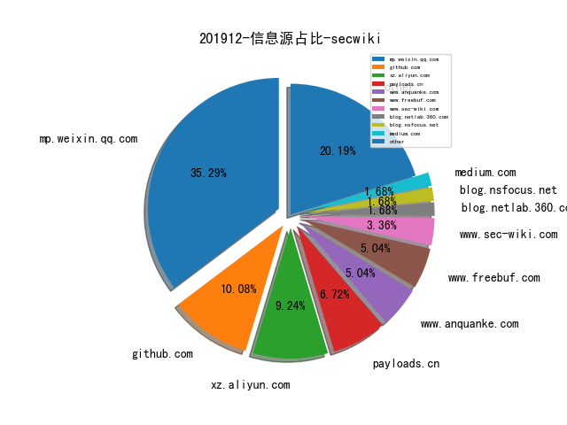
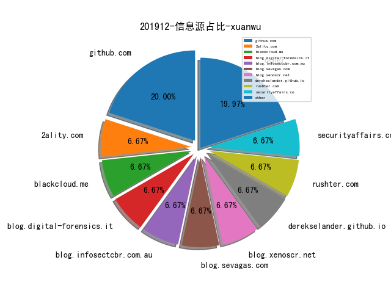
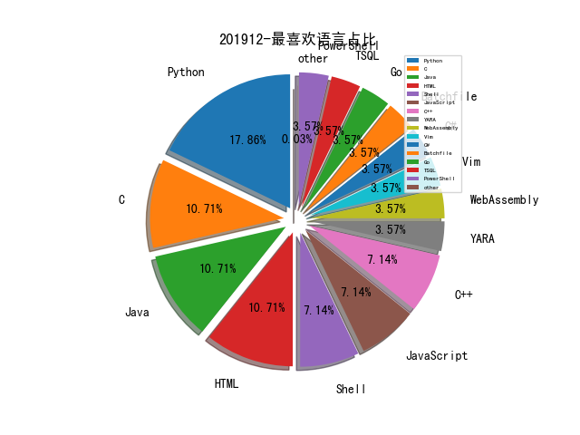

# [数据年报](README_YEAR.md)
# [数据月报-11月](README_11.md)
# [数据月报-10月](README_10.md)
# [数据月报-9月](README_9.md)
# [数据月报-8月](README_8.md)
# [数据月报-7月](README_7.md)
# [数据月报-6月](README_6.md)
# [数据月报-5月](README_5.md)
# [数据月报-4月](README_4.md)
# [数据月报-3月](README_3.md)
# 201912 信息源与信息类型占比

# 微信公众号 推荐
| nickname_english | weixin_no | title | url| 
| --- | --- | --- | ---| 
| 天地和兴 | bjtdhxkj | 针对ICS的网络攻击20强——谈天说地Part2 | https://mp.weixin.qq.com/s/TS1m4XoTI3f36ZY8vtLkwg | 2| 
| 雷神众测 | thorsrc | 论⾼级攻防团队建设⽅法论之思想的重要性（上） | https://mp.weixin.qq.com/s/nFvGQqeFvSYaEFksbi8FLw | 1| 
| DJ的札记 | DJ_notes | 下一座圣杯 - 2019 | https://mp.weixin.qq.com/s/6Kli-u6LEInoliTVQgdrFQ | 1| 
| OWASP | OWASP_CHINA | 2019年度OWASP中国项目总结 | https://mp.weixin.qq.com/s/hcdA7R36RsSV40TnIu2fJg | 1| 
| 天融信阿尔法实验室 |  | ATT&CK之防御逃逸（二） | https://mp.weixin.qq.com/s/9IeSIFofiT58X8iu1BqW0Q | 2| 
| 轩辕实验室 |  | 基于卷积神经网络的入侵检测进行检测Dos攻击 | https://mp.weixin.qq.com/s/yRQwHVPuYHM67yAo15hPOw | 1| 
| 阿里安全响应中心 | alisrc | 【走心分享】白帽成长建议 | https://mp.weixin.qq.com/s/ZXRI6KUtu6IwCYrjuy_3Tg | 1| 
| 继之宫 |  | 关于安全运营中心的几个问题 | https://mp.weixin.qq.com/s/w_kfBpkXU7WdfkwSl-KSnA | 1| 
| Hacking就是好玩 |  | 对乌云漏洞库payload的整理以及Burp辅助插件 | https://mp.weixin.qq.com/s/9RHVsw-HtAfo1UuPAqXZEw | 1| 
| 嘶吼专业版 | Pro4hou | 直击北向峰会现场|“避危乘势，经略变局” | https://mp.weixin.qq.com/s/lRAyLyBJtquMrMTmTHnYUQ | 1| 
| 七夜安全博客 | qiye_safe | 反弹shell-逃逸基于execve的命令监控(上) | https://mp.weixin.qq.com/s?__biz=MzIwODIxMjc4MQ==&mid=2651004359&idx=1&sn=4b2c6e06df652af95876e9b858e9711b&chksm=8cf13b85bb86b293f5b73d0a680dcbbd2e584cac216d94d3f84d0c0a53c3b74318d83518a6ee&token=1889883351&lang=zh_CN#rd | 1| 
| 学术plus | caeit-e | 人工智能在国防领域的七大应用 | https://mp.weixin.qq.com/s/v4NDZFo81kJKDlrROI5FqA | 1| 
| 湛卢工作室 | xuehao_studio | 道德骇客CEH之入门介绍 | https://mp.weixin.qq.com/s/s6oL7p1hY_VotJMjtB7fVg | 1| 
| 青藤云安全资讯 | qingtengyun | ATT&CK框架：攻击者最常用的TOP7攻击技术及其检测策略 | https://mp.weixin.qq.com/s/02AcOPzTaA7dChHqye2wEg | 1| 
| qz安全情报分析 | lookvul | 浅谈无文件攻击 | https://mp.weixin.qq.com/s/9mWqwPF6KAwbMlZSE4rRBw | 2| 
| 信息安全与通信保密杂志社 | cismag2013 | 开源软件的网络安全问题 | https://mp.weixin.qq.com/s/TCb4kLH6N3JlCnyo6x2L1Q | 1| 
| 国际安全智库 | guoji-anquanzhiku | “震网”十年谜底终浮水面, 伊朗核计划流产源于内鬼“间谍行动” | https://mp.weixin.qq.com/s/ORW8qWCpgQFJh8-bsaIg3w | 1| 
| 奇安信威胁情报中心 |  | 为什么ATT&CK对APT关联归属分析用处不大 | https://mp.weixin.qq.com/s/Cb7tROj0BXSOxnqyjftlRw | 1| 
| 浅黑科技 | qianheikeji | CTF：一部黑客心灵史 | https://mp.weixin.qq.com/s/wEqBaZmO8FwOyGrcWDNgYQ | 1| 
| 腾讯安全智能 | TX_Security_AI | 基于图挖掘的安全事件分析 | https://mp.weixin.qq.com/s/ARfMqrUxiPKmbMcV_yaluw | 1| 
| 行业研究报告 | report88 | 2018-2019年网络安全行业深度报告 | https://mp.weixin.qq.com/s/z-LN2AlMezEmJVekbDndcw | 1| 
| 编程技术宇宙 | ProgramUniverse | 我是一个流氓软件线程 | https://mp.weixin.qq.com/s/-ggUa3aWkjjHjr9VwQL9TQ | 2| 
| 贝塔安全实验室 | BetaSecLab | 绕过CDN查找真实IP方法总结 | https://mp.weixin.qq.com/s/_qHGB3l58KU01tBOki5uag | 1| 
| 穿过丛林 |  | DARPA HIVE计划及其最新进展 | https://mp.weixin.qq.com/s/_lzrhylYo9Z941ChqIgJIQ | 1| 
| 盘古实验室 | PanguLab | 从研究者视角看漏洞研究之2010年代 | https://mp.weixin.qq.com/s/UBZv0pd7Nr-o-NMxjV53RQ | 1| 
| Docker | dockerone | Kubernetes 下零信任安全架构分析 | https://mp.weixin.qq.com/s/WybnFRHiGy1joLFyQyba0g | 1| 
| FreeBuf | freebuf | 2010年以来重大网络安全事件盘点 | https://mp.weixin.qq.com/s/kv64D0fqBwJ3J3pkDFqI3A | 2| 
| TideSec安全团队 | TideSec | 一文解密所有WebLogic密文 | https://mp.weixin.qq.com/s/HY0X3koYVEIotYIQZi680w | 6| 
| heysec | bloodzer007 | 利用SSH隧道构建多级tunnel | https://mp.weixin.qq.com/s/jg_7bKqwfeYh1ErTtljKYw | 4| 
| 云众可信 | yunzhongkexin | 原创干货 | 【工具分享】AssetScan内网脆弱面分析工具 | https://mp.weixin.qq.com/s/dCP3PsjZYDY0f2wJX4dC4w | 1| 
| 时间之外沉浮事 | tasnrh | 靶场发展态势⑤美国防部企业级赛博靶场环境（DECRE） | https://mp.weixin.qq.com/s/mAeld9GbLN9Ps-M5wgelfw | 4| 
| 牵着蜗牛遛弯儿 | lau_cyun | 浅谈工控CTF中网络数据分析的思路 | https://mp.weixin.qq.com/s/bR1t53-YHSKWmFawT5t0Kg | 1| 
| 维他命安全 | VitaminSecurity | 卡巴斯基2019年Q3垃圾邮件与钓鱼攻击报告 | https://mp.weixin.qq.com/s/JE5J6misSPhzCjyKB0MxCA | 2| 
| 绿盟科技研究通讯 | nsfocus_research | 五年之后的回顾--磊科路由器后门利用情况分析 | https://mp.weixin.qq.com/s/6djU9_yl8px9oimxCRQd5A | 4| 
| 腾讯御见威胁情报中心 |  | “海莲花”(OceanLotus)组织2019年针对中国大陆的攻击活动汇总 | https://mp.weixin.qq.com/s/OA09fndsHfpLVxeo7DnjYg | 1| 
| 赵武的自留地 |  | 网络空间测绘的生与死（三） | https://mp.weixin.qq.com/s/jffEOTF3n028USQujIzmmw | 1| 

# 组织github账号 推荐
| github_id | title | url | org_url | org_profile | org_geo | org_repositories | org_people | org_projects | repo_lang | repo_star | repo_forks| 
| --- | --- | --- | --- | --- | --- | --- | --- | --- | --- | --- | ---| 

# 私人github账号 推荐
| github_id | title | url | p_url | p_profile | p_loc | p_company | p_repositories | p_projects | p_stars | p_followers | p_following | repo_lang | repo_star | repo_forks | 
| --- | --- | --- | --- | --- | --- | --- | --- | --- | --- | --- | --- | --- | --- | ---| 
| k8gege | Ladon: 大型内网渗透扫描器&Cobalt Strike | https://github.com/k8gege/Ladon | https://k8gege.org |  | USA | FBI | 24 | 0 | 17 | 1400 | 1 | C#,Python,PowerShell | 2300 | 1100 | 1| 
| PaulSec | Shodan.io Android版官方应用程序 | https://github.com/PaulSec/Shodan.io-mobile-app/issues | https://paulsec.github.io/ | I cant promise anything but Ill do my best. | France | None | 93 | 0 | 503 | 811 | 26 | Python | 2800 | 361 | 1| 
| maddiestone | Maddie Stone 在 Jailbreak Security Summit 会议关于 Whats App 0Day 漏洞分析的 PPT | https://github.com/maddiestone/ConPresentations/blob/master/Jailbreak2019.WhatsUpWithWhatsApp.pdf | http://twitter.com/maddiestone |  | None | None | 4 | 0 | 2 | 242 | 1 | Python | 524 | 105 | 1| 
| HiddenStrawberry | 中国爬虫违法违规案例汇总 | https://github.com/HiddenStrawberry/Crawler_Illegal_Cases_In_China | None | 资深前爬虫行业从业者 合作微信 hiddenstrawberry（备注Github） | Beijing/Shenyang/Tianjin | YiduCloud | 22 | 0 | 13 | 116 | 5 | Python,HTML | 914 | 151 | 1| 
| MatthewPierson | 利用 OTA Blobs 实现 iOS 降级的工具 | https://github.com/MatthewPierson/Vieux | https://twitter.com/mosk_i | I downgrade iPhones =) | None | None | 10 | 0 | 0 | 95 | 1 | Python,Shell,Rich | 95 | 27 | 1| 
| heibaiying | BigData-Notes: 大数据入门指南 | https://github.com/heibaiying/BigData-Notes | https://blog.csdn.net/m0_37809146 | 博客：https://blog.csdn.net/m0_37809146 | shanghai | None | 2 | 0 | 20 | 80 | 0 | Java | 2900 | 755 | 1| 
| RedDrip7 | RedDrip7团队收集恶意软件家族样本，帮助安全社区对抗恶意软件和针对性攻击。 | https://github.com/RedDrip7/APT_Digital_Weapon | https://ti.qianxin.com/blog/ | Technical Twitter of QiAnXin Technology, leading Chinese security vendor. It is operated by RedDrip Team which focuses on malware, APT and threat intelligence. | China | Qianxin | 3 | 0 | 0 | 74 | 0 |  | 122 | 23 | 1| 
| Cherishao | APT-Sample Files | https://github.com/Cherishao/APT-Sample | https://cherishao.github.io/ | Malware researcher && APT Follow | Analyze threats,Blue/Red Team methodology, Networks, Malware Analysis,Reverse Engineering🕵️‍♂️ BTC:17iDHpUqe9XGpGJ2cMBUVciq | ChengDu | None | 68 | 1 | 346 | 29 | 31 | Python,HTML | 47 | 24 | 1| 
| echowei | DeepTraffic: Deep Learning models for network traffic clas... | https://github.com/echowei/DeepTraffic | None |  | Beijing | None | 1 | 0 | 1 | 29 | 0 | Python | 153 | 117 | 1| 
| shadow-horse | CVE-2019-17571/Apache Log4j 1.2.X 存在反序列化远程代码执行漏洞 | https://github.com/shadow-horse/CVE-2019-17571 | None | Penetration, Vulnerability Research, SDL, STRIDE | None | None | 23 | 0 | 61 | 25 | 7 | Python,JavaScript,Java,HTML,CSS | 5 | 1 | 1| 
| daikerSec | Windows 内网协议学习 | https://github.com/daikerSec/windows_protocol/blob/master/SUMMARY.md | None |  | None | None | 4 | 0 | 16 | 9 | 4 | Go,HTML,CSS | 9 | 2 | 1| 
| OYE93 | Chinese-NLP-Corpus: Collections of Chinese NLP corpus | https://github.com/OYE93/Chinese-NLP-Corpus | https://oyeblog.com/ |  | None | None | 16 | 0 | 2 | 8 | 0 | Python,HTML,Dockerfile,CSS | 110 | 18 | 1| 
| bd249ce4 | QBAnalyzer: automates extracting artifacts and binaries | https://github.com/bd249ce4/QBAnalyzer | None |  | None | None | 2 | 0 | 0 | 1 | 0 | YARA,HTML | 3 | 1 | 1| 
| FSecureLABS | FSecure Labs 开源了一款用于 AWS 云上资源关联关系可视化的工具 | https://github.com/FSecureLABS/awspx | None | None | None | None | 0 | 0 | 0 | 0 | 0 | C,Shell,Java,Python,JavaScript,C++,C#,PowerShell | 2000 | 549 | 1| 
| NoneAge | 交易所安全测试系列指南文档 | https://github.com/NoneAge/BlockchainSecurityTutorial | None | None | None | None | 0 | 0 | 0 | 0 | 0 | Python,WebAssembly | 0 | 0 | 1| 
| apachecn | 面向机器学习的特征工程 | https://github.com/apachecn/fe4ml-zh | None | None | None | None | 0 | 0 | 0 | 0 | 0 | Shell,Jupyter,Scala,Python,JavaScript,HTML,PHP,CSS | 22200 | 7800 | 1| 
| baidu-security | openrasp-iast: IAST 灰盒扫描工具 | https://github.com/baidu-security/openrasp-iast | None | None | None | None | 0 | 0 | 0 | 0 | 0 | Java,Python,JavaScript,C++,HTML,Go,TSQL | 0 | 0 | 1| 
| chineseocr | darknet-ocr: darknet text detect and darknet cnn ocr | https://github.com/chineseocr/darknet-ocr | None | None | None | None | 0 | 0 | 0 | 0 | 0 | Python,C,C++ | 0 | 0 | 1| 
| google | Google 在 sanitizers Repo 介绍了一些存在条件竞争问题的代码模型 | https://github.com/google/sanitizers/wiki/ThreadSanitizerPopularDataRaces | None | None | None | None | 0 | 0 | 0 | 0 | 0 | Groovy,C,Java,HTML,Python,Kotlin,JavaScript,C++,Haskell,Go,Jupyter,Rust,Lasso | 0 | 0 | 1| 
| immunityinc | Immunity 开源了一个用于进程调试和 Trace 的库 - libptrace | https://github.com/immunityinc/libptrace | None | None | None | None | 0 | 0 | 0 | 0 | 0 | C | 0 | 0 | 1| 
| libusb | libusb - 跨平台的 USB 设备交互库 | https://github.com/libusb/libusb | None | None | None | None | 0 | 0 | 0 | 0 | 0 | C,HTML | 0 | 0 | 1| 
| openworldoperations | 一种高级的网络钓鱼技术，可让攻击者设置有效的域和SSL证书，请注意防范 | https://github.com/openworldoperations/FISHY | None | None | None | None | 0 | 0 | 0 | 0 | 0 | Python,HTML | 15 | 4 | 1| 
| pdbpp | pdb++ - Python debugger（pdb）的增强版 | https://github.com/pdbpp/pdbpp | None | None | None | None | 0 | 0 | 0 | 0 | 0 | Python | 0 | 0 | 1| 
| rackerlabs | scantron - 分布式 Nmap/Masscan 网络扫描框架 | https://github.com/rackerlabs/scantron | None | None | None | None | 0 | 0 | 0 | 0 | 0 | Groovy,TypeScript,Java,Python,JavaScript,Shell,HTML,HCL,Ruby,CSS | 0 | 0 | 1| 
| secdevops-cuse | CyberRange: The Open-Source AWS Cyber Range | https://github.com/secdevops-cuse/CyberRange | None | None | None | None | 0 | 0 | 0 | 0 | 0 | Python,C,Dockerfile,CSS,HCL | 0 | 0 | 1| 
| seemoo-lab | Nexmon - 一款支持 Broadcom/Cypress WiFi 芯片的固件 Patch 框架，基于框架可以编写自己的补丁，启用监听模式 | https://github.com/seemoo-lab/nexmon | None | None | None | None | 0 | 0 | 0 | 0 | 0 | C,Shell,Jupyter,Python,JavaScript,C++,TeX,Objective-C,HTML,MATLAB,Java | 3300 | 274 | 1| 
| sslab-gatech | QSYM - 为混合 Fuzz 定制的符号执行引擎 | https://github.com/sslab-gatech/qsym | None | None | None | None | 0 | 0 | 0 | 0 | 0 | C,Filebench,Python,Makefile,C++,HTML,HCL | 0 | 0 | 1| 
| ucsb-seclab | KARONTE: Detecting Insecure Multi-binary Interactions in E... | https://github.com/ucsb-seclab/karonte?from=timeline | None | None | None | None | 0 | 0 | 0 | 0 | 0 | C,Java,Python,JavaScript,C++,Dockerfile | 0 | 0 | 1| 
| uds-se | 关于 Fuzz 的书《Generating Software Tests》的原始文件 | https://github.com/uds-se/fuzzingbook | None | None | None | None | 0 | 0 | 0 | 0 | 0 | C,LLVM,Java,Python,Kotlin,JavaScript,Shell,Objective-C,HTML,Jupyter,R,Dockerfile | 0 | 0 | 1| 
| vim | 8.1.2136 补丁：释放window内存与fuzzer的 autocmd命令一起使用 | https://github.com/vim/vim/commit/ec66c41d84e574baf8009dbc0bd088d2bc5b2421 | None | None | None | None | 0 | 0 | 0 | 0 | 0 | Shell,C,Batchfile,Vim | 0 | 0 | 1| 

# 日更新程序
`python update_daily.py`