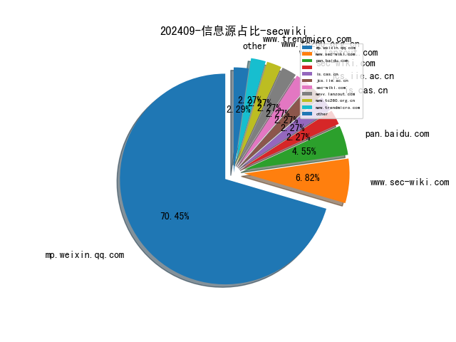
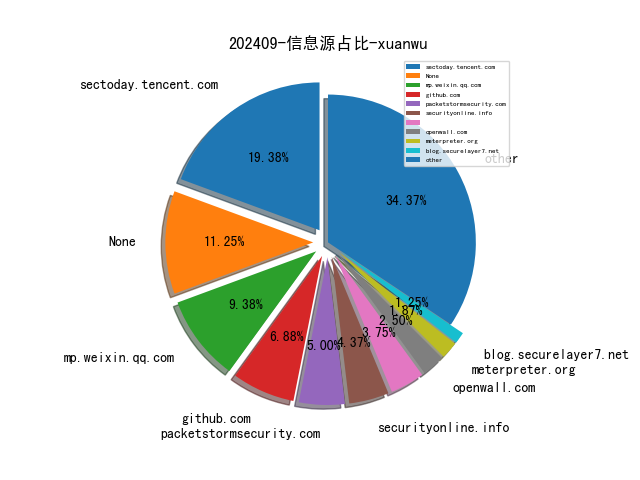
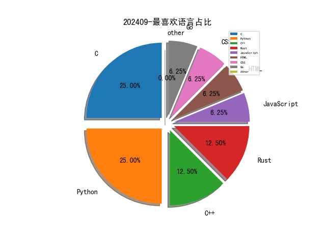

# [数据--所有](README_20.md)
# [数据--年度](README_2024.md)
# 202409 信息源与信息类型占比

# 网络安全书籍 推荐
| date_added | language | title | author | link | size| 
| --- | --- | --- | --- | --- | ---| 
| 2024-09-30 07:21:41 | English | beginners guide to streamlit with python | unknown | https://it-ebooks.info/book/1686051862-beginners_guide_to_streamlit_with_python/ | unknown| 
| 2024-09-29 13:56:40 | English | Unlocking Data with Generative AI and RAG | unknown | https://www.wowebook.org/unlocking-data-with-generative-ai-and-rag/ | unknown| 
| 2024-09-29 12:44:28 | English | Resilient Cybersecurity | unknown | https://www.wowebook.org/resilient-cybersecurity/ | unknown| 
| 2024-09-29 11:37:04 | English | Python Data Cleaning and Preparation Best Practices | unknown | https://www.wowebook.org/python-data-cleaning-and-preparation-best-practices/ | unknown| 
| 2024-09-29 18:32:24 | English | Beyond The Little Blue Box: The Biographical Adventure of John T Draper (Aka Captain Crunch). Notorious phone Phreak, Legendary Internet Pioneer and Ardent Privacy Advocate | Mr John T Draper, Mr C Wilson Fraser | http://libgen.st/book/index.php?md5=F07FEC00DAB25DF4A6A124F3C155AC21 | 888 kB [EPUB]| 
| 2024-09-28 13:27:22 | English | Practical cryptography algorithms and implementations using C++ | Saiful Azad, Al-Sakib Khan Pathan, edited by Saiful Azad, Al-Sakib Khan Pathan, Saiful Islam Azad | http://libgen.st/book/index.php?md5=AA9B601F4741ED778D83BE336098B109 | 54 MB [PDF]| 
| 2024-09-28 09:46:28 | English | Critical Security Controls for Effective Cyber Defense: A Comprehensive Guide to CIS 18 Controls | Jason Edwards | http://libgen.st/book/index.php?md5=DE61E881B395F69E74F7A62B4928C003 | 4 MB [EPUB]| 
| 2024-09-28 09:41:16 | English | Critical Security Controls for Effective Cyber Defense | Jason Edwards | http://libgen.st/book/index.php?md5=6DDA11495F5DD49301EC00F630B6873A | 3 MB [PDF]| 
| 2024-09-28 09:39:17 | English | The Negotiation Playbook : Strategies That Work and Results That Last | Glin Bayley | http://libgen.st/book/index.php?md5=70A8B8B5A267B3F57C5BE9459911109E | 797 kB [EPUB]| 
| 2024-09-27 21:51:13 | English | Data Engineering for Machine Learning Pipelines: From Python Libraries to ML Pipelines and Cloud Platforms | Pavan Kumar Narayanan | http://libgen.st/book/index.php?md5=9E2E6977D36052F3BB4918E99037EA94 | 33 MB [PDF]| 
| 2024-09-27 21:49:38 | English | Numerical Python: Scientific Computing and Data Science Applications with Numpy, SciPy and Matplotlib | Robert Johansson | http://libgen.st/book/index.php?md5=F180FD61A0AAC737C24F74401D8B5EE3 | 24 MB [PDF]| 
| 2024-09-27 21:11:41 | English | Open-Source Security Operations Center (SOC) : A Complete Guide to Establishing, Managing, and Maintaining a Modern SOC | Alfred Basta; Nadine Basta; Waqar Anwar; Mohammad Ilyas Essar | http://libgen.st/book/index.php?md5=1651022C934D1AB51B092052A5F0C498 | 2 MB [EPUB]| 
| 2024-09-27 06:39:40 | English | Data Visualization with Microsoft Power BI | unknown | https://www.wowebook.org/data-visualization-with-microsoft-power-bi/ | unknown| 
| 2024-09-25 12:12:17 | English | Cybersecurity Essentials: Practical Tools for Today’s Digital Defenders | unknown | https://www.wowebook.org/cybersecurity-essentials-practical-tools-for-todays-digital-defenders/ | unknown| 
| 2024-09-24 11:31:59 | English | CompTIA Tech+ Study Guide: Exam FC0-U71 (Sybex Study Guide) | Quentin Docter | http://libgen.rs/book/index.php?md5=04321DDFCA5EEA6409A8494100BA7781 | 30 MB [PDF]| 
| 2024-09-24 11:00:16 | English | (ICSA Book Series in Statistics) Modeling Binary Correlated Responses: Using SAS, SPSS, R and STATA | Jeffrey R. Wilson, Kent A. Lorenz, Lori P. Selby | http://libgen.rs/book/index.php?md5=94673668976475989A8C096AF293B0E8 | 14 MB [PDF]| 
| 2024-09-24 13:53:32 | English | Supremacy : AI, ChatGPT, and the Race That Will Change the World | Parmy Olson | http://libgen.rs/book/index.php?md5=A5D75F598897AD8DCEFF6D69DF67E787 | 3 MB [EPUB]| 
| 2024-09-24 13:35:25 | English | Research Software Engineering with Python: Building software that makes research possible | Damien Irving | http://libgen.rs/book/index.php?md5=5B8F00288139DDD88DFD65006EFD5072 | 35 MB [EPUB]| 
| 2024-09-24 13:34:10 | English | (Texts in Statistical Science) Bayesian Modeling and Computation in Python | Osvaldo A. Martin | http://libgen.rs/book/index.php?md5=E1649CC488F974F74FC5977BCD483BF7 | 31 MB [EPUB]| 
| 2024-09-24 13:32:54 | English | Quantitative Finance with Python: A Practical Guide to Investment Management, Trading, and Financial Engineering | Chris Kelliher | http://libgen.rs/book/index.php?md5=2169EBD819C7229C448FB4DC626727B4 | 12 MB [EPUB]| 
| 2024-09-23 12:02:54 | English | Wolves: A Falcon Field Guide (Falcon Field Guide Series) | Jack Ballard | http://libgen.rs/book/index.php?md5=3C749C3FF8259801D9351CF8EB2C9436 | 266 MB [PDF]| 
| 2024-09-22 12:49:15 | English | I Used to Like You Until... : (How Binary Thinking Divides Us) | Kat Timpf | http://libgen.rs/book/index.php?md5=9346794861313FC2B82EEC62AB2435E1 | 4 MB [EPUB]| 
| 2024-09-22 22:39:35 | English | Mastering ChatGPT and Google Colab for Machine Learning: Automate AI Workflows and Fast-Track Your Machine Learning Tasks with the Power of ChatGPT, Google Colab, and Python | Rosario Moscato | http://libgen.rs/book/index.php?md5=223AC8C02D4B519B2B906A1C397F303C | 136 MB [EPUB]| 
| 2024-09-22 22:33:24 | English | Cybersecurity Essentials: Practical Tools for Todays Digital Defenders | Kodi A. Cochran | http://libgen.rs/book/index.php?md5=0ACFAD24DE7C454BB9AC1749E704AAF0 | 3 MB [PDF]| 
| 2024-09-21 23:38:30 | English | (New French Thought) A World beyond Politics?: A Defense of the Nation-State | Pierre Manent | http://libgen.rs/book/index.php?md5=A6ECC3E62E515AE6FC8C3DFD74359D68 | 5 MB [PDF]| 
| 2024-09-21 22:39:30 | English | Cybersecurity Essentials : Practical Tools for Today’s Digital Defenders | Kodi A. Cochran | http://libgen.rs/book/index.php?md5=C9181623B5A726C29133D5AE9F364445 | 506 kB [EPUB]| 
| 2024-09-21 22:28:18 | English | Python Programming in Context | Julie Anderson, Jon Anderson | http://libgen.rs/book/index.php?md5=BF4974C80166FF34782F44220570E219 | 53 MB [EPUB]| 
| 2024-09-21 22:21:47 | English | (Expert Insight) Modern Time Series Forecasting with Python (Early Release) | Manu Joseph, Jeffrey Tackes | http://libgen.rs/book/index.php?md5=A9F16A3E25EE0F372926B893C97B9AEF | 6 MB [EPUB]| 
| 2024-09-21 21:07:12 | English | Mastering DevOps on Microsoft Power Platform | Uroš Kastelic, József Zoltán Vadkerti | http://libgen.rs/book/index.php?md5=154F7220F962261DDE51BC96A40A51A3 | 19 MB [EPUB]| 
| 2024-09-21 21:04:42 | English | Mastering Microsoft Defender for Office 365: Streamline Office 365 security with expert tips for setup, automation, and advanced threat hunting | Samuel Soto | http://libgen.rs/book/index.php?md5=0D7253E9E9697F01AAC9C35C9B77F823 | 19 MB [EPUB]| 
| 2024-09-20 08:42:40 | English | A Beginners Guide to Python 3 Programming (Undergraduate Topics in Computer Science) | John Hunt | http://libgen.rs/book/index.php?md5=D802DC89C34B23D7DAFAC71B456CC02F | 26 MB [EPUB]| 
| 2024-09-20 07:23:57 | English | Cryptography Algorithms, Second Edition | unknown | https://www.wowebook.org/cryptography-algorithms-second-edition/ | unknown| 
| 2024-09-20 08:56:07 | English | Malware Development for Ethical Hackers | unknown | https://www.wowebook.org/malware-development-for-ethical-hackers/ | unknown| 
| 2024-09-20 08:42:10 | English | Security Monitoring with Wazuh | unknown | https://www.wowebook.org/security-monitoring-with-wazuh/ | unknown| 
| 2024-09-19 07:03:59 | English | Data Management Strategy at Microsoft | unknown | https://www.wowebook.org/data-management-strategy-at-microsoft/ | unknown| 
| 2024-09-19 01:40:10 | English | Never Search Alone: The Job Seeker’s Playbook | Phyl Terry | http://libgen.rs/book/index.php?md5=87741DBE6BEC87EFB9A9710A3521E072 | 756 kB [EPUB]| 
| 2024-09-19 00:34:02 | English | Continuous Testing, Quality, Security, and Feedback: Essential strategies and secure practices for DevOps, DevSecOps, and SRE transformations | Marc Hornbeek | http://libgen.rs/book/index.php?md5=89D482F5295E48D67A7C7712F4C390D4 | 15 MB [EPUB]| 
| 2024-09-19 20:40:00 | English | The Quick Guide to Prompt Engineering: Generative AI Tips and Tricks for ChatGPT, Bard, Dall-E, and Midjourney | Ian Khan | http://libgen.rs/book/index.php?md5=DC21015D514DE29DC143D47D9E0791CA | 567 kB [EPUB]| 
| 2024-09-19 20:39:58 | English | The Quick Guide to Prompt Engineering: Generative AI Tips and Tricks for ChatGPT, Bard, Dall-E, and Midjourney | Ian Khan | http://libgen.rs/book/index.php?md5=FCD574FEB7CF6152D275F9CBC6F1A1AA | 9 MB [PDF]| 
| 2024-09-19 20:37:29 | English | Generative AI Application Integration Patterns | Juan Pablo Bustos; Luis Lopez Soria | http://libgen.rs/book/index.php?md5=81A893DEA72F891DC95A3737DB4644E8 | 5 MB [EPUB]| 
| 2024-09-19 20:21:43 | English | Exam Ref AZ-500 Microsoft Azure Security Technologies | Yuri Diogenes, Orin Thomas | http://libgen.rs/book/index.php?md5=E7E71A80BAA5A2CB5FC7266B0E7443CF | 34 MB [EPUB]| 
| 2024-09-19 20:37:32 | English | Generative AI Application Integration Patterns | Juan Pablo Bustos; Luis Lopez Soria | http://libgen.rs/book/index.php?md5=2906C48F05B1F14DB552C885A019AD36 | 10 MB [RAR]| 
| 2024-09-18 13:59:58 | English | (Chapman & Hall/CRC The Python Series) Introduction to Quantitative Social Science with Python | Weiqi Zhang, Dmitry Zinoviev | http://libgen.rs/book/index.php?md5=62CA7E93660107DB2D06CD36C9267730 | 9 MB [PDF]| 
| 2024-09-18 13:59:42 | English | (Chapman & Hall/CRC The Python Series) Introduction to Quantitative Social Science with Python | Weiqi Zhang, Dmitry Zinoviev | http://libgen.rs/book/index.php?md5=CFF38192086B599C78340754F5C3A8B2 | 4 MB [EPUB]| 
| 2024-09-18 19:44:08 | English | ChatGPT For Dummies (2 Books in 1): Chatgpt Prompts & Chatgpt for Beginners - Over 300 Prompts and Learning Examples | Oliver Ruiz | http://libgen.rs/book/index.php?md5=7BE62D3DC4E4E496DA20BA85F24396EB | 2 MB [PDF]| 
| 2024-09-18 19:44:04 | English | ChatGPT For Dummies (2 Books in 1): Chatgpt Prompts & Chatgpt for Beginners - Over 300 Prompts and Learning Examples | Oliver Ruiz | http://libgen.rs/book/index.php?md5=A8624C3112C6DB947B4D10CFE36CEACD | 1 MB [EPUB]| 
| 2024-09-17 11:48:31 | English | Idiomatic Rust: Code like a Rustacean By Brenden Matthews (Final Release) | Brenden Matthews | http://libgen.rs/book/index.php?md5=C8C5F4C506FCF571017C793E94DA2619 | 2 MB [EPUB]| 
| 2024-09-17 08:19:17 | English | Mastering Microsoft Defender for Office 365 | unknown | https://www.wowebook.org/mastering-microsoft-defender-for-office-365/ | unknown| 
| 2024-09-16 16:41:28 | English | ChatGPT and AI for Accountants | unknown | https://www.wowebook.org/chatgpt-and-ai-for-accountants/ | unknown| 
| 2024-09-16 07:26:27 | English | Python Natural Language Processing Cookbook, Second Edition | unknown | https://www.wowebook.org/python-natural-language-processing-cookbook-second-edition/ | unknown| 
| 2024-09-15 19:56:15 | English | Falcon Feather and Valkyrie Sword: Feminine Shamanism, Witchcraft and Magick | Conway D.J. | http://libgen.rs/book/index.php?md5=909CEE416449EF43E377F85DA93FCC58 | 3 MB [PDF]| 
| 2024-09-14 09:15:08 | English | Supply Chain Finance: Mechanisms, Risk Analytics, and Technology | Gangshu Cai | http://libgen.rs/book/index.php?md5=E085C491817E592473840285BD5CDFB5 | 19 MB [PDF]| 
| 2024-09-14 09:15:05 | English | Supply Chain Finance: Mechanisms, Risk Analytics, and Technology | Gangshu Cai | http://libgen.rs/book/index.php?md5=C62B2D64FE7CCBD41007015550260749 | 38 MB [EPUB]| 
| 2024-09-14 09:09:59 | English | From Concept to Profit: Bold Moves, Smart Strategies, and Proven Tactics, Secrets and Insights to Kick Start Your New Business and Soar Beyond the Competition | Lloyd Morfin | http://libgen.rs/book/index.php?md5=F89AAA8193DC302046A8B909813D622E | 1 MB [PDF]| 
| 2024-09-14 09:02:11 | English | Secure Health: A Guide to Cybersecurity for Healthcare Managers | Mohamed Hammad (editor), Gauhar Ali (editor), Mohammed A. El-Affendi (editor), Yassine Maleh (editor), Ahmed A. Abd El-Latif (editor) | http://libgen.rs/book/index.php?md5=635FA33990E6D5FF2DB0468925CEA5D5 | 9 MB [PDF]| 
| 2024-09-14 09:02:09 | English | Secure Health: A Guide to Cybersecurity for Healthcare Managers | Mohamed Hammad (editor), Gauhar Ali (editor), Mohammed A. El-Affendi (editor), Yassine Maleh (editor), Ahmed A. Abd El-Latif (editor) | http://libgen.rs/book/index.php?md5=C357DEFD7C24678F567386D22FD885C4 | 7 MB [EPUB]| 
| 2024-09-14 21:16:15 | English | Engage, Excel, and Elevate with Microsoft Viva Engage: Transform Your Organization Through Communities and Conversations | Charles Waghmare | http://libgen.rs/book/index.php?md5=01354F394F9F02A431B15460C4F1E6BC | 2 MB [EPUB]| 
| 2024-09-14 21:16:12 | English | Engage, Excel, and Elevate with Microsoft Viva Engage: Transform Your Organization Through Communities and Conversations | Charles Waghmare | http://libgen.rs/book/index.php?md5=2515FA9AB021621E15C8658229710C91 | 4 MB [PDF]| 
| 2024-09-14 21:02:25 | English | CompTIA Tech+ CertMike: Prepare. Practice. Pass the Test! Get Certified!: Exam FC0-U71 (CertMike Get Certified) | Mike Chapple | http://libgen.rs/book/index.php?md5=7BC7EAD65F3C694B6FEC4A188058AAB1 | 60 MB [RAR]| 
| 2024-09-14 20:57:07 | English | Kickstart Blockchain and Cryptography Fundamentals: Navigate the Intricacies of Modern Blockchain, Cryptography, Smart Contracts, and Hyperledger for ... Real-World Transformations (English Edition) | Prof. Veerendra Kumar Jain | http://libgen.rs/book/index.php?md5=C7A9F4861EE624A639FDE6AF9BE87F2E | 44 MB [RAR]| 
| 2024-09-14 19:11:02 | English | Hack the Cybersecurity Interview: Navigate Cybersecurity Interviews with Confidence, from Entry-level to Expert roles | Christophe Foulon, Ken Underhill, Tia Hopkins | http://libgen.rs/book/index.php?md5=97B70838E93594FD3AA0F715F88471B1 | 16 MB [RAR]| 
| 2024-09-13 22:52:43 | English | Tech Leadership Playbook: Building and Sustaining High-Impact Technology Teams | Alexsandro Souza | http://libgen.rs/book/index.php?md5=482841D406AF5358B3A378CED0BF4545 | 4 MB [PDF]| 
| 2024-09-13 19:48:56 | English | IT Audit Field Manual: Strengthen your cyber defense through proactive IT auditing | Lewis Heuermann | http://libgen.rs/book/index.php?md5=8FDEC5AAC4655735C883765F859F00F9 | 5 MB [EPUB]| 
| 2024-09-13 06:30:44 | English | The Developer’s Playbook for Large Language Model Security | unknown | https://www.wowebook.org/the-developers-playbook-for-large-language-model-security/ | unknown| 
| 2024-09-13 06:05:02 | English | LLMs and Generative AI for Healthcare | unknown | https://www.wowebook.org/llms-and-generative-ai-for-healthcare/ | unknown| 
| 2024-09-12 17:40:18 | English | Raspberry Pi IoT In Python Using GPIO Zero, 2nd Edition | Harry Fairhead, Mike James | http://libgen.rs/book/index.php?md5=39C0A42D027B4A8B43B07050C297F3FF | 25 MB [PDF]| 
| 2024-09-12 20:03:28 | English | Programming with GitHub Copilot: Write Better Code--Faster! | Kurt Dowswell | http://libgen.rs/book/index.php?md5=767B5E4F3636195C26B79C4825BFD1ED | 24 MB [PDF]| 
| 2024-09-12 19:43:03 | English | Build a Website with ChatGPT: No coding experience necessary | Paul McFedries | http://libgen.rs/book/index.php?md5=34E27654C547FC433E4348606C2FA8DA | 43 MB [EPUB]| 
| 2024-09-12 19:18:18 | English | Better APIs: Quality, Stability, Observability | Mikael Vesavuori | http://libgen.rs/book/index.php?md5=255C6B2C6E78F21F173E9CE82FFB78BB | 4 MB [PDF]| 
| 2024-09-12 19:18:17 | English | Better APIs: Quality, Stability, Observability | Mikael Vesavuori | http://libgen.rs/book/index.php?md5=ECFF1C92C65834889F1249B80A2B48E6 | 4 MB [EPUB]| 
| 2024-09-12 09:11:41 | English | Continuous Testing, Quality, Security, and Feedback | unknown | https://www.wowebook.org/continuous-testing-quality-security-and-feedback/ | unknown| 
| 2024-09-12 08:55:22 | English | Mastering DevOps on Microsoft Power Platform | unknown | https://www.wowebook.org/mastering-devops-on-microsoft-power-platform/ | unknown| 
| 2024-09-12 09:51:11 | English | Generative AI Application Integration Patterns | unknown | https://www.wowebook.org/generative-ai-application-integration-patterns/ | unknown| 
| 2024-09-12 16:37:45 | English | Generative AI in Action | unknown | https://www.wowebook.org/generative-ai-in-action/ | unknown| 
| 2024-09-11 06:14:07 | English | The Early-Career Professional’s Guide to Generative AI | unknown | https://www.wowebook.org/the-early-career-professionals-guide-to-generative-ai/ | unknown| 
| 2024-09-11 14:52:18 | English | Generative AI in Action | Amit Bahree | http://libgen.rs/book/index.php?md5=A44C80EC69D5BFE2065EB9B4824D341C | 29 MB [PDF]| 
| 2024-09-11 17:08:19 | English | Building AI Intensive Python Applications | unknown | https://www.wowebook.org/building-ai-intensive-python-applications/ | unknown| 
| 2024-09-11 16:58:17 | English | UX for Enterprise ChatGPT Solutions | unknown | https://www.wowebook.org/ux-for-enterprise-chatgpt-solutions/ | unknown| 
| 2024-09-11 16:40:40 | English | MS-700 Managing Microsoft Teams Exam Guide, Third Edition | unknown | https://www.wowebook.org/ms-700-managing-microsoft-teams-exam-guide-third-edition/ | unknown| 
| 2024-09-10 10:47:47 | English | Playful Python Projects | unknown | https://www.wowebook.org/playful-python-projects/ | unknown| 
| 2024-09-10 03:14:51 | English | Microsoft Copilot for Windows 11 | unknown | https://www.wowebook.org/microsoft-copilot-for-windows-11/ | unknown| 
| 2024-09-10 11:26:02 | English | Engage, Excel, and Elevate with Microsoft Viva Engage | unknown | https://www.wowebook.org/engage-excel-and-elevate-with-microsoft-viva-engage/ | unknown| 
| 2024-09-10 19:54:47 | English | Quantum Computing and Supply Chain Management: A New Era of Optimization | Pronaya Bhattacharya; Ahdi Hassan; Pushan Kumar Dutta | http://libgen.rs/book/index.php?md5=EA3173180C1272DBDE77FDE890836FA6 | 12 MB [EPUB]| 
| 2024-09-10 19:37:51 | English | The Ansible Workshop: Hands-On Learning For Rapid Mastery | Aymen El Amri | http://libgen.rs/book/index.php?md5=83DC4CB5A6354A083367A808B98F7F66 | 1 MB [EPUB]| 
| 2024-09-10 19:36:59 | English | Computer and Information Security Handbook | John R. Vacca (editor) | http://libgen.rs/book/index.php?md5=C137B482E13FC7DE27F38BC546B10A27 | 321 MB [RAR]| 
| 2024-09-10 19:36:57 | English | Computer and Information Security Handbook | John R. Vacca (editor) | http://libgen.rs/book/index.php?md5=5BAE65A20ED77B89B219F7237904A5FE | 309 MB [EPUB]| 
| 2024-09-10 18:27:23 | English | DevSecOps for Azure: End-to-end supply chain security for GitHub, Azure DevOps, and the Azure cloud | David Okeyode, Joylynn Kirui | http://libgen.rs/book/index.php?md5=CF6649101E36539CB856730EBB43E616 | 38 MB [EPUB]| 
| 2024-09-09 07:24:54 | English | (Series of computational physics) Thermal Physics Tutorial with Python Simulations | Kouh, Minjoon; Kouh, Taejoon | http://libgen.rs/book/index.php?md5=2A27B59C720F6EE2D308330BDFA79987 | 17 MB [EPUB]| 
| 2024-09-09 07:11:28 | English | Introduction to Engineering and Scientific Computing with Python | Clough, David E.; Chapra, Steven C. | http://libgen.rs/book/index.php?md5=E05EEED69898343EC1997CE722BE4FC3 | 20 MB [EPUB]| 
| 2024-09-09 06:55:00 | English | Computational Framework for the Finite Element Method in MATLAB® and Python | Sumets, Pavel | http://libgen.rs/book/index.php?md5=948BD8F613091DDD02AF223C79F26FB4 | 9 MB [EPUB]| 
| 2024-09-09 20:19:26 | English | Public Key Cryptography: 4th International Workshop on Practice and Theory in Public Key Cryptosystems, PKC 2001, Cheju Island, Korea, February 13-15, ... (Lecture Notes in Computer Science, 1992) | Kwangjo Kim (editor) | http://libgen.rs/book/index.php?md5=076ED84707F87B2F7447F4EC41E346A8 | 4 MB [PDF]| 
| 2024-09-09 19:53:47 | English | Data Mining with Python (Chapman & Hall/CRC The Python Series) | Di Wu | http://libgen.rs/book/index.php?md5=31EA5C5FC4E9E5051F6536E370F9748B | 14 MB [PDF]| 
| 2024-09-09 19:44:09 | English | Research Methodologies in Supply Chain Management | Herbert Kotzab, Stefan Seuring (editor), Martin Müller (editor), Gerald Reiner (editor) | http://libgen.rs/book/index.php?md5=69430E0B9B8B639DE3C5CF98F4FA18DA | 3 MB [PDF]| 
| 2024-09-08 12:19:18 | English | An Introduction to Derivative Securities, Financial Markets, and Risk Management (Third Edition) | Robert A Jarrow, Arkadev Chatterjea | http://libgen.rs/book/index.php?md5=01CECBF43561DBFD045D83965C2477A7 | 9 MB [PDF]| 
| 2024-09-08 08:35:43 | English | An Introduction to R and Python For Data Analysis: A Side-By-Side Approach | Brown, Taylor R. | http://libgen.rs/book/index.php?md5=647BA26BFE108210F8B5DF841D905D21 | 13 MB [EPUB]| 
| 2024-09-08 08:30:41 | English | (the python series) Introduction to Python for Humanists | William J.B. Mattingly | http://libgen.rs/book/index.php?md5=B26E0576E7B21A6E3F080E788109E13D | 20 MB [EPUB]| 
| 2024-09-08 08:29:25 | English | Python Packages | Tomas Beuzen; Tiffany Timbers | http://libgen.rs/book/index.php?md5=A78B3D2E03B34F080FE75F5AAA953177 | 19 MB [EPUB]| 
| 2024-09-08 08:12:08 | English | MS-700 Managing Microsoft Teams Exam Guide | Nate Chamberlain, Peter Rising | http://libgen.rs/book/index.php?md5=0DE950A2831B2CBCC1689755C1DF3DC9 | 33 MB [EPUB]| 
| 2024-09-08 21:00:01 | English | Microsoft Copilot for Windows 11: Understanding the AI-Powered Features in Windows 11 | Anand Narayanaswamy | http://libgen.rs/book/index.php?md5=6D4501EC5A5DF2A8874DDBB5ABBE295C | 16 MB [EPUB]| 
| 2024-09-08 20:44:50 | English | (Routledge Studies in Linguistics) Data Analytics for Discourse Analysis with Python: The Case of Therapy Talk | Dennis Tay | http://libgen.rs/book/index.php?md5=2B54E302E6119E08B6F5D989A3554BBD | 2 MB [EPUB]| 
| 2024-09-07 16:24:46 | English | Raspberry Pi OS System Administration with systemd and Python | Robert M. Koretsky | http://libgen.rs/book/index.php?md5=4A4C01522C8FAF247636D2326C80EB58 | 5 MB [EPUB]| 
| 2024-09-07 16:24:43 | English | Raspberry Pi OS System Administration with systemd and Python | Robert M. Koretsky | http://libgen.rs/book/index.php?md5=7FFBE025FA2BA956525D0C51169283F3 | 25 MB [PDF]| 
| 2024-09-07 18:27:12 | English | AI-Driven Cybersecurity and Threat Intelligence: Cyber Automation, Intelligent Decision-Making and Explainability | Iqbal H. Sarker | http://libgen.rs/book/index.php?md5=F769FFBB6993C406159444B5BD3DEB9E | 22 MB [RAR]| 
| 2024-09-07 18:27:10 | English | AI-Driven Cybersecurity and Threat Intelligence: Cyber Automation, Intelligent Decision-Making and Explainability | Iqbal H. Sarker | http://libgen.rs/book/index.php?md5=C58A9F13BC824576B8AF52F71D3EC772 | 14 MB [EPUB]| 
| 2024-09-07 18:27:08 | English | AI-Driven Cybersecurity and Threat Intelligence: Cyber Automation, Intelligent Decision-Making and Explainability | Iqbal H. Sarker | http://libgen.rs/book/index.php?md5=33A0BD999BD50B617E1D28C4069DAECB | 7 MB [PDF]| 
| 2024-09-07 18:26:10 | English | Next-Generation Cybersecurity: AI, ML, and Blockchain (Blockchain Technologies) | Keshav Kaushik (editor), Ishu Sharma (editor) | http://libgen.rs/book/index.php?md5=2FF104CAA6BD1A29DFFFDCBEBC4095AE | 38 MB [RAR]| 
| 2024-09-07 18:26:08 | English | Next-Generation Cybersecurity: AI, ML, and Blockchain (Blockchain Technologies) | Keshav Kaushik (editor), Ishu Sharma (editor) | http://libgen.rs/book/index.php?md5=43EBB4D256B5B2FAD1C926790B76CBF3 | 27 MB [EPUB]| 
| 2024-09-07 18:26:07 | English | Next-Generation Cybersecurity: AI, ML, and Blockchain (Blockchain Technologies) | Keshav Kaushik (editor), Ishu Sharma (editor) | http://libgen.rs/book/index.php?md5=C5ECC52EF2633DD787A8C335E5EF17E7 | 10 MB [PDF]| 
| 2024-09-07 23:48:58 | English | A Simple Introduction to Python (Chapman & Hall/CRC The Python Series) | Stephen Lynch | http://libgen.rs/book/index.php?md5=1F6CFF7B5E6B0D7D295461AFCE37B2A2 | 4 MB [EPUB]| 
| 2024-09-07 23:11:47 | English | UX for Enterprise ChatGPT Solutions: A practical guide to designing enterprise-grade LLMs | Richard H. Miller | http://libgen.rs/book/index.php?md5=18B22892108866E63198412E07AD6E22 | 16 MB [EPUB]| 
| 2024-09-06 12:43:08 | English | Implementing GitOps with Kubernetes | unknown | https://www.wowebook.org/implementing-gitops-with-kubernetes/ | unknown| 
| 2024-09-06 11:22:31 | English | Microsoft Power BI Performance Best Practices, Second Edition | unknown | https://www.wowebook.org/microsoft-power-bi-performance-best-practices-second-edition/ | unknown| 
| 2024-09-05 19:33:22 | English | Incident Response for Windows | unknown | https://www.wowebook.org/incident-response-for-windows/ | unknown| 
| 2024-09-05 16:52:33 | English | DevSecOps for Azure | unknown | https://www.wowebook.org/devsecops-for-azure/ | unknown| 
| 2024-09-05 11:59:46 | English | Securing Industrial Control Systems and Safety Instrumented Systems | unknown | https://www.wowebook.org/securing-industrial-control-systems-and-safety-instrumented-systems/ | unknown| 
| 2024-09-04 09:36:27 | English | Fraud Examination | W. Steve Albrecht, Chad O. Albrecht, Conan C. Albrecht, Mark F. Zimbelman | http://libgen.rs/book/index.php?md5=217BB3B9F56D57BF514CE6144E5AB92D | 2 MB [PDF]| 
| 2024-09-04 09:01:49 | English | Starting Out with Python (Pearson+) | Tony Gaddis | http://libgen.rs/book/index.php?md5=578A4251EFD147BE3BB212205F509107 | 1 MB [PDF]| 
| 2024-09-04 06:16:12 | English | Exam Ref AZ-104 Microsoft Azure Administrator | Charles Pluta; | http://libgen.rs/book/index.php?md5=D612CBAA9567B2126D2A07BA082E6DF8 | 38 MB [EPUB]| 
| 2024-09-03 13:12:09 | English | Microsoft 365 Copilot: Harness the Power of Generative AI in the Microsoft Apps You Use Every Day | Jess Stratton | http://libgen.rs/book/index.php?md5=0990DCFADBAC0FCD55B74B360BCDCF0D | 16 MB [EPUB]| 
| 2024-09-03 13:12:04 | English | Microsoft 365 Copilot: Harness the Power of Generative AI in the Microsoft Apps You Use Every Day | Jess Stratton | http://libgen.rs/book/index.php?md5=957E5CE1F13FAA7D21EA683E46FD834C | 37 MB [PDF]| 
| 2024-09-03 21:20:48 | English | Generative AI-Powered Assistant for Developers | unknown | https://www.wowebook.org/generative-ai-powered-assistant-for-developers/ | unknown| 
| 2024-09-03 20:35:51 | English | Hack the Cybersecurity Interview, Second Edition | unknown | https://www.wowebook.org/hack-the-cybersecurity-interview-second-edition/ | unknown| 
| 2024-09-03 20:04:00 | English | Accelerating IoT Development with ChatGPT | unknown | https://www.wowebook.org/accelerating-iot-development-with-chatgpt/ | unknown| 
| 2024-09-03 19:29:42 | English | The AI Value Playbook | unknown | https://www.wowebook.org/the-ai-value-playbook/ | unknown| 
| 2024-09-03 17:22:17 | English | Machine Learning and Generative AI for Marketing | unknown | https://www.wowebook.org/machine-learning-and-generative-ai-for-marketing/ | unknown| 
| 2024-09-02 05:04:13 | English | Advanced Excel 365: Including ChatGPT Tips | Ritu Arora | http://libgen.rs/book/index.php?md5=E80745E6123FD270D452A454375DE32E | 41 MB [RAR]| 
| 2024-09-02 10:56:51 | English | Python Feature Engineering Cookbook, Third Edition | unknown | https://www.wowebook.org/python-feature-engineering-cookbook-third-edition/ | unknown| 
| 2024-09-02 09:27:09 | English | Kubernetes: An Enterprise Guide, Third Edition | unknown | https://www.wowebook.org/kubernetes-an-enterprise-guide-third-edition/ | unknown| 
| 2024-09-02 08:19:02 | English | Mark as downloadedDownloaded Security and Privacy in Web 3.0 | Meng Shen, Xiangyun Tang, Wei Wang, Liehuang Zhu | http://libgen.rs/book/index.php?md5=9BA4003927D79EAE68669272404CA14E | 6 MB [PDF]| 
| 2024-09-01 23:42:40 | English | 100 Deadly Skills: The SEAL Operatives Guide to Eluding Pursuers, Evading Capture, and Surviving Any Dangerous Situation | Clint Emerson | http://libgen.rs/book/index.php?md5=E6AB747FE1C2E60E5B7BF1226F566D71 | 53 MB [AZW3]| 

# 微信公众号 推荐
| nickname_english | weixin_no | title | url| 
| --- | --- | --- | ---| 
| 360数字安全 | None | 7*24H智能守护 360国庆节安全保障通知 | https://mp.weixin.qq.com/s?__biz=MzA4MTg0MDQ4Nw==&mid=2247575825&idx=1&sn=da0a869daf71e1c61c8c3dd153009d68 | 23| 
| BeFun安全实验室 | None | 2024数信杯西区题解 | https://mp.weixin.qq.com/s?__biz=MzI3NDEzMDgzNw==&mid=2247485091&idx=1&sn=36f5e7fe4314617ecc198a951e8d139b | 2| 
| CISP | None | 公告 | https://mp.weixin.qq.com/s?__biz=MzI1NzQ0NTMxMQ==&mid=2247489846&idx=1&sn=fc287fdf0ddfb71a88c0d9bc0448b7e4 | 2| 
| CISSP | None | 【急招】阿里集团安全部招聘多个安全岗位 | https://mp.weixin.qq.com/s?__biz=Mzg4MTg0MjQ5OA==&mid=2247486758&idx=1&sn=84506c052cdd815e18d7980f49bbefbe | 20| 
| CNVD漏洞平台 | None | 上周关注度较高的产品安全漏洞(20240923-20240929) | https://mp.weixin.qq.com/s?__biz=MzU3ODM2NTg2Mg==&mid=2247495340&idx=2&sn=566b5c7a05d1154964e8b138ed472b94 | 10| 
| CatalyzeSec | None | 【】 | https://mp.weixin.qq.com/s?__biz=MzkxNjY1MjY3OQ==&mid=2247486536&idx=1&sn=8dafc16226b2becce5b8f6375fffa523 | 13| 
| Eonian Sharp | None | 逆向工具系列 , Cheat Engine（CE修改器） | https://mp.weixin.qq.com/s?__biz=Mzg3NzUyMTM0NA==&mid=2247487276&idx=1&sn=cf220f0c8cfe27dc9cdbee04fde83526 | 5| 
| FreeBuf | None | 如何使用SCCMSecrets识别SCCM策略中潜在的安全问题 | https://mp.weixin.qq.com/s?__biz=MjM5NjA0NjgyMA==&mid=2651303841&idx=4&sn=d45d19422cdfb3e55301763a4f801117 | 80| 
| HW安全之路 | None | 颤抖吧,脆弱性设备!Shodan搜索技巧大公开 | https://mp.weixin.qq.com/s?__biz=MzI5MjY4MTMyMQ==&mid=2247485774&idx=1&sn=76922fc1ac6791c493ee90e5475de422 | 15| 
| OPPO安全中心 | None | 分享图片 | https://mp.weixin.qq.com/s?__biz=MzUyNzc4Mzk3MQ==&mid=2247493826&idx=1&sn=dcc591342555924c43e4853efddf436f | 4| 
| OWASP | None | 重磅发布 , 2023-2024 年全球应用程序安全测试市场研究报告 | https://mp.weixin.qq.com/s?__biz=MjM5OTk5NDMyMw==&mid=2652098920&idx=1&sn=66f73eb16bbd3d651c9aa859c6fa67d5 | 2| 
| OneTS安全团队 | None | SRC技巧篇-垂直越权 | https://mp.weixin.qq.com/s?__biz=MzkxMDY3MzQyNQ==&mid=2247484438&idx=1&sn=4fc616e97a8c83e3eeaf0ff4ccc0d29e | 1| 
| Poker安全 | None | 【新书推荐】红蓝攻防实战技术 | https://mp.weixin.qq.com/s?__biz=Mzg5NTgxMDg3Nw==&mid=2247485362&idx=1&sn=8072d3f87792d027ae56f1387eee3e80 | 1| 
| TahirSec | None | APT , 海莲花组织利用GrimResource技术进行钓鱼攻击活动分析 | https://mp.weixin.qq.com/s?__biz=MzkzNjIwMzM5Nw==&mid=2247489510&idx=1&sn=09deffa7146bef041aeaa18931509067 | 2| 
| TtTeam | None | 你们红队不就是nday进去fscan吗？》-两次打点小记 | https://mp.weixin.qq.com/s?__biz=Mzg2NTk4MTE1MQ==&mid=2247486004&idx=1&sn=2219043f9c1351ca8fa2a2198b9805d8 | 9| 
| WebSec | None | 【实战挖掘】记录一次成功拿下证书站挖掘过程 | https://mp.weixin.qq.com/s?__biz=MzkyMzYwNTEyNg==&mid=2247487083&idx=1&sn=58fc18f7efe38afb43370fe7728a9773 | 4| 
| WgpSec狼组安全团队 | None | Buckeye CTF · 2024 WriteUp | https://mp.weixin.qq.com/s?__biz=MzIyMjkzMzY4Ng==&mid=2247508396&idx=1&sn=7cb53b13c55027a2dffd4a85c385997a | 3| 
| fkalis | None | 【海外SRC赏金挖掘】冷门的Google Dorking发掘多级子域，对薄弱点进行测试！ | https://mp.weixin.qq.com/s?__biz=MzkyODcwOTA4NA==&mid=2247485675&idx=1&sn=286eecfe476b4719cfbaf53dcb1917c5 | 14| 
| kali笔记 | None | Lucky 一款和DDNS-GO媲美的工具 | https://mp.weixin.qq.com/s?__biz=MzkxMzIwNTY1OA==&mid=2247508116&idx=1&sn=356165fb51654e64a08f68634dd2c11e | 9| 
| moonsec | None | 【迎国庆活动】全新升级，安全精英必经之路 —— 新版渗透测试培训震撼来袭！ | https://mp.weixin.qq.com/s?__biz=MzAwMjc0NTEzMw==&mid=2653588498&idx=1&sn=45f3192fbe6cc0cba2ffa70f082f7a26 | 3| 
| nday POC | None | 用友U8 CRM config/fillbacksetting.php SQL注入漏洞 | https://mp.weixin.qq.com/s?__biz=MzkzMTcwMTg1Mg==&mid=2247487867&idx=1&sn=f673ef7f776af4d39b6385d27f684db0 | 7| 
| solar专业应急响应团队 | None | 【新闻转载】Storm-0501：勒索软件攻击扩展到混合云环境 | https://mp.weixin.qq.com/s?__biz=MzkyOTQ0MjE1NQ==&mid=2247491020&idx=1&sn=fd125eff5cbcaab753aeeb89650d9b61 | 7| 
| 一个安全研究员 | None | 离开北京、离开互联网公司，我的工作、生活发生了怎样的变化（1）：卑微求职4个月终于找到工作 | https://mp.weixin.qq.com/s?__biz=MzU5MDI0ODI5MQ==&mid=2247486785&idx=1&sn=4167e602b2645c3ac1e2e605986cbd96 | 4| 
| 三沐数安 | None | UNC1860 和燕麦庙：伊朗在中东网络中的暗中操纵 | https://mp.weixin.qq.com/s?__biz=MzU1NjczNjA0Nw==&mid=2247485034&idx=1&sn=e592c752f1f5828cfc3435e635e2f210 | 11| 
| 中国信息安全 | None | 注意 , 国庆假期来喽，防诈指南请收好！ | https://mp.weixin.qq.com/s?__biz=MzA5MzE5MDAzOA==&mid=2664226510&idx=7&sn=ccb665a3cf0c98bfa14a12b01443fd0f | 98| 
| 中国软件评测中心 | None | 软件与集成电路评测中心赴怀柔国联研究院参观调研 促进交流合作 | https://mp.weixin.qq.com/s?__biz=MjM5NzYwNDU0Mg==&mid=2649247405&idx=1&sn=c0b70107da5d5e0ea75ee88aa1f53d2a | 29| 
| 中孚信息 | None | 叮咚---请查收国庆假日网络安全小贴士 | https://mp.weixin.qq.com/s?__biz=MzAxMjE1MDY0NA==&mid=2247508470&idx=1&sn=7744aeb2320da2ea7ede24c36b6792dc | 3| 
| 二进制磨剑 | None | 【明日开课！内容揭秘】7 天打造 IDA 9.0 大师：从零基础到逆向精英 | https://mp.weixin.qq.com/s?__biz=MzI1Mjk2MTM1OQ==&mid=2247484754&idx=1&sn=c58fff6696c6b547a400d3c41eb1b2fa | 5| 
| 云弈安全 | None | 喜迎国庆 , 云弈科技放假通知和值班安排 | https://mp.weixin.qq.com/s?__biz=MzU2ODY0ODk2Nw==&mid=2247489512&idx=1&sn=3586256838877434ada44a30b14f36bf | 5| 
| 云起无垠 | None | 喜迎国庆！云起无垠祝大家节日快乐 | https://mp.weixin.qq.com/s?__biz=Mzg3Mjg4NTcyNg==&mid=2247489773&idx=1&sn=1c6c7aca1d29653a763ec4dbf26f2875 | 6| 
| 亚信安全 | None | 解惑关基行业数智化升级 亚信安全出席企业数字化转型与智能化创新交流会 | https://mp.weixin.qq.com/s?__biz=MjM5NjY2MTIzMw==&mid=2650619157&idx=2&sn=6bb305738e7640659e3afe2d0edc2ba4 | 24| 
| 代码卫士 | None | PHP中存在多个漏洞，速修复 | https://mp.weixin.qq.com/s?__biz=MzI2NTg4OTc5Nw==&mid=2247520981&idx=2&sn=804d3895d9a0ec8b221e9c44449e8673 | 29| 
| 众安天下Allsec | None | 众心守护，安享国庆 , 众安天下，为您的假期保驾护航 | https://mp.weixin.qq.com/s?__biz=MzIyOTUzODY5Ng==&mid=2247504264&idx=1&sn=f4b2dc1386a5fe5a7be1a28138bc095b | 1| 
| 信息安全与通信保密杂志社 | None | 公安部：打击整治网络“饭圈”乱象 关停违规网络账号10万余个 | https://mp.weixin.qq.com/s?__biz=MzkwMTMyMDQ3Mw==&mid=2247594381&idx=3&sn=55803ae91face114494b3a7dcc08bfdf | 47| 
| 信息安全国家工程研究中心 | None | 近期网安资讯动态盘点(2024-9下) | https://mp.weixin.qq.com/s?__biz=MzU5OTQ0NzY3Ng==&mid=2247497897&idx=2&sn=58a7cf241c04bd33f524478043959b63 | 5| 
| 信息安全研究 | None | 【业界动态】网安市场周度监测（2024-09-30） | https://mp.weixin.qq.com/s?__biz=MzA3NzgzNDM0OQ==&mid=2664990062&idx=3&sn=4ea7f459d491a36d06641673d7200896 | 47| 
| 全栈安全 | None | Burp Suite为何能抓到HTTPS的明文流量，Wireshark可以吗，公司电脑的加密流量也是被监控了吗？ | https://mp.weixin.qq.com/s?__biz=MzkyMTYyOTQ5NA==&mid=2247485238&idx=1&sn=806615f20b19f300ba8d35380852e769 | 11| 
| 全球技术地图 | None | 欧盟将于 10 月 4 日投票确定中国制造电动汽车的关税 | https://mp.weixin.qq.com/s?__biz=MzI1OTExNDY1NQ==&mid=2651616008&idx=2&sn=b8bc5b1d26cb81c4953e86e2bc9870e7 | 35| 
| 再说安全 | None | 再探Log4jShell | https://mp.weixin.qq.com/s?__biz=MzkyODYwODkyMA==&mid=2247484132&idx=1&sn=a9f5be263a367c1f0ee5908800945d2b | 1| 
| 刨洞安全团队 | None | 【紧急】美团数据库疑似被撞！ | https://mp.weixin.qq.com/s?__biz=Mzk0OTM5MTk0OA==&mid=2247496408&idx=1&sn=12415173f62e85c3c95608ca6753483f | 1| 
| 利刃信安 | None | 【数据安全】李强签署国务院令 公布《网络数据安全管理条例》 | https://mp.weixin.qq.com/s?__biz=MzU1Mjk3MDY1OA==&mid=2247517733&idx=1&sn=39a99474b13fa9f5ce2c202ea63a481e | 30| 
| 北京磐石安科技有限公司 | None | 李强签署国务院令 公布《网络数据安全管理条例》 | https://mp.weixin.qq.com/s?__biz=MzkwNDI0MjkzOA==&mid=2247485444&idx=1&sn=1d31a07b29bcc24647c7f1f8bebb52a3 | 3| 
| 吉祥学安全 | None | 深信服连续两天涨幅近40%，领涨网安股 | https://mp.weixin.qq.com/s?__biz=MzkwNjY1Mzc0Nw==&mid=2247485947&idx=1&sn=ac6270f44957d61051abac8e9d35ec20 | 15| 
| 吉祥快学网络安全吧 | None | 深信服涨幅20%，领涨网安股 | https://mp.weixin.qq.com/s?__biz=MzkzMzcxNTQyNw==&mid=2247485035&idx=1&sn=31bd25e429f62feb03ff6e4724a9bdee | 12| 
| 君哥的体历 | None | 关于soc建设，系统完整性受到破坏时的防御机制，以及AV+EDR异构实践的探讨｜总第263周 | https://mp.weixin.qq.com/s?__biz=MzI2MjQ1NTA4MA==&mid=2247491504&idx=1&sn=0ab81b085e1ed20d35fd1539c78e14aa | 4| 
| 启明星辰安全简讯 | None | 安全简讯（2024.09.30） | https://mp.weixin.qq.com/s?__biz=MzkzNzY5OTg2Ng==&mid=2247500038&idx=2&sn=1ddd17bb9f512cf96eb6f703cc4363d9 | 28| 
| 启明星辰集团 | None | 智守云端 安全先行 , 启明星辰出席2024年中国移动第五届科技周 | https://mp.weixin.qq.com/s?__biz=MzA3NDQ0MzkzMA==&mid=2651728277&idx=1&sn=459b363a72d44c84ed55c3e4e29cc2fa | 21| 
| 哈拉少安全小队 | None | 一次几年前全程代码审计打点 | https://mp.weixin.qq.com/s?__biz=MzAxNzkyOTgxMw==&mid=2247493583&idx=1&sn=1d93e301b2fee175fafd7489171bc16c | 10| 
| 商密君 | None | 新一代人工智能的安全风险与治理研究 | https://mp.weixin.qq.com/s?__biz=MzI5NTM4OTQ5Mg==&mid=2247630918&idx=6&sn=d1d136948bad06ee20fe3bc3ced0b55e | 79| 
| 喵苗安全 | None | 每周云安全动态推送(2024.9.21-2024.9.30) | https://mp.weixin.qq.com/s?__biz=Mzg5MjkwODc4MA==&mid=2247485203&idx=1&sn=8d283c53b8f7efce64453a666ad85fc8 | 2| 
| 嘶吼专业版 | None | 安全动态回顾,国家计算机病毒应急处理中心监测发现13款违规移动应用 起亚经销商平台被发现存在严重漏洞 | https://mp.weixin.qq.com/s?__biz=MzI0MDY1MDU4MQ==&mid=2247578261&idx=3&sn=b15c40e0a69bb0c74e3dadee1da58822 | 21| 
| 四叶草安全 | None | 四叶草安全祝祖国繁荣昌盛 | https://mp.weixin.qq.com/s?__biz=MjM5MTI2NDQzNg==&mid=2654551937&idx=1&sn=e25ff9a24d186fdea9257acca7bfc567 | 5| 
| 塞讯安全验证 | None | 9月 , 塞讯模拟攻击库更新汇总 | https://mp.weixin.qq.com/s?__biz=Mzk0MTMzMDUyOA==&mid=2247501102&idx=3&sn=dd5dcb9f14759ad9406d95c9b50dc217 | 7| 
| 复旦白泽战队 | None | 白泽迎新 , 2024级新生大数据新鲜出炉！ | https://mp.weixin.qq.com/s?__biz=MzU4NzUxOTI0OQ==&mid=2247490917&idx=1&sn=316e623b798f10ac599674e1c3cdb860 | 5| 
| 天融信教育 | None | 每日安全提醒~ | https://mp.weixin.qq.com/s?__biz=MzU0MjEwNTM5Ng==&mid=2247519850&idx=2&sn=f57b5f6a65d070e08af5ce435d887455 | 29| 
| 奇安信 CERT | None | 安全热点周报：严重的 Ivanti vTM 身份认证绕过漏洞现已被攻击利用 | https://mp.weixin.qq.com/s?__biz=MzU5NDgxODU1MQ==&mid=2247502218&idx=1&sn=1911aaea26cf117a13c8db46af66a5ba | 8| 
| 奇安信集团 | None | 向ChatGPT植入恶意“长期记忆”，持续窃取用户输入数据 | https://mp.weixin.qq.com/s?__biz=MzU0NDk0NTAwMw==&mid=2247619044&idx=3&sn=d58481c8c7660220564c477436b56d0a | 40| 
| 安信安全 | None | 验证码的末日：AI识别准确率首次达到100% | https://mp.weixin.qq.com/s?__biz=MzAxNTYwOTU1Mw==&mid=2650092105&idx=1&sn=2f8be67af62b048ac5ab32bbf07b70e1 | 9| 
| 安全419 | None | 资料下载 , 工业和信息化领域数据安全合规指引、新质互联网智鉴报告、全球勒索软件报告2024年上半年 | https://mp.weixin.qq.com/s?__biz=MzUyMDQ4OTkyMg==&mid=2247542901&idx=4&sn=15aacd28e083e2a52d9e0d872ef3f59c | 39| 
| 安全Si语 | None | RedCore红队学院“大课”第二讲！ | https://mp.weixin.qq.com/s?__biz=MzU4NTkwMzgzNQ==&mid=2247483945&idx=1&sn=cbbe20f08b482100f305d52c800a2257 | 2| 
| 安全内参 | None | 这个带路国家卫生部被黑，致使国内多个医疗服务中断 | https://mp.weixin.qq.com/s?__biz=MzI4NDY2MDMwMw==&mid=2247512734&idx=2&sn=2b29e25fcbf6af71a617cf7a4369d0fb | 27| 
| 安全客 | None | Google Play商店一款假钱包应用下载量达1w+，150名用户账户被盗 | https://mp.weixin.qq.com/s?__biz=MzA5ODA0NDE2MA==&mid=2649786990&idx=1&sn=cbf34ab7c084f299ee0889e3b0b0d7b4 | 9| 
| 安全方案与实践 | None | 重读《CISA 零信任成熟度模型2.0》有感 | https://mp.weixin.qq.com/s?__biz=MzkyMzU2NjQyNA==&mid=2247483861&idx=1&sn=6e81e8c48a84272d5434e7b7fad0cbbf | 2| 
| 安全有术 | None | 新规速递-《网络数据安全管理条例》 | https://mp.weixin.qq.com/s?__biz=MzkzMDY2MDA2Ng==&mid=2247485596&idx=1&sn=dba2cb74eb5696644a8ff7ad7e1766a4 | 1| 
| 安全狗 | None | 喜迎国庆 安全无休 , 安全狗国庆值班安排 | https://mp.weixin.qq.com/s?__biz=MjM5NTc2NDM4MQ==&mid=2650841937&idx=1&sn=695f195136f561bc610bf928b93674dd | 6| 
| 安全研究GoSSIP | None | G.O.S.S.I.P 阅读推荐 2024-09-30 MPFUZZ | https://mp.weixin.qq.com/s?__biz=Mzg5ODUxMzg0Ng==&mid=2247498937&idx=1&sn=36df820c4074b5bd0d4f219db1c40f8d | 9| 
| 安在 | None | 2024开放原子开源生态大会安全与密码产业实践分论坛成功举办 | https://mp.weixin.qq.com/s?__biz=MzU5ODgzNTExOQ==&mid=2247629051&idx=2&sn=1812dd52d087e90d7f24fcdbb65d44d4 | 34| 
| 安天移动安全 | None | 广东某盲盒平台疑因涉赌被立案侦查，行业监管持续高压 | https://mp.weixin.qq.com/s?__biz=MjM5NTY4NzcyNg==&mid=2650249713&idx=1&sn=fb6b89a3672b7b14d6a743ecf30161e4 | 3| 
| 安知讯 | None | 重庆首个网络安全知识库大模型发布 | https://mp.weixin.qq.com/s?__biz=MzIxMDIwODM2MA==&mid=2653930886&idx=2&sn=f6937e159c134caa4eebaa0ec6df41ba | 33| 
| 安芯网盾 | None | 这一刻，沸腾的心只为祖国 | https://mp.weixin.qq.com/s?__biz=MzU1Njk1NTYzOA==&mid=2247491322&idx=1&sn=ed774bd65051518d158b602ec3025a2a | 3| 
| 小翠网络安全实验室 | None | Seeker钓鱼工具 | https://mp.weixin.qq.com/s?__biz=MzU3NDY3MzA2Ng==&mid=2247484102&idx=2&sn=6a15e581acca7b013ed1c0004a8d51f9 | 2| 
| 工业安全产业联盟平台 | None | 趋势丨“十五五”时期新兴产业发展趋势研判 | https://mp.weixin.qq.com/s?__biz=MzI2MDk2NDA0OA==&mid=2247529491&idx=2&sn=2cf916f4eda5801c8e578a79117dbce8 | 13| 
| 常行科技 | None | 喜讯,常行科技荣获2024“AILE”AI最佳应用实践奖、最佳解决方案奖 | https://mp.weixin.qq.com/s?__biz=MzA4NjMwMzI3Mg==&mid=2247500262&idx=1&sn=c41c644f082d4d0461cbe26ea0400d1b | 4| 
| 开源网安 | None | 开源网安国庆节假期值岗通知 | https://mp.weixin.qq.com/s?__biz=MzI0NzY1MDgyMw==&mid=2247512567&idx=2&sn=8609cdf250ea4785fe05c683bf7f3311 | 11| 
| 强网竞赛 | None | 护航数字时代，强网再启新程丨第八届“强网杯”全国网络安全挑战赛即将启航！ | https://mp.weixin.qq.com/s?__biz=Mzg4MjY3NDQ2Ng==&mid=2247486921&idx=1&sn=a8aa8c729993e3622c48a4e9b8024042 | 1| 
| 恒星EDU | None | 2024征题活动福利来袭，欢迎大家踊跃投题，文末有抽奖哦 | https://mp.weixin.qq.com/s?__biz=MzU1MzE3Njg2Mw==&mid=2247509742&idx=1&sn=0115154a973fe36fadaf9e63887a2e1c | 1| 
| 悟安 | None | 旗云天下祝大家国庆节快乐，共筑网络安全防线！ | https://mp.weixin.qq.com/s?__biz=MzU5MTIxNzg0Ng==&mid=2247487934&idx=1&sn=3990c6b97596e29beeb7c330afe90b28 | 2| 
| 慢雾科技 | None | 每月动态 , Web3 安全事件总损失约 1.7 亿美元 | https://mp.weixin.qq.com/s?__biz=MzU4ODQ3NTM2OA==&mid=2247500472&idx=2&sn=cbc8fb3fc309128cb863b0539d28d5f0 | 9| 
| 扫地僧的茶饭日常 | None | 【工具篇】解密工具-DecryptTools解密综合利用后渗透工具 | https://mp.weixin.qq.com/s?__biz=Mzg5NTUyNTI5OA==&mid=2247485874&idx=1&sn=7ed28326cb8e3f36855751504ee0da4f | 3| 
| 攻城狮成长日记 | None | AWK进阶教程：精通match函数，让字符串搜索游刃有余！ | https://mp.weixin.qq.com/s?__biz=MjM5OTc5MjM4Nw==&mid=2457382776&idx=1&sn=b38c4c17d5ef9236c5fc10c3eb3a1faf | 10| 
| 效率源 | None | 2024国庆节 , 效率源值班安排 | https://mp.weixin.qq.com/s?__biz=MjM5ODQ3NjAwNQ==&mid=2650550269&idx=2&sn=a8e006bdda68a6e51d8b642eb1d01848 | 3| 
| 数世咨询 | None | 内存安全编码强化Android系统安全 | https://mp.weixin.qq.com/s?__biz=MzkxNzA3MTgyNg==&mid=2247518525&idx=1&sn=527b5cd12121cefa54ccac0c26c32ba9 | 19| 
| 无糖反网络犯罪研究中心 | None | 【文末抽奖】FCTS 2024回顾 献礼祖国75周年华诞 感恩始终坚守的我们 | https://mp.weixin.qq.com/s?__biz=MzAxMzkzNDA1Mg==&mid=2247513059&idx=1&sn=57baf99344fc61fa78b92b52bd166281 | 3| 
| 暴暴的皮卡丘 | None | 魔幻撒钱大A股之我在书籍里买股票 | https://mp.weixin.qq.com/s?__biz=MzU0NDI5NTY4OQ==&mid=2247486086&idx=1&sn=0313a6cc2f425773b412d81ca1c9a364 | 6| 
| 梅苑安全 | None | 你们红队不就是nday进去fscan吗？》-两次打点小记 | https://mp.weixin.qq.com/s?__biz=MzkwMTU2NzMwOQ==&mid=2247484416&idx=1&sn=dfc48a6fd9f88f438432f668bc4f2ba7 | 8| 
| 棉花糖fans | None | Web新手挖不倒漏洞怎么办？ | https://mp.weixin.qq.com/s?__biz=MzkyOTQzNjIwNw==&mid=2247488973&idx=1&sn=b9b8204942c5891ce184123da79044d7 | 13| 
| 湖南省网络空间安全协会 | None | 湖南省网络空间安全协会走访调研中国联通中南研究院 | https://mp.weixin.qq.com/s?__biz=MzAwMTg3MDQzOA==&mid=2247510277&idx=1&sn=1796da923e27b5a621bc7f0da858c1e9 | 9| 
| 源鲁安全实验室 | None | 2024“源鲁杯”高校网络安全技能大赛参赛准则 | https://mp.weixin.qq.com/s?__biz=Mzg5MDk3MTgxOQ==&mid=2247497249&idx=1&sn=a28aed6af7d3385de58998f925e370b7 | 4| 
| 火线Zone | None | 火线安全擂台赛开赛，冲榜打卡奖励拿到手软 | https://mp.weixin.qq.com/s?__biz=MzI2NDQ5NTQzOQ==&mid=2247499365&idx=1&sn=51557cd5a19dbd5a8f38e001ad58f73d | 1| 
| 火线安全平台 | None | 火线安全擂台赛开赛，冲榜打卡奖励拿到手软 | https://mp.weixin.qq.com/s?__biz=MzU4MjEwNzMzMg==&mid=2247494547&idx=2&sn=b798650eacaf52e18ee5278463fa75bc | 2| 
| 火绒安全 | None | 国庆期间火绒将持续为您护航 | https://mp.weixin.qq.com/s?__biz=MzI3NjYzMDM1Mg==&mid=2247520118&idx=1&sn=c770269d2dfada1c6f44e2a993697f40 | 7| 
| 炼石网络CipherGateway | None | 《网络数据安全管理条例》全文公开！附七十多处修订对照 | https://mp.weixin.qq.com/s?__biz=MzkyNzE5MDUzMw==&mid=2247556045&idx=1&sn=7532304280d463d46d6b56bf97311725 | 8| 
| 爱加密 | None | 移动应用安全合规动态：南昌市某学校超4000条学生个人信息遭泄露（第十一期） | https://mp.weixin.qq.com/s?__biz=MjM5NzU4NjkyMw==&mid=2650745863&idx=2&sn=8e781502d70e22fb68deb06636579f01 | 11| 
| 珂技知识分享 | None | 一次几年前全程代码审计打点 | https://mp.weixin.qq.com/s?__biz=MzUzNDMyNjI3Mg==&mid=2247487089&idx=1&sn=f70b9ea891ccf352fbcf97051c148d96 | 3| 
| 盘古石取证 | None | 盘古石取证-国庆假期服务值班表 | https://mp.weixin.qq.com/s?__biz=Mzg3MjE1NjQ0NA==&mid=2247505101&idx=1&sn=d99513d9ca523990b617a75dcf140f43 | 5| 
| 盛邦安全WebRAY | None | 国庆放假安排及安全保障通知 | https://mp.weixin.qq.com/s?__biz=MzAwNTAxMjUwNw==&mid=2650276524&idx=3&sn=4daa60977810dd3e69ef6592aa4ae08c | 13| 
| 看雪学苑 | None | 安全工具开发实战，助你轻松打造实用工具系统 | https://mp.weixin.qq.com/s?__biz=MjM5NTc2MDYxMw==&mid=2458577788&idx=4&sn=8aff64ea728e6f43193cb71b4bcd6071 | 63| 
| 矢安科技 | None | 矢安科技安全能力共建计划 | https://mp.weixin.qq.com/s?__biz=Mzg2Mjc3NTMxOA==&mid=2247514176&idx=1&sn=616b806fd030abfa14527c988d5d5f47 | 2| 
| 知道创宇 | None | 纳新聚力 共赴新程｜知道创宇各党支部召开预备党员接收大会 | https://mp.weixin.qq.com/s?__biz=MjM5NzA3Nzg2MA==&mid=2649869642&idx=1&sn=9e09d51ac9d6f7ac03ff4e1e7ba962fd | 9| 
| 知道创宇404实验室 | None | 威胁情报 , APT-Patchwork 组织测试 Badnews 新变种？ | https://mp.weixin.qq.com/s?__biz=MzAxNDY2MTQ2OQ==&mid=2650988765&idx=1&sn=2bcaf1e549d0c3b99a4a7a2a492a2d08 | 8| 
| 秦安战略 | None | 牟林：美国政府已经默认搞不垮俄罗斯？ | https://mp.weixin.qq.com/s?__biz=MzA5MDg1MDUyMA==&mid=2650473963&idx=2&sn=1aac5c6bd1dadbcc2f5b4d0cf3ec5c63 | 56| 
| 红队蓝军 | None | Vulnhub靶机之Funbox4详细渗透过程 | https://mp.weixin.qq.com/s?__biz=Mzg2NDY2MTQ1OQ==&mid=2247521624&idx=1&sn=c736214b2f3947b77c1b2ac2a17a9b33 | 8| 
| 绿盟科技 | None | 2024上半年全球云上数据泄露风险分析报告发布：12亿条隐私数据泄露 | https://mp.weixin.qq.com/s?__biz=MjM5ODYyMTM4MA==&mid=2650459192&idx=1&sn=1148c012de3b7cf088df1102c404d4c0 | 32| 
| 绿盟科技威胁情报 | None | 开源前哨 · 热点情报速览（2024.09.24-2024.09.30） | https://mp.weixin.qq.com/s?__biz=Mzg2Nzg0NDkwMw==&mid=2247492853&idx=1&sn=e83edf5f5014a9dec1cee06f3fbb4882 | 5| 
| 绿盟科技研究通讯 | None | 正式发布 ｜2024上半年全球云上数据泄露风险分析报告 | https://mp.weixin.qq.com/s?__biz=MzIyODYzNTU2OA==&mid=2247497849&idx=1&sn=b397d7754acf5e7555b7700631389b01 | 3| 
| 网安加社区 | None | 《2023-2024年全球应用程序安全测试市场研究报告》正式发布！ | https://mp.weixin.qq.com/s?__biz=Mzg4MjQ4MjM4OA==&mid=2247520167&idx=1&sn=261d9b8006ae82ef01917216194416eb | 17| 
| 网安守护 | None | 一个缺乏目标的人会用娱乐分散自己的注意力 | https://mp.weixin.qq.com/s?__biz=MzU4NDY3MTk2NQ==&mid=2247490729&idx=1&sn=176b00c698782305c4e7e44e88338ac1 | 7| 
| 网安观察室XQ | None | 网络安全态势周报（9月23日-9月29日）2024年第38期 | https://mp.weixin.qq.com/s?__biz=MzkzNjM4ODc3OQ==&mid=2247485395&idx=1&sn=a6e2e0ab3a0dc18bb4b5b9caff377cf0 | 5| 
| 网络与信息法学会 | None | 【资讯】江西省通管局等十三部门印发《江西省工业互联网“标识赣通”行动计划（2024-2026年）》 | https://mp.weixin.qq.com/s?__biz=MzU1NDY3NDgwMQ==&mid=2247545828&idx=3&sn=117e55864016f2d6a243fcc1c2b5e1b2 | 32| 
| 网络安全和信息化 | None | 国庆假期来喽，防诈指南请收好！ | https://mp.weixin.qq.com/s?__biz=MjM5MzMwMDU5NQ==&mid=2649167518&idx=2&sn=233f9b229683569a09e84450b568ba70 | 41| 
| 网络安全备忘录 | None | 网络数据安全管理条例 | https://mp.weixin.qq.com/s?__biz=MzA3NDMyNDM0NQ==&mid=2247484546&idx=1&sn=788394bc4695bd4e3fbe76fdaf523177 | 4| 
| 网络小斐 | None | 监控原理：单个样本指标是如何写入Prometheus并最终落盘的 | https://mp.weixin.qq.com/s?__biz=MzIzNjU5NDE2MA==&mid=2247489603&idx=1&sn=f629609e6b5af29341f3b85e1edf608a | 2| 
| 网络技术干货圈 | None | 一文带你了解WiFi7，比WiFi6强多了！ | https://mp.weixin.qq.com/s?__biz=MzUyNTExOTY1Nw==&mid=2247526863&idx=1&sn=3041ad2f160002f63dbf5f4d0dd1f0e2 | 16| 
| 网络空间安全科学与技术 | None | “Cybersecurity Award Winning Paper 2024” 学术报告会———线上学术沙龙（第二十期） | https://mp.weixin.qq.com/s?__biz=MzI5ODA1NjE5NQ==&mid=2652014571&idx=1&sn=65084f64497ec841050907dc67f87c2f | 1| 
| 美亚柏科 | None | “美亚杯”赛前培训，助您高效备赛 | https://mp.weixin.qq.com/s?__biz=MjM5NTU4NjgzMg==&mid=2651421590&idx=4&sn=97f49890dc89e9d370f060d411f2e970 | 21| 
| 腾讯安全 | None | 模型对抗时代，腾讯智能风控解决方案助力金融企业业务安全增长 | https://mp.weixin.qq.com/s?__biz=Mzg5OTE4NTczMQ==&mid=2247525000&idx=1&sn=d8ccb7c2706577af1f647829e5adaf04 | 9| 
| 腾讯技术工程 | None | 深入理解Linux的TCP三次握手 | https://mp.weixin.qq.com/s?__biz=MjM5ODYwMjI2MA==&mid=2649785950&idx=1&sn=4354bb77209a599909e5ab4e84e3701e | 10| 
| 腾讯玄武实验室 | None | 每日安全动态推送(9-30) | https://mp.weixin.qq.com/s?__biz=MzA5NDYyNDI0MA==&mid=2651959815&idx=1&sn=47ffa9bb7425fde8bfb7ad0726aa9aa9 | 12| 
| 苏诺木安全团队 | None | 【Nday】某微*-Mobile cdnfile 任意文件读取漏洞【附poc】 | https://mp.weixin.qq.com/s?__biz=MzkwMjYzNTE4MA==&mid=2247485098&idx=1&sn=2934125736d368084c4a54a44184e9fb | 6| 
| 菜鸟学渗透 | None | D-LinkNAS 远程命令执行漏洞（CVE-2024-3273）RCE漏洞 | https://mp.weixin.qq.com/s?__biz=Mzg2NzkxOTQ0OA==&mid=2247484219&idx=1&sn=53378a1018f517a42bef76b4dc5d8997 | 1| 
| 蚁景网安 | None | 国庆节放假通知 | https://mp.weixin.qq.com/s?__biz=MzkyNTY3Nzc3Mg==&mid=2247487204&idx=2&sn=98c1910e280f29432b8ea5eea92635dc | 23| 
| 蚁景网络安全 | None | 【免费领】最牛渗透测试工具Metasploit实操教程 | https://mp.weixin.qq.com/s?__biz=MzkxNTIwNTkyNg==&mid=2247550728&idx=2&sn=cfd659bbb6ebd56893bf6a545f1ff6cf | 8| 
| 蜚语科技 | None | Corax社区版更新至v2.16 | https://mp.weixin.qq.com/s?__biz=MzI5NzI5NzY1MA==&mid=2247486435&idx=1&sn=df6ccd10c62ab43f2a160642f15a36a0 | 4| 
| 螣龙Vision | None | 坐稳扶好，反方向的牛开始狂飙！ | https://mp.weixin.qq.com/s?__biz=MzkyMDIyNTAzMA==&mid=2247488021&idx=1&sn=02e3a5b79a3465f8c85af79d23e66dfa | 2| 
| 谈思实验室 | None | 整车网络管理 | https://mp.weixin.qq.com/s?__biz=MzIzOTc2OTAxMg==&mid=2247544123&idx=3&sn=bdc38219d17b5458d3bd30cc73cd908d | 48| 
| 车小胖谈网络 | None | 网络延迟的4个主要原因，究竟是什么？ | https://mp.weixin.qq.com/s?__biz=MzIxNTM3NDE2Nw==&mid=2247490166&idx=1&sn=90e491ae04df02cdcb685d85bb2d223d | 4| 
| 迪哥讲事 | None | 大力出奇迹之js文件爆破 | https://mp.weixin.qq.com/s?__biz=MzIzMTIzNTM0MA==&mid=2247495986&idx=1&sn=a72a6a2f6ed539e6f27f35c6e820c744 | 18| 
| 金盾信安 | None | 中国通信企业协会发布《工业和信息化领域数据安全合规指引（征求意见稿）》 | https://mp.weixin.qq.com/s?__biz=MjM5NjA2NzY3NA==&mid=2448673132&idx=4&sn=3a70c74f6fff7b352ed79c0734e1ac20 | 31| 
| 长亭安全观察 | None | 欢度国庆，共筑网安 | https://mp.weixin.qq.com/s?__biz=MzkyNDUyNzU1MQ==&mid=2247485846&idx=1&sn=8ab8fb153cc97808d7706ddcddf8b2da | 13| 
| 阿里安全响应中心 | None | 【急招】阿里集团安全部招聘多个安全岗位 | https://mp.weixin.qq.com/s?__biz=MzIxMjEwNTc4NA==&mid=2652995688&idx=1&sn=c0b0a690a6379e8d61d09938d38d1094 | 10| 
| 雷神众测 | None | 雷神众测漏洞周报2024.09.23-2024.09.29 | https://mp.weixin.qq.com/s?__biz=MzI0NzEwOTM0MA==&mid=2652503113&idx=1&sn=9e0af14b0914adb98dda4decfe908e5e | 4| 
| 飓风网络安全 | None | 【漏洞预警】Apache HertzBeat SnakeYaml反序列化漏洞（CVE-2024-42323） | https://mp.weixin.qq.com/s?__biz=MzI3NzMzNzE5Ng==&mid=2247488949&idx=1&sn=5eec8829e9d5dbdc1b3b13f4c1a84fbe | 16| 
| 马哥网络安全 | None | 敏感文件搜索工具 - FindEverything | https://mp.weixin.qq.com/s?__biz=MzkxMzMyNzMyMA==&mid=2247564047&idx=2&sn=4a97fd797881c8601e755e2eceb9b0f6 | 36| 
| 魔方安全 | None | 安全卫士 , 魔方安全漏洞周报 | https://mp.weixin.qq.com/s?__biz=MzI3NzA5NDc0MA==&mid=2649291691&idx=2&sn=413fc00fc7c1b13af3d9bff49ba0ef73 | 6| 
| 鼎信安全 | None | 鼎信安全 , 网络安全一周资讯 | https://mp.weixin.qq.com/s?__biz=MzIwOTc4MTE4Nw==&mid=2247500275&idx=1&sn=24182156e1d0bfe8976d13fa602289db | 5| 
| Coder小Q | None | 【工具箱】支持抗量子加密体系(ML-KEM, ML-DSA) | https://mp.weixin.qq.com/s?__biz=MzUwOTc3MTQyNg==&mid=2247489736&idx=1&sn=7b5040e26361ab86518c4e3b977c15fb | 3| 
| Web安全工具库 | None | 渗透测试 -- 拖库篇（免费下载） | https://mp.weixin.qq.com/s?__biz=MzI4MDQ5MjY1Mg==&mid=2247514262&idx=2&sn=b035cc061a22bb0a7b6147815301652b | 15| 
| 乌雲安全 | None | 推荐一款功能牛X的自动解密被加密的报文工具 | https://mp.weixin.qq.com/s?__biz=MzAwMjA5OTY5Ng==&mid=2247524051&idx=1&sn=c066584777ed84baf6030fa0cea7dfc7 | 10| 
| 内生安全联盟 | None | 速览！中方宣布《人工智能能力建设普惠计划》 | https://mp.weixin.qq.com/s?__biz=Mzg4MDU0NTQ4Mw==&mid=2247524095&idx=2&sn=0b55a9c17dc7c2edddaf1cfcb9e03f93 | 37| 
| 凝聚力安全团队 | None | 【漏洞复现】赛蓝企业管理系统 DownloadBuilder 任意文件读取漏洞 | https://mp.weixin.qq.com/s?__biz=MzkyMDUwOTU1MA==&mid=2247484842&idx=1&sn=036d5aa9c7d6caf62cb2248bdcfbe568 | 16| 
| 墨雪飘影 | None | Bugcrowd最大收益提现方式 | https://mp.weixin.qq.com/s?__biz=MzI3NzI4OTkyNw==&mid=2247489467&idx=1&sn=0a302e487380cc4dc07a083706684260 | 1| 
| 安全红蓝紫 | None | 非人类身份在网安中影响凸显的完整指南 | https://mp.weixin.qq.com/s?__biz=MzI1NjQxMzIzMw==&mid=2247494407&idx=1&sn=60e0504bca263f2be49dddf797ba657f | 3| 
| 安小圈 | None | 向【ChatGPT】植入恶意“长期记忆”，持续窃取用户输入数据 | https://mp.weixin.qq.com/s?__biz=Mzg2MDg0ODg1NQ==&mid=2247530424&idx=4&sn=0656e024f23b1d81f5b144ac0a03fd30 | 22| 
| 河南等级保护测评 | None | 清晰的愿景和值得信赖的专家 | https://mp.weixin.qq.com/s?__biz=Mzg2NjY2MTI3Mg==&mid=2247497246&idx=1&sn=bd32f3964aac544bd32aa60b1287a989 | 30| 
| 祺印说信安 | None | 国外：一周网络安全态势回顾之第66期 | https://mp.weixin.qq.com/s?__biz=MzA5MzU5MzQzMA==&mid=2652111095&idx=1&sn=3a35e038700618f6da40ebb339fe75d3 | 11| 
| 网空闲话plus | None | 5th域安全微讯早报【20240928】234期 | https://mp.weixin.qq.com/s?__biz=MzkyMjQ5ODk5OA==&mid=2247503632&idx=2&sn=dc14a84b26a4f38e4cd33e887c6ef83b | 29| 
| 网络安全与取证研究 | None | 案例分享 , 某盗号木马鉴定 | https://mp.weixin.qq.com/s?__biz=Mzg3NTU3NTY0Nw==&mid=2247489214&idx=1&sn=51edabd623d80c1c8ae417f9ae4d9e6a | 14| 
| 逆向有你 | None | PC逆向 -- 数据段代码段的权限规则 | https://mp.weixin.qq.com/s?__biz=MzA4MzgzNTU5MA==&mid=2652036172&idx=2&sn=fe3cb601b141e0c0b8510c3e4e81c7ce | 17| 
| 透明魔方 | None | APP隐私合规（9月主题活动分享） | https://mp.weixin.qq.com/s?__biz=MzI4NzA1Nzg5OA==&mid=2247485453&idx=1&sn=2c8b9d6d6b49ae9a8c5b266730962538 | 8| 
| BurpSuite实战教程 | None | 写给安全高管，或CSOs的10个忠告 | https://mp.weixin.qq.com/s?__biz=MzU5NzQ3NzIwMA==&mid=2247485797&idx=1&sn=11dd6a699b33b945072761c910d35404 | 3| 
| CAICT可信安全 | None | 征集启动 , 《基于云计算的金融风控大模型能力要求》标准参编单位公开征集！ | https://mp.weixin.qq.com/s?__biz=Mzk0MjM1MDg2Mg==&mid=2247501613&idx=1&sn=d03b9708016648a30a75787034bfc9d0 | 10| 
| CSJH网络安全团队 | None | 如何看待“低代码”开发平台的兴起？ | https://mp.weixin.qq.com/s?__biz=Mzg3MDYyNzY0MA==&mid=2247491043&idx=1&sn=7abac21cb007c5939b34a70f4653de8b | 1| 
| CertiK | None | Techub专访顾荣辉教授：解密CertiK的安全战略路线 | https://mp.weixin.qq.com/s?__biz=MzU5OTg4MTIxMw==&mid=2247503429&idx=1&sn=24d75a3056b27e71b3d7a42175af7665 | 9| 
| Delta Insights | None | 网络安全动态 - 2024.09.27 | https://mp.weixin.qq.com/s?__biz=MzU1MzEzMzAxMA==&mid=2247486686&idx=2&sn=bd46dfe88f55480eec4be1d4c03fdba1 | 4| 
| Docker中文社区 | None | 深入理解linux惊群效应（超详细） | https://mp.weixin.qq.com/s?__biz=MzI1NzI5NDM4Mw==&mid=2247498080&idx=1&sn=ca5501b3732cb7dd56b4ade7e3649c4f | 6| 
| FreeBuf播客电台 | None | 测测你的网安人格MBTI | https://mp.weixin.qq.com/s?__biz=Mzg2MTAwNzg1Ng==&mid=2247494989&idx=1&sn=310f0f8c468acd89d16f8cea593287f0 | 2| 
| IRTeam工业安全 | None | 工业控制系统网络安全供应商分布以及现状 | https://mp.weixin.qq.com/s?__biz=MzAwNDI0MDYwMw==&mid=2247485816&idx=1&sn=b38469c1dd0d3eb481c1a5e1d06385ff | 1| 
| ISEC安全e站 | None | 医疗大数据安全与隐私保护：数据分类分级的基石作用 | https://mp.weixin.qq.com/s?__biz=MzIxNzU5NzYzNQ==&mid=2247489285&idx=1&sn=e377da525c70e12b89c68a2cea4884bc | 6| 
| IoVSecurity | None | 针对自动驾驶智能模型的攻击与防御 | https://mp.weixin.qq.com/s?__biz=MzU2MDk1Nzg2MQ==&mid=2247613780&idx=3&sn=732ed6f99a2c39d5f52d70b55b2d77ae | 52| 
| Khan安全攻防实验室 | None | 论文一直投不中？保姆级SCI全程投稿发表服务来了！润色、选刊、投稿、返修，直至中刊！ | https://mp.weixin.qq.com/s?__biz=MzAwMjQ2NTQ4Mg==&mid=2247494935&idx=2&sn=f2bf4b849a6f1aa5ffd81feb69d888f8 | 22| 
| M01N Team | None | 每周蓝军技术推送（2024.9.21-9.27） | https://mp.weixin.qq.com/s?__biz=MzkyMTI0NjA3OA==&mid=2247493811&idx=1&sn=a3735e2857c1e1bc5bcf464b37b84997 | 1| 
| MSEC运营号 | None | EZ社区版维护公告 | https://mp.weixin.qq.com/s?__biz=Mzk0MzUxOTc2MQ==&mid=2247484732&idx=1&sn=7287a9ade67e316e9b6bc25f351ca67f | 2| 
| Ots安全 | None | GoSecure 调查滥用 Windows Server 更新服务 (WSUS) 来启用 NTLM 中继攻击 | https://mp.weixin.qq.com/s?__biz=MzAxMjYyMzkwOA==&mid=2247516371&idx=2&sn=054e5c10f331677ff9b7f5fd44072fcf | 37| 
| SecretTeam安全团队 | None | 承接各类网络安全项目 | https://mp.weixin.qq.com/s?__biz=MzkzMDQ5MDM3NA==&mid=2247485403&idx=1&sn=659eae799838a9f12422e38e5ce3cff3 | 3| 
| Tenable安全 | None | 云原生漏洞管理分析师指南:从哪里开始和如何扩展 | https://mp.weixin.qq.com/s?__biz=MzIyMTg0MTE3MA==&mid=2247487283&idx=1&sn=d39bdb404059cac3b949c9583edca617 | 2| 
| WK安全 | None | 【证书挖掘】某证书站挖掘报告-学员分享 | https://mp.weixin.qq.com/s?__biz=Mzg2ODg3NzExNw==&mid=2247488332&idx=1&sn=47af51af5cd09ac1c991291d8abafcc5 | 1| 
| XINYU2428 | None | Java代码路由一键提取脚本 | https://mp.weixin.qq.com/s?__biz=MzI4OTQ5Njc2Mw==&mid=2247484718&idx=1&sn=f7aa9ec50577c69bc30fccbaf33f233a | 1| 
| crossoverJie | None | OpenTelemetry 实战：从 0 到 1 编写一个 Instrumentation | https://mp.weixin.qq.com/s?__biz=MzIyMzgyODkxMQ==&mid=2247487894&idx=1&sn=a33fd2967794840489462d70f77cdf69 | 3| 
| dotNet安全矩阵 | None | .NET 一款通过虚拟键盘绕过UAC的工具 | https://mp.weixin.qq.com/s?__biz=MzUyOTc3NTQ5MA==&mid=2247495564&idx=3&sn=60580c15ce72a1e4b8fddb7525cc0b5b | 33| 
| e安在线 | None | 警惕AI背后的陷阱,有图未必有真相！ | https://mp.weixin.qq.com/s?__biz=MzI1OTA1MzQzNA==&mid=2651246418&idx=1&sn=f657a9a7f456f628c02d294f60c4bcb8 | 6| 
| 一起聊安全 | None | 《网络安全标准实践指南——敏感个人信息识别指南》发布 | https://mp.weixin.qq.com/s?__biz=MzI3NjUzOTQ0NQ==&mid=2247514628&idx=2&sn=c30830d490e1856e3e66740c4bcaf856 | 13| 
| 丁爸 情报分析师的工具箱 | None | 【资料】7月13日刺杀特朗普未遂事件中期审查报告 | https://mp.weixin.qq.com/s?__biz=MzI2MTE0NTE3Mw==&mid=2651146342&idx=1&sn=1ac0275d18afdf3d58e3f2947d721038 | 20| 
| 三叶草小组Syclover | None | SCTF 2024｜倒计时1天！ | https://mp.weixin.qq.com/s?__biz=MzIzOTg0NjYzNg==&mid=2247490850&idx=1&sn=ec7d805c6ba3c58946cd5e5486c6acd5 | 3| 
| 中国电信安全 | None | 薪火传承，电信安全中国行∙接力站（雄安） | https://mp.weixin.qq.com/s?__biz=MzkxNDY0MjMxNQ==&mid=2247530248&idx=1&sn=58b2b8c1974c8c09f6ffcb4ffa61b657 | 23| 
| 中国网络空间安全协会 | None | 新会员单位介绍（5） | https://mp.weixin.qq.com/s?__biz=MzA3ODE0NDA4MA==&mid=2649400405&idx=1&sn=0f0d05b2d623855558bf3d3dcee816c8 | 20| 
| 信安404 | None | 渗透测试报告一键生成工具 | https://mp.weixin.qq.com/s?__biz=Mzk0NjQ5MTM1MA==&mid=2247492384&idx=1&sn=21256a28e9a73cefa810ab745cbb80ad | 8| 
| 全栈网络空间安全 | None | 网络安全网格架构，这个战略级的趋势将如何影响你的安全建设？ | https://mp.weixin.qq.com/s?__biz=Mzg3NTUzOTg3NA==&mid=2247513890&idx=1&sn=05b8d32701ea859e34c785c7b263c10c | 8| 
| 关键信息基础设施安全保护联盟 | None | 着力推动党的思想建设和中华优秀传统文化贯通融合 | https://mp.weixin.qq.com/s?__biz=MzkxNjU2NjY5MQ==&mid=2247506881&idx=3&sn=2ac2d57c69aefb23dca887108539d8bd | 17| 
| 军哥网络安全读报 | None | 3191 名美国国会工作人员的数据在暗网中泄露 | https://mp.weixin.qq.com/s?__biz=MzI2NzAwOTg4NQ==&mid=2649792547&idx=4&sn=16fb5191b71aecc036dcc495fcf9bbe5 | 23| 
| 南风漏洞复现文库 | None | 致远OA rest/m3/common/system/properties接口存在敏感信息泄露漏洞 附POC | https://mp.weixin.qq.com/s?__biz=MzIxMjEzMDkyMA==&mid=2247487415&idx=1&sn=5fb9abcc7a5eed3520d766ab44c1003c | 6| 
| 取证者联盟 | None | 迎国庆，手机解锁能力重大更新！ | https://mp.weixin.qq.com/s?__biz=Mzg4MzEwMDAyNw==&mid=2247485147&idx=1&sn=27e017a5f535404c99b4bc9b4083d48b | 1| 
| 吾爱破解论坛 | None | 吾爱破解安卓逆向入门教程《安卓逆向这档事》第二十一课、抓包学得好，牢饭吃得饱(中) | https://mp.weixin.qq.com/s?__biz=MjM5Mjc3MDM2Mw==&mid=2651141395&idx=1&sn=c202405e3e5ebb0ea7e178f1e310c02e | 4| 
| 哔哩哔哩技术 | None | 稿件生产业务并发竞争场景下的安全性保障 | https://mp.weixin.qq.com/s?__biz=Mzg3Njc0NTgwMg==&mid=2247500570&idx=1&sn=ca1da4a70f39470dbcf3dae3d2bf689a | 6| 
| 国家互联网应急中心CNCERT | None | 互联网政务应用监测平台建设思路和能力规划 | https://mp.weixin.qq.com/s?__biz=MzIwNDk0MDgxMw==&mid=2247499370&idx=1&sn=19a9e1ff28be0f024b0bfeba8f18df81 | 13| 
| 国际云安全联盟CSA | None | 即刻参与 , 2024年云安全联盟大中华区奖项评选启动！ | https://mp.weixin.qq.com/s?__biz=MzkwMTM5MDUxMA==&mid=2247499550&idx=1&sn=7207b52a51c1e9d50c162a5e016ee7d8 | 10| 
| 天唯信息安全 | None | 《信息技术 云计算 参考架构》（GB/T 32399-2024）将于2025年3月1日起正式实施 | https://mp.weixin.qq.com/s?__biz=MzkzMjE5MTY5NQ==&mid=2247501023&idx=3&sn=11f6332b444ab2932611ccb9d4fe3e55 | 20| 
| 天地和兴 | None | 天地和兴网络准入管理系统荣获2024世界计算大会专题展优秀成果 | https://mp.weixin.qq.com/s?__biz=MjM5Mzk0MDE2Ng==&mid=2649608192&idx=1&sn=378395281af614e0824809d5e76f4a55 | 8| 
| 天问实验室 | None | 先知安全沙龙 - 杭州站 10月19日开启！ | https://mp.weixin.qq.com/s?__biz=MzkwNzI0ODE5NQ==&mid=2247486181&idx=1&sn=ea0085eaf8cc6bdd61dbb9e013e8e9f6 | 1| 
| 奇安网情局 | None | 乌克兰网络机构称俄罗斯黑客在战争第三年已改变攻击策略 | https://mp.weixin.qq.com/s?__biz=MzI4ODQzMzk3MA==&mid=2247489129&idx=1&sn=3eb2102ae3f08e61181c47dfdd6f5a94 | 4| 
| 威零安全实验室 | None | 【免杀】蚁剑 , 哥斯拉免杀 过雷池、D盾、安全狗的 XlByPassWAF 正式发布！ | https://mp.weixin.qq.com/s?__biz=Mzg4Mzg4OTIyMA==&mid=2247485766&idx=1&sn=a8f46dceb8179a633e09cc56c5eef440 | 9| 
| 安全之眼SecEye | None | 一个半自动化springboot打点工具，内置目前springboot所有漏洞 | https://mp.weixin.qq.com/s?__biz=MzkzOTY1MzcyOQ==&mid=2247489815&idx=1&sn=efe844152cdc742fda7c975ddeac2186 | 3| 
| 安全喵喵站 | None | Gartner新名词‘可达性’，是炒作吗？ | https://mp.weixin.qq.com/s?__biz=MzkzNjE5NjQ4Mw==&mid=2247540920&idx=1&sn=2771d476007179d672c05e3b0b8efc45 | 11| 
| 安全圈 | None | 【安全圈】Linux圈曝出高危漏洞：远程代码执行风险升级 | https://mp.weixin.qq.com/s?__biz=MzIzMzE4NDU1OQ==&mid=2652064708&idx=2&sn=bf69c637c7d271c8d448931606eaae24 | 69| 
| 安全洞察知识图谱 | None | .NET 安全基础入门学习知识库 | https://mp.weixin.qq.com/s?__biz=MzkyMDM4NDM5Ng==&mid=2247487529&idx=2&sn=c0bdbffe63496d187b0d39bbfbafa34d | 7| 
| 安全牛课堂 | None | PMP®/ ITIL®有了，下一个证书考什么？！ | https://mp.weixin.qq.com/s?__biz=MzIxNTM4NDY2MQ==&mid=2247513105&idx=2&sn=bb5d66520bc42d39f609c0a15724f9e9 | 21| 
| 安天集团 | None | 安天研发部门阅兵——基础引擎中心 | https://mp.weixin.qq.com/s?__biz=MjM5MTA3Nzk4MQ==&mid=2650207353&idx=2&sn=f967cdfe420d4ad09593b1281dd0a72d | 13| 
| 安恒信息 | None | 第三届全球数贸会人工智能新时代的数据安全与治理专题会议召开！ | https://mp.weixin.qq.com/s?__biz=MjM5NTE0MjQyMg==&mid=2650615782&idx=2&sn=6833e455c0968f2be838e23afce8be72 | 20| 
| 小米安全中心 | None | 活动｜MiSRC邀您加入双11安全保卫战 | https://mp.weixin.qq.com/s?__biz=MzI2NzI2OTExNA==&mid=2247516949&idx=1&sn=c784214e06e394911fd73b7a13258d82 | 1| 
| 山石网科新视界 | None | 热点功能⑤｜山石智铠UES：扩展能力XDR，安全体系我建设 | https://mp.weixin.qq.com/s?__biz=MzAxMDE4MTAzMQ==&mid=2661294482&idx=2&sn=ec6c7f0a1d8197062fb71f4a67c5b047 | 12| 
| 工业互联网标识智库 | None | 中国信通院敖立：人工智能是新一轮科技革命和产业变革的重要驱动力量 | https://mp.weixin.qq.com/s?__biz=MzU1OTUxNTI1NA==&mid=2247591089&idx=1&sn=b030daef0df102d994c249d5209c45ed | 13| 
| 弥天安全实验室 | None | 【成功复现】Ollama远程代码执行漏洞(CVE-2024-37032) | https://mp.weixin.qq.com/s?__biz=MzU2NDgzOTQzNw==&mid=2247502430&idx=1&sn=2770e0078b609284b3303f6e4c4ea089 | 5| 
| 微步在线研究响应中心 | None | Unix系统打印服务爆RCE漏洞 | https://mp.weixin.qq.com/s?__biz=Mzg5MTc3ODY4Mw==&mid=2247507014&idx=1&sn=61509a9ff7f832712d14e53f16aa5587 | 6| 
| 情报分析师 | None | 与伊朗有关联的黑客组织声称寻呼机爆炸与以色列电池公司有关 | https://mp.weixin.qq.com/s?__biz=MzA3Mjc1MTkwOA==&mid=2650555756&idx=2&sn=1b1fbe178daac22d45408a6a66da6890 | 19| 
| 掌控安全EDU | None | 重磅消息  , 赏金猎人板块 | https://mp.weixin.qq.com/s?__biz=MzUyODkwNDIyMg==&mid=2247543783&idx=4&sn=cb223081d6028b34ec85f03b34a2fa5b | 24| 
| 易硕信息 | None | 国庆放假通知｜ “度假列车” 即将出发，放假通知请查收！ | https://mp.weixin.qq.com/s?__biz=Mzg2OTMzMzQ4OA==&mid=2247487089&idx=1&sn=1496eb491e6c8274a3b06594fe6cc9f9 | 1| 
| 洞见网安 | None | 网安原创文章推荐【2024/9/26】 | https://mp.weixin.qq.com/s?__biz=MzAxNzg3NzMyNQ==&mid=2247488939&idx=1&sn=cdf3b7b7661130fe65efa98c9942f92e | 11| 
| 浅安安全 | None | 工具 , Poc-Monitor | https://mp.weixin.qq.com/s?__biz=MzkwMTQ0NDA1NQ==&mid=2247490778&idx=4&sn=1ce49903acde1db6b71e74a79373edbe | 38| 
| 深信服千里目安全技术中心 | None | 干货分享 , 2024年漏洞利用五大关键趋势 | https://mp.weixin.qq.com/s?__biz=Mzg2NjgzNjA5NQ==&mid=2247523672&idx=1&sn=6e1a31099f47934302aa92d40af90630 | 6| 
| 深圳市网络与信息安全行业协会 | None | 《数据分类分级规则》精讲PPT分享 | https://mp.weixin.qq.com/s?__biz=MzU0Mzk0NDQyOA==&mid=2247519245&idx=1&sn=6bbbfb0b53dbfe8f4ccdb9e921107b34 | 8| 
| 爱喝酒烫头的曹操 | None | 【免杀】蚁剑 , 哥斯拉免杀 过雷池、D盾、安全狗的 XlByPassWAF 正式发布！ | https://mp.weixin.qq.com/s?__biz=MzkwOTIzODg0MA==&mid=2247491176&idx=1&sn=19c1eff9386c918ba21803c3a77e70e9 | 5| 
| 独眼情报 | None | 黑客仅使用车牌号即可远程控制起亚汽车 | https://mp.weixin.qq.com/s?__biz=MzkzNDIzNDUxOQ==&mid=2247490042&idx=3&sn=657db44ff7849af9cabddc413d9e3daa | 79| 
| 珞安科技 | None | 风电场网络安全防护建议与方案 | https://mp.weixin.qq.com/s?__biz=MzU2NjI5NzY1OA==&mid=2247510980&idx=1&sn=b70dd8c84447524dd4349b4de2aa4864 | 8| 
| 生有可恋 | None | 闭门造车不如同行交流 | https://mp.weixin.qq.com/s?__biz=Mzk0MTI4NTIzNQ==&mid=2247491778&idx=1&sn=840b59a7f3855c931a98249da42f79fa | 4| 
| 电科网安 | None | java技术关于三层架构和 MVC | https://mp.weixin.qq.com/s?__biz=MzU3ODk0MzE4OA==&mid=2247487476&idx=3&sn=ecd97901ad97f8c15a9aca9dbedeb229 | 9| 
| 白帽子 | None | 慢雾：Sui - Move 合约审计入门 | https://mp.weixin.qq.com/s?__biz=MzAwMDQwNTE5MA==&mid=2650247623&idx=1&sn=72e87387b3120e59f3da7ce1cfd6188c | 4| 
| 白帽子左一 | None | 初中级渗透测试 , 南昌 | https://mp.weixin.qq.com/s?__biz=MzI4NTcxMjQ1MA==&mid=2247613391&idx=2&sn=0a0599fb27919a9afd1559046066086a | 22| 
| 白帽学子 | None | 摸鱼安服吗喽化工具 | https://mp.weixin.qq.com/s?__biz=MzkyNzIxMjM3Mg==&mid=2247487615&idx=1&sn=2074f2fa5d9f4720f2f253ac8547d4e9 | 12| 
| 白泽安全实验室 | None | UNC1860组织利用复杂技术手段针对中东地区发起网络攻击——每周威胁情报动态第194期（09.20-09.26） | https://mp.weixin.qq.com/s?__biz=MzI0MTE4ODY3Nw==&mid=2247492346&idx=1&sn=61c81b2c3a86f658e51bf72d7b8167e6 | 8| 
| 百度安全 | None | 2024 百度安全月圆满收官：让百度更安全，让用户更放心 | https://mp.weixin.qq.com/s?__biz=MjM5MTAwNzUzNQ==&mid=2650510869&idx=1&sn=7b02a12c99a7ba134e38d9864d1b9a04 | 8| 
| 百度安全实验室 | None | 2024 百度安全月圆满收官：让百度更安全，让用户更放心 | https://mp.weixin.qq.com/s?__biz=MzA3NTQ3ODI0NA==&mid=2247487405&idx=1&sn=ea03fdf1d647e0dd02ffbb0e953effdc | 5| 
| 知攻善防实验室 | None | [工具测评]16款常见端口扫描工具横向对测评 | https://mp.weixin.qq.com/s?__biz=MzkxMTUwOTY1MA==&mid=2247488933&idx=1&sn=3996578635e6f194706b071d3dde37fd | 6| 
| 网络安全创新服务基地 | None | 四川传媒学院学子深入探访中网信安 共筑网络安全人才基石 | https://mp.weixin.qq.com/s?__biz=MzA3Nzk3NTA4Nw==&mid=2247515588&idx=1&sn=06fd3fb6486e215e84e986bc757b970d | 9| 
| 网络安全实验室 | None | 北京市公安局招聘网络安全 | https://mp.weixin.qq.com/s?__biz=MzU4OTg4Nzc4MQ==&mid=2247503855&idx=3&sn=b26ed74acb9867f6b2594ae573d636f7 | 27| 
| 网络技术联盟站 | None | 从Linux新手到Linux熟练工，这50个Linux命令会用就足够了！ | https://mp.weixin.qq.com/s?__biz=MzIyMzIwNzAxMQ==&mid=2649461707&idx=1&sn=6f1b11efa761f829e78fc7b84e29d199 | 14| 
| 网络研究观 | None | 观众仍在观看他人付费的流媒体，打击行动不起作用？ | https://mp.weixin.qq.com/s?__biz=MzkxNDM4OTM3OQ==&mid=2247502968&idx=3&sn=744d168e453bca3efd2c4d73f95384e8 | 82| 
| 网络空间信息安全学习 | None | 探索2大未知美景，冷门旅行地的奥秘揭秘！ | https://mp.weixin.qq.com/s?__biz=MzI2MjcwMTgwOQ==&mid=2247491703&idx=1&sn=43882dcd1e07d215005d20867655d2fa | 11| 
| 网络空间安全军民融合创新中心 | None | 热点透视 , 黎巴嫩寻呼机爆炸事件颠覆了哪些网络战传统认知？ | https://mp.weixin.qq.com/s?__biz=MzU0ODg5Mjc2NA==&mid=2247490056&idx=1&sn=a7cfab545a0bdf9f7b3d867ce8834f56 | 1| 
| 联想全球安全实验室 | None | 联想全球安全实验室热招AI安全领域精英，欢迎志同道合的小伙伴加入！ | https://mp.weixin.qq.com/s?__biz=MzU1ODk1MzI1NQ==&mid=2247490901&idx=1&sn=51c6c6a1a4e511e1585182a1b7728265 | 2| 
| 虎符智库 | None | 热点透视 , 黎巴嫩寻呼机爆炸事件颠覆了哪些网络战传统认知？ | https://mp.weixin.qq.com/s?__biz=MzIwNjYwMTMyNQ==&mid=2247492387&idx=1&sn=d6b4a430fa5603b5d53b6c8f250a2052 | 2| 
| 行长叠报 | None | BUGBANK邀您10月19日共赴阿里云先知安全沙龙 - 杭州站 | https://mp.weixin.qq.com/s?__biz=MzAxODg1MDMwOQ==&mid=2247506071&idx=1&sn=1c76ca43b1ac4c763469f35372222737 | 3| 
| 计算机与网络安全 | None | 数字银行安全技术解决方案，数字人才白皮书，金融科技人才报告，6G白皮书 | https://mp.weixin.qq.com/s?__biz=MjM5OTk4MDE2MA==&mid=2655256157&idx=4&sn=cdc60f6f92a34af7cd9164ce133f9873 | 92| 
| 谛听ditecting | None | 东北大学“谛听”团队受邀参加2024全球工业互联网大会 | https://mp.weixin.qq.com/s?__biz=MzU3MzQyOTU0Nw==&mid=2247491472&idx=1&sn=5153231bdf11aaa684e7da20c946b5dc | 1| 
| 赛博研究院 | None | 国家数据局发布《关于促进数据产业高质量发展的指导意见（征求意见稿）》 | https://mp.weixin.qq.com/s?__biz=MzUzODYyMDIzNw==&mid=2247510702&idx=3&sn=b8f2d9301008318268a86fd6b39ede8d | 18| 
| 超安全 | None | 金融服务业网络威胁显著趋势与应对措施 | https://mp.weixin.qq.com/s?__biz=MzU0MDc5ODM0Mg==&mid=2247484710&idx=1&sn=8fb40d9d5f518ee3cb5a1448cc4790f5 | 4| 
| 进击的HACK | None | web指纹finger字典合并（附源码） | https://mp.weixin.qq.com/s?__biz=MzkxNjMwNDUxNg==&mid=2247486101&idx=1&sn=baf5bdfd8e1f4e99c2b78d5f4d2391e8 | 11| 
| 逆向成长日记 | None | 安卓抓包十八式 | https://mp.weixin.qq.com/s?__biz=Mzg4NTg0MjMzNQ==&mid=2247484018&idx=1&sn=c48f0c8f3a473e2d5fa6bf375c0275f3 | 3| 
| 道玄网安驿站 | None | Proving Grounds-Access | https://mp.weixin.qq.com/s?__biz=Mzg4NTg5MDQ0OA==&mid=2247486798&idx=1&sn=c4d0c3d194032f539047775e94d8d36b | 3| 
| 重生者安全 | None | 2024-OSCP备考经验 | https://mp.weixin.qq.com/s?__biz=Mzg4NTczMTMyMQ==&mid=2247486182&idx=1&sn=a496c030ff651d7e1a2cd6908ff0a694 | 1| 
| 雾都的猫 | None | 假英雄联盟下载广告传播Lumma Stealer恶意软件 | https://mp.weixin.qq.com/s?__biz=Mzk0OTQ0MTI2MQ==&mid=2247484571&idx=1&sn=d73991db0a9b99fa6e3e922ba5febe25 | 2| 
| 青藤云安全 | None | 青藤荣登2024北京民营企业科技创新百强榜单 | https://mp.weixin.qq.com/s?__biz=MzAwNDE4Mzc1NA==&mid=2650849525&idx=1&sn=09a64c2b8488b4659a8026d6b0272cac | 6| 
| 青衣十三楼飞花堂 | None | 冀朝铸口述回忆录 | https://mp.weixin.qq.com/s?__biz=MzUzMjQyMDE3Ng==&mid=2247487645&idx=1&sn=b45f94b8595c485e7ea3a8116aacfb41 | 8| 
| 黑白之道 | None | 渗透测试报告一键生成工具 | https://mp.weixin.qq.com/s?__biz=MzAxMjE3ODU3MQ==&mid=2650601034&idx=4&sn=d5fa6b1e93862a22f5dc17869f4cf7f9 | 48| 
| 龙哥网络安全 | None | 大学千万不要做着2件事，否则就是白读了！ | https://mp.weixin.qq.com/s?__biz=MzU3MjczNzA1Ng==&mid=2247490956&idx=2&sn=10bf885b8afeaac82c849056d1fe3354 | 20| 
| E安全 | None | 国家安全部：起底“台独”网军“匿名者64” | https://mp.weixin.qq.com/s?__biz=MzI4MjA1MzkyNA==&mid=2655347446&idx=1&sn=13addd66eddb1eb3693fcc3d3cee7aab | 5| 
| GoUpSec | None | 谷歌：安卓内存安全漏洞大幅下降68% | https://mp.weixin.qq.com/s?__biz=MzkxNTI2MTI1NA==&mid=2247500960&idx=2&sn=d7e5dd11a73b45185f533f0e963be1ee | 14| 
| KK安全说 | None | 【求职招聘】苏杭央企，有编制 | https://mp.weixin.qq.com/s?__biz=Mzg4NzgyODEzNQ==&mid=2247488127&idx=1&sn=1cdad7b9d0d82661e599194fa09e0056 | 9| 
| OSINT情报分析师 | None | 主动威胁狩猎的新路子发现黑客组织真实身份：潜伏！ | https://mp.weixin.qq.com/s?__biz=MzkxNzU5MjE0OA==&mid=2247485176&idx=1&sn=e4f6ba62aa3d9194d228bfdf43b6c85e | 4| 
| OSINT研习社 | None | 十年未解之痛：DLL劫持的暗夜，我们该如何破局？ | https://mp.weixin.qq.com/s?__biz=Mzg4MzA4NTM0OA==&mid=2247492118&idx=1&sn=fc05658390714b3f6cc6f2da56612c03 | 6| 
| SCA御盾 | None | 【漏洞复现】某平台-Html5Upload-file-upload任意文件上传漏洞 | https://mp.weixin.qq.com/s?__biz=MzkzNjYwODg3Ng==&mid=2247485577&idx=1&sn=6b8a73a9a41142c94513074eae63d206 | 7| 
| Sec探索者 | None | 【免杀】CS免杀马生成插件V1.0 | https://mp.weixin.qq.com/s?__biz=MzkyNDYwNTcyNA==&mid=2247487223&idx=1&sn=c4c9a6c2d8192d47f25e96e4d94fa6fb | 3| 
| 七芒星实验室 | None | JAVA安全之Velocity模板注入刨析 | https://mp.weixin.qq.com/s?__biz=Mzg4MTU4NTc2Nw==&mid=2247493344&idx=1&sn=1fa7c682e0d36ada1a70004b694411bc | 2| 
| 丈八网安 | None | 丈八网安保障2024年第四届太仓市职业技能大赛网络安全竞赛圆满成功 | https://mp.weixin.qq.com/s?__biz=MzkwNzI1NDk0MQ==&mid=2247492029&idx=1&sn=4f1e9d44989c936feb5fafa9538c0ef1 | 3| 
| 三十的安全屋 | None | Thinkphp5.1.0-Thinkphp5.1. 文件包含漏洞（CNVD-2024-29981） | https://mp.weixin.qq.com/s?__biz=Mzg2NTg3Njc0Nw==&mid=2247484682&idx=1&sn=fb4b24b3fa8d55246e4ad498301368cc | 1| 
| 中国保密协会科学技术分会 | None | 手机直连卫星技术综述（下篇） | https://mp.weixin.qq.com/s?__biz=MzIxMzI4ODI1MA==&mid=2247488629&idx=1&sn=e1c5086982f2df845e4db96eec4f3a30 | 3| 
| 中国网络安全产业公共服务平台 | None | 【证书和报告信息】北京长亭科技有限公司-企业网络安全措施有效性验证平台 | https://mp.weixin.qq.com/s?__biz=Mzg5MzQ5NjQyNw==&mid=2247486139&idx=1&sn=76f366c731fe4f696072b0f7ca7bd7c8 | 1| 
| 京数安 | None | 算法备案通过了，说说踩过的坑 | https://mp.weixin.qq.com/s?__biz=Mzg4OTY4MDA2MA==&mid=2247491512&idx=1&sn=c8416e899371e8f538c11b5c6fffc985 | 3| 
| 亿人安全 | None | 记一次实战中对fastjson waf的绕过 | https://mp.weixin.qq.com/s?__biz=Mzk0MTIzNTgzMQ==&mid=2247517500&idx=1&sn=1d2c2cdf0c4deb58c37eced6006676a4 | 9| 
| 亿赛通 | None | 缺失的这块，竟是终端数据安全的最后拼图 | https://mp.weixin.qq.com/s?__biz=MzA5MjE0OTQzMw==&mid=2666306989&idx=1&sn=edee6253dea620ed32aff3c842235b52 | 1| 
| 信安王子 | None | Telegram将不再是法外之地，某些用户将瑟瑟发抖 | https://mp.weixin.qq.com/s?__biz=Mzg4MjY5MDE4NA==&mid=2247484283&idx=1&sn=658e3d69baee6d6796d3c7239c90a88b | 9| 
| 信息安全D1net | None | 埃森哲开辟自己的道路来改善攻击面管理 | https://mp.weixin.qq.com/s?__biz=MzA3NTIyNzgwNA==&mid=2650259184&idx=1&sn=2154a573305dcdd69fa60cb0273237fc | 9| 
| 兰花豆说网络安全 | None | 网络安全从业人员必知的法律法规 | https://mp.weixin.qq.com/s?__biz=MzI3NzM5NDA0NA==&mid=2247489326&idx=1&sn=1e1d8ccc2a6c18f4cf9dcf47dd1e262b | 17| 
| 军机故阁 | None | Telegram将共享用户手机IP等给当局 | https://mp.weixin.qq.com/s?__biz=MzU5Mjk3MDA5Ng==&mid=2247486349&idx=1&sn=cb1a69afcdd623faef1c57928b88bff7 | 5| 
| 冲鸭安全 | None | 非常简单的分析python打包的窃密后门 | https://mp.weixin.qq.com/s?__biz=MzkyOTc0NDY2Nw==&mid=2247484153&idx=1&sn=f06a9948a2410be9402c3c7526b9b6cb | 1| 
| 北极星安全实验室 | None | 9月份漏洞情报更新 | https://mp.weixin.qq.com/s?__biz=Mzg5MDg0MzYxMg==&mid=2247487717&idx=1&sn=ba6c0bb8a5e9ab8ad43b8884f2b40ba8 | 1| 
| 合规渗透 | None | 解密和重放 VPN Cookie 以实现对VPN的渗透 | https://mp.weixin.qq.com/s?__biz=MzkzOTI2NjUyNA==&mid=2247485037&idx=1&sn=fd77f84e609b84bf76189f23f528b728 | 7| 
| 君说安全 | None | 网络安全人，重大假期又是你们在保障 | https://mp.weixin.qq.com/s?__biz=MzUzNjkxODE5MA==&mid=2247486940&idx=1&sn=361de818a16d15cbca2d4856f0802ce4 | 11| 
| 哆啦安全 | None | 一款自动对dex/aar/jar文件中的字符串进行加密的Android插件 | https://mp.weixin.qq.com/s?__biz=Mzg2NzUzNzk1Mw==&mid=2247497098&idx=1&sn=8845099c94b820d7d1cd7ae7954046d5 | 6| 
| 嘉诚安全 | None | 【漏洞通告】Apache HertzBeat SnakeYaml反序列化漏洞安全风险通告 | https://mp.weixin.qq.com/s?__biz=MzU4NjY4MDAyNQ==&mid=2247496480&idx=2&sn=300df768000858d3045a805459ef7011 | 9| 
| 国家信息安全服务资质 | None | 测评公告（2024年第7号） | https://mp.weixin.qq.com/s?__biz=MzI0NDg4MTIyNQ==&mid=2247485979&idx=1&sn=cf4081f9b4915cc67fc0135a254a4b36 | 1| 
| 地图大师的漏洞追踪指南 | None | 地图大师挖洞课程国庆期间福利，永久名额+优惠，我全都要！！ | https://mp.weixin.qq.com/s?__biz=MzI5MDcyODIzNg==&mid=2247484505&idx=1&sn=490b03fa378d8819c89fd8db4f472a9b | 1| 
| 威努特安全网络 | None | 构建钢铁行业数字化基石：威努特高效安全网络一体化解决方案 | https://mp.weixin.qq.com/s?__biz=MzAwNTgyODU3NQ==&mid=2651127197&idx=1&sn=7de34e2f8ca4410741d3fc67ee121251 | 9| 
| 威胁猎人Threat Hunter | None | 数据泄露情报主动运营服务升级，支持线索动态实时查看和分类管理 | https://mp.weixin.qq.com/s?__biz=MzI3NDY3NDUxNg==&mid=2247497998&idx=1&sn=4c3135e2e0bb8538a1c67375eafa5600 | 4| 
| 字节跳动技术团队 | None | 前端、AI、后端免费学 , 青训营 X 豆包MarsCode 技术训练营报名启动 | https://mp.weixin.qq.com/s?__biz=MzI1MzYzMjE0MQ==&mid=2247510635&idx=1&sn=a6d00e1e674b58b94d22761f7eef1ab8 | 14| 
| 安全初心 | None | 赠3本书 , 红蓝攻防实战技术———实战化运营体系的落地 | https://mp.weixin.qq.com/s?__biz=MzU4NzU4MDg0Mw==&mid=2247489507&idx=1&sn=866b3ad5f2aec1c187bae90127b89785 | 1| 
| 安全新说 | None | 风险突出的100个高危漏洞 | https://mp.weixin.qq.com/s?__biz=MzA3NDIwNTY5Mw==&mid=2247506286&idx=1&sn=7cc617f2f25061b3e76584f635b291a1 | 11| 
| 安全村SecUN | None | 外部攻击面管理的思考与启示｜大湾区金融安全专刊·安全村 | https://mp.weixin.qq.com/s?__biz=MzkyODM5NzQwNQ==&mid=2247495894&idx=1&sn=68dd2fb9c482c010f0638e8304aaf390 | 3| 
| 安全架构 | None | 高危风险突出的100个漏洞 | https://mp.weixin.qq.com/s?__biz=Mzg5MjgxNTQ1MA==&mid=2247487799&idx=1&sn=3195e599bd0c78132c01b105754033f5 | 2| 
| 安全牛 | None | CSTIS就防范KTLVdoor恶意软件发布风险提示；山西农商联合银行因数据安全管理不力被监管处罚 , 牛览 | https://mp.weixin.qq.com/s?__biz=MjM5Njc3NjM4MA==&mid=2651132348&idx=2&sn=be6c60e7e527aa352c5e02c0ff4047bb | 15| 
| 安羽安全 | None | 智能AC管理系统HTTPD-AC 1.0服务存在未授权访问 | https://mp.weixin.qq.com/s?__biz=MzkwMzY5NTg0Mg==&mid=2247484021&idx=1&sn=340556e6cce6539160f698787796ddce | 3| 
| 度小满安全应急响应中心 | None | DXMSRC｜8月排行榜 | https://mp.weixin.qq.com/s?__biz=Mzg2MjIzODI3Mw==&mid=2247492867&idx=1&sn=609033b1c7a9d5b84dc66dd77093d526 | 3| 
| 情报分析师Pro | None | 朝鲜与俄罗斯：远东至朝鲜的军事航班背后的可能含义 | https://mp.weixin.qq.com/s?__biz=MzkwNzM0NzA5MA==&mid=2247500657&idx=1&sn=6c7779c3be44ff3d40af0c1afd7168cc | 6| 
| 技术修道场 | None | Ansible 守护 Windows 安全：自动化基线检查与加固 | https://mp.weixin.qq.com/s?__biz=MzA4NTY4MjAyMQ==&mid=2447899455&idx=1&sn=42257217f4ab587e4a20b9fc2801f89b | 8| 
| 星落安全团队 | None | 【教程】小白也能看懂的FRP腾讯云域前置教程 | https://mp.weixin.qq.com/s?__biz=MzkwNjczOTQwOA==&mid=2247487875&idx=1&sn=8d8bdf7ba2d66621412a0b2838dd217f | 5| 
| 晓说森林 | None | 第16章 安全运营管理 | https://mp.weixin.qq.com/s?__biz=Mzg3NTU1OTc3Mw==&mid=2247484383&idx=1&sn=c5563e818b1358652f7381c119f51119 | 7| 
| 深白网安 | None | 苹果IOS端IPA签名工具任意文件读取漏洞 | https://mp.weixin.qq.com/s?__biz=Mzk0MTUxNzAxMg==&mid=2247484091&idx=1&sn=394f57fdf5234e77d42a990dd9ebb2e0 | 1| 
| 渗透安全HackTwo | None | 又一款武器库系统JiaoSuInfoSec2.0版本,渗透系统,武器库 | https://mp.weixin.qq.com/s?__biz=Mzg3ODE2MjkxMQ==&mid=2247488518&idx=1&sn=2355ff83dda461366d25a4afdc35384c | 12| 
| 爱奇艺技术产品团队 | None | AI技术在爱奇艺视频搜索中的应用 | https://mp.weixin.qq.com/s?__biz=MzI0MjczMjM2NA==&mid=2247498439&idx=1&sn=bdeb09c839cf548564042da5792ef761 | 2| 
| 爱折腾的三斤 | None | 我花了 10W，最后破解了自己的 APP | https://mp.weixin.qq.com/s?__biz=MzkwODU2ODA3Mg==&mid=2247484163&idx=1&sn=ca17f8dd8f518290ef4caff10405c205 | 1| 
| 犀利猪安全 | None | 薅我羊毛 , 转发获取抽奖资格，抽百元红包 | https://mp.weixin.qq.com/s?__biz=Mzk0NzQxNzY2OQ==&mid=2247486893&idx=1&sn=71e0aa6c085e69ef28bf9635aaa13979 | 4| 
| 犀牛安全 | None | CISA 警告 Apache HugeGraph-Server 漏洞遭积极利用 | https://mp.weixin.qq.com/s?__biz=Mzg3ODY0NTczMA==&mid=2247491217&idx=1&sn=d505976be4891ef903310a3cf8f51277 | 10| 
| 知其安科技 | None | 知其安获通信网络安全服务能力评定资质，助力通信行业安全能力建设 | https://mp.weixin.qq.com/s?__biz=MzkzNTI5NTgyMw==&mid=2247509324&idx=1&sn=fa9b4331768daaf8a5ed77984ea1d7d1 | 1| 
| 知机安全 | None | 【2024-09-26】每日安全资讯 | https://mp.weixin.qq.com/s?__biz=MzIzNDU5NTI4OQ==&mid=2247487811&idx=1&sn=ebca3daa12f6ab02704ecff676e2d408 | 10| 
| 紫队安全研究 | None | 美国NSA、FBI和DHS联手曝光俄罗斯情报黑客手法：企业需警惕五大漏洞 | https://mp.weixin.qq.com/s?__biz=Mzg3OTYxODQxNg==&mid=2247485055&idx=1&sn=ef608575f461f2c519fb89abf20bd9c7 | 14| 
| 编程技术栈 | None | 网络工程师必须掌握的几类工具 | https://mp.weixin.qq.com/s?__biz=MzkxNDU0MTUyNw==&mid=2247490482&idx=1&sn=42a53fed40567da2f26d0db0e05ff2e1 | 5| 
| 网安培训 | None | 首席数据官（CCRC-CDO）白皮书 | https://mp.weixin.qq.com/s?__biz=MzIzNTEzNzIyMA==&mid=2247486444&idx=1&sn=538029360d7e7fd145cc50bf04bdd365 | 3| 
| 网络靖安司CSIZ | None | 多部门推动新型信息基础设施协调发展 | https://mp.weixin.qq.com/s?__biz=Mzg2MTU5ODQ2Mg==&mid=2247506931&idx=2&sn=a80e28b18d83c0ddf8355d3038eefb64 | 2| 
| 船山信安 | None | 记一次有趣的XSS漏洞挖掘 | https://mp.weixin.qq.com/s?__biz=MzU2NDY2OTU4Nw==&mid=2247516369&idx=1&sn=4dbb4102229f713c411c70ce0dd7a8bf | 16| 
| 苏说安全 | None | 汽车数据安全与治理政策解读 | https://mp.weixin.qq.com/s?__biz=Mzg5OTg5OTI1NQ==&mid=2247488656&idx=1&sn=a9ed76864ed20ec42fc7380ac623997d | 15| 
| 菜狗安全 | None | JAVA代审-华夏ERP_V2.3 | https://mp.weixin.qq.com/s?__biz=Mzg4MzkwNzI1OQ==&mid=2247485221&idx=1&sn=de7ff903a549368ef86e0135e63b7860 | 5| 
| 菜鸟学信安 | None | 敏感文件搜索工具 - FindEverything | https://mp.weixin.qq.com/s?__biz=MzU2NzY5MzI5Ng==&mid=2247502996&idx=1&sn=aa7d4b241fe937be30f12862ecd3416f | 6| 
| 融云攻防实验室 | None | 漏洞预警 孚盟云oa ajaxsenddingdingmessage sql注入漏洞 | https://mp.weixin.qq.com/s?__biz=MzkyMTMwNjU1Mg==&mid=2247491814&idx=1&sn=e9a5c3f0eaac153a710b0841d44ef4d0 | 4| 
| 补天平台 | None | 10月，共赴白帽之约！门票限量免费领！ | https://mp.weixin.qq.com/s?__biz=MzI2NzY5MDI3NQ==&mid=2247505028&idx=2&sn=a845ebf5fc2f071818e2e2c53d62abce | 8| 
| 贝雷帽SEC | None | 【OSCP】doubletrouble | https://mp.weixin.qq.com/s?__biz=Mzk0MDQzNzY5NQ==&mid=2247492523&idx=1&sn=61e3e077312dde9761f8fbfe0988f9bd | 3| 
| 赛欧思安全研究实验室 | None | 新的 Valencia 勒索软件组织袭击企业并泄露数百GB数据后发出警告 | https://mp.weixin.qq.com/s?__biz=MzU0MjE2Mjk3Ng==&mid=2247487765&idx=1&sn=600c4be71273eabdd35f780770a855ea | 5| 
| 进击安全 | None | 某CMS源码RCE审计思路 | https://mp.weixin.qq.com/s?__biz=MzkyMjM5NDM3NQ==&mid=2247485968&idx=1&sn=76bbc04fdeb26c233408086205be3cde | 3| 
| 道一安全 | None | 通过源码文件差异对比审计未公开1day，让你1day拿到手软！ | https://mp.weixin.qq.com/s?__biz=MzU5OTMxNjkxMA==&mid=2247487094&idx=1&sn=afd1f27f059fe721edb6a2a9b632d42a | 6| 
| 锋刃科技 | None | 软件测评中的缺陷等级划分以及缺陷管理流程 | https://mp.weixin.qq.com/s?__biz=MzUxMjc0MTE3Mw==&mid=2247494143&idx=1&sn=fecfc42b6460efc834b7bacf194ab59b | 3| 
| 阿里云安全 | None | 《大模型安全研究报告（2024年）》正式发布 | https://mp.weixin.qq.com/s?__biz=MzA4MTQ2MjI5OA==&mid=2664091304&idx=1&sn=d6c1efd0fd03a34adf874359443c1bc4 | 6| 
| 黑客联盟l | None | NIST提议禁止一些最荒谬的密码规则 | https://mp.weixin.qq.com/s?__biz=MzA5NzQxMTczNA==&mid=2649166479&idx=3&sn=e90ce0cd9765ec19c47e5645e3cc087e | 15| 
| AI与网安 | None | 万能小程序运营管理系统任意文件读取漏洞 | https://mp.weixin.qq.com/s?__biz=MzU1ODQ2NTY3Ng==&mid=2247487273&idx=3&sn=83371d2d290b17615d9dbea1a0fe4fe1 | 3| 
| APT250 | None | 【招新】APT249 广东工贸职业技术学院-网络空间安全 校队 | https://mp.weixin.qq.com/s?__biz=MzkwODY2MzMyMA==&mid=2247484110&idx=1&sn=2fc5aebb8c5120e54ac2973e212b0ed5 | 2| 
| CNNVD安全动态 | None | 信息安全漏洞周报（2024年第39期） | https://mp.weixin.qq.com/s?__biz=MzAxODY1OTM5OQ==&mid=2651456655&idx=1&sn=25f4a53f1b672131ceae818c66f7a94e | 7| 
| EDI安全 | None | RSA共模攻击 by shenqi | https://mp.weixin.qq.com/s?__biz=MzIzMTQ4NzE2Ng==&mid=2247495045&idx=1&sn=c361e233d352688d082933507b291469 | 2| 
| HACK之道 | None | CISSP认证团购中！通过率超高！ | https://mp.weixin.qq.com/s?__biz=MzIwMzIyMjYzNA==&mid=2247515885&idx=2&sn=f53082b0c49d923528eea470289bb329 | 12| 
| Hack分享吧 | None | 一款功能强大的网络安全综合工具 | https://mp.weixin.qq.com/s?__biz=MzA4NzU1Mjk4Mw==&mid=2247491687&idx=1&sn=35ff04dfd4a9d9318241e1006b67e6ea | 4| 
| NOVASEC | None | NOVASEC 免责声明 | https://mp.weixin.qq.com/s?__biz=MzUzODU3ODA0MA==&mid=2247489726&idx=1&sn=e5459d91f53caf90e76c6558dc8b4ac9 | 2| 
| Rsec | None | HTB靶场 caption (Linux)[Hard] | https://mp.weixin.qq.com/s?__biz=MzA4NDQ5NTU0MA==&mid=2647690068&idx=1&sn=2057d45c5f7fe1c0bd3a406367c59bc4 | 3| 
| WIN哥学安全 | None | 小记一次逆向分析 | https://mp.weixin.qq.com/s?__biz=MzkwODM3NjIxOQ==&mid=2247501882&idx=1&sn=f81013e8a09e890275367a7efe7e8fdc | 4| 
| XCTF联赛 | None | SCTF 2024｜倒计时3天！ | https://mp.weixin.qq.com/s?__biz=MjM5NDU3MjExNw==&mid=2247515397&idx=1&sn=03e54dc7fe8c34313581b42fa24c6b82 | 2| 
| xsser的博客 | None | 未来4年的思考 | https://mp.weixin.qq.com/s?__biz=MzA4NzA5OTYzNw==&mid=2247484481&idx=1&sn=6a4d36659d0b4697f79343271616b956 | 3| 
| 从放弃到入门 | None | 【跟着红队学挖洞】Springboot敏感信息泄露可接管腾讯云平台 | https://mp.weixin.qq.com/s?__biz=MzIzNDE0Mzk0NA==&mid=2649595407&idx=1&sn=582ea175d8b5be6599275f5b61888a09 | 1| 
| 冷漠安全 | None | 「漏洞复现」某徳知识产权管理系统 UploadFileWordTemplate 文件上传漏洞 | https://mp.weixin.qq.com/s?__biz=MzkyNDY3MTY3MA==&mid=2247485558&idx=1&sn=3c314e2081007f57f119b3007f0b9976 | 18| 
| 华为安全应急响应中心 | None | HarmonyOS NEXT 10月8日开启公测 | https://mp.weixin.qq.com/s?__biz=MzI0MTY5NDQyMw==&mid=2247523343&idx=1&sn=b3bfcebd4a006040495a2f36b08b6bcf | 3| 
| 华云安 | None | 筑牢安全防线：华云安深度剖析攻击面管理最佳实践 | https://mp.weixin.qq.com/s?__biz=MzI1Njc5NTY1MQ==&mid=2247500195&idx=1&sn=ba175ecef7f365bf9b30d0a62c87e644 | 5| 
| 南阳网络空间安全研究院 | None | 一周网络安全速递 | https://mp.weixin.qq.com/s?__biz=Mzg5MjkxMDc4MA==&mid=2247483828&idx=1&sn=cb3f2e5167f8d3301e55d9accc919524 | 2| 
| 听风安全 | None | u200b还在当脚本小子？Golang红蓝安全工具开发全新上线！ | https://mp.weixin.qq.com/s?__biz=Mzg3NzIxMDYxMw==&mid=2247502643&idx=1&sn=7ed3e1f1e10cf17c2da13486ab7d0000 | 6| 
| 天极智库 | None | 【国际视野】美国问责局发布《网络弹性：CrowdStrike 故障凸显挑战》 | https://mp.weixin.qq.com/s?__biz=MzIyMjQwMTQ3Ng==&mid=2247490676&idx=1&sn=e8624ba92b4762d23e7a1920004cfc3f | 3| 
| 天融信 | None | 天融信在工博会上展现网络安全新质力量，获评\"CIIF信息技术奖” | https://mp.weixin.qq.com/s?__biz=MzA3OTMxNTcxNA==&mid=2650945055&idx=1&sn=73ab661368d650d487d84f31961d9a09 | 20| 
| 天际友盟 | None | 天际友盟威胁情报平台：与中科红旗兼容认证，携手共筑安全防线！ | https://mp.weixin.qq.com/s?__biz=MzIwNjQ4OTU3NA==&mid=2247509364&idx=1&sn=d3c3b40ef707afe28fe745cbbe7f12e0 | 4| 
| 天驿安全 | None | 推荐一款功能牛X的自动解密被加密的报文工具 | https://mp.weixin.qq.com/s?__biz=MzkxNjIxNDQyMQ==&mid=2247497599&idx=1&sn=3728581ac516c92dc47fca031a3d750d | 3| 
| 奇安信天工实验室 | None | 正则表达式安全研究 | https://mp.weixin.qq.com/s?__biz=Mzk0OTU2ODQ4Mw==&mid=2247486173&idx=1&sn=76403aaf176c3fad623215d5063845f4 | 2| 
| 奇安信威胁情报中心 | None | 瞄准国内政企！深度揭秘的勒索软件运营商 Rast gang | https://mp.weixin.qq.com/s?__biz=MzI2MDc2MDA4OA==&mid=2247512608&idx=1&sn=edee154a17a946e8f37cea48d29847c8 | 4| 
| 安世加 | None | 2024EISS深圳站PPT , 云纷科技《UEBA-Inside Threat detection内部人员风险检测和分析》 | https://mp.weixin.qq.com/s?__biz=MzU2MTQwMzMxNA==&mid=2247540322&idx=2&sn=75753b54c90dabdf08a9458667849480 | 20| 
| 安全学习那些事儿 | None | 这种\"羊毛\"薅不得！上海警方抓获三人！紧急提醒→ | https://mp.weixin.qq.com/s?__biz=MzkxNTI2NTQxOA==&mid=2247494223&idx=6&sn=eaf3fcf7a26001b16a20061e28f06b02 | 46| 
| 安全极客 | None | “AI+Security”系列第3期（五）：AI技术在网络安全领域的本地化应用与挑战 | https://mp.weixin.qq.com/s?__biz=MzkzNDUxOTk2Mw==&mid=2247494745&idx=1&sn=57e53b87dd9ea06d977826cb85df1799 | 10| 
| 小毅安全阵地 | None | 三分理论 七分实践 , INSPC 恶意代码分析工程师 | https://mp.weixin.qq.com/s?__biz=Mzg4MDE0MzQzMw==&mid=2247487762&idx=1&sn=eec2db9b31ef998aa21bc076d6c3cb74 | 3| 
| 小行星安全圈 | None | (0day)Eking-管理易系统前台任意文件上传漏洞 | https://mp.weixin.qq.com/s?__biz=MzkxNDcwMjg0Mg==&mid=2247485182&idx=1&sn=7fb9017596de0f1e344b8fef2de2f3e3 | 1| 
| 州弟学安全 | None | 漏洞挖掘,电子商城类漏洞挖掘案例灵感复现 | https://mp.weixin.qq.com/s?__biz=MzkzMDE5OTQyNQ==&mid=2247486468&idx=1&sn=a08ec8b44f8563fee97ac73ad2ac8dc8 | 1| 
| 情报分析站 | None | AI在开源情报中的新角色 | https://mp.weixin.qq.com/s?__biz=MzkxMDIwMTMxMw==&mid=2247493911&idx=1&sn=c4388d2d58f9a337cb3ad41be9e219fc | 5| 
| 教育网络信息安全 | None | 招贤纳士 | https://mp.weixin.qq.com/s?__biz=MzI0ODI4Njk0Ng==&mid=2247492152&idx=5&sn=a4931a13d0afd935e76ae59ce650ae48 | 9| 
| 方桥安全漏洞防治中心 | None | 第六期 · 安钥®「漏洞处置标准作业程序（SOP）」征文启示 | https://mp.weixin.qq.com/s?__biz=Mzk0OTQzMDI4Mg==&mid=2247484244&idx=1&sn=69857ae11e16ae9b9f7951034746293b | 7| 
| 星尘安全 | None | 全球供应链安全警钟：七大知名供应链攻击事件回顾 | https://mp.weixin.qq.com/s?__biz=Mzg3NTY0MjIwNg==&mid=2247484779&idx=1&sn=b25b86ef9f5127d1b1ce26c2dc57b085 | 5| 
| 智能汽车开发者平台 | None | 10月30-31日上汽集团技术创新技术高峰论坛观众注册通道开放 | https://mp.weixin.qq.com/s?__biz=MzkyOTMwMDQ5MQ==&mid=2247519810&idx=2&sn=9c8eebc963576b37c9639df3028cbc18 | 2| 
| 格格巫和蓝精灵 | None | CTF比赛历史题目存档 | https://mp.weixin.qq.com/s?__biz=MzI5NDg0ODkwMQ==&mid=2247486085&idx=1&sn=4cbb8d7ac6c38ce494cbf25146d14865 | 5| 
| 永信至诚 | None | 永信至诚「数字风洞」支撑大规模高校新生网安赛事丨NewStar CTF 2024网安新星赛正式打响 | https://mp.weixin.qq.com/s?__biz=MzAwNDUyMjk4MQ==&mid=2454827514&idx=1&sn=8ac0354eac5454c491440a4246b18438 | 3| 
| 汇能云安全 | None | 阿里云全栈升级云原生安全能力 | https://mp.weixin.qq.com/s?__biz=MzIwNzAwOTQxMg==&mid=2652250520&idx=1&sn=d71dd797889c6d6d27abf2e9cb1836e5 | 4| 
| 泷羽Sec | None | 某讯视频爬虫分析，会员动漫下载（附源码） | https://mp.weixin.qq.com/s?__biz=Mzg2Nzk0NjA4Mg==&mid=2247491524&idx=1&sn=9bac1aaf7b113323a49b30ba58cac359 | 7| 
| 浩凯信安 | None | 还在当脚本小子？Golang红蓝安全工具开发全新上线！ | https://mp.weixin.qq.com/s?__biz=Mzk0MjY3MTM4Nw==&mid=2247483986&idx=1&sn=472a275dde8d63653175948629a86faf | 2| 
| 深信服科技 | None | 为千家万户呈现精彩体育赛事，19天重保守护细节披露 | https://mp.weixin.qq.com/s?__biz=MjM5MTAzNjYyMA==&mid=2650591947&idx=1&sn=95c5d26d4d4d753a318e0d524cc827af | 8| 
| 渗透Xiao白帽 | None | 漏洞速递 , CVE-2024-27292漏洞（附EXP） | https://mp.weixin.qq.com/s?__biz=MzI1NTM4ODIxMw==&mid=2247501114&idx=1&sn=bf4f3ee801c4912fc401c2eccec67087 | 3| 
| 渭南师院网络信息安全社 | None | 网络信息安全社宣传册分发 | https://mp.weixin.qq.com/s?__biz=Mzk0MjI1NzY1NQ==&mid=2247486801&idx=1&sn=d792afccb80c7df7e83ea6cbf73647d5 | 1| 
| 潇湘信安 | None | 记两次内网入侵溯源 | https://mp.weixin.qq.com/s?__biz=Mzg4NTUwMzM1Ng==&mid=2247512414&idx=1&sn=0f5afa5e7cb224c489abe716a5a151b2 | 3| 
| 电子物证 | None | 技术分享｜Docker取证分析的一些方法 | https://mp.weixin.qq.com/s?__biz=MzAwNDcwMDgzMA==&mid=2651047930&idx=2&sn=3d589ce56bfaae3264873bbbce78c191 | 6| 
| 白安全组 | None | GraphQL API 漏洞挖掘基础学习 | https://mp.weixin.qq.com/s?__biz=MzU4MjYxNTYwNA==&mid=2247487486&idx=1&sn=50026139607238479c299cba6efbf37a | 2| 
| 粵港澳大灣區網絡安全協會 | None | 关于数据安全建设落地的几点思考 | https://mp.weixin.qq.com/s?__biz=MzkwOTUyODE5Mg==&mid=2247485244&idx=1&sn=df0a80e11fd786fefeac3104322864b7 | 3| 
| 网安寻路人 | None | 美商务部“确保联网车辆信息和通信技术及服务供应链安全”的拟议规则 | https://mp.weixin.qq.com/s?__biz=MzIxODM0NDU4MQ==&mid=2247504648&idx=1&sn=15321cdd91d31dfc001a984ac6f52d82 | 4| 
| 网络个人修炼 | None | WindTerm：超越Xshell的开源跨平台远程连接工具 | https://mp.weixin.qq.com/s?__biz=MzkzMDQ0NzQwNA==&mid=2247485452&idx=1&sn=f62132249bc3b0260280b788c81fe3b2 | 3| 
| 网络安全与人工智能研究中心 | None | “PKfail”漏洞曝光：全球近千种设备安全启动机制失效 | https://mp.weixin.qq.com/s?__biz=MzkwMTQyODI4Ng==&mid=2247493965&idx=3&sn=043b5d23287176b0abe23c676db855f3 | 9| 
| 网络安全威胁和漏洞信息共享平台 | None | 关于防范KTLVdoor恶意软件的风险提示 | https://mp.weixin.qq.com/s?__biz=MzA5Nzc4Njg1NA==&mid=2247489141&idx=1&sn=b7e97477e30d21b7abac187dff291ec7 | 2| 
| 网络安全者 | None | 网络安全架构-高级交换 | https://mp.weixin.qq.com/s?__biz=MzU3NzY3MzYzMw==&mid=2247498301&idx=2&sn=8cc3f3dad002d491da266a6ebafc4fae | 7| 
| 菜鸟小新 | None | 威胁警报：首次针对 Jupyter Notebook 的 Python 勒索软件攻击 | https://mp.weixin.qq.com/s?__biz=Mzg4OTI0MDk5MQ==&mid=2247492697&idx=1&sn=e2bcd7a057a61a6e06db1f4a49a8cc4d | 8| 
| 赛哈文 | None | 网安人必备的安全网站 | https://mp.weixin.qq.com/s?__biz=Mzg3ODkzNjU4NA==&mid=2247485390&idx=1&sn=a4a5ac6902553c946bdd6bf63eebf115 | 2| 
| 迪普科技 | None | 网络安全守护者丨迪普科技携六大安全解决方案亮相中国国际信息通信展览会 | https://mp.weixin.qq.com/s?__biz=MzA4NzE5MzkzNA==&mid=2650363765&idx=1&sn=dd262b7186855b91bde1af76f2c428e1 | 7| 
| 金色钱江 | None | 大甲方招聘驻场，有讲师经验，红队优先 | https://mp.weixin.qq.com/s?__biz=Mzg5NTY3NTMxMQ==&mid=2247484478&idx=1&sn=60fb1c315b8c9f4069b68033158656f4 | 2| 
| 钟毓安全 | None | 【版本更新】基于frp 过360、火绒 的xlfrc  v1.1 发布！ | https://mp.weixin.qq.com/s?__biz=MzkzNjM5NDU0OA==&mid=2247486144&idx=1&sn=1c2dfa23a0738b93b4fe8d733307ad29 | 5| 
| 银天信息 | None | “史上最大实体供应链攻击” | https://mp.weixin.qq.com/s?__biz=MzA4MDk4NTIwMg==&mid=2454060686&idx=1&sn=623ff72587ef410bb9b54591b78fde63 | 1| 
| 银遁安全团队 | None | 【攻防演练】记一次攻防演练被某部委安全团队拷打全过程 | https://mp.weixin.qq.com/s?__biz=MzU3MjU4MjM3MQ==&mid=2247487651&idx=1&sn=58b4f5c9adcb09102f85d287bc76fb06 | 8| 
| 长风安全 | None | 渗透技巧-阿里云盾&腾讯云镜卸载 | https://mp.weixin.qq.com/s?__biz=Mzg4MDkyMTE4OQ==&mid=2247484481&idx=1&sn=6bfbe8a591a5fcbf264bf89e1837be5f | 1| 
| 阿呆攻防 | None | 做过国网首发的+，留言我加你 | https://mp.weixin.qq.com/s?__biz=MzIzNDU5Mzk2OQ==&mid=2247486277&idx=1&sn=5010a603ad2007389d1ce421faae68fc | 4| 
| 风铃Sec | None | C/C++逆向：循环语句逆向分析 | https://mp.weixin.qq.com/s?__biz=Mzk0MjY1ODE5Mg==&mid=2247484552&idx=1&sn=dfb4af8ea6c0286796bef12bfb190d8a | 3| 
| 骨哥说事 | None | 【高危】CVE-2024-45519 Zimbra 命令注入 | https://mp.weixin.qq.com/s?__biz=MjM5Mzc4MzUzMQ==&mid=2650259886&idx=1&sn=34c5d903868ae1c79271f46fe43e9ac2 | 4| 
| 高等精灵实验室 | None | Seal：你的口袋视频下载利器，让精彩随身携带！ | https://mp.weixin.qq.com/s?__biz=MzA4MjkzMTcxMg==&mid=2449045990&idx=1&sn=474c92383b88f14612c8831d060240ee | 9| 
| 鹰眼威胁情报中心 | None | 利用Python启动远控，\"银狐\"对抗又升级 | https://mp.weixin.qq.com/s?__biz=MzU2OTcxNjE4Mw==&mid=2247485897&idx=1&sn=c43f35736500b954468eaaf6d60bfa2c | 1| 
| 黑客技术家园 | None | 90%的人不知道的微信隐藏功能，总有一款适合你的 | https://mp.weixin.qq.com/s?__biz=MzI2OTk4MTA3Ng==&mid=2247495079&idx=2&sn=70debf04fc2b5a68ab21f3733c64942f | 7| 
| CCS成都网络安全大会 | None | CCS2024 , 白帽安全攻防技术交流 洞见未来共筑安全基石 | https://mp.weixin.qq.com/s?__biz=MzkwMjI2MDQwMA==&mid=2247486592&idx=2&sn=ba05885f782d8f8d60d43726488682aa | 4| 
| ChaMd5安全团队 | None | 2024 ByteCTF大师赛 writeup by Mini-Venom | https://mp.weixin.qq.com/s?__biz=MzIzMTc1MjExOQ==&mid=2247511001&idx=1&sn=b8b59737f7d08c751f3b402d72099208 | 3| 
| Cyb3rES3c | None | Linux下ELF二进制文件的保护机制 | https://mp.weixin.qq.com/s?__biz=Mzg2MTc1MjY5OQ==&mid=2247485892&idx=2&sn=1247b7909befd0d5962441c0d4d96f94 | 2| 
| Day1安全团队 | None | 【补天训练“赢”】Day1安全团队上干货：独家思路+动手实操+小班特训！ | https://mp.weixin.qq.com/s?__biz=MzU1NDU1NTI5Nw==&mid=2247487984&idx=1&sn=5309bc06a50f640e555dbfa604c9769b | 3| 
| Esn技术社区 | None | Git迷你版正在更新中......... | https://mp.weixin.qq.com/s?__biz=MzU5Njg5NzUzMw==&mid=2247490339&idx=1&sn=17000371fee1a014c1ddacbb88a480ba | 3| 
| GSDK安全团队 | None | FTP,SSH,MYSQL,MSSQL等弱口令爆破工具 - week-passwd | https://mp.weixin.qq.com/s?__biz=MzIzNTE0Mzc0OA==&mid=2247485886&idx=1&sn=771ee59433f00bdcfa999ac50f896ce0 | 4| 
| SecHub网络安全社区 | None | Windows API函数备忘录 | https://mp.weixin.qq.com/s?__biz=MzI5NTUzNzY3Ng==&mid=2247488792&idx=1&sn=d2cb0dbdf99b6238e271fb836c362aef | 2| 
| Yak Project | None | 聚焦AI+YAK生态！万径安全获数千万元深创投独家投资 | https://mp.weixin.qq.com/s?__biz=Mzk0MTM4NzIxMQ==&mid=2247521700&idx=1&sn=5633cbee396359e4d7b2327e47970886 | 2| 
| Z2O安全攻防 | None | 红队安全攻防知识库 | https://mp.weixin.qq.com/s?__biz=Mzg2ODYxMzY3OQ==&mid=2247515570&idx=2&sn=4eaf893488f6263e576eb2daf4dd4fb6 | 28| 
| wavecn | None | 国产化替代：操作系统厂商需要加快制订加固基准 | https://mp.weixin.qq.com/s?__biz=Mzg4Njc0Mjc3NQ==&mid=2247486404&idx=1&sn=26146f28a379eb3c474779fe3a8c3b62 | 7| 
| 众智维安 | None | 连续两年 , 众智维科技荣膺《2024中国网络安全市场年度报告》 | https://mp.weixin.qq.com/s?__biz=MzU5Mjg0NzA5Mw==&mid=2247493219&idx=1&sn=5b3740868f98699f48beef424e794a7c | 6| 
| 信安客 | None | CISAW-PIS个人信息安全认证培训 | https://mp.weixin.qq.com/s?__biz=MzU2NzMwNTgxNQ==&mid=2247491393&idx=1&sn=497a58d68ac3b1d4bb27d7a8c93d8024 | 2| 
| 信安路漫漫 | None | SAST白盒扫描实践 | https://mp.weixin.qq.com/s?__biz=Mzg2MzkwNDU1Mw==&mid=2247485161&idx=1&sn=2e003aaecb7bf47d0be9e17b9e673040 | 4| 
| 信息安全大事件 | None | 警惕风险突出的100个高危漏洞 | https://mp.weixin.qq.com/s?__biz=MzkzNjIzMjM5Ng==&mid=2247489804&idx=1&sn=208a870745cf2cc96f3f4a90779302d0 | 7| 
| 像梦又似花 | None | 【技术文】揭秘高手如何学习：深入掌握驾驭Turla PowerShell的原理 | https://mp.weixin.qq.com/s?__biz=MzkwMjQyNjAxMA==&mid=2247484488&idx=1&sn=7ca0b622878daf54399497943c97646e | 2| 
| 儒道易行 | None | 你活得不快乐的原因是：既无法忍受目前的状态，又没能力改变这一切，可以像只猪一样懒，却无法像只猪一样懒得心安理得。 | https://mp.weixin.qq.com/s?__biz=Mzg5NTU2NjA1Mw==&mid=2247492838&idx=2&sn=fcca0b7e00fc1cf27ac92930012111a7 | 23| 
| 创信华通 | None | 安全通告丨网络安全漏洞通告（2024年9月） | https://mp.weixin.qq.com/s?__biz=MzUxNTQxMzUxMw==&mid=2247523951&idx=1&sn=f16fede8a38ba0ae8282030a676e0d76 | 7| 
| 卡巴斯基网络安全大百科 | None | 贪婪者的加密陷阱，或如何从小偷手中偷取 | https://mp.weixin.qq.com/s?__biz=MzAxNjg3MjczOA==&mid=2247485967&idx=1&sn=46f78e4942e43a13703bc0e287b8bcce | 5| 
| 启明星辰网络空间安全教育 | None | 青海移动携手启明星辰，培育时代新型网安人才 | https://mp.weixin.qq.com/s?__biz=MzUzNDg0NTc1NA==&mid=2247509745&idx=1&sn=ef271b05775d9b12d7f1f9bc52422ded | 1| 
| 夜组安全 | None | 一款集成了H3C,致远，泛微，万户，帆软，海康威视，金蝶云星空，畅捷通，Struts等多个RCE漏洞利用工具 | https://mp.weixin.qq.com/s?__biz=Mzk0ODM0NDIxNQ==&mid=2247492276&idx=1&sn=902accf1706c7ed8700345a1387d8d00 | 4| 
| 安全狗的自我修养 | None | Kubernetes （& more） 易于监控和警报：使用Helm（开源）进行Kexa部署 | https://mp.weixin.qq.com/s?__biz=MzkwOTE5MDY5NA==&mid=2247500433&idx=1&sn=2ee0292c19dfabb919f4c0e5e1933679 | 7| 
| 小艾搞安全 | None | 重磅来袭！渗透测试+代码审计实战训练营 | https://mp.weixin.qq.com/s?__biz=Mzg3MTY3NzUwMQ==&mid=2247489691&idx=1&sn=4f275d3ee567794c0f97978440dc9c7c | 2| 
| 山石网科安全技术研究院 | None | 山石网科安研院第二季度原创技术文章合辑 | https://mp.weixin.qq.com/s?__biz=MzUzMDUxNTE1Mw==&mid=2247508423&idx=1&sn=3f62850227f1447fff514f3b18c88f64 | 6| 
| 德斯克安全小课堂 | None | API安全发展趋势与防护方案 | https://mp.weixin.qq.com/s?__biz=MzA3MTUxNzQxMQ==&mid=2453885470&idx=1&sn=d01a31abb60cbb69376fc60ad24d3a40 | 2| 
| 悬镜安全说 | None | 活动预告︱悬镜安全受邀参与2024开放原子开源生态大会 | https://mp.weixin.qq.com/s?__biz=MzAwODc2NjgwMg==&mid=2649112342&idx=1&sn=e6ba972687c74d335f75c0d01226e5f2 | 1| 
| 技术分享交流 | None | OpsMange自动化管理部署平台 | https://mp.weixin.qq.com/s?__biz=MzAxMDIwNjg2MA==&mid=2247486071&idx=1&sn=6ae5ce65873a562b9d0ea955f091cf54 | 2| 
| 摸鱼Sec | None | Thinkphp5.1.0-Thinkphp5.1. 文件包含漏洞（CNVD-2024-29981） | https://mp.weixin.qq.com/s?__biz=MzkwODUxMDUwMg==&mid=2247483800&idx=1&sn=e6374d549b72047491deabdb535f1c70 | 1| 
| 数说安全 | None | 强强联手！威努特与华为正式达成合作 | https://mp.weixin.qq.com/s?__biz=MzkzMDE5MDI5Mg==&mid=2247507721&idx=2&sn=393e7b49bbd4751aafa235dd1969bf90 | 11| 
| 星盟安全 | None | WMCTF 2024 Writeup | https://mp.weixin.qq.com/s?__biz=MzU3ODc2NTg1OA==&mid=2247490413&idx=1&sn=010890828c85a2962ab4d211e6447a84 | 3| 
| 星空网络安全 | None | 企业和个人注意暗网中潜伏的威胁 | https://mp.weixin.qq.com/s?__biz=MzkxNTY3MTE5MA==&mid=2247485313&idx=1&sn=68e230a01f1d7f8e756b96f055b8705e | 3| 
| 智佳网络安全 | None | 【JAVA安全】CC6反序列化利用 | https://mp.weixin.qq.com/s?__biz=Mzk0NDYwOTcxNg==&mid=2247484129&idx=1&sn=15dfd6d17faf223af1a13c752b43e9b1 | 1| 
| 李白你好 | None | 杜叔叔：Telegram 更新服务条款，违规用户信息披露政策 | https://mp.weixin.qq.com/s?__biz=MzkwMzMwODg2Mw==&mid=2247508678&idx=1&sn=920174555c62a7ca7c6fdd7f73d9ad23 | 7| 
| 汉华信安 | None | 汉华信安 , 荣获北京市科委资金支持，自主创新再获肯定 | https://mp.weixin.qq.com/s?__biz=Mzg5ODYyMTI2NA==&mid=2247484552&idx=1&sn=4808a2214fddcc08a09efd4a48520fdd | 2| 
| 泛安全 | None | 原创文章目录 | https://mp.weixin.qq.com/s?__biz=MzU3NjQ5NTIxNg==&mid=2247484977&idx=5&sn=f8ddcd9e17032ccef7678d0dfcf26230 | 15| 
| 混入安全圈的程序猿 | None | SRC实战：5位数赏金的任意用户漏洞 | https://mp.weixin.qq.com/s?__biz=MzU3ODI3NDc4NA==&mid=2247484510&idx=1&sn=a19f68b067a7184cd543bd6c016cc18b | 2| 
| 爬虫逆向小林哥 | None | 刚刚！突然宣布：全体彻底沸腾了！9月24日正式开始。。。 | https://mp.weixin.qq.com/s?__biz=MzU4MDY4ODU2MA==&mid=2247486189&idx=1&sn=3cc6892f092756f752d5f0f5a74f5b62 | 1| 
| 狐狸说安全 | None | u200b还在当脚本小子？Golang红蓝安全工具开发课程全新上线！文末抽G502！ | https://mp.weixin.qq.com/s?__biz=MzUzMDQ1MTY0MQ==&mid=2247505934&idx=1&sn=84e0a2adce9bcdee4f6b962bf438898b | 2| 
| 硅步security | None | 供应链物理安全 爆炸bp机 | https://mp.weixin.qq.com/s?__biz=MzkwMjI2OTc3MQ==&mid=2247488077&idx=1&sn=da8094d82e4b5a5d4577699e91605526 | 1| 
| 碳泽信息 | None | 碳泽千乘安全运营编排自动化响应系统 | https://mp.weixin.qq.com/s?__biz=Mzk0ODI4MDI4Nw==&mid=2247494187&idx=1&sn=b9a7dc0f2b65a128807fea452d9dfaf0 | 1| 
| 紫金山实验室 | None | 征稿！第四届网络空间内生安全发展大会暨学术论坛征稿启事 | https://mp.weixin.qq.com/s?__biz=MzU4NDc2MzcwNw==&mid=2247498192&idx=1&sn=fab61ddf520e168a9a547fa86c67cf22 | 3| 
| 红云谈安全 | None | 冷硬缓存——利用缓存滥用绕过 RPC 接口安全 | https://mp.weixin.qq.com/s?__biz=MzI0MTUwMjQ5Nw==&mid=2247488258&idx=1&sn=3149018da616827f57b6c574d38d637b | 8| 
| 网络安全新视界 | None | 重磅来袭！渗透测试+代码审计实战训练营 | https://mp.weixin.qq.com/s?__biz=MzkwMjYwMjkwMA==&mid=2247484340&idx=1&sn=008e77aaa80f91ef0ff19e002884f666 | 1| 
| 腾讯科恩实验室 | None | 腾讯安全攻击面管理、嵌入式安全审计平台两大产品荣膺网络安全优秀创新成果优胜奖 | https://mp.weixin.qq.com/s?__biz=MzU1MjgwNzc4Ng==&mid=2247511939&idx=1&sn=4b7eea6361a3c422f7fd428b36e18abd | 2| 
| 良月安全 | None | [java学习]反射类加载字节码 | https://mp.weixin.qq.com/s?__biz=MzkzMDcxNzg4MA==&mid=2247484338&idx=1&sn=59dc6b928ae4ba810354ee23c4cc7e19 | 4| 
| 芳华绝代安全团队 | None | 玲珑安全学员团建，首发上海！ | https://mp.weixin.qq.com/s?__biz=MzI4NTYwMzc5OQ==&mid=2247496910&idx=1&sn=34dd8b8bd6dd528f68840c590a66e584 | 2| 
| 蓝桥云课精选 | None | 【备赛16届蓝桥杯】蓝桥杯历年真题及题解 - 砍柴 | https://mp.weixin.qq.com/s?__biz=MzkwODM4NDM5OA==&mid=2247519134&idx=2&sn=c670e1d34691e86d6742f7304a4294dc | 6| 
| 虚拟尽头 | None | 重磅来袭！渗透测试+代码审计实战训练营 | https://mp.weixin.qq.com/s?__biz=MzkxOTM1MTU0OQ==&mid=2247485402&idx=1&sn=84b4abf29352424f93dc646c34e7f032 | 1| 
| 遮天实验室 | None | 文库 , 第三批Free授权 | https://mp.weixin.qq.com/s?__biz=MzIxMDkzMzc5MA==&mid=2247487399&idx=1&sn=ebe64a03e02958ffdf0a40a75f7396ff | 1| 
| 隼目安全 | None | 【相关分享】两份edu的渗透测试分享 | https://mp.weixin.qq.com/s?__biz=Mzk0OTUwNTU5Nw==&mid=2247486510&idx=1&sn=e8bfc6dc48a601a630f2ace2feb66d5f | 5| 
| 零组攻防实验室 | None | Thinkphp5.1.0-Thinkphp5.1. 文件包含漏洞（CNVD-2024-29981） | https://mp.weixin.qq.com/s?__biz=MzU5OTAzNTgzNQ==&mid=2247485302&idx=1&sn=5409c618321a67ed718b29f790710baf | 1| 
| 青春计协 | None | 简单越权漏洞学习 | https://mp.weixin.qq.com/s?__biz=Mzg4MzU3MTcwNg==&mid=2247485745&idx=1&sn=eb9bd000c8265a830d09b008886dc297 | 4| 
| 黑帽渗透技术 | None | 今年如何入局旅游火爆市场？“线上酒店代理”这个行业将是下一个风口！ | https://mp.weixin.qq.com/s?__biz=MzAxNTQwMjAzOA==&mid=2452514771&idx=1&sn=21d4f9038b4408ca4b7bd26bf3e44b77 | 1| 
| 黑熊安全 | None | 红队武器库2.0版本，内含数百款渗透工具 | https://mp.weixin.qq.com/s?__biz=Mzg2MTg2NzI5OA==&mid=2247484478&idx=1&sn=234c60bd42df4b0933780dd49a8df9d4 | 1| 
| 360威胁情报中心 | None | APT-C-00（海莲花）双重加载器及同源VMP加载器分析 | https://mp.weixin.qq.com/s?__biz=MzUyMjk4NzExMA==&mid=2247500701&idx=1&sn=7f4644119574e433a29d215a70658f6b | 1| 
| AI安全运营 | None | Obsidian笔记实现本地知识库（llama3、RAG） | https://mp.weixin.qq.com/s?__biz=MjM5NjEzNzU5OQ==&mid=2247485488&idx=1&sn=970c147c484af0cebf4e8aec5eb20013 | 1| 
| Code4th安全团队 | None | 代码审计指南(脱敏重新发) - Github开源Java项目 | https://mp.weixin.qq.com/s?__biz=MzkzMzE5OTQzMA==&mid=2247485132&idx=1&sn=99ef8aff50b5b8916157f1d5949c8965 | 3| 
| Echo Reply | None | Wireshark 快速重传 Dup ACK 认定差异 | https://mp.weixin.qq.com/s?__biz=MzA5NTUxODA0OA==&mid=2247492951&idx=1&sn=bd3d88ee82b6b335589907d7330c0f43 | 2| 
| HW专项行动小组 | None | 一些提高密码喷洒与爆破出货率的小技巧 | https://mp.weixin.qq.com/s?__biz=MzkzNTUwNTg2Ng==&mid=2247484097&idx=1&sn=9c29031c2a2457930097ee0fc41faecf | 1| 
| SecWiki | None | SecWiki周刊（第551期） | https://mp.weixin.qq.com/s?__biz=MjM5NDM1OTM0Mg==&mid=2651053329&idx=1&sn=e277a19fbdaba0e7f2dd1f643dde0595 | 2| 
| ZAC安全 | None | 2024 , ZAC首届线下闭门沙龙会议完美落幕 | https://mp.weixin.qq.com/s?__biz=MzkzMjIxMDU5OA==&mid=2247498622&idx=1&sn=a9747a5fb8cfeeb64a999858ff0592c8 | 2| 
| flower安全 | None | 2024信息学奥赛CSP-J/S第一轮认证题目涉嫌泄露！ | https://mp.weixin.qq.com/s?__biz=MzkxNjQyODY5MA==&mid=2247486916&idx=1&sn=e3f6bfa04556da00a304efd8dea7204d | 1| 
| lufeisec | None | 三条命令查杀冰蝎、哥斯拉内存马 | https://mp.weixin.qq.com/s?__biz=MzU1NzkwMzUzNg==&mid=2247484297&idx=1&sn=60ce5e45397c49b22312309e01304364 | 2| 
| vExpert | None | ESXi版本回退 | https://mp.weixin.qq.com/s?__biz=MzUyOTkzMjk1Ng==&mid=2247486031&idx=1&sn=d88b54c150f41918404b91b95d1a77df | 2| 
| 一个不正经的黑客 | None | Android活动（Activities）Exploiting 技术 | https://mp.weixin.qq.com/s?__biz=MzkwODI1ODgzOA==&mid=2247505943&idx=1&sn=7c0f15870782a61558fbb2add2e482cd | 3| 
| 万径安全 | None | 聚焦AI+YAK生态！万径安全获数千万元深创投独家投资 | https://mp.weixin.qq.com/s?__biz=MzIwMzI1MDg2Mg==&mid=2649944932&idx=1&sn=3872ad0da65b2cec265f19f8bc140f09 | 4| 
| 不忘初心px1624 | None | 看暴漫学越权7 | https://mp.weixin.qq.com/s?__biz=Mzg2OTU0NDExMA==&mid=2247483885&idx=1&sn=0dd4c3840a197935da3d4ebafa6fb6fb | 1| 
| 二进制空间安全 | None | 追踪来自Github安全团队钓鱼邮件 | https://mp.weixin.qq.com/s?__biz=MzkxOTUyOTc0NQ==&mid=2247491689&idx=1&sn=822f7a1e48d46b6c7e15ee484efe1f1d | 2| 
| 信安保密 | None | 人生也有四季，你更喜欢哪一季？ | https://mp.weixin.qq.com/s?__biz=MjM5MzUyMzM2NA==&mid=2652914410&idx=4&sn=80738e01a6e848e3467ccc2bb682ffa9 | 8| 
| 天幕安全团队 | None | 本地git托管到github发布 | https://mp.weixin.qq.com/s?__biz=Mzk0NDI2MTQzMw==&mid=2247484518&idx=1&sn=46ef000485a8e4ddddad568fda2386cb | 1| 
| 字节跳动安全中心 | None | 积分翻倍、奖金再加码，推荐好礼送不停 | https://mp.weixin.qq.com/s?__biz=MzUzMzcyMDYzMw==&mid=2247493913&idx=1&sn=02cd684644e0c6205a66f1d851546edd | 3| 
| 学蚁致用 | None | AntSword新增类型：JSPRAW的一些玩法 | https://mp.weixin.qq.com/s?__biz=MzI0MDI5MTQ3OQ==&mid=2247484614&idx=1&sn=97d5a5e57753a30d6bfb16f32027b9b5 | 2| 
| 安全脉脉 | None | 报名开启！SuperCS车联网安全攻防挑战赛等你来战 | https://mp.weixin.qq.com/s?__biz=Mzk0MzQzNzMxOA==&mid=2247487387&idx=2&sn=8a962ff86259f758888c62dd6fbbbe83 | 4| 
| 安天AVL威胁情报中心 | None | 安天移动近期威胁情报盘点（9月6日-9月23日） | https://mp.weixin.qq.com/s?__biz=Mzk0NDM1MDkyNw==&mid=2247547039&idx=2&sn=b19e982dedef736aedf11e06ce3f023b | 2| 
| 小白菜安全 | None | 漏洞推送,数字通云平台智慧政务存在登录绕过漏洞 | https://mp.weixin.qq.com/s?__biz=MzIzOTM2MzczNQ==&mid=2247485057&idx=1&sn=10dbde78f656bc4714701e2063a354cd | 6| 
| 小红书技术REDtech | None | 多模态对齐在小红书推荐的研究及应用 | https://mp.weixin.qq.com/s?__biz=Mzg4OTc2MzczNg==&mid=2247491247&idx=1&sn=1adcef6e6eace2b47129a037d9a475c3 | 4| 
| 我吃饼干 | None | 【技术分享】从未授权访问到随意进出后台 | https://mp.weixin.qq.com/s?__biz=MzkzODY2ODA0OA==&mid=2247485851&idx=1&sn=6ed4d4c6467a40a0274a8468f7c1f340 | 5| 
| 搜狐安全 | None | Kubernetes RBAC安全简介 | https://mp.weixin.qq.com/s?__biz=Mzg3Njg1NTk5MQ==&mid=2247501434&idx=1&sn=16802355bbb43ada10b21ce45ef41e3b | 1| 
| 携程技术 | None | 干货 , 准确率89%，携程酒店大前端智能预警归因实践 | https://mp.weixin.qq.com/s?__biz=MjM5MDI3MjA5MQ==&mid=2697276291&idx=1&sn=182dd6c0bec91408f3e4602e2f10d7ce | 2| 
| 星悦安全 | None | (0day)某iOS签名IPA网站系统V2 代码审计(RCE) | https://mp.weixin.qq.com/s?__biz=Mzg4MTkwMTI5Mw==&mid=2247485656&idx=1&sn=e41d8a884da3e281933adfbbd302d1a8 | 13| 
| 暗影网安实验室 | None | 美军特战部队军演中展现WiFi“网络爆破”新技能 | https://mp.weixin.qq.com/s?__biz=MzIyNTIxNDA1Ng==&mid=2659210497&idx=1&sn=55349a695e3d98087897ac7aa9438b46 | 9| 
| 有价值炮灰 | None | 在非越狱 iOS 上实现全流量抓包 | https://mp.weixin.qq.com/s?__biz=MzA3MzU1MDQwOA==&mid=2247485007&idx=1&sn=12a4fa34638b0d72eabd7291b94b67f4 | 2| 
| 权说安全 | None | 蓝队技术——Sysmon识别检测宏病毒 | https://mp.weixin.qq.com/s?__biz=MzU5NjEzNTY4NQ==&mid=2247485658&idx=1&sn=92589b9b42f4a46bce1c187c82b5712b | 1| 
| 极客安全 | None | 安全动态丨网络空间安全动态第223期 | https://mp.weixin.qq.com/s?__biz=MzU2MjcwOTY1Mg==&mid=2247519949&idx=5&sn=6fcf0ca082e324c2e7c773ca5c234406 | 5| 
| 汽车电子嵌入式 | None | AUTOSAR OsStack监控原理 | https://mp.weixin.qq.com/s?__biz=Mzg2NTYxOTcxMw==&mid=2247492602&idx=1&sn=8a0c808a427634983cbdb89856d8ea0f | 4| 
| 漏洞404 | None | 用户隐私政策未单独成文的形式发布【实战某高地图】 | https://mp.weixin.qq.com/s?__biz=Mzg5NTcxODQ4OA==&mid=2247486074&idx=2&sn=d010ae7120d1012b3e3bab124d81db2b | 4| 
| 狗头网络安全 | None | 【金融安全】金融行业渗透测试方法手册 | https://mp.weixin.qq.com/s?__biz=Mzk0ODU4MjIyNQ==&mid=2247483993&idx=1&sn=2568801cb8d357219f7c78e3e1a2bc4a | 3| 
| 盛邦安全应急响应中心 | None | 烽火狼烟丨暗网数据及攻击威胁情报分析周报（09/16-09/20） | https://mp.weixin.qq.com/s?__biz=Mzk0NjMxNTgyOQ==&mid=2247484378&idx=1&sn=6b19c9c7e1e18712b05a8745fc927fa5 | 1| 
| 篝火信安 | None | 科普时间 , 高危端口的暴露与风险（附常见高危端口列表） | https://mp.weixin.qq.com/s?__biz=MzIyNzc3OTMzNw==&mid=2247485493&idx=1&sn=d0cfc2f54d80130a30be4e32a0c19ea1 | 1| 
| 网络安全罗盘 | None | 【国外网安政策快评】美国发布“网络事件报告平台”，拓展网络风险事件报告渠道 | https://mp.weixin.qq.com/s?__biz=Mzg3OTg0OTAyOQ==&mid=2247486056&idx=1&sn=98e37913a484454bb01b2c76cb36bc9d | 2| 
| 补天漏洞响应平台 | None | 仅需9.9元，提升技能，赢得荣誉，来补天训练“赢”开启白帽之路！ | https://mp.weixin.qq.com/s?__biz=MzU4MzgwODc3Ng==&mid=2247496837&idx=1&sn=6db22503f0a4b4e258bd02cea8fa70ff | 3| 
| 赛博昆仑 | None | 赛博昆仑受邀参加SGHACK 2024发表技术演讲 | https://mp.weixin.qq.com/s?__biz=MzkwMDI0ODkyMw==&mid=2247484574&idx=1&sn=5792ef539252c49d0387320710f569e9 | 3| 
| 赛宁网安 | None | 黎巴嫩爆炸事件 , 如何应对隐蔽的网络攻防战？ | https://mp.weixin.qq.com/s?__biz=MzA4Mjk5NjU3MA==&mid=2455486638&idx=1&sn=cd097774cca71462504ab256b18285c2 | 7| 
| 黄豆安全实验室 | None | 红队笑传之穿穿部-记一次攻防演练被某部委安全团队拷打全过程【补档】 | https://mp.weixin.qq.com/s?__biz=MzkzNjczNzEyMw==&mid=2247483830&idx=1&sn=46a8796c3c300aa3dd57ec5d8c801ae2 | 2| 
| 黑客驰 | None | 慢到怀疑人生？召唤 chsrc,急速换源 | https://mp.weixin.qq.com/s?__biz=Mzg4MzgwMDE2Mw==&mid=2247488119&idx=1&sn=c5d37685075665c09de929516d90d1d9 | 3| 
| 黑灰产对抗研究 | None | 破解并使用手表解锁带NFC功能的电动车 | https://mp.weixin.qq.com/s?__biz=MzIzMDAxMTAxOQ==&mid=2454421666&idx=1&sn=3ee5e9d83566a425459b931007f2c02d | 1| 
| 黑盾云 | None | 第一百九十五期【黑盾云】每周安全头条（2024.9.16-9.22） | https://mp.weixin.qq.com/s?__biz=MzUzMzE5MTQ0Mw==&mid=2247491204&idx=1&sn=a8ef34be2af475b4da366d31e9d4c57f | 2| 
| AI与安全 | None | 两高一弱问题，想根治，很难 | https://mp.weixin.qq.com/s?__biz=Mzg5NTMxMjQ4OA==&mid=2247484434&idx=1&sn=6bfe2cfde1f32e966f37d0433a608496 | 1| 
| IoT物联网技术 | None | 强烈推荐，国产 Java 源码交付 IoT 工业制造设备管理运维 MES 系统，含巡检、维修、保养、盘点、排班、采购管理 | https://mp.weixin.qq.com/s?__biz=MjM5OTA4MzA0MA==&mid=2454935159&idx=1&sn=baccea9a2e70093f0456903d7990e591 | 9| 
| MicroPest | None | 刀郞2024成都演唱会 | https://mp.weixin.qq.com/s?__biz=MjM5NDcxMDQzNA==&mid=2247489284&idx=1&sn=8fc2c9b15cfdf7f6375feade96f92619 | 2| 
| Nil聊安全 | None | 常见拒绝服务（DoS）攻击及其原理 | https://mp.weixin.qq.com/s?__biz=MzkyMDY4MTc2Ng==&mid=2247483954&idx=1&sn=89a9e6cab119f2811a5fa95d1652220f | 2| 
| PolarCTF | None | PolarCTF 网络安全2024秋季个人挑战赛赛后讲解视频已上传B站！ | https://mp.weixin.qq.com/s?__biz=MzU5NzY2OTQ0Mg==&mid=2247484238&idx=1&sn=dc13340e24cf6aa1e78fbfc26e757a6d | 2| 
| Undoubted Security | None | 【工具分享】双十一保卫战SRC资产收集利器 资产管理子系统AssertManager | https://mp.weixin.qq.com/s?__biz=MzI0NjE1NDYyOA==&mid=2247484650&idx=1&sn=97cc855c61fbf0edc774f1f3a04b8b88 | 2| 
| W啥都学 | None | Arsenal终端：黑客一键构造扫描命令 | https://mp.weixin.qq.com/s?__biz=Mzg4NTgxNTc5Mg==&mid=2247486715&idx=1&sn=3de000cb6d34149cc6614c532afb79b1 | 3| 
| fullbug | None | django应用JWT(JsonWebToken)实战 | https://mp.weixin.qq.com/s?__biz=MjM5NDMwMjEwMg==&mid=2451851866&idx=1&sn=6af8bd08ac5595df1da3792027fa0e94 | 2| 
| 小东安全日记 | None | 安全培训报名-毕业送《Windows 内核编程》 | https://mp.weixin.qq.com/s?__biz=MzIwNDI2NjAxOQ==&mid=2247483750&idx=1&sn=fdef2b3283239acf1fa6df531e1ad1c7 | 1| 
| 小兵搞安全 | None | 基于gitlab数据的还原研究 | https://mp.weixin.qq.com/s?__biz=MzA3NTc0MTA1Mg==&mid=2664711884&idx=1&sn=39ba6d9ba9615df5ef3c937e0af437b3 | 2| 
| 张无瑕思密达 | None | 摩萨德BP机轰炸黎巴嫩，以色列Mobileye智驾泪洒大中华 | https://mp.weixin.qq.com/s?__biz=MzkwMzI1ODUwNA==&mid=2247487483&idx=1&sn=dccae8cebf8de4aafcefe2b6a1135536 | 4| 
| 弱口令验证机器人 | None | 小记一次逆向分析 | https://mp.weixin.qq.com/s?__biz=MzkzNzM0OTcyOQ==&mid=2247484709&idx=1&sn=2e7c7488a65435e436b5854aaac39a87 | 1| 
| 朱厌安全 | None | nuclei+ai 解放双手，自动刷洞，同时poc共享！！ | https://mp.weixin.qq.com/s?__biz=Mzg4Njg3MDk5Ng==&mid=2247486723&idx=1&sn=acb600df69a2783386c771505c276b14 | 1| 
| 朴过安全的水 | None | 旋转、跳跃、我换个点 - P1oxy | https://mp.weixin.qq.com/s?__biz=MzkwNjY0MzIyNw==&mid=2247483729&idx=1&sn=52052e39adb9c493bcd6b14317d651fb | 1| 
| 梆梆安全 | None | 秋分 , 暑退秋澄气转凉，日光夜色两均长 | https://mp.weixin.qq.com/s?__biz=MjM5NzE0NTIxMg==&mid=2651134171&idx=1&sn=e7fa9202d0107a5ea9760a03410c19d8 | 14| 
| 法克安全 | None | Httpx_Crawlergo_Rad_EZ  扫描器联动 | https://mp.weixin.qq.com/s?__biz=MzkwMjIzNTU2Mg==&mid=2247484230&idx=1&sn=d4e380f2058197d27bd118c949da54ad | 1| 
| 网络安全回收站 | None | AntSword新增类型：JSPRAW的一些玩法 | https://mp.weixin.qq.com/s?__biz=Mzg2MTc1NDAxMA==&mid=2247484113&idx=1&sn=2c205128a494308b69e9ffe8ee15fa2e | 2| 
| 英语学习经验 | None | 4款考研英语作文批改神器 巨好用！ | https://mp.weixin.qq.com/s?__biz=Mzk0NDI1NTk0MQ==&mid=2247484525&idx=1&sn=78f552e15406fa13203e817901b1765b | 1| 
| 锐安全 | None | SOAR虽然活着，但它已经死了！ | https://mp.weixin.qq.com/s?__biz=MzAxOTk3NTg5OQ==&mid=2247491154&idx=1&sn=f1bb351fc52a7fcd152d55f3e57b5ee8 | 4| 
| 陈冠男的游戏人生 | None | 开箱PowerShorter：给国内安全爱好者的故障注入设备 | https://mp.weixin.qq.com/s?__biz=MzU5OTU3NDEzOQ==&mid=2247492517&idx=1&sn=c82e0705c00011ab72d1fa4e722dc195 | 1| 
| 骏安检测 | None | 秋分｜风吹一片叶 万物已惊秋 | https://mp.weixin.qq.com/s?__biz=MzkxODczNjA4NQ==&mid=2247493835&idx=1&sn=04bf73caf56f341e5d98b4ceebfede10 | 5| 
| GEEKCON | None | GEEKCON特别挑战公开招募｜黑客真能远程爆掉手机吗？ | https://mp.weixin.qq.com/s?__biz=Mzk0NzQ5MDYyNw==&mid=2247486191&idx=1&sn=660c8d6e6ab537523ed68d1f28c1f81a | 1| 
| Heihu Share | None | 语言特性 , SPI 机制及源码分析 (含自定义迭代器) | https://mp.weixin.qq.com/s?__biz=MzkwMzQyMTg5OA==&mid=2247484318&idx=1&sn=1c1f4f6db3243b0f3ca1f93b5a14e80a | 2| 
| WalkingCloud | None | 专业强大好用的SSH终端/SFTP客户端工具-Xshell8+XFTP8免费版 | https://mp.weixin.qq.com/s?__biz=MzU2MjU1OTE0MA==&mid=2247499321&idx=1&sn=1a97426cc4fcc568ab9f1fe1b0767e99 | 3| 
| XH安全 | None | 灵当CRM marketing/index.php SQL注入漏洞 | https://mp.weixin.qq.com/s?__biz=MzkxNDcxNjk1MQ==&mid=2247483795&idx=1&sn=97ae2ab36c56ae80a7e4dc57b51afef5 | 2| 
| 不言安全 | None | sqli-labs | https://mp.weixin.qq.com/s?__biz=MzkzODcyNDg1OQ==&mid=2247483777&idx=1&sn=e598d6b5f36a51cb0aa2d507da54e70b | 1| 
| 与智慧做朋友 | None | 舆情和情报，是网络工作重要组成部分，每个企业都应给予重视！ | https://mp.weixin.qq.com/s?__biz=MzA3OTg3Mjg3NA==&mid=2456976465&idx=1&sn=50701335fd02d32be3629b68bd665eb7 | 2| 
| 嗨嗨安全 | None | 应该如何寻找参数的蛛丝马迹？ | https://mp.weixin.qq.com/s?__biz=MzIzMjg0MjM5OQ==&mid=2247487643&idx=1&sn=1ff712dd56c89021695c3d549386508e | 3| 
| 安帝Andisec | None | 工业网络安全周报-2024年第37期 | https://mp.weixin.qq.com/s?__biz=MzU3ODQ4NjA3Mg==&mid=2247559118&idx=1&sn=778de97cab3affbdb28c6c82fdfddf93 | 1| 
| 柠檬赏金猎人 | None | TrickDump免杀dump-lsass内存 | https://mp.weixin.qq.com/s?__biz=Mzg2Mzg2NDM0NA==&mid=2247484775&idx=1&sn=b074800c3010b1bfbfd592fec7828661 | 4| 
| 泰晓科技 | None | OSDT Weekly 2024-09-18 第272期 | https://mp.weixin.qq.com/s?__biz=MzA5NDQzODQ3MQ==&mid=2648194093&idx=2&sn=8100a5d2fe1b2e584c5c2d41d09c06c5 | 5| 
| 瘾大技术差 | None | 哥们儿，明目张胆的偷，还要收费？ | https://mp.weixin.qq.com/s?__biz=MzkyOTU5MTQwMg==&mid=2247483930&idx=1&sn=eb5c986aaf77a8eeea20c0190389ff8b | 1| 
| 秦国商鞅 | None | 原创-人生经验之谈之学习篇 | https://mp.weixin.qq.com/s?__biz=Mzg4NzAwNzA4NA==&mid=2247484905&idx=1&sn=2404fb4f987b922d9595aa780254bc9b | 5| 
| 网络与安全实验室 | None | 每周文章分享-178 | https://mp.weixin.qq.com/s?__biz=MzI1MTQwMjYwNA==&mid=2247500664&idx=1&sn=0a182cdb123694feea3f5c5bd64000cc | 3| 
| 蓝极战队 | None | 【※】顺手一个简单的小工具URLOK | https://mp.weixin.qq.com/s?__biz=MzkwMDMyOTA1OA==&mid=2247484286&idx=1&sn=f3c0e5a4de7df808c1c1cdfa1d623904 | 1| 
| Nu1L Team | None | 第七届N1CTF定档11月09日！ | https://mp.weixin.qq.com/s?__biz=MzU4MTg1NzAzMA==&mid=2247490403&idx=1&sn=22607249b24fb9206c0eb1e2c4a29568 | 2| 
| Relay学安全 | None | ShellcodeFluctuation项目解析 | https://mp.weixin.qq.com/s?__biz=Mzg5MDg3OTc0OA==&mid=2247487591&idx=1&sn=eb9fa959a6f81c12bcd2f71c8e74ba60 | 2| 
| backdoor | None | Plugx 开源情报集合 & 碎碎念 | https://mp.weixin.qq.com/s?__biz=MzI5MzkwMzU1Nw==&mid=2247485125&idx=1&sn=0e8ffd7afb1a8f1dc9318a799e6225dc | 1| 
| goddemon的小屋 | None | 巧用多客户端差异性获取敏感信息（斩获3k） | https://mp.weixin.qq.com/s?__biz=MzI2NTc1ODY0Mw==&mid=2247486116&idx=1&sn=8c750655d9023b2dad81592fdb802333 | 3| 
| thelostworld | None | 【漏洞复现】nginxWebUI远程命令执行漏洞 | https://mp.weixin.qq.com/s?__biz=MzIyNjk0ODYxMA==&mid=2247487491&idx=1&sn=4500c396e7ceeb105a02eff13d46b73a | 5| 
| vivo安全应急响应中心 | None | 公告 , vivoSRC积分发放 | https://mp.weixin.qq.com/s?__biz=MzU4NzU1MjE4OQ==&mid=2247487854&idx=2&sn=4d50013ec11dcc5ba396b07038f85dcf | 3| 
| 京东安全应急响应中心 | None | 【活动】反爬专项开测！ | https://mp.weixin.qq.com/s?__biz=MjM5OTk2MTMxOQ==&mid=2727838670&idx=1&sn=36e10239120ed33922f6d1d08c4faa9e | 4| 
| 北邮 GAMMA Lab | None | 微调之外的大模型应用技术 | https://mp.weixin.qq.com/s?__biz=Mzg4MzE1MTQzNw==&mid=2247490482&idx=1&sn=75f719dbed7149e41cdc085e2b0e5c61 | 1| 
| 安全小工坊 | None | 双十一保卫战 14家SRC资产一键收集 | https://mp.weixin.qq.com/s?__biz=MzU5MTE4Mzk0NQ==&mid=2247484502&idx=1&sn=68dabc3fb09c8cfdb0fbe99829d9a6eb | 1| 
| 平安集团安全应急响应中心 | None | 火热进行中！14家SRC邀您加入双11安全保卫战 | https://mp.weixin.qq.com/s?__biz=MzIzODAwMTYxNQ==&mid=2652145222&idx=1&sn=26cb1bc133ddfe194aee81693cbf4186 | 3| 
| 微步在线 | None | 惊险一刻：公司网络差点被打穿 | https://mp.weixin.qq.com/s?__biz=MzI5NjA0NjI5MQ==&mid=2650182322&idx=1&sn=f02f34f2ae3a876f42d8456408e97522 | 1| 
| 携程安全应急响应中心 | None | 招贤纳士丨携程信息安全部社会招聘 | https://mp.weixin.qq.com/s?__biz=MzAwOTczODMxMw==&mid=2651017462&idx=1&sn=0d533f468391e45ca8ee1f7b32f85587 | 1| 
| 放之 | None | 金融安全架构设计中的反思 | https://mp.weixin.qq.com/s?__biz=Mzg3ODAzNjg5OA==&mid=2247485266&idx=1&sn=46b03ae8317f257778080688fc4f821c | 1| 
| 湘安无事 | None | 筑牢云安全防线：《eBPF云原生安全》实战指南 | https://mp.weixin.qq.com/s?__biz=MzU3Mjk2NDU2Nw==&mid=2247492377&idx=1&sn=8650618fc6f1d85bdb19632f8acb2ae3 | 2| 
| 独立观察员博客 | None | 不可不知的WPF动画（Animation） | https://mp.weixin.qq.com/s?__biz=MzA3NDE0NTA0MA==&mid=2649212164&idx=1&sn=5caf433e4e2dfad883566fc53afe7207 | 4| 
| 琴音安全 | None | 关于举办2024年首届教育信息技术应用创新大赛的通知 | https://mp.weixin.qq.com/s?__biz=Mzg3NTk4MzY0MA==&mid=2247487227&idx=1&sn=149cee020fbf2f92ab27d52cc14de368 | 4| 
| 薄说安全 | None | 轨道交通通用安全平台的需求浅析 | https://mp.weixin.qq.com/s?__biz=Mzg2NzU3MzkyMg==&mid=2247484475&idx=1&sn=303f7468dba4e61880f7622042600b2e | 1| 
| 释然IT杂谈 | None | 【Tools】一个专门为CTF设计开箱即用的操作系统CTF-OS | https://mp.weixin.qq.com/s?__biz=MzIxMTEyOTM2Ng==&mid=2247503804&idx=1&sn=2fba90f2aaedb0b659cda8017d9a9a2f | 1| 
| 重生之成为赛博女保安 | None | 关于举办2024年首届教育信息技术应用创新大赛的通知 | https://mp.weixin.qq.com/s?__biz=MzIxOTQ1OTY4OQ==&mid=2247485818&idx=1&sn=85e9812a0bc811ec037831d317a55240 | 4| 
| 飞羽技术工坊 | None | 一个月，自己开发的小程序从上线到退休 | https://mp.weixin.qq.com/s?__biz=MzkwODQyMjgwNg==&mid=2247485173&idx=1&sn=a78379f96bd8a8bf67068faf41500e26 | 2| 
| 马赛克安全实验室 | None | 【漏洞复现】nginxWebUI远程命令执行漏洞 | https://mp.weixin.qq.com/s?__biz=MzI5MzU4ODE5Mw==&mid=2247485352&idx=1&sn=a8a7b44bdc74941e7488c27e3347aee0 | 5| 
| 黑猫安全 | None | 国际刑事警察行动拆解了黑客团伙“Ghost”通信平台 | https://mp.weixin.qq.com/s?__biz=Mzg3OTc0NDcyNQ==&mid=2247492430&idx=3&sn=2fb335d2a62183bb2cb58941b64b9126 | 3| 
| 3072 | None | Off-By-One Con2024 N-day fullchain 利用 | https://mp.weixin.qq.com/s?__biz=MzU4OTk0NDMzOA==&mid=2247489979&idx=2&sn=01c03249efe77c11e4b275bcac0c9879 | 3| 
| APP个人信息保护治理 | None | 筑基蓄力再升级，APP认证签名技术标准上升为行业标准 | https://mp.weixin.qq.com/s?__biz=MzU3NzYzOTIwNg==&mid=2247486196&idx=1&sn=9ef2d43ba62ec6269008a853379537eb | 2| 
| BOSS直聘安全应急响应中心 | None | 活动已开启｜ BOSS直聘SRC邀您加入双11安全保卫战 | https://mp.weixin.qq.com/s?__biz=MzkyODIwNDI3NA==&mid=2247486136&idx=1&sn=2c8b7f7e58fc7e69b4781d601536be2b | 2| 
| Hacking黑白红 | None | 黎巴嫩寻呼机爆炸，罪魁祸首-网络安全供应链安全？ | https://mp.weixin.qq.com/s?__biz=Mzg2NDYwMDA1NA==&mid=2247540619&idx=2&sn=44228666c631ebed84ba3fb57757e735 | 13| 
| KCon 黑客大会 | None | 定义网安培训新风向，KCon有奖调研等你发声！ | https://mp.weixin.qq.com/s?__biz=MzIzOTAwNzc1OQ==&mid=2651138057&idx=1&sn=af6c8c16b677b9636dd4625304c810e5 | 1| 
| T0daySeeker | None | Patchwork(白象)APT组织PGoshell后门攻击场景复现 | https://mp.weixin.qq.com/s?__biz=MzAwNDUzNDExMQ==&mid=2247485066&idx=1&sn=558a7a2dfc736e15b0826905c799ef0f | 3| 
| WeeklyFeed | None | IM推广的部分案例与原理 | https://mp.weixin.qq.com/s?__biz=Mzk0NTMxMzExMA==&mid=2247483837&idx=1&sn=40d08dd8d32db9c4b349b295d9dbed02 | 1| 
| 一己之见安全团队 | None | 看完？你就有了等保项目经验！ | https://mp.weixin.qq.com/s?__biz=MzkzNzY3ODk4MQ==&mid=2247484078&idx=1&sn=b7ffa8a47965ab6e34ed0ea8b6152a31 | 1| 
| 云科安信Antira | None | 攻击者视角看安全，全域风险防护还能这样做！ | https://mp.weixin.qq.com/s?__biz=Mzg2NTk3NjczNQ==&mid=2247485227&idx=1&sn=0d0d7f0ec6b96485fc25452dca5d9fa8 | 2| 
| 北京路劲科技有限公司 | None | 易行网安学习平台技能测试，引领精准学习之旅 | https://mp.weixin.qq.com/s?__biz=MzUyMjAyODU1NA==&mid=2247491621&idx=1&sn=7793d8fc7d03aaf234d0236e455cd8d3 | 5| 
| 华顺信安 | None | 案例精讲 , FOBrain带你领略运营商的资产安全运营和降本增效平衡秘籍 | https://mp.weixin.qq.com/s?__biz=MzUzNjg1OTY3Mg==&mid=2247491653&idx=1&sn=2eefd37875cdbedc410003ba9849693b | 4| 
| 吉祥在职场 | None | 十一居然要值班！又是想辞职的一天！ | https://mp.weixin.qq.com/s?__biz=MzI1ODY3MTA3Nw==&mid=2247486370&idx=1&sn=92f02881eba5cb678489a73e870580b9 | 5| 
| 喵星安全研究所 | None | 吃瓜丨可曾听闻HTTP语言？ | https://mp.weixin.qq.com/s?__biz=Mzg2MTg4NTMzNw==&mid=2247484146&idx=1&sn=d402b4540df3b4fb7f165fb9eaa647fd | 1| 
| 安全分析与研究 | None | 伪装成京东金融候选人登记表的钓鱼样本详细分析 | https://mp.weixin.qq.com/s?__biz=MzA4ODEyODA3MQ==&mid=2247488894&idx=1&sn=f626fdd3d0285f60d61d01cb47a9e97c | 3| 
| 安全的矛与盾 | None | 工具更新-修复过数字杀毒注入的崩溃问题 | https://mp.weixin.qq.com/s?__biz=Mzg5MDc4OTUyNg==&mid=2247484511&idx=1&sn=38aef215d492d92cfffa222cfbbcea93 | 2| 
| 安全社 | None | 安全圈神偷毒瘤\"星落安全\" | https://mp.weixin.qq.com/s?__biz=MzkwMzUyNDIwMA==&mid=2247484055&idx=1&sn=d6357ae83ad19ba92658fbc10b487b25 | 3| 
| 安协小天使 | None | Vidar-Team 信息安全协会2024招新啦！！！ | https://mp.weixin.qq.com/s?__biz=MzIxNDU2ODg3Mw==&mid=2247485937&idx=1&sn=2a5b65923c4d8ed820a1f3549aafb35c | 1| 
| 小羊安全屋 | None | 【文件读取】泛微E-Mobile-client/cdnfile | https://mp.weixin.qq.com/s?__biz=MzkyMTY1NDc2OA==&mid=2247486823&idx=1&sn=78b77bfa6e5032ca1e442abaf9748644 | 1| 
| 开源聚合网络空间安全研究院 | None | 【安全科普】OSS存储桶漏洞总结 | https://mp.weixin.qq.com/s?__biz=MzI4NTE4NDAyNA==&mid=2650396972&idx=1&sn=cf200ebcf2ba4ee3988760f23507cc03 | 3| 
| 影域实验室 | None | Windows钩子技术与恶意软件应用 | https://mp.weixin.qq.com/s?__biz=MzkzODU3MzA5OQ==&mid=2247484860&idx=1&sn=a686479e22a8edd7f503a80feab84565 | 1| 
| 微博安全应急响应中心 | None | 司令5w！微博安全活动即将开启｜14家SRC邀您参加双11安全保卫战 | https://mp.weixin.qq.com/s?__biz=MzI3MzQ0OTQ2MQ==&mid=2247485912&idx=1&sn=68a09a41d3230fa974845ca6dd1fb411 | 1| 
| 快手安全应急响应中心 | None | 活动已开启｜快手SRC邀您加入双11安全保卫战 | https://mp.weixin.qq.com/s?__biz=MzU5MDg0MDc2MQ==&mid=2247496401&idx=1&sn=f1e8367acc100f543dbb6686b8272ff8 | 1| 
| 思极安全实验室 | None | 1day-网御某网关任意文件下载(未公开) | https://mp.weixin.qq.com/s?__biz=MzAwOTQzMjMwOQ==&mid=2247483810&idx=1&sn=1d939ece528f93d1267a9d29980dda2c | 1| 
| 攻防实验室 | None | eBPF：云原生安全的超级英雄，重塑未来安全防御格局！ | https://mp.weixin.qq.com/s?__biz=MzkyMzU5NTM5Nw==&mid=2247488319&idx=1&sn=c8b15b2dfbc4922afa0bb6542b532a6b | 1| 
| 暗魂攻防实验室 | None | 【CTF】暗魂CTF平台-windows应急响应-writeup | https://mp.weixin.qq.com/s?__biz=MzkyMjE1NzQ2MA==&mid=2247489396&idx=1&sn=3e164195281fc408c823f33f37bad57a | 1| 
| 极核安全 | None | 【周年总结】极核安全一周年纪念！ | https://mp.weixin.qq.com/s?__biz=MzkyNjYwMjIxNA==&mid=2247483883&idx=1&sn=2a95e22f23e49ef52e8d54cd599b4f75 | 1| 
| 渗透安全团队 | None | APP渗透 , Reqable抓包神器安装使用&自动化脚本解密 | https://mp.weixin.qq.com/s?__biz=MzkxNDAyNTY2NA==&mid=2247518809&idx=2&sn=0e2c1a14e2ffcd8a50dbbeea94a2040b | 8| 
| 滴滴技术 | None | 深度拆解滴滴国际化建站提效利器：环境差异配置管理 | https://mp.weixin.qq.com/s?__biz=MzU1ODEzNjI2NA==&mid=2247571704&idx=1&sn=a3b2450d206bc3fca5a8403d48c29e90 | 3| 
| 漏洞文库 | None | 【漏洞复现】灵当CRM系统index.php存在SQL注入漏洞 | https://mp.weixin.qq.com/s?__biz=MzkwNTE4Mzc2Mg==&mid=2247486430&idx=1&sn=87065b2e93e01b86b80dd32099efbe54 | 4| 
| 白帽黑客训练营 | None | 新手小白如何学习黑客，黑客零基础怎么自学 | https://mp.weixin.qq.com/s?__biz=MzIzNjIwNTQ5MQ==&mid=2247485016&idx=1&sn=c0c8be58d1786c20c42ebf426ed25854 | 5| 
| 等级保护测评 | None | 不履行网络安全保护义务是违法行为！多家单位被通报！ | https://mp.weixin.qq.com/s?__biz=MzU1ODM1Njc1Ng==&mid=2247498130&idx=1&sn=16ea1a69373f1d1400bc9f589c7fca2d | 1| 
| 网星安全 | None | 集权系列科普 , 0 成本学新技能，k8s科普指南，一目了然 | https://mp.weixin.qq.com/s?__biz=MzkxNTEzMTA0Mw==&mid=2247495715&idx=1&sn=1fd28e7ca4db3c351b6ad483db9fee0f | 4| 
| 谢公子学安全 | None | 腾讯安全云鼎实验室招人 | https://mp.weixin.qq.com/s?__biz=MzI2NDQyNzg1OA==&mid=2247493718&idx=1&sn=46eb68c34fd87536ae53cd5772a81680 | 1| 
| 锐眼安全实验室 | None | 说一下，计划四点开始注销公众号 | https://mp.weixin.qq.com/s?__biz=MzIyOTczMjI2MQ==&mid=2247486410&idx=1&sn=d1ed7c44302f36cefe1a6c84251cbebc | 5| 
| 默安科技 | None | 默安科技携手\"M局\" 护航边疆铁路软件供应链安全建设 | https://mp.weixin.qq.com/s?__biz=MzIzODQxMjM2NQ==&mid=2247499238&idx=1&sn=19884fa834f5efbde8cf354a8564e55d | 3| 
| 0x6270安全团队 | None | 团队知识星球安利 | https://mp.weixin.qq.com/s?__biz=Mzg4Njc1MTIzMw==&mid=2247485692&idx=2&sn=9eec8dc4b0e0ceb00dbb72a6686f5909 | 4| 
| CyberOk | None | 定向网络攻击？供应链攻击？黎巴嫩传呼机爆炸刷新网络战TTP | https://mp.weixin.qq.com/s?__biz=MzU3MDM2NzkwNg==&mid=2247486461&idx=1&sn=e70a08f681af72e31b31663c6bc015cb | 1| 
| Jiyou too beautiful | None | HTB-Caption笔记（水文版） | https://mp.weixin.qq.com/s?__biz=Mzk0MTQxOTA3Ng==&mid=2247489187&idx=1&sn=8104b9a836c590a8d8da5094b9c9ab8d | 2| 
| Timeline Sec | None | 请不要抱怨行情不好，行动起来你也可以 | https://mp.weixin.qq.com/s?__biz=MzA4NzUwMzc3NQ==&mid=2247495704&idx=1&sn=7913584d1b3be2d9627c2165ab8b0b73 | 4| 
| XCon | None | 拥抱变化，保持开放,,XCon2024部分演讲PPT开放浏览~ | https://mp.weixin.qq.com/s?__biz=MzU4ODUzMTU4Mg==&mid=2247486537&idx=1&sn=7e1c96e747a097fbc8208799b26f0984 | 1| 
| XDsecurity | None | 招聘,蚂蚁集团,上海、杭州、长沙 | https://mp.weixin.qq.com/s?__biz=Mzg2NTcyNjU4Nw==&mid=2247485499&idx=1&sn=ba033f8dd28a44db3db72fbf9c70582b | 1| 
| here404 | None | 两个基础Web的CTF题目 | https://mp.weixin.qq.com/s?__biz=Mzg5MzUzMDQ1NA==&mid=2247484981&idx=1&sn=76b7326ccfe9e7e82ad4cf51db77e879 | 1| 
| ipasslab | None | 系学术委员会活动通知 | https://mp.weixin.qq.com/s?__biz=MzIxNDUwMTY2NQ==&mid=2247485023&idx=1&sn=d5108ad7036e8d1dce6e931ae3a9c6ee | 1| 
| 专注安管平台 | None | SOAR的未来 | https://mp.weixin.qq.com/s?__biz=MzUyNzMxOTAwMw==&mid=2247484818&idx=1&sn=1966e121ac2e4f4dacda712854534d0c | 1| 
| 剑客古月的安全屋 | None | Java安全-SSTI+SSRF+XXE实战教学 | https://mp.weixin.qq.com/s?__biz=MzkxNDY0NjY3MQ==&mid=2247485009&idx=1&sn=e65161342cb9c71e9f9399533da4babb | 2| 
| 安全光圈 | None | 未授权注册管理员-记一个金融行业的越权 | https://mp.weixin.qq.com/s?__biz=Mzk0MDY2NTY5Mw==&mid=2247485421&idx=1&sn=2f74dd0d110168f7bb8b13d12171802e | 3| 
| 安全学术圈 | None | 法国EURECOM , X-Ray-TLS : 通过从内存中提取会话密钥对TLS会话进行透明解密 | https://mp.weixin.qq.com/s?__biz=MzU5MTM5MTQ2MA==&mid=2247491208&idx=1&sn=7753f7851d4196b1f4e72398a7c4cffb | 3| 
| 安全随笔 | None | JavaWeb之Filter、Listener组件 | https://mp.weixin.qq.com/s?__biz=MzU1MTA4ODM4MQ==&mid=2247485643&idx=1&sn=52e6ccb8877882f0d10f33d7fa0bf17c | 2| 
| 实战安全研究 | None | SSRF打穿内网 | https://mp.weixin.qq.com/s?__biz=MzU0MTc2NTExNg==&mid=2247490984&idx=1&sn=6db7ca7ca915636668823aad7966a9f2 | 6| 
| 寻云安全团队 | None | 【转】接单啦！承接各类安全项目！！！ | https://mp.weixin.qq.com/s?__biz=MzkzMzEwNzIzNQ==&mid=2247506724&idx=1&sn=883142cf7aa1db3160f9e315f0ababf0 | 1| 
| 山海之关 | None | 人工智能大模型框架核弹级漏洞复现 | https://mp.weixin.qq.com/s?__biz=Mzg4MjcxMTAwMQ==&mid=2247488442&idx=1&sn=1b77b13971e89d71577b2dd0679cbb9b | 2| 
| 弱口令安全实验室 | None | MSSQL绕过杀软上线 | https://mp.weixin.qq.com/s?__biz=MzkyNzMyNjcwNQ==&mid=2247487210&idx=1&sn=916599f44edf953510d45c82d5293f8f | 1| 
| 教父爱分享 | None | 黑客通过后门引爆？黎巴嫩寻呼机爆炸事件的真相是..... | https://mp.weixin.qq.com/s?__biz=MzI1Mjc3NTUwMQ==&mid=2247535468&idx=1&sn=0cf073539f684a8d75b5ec2bb46ec0ce | 3| 
| 明暗安全 | None | 工具 ｜ 漏扫搭建的服务器厂商比较 | https://mp.weixin.qq.com/s?__biz=MzkxMjYxODcyNA==&mid=2247484350&idx=1&sn=b44c18b179aceb159cab9f24410c04c7 | 1| 
| 林言的安全圈 | None | 攻防教程2==》主动信息收集 | https://mp.weixin.qq.com/s?__biz=MzkwMTY3MjkwNQ==&mid=2247483700&idx=1&sn=9d1ac34cc8304347969a737136b0f58c | 1| 
| 湖南金盾评估中心 | None | 喜报 I 湖南金盾中标湖南铁塔2024-2027年等保测评项目 | https://mp.weixin.qq.com/s?__biz=MzIyNTI0ODcwMw==&mid=2662129101&idx=1&sn=d16f795eb8c7dc733d6c0c92aa4a2ff0 | 2| 
| 白帽子安全笔记 | None | 免杀HelloWorld，0/71通过所有杀软 | https://mp.weixin.qq.com/s?__biz=Mzg2ODE5OTM5Nw==&mid=2247486097&idx=1&sn=6a0e75ace072e5fe2981444cdd3d1b93 | 2| 
| 白帽子社区团队 | None | 经典漏洞Spring Cloud Function SPEL表达式注入（文末活动） | https://mp.weixin.qq.com/s?__biz=MzkzNDQ0MDcxMw==&mid=2247486910&idx=1&sn=b7b6e4cae61a0debceec38a9d4801c0a | 7| 
| 表哥带我 | None | 九一八 | https://mp.weixin.qq.com/s?__biz=Mzg4NDg2NTM3NQ==&mid=2247484381&idx=1&sn=e1eaf24044901c1c981e22f4a0398392 | 1| 
| 赛查查 | None | 报名开启！第七届“强网”拟态防御国际精英挑战赛正式官宣 | https://mp.weixin.qq.com/s?__biz=Mzk0NTU0ODc0Nw==&mid=2247489490&idx=1&sn=7445f96cbe91927ba55d62cdb60dbc1f | 6| 
| 高级红队专家 | None | 分享图片 | https://mp.weixin.qq.com/s?__biz=MzIzODMyMzQxNQ==&mid=2247484144&idx=1&sn=ee04fae16441c57bd16ef6e7c482c4e0 | 4| 
| 黑哥虾撩 | None | 跟ChatGPT o1探讨黎巴嫩突发寻呼机(BP机)爆炸事件技术可行性 | https://mp.weixin.qq.com/s?__biz=Mzg5OTU1NTEwMg==&mid=2247484167&idx=1&sn=f4fe17650be108d2aefdea82edbe8a74 | 1| 
| CAPPVD漏洞库 | None | 月圆中秋情意浓，千里相思共此时！ | https://mp.weixin.qq.com/s?__biz=MzkyMjM4MzY5Ng==&mid=2247485914&idx=1&sn=473cdca50f7f2df9a72514fd0ed5ea91 | 2| 
| DFIR蘇小沐 | None | 【中秋】但愿人长久，千里共婵娟 | https://mp.weixin.qq.com/s?__biz=MzI2MTUwNjI4Mw==&mid=2247488631&idx=1&sn=2c163a01aa5755b07e2c0b1940b799bd | 1| 
| IMPERVA | None | Imperva祝您中秋快乐 | https://mp.weixin.qq.com/s?__biz=MzI1OTYyOTUyOA==&mid=2247487649&idx=1&sn=a0b81ace316c25190186441ca3e95fa7 | 1| 
| ISC平台 | None | ISC祝您中秋快乐！ | https://mp.weixin.qq.com/s?__biz=MjM5ODI2MTg3Mw==&mid=2649818563&idx=1&sn=e73386860a45a2e987a10d4e1a84bb95 | 3| 
| 云众可信 | None | 中秋节 , 月满中秋，万事皆安 | https://mp.weixin.qq.com/s?__biz=Mzg2NDU3Mzc5OA==&mid=2247489586&idx=1&sn=6dfc260dfdde80f1c9d7b124c1c07ef8 | 1| 
| 信安百科 | None | 惊天Bug！阿里云盘可浏览他人私密照片视频? | https://mp.weixin.qq.com/s?__biz=Mzg2ODcxMjYzMA==&mid=2247485603&idx=2&sn=7a450481b12d7edcc8a382ace761579f | 1| 
| 公安部网络安全等级保护中心 | None | 中秋佳节 阖家欢乐 | https://mp.weixin.qq.com/s?__biz=MzU3NTQwNDYyNA==&mid=2247487988&idx=1&sn=bdb4deb9ea70436efcae425bc3acaf7a | 1| 
| 剁椒Muyou鱼头 | None | 【漏洞复现】HTTPD-AC1.0服务未授权漏洞 | https://mp.weixin.qq.com/s?__biz=MzkxMTY1MTIzOA==&mid=2247484252&idx=1&sn=8070a3e92564931fd641c093d16cac65 | 2| 
| 前沿信安资讯阵地 | None | 中秋佳节 , 月明明，饼圆圆，月满花香 | https://mp.weixin.qq.com/s?__biz=MzA3MTM0NTQzNA==&mid=2455779013&idx=1&sn=ab4ebbe5a8578cb0bf780038d717bdb8 | 8| 
| 天空卫士SkyGuard | None | 数据安全的守护者：天空卫士祝您中秋快乐，阖家欢乐！ | https://mp.weixin.qq.com/s?__biz=MzA5MjQyODY1Mw==&mid=2648505550&idx=1&sn=f708382e8d2834a44ece3d6a588c5d98 | 4| 
| 天防安全 | None | 月满中秋，共享团圆,中秋节快乐！ | https://mp.weixin.qq.com/s?__biz=MzU1Mzk0MjU1OQ==&mid=2247493008&idx=1&sn=3dda813b2c601e66d228383e5d39ba5a | 1| 
| 安易科技AneSec | None | 安易科技 , 祝您中秋佳节快乐！ | https://mp.weixin.qq.com/s?__biz=MzkwMTI3ODUxOQ==&mid=2247485139&idx=1&sn=408afe927cbbfbbd1a190416a0fd165a | 1| 
| 竞远网络安全 | None | 祝大家中秋节快乐！ | https://mp.weixin.qq.com/s?__biz=MzAwMTU3NTcwMg==&mid=2650274553&idx=1&sn=ae5f8d034d5fdfddbb774bab6ab70f76 | 3| 
| 米好信安 | None | 米好信安恭祝大家中秋快乐！ | https://mp.weixin.qq.com/s?__biz=MzU1NTYxMjA5MA==&mid=2247503318&idx=1&sn=bc9bc80bd6978d6be8ba54f1aa99f57b | 6| 
| 锦行科技 | None | 中秋团圆 | https://mp.weixin.qq.com/s?__biz=MzIxNTQxMjQyNg==&mid=2247493268&idx=1&sn=3e4222c9adbb1901d1754dd523323c84 | 5| 
| 零时科技 | None | 中秋节 , 安全守护，月圆中秋！ | https://mp.weixin.qq.com/s?__biz=MzU1OTc2MzE2Mg==&mid=2247488984&idx=1&sn=db1af1f2c7f515ecfd4cd88d621a000e | 2| 
| Ares信息安全 | None | Hack The Box - Crafty | https://mp.weixin.qq.com/s?__biz=MzkxODQxOTUxMg==&mid=2247483844&idx=1&sn=0ecc6f0401550a9b0539bfe438d54b30 | 1| 
| Gamer茶馆 | None | Gamer打卡：看看号称中国最大的游戏博物馆到底如何？ | https://mp.weixin.qq.com/s?__biz=MzIzNjI1OTY5Mw==&mid=2247487003&idx=1&sn=d939e0201f51f82538c25d95ad9a4d00 | 1| 
| Urkc安全 | None | 白盒代码安全审计系统及静态 php 代码审计 | https://mp.weixin.qq.com/s?__biz=MzkxNTU5NTI1Ng==&mid=2247485959&idx=1&sn=a77609dff22763b93b4291c5d879861f | 3| 
| 天策安全技术联盟 | None | 人工智能模型也有安全隐患!攻击实例及反制策略展示 | https://mp.weixin.qq.com/s?__biz=MzI5ODE3NjQzOA==&mid=2247488113&idx=1&sn=6ec6cfd15b0dc02f1bc25511a98a8140 | 1| 
| 安全视安 | None | 【版本更新】ProxyCat - 如猫咪般灵活的代理池中间件 v1.4 Release！ | https://mp.weixin.qq.com/s?__biz=Mzg4NzgzMjUzOA==&mid=2247485094&idx=1&sn=1b1f726c5e5a648add141c70673846bb | 3| 
| 小迪安全 | None | 【中秋也得卷啊】, 小迪安全培训 | https://mp.weixin.qq.com/s?__biz=MzA5MzQ3MDE1NQ==&mid=2653940602&idx=1&sn=368a331708688464273bc414e67a56fb | 1| 
| 渗透测试安全攻防 | None | 浅谈Zstandard压缩算法 | https://mp.weixin.qq.com/s?__biz=MzkyNTUyNDMyOA==&mid=2247487374&idx=1&sn=d072ed79f0e5075ff64293e489eb4e6e | 2| 
| 老鑫安全 | None | 自写C2，补充大脑营养，促进骨骼生长 | https://mp.weixin.qq.com/s?__biz=MzU0NDc0NTY3OQ==&mid=2247487882&idx=1&sn=54afda04f3dae7cfe1c444b0fc79089b | 2| 
| OneMoreThink | None | 应急靶场(12)：【玄机】Linux入侵排查 | https://mp.weixin.qq.com/s?__biz=MzI0NjA3Mzk2NQ==&mid=2247494216&idx=1&sn=035b0dd16d0ba888389827886532b4d9 | 1| 
| Piusec | None | Fastjson 1.2.24 RCE复现 | https://mp.weixin.qq.com/s?__biz=Mzg3Nzk1OTA1OQ==&mid=2247484711&idx=1&sn=a697ff02702f42dff3f352e70cdc6ed0 | 1| 
| SSP安全研究 | None | 面试渗透安全岗位，这些问题不会可不行 | https://mp.weixin.qq.com/s?__biz=Mzg5MzMzNTUzMA==&mid=2247485268&idx=1&sn=c54833e722189b7cc72feb3cebdc4532 | 1| 
| SecNL安全团队 | None | ThinkPHP5路由rce漏洞分析 | https://mp.weixin.qq.com/s?__biz=MzU2MDE2MjU1Mw==&mid=2247485702&idx=1&sn=3f9ff14b98a25f19e2f62cf6e6691201 | 2| 
| 天禧信安 | None | 议题招募！2024 ZAC首届闭门沙龙会议举办 | https://mp.weixin.qq.com/s?__biz=MzUyMTE0MDQ0OA==&mid=2247493758&idx=1&sn=ede16c28ccd74096704a5cca1ec83d60 | 1| 
| 安第斯智能云 | None | OPPO大模型升级为AndesGPT-2.0，跻身领导者行列！ | https://mp.weixin.qq.com/s?__biz=Mzg4MzE2MzY1OA==&mid=2247498667&idx=1&sn=f3dafd82b7e9ce88aafe126e580ec1fb | 1| 
| 无影安全实验室 | None | 无影安全实验室-内部圈子 | https://mp.weixin.qq.com/s?__biz=Mzg5NzUyNTI1Nw==&mid=2247496265&idx=1&sn=c77cd7ea39fccada3b992a1e14023f3f | 1| 
| 泽鹿安全 | None | 传统老月饼，传递浓浓祝福 | https://mp.weixin.qq.com/s?__biz=Mzg5MjE1NzgzMw==&mid=2247489110&idx=1&sn=f635dc5ab881d9bb77753c5e59735ddc | 3| 
| 玄道夜谈 | None | 分享图片 | https://mp.weixin.qq.com/s?__biz=MzI3Njc1MjcxMg==&mid=2247493230&idx=1&sn=dd3de1bdd4fcb6a23c11aea431f929a1 | 7| 
| 黑客技术与网络安全 | None | 开源下载工具Aria被诈骗份子使用，开发者无奈清空代码仓库 | https://mp.weixin.qq.com/s?__biz=MzIyMDEzMTA2MQ==&mid=2651167893&idx=1&sn=dc6a1177df460d8f0e55030270a3e8d6 | 2| 
| 黑客白帽子 | None | 【LSP专享】更新至304位女主播直播录屏，助眠视频左颜玉很下饭高清视频1V | https://mp.weixin.qq.com/s?__biz=MzA5MzYzMzkzNg==&mid=2650959703&idx=3&sn=41250ccbc9dca86b8f47fd9963f3e9ce | 24| 
| 齐鲁师院网络安全社团 | None | 网络安全社团纳新！！！ | https://mp.weixin.qq.com/s?__biz=MzU3MDU5NTA1MQ==&mid=2247498277&idx=1&sn=627e25a17833a747eaadaa886674abeb | 1| 
| 千寻安服 | None | SSTI-Tornado | https://mp.weixin.qq.com/s?__biz=MzkzMzI3OTczNA==&mid=2247487279&idx=1&sn=bf0efb1331c1102d37dbfd85ddbc0895 | 1| 
| 华为安全 | None | 第二届“天网杯”网络安全大赛，华为安全产品零漏洞完赛 | https://mp.weixin.qq.com/s?__biz=MzAwODU5NzYxOA==&mid=2247505032&idx=2&sn=c75b3ad01df79dd65e9b15f78d79cd51 | 7| 
| 天御攻防实验室 | None | 与Hunters International勒索软件团伙的谈判记录 | https://mp.weixin.qq.com/s?__biz=MzU0MzgyMzM2Nw==&mid=2247486000&idx=1&sn=45e69cc203c96a48457c6e699cc9451a | 1| 
| 奇安信病毒响应中心 | None | 每周勒索威胁摘要 | https://mp.weixin.qq.com/s?__biz=MzI5Mzg5MDM3NQ==&mid=2247496748&idx=1&sn=8225f1f5a2c23de24ac1ce676fc66c75 | 3| 
| 奇安盘古 | None | 北京市第六届职业技能大赛电子数据取证分析师赛项圆满落幕 | https://mp.weixin.qq.com/s?__biz=MzI2MDA0MTYyMQ==&mid=2654404321&idx=1&sn=deb3629dc1a9a1167d0df14820637b04 | 1| 
| 安全笔记 | None | Phpstorm+Xdebug动态调试php代码教程 | https://mp.weixin.qq.com/s?__biz=Mzg3NDc3NDQ3NA==&mid=2247484637&idx=1&sn=481534fceecd4a78358454d03a447aef | 1| 
| 小惜渗透 | None | 又收费了？没关系我会出手 | https://mp.weixin.qq.com/s?__biz=Mzg3OTcxMjE2NQ==&mid=2247487051&idx=2&sn=003108e69c20215486d0bfc88a1c4308 | 1| 
| 平航科技 | None | 【福满中秋，花好月圆】平航科技中秋放假通知 | https://mp.weixin.qq.com/s?__biz=MzI0OTEyMTk5OQ==&mid=2247493540&idx=1&sn=051514735a73b67388582b31299b64fa | 1| 
| 我不懂安全 | None | 应急响应实战---是谁修改了我的密码？ | https://mp.weixin.qq.com/s?__biz=Mzg2NDcwNjkzNw==&mid=2247487150&idx=1&sn=8aefa8324fa68e79deeddb9b95daa43b | 2| 
| 智检安全 | None | 模糊测试基础（一） | https://mp.weixin.qq.com/s?__biz=MzkyNTUyOTk0NA==&mid=2247487646&idx=1&sn=0d57c4ddd70a5d9d968cbacec91d95e5 | 3| 
| 每天一个入狱小技巧 | None | 应急响应实战---是谁修改了我的密码？ | https://mp.weixin.qq.com/s?__biz=Mzg2MzYzNjEyMg==&mid=2247487195&idx=1&sn=e4ca2df47290e4f4578213edb1be4cbe | 1| 
| 网安探索员 | None | 小白必看的Bypass WAF食用方法 | https://mp.weixin.qq.com/s?__biz=MzkzNTYwMTk4Mw==&mid=2247487268&idx=1&sn=cdba3ae6d7c6cd7ecd90ff06245cc74e | 5| 
| 网络安全透视镜 | None | 45岁失业，65岁领退休金，资本主义国家老工人晚景凄凉—人民日报视角看当下 | https://mp.weixin.qq.com/s?__biz=MzIxMTg1ODAwNw==&mid=2247500260&idx=1&sn=286e42f30cf54e7ec0e0468cc0d45f9c | 2| 
| 轩公子谈技术 | None | 应急响应实战---是谁修改了我的密码？反正不是我 | https://mp.weixin.qq.com/s?__biz=MzU3MDg2NDI4OA==&mid=2247490045&idx=1&sn=1ca330636fe5c36f15cd8b41d2f31ad0 | 1| 
| 阿乐你好 | None | 某研究所招聘威胁情报工程师 初、中、高级 | https://mp.weixin.qq.com/s?__biz=MzIxNTIzNTExMQ==&mid=2247490210&idx=1&sn=4547ed46a1227aeb3ca4ecda9576de3d | 2| 
| 360漏洞云 | None | 顶尖科创大会“S创上海2024”即将启幕！AI安全科创圆桌邀你共话！ | https://mp.weixin.qq.com/s?__biz=Mzg5MTc5Mzk2OA==&mid=2247501604&idx=1&sn=a480f61e346a9e99223c494347c3da33 | 2| 
| Art Of Hunting | None | [AOH 032][世界五百强第1位][零售巨头]从基础设施到任意业务系统接管 | https://mp.weixin.qq.com/s?__biz=MzkzMTIyOTA1NA==&mid=2247484310&idx=1&sn=13a4d4e1e9f1c7a712bf21993ac1bce0 | 1| 
| CKCsec安全研究院 | None | 又一篇网安顶会！这个idea简直“ 杀疯了 ” .... | https://mp.weixin.qq.com/s?__biz=MzkxMTIyMjg0NQ==&mid=2247495308&idx=1&sn=67436c714f599c2b24cac78b617d4f8b | 1| 
| HackSee | None | 生白蒜有望促进心脏健康，降低疾病风险 | https://mp.weixin.qq.com/s?__biz=MzI5NTA0MTY2Mw==&mid=2247485627&idx=1&sn=5ac7c469beb761fc364ac2454cca7943 | 3| 
| IIE Safety | None | 说实话，网络安全让我真的挣到了钱 | https://mp.weixin.qq.com/s?__biz=MzIwMzU0ODczOA==&mid=2247486864&idx=1&sn=710d83ebd7311fd8aec15a1cd40cc7f7 | 2| 
| XRSec | None | 有人喜欢你 | https://mp.weixin.qq.com/s?__biz=MzUyMzE1MzI3NA==&mid=2247486505&idx=1&sn=3cc763870c877d1c11b92ecfe01d387c | 2| 
| YY的黑板报 | None | 高通 410 棒子折腾记 | https://mp.weixin.qq.com/s?__biz=Mzg5NzY5NjM5Mg==&mid=2247484886&idx=1&sn=48fcc8889bf31a0b1c4cd299d2814f41 | 1| 
| 信睿网络 | None | 【限时特惠】线下课程火热报名中！ | https://mp.weixin.qq.com/s?__biz=Mzg4MDA2NjExMA==&mid=2247490049&idx=1&sn=1b581d1e555d935090d381b807641d34 | 1| 
| 创宇安全智脑 | None | 创宇安全智脑 , 灵当 CRM multipleUpload.php 任意文件上传等97个漏洞可检测 | https://mp.weixin.qq.com/s?__biz=MzIwNjU0NjAyNg==&mid=2247489574&idx=1&sn=75532b50de8d7726b2c6c2176f9708d9 | 2| 
| 国家网络安全通报中心 | None | 黑龙江网安总队召开全省网络安全保护工作会议 | https://mp.weixin.qq.com/s?__biz=MzU1MTE1MjU5Nw==&mid=2247485219&idx=1&sn=cf83160b76acf97958ed1355d119954c | 2| 
| 墨云安全 | None | 研究,金融领域大语言模型应用安全探析 | https://mp.weixin.qq.com/s?__biz=MzU5ODE2NDA3NA==&mid=2247496467&idx=1&sn=c8c827e48052d55b8a00e6f7dd09ef86 | 2| 
| 奇安信高校合作中心 | None | 围绕产业发展、聚焦产业需求，武职人工智能学院构筑产教融合“五金”共同体 | https://mp.weixin.qq.com/s?__biz=MzkwMTM1MTA4MQ==&mid=2247486996&idx=1&sn=6dd8e076db43707f551a867a0ed4c5fc | 1| 
| 安恒信息服务平台 | None | 花维保的钱，用全新产品！安恒信息以旧换新活动正式开启 | https://mp.weixin.qq.com/s?__biz=MzkwODE2OTU0NA==&mid=2247492964&idx=1&sn=ca480f9ec4b6529f461a358b3c9a1709 | 1| 
| 工业信息安全产业发展联盟 | None | 关注 , 2024年国家网络安全宣传周——智能网联汽车安全分论坛在广州顺利举办！ | https://mp.weixin.qq.com/s?__biz=MzUyMzA1MTM2NA==&mid=2247498454&idx=1&sn=7f57eb51cba516828e12467e80983932 | 3| 
| 工联安全众测 | None | 习言道｜网络安全对国家安全牵一发而动全身 | https://mp.weixin.qq.com/s?__biz=MzkyMDMwNTkwNg==&mid=2247487180&idx=1&sn=695d97ba2ea6765b97e0b1b9cbd7d00b | 1| 
| 广东省网络安全应急响应中心 | None | 【第二轮通知】2024年广东省首届信息系统适配验证师职业技能竞赛 | https://mp.weixin.qq.com/s?__biz=MzUzNTI2MzU0OQ==&mid=2247497589&idx=6&sn=a974faa4e77d402b50cf034ee0da5dbf | 6| 
| 微众安全应急响应中心 | None | 中秋来微众SRC挖洞，获11.8万的现金奖励 | https://mp.weixin.qq.com/s?__biz=Mzg4NjAyODc1NQ==&mid=2247487078&idx=1&sn=56fb68f600ab297224473cb7e953a50a | 1| 
| 滑板人之家 | None | 安服仔检测工具-海康系列检测工具. | https://mp.weixin.qq.com/s?__biz=MzIyMDkxMTk4MQ==&mid=2247484028&idx=1&sn=079e313344d5ab1c7c637ee819e6eb3e | 1| 
| 猎洞时刻 | None | 支付漏洞之拆分购买漏洞案例 | https://mp.weixin.qq.com/s?__biz=MzkyNTUyNTE5OA==&mid=2247485986&idx=2&sn=492244dec82b5b5ae0f76be8ac043c65 | 4| 
| 白帽100安全攻防实验室 | None | WMCTF 2024 官方WP | https://mp.weixin.qq.com/s?__biz=MzIxMDYyNTk3Nw==&mid=2247514933&idx=2&sn=188781764abc37d3fe94d69c26f30182 | 2| 
| 白帽攻防 | None | 【漏洞复现】Windows TCP/IP远程执行代码蓝屏漏洞(CVE-2024-38063) | https://mp.weixin.qq.com/s?__biz=MzkyMjcxNzE2MQ==&mid=2247483932&idx=1&sn=b0526beaa3d429a2442b65c573d3560a | 3| 
| 百度安全应急响应中心 | None | 司令5w！报名开启｜BSRC与13家SRC邀您加入双11安全保卫战 | https://mp.weixin.qq.com/s?__biz=MzA4ODc0MTIwMw==&mid=2652541175&idx=1&sn=fcf9663c3158cde4f0ffc3ffb1ee26b3 | 2| 
| 网络安全卓越验证示范中心 | None | ITU-T SG17安全研究组2022-2024研究周期最后一次全会圆满闭幕 中国信通院安全所取得多项进展 | https://mp.weixin.qq.com/s?__biz=MzkxNzE4NDk3OA==&mid=2247487017&idx=2&sn=3a2e2109189f0cceca8318eab579ff13 | 2| 
| 起凡安全 | None | 一次攻防演练记录 | https://mp.weixin.qq.com/s?__biz=MzkzODUzMjA1MQ==&mid=2247484227&idx=1&sn=9a2942201acad0a36065c0cdd4ff452f | 1| 
| 长亭科技 | None | 长亭x趋境：一张4090让安全大模型进入千亿时代 | https://mp.weixin.qq.com/s?__biz=MzIwNDA2NDk5OQ==&mid=2651388240&idx=1&sn=5dfe506177704309afef56a1ff80c211 | 3| 
| 零羊IT | None | 网络安全的未来？ | https://mp.weixin.qq.com/s?__biz=MzkyMTQzNTM3Ng==&mid=2247483812&idx=1&sn=68016eae7918edf7d1af9a266254b215 | 2| 
| 风炫安全 | None | FileZen文件禅2.0版本发布，支持本地模型 | https://mp.weixin.qq.com/s?__biz=MzI4MTQxMjExMw==&mid=2247485584&idx=1&sn=f9299bb36e8ad18c1bc8ea696a095d2e | 1| 
| BlockSec | None | 香港演讲回顾｜BlockSec加速数码港元技术安全双轮驱动 | https://mp.weixin.qq.com/s?__biz=MzkyMzI2NzIyMw==&mid=2247488151&idx=1&sn=bb7cde463bfdda4c0e297aa76fe433c3 | 2| 
| EBCloud | None | GPU技术演进与AI加速 | https://mp.weixin.qq.com/s?__biz=Mzg4MTA2MTc4MA==&mid=2247493358&idx=1&sn=ce90071728881a82d9097fbe6fe99b23 | 2| 
| NOP Team | None | 一个记录本机IP的程序 | https://mp.weixin.qq.com/s?__biz=MzU1NDkwMzAyMg==&mid=2247502534&idx=1&sn=680bf94ad28fc21ea3507b7b672cff03 | 1| 
| 内存泄漏 | None | 陈佩斯账号紧急发布：硬刚到底！ | https://mp.weixin.qq.com/s?__biz=MzU2MjU2MzI3MA==&mid=2247484453&idx=3&sn=27be6d13d5c43fa32c80ca485e9b0730 | 3| 
| 天融信阿尔法实验室 | None | 【风险提示】天融信关于微软2024年9月安全更新的风险提示 | https://mp.weixin.qq.com/s?__biz=Mzg3MDAzMDQxNw==&mid=2247496658&idx=1&sn=02005282a824b73cb47aac5119d935e7 | 1| 
| 安恒信息CERT | None | 网络安全信息与动态周报2024年第36期（9月2日-9月8日） | https://mp.weixin.qq.com/s?__biz=MzUzOTE2OTM5Mg==&mid=2247490044&idx=2&sn=d26b61dad175603d72e7397a863e653d | 2| 
| 樱花庄的本间白猫 | None | 脸，要否？ | https://mp.weixin.qq.com/s?__biz=Mzk0NDU1NTA5MA==&mid=2247483958&idx=1&sn=6bc44a189f9816f641f4ad8bfc2aa2c5 | 2| 
| 灵创科技安全服务 | None | 喜讯,灵创科技入选“商丘市网络安全技术支撑单位” | https://mp.weixin.qq.com/s?__biz=Mzg4MzEzOTEwMw==&mid=2247492018&idx=1&sn=ea9efeeb34343418272e440b4930a551 | 1| 
| 瞌睡虫小K | None | 【2024年国家网络安全宣传周】【科普宣传】如何避免信息过载与网络焦虑 | https://mp.weixin.qq.com/s?__biz=MzI4MTIxMzkxMg==&mid=2247485359&idx=1&sn=4841bfe7f8a2728edaaa5b92bbc1e42a | 1| 
| 网安鲲为帝 | None | 【免杀】重磅！罕有！多参数php不死马！ | https://mp.weixin.qq.com/s?__biz=Mzk0OTY3OTc5Mw==&mid=2247484548&idx=1&sn=99c3dc5be83546ad1b72435a706c6c16 | 1| 
| 网新安服 | None | Microsoft 9 月 CVE 漏洞预警 | https://mp.weixin.qq.com/s?__biz=MzA5OTk2OTY5MA==&mid=2247485636&idx=1&sn=f919964957bf8acd9d7ebccf2c2fc78c | 1| 
| 蝰蛇信息安全实验室 | None | 2024蝰蛇信息安全实验室招新啦！ | https://mp.weixin.qq.com/s?__biz=MzA3NzgyNjUwNA==&mid=2247492080&idx=1&sn=69373db6348c074b03e6f5b5fb28995a | 2| 
| 404安全 | None | ViewState反序列化-不常见加密组合 | https://mp.weixin.qq.com/s?__biz=MzU0NDk1NjAwOQ==&mid=2247483868&idx=1&sn=76db351b64d0eb91e2b75dfaad5ab156 | 1| 
| 7coinSec | None | 「POC」Jenkins-Remoting任意文件读取漏洞(CVE-2024-43044) | https://mp.weixin.qq.com/s?__biz=MzkyMTMxNjQ5NA==&mid=2247484810&idx=1&sn=0729c383b72071dc4c24b1eb6f134eea | 3| 
| LemonSec | None | 一文学会DNS隧道搭建 | https://mp.weixin.qq.com/s?__biz=MzUyMTA0MjQ4NA==&mid=2247551131&idx=3&sn=79d7fc918f708a2c0a955ba74743d0be | 3| 
| 中通安全应急响应中心 | None | 关于中通SRC恢复漏洞测试的通知 | https://mp.weixin.qq.com/s?__biz=MzUyMTcwNTY3Mg==&mid=2247486263&idx=1&sn=f73406fc022a52936ad43f7b4d6adb58 | 1| 
| 安全的黑魔法 | None | 苏州 渗透 能打红队的优先 | https://mp.weixin.qq.com/s?__biz=MzU4Mzc4MDQyOQ==&mid=2247484205&idx=1&sn=4abbc2af4e7f3aa8221966a02dd1d2b5 | 2| 
| 安全聚 | None | 【漏洞预警】FreeBSD UAF代码执行漏洞（CVE-2024-43102） | https://mp.weixin.qq.com/s?__biz=MzkyNzQzNDI5OQ==&mid=2247486618&idx=1&sn=726983ee2692969cc4638bddbd6e8a2c | 2| 
| 小谢取证 | None | Fofa平台使用入门--利用网站小图标绕过CDN | https://mp.weixin.qq.com/s?__biz=Mzg4MTcyMTc5Nw==&mid=2247485203&idx=1&sn=75fe0ac6dfc9b0f9f702bf321eb430c7 | 3| 
| 我的安全视界观 | None | 推荐：图说安全年度打卡活动 | https://mp.weixin.qq.com/s?__biz=MzI3Njk2OTIzOQ==&mid=2247486310&idx=1&sn=7d0a19d51d4367d00b8e72188c5d9730 | 2| 
| 橘猫学安全 | None | FTPBruter：一个FTP服务器暴力破解脚本 | https://mp.weixin.qq.com/s?__biz=Mzg5OTY2NjUxMw==&mid=2247513037&idx=3&sn=89fb9462d4ef2618a6e72189884bb154 | 3| 
| 漏洞之星 | None | 你敢干 我就敢发 | https://mp.weixin.qq.com/s?__biz=Mzg2ODc0Mjc0Mw==&mid=2247484114&idx=1&sn=c35f8f0604691ae442a5867d31cbc1df | 2| 
| 电子取证wiki | None | 通道开启！2024年“龙信杯”全国电子数据取证大赛邀您参与 | https://mp.weixin.qq.com/s?__biz=MzkzNTQzNTQzMQ==&mid=2247484969&idx=1&sn=e9496ce86e1383606adbcb12ac98a543 | 2| 
| 网络安全等保与关保 | None | 国家安全部举办教师节庆祝表彰大会暨“实战砺兵2024”成果展示活动 | https://mp.weixin.qq.com/s?__biz=MzUyNjk2MDU4MQ==&mid=2247486302&idx=1&sn=8c3026d890c8710d2cc5fa85cd8d9f51 | 2| 
| 网络空间安全与法治协同创新中心 | None | 从部署到运维：全球安全机构联手打造AI安全部署指南 , 英美安全机构《AI系统安全部署指南》全文翻译 | https://mp.weixin.qq.com/s?__biz=MzkwMTQyODI4Ng==&mid=2247493757&idx=3&sn=3e1495e8dc4fc07889dadca2c498b02d | 9| 
| 网络空间安全科学学报 | None | 《网络空间安全科学学报》编辑部恭祝各位教育工作者教师节快乐！ | https://mp.weixin.qq.com/s?__biz=MzI0NjU2NDMwNQ==&mid=2247501270&idx=1&sn=b312d1a087e46f831274096140e4093b | 1| 
| 贝壳安全应急响应中心 | None | 贝壳SRC助力｜司令5w！14家SRC邀您加入双11安全保卫战 | https://mp.weixin.qq.com/s?__biz=MzA5MjA0OTAwOQ==&mid=2247485462&idx=1&sn=61c239991693c6cf6da3ad33524e3210 | 1| 
| 锦岳智慧 | None | 师恩如炬，致敬每一位引路人！ | https://mp.weixin.qq.com/s?__biz=MzkxMzQwNDcxNg==&mid=2247486558&idx=1&sn=6aa491718995b53130f11c43ce32e783 | 1| 
| 鱼影安全 | None | 2024年“羊城杯”粤港澳大湾区网络安全大赛Crypto-Writeup | https://mp.weixin.qq.com/s?__biz=MzkyOTI4NTY4MQ==&mid=2247490869&idx=1&sn=b8050068508973fe7bea493fc4f0b672 | 4| 
| CNCERT国家工程研究中心 | None | LiteSpeed 曝出严重漏洞，致使超 600 万 WordPress 网站遭攻击 | https://mp.weixin.qq.com/s?__biz=MzUzNDYxOTA1NA==&mid=2247546821&idx=4&sn=a612e0ab0f8706e0036c396c402390ce | 14| 
| UKFC安全 | None | UKFC2024 羊城杯WP | https://mp.weixin.qq.com/s?__biz=MzkyNTU4OTc3MA==&mid=2247485022&idx=1&sn=d1f9f937f42c4f16e2b0601e116bb06c | 1| 
| 云计算和网络安全技术实践 | None | vulnhub之symfonos3的实践 | https://mp.weixin.qq.com/s?__biz=MzA3MjM5MDc2Nw==&mid=2650748669&idx=1&sn=18eace96f71f80e9a760eb5473187e59 | 2| 
| 信息新安全 | None | 2024年国家网络安全宣传周亮点十足 | https://mp.weixin.qq.com/s?__biz=MjM5NDA3ODY4Ng==&mid=2247488787&idx=2&sn=76170c4a66f1276fd73b6e3e2563589e | 2| 
| 关键基础设施安全应急响应中心 | None | 黑客通过 PWA 应用窃取 iOS、Android 用户的银行凭证 | https://mp.weixin.qq.com/s?__biz=MzkyMzAwMDEyNg==&mid=2247545718&idx=4&sn=e7e6095f757729b1a5577a56ddf635cb | 14| 
| 奇安信洞鉴 | None | 以黑帽SEO案为例，解析木马攻防战 | https://mp.weixin.qq.com/s?__biz=Mzg4NDYzNzIzNQ==&mid=2247491777&idx=2&sn=3ae07716d3ac35daa14009941b53f79b | 2| 
| 安迈信科应急响应中心 | None | 【漏洞通告】使用 OpenEdge 默认 TLS 证书的客户端连接可能会绕过 TLS 主机名验证 (CVE-2024-7346) | https://mp.weixin.qq.com/s?__biz=Mzg2NjczMzc1NA==&mid=2247486283&idx=6&sn=dab423aa01c0d69dc548faaa4e9d52d2 | 6| 
| 我真不是红队啊 | None | wmiExec可视化利用工具 | https://mp.weixin.qq.com/s?__biz=MzUzNjg5ODkxMA==&mid=2247484038&idx=1&sn=6227938b63d8f4589f087e3c6d1bae19 | 2| 
| 攻防SRC | None | 牛马说 | https://mp.weixin.qq.com/s?__biz=MzIyNDg2MDQ4Ng==&mid=2247486567&idx=1&sn=b9cb04ab0ca00b25035252647f674547 | 2| 
| 新潮信息安全 | None | 2024网络安全宣传周——网络安全为人民 网络安全靠人民 | https://mp.weixin.qq.com/s?__biz=MzkwNDcyODgwOQ==&mid=2247486265&idx=1&sn=245ac59a04fdf43db1959603e977e40d | 1| 
| 沃克学安全 | None | Apache OFBiz又爆未授权RCE—CVE-2024-45195 | https://mp.weixin.qq.com/s?__biz=MzkzMjIxNjExNg==&mid=2247485481&idx=1&sn=d38f62bf0c963760c633730c0bd712c5 | 1| 
| 流浪猫收容所 | None | 千亿文本单机bloom去重实战 | https://mp.weixin.qq.com/s?__biz=MzIzMDY2NTIxNg==&mid=2247484175&idx=1&sn=ffcff9342e3984d6498548b7a66d956c | 1| 
| 浅梦安全 | None | 【漏洞复现,含POC】HW期间用友系列漏洞整理(1) | https://mp.weixin.qq.com/s?__biz=Mzk0NzUyNTk1NQ==&mid=2247486119&idx=1&sn=2ccb2c8ad8917760323cfea4826c1e55 | 2| 
| 草帽一只尔 | None | X（Twitter）平台上的开源情报（osint）搜索方法和技巧 | https://mp.weixin.qq.com/s?__biz=Mzg2MTg3NzQ5OQ==&mid=2247485258&idx=1&sn=b44b073462b9b097871a04c0315b0597 | 3| 
| 银针安全 | None | 多组件客户端 | https://mp.weixin.qq.com/s?__biz=Mzg2MDY2ODc5MA==&mid=2247484010&idx=1&sn=6face0aa268ccb988c6072b3a6d5a0ee | 1| 
| 顺丰安全应急响应中心 | None | SFSRC助力 ,【内含福利】白帽技术沙龙&极客之夜来了！ | https://mp.weixin.qq.com/s?__biz=MzU3OTAyODk4MQ==&mid=2247490084&idx=2&sn=2cbff3a9648c0957c6ea909a9f57ea21 | 2| 
| 黑白天实验室 | None | SDL序列课程-第23篇-SDLC与DevSecOps区别篇也进行总结 | https://mp.weixin.qq.com/s?__biz=MzU4NTY4MDEzMw==&mid=2247493985&idx=2&sn=179cc5581e60442f91459638207fe15b | 3| 
| ACT Team | None | 2024年第四届“长城杯”网络安全大赛_暨京津冀网络安全技能竞赛（初赛）Writeup | https://mp.weixin.qq.com/s?__biz=Mzg2OTcyODc1OA==&mid=2247488352&idx=1&sn=dbc3c89dbda6a4301f272a8580a5691e | 1| 
| Flower Sec | None | Android app抓包场景详解 | https://mp.weixin.qq.com/s?__biz=MzkyOTY2Mjc4Mg==&mid=2247484028&idx=1&sn=e17091446e0553b7ecedc57bb4566361 | 1| 
| Ms08067安全实验室 | None | 无敌了！强烈建议网安人今年拿下软考！ | https://mp.weixin.qq.com/s?__biz=MzU1NjgzOTAyMg==&mid=2247521346&idx=1&sn=684f1844abc717cb4e51d97571bcaf53 | 2| 
| SeeUSec | None | 网络安全为人民，网络安全靠人民 | https://mp.weixin.qq.com/s?__biz=MzkzMjE4NzU5MA==&mid=2247488239&idx=1&sn=b08e2bb2282e4565397bd5784ba5d6d3 | 2| 
| 云下信安 | None | 蓝队最强型态--人形蜜罐 | https://mp.weixin.qq.com/s?__biz=MzU2MzY1NjU3Ng==&mid=2247485834&idx=2&sn=748b945ea4b718762343103cd4d801a7 | 2| 
| 由由学习吧 | None | ctftools-all-in-one pro版本已发布 | https://mp.weixin.qq.com/s?__biz=MzI1NzUxOTUzMA==&mid=2247485507&idx=1&sn=0359e9a1849a82a8c22bb22132d3ed49 | 1| 
| 秃头的逆向痴想 | None | Apple Music 中的 URI 权限操控 | https://mp.weixin.qq.com/s?__biz=MzIzNDE3NjI0MQ==&mid=2247484074&idx=1&sn=57ed188a46ac100ee8d5e15840b20ac8 | 2| 
| 锦鲤安全 | None | 【CS插件】OneScreenshot 截图插件 | https://mp.weixin.qq.com/s?__biz=Mzg5MDg0NzUzMw==&mid=2247484140&idx=1&sn=3234bcfdd2c7712477c2def8b4c3b87d | 1| 
| 零漏安全 | None | 【版本更新】ProxyCat - 如猫咪般灵活的代理池中间件 v1.4 Release！ | https://mp.weixin.qq.com/s?__biz=MzkyMDUzMzY1MA==&mid=2247499279&idx=1&sn=845aae7cbcb93f40b755fb4bd9a57ebb | 1| 
| 鬼麦子 | None | 解放思想 | https://mp.weixin.qq.com/s?__biz=Mzg4MzY3MTgyMw==&mid=2247483982&idx=1&sn=b22d48a373b4149fabbe83adaaf7d8d4 | 1| 
| ZeroPointZero安全团队 | None | 解锁网络安全巅峰：HVV实战课程与超值福利 | https://mp.weixin.qq.com/s?__biz=MzkyMDY5OTg5OA==&mid=2247488996&idx=1&sn=43accfa8dc12eddb1a38171a37c639bf | 1| 
| 中泊研安全应急响应中心 | None | 2024年国家网络安全宣传周将于9月9日至15日举办 | https://mp.weixin.qq.com/s?__biz=Mzg2NDc0MjUxMw==&mid=2247485881&idx=1&sn=6f2bb5108572deda0b6df059bec998b0 | 1| 
| 剁椒鱼头没剁椒 | None | AWVS最新版本8.28 | https://mp.weixin.qq.com/s?__biz=Mzg3MDk0OTc1Nw==&mid=2247487677&idx=1&sn=82d1abab74f097259e79bc6323ad3257 | 2| 
| 十九线菜鸟学安全 | None | 中秋抽奖，惊喜一触即发 | https://mp.weixin.qq.com/s?__biz=MzI1OTUyMTI2MQ==&mid=2247484659&idx=1&sn=e81c6bde929c8fbabaa65abbafc7956a | 1| 
| 开源情报技术研究院 | None | 网络安全资讯周报（9/2- 9/6） | https://mp.weixin.qq.com/s?__biz=MzkwNjQxOTk1Mg==&mid=2247485972&idx=1&sn=fe40e9326a5bab6b2da59c7e4ccbf0a9 | 1| 
| 深信服安全应急响应中心 | None | 深信服SRC邀您共同关注「洞见未来 共筑安全」白帽技术沙龙&极客之夜 | https://mp.weixin.qq.com/s?__biz=MzkxNDY5MDAwOQ==&mid=2247485374&idx=1&sn=f37a6e9c0e3f022dbe9a50e4aeee6678 | 1| 
| 网络安全自学 | None | 天线的分类 | https://mp.weixin.qq.com/s?__biz=MzI3NzQ3NzY4OA==&mid=2247484075&idx=1&sn=7f1fb3714cdbfed36c3160e52a6389e3 | 1| 
| 网络空间安全研究院UESTC | None | 四川省自然科学基金重大项目“智能联网工业控制系统主动安全理论与技术”项目研讨会在成电国际创新中心成功举办 | https://mp.weixin.qq.com/s?__biz=Mzk0MDMwNjU3Ng==&mid=2247484312&idx=1&sn=6d3017caf44f0a71449a5bcc9e032439 | 2| 
| 阿肯的不惑之年 | None | 数据跨境安全浅谈 | https://mp.weixin.qq.com/s?__biz=MzIyMjUzNzYyNA==&mid=2247484562&idx=1&sn=25dec81542bf1be9c6082ca942009df8 | 2| 
| 随风四千里 | None | 国内SAAS业务真就死路一条？ | https://mp.weixin.qq.com/s?__biz=MzkyMzY1NDYxMQ==&mid=2247483770&idx=1&sn=f671b8484e345d859dfb756614140b6e | 1| 
| 安全帮 | None | 号称中国英伟达 “象帝先”一夕倒闭 员工薪水记账上 | https://mp.weixin.qq.com/s?__biz=MzkzNjQwOTc4MQ==&mid=2247489641&idx=1&sn=5d967f2ad048f9ff0fb7cc3f8820a0f2 | 3| 
| F12sec | None | 【安全热点】为什么建议大家都来做网安公众号？ | https://mp.weixin.qq.com/s?__biz=Mzg5NjU3NzE3OQ==&mid=2247489921&idx=1&sn=3e3e2e3f5019426dfd8539ab247fc2ad | 1| 
| GG安全 | None | 网数中心-CDO首席数据官9月班正在招募中，日程安排抢先看！ | https://mp.weixin.qq.com/s?__biz=MzIwMjE2NTM5Mg==&mid=2247485244&idx=1&sn=deb4a3c6fbfce78df85678207087f3c2 | 2| 
| SecIN技术平台 | None | CCS2024,精彩前瞻内容速览 | https://mp.weixin.qq.com/s?__biz=MzI4Mzc0MTI0Mw==&mid=2247499133&idx=2&sn=0bb3484ac2b965cea8e470c210612c2d | 2| 
| 众亦信安 | None | 想做长短期项目的师傅看过来 | https://mp.weixin.qq.com/s?__biz=Mzg5NTkxNzg4MA==&mid=2247488891&idx=1&sn=ff9cb50897c21cf8238dd6e8431e8468 | 1| 
| 华住安全响应中心 | None | 【HSRC活动】快来领取你的中秋礼盒吧！ | https://mp.weixin.qq.com/s?__biz=MzAwNTcyMTc4OQ==&mid=2247484454&idx=1&sn=8499b3a1ac77da6b500f0553d4fa8849 | 1| 
| 安全威胁纵横 | None | 美国某州计划生育协会遭入侵，近 100GB 敏感数据被泄露 | https://mp.weixin.qq.com/s?__biz=Mzk0MDYwMjE3OQ==&mid=2247485930&idx=1&sn=8ef232a13013b01434c684b1e4ca69c2 | 2| 
| 森柒柒 | None | 中秋佳节！宠粉时刻！感恩遇见！ | https://mp.weixin.qq.com/s?__biz=MzU2MDkzMTk3Mg==&mid=2247485301&idx=1&sn=46a65ea52825b2113a8a5c0ea267a888 | 1| 
| 比伯信安 | None | Goby  2024红版 | https://mp.weixin.qq.com/s?__biz=MzkzNDcyNjM4MA==&mid=2247484000&idx=1&sn=4283cb16a401f434cf28c876fda13bb8 | 1| 
| 猪猪谈安全 | None | SpEL表达式注入漏洞总结 | https://mp.weixin.qq.com/s?__biz=MzIyMDAwMjkzNg==&mid=2247513380&idx=1&sn=c597ca25d97dfa3d225abefdc38ec2ce | 1| 
| 白昼信安 | None | 5K人选择的技术社区-安排一波福利 | https://mp.weixin.qq.com/s?__biz=MzU1NzgyMzA0OA==&mid=2247490347&idx=1&sn=59a2923df48c9d19af954c82170939e2 | 1| 
| 美团技术团队 | None | 社招｜美团Keeta技术岗位热招中，邀你共赴星辰大海！ | https://mp.weixin.qq.com/s?__biz=MjM5NjQ5MTI5OA==&mid=2651779329&idx=3&sn=bce5a58df78872a77261cec1ce8ec63a | 3| 
| 360安全应急响应中心 | None | 「洞见未来 共筑安全」白帽技术沙龙&极客之夜来了！ | https://mp.weixin.qq.com/s?__biz=MzkzOTIyMzYyMg==&mid=2247494292&idx=2&sn=7116c85fac0717b720ffcb504911243c | 2| 
| 二进制科学 | None | 在m2上编译frida16.1.3 | https://mp.weixin.qq.com/s?__biz=MjM5NDMzMzAwNQ==&mid=2247485663&idx=1&sn=16dd4466e25402a6399d677d2ca7886b | 1| 
| 无限学习安全团队 | None | 微信小程序辅助渗透-自动化工具更新1.21版本 | https://mp.weixin.qq.com/s?__biz=MzkyNTYzMTg3OQ==&mid=2247485700&idx=1&sn=86d52dd16b3295d6b23f33d7576c7d80 | 1| 
| 稻草人安全团队 | None | JDK高版本的模块化以及反射类加载限制绕过 | https://mp.weixin.qq.com/s?__biz=Mzg2MzU2NDMzMA==&mid=2247487168&idx=1&sn=f7d5097a9e8e957480652935db8eab8d | 1| 
| 美团安全应急响应中心 | None | 美团安全亮相KCon 2024，分享RDI技术新视角 | https://mp.weixin.qq.com/s?__biz=MzI5MDc4MTM3Mg==&mid=2247493266&idx=1&sn=148ab2c53446796b415384e9fd0dbaf2 | 1| 
| 360漏洞众包响应平台 | None | 荣耀巅峰，时代铭记！城市守护者计划正式发布！以青春之名，共筑安全防线，共守网络疆域！ | https://mp.weixin.qq.com/s?__biz=MzkzNjIyNjM1OA==&mid=2247485011&idx=1&sn=b29fedf8ac47804dc0224ea91ae67d96 | 1| 
| IOTsecZone | None | 【限时特惠】线下课程火热报名中！ | https://mp.weixin.qq.com/s?__biz=Mzg2NTgwNzg5MQ==&mid=2247486952&idx=1&sn=36886e135bfa12bf40e480d66f069ee6 | 1| 
| NS Demon团队 | None | 中秋福利，速来参与！ | https://mp.weixin.qq.com/s?__biz=Mzg4ODYyMDMzOA==&mid=2247488793&idx=1&sn=e73b27a78e701ec335326ac89ddc210a | 1| 
| Tide安全团队 | None | 山东省移动应用八月份安全态势 | https://mp.weixin.qq.com/s?__biz=Mzg2NTA4OTI5NA==&mid=2247517130&idx=1&sn=63d9a3f94e7e7739b2d8376ded0452e5 | 1| 
| WiFi安全应急响应中心 | None | Coming Back Soon | https://mp.weixin.qq.com/s?__biz=MzI1NTY2MTkwNw==&mid=2247487392&idx=1&sn=f64860a2b37ee3494e9de401c389495d | 1| 
| e0m安全屋 | None | jenkins CVE-2024-43044 | https://mp.weixin.qq.com/s?__biz=Mzg5MjY2NTU4Mw==&mid=2247486465&idx=1&sn=cf83bf9e381c1a5511d9ac6819ca5002 | 1| 
| 不秃头的安全 | None | 攻防实战 , 某金融src的一次较复杂攻击链进入后台 | https://mp.weixin.qq.com/s?__biz=Mzg3NzkwMTYyOQ==&mid=2247487654&idx=1&sn=ac59d7a517606d509da23d06659043d6 | 1| 
| 两年半网安练习生 | None | 第五集预告+粉丝福利 | https://mp.weixin.qq.com/s?__biz=MzkyNDQ5NDM3OA==&mid=2247483971&idx=1&sn=d7af5196e035f4e4b8b436962ef81b33 | 1| 
| 中睿天下 | None | 中睿天下上榜数说安全“2024中国网络安全市场100强” | https://mp.weixin.qq.com/s?__biz=MzAwNjc0MDA1NA==&mid=2650141049&idx=1&sn=35ce68b613982729ef7931635985a0ea | 1| 
| 奇安信安全应急响应中心 | None | QAXSRC中秋月饼派送 | https://mp.weixin.qq.com/s?__biz=Mzg5OTYwMTY5MA==&mid=2247517840&idx=1&sn=54ec78142a152b383e0422e8cf57bbdf | 1| 
| 安全之道 | None | CVE-2024-7593 - Ivanti-vTM身份认证绕过 | https://mp.weixin.qq.com/s?__biz=Mzg5MzE4MjAxMw==&mid=2247484355&idx=1&sn=3cc06e9be0533a8b280c0f85848baf56 | 1| 
| 希潭实验室 | None | 第103篇：对一个加密混淆的java内存马的反混淆实战分析 | https://mp.weixin.qq.com/s?__biz=MzkzMjI1NjI3Ng==&mid=2247486969&idx=1&sn=cd7f4a8ab3eb0aa2daba5cf312cf21db | 1| 
| 技可达工作室 | None | 加密货币量化回测工具开发记录 | https://mp.weixin.qq.com/s?__biz=MzU3NDY1NTYyOQ==&mid=2247486010&idx=1&sn=d095d813687760f76a1fa85723348cb2 | 2| 
| 脚本小子 | None | 浪潮云财务系统UploadListFile接口处存在任意文件上传漏洞【漏洞复现,附nuclei-POC】 | https://mp.weixin.qq.com/s?__biz=MzkyOTcwOTMwMQ==&mid=2247484299&idx=1&sn=28cce31ca5ae204f4da23deb14a74313 | 1| 
| 艾克sec | None | .NET反序列化漏洞类型以及案例分析（1）-LosFormatter | https://mp.weixin.qq.com/s?__biz=MzkxNTUwNjgxOQ==&mid=2247484289&idx=1&sn=e2cd69f644e6b8bad746fa5055693d4b | 1| 
| 芸云虾扯蛋 | None | 无问社区福利 | https://mp.weixin.qq.com/s?__biz=MzkwMzI4NDU0MA==&mid=2247484480&idx=1&sn=9125b72cebac1900227944d74dc093b0 | 1| 
| 表图 | None | 不是每一块钱的收入都一样：哪家网络安全上市公司更受市场青睐 | https://mp.weixin.qq.com/s?__biz=MzUzOTI4NDQ3NA==&mid=2247484651&idx=1&sn=c66c96db345b3d52cde642c7cde40a5a | 1| 
| 诸葛安全 | None | [24HW总结] 400+漏洞POC汇总 | https://mp.weixin.qq.com/s?__biz=MzkxODczMzQ1MA==&mid=2247484674&idx=1&sn=86a7bb2160c9da1bba46aa4564ff44f9 | 1| 
| FreeBuf安全咨询 | None | LianSpy：针对俄罗斯用户的新Android间谍软件 | https://mp.weixin.qq.com/s?__biz=Mzg2MTAwNzg1Ng==&mid=2247494804&idx=1&sn=3f8abfd1c27c79f9a511cd9e9f3b8443 | 1| 
| TIPFactory情报工厂 | None | MSI 文件漏洞的探索 | https://mp.weixin.qq.com/s?__biz=MzkyMjM0ODAwNg==&mid=2247488058&idx=1&sn=3cb21c6ed20893aa8b5f76007d577c58 | 1| 
| TimeAxis Sec | None | 【文末抽奖】JNDI注入(基础篇) | https://mp.weixin.qq.com/s?__biz=MzIxNzY1MTc1OA==&mid=2247484415&idx=1&sn=1e3a8427bfbe37d381f996f604da636f | 1| 
| Ting丶的安全笔记 | None | 【海外SRC赏金挖掘】IIS欢迎页面到SSRF拿下美金！（IIS默认页面如何测试） | https://mp.weixin.qq.com/s?__biz=MzkyODY3NjkyNQ==&mid=2247484290&idx=1&sn=cb5c2d2d8e6ca839e0b8d5b98eee4acd | 1| 
| 安全随心录 | None | 第十七课-系统学习代码审计：Java反序列化基础-类加载过程和类加载器讲解 | https://mp.weixin.qq.com/s?__biz=MzkxNjY0NDM3OA==&mid=2247484151&idx=1&sn=d5cf409aabf78f7766622492ab0e028d | 1| 
| 巨黑科 | None | Jenkins 任意命令执行漏洞 CVE-2024-43044 | https://mp.weixin.qq.com/s?__biz=MzkzODY3ODI0Nw==&mid=2247484101&idx=1&sn=902163048d1df69f6f5b087f11e8e1e8 | 1| 
| 数据安全合规交流部落 | None | HVV2024POC漏洞核查思路 | https://mp.weixin.qq.com/s?__biz=MzU2MDQ0NzkyMw==&mid=2247484850&idx=1&sn=d8259a8a6f631c69a331466ec553adaa | 1| 
| 知黑 | None | 兄弟被改造成女人前，我还一直以为是个玩笑！ | https://mp.weixin.qq.com/s?__biz=MzAxMDk3MzkyOA==&mid=2247486613&idx=1&sn=0969e7052aacf680848dcf30b3b210b5 | 1| 
| 红蓝攻防研究实验室 | None | 进程注入——通过VEH向量异常处理进行进程注入 | https://mp.weixin.qq.com/s?__biz=Mzg4NzkwMDA5NQ==&mid=2247484651&idx=1&sn=9a951551fb2aa4ad06571b25ed80a481 | 1| 
| 边界无限 | None | 边界无限上榜数说安全《2024中国网安新势力30强》 | https://mp.weixin.qq.com/s?__biz=MzAwNzk0NTkxNw==&mid=2247486982&idx=1&sn=93319ab7576d004327713d2eee5c5266 | 1| 
| 边界骇客 | None | 太抽象了 | https://mp.weixin.qq.com/s?__biz=MzU1NTkzMTYxOQ==&mid=2247485711&idx=1&sn=ea8f7e9f16d8b6699ae269f6f900094e | 1| 
| Daylight庆尘 | None | JS逆向入门：AES加解密及其Python脚本实现与解析 | https://mp.weixin.qq.com/s?__biz=Mzg3Mzg3OTU4OQ==&mid=2247491699&idx=1&sn=8c1fb0fd1e9477a06f59b24f68674112 | 1| 
| OpenWrt | None | OpenWrt做主路由or旁路由，来投个票 | https://mp.weixin.qq.com/s?__biz=MzU4MTgxNDc2MQ==&mid=2247485896&idx=1&sn=4f311be6622572a99caca9e5660229d3 | 1| 
| XG小刚 | None | Thymeleaf模板注入还能打吗？ | https://mp.weixin.qq.com/s?__biz=MzIwOTMzMzY0Ng==&mid=2247487839&idx=1&sn=f7ab87173b12014ccfefa0f47f33df8f | 1| 
| XiAnG学安全 | None | 记录某次 溯源反制 全过程 | https://mp.weixin.qq.com/s?__biz=Mzk0MTQzNjIyNg==&mid=2247492406&idx=1&sn=970d4e60aac8cd895206e357e32bf73f | 1| 
| 不懂安全的果仁 | None | 实战,任意用户漏洞挖掘分享 | https://mp.weixin.qq.com/s?__biz=Mzg4NDg3NjE5MQ==&mid=2247485065&idx=1&sn=a62a0479493cae0a6b6cea6506250443 | 1| 
| 小黑说安全 | None | Thymeleaf模板注入还能打吗？ | https://mp.weixin.qq.com/s?__biz=MzkxNjQyMjcwMw==&mid=2247486452&idx=1&sn=8bc15d1d342b71c4f4dfd8cf9ff29a96 | 1| 
| 我爱林 | None | 漏洞复现 ,, Bazaar swaggerui目录遍历 | https://mp.weixin.qq.com/s?__biz=MzI2Mzc3OTg1Ng==&mid=2247492608&idx=1&sn=58853db4366ab941adbcef183a9a8cb2 | 1| 
| 滴滴安全应急响应中心 | None | DSRC中秋活动 ｜ 好礼如“月”而至（内含中秋礼盒领取攻略） | https://mp.weixin.qq.com/s?__biz=MzA3Mzk1MDk1NA==&mid=2651908403&idx=1&sn=649a8eb1e9a92a8ab28b6f5a6c42f405 | 1| 
| 粤西网络空间安全实验室 | None | 每月网络安全动向（98） | https://mp.weixin.qq.com/s?__biz=MzkyODMxNzQ2NQ==&mid=2247487750&idx=1&sn=f01520d13381758876ecad01ff7bdbe7 | 1| 

# 私人github账号 推荐
| github_id | title | url | p_url | p_profile | p_loc | p_company | p_repositories | p_projects | p_stars | p_followers | p_following | repo_lang | repo_star | repo_forks | 
| --- | --- | --- | --- | --- | --- | --- | --- | --- | --- | --- | --- | --- | --- | ---| 
| AFLplusplus | 本文深入探讨了AFL-Fuzzer的改进版本，即American Fuzzy Lop++（AFL++），特别聚焦于其fuzze_one例程的不同实现方式。文章亮点在于详细解析了算法选择机制和多种变异操作，如覆盖与插入字典条目、自动额外数据覆盖及插入以及拼接技术等高级模糊测试策略。 | https://github.com/AFLplusplus/AFLplusplus/blob/stable/src/afl-fuzz-one.c#L3159 | None | None | None | None | 0 | 0 | 0 | 0 | 0 | Python,C,Rust | 0 | 0 | 1| 
| SamuelTulach | 介绍了一种能够替换Windows引导加载程序中mcupdate_<platform>.dll文件的漏洞利用方法，并提供了相应的漏洞利用代码。 | https://github.com/SamuelTulach/PwnedBoot | https://github.com/SamuelTulach?tab=followers | Mostly interested in x86 architecture, UEFI environment, early boot stages of Windows, and HyperV. Likes to mess around with games anti-cheats and DRM. | Czechia | None | 57 | 0 | 200 | 0 | 0 | C,C++ | 0 | 0 | 1| 
| blackorbird | 讨论了网络战中的内部冲突和不协调现象，突出了网络战中的核心技术问题 | https://github.com/blackorbird/APT_REPORT/blob/master/International%20Strategic/Russia/Disjointed_Cyber_Warfare_Internal_Conflicts_among_.pdf | https://github.com/blackorbird?tab=followers | APT hunter threat analyst | https://twitter.com/blackorbird | https://twitter.com/blackorbird | 46 | 0 | 128 | 0 | 0 | Python,C | 0 | 0 | 2| 
| cure53 | 本文档详细介绍了HTML5安全作弊表，包括一系列与XSS攻击相关的向量、用于测试的实用文件以及一些以前隐藏的功能。这是对网络安全研究人员和防御者的一个宝贵资源。 | https://github.com/cure53/H5SC | https://github.com/cure53?tab=followers | And there is fire where we walk. | Berlin | Fine penetration tests for fine websites | 20 | 0 | 33 | 0 | 0 | JavaScript,HTML | 0 | 0 | 1| 
| fortra | 对Microsoft Windows DWM核心库中的漏洞进行分析和利用 | https://github.com/fortra/CVE-2024-30051?tab=readme-ov-file | None | None | None | None | 0 | 0 | 0 | 0 | 0 | Python,C,C++ | 0 | 0 | 1| 
| google | 本文介绍了如何通过生成、验证和增强构建证明来保障开源软件包生态系统的安全，采用低成本高规模的可重复构建概念。该方法针对NPM（JS/TS）、PyPI（Python）及Crates.io（Rust）等生态系统中的热门软件包进行分析与重建，并发布上游工件的构建证明以确保其完整性。 | https://github.com/google/oss-rebuild?tab=readme-ov-file | None | None | None | None | 0 | 0 | 0 | 0 | 0 | C,Vue,Java,Python,JavaScript,C++,Jsonnet,HTML,Go,Rust | 0 | 0 | 1| 
| lizhianyuguangming | 介绍了一款针对Tomcat服务的弱口令检测、漏洞检测以及本地文件包含攻击工具。 | https://github.com/lizhianyuguangming/TomcatScanPro | https://github.com/lizhianyuguangming?tab=followers |  | None | None | 1 | 0 | 6 | 0 | 0 | Python | 0 | 0 | 1| 
| rotarydrone | 可以用于解密和收集来自Windows客户端安装的GlobalProtect配置、cookies和HIP文件。 | https://github.com/rotarydrone/GlobalUnProtect | https://twitter.com/rotarydrone |  | None | None | 5 | 0 | 0 | 0 | 0 |  | 0 | 0 | 1| 
| scottgerring | 本文介绍了一款名为Minderbinder的创新工具，它利用eBPF技术在运行中的进程注入故障。该工具有助于测试应用程序和服务面对系统调用和网络流量失败时的弹性能力，为混沌工程提供了一个新的视角。 | https://github.com/scottgerring/minderbinder | https://github.com/scottgerring?tab=followers |  | Perth, Western Australia | None | 16 | 0 | 148 | 0 | 0 | TypeScript,Java,Rust | 0 | 0 | 1| 
| seekbytes | 该文章介绍了一款用于分析PDF文件的新工具，可以提取和分析PDF文件中的重要载荷，理解对象之间的关系，并可视化指向文件中其他对象或位置的引用。该工具使用pdf-rs和Rust兼容性，不需要额外的软件、库或外部服务来运行。 | https://github.com/seekbytes/IPA | https://github.com/seekbytes?tab=followers |  | None | None | 12 | 0 | 23 | 0 | 0 | Go,CSS,Rust | 0 | 0 | 1| 

# medium 推荐
| title | url| 
| --- | ---| 
| 在Netlify的图像CDN上发现XSS漏洞并说明了如何绕过内容安全策略 | https://sudhanshur705.medium.com/bypassing-csp-via-url-parser-confusions-xss-on-netlifys-image-cdn-755a27065fd9| 
| 本文介绍了通过IIS欢迎页面到源代码审查再到LFI的过程，发现了eStreamChat开源软件存在LFI和盲SSRF漏洞。 | https://medium.com/@omarahmed_13016/iis-welcome-page-to-source-code-review-to-lfi-23ec581049f5| 

# 知乎 推荐
| title | url| 
| --- | ---| 
| 关于如何做科研的一些个人经验 | https://zhuanlan.zhihu.com/p/718156903| 

# 日更新程序
`python update_daily.py`