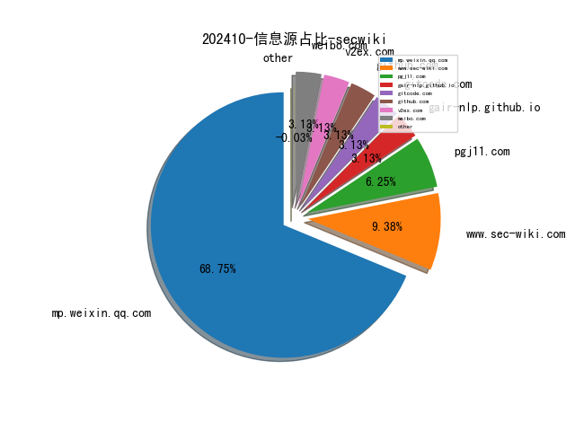
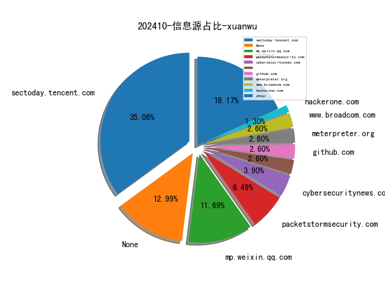
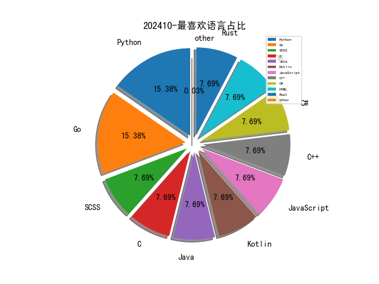

# [数据--所有](README_20.md)
# [数据--年度](README_2024.md)
# 202410 信息源与信息类型占比

# 网络安全书籍 推荐
| date_added | language | title | author | link | size| 
| --- | --- | --- | --- | --- | ---| 
| 2024-10-30 17:48:27 | English | beginners guide to streamlit with python | unknown | https://it-ebooks.info/book/1686051862-beginners_guide_to_streamlit_with_python/ | unknown| 
| 2024-10-30 17:48:27 | English | firewalls dont stop dragons 5th edition | unknown | https://it-ebooks.info/book/1686052309-firewalls_dont_stop_dragons_5th_edition/ | unknown| 
| 2024-10-30 07:18:24 | English | Introduction to Python and Large Language Models | unknown | https://www.wowebook.org/introduction-to-python-and-large-language-models/ | unknown| 
| 2024-10-30 07:02:51 | English | Boardroom Cybersecurity | unknown | https://www.wowebook.org/boardroom-cybersecurity/ | unknown| 
| 2024-10-30 06:40:25 | English | Information Security Incident and Data Breach Management | unknown | https://www.wowebook.org/information-security-incident-and-data-breach-management/ | unknown| 
| 2024-10-30 06:00:22 | English | Copilot for Microsoft 365 | unknown | https://www.wowebook.org/copilot-for-microsoft-365/ | unknown| 
| 2024-10-30 05:42:07 | English | ChatGPT for Marketing | unknown | https://www.wowebook.org/chatgpt-for-marketing/ | unknown| 
| 2024-10-29 13:13:22 | English | (History Of Computing) History Of Cryptography And Cryptanalysis: Codes, Ciphers, And Their Algorithms | John F. Dooley | http://libgen.st/book/index.php?md5=6CE503F0F983B391E55347A1FA419277 | 22 MB [PDF]| 
| 2024-10-29 17:21:02 | English | Hands-On Blockchain for Python Developers, 2nd Edition | unknown | https://www.wowebook.org/hands-on-blockchain-for-python-developers-2nd-edition/ | unknown| 
| 2024-10-29 19:23:13 | English | ChatGPT and the Future of AI : The Deep Language Revolution | Terrence J. Sejnowski | http://libgen.st/book/index.php?md5=38B0B3F555B7F44CB6D78426E9F4DDD8 | 4 MB [EPUB]| 
| 2024-10-29 19:22:02 | English | ChatGPT for Marketing : Learn Practical Applications of ChatGPT for Marketing | Eldar Najafov | http://libgen.st/book/index.php?md5=A0D0B819584CC229595C674118F27386 | 362 kB [EPUB]| 
| 2024-10-29 18:47:23 | English | Practical Time Series Forecasting with R: A Hands-On Guide | Galit Shmueli, Kenneth C. Lichtendahl Jr | http://libgen.st/book/index.php?md5=B46F86EB0D81ADFF6343EA28688E8387 | 3 MB [MOBI]| 
| 2024-10-28 12:21:18 | English | AWS Security Cookbook, 2nd Edition | unknown | https://www.wowebook.org/aws-security-cookbook-2nd-edition/ | unknown| 
| 2024-10-28 22:58:45 | English | AWS Certified Security - Specialty: Study Guide: Covers Exam Objectives, Review Questions and Exam Preparation Quizzes | Zeal Vora | http://libgen.st/book/index.php?md5=3BAA0C21978555AB8652E0291816757A | 24 MB [PDF]| 
| 2024-10-23 11:18:55 | English | Comic Sans | Simon Garfield | http://libgen.st/book/index.php?md5=14697F9E546C4DB758FD7D2117114FF2 | 6 MB [EPUB]| 
| 2024-10-22 15:15:47 | English | Logs and Telemetry: Using Fluent Bit, Kubernetes, streaming and more | Phil Wilkins | http://libgen.st/book/index.php?md5=3B5C462D72D816478DE660F1AB6F2FD5 | 22 MB [PDF]| 
| 2024-10-22 08:24:24 | English | Cryptography | Panos Louridas | http://libgen.st/book/index.php?md5=7C4A06CA5680B9EA4F1B95BC54D54D88 | 2 MB [EPUB]| 
| 2024-10-22 07:54:26 | English | A Few Words in Defense of Our Country | Robert Hilburn | http://libgen.st/book/index.php?md5=9A6312AE7D289FF8F269452B8D6E1FE1 | 30 MB [EPUB]| 
| 2024-10-22 03:32:42 | English | The Lean Entrepreneurship Playbook | unknown | https://www.wowebook.org/the-lean-entrepreneurship-playbook/ | unknown| 
| 2024-10-18 06:04:06 | English | CCSP (ISC)2 Certified Cloud Security Professional Exam Guide | unknown | https://www.wowebook.org/ccsp-isc2-certified-cloud-security-professional-exam-guide/ | unknown| 
| 2024-10-18 05:45:21 | English | Certified Information Systems Security Professional (CISSP) Exam Guide | unknown | https://www.wowebook.org/certified-information-systems-security-professional-cissp-exam-guide/ | unknown| 
| 2024-10-17 05:40:50 | English | Learn AI-Assisted Python Programming, Second Edition | unknown | https://www.wowebook.org/learn-ai-assisted-python-programming-second-edition/ | unknown| 
| 2024-10-16 14:21:45 | English | (Advances in Digital Crime, Forensics, and Cyber Terrorism (ADCFCT)) Utilizing Generative AI for Cyber Defense Strategies | Noor Zaman Jhanjhi | http://libgen.st/book/index.php?md5=C7821EFF88DB853DA788C611DD5CE99A | 9 MB [PDF]| 
| 2024-10-16 07:47:39 | English | Modern Network Observability | unknown | https://www.wowebook.org/modern-network-observability/ | unknown| 
| 2024-10-14 17:03:47 | English | Rust Brain Teasers | unknown | https://www.wowebook.org/rust-brain-teasers/ | unknown| 
| 2024-10-11 10:38:25 | English | Python Testing with pytest, Second Edition | unknown | https://www.wowebook.org/python-testing-with-pytest-second-edition/ | unknown| 
| 2024-10-11 08:22:11 | English | Python Brain Teasers | unknown | https://www.wowebook.org/python-brain-teasers/ | unknown| 
| 2024-10-11 08:00:30 | English | Intuitive Python: Productive Development for Projects that Last | unknown | https://www.wowebook.org/intuitive-python-productive-development-for-projects-that-last/ | unknown| 
| 2024-10-11 07:39:13 | English | Pythonic Programming: Tips for Becoming an Idiomatic Python Programmer | unknown | https://www.wowebook.org/pythonic-programming-tips-for-becoming-an-idiomatic-python-programmer/ | unknown| 
| 2024-10-11 07:05:05 | English | Portable Python Projects | unknown | https://www.wowebook.org/portable-python-projects/ | unknown| 
| 2024-10-10 05:44:22 | English | Starting Data Analytics with Generative AI and Python | unknown | https://www.wowebook.org/starting-data-analytics-with-generative-ai-and-python/ | unknown| 
| 2024-10-10 17:19:54 | English | A Common-Sense Guide to Data Structures and Algorithms in Python, Volume 1 | unknown | https://www.wowebook.org/a-common-sense-guide-to-data-structures-and-algorithms-in-python-volume-1/ | unknown| 
| 2024-10-09 00:55:53 | English | Securing Home and Business: A Guide to the Electronic Security Industry | Simon Hakim, Erwin A. Blackstone | http://libgen.st/book/index.php?md5=C4C2C4639D242DD8E01608EB207D01B5 | 13 MB [PDF]| 
| 2024-10-09 06:15:04 | English | Security and Privacy for Modern Networks | unknown | https://www.wowebook.org/security-and-privacy-for-modern-networks/ | unknown| 
| 2024-10-08 07:43:26 | English | IDS and IPS with Snort 3 | unknown | https://www.wowebook.org/ids-and-ips-with-snort-3/ | unknown| 
| 2024-10-08 07:55:35 | English | Pentesting APIs | unknown | https://www.wowebook.org/pentesting-apis/ | unknown| 
| 2024-10-08 23:23:36 | English | Securing Enterprise Networks with Cisco Meraki (for Duc ka) | Ryan Chaney; Simerjit Singh | http://libgen.st/book/index.php?md5=21D18B1AF6A9C9159BB107C0CB585872 | 111 MB [EPUB]| 
| 2024-10-07 20:39:02 | English | Security and Privacy for Modern Networks: Strategies and Insights for Safeguarding Digital Infrastructures | Seshagirirao Lekkala | http://libgen.st/book/index.php?md5=6880CF41327C61E82A69C0F601909F30 | 2 MB [PDF]| 
| 2024-10-07 06:44:58 | English | Building AI Applications with OpenAI APIs | unknown | https://www.wowebook.org/building-ai-applications-with-openai-apis/ | unknown| 
| 2024-10-07 05:58:39 | English | Microsoft Azure AI Fundamentals AI-900 Exam Guide | unknown | https://www.wowebook.org/microsoft-azure-ai-fundamentals-ai-900-exam-guide/ | unknown| 
| 2024-10-07 22:58:28 | English | Python Data Cleaning and Preparation Best Practices | Maria Zervou | http://libgen.st/book/index.php?md5=67BDEC60756BDDF9C5AACF3706A63B01 | 13 MB [EPUB]| 
| 2024-10-07 22:52:40 | English | Offensive Security Using Python | Rejah Rehim , Manindar Mohan | http://libgen.st/book/index.php?md5=EE55A2158265078C9DDB38575E8E6B4F | 2 MB [EPUB]| 
| 2024-10-06 11:17:31 | English | Offensive Security Using Python | unknown | https://www.wowebook.org/offensive-security-using-python/ | unknown| 
| 2024-10-06 17:16:24 | English | RAG-Driven Generative AI | unknown | https://www.wowebook.org/rag-driven-generative-ai/ | unknown| 
| 2024-10-05 07:17:28 | English | Build a Website with ChatGPT | unknown | https://www.wowebook.org/build-a-website-with-chatgpt/ | unknown| 
| 2024-10-05 08:03:46 | English | Learn Generative AI with PyTorch | unknown | https://www.wowebook.org/learn-generative-ai-with-pytorch/ | unknown| 
| 2024-10-04 09:25:59 | English | Building AI Applications with OpenAI APIs: Leverage ChatGPT, Whisper, and DALL-E APIs to build 10 innovative AI, 2nd Edition | Martin Yanev | http://libgen.st/book/index.php?md5=1372DE245C92309DCA7422D3075C4CF8 | 5 MB [EPUB]| 
| 2024-10-03 07:29:20 | English | Critical Security Controls for Effective Cyber Defense | unknown | https://www.wowebook.org/critical-security-controls-for-effective-cyber-defense/ | unknown| 
| 2024-10-03 13:13:25 | English | Routledge Handbook on Cultural Heritage and Disaster Risk Management | Rohit Jigyasu (editor), Ksenia Chmutina (editor) | http://libgen.st/book/index.php?md5=6040389CE70058DB56F90C72EA497865 | 8 MB [PDF]| 
| 2024-10-03 13:09:14 | English | Scientific Data: A 50 Steps Guide using Python (De Gruyter Textbook) | Matthias Josef Hofmann | http://libgen.st/book/index.php?md5=7B97F048C0DCBCD71DE44D33CE7170A6 | 20 MB [PDF]| 
| 2024-10-03 13:05:24 | English | (National Bureau of Economic Research Conference Report) The Economics of Privacy | Avi Goldfarb, Catherine E. Tucker | http://libgen.st/book/index.php?md5=EE511D75EBC04057696B5F7646F26FDE | 7 MB [EPUB]| 
| 2024-10-02 08:27:08 | English | Idiomatic Rust: Code like a Rustacean | Brenden Matthews | http://libgen.st/book/index.php?md5=C502C8F43F373F0882D472A15168F255 | 7 MB [EPUB]| 
| 2024-10-02 11:53:30 | English | AI-Powered Developer: Build software with ChatGPT and Copilot | Nathan B. Crocker | http://libgen.st/book/index.php?md5=E55B4F3EB6EAB9F07792AED60810BA2F | 15 MB [EPUB]| 
| 2024-10-02 11:14:38 | English | Generative AI in Action (Final Release) | Amit Bahree | http://libgen.st/book/index.php?md5=E214C3623EE2A6F3BFFFF239A4DFDF1F | 29 MB [PDF]| 
| 2024-10-02 10:44:24 | English | Scientific Data: A 50 Steps Guide using Python | Matthias Hofmann | http://libgen.st/book/index.php?md5=D2B5F556C51C322D3C1290596E1EE181 | 12 MB [EPUB]| 
| 2024-10-02 10:39:48 | English | Generative AI and ChatGPT For Beginners: A Comprehensive Guide to Harness the Power of AI, Boost Productivity, and Get More Done in Less Time (Tech Mastery) | Sebhastian, Nathan | http://libgen.st/book/index.php?md5=844CB9673C57335FB0C9E9AAE0D870E7 | 9 MB [EPUB]| 
| 2024-10-02 18:14:21 | English | Numerical Python: Scientific Computing and Data Science Applications with Numpy, SciPy and Matplotlib, 3rd Edition | unknown | https://www.wowebook.org/numerical-python-scientific-computing-and-data-science-applications-with-numpy-scipy-and-matplotlib-3rd-edition/ | unknown| 

# 微信公众号 推荐
| nickname_english | weixin_no | title | url| 
| --- | --- | --- | ---| 
| CAICT可信安全 | None | 一文读懂中国信通院“软件供应链”系列评估 | https://mp.weixin.qq.com/s?__biz=Mzk0MjM1MDg2Mg==&mid=2247501763&idx=1&sn=d1e8b781dc22d4730b191ea3f9a9e5e3 | 4| 
| ChaMd5安全团队 | None | 2024第四届“网鼎杯”青龙组 writeup | https://mp.weixin.qq.com/s?__biz=MzIzMTc1MjExOQ==&mid=2247511148&idx=1&sn=363b4f724a8c5173541bd563c4ca6910 | 1| 
| Hacking黑白红 | None | CISSP考试经验分享（全流程详解） | https://mp.weixin.qq.com/s?__biz=Mzg2NDYwMDA1NA==&mid=2247542154&idx=2&sn=8913c402ccdd87d506b1bfc82950423d | 10| 
| Hack分享吧 | None | 测试WAF绕过的Burpsuite插件 | https://mp.weixin.qq.com/s?__biz=MzA4NzU1Mjk4Mw==&mid=2247491878&idx=1&sn=b2b8e2ff172048a878e4964d41bd922d | 2| 
| IoT物联网技术 | None | 免费，基于React + ECharts 国产开源 IoT 物联网 Web 可视化数据大屏 | https://mp.weixin.qq.com/s?__biz=MjM5OTA4MzA0MA==&mid=2454935827&idx=1&sn=a0813fd9297a6b1b6fb88a1b0696235c | 10| 
| Khan安全攻防实验室 | None | 没中标≠本子没用了！国自然十年评审专家1v1精修，中标率提升58.6%！附直播答疑！ | https://mp.weixin.qq.com/s?__biz=MzAwMjQ2NTQ4Mg==&mid=2247495413&idx=2&sn=a3604f2fa046c3d4415ac7d59c082c28 | 12| 
| Web安全工具库 | None | 小程序渗透测试 -- KillWxapkg-Auto（10月29日更新） | https://mp.weixin.qq.com/s?__biz=MzI4MDQ5MjY1Mg==&mid=2247514525&idx=1&sn=850418c277f601b590dd7943956650bf | 5| 
| kali笔记 | None | 飞牛（Fnos）安装及体验 | https://mp.weixin.qq.com/s?__biz=MzkxMzIwNTY1OA==&mid=2247508606&idx=1&sn=9f91ca86388261b18935aeafb9474419 | 7| 
| 乌雲安全 | None | 因数据泄露,上海某医疗科技公司被立案调查！（附解决方案下载） | https://mp.weixin.qq.com/s?__biz=MzAwMjA5OTY5Ng==&mid=2247524753&idx=1&sn=03bbef259e914f969eeba766194cd856 | 6| 
| 信安路漫漫 | None | 文件上传常见防御与突破总结 | https://mp.weixin.qq.com/s?__biz=Mzg2MzkwNDU1Mw==&mid=2247485236&idx=1&sn=203cbfb571c44f88be223609906af04a | 2| 
| 全栈安全 | None | 一文读懂系列：SSL加密流量检测技术详解 | https://mp.weixin.qq.com/s?__biz=MzkyMTYyOTQ5NA==&mid=2247485500&idx=1&sn=7fbf79e78f8bb238f4b8ac04a200cf23 | 5| 
| 兰花豆说网络安全 | None | FCIS 2024网络安全创新大会等你来！ | https://mp.weixin.qq.com/s?__biz=MzI3NzM5NDA0NA==&mid=2247489673&idx=1&sn=e6b6a1e691c62013852e5455d4989843 | 7| 
| 关键信息基础设施安全保护联盟 | None | 强化人才培育，助力海淀腾飞,江南信安受邀参加第五届 “智汇・海淀” 人才主题周系列活动 | https://mp.weixin.qq.com/s?__biz=MzkxNjU2NjY5MQ==&mid=2247507363&idx=3&sn=12c99c11f81982ca615ebc1956d271d4 | 14| 
| 夜组安全 | None | 通过 Telegram+Clipper 记录 FUD Stealer 可以绕过所有防病毒软件（抓取：钱包、密码、信用卡等） | https://mp.weixin.qq.com/s?__biz=Mzk0ODM0NDIxNQ==&mid=2247492597&idx=1&sn=7c66110239b4a80cb7254866d3fc219b | 6| 
| 天津恒御科技有限公司 | None | 【密码科普】第二期：商用密码应用 | https://mp.weixin.qq.com/s?__biz=MzU4NjY3OTAzMg==&mid=2247512889&idx=2&sn=9197c3cff771100512b59b8eef69df4b | 4| 
| 天驿安全 | None | 2024渗透攻防交流群 限时进群 | https://mp.weixin.qq.com/s?__biz=MzkxNjIxNDQyMQ==&mid=2247497684&idx=2&sn=53602173058b7107941f2c927652ce87 | 3| 
| 威努特安全网络 | None | 护航智慧水利，威努特构建数字孪生流域“四预”工控安全体系 | https://mp.weixin.qq.com/s?__biz=MzAwNTgyODU3NQ==&mid=2651128069&idx=1&sn=3145ef19b5a80e2d1c18fea368b7a31b | 4| 
| 安全学习那些事儿 | None | 北京市教委发布《北京市教育移动互联网应用程序备案实施细则》 | https://mp.weixin.qq.com/s?__biz=MzkxNTI2NTQxOA==&mid=2247494789&idx=4&sn=9267375760fc170d876324f46852a2e4 | 34| 
| 安全架构 | None | 手把手教你构建可信白环境【文末赠书】 | https://mp.weixin.qq.com/s?__biz=Mzg5MjgxNTQ1MA==&mid=2247487941&idx=1&sn=f23480185eafe9a0ff3bb3cf2cf6b56f | 2| 
| 安全洞察知识图谱 | None | 一个永久的.NET渗透工具和知识仓库 | https://mp.weixin.qq.com/s?__biz=MzkyMDM4NDM5Ng==&mid=2247488344&idx=2&sn=2deaab44d3f83596bdd402ba788ff59c | 6| 
| 安全狗的自我修养 | None | 业务逻辑漏洞-工作流验证不足 | https://mp.weixin.qq.com/s?__biz=MzkwOTE5MDY5NA==&mid=2247502510&idx=1&sn=3602204e88870b481b0b8f4d3a4b18bd | 11| 
| 小兵搞安全 | None | sqlmap基于mssql注入利用及总结 | https://mp.weixin.qq.com/s?__biz=MzA3NTc0MTA1Mg==&mid=2664712034&idx=1&sn=901e25abc831df4c01daf34704b163bc | 3| 
| 技术修道场 | None | Ansible Playbook 中 Roles 的使用详解 | https://mp.weixin.qq.com/s?__biz=MzA4NTY4MjAyMQ==&mid=2447899562&idx=1&sn=1c690e385ae52d167cb20ab7b7600624 | 5| 
| 星落安全团队 | None | 【文末获取】一款GitHub Star1.1k 红队工具vshell介绍 | https://mp.weixin.qq.com/s?__biz=MzkwNjczOTQwOA==&mid=2247489995&idx=1&sn=3c123fb6ccad3a8a020dff4cb80b0a8b | 7| 
| 李白你好 | None | 在 Kubernetes 上使用 Cobalt Strike C2 服务器 | https://mp.weixin.qq.com/s?__biz=MzkwMzMwODg2Mw==&mid=2247509081&idx=1&sn=dc492e3a2551a49ecd1ec9133f55aa4b | 6| 
| 汇能云安全 | None | 马克龙行踪被保镖泄漏，健身APP威胁全球政要和军方机密 | https://mp.weixin.qq.com/s?__biz=MzIwNzAwOTQxMg==&mid=2652250740&idx=1&sn=bc39f25b466ab03b1b5e8c4a8d0bbabc | 3| 
| 河南等级保护测评 | None | 为什么员工网络安全培训很重要 | https://mp.weixin.qq.com/s?__biz=Mzg2NjY2MTI3Mg==&mid=2247497527&idx=2&sn=2d88659b4cacbf33e8cfd0d7c4652123 | 24| 
| 浅安安全 | None | 工具 , Covenant | https://mp.weixin.qq.com/s?__biz=MzkwMTQ0NDA1NQ==&mid=2247491199&idx=4&sn=c0cc06a31b361432774f26a95ae9404f | 12| 
| 渗透安全HackTwo | None | ENScan信息收集工具解决在HW/SRC场景下遇到的各种针对国内企业信息收集难题,信息收集 | https://mp.weixin.qq.com/s?__biz=Mzg3ODE2MjkxMQ==&mid=2247488869&idx=1&sn=89f0340d6d53d0a893e04de7e0783a99 | 6| 
| 潇湘信安 | None | CVE-2024-35250提权漏洞插件 | https://mp.weixin.qq.com/s?__biz=Mzg4NTUwMzM1Ng==&mid=2247512536&idx=1&sn=50e860a438a1671bd465037b7af475ef | 3| 
| 犀牛安全 | None | Linux 上的 Intel、AMD CPU 受到最新披露的 Spectre 漏洞绕过的影响 | https://mp.weixin.qq.com/s?__biz=Mzg3ODY0NTczMA==&mid=2247491404&idx=1&sn=1251eb81db548e27b5b4c419e4f228ed | 6| 
| 玄道夜谈 | None | 分享图片 | https://mp.weixin.qq.com/s?__biz=MzI3Njc1MjcxMg==&mid=2247493515&idx=1&sn=f070938a318381147b34d9395800ab39 | 12| 
| 白帽学子 | None | 别有用心 | https://mp.weixin.qq.com/s?__biz=MzkyNzIxMjM3Mg==&mid=2247488002&idx=2&sn=8ee3c35d5367d05d310f77e55f3be432 | 13| 
| 祺印说信安 | None | 出色的安全培训是真正的挑战 | https://mp.weixin.qq.com/s?__biz=MzA5MzU5MzQzMA==&mid=2652112238&idx=2&sn=24b866c4e6674794b74dbf5356a9ca37 | 26| 
| 秦国商鞅 | None | 原创—儿童青少年心理学之三种毁灭性心理问题 | https://mp.weixin.qq.com/s?__biz=Mzg4NzAwNzA4NA==&mid=2247484937&idx=1&sn=8dade4e8fe9b42d0d06675b0e6c6b4a4 | 4| 
| 网安加社区 | None | 百家讲坛 , 赵锐：数据安全二十载 | https://mp.weixin.qq.com/s?__biz=Mzg4MjQ4MjM4OA==&mid=2247520876&idx=1&sn=bab7922e650853c0e5c7703661fbfe24 | 5| 
| 网安探索队 | None | 大华智能物联综合管理平台-log4j远程代码执行漏洞【漏洞复现】 | https://mp.weixin.qq.com/s?__biz=Mzg3NTk4MDQ1NA==&mid=2247484775&idx=1&sn=424e74243234c2243267a5c7b4eb1768 | 2| 
| 网空闲话plus | None | 5th域安全微讯早报【20241031】262期 | https://mp.weixin.qq.com/s?__biz=MzkyMjQ5ODk5OA==&mid=2247504642&idx=3&sn=9d314c8ab5a5242591d121c228daf8c7 | 33| 
| 网络安全与取证研究 | None | 浅谈哈希的妙用 | https://mp.weixin.qq.com/s?__biz=Mzg3NTU3NTY0Nw==&mid=2247489321&idx=1&sn=cd0622164be600b10551f81202ee10df | 12| 
| 网络安全者 | None | WAF攻防对抗实战演练（免费下载） | https://mp.weixin.qq.com/s?__biz=MzU3NzY3MzYzMw==&mid=2247498492&idx=1&sn=907c4ce1697efca984b06432fbd36ae9 | 2| 
| 网络空间信息安全学习 | None | 万圣夜隐藏宝藏！揭秘文化背后故事 | https://mp.weixin.qq.com/s?__biz=MzI2MjcwMTgwOQ==&mid=2247491868&idx=1&sn=e3af3c595f77f3f2198bf1ea94b43907 | 7| 
| 苏说安全 | None | 等保2.0工业控制系统安全扩展要求 | https://mp.weixin.qq.com/s?__biz=Mzg5OTg5OTI1NQ==&mid=2247488978&idx=1&sn=690e411af26c50ab35e310a5ee7a7f3d | 14| 
| 菜鸟学信安 | None | FTP,SSH,MYSQL,MSSQL等弱口令爆破工具！ | https://mp.weixin.qq.com/s?__biz=MzU2NzY5MzI5Ng==&mid=2247503598&idx=1&sn=aa39cbce3ecf535ddf2587331d42ee18 | 6| 
| 表图 | None | 三季度财报显示，网络安全行业继续第五个季度收入下滑，市场同比萎缩8.5% | https://mp.weixin.qq.com/s?__biz=MzUzOTI4NDQ3NA==&mid=2247484666&idx=1&sn=c836f7e4fd570a2ccbc0ad22c7167eae | 1| 
| 计算机与网络安全 | None | 资料列表-区块链主题 | https://mp.weixin.qq.com/s?__biz=MjM5OTk4MDE2MA==&mid=2655258094&idx=8&sn=154dfc7adf24a2d0a66fe5862d7ca120 | 43| 
| 说安全 如何安全 | None | 卫生健康行业网络信息与数据安全建设方案（附下载） | https://mp.weixin.qq.com/s?__biz=MzkyODY5ODAyOA==&mid=2247488226&idx=1&sn=dc3aa2851b8964c68b620ad6394eae25 | 5| 
| 赤弋安全团队 | None | 向日葵密码提取、todesk密码提取，ID、临时密码，安全密码读取工具 | https://mp.weixin.qq.com/s?__biz=MzkzNzQyMDkxMQ==&mid=2247487764&idx=1&sn=443576e33117597238b494f685dd0a36 | 1| 
| 进击的HACK | None | 逆向学习 ｜实操小练 | https://mp.weixin.qq.com/s?__biz=MzkxNjMwNDUxNg==&mid=2247486561&idx=2&sn=240e26b52e0face91bc77d8dd996a937 | 18| 
| 逆向有你 | None | PC逆向 -- 蓝屏分析 | https://mp.weixin.qq.com/s?__biz=MzA4MzgzNTU5MA==&mid=2652036638&idx=2&sn=b5e95030f03962afc36c720fb30ff38c | 6| 
| 重生之成为赛博女保安 | None | 突发 , *象被黑？非常以及无与伦比之假 | https://mp.weixin.qq.com/s?__biz=MzIxOTQ1OTY4OQ==&mid=2247486145&idx=1&sn=e62fcad61018aa746789b2f8df8a6a13 | 2| 
| 银遁安全团队 | None | 【吃瓜】什么清华北大,不如胆子大！！！ | https://mp.weixin.qq.com/s?__biz=MzU3MjU4MjM3MQ==&mid=2247488163&idx=1&sn=a145e0561e05cebbda659c4feb06ad00 | 9| 
| 黑客驰 | None | 免费动态DNS，简单易用，无需注册！ | https://mp.weixin.qq.com/s?__biz=Mzg4MzgwMDE2Mw==&mid=2247488218&idx=1&sn=6a7c5ec7d3f096962fa77fcc2a311154 | 4| 
| 360威胁情报中心 | None | Confucius组织利用ADS隐藏技术的攻击活动分析 | https://mp.weixin.qq.com/s?__biz=MzUyMjk4NzExMA==&mid=2247503273&idx=1&sn=284689a960abc3971c0ccfeceb35c312 | 1| 
| 360数字安全 | None | 全球头号威胁RansomHub勒索团伙再作案，墨西哥13个机场受影响 | https://mp.weixin.qq.com/s?__biz=MzA4MTg0MDQ4Nw==&mid=2247576241&idx=1&sn=e0fc049395162188183a0bdf418cc34b | 7| 
| AI安全运营 | None | 与AI大语言模型进行语音对话（ollama voice) | https://mp.weixin.qq.com/s?__biz=MjM5NjEzNzU5OQ==&mid=2247485499&idx=1&sn=493e91e5095b07133e95457977bc5720 | 1| 
| BurpSuite实战教程 | None | 2025年毕业生简历，我腆着老脸问了一圈没人要。为什么？ | https://mp.weixin.qq.com/s?__biz=MzU5NzQ3NzIwMA==&mid=2247486020&idx=1&sn=4b1f40efb7ed289bae052dc5885eb82d | 10| 
| CISSP | None | 华为认证中，哪个含金量最高？ | https://mp.weixin.qq.com/s?__biz=Mzg4MTg0MjQ5OA==&mid=2247487018&idx=1&sn=b787466c2d58eb52844d5d9353a34634 | 7| 
| CatalyzeSec | None | 万户协同办公平台ezoffice SignatureEditFrm.jsp SQL注入漏洞复现及POC | https://mp.weixin.qq.com/s?__biz=MzkxNjY1MjY3OQ==&mid=2247487794&idx=1&sn=85c1ca8b5bf134b3f1b38378c3fa029c | 4| 
| Delta Insights | None | 网络安全动态 - 2024.10.30 | https://mp.weixin.qq.com/s?__biz=MzU1MzEzMzAxMA==&mid=2247486726&idx=1&sn=b77e5235717647b1a468bed59f058c62 | 6| 
| Docker中文社区 | None | Kubernetes 网络介绍（八） | https://mp.weixin.qq.com/s?__biz=MzI1NzI5NDM4Mw==&mid=2247498183&idx=2&sn=90fb2d5904652b8f47b1bdfc7ca1be64 | 5| 
| EBCloud | None | 现代软件需求工程 | https://mp.weixin.qq.com/s?__biz=Mzg4MTA2MTc4MA==&mid=2247493432&idx=1&sn=d338a6ede7dd193d29c2888255da0753 | 1| 
| Eonian Sharp | None | 后渗透 , 信息收集工具 | https://mp.weixin.qq.com/s?__biz=Mzg3NzUyMTM0NA==&mid=2247487430&idx=1&sn=af65e12b0158e9bcacb1ea2192301e3e | 3| 
| FreeBuf | None | PsMapExec：一款针对活动目录AD的安全检测工具 | https://mp.weixin.qq.com/s?__biz=MjM5NjA0NjgyMA==&mid=2651305760&idx=4&sn=c41bc988d8cf7a288b7711ac673cc346 | 47| 
| FreeBuf播客电台 | None | 网安i人拯救计划——测人格 赢大会周边 | https://mp.weixin.qq.com/s?__biz=Mzg2MTAwNzg1Ng==&mid=2247495262&idx=2&sn=df3a1387e9e66c26a22daa7a5ec01cd1 | 3| 
| HW安全之路 | None | 安全从业者看过来！HTTP请求与响应结构全解析！ | https://mp.weixin.qq.com/s?__biz=MzI5MjY4MTMyMQ==&mid=2247486416&idx=1&sn=d970bfb501f8ba16bc07c0c8fffb7257 | 14| 
| ISC2北京分会 | None | ISC2北京分会十周年-会员专访-雷志强 | https://mp.weixin.qq.com/s?__biz=MzAxMzEyMjQ4Mg==&mid=2688531153&idx=5&sn=fb44794ab54cf12b2cb93129e537c4f1 | 15| 
| IoVSecurity | None | 掌握模糊测试-如何在法规遵从中克服网络安全挑战 | https://mp.weixin.qq.com/s?__biz=MzU2MDk1Nzg2MQ==&mid=2247615243&idx=3&sn=93f66bbff8f0547cf506d77f41085244 | 36| 
| JC的安全之路 | None | 聊聊在反序列化漏洞中如何找Gadget利用链 | https://mp.weixin.qq.com/s?__biz=Mzg3NDk3NzMwNw==&mid=2247484749&idx=1&sn=b0d71b1f67ae4884f99a374abc911f2e | 1| 
| M01N Team | None | 绿盟英雄帖｜M01N战队研究员直聘，英雄请留步！ | https://mp.weixin.qq.com/s?__biz=MzkyMTI0NjA3OA==&mid=2247493839&idx=1&sn=a2ccf52f110321c884c084c22d531590 | 3| 
| OneMoreThink | None | 攻防靶场(25)：盘点Kali中好用的Web字典 DriftingBlues 6 | https://mp.weixin.qq.com/s?__biz=MzI0NjA3Mzk2NQ==&mid=2247495051&idx=1&sn=5e79d921886f2c92e7d3791e1e56f9b9 | 6| 
| Rsec | None | HTB靶场Compiled(Windows)[Medium] | https://mp.weixin.qq.com/s?__biz=MzA4NDQ5NTU0MA==&mid=2647690391&idx=1&sn=c4b4963413ee02fe5651fe8b2b0704e2 | 3| 
| SecretTeam安全团队 | None | 低权 Linux 键盘记录方案 | https://mp.weixin.qq.com/s?__biz=MzkzMDQ5MDM3NA==&mid=2247485968&idx=1&sn=cc51d313f3a3b3d913e960e527cf50b6 | 3| 
| TtTeam | None | 互联网高安全站点架构下的反爬虫机制 | https://mp.weixin.qq.com/s?__biz=Mzg2NTk4MTE1MQ==&mid=2247486096&idx=1&sn=ed09581fdedfcfa77322584a4422eb70 | 6| 
| WalkingCloud | None | 【直播预告】：阿加犀基于SiRider S1芯擎开发板的机器人应用分享 | https://mp.weixin.qq.com/s?__biz=MzU2MjU1OTE0MA==&mid=2247499381&idx=1&sn=f56643ea139e503fec20db76d9e987d6 | 3| 
| YY的黑板报 | None | 西安旅游小攻略 | https://mp.weixin.qq.com/s?__biz=Mzg5NzY5NjM5Mg==&mid=2247484914&idx=1&sn=d98e8bad27ba9fdba546ddd99ade13db | 1| 
| Z2O安全攻防 | None | 建了个SRC专项漏洞知识库 | https://mp.weixin.qq.com/s?__biz=Mzg2ODYxMzY3OQ==&mid=2247516547&idx=2&sn=ef38656157b9ac6144052aed8e84ddb1 | 15| 
| b1gpig信息安全 | None | 漏洞推送：CVE-2024-38063  Windows TCP/IP 远程代码执行漏洞（有poc） | https://mp.weixin.qq.com/s?__biz=Mzg3NzcwODQ0Ng==&mid=2247484015&idx=1&sn=2c574bc7d5075a058b7c4f35f0f3ba9f | 6| 
| backdoor | None | Rust beacon | https://mp.weixin.qq.com/s?__biz=MzI5MzkwMzU1Nw==&mid=2247485142&idx=1&sn=c6be5a50474cb67abba8e323b25bd143 | 1| 
| fkalis | None | 【海外SRC赏金挖掘】谷歌语法+历史URL查询导致大规模数据泄露，拿下15000 美元赏金 | https://mp.weixin.qq.com/s?__biz=MzkyODcwOTA4NA==&mid=2247486316&idx=1&sn=3904c7fdd2ff085a57771cf150edd5b9 | 11| 
| rainy的安全小屋 | None | Nday-Apache Solr身份验证绕过漏洞（CVE-2024-45216） | https://mp.weixin.qq.com/s?__biz=MzkxMzczNTA4MQ==&mid=2247483825&idx=1&sn=be6702961c9fc126c445a6abb19c52d5 | 1| 
| thelostworld | None | 【漏洞预警】泛微e-cology loginsso sql注入漏洞 | https://mp.weixin.qq.com/s?__biz=MzIyNjk0ODYxMA==&mid=2247487493&idx=2&sn=6a0831e222aea730424cd250c76304d0 | 2| 
| 丁爸 情报分析师的工具箱 | None | 【资料】在反恐中利用开源情报 | https://mp.weixin.qq.com/s?__biz=MzI2MTE0NTE3Mw==&mid=2651147469&idx=1&sn=6fe885dae26c951e85fb0ff97dc7e4b0 | 20| 
| 三沐数安 | None | 免费！开箱即用的开源DLP | https://mp.weixin.qq.com/s?__biz=MzU1NjczNjA0Nw==&mid=2247485387&idx=1&sn=ec2ebe44fca151e4546e217844c38b68 | 4| 
| 不秃头的安全 | None | CISAW学员观点 , 国产软件漏洞库为什么没有完全“公开”？ | https://mp.weixin.qq.com/s?__biz=Mzg3NzkwMTYyOQ==&mid=2247487873&idx=2&sn=5a2213099b8021b094fc38984070a35f | 3| 
| 与智慧做朋友 | None | “零信任”是把枪，可以伤敌人，更能伤自己！！ | https://mp.weixin.qq.com/s?__biz=MzA3OTg3Mjg3NA==&mid=2456976619&idx=1&sn=09a2d9f904737885f6c390f0bf7a5eb3 | 10| 
| 中国信息安全 | None | 评论 , 针对未成年人“开盒挂人”的社会危害、成因及治理 | https://mp.weixin.qq.com/s?__biz=MzA5MzE5MDAzOA==&mid=2664228529&idx=6&sn=9ced6a055bf2cd98982bf3b5d10e6832 | 40| 
| 二进制磨剑 | None | 【翻译】识别二进制文件中的API函数 | https://mp.weixin.qq.com/s?__biz=MzI1Mjk2MTM1OQ==&mid=2247484801&idx=1&sn=e4cd2c67013243ab1349ac0e3c3a717b | 3| 
| 二进制空间安全 | None | 一种几乎绕过所有EDR的shellcode加载器 | https://mp.weixin.qq.com/s?__biz=MzkxOTUyOTc0NQ==&mid=2247491738&idx=1&sn=7a5e7d34729d9dfb0b77126403d9c439 | 2| 
| 亚信安全 | None | 攻击者可绕过身份验证！CyberPanel命令注入漏洞安全风险通告 | https://mp.weixin.qq.com/s?__biz=MjM5NjY2MTIzMw==&mid=2650619505&idx=1&sn=13e5bccd68e9931fd5271bcb28144e98 | 6| 
| 亿人安全 | None | 《突发》仿冒FB社区域名群发钓鱼信息？ | https://mp.weixin.qq.com/s?__biz=Mzk0MTIzNTgzMQ==&mid=2247518062&idx=1&sn=c4fd05b049284a0e65e9a200da2a355c | 5| 
| 代码卫士 | None | 这个已存在18年的提权漏洞影响 X.Org 服务器 | https://mp.weixin.qq.com/s?__biz=MzI2NTg4OTc5Nw==&mid=2247521331&idx=2&sn=71c64c97cc3e699a2bf61baa2a1d09d4 | 11| 
| 信安404 | None | 【工具更新】BurpSuite最新2024.9版Windows/Linux/Mac（附下载） | https://mp.weixin.qq.com/s?__biz=Mzk0NjQ5MTM1MA==&mid=2247492496&idx=1&sn=30723f691c20d9efd9077caace214651 | 2| 
| 信息安全D1net | None | AI时代的信任与风险 | https://mp.weixin.qq.com/s?__biz=MzA3NTIyNzgwNA==&mid=2650259380&idx=1&sn=4aa7346ef88783f2d1af92eead746e68 | 5| 
| 信息安全与通信保密杂志社 | None | 密码“丰”会2024报名通道正式开启 | https://mp.weixin.qq.com/s?__biz=MzkwMTMyMDQ3Mw==&mid=2247595644&idx=2&sn=24f13255685588ff624e0b6ca1e83c97 | 12| 
| 信息安全大事件 | None | 9月涉及国内的数据泄露 | https://mp.weixin.qq.com/s?__biz=MzkzNjIzMjM5Ng==&mid=2247489912&idx=1&sn=42b26d32959fc8d981dc536ce5261a34 | 3| 
| 信息安全研究 | None | 预告 , 今晚19点网安公开课，云内故障分析vol.03，基于eBPF的应用可观测落地 | https://mp.weixin.qq.com/s?__biz=MzA3NzgzNDM0OQ==&mid=2664990893&idx=4&sn=ce68d3b0ae76858e69e1224743870dcf | 13| 
| 全球技术地图 | None | 美国国防部测试人工智能系统Scylla | https://mp.weixin.qq.com/s?__biz=MzI1OTExNDY1NQ==&mid=2651616680&idx=2&sn=524e42ae6e2871abff451f41cbed0201 | 18| 
| 内生安全联盟 | None | 预选赛晋级名单揭晓！第七届“强网”拟态防御国际精英挑战赛预选赛入围公示 | https://mp.weixin.qq.com/s?__biz=Mzg4MDU0NTQ4Mw==&mid=2247525868&idx=2&sn=cc179d96e8e0d585a4cd4736ec2ce9ca | 16| 
| 再说安全 | None | 进行威胁狩猎操作的过程是什么？ | https://mp.weixin.qq.com/s?__biz=MzkyODYwODkyMA==&mid=2247484418&idx=1&sn=8bedc4dbe6b835321bc9e6d041953713 | 13| 
| 吉祥在职场 | None | 商汤科技裁员风波：组织架构大调整，边裁边招？ | https://mp.weixin.qq.com/s?__biz=MzI1ODY3MTA3Nw==&mid=2247486467&idx=2&sn=5daf53fd4ef6048e819dd9c3a6f6b7b9 | 4| 
| 君哥的体历 | None | 开源安全检测的漏洞，从哪些维度考虑整改标准？两种场景下（供应链软件入库，应用投产上线）针对检测的漏洞需要强制修复吗｜总第270周 | https://mp.weixin.qq.com/s?__biz=MzI2MjQ1NTA4MA==&mid=2247491605&idx=1&sn=e7a98ec2cfec80361cbc51e7d443ab06 | 3| 
| 启明星辰安全简讯 | None | 【漏洞通告】Google Chrome Dawn越界写入漏洞（CVE-2024-10487） | https://mp.weixin.qq.com/s?__biz=MzkzNzY5OTg2Ng==&mid=2247500160&idx=3&sn=00d9f7ad8f0dc54dac4180cc9a02cf36 | 13| 
| 启明星辰集团 | None | 开拓创新 勇攀高峰—— 2024年启明星辰集团创新大赛圆满收官 | https://mp.weixin.qq.com/s?__biz=MzA3NDQ0MzkzMA==&mid=2651728949&idx=1&sn=544edaede46ddfacdebae895d9165a02 | 5| 
| 吾爱破解论坛 | None | 【清理未活跃会员】清理2024年暑假开放注册未活跃会员公告 | https://mp.weixin.qq.com/s?__biz=MjM5Mjc3MDM2Mw==&mid=2651141402&idx=1&sn=1ab0ebd770eece31f86b3f777e72e852 | 2| 
| 商密君 | None | 开源情报显威！利用社交APP实时跟踪美俄法等国总统行踪 | https://mp.weixin.qq.com/s?__biz=MzI5NTM4OTQ5Mg==&mid=2247631696&idx=6&sn=72bef022f40339acc857bde54e39bf73 | 40| 
| 嘉诚安全 | None | 【漏洞通告】Spring Security授权绕过漏洞安全风险通告 | https://mp.weixin.qq.com/s?__biz=MzU4NjY4MDAyNQ==&mid=2247496719&idx=2&sn=bceee8ec4982ad808bd0d5e8695ba87f | 4| 
| 嘶吼专业版 | None | 谷歌：2023年披露的被利用漏洞中有70%是零日漏洞 | https://mp.weixin.qq.com/s?__biz=MzI0MDY1MDU4MQ==&mid=2247579103&idx=2&sn=adfdc60fab72010fc498354e6b8e034d | 8| 
| 国家互联网应急中心CNCERT | None | 网络安全信息与动态周报2024年第43期（10月21日-10月27日） | https://mp.weixin.qq.com/s?__biz=MzIwNDk0MDgxMw==&mid=2247499441&idx=1&sn=650a8b278b5b970e0da3576fe4e820ed | 1| 
| 国际云安全联盟CSA | None | 威胁情报在企业安全中的关键作用：攻防新策略解析 | https://mp.weixin.qq.com/s?__biz=MzkwMTM5MDUxMA==&mid=2247500217&idx=1&sn=f928bd36adda31285ce9fa2144168ea2 | 4| 
| 塞讯安全验证 | None | 10月 , 塞讯模拟攻击库更新汇总 | https://mp.weixin.qq.com/s?__biz=Mzk0MTMzMDUyOA==&mid=2247501531&idx=2&sn=bd0db9075794d9f83c3f8ce404eacd92 | 2| 
| 大象只为你 | None | MySQL分层结构由哪些组成？ | https://mp.weixin.qq.com/s?__biz=MzI5NzUyNzMzMQ==&mid=2247485325&idx=1&sn=909aa55b95e97cf42968022102b1ee81 | 2| 
| 天御攻防实验室 | None | 北约多国网络指挥官谈网络空间中的军事角色 | https://mp.weixin.qq.com/s?__biz=MzU0MzgyMzM2Nw==&mid=2247486051&idx=1&sn=1e929b3cbb66c47df68c2da9a7b680ce | 2| 
| 奇安信集团 | None | 一图速览奇安信2024第三季度财报 | https://mp.weixin.qq.com/s?__biz=MzU0NDk0NTAwMw==&mid=2247621355&idx=2&sn=60786abad4636a190764bf8c9ac66485 | 11| 
| 字节跳动技术团队 | None | 技术专题27期 , 后端Java技术创意冠军角逐赛 | https://mp.weixin.qq.com/s?__biz=MzI1MzYzMjE0MQ==&mid=2247510989&idx=2&sn=8ce24e7a006a0effe5ed360d814e341f | 6| 
| 安世加 | None | 安世加第四十七期沙龙（11.23/周六/广州） | https://mp.weixin.qq.com/s?__biz=MzU2MTQwMzMxNA==&mid=2247540490&idx=1&sn=8d0fa1665ab08ef79c32f24c533cc464 | 5| 
| 安全419 | None | 资料下载 , 江西“数据要素×”、自治区数据要素市场化配置改革、网络安全产业分析报告、车路云一体化... | https://mp.weixin.qq.com/s?__biz=MzUyMDQ4OTkyMg==&mid=2247543918&idx=2&sn=7f100bf9e631fb842664728231d3c602 | 10| 
| 安全info | None | 数据分级分类工具：敏感数据识别中的AI智能化转型之路 | https://mp.weixin.qq.com/s?__biz=Mzg2MTc0NTYyNg==&mid=2247485523&idx=1&sn=5acf4503488b83f35d009345f7299a70 | 1| 
| 安全产品人的赛博空间 | None | 《2024网安市场年报》数据中有意思的地方 | https://mp.weixin.qq.com/s?__biz=Mzg5NTUzODkxMw==&mid=2247483847&idx=1&sn=0f4ef95b7ba3352b54105d29cbacca75 | 1| 
| 安全内参 | None | 苹果悬赏百万美元查找“苹果智能”安全漏洞 | https://mp.weixin.qq.com/s?__biz=MzI4NDY2MDMwMw==&mid=2247512950&idx=2&sn=8dd420cffbbe201209b733f10108d32d | 11| 
| 安全圈 | None | 【安全圈】因健身应用轨迹，贴身保镖恐泄露美国总统位置信息 | https://mp.weixin.qq.com/s?__biz=MzIzMzE4NDU1OQ==&mid=2652065600&idx=4&sn=15b26bfc0c1a2d1c033683e786adb151 | 55| 
| 安全帮 | None | 伊朗黑客充当贩卖美国、加拿大和澳大利亚等国家关键基础设施访问权的经纪人 | https://mp.weixin.qq.com/s?__biz=MzkzNjQwOTc4MQ==&mid=2247489806&idx=1&sn=d385492b0d3501046afd9743b6b4b971 | 5| 
| 安全极客 | None | 【论文速读】, PathSeeker：使用基于强化学习的越狱攻击方法探索大语言模型的安全漏洞 | https://mp.weixin.qq.com/s?__biz=MzkzNDUxOTk2Mw==&mid=2247494960&idx=1&sn=86c9d7d0cffaddea83b110fcea32fd6e | 5| 
| 安全牛课堂 | None | 11月开班 , CDGP数据治理专家，数据从业者的推荐认证 | https://mp.weixin.qq.com/s?__biz=MzIxNTM4NDY2MQ==&mid=2247513679&idx=4&sn=dd5bbc663716c540aebbea02f3c6f4e1 | 16| 
| 安全研究GoSSIP | None | G.O.S.S.I.P 阅读推荐 2024-10-30 SmartAxe | https://mp.weixin.qq.com/s?__biz=Mzg5ODUxMzg0Ng==&mid=2247499082&idx=1&sn=2ccd62f74c9d89e08dfa8bc2e9cf7038 | 3| 
| 安全视安 | None | 【翻译】网络钓鱼新手法：利用Telegram进行数据窃取 | https://mp.weixin.qq.com/s?__biz=Mzg4NzgzMjUzOA==&mid=2247485197&idx=1&sn=bba6336172da2e3961db0909ba2c6e7f | 5| 
| 安在 | None | 「安全 X AI」和微软一起开启“AI时代安全之旅” | https://mp.weixin.qq.com/s?__biz=MzU5ODgzNTExOQ==&mid=2247630534&idx=2&sn=21be81ba2235d2a208f00d40115bea90 | 12| 
| 安天移动安全 | None | 安天移动安全获评2024年荣耀“最佳生态合作伙伴” | https://mp.weixin.qq.com/s?__biz=MjM5NTY4NzcyNg==&mid=2650249759&idx=1&sn=cae68cd0fde844c07e4f93f9a994eabb | 2| 
| 安恒信息CERT | None | 网络安全信息与动态周报2024年第43期（10月21日-10月27日） | https://mp.weixin.qq.com/s?__biz=MzUzOTE2OTM5Mg==&mid=2247490139&idx=2&sn=f6b6f4a139602b576eafb181fca84eb8 | 4| 
| 安知讯 | None | 意大利最大银行的员工非法获取客户账户信息，涉总理等知名人士 | https://mp.weixin.qq.com/s?__biz=MzIxMDIwODM2MA==&mid=2653930996&idx=2&sn=6b7296aec3c18f6108693324030990e5 | 14| 
| 安迈信科应急响应中心 | None | 【漏洞通告】IBM CICS 多平台交易网关信息泄露(CVE-2023-50310) | https://mp.weixin.qq.com/s?__biz=Mzg2NjczMzc1NA==&mid=2247486365&idx=6&sn=d1bb501e120ab00960056650b9b0612b | 6| 
| 宸极实验室 | None | 『漏洞复现』Apache Druid RCE | https://mp.weixin.qq.com/s?__biz=Mzg4NTA0MzgxNQ==&mid=2247489577&idx=1&sn=af5199ab06607cdba4a50c8d401bf884 | 1| 
| 富贵安全 | None | GitHub监控系统上线！文末大量邀请码 | https://mp.weixin.qq.com/s?__biz=MzkxNzY5MTg1Ng==&mid=2247483824&idx=1&sn=ee8ed39a23fc09336f58ac261db45b99 | 2| 
| 小明信安 | None | 【漏洞预警,已复现】易宝OA ExecuteSqlForDataSet接口存在SQL注入漏洞 | https://mp.weixin.qq.com/s?__biz=Mzg4NjI0MDM5MA==&mid=2247486861&idx=1&sn=6b00b1cf868fb7bcce47f50b609941ed | 4| 
| 工业安全产业联盟平台 | None | 云安全丨云计算的十大潜在威胁及防范策略全解析 | https://mp.weixin.qq.com/s?__biz=MzI2MDk2NDA0OA==&mid=2247529832&idx=2&sn=e77b32708a1bca742fcaabad8823b007 | 2| 
| 常行科技 | None | 【漏洞通告】明源云ERP报表服务GetErpConfig.aspx | https://mp.weixin.qq.com/s?__biz=MzA4NjMwMzI3Mg==&mid=2247500296&idx=1&sn=8e3b936429b9169685a1288fe833e5a8 | 1| 
| 平安集团安全应急响应中心 | None | 【1.5倍】金融壹账通奖励活动，包有戏的！ | https://mp.weixin.qq.com/s?__biz=MzIzODAwMTYxNQ==&mid=2652145237&idx=1&sn=a6b46a0ad37a55d7a2d34d558b17e0c8 | 1| 
| 开源网安 | None | 三项智能网联汽车强制性国家标准正式发布（附图解） | https://mp.weixin.qq.com/s?__biz=MzI0NzY1MDgyMw==&mid=2247512814&idx=2&sn=0a60e4169de8ccf7996008e59bef8e64 | 4| 
| 张无瑕思密达 | None | 辛瓦尔·荆棘和康乃馨：第3章中文版 | https://mp.weixin.qq.com/s?__biz=MzkwMzI1ODUwNA==&mid=2247487543&idx=1&sn=16cf33852c5b74a3ba48bdf4c0c56874 | 2| 
| 弥天安全实验室 | None | 【成功复现】CyberPanel面板远程命令执行漏洞(CVE-2024-51567) | https://mp.weixin.qq.com/s?__biz=MzU2NDgzOTQzNw==&mid=2247502521&idx=1&sn=33984b362b068321e912635869b0252d | 2| 
| 强网竞赛 | None | 倒计时3天丨第八届“强网杯”线上赛一触即发 | https://mp.weixin.qq.com/s?__biz=Mzg4MjY3NDQ2Ng==&mid=2247487200&idx=3&sn=4f1ec5dd1a1c9c6750df2aa94fe4b3cb | 3| 
| 情报分析师 | None | 开源情报信息，一网打尽！ | https://mp.weixin.qq.com/s?__biz=MzA3Mjc1MTkwOA==&mid=2650556640&idx=2&sn=669da93f7036c95376680c4374e1fc22 | 8| 
| 情报分析师Pro | None | 韩国情报机构称金老板似乎担心可能遭暗杀 | https://mp.weixin.qq.com/s?__biz=MzkwNzM0NzA5MA==&mid=2247501428&idx=1&sn=934c5de31b514d5c6613f29e1452e96b | 6| 
| 教父爱分享 | None | 商业奇迹！某电商APP成功的背后是一群黑客团队？ | https://mp.weixin.qq.com/s?__biz=MzI1Mjc3NTUwMQ==&mid=2247535872&idx=1&sn=c3cc98b7e2f54abc073757930a989ca8 | 3| 
| 数世咨询 | None | 这谁防得住？Wi-Fi 联盟官方测试套件中存在命令注入漏洞 | https://mp.weixin.qq.com/s?__biz=MzkxNzA3MTgyNg==&mid=2247521490&idx=1&sn=33ee9166ab5cf893dcaf4018e242d991 | 5| 
| 方桥安全漏洞防治中心 | None | 第十期 · 安钥®「漏洞处置标准作业程序（SOP）」征文启示 | https://mp.weixin.qq.com/s?__biz=Mzk0OTQzMDI4Mg==&mid=2247484330&idx=1&sn=fdce3c176e070b86e25e14d947dcfa79 | 2| 
| 星悦安全 | None | 攻防利器 , 2024年最新Windows11 渗透测试系统镜像 | https://mp.weixin.qq.com/s?__biz=Mzg4MTkwMTI5Mw==&mid=2247485921&idx=1&sn=a1057cedff8680b99c9bf30c96c759c5 | 7| 
| 暗影网安实验室 | None | 出手了！红岸对三只羊进行外科手术【大量信息泄露】 | https://mp.weixin.qq.com/s?__biz=MzIyNTIxNDA1Ng==&mid=2659210857&idx=1&sn=bfeb5fdc2a993577568a7df75a506e52 | 5| 
| 林言的安全圈 | None | 攻防教程3==》社会工程学(上) | https://mp.weixin.qq.com/s?__biz=MzkwMTY3MjkwNQ==&mid=2247483705&idx=1&sn=b0a83e8eb54c916a40e94e03009a761a | 1| 
| 梆梆安全 | None | 梆梆安全受邀参加2024未来汽车测试与检测峰会 赋能车企构建信息安全测试体系 | https://mp.weixin.qq.com/s?__biz=MjM5NzE0NTIxMg==&mid=2651134335&idx=1&sn=06f849688d3bccd01468cc5cb6c4cf8d | 5| 
| 永信至诚 | None | 永信至诚发布2024年三季度报告，「数字风洞」业务收入延续高增长态势 | https://mp.weixin.qq.com/s?__biz=MzAwNDUyMjk4MQ==&mid=2454828006&idx=1&sn=efb848c20b614b8c71605710251df9cb | 2| 
| 泛安全 | None | 原创文章目录 | https://mp.weixin.qq.com/s?__biz=MzU3NjQ5NTIxNg==&mid=2247485083&idx=5&sn=3da9958b8738f63f2200fc8fe4c7bd99 | 31| 
| 深信服千里目安全技术中心 | None | 【漏洞通告】CyberPanel upgrademysqlstatus接口命令执行漏洞 | https://mp.weixin.qq.com/s?__biz=Mzg2NjgzNjA5NQ==&mid=2247523812&idx=2&sn=eb2f4b3b34ac1799bcb461c02fb1e6f3 | 6| 
| 深圳市网络与信息安全行业协会 | None | 某公司员工非法获取个人信息上亿条 | https://mp.weixin.qq.com/s?__biz=MzU0Mzk0NDQyOA==&mid=2247520362&idx=1&sn=ce71aa2e0c16fec616997e84a74491b3 | 4| 
| 爱加密 | None | 企业数据资源如何安全开发利用？国家数据局发布指导意见！ | https://mp.weixin.qq.com/s?__biz=MjM5NzU4NjkyMw==&mid=2650746102&idx=1&sn=47b648b4cb58525bb9f6f2cfd4298b96 | 4| 
| 珞安科技 | None | 智能电表安全研究：集中器的神秘面纱 | https://mp.weixin.qq.com/s?__biz=MzU2NjI5NzY1OA==&mid=2247511311&idx=1&sn=80caffc7f062b52defd8629fa4a8281b | 2| 
| 琴音安全 | None | 近期尽量不要随意报培训！ | https://mp.weixin.qq.com/s?__biz=Mzg3NTk4MzY0MA==&mid=2247487428&idx=2&sn=2a8cc6cd9a4e9cf5a2099896b44dcf0e | 2| 
| 白泽安全实验室 | None | 美国政府悬赏1000万美元追踪黑客组织成员 | https://mp.weixin.qq.com/s?__biz=MzI0MTE4ODY3Nw==&mid=2247492382&idx=1&sn=233eef70ff6bcfc8470b4a65d4f26879 | 4| 
| 百度安全 | None | 议题征集｜“智效融合，安全护航”第七期「度安讲」 技术沙龙议题报名！ | https://mp.weixin.qq.com/s?__biz=MjM5MTAwNzUzNQ==&mid=2650510896&idx=1&sn=8c0095b4b02e6eb36fe55df744e04834 | 1| 
| 百度安全实验室 | None | 议题征集｜“智效融合，安全护航”第七期「度安讲」 技术沙龙议题报名！ | https://mp.weixin.qq.com/s?__biz=MzA3NTQ3ODI0NA==&mid=2247487436&idx=1&sn=2d12b8cfb08a288be711bcd8e3c61eee | 2| 
| 百度安全应急响应中心 | None | 议题征集｜“智效融合，安全护航”第七期「度安讲」 技术沙龙议题报名！ | https://mp.weixin.qq.com/s?__biz=MzA4ODc0MTIwMw==&mid=2652541762&idx=1&sn=4612e20ef0f871cd2a1a84c8e35fe22f | 1| 
| 百灵猫开源情报分析师 | None | 来知识星球吧 | https://mp.weixin.qq.com/s?__biz=MzkxMTA3MDk3NA==&mid=2247486551&idx=1&sn=04ebb43c92fa92c951b57e58906a7fb4 | 2| 
| 看雪学苑 | None | 更新2节：动态分析 , 看雪安卓高级研修班（月薪一万计划） | https://mp.weixin.qq.com/s?__biz=MjM5NTc2MDYxMw==&mid=2458579888&idx=3&sn=42641d397b25571ae0d53d4c30bba0c3 | 28| 
| 秦安战略 | None | 王常胜：以色列本次袭击是多方斡旋的结果，不会引发中东大战 | https://mp.weixin.qq.com/s?__biz=MzA5MDg1MDUyMA==&mid=2650474626&idx=3&sn=973fbb8b8594eec5a2c25cb12ade75ae | 30| 
| 红队蓝军 | None | 内网渗透——windows信息收集 | https://mp.weixin.qq.com/s?__biz=Mzg2NDY2MTQ1OQ==&mid=2247522310&idx=1&sn=832c44b8e1a09e549985987a5ef1cd27 | 2| 
| 绿盟科技 | None | 【公益译文】对抗式机器学习攻击与缓解措施分类及术语（下） | https://mp.weixin.qq.com/s?__biz=MjM5ODYyMTM4MA==&mid=2650460756&idx=3&sn=be163ca6b7ccb4ad1d2fd6813602d9ac | 16| 
| 绿盟科技研究通讯 | None | 论文解读：《将LLM用于网络犯罪论坛的威胁情报》 | https://mp.weixin.qq.com/s?__biz=MzIyODYzNTU2OA==&mid=2247497931&idx=1&sn=5953092e5c8aaf39e5ad851d171f8380 | 3| 
| 编程技术栈 | None | 【2024】CTF入门教程（超详细）从零基础入门到竞赛，看这一篇就够了！ | https://mp.weixin.qq.com/s?__biz=MzkxNDU0MTUyNw==&mid=2247490729&idx=2&sn=e362e065d7117a42ffb23e964ed83b3d | 3| 
| 网安百色 | None | 12321：2024年9月被投诉钓鱼网站TOP10 | https://mp.weixin.qq.com/s?__biz=MzI0NzE4ODk1Mw==&mid=2652093940&idx=2&sn=46f60d81539ff620831d788bb87fa3e3 | 10| 
| 网安鲲为帝 | None | 【免杀】计划任务自启动 | https://mp.weixin.qq.com/s?__biz=Mzk0OTY3OTc5Mw==&mid=2247484633&idx=1&sn=618b98e0189c5d15a735274b477510d4 | 2| 
| 网络与信息法学会 | None | 【资讯】黑龙江省网信办公布《“清朗”系列专项行动典型案例》 | https://mp.weixin.qq.com/s?__biz=MzU1NDY3NDgwMQ==&mid=2247546897&idx=3&sn=f6c1899ba032590ec171c83f82659896 | 16| 
| 网络安全和信息化 | None | 科学认识和有序推进数据资产化 | https://mp.weixin.qq.com/s?__biz=MjM5MzMwMDU5NQ==&mid=2649168064&idx=2&sn=ef93f6662201be3502da165853c5d147 | 17| 
| 网络小斐 | None | 监控告警：Prometheus体系中告警的那些事 | https://mp.weixin.qq.com/s?__biz=MzIzNjU5NDE2MA==&mid=2247489706&idx=1&sn=751e0784e5e849db477e32ee476804b4 | 2| 
| 网络技术联盟站 | None | 排查网络问题，不要上来只会ping，Hping3更牛逼、更丰富！ | https://mp.weixin.qq.com/s?__biz=MzIyMzIwNzAxMQ==&mid=2649462517&idx=1&sn=bd1698fc7348b40fb4158e23a238dd74 | 13| 
| 网络研究观 | None | 微软：俄罗斯黑客利用 RDP 窃取政府数据 | https://mp.weixin.qq.com/s?__biz=MzkxNDM4OTM3OQ==&mid=2247503990&idx=1&sn=a6d7799ac62073a128d801e286c525b6 | 24| 
| 腾讯安全 | None | 2024CSA大会开幕在即，腾讯安全将携威胁情报产品重磅亮相 | https://mp.weixin.qq.com/s?__biz=Mzg5OTE4NTczMQ==&mid=2247525363&idx=1&sn=b88ae5f72fed09bbdee62f15c521c19d | 2| 
| 腾讯技术工程 | None | 为什么大厂这么爱用protobuf？ | https://mp.weixin.qq.com/s?__biz=MjM5ODYwMjI2MA==&mid=2649786224&idx=1&sn=67fd625f5c65e64b8275a13789aad450 | 3| 
| 腾讯玄武实验室 | None | 每日安全动态推送(24/10/30) | https://mp.weixin.qq.com/s?__biz=MzA5NDYyNDI0MA==&mid=2651959868&idx=1&sn=d070852074e055954e51d399ca0aac84 | 3| 
| 船山信安 | None | 原创 , PHP 漏洞全解—eval 注入攻击 | https://mp.weixin.qq.com/s?__biz=MzU2NDY2OTU4Nw==&mid=2247516840&idx=1&sn=ce64d0be505b5f6df7540db0c7d95a85 | 10| 
| 虎符智库 | None | 《政务大模型安全治理框架》: 揭示七大安全风险、提供治理路径 | https://mp.weixin.qq.com/s?__biz=MzIwNjYwMTMyNQ==&mid=2247492698&idx=1&sn=8cd714963e175b89be3e59ff4e50597f | 1| 
| 蚁景网安 | None | Apache RocketMQ 命令注入 | https://mp.weixin.qq.com/s?__biz=MzkyNTY3Nzc3Mg==&mid=2247487491&idx=1&sn=8bc529053bb2e89d529647ab9b165141 | 5| 
| 蚁景网络安全 | None | 【免费领】CISSP官方权威备考指导手册（中文版） | https://mp.weixin.qq.com/s?__biz=MzkxNTIwNTkyNg==&mid=2247551175&idx=2&sn=b2151da8570f55df7520ba31830444d3 | 8| 
| 谈思实验室 | None | 上汽：拟起诉至欧盟法院！ | https://mp.weixin.qq.com/s?__biz=MzIzOTc2OTAxMg==&mid=2247545350&idx=2&sn=8f6da5baee8dbfc11d6ae50c56a81f59 | 28| 
| 赛博研究院 | None | 全国数据标准化技术委员会2024-2025年拟制修订的重点标准项目清单 | https://mp.weixin.qq.com/s?__biz=MzUzODYyMDIzNw==&mid=2247513771&idx=2&sn=e499a8b1634f559d1e6c638461b0a197 | 11| 
| 车小胖谈网络 | None | TCP的四次挥手能由服务端发起吗？ | https://mp.weixin.qq.com/s?__biz=MzIxNTM3NDE2Nw==&mid=2247490199&idx=1&sn=b2e4437ad92960c12ebc7db5b7b83b8d | 4| 
| 辰光信息 | None | 形形色色的猎头们 | https://mp.weixin.qq.com/s?__biz=MzU1MDcwNjAxMQ==&mid=2247484075&idx=1&sn=71888ea8b641af2f8fe2677791fdcbbc | 1| 
| 进击安全 | None | 一次代码审计项目案例 | https://mp.weixin.qq.com/s?__biz=MzkyMjM5NDM3NQ==&mid=2247486020&idx=1&sn=a0e3b11cb668b54dd9fc5008237887b3 | 2| 
| 迪哥讲事 | None | CORS | https://mp.weixin.qq.com/s?__biz=MzIzMTIzNTM0MA==&mid=2247496243&idx=1&sn=7a8cff79b009cea9d2e340ba30d990e7 | 11| 
| 透明魔方 | None | 聊聊网络安全保护机制的专业术语 | https://mp.weixin.qq.com/s?__biz=MzI4NzA1Nzg5OA==&mid=2247485510&idx=2&sn=8d04c0edd36df4e8667eee483a5456f3 | 3| 
| 道一安全 | None | 震惊安全圈！真香定律不看后悔！ | https://mp.weixin.qq.com/s?__biz=MzU5OTMxNjkxMA==&mid=2247487361&idx=1&sn=10db45682b97da20f0e7f4c886fd2240 | 6| 
| 金盾信安 | None | 六问＋一图，读懂《新材料大数据中心总体建设方案》 | https://mp.weixin.qq.com/s?__biz=MjM5NjA2NzY3NA==&mid=2448676718&idx=3&sn=01a11cbb82e24149944c720f0481c7b1 | 5| 
| 长亭安全观察 | None | 专题·勒索软件治理 , 对石油行业勒索软件治理的思考 | https://mp.weixin.qq.com/s?__biz=MzkyNDUyNzU1MQ==&mid=2247486097&idx=1&sn=33ee651d44d12d0ceec41de1ae358543 | 5| 
| 零漏安全 | None | 《人才库》 | https://mp.weixin.qq.com/s?__biz=MzkyMDUzMzY1MA==&mid=2247499303&idx=1&sn=6e417e7d829983f9095f265650d91370 | 3| 
| 靖安科技 | None | 靖安科技官网上线：定义中国的 New Defense Tech！ | https://mp.weixin.qq.com/s?__biz=Mzk0NjIzOTgzNw==&mid=2247499864&idx=1&sn=20ce4b54b06c3c3774829afeb1aae50c | 1| 
| 风奕安全 | None | Linux应急响应：查看文件的创建时间 | https://mp.weixin.qq.com/s?__biz=MzkzODgwNzczMw==&mid=2247483731&idx=1&sn=76a6fad310cb5e392a472cb697614e56 | 1| 
| 飓风网络安全 | None | 【漏洞复现】Apache Solr路径身份验证绕过漏洞CVE-2024-45216 | https://mp.weixin.qq.com/s?__biz=MzI3NzMzNzE5Ng==&mid=2247489080&idx=1&sn=f530f172b19670cc5a325374b967ef70 | 10| 
| 马哥网络安全 | None | 支付类漏洞挖掘技巧总结 | https://mp.weixin.qq.com/s?__biz=MzkxMzMyNzMyMA==&mid=2247566299&idx=2&sn=ea3b37882688ea7b91e22c438e071433 | 13| 
| 骨哥说事 | None | 研究人员使用十六进制编码和表情符号实现ChatGPT越狱 | https://mp.weixin.qq.com/s?__biz=MjM5Mzc4MzUzMQ==&mid=2650260067&idx=1&sn=eb463e240988f2444c921f54db8a6a2c | 4| 
| 高等精灵实验室 | None | Stream Recorder：轻松下载m3u8视频的神器 | https://mp.weixin.qq.com/s?__biz=MzA4MjkzMTcxMg==&mid=2449046267&idx=1&sn=f8959a755a70d5b6acb5fa63fb57603f | 5| 
| 黑客白帽子 | None | 【LSP专享】更新至663位女主播直播录屏，助眠视频温北北高清视频1V | https://mp.weixin.qq.com/s?__biz=MzA5MzYzMzkzNg==&mid=2650961161&idx=4&sn=f6efe730e87054869c0583993236f09a | 12| 
| 黑熊安全 | None | xxl-job打内存马 | https://mp.weixin.qq.com/s?__biz=Mzg2MTg2NzI5OA==&mid=2247484633&idx=1&sn=2b513d704b95d85157290b5c3c68576d | 5| 
| 360安全应急响应中心 | None | 先知安全沙龙 - 北京站 11月9日开启！ | https://mp.weixin.qq.com/s?__biz=MzkzOTIyMzYyMg==&mid=2247494373&idx=1&sn=dcd73624fe67a933c9c100df86153623 | 1| 
| BOSS直聘安全应急响应中心 | None | 先知安全沙龙 - 北京站 11月9日开启！ | https://mp.weixin.qq.com/s?__biz=MzkyODIwNDI3NA==&mid=2247486154&idx=1&sn=25708574e79095a5d4e7b016a3919206 | 1| 
| CertiK | None | 金融市场的暗面：揭秘Web3.0中的市场操纵 | https://mp.weixin.qq.com/s?__biz=MzU5OTg4MTIxMw==&mid=2247503480&idx=1&sn=d9692d1c50603e6f521fb16fbf74b728 | 2| 
| DARKNAVY | None | GEEKCON 2024 上海站闭幕｜荣誉榜单·年度鲱鱼奖公布 | https://mp.weixin.qq.com/s?__biz=MzkyMjM5MTk3NQ==&mid=2247486094&idx=1&sn=7f0c14d81b947f43cfbc2d51eae48fe0 | 1| 
| DFIR蘇小沐 | None | 【美亚杯】第四届“美亚杯”电子数据取证竞赛资格赛 手工版WP | https://mp.weixin.qq.com/s?__biz=MzI2MTUwNjI4Mw==&mid=2247488655&idx=1&sn=709f1355d1965eaa77c3323afc87c43b | 3| 
| Desync InfoSec | None | 从目录浏览分析幽盾攻击组织 | https://mp.weixin.qq.com/s?__biz=MzkzMDE3ODc1Mw==&mid=2247488778&idx=1&sn=ae9c49d9de7f4304da01b617c2a10169 | 2| 
| GEEKCON | None | 安全领域的智慧盛宴！看雪·第八届安全开发者峰会圆满收官 | https://mp.weixin.qq.com/s?__biz=Mzk0NzQ5MDYyNw==&mid=2247486622&idx=2&sn=54fac81f1f39277aa73376c77089b3ae | 2| 
| GSDK安全团队 | None | 精确检查IP是否为CDN节点的工具 - CheckCdn | https://mp.weixin.qq.com/s?__biz=MzIzNTE0Mzc0OA==&mid=2247485912&idx=1&sn=646befc6ce7e6b5624dbae1113dfbaa6 | 1| 
| HW专项行动小组 | None | 13.Fastjson（.NET）反序列化点后篇 | https://mp.weixin.qq.com/s?__biz=MzkzNTUwNTg2Ng==&mid=2247484868&idx=1&sn=a4d5291fe796880bfc1edfc8afa770ed | 3| 
| WeeklyFeed | None | 部署PaddleOCR到阿里云函数计算 | https://mp.weixin.qq.com/s?__biz=Mzk0NTMxMzExMA==&mid=2247483847&idx=1&sn=b488be037669cac3ab08525a8093cd97 | 1| 
| ZeroPointZero安全团队 | None | 2024网鼎杯青龙组WriteUP | https://mp.weixin.qq.com/s?__biz=MzkyMDY5OTg5OA==&mid=2247489203&idx=1&sn=c770946bf5317a2e72bcd467d1a3608e | 1| 
| 东方隐侠安全团队 | None | 精彩复现｜JeecgBoot 权限绕过漏洞：AviatorScript 表达式注入问题剖析 | https://mp.weixin.qq.com/s?__biz=Mzg2NTkwODU3Ng==&mid=2247512179&idx=1&sn=d0e4d882fdfa97fc9d2e68ce04c1f5df | 5| 
| 云众可信 | None | 云众可信“超级仿真”靶场：轻松驾驭“安全设备”研究和学习 | https://mp.weixin.qq.com/s?__biz=Mzg2NDU3Mzc5OA==&mid=2247489616&idx=1&sn=5212d3605f3cd864f025a4148366c597 | 1| 
| 亿赛通 | None | 智领装备制造业，亿赛通CDG为行业数据安全赋能前行 | https://mp.weixin.qq.com/s?__biz=MzA5MjE0OTQzMw==&mid=2666307027&idx=1&sn=9b39b43c5507101916bb87efb0a9d8f2 | 1| 
| 儒道易行 | None | 【域攻防】超级黄金票据食用指南 | https://mp.weixin.qq.com/s?__biz=Mzg5NTU2NjA1Mw==&mid=2247493568&idx=1&sn=69227fe256d2febb2a7ea243782b38e8 | 3| 
| 冷漠安全 | None | 「漏洞复现」Cyberu200bu200bPanel upgrademysqlstatus 远程命令执行漏洞(QVD-2024-44346) | https://mp.weixin.qq.com/s?__biz=MzkyNDY3MTY3MA==&mid=2247485882&idx=1&sn=5bcfd307ba64ba66467533247a3cf54f | 11| 
| 华顺信安 | None | 喜讯！华顺信安再获高新技术企业认定 | https://mp.weixin.qq.com/s?__biz=MzUzNjg1OTY3Mg==&mid=2247491679&idx=1&sn=ddb2117580c68f3bc4a1dbc4f9941bd5 | 1| 
| 君说安全 | None | 网络安全没有100%的安全，只有100%的努力 | https://mp.weixin.qq.com/s?__biz=MzUzNjkxODE5MA==&mid=2247487282&idx=1&sn=66fb69765f1265bf615ab4bbed94e3f8 | 3| 
| 四叶草安全 | None | 西安交通大学校长、中国工程院院士张立群会见四叶草安全马坤 | https://mp.weixin.qq.com/s?__biz=MjM5MTI2NDQzNg==&mid=2654552017&idx=1&sn=d4651686bf1687912fa4a4b35b00b33d | 1| 
| 大伯为安全 | None | HVV , 记一次护网Webshell告警分析研判，真真假假 | https://mp.weixin.qq.com/s?__biz=MzkwOTU5Mjk5MA==&mid=2247484909&idx=1&sn=405ef4c91618e264ba0ed16574d01e86 | 5| 
| 天际友盟 | None | 天际友盟携手国泰君安，探索科技+金融的新篇章 | https://mp.weixin.qq.com/s?__biz=MzIwNjQ4OTU3NA==&mid=2247509678&idx=1&sn=ed8c53f017259c1af36771eab978b4e1 | 6| 
| 奇安信 CERT | None | 【已复现】Apache Solr 身份认证绕过漏洞(CVE-2024-45216)安全风险通告第二次更新 | https://mp.weixin.qq.com/s?__biz=MzU5NDgxODU1MQ==&mid=2247502355&idx=1&sn=d02ee95b980e1540ef75c5a0f0f10f5b | 2| 
| 奇安信高校合作中心 | None | 关于举办“奇安信”杯长三角职业院校网络安全技能竞赛的通知 | https://mp.weixin.qq.com/s?__biz=MzkwMTM1MTA4MQ==&mid=2247487003&idx=1&sn=d9cb7fb6312882277ee667625e0548b7 | 1| 
| 娜璋AI安全之家 | None | [安全专业分享] 一.《信息系统安全》初识及研究生学术初探 | https://mp.weixin.qq.com/s?__biz=Mzg5MTM5ODU2Mg==&mid=2247500918&idx=1&sn=4dc8c23fb70a4e0b713a5d6467dafc28 | 1| 
| 安全社 | None | FOFA-X 全新查询工具 | https://mp.weixin.qq.com/s?__biz=MzkwMzUyNDIwMA==&mid=2247484076&idx=1&sn=041c1e49351ba23c52447f403a60c31a | 1| 
| 小毅安全阵地 | None | “全国数标委”正式成立！ | https://mp.weixin.qq.com/s?__biz=Mzg4MDE0MzQzMw==&mid=2247487816&idx=1&sn=2b2ccdb2829d1fa18d73c6338f215f43 | 1| 
| 工业互联网标识智库 | None | 星火世界APP全新升级上线，赋能生态多方多维度价值连接｜2024星火技术生态系列活动 | https://mp.weixin.qq.com/s?__biz=MzU1OTUxNTI1NA==&mid=2247591343&idx=2&sn=6865336aa47b78090fa048fc00fdf963 | 10| 
| 数说安全 | None | 绿盟科技发布三季度报告，收入略增，亏损收窄，经营性净现金流同比翻倍 | https://mp.weixin.qq.com/s?__biz=MzkzMDE5MDI5Mg==&mid=2247507940&idx=2&sn=dee24eecbbb05937824c1ec748e59d7b | 4| 
| 河北镌远网络科技有限公司 | None | 全球首例：14岁男孩和AI聊天网恋后被诱导自杀，生前对话曝光 | https://mp.weixin.qq.com/s?__biz=MzU3MzU4NjI4OQ==&mid=2247515266&idx=1&sn=2ef8a763a85ae4a4be41a71225b22b62 | 2| 
| 泰晓科技 | None | 废弃 QEMU 的 ignore_memory_transaction_failures，以 xilinx_zynq 板卡为例 | https://mp.weixin.qq.com/s?__biz=MzA5NDQzODQ3MQ==&mid=2648194193&idx=1&sn=006a9119a4bdebc593b7d21a703a3437 | 2| 
| 泾弦安全 | None | 免杀对抗从0开始（三） | https://mp.weixin.qq.com/s?__biz=Mzk0MzU5NTg1Ng==&mid=2247484810&idx=1&sn=b48126cee7addf1239a30314ba3bc74f | 2| 
| 火绒安全 | None | 情况说明 , 非官方火绒剑存在后门风险，请用户谨慎下载使用 | https://mp.weixin.qq.com/s?__biz=MzI3NjYzMDM1Mg==&mid=2247520258&idx=1&sn=073cdb61f02dc1e671de0088390e677b | 2| 
| 白帽子安全笔记 | None | 地狱之门进程注入官方免杀插件 | https://mp.weixin.qq.com/s?__biz=Mzg2ODE5OTM5Nw==&mid=2247486285&idx=1&sn=270d87f08f2bc49e53290e0cf88ffe37 | 2| 
| 盘古石取证 | None | 实验室专家服务Android 11-14提权能力再升级！ | https://mp.weixin.qq.com/s?__biz=Mzg3MjE1NjQ0NA==&mid=2247513610&idx=1&sn=41ac9ccfa9719eb1e2976d7d5fbccab9 | 1| 
| 盛邦安全WebRAY | None | 盛邦安全权小文：卫星互联网“落入凡间” 加密是安全防御唯一手段 | https://mp.weixin.qq.com/s?__biz=MzAwNTAxMjUwNw==&mid=2650276757&idx=1&sn=57a7b5119e24ccd2936bf9bf255b9a00 | 4| 
| 知道创宇 | None | ChatGPT倒数第一！海内外大模型在自杀诱导与谣言辨识上频“触礁” | https://mp.weixin.qq.com/s?__biz=MjM5NzA3Nzg2MA==&mid=2649869920&idx=1&sn=85eb443c7e6b95f164d9701f40a98877 | 3| 
| 美亚柏科 | None | 智慧安防产品精选推荐，看看哪款适合您？ | https://mp.weixin.qq.com/s?__biz=MjM5NTU4NjgzMg==&mid=2651424681&idx=1&sn=ccf9b5ae8e79b940367d69c22dba70e4 | 8| 
| 赛查查 | None | 赛事通知丨关于举办“电信和互联网行业数据安全人才强基计划”——第二届“强基杯”数据安全大赛的通知 | https://mp.weixin.qq.com/s?__biz=Mzk0NTU0ODc0Nw==&mid=2247489884&idx=1&sn=1d50372d2b6a55f8f8d6a362d7f4063c | 2| 
| 重生者安全 | None | 2024-geekcon参会体验 | https://mp.weixin.qq.com/s?__biz=Mzg4NTczMTMyMQ==&mid=2247486196&idx=1&sn=30e84c0c1cbd4e2bb15b8da859e76833 | 1| 
| 长亭安全应急响应中心 | None | 【已复现】CyberPanel upgrademysqlstatus 远程命令执行漏洞 | https://mp.weixin.qq.com/s?__biz=MzIwMDk1MjMyMg==&mid=2247492651&idx=1&sn=bf7370a6aa81e52fb02de73a1822bc65 | 1| 
| 长风实验室 | None | Apache Struts2 路径穿越文件上传漏洞分析(cve-2023-50164) | https://mp.weixin.qq.com/s?__biz=Mzg4MDY1MzUzNw==&mid=2247497759&idx=1&sn=e3c475c1dce777584bf68ec8566e2791 | 1| 
| 鱼影安全 | None | 2024江西\"赣育杯\"初赛wp | https://mp.weixin.qq.com/s?__biz=MzkyOTI4NTY4MQ==&mid=2247490928&idx=1&sn=a127c87745ae00b47ca1e0c000db14f9 | 2| 
| 黑伞安全 | None | 谷安说很便宜，我从来没信过（广子） | https://mp.weixin.qq.com/s?__biz=MzU0MzkzOTYzOQ==&mid=2247489521&idx=1&sn=c2a09e484a6b8f3367eb00eb9219c86e | 2| 
| 默安科技 | None | 案例分享：D证券的云上安全治理之路 | https://mp.weixin.qq.com/s?__biz=MzIzODQxMjM2NQ==&mid=2247499476&idx=1&sn=f5c940d813df0c83727865a8f161369f | 2| 
| APT250 | None | 第二届红桥杯域渗透挑战赛 | https://mp.weixin.qq.com/s?__biz=MzkwODY2MzMyMA==&mid=2247484158&idx=1&sn=78dcddb7dc443e917d19c404963b38a2 | 3| 
| CISSP Learning | None | 安全断言标记语言（SAML） | https://mp.weixin.qq.com/s?__biz=MzIyMjYzNDgzMg==&mid=2247487475&idx=1&sn=496bfaa49e6bf51493bc87be115f3939 | 7| 
| Coder小Q | None | 【格密码学习笔记(二十一)】回顾LWE、RLWE、MLWE | https://mp.weixin.qq.com/s?__biz=MzUwOTc3MTQyNg==&mid=2247489939&idx=1&sn=2ab0dfe37013458eef4adcb9a50e6a76 | 2| 
| HACK之道 | None | 70k很稳！师傅们，这个新方向火了！ | https://mp.weixin.qq.com/s?__biz=MzIwMzIyMjYzNA==&mid=2247516397&idx=1&sn=47715419af26513a8bdc70e0db8356ea | 5| 
| Hacking Group 0434 | None | 20241026集训挨打记录 | https://mp.weixin.qq.com/s?__biz=MzkxNzY0MzE2NQ==&mid=2247483934&idx=1&sn=acf0ed85c7cbce42e17c78cf25ac3ba9 | 1| 
| HackingGroup | None | 活动预告,Hacking Group 0772 x 852A x 0512A 线下沙龙活动预告 | https://mp.weixin.qq.com/s?__biz=MzIxNjk0MzQ4NQ==&mid=2247488908&idx=1&sn=3a2465a3cd891d57b24b91943d47428b | 1| 
| KK安全说 | None | 磁盘取证简介 | https://mp.weixin.qq.com/s?__biz=Mzg4NzgyODEzNQ==&mid=2247488341&idx=1&sn=80d57eea0929eb4e785a8ccbe28914aa | 12| 
| Nil聊安全 | None | 数据安全，为什么并不存在？ | https://mp.weixin.qq.com/s?__biz=MzkyMDY4MTc2Ng==&mid=2247483956&idx=1&sn=5305154d0712366413d6a2303c0b804f | 1| 
| OpenWrt | None | JCG Q30路由器如何升级官方OpenWrt固件 | https://mp.weixin.qq.com/s?__biz=MzU4MTgxNDc2MQ==&mid=2247485946&idx=1&sn=642ae73f8e28d28e9d5cc8777374f638 | 2| 
| Ots安全 | None | 黑客的 PowerShell 远程控制：2024 年的域名接管 | https://mp.weixin.qq.com/s?__biz=MzAxMjYyMzkwOA==&mid=2247521617&idx=3&sn=8d67e446cdfa98f679e170770f727062 | 30| 
| dotNet安全矩阵 | None | .NET 红队武器库和资源集合 (第43期) | https://mp.weixin.qq.com/s?__biz=MzUyOTc3NTQ5MA==&mid=2247496261&idx=3&sn=a47ccb3b1b12afd42b92f92c8695266e | 29| 
| nday POC | None | 深澜计费管理系统 proxy 任意文件读取漏洞 | https://mp.weixin.qq.com/s?__biz=MzkzMTcwMTg1Mg==&mid=2247488584&idx=1&sn=119bf6120be06b067bb6be2bb31f0257 | 4| 
| wavecn | None | 香港网络安全峰会2024所见 | https://mp.weixin.qq.com/s?__biz=Mzg4Njc0Mjc3NQ==&mid=2247486488&idx=1&sn=1c03fa671886ced42d0dac68c356bc8a | 3| 
| 冲鸭安全 | None | 深度研究APT组织Strom0978的高级注入技术StepBear | https://mp.weixin.qq.com/s?__biz=MzkyOTc0NDY2Nw==&mid=2247484443&idx=1&sn=d75d5cb737745dd9d5106967bfd94f55 | 2| 
| 利刃信安 | None | 【法律法规】2024-10_网络安全相关法规政策解读 | https://mp.weixin.qq.com/s?__biz=MzU1Mjk3MDY1OA==&mid=2247518506&idx=1&sn=c9a5aedc4caf76aa0f34bc45265b8603 | 11| 
| 剑客古月的安全屋 | None | app攻防-如何x挂小y搜题 | https://mp.weixin.qq.com/s?__biz=MzkxNDY0NjY3MQ==&mid=2247485096&idx=1&sn=70e06de5b1e5b8f525ccfc6a0096c56d | 1| 
| 吉祥学安全 | None | 揭秘50个民族资产解冻骗局：公安部严打行动进行时！ | https://mp.weixin.qq.com/s?__biz=MzkwNjY1Mzc0Nw==&mid=2247486161&idx=1&sn=d7352673a7f71cf63ab5c0f13e2e9794 | 6| 
| 土拨鼠的安全屋 | None | src案例 ｜ 任意用户注册漏洞 | https://mp.weixin.qq.com/s?__biz=Mzk0ODY1NzEwMA==&mid=2247484284&idx=1&sn=6d805608383f356acb10ca0c2dd00bb6 | 1| 
| 安全小白 | None | 分享图片 | https://mp.weixin.qq.com/s?__biz=MzI1NDU2MzAzNQ==&mid=2247486247&idx=1&sn=eda0873a1ff15599aceb174a459f9b9c | 1| 
| 安全方案与实践 | None | 零信任架构实践-使用零信任架构保护合作伙伴安全访问 | https://mp.weixin.qq.com/s?__biz=MzkyMzU2NjQyNA==&mid=2247483876&idx=1&sn=fe7d86a641fcde0268b878d0971c8c39 | 1| 
| 安全红蓝紫 | None | 全球身份新闻简报（3） | https://mp.weixin.qq.com/s?__biz=MzI1NjQxMzIzMw==&mid=2247494776&idx=1&sn=691679d285ae93fc0a7096e6ecce0b0e | 6| 
| 巢安实验室 | None | Game Of Active Directory 搭建记录 | https://mp.weixin.qq.com/s?__biz=MzU2MjY1ODEwMA==&mid=2247492005&idx=1&sn=7e335cf14dc880eb9572bf80305304f0 | 3| 
| 微步在线研究响应中心 | None | 威胁情报周报（10.21~10.27） | https://mp.weixin.qq.com/s?__biz=Mzg5MTc3ODY4Mw==&mid=2247507231&idx=1&sn=e5bb2a08ea8182ced6651022e7d944d9 | 3| 
| 掌控安全EDU | None | 上海 , 渗透测试工程师招聘 | https://mp.weixin.qq.com/s?__biz=MzUyODkwNDIyMg==&mid=2247544602&idx=2&sn=04d3866288b538b3613f1a7b19f2bc82 | 27| 
| 放之 | None | 风，起于青萍之末 | https://mp.weixin.qq.com/s?__biz=Mzg3ODAzNjg5OA==&mid=2247485272&idx=1&sn=05923f817d43f3a4f513228b6a739d85 | 1| 
| 新势界NewFrontier | None | 89元起？击穿价格下限。前行者Battle68 | https://mp.weixin.qq.com/s?__biz=Mzg2MjkwMDY3OA==&mid=2247485377&idx=1&sn=3aa7c4bbf6a484a437c32dc6371f48a9 | 1| 
| 星盟安全 | None | 开源：快速代码审计辅助工具，助力0day挖掘 | https://mp.weixin.qq.com/s?__biz=MzU3ODc2NTg1OA==&mid=2247490686&idx=1&sn=35af6b5af7e1a8ad8d12e024c7a87477 | 1| 
| 星空网络安全 | None | 渗透测试之子域名枚举 | https://mp.weixin.qq.com/s?__biz=MzkxNTY3MTE5MA==&mid=2247485478&idx=1&sn=463c3a14c5af8142f7216bcd53c7875b | 10| 
| 智佳网络安全 | None | 【BuildCTF】Web方向AK全解WP | https://mp.weixin.qq.com/s?__biz=Mzk0NDYwOTcxNg==&mid=2247484500&idx=1&sn=11e2588d202379a451ba664bbc9b96f6 | 3| 
| 智能汽车开发者平台 | None | 10.31-31上海“上汽集团技术创新高峰论坛” | https://mp.weixin.qq.com/s?__biz=MzkyOTMwMDQ5MQ==&mid=2247519863&idx=2&sn=7155a2c92ccb7a3d3ba2eadf20ddbb70 | 4| 
| 月落安全 | None | 关于网安最近“芸姐”瓜的全貌 | https://mp.weixin.qq.com/s?__biz=Mzg4NDk4MTk5OA==&mid=2247485474&idx=1&sn=bdc1889bc14c0350daf5528d5ca85bb0 | 2| 
| 樱花庄的本间白猫 | None | 【项目更新与开源会议】ProxyCat-V1.9更新 , 强大功能 | https://mp.weixin.qq.com/s?__biz=Mzk0NDU1NTA5MA==&mid=2247484107&idx=1&sn=927b8c91f8c716a64f8ef86d7a378637 | 1| 
| 泷羽Sec | None | 【渗透测试】DC-3提权靶机综合渗透教程 | https://mp.weixin.qq.com/s?__biz=Mzg2Nzk0NjA4Mg==&mid=2247492685&idx=1&sn=7414dd06518e8303e077e072b064bca9 | 4| 
| 洞见网安 | None | 网安原创文章推荐【2024/10/26】 | https://mp.weixin.qq.com/s?__biz=MzAxNzg3NzMyNQ==&mid=2247489061&idx=1&sn=b10f5b42d67a9474cd19bdf8b2502d3c | 10| 
| 渊龙Sec安全团队 | None | ChatGPT中的高级API攻击以及AI供应链漏洞 | https://mp.weixin.qq.com/s?__biz=Mzg4NTY0MDg1Mg==&mid=2247485591&idx=1&sn=5769b72d3516063e4f68feab9cd46e15 | 1| 
| 独眼情报 | None | 大国重器如何捕获中微子“阿飘” | https://mp.weixin.qq.com/s?__biz=MzkzNDIzNDUxOQ==&mid=2247491814&idx=3&sn=270d3ab6daf9e70385b4addc32a0fba6 | 61| 
| 白帽子左一 | None | 上海 , 渗透测试工程师招聘 | https://mp.weixin.qq.com/s?__biz=MzI4NTcxMjQ1MA==&mid=2247613795&idx=2&sn=197b3aa64a20a6965e10f07d78ac587a | 18| 
| 瞌睡虫小K | None | 【集训队培训】Dozer2024新生赛题目培训 | https://mp.weixin.qq.com/s?__biz=MzI4MTIxMzkxMg==&mid=2247485514&idx=1&sn=e0cfe9a398618a88c3b90d30f0b7bfc2 | 1| 
| 秋风的安全之路 | None | 分享乌云ADO师傅的一个微信公众号sql注入思路 | https://mp.weixin.qq.com/s?__biz=MzkzMzczODA0OQ==&mid=2247483947&idx=1&sn=9a6eecbb0b308de75d3d7ffa888ad9a7 | 2| 
| 紫队安全研究 | None | 俄罗斯黑客Pavel Sitnikov的传奇经历：从网络罪犯到网络安全专家的转型 | https://mp.weixin.qq.com/s?__biz=Mzg3OTYxODQxNg==&mid=2247485290&idx=1&sn=ae0d46b39e84a13330d97efbe6a16482 | 11| 
| 网安寻路人 | None | 美国白宫《推进国家安全领域人工智能治理和风险管理的框架》（全文翻译） | https://mp.weixin.qq.com/s?__biz=MzIxODM0NDU4MQ==&mid=2247505310&idx=1&sn=c82842d6033856a35be8cc28d6aef91d | 2| 
| 网安探索员 | None | 11 种绕过 CDN 查找真实 IP 方法 | https://mp.weixin.qq.com/s?__biz=MzkzNTYwMTk4Mw==&mid=2247487956&idx=1&sn=b80c2e09c08f3a46785a2be0df335d8c | 2| 
| 网络安全与人工智能研究中心 | None | IAM的致命盲区：非人类身份 | https://mp.weixin.qq.com/s?__biz=MzkwMTQyODI4Ng==&mid=2247494483&idx=3&sn=39086f840e6b8dab285375701276f716 | 18| 
| 网络技术干货圈 | None | 100个网络安全中英文术语，太详细了！ | https://mp.weixin.qq.com/s?__biz=MzUyNTExOTY1Nw==&mid=2247527085&idx=1&sn=82cb2f1ff97fc961a0f7fba6b049a8cd | 10| 
| 英语学习经验 | None | 考研必备句式系列：展望未来+例句 | https://mp.weixin.qq.com/s?__biz=Mzk0NDI1NTk0MQ==&mid=2247484585&idx=1&sn=d86d3311a8ef9434669c2ce8dd9e3919 | 1| 
| 起凡安全 | None | 几款常用域渗透工具分享 | https://mp.weixin.qq.com/s?__biz=MzkzODUzMjA1MQ==&mid=2247484451&idx=1&sn=d5d2b47bd762dea29f958211ef19036d | 2| 
| 银天信息 | None | 银天科技引领湖南保密新纪元：计算机终端保密检查系统荣耀面世！ | https://mp.weixin.qq.com/s?__biz=MzA4MDk4NTIwMg==&mid=2454063614&idx=1&sn=0f2248eb149f21c03bcb59467c1bd1d3 | 1| 
| 锐安全 | None | 数据安全，为什么并不存在？ | https://mp.weixin.qq.com/s?__biz=MzAxOTk3NTg5OQ==&mid=2247491538&idx=1&sn=6bedd58a910f0015856a5764d851a3b6 | 7| 
| 零攻防 | None | 【工具推荐】 - ZeroEye3.0自动化找白文件，提升免杀效率，实现降本增效 | https://mp.weixin.qq.com/s?__biz=MzkyNDUzNjk4MQ==&mid=2247484765&idx=1&sn=b940b8242523eb095971542cf11dbac9 | 1| 
| 青藤云安全 | None | 2024中国围棋甲级联赛成都站（青藤云安全专场冠名）成功举办 | https://mp.weixin.qq.com/s?__biz=MzAwNDE4Mzc1NA==&mid=2650849623&idx=1&sn=959e026a0f7dbf36dde031e724d2dba3 | 1| 
| 飞羽技术工坊 | None | 现在才知道网页黑白化是不是晚了 | https://mp.weixin.qq.com/s?__biz=MzkwODQyMjgwNg==&mid=2247485238&idx=1&sn=7d693d977a1896f67a2d136e5c0c56b3 | 1| 
| 黄豆安全实验室 | None | SVM算法在SQL注入攻击语义分析中的应用 | https://mp.weixin.qq.com/s?__biz=MzkzNjczNzEyMw==&mid=2247484014&idx=1&sn=a9e3d15b37e8dc04dcfb44ea5b2b2bae | 3| 
| 黑哥虾撩 | None | 大模型时代已经来临！AI Agent 进入2.0时代，然而我发现我错了... | https://mp.weixin.qq.com/s?__biz=Mzg5OTU1NTEwMg==&mid=2247484242&idx=1&sn=8c3ca9e7cc7175b192756f908109651f | 3| 
| 黑白之道 | None | 一款集成了AI的CTF综合工具 | https://mp.weixin.qq.com/s?__biz=MzAxMjE3ODU3MQ==&mid=2650602553&idx=4&sn=6487cec89c7bdf151b3c59efcf2a4001 | 32| 
| 龙哥网络安全 | None | 【网络安全安全管理入门必知必会】应急响应的整体思路和基本流程，收藏这一篇就够了 | https://mp.weixin.qq.com/s?__biz=MzU3MjczNzA1Ng==&mid=2247492251&idx=2&sn=53c221982a579c2b8ba8f9fb43628ba1 | 8| 
| HackingGroup0512A | None | 活动预告,Hacking Group 0772x852Ax0512A 线下沙龙活动预告 | https://mp.weixin.qq.com/s?__biz=Mzk0MDU4NzkyMw==&mid=2247483671&idx=1&sn=12d5e42669256091065c1cb4a257b062 | 1| 
| APP个人信息保护治理 | None | 中国信通院启动“创智守护者”计划，征集AIGC产品服务用户权益保护共建伙伴 | https://mp.weixin.qq.com/s?__biz=MzU3NzYzOTIwNg==&mid=2247486227&idx=1&sn=e3a61c3d0eb9797b6173fddb0ae1b351 | 1| 
| CNNVD安全动态 | None | CNNVD关于Fortinet FortiManager访问控制错误漏洞的通报 | https://mp.weixin.qq.com/s?__biz=MzAxODY1OTM5OQ==&mid=2651457660&idx=1&sn=327837ffb5bad362edaeb8281ec5c6f5 | 2| 
| HackSee | None | 无声心脏病发作的体征和症状 | https://mp.weixin.qq.com/s?__biz=MzI5NTA0MTY2Mw==&mid=2247485666&idx=1&sn=25f87dad09c6a05212a3e37af455b574 | 3| 
| InXSec | None | 现在转方向，还来得及吗呜呜呜 | https://mp.weixin.qq.com/s?__biz=MzkwMzY2MTcwMw==&mid=2247484844&idx=1&sn=0be6b43e8917ff67c907a6abcd1c6379 | 1| 
| OWASP | None | 议题征集 , 2024 OWASP中国安全技术论坛（北京） | https://mp.weixin.qq.com/s?__biz=MjM5OTk5NDMyMw==&mid=2652098951&idx=1&sn=a171d707e0fc9000d78072c8daf4438a | 1| 
| Theloner安全团队 | None | 货拉拉SRC反爬虫专项测试活动 | https://mp.weixin.qq.com/s?__biz=MzI2Mzc4ODc1NQ==&mid=2247489411&idx=1&sn=f4f49bbdb97d8ac2638c61b12447675c | 1| 
| Viola后花园 | None | 我的妈妈 | https://mp.weixin.qq.com/s?__biz=MzI2Njg1OTA3OA==&mid=2247484160&idx=1&sn=a4947e51becdf79a52c2d44d3a419c57 | 1| 
| WK安全 | None | 骚手法 , 手把手构建攻防\"白环境\"！ | https://mp.weixin.qq.com/s?__biz=Mzg2ODg3NzExNw==&mid=2247488340&idx=1&sn=5524e7b4a44c3759da484b0d58ebfc6a | 1| 
| X的碎碎念 | None | 文件上传攻击面&案例 | https://mp.weixin.qq.com/s?__biz=MzI5NzA2MjgwNg==&mid=2648115723&idx=1&sn=e12347adf853dbd80d29f1e6d7e4fe6d | 1| 
| Yak Project | None | Yakit，我从小用到大 , 1024程序员节快乐！ | https://mp.weixin.qq.com/s?__biz=Mzk0MTM4NzIxMQ==&mid=2247523460&idx=1&sn=3df4ffe5f2721f9e2a43a0be15f06234 | 3| 
| solar专业应急响应团队 | None | 【新闻转载】加密支付平台Transak遭遇重大勒索攻击：超9万用户敏感信息泄露引发安全警报 | https://mp.weixin.qq.com/s?__biz=MzkyOTQ0MjE1NQ==&mid=2247491816&idx=1&sn=01218d57c1039ac889137c8a94f4bd4c | 4| 
| 一个不正经的黑客 | None | 1024 我们公司放假半天啦！ | https://mp.weixin.qq.com/s?__biz=MzkwODI1ODgzOA==&mid=2247506164&idx=1&sn=a2028d9988ad820d779b9fb5a66f34a9 | 4| 
| 万径安全 | None | 万径安全获得“创客北京2024”创新创业大赛二等奖！ | https://mp.weixin.qq.com/s?__biz=MzIwMzI1MDg2Mg==&mid=2649945009&idx=1&sn=0d9fedad09e7003e5ad54bdbbf79e73f | 1| 
| 中国电信安全 | None | 电信安全又一联合实验室重磅成立！ | https://mp.weixin.qq.com/s?__biz=MzkxNDY0MjMxNQ==&mid=2247530478&idx=1&sn=b01dd10adba3da8c5b8c03aa17b9bce0 | 5| 
| 云下信安 | None | 利用RDAP数据确定资产边界 | https://mp.weixin.qq.com/s?__biz=MzU2MzY1NjU3Ng==&mid=2247485837&idx=1&sn=df1ec98c884952cc8a7c69bf9761a21e | 1| 
| 云起无垠 | None | 技术分享 , 大语言模型增强灰盒模糊测试技术探索 | https://mp.weixin.qq.com/s?__biz=Mzg3Mjg4NTcyNg==&mid=2247489838&idx=1&sn=618af14dc9f7d4dad904baa23756a65b | 1| 
| 众智维安 | None | 1024 , 以拼搏敬明天，愿世界无BUG！ | https://mp.weixin.qq.com/s?__biz=MzU5Mjg0NzA5Mw==&mid=2247493474&idx=1&sn=779e2f19521c12f1f31773f88c356a9d | 2| 
| 创信华通 | None | 安全通告丨网络安全漏洞通告（2024年10月） | https://mp.weixin.qq.com/s?__biz=MzUxNTQxMzUxMw==&mid=2247524106&idx=1&sn=faa6020cdee1e1b30188ceafa8fef815 | 2| 
| 创宇安全智脑 | None | 创宇安全智脑 , DataEase PostgreSQL 反序列化（CVE-2024-47074）等84个漏洞可检测 | https://mp.weixin.qq.com/s?__biz=MzIwNjU0NjAyNg==&mid=2247489726&idx=1&sn=ac15182741c8e700d9839114b784583e | 2| 
| 华为安全 | None | 数通365案例 , 零售多分支新标杆！华为星河AI融合SASE助力Personal Collection分支安全互联全面升级 | https://mp.weixin.qq.com/s?__biz=MzAwODU5NzYxOA==&mid=2247505273&idx=1&sn=c7ad2ae5a12416f177642818bd42f66f | 1| 
| 华为安全应急响应中心 | None | “协作共御、洞见未来” , 首届华为漏洞管理与应急响应技术大会于深圳成功举办 | https://mp.weixin.qq.com/s?__biz=MzI0MTY5NDQyMw==&mid=2247524310&idx=1&sn=6294fc83c21b219dcc6c0e5c173e44bc | 1| 
| 喵苗安全 | None | 【工具自研】Trivy 报告生成插件：trivy-plugin-report | https://mp.weixin.qq.com/s?__biz=Mzg5MjkwODc4MA==&mid=2247485362&idx=1&sn=c22f0d86c79de37be14a99a8fb2a0831 | 1| 
| 嗨嗨安全 | None | 靶机实战系列之Funbox2靶机 | https://mp.weixin.qq.com/s?__biz=MzIzMjg0MjM5OQ==&mid=2247487777&idx=1&sn=78af9d94373877145c1af08203dbfacb | 1| 
| 天融信 | None | 天融信列入中国网络安全软件技术发展路线图推荐厂商 | https://mp.weixin.qq.com/s?__biz=MzA3OTMxNTcxNA==&mid=2650948097&idx=2&sn=92763bdf935904cd11fa93c129f93597 | 5| 
| 奇安信洞鉴 | None | 上海司法鉴定行业法律科技项目成果展即将启动！奇证云受邀参与 | https://mp.weixin.qq.com/s?__biz=Mzg4NDYzNzIzNQ==&mid=2247492001&idx=2&sn=060273ecc7bb48d535b47b4c96f6ab68 | 2| 
| 奇安网情局 | None | 美国专家组报告向下一届美国政府提供网络安全路线图 | https://mp.weixin.qq.com/s?__biz=MzI4ODQzMzk3MA==&mid=2247489222&idx=1&sn=c7f12bcdaf6fee1b8e55325f601a3e5a | 2| 
| 字节跳动安全中心 | None | 【最高奖金10万元】 生活服务专测进行中 | https://mp.weixin.qq.com/s?__biz=MzUzMzcyMDYzMw==&mid=2247494033&idx=1&sn=b1dc489b30c0e821a745557f5aaa8d9b | 1| 
| 安信安全 | None | 联合国再次发生重大数据泄漏事件，“全球组织”曝光 | https://mp.weixin.qq.com/s?__biz=MzAxNTYwOTU1Mw==&mid=2650092335&idx=1&sn=823a3185776847b0c28f0743825e97c4 | 3| 
| 安全新说 | None | 美国颁布史上最严数据安全规定 | https://mp.weixin.qq.com/s?__biz=MzA3NDIwNTY5Mw==&mid=2247506603&idx=2&sn=3335d7128dd484fb04994fd23034eac2 | 2| 
| 小惜渗透 | None | 流光卡片 让你的朋友圈变得高逼格 | https://mp.weixin.qq.com/s?__biz=Mzg3OTcxMjE2NQ==&mid=2247487174&idx=2&sn=38493ea507737e23d344c1158d2594cd | 4| 
| 小红书技术REDtech | None | Code for Passion @小红书程序员 | https://mp.weixin.qq.com/s?__biz=Mzg4OTc2MzczNg==&mid=2247491502&idx=1&sn=42fc453c70e53a69904ad254c8932e33 | 2| 
| 工业信息安全产业发展联盟 | None | 张格：关键信息基础设施安全保护能力建设与实践 | https://mp.weixin.qq.com/s?__biz=MzUyMzA1MTM2NA==&mid=2247498535&idx=2&sn=df1f67fb5551ebd21c0aed648e973914 | 3| 
| 微步在线 | None | 为什么加密流量没法解？ | https://mp.weixin.qq.com/s?__biz=MzI5NjA0NjI5MQ==&mid=2650182494&idx=1&sn=119d8934ab8e5d6d5993ec2e7583f9bb | 1| 
| 快手技术 | None | 1024程序员节快乐！ | https://mp.weixin.qq.com/s?__biz=Mzg2NzU4MDM0MQ==&mid=2247492056&idx=1&sn=bfcfd929f0bcfd18cbf5e5a831f25713 | 2| 
| 慢雾科技 | None | 慢雾(SlowMist) 将出席「香港金融科技周 2024」，共探 Web3 安全与反洗钱 | https://mp.weixin.qq.com/s?__biz=MzU4ODQ3NTM2OA==&mid=2247500610&idx=1&sn=669943e3d0e1406d590844b143534adf | 3| 
| 我不懂安全 | None | 0day 挖到手软，403 到 getshell | https://mp.weixin.qq.com/s?__biz=Mzg2NDcwNjkzNw==&mid=2247487157&idx=1&sn=cc81d1532d78665dfb5e08ad2c13b5a6 | 1| 
| 教育网络信息安全 | None | 招贤纳士 | https://mp.weixin.qq.com/s?__biz=MzI0ODI4Njk0Ng==&mid=2247492182&idx=3&sn=fda1fa19a7194d899b32667a998eb26f | 7| 
| 深信服科技 | None | 安全GPT数据安全大模型，细节展开说 | https://mp.weixin.qq.com/s?__biz=MjM5MTAzNjYyMA==&mid=2650592882&idx=1&sn=c61f1c51de9619ff4d78fb2b842867ad | 4| 
| 滴滴技术 | None | 1024，与滴滴一起 | https://mp.weixin.qq.com/s?__biz=MzU1ODEzNjI2NA==&mid=2247572185&idx=1&sn=aa3ba3fcbbc7d198bc4be0fb87c425a9 | 1| 
| 爱奇艺技术产品团队 | None | 爱奇艺大数据多 AZ 统一调度架构 | https://mp.weixin.qq.com/s?__biz=MzI0MjczMjM2NA==&mid=2247498493&idx=1&sn=efad852f3901a493e13ca8d7eebb771a | 1| 
| 知道创宇404实验室 | None | 【知道创宇404实验室】警惕CVE-2024-47575针对Fortinet FortiManager的认证绕过漏洞 | https://mp.weixin.qq.com/s?__biz=MzAxNDY2MTQ2OQ==&mid=2650988899&idx=1&sn=a13937c80af8c787059b4745aaa94748 | 1| 
| 米好信安 | None | 东部赛区,第二届企业信息系统安全赛项选拔赛 | https://mp.weixin.qq.com/s?__biz=MzU1NTYxMjA5MA==&mid=2247503818&idx=2&sn=df98d5d6ef570f7e8ea638863ef96ed4 | 3| 
| 红蓝信息安全实验室 | None | CTFshow单身杯(DSBCTF)比赛预告 | https://mp.weixin.qq.com/s?__biz=MzU3NzE0NjY3NA==&mid=2247483834&idx=1&sn=7f69ae2356fff8bbc41cc45e03eadfe4 | 1| 
| 网安日记本 | None | 漏洞挖掘—组合拳获取敏感数据信息 | https://mp.weixin.qq.com/s?__biz=MzkyNjczNzgzMA==&mid=2247484184&idx=1&sn=e573cf65a85bc4cad64218c1fea497f1 | 1| 
| 网络安全威胁和漏洞信息共享平台 | None | 关于防范AsyncRAT恶意软件的风险提示 | https://mp.weixin.qq.com/s?__biz=MzA5Nzc4Njg1NA==&mid=2247489145&idx=1&sn=1a6d73d50c3c9dc8dc0888a7502d1a87 | 1| 
| 网络安全罗盘 | None | 【国内网安政策快评】u200b《网络数据条例》发布，以五大修改、四项新规健全网络数据管理机制和制度体系 | https://mp.weixin.qq.com/s?__biz=Mzg3OTg0OTAyOQ==&mid=2247486083&idx=1&sn=2b79dff9f39e5c1b97948523c1355819 | 1| 
| 网络空间安全研究院UESTC | None | “电子科技大学网络安全技术实验室（NSTL）成立20周年暨网络空间安全博士生论坛”成功举办 | https://mp.weixin.qq.com/s?__biz=Mzk0MDMwNjU3Ng==&mid=2247484332&idx=1&sn=4cd3a79c7da45c5f9adf42a867f9325a | 2| 
| 自主创新如是说 | None | 《2024网信自主创新调研报告》正式启动 | https://mp.weixin.qq.com/s?__biz=MzkxMzI3MzMwMQ==&mid=2247530667&idx=1&sn=ec0cbaa179ac0b175a3fc38934452b84 | 1| 
| 菜狗安全 | None | JAVA代审-JPress_V4.2 | https://mp.weixin.qq.com/s?__biz=Mzg4MzkwNzI1OQ==&mid=2247485270&idx=1&sn=7148b88439f66ccf6a7138ba0a989ff9 | 1| 
| 蓝桥云课精选 | None | 【备赛16届蓝桥杯】历年真题及题解 - 训练士兵 | https://mp.weixin.qq.com/s?__biz=MzkwODM4NDM5OA==&mid=2247519383&idx=2&sn=214b14720dd34249a857c8ffdccd8f37 | 7| 
| 藏剑安全 | None | 长亭科技—2025届校园招聘已经启动，速投！ | https://mp.weixin.qq.com/s?__biz=Mzg5MDA5NzUzNA==&mid=2247488422&idx=2&sn=43d1865308801adb27f07f3794fa3626 | 3| 
| 行长叠报 | None | 挖洞狂欢周丨BUGBANK 1024码力全开！千元好礼等你来拿 | https://mp.weixin.qq.com/s?__biz=MzAxODg1MDMwOQ==&mid=2247506593&idx=1&sn=62caf6ae7afadb77276ce0d0bdd85d94 | 1| 
| 表哥带我 | None | 落魄黑客甜品站 | https://mp.weixin.qq.com/s?__biz=Mzg4NDg2NTM3NQ==&mid=2247484397&idx=1&sn=161584efa2c26d9f422cb428ad9bc5dd | 2| 
| 货拉拉安全应急响应中心 | None | 货拉拉SRC反爬虫专项测试活动 | https://mp.weixin.qq.com/s?__biz=Mzg2MDU5NjI0Mw==&mid=2247490203&idx=1&sn=89215c2a5acdccfc7a94c6a122d883f1 | 1| 
| 赛宁网安 | None | 赛宁网安支撑参与2024四川省大学生信息安全技术大赛及论坛 | https://mp.weixin.qq.com/s?__biz=MzA4Mjk5NjU3MA==&mid=2455487031&idx=1&sn=691610133101c447522b0a763cdb61e3 | 3| 
| 赛搏思安全实验室 | None | Java反序列化之CC6分析 | https://mp.weixin.qq.com/s?__biz=MzkzODM0OTkwMA==&mid=2247487130&idx=1&sn=657c2ad1ff9a91e8374997fb6ef1e742 | 2| 
| 轩公子谈技术 | None | 0day 挖到手软，403 到 getshell | https://mp.weixin.qq.com/s?__biz=MzU3MDg2NDI4OA==&mid=2247490111&idx=1&sn=95011f51967fa1c60a10b9691bccf675 | 2| 
| 逆向成长日记 | None | rpc 总是被嫌弃的 | https://mp.weixin.qq.com/s?__biz=Mzg4NTg0MjMzNQ==&mid=2247484028&idx=1&sn=4d7d3956acc2585b7a54ece7849ea255 | 1| 
| 遮天实验室 | None | 研究 , “二开”火绒遮天专版，专属于你 | https://mp.weixin.qq.com/s?__biz=MzIxMDkzMzc5MA==&mid=2247487662&idx=1&sn=5332636edce1c6f15adcba60655c79ca | 1| 
| 锋刃科技 | None | Cisco Adaptive Security Appliance 软件 SSH 远程命令注入漏洞 | https://mp.weixin.qq.com/s?__biz=MzUxMjc0MTE3Mw==&mid=2247494310&idx=1&sn=2d2d04e123e8c3d56e9503a36f97019a | 3| 
| 雾都的猫 | None | 庆祝1024程序员节，赢取定制不锈钢水杯！ | https://mp.weixin.qq.com/s?__biz=Mzk0OTQ0MTI2MQ==&mid=2247484590&idx=1&sn=c9a058b8a74645601d7a468fd4de5e82 | 1| 
| web安全初心实验室 | None | 记一次某地市h-v-v打穿某重点单位 | https://mp.weixin.qq.com/s?__biz=MzkwMTM1MjkxNg==&mid=2247486639&idx=1&sn=edd9b4cbca88c8886b1ca0dd5c551558 | 1| 
| 大土豆的菜栏 | None | 在欧洲升级HarmonyOS NEXT操作系统的体验 | https://mp.weixin.qq.com/s?__biz=MzU4NTgzMzQ4NQ==&mid=2247485191&idx=1&sn=fe89059307f0056f754f5b51b37a7cd9 | 1| 
| AI与安全 | None | Cyberstarts 投资模式争议 | https://mp.weixin.qq.com/s?__biz=Mzg5NTMxMjQ4OA==&mid=2247484805&idx=1&sn=b3703d005d05b0f9f7ed2a352bc21002 | 4| 
| Bypass | None | 《云原生安全攻防》-- K8s攻击案例：权限维持的攻击手法 | https://mp.weixin.qq.com/s?__biz=MzA3NzE2MjgwMg==&mid=2448909440&idx=1&sn=bb0d4d62e6d5d1d4ce7d67f9baf463c0 | 2| 
| ListSec | None | 渗透测试靶场资源集合 | https://mp.weixin.qq.com/s?__biz=MzIwMjUyNDM0OA==&mid=2247485692&idx=1&sn=8fdbd3ea0710c9a1d979177f2c58e623 | 1| 
| MicroPest | None | Sigma规则框架 | https://mp.weixin.qq.com/s?__biz=MjM5NDcxMDQzNA==&mid=2247489298&idx=1&sn=d6b0d5cf092f8ab4585125495ec1bd0c | 1| 
| PwnPigPig | None | 对二开Fscan免杀 | https://mp.weixin.qq.com/s?__biz=MzkyNDI2NjQzNg==&mid=2247493181&idx=1&sn=32713d4500699a572b9552b648e95566 | 1| 
| WgpSec狼组安全团队 | None | DEADFACE CTF · 2024 WriteUp | https://mp.weixin.qq.com/s?__biz=MzIyMjkzMzY4Ng==&mid=2247509107&idx=1&sn=a9cb02ebba928f5a6a7baf02640c27c7 | 2| 
| XDsecurity | None | 开源情报,新闻速递,国际动态,美国及盟国警告伊朗网络攻击瞄准关键基础设施，持续一年之久 | https://mp.weixin.qq.com/s?__biz=Mzg2NTcyNjU4Nw==&mid=2247485522&idx=1&sn=25fb3eb3ace2071a558bb0e09bd6c1c7 | 1| 
| yudays实验室 | None | 记一次基站实验 | https://mp.weixin.qq.com/s?__biz=MzU0NjU5NDE4Mg==&mid=2247485522&idx=1&sn=55b909531d74b93ba4737d3d9306a608 | 1| 
| 全栈网络空间安全 | None | 新保密法宣贯要突出“五个讲清” | https://mp.weixin.qq.com/s?__biz=Mzg3NTUzOTg3NA==&mid=2247514261&idx=1&sn=a592309546faf643fc8171a28c9a1d79 | 7| 
| 内存泄漏 | None | IPTV占用宽带网速吗？ | https://mp.weixin.qq.com/s?__biz=MzU2MjU2MzI3MA==&mid=2247484491&idx=3&sn=04999adcab37bafa28a2fa0813806062 | 9| 
| 国瑞电磁空间安全实验室 | None | 【交流】热烈祝贺西安交流会圆满结束！ | https://mp.weixin.qq.com/s?__biz=MzU5MTM4MTIxMA==&mid=2247485424&idx=1&sn=cb2cc60a80b9d94eb69fd80c41e523a4 | 2| 
| 安全的黑魔法 | None | 巧用js挖到的两个案例 | https://mp.weixin.qq.com/s?__biz=MzU4Mzc4MDQyOQ==&mid=2247484272&idx=1&sn=658f042b3c762f0b72ed2e0777e5fcd0 | 2| 
| 山海之关 | None | 强网拟态 2024 writeup by Arr3stY0u | https://mp.weixin.qq.com/s?__biz=Mzg4MjcxMTAwMQ==&mid=2247488551&idx=1&sn=91192ff100b1b3e1c64f87ef43cb0fd6 | 2| 
| 悟安 | None | 工信部-通信网络单元定级备案 | https://mp.weixin.qq.com/s?__biz=MzU5MTIxNzg0Ng==&mid=2247487960&idx=1&sn=3e11c2d0c843a878100b45f2168f831b | 2| 
| 暮秋初九的小屋 | None | MySQL的模糊查询在渗透测试当中的实际应用（其一） | https://mp.weixin.qq.com/s?__biz=Mzg4NDg3NjE5MQ==&mid=2247485074&idx=1&sn=f3b4b0a57ddfa5ea3b106a69e9f9d0e9 | 2| 
| 核点点 | None | 新型电力系统建设背景下核电站网络安全工作随想 | https://mp.weixin.qq.com/s?__biz=MzU3MDEwMjk2MQ==&mid=2247485104&idx=1&sn=2331339dd4f83654450598909bfb2b2a | 1| 
| 梅苑安全 | None | U0001f9ff AI版越权检测burp插件来啦  -  AutorizePro | https://mp.weixin.qq.com/s?__biz=MzkwMTU2NzMwOQ==&mid=2247484445&idx=1&sn=9a268184fc3bd3f38fc4770cda185297 | 2| 
| 狐狸说安全 | None | 师傅们，这份接单爆火指南收好！！ | https://mp.weixin.qq.com/s?__biz=MzUzMDQ1MTY0MQ==&mid=2247506127&idx=1&sn=92fec181a16715494a89ad1ac0a57bee | 3| 
| 知攻善防实验室 | None | 我们的靶场竟然被商用了？要不要脸？ | https://mp.weixin.qq.com/s?__biz=MzkxMTUwOTY1MA==&mid=2247489206&idx=1&sn=9fa3bc631f278d3577ce33da1c7fcd62 | 4| 
| 网络安全自学 | None | 天线的性能参数及其定义 | https://mp.weixin.qq.com/s?__biz=MzI3NzQ3NzY4OA==&mid=2247484080&idx=1&sn=9fcde3fd60a205c76f3e2fe532abcaca | 1| 
| 羽泪云小栈 | None | HTB之Chemistry(思路) | https://mp.weixin.qq.com/s?__biz=MzkxMjYyMjA3Mg==&mid=2247485016&idx=1&sn=f021c2e152d21341258619cf550200b1 | 1| 
| 芳华绝代安全团队 | None | 简单P1：通过开发者工具解锁专业版和企业版功能 | https://mp.weixin.qq.com/s?__biz=MzI4NTYwMzc5OQ==&mid=2247497793&idx=1&sn=addc45e3a9b6521f59a129926b785114 | 3| 
| 蓝胖子之家 | None | httpcanary最新安卓抓包工具,高级版（已激活） | https://mp.weixin.qq.com/s?__biz=MzU1NDg4MjY1Mg==&mid=2247488443&idx=1&sn=df3e81518c6aba81a12faf3473689e8b | 1| 
| 钟毓安全 | None | U0001f9ff AI版越权检测burp插件来啦  -  AutorizePro | https://mp.weixin.qq.com/s?__biz=MzkzNjM5NDU0OA==&mid=2247486154&idx=1&sn=dcbbbcc983d9e96724def46d046e657f | 2| 
| HackTips | None | PHP实现Wget在线仿站工具 | https://mp.weixin.qq.com/s?__biz=Mzg3MTE0NTg4OQ==&mid=2247484011&idx=1&sn=0bd8993e8d68d1a2406e887b0effc73c | 1| 
| 信安百科 | None | CVE-2024-28988｜SolarWinds Web Help Desk反序列化远程代码执行漏洞 | https://mp.weixin.qq.com/s?__biz=Mzg2ODcxMjYzMA==&mid=2247485642&idx=3&sn=c84b84a4fd15c783aa141a963d53bc65 | 6| 
| 前沿信安资讯阵地 | None | 缩小攻击面对抗生成式人工智能网络犯罪 | https://mp.weixin.qq.com/s?__biz=MzA3MTM0NTQzNA==&mid=2455779754&idx=1&sn=df92fa68339df307478f4570222284bc | 10| 
| 南风漏洞复现文库 | None | 畅捷通TPlus FileUploadHandler.ashx存在任意文件上传漏洞 附POC | https://mp.weixin.qq.com/s?__biz=MzIxMjEzMDkyMA==&mid=2247487588&idx=1&sn=39be759d6fe21c5a270a606bcdaf2076 | 1| 
| 地图大师的漏洞追踪指南 | None | 实习生大闹字节跳动AI大模型训练，真相不止“8000卡” | https://mp.weixin.qq.com/s?__biz=MzI5MDcyODIzNg==&mid=2247484595&idx=1&sn=a5e963b6dd5c2eff81cf4a2471e9145a | 4| 
| 情报分析站 | None | 事实核查网站 | https://mp.weixin.qq.com/s?__biz=MzkxMDIwMTMxMw==&mid=2247494005&idx=1&sn=a2a640f0329954a0a860a03f131280c4 | 3| 
| 浩凯信安 | None | U0001f9ff AI版越权检测burp插件来啦  -  AutorizePro | https://mp.weixin.qq.com/s?__biz=Mzk0MjY3MTM4Nw==&mid=2247483991&idx=1&sn=db75f0fd92d6837c69f968bc24661cca | 1| 
| 犀利猪安全 | None | 你的必备之 , md5在线加解密，各位牛子快进来看看 | https://mp.weixin.qq.com/s?__biz=Mzk0NzQxNzY2OQ==&mid=2247486984&idx=1&sn=d3b1376e58f005926446da80a86de72d | 4| 
| 豆豆咨询 | None | 湖州师范学院第四届网络空间安全知识赛获奖名单公示 | https://mp.weixin.qq.com/s?__biz=MzU3MzAzMzk3OA==&mid=2247485050&idx=1&sn=9dd305289057b7a477e30b6a1bd6bc43 | 2| 
| 青衣十三楼飞花堂 | None | NSFOCUS旧友记--研究部工位变迁 | https://mp.weixin.qq.com/s?__biz=MzUzMjQyMDE3Ng==&mid=2247487692&idx=1&sn=d4e48ea3a27e3106a60100cc12397033 | 6| 
| 3072 | None | Sekai CTF  ProcessFlipper.sys 驱动漏洞分析与利用 | https://mp.weixin.qq.com/s?__biz=MzU4OTk0NDMzOA==&mid=2247490013&idx=1&sn=cf088cecbae8536a3ac6decf4e54c7f0 | 1| 
| BlockSec | None | 技往开来 安全新篇｜BlockSec受邀出席第十届区块链全球峰会 | https://mp.weixin.qq.com/s?__biz=MzkyMzI2NzIyMw==&mid=2247488214&idx=1&sn=cc32f40e13188ce6bec18b0d6ac476a1 | 1| 
| Crush Sec | None | 云原生01—K8s | https://mp.weixin.qq.com/s?__biz=MzkxMjMwNTEwMg==&mid=2247486263&idx=1&sn=bb9302b60f008de6dee6e1163b3ff4c7 | 1| 
| GG安全 | None | 捡洞！有手就行的信息泄露 | https://mp.weixin.qq.com/s?__biz=MzIwMjE2NTM5Mg==&mid=2247485336&idx=1&sn=c9f1efbf45c68b705ed8f5966c5aae56 | 1| 
| Relay学安全 | None | Syscall绕过EDR | https://mp.weixin.qq.com/s?__biz=Mzg5MDg3OTc0OA==&mid=2247488002&idx=1&sn=474923b97abca71d1b1be83519317494 | 1| 
| TIPFactory情报工厂 | None | 利用虚假 DLL、保护页和 VEH 实现增强EDR检测 | https://mp.weixin.qq.com/s?__biz=MzkyMjM0ODAwNg==&mid=2247488114&idx=1&sn=5e9074a6b5452843dba8827f86885e0b | 1| 
| Timeline Sec | None | TimelineSec助力2024补天白帽大会，全议程已发布！ | https://mp.weixin.qq.com/s?__biz=MzA4NzUwMzc3NQ==&mid=2247496334&idx=1&sn=c6ae1c16b510da0fa395148b6c86d4e8 | 1| 
| oldhand | None | 黑客技术如何开创你的高薪未来？ | https://mp.weixin.qq.com/s?__biz=MzI5MTUxOTMxMA==&mid=2247485023&idx=1&sn=a57997348f13349044e871c6e237e298 | 1| 
| 一个安全研究员 | None | 别再被骗了，找到自己真正热爱的事业哪有那么重要 | https://mp.weixin.qq.com/s?__biz=MzU5MDI0ODI5MQ==&mid=2247486790&idx=1&sn=c1ee0af6b1afa2e7ca240efb03bb6226 | 1| 
| 中国保密协会科学技术分会 | None | 从攻击到防护：一览车联网RSU安全问题 | https://mp.weixin.qq.com/s?__biz=MzIxMzI4ODI1MA==&mid=2247488684&idx=1&sn=4a5bc381153ec525a640cf6313852a89 | 2| 
| 中国网络空间安全协会 | None | 第八届“强网杯”全国网络安全挑战赛正式启动 | https://mp.weixin.qq.com/s?__biz=MzA3ODE0NDA4MA==&mid=2649400538&idx=1&sn=c7aa3c5417a421ef11c45b38bad9579f | 2| 
| 中国软件评测中心 | None | 《海南省消费品工业“数字三品”发展指数报告》重磅发布！ | https://mp.weixin.qq.com/s?__biz=MjM5NzYwNDU0Mg==&mid=2649247624&idx=1&sn=36bfcebf0b769c46da9db892709c8935 | 6| 
| 云科安信Antira | None | 《网络安全技术 办公设备安全规范》等9项网络安全国家标准获批发布 | https://mp.weixin.qq.com/s?__biz=Mzg2NTk3NjczNQ==&mid=2247485322&idx=2&sn=7dba15c02efd712c4f6a41e7da484aa6 | 2| 
| 信息安全国家工程研究中心 | None | 官方通报“境外企业以汽车智驾为由非法测绘”，多方连夜回应 | https://mp.weixin.qq.com/s?__biz=MzU5OTQ0NzY3Ng==&mid=2247497957&idx=1&sn=a513e4e6947a5cca87b59bd9dcf92462 | 1| 
| 信息新安全 | None | 国家密码管理局局长刘东方：深入贯彻落实《商用密码管理条例》 奋力开创新时代商用密码工作新局面 | https://mp.weixin.qq.com/s?__biz=MjM5NDA3ODY4Ng==&mid=2247488793&idx=2&sn=8b7eb19d1fb4897010e69a404d3ee967 | 2| 
| 北邮 GAMMA Lab | None | 专题解读, 大语言模型长文本训练技术解析 | https://mp.weixin.qq.com/s?__biz=Mzg4MzE1MTQzNw==&mid=2247490631&idx=1&sn=cb3b30a7d6f01419a3a389a3a439ab85 | 1| 
| 卡巴斯基网络安全大百科 | None | Run for your data：慢跑应用中的隐私设置 | https://mp.weixin.qq.com/s?__biz=MzAxNjg3MjczOA==&mid=2247486150&idx=1&sn=111226bd7a1de50281071152bf3e8532 | 2| 
| 听风安全 | None | 记一次海康综合安防系统从Redis到内网 | https://mp.weixin.qq.com/s?__biz=Mzg3NzIxMDYxMw==&mid=2247502757&idx=1&sn=c620f5767f780203a731c1ac17797678 | 1| 
| 埋藏酱油瓶 | None | JWT身份验证绕过带来的风险 | https://mp.weixin.qq.com/s?__biz=MzA5OTI3MTE5MQ==&mid=2247485328&idx=1&sn=0ee12c0a1cc6e0d40db6572bcc7343e4 | 1| 
| 天融信教育 | None | 每日安全提醒~ | https://mp.weixin.qq.com/s?__biz=MzU0MjEwNTM5Ng==&mid=2247519970&idx=2&sn=dd016256ae873d908287027478767c27 | 4| 
| 安全初心 | None | 诚聘 , 高级渗透测试工程师 | https://mp.weixin.qq.com/s?__biz=MzU4NzU4MDg0Mw==&mid=2247489512&idx=1&sn=093469c355b90f4c407bce4c8fc1c55f | 1| 
| 安全牛 | None | SC27网络安全国际标准公开征集提案，AI安全、数据安全等优先；科技巨头遭遇数据危机，思科发生大规模信息泄露 , 牛xad览 | https://mp.weixin.qq.com/s?__biz=MjM5Njc3NjM4MA==&mid=2651132707&idx=2&sn=38486177e4a2371c5b5e7610a5144c7a | 4| 
| 安帝Andisec | None | PLC安全新思路：PLCHound算法可降低PLC暴露、强化关键基础设施安全 | https://mp.weixin.qq.com/s?__biz=MzU3ODQ4NjA3Mg==&mid=2247560438&idx=1&sn=9f6775db32f3c85375b1f421db7bdd05 | 3| 
| 小肥羊安全 | None | [bypass] 迅雷下载功能bypass 403 , waf | https://mp.weixin.qq.com/s?__biz=Mzg5NjY4NDg1Nw==&mid=2247483857&idx=1&sn=746d9af2c466c45b93d6ce5075adb01a | 1| 
| 小草培养创研中心 | None | 四叶草安全独家技术支撑陕西省2024职业技能大赛网络安全管理员赛项 | https://mp.weixin.qq.com/s?__biz=MzIxMDAwNzM3MQ==&mid=2247520879&idx=1&sn=727996c58007cd293696697dc1fa4645 | 1| 
| 山石网科新视界 | None | 首次！山石网科被 Gartner® 评为ZTNA “代表性供应商” | https://mp.weixin.qq.com/s?__biz=MzAxMDE4MTAzMQ==&mid=2661294688&idx=1&sn=9c311e0dd98fde3130774182c610cbe7 | 2| 
| 攻城狮成长日记 | None | 忘记密码？一招教你轻松重设欧拉系统密码！ | https://mp.weixin.qq.com/s?__biz=MjM5OTc5MjM4Nw==&mid=2457382964&idx=1&sn=cf7d074a09695bf86b3e1598334d6a51 | 2| 
| 渗透测试 | None | 【铲子SAST-代码审计】一款简单易用的静态应用程序安全测试工具 | https://mp.weixin.qq.com/s?__biz=Mzg2ODY3NDYxNA==&mid=2247485726&idx=1&sn=51aff8d365f0ae41c6d3a843dfbdffe7 | 1| 
| 渗透测试知识学习 | None | qq被盗忘记密码七步找回 | https://mp.weixin.qq.com/s?__biz=MzI1MzQwNjEzNA==&mid=2247484146&idx=1&sn=56894b137e895b55168095930319ecb2 | 1| 
| 湖南省网络空间安全协会 | None | 中国新媒体大会，“新”在这里！“大”在这里！ | https://mp.weixin.qq.com/s?__biz=MzAwMTg3MDQzOA==&mid=2247510387&idx=1&sn=a20948a55bf00daa8a93b9f1bdf08473 | 2| 
| 源鲁安全实验室 | None | 2024“源鲁杯”高校网络安全技能大赛 Round 1 圆满结束，Round 2 即将开启！ | https://mp.weixin.qq.com/s?__biz=Mzg5MDk3MTgxOQ==&mid=2247497296&idx=1&sn=66272403be68f4fe594d8cffc716225f | 3| 
| 灵创科技安全服务 | None | 热烈祝贺金水区新联会网络空间、创意设计专委会授牌仪式圆满成功 | https://mp.weixin.qq.com/s?__biz=Mzg4MzEzOTEwMw==&mid=2247492040&idx=1&sn=115115eda12534cd59f7361510f81450 | 2| 
| 玲珑安全 | None | 从NA到P1，我是如何扩大思路的？ | https://mp.weixin.qq.com/s?__biz=Mzg4NjY3OTQ3NA==&mid=2247486007&idx=1&sn=6a5e2026338b7be34eef3a734212b132 | 1| 
| 由由学习吧 | None | ctftools-all-in-oneV6.0正式版进度 | https://mp.weixin.qq.com/s?__biz=MzI1NzUxOTUzMA==&mid=2247485590&idx=1&sn=576b4c11210ac25668f47e65b763cdaf | 1| 
| 甲方安全建设 | None | 「推安早报」1017 , 域安全、红蓝工具节选 | https://mp.weixin.qq.com/s?__biz=MzU0MDcyMTMxOQ==&mid=2247487735&idx=1&sn=afde6aaf1957c1e157a357d42480bf9e | 1| 
| 白帽子 | None | 慢雾：Compound Finance V2 安全审计手册 | https://mp.weixin.qq.com/s?__biz=MzAwMDQwNTE5MA==&mid=2650247635&idx=1&sn=db292b217bf00bdeb1f5f86056e62ad9 | 3| 
| 网络空间安全科学学报 | None | 10月26日专题会议 , 威胁情报分析与应用 | https://mp.weixin.qq.com/s?__biz=MzI0NjU2NDMwNQ==&mid=2247502608&idx=2&sn=7d4dfeb6ee08275e6171848b2dc323cc | 6| 
| 美团技术团队 | None | 美团机器人研究院｜2024年科研课题申报指南 | https://mp.weixin.qq.com/s?__biz=MjM5NjQ5MTI5OA==&mid=2651779489&idx=2&sn=d3c689e67f75de53e76ad2ca4af8d691 | 2| 
| 锦行科技 | None | 【网安实习生招聘】少年请留步，伯乐寻你来了！ | https://mp.weixin.qq.com/s?__biz=MzIxNTQxMjQyNg==&mid=2247493282&idx=1&sn=922c259feeaf9c8b2864fa68f8d8f1a3 | 1| 
| CISP | None | 2024年7月CISP考试成绩 | https://mp.weixin.qq.com/s?__biz=MzI1NzQ0NTMxMQ==&mid=2247489853&idx=1&sn=2b61c588986c4bfed029bf127021310e | 1| 
| CNVD漏洞平台 | None | Microsoft发布2024年10月安全更新 | https://mp.weixin.qq.com/s?__biz=MzU3ODM2NTg2Mg==&mid=2247495344&idx=1&sn=d925eebf50988060ed59b44de0cf91bc | 1| 
| Mask安全小组 | None | 某次省级HW中某度用户名溯源方法及案例（3） | https://mp.weixin.qq.com/s?__biz=MzkyNDM4MzQ3MA==&mid=2247483867&idx=1&sn=f945cce1414d96054c2e8bf6dc793f62 | 4| 
| OneTS安全团队 | None | 2024 NEWSTAR CTF WEEK1 writeup (下) | https://mp.weixin.qq.com/s?__biz=MzkxMDY3MzQyNQ==&mid=2247484569&idx=2&sn=3ecd976fb539f1a2a9a425840443678f | 2| 
| Urkc安全 | None | Electron 应用安全 | https://mp.weixin.qq.com/s?__biz=MzkxNTU5NTI1Ng==&mid=2247486047&idx=1&sn=e55c4f6c3512855035f654113ace671a | 2| 
| 一起聊安全 | None | 2024Q3数据安全政策、法规、标准、报告汇总（附下载） | https://mp.weixin.qq.com/s?__biz=MzI3NjUzOTQ0NQ==&mid=2247514785&idx=1&sn=0eca040e546f3fc0199677cd2ee36d1c | 5| 
| 信息安全笔记 | None | 8年老网安关于职场的一点思考 | https://mp.weixin.qq.com/s?__biz=MjM5MzI3NzE4NA==&mid=2257484312&idx=1&sn=2eccd68f067f8c2bf3870fa1f6d676b4 | 2| 
| 军机故阁 | None | Internet Archive被攻击泄露3000万用户数据 | https://mp.weixin.qq.com/s?__biz=MzU5Mjk3MDA5Ng==&mid=2247486378&idx=1&sn=f600de1b861a2336b25edae8dd1ac15a | 1| 
| 凹陷外壳 | None | TrollR2ool | https://mp.weixin.qq.com/s?__biz=Mzg5NzkwNDAxMA==&mid=2247483872&idx=1&sn=fda3ebfed00a939007de89289d0bd764 | 1| 
| 哈拉少安全小队 | None | 爆破及喷洒过程中与常见限制机制的对抗思路 | https://mp.weixin.qq.com/s?__biz=MzAxNzkyOTgxMw==&mid=2247493609&idx=1&sn=6ae12a04521bd39bf4f2a3e73be968da | 8| 
| 天空卫士SkyGuard | None | 邮件攻击层出不穷，天空卫士6招致敌 | https://mp.weixin.qq.com/s?__biz=MzA5MjQyODY1Mw==&mid=2648511906&idx=1&sn=26a85021fed84fbc7b783c1eeaf92a6e | 1| 
| 字节脉搏实验室 | None | 倒计时6天！2024补天白帽大会全议程发布！ | https://mp.weixin.qq.com/s?__biz=MzI2ODU2MjM0OA==&mid=2247492333&idx=1&sn=306249ea8e959919b801843f74e222f9 | 1| 
| 安全之道 | None | Ruby-SAML Bypass && GitLab SAML Bypass(CVE-2024-45409) | https://mp.weixin.qq.com/s?__biz=Mzg5MzE4MjAxMw==&mid=2247484364&idx=1&sn=d63d36282e797a36f8ca5eea10bcc91b | 1| 
| 安全客 | None | 全球资产管理巨头富达投资数据泄露：7.7万客户信息遭曝光 | https://mp.weixin.qq.com/s?__biz=MzA5ODA0NDE2MA==&mid=2649787018&idx=1&sn=b72e450d8e3ce822c45ac404d55c09c0 | 1| 
| 安全白白 | None | 某友反序列化漏洞黑名单绕过浅析 | https://mp.weixin.qq.com/s?__biz=MzkyMzI3MTI5Mg==&mid=2247485299&idx=1&sn=6f53a239fc508856d4785236bf7e648d | 1| 
| 安全脉脉 | None | 如何模糊测试SOME/IP协议 （二）如何进入宝马名人堂 | https://mp.weixin.qq.com/s?__biz=Mzk0MzQzNzMxOA==&mid=2247487455&idx=1&sn=6ca32843a89bbc63d126e1671ad24e05 | 1| 
| 安全随笔 | None | JavaWeb之深入浅出Listener内存马 | https://mp.weixin.qq.com/s?__biz=MzU1MTA4ODM4MQ==&mid=2247485689&idx=1&sn=2020adab1f1a295b32ac381a1180fc14 | 1| 
| 我吃饼干 | None | 【资源分享】最新VMware Workstation Pro 17.6.1下载 | https://mp.weixin.qq.com/s?__biz=MzkzODY2ODA0OA==&mid=2247485888&idx=1&sn=c6b7e37f2ad456e76cdf4a0fc03d259f | 3| 
| 扫地僧的茶饭日常 | None | [工具篇] 云存储泄露检测工具 | https://mp.weixin.qq.com/s?__biz=Mzg5NTUyNTI5OA==&mid=2247485943&idx=1&sn=b589a461039f6f4af07cac02caa151ad | 1| 
| 技术分享交流 | None | 模型训练只需输入需求自动生成完整测试用例文件 | https://mp.weixin.qq.com/s?__biz=MzAxMDIwNjg2MA==&mid=2247486121&idx=1&sn=c0fd720aec0c82e55f050d5ab4715a08 | 1| 
| 携程技术 | None | 干货 , 携程国际机票基础数据中台化：构建高效的数据管理和应用平台 | https://mp.weixin.qq.com/s?__biz=MjM5MDI3MjA5MQ==&mid=2697276361&idx=1&sn=27b3b15534897d3cb6e6b0f13a7651ed | 1| 
| 攻防之道 | None | 《网络数据安全管理条例》-附全文 | https://mp.weixin.qq.com/s?__biz=MzIyNDcwODgwMA==&mid=2247485272&idx=1&sn=fb3dafc4e5543eee3d7d77be4b6f9ffe | 1| 
| 晓说森林 | None | 微博最火的职场AI提示词，可直接用于公众号论文写作， Chatgpt VS Cluade（克劳德） | https://mp.weixin.qq.com/s?__biz=Mzg3NTU1OTc3Mw==&mid=2247484405&idx=1&sn=6d34bf2df9d95244339ed51bc9aa09be | 1| 
| 暗影安全 | None | 倒计时6天！2024补天白帽大会全议程发布！ | https://mp.weixin.qq.com/s?__biz=MzI2MzA3OTgxOA==&mid=2657165625&idx=1&sn=df33b21e854015416e05ba8090348def | 1| 
| 洞源实验室 | None | 甲方安全和乙方安全的区别 | https://mp.weixin.qq.com/s?__biz=Mzg4Nzk3MTg3MA==&mid=2247487490&idx=1&sn=b49fee89b2b99824e736b43184f9b2ba | 2| 
| 渗透安全团队 | None | 免杀 , 一种新型反微步云沙箱技术 | https://mp.weixin.qq.com/s?__biz=MzkxNDAyNTY2NA==&mid=2247518990&idx=2&sn=c279a29c03120a0132a635bf0cad80e8 | 2| 
| 猪猪谈安全 | None | 倒计时6天！2024补天白帽大会全议程发布！ | https://mp.weixin.qq.com/s?__biz=MzIyMDAwMjkzNg==&mid=2247513413&idx=1&sn=858e7af359d51bf5ba348242ee11e2a4 | 1| 
| 猫鼠信安 | None | 中病毒了咋办？别慌，这几款病毒云沙箱帮你分析！ | https://mp.weixin.qq.com/s?__biz=Mzg2NjUzNzg4Ng==&mid=2247484642&idx=1&sn=c370a1031cebf91646c63e6610fe5319 | 1| 
| 盛邦安全应急响应中心 | None | 烽火狼烟丨暗网数据及攻击威胁情报分析周报（10/07-10/11） | https://mp.weixin.qq.com/s?__biz=Mzk0NjMxNTgyOQ==&mid=2247484396&idx=1&sn=e09b922f2ce5a464a1772bc8a0c1614d | 1| 
| 网络安全等保与关保 | None | 索寒生：中国石化关键信息基础设施安全保护实践分享 | https://mp.weixin.qq.com/s?__biz=MzUyNjk2MDU4MQ==&mid=2247486314&idx=1&sn=8ac5deebcbec85301565389d51a8e480 | 2| 
| 网络安全透视镜 | None | 使用打火机获取计算机root权限 | https://mp.weixin.qq.com/s?__biz=MzIxMTg1ODAwNw==&mid=2247500265&idx=1&sn=656dd6febe23e17ba53a48675a007b9a | 1| 
| 联想全球安全实验室 | None | 移动操作系统的底层安全机制 | https://mp.weixin.qq.com/s?__biz=MzU1ODk1MzI1NQ==&mid=2247490928&idx=1&sn=7815e58cc79937cfec94f81dba7815e0 | 1| 
| 菜鸟学渗透 | None | 新手友好：企业SRC漏洞挖掘(赏金)技巧 | https://mp.weixin.qq.com/s?__biz=Mzg2NzkxOTQ0OA==&mid=2247484273&idx=1&sn=f42425ce340a6677e4268f38482ebf7b | 3| 
| 融云攻防实验室 | None | 漏洞预警 迈普 pnsr2900x DOWNLOAD_FILE 任意文件读取漏洞 | https://mp.weixin.qq.com/s?__biz=MzkyMTMwNjU1Mg==&mid=2247491884&idx=1&sn=99be0b26483a49a7a496e97c3a57e036 | 2| 
| 补天漏洞响应平台 | None | 2024补天白帽大会亮点抢先看！特色活动海量豪礼不容错过！ | https://mp.weixin.qq.com/s?__biz=MzU4MzgwODc3Ng==&mid=2247496971&idx=1&sn=f7f1c765983f4350490bceabd1574b35 | 1| 
| 阿里安全响应中心 | None | 第三周奖励情况｜2024双11安全保卫战倒计时三天！ | https://mp.weixin.qq.com/s?__biz=MzIxMjEwNTc4NA==&mid=2652995771&idx=1&sn=26ace72c317702728bc8133b472d418c | 2| 
| 非安全 | None | 从任意密码重置到Getshell（如何找软柿子捏） | https://mp.weixin.qq.com/s?__biz=MzkyMTQzODgxOA==&mid=2247487305&idx=2&sn=57c4e644173686c41be87e334d8b4e99 | 2| 
| 风铃Sec | None | 函数逆向分析-总体流程（整型&指针） | https://mp.weixin.qq.com/s?__biz=Mzk0MjY1ODE5Mg==&mid=2247484631&idx=1&sn=4520cd4602ee4ffeb558be4c7c8a2a65 | 2| 
| 黑客联盟l | None | OpenAI 称伊朗黑客利用 ChatGPT 策划工控系统攻击 | https://mp.weixin.qq.com/s?__biz=MzA5NzQxMTczNA==&mid=2649166633&idx=3&sn=f253a5662d274261d16ae33212a97229 | 9| 
| Echo Reply | None | Wireshark & Packetdrill 系列合集目录 | https://mp.weixin.qq.com/s?__biz=MzA5NTUxODA0OA==&mid=2247492961&idx=1&sn=3bbb7f51ec0584a6ac847528256abe07 | 3| 
| E安全 | None | 美国最大上市水务公司American Water遭遇网络攻击，在线服务业务关闭 | https://mp.weixin.qq.com/s?__biz=MzI4MjA1MzkyNA==&mid=2655347475&idx=1&sn=5ebd2aa58f2149b44d2102ca7b42d6b6 | 1| 
| GoUpSec | None | 欧洲最大核设施变“伏地魔”，曝大量安全漏洞被重罚 | https://mp.weixin.qq.com/s?__biz=MzkxNTI2MTI1NA==&mid=2247501021&idx=2&sn=944ee3a63fd6819ccc5891de6e023753 | 4| 
| HK安全小屋 | None | 神机漏洞利用框架学习 | https://mp.weixin.qq.com/s?__biz=MzkzNzMxODkzMw==&mid=2247485712&idx=1&sn=c66a702e795dc13772cbf0cc87dca0b3 | 2| 
| Longwaer安全百晓堂 | None | 低成本，高回报！想要学习SRC业务逻辑挖洞的小伙伴不要错过！ | https://mp.weixin.qq.com/s?__biz=MzkxODY0NjE5MA==&mid=2247484972&idx=1&sn=3f10925e46395ad358bde880f8cd4d7c | 1| 
| OSINT情报分析师 | None | 情绪波动如何作为开源情报分析的关键因素 | https://mp.weixin.qq.com/s?__biz=MzkxNzU5MjE0OA==&mid=2247485207&idx=1&sn=1605637e1f2559f2cf909cd989ea6f30 | 3| 
| SCA御盾 | None | 【漏洞复现】某平台-login-bypass登录绕过漏洞 | https://mp.weixin.qq.com/s?__biz=MzkzNjYwODg3Ng==&mid=2247485596&idx=1&sn=50000a9c47100e3dba113528dca3bb3d | 2| 
| Sec探索者 | None | 【免杀】CS插件一键免杀V2.0 | https://mp.weixin.qq.com/s?__biz=MzkyNDYwNTcyNA==&mid=2247487354&idx=1&sn=3eab0e917ced366e6f304f98ff96d1bd | 2| 
| crossoverJie | None | StarRocks 开发环境搭建踩坑指北 | https://mp.weixin.qq.com/s?__biz=MzIyMzgyODkxMQ==&mid=2247487948&idx=1&sn=4c309e7fdccfdb9fc7fe53d3b8ea1467 | 1| 
| e安在线 | None | 微软 Word 出现 Bug：命名不当恐致文件被删除；,韩国监管机构将调查TikTok是否违反个人数据保护法 | https://mp.weixin.qq.com/s?__biz=MzI1OTA1MzQzNA==&mid=2651246466&idx=1&sn=ffdc792886cb21946d9599b638856670 | 2| 
| 信息安全动态 | None | 等保2.0三级这些事项不容忽视 | https://mp.weixin.qq.com/s?__biz=Mzg4NDc0Njk1MQ==&mid=2247486343&idx=1&sn=b0d493f8270a94d9954bfccab73f2ce7 | 1| 
| 军哥网络安全读报 | None | 微软 2024 年 10 月补丁日修复 118 个安全漏洞，其中包括5个0day | https://mp.weixin.qq.com/s?__biz=MzI2NzAwOTg4NQ==&mid=2649792658&idx=3&sn=e59828f572d83525f313b0e92c9588f2 | 18| 
| 凝聚力安全团队 | None | 【相关投诉】真的很难 | https://mp.weixin.qq.com/s?__biz=MzkyMDUwOTU1MA==&mid=2247484855&idx=1&sn=3b205b52db0884d6167d2350a9ab06b4 | 7| 
| 剁椒Muyou鱼头 | None | 【技术分享】网络安全中黑客白客是指什么？ | https://mp.weixin.qq.com/s?__biz=MzkxMTY1MTIzOA==&mid=2247484321&idx=1&sn=b564679470d4f0bcc4a55be2c583325d | 4| 
| 天唯信息安全 | None | 《工业互联网平台 质量管理要求》（GB/T 44282-2024）将于今年12月1日起正式实施 | https://mp.weixin.qq.com/s?__biz=MzkzMjE5MTY5NQ==&mid=2247501204&idx=3&sn=fffbbddd8b0e53f245df165df0ae6b7e | 6| 
| 天地和兴 | None | 和苗计划｜天地和兴2025届校园招聘火热开启！ | https://mp.weixin.qq.com/s?__biz=MjM5Mzk0MDE2Ng==&mid=2649608241&idx=1&sn=2b1c9e967c247665de49a57a6ad48407 | 1| 
| 天幕安全团队 | None | Debian磁盘空间清理脚本 | https://mp.weixin.qq.com/s?__biz=Mzk0NDI2MTQzMw==&mid=2247484523&idx=1&sn=2589378081957cc9885d50a842e1d9ff | 1| 
| 安全分析与研究 | None | 针对以哈网络战Wiper攻击武器的详细分析 | https://mp.weixin.qq.com/s?__biz=MzA4ODEyODA3MQ==&mid=2247489000&idx=1&sn=308a54b3928acd98b5933a47fda9f383 | 1| 
| 安全喵喵站 | None | 网络安全行业存在一个幻觉问题 | https://mp.weixin.qq.com/s?__biz=MzkzNjE5NjQ4Mw==&mid=2247541054&idx=1&sn=f3dc7d05e72de4b9ba11133b42839cbc | 7| 
| 安全小将李坦然 | None | K8S节点路由的隐患&异步隧道穿透节点防火墙 | https://mp.weixin.qq.com/s?__biz=MzkwMDQ4MDU2MA==&mid=2247484365&idx=1&sn=21b2e287d21548a4cb68edfe3ac4fd77 | 1| 
| 安小圈 | None | 数据安全的三个目标：合规、风险和业务 | https://mp.weixin.qq.com/s?__biz=Mzg2MDg0ODg1NQ==&mid=2247531175&idx=4&sn=ce463e9c25db446f98a6ce07ebc5b3c4 | 8| 
| 安恒信息 | None | AI赋能关键信息基础设施保护论坛即将启幕！文内扫码报名 | https://mp.weixin.qq.com/s?__biz=MjM5NTE0MjQyMg==&mid=2650616595&idx=2&sn=4fa4411b666cad22b2a0ec91ca335ae1 | 3| 
| 小黑说安全 | None | 国庆献礼！DecryptTools综合解密V3.0 特供更新 | https://mp.weixin.qq.com/s?__biz=MzkxNjQyMjcwMw==&mid=2247486558&idx=2&sn=318fcc0b6dcbbd67e253f6364e585880 | 3| 
| 州弟学安全 | None | 网安面试,网络安全经典题目细讲第三课-安服篇 | https://mp.weixin.qq.com/s?__biz=MzkzMDE5OTQyNQ==&mid=2247486505&idx=1&sn=b41a43c1ca187aaa94678bc0f6a71a67 | 1| 
| 星尘安全 | None | 美国水务公司遭受黑客攻击，部分业务被迫关闭 | https://mp.weixin.qq.com/s?__biz=Mzg3NTY0MjIwNg==&mid=2247484801&idx=1&sn=6e35b538069febd5cbd25e5cc349f1e3 | 1| 
| 电子物证 | None | 【磁盘镜像仿真常见错误】 | https://mp.weixin.qq.com/s?__biz=MzAwNDcwMDgzMA==&mid=2651047932&idx=2&sn=158fc0c94f504df7c0a812921fa04042 | 2| 
| 知机安全 | None | 【2024-10-09】每日安全资讯 | https://mp.weixin.qq.com/s?__biz=MzIzNDU5NTI4OQ==&mid=2247487851&idx=1&sn=704b23268282083aa53f3ed9c7ff6b5c | 2| 
| 网安守护 | None | 买了一本钱学森先生的《工程控制论》，打开第一页看了10秒，就果断合上了，对不起打扰了！ u200b多余买了，抱歉 | https://mp.weixin.qq.com/s?__biz=MzU4NDY3MTk2NQ==&mid=2247490769&idx=1&sn=27faa9f1e5cc59485229ce36503c4a0e | 3| 
| 网络与数据法律实务 | None | 汇业评论 , 《网络数据安全管理条例》主要影响及合规行动建议 | https://mp.weixin.qq.com/s?__biz=MzAxOTk5NDY1MQ==&mid=2247486941&idx=1&sn=280139885659c628e82b6048f803c39c | 1| 
| 菜鸟小新 | None | 如何有效开展网络安全事件调查工作 | https://mp.weixin.qq.com/s?__biz=Mzg4OTI0MDk5MQ==&mid=2247492710&idx=1&sn=ab21c691f8dd6f489a2e87d606be7fbb | 2| 
| 补天平台 | None | 第四期 , 补天校园GROW计划漏洞挖掘挑战赛，赢白帽大会门票！ | https://mp.weixin.qq.com/s?__biz=MzI2NzY5MDI3NQ==&mid=2247505153&idx=1&sn=1fc2ad5e7d03f26b308b686bdc6878e8 | 1| 
| 赛博昆仑CERT | None | 【补丁日速递】2024年10月微软补丁日安全风险通告 | https://mp.weixin.qq.com/s?__biz=MzkxMDQyMTIzMA==&mid=2247484683&idx=1&sn=15d37425cc2b350c804f2f68bfd2002c | 1| 
| 赛欧思安全研究实验室 | None | 康卡斯特网络攻击影响 23.7 万多用户个人数据 | https://mp.weixin.qq.com/s?__biz=MzU0MjE2Mjk3Ng==&mid=2247487821&idx=1&sn=04ca36dd3f033d266cd2b9d6df1af031 | 2| 
| 迪普科技 | None | 探索数据安全治理新路径丨迪普科技可运营的数据安全治理体系建设方案 | https://mp.weixin.qq.com/s?__biz=MzA4NzE5MzkzNA==&mid=2650364345&idx=1&sn=e76531ee298e8456bca98cb3f10c3f93 | 2| 
| 马赛克安全实验室 | None | 【漏洞预警】用友A++ 存在fastjson反序列化漏洞 | https://mp.weixin.qq.com/s?__biz=MzI5MzU4ODE5Mw==&mid=2247485390&idx=1&sn=b7a30cedf098381e094b4c290c83ef74 | 2| 
| 骏安检测 | None | 新规发布｜李强签署国务院令 公布《网络数据安全管理条例》 | https://mp.weixin.qq.com/s?__biz=MzkxODczNjA4NQ==&mid=2247493868&idx=1&sn=3c4650994458faa2e6cc8e4f51d521cc | 2| 
| 7coinSec | None | ,0day,通过 iTunes 入侵 Windows - 本地权限提升 | https://mp.weixin.qq.com/s?__biz=MzkyMTMxNjQ5NA==&mid=2247484829&idx=1&sn=16c3c7cf6b58179bb669c3697c75a1fa | 1| 
| Beacon Tower Lab | None | WPS Office从路径穿越到远程代码执行漏洞(CVE-2024-7262)分析与复现 | https://mp.weixin.qq.com/s?__biz=MzkyNzcxNTczNA==&mid=2247486748&idx=1&sn=46e2c665774918fd88693d73fdfb0a0c | 1| 
| Code4th安全团队 | None | 寻找网络安全的守护者，C4安全团队纳新中~ | https://mp.weixin.qq.com/s?__biz=MzkzMzE5OTQzMA==&mid=2247485257&idx=1&sn=1d36719418ef7fc0715d7cf81508c140 | 1| 
| Devil安全 | None | 爽啦，学网安的又爽啦！ | https://mp.weixin.qq.com/s?__biz=Mzg2MjkwMDY3OA==&mid=2247485274&idx=1&sn=1804595af5e86d4ffd1fc21f07afd39e | 1| 
| F12sec | None | 【实战分享】揭秘“麻将辅助器” | https://mp.weixin.qq.com/s?__biz=Mzg5NjU3NzE3OQ==&mid=2247490134&idx=1&sn=3ed36fe5af5ade57829a3f5046cc3928 | 1| 
| SkyMirror 穹镜 | None | 第二届盘古石杯全国电子数据取证大赛总决赛题解 | https://mp.weixin.qq.com/s?__biz=Mzk0NTE3ODI4Ng==&mid=2247484872&idx=1&sn=fd278979e0666ce462eb7a7b83b7f907 | 1| 
| StaticCodeAnalysis | None | 利用人工智能实现下一代战术优势 | https://mp.weixin.qq.com/s?__biz=Mzk0MzY1NDc2MA==&mid=2247484120&idx=2&sn=94147328b7c70b761b2363b20b7f32e4 | 2| 
| lufeisec | None | 冲！！！ | https://mp.weixin.qq.com/s?__biz=MzU1NzkwMzUzNg==&mid=2247484304&idx=2&sn=e023d26c804417fcabea2d820d981fc2 | 2| 
| vExpert | None | ALT+F12：关电源前的最后一招 | https://mp.weixin.qq.com/s?__biz=MzUyOTkzMjk1Ng==&mid=2247486037&idx=1&sn=c354529473e2f430b9de6893f3536f83 | 1| 
| 云梦安全 | None | 使用 XiebroC2：简洁高效的红队 C2 平台 | https://mp.weixin.qq.com/s?__biz=MzU1NzczNTM1MQ==&mid=2247484980&idx=2&sn=8c12e6263f7f92bdd8040b280fcd54e0 | 2| 
| 云计算和网络安全技术实践 | None | vulnhub之jerome的实践 | https://mp.weixin.qq.com/s?__biz=MzA3MjM5MDc2Nw==&mid=2650748732&idx=1&sn=a2d3d687934ee32775814c1c00f0c3e3 | 1| 
| 人遁安全 | None | dnsx工具包详解：快速处理DNS请求，助力网络安全测试 | https://mp.weixin.qq.com/s?__biz=Mzk0NDQwMDY1Nw==&mid=2247484440&idx=1&sn=b6d3b20ee7d5e5c233aa1d071754ea07 | 6| 
| 公安部网络安全等级保护中心 | None | 供应链安全检测系列技术规范介绍之一,软件成分分析 | https://mp.weixin.qq.com/s?__biz=MzU3NTQwNDYyNA==&mid=2247488046&idx=1&sn=105f35c4ec7c76ecd9dca885b4319a42 | 1| 
| 华住安全响应中心 | None | 【HSRC奖励公告】2024年HSRC第三季度奖励公告 | https://mp.weixin.qq.com/s?__biz=MzAwNTcyMTc4OQ==&mid=2247484476&idx=1&sn=005af5def77e3037e6f810878b0d4fb3 | 1| 
| 哔哩哔哩技术 | None | 斩获ICDAR历史地图OCR比赛冠军：我们如何处理密集旋转交叉文本？ | https://mp.weixin.qq.com/s?__biz=Mzg3Njc0NTgwMg==&mid=2247500695&idx=1&sn=a29b599576acbe081d8b02d8c2983bb8 | 1| 
| 安全之眼SecEye | None | 一个WAF检查绕过工具 | https://mp.weixin.qq.com/s?__biz=MzkzOTY1MzcyOQ==&mid=2247489818&idx=1&sn=71d795aae90c0cf9f8796c020a9d69b2 | 1| 
| 德斯克安全小课堂 | None | 异常流量阻断分析与应用 | https://mp.weixin.qq.com/s?__biz=MzA3MTUxNzQxMQ==&mid=2453885484&idx=1&sn=037c73b1e734b53e9ca365828b6e4fce | 1| 
| 有恒安全 | None | 代码审计工具推荐-铲子 SAST | https://mp.weixin.qq.com/s?__biz=Mzk0NDU5NTc4OA==&mid=2247484179&idx=1&sn=4974902695eb1892eb1610d7a9de94ca | 1| 
| 权说安全 | None | 安全无感，移动端的零因子认证 | https://mp.weixin.qq.com/s?__biz=MzU5NjEzNTY4NQ==&mid=2247485667&idx=1&sn=610967488a2bd16c7761369f012a8388 | 1| 
| 极客安全 | None | 网络数据安全管理条例 | https://mp.weixin.qq.com/s?__biz=MzU2MjcwOTY1Mg==&mid=2247520042&idx=1&sn=0ebf389a4f5dd85384063b5ed9cea82e | 1| 
| 汽车电子嵌入式 | None | 英飞凌Aurix2G TC3XX DMA模块详解 | https://mp.weixin.qq.com/s?__biz=Mzg2NTYxOTcxMw==&mid=2247492666&idx=1&sn=e373b2930a48d3fce51f00b052ecf77b | 1| 
| 漏洞404 | None | APP常规界面无隐私政策链接【实战某喜玛拉APP】 | https://mp.weixin.qq.com/s?__biz=Mzg5NTcxODQ4OA==&mid=2247486133&idx=1&sn=95a13c00aca042e1961b27a351712ec9 | 1| 
| 生有可恋 | None | iPhone的图书软件如何添加电子书 | https://mp.weixin.qq.com/s?__biz=Mzk0MTI4NTIzNQ==&mid=2247491798&idx=1&sn=04ba9c4f2cb12e6b2eb9901fa35cd39f | 1| 
| 矢安科技 | None | 上海市通信管理局领导一行莅临矢安科技调研指导工作 | https://mp.weixin.qq.com/s?__biz=Mzg2Mjc3NTMxOA==&mid=2247514184&idx=1&sn=d0ac645feb93088c5da9d52b16cd9f29 | 1| 
| 秘地安全实验室 | None | SRC安全知识库，发车！ | https://mp.weixin.qq.com/s?__biz=MzkyMzY4NjQwNg==&mid=2247483870&idx=2&sn=f8d2444928f2f0f323fb60ebbac2531b | 4| 
| 网络个人修炼 | None | Linux Firewalld详解 | https://mp.weixin.qq.com/s?__biz=MzkzMDQ0NzQwNA==&mid=2247485474&idx=1&sn=f762ad605b8908970a078135eb6fa0b5 | 1| 
| 网络安全创新服务基地 | None | 李强签署国务院令 公布《网络数据安全管理条例》 | https://mp.weixin.qq.com/s?__biz=MzA3Nzk3NTA4Nw==&mid=2247515635&idx=1&sn=774d774a0274dc22fa2951ed5479eea7 | 1| 
| 网络安全实验室 | None | 事业编制，中共弋阳县委宣传部网络安全和信息化中心招人 | https://mp.weixin.qq.com/s?__biz=MzU4OTg4Nzc4MQ==&mid=2247503921&idx=3&sn=a990b4fa11f79a2d85fcce53ffd38792 | 11| 
| 良月安全 | None | [漏洞利用]xxl-job Hessian2反序列化漏洞深入利用 | https://mp.weixin.qq.com/s?__biz=MzkzMDcxNzg4MA==&mid=2247484367&idx=1&sn=170abe3471cb4bf53e0d22fd3160d725 | 1| 
| 贝雷帽SEC | None | 【OSCP】friendly | https://mp.weixin.qq.com/s?__biz=Mzk0MDQzNzY5NQ==&mid=2247492617&idx=1&sn=2d3c3ee5c260737f0f88a6c10305410a | 2| 
| 释然IT杂谈 | None | 【Tools】黑客工具箱必备无线网络自动化攻击利器——Wifite（无线破解工具） | https://mp.weixin.qq.com/s?__biz=MzIxMTEyOTM2Ng==&mid=2247503845&idx=1&sn=5711e923062f691a96518be372cb4d33 | 1| 
| 阿肯的不惑之年 | None | 网络安全下半场，一个安全产品如何从“鸡肋”变成了“鸡腿” | https://mp.weixin.qq.com/s?__biz=MzIyMjUzNzYyNA==&mid=2247484615&idx=1&sn=97b29fe10e03e3da14503fb183ec628e | 1| 
| 雾鸣安全 | None | 雾鸣安全漏洞库 | https://mp.weixin.qq.com/s?__biz=MzkxNzUxNTMzNw==&mid=2247483994&idx=1&sn=00770fbd49b06f275d1f8a0bf1ea57ed | 1| 
| 顺丰安全应急响应中心 | None | SFSRC助力 , 先知安全沙龙 - 杭州站 10月19日开启！ | https://mp.weixin.qq.com/s?__biz=MzU3OTAyODk4MQ==&mid=2247490248&idx=2&sn=0d1ee28b1f9f996402cd0308eed48377 | 2| 
| 高级红队专家 | None | 搬砖的一天开始啦 | https://mp.weixin.qq.com/s?__biz=MzIzODMyMzQxNQ==&mid=2247484150&idx=1&sn=1c8cf572e49d72fd886995384999c2e4 | 1| 
| 黄公子学安全 | None | 应急响应——全类型JAVA内存马排查 | https://mp.weixin.qq.com/s?__biz=MzkzODQzNTU2NA==&mid=2247485877&idx=1&sn=ee62c5a8a67d52f83ee93a6e6c2201fb | 1| 
| CyberOk | None | 现阶段中国阶层格局变化的十大新特点 | https://mp.weixin.qq.com/s?__biz=MzU3MDM2NzkwNg==&mid=2247486478&idx=2&sn=2075708ed4151350a2ede98349df57a9 | 2| 
| Daylight庆尘 | None | Js逆向入门：AST技术解混淆（上篇） | https://mp.weixin.qq.com/s?__biz=Mzg3Mzg3OTU4OQ==&mid=2247493063&idx=1&sn=51b96009bf7f8b9ec6ebba846ec82e12 | 1| 
| TeamsSix | None | LC 多云资产梳理工具已更新至 v1.1.0 版本 | https://mp.weixin.qq.com/s?__biz=MzI5Mzk5NTIwMg==&mid=2247487315&idx=1&sn=4f4166cbcd5db1a2ecd1b5e21970c59b | 1| 
| WebSec | None | 干货 , 什么，有狗快跑！慢着，这次手把手教你怎么过狗！（sql注入篇） | https://mp.weixin.qq.com/s?__biz=MzkyMzYwNTEyNg==&mid=2247487089&idx=1&sn=f50e8778a02f6b043364572a4f676063 | 2| 
| 信安王子 | None | 如何获取全球某个手机号码的状态信息 | https://mp.weixin.qq.com/s?__biz=Mzg4MjY5MDE4NA==&mid=2247484307&idx=1&sn=1282bfe8d03c1d7e5def4c146d032289 | 2| 
| 安天集团 | None | 安全行动，只为中国（五）—— APT捕获分析溯源篇 | https://mp.weixin.qq.com/s?__biz=MjM5MTA3Nzk4MQ==&mid=2650208588&idx=1&sn=7eed16612d757c2dd2185c8b086f712f | 7| 
| 小迪安全 | None | 最后一天,迎接V2024-11小迪安全培训 | https://mp.weixin.qq.com/s?__biz=MzA5MzQ3MDE1NQ==&mid=2653940613&idx=1&sn=9bc3cd3cb156c63d341f6a3be1cdb352 | 2| 
| 锦岳智慧 | None | 数据暴露面管理：数据安全和合规的基础与起点 | https://mp.weixin.qq.com/s?__biz=MzkxMzQwNDcxNg==&mid=2247486657&idx=1&sn=e63bb2b40e43ae5d452590cb4589a307 | 1| 
| 卡卡罗特取西经 | None | 从shiro命令执行到远程桌面登录 | https://mp.weixin.qq.com/s?__biz=MzkyODUzMjEzOA==&mid=2247483787&idx=1&sn=56053a927cb73e0a494c2df1ee450d36 | 1| 
| 太空安全 | None | Starlink PoP NetWork 详解（更新） | https://mp.weixin.qq.com/s?__biz=MzkwNjM4NTg4OQ==&mid=2247498672&idx=2&sn=c887901ef3d25cf6fa49ae0ea26790bc | 9| 
| 安全有术 | None | 《金融数据中心容灾建设指引》附下载链接 | https://mp.weixin.qq.com/s?__biz=MzkzMDY2MDA2Ng==&mid=2247485624&idx=1&sn=e8e195eb8cb21c874407f649a6f00ef5 | 1| 
| 棉花糖fans | None | [资料分享]信息安全技术IT安全运维管理指南 | https://mp.weixin.qq.com/s?__biz=MzkyOTQzNjIwNw==&mid=2247489358&idx=1&sn=cbab96bb94d26dfd687962777ebc644b | 2| 
| 猎洞时刻 | None | SRC 奇特的优惠券越权小分享 | https://mp.weixin.qq.com/s?__biz=MzkyNTUyNTE5OA==&mid=2247486134&idx=2&sn=a6ddbd045d7f150aee06df026c78c247 | 3| 
| 白帽子程序员 | None | 【重磅发布】关于举办第四届“网鼎杯”网络安全大赛的通知 | https://mp.weixin.qq.com/s?__biz=Mzg3Mjc0MDQ2Nw==&mid=2247494446&idx=2&sn=635f2778da80a791082ebe64f712ec79 | 2| 
| 硅步security | None | 个人技术爱好修炼 - DY无人直播助手使用说明 | https://mp.weixin.qq.com/s?__biz=MzkwMjI2OTc3MQ==&mid=2247488096&idx=1&sn=92090aedcf0987f36852fe046c3fa98a | 1| 
| 网络与安全实验室 | None | 团队科研成果分享-41 | https://mp.weixin.qq.com/s?__biz=MzI1MTQwMjYwNA==&mid=2247500760&idx=1&sn=f084b2d39a9a5a66696dd69beda0614e | 2| 
| 老烦的草根安全观 | None | 老烦读《网络数据安全管理条例》之五 | https://mp.weixin.qq.com/s?__biz=MzA5MTYyMDQ0OQ==&mid=2247493386&idx=1&sn=6b7722a4c5827c11c922d60bcb3764bf | 5| 
| 老鑫安全 | None | 杀死那个名为360安全的软件 | https://mp.weixin.qq.com/s?__biz=MzU0NDc0NTY3OQ==&mid=2247487942&idx=1&sn=ba641657fdd74f09e3a62c8fd6023a7a | 1| 
| 鸿鹄实验室 | None | 新版Chrome浏览器解密补充 | https://mp.weixin.qq.com/s?__biz=MzU0MjUxNjgyOQ==&mid=2247492217&idx=1&sn=53e725cc48bcf1f476f067c8a96690fc | 1| 
| 黑客技术家园 | None | 详细给大家介绍生活中最常用的定位方式，以及定位原理 | https://mp.weixin.qq.com/s?__biz=MzI2OTk4MTA3Ng==&mid=2247495431&idx=2&sn=89bb5fc76493d377926ad53d3753746d | 2| 
| Esn技术社区 | None | Git同步准备中 | https://mp.weixin.qq.com/s?__biz=MzU5Njg5NzUzMw==&mid=2247490343&idx=1&sn=266bc79d504c3ccd452085f8dd9cc76a | 1| 
| Gamer茶馆 | None | 网易，游戏热爱者？？？ | https://mp.weixin.qq.com/s?__biz=MzIzNjI1OTY5Mw==&mid=2247487010&idx=1&sn=b2a0ef848f3d6e7351c93827dfacd95a | 1| 
| Ting丶的安全笔记 | None | 保研网络安全你需要了解、注意什么 | https://mp.weixin.qq.com/s?__biz=MzkyODY3NjkyNQ==&mid=2247484314&idx=1&sn=975fcac8eacc907d7675b56c577dcf7d | 1| 
| hacker30 | None | 机缘巧合下的未授权访问之旅 | https://mp.weixin.qq.com/s?__biz=MzkxNzY2MjU2Mg==&mid=2247483760&idx=1&sn=8cdfca1d972130b2b769b9d2773718e1 | 1| 
| 哆啦安全 | None | Windows安装MinGW及C++及Qt环境和配置 | https://mp.weixin.qq.com/s?__biz=Mzg2NzUzNzk1Mw==&mid=2247497183&idx=1&sn=e2be31d15b48ba34100ecd32c3560f6d | 3| 
| 0x6270安全团队 | None | 慢讯 | https://mp.weixin.qq.com/s?__biz=Mzg4Njc1MTIzMw==&mid=2247485699&idx=1&sn=f1a9037739bdb0ff2e0097d45c07d488 | 1| 
| Heihu Share | None | Java 安全 , ClassLoader 理解与利用一篇就够了 | https://mp.weixin.qq.com/s?__biz=MzkwMzQyMTg5OA==&mid=2247484422&idx=1&sn=7986b9b13afc1bbfe66449ea9f7c38bd | 1| 
| 信息时代的犯罪侦查 | None | 如何使用ECharts辅助开展数据可视化分析？ | https://mp.weixin.qq.com/s?__biz=MzAxNTA4NDAwOQ==&mid=2650736988&idx=1&sn=5e1734a5c81916d6113bf0d3ad513927 | 1| 
| 像梦又似花 | None | 2024年最新Win10/Win11系统永久激活教程（免费、无需密钥、支持离线激活） | https://mp.weixin.qq.com/s?__biz=MzkwMjQyNjAxMA==&mid=2247484502&idx=1&sn=6c8e5e43412e8da691a66314160bccd2 | 1| 
| 国家网络安全通报中心 | None | 网络安全宣传片-\"两高一弱\"专题（二） | https://mp.weixin.qq.com/s?__biz=MzU1MTE1MjU5Nw==&mid=2247485270&idx=1&sn=128fd77f5e52e7905bcc7adec41a9eef | 2| 
| 安全君呀 | None | 每日扩展 , 密码学 | https://mp.weixin.qq.com/s?__biz=MzkyOTUxMzk2NQ==&mid=2247485033&idx=1&sn=c5d6d893e801cabbb2a969f61d092ab7 | 1| 
| 小杨学安全 | None | 反弹Shell流量加密 | https://mp.weixin.qq.com/s?__biz=Mzk0NzM4OTQ5NQ==&mid=2247484485&idx=1&sn=96976b91421581b5c734acf8dd0a5422 | 2| 
| 长风安全 | None | 工具｜CSDN付费、登录、关注限制绕过 | https://mp.weixin.qq.com/s?__biz=Mzg4MDkyMTE4OQ==&mid=2247484491&idx=1&sn=d82360e07ddf998c17bea52297802a81 | 1| 
| Kali渗透测试教程 | None | 开源SOC实现（十五）-Shuffle | https://mp.weixin.qq.com/s?__biz=MzI3NDYwMzI4Mg==&mid=2247486631&idx=1&sn=e555b23d003c506e3b03bb4ef83d147e | 2| 
| NOP Team | None | 一个记录本机IP的程序 ｜ 功能更新 | https://mp.weixin.qq.com/s?__biz=MzU1NDkwMzAyMg==&mid=2247502555&idx=1&sn=67a323c98aa31d608e7e81d6768a4e09 | 1| 
| RedTeaming | None | 高危产品指纹维护计划1.0 | https://mp.weixin.qq.com/s?__biz=MzUyMDgzMDMyMg==&mid=2247484465&idx=1&sn=80feb4c98ed2b33c50b118eea562ceac | 1| 
| moonsec | None | 【活动最后一天】全新升级，安全精英必经之路 —— 新版渗透测试培训震撼来袭！ | https://mp.weixin.qq.com/s?__biz=MzAwMjc0NTEzMw==&mid=2653588501&idx=1&sn=d15993aa12cb3893aa45433b34f5745c | 1| 
| 呼啦啦安全 | None | 面试经验分享 | https://mp.weixin.qq.com/s?__biz=Mzg5OTg5NzkwNw==&mid=2247485447&idx=1&sn=691e89ba8629e84c79a8ad57a9c11664 | 1| 
| 在下小白 | None | BurpSuite抓包MUMU模拟器12 | https://mp.weixin.qq.com/s?__biz=MzkyNzUzMjM1NQ==&mid=2247484695&idx=1&sn=a5543fddfb4fa7a7d3df86d2210b61d4 | 1| 
| 小呆安全 | None | 分享图片 | https://mp.weixin.qq.com/s?__biz=MzkzNTUwNzIxNA==&mid=2247484445&idx=1&sn=c7cd335d7254e8a27352ccdf60e6bf1e | 1| 
| 思极安全实验室 | None | 记一次攻防演练总结(2) | https://mp.weixin.qq.com/s?__biz=MzAwOTQzMjMwOQ==&mid=2247483821&idx=1&sn=9658bdf0ca388089a085ee49e271b062 | 1| 
| 柠檬赏金猎人 | None | golang实现的交互shell | https://mp.weixin.qq.com/s?__biz=Mzg2Mzg2NDM0NA==&mid=2247484790&idx=1&sn=77ab3f621fa3817f9c297d28053c6c92 | 1| 
| 皓月的笔记本 | None | 【漏洞复现】pgAdmin4 敏感信息泄露漏洞（CVE-2024-9014） | https://mp.weixin.qq.com/s?__biz=Mzk0ODM0NDExMg==&mid=2247484544&idx=1&sn=c24c78f413a2f5661a6f3accbf369575 | 2| 
| 软件安全与逆向分析 | None | 安卓系统第三季更新完毕，全季完结撒花 | https://mp.weixin.qq.com/s?__biz=MzU3MTY5MzQxMA==&mid=2247484659&idx=1&sn=fedde8cc3736964dd6a4387c5b570d95 | 1| 
| 道玄网安驿站 | None | Proving Grounds-BlackGate | https://mp.weixin.qq.com/s?__biz=Mzg4NTg5MDQ0OA==&mid=2247487133&idx=1&sn=108222bd13b7a7475d6349fc5d296903 | 4| 
| 黑帽渗透技术 | None | Aircrack安卓渗透工具使用详细用法以及下载 | https://mp.weixin.qq.com/s?__biz=MzAxNTQwMjAzOA==&mid=2452514788&idx=1&sn=351c7301bbf806bfb7b870f002deffb5 | 1| 
| 暗魂攻防实验室 | None | 对某款智能手表的分析与攻击 | https://mp.weixin.qq.com/s?__biz=MzkyMjE1NzQ2MA==&mid=2247489398&idx=1&sn=177322b5f09cbc07b9a92f808c857456 | 1| 
| 陈冠男的游戏人生 | None | 对某款智能手表的分析与攻击 | https://mp.weixin.qq.com/s?__biz=MzU5OTU3NDEzOQ==&mid=2247492551&idx=1&sn=e5ef781ea086a18cab0400c8bd76edbe | 1| 
| Crystal Equation | None | 分享图片 | https://mp.weixin.qq.com/s?__biz=MzkzMzU5OTI3OQ==&mid=2247483957&idx=1&sn=6629e308fcde50a28b57413176cb638e | 1| 
| JOY的安全屋 | None | 国庆快乐 | https://mp.weixin.qq.com/s?__biz=Mzg2ODkyNjU4NQ==&mid=2247483984&idx=1&sn=edbc8c763db6471e52de81c535865d3a | 1| 
| KeepHack1ng | None | Linux 默认打印系统RCE漏洞复现 | https://mp.weixin.qq.com/s?__biz=MzkzOTQ5MzY3OQ==&mid=2247484134&idx=1&sn=5e0a98cd6317a39e02170b350f3b8099 | 1| 
| SecWiki | None | SecWiki周刊（第552期） | https://mp.weixin.qq.com/s?__biz=MjM5NDM1OTM0Mg==&mid=2651053337&idx=1&sn=9e978709a7c4a2f139ab986c62f29aca | 1| 
| web安全笔记 | None | 渗透测试之黑灰产----ZJ盘C销 | https://mp.weixin.qq.com/s?__biz=MzkzMzQwNDkzMQ==&mid=2247484310&idx=1&sn=c9bea631e8257cd0bdce3492fae071bf | 1| 
| xsser的博客 | None | AI时代的宏观篇 | https://mp.weixin.qq.com/s?__biz=MzA4NzA5OTYzNw==&mid=2247484485&idx=1&sn=c843ee4e5cdc784589e3d46cdbf9b13d | 1| 
| 众安天下Allsec | None | 盛世华诞，众安守护 , 共筑网络安全，庆祝新中国成立75周年 | https://mp.weixin.qq.com/s?__biz=MzIyOTUzODY5Ng==&mid=2247504268&idx=1&sn=94a532fcdf84890b3bfb703936649f05 | 1| 
| 卫星黑客 | None | 浅谈卫星系统安全 | https://mp.weixin.qq.com/s?__biz=MzIxMjExNDMzNw==&mid=2247484584&idx=1&sn=6d46abb6f87f011af6c532fbb2a083ed | 1| 
| 台下言书 | None | 热烈庆祝中华人民共和国成立75周年 | https://mp.weixin.qq.com/s?__biz=MzIyNDkwNjQ5Ng==&mid=2247485988&idx=1&sn=810b9ef218d885d906363edc07718c2a | 1| 
| 天启者安全 | None | 天启者安全祝大家国庆节快乐 | https://mp.weixin.qq.com/s?__biz=MzkxNjY2MjY3NQ==&mid=2247483971&idx=1&sn=9877fd14ee3eaec47aad0d58ecf5c19f | 1| 
| 安全光圈 | None | 吃瓜一览《国庆去哪里，既小众又便宜?》 | https://mp.weixin.qq.com/s?__biz=Mzk0MDY2NTY5Mw==&mid=2247485478&idx=1&sn=17c0ec9adaf62aa8f6aaf80e723121dc | 1| 
| 异空间安全 | None | 国庆就业班团购优惠，携手同行，共创未来 | https://mp.weixin.qq.com/s?__biz=MzIzOTUwMjI5MA==&mid=2247485549&idx=1&sn=053089b7d543d293fd3f95beba3e055a | 1| 
| 扶楹安全 | None | 分享图片 | https://mp.weixin.qq.com/s?__biz=MzkyNzQzODA3Ng==&mid=2247484567&idx=1&sn=3a036be6f20183d243f040e40797785a | 1| 
| 攻防SRC | None | 关于举办第四届“网鼎杯”网络安全大赛的通知 | https://mp.weixin.qq.com/s?__biz=MzIyNDg2MDQ4Ng==&mid=2247486600&idx=1&sn=8a809b8ec69f6d34ed6edc6d5ba945d7 | 1| 
| 朱厌安全 | None | 山河锦绣，国盛家兴！ | https://mp.weixin.qq.com/s?__biz=Mzg4Njg3MDk5Ng==&mid=2247486748&idx=1&sn=af4d2e729421b57f0bc20faec5ba5d88 | 1| 
| 泽鹿安全 | None | 庆祝中华人民共和国成立75周年 | https://mp.weixin.qq.com/s?__biz=Mzg5MjE1NzgzMw==&mid=2247489124&idx=1&sn=39f0ce0c8253df4bb7a1552a8a856425 | 1| 
| 狗头网络安全 | None | ★热烈庆祝中华人民共和国成立75周年★ | https://mp.weixin.qq.com/s?__biz=Mzk0ODU4MjIyNQ==&mid=2247484000&idx=1&sn=0a0f6ea3fc607aa0c5d48d674ddd5647 | 1| 
| 独立观察员博客 | None | WordPress 更换服务器迁移注意事项 | https://mp.weixin.qq.com/s?__biz=MzA3NDE0NTA0MA==&mid=2649212181&idx=1&sn=e59807ad08985e9969200a9af4aa8f22 | 1| 
| 粤西网络空间安全实验室 | None | 每月网络安全动向（99） | https://mp.weixin.qq.com/s?__biz=MzkyODMxNzQ2NQ==&mid=2247487836&idx=1&sn=7d4be8ff0128aa821f9d996a6b3ec953 | 1| 
| 诸葛安全 | None | 生在红旗下，长在春风里，人民有信仰，国家有力量，目光所致皆为华夏，五星闪耀皆为信仰，愿以吾辈之青春，捍卫盛世之中华，捍卫中华！ | https://mp.weixin.qq.com/s?__biz=MzkxODczMzQ1MA==&mid=2247484680&idx=1&sn=c4643d8e3727e555e5b7efe392dcc28d | 1| 

# 私人github账号 推荐
| github_id | title | url | p_url | p_profile | p_loc | p_company | p_repositories | p_projects | p_stars | p_followers | p_following | repo_lang | repo_star | repo_forks | 
| --- | --- | --- | --- | --- | --- | --- | --- | --- | --- | --- | --- | --- | --- | ---| 
| Marven11 | EtherGhost: 开源的Webshell管理器 | https://github.com/Marven11/EtherGhost | https://github.com/Marven11?tab=followers | 又一个平平无奇的CTF选手 | None | None | 31 | 0 | 63 | 0 | 0 | Python,Go | 0 | 0 | 1| 
| NASP-THU | 本文介绍的ProphetFuzz是一个基于大型语言模型（LLM）的全自动模糊测试工具，能够仅通过文档预测并自动对高风险选项组合进行模糊测试。该方法无需人工干预，显著提高了自动化安全检测的能力和效率。 | https://github.com/NASP-THU/ProphetFuzz | None | None | None | None | 0 | 0 | 0 | 0 | 0 | Roff | 0 | 0 | 1| 
| cryptocoinjs | 本文揭示了在基于ECC的加密中，由于对压缩公钥缺乏曲线检查导致的安全漏洞。攻击者可利用此弱点从仅需11次ECDH会话的信息提取私钥，这是一项重大发现。 | https://github.com/cryptocoinjs/secp256k1-node/security/advisories/GHSA-584q-6j8j-r5pm | None | None | None | None | 0 | 0 | 0 | 0 | 0 | C,JavaScript | 0 | 0 | 1| 
| exploits-forsale | 本文档详细介绍了针对Windows 11特定版本的漏洞利用代码，其核心亮点在于成功绕过内核ASLR的安全机制，并通过侧信道攻击获取非公开全局变量。这为读者提供了深入理解现代操作系统安全防御和攻破技术的机会。 | https://github.com/exploits-forsale/24h2-nt-exploit | None | None | None | None | 0 | 0 | 0 | 0 | 0 | C#,SCSS,C,Rust | 0 | 0 | 1| 
| google | 本文揭示了在Linux内核的Berkeley Packet Filter（BPF）机制中存在一个关键的安全漏洞，该漏洞允许攻击者通过精心设计的BPF程序绕过引用计数检查来持有映射指针。利用此漏洞可以进一步实现对核心模式和内存布局随机化的控制，最终达到容器逃逸的目的。 | https://github.com/google/security-research/blob/master/pocs/linux/kernelctf/CVE-2023-52447_cos/docs/exploit.md | None | None | None | None | 0 | 0 | 0 | 0 | 0 | Java,Python,Kotlin,JavaScript,C++,HTML,Go | 0 | 0 | 1| 

# medium 推荐
| title | url| 
| --- | ---| 
| 本文揭示了利用AWS KMS的外部密钥存储（XKS）功能进行勒索软件攻击的新方法。作者详细介绍了如何通过控制根密钥，使数据加密依赖于攻击者管理的硬件安全模块，从而实现对AWS账户内数据的有效锁定和潜在的赎金要求。 | https://medium.com/@harsh8v/redefining-ransomware-attacks-on-aws-using-aws-kms-xks-dea668633802| 

# 日更新程序
`python update_daily.py`