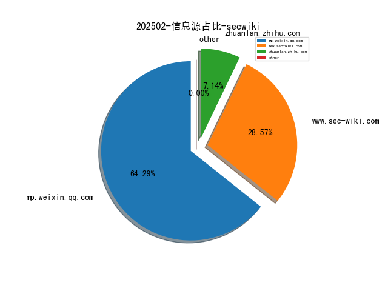
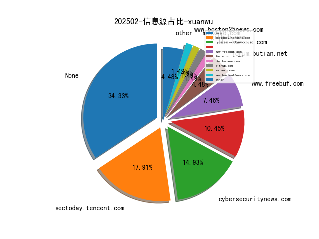
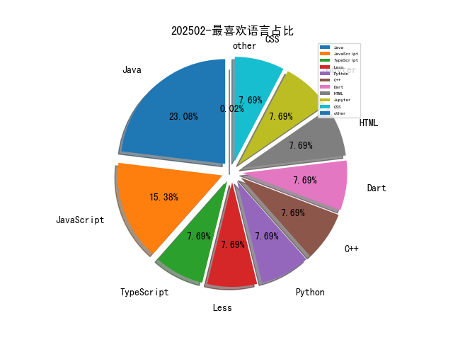

# [数据--所有](README_20.md)
# [数据--年度](README_2025.md)
# 202502 信息源与信息类型占比

# 网络安全书籍 推荐
| date_added | language | title | author | link | size| 
| --- | --- | --- | --- | --- | ---| 
| 2025-02-17 07:51:21 | English | Alice and Bob Learn Secure Coding | unknown | https://www.wowebook.org/alice-and-bob-learn-secure-coding/ | unknown| 
| 2025-02-17 07:16:24 | English | Learning LangChain | unknown | https://www.wowebook.org/learning-langchain/ | unknown| 
| 2025-02-14 08:04:43 | English | AI Agents in Action | unknown | https://www.wowebook.org/ai-agents-in-action/ | unknown| 
| 2025-02-13 07:36:03 | English | Integrating Rust | unknown | https://www.wowebook.org/integrating-rust/ | unknown| 
| 2025-02-13 12:41:43 | English | Python for Bioinformatics | unknown | https://www.wowebook.org/python-for-bioinformatics/ | unknown| 
| 2025-02-13 11:52:55 | English | Generative AI for Financial Services | unknown | https://www.wowebook.org/generative-ai-for-financial-services/ | unknown| 
| 2025-02-12 16:32:17 | English | Deep Learning Using Python | Dr. S Lovelyn Rose, Dr. L Ashok Kumar, Dr. D Karthika Renuka | http://libgen.is/book/index.php?md5=F7CC6CF22FCEB8AA42F873AC29B1B160 | 12 MB [PDF]| 
| 2025-02-12 16:08:13 | English | DevOps Tools from Practitioners Viewpoint | Deepak Gaikwad, Viral Thakkar | http://libgen.is/book/index.php?md5=DBB9E0390D8A74D3C857C8A497B3C56E | 8 MB [PDF]| 
| 2025-02-11 07:39:14 | English | Ultimate Robotics Programming with ROS 2 and Python | unknown | https://www.wowebook.org/ultimate-robotics-programming-with-ros-2-and-python/ | unknown| 
| 2025-02-10 13:52:41 | English | Weapons in Space: Technology, Politics, and the Rise and Fall of the Strategic Defense Initiative | Aaron Bateman | http://libgen.is/book/index.php?md5=871BBDF59E5CB8BC670D94F99D813AC7 | 3 MB [PDF]| 
| 2025-02-09 08:20:09 | English | The Hacker Mindset: How thinking like a hacker can improve your code, your coffee, and your life | Francesco Carlucci | http://libgen.is/book/index.php?md5=93B273CF8CC2A6F62C41AF65F0B55E8F | 1 MB [PDF]| 
| 2025-02-08 10:16:23 | English | Security Automation with Python | unknown | https://www.wowebook.org/security-automation-with-python/ | unknown| 
| 2025-02-08 09:17:01 | English | Learn Generative AI with PyTorch, Video Edition | unknown | https://www.wowebook.org/learn-generative-ai-with-pytorch-video-edition/ | unknown| 
| 2025-02-08 07:28:18 | English | Write Powerful Rust Macros, Video Edition | unknown | https://www.wowebook.org/write-powerful-rust-macros-video-edition/ | unknown| 
| 2025-02-07 11:09:43 | English | Security Automation with Python: Practical Python solutions for automating and scaling security operations | Corey Charles Sr. | http://libgen.is/book/index.php?md5=2FE0B5190BB7ECE1D28FCA99FB236DC9 | 6 MB [EPUB]| 
| 2025-02-07 09:52:25 | English | Groundwater Monitoring and Management Through Hydrogeochemical Modeling Approach | S.Chidambaram, K.Srinivasamoorthy, AL.Ramanathan, P.Anandhan, R.Manivannan, M.Bala Krishna Prasad, M | http://libgen.is/book/index.php?md5=15429CC4F9ABBE032B4018AE0D5A4FC3 | 19 MB [PDF]| 
| 2025-02-07 09:25:57 | English | Generative AI for Financial Services: Challenges, anti-patterns, and best practices (English Edition) | Vikesh Pandey, Arnav Khare | http://libgen.is/book/index.php?md5=8A3457DD43932B090CE76C2702E40F1A | 7 MB [EPUB]| 
| 2025-02-07 09:31:50 | English | Python for Bioinformatics : Using machine learning for drug discovery, cluster analysis, and phylogenetics | Verma, Parul;Fatima, Shahnaz;; Dr. Shahnaz Fatima | http://libgen.is/book/index.php?md5=1A7508BA06BF4501733B0962CB1A37BD | 9 MB [EPUB]| 
| 2025-02-07 06:02:59 | English | Super Privacy: The Complete Guide to Personal Privacy and Financial Freedom in Tomorrows Cashless Society | Bob Hammond | http://libgen.is/book/index.php?md5=78409D77ECBEA6F323616B8044B4CD71 | 12 MB [PDF]| 
| 2025-02-06 12:21:10 | English | Generative AI for Web Developers (Video Course) | unknown | https://www.wowebook.org/generative-ai-for-web-developers-video-course/ | unknown| 
| 2025-02-06 11:49:54 | English | Generative AI for Python Developers (Video Course) | unknown | https://www.wowebook.org/generative-ai-for-python-developers-video-course/ | unknown| 
| 2025-02-06 11:28:07 | English | Securing Generative AI (Video Course) | unknown | https://www.wowebook.org/securing-generative-ai-video-course/ | unknown| 
| 2025-02-06 07:55:19 | English | Programming Generative AI (Video Course) | unknown | https://www.wowebook.org/programming-generative-ai-video-course/ | unknown| 
| 2025-02-06 06:35:48 | English | Ansible Core Concepts and Advanced Features (Video Course) | unknown | https://www.wowebook.org/ansible-core-concepts-and-advanced-features-video-course/ | unknown| 
| 2025-02-06 06:09:53 | English | Certified Kubernetes Application Developer (CKAD), 4th Edition (Video Course) | unknown | https://www.wowebook.org/certified-kubernetes-application-developer-ckad-4th-edition-video-course/ | unknown| 
| 2025-02-04 08:13:48 | English | Designing Data intensive application in Python | Aarav Joshi | http://libgen.is/book/index.php?md5=8F5DAAF46BD97D6DED865619221C7E03 | 33 MB [PDF]| 
| 2025-02-04 08:12:51 | English | Doctored : Fraud, Arrogance, and Tragedy in the Quest to Cure Alzheimers | Charles Piller | http://libgen.is/book/index.php?md5=E0D1124BB0E1F8A6E4B6ED796923BF41 | 4 MB [EPUB]| 
| 2025-02-04 08:10:07 | English | Linear Algebra with Python | Hyun-Seok Sun | http://libgen.is/book/index.php?md5=26C31AD2761829DC2CD2B516704C36D2 | 21 MB [PDF]| 
| 2025-02-04 08:09:04 | English | Calculus with Python | Hyun-Seok Sun | http://libgen.is/book/index.php?md5=DC1A7739AA1CFE747F8376F833869676 | 29 MB [PDF]| 
| 2025-02-04 08:05:58 | English | Deep Learning via Rust | RantAI Academy | http://libgen.is/book/index.php?md5=CFBED536E8F97E5AC5B5F848545E0D6B | 2 MB [PDF]| 
| 2025-02-03 09:41:36 | English | Create Game with Projects in Python: Create a Game, Programming in Python, and Working with Popular Apps Using PyGame. | SCHMITT, STEPHEN G | http://libgen.is/book/index.php?md5=BE2FAE58D5B0F6A3E0D544432F3046EC | 2 MB [EPUB]| 
| 2025-02-03 08:37:15 | English | Full Stack Python Security, Video Edition | unknown | https://www.wowebook.org/full-stack-python-security-video-edition/ | unknown| 
| 2025-02-03 06:26:46 | English | Learn AI-Assisted Python Programming, Second Edition, Video Edition | unknown | https://www.wowebook.org/learn-ai-assisted-python-programming-second-edition-video-edition/ | unknown| 
| 2025-02-03 03:45:09 | English | Generative AI in Action, Video Edition | unknown | https://www.wowebook.org/generative-ai-in-action-video-edition/ | unknown| 
| 2025-02-02 00:21:02 | English | (River Publishers Series In Communications) Aspects Of Personal Privacy In Communications - Problems, Technology And Solutions | Geir M. Koien, Vladimir a. Oleshchuk | http://libgen.is/book/index.php?md5=EBBEFA459EE81F069A5D2D62394B2DC2 | 3 MB [PDF]| 
| 2025-02-02 11:41:21 | English | Essential Python Programming For GUI Development | Andrade , Wendell | http://libgen.is/book/index.php?md5=73DD15B99408F6E5F1B0416F59C10519 | 861 kB [EPUB]| 
| 2025-02-02 06:23:21 | English | MACHINE LEARNING WITH PYTHON: A Comprehensive Guide To Algorithms, Deep Learning Techniques, And Practical Applications | Planet, Code | http://libgen.is/book/index.php?md5=98381F929D701C0D9E54F98577E6EA1B | 16 MB [EPUB]| 
| 2025-02-02 06:22:03 | English | GENERATIVE AI WITH PYTHON: Harnessing The Power Of Machine Learning And Deep Learning To Build Creative And Intelligent Systems | Planet, Code | http://libgen.is/book/index.php?md5=F4BFE5E46EF502E04311242943C76F62 | 14 MB [EPUB]| 
| 2025-02-02 08:45:29 | English | Generative AI Toolbox (Video Course) | unknown | https://www.wowebook.org/generative-ai-toolbox-video-course/ | unknown| 
| 2025-02-02 19:50:05 | English | Pipeline for Automated Code Generation from Backlog Items (PACGBI) : Analysis of Potentials and Limitations of Generative AI for Web Development | Mahja Sarschar | http://libgen.is/book/index.php?md5=C22F6263079544E4A39FA01A8194F1A5 | 13 MB [EPUB]| 
| 2025-02-02 19:49:09 | English | Microsoft Excel Made Easy: A Beginner-to-Expert Guide to Mastering Spreadsheets: Learn Formulas, Functions, Data Analysis, Automation, and Advanced Excel Techniques for Work and Business | Twain, David | http://libgen.is/book/index.php?md5=796C49DD1C9C5FA9B9102EE140B19F53 | 4 MB [EPUB]| 
| 2025-02-01 13:28:55 | English | (Studies in Feminist Philosophy) Global Sweatshops: A Feminist Theory of Exploitation and Resistance (Studies in Feminist Philosophy) | Mirjam Müller | http://libgen.is/book/index.php?md5=BE8BD4B86BBA1BD51DAA9C6477D533CB | 5 MB [PDF]| 

# 微信公众号 推荐
| nickname_english | weixin_no | title | url| 
| --- | --- | --- | ---| 
| CISP | None | 总体国家安全观视角下的人工智能安全治理之道 | https://mp.weixin.qq.com/s?__biz=MzI1NzQ0NTMxMQ==&mid=2247490165&idx=1&sn=8eb493865f076e00ce0c866d22903e41 | 2| 
| ChaMd5安全团队 | None | 2025第一届“网谷杯” Writeup | https://mp.weixin.qq.com/s?__biz=MzIzMTc1MjExOQ==&mid=2247512128&idx=1&sn=c0b97c8eedff483a5eaa6bbaf00e23fa | 1| 
| Delta Insights | None | 网络安全动态 - 2025.02.27 | https://mp.weixin.qq.com/s?__biz=MzU1MzEzMzAxMA==&mid=2247499935&idx=1&sn=bcfd21ddba75f6187a35154d2e092266 | 7| 
| Evilc0de 安全团队 | None | AI驱动的安全创新：MCP技术的应用实践 | https://mp.weixin.qq.com/s?__biz=MzkzMTM3OTA0NQ==&mid=2247484808&idx=1&sn=fba4b330875250356f5e23203af26c4c | 1| 
| FreeBuf | None | 瑞典要求加密通信应用部署后门，Signal强烈反对 | https://mp.weixin.qq.com/s?__biz=MjM5NjA0NjgyMA==&mid=2651314922&idx=4&sn=5949abecd1519cefe9dc96c372419fa4 | 50| 
| Gaobai文库 | None | 2025HW招募令，结款稳定，项目稳定！ | https://mp.weixin.qq.com/s?__biz=MzkxNzIzNDExMA==&mid=2247486691&idx=1&sn=4085057c069db95609055d499d716aec | 1| 
| GoUpSec | None | Gartner：传统端点防御已经失效，“AI+零信任”才是出路 | https://mp.weixin.qq.com/s?__biz=MzkxNTI2MTI1NA==&mid=2247502457&idx=2&sn=c4f542cd143d24667c39c992115ad8c4 | 3| 
| HACK之道 | None | 强烈推荐一个永久的渗透攻防知识库 | https://mp.weixin.qq.com/s?__biz=MzIwMzIyMjYzNA==&mid=2247518136&idx=1&sn=3be51fa2b1e91ee8b8ad86df34cb1d95 | 4| 
| Hacking黑白红 | None | 上海证券交易所招聘网络安全岗、数据安全岗 | https://mp.weixin.qq.com/s?__biz=Mzg2NDYwMDA1NA==&mid=2247544458&idx=2&sn=f04dd9b419c269e5c9c7b7d42a793447 | 7| 
| ISC2网络安全 | None | 备考CISSP丨2025年4-7月CISSP官方培训计划抢先看 | https://mp.weixin.qq.com/s?__biz=MzUzNTg4NDAyMg==&mid=2247492443&idx=1&sn=bf2b867474385a2220259be16b43bd91 | 8| 
| Khan安全团队 | None | SCI一直投不中？保姆级全程投稿发表服务来了！润色、选刊、投稿、返修，直至中刊！ | https://mp.weixin.qq.com/s?__biz=MzAwMjQ2NTQ4Mg==&mid=2247497359&idx=2&sn=a8c65ec75c6f5b675c4af1b463559e2f | 14| 
| NGC660安全实验室 | None | 数字化转型安全根基，硬件安全攻防实战指南（文末抽奖福利~） | https://mp.weixin.qq.com/s?__biz=MzkyODMxODUwNQ==&mid=2247493599&idx=1&sn=009a4b0d0f6f3bf7de3be6996313e6a5 | 1| 
| NOP Team | None | 生态合作伙伴招募 | https://mp.weixin.qq.com/s?__biz=MzU1NDkwMzAyMg==&mid=2247502763&idx=2&sn=8ba837bca5ab91bd04b72d1860b23bbc | 2| 
| PokerSec | None | 【漏洞预警】NAKIVO Backup & Replication任意文件读取漏洞(CVE-2024-48248) | https://mp.weixin.qq.com/s?__biz=MzkyNTYxNDAwNQ==&mid=2247484616&idx=1&sn=75700b8df64f2127eaa8cf2e840d09f3 | 2| 
| SAINTSEC | None | JDK8从任意文件写到远程命令执行 | https://mp.weixin.qq.com/s?__biz=MjM5MjEyMTcyMQ==&mid=2651037514&idx=1&sn=0f0a8f0d2efa4f1e11b2d40efef4e9c9 | 7| 
| Secu的矛与盾 | None | wy876/POC删库了！！！快来领取备份，2025.02.21最后更新。 | https://mp.weixin.qq.com/s?__biz=Mzk0MzY3MDE5Mg==&mid=2247484102&idx=1&sn=f7fcdfa69b071486166f7daf7f2f009f | 2| 
| TtTeam | None | 2025年学历提升报名通道已开启，公开招198人，不限学历！3月1日截止！ | https://mp.weixin.qq.com/s?__biz=Mzg2NTk4MTE1MQ==&mid=2247486598&idx=1&sn=8c3be0881d59ffc0e7b50629680edd64 | 3| 
| WH0sec | None | 域渗透系列 - 通过 SMB 进行Kerberos Relay | https://mp.weixin.qq.com/s?__biz=MzkyNzQzNzc3OQ==&mid=2247484373&idx=1&sn=f96a68416fdf98feb258b7fa5f341e88 | 1| 
| WK安全 | None | 审计分析02 , 无鉴权路径拿下文件读取漏洞 | https://mp.weixin.qq.com/s?__biz=Mzg2ODg3NzExNw==&mid=2247488546&idx=1&sn=f2302057910e6f3a6440bc67ba1703ed | 1| 
| Web安全与前端 | None | 去哪儿网安全招聘：反入侵运营专家 | https://mp.weixin.qq.com/s?__biz=MzIxMDA4NzAyMQ==&mid=2247483949&idx=1&sn=007998a58ae379c0ee5aaa3f4734b35c | 1| 
| Yak Project | None | Yak 在 AI 浪潮中应该如何存活？ | https://mp.weixin.qq.com/s?__biz=Mzk0MTM4NzIxMQ==&mid=2247527752&idx=1&sn=8f4148b9f96cfd513f38ab1ec5762562 | 2| 
| Z计划支持大模型创业 | None | 「趋境科技」完成数千万元天使轮融资，高瓴与Z基金领投，清华跟投，定义大模型推理新范式｜Z计划好事发生 | https://mp.weixin.qq.com/s?__biz=MzkyMDU5NzQ2Mg==&mid=2247488061&idx=1&sn=c09cbb509a48f4fb50c8fb5e56e3a8dd | 2| 
| dotNet安全矩阵 | None | 一招鲜：通过 Windows 屏幕保护程序实现目标权限持久化 | https://mp.weixin.qq.com/s?__biz=MzUyOTc3NTQ5MA==&mid=2247499017&idx=3&sn=725ce5df98701f262561d16a901eecff | 20| 
| e安在线 | None | 2025年十大最佳DevOps工具推荐 | https://mp.weixin.qq.com/s?__biz=MzI1OTA1MzQzNA==&mid=2651247671&idx=1&sn=5f81d8d350cc9448b62c580d62ff0aa7 | 3| 
| 一个拖延症 | None | 面向新手的Git教程：打不开GitHub（二）？ | https://mp.weixin.qq.com/s?__biz=MzA4OTE5OTI5Mg==&mid=2649034043&idx=1&sn=c765992605f076a3ae47fc08ddcc8a37 | 1| 
| 丈八网安 | None | 丈八测试验证平台：筑就城市轨道交通网络安全新防线 | https://mp.weixin.qq.com/s?__biz=MzkwNzI1NDk0MQ==&mid=2247492749&idx=1&sn=21fe268b1e7c689a4e8d7ab2c9a90027 | 1| 
| 中国信息安全 | None | 评论 , 让数据产业引擎动力更强劲 | https://mp.weixin.qq.com/s?__biz=MzA5MzE5MDAzOA==&mid=2664237530&idx=5&sn=3dc98be61b9dd366f04688aeab4622ad | 58| 
| 中科天齐软件安全中心 | None | 2025年十大最佳DevOps工具推荐 | https://mp.weixin.qq.com/s?__biz=MzU5Njc4NjM3NA==&mid=2247496298&idx=1&sn=200e635e43d6b6c340e6881a6ba425ff | 2| 
| 云科安信Antira | None | 高效防御SQL注入攻击，表单动态加固了解一下！ | https://mp.weixin.qq.com/s?__biz=Mzg2NTk3NjczNQ==&mid=2247485745&idx=1&sn=3c15268c7b78b739fdda3342915d92b8 | 5| 
| 亿人安全 | None | 大一“新生”年入100万+，别人称他天才小火炬 | https://mp.weixin.qq.com/s?__biz=Mzk0MTIzNTgzMQ==&mid=2247519485&idx=1&sn=7e2ef8f69e2075169ad63e14819f28e5 | 2| 
| 亿赛通 | None | 亿赛通CDG产品例行升级通知（20250227） | https://mp.weixin.qq.com/s?__biz=MzA5MjE0OTQzMw==&mid=2666307133&idx=1&sn=f08b84f895e63e1eb794d60db1709ffe | 1| 
| 众智维安 | None | 众智维发布｜天巢SkyNest R1多模态版本 - 网络安全风险的睿智“听风者” | https://mp.weixin.qq.com/s?__biz=MzU5Mjg0NzA5Mw==&mid=2247494005&idx=1&sn=5524efb1bad095022152fff4f5441be2 | 1| 
| 信安一把索 | None | 取证工具包 - 蘇小沐大佬的取证工具整合 | https://mp.weixin.qq.com/s?__biz=Mzk0NTg3ODYxNg==&mid=2247485191&idx=1&sn=07f57e1ae41fa42619414845b1248b59 | 2| 
| 信息安全与通信保密杂志社 | None | 《网络安全2025：冲刺“十四五”》发布 | https://mp.weixin.qq.com/s?__biz=MzkwMTMyMDQ3Mw==&mid=2247597937&idx=2&sn=8f7a4e1ce51edfd479482fa39efdcc2b | 15| 
| 信息安全研究 | None | 【业界动态】黑客最不想让你看到的，2024年漏洞攻击数据真相 | https://mp.weixin.qq.com/s?__biz=MzA3NzgzNDM0OQ==&mid=2664993521&idx=3&sn=ee026e4cb14df1e7019825637039d325 | 25| 
| 傻白甜安全 | None | 震惊！ 男主趁女生怀孕出去偷吃！ | https://mp.weixin.qq.com/s?__biz=MzkxMzczNTA4MQ==&mid=2247484045&idx=1&sn=a9583547fcf909d116308310a0c12c8a | 2| 
| 全球技术地图 | None | 英国首相宣布将国防支出增加到GDP的2.5% | https://mp.weixin.qq.com/s?__biz=MzI1OTExNDY1NQ==&mid=2651619475&idx=2&sn=58d2204396754557cc15a0047f1f46a1 | 16| 
| 创宇安全智脑 | None | 创宇安全智脑 , NUUO 网络录像机 handle_site_config.php 远程命令执行等67个漏洞可检测 | https://mp.weixin.qq.com/s?__biz=MzIwNjU0NjAyNg==&mid=2247490550&idx=1&sn=7bcda616277b8dc37ec062c199225436 | 2| 
| 利刃信安 | None | 【生活琐事】硬盘 “罢工”，数据 “流浪” | https://mp.weixin.qq.com/s?__biz=MzU1Mjk3MDY1OA==&mid=2247520454&idx=1&sn=379f140f384848f04ebc3031072881a6 | 5| 
| 取证与溯源 | None | 以技证道 数海求真——第二届\"獬豸杯\"电子取证竞赛圆满落幕（文末抽奖） | https://mp.weixin.qq.com/s?__biz=MzUyOTcyNDg1OA==&mid=2247484343&idx=1&sn=fe8c9a9395cac36eaa8e1e97f67cb3bd | 4| 
| 合合信息 | None | 中国信通院“护证计划”正式启动，合合信息入选首批技术支撑单位 | https://mp.weixin.qq.com/s?__biz=MzAxMzg0NjY2NA==&mid=2247493182&idx=1&sn=ebec3bb0753f49fed3930eeb4f1b389e | 3| 
| 君说安全 | None | 离谱，现在大多数安全售前只会Ctrl+C/V方案，根本不会交流 | https://mp.weixin.qq.com/s?__biz=MzUzNjkxODE5MA==&mid=2247488662&idx=1&sn=8b0d563111223741e6b5a94d29a02544 | 11| 
| 听风安全 | None | 一次JDBC反序列化漏洞 | https://mp.weixin.qq.com/s?__biz=Mzg3NzIxMDYxMw==&mid=2247504375&idx=1&sn=1321d8f000691b7091c52ccfe42b3bc8 | 1| 
| 启明星辰安全简讯 | None | 【漏洞通告】Veeam Backup Enterprise Manager身份验证绕过漏洞（CVE-2024-29849） | https://mp.weixin.qq.com/s?__biz=MzkzNzY5OTg2Ng==&mid=2247500800&idx=2&sn=073d9340ae748aba1da028d541fa411d | 13| 
| 嘉诚安全 | None | 【漏洞通告】NAKIVO Backup & Replication任意文件读取漏洞安全风险通告 | https://mp.weixin.qq.com/s?__biz=MzU4NjY4MDAyNQ==&mid=2247497213&idx=1&sn=ec9aa0b5d5985a796ae487d9a7430c96 | 3| 
| 嘶吼专业版 | None | 幽灵勒索软件入侵了 70 个国家的组织机构 | https://mp.weixin.qq.com/s?__biz=MzI0MDY1MDU4MQ==&mid=2247581330&idx=2&sn=d82ee66de86baa524b65ad14355d83a0 | 14| 
| 天津恒御科技有限公司 | None | 2024年全国网信系统严厉打击网络违法违规行为 切实维护网络空间清朗 | https://mp.weixin.qq.com/s?__biz=MzU4NjY3OTAzMg==&mid=2247515141&idx=2&sn=2ffea74685e5a7d50c0ee9ca9883b988 | 2| 
| 天融信 | None | 回顾2024年中国网络安全十件大事 , 关于智能网联汽车安全，天融信这样说→ | https://mp.weixin.qq.com/s?__biz=MzA3OTMxNTcxNA==&mid=2650965501&idx=1&sn=5a84bb63195f7a690c0f8274f4bf6953 | 7| 
| 奇安信 CERT | None | 【已复现】NAKIVO Backup & Replication任意文件读取漏洞(CVE-2024-48248)安全风险通告 | https://mp.weixin.qq.com/s?__biz=MzU5NDgxODU1MQ==&mid=2247503053&idx=1&sn=5fed028268e1c246223907f8312cd7ab | 1| 
| 奇安信集团 | None | 超级勒索软件内部攻击技术揭秘：Black Basta泄露数据分析 | https://mp.weixin.qq.com/s?__biz=MzU0NDk0NTAwMw==&mid=2247625288&idx=2&sn=6ca429e94ffc32c4d447b10a2a41ef13 | 16| 
| 奉天安全团队 | None | 记一次黑白盒图书馆系统渗透测试 | https://mp.weixin.qq.com/s?__biz=Mzk0NjQ2NzQ0Ng==&mid=2247485074&idx=1&sn=52073de98fa9e54e63242d47873e2651 | 2| 
| 威胁猎人Threat Hunter | None | 【信贷欺诈】“公积金伪造”骗贷手法分析 | https://mp.weixin.qq.com/s?__biz=MzI3NDY3NDUxNg==&mid=2247499035&idx=1&sn=d11ef99e520f528479f5c5aae50f06e4 | 1| 
| 字节跳动技术团队 | None | 签证已下，下周回国！, 加入Trae粉丝“接机群”赢Apple Mac mini、Ola Friend耳机 | https://mp.weixin.qq.com/s?__biz=MzI1MzYzMjE0MQ==&mid=2247513590&idx=1&sn=d29aefd8b38a2b9bb74818848c730511 | 2| 
| 安世加 | None | FBI确认Bybit被盗15亿美元是朝鲜黑客所为 | https://mp.weixin.qq.com/s?__biz=MzU2MTQwMzMxNA==&mid=2247541652&idx=1&sn=92e109768cb56588dc949f7649e68cd9 | 8| 
| 安全圈 | None | 【安全圈】CVE-2025-20029：F5 BIG-IP系统发现命令注入漏洞，概念验证已发布 | https://mp.weixin.qq.com/s?__biz=MzIzMzE4NDU1OQ==&mid=2652068179&idx=4&sn=39b4a77aebadbd2051b65b5c2aeac879 | 31| 
| 安全客 | None | Bybit十五亿美元失窃案反转，竟是Safe协议开发者先“中招” | https://mp.weixin.qq.com/s?__biz=MzA5ODA0NDE2MA==&mid=2649788128&idx=1&sn=e2dbece6f830a6448fc883a3999332b0 | 3| 
| 安全帮 | None | 消失的网站，80后90后集体青春记忆，00后一脸懵？ | https://mp.weixin.qq.com/s?__biz=MzkzNjQwOTc4MQ==&mid=2247490531&idx=1&sn=07c13c76cfead9b8ab97ea8cb8d73692 | 3| 
| 安全极客 | None | 【论文速读】, TrojanWhisper：评估预训练的大语言模型以检测并定位硬件木马 | https://mp.weixin.qq.com/s?__biz=MzkzNDUxOTk2Mw==&mid=2247495992&idx=1&sn=4b4df4fb29cbb3720ecf7022ec37c95b | 5| 
| 安全洞察知识图谱 | None | .NET 内网攻防实战电子报刊 | https://mp.weixin.qq.com/s?__biz=MzkyMDM4NDM5Ng==&mid=2247490804&idx=2&sn=487da57deba2c94898f42f88b15139cc | 4| 
| 安全牛 | None | 9.9分漏洞或导致2850多台Ivanti设备系统完全受损；三星系统推出业界首款后量子加密芯片S3SSE2A , 牛览 | https://mp.weixin.qq.com/s?__biz=MjM5Njc3NjM4MA==&mid=2651135261&idx=2&sn=74d6fa6c49fbd2630c460749eb487fd3 | 16| 
| 安全狗的自我修养 | None | 我是如何通过搜索 JS 文件来获得存储的 XSS | https://mp.weixin.qq.com/s?__biz=MzkwOTE5MDY5NA==&mid=2247505256&idx=1&sn=fe6e512c928315c98fef80cbadee650b | 8| 
| 安全白白 | None | 某电子签章安全补丁绕过 | https://mp.weixin.qq.com/s?__biz=MzkyMzI3MTI5Mg==&mid=2247485388&idx=1&sn=c4747b65a03db334818fb9504870e129 | 1| 
| 安迈信科应急响应中心 | None | 【漏洞通告】NAKIVO Backup & Replication任意文件读取漏洞 | https://mp.weixin.qq.com/s?__biz=Mzg2NjczMzc1NA==&mid=2247486676&idx=1&sn=27cc3db5988b3258f4da361b685a1eab | 8| 
| 实战安全研究 | None | 实战纪实 , 真实HW漏洞流量告警分析 | https://mp.weixin.qq.com/s?__biz=MzU0MTc2NTExNg==&mid=2247491608&idx=1&sn=9914279290b9661d3de7dec861bdbd99 | 3| 
| 宸极实验室 | None | 『代码审计』曲折的代码审计 | https://mp.weixin.qq.com/s?__biz=Mzg4NTA0MzgxNQ==&mid=2247489945&idx=1&sn=2fc404e8e2fc7fbf27963c4d5161504c | 3| 
| 富贵安全 | None | 什么？HW要开始了？ | https://mp.weixin.qq.com/s?__biz=MzkxNzY5MTg1Ng==&mid=2247485928&idx=2&sn=afb4cf74044c6bd419812631430a403b | 6| 
| 小C学安全 | None | 【渗透工具】国密(SM)系列加解密工具2.0SM_Decrypt | https://mp.weixin.qq.com/s?__biz=MzU5NTEwMTMxMw==&mid=2247485670&idx=1&sn=2e3b61095611cdef5d5cd9dadd854fd9 | 1| 
| 小红书技术REDtech | None | KDD2025｜小红书联合中科大提出1.44M轻量高效AI图像检测模型，超SOTA 4.5个点 | https://mp.weixin.qq.com/s?__biz=Mzg4OTc2MzczNg==&mid=2247492193&idx=1&sn=57fee917dfb38469aad296f1ea625184 | 2| 
| 小谢取证 | None | 实战案例分享:微信小程序抓包（简单详细易上手版） | https://mp.weixin.qq.com/s?__biz=Mzg4MTcyMTc5Nw==&mid=2247488493&idx=1&sn=a33b931700102ae3ce9eef7de2021cc8 | 2| 
| 山石网科新视界 | None | 山石网科亮相2025阿里云PolarDB开发者大会 | https://mp.weixin.qq.com/s?__biz=MzAxMDE4MTAzMQ==&mid=2661298805&idx=1&sn=e60bb768d32ba1382d5dadae2505baa9 | 10| 
| 工业信息安全产业发展联盟 | None | 深度解析,《个人信息保护合规审计管理办法》解读与域外实践解析 | https://mp.weixin.qq.com/s?__biz=MzUyMzA1MTM2NA==&mid=2247499183&idx=1&sn=5a4b2795d7b40ca2c0a44e53a117f908 | 1| 
| 微步在线 | None | 黑客最不想让你看到的，2024年漏洞攻击数据真相 | https://mp.weixin.qq.com/s?__biz=MzI5NjA0NjI5MQ==&mid=2650183236&idx=1&sn=1727469ff3beeb950542f8ae4d57d40b | 1| 
| 恒脑与AI | None | AI 安全警报！“劫持思维链”攻击，带“偏”大模型 | https://mp.weixin.qq.com/s?__biz=MzI1MDU5NjYwNg==&mid=2247496715&idx=1&sn=40e0b437daf97524ac82e20ffa754709 | 3| 
| 情报分析师 | None | 蒙古国大会背后——中蒙生态与军事的双重较量 | https://mp.weixin.qq.com/s?__biz=MzA3Mjc1MTkwOA==&mid=2650559964&idx=2&sn=243d1c22de622ed18b9b35c98e021d79 | 16| 
| 情报分析师Pro | None | 【独家】美欧关系决裂？透视跨大西洋关系的裂痕与深层动因 | https://mp.weixin.qq.com/s?__biz=MzkwNzM0NzA5MA==&mid=2247506370&idx=1&sn=d4fa3ed8b1a425b5fee06ae6e8a10189 | 11| 
| 托尼交易笔记 | None | 这就是绝对盘感 | https://mp.weixin.qq.com/s?__biz=MzIzNzMxMDkxNw==&mid=2247493517&idx=1&sn=941c2670bf9fda9c3f98ca994b8343fd | 2| 
| 技术修道场 | None | 微软修复由 DNS 变更导致的 Entra ID 身份验证问题 | https://mp.weixin.qq.com/s?__biz=MzA4NTY4MjAyMQ==&mid=2447900227&idx=1&sn=8855970eac68119ef9811baa007c366c | 1| 
| 护卫神说安全 | None | 帝国CMS8.0抢先体验，如何提升安全防护能力 | https://mp.weixin.qq.com/s?__biz=MzkxMTMyOTg4NQ==&mid=2247484107&idx=1&sn=392b574b90468574627cc151d10dab2e | 1| 
| 挖个洞先 | None | 【转载】XX多业务融合网关小小DAY II | https://mp.weixin.qq.com/s?__biz=MzkyNjY3OTI4Ng==&mid=2247484726&idx=1&sn=ebe3396d1420cc41010fa91c662dc8a6 | 3| 
| 攻城狮成长日记 | None | 别让通配符限制你的Ansible Fetch操作，这里有破解之道！ | https://mp.weixin.qq.com/s?__biz=MjM5OTc5MjM4Nw==&mid=2457387338&idx=1&sn=0883d95f3564971ca7c3b6168d54ea33 | 2| 
| 数默科技 | None | 取证培训 即将开班！ | https://mp.weixin.qq.com/s?__biz=Mzk0MDQ5MTQ4NA==&mid=2247487549&idx=1&sn=c634007f43cb68afd029260d1c0afbbd | 4| 
| 明暗安全 | None | 从攻击者视角看动态密钥Key：如何绕过小程序的“铜墙铁壁”？ | https://mp.weixin.qq.com/s?__biz=MzkxMjYxODcyNA==&mid=2247485502&idx=1&sn=c41f38295564324abcdfd33e4365edc3 | 1| 
| 星尘安全 | None | Kubernetes 安全大揭秘：从攻击面剖析到纵深防御体系构建（下） | https://mp.weixin.qq.com/s?__biz=Mzg3NTY0MjIwNg==&mid=2247485702&idx=1&sn=9e94334c2dce202e97705fa822619964 | 3| 
| 星悦安全 | None | 【0day漏洞分析】WordPress Yawave插件存在前台SQL注入漏洞(CVE-2025-1648) | https://mp.weixin.qq.com/s?__biz=Mzg4MTkwMTI5Mw==&mid=2247489105&idx=1&sn=224715ee4e240f98617531d910c0e58c | 12| 
| 杂七杂八聊安全 | None | 漏洞分析 , Apache SkyWalking从SQL注入到RCE | https://mp.weixin.qq.com/s?__biz=Mzg5Njg5ODM0OQ==&mid=2247485997&idx=1&sn=55f4733683a9a17eeefdcc98d83f961d | 1| 
| 杰哥就是逊 | None | 来混《圈》 | https://mp.weixin.qq.com/s?__biz=MzkxNTczMjA1Ng==&mid=2247484012&idx=1&sn=b7cc7e3e88243e4f10b6ce9cb21f9183 | 1| 
| 林言的安全圈 | None | 攻防教程4==》社会工程学(下) | https://mp.weixin.qq.com/s?__biz=MzkwMTY3MjkwNQ==&mid=2247483710&idx=1&sn=850f6e891a53fceecf5858df551ef9a2 | 1| 
| 森柒柒 | None | 人心中的成见是一座大山。 | https://mp.weixin.qq.com/s?__biz=MzU2MDkzMTk3Mg==&mid=2247485376&idx=1&sn=5bdf4c90d735d84312475f42c7908630 | 1| 
| 浅安安全 | None | 工具 , EnhancedBurpGPT | https://mp.weixin.qq.com/s?__biz=MzkwMTQ0NDA1NQ==&mid=2247492383&idx=4&sn=e661e33dd71b548d1bbaf0022247a55f | 8| 
| 深潜sec安全团队 | None | (0day)漏洞预警 , 安美数字酒店宽带运营系统SQL注入漏洞 | https://mp.weixin.qq.com/s?__biz=Mzg3NDc3NDQ3NA==&mid=2247484683&idx=1&sn=c7a8d6ddd718f3548f93acb0adbccb24 | 1| 
| 渗透云笔记 | None | 通过DeepSeek和通义千问AI，实现越权漏洞检测 | https://mp.weixin.qq.com/s?__biz=MzU2NzkxMDUyNg==&mid=2247492129&idx=1&sn=483d21c406053478013a0aada7145b74 | 1| 
| 湖南省网络空间安全协会 | None | 名为“StaryDobry”的大规模恶意软件活动爆发 | https://mp.weixin.qq.com/s?__biz=MzAwMTg3MDQzOA==&mid=2247511558&idx=1&sn=ebcc69c1d6e79558b20a429535ec14c3 | 1| 
| 火绒安全 | None | 诚邀渠道合作伙伴共启新征程 | https://mp.weixin.qq.com/s?__biz=MzI3NjYzMDM1Mg==&mid=2247524506&idx=2&sn=ec451d5cbc8f8eb3f2b617019a2423dc | 10| 
| 爱唠叨的Nil | None | deepseek热潮中安全思考 | https://mp.weixin.qq.com/s?__biz=MzkyMDY4MTc2Ng==&mid=2247484013&idx=1&sn=a16409fce0006cce7f2ba6f07cc08d89 | 1| 
| 狐狸说安全 | None | 2025HVV人才招募令 | https://mp.weixin.qq.com/s?__biz=MzUzMDQ1MTY0MQ==&mid=2247506707&idx=1&sn=248c9696cafd27624e6a2160aa89499b | 1| 
| 独眼情报 | None | bybit启动悬赏计划以追回被盗资金并发布初步事件分析报道 | https://mp.weixin.qq.com/s?__biz=MzkzNDIzNDUxOQ==&mid=2247495551&idx=3&sn=4690b1be46e056cd2ecb9fb0041a9ad1 | 32| 
| 珞安科技 | None | 黑客的钥匙：无线门禁攻防实战 | https://mp.weixin.qq.com/s?__biz=MzU2NjI5NzY1OA==&mid=2247512484&idx=1&sn=c55b4a7c114aca61059c7f3339c0988b | 2| 
| 琴音安全 | None | 2025HVV招募人才招募令 | https://mp.weixin.qq.com/s?__biz=Mzg3NTk4MzY0MA==&mid=2247487988&idx=1&sn=ff480a311bcd73011ad3bb5bc2d4829f | 1| 
| 电子取证wiki | None | 以技证道 数海求真——第二届\"獬豸杯\"电子取证竞赛圆满落幕（文末抽奖） | https://mp.weixin.qq.com/s?__biz=MzkzNTQzNTQzMQ==&mid=2247485578&idx=1&sn=f75387dd8a42284ee96bfbbef78747a3 | 3| 
| 白帽子左一 | None | 封神台靶场上新：前端加解密对抗 | https://mp.weixin.qq.com/s?__biz=MzI4NTcxMjQ1MA==&mid=2247615586&idx=2&sn=decea4c6292387a6e28bb80214a8a12d | 5| 
| 白帽子社区团队 | None | 协助官方撕开“抖yin”等app的神秘面纱,远程取证经验分享 | https://mp.weixin.qq.com/s?__biz=MzkzNDQ0MDcxMw==&mid=2247487442&idx=1&sn=8cd99928e7bd4c6b4d46f2ac20bae5e0 | 2| 
| 白帽学子 | None | 这能一样吗 | https://mp.weixin.qq.com/s?__biz=MzkyNzIxMjM3Mg==&mid=2247489447&idx=2&sn=9cdb24a65cf43f4681ed0e7d0a2a5a31 | 11| 
| 白泽安全实验室 | None | 针对软件自由开发者的网络攻击活动——“DeceptiveDevelopment” | https://mp.weixin.qq.com/s?__biz=MzI0MTE4ODY3Nw==&mid=2247492556&idx=1&sn=caeb4bd6ed9e5101b86a176c28f728bf | 3| 
| 看雪学苑 | None | 直播预约 , 使用硬件调试器认识ARM64的四大特权级 | https://mp.weixin.qq.com/s?__biz=MjM5NTc2MDYxMw==&mid=2458590191&idx=4&sn=687a8700fe48fbeee032399623af2bbf | 30| 
| 知攻善防实验室 | None | 天狐渗透工具箱-社区版V1.2正式发布（附最新工具包版-助力HVV季）！ | https://mp.weixin.qq.com/s?__biz=MzkxMTUwOTY1MA==&mid=2247490315&idx=1&sn=6c9a781d8d55b118faefe56255865de1 | 3| 
| 知机安全 | None | 黑客新闻-SOC3.0时代全面到来：AI如何重构网络安全防线？ | https://mp.weixin.qq.com/s?__biz=MzIzNDU5NTI4OQ==&mid=2247488630&idx=2&sn=c36156723ac118e277e3d93ed80da2ed | 7| 
| 知道创宇404实验室 | None | 404星链计划 , 一大波项目版本更新 | https://mp.weixin.qq.com/s?__biz=MzAxNDY2MTQ2OQ==&mid=2650990729&idx=1&sn=94dcc820e45ae45ea946896a750a2dd0 | 3| 
| 等保测评咨询服务 | None | 上海企业福利来袭：免费漏洞检测，守护您的数据安全！ | https://mp.weixin.qq.com/s?__biz=MzkyNTY5NTc2NQ==&mid=2247484149&idx=1&sn=5d4bbf203965b23c9cc8c9d32115c702 | 1| 
| 红日安全 | None | 招hvv上瘾的人 带你快乐赚钱 | https://mp.weixin.qq.com/s?__biz=MzI4NjEyMDk0MA==&mid=2649851808&idx=1&sn=7d4d778185bfec73632e35f0ddcbf34e | 1| 
| 红细胞安全实验室 | None | Cursor+DeepSeek编程 | https://mp.weixin.qq.com/s?__biz=MzkxMjY1NDMxMg==&mid=2247485673&idx=1&sn=926c5fd9d180f81548ed805615f5e805 | 1| 
| 网安小趴菜 | None | 一个 Web 靶场的纯思路文..... | https://mp.weixin.qq.com/s?__biz=Mzg3ODk1MjI5NQ==&mid=2247484652&idx=1&sn=6012088b5e3c0a4bc14db51e0ad765d2 | 2| 
| 网安观察室XQ | None | 网络安全态势周报（2月17日-2月23日）2025年第7期 | https://mp.weixin.qq.com/s?__biz=MzkzNjM4ODc3OQ==&mid=2247485714&idx=1&sn=47dcf5a6d5d79416c36baf0c928bde15 | 2| 
| 网络安全 | None | 手机系统一直不更新可能被黑 | https://mp.weixin.qq.com/s?__biz=MzA4OTM1MzkwNg==&mid=2652895533&idx=1&sn=4d81702c4caffd87a99a2047c9fc619c | 1| 
| 网络安全与取证研究 | None | Sigma规则框架 | https://mp.weixin.qq.com/s?__biz=Mzg3NTU3NTY0Nw==&mid=2247489626&idx=1&sn=ed134487d8f7675b284fcd042f948a5e | 6| 
| 网络安全和信息化 | None | AI自动生成处方是否可为？ | https://mp.weixin.qq.com/s?__biz=MjM5MzMwMDU5NQ==&mid=2649171081&idx=2&sn=205b3c6dbdb613f3a38bb2d7db7fe364 | 20| 
| 网络安全等级保护小学堂 | None | 今日网络安全资讯推送【2025-02-27】 | https://mp.weixin.qq.com/s?__biz=MzU1ODgwNDYwNg==&mid=2247484267&idx=1&sn=aa478678430a6e8e2db5b0b74b8226c4 | 1| 
| 网络技术干货圈 | None | 2025年了，这些证书，网工可以开始准备考了！ | https://mp.weixin.qq.com/s?__biz=MzUyNTExOTY1Nw==&mid=2247528328&idx=1&sn=a05df6e25290a711508731de7e400990 | 8| 
| 网络技术联盟站 | None | IPv4 和 IPv6大家都很熟悉了，IPv5、IPv7、 IPv8、 IPv9存在吗？ | https://mp.weixin.qq.com/s?__biz=MzIyMzIwNzAxMQ==&mid=2649465551&idx=1&sn=c013323c9ae6dea080a05a1ca3dcaf1b | 11| 
| 联想全球安全实验室 | None | LLM应用安全风险演进：OWASP LLM应用Top10风险2023版与2025版对比分析 | https://mp.weixin.qq.com/s?__biz=MzU1ODk1MzI1NQ==&mid=2247491670&idx=1&sn=6280c36026f765ffdb60ad563ac7d2a8 | 2| 
| 能信安资讯 | None | 能信安：漏洞通告 | https://mp.weixin.qq.com/s?__biz=MzI1MTYzMjY1OQ==&mid=2247490978&idx=1&sn=0603f40b2f130b53e05b709248fb079c | 5| 
| 菜根网络安全杂谈 | None | 网络空间安全专业本科到底学些什么 | https://mp.weixin.qq.com/s?__biz=MzI5MTIwOTQ5MA==&mid=2247487729&idx=1&sn=00cedf8b060535d5e822ae6690e07d00 | 2| 
| 菜狗安全 | None | JAVA代审之crmeb_java | https://mp.weixin.qq.com/s?__biz=Mzg4MzkwNzI1OQ==&mid=2247485973&idx=1&sn=e7ec3cb2d72d0a7c626066722c429171 | 1| 
| 菜鸟学信安 | None | PotatoTool一款功能强大的网络安全综合工具支持免杀、自定义内存马、提权、扫描、一键解密、AI分析、溯源等等 | https://mp.weixin.qq.com/s?__biz=MzU2NzY5MzI5Ng==&mid=2247505428&idx=1&sn=f80ad300b1201cf96e3fcaba43503b5b | 3| 
| 蓝胖子之家 | None | 最快的满血deepseek r1免费用 | https://mp.weixin.qq.com/s?__biz=MzU1NDg4MjY1Mg==&mid=2247488677&idx=1&sn=e5fe58e3ea712a3d3aaa2266951b6be5 | 1| 
| 谷安培训 | None | 转型抓手！信安管理者的“战略指南针”u200c | https://mp.weixin.qq.com/s?__biz=MzU4MjUxNjQ1Ng==&mid=2247522008&idx=2&sn=a9c6a99e9acb3ddbcd97c94c488848ea | 12| 
| 谷安天下 | None | 邀您参加 , OffSec OSEE（EXP-401）高级 Windows 漏洞利用开发 | https://mp.weixin.qq.com/s?__biz=MzU4NDExNDQwNA==&mid=2247490030&idx=1&sn=599e9314b2be9d0fee4c225aceed856e | 3| 
| 贝雷帽SEC | None | 【红队】一款APP病毒分析、挖掘、HW行动/红队/渗透测试团队为场景的移动端辅助分析工具 | https://mp.weixin.qq.com/s?__biz=Mzk0MDQzNzY5NQ==&mid=2247493253&idx=1&sn=76ff3d06947277c2855365651fc7ff08 | 1| 
| 贫僧法号云空 | None | 锐明技术Crocus系统 RepairRecord.do SQL注入漏洞 | https://mp.weixin.qq.com/s?__biz=Mzg4OTkwMDc1Mg==&mid=2247484821&idx=1&sn=a5ce5d492958d3926abe275e3169f620 | 1| 
| 赛宁网安 | None | 以演筑防，以练备战！赛宁网安实用型靶场筑牢电力应急保障防线 | https://mp.weixin.qq.com/s?__biz=MzA4Mjk5NjU3MA==&mid=2455488462&idx=1&sn=5d9a014b082a1269a9cda1ad18a4fd2d | 2| 
| 赛查查 | None | 全网最全之数证杯团体决赛wp | https://mp.weixin.qq.com/s?__biz=Mzk0NTU0ODc0Nw==&mid=2247491977&idx=3&sn=44101646582f34ac9a2c229cb7d09877 | 17| 
| 迪普科技 | None | 迪普科技2025届春季校园招聘正式启动！ | https://mp.weixin.qq.com/s?__biz=MzA4NzE5MzkzNA==&mid=2650371763&idx=1&sn=a4b335a535426711135d7dfb9539d669 | 2| 
| 邑安全 | None | Cisco Nexus 交换机漏洞允许攻击者触发 DoS 条件 | https://mp.weixin.qq.com/s?__biz=MzUyMzczNzUyNQ==&mid=2247523576&idx=4&sn=9ca39af0d0b4423c729b0d33d57f7c9e | 12| 
| 钟毓安全 | None | 护网直通车 | https://mp.weixin.qq.com/s?__biz=MzkzNjM5NDU0OA==&mid=2247486244&idx=1&sn=2b180dcfa7180da9963eec1137dde5be | 2| 
| 长亭安全观察 | None | 创新发布 AI to AI 测试｜长亭科技「AIGC安全评估服务」强势来袭 | https://mp.weixin.qq.com/s?__biz=MzkyNDUyNzU1MQ==&mid=2247486891&idx=1&sn=72fa9b91e119e2811e49ae4aa9880cc0 | 8| 
| 长弓三皮 | None | 21150_ctfshow_misc_两行代码一纸情书xa0writeup | https://mp.weixin.qq.com/s?__biz=MzU2NzIzNzU4Mg==&mid=2247489678&idx=1&sn=dae5021e4da6165f748782a641a7ab6a | 5| 
| 长风实验室 | None | 远程安全评估系统详解 | https://mp.weixin.qq.com/s?__biz=Mzg4MDY1MzUzNw==&mid=2247498034&idx=1&sn=8eb3db0498136b55b58046069bde4f2d | 1| 
| 阿乐你好 | None | 思想不滑坡，方法肯定比困难多。 | https://mp.weixin.qq.com/s?__biz=MzIxNTIzNTExMQ==&mid=2247491193&idx=1&sn=b95383301e963b9c4cfe22cf0c3a3f09 | 6| 
| 风铃Sec | None | 工具集：AppMessenger【一款适用于以APP病毒分析、APP漏洞挖掘等场景的Android、iOS、鸿蒙辅助分析工具】 | https://mp.weixin.qq.com/s?__biz=Mzk0MjY1ODE5Mg==&mid=2247485535&idx=1&sn=9353f37816943231d9288b3379447b41 | 4| 
| 马哥网络安全 | None | K8s 从入门到精通！这篇真绝了！ | https://mp.weixin.qq.com/s?__biz=MzkxMzMyNzMyMA==&mid=2247571348&idx=2&sn=454a78541628db9f968c8586fe3249dd | 18| 
| 骨哥说事 | None | 朝鲜黑客如何攻破Bybit金库？-教科书级的社会工程学攻击与区块链安全启示录 | https://mp.weixin.qq.com/s?__biz=MjM5Mzc4MzUzMQ==&mid=2650260640&idx=1&sn=6d8c0cf43cbd164b1845939eb204bc96 | 6| 
| 魔都安全札记 | None | 大反转！Bybit 被盗 15 亿美金竟是 Safe 协议开发者被入侵 | https://mp.weixin.qq.com/s?__biz=Mzg4NzQ4MzA4Ng==&mid=2247485361&idx=1&sn=09aa094cd73e0204168b31484cb4eb34 | 8| 
| 黑伞安全 | None | Deepseek助力职场办公效能提升课程 | https://mp.weixin.qq.com/s?__biz=MzU0MzkzOTYzOQ==&mid=2247489731&idx=2&sn=5ca1960dec06f12f9eda6b153b6d87cd | 3| 
| 黑客联盟l | None | 朝鲜黑客是如何实现15亿美元的加密货币盗窃案——史上最大规模 | https://mp.weixin.qq.com/s?__biz=MzA5NzQxMTczNA==&mid=2649166995&idx=3&sn=9c7aae006c0da4bda0e43b234fc9fece | 6| 
| 黑白之道 | None | 若依Vue框架漏洞检测工具，包括 Swagger、Druid、文件下载漏洞、SQL 注入、定时任务漏洞和任意密码修改漏洞等 | https://mp.weixin.qq.com/s?__biz=MzAxMjE3ODU3MQ==&mid=2650608698&idx=4&sn=de507df2d357c4b2dee963005b2438c4 | 19| 
| 龙哥网络安全 | None | 【2025版】最新Linux 命令整理大全（非常详细）零基础入门到精通，收藏这篇就够了 | https://mp.weixin.qq.com/s?__biz=MzU3MjczNzA1Ng==&mid=2247496450&idx=2&sn=093ea96f68265ec68d52707daf26ca86 | 13| 
| 0xh4ck3r | None | 雷池WAF动态防护技术实测 | https://mp.weixin.qq.com/s?__biz=Mzg4NDg3NjE5MQ==&mid=2247485804&idx=1&sn=f1c0fabffff34a8d82533b8861944963 | 7| 
| 360安全应急响应中心 | None | 360SRC x 2025阿里白帽大会，满满精彩只等你来！ | https://mp.weixin.qq.com/s?__biz=MzkzOTIyMzYyMg==&mid=2247495001&idx=1&sn=e25328bccaf9633a3ad9e3bea2d5e617 | 3| 
| AI与安全 | None | 让DeepSeek做你的系统管理员(文末抽奖送书) | https://mp.weixin.qq.com/s?__biz=Mzg5NTMxMjQ4OA==&mid=2247485654&idx=1&sn=2bffb4f5a03268e6b5220a9b70f1e506 | 3| 
| IoT物联网技术 | None | 李彦宏掷出回旋镖，百度不响，悄然拥抱DeepSeek，蓦然回首，躲在小角落里的文心一言无奈开源 | https://mp.weixin.qq.com/s?__biz=MjM5OTA4MzA0MA==&mid=2454936945&idx=1&sn=9d0369865559e861459da8a924aac2bf | 2| 
| M01N Team | None | 每周蓝军技术推送（2025.2.14-2.21） | https://mp.weixin.qq.com/s?__biz=MzkyMTI0NjA3OA==&mid=2247494074&idx=1&sn=2f6a65b4a868fb988e588b715d2379f3 | 1| 
| OneTS安全团队 | None | 红队攻防实战篇-曲折的渗透记录（附内部工具） | https://mp.weixin.qq.com/s?__biz=MzkxMDY3MzQyNQ==&mid=2247484828&idx=1&sn=5f6f108ac0d73b36d84ac04858afc05c | 1| 
| Ots安全 | None | Java运行时反向工程工具（注入DLL，运行时字节码和堆分析） | https://mp.weixin.qq.com/s?__biz=MzAxMjYyMzkwOA==&mid=2247527966&idx=2&sn=ad22711908e7debb0cc0670ec4721807 | 17| 
| RedTeam | None | [开源 Prompt] AI 增强的漏洞优先级排序 | https://mp.weixin.qq.com/s?__biz=Mzg5NjAxNjc5OQ==&mid=2247484194&idx=1&sn=ba76460d3a11bacb42d7e202d16181ae | 4| 
| RedTeaming | None | 浏览器指纹的恶意窃取与利用 | https://mp.weixin.qq.com/s?__biz=MzUyMDgzMDMyMg==&mid=2247484587&idx=1&sn=6d1d5282876dd30e9ae780af173f0a77 | 2| 
| SecurityBug | None | 深入浅出反序列化漏洞 | https://mp.weixin.qq.com/s?__biz=Mzg3MzUxNDQwNg==&mid=2247483861&idx=1&sn=ca8fc5e2159d6341dff7ffbe48977ce6 | 1| 
| XCTF联赛 | None | TPCTF 2025｜清北联袂 硬核赛场 | https://mp.weixin.qq.com/s?__biz=MjM5NDU3MjExNw==&mid=2247515494&idx=1&sn=0ada1274e178c3e56fad01aad6d82aec | 1| 
| Z0安全 | None | 【HW必备】基于各大企业信息API的信息收集工具--ENScan | https://mp.weixin.qq.com/s?__biz=Mzk0OTY2ODE1NA==&mid=2247485072&idx=1&sn=4b1e617ab58102e78cc48dc09b9c2f3e | 2| 
| i春秋 | None | CTF实战技能特训营上新，小白的逆袭之路由此开启！ | https://mp.weixin.qq.com/s?__biz=MzUzNTkyODI0OA==&mid=2247527659&idx=1&sn=43e7c39b9652b6c27939445acd82940b | 1| 
| moonsec | None | 【域渗透】 转储凭据 – LSASS 进程哈希 | https://mp.weixin.qq.com/s?__biz=MzAwMjc0NTEzMw==&mid=2653588806&idx=1&sn=9864ac6916eb26357e063bdca920f984 | 3| 
| solar应急响应团队 | None | 【工具分享】Ims00rry勒索病毒恢复工具 | https://mp.weixin.qq.com/s?__biz=MzkyOTQ0MjE1NQ==&mid=2247497530&idx=1&sn=fb4d005dbf1d3e9bd6ec175df611f249 | 3| 
| 不止Security | None | 一键过滤burpsuite杂包，实现精准抓包 | https://mp.weixin.qq.com/s?__biz=MzU3OTYxNDY1NA==&mid=2247485102&idx=1&sn=fd23675f3fa4d68df7840c740addb28b | 5| 
| 中国电信安全 | None | 聊热点｜网络犯罪转向社交媒体，攻击量达历史新高、27亿条物联网数据泄露，98%物联网设备未曾加密…… | https://mp.weixin.qq.com/s?__biz=MzkxNDY0MjMxNQ==&mid=2247533238&idx=2&sn=2fd95f138ba68a5651c8e119bf1c57e9 | 8| 
| 中国网络空间安全协会 | None | 中央网信办发布2025年“清朗”系列专项行动整治重点 | https://mp.weixin.qq.com/s?__biz=MzA3ODE0NDA4MA==&mid=2649401295&idx=1&sn=edfbba7c3e088315eb4d878c88d8b11c | 1| 
| 中国软件评测中心 | None | 【工信动态】多部门将出台举措促进民营经济发展 | https://mp.weixin.qq.com/s?__biz=MjM5NzYwNDU0Mg==&mid=2649249820&idx=2&sn=2238e80539263a2d476a25176b22205c | 8| 
| 乌雲安全 | None | 长亭科技安全岗位招聘！ | https://mp.weixin.qq.com/s?__biz=MzAwMjA5OTY5Ng==&mid=2247525792&idx=1&sn=5862b464ba7a3a914fac8050c0e5a152 | 4| 
| 云淡纤尘 | None | 解锁电子取证“破案密码”，抽限量警察小熊！转发并回复【抽奖】赢正义萌物 | https://mp.weixin.qq.com/s?__biz=MzkyOTQ4NTc3Nw==&mid=2247485537&idx=1&sn=5bdc45286f67b5ab41db79afcd010ea7 | 4| 
| 亚信安全 | None | 倒计时1天 , 亚信安全2025年会暨10周年庆典活动即将开启！ | https://mp.weixin.qq.com/s?__biz=MjM5NjY2MTIzMw==&mid=2650621130&idx=2&sn=1b0d53c56d5af8cedc53fa280edee06c | 6| 
| 信息安全D1net | None | 网络威胁剧变：社交攻击暴增300% | https://mp.weixin.qq.com/s?__biz=MzA3NTIyNzgwNA==&mid=2650259905&idx=1&sn=4404abb9347935e49f14392f30aa78a1 | 4| 
| 信息安全国家工程研究中心 | None | 仿冒DeepSeek的手机木马病毒被捕获！警惕AI便利背后的安全隐患 | https://mp.weixin.qq.com/s?__biz=MzU5OTQ0NzY3Ng==&mid=2247498904&idx=1&sn=6154d9cc3e52f58226e41024809ee4af | 4| 
| 儒道易行 | None | 《论语别裁》第01章 学而（05）三家店卖的是什么 | https://mp.weixin.qq.com/s?__biz=Mzg5NTU2NjA1Mw==&mid=2247500829&idx=1&sn=0c4c8406ce2318ce0335471e36a639ae | 4| 
| 内生安全联盟 | None | 人工智能正在彻底改变技术行业，网络犯罪生态系统也是如此 | https://mp.weixin.qq.com/s?__biz=Mzg4MDU0NTQ4Mw==&mid=2247529255&idx=2&sn=78cf4309911b41444734015984d38516 | 12| 
| 农夫安全团队 | None | 奋斗者协议 | https://mp.weixin.qq.com/s?__biz=MzI0MzQ4NTI1OA==&mid=2247484870&idx=1&sn=4a26e67d170b30b7c3b3d295ff2654cf | 1| 
| 农夫安全开源计划 | None | 奋斗者协议 | https://mp.weixin.qq.com/s?__biz=MzkxOTMzNDkwOA==&mid=2247484272&idx=1&sn=443b64f1951599426551fbf0227fef07 | 1| 
| 北京磐石安科技有限公司 | None | 北京·全职渗透测试工程师 | https://mp.weixin.qq.com/s?__biz=MzkwNDI0MjkzOA==&mid=2247485885&idx=1&sn=b64813a46ab7d4312541113abd457376 | 3| 
| 北京路劲科技有限公司 | None | 子网划分：从入门到精通，一文搞懂网络工程师必备技能！ | https://mp.weixin.qq.com/s?__biz=MzUyMjAyODU1NA==&mid=2247492010&idx=1&sn=ab8355aca7ac97828f390debe3efa85f | 3| 
| 吉祥快学网络安全吧 | None | 奇安信春招二面的问题 | https://mp.weixin.qq.com/s?__biz=MzkzMzcxNTQyNw==&mid=2247485849&idx=3&sn=b0bb05a8a007a819b86bb5abbbfe7a1e | 11| 
| 吉祥讲安全 | None | 日薪2700的机会来了。。。 | https://mp.weixin.qq.com/s?__biz=MzkwNjY1Mzc0Nw==&mid=2247486910&idx=2&sn=db92a5b3346a6f4c31084c8e417d6283 | 9| 
| 启明星辰网络空间安全教育 | None | 认可+1！启明星辰知白学院荣获中国移动“赋能建功”2024年度网络安全技能系列竞赛优秀支撑单位荣誉称号 | https://mp.weixin.qq.com/s?__biz=MzUzNDg0NTc1NA==&mid=2247510572&idx=1&sn=4af3ce7753539b9f49a92b276d501f1d | 1| 
| 哔哩哔哩技术 | None | ClickHouse BSI与字典服务在B站商业化DMP中的应用实践 | https://mp.weixin.qq.com/s?__biz=Mzg3Njc0NTgwMg==&mid=2247502497&idx=1&sn=3c9a0719884d7fc4c609d9cbb97467d2 | 1| 
| 四叶草安全 | None | BugScan-AI｜筑牢AI模型安全防线 | https://mp.weixin.qq.com/s?__biz=MjM5MTI2NDQzNg==&mid=2654552323&idx=1&sn=1c3eaa3192dcdae734ed2215c4e38ad1 | 1| 
| 国源天顺 | None | 等保相关的国标、行标术语（一） | https://mp.weixin.qq.com/s?__biz=Mzg3MTU1MTIzMQ==&mid=2247496263&idx=1&sn=8e9936c4e977895257e3bb9662f8f4c3 | 1| 
| 国舜股份 | None | 【国舜就是自动化告警研判】“自动化+AI”赋能安全运营战斗力提升 | https://mp.weixin.qq.com/s?__biz=MzA3NjU5MTIxMg==&mid=2650575282&idx=1&sn=4f53408f9830f5cd671f62d6f67ecbeb | 1| 
| 国际云安全联盟CSA | None | 联合主办丨The 8th Autocs 2025智能汽车信息安全大会暨展览会 | https://mp.weixin.qq.com/s?__biz=MzkwMTM5MDUxMA==&mid=2247504375&idx=1&sn=51d7a9026814b535c8e2717cf87ede9a | 3| 
| 天创培训 | None | 天创CISP2月开班倒计时！新老学员速速集结，福利加码！ | https://mp.weixin.qq.com/s?__biz=MzA3OTM4Mzc5OQ==&mid=2650105222&idx=1&sn=76ac75f7aaaa11fd2a9de8be3f78fa81 | 1| 
| 天融信教育 | None | 天融信：个人信息保护合规审计5月1日施行，走好六步上牢“安全锁” | https://mp.weixin.qq.com/s?__biz=MzU0MjEwNTM5Ng==&mid=2247520459&idx=1&sn=0f15d4be9a628cb420948e1b24eec53c | 3| 
| 天际友盟 | None | [0221] 一周重点威胁情报｜天际友盟情报站 | https://mp.weixin.qq.com/s?__biz=MzIwNjQ4OTU3NA==&mid=2247510159&idx=1&sn=75066108a4a3881b9a1210871fa14be6 | 2| 
| 奇安信安全服务 | None | 攻防领域开班计划（2025年3月） | https://mp.weixin.qq.com/s?__biz=MzI4MzA0ODUwNw==&mid=2247487158&idx=1&sn=8176c9b08bbc20e8f77c687f1363fc0f | 1| 
| 奇安信病毒响应中心 | None | 每周勒索威胁摘要 | https://mp.weixin.qq.com/s?__biz=MzI5Mzg5MDM3NQ==&mid=2247498322&idx=1&sn=c9c9f6ee80b4a10659cc38c5719ab0d3 | 1| 
| 奇安网情局 | None | 美国网络司令部希望各军种采取统一方法加强网络部队战备 | https://mp.weixin.qq.com/s?__biz=MzI4ODQzMzk3MA==&mid=2247489660&idx=1&sn=bbdc64575786b664bd7bf4cc1d92701c | 2| 
| 娜璋AI安全之家 | None | [LLM+AIGC] 06.零基础DeepSeek+Cherry Studio搭建个人知识库（安全论文） | https://mp.weixin.qq.com/s?__biz=Mzg5MTM5ODU2Mg==&mid=2247501556&idx=1&sn=876ab5241333fad891e7341869011033 | 2| 
| 安全419 | None | 2024中国威胁情报市场份额出炉：到底谁在领跑？ | https://mp.weixin.qq.com/s?__biz=MzUyMDQ4OTkyMg==&mid=2247546995&idx=1&sn=700b2e34ef52cd69a076f58ed90db434 | 7| 
| 安全内参 | None | 政务系统接入DeepSeek的进展情况与风险 | https://mp.weixin.qq.com/s?__biz=MzI4NDY2MDMwMw==&mid=2247513801&idx=2&sn=694447ac7ac7b4924e1e5ac893c5ad1a | 12| 
| 安全威胁纵横 | None | 攻击数激增614%！AI深度伪造视频引发新型“自骗”攻击浪潮 | https://mp.weixin.qq.com/s?__biz=Mzk0MDYwMjE3OQ==&mid=2247486201&idx=1&sn=2d2da344af018d6ee68b55614694476c | 7| 
| 安全笔记 | None | 漏洞预警 , 安美数字酒店宽带运营系统SQL注入漏洞 | https://mp.weixin.qq.com/s?__biz=Mzg3NDc3NDQ3NA==&mid=2247484643&idx=1&sn=f5f0bc71c2820d1abfb99295fb71fd6d | 1| 
| 安全管理杂谈 | None | 聊聊关于汽车的安全方面 | https://mp.weixin.qq.com/s?__biz=MzI5MjEyOTE4MA==&mid=2648520077&idx=1&sn=1ec5eb4bf35ea0e15f301c8081357c43 | 3| 
| 安全脉脉 | None | 【招人】江苏智能网联汽车创新中心招汽车信息安全工程师 | https://mp.weixin.qq.com/s?__biz=Mzk0MzQzNzMxOA==&mid=2247487818&idx=2&sn=00b6aa773849a581aeabccf07bac7a14 | 2| 
| 安在 | None | 诸子云｜甲方 ：哪家服务器安全产品可记录外设拔插日志？ | https://mp.weixin.qq.com/s?__biz=MzU5ODgzNTExOQ==&mid=2247636486&idx=2&sn=8bbb1abc24251a4288070512787e4556 | 18| 
| 安知讯 | None | 央视曝光境内外勾结盗刷信用卡案 | https://mp.weixin.qq.com/s?__biz=MzIxMDIwODM2MA==&mid=2653931584&idx=2&sn=e0b5e67d0d16e09103dfd7ce70b20880 | 17| 
| 小翠网络安全实验室 | None | \"告别服务器繁忙\"---Deepseek平替攻略 | https://mp.weixin.qq.com/s?__biz=MzU3NDY3MzA2Ng==&mid=2247484130&idx=1&sn=753accb9a062fefd45eba220917e06a6 | 1| 
| 工业安全产业联盟平台 | None | 荐读丨欧盟《网络复原力法》全文翻译 | https://mp.weixin.qq.com/s?__biz=MzI2MDk2NDA0OA==&mid=2247532208&idx=2&sn=19e9518eb46c91c62cab8385225b9897 | 6| 
| 工联安全众测 | None | 中国工业互联网研究院院长鲁春丛：布局未来产业 发展新质生产力 | https://mp.weixin.qq.com/s?__biz=MzkyMDMwNTkwNg==&mid=2247487254&idx=1&sn=989e86520c410f16378e30cd0e03d98b | 1| 
| 平航科技 | None | AI云取再添应用，DeepSeek、豆包重磅支持 | https://mp.weixin.qq.com/s?__biz=MzI0OTEyMTk5OQ==&mid=2247494199&idx=1&sn=fc018e4310360f49d38d857cbd2bbf25 | 2| 
| 悬镜安全 | None | SBOM情报预警 , 恶意NPM组件窃取Solana智能合约私钥 | https://mp.weixin.qq.com/s?__biz=MzA3NzE2ODk1Mg==&mid=2647795690&idx=1&sn=5f9b9f7cc3300dffbb34b4c150049e12 | 2| 
| 慢雾科技 | None | 顺藤摸瓜｜披露假冒慢雾员工行骗事件 | https://mp.weixin.qq.com/s?__biz=MzU4ODQ3NTM2OA==&mid=2247501212&idx=1&sn=996e238a420e98e240db4cddefff0343 | 2| 
| 扶楹安全 | None | 2025HW公益计划 , 郑科学子专属网络安全特训营正式启动 | https://mp.weixin.qq.com/s?__biz=MzkyNzQzODA3Ng==&mid=2247484785&idx=1&sn=41fa0a2f84d01c257848ea5bcf09e5a5 | 1| 
| 掌控安全EDU | None | docker逃逸场景 | https://mp.weixin.qq.com/s?__biz=MzUyODkwNDIyMg==&mid=2247548308&idx=1&sn=cbc03f7f05ecb31da6eda0a3372c4d98 | 7| 
| 数世咨询 | None | 当今的网络威胁需要现代DLP解决方案予以应对 | https://mp.weixin.qq.com/s?__biz=MzkxNzA3MTgyNg==&mid=2247537298&idx=1&sn=1a121acf5d6c7d314dc1edf4ac86df67 | 9| 
| 斗象科技 | None | 斗象科技上榜“胡润未来独角兽系列”《2024胡润全球瞪羚企业榜》 | https://mp.weixin.qq.com/s?__biz=MzU0MDI1MjUxMg==&mid=2247532773&idx=2&sn=4e87f941f6be838a18e29b3b01f4dd03 | 2| 
| 有度安全 | None | 网安资讯 , 国家标准《数据安全技术 机密计算通用框架》获批发布 | https://mp.weixin.qq.com/s?__biz=Mzg3NTEyMzU4OA==&mid=2247513495&idx=1&sn=207e6b13475e1cbe92b6ab9448a23ed6 | 2| 
| 极客安全 | None | 安全动态丨网络空间安全动态第246期 | https://mp.weixin.qq.com/s?__biz=MzU2MjcwOTY1Mg==&mid=2247521219&idx=2&sn=c1e2eccb450a6d043473a1a1fa75c72a | 2| 
| 极梦C | None | PyBy2--若依计划任务自动化上线+内存马自动生成v2.0 | https://mp.weixin.qq.com/s?__biz=MzU2NjgzMDM3Mg==&mid=2247494214&idx=1&sn=537f4ed50c57f8a0a155ae024d094d8f | 1| 
| 格格巫和蓝精灵 | None | 提升SIEM技能：从Splunk BOTS实战开始 | https://mp.weixin.qq.com/s?__biz=MzI5NDg0ODkwMQ==&mid=2247486166&idx=1&sn=1da65f1d797a14d3d9a8576e9f22b26a | 1| 
| 樱花庄的本间白猫 | None | 护网踩坑? 合同陷阱? | https://mp.weixin.qq.com/s?__biz=Mzk0NDU1NTA5MA==&mid=2247484423&idx=1&sn=2c5065c462a2d4b985b9076b71b98e13 | 1| 
| 江南信安 | None | 安全资讯汇总：2025.2.17-2025.2.21 | https://mp.weixin.qq.com/s?__biz=MzA4MTE0MTEwNQ==&mid=2668670093&idx=1&sn=8d76ca5ae051d0618a7d2af5ce426ee3 | 2| 
| 泛安全 | None | 影子AI泛滥！紧急呼吁：隐形AI风险已迫在眉睫！ | https://mp.weixin.qq.com/s?__biz=MzU3NjQ5NTIxNg==&mid=2247485706&idx=1&sn=9f76ed7bdc7ec9639bdd5119690c6b2c | 40| 
| 泷羽SEC-ohh | None | Vulnhub-node靶机教学 | https://mp.weixin.qq.com/s?__biz=Mzk1NzI5NzA3NQ==&mid=2247486607&idx=1&sn=8099ba32cb1853b42f2117d3f3985c2f | 3| 
| 泷羽Sec-track | None | Slack渗透工具箱-一款安全服务集成化工具平台，内置多工具集，支持导入自定义poc | https://mp.weixin.qq.com/s?__biz=MzkzNzg4MTI0NQ==&mid=2247485642&idx=1&sn=4913c9f2f95530a8ed76be40ce7c439d | 1| 
| 泷羽Sec-静安 | None | 13x2类和对象-2-对象特性 | https://mp.weixin.qq.com/s?__biz=MzA3NDE0NTY0OQ==&mid=2247484660&idx=1&sn=56cc90911d877b13d4183349c546672c | 5| 
| 洞源实验室 | None | 解读《Attention Is All You Need》：一场人工智能语言革命的开端 | https://mp.weixin.qq.com/s?__biz=Mzg4Nzk3MTg3MA==&mid=2247487883&idx=1&sn=939e13afdb17cb7e01f3b590c3a3a20e | 4| 
| 深圳市网络与信息安全行业协会 | None | 网络安全进基层系列教育活动——宝安区 | https://mp.weixin.qq.com/s?__biz=MzU0Mzk0NDQyOA==&mid=2247521523&idx=2&sn=979608c44f05af6766855c28fd8334e0 | 7| 
| 渗透测试安全攻防 | None | CVE挖掘思路和申请步骤 | https://mp.weixin.qq.com/s?__biz=MzkyNTUyNDMyOA==&mid=2247487725&idx=1&sn=7fbeed4bcbbdd8563931df8ac9779685 | 2| 
| 炽影安全 | None | 基于Burp Suite的验证码场景下账户密码爆破实战指南 | https://mp.weixin.qq.com/s?__biz=Mzk0NDc0NjkzMQ==&mid=2247484066&idx=1&sn=c600c3c12b283f06143f9e9b93239fcc | 1| 
| 猫鼠信安 | None | Windows 程序隐藏启动黑窗口总结 | https://mp.weixin.qq.com/s?__biz=Mzg2NjUzNzg4Ng==&mid=2247484697&idx=1&sn=1d8f18bbd3291bda537024f8cbcfeec9 | 2| 
| 白帽子 | None | 原创 Paper , LLM检索增强生成(RAG)的基本原理和实现 | https://mp.weixin.qq.com/s?__biz=MzAwMDQwNTE5MA==&mid=2650247723&idx=1&sn=35e56914bccdd6dd6e8688e719e16c4f | 3| 
| 百度安全应急响应中心 | None | 议题征集｜“纵深防护·极智运营”第十期「度安讲」 技术沙龙议题报名！ | https://mp.weixin.qq.com/s?__biz=MzA4ODc0MTIwMw==&mid=2652542222&idx=1&sn=cece770ee732976096b572c2b399c567 | 1| 
| 百灵猫开源情报分析师 | None | 任职满月，特朗普的“月考成绩”出炉！ | https://mp.weixin.qq.com/s?__biz=MzkxMTA3MDk3NA==&mid=2247487225&idx=1&sn=13817e9eb1ae569aed5f2badee35645e | 7| 
| 第59号 | None | 每周安全速递³³¹,CISA和FBI联合发布Ghost勒索软件威胁报告 | https://mp.weixin.qq.com/s?__biz=MzI0NDgxMzgxNA==&mid=2247496651&idx=1&sn=e61f2bd7a3325d2101b7b1908f40a675 | 2| 
| 紫队安全研究 | None | 美国网司发警告：朝鲜“拉撒路集团”恶意软件曝光！ | https://mp.weixin.qq.com/s?__biz=Mzg3OTYxODQxNg==&mid=2247485748&idx=1&sn=f40a31fee2b566280652bc910d21a220 | 7| 
| 绿盟科技 | None | 亚太区唯一｜绿盟科技入选《2024年现代安全信息与事件管理》领导者榜单 | https://mp.weixin.qq.com/s?__biz=MjM5ODYyMTM4MA==&mid=2650465487&idx=1&sn=578f0ea5511f400ff03025fefc516f21 | 7| 
| 网安加社区 | None | 网安周讯 , 仅售100美元，雅虎60万邮箱账户数据泄露!（二月第3期） | https://mp.weixin.qq.com/s?__biz=Mzg4MjQ4MjM4OA==&mid=2247523979&idx=1&sn=d358889bc78ce90610a31f4ef69ca922 | 4| 
| 网安培训 | None | 从攻防演练，看网络安全渗透测试人员能力培养 | https://mp.weixin.qq.com/s?__biz=MzIzNTEzNzIyMA==&mid=2247486739&idx=1&sn=8488dddf57965fc52dfdc05a8436d661 | 1| 
| 网空闲话plus | None | 黑客频繁发帖兜售VPN凭据：警惕高价值机构VPN凭证的黑市交易 | https://mp.weixin.qq.com/s?__biz=MzkyMjQ5ODk5OA==&mid=2247507596&idx=1&sn=2f57b0d499794778da8d1cf252b8010d | 14| 
| 网络空间安全军民融合创新中心 | None | 2024年全球国防网络空间情况综述（网军建设篇-上） | https://mp.weixin.qq.com/s?__biz=MzU0ODg5Mjc2NA==&mid=2247490284&idx=1&sn=c008060a50f23fbf569284be36ddc70e | 1| 
| 网络靖安司CSIZ | None | 转发：中国通信学会关于征集2024年度网络和数据安全重大科技进展的通知 | https://mp.weixin.qq.com/s?__biz=Mzg2MTU5ODQ2Mg==&mid=2247507186&idx=2&sn=6f568d3aa3fd9a5e7658a599990b1802 | 4| 
| 美亚柏科 | None | 美课专家讲坛 , DeepSeek专题系列讲座火热开讲 | https://mp.weixin.qq.com/s?__biz=MjM5NTU4NjgzMg==&mid=2651437832&idx=2&sn=9ebfa6795d15aace560c932059c6a845 | 5| 
| 腾讯技术工程 | None | 节省 90% 存储！源码级揭秘腾讯云 ES 向量搜索的优化之道 | https://mp.weixin.qq.com/s?__biz=MjM5ODYwMjI2MA==&mid=2649791539&idx=2&sn=878c602060ea00308ca278f94c555720 | 4| 
| 腾讯玄武实验室 | None | 每日安全动态推送(25/2/21) | https://mp.weixin.qq.com/s?__biz=MzA5NDYyNDI0MA==&mid=2651960032&idx=1&sn=70cd37f58673b3ea0c888013a730b057 | 4| 
| 船山信安 | None | 雅虎数据泄露事件：黑客涉嫌兜售60.2万个电子邮件账户 | https://mp.weixin.qq.com/s?__biz=MzU2NDY2OTU4Nw==&mid=2247518796&idx=1&sn=71a6c29fa5f3e0ea9a1088dcc60e8d90 | 7| 
| 蓝军开源情报 | None | 2025年引领行业的10大美国军用无人机制造商 | https://mp.weixin.qq.com/s?__biz=MzkyMjY1MTg1MQ==&mid=2247491975&idx=4&sn=4fc0d2b45319880528338781c21ad85a | 4| 
| 蚁景网安 | None | 护网行动：红蓝大战一触即发！ | https://mp.weixin.qq.com/s?__biz=MzkyNTY3Nzc3Mg==&mid=2247489313&idx=1&sn=d5fabd4ba4be87f45494158017de3e15 | 7| 
| 蚁景网络安全 | None | 【免费领】网安就业必备：最贴近岗位实操的Web安全学习指南 | https://mp.weixin.qq.com/s?__biz=MzkxNTIwNTkyNg==&mid=2247553810&idx=2&sn=4b216f65f87bb588e6eae8f81781292f | 14| 
| 补天平台 | None | 2025 补天白帽黑客城市沙龙首站启航，议题征集启动！ | https://mp.weixin.qq.com/s?__biz=MzI2NzY5MDI3NQ==&mid=2247507394&idx=1&sn=d2d18e445e201ec0ff1fbb6a7e660c88 | 2| 
| 补天漏洞响应平台 | None | 2025 补天白帽黑客城市沙龙首站启航，议题征集启动！ | https://mp.weixin.qq.com/s?__biz=MzU4MzgwODc3Ng==&mid=2247497879&idx=1&sn=dc6e3eb5fe3a31b136021ff59a2cebac | 1| 
| 观安信息 | None | 国家网信办公布《个人信息保护合规审计管理办法》 | https://mp.weixin.qq.com/s?__biz=MzIxNDIzNTcxMg==&mid=2247506926&idx=1&sn=aeaf887baade36b2155587954ea76659 | 7| 
| 观安无相实验室 | None | 安全威胁情报周报（2025/02/15-2025/02/21） | https://mp.weixin.qq.com/s?__biz=Mzg4NjYyMzUyNg==&mid=2247491372&idx=1&sn=47e4837b351131f20ef5f2b92a97990d | 1| 
| 谈思实验室 | None | 传日本财团起草特斯拉投资日产计划 | https://mp.weixin.qq.com/s?__biz=MzIzOTc2OTAxMg==&mid=2247550754&idx=3&sn=8570356853ebe01058290f3d4e3ba5ca | 26| 
| 赛博研究院 | None | 人工智能治理：从静态合规到动态治理的转型 | https://mp.weixin.qq.com/s?__biz=MzUzODYyMDIzNw==&mid=2247517358&idx=2&sn=392899d7c3c64a6aa6bae459c5eb8cf8 | 10| 
| 车小胖谈网络 | None | 一个公共的无线局域网LAN内，是否可以捕捉到其他人发送的数据包？ | https://mp.weixin.qq.com/s?__biz=MzIxNTM3NDE2Nw==&mid=2247490351&idx=1&sn=723517af697f92a106a5a2be0eb54c7b | 2| 
| 金盾信安 | None | 国家数据局综合司 公安部办公厅关于印发《全国数据资源统计调查制度》的通知 | https://mp.weixin.qq.com/s?__biz=MjM5NjA2NzY3NA==&mid=2448683304&idx=1&sn=99ff4ba2ac9d40e5ba6515dc02905ff7 | 12| 
| 锦岳智慧 | None | DeepSeek攻击事件揭示：针对大模型“供应链投毒”的攻防分析 | https://mp.weixin.qq.com/s?__biz=MzkxMzQwNDcxNg==&mid=2247486898&idx=1&sn=e547ec973ec017fcca97c08e27f29080 | 2| 
| 锦鲤安全 | None | IDA 9.0 feeds 功能使用 | https://mp.weixin.qq.com/s?__biz=Mzg5MDg0NzUzMw==&mid=2247484386&idx=1&sn=0a4cf3d29772597ab5e81a79e9e1b26d | 1| 
| 零攻防 | None | 【免杀实战】 分享360dll劫持的白加黑挖掘过程（已忽略） | https://mp.weixin.qq.com/s?__biz=MzkyNDUzNjk4MQ==&mid=2247484881&idx=1&sn=2fd1bf40044ee927faa096d7bf89f024 | 4| 
| 雾帜智能 | None | 雾帜智能：安全自动化管理平台再获权威认证！ | https://mp.weixin.qq.com/s?__biz=Mzg4MjI0MDAyMg==&mid=2247488542&idx=1&sn=c5ae8aec199880d84ee5fc6480b59ccf | 2| 
| 青藤云安全 | None | SKD Labs认证加持！青藤端侧防勒索方案引领行业变革 | https://mp.weixin.qq.com/s?__biz=MzAwNDE4Mzc1NA==&mid=2650849920&idx=1&sn=28116fd4f64c45380aac82079b38a285 | 1| 
| 鹰图平台 | None | 2025首波福利，大牛们速度码住！ | https://mp.weixin.qq.com/s?__biz=MzkzMDUxNzU3MQ==&mid=2247483990&idx=1&sn=3e92098c973be99444cbd11877511c9b | 1| 
| 黑猫安全 | None | Citrix 修复了 NetScaler 控制台权限提升漏洞 | https://mp.weixin.qq.com/s?__biz=Mzg3OTc0NDcyNQ==&mid=2247493243&idx=2&sn=fe29f47ba3be810f2d40a88d8889f204 | 2| 
| 306Safe | None | DeepSeek-R1本地部署操作指南：Windows部署实践 | https://mp.weixin.qq.com/s?__biz=MzkwMzI5MzMxNA==&mid=2247484333&idx=2&sn=991c081eb89de75d97a00f75733769df | 3| 
| CatalyzeSec | None | 【工具推荐】cmd增强工具-clink | https://mp.weixin.qq.com/s?__biz=MzkxNjY1MjY3OQ==&mid=2247488265&idx=1&sn=120ebc9db9473b8d6d982c4f6da3a402 | 2| 
| Eureka安全 | None | Cloudflare + IP白名单仍被绕过？伪造X-Forwarded-For绕过IP白名单漏洞实战 | https://mp.weixin.qq.com/s?__biz=MzkzNzU5MDMxOA==&mid=2247484258&idx=1&sn=5ae6363b4f7ed200faa6bae001de4bb9 | 1| 
| FOFA | None | 通过FOFA进行DeepSeek仿冒资产发现实战 | https://mp.weixin.qq.com/s?__biz=MzkyNzIwMzY4OQ==&mid=2247489851&idx=1&sn=7e2a841ee399a7eb85aa365e3a95fe6d | 1| 
| GSDK安全团队 | None | 自动化扫描利器 - Rscan | https://mp.weixin.qq.com/s?__biz=MzIzNTE0Mzc0OA==&mid=2247486095&idx=1&sn=5f349ecdb5eb2f00d49909f68a4c90b6 | 4| 
| Jie安全 | None | 护网踩坑？合同陷阱？ | https://mp.weixin.qq.com/s?__biz=Mzg2NDg2MDIxNQ==&mid=2247485550&idx=1&sn=922281179ca990fb61d0a7434fdbc90c | 5| 
| LK安全 | None | 2025护网行动人才招募计划 | https://mp.weixin.qq.com/s?__biz=MzkxMzQyMzUwMg==&mid=2247486451&idx=1&sn=314ad1523a5b17d475e156b7d1800378 | 3| 
| TahirSec | None | Windows , Lynx勒索软件加密算法分析 | https://mp.weixin.qq.com/s?__biz=MzkzNjIwMzM5Nw==&mid=2247489895&idx=1&sn=d95f00bd89623f71ce9183712668fbdf | 1| 
| Web安全工具库 | None | Web安全课堂 -- 了解黑客思维 | https://mp.weixin.qq.com/s?__biz=MzI4MDQ5MjY1Mg==&mid=2247516076&idx=2&sn=c25de560549e792e849d19d82737fb45 | 10| 
| WgpSec狼组安全团队 | None | 云访问凭证蜜标：诱捕网络威胁的智能陷阱 | https://mp.weixin.qq.com/s?__biz=MzIyMjkzMzY4Ng==&mid=2247510392&idx=1&sn=54751a128a8a460de64862709ac0e6a8 | 2| 
| Z2O安全攻防 | None | 红队安全攻防知识库 | https://mp.weixin.qq.com/s?__biz=Mzg2ODYxMzY3OQ==&mid=2247518632&idx=2&sn=3fb6fd2d613585685e31ba0e37e8cc51 | 8| 
| nday POC | None | 用友NC FormulaViewAction SQL注入漏洞 | https://mp.weixin.qq.com/s?__biz=MzkzMTcwMTg1Mg==&mid=2247490489&idx=1&sn=183b8c37229b670e76ef68266f5ba356 | 1| 
| 一起聊安全 | None | (52页PPT)DeepSeek研究框架 | https://mp.weixin.qq.com/s?__biz=MzI3NjUzOTQ0NQ==&mid=2247518174&idx=1&sn=318c7e6f7c249540bbf0668b0c9df95f | 6| 
| 二进制空间安全 | None | 一种对抗企业级EDR深度行为分析的双模式混淆技术 | https://mp.weixin.qq.com/s?__biz=MzkxOTUyOTc0NQ==&mid=2247493158&idx=1&sn=9fe42b9f20043d10454c204038268006 | 2| 
| 云鼎实验室 | None | 从人工困局到智能破局 - 大模型在代码安全审计的探索与实践 | https://mp.weixin.qq.com/s?__biz=MzU3ODAyMjg4OQ==&mid=2247496212&idx=1&sn=9679d44147c2e4425b464e215ec4f69d | 1| 
| 代码卫士 | None | Apache Ignite 严重漏洞可导致RCE | https://mp.weixin.qq.com/s?__biz=MzI2NTg4OTc5Nw==&mid=2247522291&idx=2&sn=d8279f609eb439d7d723557c865748fe | 6| 
| 兰花豆说网络安全 | None | 网络安全人士必知的 Nuclei 工具 | https://mp.weixin.qq.com/s?__biz=MzI3NzM5NDA0NA==&mid=2247490462&idx=1&sn=5dd39b5e7a6970a3d6114434661d2aa2 | 5| 
| 华为安全应急响应中心 | None | Ubuntu24.04 提权漏洞实例分析 | https://mp.weixin.qq.com/s?__biz=MzI0MTY5NDQyMw==&mid=2247525529&idx=1&sn=b6164d03dd246e1f646619334f822f32 | 1| 
| 南风漏洞复现文库 | None | 泛微e-cology 9 x.FileDownloadLocation接口存在SQL注入漏洞 附POC | https://mp.weixin.qq.com/s?__biz=MzIxMjEzMDkyMA==&mid=2247488048&idx=1&sn=6a4503bd7111e4c49102df95342ccf2a | 2| 
| 启明星辰集团 | None | 上榜！启明星辰集团多个项目入选→ | https://mp.weixin.qq.com/s?__biz=MzA3NDQ0MzkzMA==&mid=2651731299&idx=1&sn=16da2465479df192edc2fd6e2403b4ec | 3| 
| 吾爱破解论坛 | None | 警惕，黑客借助DeepSeek热潮投放后门木马窃取用户密码 | https://mp.weixin.qq.com/s?__biz=MjM5Mjc3MDM2Mw==&mid=2651141845&idx=1&sn=00adde86b4869e5c1115cdb56af5456a | 7| 
| 哈拉少安全小队 | None | springboot actuator漏洞总结 | https://mp.weixin.qq.com/s?__biz=MzAxNzkyOTgxMw==&mid=2247493964&idx=1&sn=63a64ee576d2b3a60107a65348a1f3f6 | 5| 
| 商密君 | None | ChatGPT Operator遭提示注入攻击，可导致用户敏感信息泄露 | https://mp.weixin.qq.com/s?__biz=MzI5NTM4OTQ5Mg==&mid=2247634517&idx=4&sn=0078845687e4025fb1ba735bba0578bc | 13| 
| 天御攻防实验室 | None | 《“黑吃黑” - 劫持其他黑客组织基础设施的风险》 | https://mp.weixin.qq.com/s?__biz=MzU0MzgyMzM2Nw==&mid=2247486259&idx=1&sn=8ed19775f261fd65b242b751778bb2b6 | 1| 
| 天极智库 | None | 【国际视野】美国国家标准与技术研究院发布《数字孪生技术的安全性与可信任性考虑因素》报告 | https://mp.weixin.qq.com/s?__biz=MzIyMjQwMTQ3Ng==&mid=2247491090&idx=1&sn=fbc44209ab179c61898b97ba87b0f948 | 1| 
| 安信安全 | None | 微软突然删除Windows位置历史记录功能 | https://mp.weixin.qq.com/s?__biz=MzAxNTYwOTU1Mw==&mid=2650092924&idx=1&sn=92674db22a7cd60de4dd5040b13097d4 | 6| 
| 安全牛科技 | None | 工业网络安全周报-2025年第7期 | https://mp.weixin.qq.com/s?__biz=Mzk0MTQ5NjI2Ng==&mid=2247486608&idx=1&sn=90ab7cba2687b02cd1db2f1b9625c11f | 1| 
| 安全的黑魔法 | None | ADCS ESC-8 域外利用 | https://mp.weixin.qq.com/s?__biz=MzU4Mzc4MDQyOQ==&mid=2247484444&idx=1&sn=44af7fccdf7f6d8bc206c4cc0bee4368 | 1| 
| 安全研究GoSSIP | None | G.O.S.S.I.P 安全漏洞分析 2025-0220 OpenSSH CVE-2025-26465/26466 | https://mp.weixin.qq.com/s?__biz=Mzg5ODUxMzg0Ng==&mid=2247499766&idx=1&sn=af8f15571a41cf2939dade4adef55a1d | 6| 
| 小毅安全阵地 | None | 多地出台首席数据官制度！CCRC-CDO首席数据官即将开课 | https://mp.weixin.qq.com/s?__biz=Mzg4MDE0MzQzMw==&mid=2247488132&idx=1&sn=9bd60c6268da0a627c24751c7711260f | 3| 
| 小白技术社 | None | 某手sig3-ios算法Chomper调用 | https://mp.weixin.qq.com/s?__biz=MzI4NTE1NDMwMA==&mid=2247485240&idx=1&sn=6ef5648f1674327a01af6fe92b7e9055 | 1| 
| 工业互联网标识智库 | None | 科技日报 , 从“夯基架梁”到深度应用——工业互联网标识解析体系加速落地 | https://mp.weixin.qq.com/s?__biz=MzU1OTUxNTI1NA==&mid=2247592544&idx=1&sn=182c24f792dd9b8050725fb1006c2205 | 4| 
| 快手技术 | None | CVPR NTIRE 2025 , 第二届短视频质量评价与增强挑战赛来袭！ | https://mp.weixin.qq.com/s?__biz=Mzg2NzU4MDM0MQ==&mid=2247496058&idx=1&sn=cd692cfbfeca2742f7e89850f85e017f | 1| 
| 我爱林 | None | 漏洞复现 ,, Palo Alto Networks PAN-OS Management 管理端权限绕过 | https://mp.weixin.qq.com/s?__biz=MzI2Mzc3OTg1Ng==&mid=2247492639&idx=1&sn=c6b920e5f54817df1df5840de70ac89e | 1| 
| 教父爱分享 | None | 【补发】简聊今年六个月的HW+碎碎念 | https://mp.weixin.qq.com/s?__biz=MzI1Mjc3NTUwMQ==&mid=2247538774&idx=1&sn=7de5e6657a14436fd2e71cdcd7715336 | 4| 
| 无影安全实验室 | None | 从deepseek未授权探索clickhouse命令执行 | https://mp.weixin.qq.com/s?__biz=Mzg5NzUyNTI1Nw==&mid=2247496599&idx=1&sn=2b0720e1140e57ea382d3f5756399ed0 | 6| 
| 智佳网络安全 | None | 【RE】IDA无法F5一键反编译解决方法 | https://mp.weixin.qq.com/s?__biz=Mzk0NDYwOTcxNg==&mid=2247485473&idx=1&sn=a9eafd5de2237f560e9f98964cd2a3f5 | 3| 
| 暗影网安实验室 | None | Goby工具分享——2250个POC等你来拿！ | https://mp.weixin.qq.com/s?__biz=MzIyNTIxNDA1Ng==&mid=2659211348&idx=1&sn=a1bbb57d4065a6539e329c6d33c2704d | 3| 
| 极核安全 | None | 网络安全在线工具上线啦！ | https://mp.weixin.qq.com/s?__biz=MzkyNjYwMjIxNA==&mid=2247483904&idx=1&sn=f20fa26ed67418436d46fa06572aaee2 | 1| 
| 河北镌远网络科技有限公司 | None | 【网安知识分享】运维必知的网络安全知识点（上） | https://mp.weixin.qq.com/s?__biz=MzU3MzU4NjI4OQ==&mid=2247516711&idx=1&sn=76cd04d91e3cf66b46997d67877e8d54 | 5| 
| 河南等级保护测评 | None | CISA网络事件报告门户：进展和未来计划 | https://mp.weixin.qq.com/s?__biz=Mzg2NjY2MTI3Mg==&mid=2247498531&idx=1&sn=fb18bbdc6451a3b5f33955364d3a161e | 8| 
| 泷羽Sec-Norsea | None | cisp-pte考试靶场练习题及通关攻略（附靶场源码） | https://mp.weixin.qq.com/s?__biz=MzU2MTc4NTEyNw==&mid=2247486541&idx=1&sn=a7cb71e1a6770851539aca5516f33c9c | 5| 
| 泷羽Sec-Z1eaf | None | DVWA靶场保姆级通关教学 | https://mp.weixin.qq.com/s?__biz=Mzk1NzQwNjQ4Ng==&mid=2247485248&idx=1&sn=a75fe515c6351305920279a9ac9bba05 | 3| 
| 泷羽Sec-pp502的安全笔记 | None | scream靶机保姆级教学 | https://mp.weixin.qq.com/s?__biz=MzkzNjg3NzIwOQ==&mid=2247485264&idx=1&sn=ddfe8dcdc03d6554c4f828fc8b25869e | 1| 
| 洞见网安 | None | 安全圈瓜田理下集合【2025/2/14】 | https://mp.weixin.qq.com/s?__biz=MzAxNzg3NzMyNQ==&mid=2247489627&idx=1&sn=436b8e7fdb500a0ccfabea3e245b7561 | 8| 
| 渊亭防务 | None | 俄军的损失及战后重建 | https://mp.weixin.qq.com/s?__biz=Mzg2NTYyODgyNg==&mid=2247504780&idx=1&sn=d53c58c333967678b222b1624f790adf | 5| 
| 滴滴安全应急响应中心 | None | 这里有一份offer等你领取～ | https://mp.weixin.qq.com/s?__biz=MzA3Mzk1MDk1NA==&mid=2651908525&idx=1&sn=010f892ae5b9f2829668b6f15fdb323d | 1| 
| 滴滴技术 | None | 欠下技术债怎么还？滴滴国际化落地实践经验分享 | https://mp.weixin.qq.com/s?__biz=MzU1ODEzNjI2NA==&mid=2247573478&idx=1&sn=7df63471097ed04713afd21f7f92e4d7 | 1| 
| 漕河泾小黑屋 | None | JA4 TLS 客户端指纹在基础安全的思考应用 | https://mp.weixin.qq.com/s?__biz=MzA4NzQwNzY3OQ==&mid=2247483983&idx=1&sn=1cac3d24cfc5545f1dff4cf3c28a4092 | 2| 
| 爱加密 | None | 数据安全风险评估服务：筑牢企业数据安全的铜墙铁壁 | https://mp.weixin.qq.com/s?__biz=MjM5NzU4NjkyMw==&mid=2650748026&idx=1&sn=23d88ffbc7950fb789ecde9e1ed8facb | 2| 
| 珂技知识分享 | None | springboot actuator漏洞总结 | https://mp.weixin.qq.com/s?__biz=MzUzNDMyNjI3Mg==&mid=2247487285&idx=1&sn=39b5ae82c68a7a4e6c428a720d9acbb5 | 1| 
| 白帽子安全笔记 | None | 高级LNK快捷方式，持久化控制 | https://mp.weixin.qq.com/s?__biz=Mzg2ODE5OTM5Nw==&mid=2247486737&idx=1&sn=638e10ce2dd8447f80801c45a4f6a5a7 | 1| 
| 盛邦安全WebRAY | None | 盛邦安全入选国家工业信息安全漏洞库（CICSVD）成员单位，助力工控安全漏洞治理 | https://mp.weixin.qq.com/s?__biz=MzAwNTAxMjUwNw==&mid=2650277734&idx=1&sn=1de216b8561221dabd6a33ba117b3d61 | 2| 
| 秦安战略 | None | 【论文】孙佑海：面向涉外法治一体推进需要的创新人才培养机制研究 | https://mp.weixin.qq.com/s?__biz=MzA5MDg1MDUyMA==&mid=2650476955&idx=2&sn=aa7c015f16f28a53844b177d2f56ce4d | 13| 
| 绿盟科技CERT | None | 【漏洞通告】PostgreSQL SQL注入漏洞（CVE-2025-1094） | https://mp.weixin.qq.com/s?__biz=Mzk0MjE3ODkxNg==&mid=2247488985&idx=1&sn=b62cb34bf017a9a433ab68cdb21937e7 | 1| 
| 网安百色 | None | Microsoft Bing 远程代码执行漏洞 CVE-2025-21355 | https://mp.weixin.qq.com/s?__biz=MzI0NzE4ODk1Mw==&mid=2652094840&idx=2&sn=ecc022d7717f5159d2ecb8d5dd385c3c | 8| 
| 网络安全备忘录 | None | 电子认证服务密码管理办法 | https://mp.weixin.qq.com/s?__biz=MzA3NDMyNDM0NQ==&mid=2247484683&idx=1&sn=f2496347e4519c6512dd44baf26f463c | 1| 
| 网络安全等保测评 | None | 原生稀疏注意力NSA | https://mp.weixin.qq.com/s?__biz=MzI3MDY0Nzg1Nw==&mid=2247489523&idx=1&sn=a9869265221426c494694659bf406d6e | 4| 
| 网络安全透视镜 | None | 这鬼话不会真有人信吧 | https://mp.weixin.qq.com/s?__biz=MzIxMTg1ODAwNw==&mid=2247500659&idx=1&sn=29cff2a9b6c08806e29b7dd9c0e6f364 | 4| 
| 网络空间安全科学学报 | None | 学术前沿 , 北京航空航天大学刘祥龙教授团队：智能系统行为动力学理论与安全监测方法 | https://mp.weixin.qq.com/s?__biz=MzI0NjU2NDMwNQ==&mid=2247505115&idx=1&sn=bf131bb6b10f99ecc5907660a8aec63c | 3| 
| 美团技术团队 | None | 行为正则化与顺序策略优化结合的离线多智能体学习算法 | https://mp.weixin.qq.com/s?__biz=MjM5NjQ5MTI5OA==&mid=2651779830&idx=1&sn=7c3e9c5745a8ff7deeb00db9da099361 | 1| 
| 老鑫安全 | None | 没有复杂代码的入侵：揭秘境外黑客的验证码钓鱼经济链 | https://mp.weixin.qq.com/s?__biz=MzU0NDc0NTY3OQ==&mid=2247488467&idx=1&sn=a0b8f5eb6a61be60773976399cceccae | 3| 
| 聚铭网络 | None | 案例精选 , 国内某航空大学大日志场景下的实名审计实践 | https://mp.weixin.qq.com/s?__biz=MzIzMDQwMjg5NA==&mid=2247506705&idx=1&sn=899f2a6b1b1a0b0ec0e5abf0de04d10c | 4| 
| 腾讯安全 | None | 腾讯云安全中心：一键检测大模型本地化部署安全风险 | https://mp.weixin.qq.com/s?__biz=Mzg5OTE4NTczMQ==&mid=2247526463&idx=1&sn=49cb344297f3332d084d458860e69471 | 1| 
| 蜚语科技 | None | GDC邀请函 , 2025全球开发者先锋大会，蜚语科技邀您共聚2月22日“开源AI论坛”！ | https://mp.weixin.qq.com/s?__biz=MzI5NzI5NzY1MA==&mid=2247491470&idx=1&sn=06b6f9e2d289d67b70fc6c5215d13213 | 1| 
| 货拉拉安全应急响应中心 | None | 春风送暖，LLSRC全线奖励翻倍，还有千元奖励等你拿！ | https://mp.weixin.qq.com/s?__biz=Mzg2MDU5NjI0Mw==&mid=2247490423&idx=1&sn=d710dc25885e70bfdef1fb6133071834 | 1| 
| 赛可达实验室 | None | 网络安全产品奥斯卡 ：技术创新闪耀SKD AWARDS 2024 彰显安全能力中国力量 | https://mp.weixin.qq.com/s?__biz=MzA4MjU1OTExNw==&mid=2649573291&idx=1&sn=b4794bef220a9ba52209cc3e2219cb46 | 1| 
| 超安全 | None | 涉及安全意识培训合规要求的全球法律法规、标准及框架有哪些？ | https://mp.weixin.qq.com/s?__biz=MzU0MDc5ODM0Mg==&mid=2247484834&idx=1&sn=2e87c4b7dfbb1032774a5d446d29f7b1 | 3| 
| 迪哥讲事 | None | 聊一聊为什么我觉得圈子私密化是好事 | https://mp.weixin.qq.com/s?__biz=MzIzMTIzNTM0MA==&mid=2247497169&idx=1&sn=30e5101cdc12b461dbd85967c84b09d7 | 8| 
| 飓风网络安全 | None | 【漏洞预警】Hitachi Vantara Pentaho未经信任的数据反序列化漏洞 | https://mp.weixin.qq.com/s?__biz=MzI3NzMzNzE5Ng==&mid=2247489642&idx=2&sn=92ccce4678d894b8ff4f615634950927 | 6| 
| 飞天诚信 | None | Fortinet防火墙用户凭据大规模泄露 飞天诚信：网络安全产品也需要“无密码” | https://mp.weixin.qq.com/s?__biz=MjM5NDE1MjU2Mg==&mid=2649876757&idx=1&sn=19b38d1b22157e08e1a6aa457b05b7ed | 4| 
| flower安全 | None | 网安圈瓜料总结,无问社区，30多万份网安资料全公开 | https://mp.weixin.qq.com/s?__biz=MzkxNjQyODY5MA==&mid=2247487144&idx=1&sn=995daf98cad2b7e0f5ab36944e56f984 | 3| 
| 丁爸 情报分析师的工具箱 | None | 【转载】为情报分析师提供多个黑客和网络不法分子的论坛列表 | https://mp.weixin.qq.com/s?__biz=MzI2MTE0NTE3Mw==&mid=2651149150&idx=2&sn=e1d6a6bab84fb4b1468d0a5a4955799b | 11| 
| 七芒星实验室 | None | 内核攻防-(2)致盲EDR | https://mp.weixin.qq.com/s?__biz=Mzg4MTU4NTc2Nw==&mid=2247495764&idx=1&sn=b4c876f7f65b890946709f8dd087dcac | 4| 
| 像梦又似花 | None | 最新体验Grok，马斯克xAI人工智慧模型Grok 3正式发表，测试成绩优于Deepseek | https://mp.weixin.qq.com/s?__biz=MzkwMjQyNjAxMA==&mid=2247484919&idx=1&sn=0e0729f30733f36ccccdeb8f3ea597b4 | 2| 
| 全栈网络空间安全 | None | 全球网络安全部队建设现状分析 | https://mp.weixin.qq.com/s?__biz=Mzg3NTUzOTg3NA==&mid=2247515257&idx=1&sn=e66ac6f74a0e4b107e6978a6b177a9d0 | 4| 
| 关键信息基础设施安全保护联盟 | None | 精彩连载！关键信息基础设施安全保护支撑能力白皮书（十） | https://mp.weixin.qq.com/s?__biz=MzkxNjU2NjY5MQ==&mid=2247510532&idx=1&sn=2ced79a15f8390f337c3936be0dfebd4 | 2| 
| 军哥网络安全读报 | None | DarkMind：一种利用 LLM 推理能力的新型后门攻击 | https://mp.weixin.qq.com/s?__biz=MzI2NzAwOTg4NQ==&mid=2649794227&idx=2&sn=c8fa365bd7bb9b9e064d71d7fa05569c | 10| 
| 哆啦安全 | None | KTransformers高性能LLM推理优化框架 | https://mp.weixin.qq.com/s?__biz=Mzg2NzUzNzk1Mw==&mid=2247497244&idx=1&sn=87cc4859328c1fabaf94efee3b1c25d5 | 1| 
| 夜组安全 | None | 顺丰SRC第三届白帽技术沙龙预约开启！ | https://mp.weixin.qq.com/s?__biz=Mzk0ODM0NDIxNQ==&mid=2247493587&idx=2&sn=55a73ee659e92889f62e5e40c898e2fe | 1| 
| 大土豆的菜栏 | None | 寻求一些好的书 | https://mp.weixin.qq.com/s?__biz=MzU4NTgzMzQ4NQ==&mid=2247485208&idx=1&sn=31bea1d4d501bc34b034a5f1ff5936cd | 1| 
| 威努特安全网络 | None | 威努特海上平台智算中心，助力海上油田智能化转型 | https://mp.weixin.qq.com/s?__biz=MzAwNTgyODU3NQ==&mid=2651131173&idx=1&sn=ecda2cfd067a5213307b305e9e0616eb | 2| 
| 安全喵喵站 | None | 「2025·国际版」中国网安科技全景图发布｜中国网安，走向世界 | https://mp.weixin.qq.com/s?__biz=MzkzNjE5NjQ4Mw==&mid=2247543615&idx=2&sn=8bafdf0b4485837af607b3abba8d8d51 | 2| 
| 安全学习那些事儿 | None | 国家公共数据资源登记平台将于3月上线 | https://mp.weixin.qq.com/s?__biz=MzkxNTI2NTQxOA==&mid=2247496281&idx=1&sn=6855f77be935281dff2c77c08e8bf97b | 7| 
| 安全学术圈 | None | 期刊征文 , 域名安全评估与风险预警 | https://mp.weixin.qq.com/s?__biz=MzU5MTM5MTQ2MA==&mid=2247491703&idx=1&sn=7f351031fc81e1b63d5215ddb8dc91b5 | 4| 
| 安小圈 | None | 震惊！工商银行伦敦支行遭遇Hunters International勒索病毒攻击 | https://mp.weixin.qq.com/s?__biz=Mzg2MDg0ODg1NQ==&mid=2247541089&idx=1&sn=b0d66b38a5f655be9260f5632ecb9808 | 4| 
| 安恒信息 | None | 安恒信息十大安全智能体在哈尔滨整了点啥活儿？ | https://mp.weixin.qq.com/s?__biz=MjM5NTE0MjQyMg==&mid=2650625089&idx=1&sn=05b1d581e92696cb7093342f46c4abed | 4| 
| 开源网安 | None | 新一届“深圳知名品牌”揭晓，开源网安成信息安全领域唯一入围企业 | https://mp.weixin.qq.com/s?__biz=MzI0NzY1MDgyMw==&mid=2247514057&idx=1&sn=e536673dd61b2c0d437f8010fe551f5e | 1| 
| 持安科技 | None | 零信任架构下的业务系统敏感数据保护实践 , 国金证券x持安科技优秀课题分享 | https://mp.weixin.qq.com/s?__biz=Mzg2NTYxNjMzMg==&mid=2247495777&idx=1&sn=aa21ae1d8b1389596f1bd345918e11cc | 1| 
| 搞安全的面具侠 | None | 分享一个适合所有安全从业者的网站 | https://mp.weixin.qq.com/s?__biz=MzkzMDY3ODg5MQ==&mid=2247484059&idx=1&sn=151be7ee6c618c3d99629667630cb9d6 | 2| 
| 星落安全团队 | None | 工具推荐 , 密探渗透测试工具v1.19 版 | https://mp.weixin.qq.com/s?__biz=MzkwNjczOTQwOA==&mid=2247494081&idx=1&sn=1476f57bb1a8f9a5a651d05d4e24bc0d | 1| 
| 渗透安全HackTwo | None | Windows登陆密码Bypass和Bitlocker绕过工具,APT社工必备 | https://mp.weixin.qq.com/s?__biz=Mzg3ODE2MjkxMQ==&mid=2247490268&idx=1&sn=4f2c67a87ef51c83e89d0c0318b1f63e | 4| 
| 犀牛安全 | None | 黑客承认对美国 SEC X 账户实施 SIM 卡交换攻击 | https://mp.weixin.qq.com/s?__biz=Mzg3ODY0NTczMA==&mid=2247492248&idx=1&sn=bb3914f7d1c713f2b12e7325db712dd8 | 6| 
| 狼蛛安全实验室 | None | 疑似朝鲜Lazarus组织利用Marstech1攻击开发者 | https://mp.weixin.qq.com/s?__biz=Mzg4MDYwNDc5Nw==&mid=2247486639&idx=1&sn=f6cbd5f954ff7b3192086b56c9aaba7d | 5| 
| 王之暴龙战神 | None | DC7 | https://mp.weixin.qq.com/s?__biz=Mzk1NzY0NzMyMw==&mid=2247485842&idx=1&sn=665656b51be06ce34542ae4546bec622 | 2| 
| 硅步security | None | Deepseek搭建教程【含知识库搭建、联网教程】 | https://mp.weixin.qq.com/s?__biz=MzkwMjI2OTc3MQ==&mid=2247488126&idx=1&sn=8d56f2a9a9ec01b971132943a677f206 | 1| 
| 祺印说信安 | None | 安全设计警报：消除缓冲区溢出漏洞 | https://mp.weixin.qq.com/s?__biz=MzA5MzU5MzQzMA==&mid=2652114499&idx=2&sn=db67506c69d25d3cedf1fe676cd469b3 | 15| 
| 网御星云 | None | 破解应急救援“三断”困局，SD-WAN助力打造智慧互联“生命线” | https://mp.weixin.qq.com/s?__biz=MzA3NDUzMjc5Ng==&mid=2650203012&idx=1&sn=674c7b2bb0b96bce9ae9f7e0b051c0f1 | 2| 
| 网络安全卓越验证示范中心 | None | 转发：中国通信学会关于征集2024年度网络和数据安全重大科技进展的通知 | https://mp.weixin.qq.com/s?__biz=MzkxNzE4NDk3OA==&mid=2247487065&idx=1&sn=c47d25a8e90b6f8e296ab29ca78c832e | 1| 
| 网络安全和等保测评 | None | 漏洞扫描 · 详解 | https://mp.weixin.qq.com/s?__biz=MzkxMjczNzAzMA==&mid=2247485478&idx=1&sn=53eda1c680e45837913c4ff850011941 | 1| 
| 网络安全者 | None | APP渗透测试 -- 文件上传漏洞 | https://mp.weixin.qq.com/s?__biz=MzU3NzY3MzYzMw==&mid=2247499486&idx=2&sn=e314f580efe2e6b6c2e655555e9f1e0d | 8| 
| 苏说安全 | None | 国家计算机病毒应急处理中心监测发现14款违规移动应用 | https://mp.weixin.qq.com/s?__biz=Mzg5OTg5OTI1NQ==&mid=2247490031&idx=1&sn=2d7ac7c5600a37bfdde0475d46a47e07 | 5| 
| 说安全 如何安全 | None | 工控安全：守护工业心脏的坚固防线（附下载） | https://mp.weixin.qq.com/s?__biz=MzkyODY5ODAyOA==&mid=2247489769&idx=1&sn=e1a3facba65faae5d4f04a8ac041372c | 4| 
| 重生之成为赛博女保安 | None | 想本地化部署DeepSeek？这些漏洞要注意！ | https://mp.weixin.qq.com/s?__biz=MzIxOTQ1OTY4OQ==&mid=2247486550&idx=1&sn=767fc770ad44864d7b3c4b445d59f817 | 2| 
| 骇客安全 | None | 快排CMS-后台XSS漏洞 | https://mp.weixin.qq.com/s?__biz=MzkyOTg3ODc5OA==&mid=2247484415&idx=1&sn=768fbab36a3a8a77bd3a61a03f3b85db | 5| 
| 高等精灵实验室 | None | 都在玩Deepseek，不整个靠谱顺手的客户端怎么行！ | https://mp.weixin.qq.com/s?__biz=MzA4MjkzMTcxMg==&mid=2449047027&idx=1&sn=4102cef1413ebc2b1ff2b424e5b8cf58 | 3| 
| 黑客街安全团队 | None | 使用WindTerm工具针对IT运维人员的定向钓鱼样本分析 | https://mp.weixin.qq.com/s?__biz=Mzg5OTQzNTI4Nw==&mid=2247488959&idx=1&sn=6df8841074cb5cb2146e886c8c31b21d | 1| 
| AI安全工坊 | None | DeepSeek 引爆！AI 智能体 商业应用全景图：万亿市场新赛道开启！ | https://mp.weixin.qq.com/s?__biz=Mzg5MDQyMzg3NQ==&mid=2247484148&idx=1&sn=b7ab4ffaac68b0d6fe269e8573046c09 | 2| 
| BOSS直聘安全应急响应中心 | None | BSSRC助力 , 顺丰SRC第三届白帽技术沙龙预约开启！ | https://mp.weixin.qq.com/s?__biz=MzkyODIwNDI3NA==&mid=2247486170&idx=1&sn=9287f9f60bd2d701fe1d1d4ba26f3f42 | 1| 
| BlueIris | None | CTF一把梭方法论 | https://mp.weixin.qq.com/s?__biz=Mzg3NTg4NTkyMQ==&mid=2247485570&idx=1&sn=0d0b37996de7cd707c52f28989ebc5f4 | 3| 
| Day1安全团队 | None | 顺丰SRC第三届白帽技术沙龙预约开启！ | https://mp.weixin.qq.com/s?__biz=MzU1NDU1NTI5Nw==&mid=2247488286&idx=1&sn=a39a4fe125c1a9f40aebec1c832d76c9 | 2| 
| FuzzWiki | None | SEAMFUZZ：灰盒模糊测试的学习种子自适应突变策略 | https://mp.weixin.qq.com/s?__biz=MzU1NTEzODc3MQ==&mid=2247486942&idx=1&sn=d249d0aa9047c41d34cb0da0cb74053b | 1| 
| HW专项行动小组 | None | 点击劫持与双击劫持 | https://mp.weixin.qq.com/s?__biz=MzkzNTUwNTg2Ng==&mid=2247485479&idx=1&sn=6086c9a3c256df6bb971fc5a86f652e4 | 2| 
| HackSee | None | 益生菌能提高运动成绩吗？ | https://mp.weixin.qq.com/s?__biz=MzI5NTA0MTY2Mw==&mid=2247485851&idx=1&sn=ea0ba6fa83bc28e5ae13ca0fd8eb82b3 | 3| 
| IoVSecurity | None | 智能网联汽车远程升级 OTA发展现状及建议 | https://mp.weixin.qq.com/s?__biz=MzU2MDk1Nzg2MQ==&mid=2247621178&idx=3&sn=bc609cab27e75c673cc2849fdfb57520 | 24| 
| KK安全说 | None | DNS投毒与利用 | https://mp.weixin.qq.com/s?__biz=Mzg4NzgyODEzNQ==&mid=2247488726&idx=1&sn=17db9da06b19b3ba1cd01d7dd63f6d01 | 4| 
| SecLink安全空间 | None | 构建智能反爬防御体系：从多终端攻防到AI驱动的实时风控策略 | https://mp.weixin.qq.com/s?__biz=Mzk0NDcyMjU2OQ==&mid=2247484585&idx=1&sn=1c762308451b7ff7e8dd0e2ec8da3630 | 1| 
| SecWiki | None | SecWiki周刊（第572期） | https://mp.weixin.qq.com/s?__biz=MjM5NDM1OTM0Mg==&mid=2651053441&idx=1&sn=629cf305baee3944d86b7985ac0f61a9 | 5| 
| T0daySeeker | None | Merlin后渗透利用框架之Merlin Agent远控木马剖析 | https://mp.weixin.qq.com/s?__biz=MzAwNDUzNDExMQ==&mid=2247485192&idx=1&sn=751f75626f62cc4463141c4cefa3b97f | 1| 
| TIPFactory情报工厂 | None | 反反rootkit--覆盖驱动与隐藏线程 | https://mp.weixin.qq.com/s?__biz=MzkyMjM0ODAwNg==&mid=2247488462&idx=1&sn=9cfb75421975bffdfe049b3e6df12b67 | 3| 
| Timeline Sec | None | TimelineSec助力顺丰SRC第三届白帽技术沙龙活动，预约已开启！ | https://mp.weixin.qq.com/s?__biz=MzA4NzUwMzc3NQ==&mid=2247497142&idx=1&sn=3f5b46d1df2a8f6f8bec1b43e632f71f | 1| 
| Urkc安全 | None | 2025网安公司避坑互助墙--内部吐槽墙 | https://mp.weixin.qq.com/s?__biz=MzkxNTU5NTI1Ng==&mid=2247487372&idx=1&sn=779e647e788030ce94c9885eb5a35752 | 4| 
| WIN哥学安全 | None | 不要只卷Web安全，硬件安全值得推荐 | https://mp.weixin.qq.com/s?__biz=MzkwODM3NjIxOQ==&mid=2247502270&idx=1&sn=e2e779dd3d5fe78788bccb1077b4190a | 1| 
| YaYaLiou | None | [网络安全]HVV面试面经 | https://mp.weixin.qq.com/s?__biz=MzkwOTUzMDk4OA==&mid=2247483793&idx=1&sn=c4d35af48992977eb8b7db6febf5181a | 1| 
| null安全团队 | None | [文末抽奖]顺丰SRC第三届白帽技术沙龙预约开启！ | https://mp.weixin.qq.com/s?__biz=MzIxOTk2Mjg1NA==&mid=2247487079&idx=1&sn=9d55f997a36d7985ff0ef16eda32ab28 | 1| 
| securitainment | None | Windows 二进制文件模糊测试的艺术 | https://mp.weixin.qq.com/s?__biz=MzAxODM5ODQzNQ==&mid=2247487223&idx=1&sn=9aa6e3fe0de698f9ceb8d051c0aaa3ff | 8| 
| 中国白客联盟 | None | 获取JA3指纹 | https://mp.weixin.qq.com/s?__biz=MzA4NjQxMDcxNA==&mid=2709355324&idx=1&sn=e5a03aadddae69088e13b89a35140a48 | 1| 
| 云起无垠 | None | 技术分享 , 大模型时代，AI安全智能体在渗透测试领域的深度赋能 | https://mp.weixin.qq.com/s?__biz=Mzg3Mjg4NTcyNg==&mid=2247490217&idx=1&sn=fac29b2da88cef2e95db8a2318eafb13 | 2| 
| 企业安全实践 | None | 【漏洞预警】Cisco Meeting Management客户端-服务器权限提升漏洞 | https://mp.weixin.qq.com/s?__biz=Mzg3NjU0OTQyMg==&mid=2247484334&idx=1&sn=f4599ad3ed50659f274d2b35c7589312 | 1| 
| 励行安全 | None | 从“217”民营企业座谈会看网络安全领域未来的发展 | https://mp.weixin.qq.com/s?__biz=MzkxNTY4NTQwMg==&mid=2247484369&idx=1&sn=e04bb1444940b0a1228718301a1b1227 | 4| 
| 华为安全 | None | MWC 2025 , 华为星河AI融合SASE最新案例精选，3月3日与您相约巴塞罗那！ | https://mp.weixin.qq.com/s?__biz=MzAwODU5NzYxOA==&mid=2247505890&idx=1&sn=a912c683b5aebb4d0c610bc25d467199 | 1| 
| 华青融天 | None | DeepSeek重构智能运维和安全运营 | https://mp.weixin.qq.com/s?__biz=MzA4Mzg1ODIzMw==&mid=2653545935&idx=1&sn=7e68e08b429b85ade74986b62e3d22dd | 2| 
| 卡巴斯基威胁情报 | None | 游戏玩家当心：木马已入侵 Steam | https://mp.weixin.qq.com/s?__biz=MzAxNjg3MjczOA==&mid=2247486465&idx=1&sn=18a7bfe3794e34ec6a6bb6f49bfa1362 | 4| 
| 埋藏酱油瓶 | None | 【开源工具】-Gosearch高效可靠的 OSINT 工具 | https://mp.weixin.qq.com/s?__biz=MzA5OTI3MTE5MQ==&mid=2247485490&idx=1&sn=73a806b4470596ea96dbd6f70662919f | 1| 
| 复旦白泽战队 | None | 解锁安全研究新姿势：DeepSeek 本地部署指南 | https://mp.weixin.qq.com/s?__biz=MzU4NzUxOTI0OQ==&mid=2247492941&idx=1&sn=476fc818f0028dad0a4bff3c74c59c09 | 1| 
| 天威诚信 | None | 新规下商用密码成安全“必选项” , 高频场景下的密服解决方案 | https://mp.weixin.qq.com/s?__biz=MzU4MzY5MzQ4MQ==&mid=2247542322&idx=1&sn=7801c413e09b43c339b541c088fde5da | 3| 
| 天禧信安 | None | 【靶场手记】JARBAS：细节决定攻击链，boot2root的重要拼图 | https://mp.weixin.qq.com/s?__biz=MzUyMTE0MDQ0OA==&mid=2247494122&idx=1&sn=49888cf816741a3e5dadb6e96373c763 | 3| 
| 太乙Sec实验室 | None | DeepSeek本地化部署有风险！快来看看你中招了吗？ | https://mp.weixin.qq.com/s?__biz=Mzk0Mzc2MDQyMg==&mid=2247486480&idx=1&sn=f3b633ce2c042c04eb74e5c5267a2907 | 1| 
| 如棠安全 | None | 【渗透干货】Apache Tomcat弱口令批量检测利用工具 | https://mp.weixin.qq.com/s?__biz=MzIxOTk0ODY0NQ==&mid=2247485428&idx=1&sn=1d21795f59bb1a32ba9f23da0a4a7781 | 1| 
| 安全info | None | 新媒体人必备神器！一键发布公众号文章不是梦 | https://mp.weixin.qq.com/s?__biz=Mzg2MTc0NTYyNg==&mid=2247486911&idx=1&sn=efd65ddc3598f81bb149766952fa9ba8 | 2| 
| 安全新说 | None | 国家数据局：2024年工作总结和2025年工作计划 | https://mp.weixin.qq.com/s?__biz=MzA3NDIwNTY5Mw==&mid=2247507727&idx=1&sn=48f7bb6b5bf28529ee3586a7ac4546e7 | 2| 
| 安全牛课堂 | None | 职场人的精神brunch,说几个对数据安全从业者友好的证书 | https://mp.weixin.qq.com/s?__biz=MzIxNTM4NDY2MQ==&mid=2247516067&idx=2&sn=97de123527d3b7627ea1ac87be96da4b | 4| 
| 小鹏汽车信息安全应急响应中心 | None | XPSRC助力,顺丰SRC第三届白帽技术沙龙预约开启！ | https://mp.weixin.qq.com/s?__biz=MzkzNTY5MTQ1NA==&mid=2247484065&idx=1&sn=81bf7598983b7b2094d08d4fa6f19fff | 1| 
| 常行科技 | None | 常行AI+安全方案：减少大模型部署风险，助力企业智能革新 | https://mp.weixin.qq.com/s?__biz=MzA4NjMwMzI3Mg==&mid=2247502972&idx=1&sn=80f9f7d77c81336634fd3e7763a28da8 | 1| 
| 我不懂安全 | None | 某Q出现校验异常 | https://mp.weixin.qq.com/s?__biz=Mzg2NDcwNjkzNw==&mid=2247487199&idx=1&sn=a1a273098fc6300a58ffe6a67c537327 | 1| 
| 朱厌安全 | None | 「招聘」长亭科技-内推码 | https://mp.weixin.qq.com/s?__biz=Mzg4Njg3MDk5Ng==&mid=2247486890&idx=1&sn=aa3d1c7a1d959391c51f401ce54ff9a0 | 1| 
| 梅苑安全 | None | 《怒吼的战场：凌晨1点17分的WiFi攻防战以失败告终》 | https://mp.weixin.qq.com/s?__biz=MzkwMTU2NzMwOQ==&mid=2247484556&idx=1&sn=12c872fd27ffe88bc241f1dd3eeec777 | 2| 
| 梆梆安全 | None | 雨水｜甘雨时降  万物以嘉 | https://mp.weixin.qq.com/s?__biz=MjM5NzE0NTIxMg==&mid=2651135338&idx=2&sn=33cd10d5c79ebcefca7db1364a627025 | 4| 
| 棉花糖fans | None | C2工具 Specter Insight  v4.1.0 版本 | https://mp.weixin.qq.com/s?__biz=MzkyOTQzNjIwNw==&mid=2247491838&idx=1&sn=9e6d92708e16ef0916938f80694d1106 | 7| 
| 泷羽Sec-shinyer安全 | None | 继上次ollama自由后，又一次自由…… | https://mp.weixin.qq.com/s?__biz=MzAxMDQxODk4NQ==&mid=2247484364&idx=1&sn=6e261738ce559083feb198bd1fcef489 | 2| 
| 泷羽Sec-醉陌离 | None | 【渗透测试Top10漏洞详解·萌新友好版（上）】黑客最爱的5大漏洞竟是这些？ | https://mp.weixin.qq.com/s?__biz=Mzk1NzI5MTc0Nw==&mid=2247485048&idx=1&sn=70c9a4aed11e2474656cc9141ff44488 | 4| 
| 浙大网安 | None | 论文速递 , 智能网联汽车网络信息安全综述 | https://mp.weixin.qq.com/s?__biz=Mzg5NDczNDc4NA==&mid=2247495478&idx=1&sn=ca8a1aaa0f4f8a0953c8f5688edc8439 | 1| 
| 知道创宇 | None | 【知道创宇404实验室】本地化 AI 审计工具落地小试牛刀 | https://mp.weixin.qq.com/s?__biz=MjM5NzA3Nzg2MA==&mid=2649870976&idx=1&sn=532f0cf3ec728a9abfa1fecbfab03268 | 4| 
| 网安守护 | None | 进京证 啥时候能取消呢？ | https://mp.weixin.qq.com/s?__biz=MzU4NDY3MTk2NQ==&mid=2247491125&idx=1&sn=c9bd12a613875b317037512d8a476b9d | 4| 
| 网安探索员 | None | 常见WEB漏洞—SQL 注入 | https://mp.weixin.qq.com/s?__biz=MzkzNTYwMTk4Mw==&mid=2247488289&idx=1&sn=4adfd4de8707c7989afa203de3cd49f2 | 1| 
| 网络与信息法学会 | None | 【资讯】绍兴市政府办公室印发《绍兴市加快制造业数字化转型行动方案》 | https://mp.weixin.qq.com/s?__biz=MzU1NDY3NDgwMQ==&mid=2247549835&idx=3&sn=b8dc9888890b753dbb2f5c2a66f5e1b2 | 5| 
| 网络安全与等保测评 | None | 等保测评,,达梦数据库作业指导书 | https://mp.weixin.qq.com/s?__biz=MzIwNDYzNTYxNQ==&mid=2247502632&idx=1&sn=97e84602de7606f21d45a215ee2f52bc | 3| 
| 网络小斐 | None | 网络监控：10分钟快速实现对1000台华为交换机的监控告警 | https://mp.weixin.qq.com/s?__biz=MzIzNjU5NDE2MA==&mid=2247490277&idx=1&sn=a7826bfd41fc6d8aed8d84347cd1d66f | 2| 
| 网络空间信息安全学习 | None | 国货正当红！国货之光软件优惠庆典 6 折起 | https://mp.weixin.qq.com/s?__biz=MzI2MjcwMTgwOQ==&mid=2247492205&idx=1&sn=88bbac3ffda3b659cfce532265a3f0c3 | 1| 
| 网络铅笔头 | None | 【工具分享】提取微信聊天记录，导出可视化文档永久保存，（还可训练成个人AI） | https://mp.weixin.qq.com/s?__biz=MzA3MzgwMzYyMA==&mid=2452890317&idx=1&sn=3caa34536c488d3876b6b147d2930a5c | 2| 
| 蚂蚁安全响应中心 | None | 敢挑战吗？蚂蚁国际要的就是你！ | https://mp.weixin.qq.com/s?__biz=MzI3NDEzNzIxMg==&mid=2650492397&idx=1&sn=0c4d95bf831194932a3c8e4ec57c721e | 1| 
| 行长叠报 | None | 预约开启！BUGBANK助力顺丰SRC第三届白帽技术沙龙 | https://mp.weixin.qq.com/s?__biz=MzAxODg1MDMwOQ==&mid=2247507752&idx=1&sn=f2713e90546e22c6cdfc33eb6e40b103 | 1| 
| 计算机与网络安全 | None | DeepSeek+DeepResearch：应用实践 | https://mp.weixin.qq.com/s?__biz=MjM5OTk4MDE2MA==&mid=2655266852&idx=1&sn=38ea338b89b098cf63b856a2f414cd8e | 18| 
| 跟着斯叔唠安全 | None | 【待确认】疑似解决微信小程序devtools无法全局搜索问题？ | https://mp.weixin.qq.com/s?__biz=MzkzNDI5NjEzMQ==&mid=2247484391&idx=1&sn=ea11c8d30ad0c916d24a4f289610a955 | 1| 
| 软件评测中心 | None | 大模型背景下生成式AI带来的网络安全威胁应对 | https://mp.weixin.qq.com/s?__biz=Mzg2MDY0MjQwMw==&mid=2247494317&idx=1&sn=e67cb658cf43995bd5c239ca54c97c7f | 2| 
| 进击的HACK | None | DeepSeek本地化部署有风险！快来看看你中招了吗？ | https://mp.weixin.qq.com/s?__biz=MzkxNjMwNDUxNg==&mid=2247487304&idx=2&sn=242893b8bf6c59a594f746e2bb5fa1fb | 10| 
| 采链纵横 | None | 供应商核心管理层嫖娼行为对采购人选择的影响及合规性分析 | https://mp.weixin.qq.com/s?__biz=MzkxMzMyMDE4OA==&mid=2247484036&idx=1&sn=8a11719be7a2b81982656a96a4097579 | 1| 
| 银遁安全团队 | None | 【吃瓜】小道消息 | https://mp.weixin.qq.com/s?__biz=MzU3MjU4MjM3MQ==&mid=2247489875&idx=1&sn=e6234c7f69f0576c196df1a7d8dfdbb3 | 5| 
| 闻道安全攻防实验室 | None | 《2025Hvv 行动集训营，紧跟热点潮流，带你 1 个月突破网络安全防线，实现薪资逆袭！ 》 | https://mp.weixin.qq.com/s?__biz=Mzg3MTUyNjkwNA==&mid=2247484287&idx=1&sn=ebf831861225afe20f3c6990e6173bff | 1| 
| 雷神众测 | None | 雷神众测漏洞周报2024.2.10-2024.2.16 | https://mp.weixin.qq.com/s?__biz=MzI0NzEwOTM0MA==&mid=2652503318&idx=1&sn=b5b13cfc554a840876a561de454e8f7e | 3| 
| 青藤智库 | None | 企业级EDR实施技术指南：十大关键要素深度解析 | https://mp.weixin.qq.com/s?__biz=MzUyOTkwNTQ5Mg==&mid=2247489351&idx=1&sn=3da833b6858ec815c4acd2bffbdb5f69 | 1| 
| 顺丰安全应急响应中心 | None | 顺丰SRC第三届白帽技术沙龙预约开启！ | https://mp.weixin.qq.com/s?__biz=MzU3OTAyODk4MQ==&mid=2247491182&idx=1&sn=9d50c184c9c7fe113ab3bbec8b8cd739 | 2| 
| AI技术笔记 | None | Copilot：您的终极 Office-AI 工作伴侣 | https://mp.weixin.qq.com/s?__biz=MzkxNzY0Mzg2OQ==&mid=2247486369&idx=1&sn=b122db3bb70500b05bc473f1272f84fa | 10| 
| CISSP Learning | None | 人工智能体（AI Agent） | https://mp.weixin.qq.com/s?__biz=MzIyMjYzNDgzMg==&mid=2247487634&idx=1&sn=ec911f60ccc6ca7ed23882195e123cfd | 3| 
| DARKNAVY | None | 「深蓝洞察」2024年度最憋屈的漏洞披露 | https://mp.weixin.qq.com/s?__biz=MzkyMjM5MTk3NQ==&mid=2247487151&idx=1&sn=6437eeee03cd6a0c9213f5e797660259 | 5| 
| HW安全之路 | None | 惨痛案例：一个数据库端口暴露，创业公司损失2300万 | https://mp.weixin.qq.com/s?__biz=MzI5MjY4MTMyMQ==&mid=2247490058&idx=1&sn=da66addfbba8482c063e5b2ad8a81379 | 6| 
| Hacking就是好玩 | None | CSS注入窃取 OAuth 令牌 | https://mp.weixin.qq.com/s?__biz=MzU2NzcwNTY3Mg==&mid=2247485259&idx=1&sn=cc67d3e812d30931d55cee5328b1d66a | 1| 
| MicroPest | None | 内网部署WPS+DeepSeek的通用方法 | https://mp.weixin.qq.com/s?__biz=MjM5NDcxMDQzNA==&mid=2247489459&idx=1&sn=c23f1bfff861f0c6f40e5f99d1b87762 | 3| 
| Sky的安全观 | None | ISO 45001: 2018 标准详解与实施（26）9.2 内部审核 | https://mp.weixin.qq.com/s?__biz=MzA5OTEyNzc1Nw==&mid=2247486115&idx=3&sn=040ed3e4431e1aecf7544dd55ee78934 | 5| 
| Spade sec | None | HeartK v1.1.0 新增批量扫描网站功能 | https://mp.weixin.qq.com/s?__biz=MzkzNTcwOTgxMQ==&mid=2247485403&idx=1&sn=5320dde6ca81101d834dc61e8e5636a8 | 1| 
| XDsecurity | None | 公益讲座计划,2025年GTS团队首次公益讲座 | https://mp.weixin.qq.com/s?__biz=Mzg2NTcyNjU4Nw==&mid=2247485920&idx=1&sn=668fb5003c4b38b0a9fbf6422645846f | 1| 
| 三沐数安 | None | （干货）你真的了解防火墙吗？防火墙策略的实施之深度研究（上篇） | https://mp.weixin.qq.com/s?__biz=MzU1NjczNjA0Nw==&mid=2247486463&idx=1&sn=6b99297576166f7ceaeef08b8a8bb135 | 5| 
| 不秃头的安全 | None | OLLAMA的安全威胁？快去自查一下吧！ | https://mp.weixin.qq.com/s?__biz=Mzg3NzkwMTYyOQ==&mid=2247488522&idx=1&sn=5acc1b14d65b7d0f8e2fe7f44c1826e8 | 4| 
| 北信源 | None | 【密信小黑盒】￥3,999抢先体验，限时活动火热来袭！ | https://mp.weixin.qq.com/s?__biz=MzA5MTM1MjMzNA==&mid=2653426189&idx=1&sn=7a2c763b45dbb681da21d51c3ef596cf | 1| 
| 北邮 GAMMA Lab | None | DAC 2025 , 北邮GAMMA Lab EDA方向近期成果一览 | https://mp.weixin.qq.com/s?__biz=Mzg4MzE1MTQzNw==&mid=2247491816&idx=1&sn=514c7d181ff7dc1b3ac25811a00f8420 | 1| 
| 奇安信威胁情报中心 | None | bshare分享插件被黑？百万级网站被劫持事件 | https://mp.weixin.qq.com/s?__biz=MzI2MDc2MDA4OA==&mid=2247513994&idx=1&sn=215f43f75089a70e967562ff9cb233a4 | 1| 
| 小白学安全 | None | 网安60秒丨反序列化漏洞 | https://mp.weixin.qq.com/s?__biz=Mzg2MDA5Mzg1Nw==&mid=2247486937&idx=1&sn=5b7d1aedf705dfb321294a44ee9248e5 | 2| 
| 异空间安全 | None | 自学高级 Web 安全全栈学习路线 | https://mp.weixin.qq.com/s?__biz=MzIzOTUwMjI5MA==&mid=2247485591&idx=1&sn=87b08ddd5aad217106033f1b4778be21 | 3| 
| 情报分析站 | None | 研究海洋的地图工具 | https://mp.weixin.qq.com/s?__biz=MzkxMDIwMTMxMw==&mid=2247494587&idx=1&sn=8bc881c280ccd680ab6d351f353b836d | 3| 
| 数缘信安社区 | None | OpenGM联盟官宣！！！ | https://mp.weixin.qq.com/s?__biz=MzI2NTUyODMwNA==&mid=2247494205&idx=1&sn=9a5025a45f8c230cd6e57dfd2698d235 | 1| 
| 星盟安全 | None | UCCTF赛事介绍 | https://mp.weixin.qq.com/s?__biz=MzU3ODc2NTg1OA==&mid=2247491655&idx=1&sn=be9d5abc92a7ab28625d875608c0c4d2 | 2| 
| 汽车电子嵌入式 | None | 免费下载 , 《汽车网络安全运营中心（VSOC）》白皮书 | https://mp.weixin.qq.com/s?__biz=Mzg2NTYxOTcxMw==&mid=2247493390&idx=1&sn=9e87c5d8a7fcd6dd21e7124d4a7c3581 | 1| 
| 海底天上月 | None | 如何把DeepSeek接入个人微信 | https://mp.weixin.qq.com/s?__biz=MzkyOTQyOTk3Mg==&mid=2247485105&idx=1&sn=77ece60174b12dd430e1c9caff9b1298 | 2| 
| 渗透云记 | None | EasyTools渗透测试工具箱v1.3（2025.2.16版本更新） | https://mp.weixin.qq.com/s?__biz=MzkxNDYxMTc0Mg==&mid=2247484234&idx=1&sn=4eb634fd9c79c5c7b8015b78e0d39cb0 | 1| 
| 潇湘信安 | None | 刚刚，微信已接入DeepSeek-R1！！！ | https://mp.weixin.qq.com/s?__biz=Mzg4NTUwMzM1Ng==&mid=2247513011&idx=1&sn=62979ae0d5ec36e09fa4f305a65e3187 | 1| 
| 玄月调查小组 | None | 微信AI搜索功能重磅升级！增加DeepSeek-R1大模型，解锁国民级应用新体验 | https://mp.weixin.qq.com/s?__biz=MzkzMTY0MDgzNg==&mid=2247484132&idx=1&sn=29551fce75478bcbd431f4ef95fbb161 | 4| 
| 玄道夜谈 | None | 分享图片 | https://mp.weixin.qq.com/s?__biz=MzI3Njc1MjcxMg==&mid=2247494534&idx=1&sn=487117b718ea9920274b3a901f3f16fd | 5| 
| 生有可恋 | None | 我问deepseek，各级医疗机构信息科有多少人？ | https://mp.weixin.qq.com/s?__biz=Mzk0MTI4NTIzNQ==&mid=2247492639&idx=1&sn=e9e65f5bbd9f70640dde65c62e035b35 | 16| 
| 知树安全团队 | None | 本周网络安全头条速递 | https://mp.weixin.qq.com/s?__biz=Mzk1NzIyODg2OQ==&mid=2247484066&idx=1&sn=a0bc202965f5b6ad9c72c234b56f1a6e | 1| 
| 石头安全 | None | qcow2 文件如何在 vmware虚拟机中打开 | https://mp.weixin.qq.com/s?__biz=MzkxNTIxOTkzMQ==&mid=2247484630&idx=1&sn=7077169d69e04715704b02ef398343c7 | 1| 
| 神农Sec | None | 某次攻防演练中通过一个弱口令干穿内网 | https://mp.weixin.qq.com/s?__biz=Mzk0Mzc1MTI2Nw==&mid=2247487817&idx=1&sn=06b2f3d38c9997985bd00bfc91ecd69a | 5| 
| 网络与数据法律实务 | None | 指定个人信息保护负责人（PIPO）的主要法律实务问题（漫画版） | https://mp.weixin.qq.com/s?__biz=MzAxOTk5NDY1MQ==&mid=2247487074&idx=1&sn=096bfd240570f626ce9756350a7d67c4 | 3| 
| 菜鸟小新 | None | 上千份SRC报告 | https://mp.weixin.qq.com/s?__biz=Mzg4OTI0MDk5MQ==&mid=2247493382&idx=1&sn=1b9510997da95bcba4147d1a6b10b04b | 5| 
| 软件开发安全生命周期 | None | SDL序列课程-第34篇-安全设计-Web应用安全设计自查清单：打造坚若磐石的安全防线 | https://mp.weixin.qq.com/s?__biz=Mzk0NzE5NjI0Mg==&mid=2247484694&idx=1&sn=dd5560272c75a8fa37e48a3c4ffc951d | 1| 
| 0x6270安全团队 | None | 数字化转型安全根基，硬件安全攻防实战指南（文末赠书） | https://mp.weixin.qq.com/s?__biz=Mzg4Njc1MTIzMw==&mid=2247485786&idx=1&sn=3eef8202a5016a816a9154fd6d757834 | 1| 
| Bypass | None | 《云原生安全攻防》-- K8s镜像安全：镜像全生命周期安全管理 | https://mp.weixin.qq.com/s?__biz=MzA3NzE2MjgwMg==&mid=2448909471&idx=1&sn=6f1cf078feaf9198d60bd50859ee1ffd | 1| 
| CH1N安全 | None | jeecgBoot漏洞利用工具 | https://mp.weixin.qq.com/s?__biz=MzkyMjY1NjI2MQ==&mid=2247483972&idx=1&sn=95cc21cf1d38bb9e9b6468de8580c3cc | 2| 
| CIO之家 | None | 很火！如何抓住DeepSeek红利？ | https://mp.weixin.qq.com/s?__biz=MjM5NTk5Mjc4Mg==&mid=2655223254&idx=1&sn=ae2670d0e0126c5eb114a782c16e7db0 | 4| 
| JJ1ng | None | 云安全(四)：云数据库 | https://mp.weixin.qq.com/s?__biz=MzkyMjUzNTM1Mw==&mid=2247487113&idx=1&sn=02f27c7a010773c4f487e7c3ea6fd65c | 1| 
| Kone安全 | None | 学者才知道的天文学论文选题内部秘籍，无需导师指点也能锁定高分方向。 | https://mp.weixin.qq.com/s?__biz=MzU4MzM4MzQ1MQ==&mid=2247493265&idx=8&sn=57512146a97f2dc9a63d8eaff70f58fe | 16| 
| Licharsec | None | 如何制作自己的第一款网安小工具 | https://mp.weixin.qq.com/s?__biz=MzkxOTU3MDY4MQ==&mid=2247484892&idx=1&sn=387e782db3a847249b7a8fcaf4e3a4a8 | 1| 
| Rsec | None | 0027. 密码重置中的弱加密技术可导致账户完全接管 | https://mp.weixin.qq.com/s?__biz=MzA4NDQ5NTU0MA==&mid=2647690612&idx=1&sn=75518cb27a85e5fce1ac90e9f6f432f9 | 1| 
| Sec盾 | None | Ollama未授权引发大量70b AI可未授权使用 | https://mp.weixin.qq.com/s?__biz=MzI2NzE4MTI0MQ==&mid=2247487556&idx=1&sn=15998069246d0749045589467a34a3d1 | 1| 
| ZeroPointZero安全团队 | None | UCCTF赛事介绍 | https://mp.weixin.qq.com/s?__biz=MzkyMDY5OTg5OA==&mid=2247493467&idx=1&sn=549b7f8aa1c52cb4573cec98c2a24b8c | 2| 
| hijackY | None | 清华大学神作DeepSeek教程第二期来了!人家看来是真想把你教会 | https://mp.weixin.qq.com/s?__biz=Mzg5NzA5MzIxMA==&mid=2247484625&idx=1&sn=6f594a9a2c0b11196880fa6bad63d082 | 2| 
| kali笔记 | None | 真心建议马上搞个软考证书！（红利期） | https://mp.weixin.qq.com/s?__biz=MzkxMzIwNTY1OA==&mid=2247511055&idx=1&sn=bb81d3c7c8e798d3313a3b89cfe93f22 | 5| 
| k哥网络安全 | None | 【2025最新版】超详细Burpsuite安装保姆级教程-适合入门小白 | https://mp.weixin.qq.com/s?__biz=Mzk1NzMwNTM5NQ==&mid=2247483971&idx=1&sn=08349b904f506cde849c9a06fdca0be3 | 1| 
| sec0nd安全 | None | app攻防系列2-移动端抓包技术入门 | https://mp.weixin.qq.com/s?__biz=Mzg3OTUxNTU2NQ==&mid=2247490033&idx=3&sn=56d197fa00fead66e3f495e19989656f | 11| 
| 上汽集团网络安全应急响应中心 | None | 用友网络 用友NC linkVoucher 未授权 SQL注入漏洞 | https://mp.weixin.qq.com/s?__biz=MzA5NzQzNTc0Ng==&mid=2247502017&idx=8&sn=9bc958d15dc346ade48637d500a2a65f | 16| 
| 信安百科 | None | CVE-2025-25064｜Zimbra存在SQL注入漏洞（POC） | https://mp.weixin.qq.com/s?__biz=Mzg2ODcxMjYzMA==&mid=2247485812&idx=3&sn=59502076ba73b38962af8c4347429207 | 3| 
| 信安路漫漫 | None | 反弹shell的检测与应急流程 | https://mp.weixin.qq.com/s?__biz=Mzg2MzkwNDU1Mw==&mid=2247485437&idx=1&sn=b2b989f8a61dcd3269e383657bf94e58 | 1| 
| 信息安全动态 | None | 网络安全中的“人性漏洞”：如何解决员工安全意识问题？ | https://mp.weixin.qq.com/s?__biz=Mzg4NDc0Njk1MQ==&mid=2247487208&idx=1&sn=fdbfc3e75595ab7e36245db8e8891bcf | 1| 
| 土拨鼠的安全屋 | None | 2025HgameCTF-week1-web | https://mp.weixin.qq.com/s?__biz=Mzk0ODY1NzEwMA==&mid=2247486937&idx=1&sn=15193145668247709cadfdc72c11ba62 | 3| 
| 墨菲安全实验室 | None | NPM仓库出现针对多个加密货币交易平台的投毒攻击 | https://mp.weixin.qq.com/s?__biz=MzkxMDMxMjgxMg==&mid=2247485073&idx=1&sn=570b50958fe74706ffcbafbf5c32b59c | 1| 
| 安全分析与研究 | None | AsyncRAT远控样本分析 | https://mp.weixin.qq.com/s?__biz=MzA4ODEyODA3MQ==&mid=2247490516&idx=1&sn=7ac10e9070240df496ebd6bd1b356d93 | 10| 
| 安全帮Live | None | CDD在大周期逃顶中的指导作用 | https://mp.weixin.qq.com/s?__biz=MzI3NTcwNTQ2Mg==&mid=2247487648&idx=1&sn=45224e4bec725ad4bac704434477ad2e | 2| 
| 安全红蓝紫 | None | 大部分人忽视的核心-当身份与AI相遇 | https://mp.weixin.qq.com/s?__biz=MzI1NjQxMzIzMw==&mid=2247497502&idx=1&sn=401b2b014fe230f71fb5abd9fab59715 | 1| 
| 安天集团 | None | 安天AVL SDK反病毒引擎升级通告（20250215） | https://mp.weixin.qq.com/s?__biz=MjM5MTA3Nzk4MQ==&mid=2650210166&idx=1&sn=0728e00635bd1d7d68766feb73c64680 | 4| 
| 安帝Andisec | None | 工业网络安全周报-2025年第6期 | https://mp.weixin.qq.com/s?__biz=MzU3ODQ4NjA3Mg==&mid=2247565463&idx=1&sn=d61e2e1a3291a196a2ffbc1d0a302e60 | 2| 
| 方桥安全漏洞防治中心 | None | 03 漏洞从哪里来？——编程习惯 | https://mp.weixin.qq.com/s?__biz=Mzk0OTQzMDI4Mg==&mid=2247484503&idx=1&sn=d029caaad7130a3108019d9dd2f044f4 | 4| 
| 泰晓科技 | None | OSDT Weekly 2025-02-05 第292期 | https://mp.weixin.qq.com/s?__biz=MzA5NDQzODQ3MQ==&mid=2648194591&idx=2&sn=7bd4d316cb1d7a1b4109af28a9fe01e4 | 3| 
| 泷羽Sec-尘宇安全 | None | 一款比FindSomthing更好用的快速获取网页敏感信息插件 , SnowEyes雪瞳 | https://mp.weixin.qq.com/s?__biz=Mzk1NzE0ODk3Nw==&mid=2247491473&idx=1&sn=3d7af50ab4e1bf2d9f38a0b020adbfb1 | 2| 
| 深信服科技 | None | 95%用户单位无人值守，他们如何省心安心过大年？ | https://mp.weixin.qq.com/s?__biz=MjM5MTAzNjYyMA==&mid=2650596878&idx=1&sn=afd08b86c4df4c1844c212396564c119 | 1| 
| 炼石网络CipherGateway | None | 落地天津一周年 , 炼石与天津联通签约仪式暨新品发布圆满举行 | https://mp.weixin.qq.com/s?__biz=MzkyNzE5MDUzMw==&mid=2247570027&idx=1&sn=c9b7f0a4bb4317bb5038cf639c6b5808 | 4| 
| 由由学习吧 | None | ctftools-all-in-oneV7.6进度2 | https://mp.weixin.qq.com/s?__biz=MzI1NzUxOTUzMA==&mid=2247485828&idx=1&sn=787de5520939b85b40011751cbbfbdae | 1| 
| 白帽子章华鹏 | None | 软件供应链安全问题与解 | https://mp.weixin.qq.com/s?__biz=MzIyOTAxOTYwMw==&mid=2650237009&idx=1&sn=96a58dd4cc1db31b4f88e57867358249 | 2| 
| 红蓝对抗技战术 | None | 攻防技战术动态一周更新 - 20250210 | https://mp.weixin.qq.com/s?__biz=MzkzODc4NjE1OQ==&mid=2247483939&idx=1&sn=45a4d08a8f56870c03669742f5e13133 | 1| 
| 红蓝攻防研究实验室 | None | 海莲花对MSI文件滥用的新手法——MST文件白加黑复现 | https://mp.weixin.qq.com/s?__biz=Mzg4NzkwMDA5NQ==&mid=2247484669&idx=1&sn=7c6b41aedde69a2619f562070e07bc05 | 1| 
| 网络与安全实验室 | None | 每周文章分享-198 | https://mp.weixin.qq.com/s?__biz=MzI1MTQwMjYwNA==&mid=2247501453&idx=1&sn=a7ac103f340dc48e1877d633184238c4 | 1| 
| 网络安全与人工智能研究中心 | None | 图像采集设“禁区”让个人隐私更安全 | https://mp.weixin.qq.com/s?__biz=MzkwMTQyODI4Ng==&mid=2247495838&idx=3&sn=80fe37830b0b4b0272a449ab860c29d9 | 3| 
| 赛欧思安全研究实验室 | None | 赛欧思一周资讯分类汇总(2025-02-10 ~ 2025-02-15) | https://mp.weixin.qq.com/s?__biz=MzU0MjE2Mjk3Ng==&mid=2247488508&idx=1&sn=2976e92bcca5529b364125e424c260d0 | 2| 
| 青萍安全 | None | 【工具分享】星悦代码审计工具内测1.8 震撼出场，ThinkPHP框架代码审计实战 | https://mp.weixin.qq.com/s?__biz=MzkxMzY0MzAxMw==&mid=2247487347&idx=1&sn=c250024651b2423526d0123e46314d6f | 1| 
| 黑客技术与网络安全 | None | mimikatz这个工具，用完后我就震惊了 | https://mp.weixin.qq.com/s?__biz=MzIyMDEzMTA2MQ==&mid=2651168342&idx=1&sn=0581243f0721b490718c48d06e5d8f3d | 2| 
| 黑客驰 | None | 重磅上线！全新互联网信息流功能 | https://mp.weixin.qq.com/s?__biz=Mzg4MzgwMDE2Mw==&mid=2247488273&idx=1&sn=a8e3890ffa78e931d45ae4f16733fcca | 2| 
| SeeUSec | None | 第二届“獬豸杯”全国电子数据取证竞赛：取证新程，邀您共赴！ | https://mp.weixin.qq.com/s?__biz=MzkzMjE4NzU5MA==&mid=2247491400&idx=1&sn=fc6863c9c3478f6865f2a24c965caee3 | 1| 
| 剑客古月的安全屋 | None | app攻防-用Ptrace击溃SVC&工具开发篇 | https://mp.weixin.qq.com/s?__biz=MzkxNDY0NjY3MQ==&mid=2247485324&idx=1&sn=09880464a1759d586bf89d1e3010f066 | 2| 
| 墨客sec | None | 【独家揭秘】小程序源码裸奔？你的代码可能正被“扒光”围观！ | https://mp.weixin.qq.com/s?__biz=Mzk0MzQxODc3NA==&mid=2247484339&idx=1&sn=ce3dfaee9a7cdcd1b8b8566cb997cc69 | 1| 
| 安全小白团 | None | 从路径遍历到RCE：解锁$40,000赏金的黑客进阶之路 | https://mp.weixin.qq.com/s?__biz=MzU2NzY5MjAwNQ==&mid=2247486782&idx=1&sn=c600479f6914a1a887f7c345c57c86fd | 1| 
| 安全有术 | None | 安全新规 , 国家网信办《个人信息保护合规审计管理办法》解读 | https://mp.weixin.qq.com/s?__biz=MzkzMDY2MDA2Ng==&mid=2247485901&idx=1&sn=049704d556f553195dd0d95e039ce352 | 2| 
| 小话安全 | None | CTF比赛中PNG图片隐写解题思路详解 | https://mp.weixin.qq.com/s?__biz=Mzg2MjgwMzIxMA==&mid=2247484998&idx=1&sn=58559588f0414bbad0d1efe63b36e1f9 | 5| 
| 智能汽车开发者平台 | None | NXP S32K3在域控制器应用介绍 | https://mp.weixin.qq.com/s?__biz=MzkyOTMwMDQ5MQ==&mid=2247519964&idx=1&sn=43f9207b0768dbc2a736e0074a1e257b | 1| 
| 暴暴的皮卡丘 | None | 一文讲清HTTP Header安全 | https://mp.weixin.qq.com/s?__biz=MzU0NDI5NTY4OQ==&mid=2247486284&idx=1&sn=6e85e8525b6718e979a712005f0f3f02 | 1| 
| 秦国商鞅 | None | 原创—增广贤文读后感，中国几千年的智慧取之不尽用之不竭 | https://mp.weixin.qq.com/s?__biz=Mzg4NzAwNzA4NA==&mid=2247485114&idx=1&sn=55cd1106f9e3472111fad9d96b44c6fc | 5| 
| 道一安全 | None | UCCTF赛事介绍 | https://mp.weixin.qq.com/s?__biz=MzU5OTMxNjkxMA==&mid=2247488771&idx=1&sn=41dd28a85b2d7a0a1a77dbdf827524f7 | 1| 
| 银河实验室 | None | 起底美国之音：成立83年的“反华急先锋”做了什么？ | https://mp.weixin.qq.com/s?__biz=Mzg3MDczNjcyNA==&mid=2247488964&idx=1&sn=83dc738a6ba6a0de4a571055a4b843d5 | 1| 
| 360威胁情报中心 | None | 《2024年全球高级持续性威胁（APT）研究报告》 | https://mp.weixin.qq.com/s?__biz=MzUyMjk4NzExMA==&mid=2247505569&idx=1&sn=055c10a37e27bc254c4f5e23b7dab7af | 1| 
| 360数字安全 | None | 深度解读 , 六部门印发方案，要求完善数据流通安全治理 | https://mp.weixin.qq.com/s?__biz=MzA4MTg0MDQ4Nw==&mid=2247579509&idx=2&sn=3f427fd100d4c28ebe43ddf4ca051187 | 7| 
| CAICT可信安全 | None | 参编征集 , 《云服务安全基线要求 对象存储》编制启动暨参编征集 | https://mp.weixin.qq.com/s?__biz=Mzk0MjM1MDg2Mg==&mid=2247502800&idx=1&sn=c652b06f61afb7ecda4a0b4e89e56744 | 1| 
| Ms08067安全实验室 | None | Ms08067 解密信安图书出版内幕 | https://mp.weixin.qq.com/s?__biz=MzU1NjgzOTAyMg==&mid=2247523235&idx=1&sn=983c2b5a9e8cff77382436e3a8ee338a | 1| 
| UF安全团队 | None | 割韭菜大戏上演! | https://mp.weixin.qq.com/s?__biz=MzkzNTQwNjQ4OA==&mid=2247484091&idx=1&sn=e15caa9035bcbbc1682d4e2c7fe01da3 | 1| 
| Zacarx随笔 | None | 2025HW备战指南-免费蓝队学习资源分享 | https://mp.weixin.qq.com/s?__biz=MzkxMDU5MzY0NQ==&mid=2247484503&idx=1&sn=0d46a9dffd5b9f600072c0afdc65dd37 | 3| 
| 二进制磨剑 | None | IDA技巧（110）自相对偏移量 | https://mp.weixin.qq.com/s?__biz=MzI1Mjk2MTM1OQ==&mid=2247485333&idx=1&sn=9d175568e51d2843245da274a7b097c2 | 4| 
| 交大捷普 | None | 重磅 , 李强签署国务院令 公布《公共安全视频图像信息系统管理条例》，4月1日施行！ | https://mp.weixin.qq.com/s?__biz=MzI2MzU0NTk3OA==&mid=2247506103&idx=1&sn=854014b284f908812eaf8e0d3e8df8eb | 8| 
| 代码小铺 | None | 华为昇腾：国产AI算力基座的硬核突围 | https://mp.weixin.qq.com/s?__biz=Mzg4NDY4Mzk3Mw==&mid=2247485514&idx=1&sn=c9e10689dfcca549eadd99dea982831d | 1| 
| 众亦信安 | None | 记一次ssrf漏洞挖掘 | https://mp.weixin.qq.com/s?__biz=Mzg5NTkxNzg4MA==&mid=2247489976&idx=1&sn=33536be8b38f84509f71074a646fd952 | 1| 
| 创信华通 | None | 政策分享丨国家数据局可信数据空间领域23个名词官方定义 | https://mp.weixin.qq.com/s?__biz=MzUxNTQxMzUxMw==&mid=2247525175&idx=1&sn=fd4f15b7eda51590b89c591e41c13b03 | 2| 
| 剁椒鱼头没剁椒 | None | 解决会员需求之谷歌小插件：域名备案、seo、归属企业信息查询 | https://mp.weixin.qq.com/s?__biz=Mzg3MDk0OTc1Nw==&mid=2247488335&idx=1&sn=e75394c30fbf0a4b331391d6408002ca | 1| 
| 嗨嗨安全 | None | 初来北漂的网安牛马生活到底如何？ | https://mp.weixin.qq.com/s?__biz=MzIzMjg0MjM5OQ==&mid=2247487976&idx=1&sn=0e2008a811bd898651d3ad408f1fb597 | 1| 
| 国瑞电磁空间安全实验室 | None | 【交流】2025年，反窃密行业该做什么？未来趋势怎样？ | https://mp.weixin.qq.com/s?__biz=MzU5MTM4MTIxMA==&mid=2247485513&idx=1&sn=92d5e8c90a3051945212eba0e5da98da | 3| 
| 安全君呀 | None | CTF-威胁检测与网络流量分析 | https://mp.weixin.qq.com/s?__biz=MzkyOTUxMzk2NQ==&mid=2247486077&idx=1&sn=41df6c5cfd8722bff388f545007f7b1e | 1| 
| 安全视安 | None | iOS 18.3.1 紧急更新发布：两大安全漏洞修复，iPhone 用户必升！ | https://mp.weixin.qq.com/s?__biz=Mzg4NzgzMjUzOA==&mid=2247485495&idx=1&sn=7adc25b7ef40b89ca08e3f70ca43aff5 | 3| 
| 安博通 | None | 西城区政协副主席、区委卫生健康工委书记、区卫生健康委主任陈新一行到访安博通 | https://mp.weixin.qq.com/s?__biz=MzIyNTA5Mzc2OA==&mid=2651137461&idx=1&sn=3bef76987984807a73585bbac126714e | 1| 
| 安天移动安全 | None | 潜伏8大高危指令！仿冒DeepSeek竟能远程开启VNC监控，你的手机可能成为肉鸡 | https://mp.weixin.qq.com/s?__biz=MjM5NTY4NzcyNg==&mid=2650249851&idx=1&sn=00b247f38fe001f0c75b2b0381153ea7 | 2| 
| 小草培养创研中心 | None | 职业教育新标准：产教融合共筑网络安全人才培养 | https://mp.weixin.qq.com/s?__biz=MzIxMDAwNzM3MQ==&mid=2247521075&idx=1&sn=ac84091dc7d85146210126a9614912b0 | 1| 
| 技术分享交流 | None | 《DeepSeek：从入门到精通》手册免费获取 | https://mp.weixin.qq.com/s?__biz=MzAxMDIwNjg2MA==&mid=2247486223&idx=1&sn=91db3b7d2519ae87fcd233d8d2add86f | 2| 
| 数说安全 | None | SCA工具推荐：悬镜源鉴SCA 4.8 揭秘，组件风险无处遁形，供应链资产透明无忧 | https://mp.weixin.qq.com/s?__biz=MzkzMDE5MDI5Mg==&mid=2247508501&idx=2&sn=09a78b5a0ac66f9e9dc9726171cbac85 | 3| 
| 泷羽Sec-Ceo | None | 多服务弱口令爆破工具-week-passwd | https://mp.weixin.qq.com/s?__biz=Mzk0Mjg4MTQxMw==&mid=2247486227&idx=1&sn=e9fa42db9d1670670eadb8435bfe6a17 | 3| 
| 泷羽Sec-underatted安全 | None | 【burpsuite靶场-服务端】XXE注入漏洞 | https://mp.weixin.qq.com/s?__biz=MzkzMDg1MzIwNA==&mid=2247487404&idx=1&sn=98afb1b34a5b3d5d74ec5eb6a8bf3cd4 | 2| 
| 泷羽Sec-后半生 | None | 让你的DeepSeek告别命令行 | https://mp.weixin.qq.com/s?__biz=Mzk1NzIzOTc5MQ==&mid=2247484635&idx=1&sn=60d885185dd104c1414d87cea41983e1 | 1| 
| 犀利猪安全 | None | 磕头了哥 , 有师傅反馈进入不了，点开一看原来是这个原因……弟弟下次一定注意 | https://mp.weixin.qq.com/s?__biz=Mzk0NzQxNzY2OQ==&mid=2247488259&idx=1&sn=2ffa1528d42f0584671a2da6e71dd2ab | 2| 
| 红队蓝军 | None | 站库分离数据库渗透手法 | https://mp.weixin.qq.com/s?__biz=Mzg2NDY2MTQ1OQ==&mid=2247523623&idx=1&sn=05d386c9546a799d2197a2212cf3c381 | 2| 
| 老付话安全 | None | 人工智能大语音模型攻击原理 | https://mp.weixin.qq.com/s?__biz=MzI0MzM3NTQ5MA==&mid=2247484272&idx=1&sn=69d862b52d264558fe4bc0801c169d96 | 1| 
| 银天信息 | None | 全球VPN设备遭遇大规模暴力破解攻击 | https://mp.weixin.qq.com/s?__biz=MzA4MDk4NTIwMg==&mid=2454063922&idx=1&sn=7eab8c22f772084d5e66962907205dff | 2| 
| 青衣十三楼飞花堂 | None | 随缘 | https://mp.weixin.qq.com/s?__biz=MzUzMjQyMDE3Ng==&mid=2247487981&idx=1&sn=c39525d44fce72a769386b8769bdc873 | 2| 
| 高级红队专家 | None | OSCP集训-高效提升通过率 | https://mp.weixin.qq.com/s?__biz=MzIzODMyMzQxNQ==&mid=2247484503&idx=1&sn=e74e1c749ac637f2e338a70f83a9a064 | 2| 
| 黄豆安全实验室 | None | 【神人TV】re签到题也要py的re大手 | https://mp.weixin.qq.com/s?__biz=MzkzNjczNzEyMw==&mid=2247484309&idx=1&sn=90b029c861f696bee417bd275f213c40 | 2| 
| 360漏洞云 | None | 全年披露40000+漏洞，《2024年度网络安全漏洞分析报告》解码漏洞风险 | https://mp.weixin.qq.com/s?__biz=Mzg5MTc5Mzk2OA==&mid=2247502921&idx=1&sn=1e96fdab98871933e723fecf7991bb8f | 2| 
| AnWangsec | None | 速查-CobaltStrike4.9.1部分版本存在后门(目前查无此域名的whois) | https://mp.weixin.qq.com/s?__biz=Mzk1NzkyNjc2Nw==&mid=2247483751&idx=1&sn=0ac476e851359d2600a070ff700d36f9 | 1| 
| Beacon Tower Lab | None | DayDayPoc-2024十大漏洞盘点 | https://mp.weixin.qq.com/s?__biz=MzkyNzcxNTczNA==&mid=2247486987&idx=1&sn=4fb50aefa5785393e944f832b3694a9d | 1| 
| CNVD漏洞平台 | None | 上周关注度较高的产品安全漏洞(20250127-20250209) | https://mp.weixin.qq.com/s?__biz=MzU3ODM2NTg2Mg==&mid=2247495763&idx=2&sn=81dbf95c95307188cb89cd1961d46621 | 2| 
| DX安全实验室 | None | 2025 年 HVV 专项行动人才招募开始啦！ | https://mp.weixin.qq.com/s?__biz=Mzg3MDY2NDE0MQ==&mid=2247491504&idx=1&sn=a0b9b758a39e4d0fcaf8e3e25a5e5743 | 1| 
| FreeBuf知识大陆APP | None | 月神漏洞实战分享, 推广系统的“隐秘高危漏洞” | https://mp.weixin.qq.com/s?__biz=Mzk0OTY1NTI5Mw==&mid=2247490931&idx=1&sn=ddb4ffea822ad8ac739b6378318e43e4 | 1| 
| Longwaer安全百晓堂 | None | 2025《L师傅SRC业务逻辑漏洞课程》全线升级！！！ | https://mp.weixin.qq.com/s?__biz=MzkxODY0NjE5MA==&mid=2247485013&idx=1&sn=284df912da27de8052737eb12ebf3199 | 1| 
| Relay学安全 | None | 通过符号链接致盲EDR复现 | https://mp.weixin.qq.com/s?__biz=Mzg5MDg3OTc0OA==&mid=2247489459&idx=1&sn=ca8ad552ca94bf47604c2bc682aef1e9 | 3| 
| VEDA卫达信息 | None | 从数据看风险，从趋势寻策略 , 2024年网络安全漏洞趋势 | https://mp.weixin.qq.com/s?__biz=Mzg5NDY0NTM2Nw==&mid=2247492258&idx=1&sn=f3ba4eed5a1fc4cc0d2e084e4136cff7 | 1| 
| ccwork | None | 最新代码审计利器Fortify_SCA_v24.2.0/Windows/安装 | https://mp.weixin.qq.com/s?__biz=Mzg4Njk2NTEyMg==&mid=2247483867&idx=1&sn=136d19af12e42f0fca2845ce28d4194b | 1| 
| 亚洲诚信TrustAsia | None | 漕河泾开发区领导新春走访亚数，共促高质量发展 | https://mp.weixin.qq.com/s?__biz=MjM5MTUzNzU2NA==&mid=2653704808&idx=1&sn=27aeb655115ab089fce2a7475e60ec82 | 1| 
| 任子行 | None | DeepSeek 强势赋能！任子行数据分类分级系统开启数据安全新时代 | https://mp.weixin.qq.com/s?__biz=MzI0NjAyMjU4MA==&mid=2649595778&idx=1&sn=aa50ee2db7e163e8fee97b875374aab5 | 2| 
| 华克斯 | None | 固件安全测试入门学习手册 （新手必看） | https://mp.weixin.qq.com/s?__biz=MzI3NzUyNjU5Mg==&mid=2247485902&idx=1&sn=457322c2cce1ef450adf7c8dfe37adf4 | 1| 
| 喵苗安全 | None | AI研究 , DeepSeek现象剖析与Prompt未来探索 | https://mp.weixin.qq.com/s?__biz=Mzg5MjkwODc4MA==&mid=2247485935&idx=1&sn=d2fd264158a1f3554c2e87bc1765ccdb | 1| 
| 墨菲安全 | None | 墨菲安全入驻区块链与数据安全研究院，携手浙大国家重点实验室筑行业新未来 | https://mp.weixin.qq.com/s?__biz=MzkwOTM0MjI5NQ==&mid=2247488073&idx=1&sn=9dca8194f137db0454bf9d9e65c3c584 | 3| 
| 大伯为安全 | None | 外网渗透最后一步，内网渗透第一步——反弹Shell大全 | https://mp.weixin.qq.com/s?__biz=MzkwOTU5Mjk5MA==&mid=2247486568&idx=1&sn=9873cfcc82b54fd3aac3607229ec08d0 | 1| 
| 天唯信息安全 | None | 上海自贸区数据出境“负面清单管理办法”、“负面清单”发布 | https://mp.weixin.qq.com/s?__biz=MzkzMjE5MTY5NQ==&mid=2247503482&idx=1&sn=160f39661623451c488e9370d2bc7902 | 5| 
| 字节跳动安全中心 | None | 联合活动｜ByteSRC定制周边首发、奖金翻倍 | https://mp.weixin.qq.com/s?__biz=MzUzMzcyMDYzMw==&mid=2247494469&idx=1&sn=5209ac0f1b04e3131a94b1ed174cf17d | 1| 
| 小惜渗透 | None | 免费查企业 , 我愿称之为最强 | https://mp.weixin.qq.com/s?__biz=Mzg3OTcxMjE2NQ==&mid=2247487196&idx=2&sn=b65f943ad2b28885dbf00b09b97e14ed | 2| 
| 山海之关 | None | 网络安全人速领！整理了八大方向AI提示词+思维导图 | https://mp.weixin.qq.com/s?__biz=Mzg4MjcxMTAwMQ==&mid=2247488676&idx=1&sn=94458e94fc2dceeea5eb0b33208af2bb | 1| 
| 巢安实验室 | None | 记一次偶遇JooLun微信商城 Plus多店版问题 | https://mp.weixin.qq.com/s?__biz=MzU2MjY1ODEwMA==&mid=2247492113&idx=1&sn=9c34ac03cb8d447263b1a5e304805713 | 1| 
| 我吃饼干 | None | 【资源分享】最新BurpSuite2025.1专业中英文开箱即用版下载 | https://mp.weixin.qq.com/s?__biz=MzkzODY2ODA0OA==&mid=2247485968&idx=1&sn=ba642e2a644385ad67d94f4edec9b646 | 1| 
| 效率源 | None | DeepSeek 开启 AI 新纪元，效率源 “办案助手” 为电子数据取证注入智能新动能 | https://mp.weixin.qq.com/s?__biz=MjM5ODQ3NjAwNQ==&mid=2650552113&idx=1&sn=336d701df5125b03d94e55963efe62d8 | 1| 
| 星河安全 | None | 【星闻周报】警惕！DeepSeek爆火引山寨潮，超两千仿冒域名潜藏风险 | https://mp.weixin.qq.com/s?__biz=Mzk0MTYyNTg3Mg==&mid=2247492418&idx=1&sn=3fda5ba8c46b49740ef4aebd4c344b74 | 1| 
| 榫卯江湖 | None | eBPF技术巅峰对话！第三届「中国eBPF开发者大会」，诚邀您的投稿! | https://mp.weixin.qq.com/s?__biz=MzUyMDM0OTY5NA==&mid=2247485080&idx=1&sn=2c07b2fdc0fda966b97da66e797c108b | 1| 
| 神州希望网络安全 | None | 开工大吉丨全员就位，共赴新征程 | https://mp.weixin.qq.com/s?__biz=MzA4Mzg1ODMwMg==&mid=2650725048&idx=1&sn=d5dce4c4e2258c9ced2b3ab7e8509efa | 1| 
| 米斯特安全团队 | None | AI研究 , DeepSeek现象剖析与Prompt未来探索 | https://mp.weixin.qq.com/s?__biz=MzU2NDc2NDYwMA==&mid=2247485995&idx=1&sn=321083b0600cf1da0733b9d7cc1c49c7 | 1| 
| 红蓝公鸡队 | None | Cyberstrikelab-【恭贺新春】企业级内网仿真「Thunder」-wp | https://mp.weixin.qq.com/s?__biz=Mzg5MDc1MjY5Ng==&mid=2247493013&idx=1&sn=61b03b2a502d8089e1baf9f4dcd43980 | 1| 
| 老烦的草根安全观 | None | 医疗行业数据安全风险评估实践指南（4.2） | https://mp.weixin.qq.com/s?__biz=MzA5MTYyMDQ0OQ==&mid=2247493649&idx=1&sn=17e58ff89b465cf87f2a234731ee9c02 | 5| 
| 表哥带我 | None | #求求你别开我户 | https://mp.weixin.qq.com/s?__biz=Mzg4NDg2NTM3NQ==&mid=2247484731&idx=1&sn=64c10942d38b5c1c7973d98592d42422 | 1| 
| 软件安全与逆向分析 | None | 使用eBPF重写strong-frida的难点在哪里，附代码 | https://mp.weixin.qq.com/s?__biz=MzU3MTY5MzQxMA==&mid=2247484760&idx=1&sn=88e70bad04a0e2b3b5390d8adbd5e00e | 1| 
| 逆向成长日记 | None | 某程 encode 算法分析 | https://mp.weixin.qq.com/s?__biz=Mzg4NTg0MjMzNQ==&mid=2247484259&idx=1&sn=793a7c556a3d3918c9405803590472a5 | 1| 
| 透明魔方 | None | MD5算法可以用来对用户密码进行加密存储吗？ | https://mp.weixin.qq.com/s?__biz=MzI4NzA1Nzg5OA==&mid=2247485711&idx=1&sn=185c59a2b85d5b08bb19da9c835d57db | 2| 
| 闪石星曜CyberSecurity | None | Java代码审计 ,, 通过某博客系统实战学习一个有趣的 SSRF 漏洞分析 | https://mp.weixin.qq.com/s?__biz=Mzg3MDU1MjgwNA==&mid=2247487209&idx=1&sn=a6660dcdb1f9f562e4d7799704e36aa3 | 2| 
| 飞羽技术工坊 | None | 再也不担心DeekSeep官网撤回了 | https://mp.weixin.qq.com/s?__biz=MzkwODQyMjgwNg==&mid=2247485561&idx=2&sn=19aee22140ffce5879733547b0e4dac2 | 4| 
| 黄师傅的赛博dojo | None | 从100个生成式AI产品中汲取的教训-From微软AI红队（双语版本） | https://mp.weixin.qq.com/s?__biz=MzkxMzU4ODU2MQ==&mid=2247484089&idx=1&sn=d51a82d0a03d8ee41346a5d580b9e6e1 | 3| 
| 黑晶 | None | 红队研发：编写一个屏幕 Monitor 程序 | https://mp.weixin.qq.com/s?__biz=MzkzMDgyMTM1Ng==&mid=2247484968&idx=1&sn=b9ba907250ae13f1fedd2ef2200e9ded | 1| 
| 鼎信安全 | None | 鼎信安全 , 网络安全一周资讯 | https://mp.weixin.qq.com/s?__biz=MzIwOTc4MTE4Nw==&mid=2247501253&idx=1&sn=ba6367902b70445b1208f41c82943599 | 1| 
| CNNVD安全动态 | None | 信息安全漏洞周报（2025年第4期） | https://mp.weixin.qq.com/s?__biz=MzAxODY1OTM5OQ==&mid=2651462592&idx=2&sn=f3eb9545d622bc8625bf7da4c009b050 | 2| 
| Cloud Security lab | None | 哥斯拉二开从0到1-6(jspx免杀) | https://mp.weixin.qq.com/s?__biz=Mzg3Mzg5MTc1OA==&mid=2247484525&idx=1&sn=4f0335e27bf75ea8c1649eaf8de8714d | 1| 
| GEEKCON | None | GEEKCON 2025 研究实习岗·春招开放 | https://mp.weixin.qq.com/s?__biz=Mzk0NzQ5MDYyNw==&mid=2247486962&idx=1&sn=54c7ffe51be5d38d7a7c527b189ad8ed | 1| 
| GG安全 | None | XSS漏洞挖掘上 | https://mp.weixin.qq.com/s?__biz=MzIwMjE2NTM5Mg==&mid=2247485540&idx=1&sn=a4d30f9b543736e2cbf14c5ba61c0970 | 1| 
| Nu1L Team | None | 明日11点，第三届N1CTF Junior准时开赛！ | https://mp.weixin.qq.com/s?__biz=MzU4MTg1NzAzMA==&mid=2247490632&idx=2&sn=8f0aa24cec76141e23ab7110120eb960 | 2| 
| ON1安全 | None | Xxl-job Hessian2 反序列化分析 | https://mp.weixin.qq.com/s?__biz=MzkxODY1NTkzOA==&mid=2247484473&idx=1&sn=6d98a838fac2dba5c765d96cdabcaa89 | 1| 
| Sec探索者 | None | DeepSeek评价国内安全市场 | https://mp.weixin.qq.com/s?__biz=MzkyNDYwNTcyNA==&mid=2247487409&idx=1&sn=46e73e3fb2486dd67ccc4029664b447d | 1| 
| Theloner安全团队 | None | 5悔向未来｜五家SRC联合众测限时启动！ | https://mp.weixin.qq.com/s?__biz=MzI2Mzc4ODc1NQ==&mid=2247489595&idx=1&sn=f0c8f450a4f3c495123292bd45d4212b | 1| 
| Yu9Sec | None | Xxl-job Hessian2 反序列化分析 | https://mp.weixin.qq.com/s?__biz=Mzg4Mzg2MjgxNg==&mid=2247485707&idx=1&sn=8a2a070f7d6577e503a95ae76ee8d39a | 1| 
| rainy的安全小屋 | None | 最强AI? DeepSeek从入门到精通 | https://mp.weixin.qq.com/s?__biz=MzkxMzczNTA4MQ==&mid=2247484025&idx=1&sn=32ea96a61463c727ee0af4a38e87b4ed | 1| 
| 东方蜜糖 | None | 火爆整个春节的deepseek，对网络安全行业有哪些影响？ | https://mp.weixin.qq.com/s?__biz=Mzg4Njk4MDQ4MQ==&mid=2247483860&idx=1&sn=f94538e01547c6b5a31df397df70bbe0 | 1| 
| 全频带阻塞干扰 | None | 重磅 , 无人机部队，操作员团灭！ | https://mp.weixin.qq.com/s?__biz=MzIzMzE2OTQyNA==&mid=2648958413&idx=1&sn=9c6fb71ec64e54b29c53b218d6aba0c2 | 1| 
| 吉吉说安全 | None | 网安真好！只需3万9千八！一个高薪工作带回家！比缅北还更高薪噢 | https://mp.weixin.qq.com/s?__biz=MzkwNjY1NjI2Mg==&mid=2247487390&idx=1&sn=bedbeb87e8299c9baacb2ca7cbf44f86 | 1| 
| 喵星安全研究所 | None | 码农的钱你也敢吞? | https://mp.weixin.qq.com/s?__biz=Mzg2MTg4NTMzNw==&mid=2247484188&idx=1&sn=abc8300209b50a3cb77248e84d0c37c7 | 1| 
| 地图大师的漏洞追踪指南 | None | 2025年开始了，跟着地图大师开始新的一年挖洞学习 | https://mp.weixin.qq.com/s?__biz=MzI5MDcyODIzNg==&mid=2247484854&idx=1&sn=3b60978c1798d89b9209eb2fe095c5ba | 1| 
| 大头SEC | None | [随手分享]Web-Chains在Java赛题中的利用 | https://mp.weixin.qq.com/s?__biz=MzkxOTYwMDI2OA==&mid=2247484365&idx=1&sn=bd389742d0058e6d868964312ee9897f | 2| 
| 天空卫士SkyGuard | None | DeepSeek数据安全受质疑？透视AI，安全无国界！ | https://mp.weixin.qq.com/s?__biz=MzA5MjQyODY1Mw==&mid=2648518482&idx=1&sn=82b0d7997c0a3579572e7614437bef01 | 2| 
| 安全卫士小帮手 | None | 【安全预警】NUUO网络视频录像机upload.php 任意文件上传漏洞 | https://mp.weixin.qq.com/s?__biz=Mzk0ODYwNjI1NA==&mid=2247484104&idx=1&sn=6bf9964b84f0c6ce4adc38891b81233f | 2| 
| 度小满安全应急响应中心 | None | 5悔向未来｜五家SRC联合众测限时启动！ | https://mp.weixin.qq.com/s?__biz=Mzg2MjIzODI3Mw==&mid=2247493012&idx=1&sn=c2d75aec4d7392173329ee9a571f16d8 | 1| 
| 悟安 | None | 等级保护三级的工作流程 | https://mp.weixin.qq.com/s?__biz=MzU5MTIxNzg0Ng==&mid=2247488155&idx=1&sn=8e293ee322900c15932a6f3f6749b050 | 2| 
| 扫地僧的茶饭日常 | None | DeepSeek实现自动化代码审计 | https://mp.weixin.qq.com/s?__biz=Mzg5NTUyNTI5OA==&mid=2247486420&idx=1&sn=9feff162d77c9a1c89b5c523a66d096a | 1| 
| 暗魂攻防实验室 | None | 【渗透测试】Jangow: 1.0.1靶场渗透测试 | https://mp.weixin.qq.com/s?__biz=MzkyMjE1NzQ2MA==&mid=2247489785&idx=1&sn=30473002b35e6098d3d44b7dbd34b861 | 2| 
| 有恒安全 | None | 一次JDBC反序列化漏洞 | https://mp.weixin.qq.com/s?__biz=Mzk0NDU5NTc4OA==&mid=2247484349&idx=1&sn=93befd867b94a6c03f728c1126e52932 | 1| 
| 泷羽Sec | None | 【oscp】Hack_Me_Please，js信息泄露，二级目录遍历 | https://mp.weixin.qq.com/s?__biz=Mzg2Nzk0NjA4Mg==&mid=2247499332&idx=4&sn=c8d5b5807ff4d18c06a581aa2ce0f9b2 | 5| 
| 海云安 | None | 海云安开发者智能助手（D10）全面接入DeepSeek，赋能开发者安全高效编码新范式 | https://mp.weixin.qq.com/s?__biz=MzI2MjY2NTM0MA==&mid=2247492323&idx=1&sn=d7b2603f711e6ec32d9e7533438080d0 | 1| 
| 深夜笔记本 | None | 白嫖Deepseek R1 腾讯云部署相关问题解答 | https://mp.weixin.qq.com/s?__biz=MjM5Nzk3MjMzMA==&mid=2650570255&idx=1&sn=d8fef3c3c64fce8d77cb240940bd82f7 | 2| 
| 漏洞推送 | None | jeecg boot queryFieldBySql RCE漏洞分析 | https://mp.weixin.qq.com/s?__biz=MzU5MTExMjYwMA==&mid=2247485714&idx=1&sn=d2721f2a3ceb2471b5a257e93513b64f | 1| 
| 漏洞盒子VulBox | None | 漏洞盒子助力 , 5悔向未来 五家SRC联合众测限时启动！ | https://mp.weixin.qq.com/s?__biz=MzIxODIzNzgwMw==&mid=2654070950&idx=1&sn=0a5a18cb92e7da5843b4ed6c132c9107 | 1| 
| 白安全组 | None | 本地大模型deepseek搭建——训练自己的ai助手（新手也能看懂的简易教学） | https://mp.weixin.qq.com/s?__biz=MzU4MjYxNTYwNA==&mid=2247487630&idx=1&sn=7bd7129b28bec89c683f8432c96c6706 | 1| 
| 百度安全实验室 | None | 一图看懂2024年全球DDoS攻击态势 | https://mp.weixin.qq.com/s?__biz=MzA3NTQ3ODI0NA==&mid=2247487636&idx=1&sn=f3ec1c1cac0fa03dc06305195ead62a1 | 1| 
| 盛邦安全应急响应中心 | None | 烽火狼烟丨暗网数据及攻击威胁情报分析周报（02/03-02/08） | https://mp.weixin.qq.com/s?__biz=Mzk0NjMxNTgyOQ==&mid=2247484535&idx=1&sn=ab7361227fbbae294712a2ea80a9a5f6 | 1| 
| 米好信安 | None | 开工啦！ | https://mp.weixin.qq.com/s?__biz=MzU1NTYxMjA5MA==&mid=2247505257&idx=1&sn=a669b421df94fb8a499f3784c5bcad3c | 1| 
| 网络安全威胁和漏洞信息共享平台 | None | 关于防范PLAYFULGHOST恶意软件的风险提示 | https://mp.weixin.qq.com/s?__biz=MzA5Nzc4Njg1NA==&mid=2247489189&idx=1&sn=d73505fe69e7a960e2ea7e62f0926b43 | 1| 
| 蓝桥云课精选 | None | 【备赛16届蓝桥杯】历年真题及题解 - 景区导游 | https://mp.weixin.qq.com/s?__biz=MzkwODM4NDM5OA==&mid=2247519760&idx=2&sn=c8554d5d615fc2804605b92fb6963868 | 2| 
| 虎符智库 | None | 与创新共舞,与价值同行 , 奇安信发布2025年网络安全十大趋势 | https://mp.weixin.qq.com/s?__biz=MzIwNjYwMTMyNQ==&mid=2247492950&idx=1&sn=bdd02b5b8d3256bb540275782157b1a8 | 1| 
| 隅见录 | None | AI也懂卦象？DeepSeek六爻测算初体验 | https://mp.weixin.qq.com/s?__biz=MzkyNzUzMjM1NQ==&mid=2247484785&idx=1&sn=2b05d25ca8d5bf1fa33765a9cc7b6e20 | 1| 
| 360众测 | None | 【开工大吉】金蛇纳福，财源滚滚u200c来 | https://mp.weixin.qq.com/s?__biz=MzkwODM0MTgyNQ==&mid=2247489507&idx=1&sn=f8e98d6749299b122045f9d3f372178b | 1| 
| 360漏洞众包响应平台 | None | 【开工大吉】金蛇纳福，财源滚滚u200c来 | https://mp.weixin.qq.com/s?__biz=MzkzNjIyNjM1OA==&mid=2247485053&idx=1&sn=3bc955b1cbc4b00145e707baf857b933 | 1| 
| HackingClub | None | 【开工大吉】开门红，万事利 | https://mp.weixin.qq.com/s?__biz=MzkxMzE4MTc5Ng==&mid=2247499519&idx=1&sn=074f799c8b3c07d899ef905f49b30fa5 | 1| 
| OWASP | None | 蛇年首秀, OWASP Top 10 基础设施安全风险2024 | https://mp.weixin.qq.com/s?__biz=MjM5OTk5NDMyMw==&mid=2652099030&idx=1&sn=5d32a2ced696ba7ad90559bb5657d79c | 1| 
| SecHub网络安全社区 | None | Git交互式凭证提示和凭据重定向漏洞CVE-2024-50349 CVE-2024-52006 | https://mp.weixin.qq.com/s?__biz=MzI5NTUzNzY3Ng==&mid=2247488981&idx=1&sn=d78b34f028d95c7af7b084c6561c79ef | 1| 
| Ting的安全笔记 | None | Ollama+DeepSeek+RAGFLOW搭建自己专属安全大模型 自定义知识库让你的大模型更专业 | https://mp.weixin.qq.com/s?__biz=MzkyODY3NjkyNQ==&mid=2247484818&idx=1&sn=0327109bcb3310eea5d676ed2e588b05 | 1| 
| mailabc | None | DeepSeek 带你解读《2024年Q4企业邮箱安全报告》 | https://mp.weixin.qq.com/s?__biz=MzkxMjY3MTI4Mg==&mid=2247484646&idx=1&sn=71aef85ae375178a845f626a76f7a4f4 | 1| 
| 万径安全 | None | 万径安全旗下产品正式接入DeepSeek，推出新一代网络安全智能体平台 | https://mp.weixin.qq.com/s?__biz=MzIwMzI1MDg2Mg==&mid=2649945201&idx=1&sn=ad5c143a006281387f8c7f74125ebaa7 | 1| 
| 中泊研安全应急响应中心 | None | 开工大吉 , 乘势而上开新局，砥砺奋进谱新篇 | https://mp.weixin.qq.com/s?__biz=Mzg2NDc0MjUxMw==&mid=2247486083&idx=1&sn=727c76607606dfa2007536ca29fc67c1 | 1| 
| 什么安全 | None | 【漏洞预警】招标采购平台存在未授权访问 | https://mp.weixin.qq.com/s?__biz=Mzk0MjU5NTY2MQ==&mid=2247484342&idx=1&sn=8fe6f034b3a56ecadd6473c3b09f87dd | 2| 
| 国家互联网应急中心CNCERT | None | 上周关注度较高的产品安全漏洞(20250120-20250126) | https://mp.weixin.qq.com/s?__biz=MzIwNDk0MDgxMw==&mid=2247499626&idx=2&sn=ee9c229cecafd1cfe426dce51fc7d03a | 2| 
| 安芯网盾 | None | 2025 接收好运 开工大吉 | https://mp.weixin.qq.com/s?__biz=MzU1Njk1NTYzOA==&mid=2247491529&idx=1&sn=6e42c75c23adad78121614f0e7056e51 | 1| 
| 小趴菜网安学习路 | None | 变量覆盖 | https://mp.weixin.qq.com/s?__biz=Mzg5MDk4MzkyMA==&mid=2247484454&idx=1&sn=0dede61b26a0bea9d942521c3168eb5f | 1| 
| 弥天安全实验室 | None | 【水文章】记录漏洞提交半自动化脚本完善日记 | https://mp.weixin.qq.com/s?__biz=MzU2NDgzOTQzNw==&mid=2247503038&idx=1&sn=d8681f45d398c0b71d0e3f6e2ce77b43 | 1| 
| 数据安全与取证 | None | 电子数据取证分析师培训通知 | https://mp.weixin.qq.com/s?__biz=MzIyNzU0NjIyMg==&mid=2247488382&idx=1&sn=247a0576c6dc418b584316047afbead3 | 1| 
| 泽鹿安全 | None | 开工大吉 | https://mp.weixin.qq.com/s?__biz=Mzg5MjE1NzgzMw==&mid=2247489650&idx=1&sn=922b24acf02146a0dbef09448a0a5457 | 1| 
| 浙江极安信息科技有限公司 | None | 极安科技 全面开工 | https://mp.weixin.qq.com/s?__biz=MzkyODY5ODE4MA==&mid=2247483703&idx=1&sn=b992a901c5911e1ddc3194dcc6cf6bd8 | 1| 
| 渗透安全团队 | None | HuntBack让黑客无处遁形 | https://mp.weixin.qq.com/s?__biz=MzkxNDAyNTY2NA==&mid=2247519424&idx=2&sn=5216a305c5f244f151725772e48683ac | 2| 
| 白帽黑客k哥 | None | 2025年网络安全十大关键趋势 | https://mp.weixin.qq.com/s?__biz=Mzk1NzMwNTM5NQ==&mid=2247483911&idx=1&sn=88dcbed84ff2d040562453a86905077d | 4| 
| 网安寻路人 | None | 2025年美国BIS《AI扩散框架》解析：受控AI模型篇 | https://mp.weixin.qq.com/s?__biz=MzIxODM0NDU4MQ==&mid=2247506465&idx=1&sn=041d92cde907449485e9dac10a047b0d | 3| 
| 网络个人修炼 | None | Windows与Linux环境下的服务排查指南 | https://mp.weixin.qq.com/s?__biz=MzkzMDQ0NzQwNA==&mid=2247485922&idx=1&sn=2b208bfab59249c8b1b1a5a8b74080d5 | 1| 
| 网络安全知识 | None | ollama+deepseek+AnythingLLM=本地知识库大模型 | https://mp.weixin.qq.com/s?__biz=Mzk0NzI3ODU0Mg==&mid=2247483895&idx=1&sn=55f512c70446eebc67596538cb616b96 | 1| 
| 虎符网络 | None | 正月初八 开门红 | https://mp.weixin.qq.com/s?__biz=MzUxODY3MDExMA==&mid=2247490127&idx=1&sn=f3c76b48ec23bcf6dfe6a4ceb2e54923 | 1| 
| 赛博安全狗 | None | 【网络钓鱼技术】快捷方式钓鱼 | https://mp.weixin.qq.com/s?__biz=MzkyNjU3NDQ1MA==&mid=2247488446&idx=1&sn=c2573a4bb305414c79c8cbbb6579a8b7 | 1| 
| 赛哈文 | None | mac电脑快速搭建DeepSeek集群方法 | https://mp.weixin.qq.com/s?__biz=Mzg3ODkzNjU4NA==&mid=2247485655&idx=1&sn=65df2bce6f63c36cfb7b8a074bfb5d5f | 1| 
| 长亭科技 | None | 2025开工大吉，奋勇展宏图 | https://mp.weixin.qq.com/s?__biz=MzIwNDA2NDk5OQ==&mid=2651388844&idx=1&sn=7fa46e727ff2619574a6747c43d204d6 | 1| 
| 零时科技 | None | 【安全月报】, 1月份因漏洞、黑客和诈骗造成的损失约为9800万美元 | https://mp.weixin.qq.com/s?__biz=MzU1OTc2MzE2Mg==&mid=2247489362&idx=1&sn=1c32dc4896be7f5c2357a63ac383bbc8 | 1| 
| 鬼麦子 | None | 接下来的AI时代 | https://mp.weixin.qq.com/s?__biz=Mzg4MzY3MTgyMw==&mid=2247484015&idx=1&sn=9b6f8ee748f95d2fd786a8045e74b7db | 1| 
| 3072 | None | 24H2 新的稳定的绕过ASLR的技术是什么？ | https://mp.weixin.qq.com/s?__biz=MzU4OTk0NDMzOA==&mid=2247490058&idx=1&sn=37b966891237588d072307fc6742c256 | 1| 
| Jiyou too beautiful | None | HTB-bigbang | https://mp.weixin.qq.com/s?__biz=Mzk0MTQxOTA3Ng==&mid=2247489380&idx=1&sn=23a15a169645b84156f5a031d55097dd | 1| 
| T0security | None | 2025，让靶场手记成为你的技术提升的好搭子 | https://mp.weixin.qq.com/s?__biz=Mzk0MDQwMTA2Ng==&mid=2247483729&idx=1&sn=377b805a26e66125120d72c790878e8d | 1| 
| TimeAxis Sec | None | “红客”or“哄客”——圈内专业技术人士锐评网红真相 | https://mp.weixin.qq.com/s?__biz=MzIxNzY1MTc1OA==&mid=2247484466&idx=1&sn=d8a1fc338d1967c25390cc79ea56e1d9 | 1| 
| 中孚信息 | None | 【贺蛇年】初七人日 福泽绵延 | https://mp.weixin.qq.com/s?__biz=MzAxMjE1MDY0NA==&mid=2247508848&idx=1&sn=5d81611e078bb6617bf77ab8c0aad86f | 2| 
| 南有禾木 | None | DIDCTF-内存取证与2024帕鲁杯 | https://mp.weixin.qq.com/s?__biz=MzkxMTcyMDczOQ==&mid=2247490016&idx=1&sn=c9ffa20a0fdbea53c5eec9722468d0a9 | 2| 
| 安全初心 | None | 密评密改技术交流社区 | https://mp.weixin.qq.com/s?__biz=MzU4NzU4MDg0Mw==&mid=2247489524&idx=1&sn=ab701e1646b3210d3db69b2ec83d29e1 | 1| 
| 泷羽sec-何生安全 | None | MAC/IP/ARP地址欺骗原理及实践 | https://mp.weixin.qq.com/s?__biz=MzAxNTg1MDYxNA==&mid=2247489351&idx=1&sn=4d6173f4e6f7c1b8dc7b9a5dc319e3d6 | 1| 
| 秋风的安全之路 | None | 2025，让靶场手记成为你的技术提升的好搭子 | https://mp.weixin.qq.com/s?__biz=MzkzMzczODA0OQ==&mid=2247484089&idx=1&sn=9f26844f4c788581750c29d76350cfaf | 1| 
| 网络安全自学 | None | 天线的性能参数之相位中心(一) | https://mp.weixin.qq.com/s?__biz=MzI3NzQ3NzY4OA==&mid=2247484089&idx=1&sn=b3643b7cc01c397bba3be4ee3e4daabe | 1| 
| 释然IT杂谈 | None | 【手慢无】DeepSeek崩疯了吧？速领2000万Token平替方案！华为云护航稳如狗 | https://mp.weixin.qq.com/s?__biz=MzIxMTEyOTM2Ng==&mid=2247504554&idx=1&sn=d1c0bedfb35d58181772200167e62945 | 1| 
| 锦行科技 | None | 初七 , 人日吉祥 | https://mp.weixin.qq.com/s?__biz=MzIxNTQxMjQyNg==&mid=2247493744&idx=1&sn=f67c79d0ee451159f9d8b63a31ffa483 | 2| 
| BurpSuite实战教程 | None | 小白也能懂的DeepSeek本地安装教程 | https://mp.weixin.qq.com/s?__biz=MzU5NzQ3NzIwMA==&mid=2247486425&idx=1&sn=d5a313dd4ffa06ab7ccd8e37ca614892 | 1| 
| CISSP | None | 码住！一次把CISP认证说清楚 | https://mp.weixin.qq.com/s?__biz=Mzg4MTg0MjQ5OA==&mid=2247487899&idx=1&sn=f5087c557ca623669bc4a1ad49138032 | 1| 
| DFIR蘇小沐 | None | 【立春】四季之始	万物复苏 万事顺遂 | https://mp.weixin.qq.com/s?__biz=MzI2MTUwNjI4Mw==&mid=2247489126&idx=1&sn=3fcd3830a4cfcdf0d190ef19dbb0fe9c | 1| 
| Docker中文社区 | None | 全网最全、最详细的 Linux 进程间通信方式讲解来了，你不容错过！ | https://mp.weixin.qq.com/s?__biz=MzI1NzI5NDM4Mw==&mid=2247498590&idx=1&sn=3ee93d415c16a3700b965bd1c5ddbfe1 | 1| 
| Esn技术社区 | None | 官方合并计划 | https://mp.weixin.qq.com/s?__biz=MzU5Njg5NzUzMw==&mid=2247490462&idx=1&sn=470daf7ca3006edac1301cf05389d26f | 3| 
| Joker One Security | None | 一次区块链的安全研究 | https://mp.weixin.qq.com/s?__biz=MzkyNDU2MDk4NQ==&mid=2247484034&idx=1&sn=ecdb621b08c7137bfb1cb1bd900cf5f9 | 1| 
| OneMoreThink | None | 攻防靶场(59)：哇好快 OnSystemShellDredd | https://mp.weixin.qq.com/s?__biz=MzI0NjA3Mzk2NQ==&mid=2247496208&idx=1&sn=e9847dd5692e702e048640be8f348361 | 1| 
| W不懂安全 | None | 海外虚拟信用卡之BinPay | https://mp.weixin.qq.com/s?__biz=MzkyNzYzNTQ2Nw==&mid=2247484119&idx=1&sn=ba45102f59a34f18e8ced5e0639b48b9 | 1| 
| 一个不正经的黑客 | None | [民族之悲哀] DeepSeek 正在成为行业败类、无知黑心者的炒作敛财“傀儡” | https://mp.weixin.qq.com/s?__biz=MzkwODI1ODgzOA==&mid=2247506662&idx=1&sn=85cd5ef3832b2cd3e8770a6265aa290c | 1| 
| 云天网络空间安全 | None | 立春 | https://mp.weixin.qq.com/s?__biz=MzI2NDYzNjY0Mg==&mid=2247501222&idx=1&sn=f5855490ffc04d28159e50894bd20fca | 1| 
| 半只红队 | None | 【Win11抓不到密码?】, 内存匹配规则的添加！！ | https://mp.weixin.qq.com/s?__biz=Mzk1NzM5MTI2Mg==&mid=2247484433&idx=1&sn=c880bb48a013ff14e3bab913ecbfe043 | 1| 
| 在下小白 | None | 想用 DeepSeek？这里能用，扫码还送 14 元体验金 | https://mp.weixin.qq.com/s?__biz=MzkyNzUzMjM1NQ==&mid=2247484777&idx=1&sn=0acdb741af24de7e3f86557afa0a53be | 1| 
| 天懋信息 | None | 立春 , 东风徐来，春满山河 | https://mp.weixin.qq.com/s?__biz=MzU3MDA0MTE2Mg==&mid=2247492565&idx=1&sn=341162b7730a7c9533da201e2a54e01d | 1| 
| 安全方案与实践 | None | 实施数据加密策略：保护云中敏感数据的关键要素（一） | https://mp.weixin.qq.com/s?__biz=MzkyMzU2NjQyNA==&mid=2247483943&idx=1&sn=30651b48ba2470ae7cf394536e6f42db | 1| 
| 技可达工作室 | None | 用DeepSeek学习区块链量化 | https://mp.weixin.qq.com/s?__biz=MzU3NDY1NTYyOQ==&mid=2247486034&idx=1&sn=c8655d5eb94f15ce10b24ee79ebb2821 | 1| 
| 泷羽Sec-Yonc | None | DeepSeek接入个人知识库，一般电脑也能飞速跑，确实可以封神了！ | https://mp.weixin.qq.com/s?__biz=MzkyMzg4MTY4Ng==&mid=2247484596&idx=1&sn=5e1a1f6c02555974e75a31c95e629591 | 1| 
| 泷羽Sec-临观 | None | 渗透测试与Linux管理系统化 | https://mp.weixin.qq.com/s?__biz=Mzk1Nzc0MzY3NA==&mid=2247483802&idx=1&sn=5d2ed26dce664d4671ea49803c0b5721 | 2| 
| 泷羽Sec-羽琳安全 | None | 靶场系列之Kioptix Level 4 | https://mp.weixin.qq.com/s?__biz=Mzk1NzIzNjM0OQ==&mid=2247484082&idx=1&sn=8ae9a5e59b4672dd6ca406e270e8bd72 | 2| 
| 灰帽安全 | None | openEuler 24.03 操作系统上部署 DeepSeek-R1:671B 大模型训练使用GPU显卡NVIDIA A100 | https://mp.weixin.qq.com/s?__biz=Mzg2MjYxODQ4Mw==&mid=2247485001&idx=1&sn=7cafb2cadfaa1242093af5dd79f1f9b4 | 1| 
| 航行资本 | None | 【20250203】网安市场周度监测Vol.242 | https://mp.weixin.qq.com/s?__biz=MzA5OTg4MzIyNQ==&mid=2247503714&idx=1&sn=c3bbbcdb1bc2f23a76cdabfcb5cceadd | 1| 
| 葡萄不只会安全 | None | 这么强的渗透神器，你真的舍得不试试？ | https://mp.weixin.qq.com/s?__biz=Mzg5OTg1MDk0Mw==&mid=2247485506&idx=1&sn=b0b0b4fac01f448f36a415fb860eeb81 | 1| 
| 认知独省 | None | 武侠一哥郭靖个人成长史（侠之大者） | https://mp.weixin.qq.com/s?__biz=MzU0NTI4MDQwMQ==&mid=2247484208&idx=1&sn=e10570e192ad1dd52f19aa6fbc2c1505 | 1| 
| 锐安全 | None | 世界需要一个能谋善断的AI（七）数字分身：生理永生与数字永生的思考 | https://mp.weixin.qq.com/s?__biz=MzAxOTk3NTg5OQ==&mid=2247492313&idx=1&sn=c436d968a908073fb49f919afe55128d | 2| 
| 雪莲安全 | None | 网安工作者被骂罕见，红客才是行业主导！ | https://mp.weixin.qq.com/s?__biz=MzkyNTQ0OTYxOQ==&mid=2247484019&idx=1&sn=bcf60352216bd1de85eabb90f627c3d3 | 1| 
| Cyb3rES3c | None | 渗透测试工程师常用的搜索引擎 | https://mp.weixin.qq.com/s?__biz=Mzg2MTc1MjY5OQ==&mid=2247486249&idx=1&sn=1e366c735cb526d8ed13cace6f26cc1e | 1| 
| Desync InfoSec | None | LockBit勒索软件案例(CS+Socks5) | https://mp.weixin.qq.com/s?__biz=MzkzMDE3ODc1Mw==&mid=2247489011&idx=1&sn=cdefefd425a7437c3ef0df558eb05375 | 1| 
| MBHC | None | DeepSeek(R1) vs Gpt-o3-mini(-high) | https://mp.weixin.qq.com/s?__biz=MzU5Mzk3NTE0Mw==&mid=2247483715&idx=1&sn=8f936ef2f0c039f3e1d7bbf3d7bf66df | 1| 
| Tenable安全 | None | Tenable收购Vulcan Cyber，继续加速巩固暴露风险管理市场的领导地位 | https://mp.weixin.qq.com/s?__biz=MzIyMTg0MTE3MA==&mid=2247487464&idx=1&sn=b2896c8828c9fe6b47d1296c0436f95f | 1| 
| hacker30 | None | FUZZ出来的一系列漏洞 | https://mp.weixin.qq.com/s?__biz=MzkxNzY2MjU2Mg==&mid=2247483819&idx=1&sn=f720e0623daf07c7838527d03dce27e1 | 1| 
| 与智慧做朋友 | None | 2025年，自己要做自己的灯塔！ | https://mp.weixin.qq.com/s?__biz=MzA3OTg3Mjg3NA==&mid=2456976653&idx=1&sn=66f686a7f02b5f57cbff18b32be74a3a | 1| 
| 仇辉攻防 | None | 【AI】人工智能没那么神秘！ | https://mp.weixin.qq.com/s?__biz=MzUyNTUyNTA5OQ==&mid=2247484879&idx=1&sn=5ad4a8e0fe4d3be18ea0f01e2935473f | 2| 
| 沃克学安全 | None | 三步教你使用ollama+chatboxai本地部署DeepSeek-R1（含电脑配置参考） | https://mp.weixin.qq.com/s?__biz=MzkzMjIxNjExNg==&mid=2247486256&idx=1&sn=0e5e16559014d6990e2655f742bbf8c3 | 1| 
| 泷羽Sec-山然 | None | Troll系列---Troll1靶场 | https://mp.weixin.qq.com/s?__biz=Mzk1NzIzMzQ3OA==&mid=2247484332&idx=1&sn=fba78491557f3cbc1ee34fbedc0cd8bd | 1| 
| 独角鲸网络安全实验室 | None | 新年第一周，网络安全“重启”：关键防护措施与实战指南 | https://mp.weixin.qq.com/s?__biz=MzA4MzMzOTQ4Mw==&mid=2453672545&idx=1&sn=be79c51468776f970b7c557484e9c3d3 | 1| 

# 私人github账号 推荐
| github_id | title | url | p_url | p_profile | p_loc | p_company | p_repositories | p_projects | p_stars | p_followers | p_following | repo_lang | repo_star | repo_forks | 
| --- | --- | --- | --- | --- | --- | --- | --- | --- | --- | --- | --- | --- | --- | ---| 
| Acmesec | 本文深入探讨了大型语言模型的安全性和应用场景，涵盖了从理论到实战的各种维度，包括但不限于模型越狱、提示注入、对抗性攻击以及相应的防御策略。文章不仅提供了丰富的参考资料和技术细节，还讨论了相关的法规政策，是当前领域内全面且前沿的研究成果。 | https://github.com/Acmesec/theAIMythbook | None | None | None | None | 0 | 0 | 0 | 0 | 0 | Java,CSS | 0 | 0 | 1| 
| SEC-CAFE | sec.cafe: 漏洞情报的监测与订阅功能 | https://github.com/SEC-CAFE/sec.cafe | None | None | None | None | 0 | 0 | 0 | 0 | 0 | Python,JavaScript,CSS | 0 | 0 | 1| 
| Tencent | AI-Infra-Guard: AI基础设施安全评估系统 | https://github.com/Tencent/AI-Infra-Guard/tree/main | None | None | None | None | 0 | 0 | 0 | 0 | 0 | TypeScript,Java,Less,Python,JavaScript,C++,Dart,HTML | 0 | 0 | 1| 
| q5438722 | VulLibMiner:基于漏洞/库文本描述的第三方Java库漏洞识别 | https://github.com/q5438722/VulLibMiner | https://github.com/q5438722?tab=followers |  | None | None | 19 | 0 | 2 | 0 | 0 | Java,JavaScript,Jupyter | 0 | 0 | 1| 
| xingjunm | 大模型安全技术综述 | https://github.com/xingjunm/Awesome-Large-Model-Safety | https://github.com/xingjunm?tab=followers | Professor@Fudan University, Machine Learning, Trustworthy AI | Shanghai | Fudan University | 8 | 0 | 195 | 0 | 0 | Python,JavaScript,Jupyter | 0 | 0 | 1| 

# 知乎 推荐
| title | url| 
| --- | ---| 
| 顶会rebuttal技术浅谈 | https://zhuanlan.zhihu.com/p/602024489| 

# 日更新程序
`python update_daily.py`