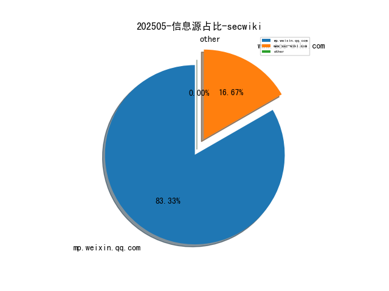
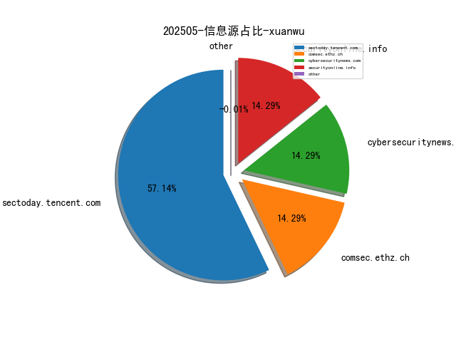
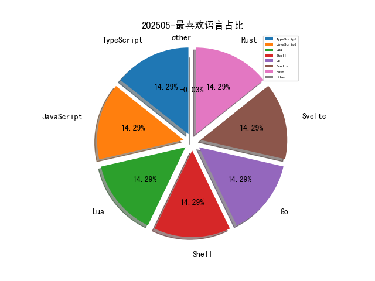

# [数据--所有](README_20.md)
# [数据--年度](README_2025.md)
# 202505 信息源与信息类型占比

# 网络安全书籍 推荐
| date_added | language | title | author | link | size| 
| --- | --- | --- | --- | --- | ---| 
| 2025-05-07 21:16:02 | English | Hacking Cryptography | unknown | https://www.wowebook.org/hacking-cryptography/ | unknown| 
| 2025-05-07 08:21:54 | English | Generative AI with Kubernetes | unknown | https://www.wowebook.org/generative-ai-with-kubernetes/ | unknown| 
| 2025-05-07 08:04:50 | English | Mastering DevOps in Kubernetes | unknown | https://www.wowebook.org/mastering-devops-in-kubernetes/ | unknown| 
| 2025-05-07 06:35:44 | English | Hacking Cryptography: Write, break, and fix real-world implementations | Kamran Khan and Bill Cox | http://libgen.is/book/index.php?md5=451D7FBC6E2399DE00CF759A39ABC464 | 16 MB [EPUB]| 
| 2025-05-06 17:36:54 | English | High Performance Python, 3rd Edition | unknown | https://www.wowebook.org/high-performance-python-3rd-edition/ | unknown| 
| 2025-05-06 16:11:48 | English | CompTIA CySA+ (CS0-003) Certification Guide | unknown | https://www.wowebook.org/comptia-cysa-cs0-003-certification-guide/ | unknown| 
| 2025-05-06 08:51:21 | English | Cloud Security Handbook, 2nd Edition | unknown | https://www.wowebook.org/cloud-security-handbook-2nd-edition/ | unknown| 
| 2025-05-05 03:02:33 | English | Sex Is a Spectrum: The Biological Limits of the Binary | Agustín Fuentes | http://libgen.is/book/index.php?md5=B5BE65F25BC6F7EAA0198CE2CE65AB00 | 1 MB [PDF]| 
| 2025-05-04 21:44:28 | English | Creating ChatGPT Apps with JavaScript: A Hands-on Guide for AI Applications with OpenAI APIs | Bruce Hopkins Jr. | http://libgen.is/book/index.php?md5=9274EF5426AAD4863E8072BA8D689E57 | 5 MB [PDF]| 
| 2025-05-04 21:40:18 | English | Mastering DevOps in Kubernetes | Soumiyajit Das Chowdhury | http://libgen.is/book/index.php?md5=2F99826C2E550B5F64D0AC9C63CDCBB5 | 72 MB [PDF]| 
| 2025-05-04 21:39:16 | English | Creating ChatGPT Apps with JavaScript : A Hands-on Guide for AI Applications with OpenAI APIs | Bruce Hopkins Jr.; Bruce Hopkins Sr. | http://libgen.is/book/index.php?md5=7EB9C5BFD0219906E5AA12637ED9CA4E | 3 MB [EPUB]| 
| 2025-05-04 21:38:10 | English | The Professional : A Playbook to Unleash Your Potential and Futureproof Your Success | Tony Frost | http://libgen.is/book/index.php?md5=E107EADC43D1C3F3B41520EDBEFE9330 | 653 kB [EPUB]| 
| 2025-05-03 21:14:45 | English | Linux Basics for Hackers, 2nd Edition | unknown | https://www.wowebook.org/linux-basics-for-hackers-2nd-edition/ | unknown| 

# 微信公众号 推荐
| nickname_english | weixin_no | title | url| 
| --- | --- | --- | ---| 
| HK安全小屋 | None | 亚控科技 KingPortal 开发系统 imgPath 文件读取漏洞 | https://mp.weixin.qq.com/s?__biz=MzkzNzMxODkzMw==&mid=2247485788&idx=1&sn=bee67e0f5b502534a62a2a4ec99877bd | 2| 
| Hacking黑白红 | None | 阿里巴巴网络安全社招-需要哪些技能 | https://mp.weixin.qq.com/s?__biz=Mzg2NDYwMDA1NA==&mid=2247544865&idx=1&sn=4f16db2c74a75a8d15c1d98d62265067 | 2| 
| LA安全实验室 | None | 周六018 英超 伯恩茅斯VS维拉 店内大神云集！跟上吃肉！你想要的竞彩都有！ | https://mp.weixin.qq.com/s?__biz=MzkxODQzOTYxMQ==&mid=2247483931&idx=4&sn=461b406e4ac527c3ac400f558b350dc8 | 4| 
| 全栈网络空间安全 | None | Brewer-Nash安全模型介绍 | https://mp.weixin.qq.com/s?__biz=Mzg3NTUzOTg3NA==&mid=2247515655&idx=1&sn=33296b7749c76160bb229ea1eabb2638 | 7| 
| 利刃信安 | None | 【能力验证】SM2 算法 ASN.1编码 - 签名长度 | https://mp.weixin.qq.com/s?__biz=MzU1Mjk3MDY1OA==&mid=2247520759&idx=1&sn=3400f72e9c831a84d69c65faa1f2c6fe | 1| 
| 安全的黑魔法 | None | GXX -新一代基于YAML的指纹识别工具 | https://mp.weixin.qq.com/s?__biz=MzU4Mzc4MDQyOQ==&mid=2247484635&idx=1&sn=ac13e7fd4a69f1771ebb85b01a03358c | 1| 
| 攻城狮成长日记 | None | Linux文件对比黑科技！diff命令从入门到精通实战 | https://mp.weixin.qq.com/s?__biz=MjM5OTc5MjM4Nw==&mid=2457388860&idx=1&sn=cddb96bab1e39f345efeace85f11e8c3 | 3| 
| 渗透测试安全攻防 | None | Electron客户端安全入门【上】 | https://mp.weixin.qq.com/s?__biz=MzkyNTUyNDMyOA==&mid=2247487769&idx=1&sn=69bb5b9d6ef74ddd0b779376167a8410 | 1| 
| 玄道夜谈 | None | 分享图片 | https://mp.weixin.qq.com/s?__biz=MzI3Njc1MjcxMg==&mid=2247495362&idx=1&sn=47042a49cae59523d56eae83d23eb283 | 8| 
| 知树安全团队 | None | 绕过各种杀软dumphash工具 | https://mp.weixin.qq.com/s?__biz=Mzk1NzIyODg2OQ==&mid=2247484536&idx=1&sn=948a4e4039786e750e875ddcc674092f | 3| 
| 秦安战略 | None | 金思宇：中国车企智能化发展：现状、挑战与未来路径 | https://mp.weixin.qq.com/s?__biz=MzA5MDg1MDUyMA==&mid=2650479207&idx=5&sn=2fc3a3c3c869c812dace945f82f94e8d | 21| 
| 网络与安全实验室 | None | 每周文章分享-210 | https://mp.weixin.qq.com/s?__biz=MzI1MTQwMjYwNA==&mid=2247501835&idx=1&sn=2bdcbf2b7101d3c2c68fbe828281fc6f | 2| 
| 网络安全者 | None | 信息收集工具 -- 雪瞳 | https://mp.weixin.qq.com/s?__biz=MzU3NzY3MzYzMw==&mid=2247499852&idx=1&sn=aefca1aa7e941148c65556628d398276 | 4| 
| 蓝云Sec | None | 健康证泄露导致的越权漏洞 | https://mp.weixin.qq.com/s?__biz=MzkwODc1NTgyMg==&mid=2247484984&idx=1&sn=997d6624942661f938be7632e0642bb1 | 5| 
| 逆向有你 | None | PC逆向 -- 某考吧题库软件破解分析 | https://mp.weixin.qq.com/s?__biz=MzA4MzgzNTU5MA==&mid=2652038790&idx=1&sn=34ded29e1441b7424a7eae3d8663b2c9 | 5| 
| 360数字安全 | None | 点亮国家级地标！奥林匹克塔为360安全大模型“代言” | https://mp.weixin.qq.com/s?__biz=MzA4MTg0MDQ4Nw==&mid=2247580478&idx=1&sn=dffe5ca8447689b55060387a14caa450 | 3| 
| ADLab | None | 【原创漏洞】AOSP跨用户资源访问漏洞 | https://mp.weixin.qq.com/s?__biz=Mzk1NzE0ODUyOA==&mid=2247492196&idx=1&sn=fcfa14e51c4953a578125b94eecc539a | 1| 
| CertiK | None | 韩媒聚焦Lazarus攻击手段升级，CertiK联创顾荣辉详解应对之道 | https://mp.weixin.qq.com/s?__biz=MzU5OTg4MTIxMw==&mid=2247504163&idx=1&sn=44f53871d32a1e4565bb18dc5ae20ed7 | 3| 
| DARKNAVY | None | HarmonyOS NEXT鸿蒙应用反编译器 .abcD 发布试用 | https://mp.weixin.qq.com/s?__biz=MzkyMjM5MTk3NQ==&mid=2247488520&idx=1&sn=932b759f6f2e125fbbac5f303a8df2be | 1| 
| Day1安全团队 | None | 王老师SRC挖洞培训课介绍 | https://mp.weixin.qq.com/s?__biz=Mzk3NTk1NjM1MQ==&mid=2247487883&idx=1&sn=ade4e0578e7c585d287aa1e23d7bbbc4 | 1| 
| Delta Insights | None | 网络安全动态 - 2025.05.09 | https://mp.weixin.qq.com/s?__biz=MzU1MzEzMzAxMA==&mid=2247500028&idx=1&sn=06b3c5f0b543060d2b643f7de41d1196 | 4| 
| Esn技术社区 | None | 没百万资产_千万别做好人！！努力活着就是对自己最大的安慰！！ | https://mp.weixin.qq.com/s?__biz=MzU5Njg5NzUzMw==&mid=2247491073&idx=1&sn=2395fd73d896387201271a3738470db0 | 4| 
| FreeBuf | None | 勒索软件即服务（RaaS）已成为勒索攻击的主流框架 | https://mp.weixin.qq.com/s?__biz=MjM5NjA0NjgyMA==&mid=2651320545&idx=4&sn=99a0c74bdbeb5b223662e159715ba28a | 24| 
| GSDK安全团队 | None | 安全测试辅助bp插件 - AutoFuzz | https://mp.weixin.qq.com/s?__biz=MzIzNTE0Mzc0OA==&mid=2247486339&idx=1&sn=47fe3888047a8544ac9c9420b20d4ede | 3| 
| ISC2网络安全 | None | 击败倦怠：如何在CISSP之旅中保持动力 | https://mp.weixin.qq.com/s?__biz=MzUzNTg4NDAyMg==&mid=2247492691&idx=1&sn=14be06926ed9c747bd497fea4ff9de29 | 3| 
| ISC平台 | None | ISC.AI 2025全球议题征集火热进行中！你的声音将定义AI与安全的未来 | https://mp.weixin.qq.com/s?__biz=MjM5ODI2MTg3Mw==&mid=2649818956&idx=1&sn=62535c1098be3ef69c9c6c31e2b805ee | 1| 
| KK安全说 | None | 总结分析Lockbit数据泄露的背后 | https://mp.weixin.qq.com/s?__biz=Mzg4NzgyODEzNQ==&mid=2247489254&idx=1&sn=b5bdd11ef5887b64599230399e8c2b85 | 1| 
| Khan安全团队 | None | EDR 规避：利用硬件断点的新技术 – Blindside | https://mp.weixin.qq.com/s?__biz=MzAwMjQ2NTQ4Mg==&mid=2247499070&idx=1&sn=54ad57670b570da26943a2a463b0c084 | 5| 
| Kone安全 | None | 7天掌握Claude 3.7账号完整使用攻略：从零开始的5个高级技巧（内附独家资源）。 | https://mp.weixin.qq.com/s?__biz=MzU4MzM4MzQ1MQ==&mid=2247502783&idx=7&sn=25a963d847622bb6d55ee47ba3dde56f | 24| 
| M01N Team | None | 每周蓝军技术推送（2025.4.26-5.9） | https://mp.weixin.qq.com/s?__biz=MzkyMTI0NjA3OA==&mid=2247494180&idx=1&sn=6fb30ca1ba3a3d62c5a76594deb79cc5 | 1| 
| Nday Poc | None | electrolink 信息泄露漏洞 (CVE-2025-28228) | https://mp.weixin.qq.com/s?__biz=MzkzMTcwMTg1Mg==&mid=2247491384&idx=1&sn=867c9a3c8083cc415d9de07e67971b98 | 4| 
| Ots安全 | None | 使用 Terraform、Nebula、Caddy 和 Cobalt Strike 实现 C2 基础设施自动化 | https://mp.weixin.qq.com/s?__biz=MzAxMjYyMzkwOA==&mid=2247529653&idx=2&sn=2ea6b7ba1e7140bc84db0228c8d0c0d4 | 13| 
| Panda安全 | None | 招聘｜京东｜安全研发工程师 | https://mp.weixin.qq.com/s?__biz=MzkzMDQ5MzM1NA==&mid=2247484032&idx=1&sn=492ba1117af55b1d5ee9ad00f710adc2 | 1| 
| Tide安全团队 | None | AI在网络安全中的应用之钓鱼邮件检测 | https://mp.weixin.qq.com/s?__biz=Mzg2NTA4OTI5NA==&mid=2247521237&idx=1&sn=cd222509863427c5bf7735627aadba71 | 1| 
| VEDA卫达信息 | None | 邀请函 , 卫达信息亮相北京军博会，期待您的莅临！ | https://mp.weixin.qq.com/s?__biz=Mzg5NDY0NTM2Nw==&mid=2247492544&idx=1&sn=ed7ca492b85c820bea3a4d6c3f0102d5 | 2| 
| Web安全工具库 | None | 蓝队IP封禁Tools工具 -- BT_SuperTools(5月7日更新) | https://mp.weixin.qq.com/s?__biz=MzI4MDQ5MjY1Mg==&mid=2247516597&idx=1&sn=b68b5a28a07d9f782bde3746c287b800 | 4| 
| Yak Project | None | SyntaxFlow 代码审计实战解析，拆解整个攻击链路！ | https://mp.weixin.qq.com/s?__biz=Mzk0MTM4NzIxMQ==&mid=2247528172&idx=1&sn=731c6834920e64a4ae1160309d87260f | 1| 
| mailabc | None | 2025Q1企业邮箱安全报告：三大威胁升级，揭秘应对之法 | https://mp.weixin.qq.com/s?__biz=MzkxMjY3MTI4Mg==&mid=2247484921&idx=1&sn=784434e6575ead5c4c1b8d9019794b43 | 1| 
| sec0nd安全 | None | 权威解答！密评中与【国密证书】相关的若干Q&A | https://mp.weixin.qq.com/s?__biz=Mzg3OTUxNTU2NQ==&mid=2247490943&idx=4&sn=1a77e74bb79e5dfc7ff4910efc8d2ef2 | 27| 
| 丁爸 情报分析师的工具箱 | None | 【通知】四川警察学院2025年公开招聘博士等高层次人才的公告 | https://mp.weixin.qq.com/s?__biz=MzI2MTE0NTE3Mw==&mid=2651149922&idx=2&sn=b0f39ac055efc7c475ab47efc2e6df1c | 11| 
| 中国信息安全 | None | 盘点 , 中国互联网联合辟谣平台2025年4月辟谣榜 | https://mp.weixin.qq.com/s?__biz=MzA5MzE5MDAzOA==&mid=2664242250&idx=5&sn=00283af2fe0ad9bc072b2db2602db840 | 23| 
| 中国电信安全 | None | 2025年“燎原计划”安全专业（交付运营方向）培训班开班报道 | https://mp.weixin.qq.com/s?__biz=MzkxNDY0MjMxNQ==&mid=2247535415&idx=1&sn=75ea2f37aa5f2dff3b211bb7e8ad8093 | 5| 
| 中国网络空间安全协会 | None | 人工智能生成合成内容标识政策法规宣讲会在重庆举办 | https://mp.weixin.qq.com/s?__biz=MzA3ODE0NDA4MA==&mid=2649402135&idx=1&sn=ff4cb2a9fb683db05d1da8bdc9e6f7ff | 11| 
| 中国软件评测中心 | None | 【工信动态】深入贯彻中央八项规定精神学习教育中央第四指导组指导督导工业和信息化部见面会召开 | https://mp.weixin.qq.com/s?__biz=MjM5NzYwNDU0Mg==&mid=2649252082&idx=1&sn=030a60b5612d05f8a4ab1611724f68c7 | 10| 
| 云弈安全 | None | 八大领域彰显技术硬实力！ 云弈科技实力入围安全牛《中国网络安全行业全景图（第十二版）》 | https://mp.weixin.qq.com/s?__biz=MzU2ODY0ODk2Nw==&mid=2247491653&idx=2&sn=1a6b47e689b2a0da8fb3d0d94ae2c638 | 2| 
| 云鼎实验室 | None | 零系统调用的暗度陈仓：深度解构io_uring新型Rootkit的攻击防护 | https://mp.weixin.qq.com/s?__biz=MzU3ODAyMjg4OQ==&mid=2247496377&idx=1&sn=27cbb8a50866b909bd9a1cb441df1a6f | 1| 
| 亚信安全 | None | 2025年网络安全行业全景图 , 亚信安全实力占据65领域 | https://mp.weixin.qq.com/s?__biz=MjM5NjY2MTIzMw==&mid=2650622643&idx=1&sn=ec03e65b8565e1a365308b25b4f6c840 | 5| 
| 亿人安全 | None | \"初夏伊始\"，ISRC众测活动，来喽~~~ | https://mp.weixin.qq.com/s?__biz=Mzk0MTIzNTgzMQ==&mid=2247520580&idx=2&sn=359c327ab09c03b73072bc97da6c659a | 2| 
| 仇辉攻防 | None | 【免杀】C2免杀 , 概念篇 | https://mp.weixin.qq.com/s?__biz=MzUyNTUyNTA5OQ==&mid=2247485227&idx=1&sn=5ec7100fa4045fb4466298fd5bf429ab | 1| 
| 信安一把索 | None | 流量分析 - 黑客(解) | https://mp.weixin.qq.com/s?__biz=Mzk0NTg3ODYxNg==&mid=2247485784&idx=1&sn=73fb7caf72f567e4619423ce27d8ab95 | 3| 
| 信安世纪 | None | 护航跨境支付，筑牢安全防线——信安世纪CIPS安全解决方案全解析 | https://mp.weixin.qq.com/s?__biz=MjM5NzgzMjMwNw==&mid=2650664528&idx=1&sn=446fa59040dec3fd2b7b39d797496d27 | 2| 
| 信息安全与通信保密杂志社 | None | 推动人工智能产业迈向更高水平 | https://mp.weixin.qq.com/s?__biz=MzkwMTMyMDQ3Mw==&mid=2247599741&idx=3&sn=40fbdae1f583c156e587665e11756ca4 | 14| 
| 信息安全国家工程研究中心 | None | 解读 , 公网安〔2025〕1846号文关于对网络安全等级保护有关工作事项进一步说明的函 | https://mp.weixin.qq.com/s?__biz=MzU5OTQ0NzY3Ng==&mid=2247499542&idx=1&sn=815b52da837545529b71cc76d51a2cfc | 5| 
| 信息安全大事件 | None | 恶意 npm 包通过后门感染 3,200+ 游标用户，窃取凭据 | https://mp.weixin.qq.com/s?__biz=MzkzNjIzMjM5Ng==&mid=2247492526&idx=1&sn=2a01f856513647ce955a0bc632ab2477 | 4| 
| 全栈安全 | None | 全流量解析：让安全防御从“被动挨打”升级为“主动狩猎” | https://mp.weixin.qq.com/s?__biz=MzkyMTYyOTQ5NA==&mid=2247487108&idx=1&sn=79854e4818cc46ba1424d7df71238455 | 4| 
| 全球技术地图 | None | 美国财政部启动“外国投资者的快速通道\"试点计划 | https://mp.weixin.qq.com/s?__biz=MzI1OTExNDY1NQ==&mid=2651621062&idx=2&sn=74b69f64dfcea2f918f73c97a79b3723 | 9| 
| 兰花豆说网络安全 | None | 6 月相约上海，共探商用密码创新蓝海，诚邀您拨冗参会 | https://mp.weixin.qq.com/s?__biz=MzI3NzM5NDA0NA==&mid=2247491310&idx=2&sn=7d5f09e666daa9aab624e16650046757 | 5| 
| 北京磐石安科技有限公司 | None | 全职岗位汇总-长期不断更新 | https://mp.weixin.qq.com/s?__biz=MzkwNDI0MjkzOA==&mid=2247486054&idx=1&sn=5148b839003b7d6b9816b62019febcac | 1| 
| 北京路劲科技有限公司 | None | 路劲科技顺利完成CCRC信息安全服务资质现场监督复审工作 | https://mp.weixin.qq.com/s?__biz=MzUyMjAyODU1NA==&mid=2247492236&idx=1&sn=19d6f280ab565722b10f6795dc538b70 | 1| 
| 君说安全 | None | 吉大正元2025年第一季度报告，营收0.61亿，同比骤降51.89%。 | https://mp.weixin.qq.com/s?__biz=MzUzNjkxODE5MA==&mid=2247490600&idx=1&sn=8abe504aa60b9f5433173fd11467d686 | 15| 
| 启明星辰安全简讯 | None | 安全简讯（2025.05.09） | https://mp.weixin.qq.com/s?__biz=MzkzNzY5OTg2Ng==&mid=2247501051&idx=1&sn=d26e91a95381a7be6bd1558b7496683b | 5| 
| 启明星辰集团 | None | 启明星辰亮相CHIMA2025 构建智慧医疗安全新生态 | https://mp.weixin.qq.com/s?__biz=MzA3NDQ0MzkzMA==&mid=2651733061&idx=1&sn=c8f226a92c29a58dfac8b2843d422589 | 2| 
| 哆啦安全 | None | Slither是一个专为以太坊智能合约设计的静态分析框架 | https://mp.weixin.qq.com/s?__biz=Mzg2NzUzNzk1Mw==&mid=2247498055&idx=2&sn=be6b7a36479544881bcb539f643d1569 | 3| 
| 商密君 | None | 美国著名服装品牌因隐私违规被罚250万元 | https://mp.weixin.qq.com/s?__biz=MzI5NTM4OTQ5Mg==&mid=2247635760&idx=4&sn=fed6c53f75e6a9bffd261963ceba3dc3 | 25| 
| 国源天顺 | None | 2025年网络安全等级保护工作相关问题解读 | https://mp.weixin.qq.com/s?__biz=Mzg3MTU1MTIzMQ==&mid=2247497133&idx=2&sn=0263e75916d402db674491d837700b70 | 2| 
| 夜风Sec | None | 【应急响应】- 日志流量如何下手？ | https://mp.weixin.qq.com/s?__biz=Mzk1Nzk3MjA5Ng==&mid=2247485348&idx=1&sn=52db408094ecaed1d998d6e09543a248 | 3| 
| 天极智库 | None | 【国际视野】美国网络安全和基础设施安全局等多机构联合发布《减少OT网络威胁的措施》 | https://mp.weixin.qq.com/s?__biz=MzIyMjQwMTQ3Ng==&mid=2247491333&idx=1&sn=c0e5ba254cda5f0fd40726dca60bf8b1 | 1| 
| 天空卫士SkyGuard | None | 构筑芯片行业的“安全硅甲” | https://mp.weixin.qq.com/s?__biz=MzA5MjQyODY1Mw==&mid=2648519803&idx=1&sn=88fe6d0cc27a4d5ac253bd7c0b8be088 | 1| 
| 奇安信集团 | None | 丰田中国到访奇安信安全中心 | https://mp.weixin.qq.com/s?__biz=MzU0NDk0NTAwMw==&mid=2247626748&idx=3&sn=cc36ad3574d6302f4dc27c2beb9f5b82 | 9| 
| 奇富科技安全应急响应中心 | None | 护网先锋·白帽守护行动 — QFSRC挑战赛 | https://mp.weixin.qq.com/s?__biz=Mzk0NTY4OTM3Nw==&mid=2247483982&idx=1&sn=09b74952d7eccf2ab8d7015caa925e7d | 1| 
| 安世加 | None | 出海合规 ｜ ISO 27001 的深度落地路径：从管理制度到安全治理能力 | https://mp.weixin.qq.com/s?__biz=MzU2MTQwMzMxNA==&mid=2247542204&idx=1&sn=a961e56f9ffde4a7ed0b8fb3dc74b342 | 4| 
| 安全内参 | None | 著名服装品牌因隐私违规被罚250万元 | https://mp.weixin.qq.com/s?__biz=MzI4NDY2MDMwMw==&mid=2247514317&idx=2&sn=5d5bcae5c8a05943013c2a749c1cf47c | 8| 
| 安全圈 | None | 【安全圈】Cisco IOS XE WLC 中的关键 CVE-2025-20188 (CVSS 10) 缺陷允许远程根部访问 | https://mp.weixin.qq.com/s?__biz=MzIzMzE4NDU1OQ==&mid=2652069525&idx=4&sn=a0ceb517f0bd46bd1296a5aa917fbf4c | 29| 
| 安全学习那些事儿 | None | 制作售卖拍卖外挂软件 上海一男子被刑拘 | https://mp.weixin.qq.com/s?__biz=MzkxNTI2NTQxOA==&mid=2247497194&idx=2&sn=d7735dc611f9c67f71dc768b75a63917 | 7| 
| 安全牛 | None | Meta获赔1.67亿美元，历时6年的NSO间谍软件案尘埃落定；LockBit勒索软件团伙遭黑客入侵，谈判记录等被曝光 , 牛览 | https://mp.weixin.qq.com/s?__biz=MjM5Njc3NjM4MA==&mid=2651136771&idx=2&sn=833554e2232eb5d33a9a39761cedf197 | 6| 
| 安全牛课堂 | None | 合法 “入侵” 系统，CEH v13道德黑客，带你突破技术边界！ | https://mp.weixin.qq.com/s?__biz=MzIxNTM4NDY2MQ==&mid=2247517308&idx=1&sn=bc704c151ba67b71b9f0a6aa6f0d614f | 1| 
| 安在 | None | CSO评选 , 提名·直播：第四场预告 | https://mp.weixin.qq.com/s?__biz=MzU5ODgzNTExOQ==&mid=2247639339&idx=3&sn=f4da240ae2b4cca7851a526cde99fa27 | 12| 
| 安天移动安全 | None | 移动应用程序中网络代理技术的应用及其安全隐患 | https://mp.weixin.qq.com/s?__biz=MjM5NTY4NzcyNg==&mid=2650250373&idx=1&sn=ead49326efb734607e03a8af63c479ad | 1| 
| 安易科技AneSec | None | 安易科技成功晋级2025第十届安全创客汇40强 | https://mp.weixin.qq.com/s?__biz=MzkwMTI3ODUxOQ==&mid=2247485267&idx=1&sn=fb389febf24fdb321df1d5f62ea843c0 | 1| 
| 工业安全产业联盟平台 | None | 数据安全丨2024数商产业场景调研报告（附下载） | https://mp.weixin.qq.com/s?__biz=MzI2MDk2NDA0OA==&mid=2247533171&idx=2&sn=28297d607966bab9909d3df4d1f56dd0 | 4| 
| 开源网安 | None | 关于公司经营现状及应对措施的声明 | https://mp.weixin.qq.com/s?__biz=MzI0NzY1MDgyMw==&mid=2247514152&idx=1&sn=9677d6b37cbda30b73ebbf33a3a38536 | 1| 
| 弥天安全实验室 | None | 【DeepSeek实践】Mcp+DeepSeek的Demo编写体验 | https://mp.weixin.qq.com/s?__biz=MzU2NDgzOTQzNw==&mid=2247503224&idx=1&sn=f44af92eb9a16188961631bbf0424227 | 2| 
| 快手技术 | None | 快手技术团队招聘，多岗位热招中！职等你来！ | https://mp.weixin.qq.com/s?__biz=Mzg2NzU4MDM0MQ==&mid=2247496239&idx=1&sn=a974636ac8641ead4cb99a268af5a49c | 1| 
| 慢雾科技 | None | MistTrack：跨链协议分析系列之 Bitget Swap | https://mp.weixin.qq.com/s?__biz=MzU4ODQ3NTM2OA==&mid=2247502143&idx=1&sn=7aeabe16488909f906733631948dc44c | 4| 
| 扫地僧的茶饭日常 | None | Android9安装burp证书解决浏览器报错：该网站的安全证书有问题 | https://mp.weixin.qq.com/s?__biz=Mzg5NTUyNTI5OA==&mid=2247486440&idx=1&sn=d9539535b48783e6923b28a9ef4cb11b | 1| 
| 攻防SRC | None | 考上的是研究生，废掉的是人本身 ——一位安全生的进厂未遂与读博未满 | https://mp.weixin.qq.com/s?__biz=MzIyNDg2MDQ4Ng==&mid=2247487011&idx=1&sn=6c4d15b50cfddfe4312aa33968f7951f | 4| 
| 效率源 | None | 警博会参观预约仅剩3天！效率源将携重磅新品亮相，与您相约北京 | https://mp.weixin.qq.com/s?__biz=MjM5ODQ3NjAwNQ==&mid=2650553139&idx=1&sn=cb7192633b426fd0dace0a6bd04da9eb | 2| 
| 数据机器人 | None | 从“被动合规”转向“主动防御”——网络安全等级保护工作新要求 公安部发布[2025]1846号文 | https://mp.weixin.qq.com/s?__biz=MzI4MDE2MzA4Mw==&mid=2667651139&idx=1&sn=814d18ebdb2fef48ccd3ca27d21e35c3 | 1| 
| 数观天下 | None | 招标公告 , 密评&安全加固，预算170.375万 | https://mp.weixin.qq.com/s?__biz=MzkxMTYzMjIwNQ==&mid=2247497445&idx=3&sn=f8ff3dc7fda43d70933a3348d16db885 | 3| 
| 星落安全团队 | None | 工具推荐 , 最新一键关闭defender工具 | https://mp.weixin.qq.com/s?__biz=MzkwNjczOTQwOA==&mid=2247494573&idx=1&sn=3d34bf008c422d1c05b5c3cce606570e | 2| 
| 春秋伽玛 | None | 5月网络安全竞赛高能亮点速看 | https://mp.weixin.qq.com/s?__biz=MzkyNDA5NjgyMg==&mid=2247501575&idx=1&sn=facd65158d2973c10bde41cd1524b6e2 | 1| 
| 智探AI应用 | None | 98万！大模型应用开发平台项目 | https://mp.weixin.qq.com/s?__biz=MzIxMDIwODM2MA==&mid=2653932093&idx=3&sn=56859db890b9ff40c8529bf907ae566c | 14| 
| 极客安全 | None | 安全动态丨网络空间安全动态第258期 | https://mp.weixin.qq.com/s?__biz=MzU2MjcwOTY1Mg==&mid=2247521393&idx=2&sn=72608b837d4cdc220df1739036231ea1 | 3| 
| 梅苑安全 | None | 亲爱的你不要点击，看来是被黑客攻击了 | https://mp.weixin.qq.com/s?__biz=MzkwMTU2NzMwOQ==&mid=2247485134&idx=1&sn=af9e9724176b9b1f53fff2f478e4fee8 | 4| 
| 江南信安 | None | 安全资讯汇总：2025.5.5-2025.5.9 | https://mp.weixin.qq.com/s?__biz=MzA4MTE0MTEwNQ==&mid=2668670263&idx=1&sn=dd19081833c5797124cfa563bf51c1b0 | 2| 
| 江苏国保信息系统测评中心 | None | 温馨母亲节 , 江苏国保致敬每一位伟大的母亲 | https://mp.weixin.qq.com/s?__biz=MzU5MTQ4NTI0OA==&mid=2247487678&idx=1&sn=7cc94b56705ade1cc78344af1d46726a | 1| 
| 汽车电子嵌入式 | None | 嵌入式开发绝招：状态机+事件驱动框架 | https://mp.weixin.qq.com/s?__biz=Mzg2NTYxOTcxMw==&mid=2247493678&idx=1&sn=005516d1f53928658d41a125388e54ab | 1| 
| 河南等级保护测评 | None | 中国人民银行业务领域数据安全管理办法 | https://mp.weixin.qq.com/s?__biz=Mzg2NjY2MTI3Mg==&mid=2247499849&idx=1&sn=051f58092163dac96d9cb01d3f25f8ba | 18| 
| 泛安全 | None | 原创文章目录 | https://mp.weixin.qq.com/s?__biz=MzU3NjQ5NTIxNg==&mid=2247485810&idx=5&sn=72a5a2a4cca9e7955a3c50f2e4805d34 | 31| 
| 泷羽Sec-临观 | None | 打靶日记 Escalate_Linux | https://mp.weixin.qq.com/s?__biz=Mzk1Nzc0MzY3NA==&mid=2247486616&idx=1&sn=738914104a6b2b1b8d3373b354b7aede | 1| 
| 泷羽Sec-朝阳 | None | 思路清晰，我是菜B，8小时爆肝windows 32位syncbreeze缓冲区溢出漏洞复现 | https://mp.weixin.qq.com/s?__biz=Mzk3NTIyOTA0OQ==&mid=2247484976&idx=1&sn=6f68502e14ea7cd7b9cbb0cac874a1e7 | 3| 
| 海云安 | None | 第十二版全景图发布！海云安领跑软件供应链安全赛道 | https://mp.weixin.qq.com/s?__biz=MzI2MjY2NTM0MA==&mid=2247492528&idx=1&sn=bec7561a81de22013bea7e19f0d37666 | 2| 
| 深信服科技 | None | 5分钟内拦截未知威胁！黑客：我连招没搓完，水晶就炸了？ | https://mp.weixin.qq.com/s?__biz=MjM5MTAzNjYyMA==&mid=2650598908&idx=1&sn=cf51de3e5e52e4fb98d24f86dc2ee478 | 1| 
| 渗透云笔记 | None | 还是得做安全 | https://mp.weixin.qq.com/s?__biz=MzU2NzkxMDUyNg==&mid=2247492143&idx=1&sn=8fae9c1fc338d5ecb0cf07c046e64ca6 | 1| 
| 渗透安全HackTwo | None | 2025护网行动（HW）中高级人员急招 | https://mp.weixin.qq.com/s?__biz=Mzg3ODE2MjkxMQ==&mid=2247491302&idx=2&sn=36e939be93b2788968a529672bb39afa | 4| 
| 渗透测试 | None | 曾经全网疯抢的Manus邀请码 现在全面开放注册了 深度体验---自述！！！ | https://mp.weixin.qq.com/s?__biz=Mzg2ODY3NDYxNA==&mid=2247486095&idx=1&sn=0042fac3ef407772d7ef08fd15e92879 | 3| 
| 湘安无事 | None | 记一次小米-root+简易app抓包(新手) | https://mp.weixin.qq.com/s?__biz=MzU3Mjk2NDU2Nw==&mid=2247493374&idx=1&sn=7dea1086256be1d5a2b1a18fa4ab3be0 | 1| 
| 漏洞战争 | None | 网络安全顶会——SP 2025 论文清单与摘要 | https://mp.weixin.qq.com/s?__biz=MzU0MzgzNTU0Mw==&mid=2247485954&idx=1&sn=d361d90c096adcfc889b969fb4614c84 | 1| 
| 漏洞集萃 | None | 如何通过XSS接管 Microsoft 账户 | https://mp.weixin.qq.com/s?__biz=MzkxNjc0ODA3NQ==&mid=2247483935&idx=1&sn=0fbe8c7a7cbf9784bb9f3f8735c7d9b8 | 1| 
| 灵泽安全团队 | None | AWVS最新破解版25.1.250204 | https://mp.weixin.qq.com/s?__biz=Mzg3MDkxMjEyNw==&mid=2247484048&idx=1&sn=9fa4d4f54aa78fc827601fea70b6460d | 2| 
| 灾难控制 局 | None | Linux EDR 工程师招聘 | https://mp.weixin.qq.com/s?__biz=MzI1NTc1NTcwNg==&mid=2247484392&idx=1&sn=044b1e8ad3f03981ad99a12973529cc0 | 1| 
| 炼石网络CipherGateway | None | 《中国人民银行业务领域数据安全管理办法》发布,附修订对照 | https://mp.weixin.qq.com/s?__biz=MzkyNzE5MDUzMw==&mid=2247573883&idx=1&sn=35656a80f2b88b4059df5c8a24daadc0 | 3| 
| 犀牛安全 | None | WordPress 广告欺诈插件每天产生 14 亿个广告请求 | https://mp.weixin.qq.com/s?__biz=Mzg3ODY0NTczMA==&mid=2247492772&idx=1&sn=de2e0eddde72323f9ea608a593b87a33 | 4| 
| 独眼情报 | None | 如何优雅关闭 windows 默认杀毒软件？ | https://mp.weixin.qq.com/s?__biz=MzkzNDIzNDUxOQ==&mid=2247498759&idx=1&sn=333861560a845c5bbb48b9789e270653 | 13| 
| 珞安科技 | None | 工业互联网安全全覆盖 ,珞安科技实力入选《中国网络安全行业全景图》多个领域 | https://mp.weixin.qq.com/s?__biz=MzU2NjI5NzY1OA==&mid=2247512935&idx=1&sn=e86127b6622b0b43f533fa427242ac79 | 2| 
| 生有可恋 | None | 网盘新选择 | https://mp.weixin.qq.com/s?__biz=Mzk0MTI4NTIzNQ==&mid=2247493566&idx=1&sn=1d491b0944ca8eded9b76294e7e95431 | 2| 
| 百度安全 | None | 网络安全创新论坛 , 百度大模型安全斩获“2024年十大优秀网络安全创新成果” | https://mp.weixin.qq.com/s?__biz=MjM5MTAwNzUzNQ==&mid=2650511331&idx=1&sn=ab1b3db874f3edfa56763e24c66c01cd | 2| 
| 百度安全实验室 | None | 网络安全创新论坛 , 百度大模型安全斩获“2024年十大优秀网络安全创新成果” | https://mp.weixin.qq.com/s?__biz=MzA3NTQ3ODI0NA==&mid=2247487771&idx=1&sn=756199516a763374e48c2950635f9bbd | 2| 
| 盛邦安全应急响应中心 | None | 网络安全信息与动态周报2025年第18期（4月28日-5月4日） | https://mp.weixin.qq.com/s?__biz=Mzk0NjMxNTgyOQ==&mid=2247484597&idx=2&sn=2250909cf98544c4e2d6b0265dfb3d97 | 2| 
| 看雪学苑 | None | 直播预约 , ARM系统深度调试与逆向：M核精华之存储与外设 | https://mp.weixin.qq.com/s?__biz=MjM5NTc2MDYxMw==&mid=2458593398&idx=4&sn=b23ed043ec69fede5e313d8b77f1a8f0 | 15| 
| 知攻善防实验室 | None | 偷偷发个预告，第二届 “Parloo 杯”CTF 应急响应挑战赛 | https://mp.weixin.qq.com/s?__biz=MzkxMTUwOTY1MA==&mid=2247490941&idx=1&sn=9b7e0e4023b04a844514695d47238a24 | 1| 
| 祺印说信安 | None | 印巴紧张局势加剧，主要金融和市场机构加强网络安全 | https://mp.weixin.qq.com/s?__biz=MzA5MzU5MzQzMA==&mid=2652115630&idx=1&sn=7b9ceb6dd877b25514f1831898c8a874 | 14| 
| 等级保护那些事 | None | 既知矛也知盾：SSH安全加固的高级技巧 | https://mp.weixin.qq.com/s?__biz=Mzg2OTA0NjIwNw==&mid=2247484028&idx=1&sn=37f3bec7e0d80a06c39acd88007564e9 | 1| 
| 米好信安 | None | 重磅！米好信安上榜安全牛第十二版《中国网络安全行业全景图》 | https://mp.weixin.qq.com/s?__biz=MzU1NTYxMjA5MA==&mid=2247505736&idx=1&sn=73ef8a45710d9c675e1a0738b4fa3f3a | 3| 
| 紫金山实验室 | None | 紫金山实验室党委召开会议 推动科技创新加快转化为新质生产力 | https://mp.weixin.qq.com/s?__biz=MzU4NDc2MzcwNw==&mid=2247499103&idx=1&sn=56e09294c9a68f25ec3ba6cd01b0a2c5 | 1| 
| 经纬信安 | None | 赋能攻防演练，经纬信安闪耀《中国网络安全行业全景图》 | https://mp.weixin.qq.com/s?__biz=MzIwNzE2MDc5Mg==&mid=2649267359&idx=1&sn=33eced27cd1d49864a45aa7a428ddf39 | 1| 
| 网易易盾 | None | 直播预告｜网易易盾携手百融云创，聚焦金融大模型攻防对话 | https://mp.weixin.qq.com/s?__biz=MzAwNTg2NjYxOA==&mid=2650743471&idx=2&sn=1106d3952805d40cf13ab32cc6126872 | 2| 
| 网络安全和信息化 | None | 网警重拳出击！严打侵犯公民个人信息违法犯罪 | https://mp.weixin.qq.com/s?__biz=MjM5MzMwMDU5NQ==&mid=2649172839&idx=3&sn=4c7cd8748fd18a20af885ead5fbc6546 | 17| 
| 网络安全和等保测评 | None | 关于公网安〔2025〕1846号文件主要内容概述 | https://mp.weixin.qq.com/s?__biz=MzkxMjczNzAzMA==&mid=2247485952&idx=1&sn=9ce09f8c3647e571e525cad07393627b | 2| 
| 美亚柏科 | None | 全新电子数据取证模式！AI快速取证系统“霹雳”上线 | https://mp.weixin.qq.com/s?__biz=MjM5NTU4NjgzMg==&mid=2651444634&idx=1&sn=11c0f2fdc3aeb0d1888620dcac423bf0 | 3| 
| 老付话安全 | None | 网络安全界的“瑞士军刀之netcat工具使用 | https://mp.weixin.qq.com/s?__biz=MzI0MzM3NTQ5MA==&mid=2247484438&idx=1&sn=6c8525a3b68d1d0318d9a4621175dae7 | 2| 
| 腾讯玄武实验室 | None | 每日安全动态推送(25/5/9) | https://mp.weixin.qq.com/s?__biz=MzA5NDYyNDI0MA==&mid=2651960093&idx=1&sn=fd2ebf927e985931080c7e092d7fbb56 | 2| 
| 船山信安 | None | AI的攻与防：基于大模型漏洞基因库的威胁狩猎与企业级纵深防御 | https://mp.weixin.qq.com/s?__biz=MzU2NDY2OTU4Nw==&mid=2247520404&idx=1&sn=e8a6e80ecf53ea04e94d8c714c68928e | 6| 
| 苏说安全 | None | 2025年安徽省制造业数字化转型服务商名单 | https://mp.weixin.qq.com/s?__biz=Mzg5OTg5OTI1NQ==&mid=2247490705&idx=1&sn=c233aaa6cc3427f13d55bdde71842029 | 5| 
| 菜鸟小新 | None | 快乐下载 v1.27 一款超强力多功能解析下载工具箱 | https://mp.weixin.qq.com/s?__biz=Mzg4OTI0MDk5MQ==&mid=2247493792&idx=1&sn=509f2aa179f4ab9e887896ec9316e0d3 | 4| 
| 蚁景网安 | None | 从靶场到实战：某双一流高校多个高危漏洞 | https://mp.weixin.qq.com/s?__biz=MzkyNTY3Nzc3Mg==&mid=2247489789&idx=1&sn=77ee0c2a61fd563529f6651f7c785edf | 4| 
| 蚁景网络安全 | None | 【免费领】大神12年经验成果：渗透红队实战技术教程 | https://mp.weixin.qq.com/s?__biz=MzkxNTIwNTkyNg==&mid=2247554801&idx=2&sn=4df8390fd998b6edda15f0958c86de71 | 8| 
| 蜚语科技 | None | 共筑新智安全价值 , 蜚语科技登榜《中国网络安全全景图（第十二版），持续领航静态安全测试领域 | https://mp.weixin.qq.com/s?__biz=MzI5NzI5NzY1MA==&mid=2247491662&idx=1&sn=cf795617112aa0e9e5151771a9de9849 | 1| 
| 观安信息 | None | 观安信息荣获“2025数字中国创新大赛”数字安全赛道优秀案例评比赛双项大奖 | https://mp.weixin.qq.com/s?__biz=MzIxNDIzNTcxMg==&mid=2247508023&idx=1&sn=72000d8d56017cf4775422d374ebc2e3 | 5| 
| 观安无相实验室 | None | 安全威胁情报周报（2025/05/03-2025/05/09） | https://mp.weixin.qq.com/s?__biz=Mzg4NjYyMzUyNg==&mid=2247491835&idx=1&sn=0fb74ecc8ff2dc48c805b3bcb9b460b5 | 2| 
| 计算机与网络安全 | None | DeepSeek在银行业务场景的应用 | https://mp.weixin.qq.com/s?__biz=MjM5OTk4MDE2MA==&mid=2655278175&idx=1&sn=1901a7ca0ec31f768fe8b1d54e2475b7 | 8| 
| 谈思实验室 | None | 【谈思月度盘点】3-4月汽车网络安全产业事件金榜Top10 | https://mp.weixin.qq.com/s?__biz=MzIzOTc2OTAxMg==&mid=2247554705&idx=2&sn=18f13a8d4527afcac4f0ea31d8c42158 | 16| 
| 赛博研究院 | None | 附要点解答 , 中国人民银行发布《中国人民银行业务领域数据安全管理办法》 | https://mp.weixin.qq.com/s?__biz=MzUzODYyMDIzNw==&mid=2247518370&idx=1&sn=b46c3f567b8045fc54b781056a2be027 | 6| 
| 超安全 | None | Knowbe4《2025网络钓鱼威胁趋势报告》快速解读 | https://mp.weixin.qq.com/s?__biz=MzU0MDc5ODM0Mg==&mid=2247485115&idx=1&sn=38e1e0f6f4f19024449c42aa22e50dcd | 2| 
| 车小胖谈网络 | None | 网络工程师要学习什么技术? | https://mp.weixin.qq.com/s?__biz=MzIxNTM3NDE2Nw==&mid=2247490447&idx=1&sn=803e4bca4eb9f419d01a5c1fc9216cb1 | 2| 
| 道玄网安驿站 | None | 俄罗斯黑客借虚假CAPTCHA传播新型恶意软件LOSTKEYS，高价值目标面临数据窃取危机 | https://mp.weixin.qq.com/s?__biz=Mzg4NTg5MDQ0OA==&mid=2247487868&idx=1&sn=33c30182e7c48e8ebb03fdc9aefc7174 | 8| 
| 金瀚信安 | None | 关于防范恶意VS Code扩展程序的风险提示 | https://mp.weixin.qq.com/s?__biz=MzIxNjI2NjUzNw==&mid=2247493255&idx=2&sn=8f121983e7f6c9f69b5c3c010ab65f99 | 2| 
| 金盾信安 | None | 关于防范恶意VS Code扩展程序的风险提示 | https://mp.weixin.qq.com/s?__biz=MjM5NjA2NzY3NA==&mid=2448688314&idx=3&sn=50b123763ad1099ce7feb7202685306b | 11| 
| 银天信息 | None | 信息安全漏洞周报【第021期】 | https://mp.weixin.qq.com/s?__biz=MzA4MDk4NTIwMg==&mid=2454064140&idx=1&sn=d260768ad429a25cbf848cf56cd7d89a | 2| 
| 银河实验室 | None | 印巴冲突升级：开源情报与卫星图像揭示战场真相 | https://mp.weixin.qq.com/s?__biz=Mzg3MDczNjcyNA==&mid=2247489318&idx=1&sn=1d7af64c540ac54df5e64e6eca710c83 | 2| 
| 锐鉴安全 | None | github托管代码导致的敏感信息泄露 | https://mp.weixin.qq.com/s?__biz=MzkxMjg3NzU0Mg==&mid=2247485558&idx=1&sn=eaa5b873a1c2a486d9ddc00e3f32073f | 7| 
| 锦岳智慧 | None | 【全球最大规模网络攻防战】41个国家参加北约“锁盾2025”网络防御演习 | https://mp.weixin.qq.com/s?__biz=MzkxMzQwNDcxNg==&mid=2247487170&idx=1&sn=6306f20b5bfc5e024c74bcf908cf79fb | 4| 
| 长亭安全观察 | None | 【江苏省质检院X长亭科技】 在共创「网络攻防实验室」可以做些什么？ | https://mp.weixin.qq.com/s?__biz=MzkyNDUyNzU1MQ==&mid=2247487483&idx=1&sn=a373e153221d111f633032d5170ff9cb | 4| 
| 长亭科技 | None | 【江苏省质检院X长亭科技】 在共创「网络攻防实验室」可以做些什么？ | https://mp.weixin.qq.com/s?__biz=MzIwNDA2NDk5OQ==&mid=2651389146&idx=1&sn=017519ee432c577f858d1c0afd895b99 | 1| 
| 阿里安全响应中心 | None | 重磅活动｜618安全保卫战开启 | https://mp.weixin.qq.com/s?__biz=MzIxMjEwNTc4NA==&mid=2652997823&idx=1&sn=cc94d10a60c8766631286bb11a1c829c | 2| 
| 青衣十三楼飞花堂 | None | 耳环 | https://mp.weixin.qq.com/s?__biz=MzUzMjQyMDE3Ng==&mid=2247488273&idx=1&sn=fef73492c1d303ae9cfad3f701dbcfa3 | 2| 
| 飞天诚信 | None | 权威解答！密评中与【国密证书】相关的若干Q&A | https://mp.weixin.qq.com/s?__biz=MjM5NDE1MjU2Mg==&mid=2649877062&idx=2&sn=006cec5c0a5a810ac38dec71a5c0458f | 3| 
| 马哥网络安全 | None | 防止暴力破解ssh的四种方法 | https://mp.weixin.qq.com/s?__biz=MzkxMzMyNzMyMA==&mid=2247572646&idx=2&sn=b9d932b05fa2945c3b73422d947cbd94 | 10| 
| 黑客之道HackerWay | None | 2025HW项目招人帖 | https://mp.weixin.qq.com/s?__biz=MzkzODQzNDU5NQ==&mid=2247486300&idx=1&sn=8f82ec4fddc6d5ab484855cc3ff04662 | 1| 
| 360众测 | None | 【舟跃金喜回馈季】端午现金红包拿到手软！ | https://mp.weixin.qq.com/s?__biz=MzkwODM0MTgyNQ==&mid=2247489564&idx=1&sn=80716976a949b496ab70925a590e37bd | 1| 
| CIO之家 | None | 数字化AI时代管理咨询的转型策略 | https://mp.weixin.qq.com/s?__biz=MjM5NTk5Mjc4Mg==&mid=2655225767&idx=1&sn=7b2559b89f96db7e49089baa614646df | 1| 
| CNNVD安全动态 | None | 信息安全漏洞周报（2025年第18期） | https://mp.weixin.qq.com/s?__biz=MzAxODY1OTM5OQ==&mid=2651462844&idx=2&sn=e8c11038831948335aa6faced3c458a7 | 2| 
| CyberOk | None | 黑吃黑再现:明星勒索组织LockBit遭“正义黑客”攻陷，数千条勒索谈判记录全曝光 | https://mp.weixin.qq.com/s?__biz=MzU3MDM2NzkwNg==&mid=2247486533&idx=1&sn=bb9d52c89f1906aeecc158f8d1b9fadd | 1| 
| EuSRC安全实验室 | None | Burpsuite安装指南 | https://mp.weixin.qq.com/s?__biz=MzkxNDUzMjE4Nw==&mid=2247490340&idx=1&sn=ba104c6352dfbcb14d61d7da516d97bc | 1| 
| Gh0xE9 | None | Java件组分析 - Fastjson1.2.(22-24)反序列化分析 | https://mp.weixin.qq.com/s?__biz=MzAwNTc5MTMyNg==&mid=2247500291&idx=1&sn=c3bb92b508d8544f30581890be4f5bef | 1| 
| HW安全之路 | None | 65535个门户：理解并掌握Linux网络端口的本质与应用 | https://mp.weixin.qq.com/s?__biz=MzI5MjY4MTMyMQ==&mid=2247491613&idx=1&sn=090c2dbe79a8083df9ee68f35cbcf12f | 3| 
| Ms08067安全实验室 | None | 【招生中】Web安全渗透0基础第3期班 | https://mp.weixin.qq.com/s?__biz=MzU1NjgzOTAyMg==&mid=2247523748&idx=2&sn=4b060cb02f7a84f5cc1788fe29f7f0be | 3| 
| SAINTSEC | None | 探讨利用AI技术对源代码安全保护的冲击 | https://mp.weixin.qq.com/s?__biz=MjM5MjEyMTcyMQ==&mid=2651037689&idx=1&sn=91793f3a2450b3dcbc7ad4d5471db4bf | 2| 
| SQ安全渗透 | None | XSS（跨站脚本攻击）的非常规高级利用技巧 | https://mp.weixin.qq.com/s?__biz=Mzg3OTE2MzM3OA==&mid=2247486559&idx=1&sn=2b3a98f79cb47796c63c66e296ac8f0a | 1| 
| Sky的安全观 | None | ISO体系奇葩见闻录（五）：CCAA某专家组组长脸丢大了（3） | https://mp.weixin.qq.com/s?__biz=MzA5OTEyNzc1Nw==&mid=2247486389&idx=1&sn=34a454e140ed549186a663863404b285 | 3| 
| WIN哥学安全 | None | 国hu攻防比赛蓝队防守经验总结（中篇） | https://mp.weixin.qq.com/s?__biz=MzkwODM3NjIxOQ==&mid=2247502372&idx=1&sn=3f2565a49b4269c9fcdfb0fb216a9a2c | 3| 
| Z2O安全攻防 | None | 一名合格红队的成长之路 | https://mp.weixin.qq.com/s?__biz=Mzg2ODYxMzY3OQ==&mid=2247519291&idx=2&sn=e7711708d9aeccbf4c3391db49bad600 | 10| 
| 一个不正经的黑客 | None | Gemini 全力输出隐藏端点发现浏览器插件 | https://mp.weixin.qq.com/s?__biz=MzkwODI1ODgzOA==&mid=2247506990&idx=1&sn=36b92011c0bc332753fbe5c9921d4294 | 2| 
| 中新赛克 | None | T-INNOWARE闪耀GISEC2025：AI Agents引领网络安全运维新纪元 | https://mp.weixin.qq.com/s?__biz=Mzk0ODUwNTg0Ng==&mid=2247490047&idx=1&sn=d493b5b4ff19c1a0992f41800440026f | 2| 
| 中科天齐软件安全中心 | None | 基于凭证的网络攻击发生后需采取的七个步骤 | https://mp.weixin.qq.com/s?__biz=MzU5Njc4NjM3NA==&mid=2247496539&idx=1&sn=cdd15875369845455abe00c5938086fd | 1| 
| 云起无垠 | None | 倒计时3天！“AI+Security”系列第5期之AI赋能安全的技术验证与场景化落地 | https://mp.weixin.qq.com/s?__biz=Mzg3Mjg4NTcyNg==&mid=2247490355&idx=1&sn=ddcfedc95cde822d0535925bb330fd81 | 2| 
| 交大捷普 | None | 实力认证 , 捷普持续入围网络安全行业全景图十项细分领域！ | https://mp.weixin.qq.com/s?__biz=MzI2MzU0NTk3OA==&mid=2247506344&idx=1&sn=d9859c411084d960cedf641d923c10a5 | 6| 
| 代码卫士 | None | 美国：黑客正在攻击油气组织机构的 ICS/SCADA | https://mp.weixin.qq.com/s?__biz=MzI2NTg4OTc5Nw==&mid=2247522945&idx=2&sn=123314a88d77b291cc767bd9f0d2975e | 6| 
| 信安路漫漫 | None | OSS漏洞检测工具 | https://mp.weixin.qq.com/s?__biz=Mzg2MzkwNDU1Mw==&mid=2247485676&idx=1&sn=9f3355d8d47eb5ad5b9ef48c1e7d5659 | 1| 
| 儒道易行 | None | 【CTFer成长之路】举足轻重的信息搜集 | https://mp.weixin.qq.com/s?__biz=Mzg5NTU2NjA1Mw==&mid=2247501760&idx=1&sn=2a737ff3b9d24c3937438b0d7c37e250 | 2| 
| 关键信息基础设施安全保护联盟 | None | 职等你来 , 西安四叶草信息技术有限公司招聘 | https://mp.weixin.qq.com/s?__biz=MzkxNjU2NjY5MQ==&mid=2247512921&idx=3&sn=6c391a60fd0cf6d6137de616356f3f86 | 3| 
| 冲鸭安全 | None | 安全开发: minifilter的\"流\"概念 | https://mp.weixin.qq.com/s?__biz=MzkyOTc0NDY2Nw==&mid=2247484998&idx=1&sn=14ad6cb83e482abc3ba698308e9e2c97 | 4| 
| 华为安全 | None | GISECxa02025｜华为联合IEEE面向中东地区发布星河AI融合SASE解决方案白皮书 | https://mp.weixin.qq.com/s?__biz=MzAwODU5NzYxOA==&mid=2247506072&idx=1&sn=ab2f762a2170362e4dc36256c158bcec | 2| 
| 君哥的体历 | None | 《跨机房漏洞扫描挑战、设备使用人管理优化及审计账号权限分配策略解析》｜总第288周 | https://mp.weixin.qq.com/s?__biz=MzI2MjQ1NTA4MA==&mid=2247492052&idx=1&sn=e219ac550df60a2a73d39aa6f6b987b5 | 2| 
| 安全419 | None | 安全419 , 4月安全厂商动态：密集发布各细分领域AI融合产品 | https://mp.weixin.qq.com/s?__biz=MzUyMDQ4OTkyMg==&mid=2247547681&idx=1&sn=61782ed94382c69dc6628109908a6832 | 3| 
| 安全研究GoSSIP | None | G.O.S.S.I.P 阅读推荐 2025-05-08 IPvSeeYou | https://mp.weixin.qq.com/s?__biz=Mzg5ODUxMzg0Ng==&mid=2247500113&idx=1&sn=766f1250a046f1e89ce70097ce653b9c | 3| 
| 安全逐梦人 | None | 记某微聊源码代码审计过程 | https://mp.weixin.qq.com/s?__biz=MzkxNzUxMjU5OQ==&mid=2247485410&idx=1&sn=f574ba5ba65799652861f6c212c4f874 | 1| 
| 安博通 | None | 安博通亮相北京科博会，专精特新“京品出海”，以AI赋能网络安全 | https://mp.weixin.qq.com/s?__biz=MzIyNTA5Mzc2OA==&mid=2651137813&idx=1&sn=c0e58bd86369437cffa6cec6a84ff37d | 1| 
| 小兵搞安全 | None | SQL注入、XSS、文件上传流量特征分析 | https://mp.weixin.qq.com/s?__biz=MzA3NTc0MTA1Mg==&mid=2664712235&idx=1&sn=d75c70f241e052c06de94c572c7ccbfa | 3| 
| 山石网科安全技术研究院 | None | 山石安服｜JDBC-MySQL驱动不出网攻击总结 | https://mp.weixin.qq.com/s?__biz=MzUzMDUxNTE1Mw==&mid=2247512182&idx=1&sn=51b05100767165f7de3bae4c7840dee1 | 2| 
| 工联安全众测 | None | 一笔一划“话”国安 | https://mp.weixin.qq.com/s?__biz=MzkyMDMwNTkwNg==&mid=2247487550&idx=1&sn=43de7d9171500b03ec545679adf3d536 | 2| 
| 希潭实验室 | None | 第122篇：国hu攻防比赛蓝队防守经验总结（中篇） | https://mp.weixin.qq.com/s?__biz=MzkzMjI1NjI3Ng==&mid=2247487503&idx=1&sn=7e5c18d40d15fd7e5f0ffc5d3111cc20 | 1| 
| 我不懂安全 | None | 某OA代码审计之挖掘0day，未公开poc | https://mp.weixin.qq.com/s?__biz=Mzg2NDcwNjkzNw==&mid=2247487497&idx=1&sn=9ba99fad3e77a68a6ae4c3c91348db3d | 1| 
| 我爱林 | None | 漏洞复现 ,, XWiki Platform系统远程代码执行 | https://mp.weixin.qq.com/s?__biz=MzI2Mzc3OTg1Ng==&mid=2247492658&idx=1&sn=442ddacdf8a9b8cfc22f3177cc5254ba | 1| 
| 新潮信息安全 | None | 【喜报】新潮信息成功入选山东省网络和数据安全重点企业！ | https://mp.weixin.qq.com/s?__biz=MzkwNDcyODgwOQ==&mid=2247487147&idx=1&sn=60e59c68f067366bc645317ca4c773d5 | 2| 
| 方桥安全漏洞防治中心 | None | 安全漏洞防治工作的挑战与解决方案：从CVE停更到可信计算环境构建 | https://mp.weixin.qq.com/s?__biz=Mzk0OTQzMDI4Mg==&mid=2247484826&idx=1&sn=0ab9bc7eafadb32a2dce9850874b4ffa | 2| 
| 星悦安全 | None | WordPress TargetSMS 插件存在前台代码执行漏洞 | https://mp.weixin.qq.com/s?__biz=Mzg4MTkwMTI5Mw==&mid=2247489715&idx=1&sn=edaedaf50d5c0de6782c8eac9eae3970 | 1| 
| 极思 | None | 再见，极思！ | https://mp.weixin.qq.com/s?__biz=MzI2NTMwNjYyMA==&mid=2247485050&idx=1&sn=ec2775b6048f86b1d77938afdfa8f31c | 3| 
| 汽车信息安全 | None | 行业盛会 l SAE 2025 国际汽车安全大会 | https://mp.weixin.qq.com/s?__biz=Mzg3MTI0NDQwNg==&mid=2247488492&idx=1&sn=59f192bd65c60b68ee30ca3a77d84ed6 | 1| 
| 泷羽Sec | None | Linux内网渗透（2w字超详细） | https://mp.weixin.qq.com/s?__biz=Mzg2Nzk0NjA4Mg==&mid=2247502052&idx=1&sn=a6741f6d10092d3c302a112cb71076b7 | 2| 
| 深圳网安培训学院 | None | 启动开展大规模职业技能培训！事关技能提升，速看→ | https://mp.weixin.qq.com/s?__biz=Mzg3MDYzMjAyNA==&mid=2247486331&idx=2&sn=ce394a341e22e333e1bc5bd7596021e8 | 2| 
| 渗透云记 | None | 【工具分享】Supershell二开修改，隐匿性+免杀 咱都要~~~ | https://mp.weixin.qq.com/s?__biz=MzkxNDYxMTc0Mg==&mid=2247484332&idx=1&sn=e2f1d826721d257ff2b49c4103e1ac22 | 1| 
| 漏洞盒子 | None | 原力金智SRC上线漏洞盒子 , 「企业SRC」新住客 | https://mp.weixin.qq.com/s?__biz=MzA5NzQ0Mjc5NA==&mid=2649768949&idx=1&sn=1ecde373bf55882e9275155658f9e50d | 1| 
| 犀利猪安全 | None | 一个工具 , 电脑上面文档很多吧，种子很多吧，一不小心找不到了吧？我来帮帮你！ | https://mp.weixin.qq.com/s?__biz=Mzk0NzQxNzY2OQ==&mid=2247489428&idx=1&sn=abc7f31207398d7054fa9960e4a7759e | 1| 
| 由由学习吧 | None | ctftools-all-in-oneV7.9研发进度4 | https://mp.weixin.qq.com/s?__biz=MzI1NzUxOTUzMA==&mid=2247485981&idx=1&sn=af42bf09d0c67e2e927ed25a8ae22343 | 1| 
| 绿盟科技CERT | None | 【漏洞通告】Elastic Kibana原型污染致任意代码执行漏洞（CVE-2025-25014） | https://mp.weixin.qq.com/s?__biz=Mzk0MjE3ODkxNg==&mid=2247489277&idx=1&sn=6c55779812dc46ead6693965106dd9ed | 1| 
| 网安观察室XQ | None | 网络安全态势周报（4月28日-5月4日）2025年第17期 | https://mp.weixin.qq.com/s?__biz=MzkzNjM4ODc3OQ==&mid=2247485838&idx=1&sn=58d20bad1e7b9883209324aaf9b5fa32 | 1| 
| 网空闲话plus | None | 黑吃黑再现:明星勒索组织LockBit遭“正义黑客”攻陷，数千条勒索谈判记录全曝光 | https://mp.weixin.qq.com/s?__biz=MzkyMjQ5ODk5OA==&mid=2247509737&idx=1&sn=0e52bc5619f30894a9da9cd2b32fcff5 | 19| 
| 网络与信息安全学报 | None | AsianHOST_2025 | https://mp.weixin.qq.com/s?__biz=MzI1MjAyMTg1Ng==&mid=2650471263&idx=1&sn=4525beb0c99367de796f0fd7d648f1aa | 1| 
| 网络与信息法学会 | None | 【资讯】青岛市政府办公厅印发《青岛市促进实体经济和数字经济深度融合培育发展新质生产力实施方案（2025—2027年）》 | https://mp.weixin.qq.com/s?__biz=MzU1NDY3NDgwMQ==&mid=2247552263&idx=2&sn=db4aaadadad2af8cc7034c52e0dc5b41 | 11| 
| 网络安全与等保测评 | None | 网络安全等级测评师能力评估实施指南(2024版)各等级测评师收费标准与网络安全等级测评师能力评估服务合同实际收费标准略有变化 | https://mp.weixin.qq.com/s?__biz=MzIwNDYzNTYxNQ==&mid=2247503313&idx=1&sn=9aad7682933d9297fb470407cd1771d3 | 2| 
| 网络安全威胁和漏洞信息共享平台 | None | 关于防范恶意VS Code扩展程序的风险提示 | https://mp.weixin.qq.com/s?__biz=MzA5Nzc4Njg1NA==&mid=2247489245&idx=1&sn=e2b472806f49e6d2dff3158a6d736e78 | 1| 
| 网络安全罗盘 | None | 【国外网安政策简评】美国发布《通过创新、治理和公众信任加速联邦对人工智能的使用》备忘录，督促人工智能新政落地 | https://mp.weixin.qq.com/s?__biz=Mzg3OTg0OTAyOQ==&mid=2247486355&idx=1&sn=48fa76c3dd443862df183fe5e4552bac | 1| 
| 网络空间信息安全学习 | None | 开源免费都没热度？这个输入法切换小工具欢迎你来体验！ | https://mp.weixin.qq.com/s?__biz=MzI2MjcwMTgwOQ==&mid=2247492357&idx=1&sn=84d57c10204b8d225fa2c8d1e1800445 | 1| 
| 美团技术团队 | None | 招聘 , 美团 AI 搜索：致力用 AI 技术创造极致的搜索和交互体验 | https://mp.weixin.qq.com/s?__biz=MjM5NjQ5MTI5OA==&mid=2651780372&idx=3&sn=16b7e2a24efecd00df71b1ca42c63801 | 3| 
| 腾讯技术工程 | None | 每天上线一个新系统，这款腾讯自用低代码有什么不同 | https://mp.weixin.qq.com/s?__biz=MjM5ODYwMjI2MA==&mid=2649793416&idx=2&sn=766fe1734edebcdb75888d9abb2a4c0a | 3| 
| 谷安培训 | None | 2025年国内外网络防御演习与人才培养 | https://mp.weixin.qq.com/s?__biz=MzU4MjUxNjQ1Ng==&mid=2247523420&idx=2&sn=74280ccc8ccdd5ab3438f179b4680213 | 3| 
| 赛查查 | None | 金灵光杯丨2025（第二届）“金灵光杯”中国互联网创新大赛“信息通信安全赛道—网络和数据安全方向”专题赛申报操作指南 | https://mp.weixin.qq.com/s?__biz=Mzk0NTU0ODc0Nw==&mid=2247492351&idx=3&sn=5d41cbcaf0dac69f4886a834d7560282 | 7| 
| 赵武的自留地 | None | 高质量的发展从追求季度利润开始 | https://mp.weixin.qq.com/s?__biz=MjM5NDQ5NjM5NQ==&mid=2651626416&idx=1&sn=77b29e95170da0b4f6295f74e506a172 | 1| 
| 轩公子谈技术 | None | 某OA代码审计之挖掘0day，未公开poc | https://mp.weixin.qq.com/s?__biz=MzU3MDg2NDI4OA==&mid=2247491095&idx=1&sn=8c0720271ea656fc753561a44d768125 | 1| 
| 迪哥讲事 | None | 一次十分详细的漏洞挖掘记录,新思路+多个高危 | https://mp.weixin.qq.com/s?__biz=MzIzMTIzNTM0MA==&mid=2247497567&idx=1&sn=0abc159207103dccd3e73039c850bf2a | 7| 
| 铁军哥 | None | Panabit VLAN这样玩才高效：从透明网桥到网关模式的实战踩坑指南 | https://mp.weixin.qq.com/s?__biz=MzI4NjAzMTk3MA==&mid=2458860327&idx=1&sn=75797f9be7299220edb5c671f6b8d076 | 4| 
| 风物长宜 AI | None | 强化学习系列：深度强化学习和DQN | https://mp.weixin.qq.com/s?__biz=MzU5MjI1NTY1Mg==&mid=2247484731&idx=1&sn=2f5a58de5b999c4b0135ba2f33fe7890 | 1| 
| 飞羽技术工坊 | None | 【实战】手把手学习写一个MCP服务，获取热榜文章 | https://mp.weixin.qq.com/s?__biz=MzkwODQyMjgwNg==&mid=2247485609&idx=1&sn=74bac6af80d4c7f5f699434e1027ae7c | 1| 
| 骨哥说事 | None | 通过发送消息入侵任意公司【视频版】 | https://mp.weixin.qq.com/s?__biz=MjM5Mzc4MzUzMQ==&mid=2650261009&idx=1&sn=bbb4b7ff8e1aa72ce44c65afd8601bf2 | 3| 
| 黑帽渗透技术 | None | 【漏洞赏金计划】—— 提交漏洞，赢取高额奖金！ | https://mp.weixin.qq.com/s?__biz=MzAxNTQwMjAzOA==&mid=2452514890&idx=1&sn=7e4fb2a49c56b2c6fc17c84b05371b59 | 1| 
| 黑曜网安实验室 | None | 2025届紧急避险指南！这些计算机就业潜规则再不知道就废了！ | https://mp.weixin.qq.com/s?__biz=MzIyNTIxNDA1Ng==&mid=2659211459&idx=1&sn=da21d8c49c2408c16e71850add6d2a67 | 5| 
| 360威胁情报中心 | None | APT-C-51（APT35）组织最新攻击活动分析 | https://mp.weixin.qq.com/s?__biz=MzUyMjk4NzExMA==&mid=2247505927&idx=1&sn=d2298d5b26d0f1cfb53c4304a0c55c38 | 1| 
| 7维空间 | None | CVE-2025-24071：通过 RAR/ZIP 提取和 .library-ms 文件泄露 NTLM 哈希值 | https://mp.weixin.qq.com/s?__biz=Mzg3MDcxNTkyMA==&mid=2247484572&idx=2&sn=1fce16454055968fb3e2f4aceba81a32 | 2| 
| AI安全手记 | None | 兴河 AI 内测申请正式开启！ | https://mp.weixin.qq.com/s?__biz=MzI5MjM2NTc0MQ==&mid=2247484387&idx=1&sn=6c9e0b22d1f447b2dba1fe85c32c3e15 | 1| 
| EBCloud | None | RAG简介 | https://mp.weixin.qq.com/s?__biz=Mzg4MTA2MTc4MA==&mid=2247493927&idx=1&sn=fa05592d81653cca875b2af72a6a91f5 | 1| 
| FOFA | None | FOFA AI+ 站在“专家”的肩膀上搞定资产梳理 | https://mp.weixin.qq.com/s?__biz=MzkyNzIwMzY4OQ==&mid=2247489977&idx=1&sn=3b58ef02d5a821e02e01e27e5e1272af | 1| 
| IMPERVA | None | 泰雷兹在KuppingerCole的领导力指南数据安全平台类别中被评为全面领先者 | https://mp.weixin.qq.com/s?__biz=MzI1OTYyOTUyOA==&mid=2247487702&idx=1&sn=df4c46c5e39cfcd6f3b576a61474bcb1 | 1| 
| IoVSecurity | None | GB T 44774-2024 汽车信息安全应急响应管理规范-市场监督总局、国标委 | https://mp.weixin.qq.com/s?__biz=MzU2MDk1Nzg2MQ==&mid=2247624152&idx=3&sn=1710e612b642ab97a09959a198c0fea0 | 15| 
| OSINT情报世界 | None | 元宇宙OSINT：调查个人元宇宙活动的综合指南 | https://mp.weixin.qq.com/s?__biz=Mzg3MjcxODk1OQ==&mid=2247484288&idx=1&sn=b047bb683799ad2f23e53b7a4ee0ed06 | 1| 
| OSINT情报分析师 | None | 传出泄密事件引发关注：印度帕哈勒甘袭击事件或涉内部策划？印已解除其高级军事间谍职务 | https://mp.weixin.qq.com/s?__biz=MzkxNzU5MjE0OA==&mid=2247486652&idx=1&sn=3cf55c2ec9d6af3c541c7b1caeeed80e | 1| 
| OpenWrt | None | immortalwrt可以直接安装应用过滤插件了 | https://mp.weixin.qq.com/s?__biz=MzU4MTgxNDc2MQ==&mid=2247486151&idx=1&sn=d4cf5cc1dd1326eac1f6a9d1a6450325 | 1| 
| RedTeam | None | 超越漏洞修复的安全观 | https://mp.weixin.qq.com/s?__biz=Mzg5NjAxNjc5OQ==&mid=2247484444&idx=1&sn=85b9fad1ca755cc210ad963d5e54588f | 1| 
| SecWiki | None | SecWiki周刊（第583期） | https://mp.weixin.qq.com/s?__biz=MjM5NDM1OTM0Mg==&mid=2651053503&idx=1&sn=e82ffa500153e42c884e61d9e99c57fc | 1| 
| Timeline Sec | None | TimelineSec助力EISS-2025企业信息安全峰会之北京站（05.16/周五） | https://mp.weixin.qq.com/s?__biz=MzA4NzUwMzc3NQ==&mid=2247497427&idx=2&sn=25f44837d8b4e6793e44c08524deec61 | 2| 
| W啥都学 | None | 第二届“Parloo杯”CTF 应急响应挑战赛正式启动啦！ | https://mp.weixin.qq.com/s?__biz=Mzg4NTgxNTc5Mg==&mid=2247487341&idx=1&sn=e420c3222a62bc5cdfcacbff904461c2 | 1| 
| k哥网络安全 | None | 什么是渗透测试工程师？（非常详细），零基础入门渗透测试，看这一篇就够了 | https://mp.weixin.qq.com/s?__biz=Mzk1NzMwNTM5NQ==&mid=2247485622&idx=1&sn=0e2a8aa4eb44376348b729169d2a5fc7 | 3| 
| wavecn | None | WAVECN网站以太网MAC地址、注册厂商名称双向查询功能数据更新 | https://mp.weixin.qq.com/s?__biz=Mzg4Njc0Mjc3NQ==&mid=2247486688&idx=1&sn=47c856dae7cd21629203678e3aeceb9a | 1| 
| 一个努力的学渣 | None | SQL注入基础 | https://mp.weixin.qq.com/s?__biz=Mzg5NjUxOTM3Mg==&mid=2247488991&idx=1&sn=1d88fa86389324acf3dd0b3908e25625 | 1| 
| 与智慧做朋友 | None | 软件系统：效率体系->知识能力体系，价值更大 | https://mp.weixin.qq.com/s?__biz=MzA3OTg3Mjg3NA==&mid=2456976779&idx=1&sn=429bec6dd9783031c276b7f1191e2bab | 10| 
| 世纪网安 | None | 《关于对网络安全等级保护有关工作事项进一步说明的函》( 公网安[2025]1846号 ) 原文 | https://mp.weixin.qq.com/s?__biz=MzkzMDE4NTE5OA==&mid=2247488696&idx=1&sn=11e537d874b5b70005bb140c53be2ef1 | 1| 
| 中国网络安全产业公共服务平台 | None | 【证书和报告信息】北京神州绿盟科技有限公司-防火墙产品 | https://mp.weixin.qq.com/s?__biz=Mzg5MzQ5NjQyNw==&mid=2247486279&idx=2&sn=a0b37aeb2f2b6ad5f1a179911be3924a | 2| 
| 二进制空间安全 | None | 当心硬盘被彻底格式化,新型破坏性供应链攻击分析 | https://mp.weixin.qq.com/s?__biz=MzkxOTUyOTc0NQ==&mid=2247493416&idx=1&sn=b94865f75f0a6c8324cd438cedb19343 | 1| 
| 互一信息 WhoisXML API | None | 覆盖范围激增！子域名数据库扩展至96亿，23亿到96亿的飞跃！ | https://mp.weixin.qq.com/s?__biz=MzkxNjM4ODI0OA==&mid=2247490198&idx=1&sn=6ca9ed5e0f292dbc67603555f8536006 | 1| 
| 京东安全应急响应中心 | None | 锁定京麒研习社，蓝军攻防技术干货分享，另有多重福利相送！ | https://mp.weixin.qq.com/s?__biz=MjM5OTk2MTMxOQ==&mid=2727844789&idx=1&sn=4df92b3c4b2ce6cb5de7a3ac2e1cc8a4 | 1| 
| 信息安全D1net | None | 成功使用威胁情报的重要技巧 | https://mp.weixin.qq.com/s?__biz=MzA3NTIyNzgwNA==&mid=2650260140&idx=1&sn=45ac898d4d32196655ed06e6594c3fa7 | 2| 
| 信息安全研究 | None | 预告 , 今晚19点网安公开课，缓慢与卡顿 vol.33 | https://mp.weixin.qq.com/s?__biz=MzA3NzgzNDM0OQ==&mid=2664994883&idx=3&sn=ad9de85834573c9f17c14245726d4ace | 6| 
| 北信源 | None | 大模型+知识图谱：北信源终端安全一体化“最强大脑” | https://mp.weixin.qq.com/s?__biz=MzA5MTM1MjMzNA==&mid=2653426416&idx=1&sn=ceb1146725fea1e73dc8bfe371598cef | 1| 
| 十九线菜鸟学安全 | None | 【戏说我在甲方做安全】聊蜜罐合作，结果甲方被乙方骂了 | https://mp.weixin.qq.com/s?__biz=MzI1OTUyMTI2MQ==&mid=2247484860&idx=1&sn=d16d615c22719a9db2ba4055a30f6dc7 | 1| 
| 合合安全应急响应中心 | None | \"初夏伊始\"，ISRC众测活动，来喽~~~ | https://mp.weixin.qq.com/s?__biz=MzUyOTI4MDQzMQ==&mid=2247488550&idx=1&sn=896844bbe97553897ea54a08966c3383 | 1| 
| 吉祥讲安全 | None | 奇安信实习生面试 | https://mp.weixin.qq.com/s?__biz=MzkwNjY1Mzc0Nw==&mid=2247488572&idx=1&sn=62b4a8ab9f0caec620af8a340138eb09 | 4| 
| 国家互联网应急中心CNCERT | None | 网络安全信息与动态周报2025年第18期（4月28日-5月4日） | https://mp.weixin.qq.com/s?__biz=MzIwNDk0MDgxMw==&mid=2247499840&idx=1&sn=17151e3fe5faa5b1ab0c06cba585c5e6 | 1| 
| 国际云安全联盟CSA | None | CSA发布 ,  AI 组织责任：治理、风险管理、合规与文化方面 | https://mp.weixin.qq.com/s?__biz=MzkwMTM5MDUxMA==&mid=2247505736&idx=1&sn=155a87a21de82977b48e63aa6baf1736 | 1| 
| 土拨鼠的安全屋 | None | 26届211硕网络安全实习求职面试题小记 | https://mp.weixin.qq.com/s?__biz=Mzk0ODY1NzEwMA==&mid=2247488627&idx=1&sn=a93ac419d2d851aa3915af730316265e | 2| 
| 天融信 | None | 天融信携手广西安全工程职业技术学院，共建人工智能应用创新中心 | https://mp.weixin.qq.com/s?__biz=MzA3OTMxNTcxNA==&mid=2650968917&idx=2&sn=4e4830177c24f9e975f9d06b5e16c25c | 2| 
| 天际友盟 | None | 天际友盟亮相扬帆安全沙龙，共话出海 | https://mp.weixin.qq.com/s?__biz=MzIwNjQ4OTU3NA==&mid=2247510374&idx=1&sn=22df41e4e3fe70a62659acba6048f949 | 1| 
| 奇安信技术研究院 | None | 星图实验室协助vLLM项目修复多个高危漏洞 | https://mp.weixin.qq.com/s?__biz=Mzg4OTU4MjQ4Mg==&mid=2247488527&idx=1&sn=17cc9468f596e8a762e8c5ba38f143d6 | 1| 
| 安全天书 | None | 【红队思路】MSI下钓鱼利用 | https://mp.weixin.qq.com/s?__biz=Mzk0MDczMzYxNw==&mid=2247484034&idx=1&sn=54d5eac6d67cb375197183728fc38304 | 1| 
| 安全威胁纵横 | None | 德州一学区数据泄露，超4.7万个人信息被盗 | https://mp.weixin.qq.com/s?__biz=Mzk0MDYwMjE3OQ==&mid=2247486561&idx=1&sn=ff2f8e720813fa33a68237c1083f9c8a | 2| 
| 安全学术圈 | None | 专题征文 , Appl. Sci.特刊（Cyberspace Security） | https://mp.weixin.qq.com/s?__biz=MzU5MTM5MTQ2MA==&mid=2247492096&idx=1&sn=70c5262afb971b173d178d242dc9817c | 1| 
| 安全客 | None | 美政府最高层通信存档工具被黑，通信记录形同裸奔 | https://mp.weixin.qq.com/s?__biz=MzA5ODA0NDE2MA==&mid=2649788536&idx=1&sn=e79a58d05ecf7f50681921cc21519365 | 1| 
| 安全探索者 | None | 【漏洞预警】Elastic Kibana 原型污染致任意代码执行漏洞(CVE-2025-25014) | https://mp.weixin.qq.com/s?__biz=MzkwMDc1MTM5Ng==&mid=2247484051&idx=1&sn=bd6349f85a85e09bf31c2c1ba728bee7 | 1| 
| 安全极客 | None | 【论文速读】, 漏洞放大：针对基于LLM的多智能体辩论的结构化越狱攻击 | https://mp.weixin.qq.com/s?__biz=MzkzNDUxOTk2Mw==&mid=2247496394&idx=1&sn=d001c2e4d819caee3d146316286f59e5 | 2| 
| 安全狗的自我修养 | None | rust第三季-web安全之爬虫与逆向视频教程(2025最新)更新到124节啦 | https://mp.weixin.qq.com/s?__biz=MzkwOTE5MDY5NA==&mid=2247506317&idx=1&sn=babf932b1cf94a655edd5c7422ab2cd3 | 2| 
| 安全聚 | None | 【漏洞预警】Kibana 原型污染导致执行任意代码漏洞（CVE-2025-25014） | https://mp.weixin.qq.com/s?__biz=MzkyNzQzNDI5OQ==&mid=2247486684&idx=1&sn=c6d841b946758cf27ae33baff3e84c79 | 1| 
| 安全视安 | None | 【工具推荐】与 AI 融合的信息收集工具 | https://mp.weixin.qq.com/s?__biz=Mzg4NzgzMjUzOA==&mid=2247485777&idx=1&sn=ccd5b67d75b81915d46ecfbf3aed3926 | 4| 
| 安恒信息CERT | None | 网络安全信息与动态周报2025年第18期（4月28日-5月4日） | https://mp.weixin.qq.com/s?__biz=MzUzOTE2OTM5Mg==&mid=2247490387&idx=2&sn=3dc60b2e1983222901efd314cc8654c1 | 5| 
| 封古安全 | None | 分享图片 | https://mp.weixin.qq.com/s?__biz=MzkyMzUwNjYyNg==&mid=2247483752&idx=1&sn=72f0661e02d54b688dff646b9246d87d | 1| 
| 小白安全工具 | None | 小程序抓包难？试试 Reqable | https://mp.weixin.qq.com/s?__biz=MzkyMTQwNjA4NA==&mid=2247485199&idx=1&sn=918416420f2cdca3b597a38c91d65484 | 1| 
| 弱口令安全实验室 | None | 记一次开源项目投毒样本的分析 | https://mp.weixin.qq.com/s?__biz=MzkyNzMyNjcwNQ==&mid=2247488419&idx=1&sn=ab4ca283ba4441a279b2ce976495f18a | 1| 
| 御盾安全 | None | 公安部重磅发文！网络安全等级保护升级 | https://mp.weixin.qq.com/s?__biz=MzU4ODgxMjE0Mw==&mid=2247486507&idx=1&sn=57cf7e1fa9cd920179f289f7c873a312 | 2| 
| 恒脑与AI | None | 潜伏最深的AI，说服力max！AI伪装人类，“洗脑”超100人？ | https://mp.weixin.qq.com/s?__biz=MzI1MDU5NjYwNg==&mid=2247496833&idx=1&sn=3a2052355b04e29c843e103ce1fe344c | 1| 
| 情报分析师 | None | 加拿大情报体系的战略转型与未来走向分析 | https://mp.weixin.qq.com/s?__biz=MzA3Mjc1MTkwOA==&mid=2650560880&idx=2&sn=6094dff8a758ce6bf9186bb8cc576a8d | 2| 
| 摸鱼划水 | None | WordPress depicter插件SQL注入漏洞（CVE-2025-2011） | https://mp.weixin.qq.com/s?__biz=Mzk1Nzg3ODkyNg==&mid=2247484094&idx=1&sn=500d0790fdd6f1c97cae965d152f63c9 | 1| 
| 教父爱分享 | None | 我的家庭足够伟大 爬不起来是我没本事 | https://mp.weixin.qq.com/s?__biz=MzI1Mjc3NTUwMQ==&mid=2247539435&idx=1&sn=4cc11742d75009880e17fee5e9cb887a | 1| 
| 数世咨询 | None | RSAC 2025创新沙盒 , Smallstep: 设备身份验证平台 | https://mp.weixin.qq.com/s?__biz=MzkxNzA3MTgyNg==&mid=2247538691&idx=2&sn=ed7559415155c4a5dec5954864a0aed6 | 4| 
| 暗魂攻防实验室 | None | 【渗透测试】DarkHole: 2靶场渗透测试 | https://mp.weixin.qq.com/s?__biz=MzkyMjE1NzQ2MA==&mid=2247490537&idx=1&sn=c64e9f43a93b1ee58dc63fdfc9e134a0 | 2| 
| 柠檬赏金猎人 | None | CVE-2025-2905（CVSS 9.1）：WSO2 API 管理器中发现严重 XXE 漏洞 | https://mp.weixin.qq.com/s?__biz=Mzg2Mzg2NDM0NA==&mid=2247485311&idx=1&sn=6cf446fe3a9deb2ffcb471aaae73cecb | 1| 
| 梆梆安全 | None | 汽车信息安全测试系统 , 赋能智能网联汽车安全生态，梆梆安全有话说 | https://mp.weixin.qq.com/s?__biz=MjM5NzE0NTIxMg==&mid=2651135657&idx=1&sn=aa29e747b732412351456f45c90cc403 | 4| 
| 棉花糖fans | None | 和大家产生共鸣的文章，我却觉得恶心 | https://mp.weixin.qq.com/s?__biz=MzkyOTQzNjIwNw==&mid=2247492253&idx=1&sn=4c7176b217ebd1cc270802f9c529d5ab | 1| 
| 沃克学安全 | None | 向山脊｜穿越大相岭-泥巴山垭口 | https://mp.weixin.qq.com/s?__biz=MzkzMjIxNjExNg==&mid=2247486390&idx=1&sn=8a5a4fb5e11c4c9d7dad978678be3ae0 | 1| 
| 河北镌远网络科技有限公司 | None | 一台新交换机能经历多少个配置？才能正式使用! | https://mp.weixin.qq.com/s?__biz=MzU3MzU4NjI4OQ==&mid=2247517089&idx=1&sn=0526444c5e44cc025e2de85d2c90a07c | 1| 
| 泷羽Sec-Ceo | None | 靶场奇妙记之Vulnhub sar 靶场练习 | https://mp.weixin.qq.com/s?__biz=Mzk0Mjg4MTQxMw==&mid=2247486702&idx=1&sn=73896711c00a8026aae8830bb1872404 | 1| 
| 泷羽Sec-静安 | None | Day10 DC-6、DC-9靶场WP | https://mp.weixin.qq.com/s?__biz=MzA3NDE0NTY0OQ==&mid=2247485546&idx=1&sn=29e33ee34d659428cce01e511106de45 | 1| 
| 深圳市网络与信息安全行业协会 | None | 关于对网络安全等级保护有关工作事项进一步说明的函 | https://mp.weixin.qq.com/s?__biz=MzU0Mzk0NDQyOA==&mid=2247521838&idx=1&sn=ba046c6d53c81de9eeae713584e77509 | 1| 
| 深安安全 | None | 网络攻防演练防守攻略：从资源布局到实战破局 | https://mp.weixin.qq.com/s?__biz=MzkyNzc0MzcwMA==&mid=2247484105&idx=1&sn=0147ecedc976faca8394f33a077e8a0c | 1| 
| 渊亭防务 | None | 台军指控体系之讯安系统解析 | https://mp.weixin.qq.com/s?__biz=Mzg2NTYyODgyNg==&mid=2247505948&idx=1&sn=2a4ce2d6bca14b1a7a63e80aec8399da | 2| 
| 火绒安全 | None | 诚邀渠道合作伙伴共启新征程 | https://mp.weixin.qq.com/s?__biz=MzI3NjYzMDM1Mg==&mid=2247525068&idx=2&sn=4d694a88c438601a479008d6c6781f1a | 4| 
| 白安全组 | None | Windows提权的基础学习 | https://mp.weixin.qq.com/s?__biz=MzU4MjYxNTYwNA==&mid=2247487681&idx=1&sn=e053d14077a9c4109ba98706929f4b6b | 1| 
| 知道创宇 | None | 五一坚守，ScanA助力多领域内容安全监测 ! | https://mp.weixin.qq.com/s?__biz=MjM5NzA3Nzg2MA==&mid=2649871358&idx=1&sn=80ea8d640438e15b359db9025ea685ed | 1| 
| 红岸基地网络安全 | None | 紧急预警！微软Telnet惊现\"零点击\"核弹级漏洞，旧系统用户速查！ | https://mp.weixin.qq.com/s?__biz=MzkxMDc0MTc5Mw==&mid=2247483817&idx=1&sn=35e0f3a07599d753c57e63a9773f7363 | 1| 
| 红蓝攻防研究实验室 | None | ATT&CK框架中的Smuggling技术 | https://mp.weixin.qq.com/s?__biz=Mzg4NzkwMDA5NQ==&mid=2247484880&idx=1&sn=a65d564ef2cd9901ebf3729452e95a1c | 1| 
| 红队安全圈 | None | HTB Aero红队靶机：Windows 11主题也能被黑客利用控制电脑？ | https://mp.weixin.qq.com/s?__biz=MzkwMzYyNzQ1NA==&mid=2247485234&idx=1&sn=5bd7382ceba2b324d8b7308613b85156 | 3| 
| 绿盟科技 | None | 攻防演练的“智”变 | https://mp.weixin.qq.com/s?__biz=MjM5ODYyMTM4MA==&mid=2650468317&idx=1&sn=29480cda79a7ecb6c9c5ef822568b535 | 4| 
| 绿盟科技威胁情报 | None | 双线对抗：印巴现实摩擦与网络DDoS攻击平行叙事 | https://mp.weixin.qq.com/s?__biz=Mzg2Nzg0NDkwMw==&mid=2247493256&idx=1&sn=ea3e9cc53c8822506efa3895ebefdb33 | 1| 
| 网安培训 | None | HVV行动前夜：你的团队需要了解的网络安全“太极两仪” | https://mp.weixin.qq.com/s?__biz=MzIzNTEzNzIyMA==&mid=2247486778&idx=1&sn=4d3e72041ffa8fd834980aaf1f476e75 | 1| 
| 网安探索员 | None | 若依(RuoYi)框架漏洞战争手册 | https://mp.weixin.qq.com/s?__biz=MzkzNTYwMTk4Mw==&mid=2247489135&idx=1&sn=1b47ec95f6a9cfeb72702cc7e0e36c85 | 1| 
| 网御星云 | None | 案例精选 , 守护公积金综合业务安全，如何构筑“商用密码护城河”？ | https://mp.weixin.qq.com/s?__biz=MzA3NDUzMjc5Ng==&mid=2650203370&idx=1&sn=bc98e74b600ddd6dc81ed15125084c06 | 1| 
| 网络侦查研究院 | None | 涉案虚拟货币处置新动向：从野蛮生长到合规探索 | https://mp.weixin.qq.com/s?__biz=MzIxOTM2MDYwNg==&mid=2247513753&idx=1&sn=b21450ea0ef4af5ab2f37bd626d08909 | 11| 
| 网络安全创新服务基地 | None | 网络安全“朱日和”校园行——成都工业学院 | https://mp.weixin.qq.com/s?__biz=MzA3Nzk3NTA4Nw==&mid=2247517032&idx=2&sn=e400d36f565e23fa0c83766ee89712b8 | 2| 
| 网络安全卓越验证示范中心 | None | 41家企业113款“AI+网络安全”产品接入“写境：AI+网络安全产品能力图谱” | https://mp.weixin.qq.com/s?__biz=MzkxNzE4NDk3OA==&mid=2247487307&idx=1&sn=8e9655cb563d9e514db345e5c405c055 | 1| 
| 网络技术联盟站 | None | 网络分析工具Wireshark系列专栏：02-认识并安装Wireshark（Windows、macOS、Linux） | https://mp.weixin.qq.com/s?__biz=MzIyMzIwNzAxMQ==&mid=2649467890&idx=1&sn=53b04021bb13a43e5bf671c476258be5 | 4| 
| 网络空间安全科学学报 | None | 学术年会 , 2025年网络空间安全学术会议征文通知 | https://mp.weixin.qq.com/s?__biz=MzI0NjU2NDMwNQ==&mid=2247505648&idx=1&sn=94c92e4021b050db8ca57144313db36b | 2| 
| 聚铭网络 | None | 再获认可！聚铭网络荣膺苏州市吴江区网络安全技术支撑单位 | https://mp.weixin.qq.com/s?__biz=MzIzMDQwMjg5NA==&mid=2247507071&idx=1&sn=8ffcf0b39a5de1a4b5dfc8c09dd24347 | 3| 
| 芳华绝代安全团队 | None | ISRC众测活动 | https://mp.weixin.qq.com/s?__biz=MzI4NTYwMzc5OQ==&mid=2247500797&idx=1&sn=e7729fe51e0ae18030ab68694475b8f3 | 1| 
| 菜狗安全 | None | 一次某info开源系统漏洞挖掘 | https://mp.weixin.qq.com/s?__biz=Mzg4MzkwNzI1OQ==&mid=2247486490&idx=1&sn=9815d6f53761ca0d636b6e2ecf4208d2 | 3| 
| 虎符智库 | None | RSAC 2025观察： AI变革与网安新方向 | https://mp.weixin.qq.com/s?__biz=MzIwNjYwMTMyNQ==&mid=2247493218&idx=1&sn=494e94b7d9f46f9f34ed584e1be7a4a0 | 1| 
| 赛博堡垒 | None | 不可避免的内存安全（Memory Safety）之路 | https://mp.weixin.qq.com/s?__biz=MzkxMTI4MDI3NQ==&mid=2247484404&idx=1&sn=9a9fa3cfcfc804e23093f58a90c4f175 | 2| 
| 赛宁网安 | None | 构建“四位一体”实战型网安能力，赛宁网安亮相新型电力系统网络安全协同防御技术论坛 | https://mp.weixin.qq.com/s?__biz=MzA4Mjk5NjU3MA==&mid=2455488952&idx=1&sn=15fc8b3fd6c5409cadbd0bd108fdd31b | 1| 
| 跟着斯叔唠安全 | None | 连小黄鸟增强模式都抓不到？我用这个骚操作破了代理检测！ | https://mp.weixin.qq.com/s?__biz=MzkzNDI5NjEzMQ==&mid=2247484532&idx=1&sn=a221b265b17eea14b77366251c98d513 | 1| 
| 软件开发安全生命周期 | None | SDL序列课程-第40篇-安全需求-登录注册需求-守护数字身份的第一道防线：HTTPS在登录过程中的关键作用与实践 | https://mp.weixin.qq.com/s?__biz=Mzk0NzE5NjI0Mg==&mid=2247484760&idx=1&sn=ec61349db71e1ac74bfd91821c094d91 | 1| 
| 进击安全 | None | 一次某info开源系统漏洞挖掘 | https://mp.weixin.qq.com/s?__biz=MzkyMjM5NDM3NQ==&mid=2247486422&idx=1&sn=3811dd4823e37100c77350dcd6521da5 | 2| 
| 进击的HACK | None | znlinux linux全架构全漏洞提权程序 | https://mp.weixin.qq.com/s?__biz=MzkxNjMwNDUxNg==&mid=2247488057&idx=1&sn=3f3aeb579ab406fe8f47558d666d502b | 4| 
| 透明魔方 | None | 等保2级的自建机房，你们一般怎么测 | https://mp.weixin.qq.com/s?__biz=MzI4NzA1Nzg5OA==&mid=2247485877&idx=1&sn=1629a86053a5fd823ec7511a3f04da0f | 1| 
| 韭要学JAVA安全 | None | Java代码审计鉴权绕过 | https://mp.weixin.qq.com/s?__biz=Mzg2NTgzMDg1NA==&mid=2247484154&idx=1&sn=ecb90d4d741b1026adaa0954f5deb0a8 | 2| 
| 高级红队专家 | None | OSEP , 教材笔记汇总 | https://mp.weixin.qq.com/s?__biz=MzIzODMyMzQxNQ==&mid=2247484562&idx=1&sn=539d2cef11ef382f885281192d85ca8e | 1| 
| 鸿鹄空间安全实验室 | None | 2025 HW 启动，薪酬迎来调整！ | https://mp.weixin.qq.com/s?__biz=Mzg4MzU2Mzc1Mw==&mid=2247485582&idx=1&sn=98b96fd544eb39c01f0b04fc743cc31d | 1| 
| 黑灰产对抗研究 | None | 财富自由密码 | https://mp.weixin.qq.com/s?__biz=MzIzMDAxMTAxOQ==&mid=2454421747&idx=1&sn=657ebbf10be5472f6c15c5aa00216a16 | 1| 
| 默安科技 | None | 默安科技入选工信部人工智能标准化技术委员会首批工作组成员单位 | https://mp.weixin.qq.com/s?__biz=MzIzODQxMjM2NQ==&mid=2247500986&idx=1&sn=10e9361a3ed2c9a5084daf9cd2b59682 | 1| 
| 0x6270安全团队 | None | 51后 正能量 | https://mp.weixin.qq.com/s?__biz=Mzg4Njc1MTIzMw==&mid=2247485846&idx=1&sn=f749e3283042fa85d6592e3a68165da2 | 1| 
| BlockSec | None | 5月8日！报名火热进行中！ | https://mp.weixin.qq.com/s?__biz=MzkyMzI2NzIyMw==&mid=2247488912&idx=1&sn=7834371e2a77c9236f740e6d604c16c5 | 1| 
| C4安全团队 | None | 某大学虚拟仿真实验平台渗透测试 | https://mp.weixin.qq.com/s?__biz=MzkzMzE5OTQzMA==&mid=2247486446&idx=1&sn=9dadf9d9e23af667bd03a9f5a1d3970d | 1| 
| CAICT可信安全 | None | 《人工智能物料清单数据格式要求》第一次标准研讨会成功召开 | https://mp.weixin.qq.com/s?__biz=Mzk0MjM1MDg2Mg==&mid=2247503889&idx=1&sn=4db729bd027d2cf73e168e54b4a6c56a | 1| 
| CISP | None | 中国信息安全测评中心主任彭涛：把牢变局中的数据主权和安全 | https://mp.weixin.qq.com/s?__biz=MzI1NzQ0NTMxMQ==&mid=2247490542&idx=1&sn=6e20ec7bdd2cc9820b424c8480e304d0 | 1| 
| DataCon大数据安全分析竞赛 | None | 活动预告,“AI+Security”系列第5期之AI赋能安全的技术验证与场景化落地 | https://mp.weixin.qq.com/s?__biz=MzU5Njg1NzMyNw==&mid=2247489324&idx=1&sn=f03d28975def22cacd1538dd09c9e30f | 1| 
| FreeBuf播客电台 | None | FVIP知识帮会重磅登场：「经验×情报×资料」独家放送→ | https://mp.weixin.qq.com/s?__biz=Mzg2MTAwNzg1Ng==&mid=2247496463&idx=1&sn=d76403910c8b6daa4842608252fcbcfb | 1| 
| FreeBuf知识大陆APP | None | 2025年网络安全等级保护工作相关问题解读 | https://mp.weixin.qq.com/s?__biz=Mzk0OTY1NTI5Mw==&mid=2247492050&idx=1&sn=22964079728c76e16e48c501dde51be5 | 1| 
| H4nk技师日志 | None | 老迟面包店与BLM、DSTE、IPD | https://mp.weixin.qq.com/s?__biz=Mzg5MDcwOTM4OQ==&mid=2247486006&idx=1&sn=b29d1823b4e79424d71e80d2785a697f | 1| 
| HackingGroup | None | 深度好文：“不射之射”理念在网络安全防御体系建设中的深度应用研究 | https://mp.weixin.qq.com/s?__biz=MzIxNjk0MzQ4NQ==&mid=2247490709&idx=1&sn=7c9a99e9220b72691d7a9f1446d61196 | 1| 
| Hunter取证 | None | 25年第18周（取证圈情报）-美亚发布汽车取证大师新版本，下周警博会各类最新尖端科技即将来袭，本次警博会将是AI+警务产品元年 | https://mp.weixin.qq.com/s?__biz=MzI1NDMxOTkyNw==&mid=2247485927&idx=1&sn=bc1e834089c26e27a88fd9db4c106880 | 1| 
| Rot5pider安全团队 | None | 【代码审计】某JAVA酒店管理系统多个漏洞（附源码） | https://mp.weixin.qq.com/s?__biz=Mzg5OTYxMjk0Mw==&mid=2247490463&idx=1&sn=aa144f78fd856645a2643cfa6811abfb | 2| 
| SecHub网络安全社区 | None | 漏洞预警,畅捷CRM存在SQL注入漏洞 | https://mp.weixin.qq.com/s?__biz=MzI5NTUzNzY3Ng==&mid=2247489099&idx=1&sn=50e542e6718a6fdc52586b8328e81c94 | 1| 
| Sec探索者 | None | Beacon连上了，人没回来 ——在这场“零误报”演练里，我们失去的，不止是告警 | https://mp.weixin.qq.com/s?__biz=MzkyNDYwNTcyNA==&mid=2247487717&idx=1&sn=5e150818fc60a05ad2d91c90c7ecb6d2 | 1| 
| Ting的安全笔记 | None | 一次简单的C2木马分析 | https://mp.weixin.qq.com/s?__biz=MzkyODY3NjkyNQ==&mid=2247485062&idx=1&sn=5f7617b4e7c3d87efed0520c1484f816 | 1| 
| TtTeam | None | Malspam战役 vs Ltaly IT部署 Phantom窃取者 | https://mp.weixin.qq.com/s?__biz=Mzg2NTk4MTE1MQ==&mid=2247487419&idx=1&sn=d05914b80bc6f9a6bd47491938f0f85f | 6| 
| Z1sec | None | CVE-2025-21756：linux6.6.75内核自动提权 | https://mp.weixin.qq.com/s?__biz=Mzg3NzU1NzIyMg==&mid=2247484996&idx=3&sn=6054fbaa4233f094dc34c3aacda32db1 | 3| 
| e安在线 | None | 关于对网络安全等级保护有关工作事项进一步说明的函原文 , 2024年至少75个零日漏洞遭滥用，网络与安全产品占比近三成 | https://mp.weixin.qq.com/s?__biz=MzI1OTA1MzQzNA==&mid=2651247949&idx=1&sn=64818f92eb72135007f30fc07f1dd794 | 1| 
| hutututu | None | 安服面试笔记（上） | https://mp.weixin.qq.com/s?__biz=MzkxMzY5NDUyMQ==&mid=2247485249&idx=1&sn=becd5b1264c5b4d42ba2f732e9b22691 | 1| 
| securitainment | None | 内存分配器 101 - 编写一个简单的内存分配器 | https://mp.weixin.qq.com/s?__biz=MzAxODM5ODQzNQ==&mid=2247488253&idx=1&sn=966488697b5a42bf8faee1833e4ede74 | 1| 
| solar应急响应团队 | None | 【AI反噬】“伪AI工具”入侵迪士尼，1.1TB核心数据惨遭打包泄露！ | https://mp.weixin.qq.com/s?__biz=MzkyOTQ0MjE1NQ==&mid=2247499136&idx=1&sn=4a4e69e385768baa65b3ad2147f1eab7 | 1| 
| 东南网络安全 | None | 网络安全就业指南：从入门到精通的职业路径与能力认证 | https://mp.weixin.qq.com/s?__biz=MzkyNDYyOTI1NQ==&mid=2247486816&idx=1&sn=df8250ac95404fe21dcf8a90b760f2e2 | 1| 
| 信科共创检测认证 | None | 【公示】安徽省第二批信息安全测试员（渗透测试员）职业技能等级认定成绩公示 | https://mp.weixin.qq.com/s?__biz=MzIyNTIyMTU1Nw==&mid=2247485557&idx=1&sn=eb4c08bab74b4eb081dfad0c52700ffe | 1| 
| 内生安全联盟 | None | 九部门发文：将人工智能技术融入教育教学全要素全过程 | https://mp.weixin.qq.com/s?__biz=Mzg4MDU0NTQ4Mw==&mid=2247530948&idx=2&sn=6e3a963d9647437554e5e27f4e403359 | 8| 
| 凌日网络与信息安全团队 | None | 青少年网络安全指南：守护虚拟世界中的你 | https://mp.weixin.qq.com/s?__biz=MzkxNjcyMTc0NQ==&mid=2247484201&idx=1&sn=6cf18b2d27e146789c7025e868436552 | 1| 
| 华云安 | None | 华云安携智能安全产品亮相第三届科交会 | https://mp.weixin.qq.com/s?__biz=MzI1Njc5NTY1MQ==&mid=2247500785&idx=1&sn=5b35067aef0e1e0e037e0b940437aa0b | 1| 
| 嘉诚安全 | None | 公网安[2025]1846号文关于对网络安全等级保护有关工作事项进一步说明的函原文 | https://mp.weixin.qq.com/s?__biz=MzU4NjY4MDAyNQ==&mid=2247497435&idx=1&sn=57e47e77a9c06b972ebc4bdfb006d839 | 1| 
| 嘶吼专业版 | None | 52款APP（SDK）被要求整改！存在侵害用户权益行为 | https://mp.weixin.qq.com/s?__biz=MzI0MDY1MDU4MQ==&mid=2247582234&idx=2&sn=e64ed22f66f27758f0ef4ed87f188460 | 2| 
| 地图大师的漏洞追踪指南 | None | 小众编程语言NIM实现免杀过火绒及360 | https://mp.weixin.qq.com/s?__biz=MzI5MDcyODIzNg==&mid=2247485040&idx=1&sn=62f2bb0332455d86062f9534b7a615ce | 2| 
| 奇安信 CERT | None | 安全热点周报：邮件远程代码执行漏洞遭利用，用于攻击日本机构 | https://mp.weixin.qq.com/s?__biz=MzU5NDgxODU1MQ==&mid=2247503352&idx=1&sn=283ef81dee566006f482ac1dc2eaec42 | 1| 
| 奇安信安全服务 | None | 2025年3月考试成绩 | https://mp.weixin.qq.com/s?__biz=MzI4MzA0ODUwNw==&mid=2247487180&idx=1&sn=447a06b673e81c19af8be107c4be9836 | 1| 
| 小贝说安全 | None | 谭晓生：RSAC 2025见闻与思考 | https://mp.weixin.qq.com/s?__biz=MzkwMDE0MzAyOQ==&mid=2247487076&idx=1&sn=8ca98ac37a5c6ead5866734c7e0371ea | 1| 
| 小鹏汽车信息安全应急响应中心 | None | 【SRC福利升级】月度打卡+季度赢大奖！ | https://mp.weixin.qq.com/s?__biz=MzkzNTY5MTQ1NA==&mid=2247484165&idx=1&sn=c601c8cbacf52854b76dda539564ee16 | 1| 
| 山石网科新视界 | None | 山石网科中标｜国家电投集团内蒙古公司网络安全专项提升项目（二期） | https://mp.weixin.qq.com/s?__biz=MzAxMDE4MTAzMQ==&mid=2661300491&idx=1&sn=d620e82e4186b1999fe7cd5edffbbef8 | 3| 
| 州弟学安全 | None | 无问社区 - 免费畅享网安技术资源，轻松度过护网 | https://mp.weixin.qq.com/s?__biz=MzkzMDE5OTQyNQ==&mid=2247488672&idx=1&sn=d0ffd4c396311188995245a48cee728d | 1| 
| 我吃你家米了 | None | CVE-2017-9769 RZPNK.sys漏洞复现 | https://mp.weixin.qq.com/s?__biz=MzkzNTA0NzgyMA==&mid=2247484263&idx=1&sn=0a6168400765119305f334a310f02c78 | 1| 
| 数默科技 | None | 2025警博会重磅启幕！数默科技诚邀您一起相约北京！ | https://mp.weixin.qq.com/s?__biz=Mzk0MDQ5MTQ4NA==&mid=2247487752&idx=1&sn=d5c645b1464c5c48c4553e3eef3d6bd4 | 2| 
| 无影安全实验室 | None | Yakit插件-用于转换BurpSuite上无敌的Hae信息收集插件的配置规则为yakit使用 | https://mp.weixin.qq.com/s?__biz=Mzg5NzUyNTI1Nw==&mid=2247497301&idx=1&sn=178854ee7795dc1f9cae304f18d5ff50 | 3| 
| 易云安全应急响应中心 | None | RAG 终极手册：从知识混乱到精准输出的技术跃迁 | https://mp.weixin.qq.com/s?__biz=MzkyNDcwMTAwNw==&mid=2247534942&idx=1&sn=c0e8735d65d31f9d16fbfad006c97880 | 1| 
| 有度安全 | None | 全民防诈：真实案例拆解与实用预防策略 | https://mp.weixin.qq.com/s?__biz=Mzg3NTEyMzU4OA==&mid=2247513593&idx=1&sn=e541f953ec458866b97cce010b7100fe | 1| 
| 李姐姐的扫描器 | None | API接口深度发现的动态爬虫实现(3. Web框架识别和移除鉴权) | https://mp.weixin.qq.com/s?__biz=MzkyNjM0MjQ2Mw==&mid=2247483765&idx=1&sn=9af6a62435ca59521e3d11605e925adb | 1| 
| 极与黑 | None | 国内/国外如何使用tiktok，如何搭配esim | https://mp.weixin.qq.com/s?__biz=MzA3MzQzODg2Nw==&mid=2247487192&idx=1&sn=d1720c25b6c995891ecf6cd3a6676530 | 1| 
| 极盾科技 | None | 数安头条（附下载）｜全国数标委发布《可信数据空间 技术架构》技术文件；首份国家层面《高质量数据集 建设指南》征求意见 | https://mp.weixin.qq.com/s?__biz=MzkwMDE4NTAxMw==&mid=2247495588&idx=1&sn=c032aec6da78f8331473492f7a0566b0 | 1| 
| 泷羽Sec-小篮子 | None | 流量特征分析-蚁剑流量分析 | https://mp.weixin.qq.com/s?__biz=MzkzMzg3MzMyOA==&mid=2247486858&idx=1&sn=f44543463704bf22534b3a473a9a18e6 | 1| 
| 浙商大信息安全小分队 | None | 2025“绿盟杯”校赛来袭！CTF高手集结，等你来战！ | https://mp.weixin.qq.com/s?__biz=MzI5NTM0MjA5OA==&mid=2247484388&idx=1&sn=0981ef3f4ab6e0b4c4cc52417a15f81d | 1| 
| 爱唠叨的Nil | None | 静以修身 | https://mp.weixin.qq.com/s?__biz=MzkyMDY4MTc2Ng==&mid=2247484275&idx=1&sn=7280e39d25e6f4a669e3898df01edbab | 3| 
| 琴音安全 | None | Mac用户必备！QSpace——比原生访达更高效的文件管理神器——文末抽专业完整版会员 | https://mp.weixin.qq.com/s?__biz=Mzg3NTk4MzY0MA==&mid=2247488074&idx=1&sn=c94b4fc2d81e0afb384ddab214d189ef | 1| 
| 白帽黑客训练营 | None | 黑客技术零基础入门怎么学（黑客初级入门） | https://mp.weixin.qq.com/s?__biz=MzIzNjIwNTQ5MQ==&mid=2247485072&idx=1&sn=a11a288694f4712105685b907daace2b | 1| 
| 盘古石取证 | None | 【星源更新】攻克IPA采集难题！新增“分发链接采集”功能，强化iOS犯罪样本获取能力 | https://mp.weixin.qq.com/s?__biz=Mzg3MjE1NjQ0NA==&mid=2247514300&idx=1&sn=435c8c21c97442f2696fe5042bf7412d | 1| 
| 知机安全 | None | 网络安全周报：AI操控舆论，Google Workspace强化身份与数据管理，Golden Chickens新恶意软件曝光 | https://mp.weixin.qq.com/s?__biz=MzIzNDU5NTI4OQ==&mid=2247489176&idx=1&sn=3f14a771d3f2016f044ab687aadd742c | 5| 
| 等级保护测评 | None | 公网安[2025]1846号文关于对网络安全等级保护有关工作事项进一步说明的函原文 | https://mp.weixin.qq.com/s?__biz=MzU1ODM1Njc1Ng==&mid=2247498306&idx=1&sn=c5a2c1e60aca87f3f21f0f1ae7b2bb5b | 1| 
| 网安国际 | None | 【活动预告】“AI+Security”系列第5期之AI赋能安全的技术验证与场景化落地 | https://mp.weixin.qq.com/s?__biz=MzA4ODYzMjU0NQ==&mid=2652317478&idx=1&sn=97e620109f1763fa1616de84df288ff6 | 1| 
| 网安百色 | None | Windows 部署服务中发现新漏洞 | https://mp.weixin.qq.com/s?__biz=MzI0NzE4ODk1Mw==&mid=2652096211&idx=2&sn=439ab06d63daa827f1cb7e56be548b51 | 2| 
| 网络与数据法律实务 | None | 汇业评论, 2025年网络安全等级保护3.0最新政策变化 | https://mp.weixin.qq.com/s?__biz=MzAxOTk5NDY1MQ==&mid=2247487140&idx=1&sn=a3bdc09472ad99028b4d44d732c50bbc | 1| 
| 网络安全与人工智能研究中心 | None | 强化终端设备直连卫星服务管理 抢抓技术产业发展新机遇 | https://mp.weixin.qq.com/s?__biz=MzkwMTQyODI4Ng==&mid=2247496661&idx=3&sn=89cad32f2dd46a410968e48eeadd2ebc | 9| 
| 网络安全备忘录 | None | 2025年网络安全等级保护工作相关问题说明 | https://mp.weixin.qq.com/s?__biz=MzA3NDMyNDM0NQ==&mid=2247484854&idx=1&sn=566987cbf2c4163b932260f2c7aedbcf | 2| 
| 网络安全直通车 | None | 最佳渗透测试工具Top 30 | https://mp.weixin.qq.com/s?__biz=MzkzMjcxOTk4Mg==&mid=2247485471&idx=1&sn=e7f59f02b0acac471950aa09f5dbc265 | 1| 
| 菜根网络安全杂谈 | None | 【报告】中国网络安全产业分析报告(2024) | https://mp.weixin.qq.com/s?__biz=MzI5MTIwOTQ5MA==&mid=2247487949&idx=1&sn=7e0d5c0c73e54238f2445ab577f3465b | 3| 
| 货拉拉安全应急响应中心 | None | 「粽」情挖洞！LLSRC端午活动不停歇~ | https://mp.weixin.qq.com/s?__biz=Mzg2MDU5NjI0Mw==&mid=2247490658&idx=1&sn=60028b629dcac1e7fdc4c4303d7d46ad | 1| 
| 软件安全与逆向分析 | None | 来了，feicong-env的开发板版本已发布 | https://mp.weixin.qq.com/s?__biz=MzU3MTY5MzQxMA==&mid=2247484807&idx=1&sn=1348ccfa6f36d0567f2f34aaa5585019 | 1| 
| 钟毓安全 | None | 第121篇：蓝队分析取证工具箱2.16版+流量分析+大幅度更新 | https://mp.weixin.qq.com/s?__biz=MzkzNjM5NDU0OA==&mid=2247486330&idx=1&sn=cc07a2e1e8174e7201fdc79f984894b4 | 1| 
| 闪石星曜CyberSecurity | None | 十万字的 JavaWeb 代码审计入门 Wiki 正在公开更新中...... | https://mp.weixin.qq.com/s?__biz=Mzg3MDU1MjgwNA==&mid=2247487365&idx=1&sn=6e5b7185ad91eebee7e3a5c66a21ca55 | 2| 
| 顺丰安全应急响应中心 | None | “薪”潮澎湃，虚位以待 , 顺丰安全团队期待你的加入！ | https://mp.weixin.qq.com/s?__biz=MzU3OTAyODk4MQ==&mid=2247491275&idx=1&sn=c836f2015654c08a42351b4c83149df8 | 1| 
| 魔都安全札记 | None | 等级保护重大变动：涉及系统备案更新、测评报告及数据资源摸底 | https://mp.weixin.qq.com/s?__biz=Mzg4NzQ4MzA4Ng==&mid=2247485647&idx=1&sn=5e29ad89736bba775a9f31b205be68ff | 2| 
| 鼎信安全 | None | 鼎信安全 , 网络安全一周资讯 | https://mp.weixin.qq.com/s?__biz=MzIwOTc4MTE4Nw==&mid=2247502177&idx=1&sn=4038173a5f03e7748e02a74b5325ca3f | 1| 
| Echo Reply | None | Wireshark & Packetdrill , TCP Dup ACK | https://mp.weixin.qq.com/s?__biz=MzA5NTUxODA0OA==&mid=2247493412&idx=1&sn=cbadaf9489c0b5aa677f39d2b977154d | 2| 
| Heihu Share | None | Java 安全 , Click1 链分析 | https://mp.weixin.qq.com/s?__biz=MzkwMzQyMTg5OA==&mid=2247487252&idx=1&sn=d2d1da55048edd9c02da926d34b2d234 | 2| 
| 情报分析站 | None | 【资料4篇】开源、国家安全情报相关 | https://mp.weixin.qq.com/s?__biz=MzkxMDIwMTMxMw==&mid=2247494716&idx=1&sn=2554cf239f0e8ee12a63a2e550349b9f | 1| 
| 数据安全合规交流部落 | None | 近期AI治理的13个重点方向（中央网信办，2025.4） | https://mp.weixin.qq.com/s?__biz=MzU2MDQ0NzkyMw==&mid=2247484894&idx=1&sn=8ce53bca3acbf4c28af5e4723b2823a2 | 1| 
| 秦国商鞅 | None | 原创———10大人生铁的定律 | https://mp.weixin.qq.com/s?__biz=Mzg4NzAwNzA4NA==&mid=2247485208&idx=1&sn=d649f9b20c009b7659aaafce7e87a6c3 | 2| 
| 航行资本 | None | 【20250505】网安市场周度监测Vol.255 | https://mp.weixin.qq.com/s?__biz=MzA5OTg4MzIyNQ==&mid=2247503959&idx=1&sn=78d225b58e0804875e3da7d35c9fa4a8 | 1| 
| 零日安全实验室 | None | 漏洞复现篇 , CraftCMS 任意命令执行漏洞，CVE-2025-32432 | https://mp.weixin.qq.com/s?__biz=Mzk3NTQwMDY1NA==&mid=2247485175&idx=1&sn=c1bd499d39af1bf38c006d5dfaabd0f1 | 1| 
| 黑白之道 | None | 全新的Windows横向渗透工具 | https://mp.weixin.qq.com/s?__biz=MzAxMjE3ODU3MQ==&mid=2650610492&idx=4&sn=95efd95db9e92e9ae433d9908c36e9a9 | 8| 
| 360漏洞云 | None | 数字青春，榜样力量！360漏洞云五四特别直播回顾！ | https://mp.weixin.qq.com/s?__biz=Mzg5MTc5Mzk2OA==&mid=2247503712&idx=1&sn=3aedd26d153b0fa835c0002d815b5a8e | 1| 
| BurpSuite实战教程 | None | 《信息安全毕业主推的6大岗位（2025真实版）》 | https://mp.weixin.qq.com/s?__biz=MzU5NzQ3NzIwMA==&mid=2247486582&idx=1&sn=c27ef884ff17a82f2fc6d646b62345b3 | 1| 
| HACK之道 | None | 30个近源攻击实战思路：物理边界失守的终极攻防手册 | https://mp.weixin.qq.com/s?__biz=MzIwMzIyMjYzNA==&mid=2247518826&idx=1&sn=bc258a48bf7a1115f31c19b9163625ce | 2| 
| Spade sec | None | JS逆向系列20-某鱼sign分析 | https://mp.weixin.qq.com/s?__biz=MzkzNTcwOTgxMQ==&mid=2247485971&idx=1&sn=63fc3e62c00c22be9929cd49c08a543f | 3| 
| UKFC安全 | None | 7天如何从捡破烂到成功挖出一堆0day | https://mp.weixin.qq.com/s?__biz=MzkyNTU4OTc3MA==&mid=2247485436&idx=1&sn=28a3a050921bca199f7b8d1e0f90a17d | 1| 
| W不懂安全 | None | QQ社区已建立，限时公开，超时自行上博客查看 | https://mp.weixin.qq.com/s?__biz=MzkyNzYzNTQ2Nw==&mid=2247484587&idx=1&sn=d6607519685ee9fe764bce0873a6faaa | 2| 
| dotNet安全矩阵 | None | 微软签名的 XOML 工具，通过 Sharp4LoadXOML 执行任意命令绕过安全防护 | https://mp.weixin.qq.com/s?__biz=MzUyOTc3NTQ5MA==&mid=2247499591&idx=3&sn=6fec4ffa26cc9d626fd22e8e54dd14d2 | 9| 
| 云天网络空间安全 | None | 青年节丨保持热爱，永远青春 | https://mp.weixin.qq.com/s?__biz=MzI2NDYzNjY0Mg==&mid=2247501809&idx=1&sn=5bcdda07fb17a40ed22c426f2469177a | 2| 
| 云淡纤尘 | None | 五四青年节快乐 | https://mp.weixin.qq.com/s?__biz=MzkyOTQ4NTc3Nw==&mid=2247485614&idx=1&sn=2e99527eabff0cf969f6b6501a2d95c6 | 1| 
| 信安百科 | None | CVE-2025-24893｜XWiki Platform远程代码执行漏洞（POC） | https://mp.weixin.qq.com/s?__biz=Mzg2ODcxMjYzMA==&mid=2247485957&idx=2&sn=3f11cfc79888e16fa78d309e708d0df0 | 4| 
| 创信华通 | None | 创信青年说丨以五四之名，见证新生代破茧之力 | https://mp.weixin.qq.com/s?__biz=MzUxNTQxMzUxMw==&mid=2247525574&idx=1&sn=38e30b41dce593438e9e6f9be55fc7a2 | 1| 
| 天威诚信 | None | 以青春之名，赴时代之约 | https://mp.weixin.qq.com/s?__biz=MzU4MzY5MzQ4MQ==&mid=2247542506&idx=1&sn=a03b7c97bf40ddc4df0c64990087c31e | 1| 
| 季升安全 | None | FastJSON × JdbcRowSetImpl 利用链是否还有效？全面解析如何突破 JDK 安全限制 | https://mp.weixin.qq.com/s?__biz=MzkxNjY5MDc4Ng==&mid=2247484988&idx=1&sn=10f7b6d0f111bbddfd5f0b46f097cbc1 | 3| 
| 安全洞察知识图谱 | None | 一个永久的.NET渗透工具和知识仓库 | https://mp.weixin.qq.com/s?__biz=MzkyMDM4NDM5Ng==&mid=2247492159&idx=2&sn=0e6aa7171206095affe6e55a28d6dc29 | 4| 
| 安天集团 | None | 安天网络行为检测能力升级通告（20250504） | https://mp.weixin.qq.com/s?__biz=MjM5MTA3Nzk4MQ==&mid=2650211053&idx=1&sn=d92b3d73c51d9dfcaeb4216de5e85ab4 | 2| 
| 安领可信 | None | 澎湃向上 追逐新的人生顶峰 | https://mp.weixin.qq.com/s?__biz=MzUxNjUwNDU4OQ==&mid=2247483983&idx=1&sn=ab8f8b93d2f6504360ca1b89a5a99958 | 1| 
| 富贵安全 | None | 渗透测试JS接口Fuzz场景研究 | https://mp.weixin.qq.com/s?__biz=MzkxNzY5MTg1Ng==&mid=2247486920&idx=1&sn=a1bec8a7f64dcec1cf1bbc0a92b3f00a | 1| 
| 托尼交易笔记 | None | 交易中常见的止盈/止损策略有哪些？不同的策略有什么优势和弊端？ | https://mp.weixin.qq.com/s?__biz=MzIzNzMxMDkxNw==&mid=2247493603&idx=1&sn=55b2b2e33ab811de34c949b9cfdb1c90 | 1| 
| 技术修道场 | None | SAP NetWeaver RCE 漏洞 (CVE-2025-31324)：深度剖析、高级威胁与全方位防御策略 | https://mp.weixin.qq.com/s?__biz=MzA4NTY4MjAyMQ==&mid=2447900492&idx=1&sn=6c2281952da1439b110f84c51a848774 | 1| 
| 掌控安全EDU | None | APP测试0基础 - APP加解密对抗 | https://mp.weixin.qq.com/s?__biz=MzUyODkwNDIyMg==&mid=2247549685&idx=1&sn=2cec2b85b1cb69a5c5b9859eda60e3f1 | 2| 
| 比伯信安 | None | 【工具推荐】图形化的小程序自动反编译+敏感信息提取工具 | https://mp.weixin.qq.com/s?__biz=MzkzNDcyNjM4MA==&mid=2247484025&idx=1&sn=a5e4eff8a345ef6561c6bd78f3dc1389 | 1| 
| 洞见网安 | None | 网安原创文章推荐【2025/5/3】 | https://mp.weixin.qq.com/s?__biz=MzAxNzg3NzMyNQ==&mid=2247489927&idx=1&sn=e20daba8266e0399551ff854281fba0b | 3| 
| 电子取证wiki | None | 玄机-应急加固-医院脱库应急处理 | https://mp.weixin.qq.com/s?__biz=MzkzNTQzNTQzMQ==&mid=2247485679&idx=1&sn=a8e990e5dce7c89c989bf4c60b18d1b5 | 1| 
| 白帽子左一 | None | 25年HW最后一批!初级、中级、高级大量招人 | https://mp.weixin.qq.com/s?__biz=MzI4NTcxMjQ1MA==&mid=2247616011&idx=2&sn=3b1fb5c330bd8b3c857d427a32c23d51 | 2| 
| 白帽学子 | None | 新时代活法 | https://mp.weixin.qq.com/s?__biz=MzkyNzIxMjM3Mg==&mid=2247490160&idx=2&sn=33d629c1b659bf19107417ad20cefcf2 | 6| 
| 神农Sec | None | XX职业学院存在任意密码重置 | https://mp.weixin.qq.com/s?__biz=Mzk0Mzc1MTI2Nw==&mid=2247489801&idx=1&sn=d35c77a9589e608fb1fc9ee923743877 | 6| 
| 空天感知 | None | 亚马逊 Kuiper 发射首批“量产”卫星，太空互联网竞赛升温！ | https://mp.weixin.qq.com/s?__biz=MzI2MDIyOTMyOA==&mid=2247487773&idx=1&sn=97c83ec8f3505584cdc231c62f3ef162 | 1| 
| 紫队安全研究 | None | 重磅！法国直指俄罗斯APT28，12家本土机构惨遭网络攻击！ | https://mp.weixin.qq.com/s?__biz=Mzg3OTYxODQxNg==&mid=2247486117&idx=1&sn=91cf111afde70552091c3a37e90b8d0b | 2| 
| 网络安全与取证研究 | None | 青年节快乐 | https://mp.weixin.qq.com/s?__biz=Mzg3NTU3NTY0Nw==&mid=2247489823&idx=1&sn=3a13a9cf543576f3d3218dc94e1d49ad | 4| 
| 网络安全学习爱好者 | None | 四大密码字典神器：从脚本小子到黑客大神都在用的破解密码核武器 | https://mp.weixin.qq.com/s?__biz=Mzk0MzI2NzQ5MA==&mid=2247486739&idx=1&sn=f8ef16776b7608fcbe85433601a00bcb | 1| 
| 网络安全实验室 | None | 网络安全零基础学习方向及需要掌握的技能 | https://mp.weixin.qq.com/s?__biz=MzU4OTg4Nzc4MQ==&mid=2247506088&idx=1&sn=5e76e5134f4eb559a62385b5b1e7acd6 | 1| 
| 网络安全等保与关保 | None | 【重磅福利】网络安全等级保护-重大风险隐患项描述实践指南（【2025】测评报告新增） | https://mp.weixin.qq.com/s?__biz=MzUyNjk2MDU4MQ==&mid=2247486977&idx=1&sn=24493a7d53fdae32ccd89c262f23a4db | 1| 
| 网络技术干货圈 | None | 网络设备PoE供电异常，应该如何排查？ | https://mp.weixin.qq.com/s?__biz=MzUyNTExOTY1Nw==&mid=2247530355&idx=1&sn=62fcf8c8b6a10f2be5d6d2cc004644f5 | 3| 
| 起凡安全 | None | 无问社区 - 免费畅享网安技术资源，轻松度过护网 | https://mp.weixin.qq.com/s?__biz=MzkzODUzMjA1MQ==&mid=2247485045&idx=1&sn=ca09d8c27593359092f319679872965a | 1| 
| 道一安全 | None | 本公众号和雷池waf关系声明 | https://mp.weixin.qq.com/s?__biz=MzU5OTMxNjkxMA==&mid=2247489015&idx=1&sn=6ecff261da30335d63e6e3187dfafe37 | 1| 
| 锐安全 | None | 赛先生咖啡馆里的创业对谈：都知道会死一半，但到底是哪一半？ | https://mp.weixin.qq.com/s?__biz=MzAxOTk3NTg5OQ==&mid=2247492969&idx=1&sn=f02365473e8b2c05bd510948e771e1cd | 1| 
| 锦行科技 | None | 代码即利刃，青年当执盾 | https://mp.weixin.qq.com/s?__biz=MzIxNTQxMjQyNg==&mid=2247494000&idx=1&sn=bd9d0f55652db0822ec1b1fd0bf37964 | 1| 
| 长弓三皮 | None | [随波逐流]OCR识别工具 V4.0 20250428 正式版 | https://mp.weixin.qq.com/s?__biz=MzU2NzIzNzU4Mg==&mid=2247490084&idx=1&sn=ecf3b16748a384af0ac5fcfa8509e9bd | 3| 
| 零攻防 | None | 【Web攻防】安服存活指南-记某次攻防演练文件上传绕过到内网遨游 | https://mp.weixin.qq.com/s?__biz=MzkyNDUzNjk4MQ==&mid=2247484973&idx=1&sn=ed3c925b35acebfb33dd9b8971d89fa4 | 1| 
| 黑客技术家园 | None | 分享给大家七个合法学习黑客技术的网站值得大家推荐收藏 | https://mp.weixin.qq.com/s?__biz=MzI2OTk4MTA3Ng==&mid=2247497215&idx=1&sn=6b300653063a09a1f9ea2901004c8355 | 1| 
| 黑极客hijackY | None | 从deepseek成功后到AI下半场的一些推演和随想 | https://mp.weixin.qq.com/s?__biz=Mzg5NzA5MzIxMA==&mid=2247484692&idx=1&sn=7839e6533fa07a18e0b730d3ef8f8a18 | 1| 
| AI技术笔记 | None | Copilot 实战：中小企业如何像顶级律所一样用 AI 提升竞争力？ | https://mp.weixin.qq.com/s?__biz=MzkxNzY0Mzg2OQ==&mid=2247486617&idx=1&sn=655f504ba493e37a6dc874cc36ff8686 | 1| 
| AI简化安全 | None | 大模型提示词注入防护与安全评估（含代码） | https://mp.weixin.qq.com/s?__biz=MzI5NTQ3NzIxMw==&mid=2247485497&idx=1&sn=f477a1bb84a705bd7f05cb228eb2c9a7 | 1| 
| SecurityBug | None | 黑客学历大揭秘 | https://mp.weixin.qq.com/s?__biz=Mzg3MzUxNDQwNg==&mid=2247483921&idx=1&sn=6072105b4a119927c36ee075117f4a3a | 1| 
| T3Ysec | None | Tomcat中容器的pipeline机制 | https://mp.weixin.qq.com/s?__biz=MzkyNjcyODI1OA==&mid=2247484615&idx=1&sn=af2ad2dacccf27b353aec9df7e3f885c | 1| 
| WH0secLab | None | 【云安全】利用Lambda错误配置进行横向移动 | https://mp.weixin.qq.com/s?__biz=MzkyNzQzNzc3OQ==&mid=2247484423&idx=1&sn=5c29c74749c38d16bad1ddfd15d5aaf7 | 1| 
| 喵苗安全 | None | 【Pwned Labs】Hunt for Secrets in Git Repos：寻找 Git Repos 中的秘密 | https://mp.weixin.qq.com/s?__biz=Mzg5MjkwODc4MA==&mid=2247486334&idx=1&sn=3aa0da3dd301eff9587befd9a5e286a5 | 2| 
| 安全分析与研究 | None | 海莲花APT组织最新高级免杀样本分析 | https://mp.weixin.qq.com/s?__biz=MzA4ODEyODA3MQ==&mid=2247491817&idx=1&sn=381d48cd39080e8e5f3f49785deacff8 | 2| 
| 安全孺子牛 | None | Wazuh检测Shellshock攻击 | https://mp.weixin.qq.com/s?__biz=MzI2MDI0NTM2Nw==&mid=2247490602&idx=1&sn=0dcdb0d9a5757ad7f37f5c41aaef8ef5 | 1| 
| 实战安全研究 | None | 接口未授权访问到任意文件下载 | https://mp.weixin.qq.com/s?__biz=MzU0MTc2NTExNg==&mid=2247492104&idx=1&sn=3d9eae134a173eb4829209d6466346a4 | 2| 
| 小黑说安全 | None | 第120篇：蓝队溯源之蚁剑、sqlmap、Goby反制方法的复现与分析 | https://mp.weixin.qq.com/s?__biz=MzkxNjQyMjcwMw==&mid=2247486984&idx=2&sn=15a6dd1268af9c974c6c4bf10c3c9f31 | 2| 
| 智佳网络安全 | None | PHPStudy&PHPStorm代码审计调试环境搭建 | https://mp.weixin.qq.com/s?__biz=Mzk0NDYwOTcxNg==&mid=2247485939&idx=1&sn=e1aaec342fc17f4e4a152f12931410da | 1| 
| 杭师大网安 | None | 第九届御网杯网络安全大赛通知 | https://mp.weixin.qq.com/s?__biz=Mzg5MzA1MDIzMg==&mid=2247497854&idx=1&sn=b9b2597eafa9b44005047f1679607229 | 1| 
| 玲珑安全 | None | 手把手教你写好一份完整的漏洞报告 | https://mp.weixin.qq.com/s?__biz=Mzg4NjY3OTQ3NA==&mid=2247486938&idx=1&sn=788887fb79c89148224afcf4579e3496 | 1| 
| 白帽子章华鹏 | None | 聊聊对安全漏洞的一些关键认知 | https://mp.weixin.qq.com/s?__biz=MzIyOTAxOTYwMw==&mid=2650237152&idx=1&sn=b10e2842659aaa2534416d1b9464e8b8 | 1| 
| 离别钩PartingHook | None | [靶场复现]CyberStrikeLab-Gear | https://mp.weixin.qq.com/s?__biz=Mzg3MzkwNTE3MQ==&mid=2247484160&idx=1&sn=a1ff618973c79f180e7821d5de0f274f | 1| 
| 网安寻路人 | None | 爱尔兰DPC对TT的5.3亿罚单与NOYB投诉分析和应对建议 | https://mp.weixin.qq.com/s?__biz=MzIxODM0NDU4MQ==&mid=2247507180&idx=1&sn=bec85f70ad420c0412cb9665c224969c | 1| 
| 网安日记本 | None | 漏洞挖掘—隐藏资产挖掘SQL注入 | https://mp.weixin.qq.com/s?__biz=MzkyNjczNzgzMA==&mid=2247484512&idx=1&sn=23682b51104b29e8288ad6f5df352494 | 1| 
| 网络尖刀 | None | 笑死，女生手机自动连上酒店Wi-Fi被分手！ | https://mp.weixin.qq.com/s?__biz=MjM5MDA3MzI0MA==&mid=2650091550&idx=1&sn=1d08403b89322bfa8444ca5c73b66807 | 1| 
| App个人信息举报 | None | 个人信息保护合规审计：数字经济时代企业发展的战略基座 | https://mp.weixin.qq.com/s?__biz=Mzg3OTU5NDQ3Ng==&mid=2247491968&idx=4&sn=6180acccee0f8b4bbac7ea95badde3fc | 4| 
| Zer0 sec | None | 五一特别优惠！Zer0 Sec 网络安全课程超值优惠来袭 | https://mp.weixin.qq.com/s?__biz=MzkyNzg4NTU0NQ==&mid=2247485470&idx=1&sn=2b9af636d0779c0afa10e3e80f3ca9fb | 1| 
| craxpro安全实验室 | None | 技术交流群 | https://mp.weixin.qq.com/s?__biz=MzkyMDY1MDI3OA==&mid=2247483978&idx=1&sn=3821abee18ed0f38e31aa1f8a67613a4 | 1| 
| 二进制磨剑 | None | Frida Stalker 深入浅出 | https://mp.weixin.qq.com/s?__biz=MzI1Mjk2MTM1OQ==&mid=2247485556&idx=1&sn=e6601053e8854c91c0d14c32a4d1cfb5 | 1| 
| 信安社群 | None | 拆解《大学》三句话里的生存智慧 | https://mp.weixin.qq.com/s?__biz=MzIwMTQ3ODQzNg==&mid=2247489852&idx=1&sn=92f7152c4b13a21a3100787d7140e600 | 1| 
| 国家网络安全通报中心 | None | 重点防范境外恶意网址和恶意IP（续七） | https://mp.weixin.qq.com/s?__biz=MzU1MTE1MjU5Nw==&mid=2247485572&idx=1&sn=9a2416d17c5c179a81ec24e025f5e94d | 1| 
| 奇安信威胁情报中心 | None | 每周高级威胁情报解读(2025.04.25~05.01) | https://mp.weixin.qq.com/s?__biz=MzI2MDc2MDA4OA==&mid=2247514782&idx=1&sn=5d8d3170ac14cfde91cb9d0adbc7e70c | 1| 
| 奇安网情局 | None | 特朗普政府致力于将网络攻击行动“正常化”为国家安全工具 | https://mp.weixin.qq.com/s?__biz=MzI4ODQzMzk3MA==&mid=2247489943&idx=1&sn=4e5f3b328ef703ab1923b76a4400d04a | 1| 
| 小白嘿课 | None | 从代理到后门：Mihomo Party漏洞直通SYSTEM权限，你的设备已经在裸奔。 | https://mp.weixin.qq.com/s?__biz=Mzg2OTU3MzI1OQ==&mid=2247486037&idx=1&sn=09e23379ab2c33e3bdbcfb446add2b30 | 1| 
| 情报分析师Pro | None | 印巴这场危险游戏，谁在点燃核火药桶？ | https://mp.weixin.qq.com/s?__biz=MzkwNzM0NzA5MA==&mid=2247508245&idx=1&sn=f2bf7caa107979278e510a68cb0553c4 | 1| 
| 浙大网安 | None | 《可信数据空间 技术架构》技术文件发布，区块链与数据安全全重深度参与编制，推动数据要素安全高效流通 | https://mp.weixin.qq.com/s?__biz=Mzg5NDczNDc4NA==&mid=2247495575&idx=1&sn=813a55626e925eb109c2275b093c20f3 | 1| 
| 玄月调查小组 | None | 一无所获时如何度量威胁狩猎价值 | https://mp.weixin.qq.com/s?__biz=MzkzMTY0MDgzNg==&mid=2247484411&idx=1&sn=b8d55e143e4788949014e93c9fc66a7a | 1| 
| 菜鸟学信安 | None | 若依Vue漏洞检测工具 | https://mp.weixin.qq.com/s?__biz=MzU2NzY5MzI5Ng==&mid=2247506192&idx=1&sn=4fdac5ff836a15b2cb3cdb9386d39196 | 1| 
| 蓝军开源情报 | None | 【美军译粹】美国海岸警卫队发布《海岸警卫队兵力设计2028》 | https://mp.weixin.qq.com/s?__biz=MzkyMjY1MTg1MQ==&mid=2247493802&idx=4&sn=de7632d52fce69501f1a57fbb44dfb8a | 4| 
| 贝雷帽SEC | None | 【红队】一款支持多协议的隧道代理池中间件服务 | https://mp.weixin.qq.com/s?__biz=Mzk0MDQzNzY5NQ==&mid=2247493665&idx=1&sn=3e3d04d320ff613a19518952e27d7cfe | 1| 
| 隐雾安全 | None | 英雄联盟租号平台getshell | https://mp.weixin.qq.com/s?__biz=MzkyNzM2MjM0OQ==&mid=2247496399&idx=1&sn=4d3b3d4a63539fcdab4ccfe24a5f115e | 1| 
| 零羊Web | None | 计算机笑话-你能坚持到第几张 | https://mp.weixin.qq.com/s?__biz=MzkyMTQzNTM3Ng==&mid=2247483955&idx=1&sn=603480ae42585c318a4ade6ba517c343 | 1| 
| SeeyoutomorrowDemons | None | 羡慕财阀每一天 | https://mp.weixin.qq.com/s?__biz=Mzg5NDE2MDQ3Mg==&mid=2247484800&idx=1&sn=2d79d1c0ec00e9730d74ab19b8602228 | 1| 
| 墨云安全 | None | 墨云科技 , 致敬每一位美好生活建设者 | https://mp.weixin.qq.com/s?__biz=MzU5ODE2NDA3NA==&mid=2247496933&idx=1&sn=efa22536fe6beb321ff34afe14d02c6d | 1| 
| 安全红蓝紫 | None | 随笔 , 身份安全的下一个十年（2） | https://mp.weixin.qq.com/s?__biz=MzI1NjQxMzIzMw==&mid=2247497652&idx=1&sn=fec775fc13374ed937280ea6c01e58c5 | 1| 
| 猎洞时刻 | None | Edu证书站 , 某票据系统JS提取未授权通杀 | https://mp.weixin.qq.com/s?__biz=MzkyNTUyNTE5OA==&mid=2247486887&idx=1&sn=7df58bc88b76e12f2cffbe71b8e81bec | 2| 
| 神州希望网络安全 | None | 筑牢网络安全屏障——神州希望助力三亚市政协开展网络安全应急演练 | https://mp.weixin.qq.com/s?__biz=MzA4Mzg1ODMwMg==&mid=2650725431&idx=1&sn=63e15f4978d2c974b97003cfa9db15d2 | 1| 

# 私人github账号 推荐
| github_id | title | url | p_url | p_profile | p_loc | p_company | p_repositories | p_projects | p_stars | p_followers | p_following | repo_lang | repo_star | repo_forks | 
| --- | --- | --- | --- | --- | --- | --- | --- | --- | --- | --- | --- | --- | --- | ---| 
| vercel | 本文揭示了Next.js中间件中的授权绕过漏洞，这一问题可能使攻击者绕过授权检查，严重影响应用安全。文章详细列出了受影响和已修复的版本，为开发者提供了宝贵的参考和解决方案。 | https://github.com/vercel/next.js/security/advisories/GHSA-f82v-jwr5-mffw | None | None | None | None | 0 | 0 | 0 | 0 | 0 | TypeScript,JavaScript,Lua,Shell,Go,Svelte,Rust | 0 | 0 | 1| 

# 日更新程序
`python update_daily.py`