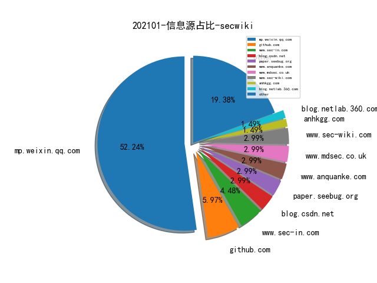
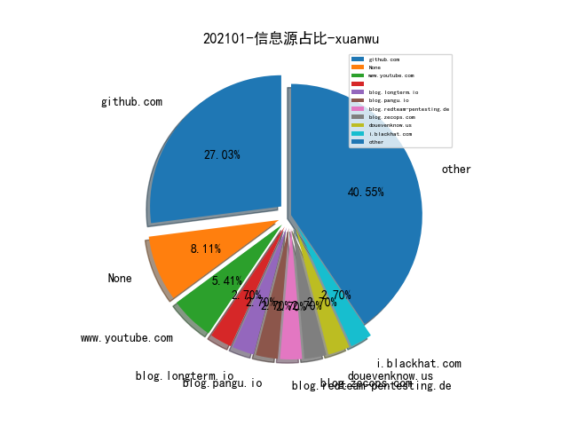
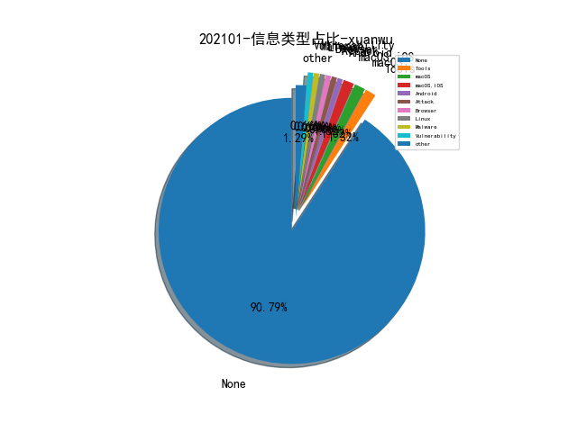
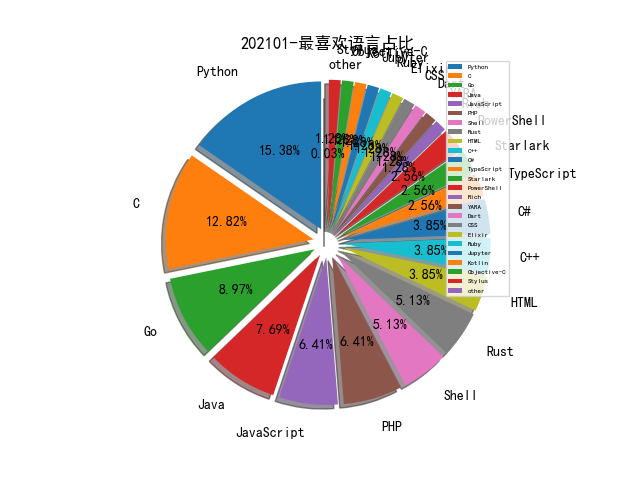

# [数据--所有](README_20.md)
# [数据--年度](README_2021.md)
# 202101 信息源与信息类型占比

# 微信公众号 推荐
| nickname_english | weixin_no | title | url| 
| --- | --- | --- | ---| 
| 共创网安 | jsgcwa | “专家讲坛”第二期：互联网产品数据与隐私合规审查要点 | https://mp.weixin.qq.com/s/m_8Y3x-DzoWNwU8tBT-ENw | 1| 
| 开源情报研究所 | OSINTR | 【技巧】如何开源手动挖掘LinkedIn领英 | https://mp.weixin.qq.com/s/mtQ40m7qLayUDxgmWgsWPw | 2| 
| 绿盟科技研究通讯 | nsfocus_research | 自动化的攻击溯源之痛 ：数据获取与关联的困惑 | https://mp.weixin.qq.com/s/dJDHLvJOGVPQB1cfTayX9w | 2| 
| 中国信息安全 | chinainfosec | 程国平：全球网络反恐格局中的中国力量 | https://mp.weixin.qq.com/s/1dpbZO_rD4GSfaPqjw5Luw | 2| 
| 信创咨询 | XConsultancy | 信创产业：操作系统深度研究（PPT原文） | https://mp.weixin.qq.com/s/fA1xDbQ9qbV1L2AgitFXdw | 1| 
| 腾讯安全应急响应中心 | tsrc_team | SSRF安全指北 | https://mp.weixin.qq.com/s/EYVFHgNClgNGrk_92PZ90A | 3| 
| DevSecOps联盟 | idevsecops | 美国国防部DevSecOps实践 | https://mp.weixin.qq.com/s/EPpgQlgc_8eY21xJRZkBqQ | 1| 
| OPPO安全应急响应中心 | opposrc | CVE-2020-16040: Chromium V8引擎整数溢出漏洞分析 | https://mp.weixin.qq.com/s/j-WbrCQVb4E2JfY-bDqzJw | 1| 
| Flanker论安全 | ShowMeShell | Fuzzing战争系列之二：不畏浮云遮望眼 | https://mp.weixin.qq.com/s/G26MJOH4VPene1Sd_zjEQw | 1| 
| 安全学术圈 | secquan | FAVICONS和缓存：浏览器中的持久跟踪 | https://mp.weixin.qq.com/s/K7IesHkuUTV2yAh9_yl6kw | 5| 
| BlockSec Team | gh_57d94ebc8526 | 以太坊钓鱼合约：因为了解，所以上当 | https://mp.weixin.qq.com/s/4zztI9f-pzvLxVFxlVdgMw | 1| 
| vivo千镜安全实验室 | gh_54ff3f871510 | 常见的匿名化隐私保护技术 | https://mp.weixin.qq.com/s/46yaHiXqDpq4cY4W1uqKsQ | 1| 
| 酒仙桥六号部队 | anfu-360 | 记一次反制追踪溯本求源 | https://mp.weixin.qq.com/s/xW2u4s8xCTnLCkpDoK5Yzw | 2| 
| ChaMd5安全团队 | chamd5sec | Netgear固件分析与后门植入 | https://mp.weixin.qq.com/s/o9v4V673ayyMTY1vGjveFg | 4| 
| SecWiki | SecWiki | SecWiki安全周刊-年卷-2020 | https://mp.weixin.qq.com/s/pI495N48AYbA3gYkf4zlqQ | 1| 
| 看雪学院 | ikanxue | Cobalt Strike4.0远控木马分析 | https://mp.weixin.qq.com/s/Sv0lR4G2eQf4_L8W4CqRYw | 1| 
| 青藤实验室 | gh_151a64925040 | SharePoint Rce 系列分析（二） | https://mp.weixin.qq.com/s/ZLSFXUoNNAFxqeiD9RpYZg | 2| 
| 人民公安报 | rmgabs | 公安部网安局公布一批网络黑产案例 | https://mp.weixin.qq.com/s/uXupT3yeeOA9NWVjQORgDQ | 1| 
| FreeBuf | freebuf | 关于PDD员工发帖溯源联想到的相关技术与实现 | https://mp.weixin.qq.com/s/coRsNLMT_FAr6xSHwPgOUg | 1| 
| 启明星辰专家视野 | VenusExpertsVision | 自动化渗透测试系统技术路径分析 | https://mp.weixin.qq.com/s/gtXfPvT8Yatp3IMVdCID7Q | 1| 
| 潇湘信安 | xxxasec | 组策略限制3389登录的绕过方式 | https://mp.weixin.qq.com/s/4eDNmiiXp7afLKdYzHeb3Q | 4| 
| 时间之外沉浮事 | tasnrh | 美国国家网络靶场系统架构与设计原理剖析①总论 | https://mp.weixin.qq.com/s/8yz12RyCyNXGhcAVFZX60g | 2| 
| 360Quake空间测绘 | gh_0284fd4851e7 | 浅析开源蜜罐识别与全网测绘 | https://mp.weixin.qq.com/s/hq-z2HBGz3nehnCVg_H-RQ | 1| 
| 阿里云安全 | aliyunsec | 对 SolarWinds 事件更深的思考：如何防御供应链攻击 | https://mp.weixin.qq.com/s/GdER32Z7K86boHVc-Kic3g | 1| 
| ENYA物語 | gh_9f583a318c52 | 技術型管理人的自我成長 | https://mp.weixin.qq.com/s/moARUZG3BNOJL7EAiXDMJA | 1| 
| 威胁棱镜 | THREAT_PRISM | 【情报速览】疑似 APT35 与响尾蛇组织使用的域名被披露 | https://mp.weixin.qq.com/s/BNVsnlXYtaZ9_Pk_oKgZRg | 3| 
| 安全小飞侠 | AvFisher | 一个普通网安从业人员的2020 | https://mp.weixin.qq.com/s/PYCIMOk8_wUg7eLFEVOoUQ | 1| 
| 深信服千里目安全实验室 | Further_eye | 【高级持续性威胁跟踪】红队视角看Sunburst后门中的TTPs | https://mp.weixin.qq.com/s/wtEbawfOd1g_T2ovp1SaGg | 1| 
| 学术plus | caeit-e | 最新！人工智能网络安全威胁图谱 | https://mp.weixin.qq.com/s/4qbCusJde_z0AM1eDC4YiA | 1| 
| 安全喷子 | gh_2a9c00f1d053 | ATT&CK 2020更新指南 | https://mp.weixin.qq.com/s/cPiVersg8VyK4fBTK8W1Ag | 1| 
| 穿过丛林 | gh_f90eac70537b | 基于语义token分析的克隆代码检测系统 | https://mp.weixin.qq.com/s/e_NvzMbOqDspns3VLXBjYw | 1| 

# 组织github账号 推荐
| github_id | title | url | org_url | org_profile | org_geo | org_repositories | org_people | org_projects | repo_lang | repo_star | repo_forks| 
| --- | --- | --- | --- | --- | --- | --- | --- | --- | --- | --- | ---| 

# 私人github账号 推荐
| github_id | title | url | p_url | p_profile | p_loc | p_company | p_repositories | p_projects | p_stars | p_followers | p_following | repo_lang | repo_star | repo_forks | 
| --- | --- | --- | --- | --- | --- | --- | --- | --- | --- | --- | --- | --- | --- | ---| 
| ControlThings-io | 适用于Control Things Platform用户的样本文件与顶级研究项目。 | https://github.com/ControlThings-io/ct-samples | None | None | None | None | 0 | 0 | 0 | 0 | 0 | Python,C,PHP,Rich | 0 | 0 | 1| 
| FunnyWolf | Viper:是一款图形化红队评估工具,将红队评估过程中常用的战术及技术进行模块集成所有功能必备。 | https://github.com/FunnyWolf/Viper | None | hack for fun | None | None | 21 | 0 | 0 | 0 | 0 | Python,Go | 504 | 73 | 1| 
| Hzllaga | 宝塔面板Windows版提权方法 | https://github.com/Hzllaga/BT_Panel_Privilege_Escalation | None |  | None | None | 31 | 0 | 0 | 0 | 0 | C#,Python | 187 | 39 | 1| 
| LasCC | The all-in-one Red Team browser extension for Web Pentesters | https://github.com/LasCC/Hack-Tools | https://ludovic-cyber-sec.netlify.app/ | Cyber Security Student at ESGI Paris 🇫🇷 | Paris | None | 45 | 0 | 0 | 0 | 0 | TypeScript,Python,JavaScript | 1900 | 197 | 1| 
| LloydLabs | Windows 进程删除自身可执行文件的 PoC | https://github.com/LloydLabs/delete-self-poc | https://blog.syscall.party | 20, BEng Student @ ENU, RE, fuzzing & malware research. | Edinburgh, Scotland. | None | 6 | 0 | 0 | 0 | 0 | Go,C | 235 | 32 | 1| 
| Loveforkeeps | 解密APT”小黄鸭“挖矿组织分析报告。 | https://github.com/Loveforkeeps/Lemon-Duck | http://loveforkeeps.top | Cyberspace Security Engineer/Threat Intelligence Scholar/Security Developer | Mars | None | 23 | 0 | 0 | 0 | 0 | Python | 1 | 1 | 1| 
| MiSecurity | 消费级物联网安全基线 | https://github.com/MiSecurity/Cyber-Security-Baseline-for-Consumer-Internet-of-Things/blob/main/resources/pdf/%E6%B6%88%E8%B4%B9%E7%BA%A7%E7%89%A9%E8%81%94%E7%BD%91%E5%AE%89%E5%85%A8%E5%9F%BA%E7%BA%BF.pdf | None | None | None | None | 0 | 0 | 0 | 0 | 0 | Go | 0 | 0 | 1| 
| MichaelKoczwara | Awesome CobaltStrike Defence 资料整理 | https://github.com/MichaelKoczwara/Awesome-CobaltStrike-Defence | https://twitter.com/MichalKoczwara | Cyber Security | London | None | 32 | 0 | 0 | 0 | 0 | Go,C#,Ruby | 198 | 25 | 1| 
| S1ckB0y1337 | Cobalt-Strike 相关的一些工具以及使用 Tips | https://github.com/S1ckB0y1337/Cobalt-Strike-CheatSheet | https://app.hackthebox.eu/profile/1109 | Penetration Tester , OSCP , Comp.Sci Student , CTF Player | Greece | None | 99 | 0 | 0 | 0 | 0 | Java,C++ | 1200 | 322 | 1| 
| a232319779 | mmpi: 邮件快速检测库 | https://github.com/a232319779/mmpi | None | big pig. | None | None | 11 | 0 | 0 | 0 | 0 | Python,C | 28 | 12 | 1| 
| ahmedkhlief | APT-Hunter: 紫色团队用于Windows事件日志的威胁搜寻工具项目。 | https://github.com/ahmedkhlief/APT-Hunter | https://shells.systems | @ahmed_khlief : Security Analyst , Purple Teamer , APT Hunter | None | None | 11 | 0 | 0 | 0 | 0 | Python,PowerShell,C++ | 250 | 70 | 1| 
| anantshri | 研究员 Anant Shrivastava 关于 Android Security 培训的资料 | https://github.com/anantshri/Android_Security | http://blog.anantshri.info | Project Leader for @AndroidTamer and @CodeVigilant | Bhopal India | InfoSec Professional | 194 | 0 | 0 | 0 | 0 | Python,Shell,PHP | 245 | 96 | 1| 
| astarasikov | 有研究员公开了一个 Fuzz macOS GPU 相关模块的 Fuzzer | https://github.com/astarasikov/macos-gpu-fuzzing-public | https://allsoftwaresucks.blogspot.com |  | Moscow, Russia | None | 63 | 0 | 0 | 0 | 0 | Objective-C,Java,C | 41 | 14 | 1| 
| bg6cq | 一次挖矿入侵处理记录 | https://github.com/bg6cq/ITTS/blob/master/security/mine/README.md | http://bg6cq.github.io |  | None | USTC | 116 | 0 | 0 | 0 | 0 | Lua,C,PHP | 110 | 45 | 1| 
| cdk-team | 容器环境定制的渗透测试工具 | https://github.com/cdk-team/CDK/wiki/CDK-Home-CN | None | None | None | None | 0 | 0 | 0 | 0 | 0 | Go | 0 | 0 | 1| 
| coodyer | fire_vulnerability_scanner: 一款http协议的漏洞扫描框架 | https://github.com/coodyer/fire_vulnerability_scanner | None |  | https://avatars3.githubusercontent.com/u/21119116?v=3&u=29f095a5e89411d5ca4cc7509c406280f095e658&s=400 | None | 19 | 0 | 0 | 0 | 0 | C#,Java | 27 | 10 | 1| 
| daniel-thompson | 基于MicroPython的智能手表开发环境手册指南（包括Pine64 PineTime）项目介绍。 | https://github.com/daniel-thompson/wasp-os | http://redfelineninja.org.uk/daniel/ |  | Bristol, UK | None | 70 | 0 | 0 | 0 | 0 | Python,C,Shell | 179 | 64 | 1| 
| ffuf | Fast web fuzzer written in Go | https://github.com/ffuf/ffuf | None | None | None | None | 0 | 0 | 0 | 0 | 0 | Go,Shell | 0 | 0 | 1| 
| google | nsjail - Google 开源的一个 Linux 平台进程隔离工具 | https://github.com/google/nsjail | None | None | None | None | 0 | 0 | 0 | 0 | 0 | C,TypeScript,Java,Python,JavaScript,C++,HTML,Starlark,Go,Rust | 0 | 0 | 2| 
| grapl-security | 用图的理论从日志中挖掘入侵的行为 | https://github.com/grapl-security/grapl | None | None | None | None | 0 | 0 | 0 | 0 | 0 | Python,Rust | 0 | 0 | 1| 
| h4ckdepy | SeveTools:多功能的网络安全实战工具项目库。 | https://github.com/h4ckdepy/SeveTools | https://blog.happysec.cn | 网络安全爱好者。 | None | None | 21 | 0 | 0 | 0 | 0 | Stylus,PHP,JavaScript,CSS | 118 | 66 | 1| 
| ihebski | 各类 IoT 设备/Web 组件的默认密码收集 | https://github.com/ihebski/DefaultCreds-cheat-sheet | None | Security Operations Engineer (⌐■_■) , Pentester , Bughunter | Error: Unable to resolve | None | 57 | 0 | 0 | 0 | 0 | Python,HTML,Jupyter | 343 | 91 | 1| 
| jsherman212 | XNU 内核 Hook 框架，基于 checkra1n pongoOS | https://github.com/jsherman212/xnuspy | https://twitter.com/jsherma100 | CS student, interested in security research & exploit dev | None | None | 14 | 0 | 0 | 0 | 0 | C | 206 | 21 | 1| 
| nccgroup | PyBeacon - NCCGroup 开源的用于处理 Cobalt Strike beacons 的脚本 | https://github.com/nccgroup/pybeacon | None | None | None | None | 0 | 0 | 0 | 0 | 0 | C,TypeScript,Java,Python,JavaScript,C++,C#,Shell,Elixir,Rust | 2600 | 393 | 1| 
| nikic | PHP-Parser:用PHP编写的PHP解析器来分析代码工作。 | https://github.com/nikic/PHP-Parser | https://nikic.github.io/ |  | Berlin, Germany | JetBrains | 75 | 0 | 0 | 0 | 0 | C,PHP | 29200 | 6500 | 1| 
| nyxgeek | 渗透测试时枚举 OneDrive 合法用户的工具 | https://github.com/nyxgeek/onedrive_user_enum | None | rebel scum, nerfherder, starbuck | hacking gibsons | None | 29 | 0 | 0 | 0 | 0 | Python,Shell,PowerShell | 254 | 59 | 1| 
| ruanyf | ES6 标准入门教程资源。 | https://github.com/ruanyf/es6tutorial | https://twitter.com/ruanyf |  | Shanghai, China | None | 67 | 0 | 0 | 0 | 0 | JavaScript | 18900 | 8300 | 1| 
| sbousseaden | JSON DataSet for macOS mapped to MITRE ATT&CK Tactics | https://github.com/sbousseaden/macOS-ATTACK-DATASET | http://@SBousseaden | Threat Hunting & DFIR | None | None | 66 | 0 | 0 | 0 | 0 | YARA,PowerShell | 1200 | 221 | 1| 
| scannells | 研究员 Simon Scannell 公开的几个 Exploits | https://github.com/scannells/exploits | None | Security Enthusiast interested in Fuzzing | Stuttgart, Germany | None | 5 | 0 | 0 | 0 | 0 | Python,Go,PHP,Rust | 29 | 7 | 1| 
| xie19900123 | springboot系列教程资源。 | https://github.com/xie19900123/spring-boot-learning | https://blog.lqdev.cn/ | 一只没有故事的程序猿 | 福州, 中国 | None | 5 | 0 | 0 | 0 | 0 | Java | 182 | 154 | 1| 

# medium_xuanwu 推荐
| title | url| 
| --- | ---| 
| Mitigating Abuse of Android Application Permissions and Special App Accesses | http://medium.com/mitre-attack/mobile-attack-mitigating-android-abuse-50516fb7de85| 
| 这两天黑客攻击安全研究员事件相关 C&C 通信机制的分析 | http://medium.com/s2wlab/analysis-of-threatneedle-c-c-communication-feat-google-tag-warning-to-researchers-782aa51cf74| 
| SSRF exploitation in Spreedsheet to PDF converter | http://medium.com/@r4id3n/ssrf-exploitation-in-spreedsheet-to-pdf-converter-2c7eacdac781| 
| Exploiting OAuth: Redirect_URI | http://gupta-bless.medium.com/exploiting-oauth-redirect-uri-3e27de6d7a70| 
| Windows Defender Application Control (WDAC) in 20H2 | http://mattifestation.medium.com/windows-defender-application-control-wdac-updates-in-20h2-and-building-a-simple-secure-4fd4ee86de4| 
| CVE-2020–35717 — RCE through XSS in zonote Electron App | http://medium.com/bugbountywriteup/remote-code-execution-through-cross-site-scripting-in-electron-f3b891ad637| 

# medium_secwiki 推荐
| title | url| 
| --- | ---| 
| How to Look for Ideas in Computer Science Research | https://zhiyunq.medium.com/how-to-look-for-ideas-in-computer-science-research-7a3fa6f4696f| 

# zhihu_xuanwu 推荐
| title | url| 
| --- | ---| 

# zhihu_secwiki 推荐
| title | url| 
| --- | ---| 
| 用PyOD工具库进行「异常检测」 | https://zhuanlan.zhihu.com/p/58313521| 
| 实时态势数据驱动的平行仿真推演方法 | https://zhuanlan.zhihu.com/p/163628289| 

# xz_xuanwu 推荐
| title | url| 
| --- | ---| 

# xz_secwiki 推荐
| title | url| 
| --- | ---| 
| 两个有趣的DNS 安全问题研究 | https://xz.aliyun.com/t/9047| 
| Java安全02-从ClassLoader到冰蝎Java篇 | https://xz.aliyun.com/t/9050| 

# 日更新程序
`python update_daily.py`