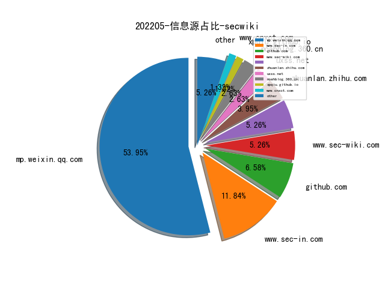
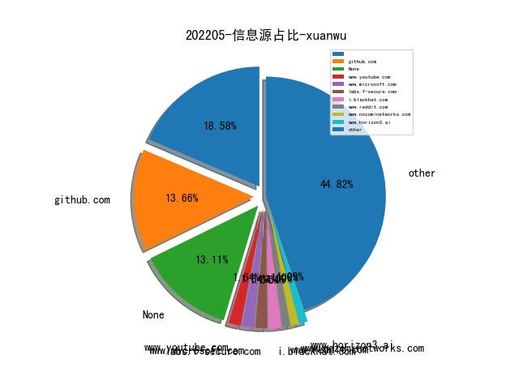
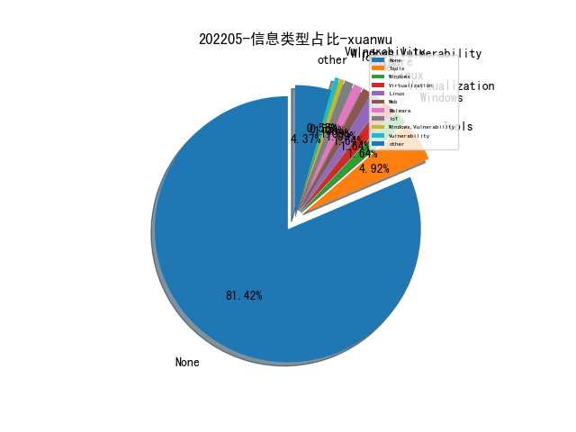
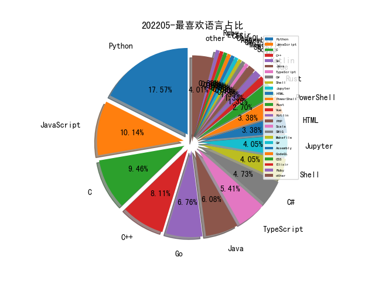

# [数据--所有](README_20.md)
# [数据--年度](README_2022.md)
# 202205 信息源与信息类型占比

# 微信公众号 推荐
| nickname_english | weixin_no | title | url| 
| --- | --- | --- | ---| 
| 青衣十三楼飞花堂 | gh_9feb5a276a2a | Gmail对附件的限制 | https://mp.weixin.qq.com/s/z30VMqz1dOAmAazOSegvuQ | 1| 
| 杨小时的杂货铺 | yxszahuopu | HTB-467-Noter | https://mp.weixin.qq.com/s?__biz=MzIzNDc4NzMxOQ==&mid=2247483660&idx=1&sn=2c882883f2e757207d57c1e36b1ed8c1&chksm=e8f05994df87d082d7ce2f944de5b91d6f3bb0f8613f325b824e9a3eaa71c9b2bdfb2f43c8dc#rd | 1| 
| 安全研究GoSSIP | GoSSIPSJTU | IEEE S&P 2022 云端报道（2） | https://mp.weixin.qq.com/s/5GE3s18ZPiYCeIu6ajSedw | 3| 
| 我的安全视界观 | CANI_Security | 【应急能力提升3】内网横向移动攻击模拟（上） | https://mp.weixin.qq.com/s/gy8fp455ZgE-8aHwBDPl5A | 4| 
| 国家网络威胁情报共享开放平台 | CNTIC2017 | Cobalt Strike 分析：CS元数据编码和解码 | https://mp.weixin.qq.com/s/lXpYU9VhZd4nw2YjeUK4rQ | 1| 
| Tide安全团队 | TideSec | 微信小程序反编译 | https://mp.weixin.qq.com/s/OQWU0wSAUhaM6QaaT6-CXA | 1| 
| Rancher | RancherLabs | 快速上手云原生安全平台 NeuVector | https://mp.weixin.qq.com/s/aXSA_opN-rV68rnrPO73PA | 1| 
| 这里是河马 | gh_f779ec60843d | SHELLPUB在线查杀更新公告（文末抽奖） | https://mp.weixin.qq.com/s/b44XcSoyTgYNprL6wKHh-Q | 1| 
| 神龙叫 | shen_long_jiao | 从网空测绘看俄乌战争态势--及对我们的启示 | https://mp.weixin.qq.com/s/HLvydDDhTfxK-xWsGEuCpA | 1| 
| 安全行者老霍 | gh_c2b78e839fd7 | 2021年十大网络安全漏洞&“Lazarus”组织介绍 | https://mp.weixin.qq.com/s/dzvqIXoXdSd5BLJNb6kW3w | 1| 
| 中国信息安全 | chinainfosec | 前沿 , 透过俄乌冲突谈对“网络无国界”的再认识 | https://mp.weixin.qq.com/s/sLNVFiJPQOnoytnomubjyQ | 1| 
| ISC2北京分会 | ISC2BJ | 网络安全创业从0到1-演讲实录 | https://mp.weixin.qq.com/s/0uTkCQHtCySO9ydEjUMU8g | 1| 
| 深信服千里目安全实验室 | Further_eye | 【技术推荐】前端JS攻防对抗 | https://mp.weixin.qq.com/s/QbfUkU0Fj7Bjk--21H2UQA | 1| 
| M01N Team | m01nteam | 从ATT&CK V11版发布看ATT&CK的更新历程 | https://mp.weixin.qq.com/s/vm13xmTzLYrqLrMRlndAZA | 1| 
| 全栈网络空间安全 | cyber_securlty | 企业安全建设：资产管理面面观 | https://mp.weixin.qq.com/s/23fekORQNpmj82Oh1ttixg | 2| 
| 卫星黑客 | Satellite_Hacker | 卫星互联网发展与信息安全趋势 | https://mp.weixin.qq.com/s/qsrZ8RJl_wE_aN0t4-mhog | 1| 
| QZ的安全悟道 | lookvul | 【D3FEND】网络安全对策知识图谱框架解读 | https://mp.weixin.qq.com/s/ziHX1gQYo89sWz248yLgAQ | 2| 
| 看雪学苑 | ikanxue | 智能电表安全之通讯分析 | https://mp.weixin.qq.com/s/3GVK_Xm_H93PyRKu35ttoQ | 1| 
| JDArmy | gh_e9df6be6f498 | 域控被突破的几种途径 | https://mp.weixin.qq.com/s/nKvAD4ixmbZcxzkxCTxAfQ | 1| 
| 绿盟科技研究通讯 | nsfocus_research | 一文读懂https中密钥交换协议的原理及流程 | https://mp.weixin.qq.com/s/iy5rnB-d_khxhEmFPZof9w | 2| 
| 安全学术圈 | secquan | 利用代码知识图谱实现Bug定位 | https://mp.weixin.qq.com/s/i4lHXM2NW9zNMkLn4B0eyQ | 7| 
| 威胁棱镜 | THREAT_PRISM | Botconf 2022 议题速递 | https://mp.weixin.qq.com/s/G6EFRXY0DB9j-jzINuXLPQ | 3| 
| RASP安全技术 | gh_fdc868b0562f | RASP 如何检测Java Agent 内存马 | https://mp.weixin.qq.com/s/IScmevyRf8oxPPjGwYMRHQ | 1| 

# 组织github账号 推荐
| github_id | title | url | org_url | org_profile | org_geo | org_repositories | org_people | org_projects | repo_lang | repo_star | repo_forks| 
| --- | --- | --- | --- | --- | --- | --- | --- | --- | --- | --- | ---| 

# 私人github账号 推荐
| github_id | title | url | p_url | p_profile | p_loc | p_company | p_repositories | p_projects | p_stars | p_followers | p_following | repo_lang | repo_star | repo_forks | 
| --- | --- | --- | --- | --- | --- | --- | --- | --- | --- | --- | --- | --- | --- | ---| 
| yidao620c | Python Cookbook 第三版 中文版 | https://github.com/yidao620c/python3-cookbook | https://github.com/yidao620c?tab=followers | keep running | Xian China | Huawei Technologies Co., Ltd. | 12 | 0 | 69 | 0 | 0 | Python,Java,Jupyter,CSS | 0 | 0 | 1| 
| theori-io | Safari WebGL XFB UAF 漏洞（CVE-2022-26717）PoC | https://github.com/theori-io/CVE-2022-26717-Safari-WebGL-Exploit | None | None | None | None | 0 | 0 | 0 | 0 | 0 | Python,C,JavaScript,Objective-C,HTML | 0 | 0 | 1| 
| shuai06 | Zyxel 防火墙远程命令注入漏洞（CVE-2022-30525）批量检测脚本. | https://github.com/shuai06/CVE-2022-30525 | https://github.com/shuai06?tab=followers | 侠之大者，为国为民。 | None | None | 26 | 0 | 956 | 0 | 0 | Python | 0 | 0 | 1| 
| safe6Sec | 哥斯拉&冰蝎源码分析 | https://github.com/safe6Sec/ShellManageTool | https://github.com/safe6Sec?tab=followers | script kiddie | kunming,China | threatbook | 112 | 0 | 1200 | 0 | 0 | Go,Java,CodeQL | 0 | 0 | 1| 
| quarkslab | When eBPF meets TLS，来自 CanSecWest 会议 | https://github.com/quarkslab/conf-presentations/blob/master/CanSecWest-2022/When%20eBPF%20meets%20TLS.pdf | None | None | None | None | 0 | 0 | 0 | 0 | 0 | C,TypeScript,Python,JavaScript,C++,Shell,Go | 0 | 0 | 1| 
| potmdehex | Zer0Con 2022 会议 ”Tales from the iOS/macOS Kernel Trenches“ 的 Slides | https://github.com/potmdehex/slides/blob/main/Zer0Con_2022_Tales_from_the_iOS_macOS_Kernel_Trenches.pdf | https://github.com/potmdehex?tab=followers | Reverse Engineer | None | None | 12 | 0 | 9 | 0 | 0 | C,Ruby | 0 | 0 | 1| 
| olafhartong | Windows Defender for Endpoint 版本的数据采集范围、防护机制研究 | https://github.com/olafhartong/Presentations/blob/master/Lifting-the-veil-a-look-at-MDE-under-the-hood.pdf | https://github.com/olafhartong?tab=followers |  | The Netherlands | @FalconForceTeam | 56 | 0 | 69 | 0 | 0 | Batchfile,PowerShell | 0 | 0 | 1| 
| neargle | 从零开始的 Kubernetes 攻防 | https://github.com/neargle/my-re0-k8s-security | https://github.com/Tencent | 💭 高级安全从业焦虑研究员 @Tencent . Security of CloudNative、Kubernetes And Container... ACGer~ | Xiamen(Amoy) | Tencent | 64 | 0 | 1200 | 0 | 0 | Go,Python,Shell,TypeScript | 0 | 0 | 1| 
| mttaggart | OffensiveNotion: Notion as a platform for offensive operat... | https://github.com/mttaggart/OffensiveNotion | https://github.com/mttaggart?tab=followers |  | None | None | 47 | 0 | 365 | 0 | 0 | Vue,JavaScript,Rust | 0 | 0 | 1| 
| microsoft | Playwright - 微软开源的控制浏览器实现自动化的框架 | https://github.com/microsoft/playwright | None | None | None | None | 0 | 0 | 0 | 0 | 0 | TypeScript,Jupyter,C#,JavaScript,C++,Python,Q#,F# | 0 | 0 | 1| 
| memN0ps | 面向 Red Team 的 Rust 版 Windows 内核驱动 | https://github.com/memN0ps/eagle-rs/ | https://github.com/memN0ps?tab=followers | Pentester / Red Teamer interested in Rust, Windows Internals, and Reverse Engineering. | New Zealand | None | 5 | 0 | 77 | 0 | 0 | Rust | 0 | 0 | 1| 
| mdecrevoisier | 将 Windows EventID 映射到 MITRE [email protected] 攻击矩阵的工具 | https://github.com/mdecrevoisier/EVTX-to-MITRE-Attack | https://github.com/mdecrevoisier?tab=followers | IT Security Analyst / SOC | None | None | 7 | 0 | 1 | 0 | 0 | Roff,PowerShell | 0 | 0 | 1| 
| malware-unicorn | Rust 语言编写的将内存中的 DLL 注入远程进程的工具 | https://github.com/malware-unicorn/rusty-memory-loadlibrary | https://github.com/malwareunicorn | MALWARE + FASHION = UNICORN Reverse Engineering Malware twitter: @malwareunicorn | San Francisco | None | 25 | 0 | 3 | 0 | 0 | Go,HTML,C++,Rust | 0 | 0 | 1| 
| lindsey98 | Phishpedia - 利用深度学习的方案识别钓鱼 Web 页面 | https://github.com/lindsey98/Phishpedia | https://github.com/lindsey98?tab=followers |  | None | National University of Singapore | 98 | 0 | 181 | 0 | 0 | Python,Java,Jupyter | 0 | 0 | 1| 
| idaholab | Malcolm - 网络流量分析工具 | https://github.com/idaholab/Malcolm | None | None | None | None | 0 | 0 | 0 | 0 | 0 | C,TypeScript,Assembly,Python,SWIG,JavaScript,C++,HTML | 0 | 0 | 1| 
| e-m-b-a | emba - 嵌入式设备固件分析工具 EMBA 更新 v1.0 版本 | https://github.com/e-m-b-a/emba | None | None | None | None | 0 | 0 | 0 | 0 | 0 | Python,Shell,HTML | 0 | 0 | 1| 
| ctripcorp | flybirds: 基于自然语言的，跨端跨框架 BDD UI 自动化测试方案 | https://github.com/ctripcorp/flybirds | None | None | None | None | 0 | 0 | 0 | 0 | 0 | Python,Kotlin,C,JavaScript,Java | 0 | 0 | 1| 
| blackorbird | 俄罗斯 Wizard Spider APT 组织分析 | https://github.com/blackorbird/APT_REPORT/blob/master/Wizard%20Spider/WizardSpider_TLPWHITE_v.1.4.pdf | https://github.com/blackorbird?tab=followers | APT hunter threat analyst | https://twitter.com/blackorbird | https://twitter.com/blackorbird | 46 | 0 | 126 | 0 | 0 | Python,C | 0 | 0 | 1| 
| binarly-io | 固件供应链安全及其已知漏洞的检测 | https://github.com/binarly-io/Research_Publications/tree/main/BHASIA_2022 | None | None | None | None | 0 | 0 | 0 | 0 | 0 | Python,Go,JavaScript,Shell,C++ | 0 | 0 | 1| 
| alibaba | Fastjson 1.2.80 及以下版本存在绕过默认 autoType 关闭的限制，实现远程代码执行 | https://github.com/alibaba/fastjson/wiki/security_update_20220523 | None | None | None | None | 0 | 0 | 0 | 0 | 0 | C,TypeScript,Java,Python,JavaScript,C++,Go | 0 | 0 | 1| 
| ThestaRY7 | supplier: 主流供应商的一些攻击性漏洞汇总 | https://github.com/ThestaRY7/supplier | https://github.com/ThestaRY7?tab=followers |  | None | None | 29 | 0 | 130 | 0 | 0 | Python,Vue,JavaScript | 0 | 0 | 1| 
| RhinoSecurityLabs | GCP IAM 提权相关的资料整理 | https://github.com/RhinoSecurityLabs/GCP-IAM-Privilege-Escalation | None | None | None | None | 0 | 0 | 0 | 0 | 0 | Python,Go | 0 | 0 | 1| 
| Pear1y | GitHub 有研究员公开了 Atlassian Bitbucket Data Center 反序列化漏洞(CVE-2022-26133) 的批量验证工具 | https://github.com/Pear1y/CVE-2022-26133 | https://github.com/Pear1y?tab=followers | There is a crack in everything，thats how the light gets in. | Bermuda | Cyber Security | 36 | 0 | 234 | 0 | 0 | Python,C,Java | 0 | 0 | 1| 
| NVIDIA | NVIDIA 开源了 Linux 系统 GPU 的内核驱动 | https://github.com/NVIDIA/open-gpu-kernel-modules | None | None | None | None | 0 | 0 | 0 | 0 | 0 | C,Jupyter,Scala,Python,Makefile,C++,Cuda,Go | 0 | 0 | 1| 
| KasperskyLab | Apihashes - 卡巴斯基开源的用于识别 API 函数名已知 Hash 的插件 | https://github.com/KasperskyLab/Apihashes | None | None | None | None | 0 | 0 | 0 | 0 | 0 | C,Shell,Python,Kotlin,JavaScript,C++,C#,Go,PHP | 0 | 0 | 1| 
| JDArmy | 获取域控权限的几种思路总结 | https://github.com/JDArmy/GetDomainAdmin | None | None | None | None | 0 | 0 | 0 | 0 | 0 | C#,Python,C,JavaScript | 0 | 0 | 1| 
| Bareflank | Bareflank Hypervisor - 一款轻量级的 Hypervisor SDK，用于快速在 64 位机器上快速构建 hypervisor | https://github.com/Bareflank/hypervisor | None | None | None | None | 0 | 0 | 0 | 0 | 0 | Python,C,C++ | 0 | 0 | 1| 
| ASTTeam | 代码分析工具 CodeQL 相关的资料整理 | https://github.com/ASTTeam/CodeQL | None | None | None | None | 0 | 0 | 0 | 0 | 0 |  | 0 | 0 | 1| 

# medium_xuanwu 推荐
| title | url| 
| --- | ---| 
| macOS ESF Framework 在攻击检测方面的实践 | https://cedowens.medium.com/taking-esf-for-a-nother-spin-6e1e6acd1b74| 
| SpiritSwap 发布公告，有攻击者社工 GoDaddy 员工修改域名配置导致 SpiritSwap DNS 被劫持 | https://spiritswap.medium.com/post-mortem-on-this-weekends-dns-event-cb61c11f5c2f| 

# medium_secwiki 推荐
| title | url| 
| --- | ---| 

# zhihu_xuanwu 推荐
| title | url| 
| --- | ---| 

# zhihu_secwiki 推荐
| title | url| 
| --- | ---| 
| 基础架构安全弹性技术指南草案（固件安全篇） | https://zhuanlan.zhihu.com/p/515998950| 
| 情报的三大核心、四大要素、一个关键问题 | https://zhuanlan.zhihu.com/p/515570133| 
| （译）SLSA如何落地 | https://zhuanlan.zhihu.com/p/515363693| 

# xz_xuanwu 推荐
| title | url| 
| --- | ---| 

# xz_secwiki 推荐
| title | url| 
| --- | ---| 

# 日更新程序
`python update_daily.py`