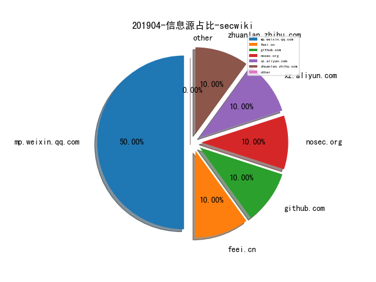
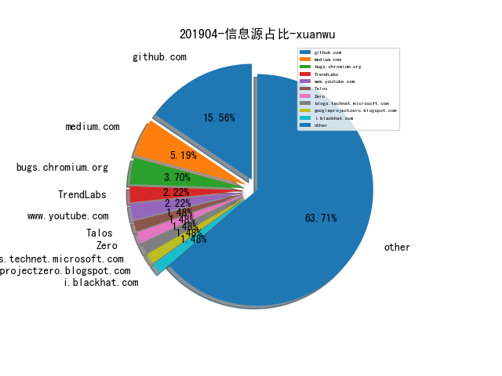
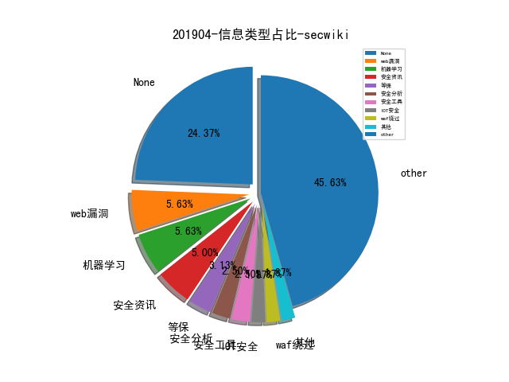
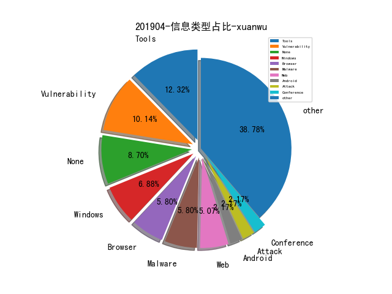
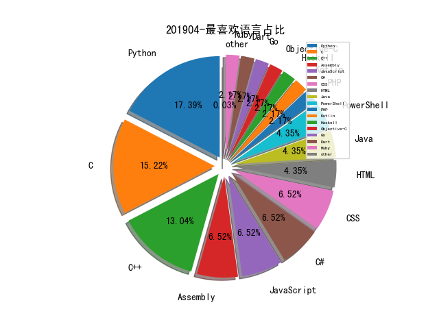

# [数据年报](README_YEAR.md)
# [数据月报-3月](README_3.md)
# 201904 信息源与信息类型占比

# 微信公众号 推荐
| nickname_english | weixin_no | url | title| 
| --- | --- | --- | ---| 
| 梅子酒的书札 | a960596293_book | https://mp.weixin.qq.com/s/rlSyABoulRKygPmwfcUuXA | 西湖论剑2019 WriteUp | 1| 
| 360核心安全 | CoreSec360 | https://mp.weixin.qq.com/s/r-jAWFjtOxgd-JyVStFvsg | APT战争中脚本攻击的兵法之道 | 1| 
| TideSec安全团队 | TideSec | https://mp.weixin.qq.com/s/X0mCJECAzyqxDBwhlP_3hg | Weblogic漏洞——从入门到放弃 | 6| 
| 半佛仙人 | banfoSB | https://mp.weixin.qq.com/s/AK6_wP_JtMW5DxzRyWaXXg | 屠夫遇上路霸丨揭秘高利贷与黑产的血色战争 | 1| 
| 图灵人工智能 | TuringAI01 | https://mp.weixin.qq.com/s/Yd0wjUQ03XINnMFLkPkBJg | 人工智能的现状与未来 | 1| 
| 安全学术圈 | secquan | https://mp.weixin.qq.com/s/ZHcikLKeF9ZJg9kyrX-UrA | S&P 2019 论文录用列表 | 1| 
| 格友 |  | https://mp.weixin.qq.com/s/3Ft6205f8kUoCuGzB-hPtg | 在调试器里看QQLive捉迷藏 | 1| 
| 网安国际 | inforsec | https://mp.weixin.qq.com/s/enasXD14SMzj1Cx5grGD3w | 谁劫持了我的DNS：全球域名解析路径劫持测量与分析 | 1| 
| 集智俱乐部 | swarma_org | https://mp.weixin.qq.com/s/vsCAE-6e0jpX8wPw6Sd9eA | 使用深度神经网络对 Twitter进行威胁检测 | 网络科学论文速递16篇 | 1| 

# 组织github账号 推荐
| github_id | title | url | org_url | org_profile | org_geo | org_repositories | org_people | org_projects | repo_lang | repo_star | repo_forks| 
| --- | --- | --- | --- | --- | --- | --- | --- | --- | --- | --- | ---| 
| mwrlabs | SharpGPOAbuse - MWR Labs 开发的基于 C# 的工具，用于滥用 GPO 编辑权限攻击该 GPO 控制的对象 | https://github.com/mwrlabs/SharpGPOAbuse | http://labs.mwrinfosecurity.com/ |  | Basingstoke, Johannesburg, London, Manchester, Singapore, New York | 43 | 0 | 0 | C,Java,Python,JavaScript,C++,C#,Objective-C,Assembly,Ruby,PowerShell,CSS | 1700 | 501 | 1| 
| REhints | 从 UEFI 固件攻击硬件可信任架构(HROT) ，来自 offensive 2019 大会 | https://github.com/REhints/Publications/blob/master/Conferences/Bypassing%20Hardware%20Root%20of%20Trust/offcon2019_final.pdf | http://REhints.com |  | http://REhints.com | 10 | 2 | 0 | Python,C,Assembly,CSS,C++ | 1200 | 249 | 1| 
| google | vulncode-db - 漏洞及漏洞代码整合数据库 | https://github.com/google/vulncode-db | https://opensource.google.com/ | Google ❤️ Open Source | https://opensource.google.com/ | 1447 | 2479 | 0 | C,Java,Python,Kotlin,JavaScript,Haskell,C++,Dart,HTML,Go,PHP | 0 | 0 | 1| 

# 私人github账号 推荐
| github_id | title | url | p_url | p_profile | p_loc | p_company | p_repositories | p_projects | p_stars | p_followers | p_following | repo_lang | repo_star | repo_forks | 
| --- | --- | --- | --- | --- | --- | --- | --- | --- | --- | --- | --- | --- | --- | ---| 
| ruanyf | document-style-guide: 中文技术文档的写作规范 | https://github.com/ruanyf/document-style-guide | https://twitter.com/ruanyf |  | Shanghai, China | None | 54 | 0 | 233 | 50300 | 0 | JavaScript | 15700 | 6900 | 1| 
| taviso | swisstable - 访问 Abseil Swiss Tables 的小型 C 封装库 | https://github.com/taviso/swisstable | None |  | None | None | 11 | 0 | 9 | 1100 | 1 | C | 2600 | 193 | 1| 
| hlldz | APC-PPID - 通过 APC 注入创建进程并伪造父进程的项目 | https://github.com/hlldz/APC-PPID | https://artofpwn.com | Pwner, Red Teamer | İstanbul, Türkiye | None | 5 | 0 | 179 | 214 | 22 | Python,PowerShell,C++ | 691 | 159 | 1| 
| ustayready | fireprox - AWS API Gateway 管理工具，用于动态创建 HTTP 传递代理以实现唯一的 IP 轮换 | https://github.com/ustayready/fireprox | None | divergent thinker/breaker and researcher of stuff | None | None | 39 | 0 | 7 | 194 | 7 | Python,C#,HTML | 702 | 147 | 1| 
| Viralmaniar | I-See-You: Bash and Javascript tool to find the exact location of user | https://github.com/Viralmaniar/I-See-You | https://twitter.com/maniarviral |  | Melbourne, Victoria, Australia | None | 35 | 0 | 220 | 192 | 93 | Python | 705 | 105 | 1| 
| zer0yu | 网络空间安全的RSS订阅 | https://github.com/zer0yu/CyberSecurityRSS | http://zeroyu.xyz/ | Every light needs a shadow. You just have to learn how to control it,use it when you need it. | None | None | 28 | 0 | 1900 | 162 | 1100 | Python,C,CSS | 44 | 16 | 1| 
| djhohnstein | CSharpSetThreadContext - 由 C# 开发的通过 CreateRemoteThread 和 SetThreadContext 执行shellcode 以逃避 Get-InjectedThread 检测的工具 | https://github.com/djhohnstein/CSharpSetThreadContext | https://popeax.io | Operator at SpecterOps. Kali Contributor. | Seattle, WA | None | 48 | 0 | 5 | 130 | 2 | C# | 154 | 35 | 1| 
| eoftedal | Istio/Envoy 目录穿越漏洞详情披露(CVE-2019-9901) | https://github.com/eoftedal/writings/blob/master/published/CVE-2019-9901-path-traversal.md | http://erlend.oftedal.no/blog |  | Oslo, Norway | None | 73 | 0 | 384 | 103 | 67 | C#,JavaScript,Java | 172 | 11 | 1| 
| Mattiwatti | EfiGuard - x64 UEFI bootkit，在启动时修补 Windows 启动管理器以禁用 PatchGuard 和驱动程序签名验证(DSE) | https://github.com/Mattiwatti/EfiGuard | None |  | The Netherlands | None | 19 | 0 | 13 | 87 | 3 | C,Assembly,C++ | 227 | 61 | 1| 
| 0x36 | iOS上的沙箱逃逸漏洞（A11平台，版本<12.2） | https://github.com/0x36/powend | None | . | Morocco | None | 6 | 0 | 23 | 79 | 0 | C,Makefile | 138 | 36 | 1| 
| crypto-cypher | 《Privacy for Identities: The Art of Pseudonymity》发布，主要探讨信息安全，隐私权和大规模监控 | https://github.com/crypto-cypher/privacy-for-identities/blob/master/PrivacyForIdentities%20-%20Prerelease.pdf | https://twitter.com/CryptoCypher | Networking. OpSec. Privacy. Coding. Just another paranoid cypherpunk whos terrible at calculus. Dreaming big. | None | None | 7 | 0 | 7 | 20 | 7 | Shell | 32 | 5 | 1| 
| DimopoulosElias | alpc-mmc-uac-bypass - 通过 ALPC 绕过 UAC 的项目 | https://github.com/DimopoulosElias/alpc-mmc-uac-bypass | https://www.linkedin.com/in/dimopouloselias |  | None | None | 5 | 0 | 11 | 15 | 2 | Python,C,C++ | 43 | 10 | 1| 
| sumas | OSCP-Cheatsheet-God - OSCP 考试备忘清单 | https://github.com/sumas/OSCP-Cheatsheet-God | None |  | None | None | 18 | 0 | 1 | 14 | 1 | Python,JavaScript,Java,PHP | 124 | 31 | 1| 

# 日更新程序
`python update_daily.py`