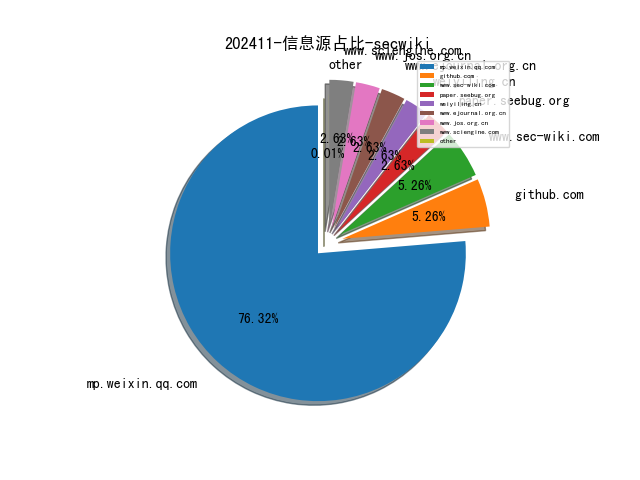
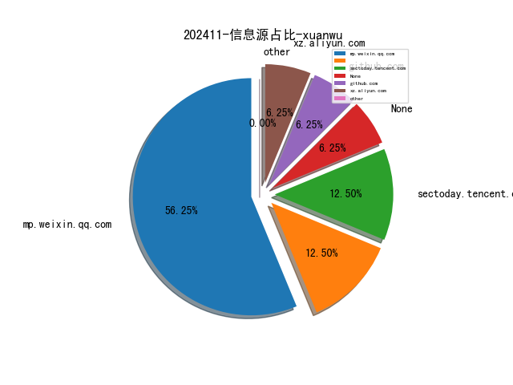
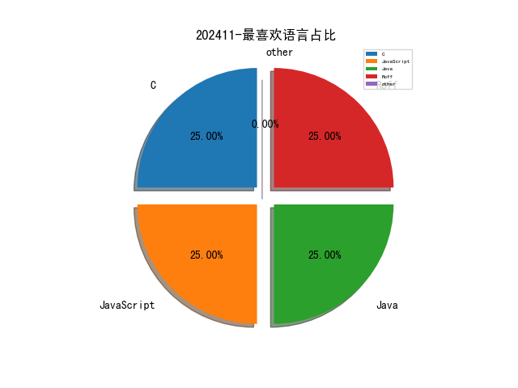

# [数据--所有](README_20.md)
# [数据--年度](README_2024.md)
# 202411 信息源与信息类型占比

# 网络安全书籍 推荐
| date_added | language | title | author | link | size| 
| --- | --- | --- | --- | --- | ---| 
| 2024-11-28 11:47:09 | English | Outlier Detection in Python | unknown | https://www.wowebook.org/outlier-detection-in-python/ | unknown| 
| 2024-11-28 06:38:58 | English | Microsoft Copilot for Power Apps | unknown | https://www.wowebook.org/microsoft-copilot-for-power-apps/ | unknown| 
| 2024-11-26 07:16:50 | English | Beginning ChatGPT for Python | unknown | https://www.wowebook.org/beginning-chatgpt-for-python/ | unknown| 
| 2024-11-26 23:22:47 | English | Python Machine Learning By Example | Yuxi (Hayden) Liu; | http://libgen.st/book/index.php?md5=143AADF706A620D20916160319321B2E | 19 MB [EPUB]| 
| 2024-11-25 10:02:29 | English | A Common-Sense Guide to Data Structures and Algorithms in Python, Volume 1: Level Up Your Core Programming Skills | Jay Wengrow | http://libgen.st/book/index.php?md5=C0A46C67BB2536AA545EC1BD7065E742 | 12 MB [PDF]| 
| 2024-11-24 16:34:23 | English | Generative AI for Web Development : Building Web Applications Powered by OpenAI APIs and Next.js | Tom Auger; Emma Saroyan | http://libgen.st/book/index.php?md5=92923A36367E4D8267ACB5EF0A349F2A | 8 MB [EPUB]| 
| 2024-11-24 16:32:20 | English | Cloud Observability with Azure Monitor | José Ángel Fernández, Manuel Lázaro Ramírez | http://libgen.st/book/index.php?md5=BFC77C34655D6CFA00978952137E1E52 | 7 MB [PDF]| 
| 2024-11-24 08:45:28 | English | Road to Kubernetes | unknown | https://www.wowebook.org/road-to-kubernetes/ | unknown| 
| 2024-11-23 19:56:36 | English | Generative AI for Web Development | unknown | https://www.wowebook.org/generative-ai-for-web-development/ | unknown| 
| 2024-11-21 06:46:08 | English | Supply Chain Software Security | unknown | https://www.wowebook.org/supply-chain-software-security/ | unknown| 
| 2024-11-21 06:29:05 | English | Deep Dive into the Power Platform in the Age of Generative AI | unknown | https://www.wowebook.org/deep-dive-into-the-power-platform-in-the-age-of-generative-ai/ | unknown| 
| 2024-11-21 06:16:15 | English | Optimizing Generative AI Workloads for Sustainability | unknown | https://www.wowebook.org/optimizing-generative-ai-workloads-for-sustainability/ | unknown| 
| 2024-11-21 08:56:07 | English | Learn Data Science Using Python | unknown | https://www.wowebook.org/learn-data-science-using-python/ | unknown| 
| 2024-11-20 15:25:18 | English | AI and Emerging Technologies: Automated Decision-Making, Digital Forensics, and Ethical Considerations | Purvi Pokhariyal (editor), Archana Patel (editor), Shubham Pandey (editor) | http://libgen.st/book/index.php?md5=2E87859338BC7CBADB10299315B1AFD0 | 4 MB [PDF]| 
| 2024-11-20 15:27:37 | English | Qualitative Data Analysis With Chatgpt And Qualcoder: A Step-By-Step Guide To AI-Powered Coding And Thematic Analysis (Mastering Research: Design, Execution, and Publishing Made Simple) | Rafiq Muhammad | http://libgen.st/book/index.php?md5=2EBB009DF16C1F60CFD85BFAF1C9273C | 2 MB [EPUB]| 
| 2024-11-20 16:25:28 | English | Investigating the Role of ChatGPT in Supporting Metacognitive Processes During Problem‐Solving Activities | unknown | http://libgen.st/book/index.php?md5=A2157026779983FD8DD75EF7F647860E | 1 MB [PDF]| 
| 2024-11-19 06:03:33 | English | Learn Python Generative AI | unknown | https://www.wowebook.org/learn-python-generative-ai/ | unknown| 
| 2024-11-19 05:52:23 | English | Mastering Large Language Models | unknown | https://www.wowebook.org/mastering-large-language-models/ | unknown| 
| 2024-11-19 07:31:55 | English | Ultimate Python Programming | unknown | https://www.wowebook.org/ultimate-python-programming/ | unknown| 
| 2024-11-19 07:20:38 | English | Mastering Python 3 Programming | unknown | https://www.wowebook.org/mastering-python-3-programming/ | unknown| 
| 2024-11-18 08:50:09 | English | Effective Python: 125 Specific Ways to Write Better Python, 3rd Edition | unknown | https://www.wowebook.org/effective-python-125-specific-ways-to-write-better-python-3rd-edition/ | unknown| 
| 2024-11-18 17:32:28 | English | Python Apps on Visual Studio Code | unknown | https://www.wowebook.org/python-apps-on-visual-studio-code/ | unknown| 
| 2024-11-18 16:58:50 | English | Advanced Python Guide | unknown | https://www.wowebook.org/advanced-python-guide/ | unknown| 
| 2024-11-18 16:21:54 | English | Ultimate Data Science Programming in Python | unknown | https://www.wowebook.org/ultimate-data-science-programming-in-python/ | unknown| 
| 2024-11-16 09:26:29 | English | Microsoft Power Platform For Dummies | Jack A. Hyman | http://libgen.st/book/index.php?md5=4632253D6649D23A4F444FA702849AC9 | 25 MB [PDF]| 
| 2024-11-16 09:28:14 | English | Deep Dive into the Power Platform in the Age of Generative AI: Architectural Insights and Best Practices for Intelligent Business Solutions | Biswa Pujarini Mohapatra | http://libgen.st/book/index.php?md5=D1C4F1426509A823AF04AE86B09E28CE | 10 MB [PDF]| 
| 2024-11-16 23:56:33 | English | Hands-On Prescriptive Analytics: Optimizing Your Decision Making with Python | Walter R. Paczkowski | http://libgen.st/book/index.php?md5=B7ADC999BF59D9AF894D592A84FD70CE | 15 MB [PDF]| 
| 2024-11-14 20:11:14 | English | ChatGPT and AI for Accountants | Scott Dell, Mfon Akpan | http://libgen.st/book/index.php?md5=9E1EFC37FCC45B9E12F6114017EEDB17 | 2 MB [EPUB]| 
| 2024-11-14 07:22:47 | English | Microsoft 365 Administration Cookbook, 2nd Edition | unknown | https://www.wowebook.org/microsoft-365-administration-cookbook-2nd-edition/ | unknown| 
| 2024-11-14 06:24:06 | English | Mastering OpenTelemetry and Observability: Enhancing Application and Infrastructure Performance and Avoiding Outages | unknown | https://www.wowebook.org/mastering-opentelemetry-and-observability-enhancing-application-and-infrastructure-performance-and-avoiding-outages/ | unknown| 
| 2024-11-14 06:02:26 | English | Async Rust: Unleashing the Power of Fearless Concurrency | unknown | https://www.wowebook.org/async-rust-unleashing-the-power-of-fearless-concurrency/ | unknown| 
| 2024-11-13 08:12:25 | English | Generative AI in Education | unknown | https://www.wowebook.org/generative-ai-in-education/ | unknown| 
| 2024-11-13 12:00:29 | English | Design and Deploy IoT Network & Security with Microsoft Azure | unknown | https://www.wowebook.org/design-and-deploy-iot-network-security-with-microsoft-azure/ | unknown| 
| 2024-11-12 05:34:04 | English | Powerful Python: Patterns and Strategies with Modern Python | unknown | https://www.wowebook.org/powerful-python-patterns-and-strategies-with-modern-python/ | unknown| 
| 2024-11-10 05:22:52 | English | Rust For Database: A Comprehensive Guide to Building Scalable, Reliable, and Secure Database Applications with Rust, for Developers and Database Administrators | Radcliffe, Patrick | http://libgen.st/book/index.php?md5=D3A9459385A137F8D51CE917DE9CDD65 | 349 kB [EPUB]| 
| 2024-11-10 13:24:50 | English | Health and Safety: Risk Management | Tony Boyle, Fiona Charlton | http://libgen.st/book/index.php?md5=0A1C5B93C930BF446CBDF090202BC05B | 11 MB [PDF]| 
| 2024-11-10 09:24:55 | English | Prompt Engineering for LLMs | unknown | https://www.wowebook.org/prompt-engineering-for-llms/ | unknown| 
| 2024-11-09 20:10:12 | English | Python Programming for Mathematics | Guillod, Julien | http://libgen.st/book/index.php?md5=D273B997F81D6F8AED737D183103ABD2 | 6 MB [EPUB]| 
| 2024-11-09 20:09:20 | English | Powerful Python (for Raymond Rhine) | Aaron Maxwell | http://libgen.st/book/index.php?md5=FEB01601F4EC620AA80851942EC662C0 | 2 MB [EPUB]| 
| 2024-11-09 20:06:10 | English | You Don’t Need a £1Million Cybersecurity Budget | Oosthuizen, Izak | http://libgen.st/book/index.php?md5=B1D5AEFC16B8A25B55B981E44169F3BB | 1 MB [EPUB]| 
| 2024-11-09 20:15:52 | English | Theres No Such Thing as Crypto Crime : An Investigative Handbook | Nick Furneaux | http://libgen.st/book/index.php?md5=7C97223CFF87256B1772AFF8F940821A | 28 MB [EPUB]| 
| 2024-11-08 09:48:45 | English | Microsoft Power Apps Cookbook, 3rd Edition | unknown | https://www.wowebook.org/microsoft-power-apps-cookbook-3rd-edition/ | unknown| 
| 2024-11-08 08:57:09 | English | Modern Time Series Forecasting with Python, 2nd Edition | unknown | https://www.wowebook.org/modern-time-series-forecasting-with-python-2nd-edition/ | unknown| 
| 2024-11-08 06:58:13 | English | Microsoft Cybersecurity Architect Exam Ref SC-100, 2nd Edition | unknown | https://www.wowebook.org/microsoft-cybersecurity-architect-exam-ref-sc-100-2nd-edition/ | unknown| 
| 2024-11-07 08:03:00 | English | Microsoft 365 Certified: Collaboration Communications Systems Engineer Associate Certification Companion | unknown | https://www.wowebook.org/microsoft-365-certified-collaboration-communications-systems-engineer-associate-certification-companion/ | unknown| 
| 2024-11-05 20:15:13 | English | Microsoft 365 Certified: Collaboration Communications Systems Engineer Associate Certification Companion : A Guide to Prepare for Exam MS-721 | Fabrizio Volpe | http://libgen.st/book/index.php?md5=9313AE77C205F9DB7A8DBD5DEB064592 | 6 MB [EPUB]| 
| 2024-11-05 19:22:15 | English | Gene Flow: Monitoring, Modelling and Mitigation | Wei Wei PhD (editor), Neal Stewart PhD (editor) | http://libgen.st/book/index.php?md5=6B6061625103B423F9F7D056F3F03831 | 12 MB [PDF]| 
| 2024-11-05 19:13:16 | English | Prompt Engineering for LLMs (for True Epub) | John Berryman and Albert Ziegler | http://libgen.st/book/index.php?md5=A01DADF08241D9DE7287171271C1CFC5 | 11 MB [EPUB]| 
| 2024-11-04 05:42:47 | English | beginners guide to streamlit with python | unknown | https://it-ebooks.info/book/1686051862-beginners_guide_to_streamlit_with_python/ | unknown| 
| 2024-11-04 05:42:47 | English | firewalls dont stop dragons 5th edition | unknown | https://it-ebooks.info/book/1686052309-firewalls_dont_stop_dragons_5th_edition/ | unknown| 
| 2024-11-04 06:16:19 | English | Application Lifecycle Management on Microsoft Power Platform | unknown | https://www.wowebook.org/application-lifecycle-management-on-microsoft-power-platform/ | unknown| 
| 2024-11-03 16:27:52 | English | Introduction to Number Theory & Cryptography: The Foundation of Digital Security (With 400+ Practice Questions for Undergraduates and Graduates) | Cristen Weldon | http://libgen.st/book/index.php?md5=F29BF940B8991899B7CD7EC716C4B755 | 12 MB [PDF]| 
| 2024-11-03 16:15:13 | English | Mastering Python: A Comprehensive Crash Course for Beginners | Hussain, Frahaan; Hussain, Kameron | http://libgen.st/book/index.php?md5=F584A1B9E1B817E0D4345228681B1685 | 548 kB [EPUB]| 
| 2024-11-03 16:14:31 | English | Object-Oriented Python: Master OOP through Game Development and GUI Applications | Kameron Hussain | http://libgen.st/book/index.php?md5=32FD1140D66F95C5C34C9281A81B2C02 | 499 kB [EPUB]| 
| 2024-11-03 14:41:09 | English | Unveiling NIST Cybersecurity Framework 2.0 | unknown | https://www.wowebook.org/unveiling-nist-cybersecurity-framework-2-0/ | unknown| 
| 2024-11-02 09:57:15 | English | Decoding Large Language Models | unknown | https://www.wowebook.org/decoding-large-language-models/ | unknown| 
| 2024-11-02 04:41:35 | English | PYTHON OBJECT-ORIENTED PROGRAMMING: Adventures with Python and Processing Playground | BM, Roger | http://libgen.st/book/index.php?md5=3963E1D4C150410CD420FDF3A1E175F4 | 13 MB [EPUB]| 
| 2024-11-02 04:40:13 | English | Engineering AI Systems: Architecture and DevOps Essentials (for Raymond Rhine) | Len Bass; Qinghua Lu; Ingo Weber; Liming Zhu | http://libgen.st/book/index.php?md5=60ED4AFFFFF9A67EE410F785C4960E5A | 4 MB [EPUB]| 
| 2024-11-01 20:15:20 | English | Artificial Intelligence for Cybersecurity | unknown | https://www.wowebook.org/artificial-intelligence-for-cybersecurity/ | unknown| 
| 2024-11-01 11:33:53 | English | Programming Microsoft Dynamics 365 Business Central, 7th Edition | unknown | https://www.wowebook.org/programming-microsoft-dynamics-365-business-central-7th-edition/ | unknown| 
| 2024-11-01 06:23:25 | English | Enhancing Your Cloud Security with a CNAPP Solution | unknown | https://www.wowebook.org/enhancing-your-cloud-security-with-a-cnapp-solution/ | unknown| 

# 微信公众号 推荐
| nickname_english | weixin_no | title | url| 
| --- | --- | --- | ---| 
| BOSS直聘安全应急响应中心 | None | BSSRC助力｜先知安全沙龙 - 上海站 12月14日开启！ | https://mp.weixin.qq.com/s?__biz=MzkyODIwNDI3NA==&mid=2247486163&idx=1&sn=42bbc9b70c49097d4652afdfc2ed5734 | 1| 
| CISP | None | 2024年9月CISP考试成绩 | https://mp.weixin.qq.com/s?__biz=MzI1NzQ0NTMxMQ==&mid=2247489909&idx=1&sn=21d534c2183d237a374bd6971473957e | 1| 
| CNNVD安全动态 | None | 信息安全漏洞周报（2024年第48期） | https://mp.weixin.qq.com/s?__biz=MzAxODY1OTM5OQ==&mid=2651461677&idx=1&sn=62fa971338a579f75e9efa7bdad3e5d7 | 3| 
| CertiK | None | CertiK · 感恩你我，让安全有迹可循 | https://mp.weixin.qq.com/s?__biz=MzU5OTg4MTIxMw==&mid=2247503632&idx=2&sn=bec2140e15f1d22262efd3c08de93b65 | 7| 
| Eonian Sharp | None | 漏洞预警 , 7-Zip代码执行漏洞CVE-2024-11477 | https://mp.weixin.qq.com/s?__biz=Mzg3NzUyMTM0NA==&mid=2247487694&idx=2&sn=4cbf3f73698e15a3d4134fe9c293a674 | 6| 
| E安全 | None | 供应链管理商Blue Yonder遭攻击，星巴克转“人工运营” | https://mp.weixin.qq.com/s?__biz=MzI4MjA1MzkyNA==&mid=2655348055&idx=1&sn=40fdecd701ac072915033fe29b61ae40 | 3| 
| F12sec | None | 倒计时11天！2024补天杯破解大赛150W奖金池，先到先得！ | https://mp.weixin.qq.com/s?__biz=Mzg5NjU3NzE3OQ==&mid=2247490242&idx=1&sn=8b687d062a01739a3d04ff4792814bec | 2| 
| FOFA | None | 高效的数据查询和处理工具-GoFOFA | https://mp.weixin.qq.com/s?__biz=MzkyNzIwMzY4OQ==&mid=2247489467&idx=1&sn=7b6f0cc44e71eceb4d96e16f982f5637 | 1| 
| GoUpSec | None | 全球最大盗版IPTV网络被清剿，月入2.63亿美元 | https://mp.weixin.qq.com/s?__biz=MzkxNTI2MTI1NA==&mid=2247501560&idx=1&sn=704a0ee9aea6ca6b78ca22a4cd6516ee | 5| 
| HackingGroup | None | 360SRC x Hacking Group丨「奇御」AI安全技术沙龙议题征集！ | https://mp.weixin.qq.com/s?__biz=MzIxNjk0MzQ4NQ==&mid=2247489226&idx=1&sn=e65183e4cc5d89e3d895431cfba33ed2 | 1| 
| Jie安全 | None | 一次代码审计项目案例 | https://mp.weixin.qq.com/s?__biz=Mzg2NDg2MDIxNQ==&mid=2247485178&idx=1&sn=7cee18f868abe6a208283b93aba3f3a0 | 8| 
| Khan安全攻防实验室 | None | 论文一直投不中？保姆级SCI全程投稿发表服务来了！润色、选刊、投稿、返修，直至中刊！ | https://mp.weixin.qq.com/s?__biz=MzAwMjQ2NTQ4Mg==&mid=2247495782&idx=2&sn=b0615329d3dc00f03758738624945e73 | 24| 
| SCA御盾 | None | 【漏洞复现】某平台-receiptDetail-mysql-sql注入漏洞 | https://mp.weixin.qq.com/s?__biz=MzkzNjYwODg3Ng==&mid=2247485748&idx=1&sn=8a6f72ab5197ccbf53c8f82555e3d192 | 3| 
| StaticCodeAnalysis | None | 什么是银行数字化转型？完整概述 | https://mp.weixin.qq.com/s?__biz=Mzk0MzY1NDc2MA==&mid=2247484207&idx=2&sn=b9aa2a0c3cdc5c506adb5609fe67ca9b | 3| 
| TIPFactory情报工厂 | None | 伪造调用栈来迷惑EDR和杀软 | https://mp.weixin.qq.com/s?__biz=MzkyMjM0ODAwNg==&mid=2247488266&idx=1&sn=8db9cd092f30fafaab615f6bf495e9c7 | 4| 
| Van1sh | None | 2024 网鼎杯 朱雀&玄武 | https://mp.weixin.qq.com/s?__biz=Mzg5OTkxMzM3NA==&mid=2247485782&idx=1&sn=9d41083b4a4501718c7353297ba9fde1 | 2| 
| Yak Project | None | \"Yaker，你可以全局配置插件环境变量!\" | https://mp.weixin.qq.com/s?__biz=Mzk0MTM4NzIxMQ==&mid=2247525652&idx=1&sn=91301a8c65604e8229d69f54ed2707bd | 4| 
| ZAC安全 | None | 倒计时10天！2024补天杯破解大赛150W奖金池，先到先得！ | https://mp.weixin.qq.com/s?__biz=MzkzMjIxMDU5OA==&mid=2247498674&idx=1&sn=5d55268e709774fcd94d31ff3a4724c5 | 2| 
| crossoverJie | None | 完整议程释出 , 30+全球技术大咖齐聚 StarRocks Summit Asia 2024，共论 Lakehouse 未来 | https://mp.weixin.qq.com/s?__biz=MzIyMzgyODkxMQ==&mid=2247488089&idx=1&sn=f3513d5abec3a18e2f58b8da185c59de | 3| 
| dotNet安全矩阵 | None | .NET 内网攻防实战电子报刊 | https://mp.weixin.qq.com/s?__biz=MzUyOTc3NTQ5MA==&mid=2247497083&idx=2&sn=f14faf64e50d694698745979be5496cf | 29| 
| e安在线 | None | 安全学习 , CISAW-RM风险管理 | https://mp.weixin.qq.com/s?__biz=MzI1OTA1MzQzNA==&mid=2651247066&idx=5&sn=8d4e19fbcde12ba7da692ad9aede8a3d | 31| 
| rainy的安全小屋 | None | 疑似0day window全版本RCE | https://mp.weixin.qq.com/s?__biz=MzkxMzczNTA4MQ==&mid=2247483957&idx=1&sn=0bcd9ad9035581a34f8db5bacc018c41 | 4| 
| solar应急响应团队 | None | 【成功案例】lockbit家族百万赎金不必付！技术手段修复被加密的数据库，附溯源分析报告 | https://mp.weixin.qq.com/s?__biz=MzkyOTQ0MjE1NQ==&mid=2247493976&idx=1&sn=0471fb1022806483600fe259b7826972 | 1| 
| 七芒星实验室 | None | 命令控制之Covenant | https://mp.weixin.qq.com/s?__biz=Mzg4MTU4NTc2Nw==&mid=2247493697&idx=2&sn=bb79b3ba0c0985759f3975019fcad171 | 12| 
| 不秃头的安全 | None | 工具分享 , nuclei管理工具＋9w poc不想要嘛？ | https://mp.weixin.qq.com/s?__biz=Mzg3NzkwMTYyOQ==&mid=2247488006&idx=1&sn=69194b9ea7c038bace29df89d53fa101 | 3| 
| 中国保密协会科学技术分会 | None | 浅析电磁泄漏增强的智能驾驶车辆感知技术（下篇） | https://mp.weixin.qq.com/s?__biz=MzIxMzI4ODI1MA==&mid=2247488801&idx=1&sn=52fd4a0074637579346df3ea6001c5c1 | 1| 
| 中国信息安全 | None | 前沿 , 网络水军的发展演进及其特征研究 | https://mp.weixin.qq.com/s?__biz=MzA5MzE5MDAzOA==&mid=2664230826&idx=7&sn=96f1a940ef30a5fbdb9d9121476c4931 | 102| 
| 乌雲安全 | None | 一样是网安证书，为什么CISP比CISSP更火？ | https://mp.weixin.qq.com/s?__biz=MzAwMjA5OTY5Ng==&mid=2247525047&idx=2&sn=7afba37145c77a7037227e63b4d4b04b | 10| 
| 云弈安全 | None | 《网络安全技术 终端计算机通用安全技术规范》将于明年5月1日正式施行 | https://mp.weixin.qq.com/s?__biz=MzU2ODY0ODk2Nw==&mid=2247489563&idx=1&sn=a58b39d6ee32588bfac2e7bf309d0ab0 | 1| 
| 云科安信Antira | None | 深扒网页防篡改，全域应用防护有奇招！ | https://mp.weixin.qq.com/s?__biz=Mzg2NTk3NjczNQ==&mid=2247485415&idx=1&sn=925014aa9d02d63c43fcefd9614ed88f | 4| 
| 云起无垠 | None | 云起无垠CEO沈凯文博士获评“中关村U30 2024年度优胜者” | https://mp.weixin.qq.com/s?__biz=Mzg3Mjg4NTcyNg==&mid=2247489922&idx=1&sn=622cdf76757deab04b4545d759f706b2 | 1| 
| 人遁安全 | None | 你个小骚 Python ！哥哥今晚狠狠的写死你！！ | https://mp.weixin.qq.com/s?__biz=Mzk0NDQwMDY1Nw==&mid=2247484640&idx=1&sn=1ca257828b4cc5132132c72ed1388162 | 6| 
| 亿人安全 | None | 记一次异常艰难的渗透测试 | https://mp.weixin.qq.com/s?__biz=Mzk0MTIzNTgzMQ==&mid=2247518498&idx=1&sn=891c4b9401699de8d77b2426851a620e | 8| 
| 亿赛通 | None | 绿盟科技刘进：文档安全路径从加密到融合防护再到智能化 | https://mp.weixin.qq.com/s?__biz=MzA5MjE0OTQzMw==&mid=2666307061&idx=1&sn=57f43afb8caebc66ac9a45017559b050 | 3| 
| 代码卫士 | None | 黑客利用 ProjectSend 严重漏洞攻击服务器 | https://mp.weixin.qq.com/s?__biz=MzI2NTg4OTc5Nw==&mid=2247521625&idx=2&sn=8a7741ed8a419b06a972294416323328 | 29| 
| 众智维安 | None | 实至名归，众智维科技荣获2024“赢在南京·创业金陵”科技创新创业大赛二等奖 | https://mp.weixin.qq.com/s?__biz=MzU5Mjg0NzA5Mw==&mid=2247493574&idx=1&sn=268871b634b0198686ccf9c9f5a65272 | 3| 
| 信息安全与通信保密杂志社 | None | 中车信息公司张振威荣获2024年度“金智奖”网安风云人物奖 | https://mp.weixin.qq.com/s?__biz=MzkwMTMyMDQ3Mw==&mid=2247596469&idx=3&sn=cb3f711bd69ec811b93f434bf20d8840 | 28| 
| 信息安全国家工程研究中心 | None | 工程中心获商用密码检测机构（商用密码应用安全性评估业务）资质 | https://mp.weixin.qq.com/s?__biz=MzU5OTQ0NzY3Ng==&mid=2247498369&idx=1&sn=aa8f60f05aae8002e57964e2790279c1 | 7| 
| 信息安全研究 | None | 【业界动态】公安部网络安全法律咨询委员会2024年年会暨第十四届中国信息安全法律大会“网络犯罪打击整治”分论坛在京召开 | https://mp.weixin.qq.com/s?__biz=MzA3NzgzNDM0OQ==&mid=2664991604&idx=3&sn=efc16bbe545aac870703e6ad17a274f3 | 39| 
| 内生安全联盟 | None | 加强电力安全治理，国家能源局重磅发布！ | https://mp.weixin.qq.com/s?__biz=Mzg4MDU0NTQ4Mw==&mid=2247527157&idx=2&sn=c1a8af977cc17dbe1af9d9cb274f1ca9 | 31| 
| 再说安全 | None | 浅析全球网络安全的8个主流岗位（2024） | https://mp.weixin.qq.com/s?__biz=MzkyODYwODkyMA==&mid=2247484694&idx=1&sn=a37222d1f3accb410466110284b603fc | 16| 
| 冷漠安全 | None | 「漏洞复现」安科瑞环保用电监管云平台 GetEnterpriseInfoById SQL注入漏洞 | https://mp.weixin.qq.com/s?__biz=MzkyNDY3MTY3MA==&mid=2247486164&idx=1&sn=82f20754d12c6098cffb4d09c43a3de4 | 17| 
| 创宇安全智脑 | None | 创宇安全智脑 , 用友 NC process SQL注入等73个漏洞可检测 | https://mp.weixin.qq.com/s?__biz=MzIwNjU0NjAyNg==&mid=2247489930&idx=1&sn=766e34a9f96662ab6f3afea35dc2e1be | 2| 
| 北京路劲科技有限公司 | None | 网络安全常识科普 | https://mp.weixin.qq.com/s?__biz=MzUyMjAyODU1NA==&mid=2247491710&idx=1&sn=3991110e0e2516ad6dc625e0da1fc67a | 2| 
| 北邮 GAMMA Lab | None | LoG2024速递 , 去芜存菁：经典GNN三次问鼎SOTA的反思 | https://mp.weixin.qq.com/s?__biz=Mzg4MzE1MTQzNw==&mid=2247491309&idx=1&sn=20d5911602a7f27b1673f5dd4ca9e2f8 | 4| 
| 吉祥快学网络安全吧 | None | 速拿走：攻防演练项目资料合集！ | https://mp.weixin.qq.com/s?__biz=MzkzMzcxNTQyNw==&mid=2247485297&idx=1&sn=91655073d4694058e11b625c7f974667 | 5| 
| 君说安全 | None | 一篇杂谈：网络安全管理的目标究竟是什么？ | https://mp.weixin.qq.com/s?__biz=MzUzNjkxODE5MA==&mid=2247487514&idx=1&sn=793536e65e31cb34b1533a5380144e2e | 7| 
| 启明星辰安全简讯 | None | 【漏洞通告】Zabbix SQL注入漏洞（CVE-2024-42327） | https://mp.weixin.qq.com/s?__biz=MzkzNzY5OTg2Ng==&mid=2247500309&idx=3&sn=3cf382f546d45d798a5eafd69bbfc3e0 | 24| 
| 启明星辰集团 | None | 获奖！AI创新应用奖 | https://mp.weixin.qq.com/s?__biz=MzA3NDQ0MzkzMA==&mid=2651729556&idx=1&sn=200e1473b5da098bdc2e70088862a39a | 13| 
| 吾爱破解论坛 | None | 【Web逆向】AST解混淆实现某Epub的图片还原 | https://mp.weixin.qq.com/s?__biz=MjM5Mjc3MDM2Mw==&mid=2651141535&idx=1&sn=b41c794f7c204d46ef8e50d94b657ade | 8| 
| 喵苗安全 | None | \"安全左移 \"，或许没有意义 | https://mp.weixin.qq.com/s?__biz=Mzg5MjkwODc4MA==&mid=2247485640&idx=2&sn=78157af3b16fed436c64414a11873655 | 11| 
| 嗨嗨安全 | None | 2024补天杯破解大赛150W奖金池，先到先得！ | https://mp.weixin.qq.com/s?__biz=MzIzMjg0MjM5OQ==&mid=2247487926&idx=1&sn=159fb3835b8fbc97c25eb6fe4e5312a9 | 4| 
| 嘶吼专业版 | None | 关于发布《网络安全标准实践指南——粤港澳大湾区（内地、香港）个人信息跨境处理保护要求》的通知 | https://mp.weixin.qq.com/s?__biz=MzI0MDY1MDU4MQ==&mid=2247579846&idx=2&sn=8080a0e3ab21b412041a93084a027a4f | 13| 
| 国信安全 | None | 国家信息中心牵头编制的数据恢复国家标准正式发布 | https://mp.weixin.qq.com/s?__biz=MzU5MzYzMzU5NA==&mid=2247489233&idx=1&sn=e6ee38a7321e8bb0479b852b68df7947 | 1| 
| 国舜股份 | None | 感恩有你，一路同行 | https://mp.weixin.qq.com/s?__biz=MzA3NjU5MTIxMg==&mid=2650574978&idx=1&sn=cc38877bebabfd05baebf8157172d717 | 2| 
| 国际云安全联盟CSA | None | 天融信丨应对云原生安全威胁：构建原子化安全模块与动态策略 | https://mp.weixin.qq.com/s?__biz=MzkwMTM5MDUxMA==&mid=2247500874&idx=2&sn=f13f3f39a42837bae11c0a3253a50dbd | 6| 
| 塞讯安全验证 | None | 塞讯验证亮相 EISS 2024，深度解读安全验证 | https://mp.weixin.qq.com/s?__biz=Mzk0MTMzMDUyOA==&mid=2247503131&idx=2&sn=9578bf08f7bd436e808851a901d745d6 | 8| 
| 夜组安全 | None | 一个好用的越权扫描工具 | https://mp.weixin.qq.com/s?__biz=Mzk0ODM0NDIxNQ==&mid=2247492818&idx=1&sn=3e7742054baf1b71a35ffdd6ceac4290 | 10| 
| 天唯信息安全 | None | 《IPv6网络安全设备技术要求 第1部分：防火墙》（GB∕T 44810.1-2024）将于2025年2月1日实施 | https://mp.weixin.qq.com/s?__biz=MzkzMjE5MTY5NQ==&mid=2247502764&idx=3&sn=71d3eff572b4d3419c50f4fd61f9a503 | 12| 
| 天禧信安 | None | 倒计时10天！2024补天杯破解大赛150W奖金池，先到先得！ | https://mp.weixin.qq.com/s?__biz=MzUyMTE0MDQ0OA==&mid=2247493868&idx=2&sn=c5a490e4e81b9b9a87903e9513a22857 | 2| 
| 天融信 | None | 滨州市大数据局局长皮永峰一行莅临天融信参观交流 | https://mp.weixin.qq.com/s?__biz=MzA3OTMxNTcxNA==&mid=2650954409&idx=1&sn=61717ac483a123544e8054ef50d5937e | 19| 
| 奇安信 CERT | None | 【在野利用】ProjectSend 身份认证绕过漏洞(CVE-2024-11680)安全风险通告 | https://mp.weixin.qq.com/s?__biz=MzU5NDgxODU1MQ==&mid=2247502502&idx=1&sn=874d1d96ffd31643476939deced0fd4f | 4| 
| 奇安信威胁情报中心 | None | 去中心化的噩梦：隐藏在 P2P 网络下的后门 alphatronBot | https://mp.weixin.qq.com/s?__biz=MzI2MDc2MDA4OA==&mid=2247513129&idx=1&sn=5723225dc5a665d7f8137559b2eafc8d | 2| 
| 奇安信集团 | None | AI兴航 智联未来,奇安信受邀出席中兴通讯第四届战略峰会 | https://mp.weixin.qq.com/s?__biz=MzU0NDk0NTAwMw==&mid=2247622843&idx=3&sn=ec1e4325dde4c0538dbcc58487d72a9f | 35| 
| 奇安网情局 | None | 美国印太司令部正在打造印太统一军事作战通讯网络 | https://mp.weixin.qq.com/s?__biz=MzI4ODQzMzk3MA==&mid=2247489378&idx=1&sn=ca30e7d423c7061d486e5a8da4313a2c | 6| 
| 威胁猎人Threat Hunter | None | 【信贷欺诈】车贷欺诈产业链之“顶名车”欺诈手法揭秘 | https://mp.weixin.qq.com/s?__biz=MzI3NDY3NDUxNg==&mid=2247498306&idx=1&sn=f0b8ef9fd1c4af8416be162a7d37d9f1 | 2| 
| 安信安全 | None | 警惕消费技术武器化：某热门手游危害国家安全 | https://mp.weixin.qq.com/s?__biz=MzAxNTYwOTU1Mw==&mid=2650092605&idx=1&sn=afbd823da504a46b9843fb9b3c869c81 | 7| 
| 安全419 | None | 区块链在网安领域的发展潜力是否被低估了？ | https://mp.weixin.qq.com/s?__biz=MzUyMDQ4OTkyMg==&mid=2247545477&idx=1&sn=d7b73bca48b52baaaafdf297265f13cc | 23| 
| 安全内参 | None | 前实习生篡改代码攻击大模型训练，字节跳动起诉索赔800万 | https://mp.weixin.qq.com/s?__biz=MzI4NDY2MDMwMw==&mid=2247513175&idx=2&sn=9fbce0e6c6be781a5c3d36700788e311 | 27| 
| 安全君呀 | None | 【Android（安卓）安全逆向03】逆向基础 , Smali语法 | https://mp.weixin.qq.com/s?__biz=MzkyOTUxMzk2NQ==&mid=2247485523&idx=1&sn=5a95cef060cc7984692d920332cda74d | 4| 
| 安全圈 | None | 【安全圈】微软可能窃取你的Word、Excel文件以训练人工智能模型？ | https://mp.weixin.qq.com/s?__biz=MzIzMzE4NDU1OQ==&mid=2652066267&idx=3&sn=60edc9444015bfe02212ba3d2d549432 | 66| 
| 安全新说 | None | 严打电信网络诈骗！《电信网络诈骗及其关联违法犯罪联合惩戒办法》正式发布 | https://mp.weixin.qq.com/s?__biz=MzA3NDIwNTY5Mw==&mid=2247507119&idx=2&sn=7957d4a3cf8917f606365cb1fa92b25b | 5| 
| 安全村SecUN | None | 第一版｜「中国网安科技·港澳评级精选」报告正式发布·附下载 | https://mp.weixin.qq.com/s?__biz=MzkyODM5NzQwNQ==&mid=2247496256&idx=1&sn=647e635b9c4d2be3aa22cfe593444bb9 | 3| 
| 安全牛 | None | 活动预告 , 第⼋届“⼀带⼀路”园区建设国际合作峰会首次网络安全国际合作专题论坛启动报名 | https://mp.weixin.qq.com/s?__biz=MjM5Njc3NjM4MA==&mid=2651133644&idx=3&sn=1e971d469d2636d77684e9e5642a7769 | 7| 
| 安全狗的自我修养 | None | 绕过 Mozilla 中的电子邮件验证 | https://mp.weixin.qq.com/s?__biz=MzkwOTE5MDY5NA==&mid=2247503483&idx=1&sn=5dfd6cfaeedbf89dbe45a42c2fe27dd5 | 9| 
| 安在 | None | 齐治领衔起草堡垒机国家标准 | https://mp.weixin.qq.com/s?__biz=MzU5ODgzNTExOQ==&mid=2247632270&idx=2&sn=cd27070fa375504cd80e4590323ec836 | 39| 
| 安小圈 | None | 【零信任】零信任落地的理想应用场景：身份管理 | https://mp.weixin.qq.com/s?__biz=Mzg2MDg0ODg1NQ==&mid=2247534991&idx=4&sn=955b26f1090fa4a49f4613f39b223d64 | 19| 
| 安恒信息 | None | 浙商总会第二届三次理事大会举行，数字资产及交易委员会获授牌！ | https://mp.weixin.qq.com/s?__biz=MjM5NTE0MjQyMg==&mid=2650619755&idx=2&sn=3cb27127df54cb2d8754c91d3f1cde17 | 9| 
| 安知讯 | None | 央行科技司司长李伟：正加紧出台金融业数据跨境流动合规指南 | https://mp.weixin.qq.com/s?__biz=MzIxMDIwODM2MA==&mid=2653931151&idx=2&sn=1417bb547cb32be010e98c60388b29bf | 28| 
| 小艾搞安全 | None | 倒计时10天！2024补天杯破解大赛150W奖金池，先到先得！ | https://mp.weixin.qq.com/s?__biz=Mzg3MTY3NzUwMQ==&mid=2247490063&idx=1&sn=7bc9bf3351dddc5a8254d6257ceb814b | 3| 
| 平安集团安全应急响应中心 | None | 【干货】PSRC线上沙龙第七期视频资源大放送！ | https://mp.weixin.qq.com/s?__biz=MzIzODAwMTYxNQ==&mid=2652145295&idx=1&sn=df2db3ab78dd45e2fc4c5aab608d2dee | 4| 
| 微步在线 | None | 网络安全“金帽子”奖 , 微步OneSIG获评“2024年度优秀安全产品” | https://mp.weixin.qq.com/s?__biz=MzI5NjA0NjI5MQ==&mid=2650182582&idx=2&sn=a70f1a2beb3d945e0663c8a849d67545 | 2| 
| 情报分析师 | None | 开源情报信息，一网打尽！ | https://mp.weixin.qq.com/s?__biz=MzA3Mjc1MTkwOA==&mid=2650557708&idx=2&sn=1eb84cf1b3c9279a714f3b4c9c7bf3bb | 11| 
| 技术修道场 | None | 网络安全平台：守护数字世界的中坚力量 | https://mp.weixin.qq.com/s?__biz=MzA4NTY4MjAyMQ==&mid=2447899662&idx=1&sn=49bf1c9e3429f693345b02ea35289fca | 6| 
| 掌控安全EDU | None | 高级渗透测试 , 南昌 | https://mp.weixin.qq.com/s?__biz=MzUyODkwNDIyMg==&mid=2247545492&idx=2&sn=dc543b58be5240d308b20b5175ece364 | 36| 
| 攻城狮成长日记 | None | TextFSM模板太复杂？ntc-templates让一切变得简单！ | https://mp.weixin.qq.com/s?__biz=MjM5OTc5MjM4Nw==&mid=2457383903&idx=1&sn=455506a711d9cda46be64c373a62934f | 6| 
| 数世咨询 | None | 图解｜我国数据出境合规指引 | https://mp.weixin.qq.com/s?__biz=MzkxNzA3MTgyNg==&mid=2247529850&idx=2&sn=511875738cfedc5e9fc25baea359aad6 | 24| 
| 无糖反网络犯罪研究中心 | None | 过桥和直流中产生的U从哪里来？ | https://mp.weixin.qq.com/s?__biz=MzAxMzkzNDA1Mg==&mid=2247513424&idx=1&sn=3df8a4509aca4fad3a5b9ed7b0d71268 | 1| 
| 明暗安全 | None | 网络安全人才从业现状 | https://mp.weixin.qq.com/s?__biz=MzkxMjYxODcyNA==&mid=2247485267&idx=1&sn=aca6faae91307c73adffdbd12914c8ea | 10| 
| 星悦安全 | None | 某微信万能门店小程序系统存在前台任意文件上传漏洞 | https://mp.weixin.qq.com/s?__biz=Mzg4MTkwMTI5Mw==&mid=2247486295&idx=1&sn=abfa87852e2e7dc8d2b0d2c9c1760f95 | 9| 
| 柠檬赏金猎人 | None | AI Prompt越狱手册 | https://mp.weixin.qq.com/s?__biz=Mzg2Mzg2NDM0NA==&mid=2247484821&idx=1&sn=ef1f97559431e317553a6b4f2ef8b3c9 | 3| 
| 梆梆安全 | None | 构建电子政务全渠道安全防御体系 梆梆安全亮相2024网络安全创新发展大会 | https://mp.weixin.qq.com/s?__biz=MjM5NzE0NTIxMg==&mid=2651134615&idx=1&sn=dcb76588fcf20926def837cfcffaa086 | 11| 
| 沃克学安全 | None | 近期红队实战：出口FireWall助力突破靶标 | https://mp.weixin.qq.com/s?__biz=MzkzMjIxNjExNg==&mid=2247485772&idx=1&sn=d2563c474f6ffaa326a4b0e69216a9b8 | 4| 
| 浅安安全 | None | 工具 , vcenter_tools | https://mp.weixin.qq.com/s?__biz=MzkwMTQ0NDA1NQ==&mid=2247491570&idx=4&sn=8a85a34079ba6809bd8195c26378187d | 13| 
| 深信服科技 | None | 这份企业AI建设规划和落地路径，请查收！ | https://mp.weixin.qq.com/s?__biz=MjM5MTAzNjYyMA==&mid=2650594927&idx=1&sn=9706ed546dd915a9dc911673eb49a25f | 7| 
| 漏洞盒子 | None | 漏洞盒子 x 汽车之家SRC , 漏洞盒子「企业SRC」新住客 | https://mp.weixin.qq.com/s?__biz=MzA5NzQ0Mjc5NA==&mid=2649766179&idx=1&sn=19bc392d7501331260a85660f1d427d8 | 3| 
| 火绒安全 | None | 诚邀渠道合作伙伴共启新征程 | https://mp.weixin.qq.com/s?__biz=MzI3NjYzMDM1Mg==&mid=2247520582&idx=2&sn=907e33ea0bf633c2a18632213f3499e0 | 10| 
| 炼石网络CipherGateway | None | 喜报！炼石《金融数据和个人信息脱敏方案》荣膺“金帽子”奖 | https://mp.weixin.qq.com/s?__biz=MzkyNzE5MDUzMw==&mid=2247560261&idx=1&sn=be59bf36494c1bdefd945c62381a0890 | 8| 
| 爱奇艺技术产品团队 | None | QECon主题分享 , 价值交付的进阶探索与实践之道 | https://mp.weixin.qq.com/s?__biz=MzI0MjczMjM2NA==&mid=2247498613&idx=1&sn=ef0f76c258b07e1b530c034416016230 | 2| 
| 犀牛安全 | None | 超过 2,000 个 Palo Alto 防火墙遭到最近修补的零日漏洞攻击 | https://mp.weixin.qq.com/s?__biz=Mzg3ODY0NTczMA==&mid=2247491681&idx=1&sn=b6ec04cc6969427872d1425cb42e0dab | 4| 
| 生态遥感监测笔记 | None | R语言结构方程模型（SEM）▎有了它，轻松发Nature！！！ | https://mp.weixin.qq.com/s?__biz=Mzg4MzgyMjM0NQ==&mid=2247484494&idx=2&sn=6f35ebd6be9a932f74d3f230f5978239 | 2| 
| 白帽子左一 | None | 高级渗透测试 , 南昌 | https://mp.weixin.qq.com/s?__biz=MzI4NTcxMjQ1MA==&mid=2247614324&idx=2&sn=362c79557711b9954c889f0d82d014fe | 29| 
| 白帽学子 | None | 这就是传说中的https吗 | https://mp.weixin.qq.com/s?__biz=MzkyNzIxMjM3Mg==&mid=2247488346&idx=2&sn=9d32f43f742bf5483230020375f57f34 | 18| 
| 百度安全应急响应中心 | None | 度安讲｜第七期「智效融合，安全护航」深圳站技术沙龙成功举办 | https://mp.weixin.qq.com/s?__biz=MzA4ODc0MTIwMw==&mid=2652541915&idx=1&sn=7b944da743ab6315ad50d2d7beed3277 | 4| 
| 看雪学苑 | None | 索赔800万元！字节跳动前实习生因篡改代码并攻击大模型被起诉 | https://mp.weixin.qq.com/s?__biz=MjM5NTc2MDYxMw==&mid=2458584139&idx=2&sn=941244dd31df091be830fe313707575e | 47| 
| 知道创宇 | None | 新书来了！《Web漏洞分析与防范实战（卷1）》正式发售 | https://mp.weixin.qq.com/s?__biz=MjM5NzA3Nzg2MA==&mid=2649870256&idx=1&sn=25f2861475ff891be653aa284cb49e32 | 6| 
| 石头的安全料理屋 | None | [云原生安全资讯] K8S LOTL | https://mp.weixin.qq.com/s?__biz=MzA4NTAxMjA5Mg==&mid=2247484386&idx=1&sn=85d1cd1828710c72d1287f10a0293320 | 1| 
| 绿盟科技 | None | 国家信息中心、东方企业创新发展中心与绿盟科技集团开展联合主题党日活动 | https://mp.weixin.qq.com/s?__biz=MjM5ODYyMTM4MA==&mid=2650462471&idx=2&sn=205b16067b0a7157e97928d62f2b5063 | 29| 
| 网安加社区 | None | 2024年软件供应链安全挑战迈入新阶段！ | https://mp.weixin.qq.com/s?__biz=Mzg4MjQ4MjM4OA==&mid=2247522279&idx=1&sn=9ffc60ebfdd7792c6353624adbf4b0ec | 10| 
| 网安寻路人 | None | “清朗·网络平台算法典型问题治理”专项行动中的推荐算法的全流程解析 | https://mp.weixin.qq.com/s?__biz=MzIxODM0NDU4MQ==&mid=2247505453&idx=1&sn=a22af9bfd3422349e5766cb8e1fa647d | 3| 
| 网安日记本 | None | 漏洞挖掘—越权更改、删除信息 | https://mp.weixin.qq.com/s?__biz=MzkyNjczNzgzMA==&mid=2247484294&idx=1&sn=945aa5d3f04bd25e27bf79f75bab0812 | 2| 
| 网空闲话plus | None | 5th域安全微讯早报【20241128】286期 | https://mp.weixin.qq.com/s?__biz=MzkyMjQ5ODk5OA==&mid=2247505583&idx=3&sn=10c6da53f6c7f37cbc799053ed28c10f | 31| 
| 网络安全与人工智能研究中心 | None | 去中心化的噩梦：隐藏在 P2P 网络下的后门 alphatronBot | https://mp.weixin.qq.com/s?__biz=MzkwMTQyODI4Ng==&mid=2247494942&idx=3&sn=df350bdbedb9d92974f53a1a1637e367 | 16| 
| 网络安全和信息化 | None | 游戏玩家请注意！Winos4.0木马已“潜伏” | https://mp.weixin.qq.com/s?__biz=MjM5MzMwMDU5NQ==&mid=2649169054&idx=2&sn=ba4602894cd31a770f22e004842a7325 | 37| 
| 网络安全实验室 | None | 网络安全兼职项目 | https://mp.weixin.qq.com/s?__biz=MzU4OTg4Nzc4MQ==&mid=2247504711&idx=2&sn=8ac0deeae5bddda552f8c5caa91a072c | 15| 
| 网络安全等保测评 | None | Kimi 发布推理模型k0-math，数学能力对标OpenAI o1 系列 | https://mp.weixin.qq.com/s?__biz=MzI3MDY0Nzg1Nw==&mid=2247489277&idx=1&sn=6c081a7480a97f074271b8c28c49ee62 | 1| 
| 网络技术联盟站 | None | 什么是动态 DNS？有哪些免费的动态 DNS 提供商？ | https://mp.weixin.qq.com/s?__biz=MzIyMzIwNzAxMQ==&mid=2649463150&idx=1&sn=4ae78b91fa39a7e037bb76f513aca692 | 9| 
| 网络空间信息安全学习 | None | 揭秘宇宙真相！黑洞、暗物质与多维空间 | https://mp.weixin.qq.com/s?__biz=MzI2MjcwMTgwOQ==&mid=2247492069&idx=1&sn=af4346d1f9b1ef28a897bf924eb14a67 | 8| 
| 苏说安全 | None | 一图读懂可信数据空间发展行动计划(2024-2028年) | https://mp.weixin.qq.com/s?__biz=Mzg5OTg5OTI1NQ==&mid=2247489258&idx=1&sn=046b7f121a8046008c6777bfd66b840e | 11| 
| 草帽一只尔 | None | 如何使用OSINT工具调查基于身份的虚假信息/FIMI | https://mp.weixin.qq.com/s?__biz=Mzg2MTg3NzQ5OQ==&mid=2247485458&idx=1&sn=c988351358a515084c667f4cbd8cff04 | 6| 
| 菜鸟学信安 | None | 渗透测试高频面试题分享 | https://mp.weixin.qq.com/s?__biz=MzU2NzY5MzI5Ng==&mid=2247504015&idx=1&sn=71478d06050355cc16afb5243b7f98b6 | 2| 
| 蚁景网安 | None | 世界最快！密码暴力破解 | https://mp.weixin.qq.com/s?__biz=MzkyNTY3Nzc3Mg==&mid=2247487787&idx=1&sn=2e9a8b1dae227f6f5e7acc371f688abb | 14| 
| 蚁景网络安全 | None | 【免费领】全网最全！网安岗位面试题大全（含答案） | https://mp.weixin.qq.com/s?__biz=MzkxNTIwNTkyNg==&mid=2247551714&idx=2&sn=fda7219324bff567c26f88a85066c95a | 24| 
| 行长叠报 | None | 【抽奖送书】API攻防秘籍 《API攻防：Web API安全指南》带你玩转安全！ | https://mp.weixin.qq.com/s?__biz=MzAxODg1MDMwOQ==&mid=2247506719&idx=2&sn=145d6f9b24669ae32b756641d2bae6ff | 2| 
| 补天漏洞响应平台 | None | 网安年底大Party，2024补天白帽黑客年度盛典议题征集启动！ | https://mp.weixin.qq.com/s?__biz=MzU4MzgwODc3Ng==&mid=2247497416&idx=1&sn=60917bdce9a67b8d706011ae7e236609 | 3| 
| 表哥带我 | None | 【可试机】广东现货准新注塑机出售 | https://mp.weixin.qq.com/s?__biz=Mzg4NDg2NTM3NQ==&mid=2247484543&idx=1&sn=64d2edf6463ebb6f6f6fe75942971e9f | 7| 
| 谈思实验室 | None | 蔚来通报！已拘留！ | https://mp.weixin.qq.com/s?__biz=MzIzOTc2OTAxMg==&mid=2247546745&idx=1&sn=85e2090dc9e230f09526d88efde24857 | 43| 
| 赛博研究院 | None | 智库报告 , 全球人工智能活力排名 | https://mp.weixin.qq.com/s?__biz=MzUzODYyMDIzNw==&mid=2247515457&idx=1&sn=f556ddf3a9fdca7101e75074d2578cc9 | 30| 
| 赛查查 | None | 关于举办移动互联网安全工程师（CAPPSEC）培训班的通知 | https://mp.weixin.qq.com/s?__biz=Mzk0NTU0ODc0Nw==&mid=2247490594&idx=1&sn=c9d0658e45091d4ee16d33a6dfa453b4 | 8| 
| 赛欧思安全研究实验室 | None | 前谷歌首席执行官概述人工智能如何对儿童造成危险 | https://mp.weixin.qq.com/s?__biz=MzU0MjE2Mjk3Ng==&mid=2247488113&idx=1&sn=53edb37c3a4c36f0b205f98adb3f306e | 6| 
| 赤弋安全团队 | None | 攻防利器-弱口令爆破工具 | https://mp.weixin.qq.com/s?__biz=MzkzNzQyMDkxMQ==&mid=2247487792&idx=1&sn=8034b5e07e28de944d594e9523bee0f1 | 2| 
| 起凡安全 | None | 与牛子哥自研后门的一次对抗经历 | https://mp.weixin.qq.com/s?__biz=MzkzODUzMjA1MQ==&mid=2247484662&idx=1&sn=9e6d1d17e544f0db5932073524ec404e | 3| 
| 迪普科技 | None | 感恩知遇 网安同行丨迪普科技定不负“信”任 | https://mp.weixin.qq.com/s?__biz=MzA4NzE5MzkzNA==&mid=2650367592&idx=1&sn=61f0c0c98669f421dae2acd60c2b90a4 | 4| 
| 道一安全 | None | 与牛子哥自研后门的一次对抗经历 | https://mp.weixin.qq.com/s?__biz=MzU5OTMxNjkxMA==&mid=2247487791&idx=1&sn=0e7d94bfd37e58d32fb4a1c795f5f63f | 6| 
| 释然IT杂谈 | None | 速来白嫖！网安届40+视频课大放送，提升你的安全技能！\" | https://mp.weixin.qq.com/s?__biz=MzIxMTEyOTM2Ng==&mid=2247504198&idx=1&sn=beeecdb10e580e8369f41b1eac654e09 | 4| 
| 重生之成为赛博女保安 | None | 与牛子哥自研后门的一次对抗经历 | https://mp.weixin.qq.com/s?__biz=MzIxOTQ1OTY4OQ==&mid=2247486212&idx=1&sn=b33fcac7d827049af03070739ab5f95a | 1| 
| 钟毓安全 | None | 与牛子哥自研后门的一次对抗经历 | https://mp.weixin.qq.com/s?__biz=MzkzNjM5NDU0OA==&mid=2247486194&idx=1&sn=9b47679018e652886a25f555dbc91f45 | 3| 
| 银遁安全团队 | None | 【大量存在】用友U8C ajaxgetborrowdata存在SQL注入漏洞 | https://mp.weixin.qq.com/s?__biz=MzU3MjU4MjM3MQ==&mid=2247488646&idx=2&sn=c2dfaf5ba31c7d478865e3dddd31b72a | 16| 
| 长亭安全观察 | None | 中国人民银行等七部门联合印发《推动数字金融高质量发展行动方案》 | https://mp.weixin.qq.com/s?__biz=MzkyNDUyNzU1MQ==&mid=2247486334&idx=1&sn=6769bf0e28a16771ef4ff5a6ed4ef137 | 14| 
| 阿乐你好 | None | 【罗村 , 畅乐水上乐园】仅￥38抢水上乐园上午场单人门票！2大2小仅136元抢原价272套票！罗畅乐 | https://mp.weixin.qq.com/s?__biz=MzIxNTIzNTExMQ==&mid=2247490445&idx=3&sn=ef49f2079393bced6d3638f524dfa899 | 6| 
| 青春计协 | None | 记一次逻辑漏洞(2) | https://mp.weixin.qq.com/s?__biz=Mzg4MzU3MTcwNg==&mid=2247486141&idx=1&sn=3524ce4aeed67e0037b31c4589d2fe8f | 10| 
| 马哥网络安全 | None | DevOps 学习路线图（2024） | https://mp.weixin.qq.com/s?__biz=MzkxMzMyNzMyMA==&mid=2247567761&idx=2&sn=664541e16b07ea720cfeed0153af683b | 31| 
| 高级红队专家 | None | 【MalDev-06】提权基础与实战-2 | https://mp.weixin.qq.com/s?__biz=MzIzODMyMzQxNQ==&mid=2247484255&idx=1&sn=77115801ceb65bdfee1d5e005c789206 | 3| 
| 黑客仓库 | None | 《警惕！朋友被诈骗 18 万，这些陷阱不得不防》u200b | https://mp.weixin.qq.com/s?__biz=MzU0MDUxMDEzNQ==&mid=2247489635&idx=1&sn=d5561b7e032c9733644babed6e97981a | 1| 
| 黑客技术与网络安全 | None | “TP-LINK物联”回应成“酒店偷拍专属工具”：设备有防火墙，遇非法监控建议报警 | https://mp.weixin.qq.com/s?__biz=MzIyMDEzMTA2MQ==&mid=2651168203&idx=1&sn=d008f949a3d7b5abc4c9ec6ffd4e7b94 | 1| 
| 黑客联盟l | None | 星巴克以及多家企业因Blue Yonder管理软件被勒索软件攻击而遭受巨大影响 | https://mp.weixin.qq.com/s?__biz=MzA5NzQxMTczNA==&mid=2649166866&idx=3&sn=68fce2ad27af8c156aaa589251d0e9dd | 10| 
| 黑白之道 | None | 一个在线的Kali攻击系统 | https://mp.weixin.qq.com/s?__biz=MzAxMjE3ODU3MQ==&mid=2650604219&idx=4&sn=46a6685663b9bfadf57b851d68647e65 | 31| 
| DX安全实验室 | None | 众多安全岗位招聘来袭，来看看有没有合适你的岗位吧！ | https://mp.weixin.qq.com/s?__biz=Mzg3MDY2NDE0MQ==&mid=2247491440&idx=1&sn=826c301ac6af5bd5acf8a18b4df54fbf | 1| 
| Drt安全战队 | None | 倒计时11天！2024补天杯破解大赛150W奖金池，先到先得！u200b | https://mp.weixin.qq.com/s?__biz=MzkxNTM0OTQyMA==&mid=2247492061&idx=1&sn=519cf07fea0a4f1ae0dc473463de876a | 1| 
| Echo Reply | None | Wireshark & Packetdrill 系列合集目录 | https://mp.weixin.qq.com/s?__biz=MzA5NTUxODA0OA==&mid=2247493052&idx=1&sn=6da79aa8f3f08523c698f89752869bed | 4| 
| Hack分享吧 | None | 快速探测内网主机信息的工具 | https://mp.weixin.qq.com/s?__biz=MzA4NzU1Mjk4Mw==&mid=2247492093&idx=1&sn=6b35da3595fc12253f4ce6764f4a05a5 | 7| 
| Heihu Share | None | 开发 & 安全 , SSRF[URLConnection] 与 HttpClient | https://mp.weixin.qq.com/s?__biz=MzkwMzQyMTg5OA==&mid=2247484935&idx=1&sn=33803e115ddf05adc0ebd5afc082636d | 5| 
| NearSec | None | 红队攻防之努力成为别有用心的人 | https://mp.weixin.qq.com/s?__biz=MzU5NjQ0NTE4NA==&mid=2247484760&idx=1&sn=6490e283372ee803a0363e95475b4d95 | 1| 
| SecretTeam安全团队 | None | x64dbg中的白加黑利用 | https://mp.weixin.qq.com/s?__biz=MzkzMDQ5MDM3NA==&mid=2247486999&idx=1&sn=4148e4426e76dff05f7acdd666eb53cd | 2| 
| TeamsSix | None | 12 月中旬云鉴将发布 0.0.1 版 | https://mp.weixin.qq.com/s?__biz=MzI5Mzk5NTIwMg==&mid=2247487346&idx=1&sn=d7bfec7a544713367babf09a96c29071 | 2| 
| Web安全工具库 | None | 渗透测试 -- 操作系统相关学习 | https://mp.weixin.qq.com/s?__biz=MzI4MDQ5MjY1Mg==&mid=2247514955&idx=2&sn=065eca7eaf85b2fc45a4b52c33aa4214 | 12| 
| X1aoYa0 | None | 退出功能的CSRF | https://mp.weixin.qq.com/s?__biz=MzkyNTA4NDk1Ng==&mid=2247484620&idx=1&sn=3b2b85de2472473eed2bb204c5a26824 | 1| 
| 丁爸 情报分析师的工具箱 | None | 【资料】认知战与民主：对伦理挑战和解决方案的批判性分析 | https://mp.weixin.qq.com/s?__biz=MzI2MTE0NTE3Mw==&mid=2651148009&idx=2&sn=9197041178049e39bd35787ea599d833 | 15| 
| 全栈网络空间安全 | None | 认识kafka | https://mp.weixin.qq.com/s?__biz=Mzg3NTUzOTg3NA==&mid=2247514703&idx=1&sn=ec71106e8ed5027813eecb3576399c7d | 6| 
| 公安部网络安全等级保护中心 | None | 等保中心标兵风采系列七,宣传标兵——赵大荔 | https://mp.weixin.qq.com/s?__biz=MzU3NTQwNDYyNA==&mid=2247488306&idx=1&sn=42372c3c4637091b6c34ffe67c9c298e | 2| 
| 军哥网络安全读报 | None | 英国医院集团宣布网络攻击后发生“重大事件” | https://mp.weixin.qq.com/s?__biz=MzI2NzAwOTg4NQ==&mid=2649793276&idx=3&sn=eab93c4460562ce3fe22482126fc575f | 11| 
| 听风安全 | None | 今天有羊毛！高质高量40+精品课视频，真刚需免费学 | https://mp.weixin.qq.com/s?__biz=Mzg3NzIxMDYxMw==&mid=2247503920&idx=1&sn=582a9ef084990b515ab35dc8cc0b2b5d | 3| 
| 墨雪飘影 | None | 【漏洞情报】快排查！开源分享功能域名遭灰黑产抢注，用作黑帽SEO | https://mp.weixin.qq.com/s?__biz=MzI3NzI4OTkyNw==&mid=2247489519&idx=1&sn=b939e5dc74d7454cca83e688b2f45a4d | 1| 
| 天启者安全 | None | 倒计时11天！2024补天杯破解大赛150W奖金池，先到先得！ | https://mp.weixin.qq.com/s?__biz=MzkxNjY2MjY3NQ==&mid=2247483996&idx=1&sn=9aeccab54b6592815ba4cbb64e99958c | 1| 
| 安全喵喵站 | None | \"安全左移 \"，或许没有意义 | https://mp.weixin.qq.com/s?__biz=MzkzNjE5NjQ4Mw==&mid=2247542326&idx=1&sn=6a8241053f9b542d20a456895da4b7c2 | 8| 
| 安全学术圈 | None | 华中科技大学 , 大模型供应链研究路线图 | https://mp.weixin.qq.com/s?__biz=MzU5MTM5MTQ2MA==&mid=2247491407&idx=1&sn=b18fd5364a37a23efbe44fb9746b71f1 | 3| 
| 安全研究GoSSIP | None | G.O.S.S.I.P 阅读推荐 2024-11-27 又一个内核内存安全漏洞猎手 | https://mp.weixin.qq.com/s?__biz=Mzg5ODUxMzg0Ng==&mid=2247499276&idx=1&sn=fa57cd3c739d2a56024d1a6a6da003c7 | 10| 
| 安全红蓝紫 | None | 通往自主主权身份之路 | https://mp.weixin.qq.com/s?__biz=MzI1NjQxMzIzMw==&mid=2247497252&idx=1&sn=97416816d7d87197eb11f202b67dae73 | 4| 
| 悟安 | None | 软件测试有哪些内容 | https://mp.weixin.qq.com/s?__biz=MzU5MTIxNzg0Ng==&mid=2247488010&idx=1&sn=816fc5bb303fac45fa4e53111fdbe490 | 3| 
| 星落安全团队 | None | 文末获取 , 哥斯拉webshell二次开发规避流量检测设备 | https://mp.weixin.qq.com/s?__biz=MzkwNjczOTQwOA==&mid=2247491062&idx=1&sn=ee3e25bd0cf17603ff6dfbda0777934c | 10| 
| 朽木的安全杂谈 | None | 培训机构的坑 | https://mp.weixin.qq.com/s?__biz=Mzg5OTkwMjEwMg==&mid=2247483867&idx=1&sn=e1de4ce0a8101138a4b3d4123e316ac9 | 5| 
| 李白你好 | None | Shiro漏洞利用工具 | https://mp.weixin.qq.com/s?__biz=MzkwMzMwODg2Mw==&mid=2247509479&idx=1&sn=fcd10e1e25906677825041d94c01d6e6 | 9| 
| 河南等级保护测评 | None | 美国通过分析对抗优势加强网络安全 | https://mp.weixin.qq.com/s?__biz=Mzg2NjY2MTI3Mg==&mid=2247497676&idx=2&sn=5676ff5700c0fe11bc05b52069236d60 | 21| 
| 泛安全 | None | 原创文章目录 | https://mp.weixin.qq.com/s?__biz=MzU3NjQ5NTIxNg==&mid=2247485250&idx=6&sn=1098b52183f01633e6b73d247d1ae723 | 48| 
| 洞见网安 | None | 网安原创文章推荐【2024/11/26】 | https://mp.weixin.qq.com/s?__biz=MzAxNzg3NzMyNQ==&mid=2247489250&idx=1&sn=136124cd4a200c83f3b935a5f083809f | 7| 
| 混入安全圈的程序猿 | None | 340万用户的密码习惯，你在亮区还是暗区？ | https://mp.weixin.qq.com/s?__biz=MzU3ODI3NDc4NA==&mid=2247484589&idx=1&sn=d2b0f836d4576cfa7eb799f56cce30f5 | 2| 
| 渗透安全HackTwo | None | 一款图形化渗透测试辅助工具,渗透测试 | https://mp.weixin.qq.com/s?__biz=Mzg3ODE2MjkxMQ==&mid=2247489156&idx=1&sn=0d5c195005c26478fd3e588491958bc0 | 10| 
| 独角鲸网络安全实验室 | None | 网络安全周报：顶级网络安全威胁、工具和实践（11月18日 - 11月24日） | https://mp.weixin.qq.com/s?__biz=MzA4MzMzOTQ4Mw==&mid=2453672459&idx=1&sn=b9cf787593c6e0ba1f544af82314262c | 4| 
| 玄道夜谈 | None | 分享图片 | https://mp.weixin.qq.com/s?__biz=MzI3Njc1MjcxMg==&mid=2247493703&idx=1&sn=19f722d7bf06973c7a52c6069462ac44 | 13| 
| 百度安全实验室 | None | 度安讲｜第七期「智效融合，安全护航」深圳站技术沙龙成功举办 | https://mp.weixin.qq.com/s?__biz=MzA3NTQ3ODI0NA==&mid=2247487527&idx=1&sn=b56eb05d430bd1d590afd867ae1b4479 | 5| 
| 神农Sec | None | 【2024年全国职业技能大赛“信息安全与评估”赛项】任务2-单机取证/镜像文件取证 解题思路+环境 | https://mp.weixin.qq.com/s?__biz=Mzk0Mzc1MTI2Nw==&mid=2247485673&idx=1&sn=8ad1d3e6b0f5e07575a3264bae298b40 | 7| 
| 祺印说信安 | None | IBM 修补数据虚拟化管理器、安全 SOAR 中的 RCE 漏洞 | https://mp.weixin.qq.com/s?__biz=MzA5MzU5MzQzMA==&mid=2652112824&idx=2&sn=ba8da830bfc3dd407d24615dc877f83e | 28| 
| 篝火信安 | None | 【工具分享】某 FE 平台一键漏洞探测工具 | https://mp.weixin.qq.com/s?__biz=MzIyNzc3OTMzNw==&mid=2247485594&idx=1&sn=f07916b48ea1a7d4826a562a9f983b1b | 3| 
| 网络与信息法学会 | None | 张平：坚持依法治网 推进网络综合治理 | https://mp.weixin.qq.com/s?__biz=MzU1NDY3NDgwMQ==&mid=2247547815&idx=1&sn=6965851dd5a1749dff6515d2cbb69e9e | 24| 
| 网络安全与取证研究 | None | 2024第四届全国网络空间取证竞赛(FIC)决赛参考writeup | https://mp.weixin.qq.com/s?__biz=Mzg3NTU3NTY0Nw==&mid=2247489382&idx=1&sn=d2e3ab30739b77692bd6dd29e8d1284d | 10| 
| 网络安全者 | None | 渗透测试 -- Windows基础操作与进阶 | https://mp.weixin.qq.com/s?__biz=MzU3NzY3MzYzMw==&mid=2247498696&idx=2&sn=64ff2e196b3de12be5106971d980eb42 | 11| 
| 脚本小子 | None | 多款AC集中管理平台未授权漏洞【漏洞复现,附nuclei-POC】 | https://mp.weixin.qq.com/s?__biz=MzkyOTcwOTMwMQ==&mid=2247484561&idx=1&sn=8cb121fd6b70d997bb2172fba8850978 | 3| 
| 船山信安 | None | php伪协议 | https://mp.weixin.qq.com/s?__biz=MzU2NDY2OTU4Nw==&mid=2247517269&idx=1&sn=57230e2ea2613a9ad8a2b9dc35703cf7 | 14| 
| 菜鸟小新 | None | 支持30+，这款文档提取工具太好用了！ | https://mp.weixin.qq.com/s?__biz=Mzg4OTI0MDk5MQ==&mid=2247493173&idx=1&sn=20fc0c87a13c59c529ffe94780b00b5e | 6| 
| 说安全 如何安全 | None | 智能制造时代：国企智改数字化转型升级的必由之路（附PPT下载） | https://mp.weixin.qq.com/s?__biz=MzkyODY5ODAyOA==&mid=2247488564&idx=1&sn=c0019513883791bffae2310f6d4988ec | 11| 
| 贝雷帽SEC | None | 【红队】渗透测试快捷命令工具 | https://mp.weixin.qq.com/s?__biz=Mzk0MDQzNzY5NQ==&mid=2247493122&idx=1&sn=6b188736f441f270832924ebb4ec2180 | 1| 
| 迪哥讲事 | None | 信息收集技巧分享 | https://mp.weixin.qq.com/s?__biz=MzIzMTIzNTM0MA==&mid=2247496428&idx=1&sn=7f17306b0547bb5bcdb2dc840dbb28b5 | 10| 
| 逆向有你 | None | PC逆向 -- 内核APC执行 | https://mp.weixin.qq.com/s?__biz=MzA4MzgzNTU5MA==&mid=2652036988&idx=2&sn=b4ae62d35fb5fa757e2ed3371a3ff7c4 | 15| 
| 锦岳智慧 | None | 算法治理专项行动  ,  “算法向上向善”的内容解读 | https://mp.weixin.qq.com/s?__biz=MzkxMzQwNDcxNg==&mid=2247486710&idx=1&sn=50bb3d0f0f52711835ed948e20f0fb60 | 3| 
| 隐雾安全 | None | 安全工具开发+逆向爬虫开课通知 | https://mp.weixin.qq.com/s?__biz=MzkyNzM2MjM0OQ==&mid=2247495058&idx=1&sn=ca5cfecf150533f81360ecfa63a031c9 | 1| 
| 青衣十三楼飞花堂 | None | 回绿盟新大楼参观了 | https://mp.weixin.qq.com/s?__biz=MzUzMjQyMDE3Ng==&mid=2247487746&idx=1&sn=0e1f3d9bf0f0442f436b592c31b02331 | 3| 
| 0x00实验室 | None | VulnHub靶机 , Stapler 1 | https://mp.weixin.qq.com/s?__biz=Mzg5MDY2MTUyMA==&mid=2247491845&idx=1&sn=45bd49656060b8f374ae48c01b3188d5 | 4| 
| 0x6270安全团队 | None | 知识星球持续更新 | https://mp.weixin.qq.com/s?__biz=Mzg4Njc1MTIzMw==&mid=2247485743&idx=2&sn=5bd690c99c43c890c409382ba85c5a2b | 4| 
| 360数字安全 | None | 数字城市AI安全运营中心签约揭牌，360赋能长三角城市安全新篇章 | https://mp.weixin.qq.com/s?__biz=MzA4MTg0MDQ4Nw==&mid=2247577032&idx=1&sn=16cd99de40eb7839d3564ad58c5941f5 | 16| 
| BlockSec | None | 攻击监控及阻断平台BlockSec Phalcon已全面支持Optimism | https://mp.weixin.qq.com/s?__biz=MzkyMzI2NzIyMw==&mid=2247488373&idx=1&sn=9c443e4378a7e9087ff46f0515ff58c5 | 3| 
| BurpSuite实战教程 | None | AI太强了，初级程序猿已经没多大用了 | https://mp.weixin.qq.com/s?__biz=MzU5NzQ3NzIwMA==&mid=2247486250&idx=1&sn=89271c0054a59be19a1d4155f272973c | 10| 
| Day1安全团队 | None | 广州线下挖洞特训 | https://mp.weixin.qq.com/s?__biz=MzU1NDU1NTI5Nw==&mid=2247488114&idx=1&sn=8244cb2ac113313e48023cf6c86717e8 | 2| 
| FreeBuf | None | GraphQL Cop：一款针对GraphQL API的安全审计工具 | https://mp.weixin.qq.com/s?__biz=MjM5NjA0NjgyMA==&mid=2651308240&idx=4&sn=b7f192d39af814e0d0b9d375e789a476 | 76| 
| GSDK安全团队 | None | 绕过杀软dumphash 离线读取工具 - Dumphash | https://mp.weixin.qq.com/s?__biz=MzIzNTE0Mzc0OA==&mid=2247485969&idx=1&sn=678733899f1a00d2eb78a10ee84b3b21 | 8| 
| IoVSecurity | None | 汽车数据 - 互联汽车领域的机遇、货币化和网络安全威胁 | https://mp.weixin.qq.com/s?__biz=MzU2MDk1Nzg2MQ==&mid=2247616257&idx=3&sn=da89f165f570d791c389425f0f730f0b | 49| 
| KQsec | None | JS逆向学习 , 加密站点的渗透测试 | https://mp.weixin.qq.com/s?__biz=MzIyNTU3MzQ5Nw==&mid=2247484680&idx=1&sn=a5e2ac3c3ee03e5a634a41a423ce8306 | 1| 
| SecNotes | None | NDSS 2025新作 , 靠谱的第三方库？VULTURE破解1-Day漏洞难题！ | https://mp.weixin.qq.com/s?__biz=MzkxODUxMzE1Ng==&mid=2247484045&idx=1&sn=824549aef0519d9de2e444832a901154 | 1| 
| WIN哥学安全 | None | 【SRC】未授权访问漏洞引发的惨案....... | https://mp.weixin.qq.com/s?__biz=MzkwODM3NjIxOQ==&mid=2247502158&idx=1&sn=b7dea73e6af39dee17845a15008c708c | 7| 
| XDsecurity | None | 开源情报,国际动态,美日澳菲深化军事合作，亚太局势复杂化 | https://mp.weixin.qq.com/s?__biz=Mzg2NTcyNjU4Nw==&mid=2247485675&idx=1&sn=9575c2d9e1146923ac41e6c44d48e500 | 8| 
| Z2O安全攻防 | None | SRC知识库 | https://mp.weixin.qq.com/s?__biz=Mzg2ODYxMzY3OQ==&mid=2247517317&idx=2&sn=25a0df154bd75906aa7ee4a29bcd4472 | 31| 
| kali笔记 | None | 仅需80元 手搓NAS | https://mp.weixin.qq.com/s?__biz=MzkxMzIwNTY1OA==&mid=2247509368&idx=1&sn=92aefe8bf9bac46cae1f42cd6ff8f1ae | 8| 
| 东方隐侠安全团队 | None | 网安瞭望台第5期xa0：7zip出现严重漏洞、识别网络钓鱼诈骗的方法分享 | https://mp.weixin.qq.com/s?__biz=Mzg2NTkwODU3Ng==&mid=2247513144&idx=1&sn=6a175e131cf78cf6c45b6124b96693e1 | 9| 
| 中国软件评测中心 | None | 【看点】2024中关村仿生机器人大赛：56款仿生机器人集结 技巧大比拼 | https://mp.weixin.qq.com/s?__biz=MjM5NzYwNDU0Mg==&mid=2649248196&idx=1&sn=34f77ff1acb6eee2113999b229681c69 | 22| 
| 二进制磨剑 | None | IDA 技巧(78)自动隐藏消息 | https://mp.weixin.qq.com/s?__biz=MzI1Mjk2MTM1OQ==&mid=2247484995&idx=1&sn=b5f7ffcce9e92383c2175e4573ab40fa | 4| 
| 亚信安全 | None | 国家数据局《可信数据空间发展行动计划（2024—2028年）》解读：构筑数据安全新防线 | https://mp.weixin.qq.com/s?__biz=MjM5NjY2MTIzMw==&mid=2650619945&idx=2&sn=550e68a1bc137e728aee9fd975ef250b | 20| 
| 信安404 | None | 一款融合抓包和API测试的工具-Reqable | https://mp.weixin.qq.com/s?__biz=Mzk0NjQ5MTM1MA==&mid=2247492667&idx=1&sn=10d320a7556d003d9cc829d797f26c78 | 7| 
| 信安路漫漫 | None | 一文详解云上容器ATT&amp;CK矩阵 | https://mp.weixin.qq.com/s?__biz=Mzg2MzkwNDU1Mw==&mid=2247485350&idx=1&sn=bca30b4a26c2e5c483e49f60cb7203bb | 2| 
| 信息安全大事件 | None | RomCom 利用零日漏洞进行复杂的网络攻击 Firefox 和 Windows | https://mp.weixin.qq.com/s?__biz=MzkzNjIzMjM5Ng==&mid=2247490022&idx=1&sn=37f02ae85e0d9bd765b907537eb5f3ba | 13| 
| 儒道易行 | None | 【DVWA】File Inclusion文件包含实战 | https://mp.weixin.qq.com/s?__biz=Mzg5NTU2NjA1Mw==&mid=2247494395&idx=1&sn=77b72d0e54120bdb3b8d66ed0da7a043 | 13| 
| 关键信息基础设施安全保护联盟 | None | 数据治理：探索数据安全与流动平衡的策略与实践 | https://mp.weixin.qq.com/s?__biz=MzkxNjU2NjY5MQ==&mid=2247507881&idx=3&sn=663286aeb2de4e552daaac2723cc708c | 16| 
| 剑客古月的安全屋 | None | 云安全-云原生之概念辨析与docker安全基础 | https://mp.weixin.qq.com/s?__biz=MzkxNDY0NjY3MQ==&mid=2247485228&idx=1&sn=55286008ff08ee2b42dd080c07b991c4 | 6| 
| 十九线菜鸟学安全 | None | 03【邮件安全】如何防护pdf&amp;html&amp;js类附件风险？ | https://mp.weixin.qq.com/s?__biz=MzI1OTUyMTI2MQ==&mid=2247484715&idx=1&sn=04f342f36982d42e44482cbc3b279712 | 2| 
| 南风漏洞复现文库 | None | 用友NC process接口存在SQL注入漏洞 附POC | https://mp.weixin.qq.com/s?__biz=MzIxMjEzMDkyMA==&mid=2247487845&idx=1&sn=74f2e12a7ee52cc1c5b172b92996f7de | 5| 
| 天津恒御科技有限公司 | None | 防间谍、防泄密、防黑客……网络安全，这份“避雷指南”请查收 | https://mp.weixin.qq.com/s?__biz=MzU4NjY3OTAzMg==&mid=2247513978&idx=2&sn=ff5dcbd9de87a9165808c615a31fc2a4 | 2| 
| 威努特安全网络 | None | 助力“智慧校园”建设丨威努特云桌面教育行业解决方案 | https://mp.weixin.qq.com/s?__biz=MzAwNTgyODU3NQ==&mid=2651129272&idx=1&sn=57403168759d0ce41ce6a835c7d8bc9a | 6| 
| 安世加 | None | 动态 , 第四十六期安世加沙龙在珠海成功举办 | https://mp.weixin.qq.com/s?__biz=MzU2MTQwMzMxNA==&mid=2247540778&idx=2&sn=e724e05a1908aa372f70a73a69f4788c | 16| 
| 安全学习那些事儿 | None | 跨境传输住客个人信息 某公司被判删除信息、赔礼道歉并赔偿! | https://mp.weixin.qq.com/s?__biz=MzkxNTI2NTQxOA==&mid=2247495138&idx=2&sn=b8728a7bc04b4d9602338950452bf08c | 21| 
| 安全帮 | None | 用了这个工具包，后果自负？真相让人咋舌！ | https://mp.weixin.qq.com/s?__biz=MzkzNjQwOTc4MQ==&mid=2247489878&idx=1&sn=30d5cf53de06198d83a22a06a3d4ea3a | 5| 
| 安全有术 | None | 安全产品是安全价值赋能的有效方式 | https://mp.weixin.qq.com/s?__biz=MzkzMDY2MDA2Ng==&mid=2247485794&idx=1&sn=f86d47831acfdf4792f5fb24a05ba976 | 1| 
| 安全洞察知识图谱 | None | 一个永久的.NET渗透工具和知识仓库 | https://mp.weixin.qq.com/s?__biz=MzkyMDM4NDM5Ng==&mid=2247488768&idx=2&sn=88bc1cf198b24151f5f321172ee0f2f7 | 7| 
| 工业互联网标识智库 | None | 河北省工业互联网标识解析体系“立冀贯通”实施方案（2024-2027年）发布 | https://mp.weixin.qq.com/s?__biz=MzU1OTUxNTI1NA==&mid=2247591595&idx=2&sn=a2a659d1498d53b2de547d80f239108a | 16| 
| 我吃饼干 | None | 【基础教学】技术岗为什么要写博客 | https://mp.weixin.qq.com/s?__biz=MzkzODY2ODA0OA==&mid=2247485957&idx=1&sn=217986e4267af45de563d64d27ab9f9d | 2| 
| 教父爱分享 | None | 网安众生相【四十七】一本以上学历路线思考，以及甲方安全就业思路，四大所实例分析 | https://mp.weixin.qq.com/s?__biz=MzI1Mjc3NTUwMQ==&mid=2247536735&idx=1&sn=0ad7aaffd90871d4e5a9d245f09cbe46 | 12| 
| 数缘信安社区 | None | 通过ICMP限速侧信道测量IPv6网络 | https://mp.weixin.qq.com/s?__biz=MzI2NTUyODMwNA==&mid=2247493907&idx=1&sn=c78721db470b4dae9fd9a6fc0b7afc9c | 1| 
| 暴暴的皮卡丘 | None | 条件竞争风险与数据库事务的前世今生羁绊 | https://mp.weixin.qq.com/s?__biz=MzU0NDI5NTY4OQ==&mid=2247486195&idx=1&sn=8e495354cea588b5e0ff43fa27d409c7 | 3| 
| 极梦C | None | 免杀fscan可过360晶核/火绒/def | https://mp.weixin.qq.com/s?__biz=MzU2NjgzMDM3Mg==&mid=2247493385&idx=1&sn=e5af368f11e29d96c6f2809cb6b89b5f | 1| 
| 汇能云安全 | None | 封禁超240个域名，最大钓鱼即服务平台ONNX遭微软封杀 | https://mp.weixin.qq.com/s?__biz=MzIwNzAwOTQxMg==&mid=2652250885&idx=1&sn=53db2f3578b217d2a7aeccdf3817b8d5 | 3| 
| 泷羽Sec | None | 2024 最新 Kali Linux 定制化魔改，完整版，添加常见60渗透工具 | https://mp.weixin.qq.com/s?__biz=Mzg2Nzk0NjA4Mg==&mid=2247496053&idx=1&sn=6cd463605972d79f607b8a399146219b | 7| 
| 漏洞文库 | None | 【漏洞复现】百易云资产管理运营系统mobilefront/c/2.php存在任意文件上传漏洞 | https://mp.weixin.qq.com/s?__biz=MzkwNTE4Mzc2Mg==&mid=2247486457&idx=2&sn=11c84fd874757d5059e18989ac5305bf | 2| 
| 独眼情报 | None | 【供应链攻击】恶意 npm 包通过名字劫持植入 SSH 后门 | https://mp.weixin.qq.com/s?__biz=MzkzNDIzNDUxOQ==&mid=2247492678&idx=1&sn=c2590b5ff937d5ecf1b950f84025760e | 30| 
| 盛邦安全WebRAY | None | 盛邦安全董事长权晓文：构建全面完善的安全防护体系迫在眉睫 | https://mp.weixin.qq.com/s?__biz=MzAwNTAxMjUwNw==&mid=2650277094&idx=2&sn=9b885d175086bac72f31e0f11ce8b48c | 15| 
| 秦安战略 | None | 牟林：这就对了！普京就应该和特朗普谈停火 | https://mp.weixin.qq.com/s?__biz=MzA5MDg1MDUyMA==&mid=2650475433&idx=2&sn=2be10d777b18d541ec116088ac159567 | 29| 
| 米斯特安全团队 | None | AI安全 , Prompt越狱手册第一版发布 | https://mp.weixin.qq.com/s?__biz=MzU2NDc2NDYwMA==&mid=2247485946&idx=1&sn=2f084b99850137c1cec872b433283eb2 | 2| 
| 网安百色 | None | 网安巨头Palo Alto全球数千防火墙被攻陷：因开发低级错误造成零日漏洞 | https://mp.weixin.qq.com/s?__biz=MzI0NzE4ODk1Mw==&mid=2652094118&idx=2&sn=10e10c3cc36bd2eff3732e38beb4eb93 | 16| 
| 美亚柏科 | None | 从入门到提升，人社部能力建设中心电子数据调查分析技术（中级）培训在线启航 | https://mp.weixin.qq.com/s?__biz=MjM5NTU4NjgzMg==&mid=2651429877&idx=2&sn=da94936b883fafed888c1caeb405da90 | 22| 
| 腾讯安全 | None | 2024全国农村金融科技创新与共享发展会，腾讯安全助力农信机构建立纵深防御体系 | https://mp.weixin.qq.com/s?__biz=Mzg5OTE4NTczMQ==&mid=2247525703&idx=1&sn=3c6b0c598f76875d8221a7261772e995 | 7| 
| 计算机与网络安全 | None | 大模型安全漏洞报告（2024） | https://mp.weixin.qq.com/s?__biz=MjM5OTk4MDE2MA==&mid=2655260023&idx=2&sn=47fb2b5e1ab8fd68800dc6142c1a1b0e | 13| 
| 轩公子谈技术 | None | 某众测记录｜细心 =  or  ≠ 漏洞 ？ | https://mp.weixin.qq.com/s?__biz=MzU3MDg2NDI4OA==&mid=2247490834&idx=1&sn=eb50a16630b057d2df3d95a093a1641c | 2| 
| 进击的HACK | None | Web狗的近源渗透记录 | https://mp.weixin.qq.com/s?__biz=MzkxNjMwNDUxNg==&mid=2247486835&idx=2&sn=b4e40456faba35f2b78eda8df6da396d | 14| 
| 逆向成长日记 | None | 某exe逆向 | https://mp.weixin.qq.com/s?__biz=Mzg4NTg0MjMzNQ==&mid=2247484058&idx=1&sn=20c5d9a4b556937a418e6f20c9409cdd | 3| 
| 透明魔方 | None | 站在网络安全的角度看员工入职和离职 | https://mp.weixin.qq.com/s?__biz=MzI4NzA1Nzg5OA==&mid=2247485557&idx=1&sn=1651d414652219ad6920d1dde5d03c7a | 5| 
| 长弓三皮 | None | 10105第七届浙江省大学生网络与信息安全竞赛预赛crypto_签到题xa0writeup | https://mp.weixin.qq.com/s?__biz=MzU2NzIzNzU4Mg==&mid=2247488316&idx=2&sn=150a10c4633275ec8e8feccd7a3621b8 | 12| 
| 长风实验室 | None | u200b上网行为管理产品详解 | https://mp.weixin.qq.com/s?__biz=Mzg4MDY1MzUzNw==&mid=2247497974&idx=2&sn=1e29ba9f5477554dde309b07d6ef6ea6 | 13| 
| 顺丰安全应急响应中心 | None | SFSRC助力 , 先知安全沙龙 - 上海站 12月14日开启！ | https://mp.weixin.qq.com/s?__biz=MzU3OTAyODk4MQ==&mid=2247491032&idx=2&sn=81c15bd525043bcc415316cf9a6fd08d | 5| 
| 飓风网络安全 | None | 【漏洞预警】ProjectSend身份认证绕过漏洞(CVE-2024-11680) | https://mp.weixin.qq.com/s?__biz=MzI3NzMzNzE5Ng==&mid=2247489223&idx=1&sn=205f609c84baae1ebb2d95de24b1d1d6 | 13| 
| Crush Sec | None | Zeek0x03_Zeek脚本实践 | https://mp.weixin.qq.com/s?__biz=MzkxMjMwNTEwMg==&mid=2247486383&idx=1&sn=f11b4192c3242c8032ed03a2a27a55f7 | 2| 
| CyberOk | None | 抵近攻击？俄罗斯APT28再造神话：开创“近邻攻击”先河 | https://mp.weixin.qq.com/s?__biz=MzU3MDM2NzkwNg==&mid=2247486492&idx=1&sn=9ca336f585d55e0823860a69369b2cda | 1| 
| DataCon大数据安全分析竞赛 | None | DataCon2024线上赛最终排名揭晓 | https://mp.weixin.qq.com/s?__biz=MzU5Njg1NzMyNw==&mid=2247488714&idx=1&sn=c9f33ed8f894a1e1f8ac0a69e3742ec3 | 7| 
| Docker中文社区 | None | 掌握 Docker 镜像技巧：打造高效轻量级容器 | https://mp.weixin.qq.com/s?__biz=MzI1NzI5NDM4Mw==&mid=2247498386&idx=1&sn=0ee831d2543313577778ded010ac19a2 | 1| 
| HACK之道 | None | 师傅们，一个超稳的程序员私活渠道！ | https://mp.weixin.qq.com/s?__biz=MzIwMzIyMjYzNA==&mid=2247516991&idx=1&sn=caeac624646b0fcb5fb20a73d33bc685 | 4| 
| HW安全之路 | None | 破解命令注入漏洞：详解原理、绕过技巧与防护策略 | https://mp.weixin.qq.com/s?__biz=MzI5MjY4MTMyMQ==&mid=2247487937&idx=1&sn=163591ce7da4e37e1e72bd1e0038cdf9 | 16| 
| KK安全说 | None | （投稿）为什么我不建议人们进入网络安全领域？ | https://mp.weixin.qq.com/s?__biz=Mzg4NzgyODEzNQ==&mid=2247488427&idx=1&sn=aa2a75fda42d38d1ad37f84ac704cb98 | 15| 
| NOVASEC | None | 守护解放西？银狐病毒？ | https://mp.weixin.qq.com/s?__biz=MzUzODU3ODA0MA==&mid=2247489749&idx=1&sn=0d20a76e54c4150e5d555e6d046900a1 | 2| 
| OSINT研习社 | None | Follow邀请码5个 | https://mp.weixin.qq.com/s?__biz=Mzg4MzA4NTM0OA==&mid=2247492885&idx=1&sn=f600afc098460aa4de70e3dbf0dc74eb | 3| 
| SecHub网络安全社区 | None | 微软必应壁纸被爆存在类似恶意软件行为 | https://mp.weixin.qq.com/s?__biz=MzI5NTUzNzY3Ng==&mid=2247488843&idx=1&sn=1f89d76233940a702f30add480b2df50 | 2| 
| TtTeam | None | 2024年wordpress、d-link等相关的多个cve漏洞 | https://mp.weixin.qq.com/s?__biz=Mzg2NTk4MTE1MQ==&mid=2247486155&idx=1&sn=1b1603ee917c845b68ffba4b8eb781ab | 7| 
| W啥都学 | None | 统领0.8.0黑客这一个武器库就够了！ | https://mp.weixin.qq.com/s?__biz=Mzg4NTgxNTc5Mg==&mid=2247486748&idx=1&sn=fa214e65ff644752a28bbd9272fe2c23 | 1| 
| Zacarx随笔 | None | 发现Web API漏洞居然能赚到400w刀，看懂这本书你也可以！ | https://mp.weixin.qq.com/s?__biz=MzkxMDU5MzY0NQ==&mid=2247484372&idx=1&sn=374fa600bcd042cb385cec46878818c0 | 2| 
| nday POC | None | 海信智能公交企业管理系统 OrgInfoMng.aspx SQL注入漏洞 | https://mp.weixin.qq.com/s?__biz=MzkzMTcwMTg1Mg==&mid=2247489358&idx=1&sn=7231e758676223aad81806ee8dcf9166 | 6| 
| securitainment | None | 修改 CLR.DLL 内存的新 AMSI 绕过技术 | https://mp.weixin.qq.com/s?__biz=MzAxODM5ODQzNQ==&mid=2247485368&idx=1&sn=6be7b42c39d016cd50905be3ca9f995a | 15| 
| vExpert | None | 使用撤回模式管理vCLS虚拟机 | https://mp.weixin.qq.com/s?__biz=MzUyOTkzMjk1Ng==&mid=2247486096&idx=1&sn=6e2b61fde6ef0a00d3d15561330dd028 | 1| 
| 一起聊安全 | None | 78个云平台通过云计算服务安全评估 | https://mp.weixin.qq.com/s?__biz=MzI3NjUzOTQ0NQ==&mid=2247516220&idx=1&sn=637943e6a7bd9c1686c3f4e2d7227390 | 6| 
| 中国电信安全 | None | 警惕！这些App可能威胁您的隐私安全 | https://mp.weixin.qq.com/s?__biz=MzkxNDY0MjMxNQ==&mid=2247531432&idx=1&sn=7b3a9d2a66474881061cc6e037efab5d | 15| 
| 云梦安全 | None | chiasmodon 一款目标域开源情报收集工具 OSINT | https://mp.weixin.qq.com/s?__biz=MzU1NzczNTM1MQ==&mid=2247485067&idx=2&sn=e6ed823bd9113c7c7a628d78a9f65dd8 | 4| 
| 云计算和网络安全技术实践 | None | vulnhub之Matrix-1的实践 | https://mp.weixin.qq.com/s?__biz=MzA3MjM5MDc2Nw==&mid=2650748821&idx=1&sn=b1e6c3de4073293e2054da29de844cfa | 1| 
| 代码审计 | None | [华为沃土云创计划]免费申请14个月云主机（无需新用户） | https://mp.weixin.qq.com/s?__biz=MzA4MDU0NzY4Ng==&mid=2459420741&idx=1&sn=17616d8e14b7c4a90c96fc6e0e32d066 | 1| 
| 全频带阻塞干扰 | None | 静水深流 , 第2届BUGPWN TSCM黑盒挑战赛 • 顺利闭幕 | https://mp.weixin.qq.com/s?__biz=MzIzMzE2OTQyNA==&mid=2648958230&idx=1&sn=437f3c5bb26667570286aa98bf84e96f | 1| 
| 兰花豆说网络安全 | None | 中国移动2024年至2026年WAF集采花落谁家？ | https://mp.weixin.qq.com/s?__biz=MzI3NzM5NDA0NA==&mid=2247489843&idx=1&sn=5bfeea1d3586db8d228b1548541e17e5 | 7| 
| 军机故阁 | None | 通过手机号获取whatsapp用户信息 | https://mp.weixin.qq.com/s?__biz=MzU5Mjk3MDA5Ng==&mid=2247486412&idx=1&sn=6a8a89c6a95cee2fddf1484a2fbf5385 | 2| 
| 励行安全 | None | QAX 2024年网络安全技术技能人才职业能力图谱2 , 网络攻防 | https://mp.weixin.qq.com/s?__biz=MzkxNTY4NTQwMg==&mid=2247484037&idx=1&sn=de430da6aa91a9b4779b5fb14d418be0 | 9| 
| 吉吉说安全 | None | 漏洞挖掘-小白编写人生中第一个漏洞利用脚本 | https://mp.weixin.qq.com/s?__biz=MzkwNjY1NjI2Mg==&mid=2247487351&idx=1&sn=8e73398873f8ff68deb9f1569edbc0ba | 3| 
| 吉祥讲安全 | None | 安全大模型、安全智能体，我们自己也可以制作，不难 | https://mp.weixin.qq.com/s?__biz=MzkwNjY1Mzc0Nw==&mid=2247486522&idx=1&sn=21252b717720b3ba19a136fc66a29c96 | 6| 
| 商密君 | None | 警惕新型手法！俄黑客远程入侵美国企业WiFi网络进入内网 | https://mp.weixin.qq.com/s?__biz=MzI5NTM4OTQ5Mg==&mid=2247632477&idx=4&sn=41f4142506f0c55fafecc2ea6b4a5e20 | 49| 
| 复旦白泽战队 | None | 恭喜系统软件与安全实验室6位同学顺利毕业！ | https://mp.weixin.qq.com/s?__biz=MzU4NzUxOTI0OQ==&mid=2247492003&idx=1&sn=47519636c32388200d805c2a5ecfb14e | 4| 
| 大山子雪人 | None | 通过相机泄漏位置信息 | https://mp.weixin.qq.com/s?__biz=Mzg2MDc0NTIxOQ==&mid=2247484595&idx=1&sn=d82b9f604d75fb0604a611bc887c3cd0 | 1| 
| 天极智库 | None | 【国际视野】美国网络安全和基础设施安全局发布《增强网络弹性： CISA 红队对美国关基础部门组织评估的启示》 | https://mp.weixin.qq.com/s?__biz=MzIyMjQwMTQ3Ng==&mid=2247490804&idx=1&sn=aba860dd01e88c12ea6713ba9421d3a4 | 6| 
| 天际友盟 | None | [1125]一周重点暗网情报｜天际友盟情报站 | https://mp.weixin.qq.com/s?__biz=MzIwNjQ4OTU3NA==&mid=2247509761&idx=1&sn=a139ecf1e6e797b61c5d59fbb3473756 | 5| 
| 威胁棱镜 | None | Botconf 2024 议题慢递 | https://mp.weixin.qq.com/s?__biz=MzkyMzE5ODExNQ==&mid=2247487566&idx=1&sn=16cb1f263347cd0050824691af6f8d09 | 3| 
| 字节跳动技术团队 | None | QCon演讲实录,赵彦奇：HTTPDNS 边缘下沉，性能、成本和稳定性之间的取舍与思考 | https://mp.weixin.qq.com/s?__biz=MzI1MzYzMjE0MQ==&mid=2247511935&idx=1&sn=88a8d4ab292bb9ee27d1b437b06b7922 | 11| 
| 安全info | None | 数据安全与合规：企业必修课 | https://mp.weixin.qq.com/s?__biz=Mzg2MTc0NTYyNg==&mid=2247486046&idx=1&sn=f1e273931fbfce4c7b4116fdf787d58f | 2| 
| 安全攻防屋 | None | Docker逃逸详解（一） | https://mp.weixin.qq.com/s?__biz=MzkyNTU3MjA3OQ==&mid=2247484977&idx=1&sn=6378caab672f8e83c8cfb44b5621a985 | 1| 
| 安全极客 | None | 第76期 , GPTSecurity周报 | https://mp.weixin.qq.com/s?__biz=MzkzNDUxOTk2Mw==&mid=2247495187&idx=1&sn=78eef9ddeab61e7901276b39d36b50b4 | 11| 
| 安全狗 | None | 亚信安全云主机安全DeepSecurity 为国内汽车制造龙头完成云上勒索治理升级 | https://mp.weixin.qq.com/s?__biz=MjM5NTc2NDM4MQ==&mid=2650842037&idx=1&sn=fb21a64b68484ec4e6f6b2b2409e64bc | 6| 
| 安芯网盾 | None | 招人啦！ | https://mp.weixin.qq.com/s?__biz=MzU1Njk1NTYzOA==&mid=2247491396&idx=1&sn=29bcab66734c7de9ca747208fc451a73 | 2| 
| 富贵安全 | None | MSF梭哈-下下 | https://mp.weixin.qq.com/s?__biz=MzkxNzY5MTg1Ng==&mid=2247483899&idx=1&sn=74b0eafd69065ccaa6d690bcbe5a20ea | 3| 
| 小白菜安全 | None | 漏洞推送,智互联(深圳)科技有限公司SRM智联云采系统receiptDetail存在SQL注入漏洞 | https://mp.weixin.qq.com/s?__biz=MzIzOTM2MzczNQ==&mid=2247485133&idx=1&sn=013e17107262c7137b40f35a47048274 | 7| 
| 小米安全中心 | None | MiSRC 年末漏洞冲刺活动来啦~ | https://mp.weixin.qq.com/s?__biz=MzI2NzI2OTExNA==&mid=2247517446&idx=1&sn=18ecc069c3990680cc3255f3b5a23c23 | 1| 
| 山石网科新视界 | None | 山石说AI｜山石网科借xa0AIxa0之力，精准解析恶意加密流量 | https://mp.weixin.qq.com/s?__biz=MzAxMDE4MTAzMQ==&mid=2661295784&idx=2&sn=1f06d65469ff8136e53045675dfef30b | 17| 
| 工业安全产业联盟平台 | None | 一图读懂 , 可信数据空间发展行动计划（2024—2028年） | https://mp.weixin.qq.com/s?__biz=MzI2MDk2NDA0OA==&mid=2247530264&idx=2&sn=4945d43c01913fa5bd1669ccc4926113 | 18| 
| 开源网安 | None | 开源网安联合玉林师范学院协同育人，长效保障北部湾经济区数字经济安全发展 | https://mp.weixin.qq.com/s?__biz=MzI0NzY1MDgyMw==&mid=2247513321&idx=1&sn=4d14fa053608994a5c42518b17649491 | 11| 
| 数说安全 | None | 360发布《大模型安全漏洞报告》，曝光近40个大模型相关安全漏洞 | https://mp.weixin.qq.com/s?__biz=MzkzMDE5MDI5Mg==&mid=2247508083&idx=1&sn=48f1c664f56d8eb5ef2212804aad2556 | 5| 
| 无限手套Infinity Gauntlet | None | 邮件安全闲聊@3、税务稽查主题钓鱼分析 | https://mp.weixin.qq.com/s?__biz=MzkzNTQzNTI4Ng==&mid=2247484095&idx=1&sn=57a7be697e1b77bd489a01378732760e | 1| 
| 星尘安全 | None | 必看！盘点近期5大热门诈骗方式 | https://mp.weixin.qq.com/s?__biz=Mzg3NTY0MjIwNg==&mid=2247484944&idx=1&sn=cf2fc3b92531f2ba668f3eccefc13a6e | 2| 
| 星期天不睡懒觉 | None | Nuclei 图形化yaml模板生成工具(自编写) | https://mp.weixin.qq.com/s?__biz=MzkxNjUxODEzNA==&mid=2247483751&idx=1&sn=88d9d508da16e3e40a5245e12a502ac0 | 1| 
| 棉花糖fans | None | 一键梭哈工具！3697个xss payload助力h1赚美刀 | https://mp.weixin.qq.com/s?__biz=MzkyOTQzNjIwNw==&mid=2247490086&idx=1&sn=8264321243fb83d2aea52aba2efa689a | 5| 
| 永信至诚 | None | 永信至诚十年护航！第十八届大学生信息安全竞赛暨第二届“长城杯”铁人三项赛报名启动 | https://mp.weixin.qq.com/s?__biz=MzAwNDUyMjk4MQ==&mid=2454828519&idx=1&sn=d083dba6fed9fe7ec04be994435e97af | 2| 
| 汽车电子嵌入式 | None | 什么是Copy Table及如何使用Copy Table | https://mp.weixin.qq.com/s?__biz=Mzg2NTYxOTcxMw==&mid=2247492879&idx=1&sn=45c5b437df4eaa6c67e1272027e44f14 | 2| 
| 深圳市网络与信息安全行业协会 | None | 国数局印发《可信数据空间发展行动计划（2024—2028年）》 | https://mp.weixin.qq.com/s?__biz=MzU0Mzk0NDQyOA==&mid=2247520705&idx=1&sn=939b9e73c2c37b58828e653a202886df | 8| 
| 混子Hacker | None | 【漏洞复现】CVE-2024-24809 | https://mp.weixin.qq.com/s?__biz=MzUxMTk4OTA1NQ==&mid=2247484717&idx=1&sn=e1d048f5109ecfba86cb97c5063b24dc | 9| 
| 渗透测试安全攻防 | None | Windows栈溢出入门指南 | https://mp.weixin.qq.com/s?__biz=MzkyNTUyNDMyOA==&mid=2247487482&idx=1&sn=d29e109ff55d7b6b86cb86a66f54da04 | 1| 
| 湖南省网络空间安全协会 | None | 今日要闻丨网安一周资讯速览 073期 | https://mp.weixin.qq.com/s?__biz=MzAwMTg3MDQzOA==&mid=2247510798&idx=1&sn=ed8f37722ad6a6c381a4dd2e1246ae27 | 3| 
| 潇湘信安 | None | 师傅们，一个超稳的程序员私活渠道！ | https://mp.weixin.qq.com/s?__biz=Mzg4NTUwMzM1Ng==&mid=2247512748&idx=1&sn=21e4157e8561bc8ae03e7ed2b826cf99 | 3| 
| 狐狸说安全 | None | 师傅们，这一波私活，赚爆了... | https://mp.weixin.qq.com/s?__biz=MzUzMDQ1MTY0MQ==&mid=2247506256&idx=1&sn=aa9ba3461a95a2434d1d05ac478ae0b2 | 3| 
| 猫蛋儿安全 | None | 攻防演习之三天拿下官网站群 | https://mp.weixin.qq.com/s?__biz=MzkxMTUyMjUxMw==&mid=2247522934&idx=1&sn=a37624e8d856e2c93b612eb346fdfe2b | 1| 
| 珞安科技 | None | 荣登央视 ,珞安智能新能源电池pack智能产线重磅亮相第二十六届高交会 | https://mp.weixin.qq.com/s?__biz=MzU2NjI5NzY1OA==&mid=2247511501&idx=1&sn=2a658a6f34e50c5f8266866662022091 | 7| 
| 琴音安全 | None | 2024年全球最佳20网络安全认证；第一名居然还是它: | https://mp.weixin.qq.com/s?__biz=Mzg3NTk4MzY0MA==&mid=2247487535&idx=2&sn=64ec7a107ca137da41b504976fbcd4e7 | 3| 
| 白帽子安全笔记 | None | 无法被拦截的PDF钓鱼 | https://mp.weixin.qq.com/s?__biz=Mzg2ODE5OTM5Nw==&mid=2247486500&idx=1&sn=2fbc0a619fece7b9e75f88d37333b368 | 3| 
| 白帽攻防 | None | 【漏洞复现】明源云ERP报表 GetErpConfig.aspx存在信息泄露漏洞 | https://mp.weixin.qq.com/s?__biz=MzkyMjcxNzE2MQ==&mid=2247484388&idx=1&sn=ef6fed2e7d12fc7b14b6f661f7a3390e | 4| 
| 知攻善防实验室 | None | encrypt-labs前端加密对抗练习靶场 | https://mp.weixin.qq.com/s?__biz=MzkxMTUwOTY1MA==&mid=2247489527&idx=1&sn=d2da43d4f97148ccdc3756ad51a6fb6c | 3| 
| 红队蓝军 | None | Funbox 2靶场复现 | https://mp.weixin.qq.com/s?__biz=Mzg2NDY2MTQ1OQ==&mid=2247523110&idx=1&sn=5b2e35f317b48b868138162c94b3bdd7 | 7| 
| 绿盟科技威胁情报 | None | 开源前哨 · 热点情报速览（2024.11.19-2024.11.25） | https://mp.weixin.qq.com/s?__biz=Mzg2Nzg0NDkwMw==&mid=2247493038&idx=1&sn=2aa81884c73423e87ce4b6039492eea2 | 2| 
| 编程技术栈 | None | 为什么有的人可以自学网络安全成才，而你却是学废了？ | https://mp.weixin.qq.com/s?__biz=MzkxNDU0MTUyNw==&mid=2247491242&idx=1&sn=7b2fd798da2b4a5257be0af7c68835cb | 3| 
| 网安知识库 | None | Redis未授权主从复制RCE复现 | https://mp.weixin.qq.com/s?__biz=Mzg2Mzg1MTA5MQ==&mid=2247484499&idx=1&sn=a28feef48d1c9886d8ddce271345ab85 | 1| 
| 网络个人修炼 | None | 开源国产空间搜索引擎Goby | https://mp.weixin.qq.com/s?__biz=MzkzMDQ0NzQwNA==&mid=2247485668&idx=1&sn=3709a2f3e78fd804975b0b895e54f2bc | 1| 
| 网络安全与等保测评 | None | 阿里云5.5亿，中标浙江省数据局项目 | https://mp.weixin.qq.com/s?__biz=MzIwNDYzNTYxNQ==&mid=2247502264&idx=1&sn=b935bffc72bbb543a297d5f53ee4408b | 4| 
| 网络安全创新服务基地 | None | 网络安全“朱日和”校园行——西南石油大学 | https://mp.weixin.qq.com/s?__biz=MzA3Nzk3NTA4Nw==&mid=2247515838&idx=2&sn=cba1ecfa4d71ba35d29989de51a2bd11 | 8| 
| 网络技术干货圈 | None | 一文带你了解无线电磁波频谱：从极低频到极高频 | https://mp.weixin.qq.com/s?__biz=MzUyNTExOTY1Nw==&mid=2247527353&idx=1&sn=b65050e0de48d58df0f1aada62282bea | 12| 
| 网络研究观 | None | 英国寻求安全研究实验室合作以对抗俄罗斯和“新人工智能军备竞赛” | https://mp.weixin.qq.com/s?__biz=MzkxNDM4OTM3OQ==&mid=2247504717&idx=5&sn=b00d3d0bde1d62acbcde2464adb89f8b | 40| 
| 美团安全应急响应中心 | None | 活动｜短视频激励系统专测开启！ | https://mp.weixin.qq.com/s?__biz=MzI5MDc4MTM3Mg==&mid=2247493353&idx=1&sn=60d8aea7934fa17d1e2077e2b879d3ae | 1| 
| 老烦的草根安全观 | None | 老烦寓言 | https://mp.weixin.qq.com/s?__biz=MzA5MTYyMDQ0OQ==&mid=2247493453&idx=1&sn=728538f1a34f1b695e289f64df2c7673 | 2| 
| 腾讯技术工程 | None | 从零开始了解推荐系统全貌 | https://mp.weixin.qq.com/s?__biz=MjM5ODYwMjI2MA==&mid=2649787149&idx=1&sn=86c698c4e1d274c50c7be3a85c843578 | 10| 
| 虎符网络 | None | 前线报道！虎符网络在乌镇互联网大会携手杭数交等单位联合发布... ... | https://mp.weixin.qq.com/s?__biz=MzUxODY3MDExMA==&mid=2247489990&idx=1&sn=226900d6b982fcc806bd50b2e8993f6b | 1| 
| 蜚语科技 | None | 邀请函丨蜚语科技即将重磅亮相EISS-2024企业信息安全峰会，创始人&CTO杨文博博士受邀出席 | https://mp.weixin.qq.com/s?__biz=MzI5NzI5NzY1MA==&mid=2247488687&idx=1&sn=9c2ca92561f29336517ed5a4b9a08275 | 3| 
| 走在网安路上的哥布林 | None | 在 ASM 中返回函数结果 | https://mp.weixin.qq.com/s?__biz=MzU5NjYwNDIyOQ==&mid=2247484697&idx=1&sn=f9dbd0e59f32f67a1fc7d5a8b109ee4d | 1| 
| 边界无限 | None | 首版「中国网安科技·港澳评级精选」 边界无限成唯一入选RASP领域国内厂商 | https://mp.weixin.qq.com/s?__biz=MzAwNzk0NTkxNw==&mid=2247487015&idx=1&sn=f089f1ab90ef82c20ca85fa5ee0b2d35 | 3| 
| 风铃Sec | None | C/C++逆向：虚函数逆向分析 | https://mp.weixin.qq.com/s?__biz=Mzk0MjY1ODE5Mg==&mid=2247484724&idx=1&sn=b737f83224c9b8eba5e1c14e9a4d2236 | 2| 
| 高等精灵实验室 | None | MD3：一款让你的Windows变身梦幻桌面的神器！ | https://mp.weixin.qq.com/s?__biz=MzA4MjkzMTcxMg==&mid=2449046476&idx=1&sn=5761c294b6609d294a0d4152302f0ba8 | 5| 
| 魅族安全应急响应中心 | None | 公安机关查处网络谣言｜四川公安网安部门公布打击整治网络谣言违法犯罪5起典型案例 | https://mp.weixin.qq.com/s?__biz=MzI0Mzg2NjM3NQ==&mid=2247500174&idx=5&sn=0a39b973e2d3988c3500fe7593ce3bce | 6| 
| 魔方安全 | None | 安全卫士 , 魔方安全漏洞周报 | https://mp.weixin.qq.com/s?__biz=MzI3NzA5NDc0MA==&mid=2649291892&idx=1&sn=16232968dc31a684908bfce05cb873a9 | 6| 
| 黑熊安全 | None | 自动化小程序反编译+自动寻找敏感信息工具(可批量) | https://mp.weixin.qq.com/s?__biz=Mzg2MTg2NzI5OA==&mid=2247484732&idx=1&sn=f5c87c456162b38f873bf6ad843efaa0 | 4| 
| 黑猫安全 | None | 网络攻击导致博彩巨头IGT的部分IT系统中断 | https://mp.weixin.qq.com/s?__biz=Mzg3OTc0NDcyNQ==&mid=2247492807&idx=4&sn=2f7c070803ae603b300cb2214dbc9f21 | 7| 
| 默安科技 | None | 默安科技软件供应链安全治理荣获“金智奖”年度AI创新应用 | https://mp.weixin.qq.com/s?__biz=MzIzODQxMjM2NQ==&mid=2247499578&idx=1&sn=b96a788b0b1e8836095b7e7f6e3f09ca | 4| 
| 鼎信安全 | None | 鼎信安全 , 网络安全一周资讯 | https://mp.weixin.qq.com/s?__biz=MzIwOTc4MTE4Nw==&mid=2247500691&idx=1&sn=cd6c2e366821a7afa7d3d5d70f31ef62 | 4| 
| 龙哥网络安全 | None | 2024版最新CTF常用工具汇总（非常详细）零基础入门到精通，收藏这篇就够了 | https://mp.weixin.qq.com/s?__biz=MzU3MjczNzA1Ng==&mid=2247493353&idx=2&sn=6fc86e46598745b291f26c6b8f1ad5c7 | 9| 
| CISSP | None | 信息收集实战，进入某校内网 | https://mp.weixin.qq.com/s?__biz=Mzg4MTg0MjQ5OA==&mid=2247487274&idx=1&sn=971187af7ed2fcef09d24b81ea74460a | 8| 
| SSP安全研究 | None | 加密对抗靶场enctypt-labs思路（上） | https://mp.weixin.qq.com/s?__biz=Mzg5MzMzNTUzMA==&mid=2247485541&idx=1&sn=6ea6a444e34d1ea60f739a5f178938b3 | 2| 
| X的碎碎念 | None | Burp插件CPH代替原生宏功能 | https://mp.weixin.qq.com/s?__biz=MzI5NzA2MjgwNg==&mid=2648115739&idx=1&sn=6ea0b364df543ed564af091fecb15ca2 | 1| 
| Y1X1n安全 | None | [01]应急响应-Linux 计划任务与 DFIR 排查实践（一） | https://mp.weixin.qq.com/s?__biz=MzI4MDcxODc4MQ==&mid=2247484854&idx=1&sn=24c048fa6d6c865fd898c88b2436d89a | 2| 
| 国瑞电磁空间安全实验室 | None | 【交流】找出躲在暗处的偷窥之“眼” | https://mp.weixin.qq.com/s?__biz=MzU5MTM4MTIxMA==&mid=2247485470&idx=1&sn=d5b5d54d3d7f09576de547f5e979f184 | 1| 
| 地图大师的漏洞追踪指南 | None | 三期正式课即将开始？早鸟学员福利这么多？？ | https://mp.weixin.qq.com/s?__biz=MzI5MDcyODIzNg==&mid=2247484676&idx=1&sn=0ac3e17db603931ca70090509aa23b94 | 3| 
| 安全小将李坦然 | None | 隐匿 Pod：利用静态 Pod 进行集群权限维持 | https://mp.weixin.qq.com/s?__biz=MzkwMDQ4MDU2MA==&mid=2247484403&idx=1&sn=5b6f002a8b3664d0542e5fee10e61a6b | 4| 
| 安天集团 | None | 安天网络行为检测能力升级通告（20241124） | https://mp.weixin.qq.com/s?__biz=MjM5MTA3Nzk4MQ==&mid=2650209075&idx=1&sn=12d3802785d9c1f92641702bfdb0a4a2 | 8| 
| 张无瑕思密达 | None | 600块为难上海老司机，保时捷&合作商这波上大分 | https://mp.weixin.qq.com/s?__biz=MzkwMzI1ODUwNA==&mid=2247487626&idx=1&sn=326dcfc16ebdd9c2e7caf9091f6d9733 | 6| 
| 微步在线研究响应中心 | None | 威胁情报周报（11.18~11.24） | https://mp.weixin.qq.com/s?__biz=Mzg5MTc3ODY4Mw==&mid=2247507470&idx=1&sn=ddafdebee56d8b81c98bcd5ac61d9255 | 2| 
| 网安守护 | None | 最近邻攻击：俄罗斯高级持续性威胁（APT）组织如何利用附近的Wi-Fi网络作为武器以实现隐蔽访问 | https://mp.weixin.qq.com/s?__biz=MzU4NDY3MTk2NQ==&mid=2247490890&idx=1&sn=75e0eed29e3fe72e48362295be99115d | 6| 
| 英语学习经验 | None | 周末大放送！高频词来了！ | https://mp.weixin.qq.com/s?__biz=Mzk0NDI1NTk0MQ==&mid=2247484688&idx=1&sn=2ca624f71b06473878dbe13015d6c614 | 9| 
| 锐安全 | None | 威胁情报的尴尬：是个好能力，但不是个好生意！ | https://mp.weixin.qq.com/s?__biz=MzAxOTk3NTg5OQ==&mid=2247491674&idx=1&sn=62545629199e7669f3555330c6303e65 | 2| 
| CKCsec安全研究院 | None | 发现Web API漏洞居然能赚到400w刀，看懂这本书你也可以！ | https://mp.weixin.qq.com/s?__biz=MzkxMTIyMjg0NQ==&mid=2247495369&idx=1&sn=2f4dca5df80b47c58fa0364fd6167d50 | 1| 
| Gh0xE9 | None | 别再为搭建 CTF 平台发愁了！GZ::CTF一站式解决方案 | https://mp.weixin.qq.com/s?__biz=MzAwNTc5MTMyNg==&mid=2247499705&idx=1&sn=cd2dffa90dfd798875df996f51e13fca | 5| 
| Ots安全 | None | 救命！有人偷了我的 RID：探索 RID 劫持 TTP | https://mp.weixin.qq.com/s?__biz=MzAxMjYyMzkwOA==&mid=2247524439&idx=3&sn=2c3249cbb37211587508eaf6a7c30633 | 36| 
| flower安全 | None | 综合渗透,超详细！手把手学习三层网络渗透及综合渗透概念 | https://mp.weixin.qq.com/s?__biz=MzkxNjQyODY5MA==&mid=2247486930&idx=1&sn=a47efe3fde15764151434b7bca1483ee | 2| 
| 三叶草小组Syclover | None | 2024极客大挑战 官方WP | https://mp.weixin.qq.com/s?__biz=MzIzOTg0NjYzNg==&mid=2247491095&idx=1&sn=62418749b54df35ef9cbe1f3b5711ed9 | 1| 
| 中国网络空间安全协会 | None | “网络安全”新产品新技术发布活动在乌镇成功举办 | https://mp.weixin.qq.com/s?__biz=MzA3ODE0NDA4MA==&mid=2649400952&idx=2&sn=3f8da4b2f9558ee058766dcf54c6671b | 11| 
| 信安百科 | None | CVE-2024-52301｜Laravel注入漏洞 | https://mp.weixin.qq.com/s?__biz=Mzg2ODcxMjYzMA==&mid=2247485696&idx=2&sn=8e325ace3beff8fb6bb77abdf6aef414 | 4| 
| 全栈安全 | None | 如何通过OpenSSL基于根证书来签署客户端与服务器证书？ | https://mp.weixin.qq.com/s?__biz=MzkyMTYyOTQ5NA==&mid=2247485869&idx=1&sn=b1bdc3df67cd1ff239ff209126f64ea7 | 4| 
| 全球技术地图 | None | 黎巴嫩多地发生通讯设备爆炸的相关思考 | https://mp.weixin.qq.com/s?__biz=MzI1OTExNDY1NQ==&mid=2651617317&idx=1&sn=ac8629144c3f005530e180cba9f3f129 | 27| 
| 冲鸭安全 | None | 深度了解现代安全软件对抗与缓解措施 | https://mp.weixin.qq.com/s?__biz=MzkyOTc0NDY2Nw==&mid=2247484509&idx=1&sn=6b20ac37b2085d07bce6087350cbe9e4 | 3| 
| 利刃信安 | None | 【商密测评】快速定位SSH数据包的密码套件 | https://mp.weixin.qq.com/s?__biz=MzU1Mjk3MDY1OA==&mid=2247518694&idx=1&sn=37e1f5fbfe5c97005124f58845db3158 | 13| 
| 和光同尘hugh | None | 又更新了一下 | https://mp.weixin.qq.com/s?__biz=MzkzNjM4OTM1Ng==&mid=2247483988&idx=1&sn=25a1000157add5cdc8475b6c0d431f4c | 2| 
| 大象只为你 | None | MQ有什么作用？三大主流MQ产品简介 | https://mp.weixin.qq.com/s?__biz=MzI5NzUyNzMzMQ==&mid=2247485420&idx=1&sn=6ced63536d257eb9a51206fdf47729f2 | 8| 
| 安全的黑魔法 | None | 加密对抗靶场enctypt-labs通关 | https://mp.weixin.qq.com/s?__biz=MzU4Mzc4MDQyOQ==&mid=2247484380&idx=1&sn=8e7f41eb31b165d046a770d4dc079f0a | 2| 
| 安帝Andisec | None | 工业网络安全周报-2024年第45期 | https://mp.weixin.qq.com/s?__biz=MzU3ODQ4NjA3Mg==&mid=2247561509&idx=1&sn=3b325eac420f5f91654107d70449ad39 | 6| 
| 强网竞赛 | None | 第八届“强网杯”青少年专项赛选拔赛参赛手册及注意事项 | https://mp.weixin.qq.com/s?__biz=Mzg4MjY3NDQ2Ng==&mid=2247487543&idx=1&sn=b191207466b02ea18e5a20699f94d306 | 4| 
| 情报分析站 | None | 最新的数据可视化工具合集 | https://mp.weixin.qq.com/s?__biz=MzkxMDIwMTMxMw==&mid=2247494102&idx=1&sn=35aa009b118d8eedca6ff6c41d9b1b74 | 7| 
| 星空网络安全 | None | 我研究了 100 多份 SSRF 报告 | https://mp.weixin.qq.com/s?__biz=MzkxNTY3MTE5MA==&mid=2247485507&idx=1&sn=774a0b4cbd56913910686a2730d87e81 | 5| 
| 泰晓科技 | None | OSDT Weekly 2024-11-13 第280期 | https://mp.weixin.qq.com/s?__biz=MzA5NDQzODQ3MQ==&mid=2648194276&idx=2&sn=5c1670be092a7c73fbf945e259197592 | 4| 
| 白泽安全实验室 | None | 研究人员发现两个未被披露的Linux后门 | https://mp.weixin.qq.com/s?__biz=MzI0MTE4ODY3Nw==&mid=2247492429&idx=1&sn=403e8e1d786edf29b4cc66d8d6f40d97 | 11| 
| 秋风的安全之路 | None | 我如何构建部署本地的AI(上) | https://mp.weixin.qq.com/s?__biz=MzkzMzczODA0OQ==&mid=2247483981&idx=1&sn=dfe827c3448ebcc735f9ce937b3d6555 | 1| 
| 紫队安全研究 | None | 新的Linux变种FASTCash恶意软件：金融系统的隐秘威胁 | https://mp.weixin.qq.com/s?__biz=Mzg3OTYxODQxNg==&mid=2247485418&idx=1&sn=c4dfd8df0d5ecabdafda5ccf7cc50222 | 9| 
| 网络安全学习爱好者 | None | cyberdefenders---PsExec Hunt Blue Team Lab | https://mp.weixin.qq.com/s?__biz=Mzk0MzI2NzQ5MA==&mid=2247486711&idx=1&sn=99cb8c6216dab0a1c4b43d430622c0e3 | 8| 
| 网络空间内生安全大会 | None | 强科普之翼，筑网络安全之基，2024年网络安全理论与技术前沿科普报告会成功举办 | https://mp.weixin.qq.com/s?__biz=MzkwOTI5NzIzMA==&mid=2247484070&idx=2&sn=94dfde481f77b87e4b17fc78a9a0a82b | 8| 
| 羽泪云小栈 | None | pwn109-ret2libc | https://mp.weixin.qq.com/s?__biz=MzkxMjYyMjA3Mg==&mid=2247485333&idx=1&sn=ea4483585e0169afbf783b1640ad7a74 | 8| 
| 补天平台 | None | 全新发布！通用2.0漏洞奖励计划及第五期活动 | https://mp.weixin.qq.com/s?__biz=MzI2NzY5MDI3NQ==&mid=2247506234&idx=1&sn=35d8397e1d12dd97caafd000e386e08e | 4| 
| 赛博大作战 | None | 【教程】小白也能看懂的FRP腾讯云域前置教程 | https://mp.weixin.qq.com/s?__biz=Mzk0NjYyNDI0Ng==&mid=2247483874&idx=1&sn=dcc70feeb5f08b5d232a3a0074e6a3e2 | 1| 
| 赛宁网安 | None | 迎接网络韧性新时代！第四届网络空间内生安全学术大会暨第七届“强网”拟态防御国际精英挑战赛完美收官 | https://mp.weixin.qq.com/s?__biz=MzA4Mjk5NjU3MA==&mid=2455487433&idx=1&sn=b0c424aa74c804a2c5f5db4015fed12b | 3| 
| 重生者安全 | None | 国外黑五安全系列证书折扣信息情报 | https://mp.weixin.qq.com/s?__biz=Mzg4NTczMTMyMQ==&mid=2247486200&idx=1&sn=15f93278e631550692406a60d6194c7d | 2| 
| 金盾信安 | None | 一图读懂 , 可信数据空间发展行动计划（2024—2028年） | https://mp.weixin.qq.com/s?__biz=MjM5NjA2NzY3NA==&mid=2448679509&idx=2&sn=1269f33ceedd6bc3fd60a69675bb8a93 | 23| 
| CAICT可信安全 | None | T/CCSA 569-2024《软件物料清单总体能力要求》标准正式发布 | https://mp.weixin.qq.com/s?__biz=Mzk0MjM1MDg2Mg==&mid=2247501911&idx=1&sn=cff4bf9c3a33ebd754a94dce14def4ca | 4| 
| CatalyzeSec | None | 九思OA dl.jsp 任意文件读取漏洞复现及POC | https://mp.weixin.qq.com/s?__biz=MzkxNjY1MjY3OQ==&mid=2247487950&idx=1&sn=32c9207fd0007458094dc29cbb18b191 | 5| 
| ChainReactor | None | IoM v0.0.3 真正意义上的红队基础设施与C2框架 | https://mp.weixin.qq.com/s?__biz=Mzg4MzgyNTA3NA==&mid=2247483809&idx=1&sn=8864436ff6e395f4d17526a1d7e4abb8 | 1| 
| Clarmy吱声 | None | 既当\"运动员\"又当\"裁判员\"，立法岂能部门化 | https://mp.weixin.qq.com/s?__biz=MzI2MDQ0ODIzNg==&mid=2247485184&idx=1&sn=76790868c6bd6b3027632304914b8d6b | 1| 
| Code4th安全团队 | None | 渗透测试案例 , 证书站学校漏洞挖掘（二） | https://mp.weixin.qq.com/s?__biz=MzkzMzE5OTQzMA==&mid=2247485477&idx=1&sn=74afe3ed5ffcf53ac41c650caca11a8c | 2| 
| Cyb3rES3c | None | 招聘,绿盟科技 | https://mp.weixin.qq.com/s?__biz=Mzg2MTc1MjY5OQ==&mid=2247486169&idx=1&sn=24aaa7a994b11e9c12b3dfabb9cd891e | 3| 
| Delta Insights | None | 网络安全动态 一周速览 2024.11.16 - 2024.11.22 | https://mp.weixin.qq.com/s?__biz=MzU1MzEzMzAxMA==&mid=2247490307&idx=1&sn=f96b721ccb6cb343d50ac15464249d5f | 13| 
| EDI安全 | None | 玄机靶场,钓鱼事件应急【文末抽奖】 | https://mp.weixin.qq.com/s?__biz=MzIzMTQ4NzE2Ng==&mid=2247495104&idx=1&sn=207d01f99da0aa3277c24a4e5298fbb0 | 1| 
| MicroPest | None | 【开放下载】PDF转换Word/Excel | https://mp.weixin.qq.com/s?__biz=MjM5NDcxMDQzNA==&mid=2247489314&idx=1&sn=50e7b2939b5709638077bd1b62139c6e | 1| 
| OneTS安全团队 | None | SD-WebUI未公开的0Day漏洞 | https://mp.weixin.qq.com/s?__biz=MzkxMDY3MzQyNQ==&mid=2247484674&idx=1&sn=c7061b7925b3a04237b9bcb4ec86a05f | 4| 
| SAINTSEC | None | 香港網安奪旗賽HKCERT CTF 2024 Write up（下） | https://mp.weixin.qq.com/s?__biz=MjM5MjEyMTcyMQ==&mid=2651037240&idx=1&sn=999305acec499a3585b8ca6b543017e8 | 2| 
| 三沐数安 | None | 不为人知的隐蔽通道：隐藏的网络 | https://mp.weixin.qq.com/s?__biz=MzU1NjczNjA0Nw==&mid=2247485642&idx=1&sn=2b005e8b2ce52b86e2dabb660f969c4c | 6| 
| 中孚信息 | None | 喜报｜中孚信息通过软件领域最高级别CMMI5认证！ | https://mp.weixin.qq.com/s?__biz=MzAxMjE1MDY0NA==&mid=2247508581&idx=1&sn=2527737e1bead21ef500ba1e636ffc33 | 2| 
| 中通安全应急响应中心 | None | 【年底冲刺】最高2倍积分奖励 | https://mp.weixin.qq.com/s?__biz=MzUyMTcwNTY3Mg==&mid=2247486299&idx=1&sn=eaefa31b80c265830adf8cba5ac76de7 | 2| 
| 二进制空间安全 | None | 黑客视角下的Windows系统10种命令行文件传输姿势 | https://mp.weixin.qq.com/s?__biz=MzkxOTUyOTc0NQ==&mid=2247492621&idx=1&sn=f5a7e08a1d4dee74798d9d5f53752146 | 10| 
| 信安网络技术 | None | 今日，小雪 | https://mp.weixin.qq.com/s?__biz=MzkyNDUxNTQ2Mw==&mid=2247485560&idx=1&sn=34a94c7d8e67b78c24900b5ad7d23414 | 1| 
| 哔哩哔哩技术 | None | B站众测模式的探索 | https://mp.weixin.qq.com/s?__biz=Mzg3Njc0NTgwMg==&mid=2247501582&idx=1&sn=c95efa7fd9069c0d875b6c02d6412feb | 3| 
| 四叶草安全 | None | 2024科创西安·SSC网络安全大会全议程公布 | https://mp.weixin.qq.com/s?__biz=MjM5MTI2NDQzNg==&mid=2654552049&idx=1&sn=e40b536b72e74a78ceb6784908342f73 | 2| 
| 国家互联网应急中心CNCERT | None | 2024年世界互联网大会乌镇峰会网络安全技术发展与国际合作论坛举行 | https://mp.weixin.qq.com/s?__biz=MzIwNDk0MDgxMw==&mid=2247499475&idx=1&sn=ac8839cbd51b364c276fab95c7775f9a | 5| 
| 国家网络安全通报中心 | None | 公安机关依法处罚快手公司 | https://mp.weixin.qq.com/s?__biz=MzU1MTE1MjU5Nw==&mid=2247485363&idx=1&sn=76a86685d32ca24ebff66be37165fdf3 | 4| 
| 天御攻防实验室 | None | 美国CISA红队的攻击手法分析 | https://mp.weixin.qq.com/s?__biz=MzU0MzgyMzM2Nw==&mid=2247486113&idx=1&sn=ca2710059c98b612215b2b73d04f01b0 | 3| 
| 奇安信病毒响应中心 | None | 每周勒索威胁摘要 | https://mp.weixin.qq.com/s?__biz=MzI5Mzg5MDM3NQ==&mid=2247497934&idx=2&sn=260d62fa67c3efe84c81a92e02af9246 | 2| 
| 安全客 | None | 内核级攻击新威胁：合法安全驱动程序武器化 | https://mp.weixin.qq.com/s?__biz=MzA5ODA0NDE2MA==&mid=2649787441&idx=1&sn=dbc4fcc0a87e9e439ff0c365baac33ec | 3| 
| 安全牛课堂 | None | 学习CCSP课程，云安全领域行业专家！冲！！ | https://mp.weixin.qq.com/s?__biz=MzIxNTM4NDY2MQ==&mid=2247514240&idx=3&sn=64e48c43493f4caac67e210ec25f462f | 14| 
| 实战安全研究 | None | 技战法：重构PHP涉网犯罪后台登录绕过 | https://mp.weixin.qq.com/s?__biz=MzU0MTc2NTExNg==&mid=2247491097&idx=1&sn=5305e86c953777f6768f5a0d8162fb34 | 5| 
| 成都链安 | None | 成都链安受邀参加“两高一部”办理跨境电诈案件追赃挽损法律适用问题研讨会 | https://mp.weixin.qq.com/s?__biz=MzU2NzUxMTM0Nw==&mid=2247513200&idx=1&sn=cd51f4ca001d3355955287d891b423ef | 3| 
| 效率源 | None | 技术赋能 , 效率源助力执法队伍圆满完成技能培训及比武竞赛 | https://mp.weixin.qq.com/s?__biz=MjM5ODQ3NjAwNQ==&mid=2650551157&idx=1&sn=74f891f2f634b5fcd5f00b7899170c61 | 3| 
| 汽车信息安全 | None | 青骥发布 l 2024汽车网络安全&数据安全法律法规标准全景图 | https://mp.weixin.qq.com/s?__biz=Mzg3MTI0NDQwNg==&mid=2247488469&idx=1&sn=9d0d47909b8160e3372acd04bd9f60b0 | 2| 
| 河北镌远网络科技有限公司 | None | “来骗、来偷袭”攻击我这脆弱的“老”系统，不讲“武”德 | https://mp.weixin.qq.com/s?__biz=MzU3MzU4NjI4OQ==&mid=2247515455&idx=1&sn=967c0bbe258075c1ab123d4891507456 | 5| 
| 漏洞盒子VulBox | None | 漏洞盒子特供服务：组建“白帽全明星红队”，企业攻防演练定向“星”选择 | https://mp.weixin.qq.com/s?__biz=MzIxODIzNzgwMw==&mid=2654070649&idx=1&sn=7374a071aef6011b09c9d30955d225ff | 1| 
| 犀利猪安全 | None | 最新超劲爆 , BurpSuite_Pro_2024.10.1 | https://mp.weixin.qq.com/s?__biz=Mzk0NzQxNzY2OQ==&mid=2247487275&idx=1&sn=7bd0c7a9b4820e4c689a72ba043f5d1f | 6| 
| 白帽子 | None | 威胁情报 , APT-K-47 武器披露之 Asyncshell 的前世今生 | https://mp.weixin.qq.com/s?__biz=MzAwMDQwNTE5MA==&mid=2650247661&idx=1&sn=248fe88c277c1f09f354eb215ad04e1c | 4| 
| 百灵猫开源情报分析师 | None | 浅析海底电缆事件背后的可能真相 | https://mp.weixin.qq.com/s?__biz=MzkxMTA3MDk3NA==&mid=2247486772&idx=1&sn=49ccea1b3dd5be12a6a9227a8c881114 | 7| 
| 睿伟网络科技 | None | 加强对人工智能驱动的网络威胁防御 | https://mp.weixin.qq.com/s?__biz=MjM5ODE0Njk2Nw==&mid=2653021094&idx=1&sn=a01792115b515de0c760e782c6f3840c | 1| 
| 知机安全 | None | 【2024-11-22】每日安全资讯 | https://mp.weixin.qq.com/s?__biz=MzIzNDU5NTI4OQ==&mid=2247487970&idx=1&sn=57d20a3b4914ad51e731b1fe7b4edea8 | 2| 
| 知道创宇404实验室 | None | 威胁情报 , APT-K-47 武器披露之 Asyncshell 的前世今生 | https://mp.weixin.qq.com/s?__biz=MzAxNDY2MTQ2OQ==&mid=2650989978&idx=1&sn=8ca4005d50af2514a6e6cbd9e863b502 | 2| 
| 紫金山实验室 | None | 突出学术性和思想理念引领——第四届网络空间内生安全学术大会在南京开幕 | https://mp.weixin.qq.com/s?__biz=MzU4NDc2MzcwNw==&mid=2247498278&idx=1&sn=3419592bf7677ab505f4574c6052808e | 1| 
| 网星安全 | None | 深度对话丨第三届ADConf圆桌实录！ | https://mp.weixin.qq.com/s?__biz=MzkxNTEzMTA0Mw==&mid=2247496476&idx=1&sn=fc11ccf2c4f8cb2f07b81d021ee96b12 | 4| 
| 网络攻防创新实验室 | None | 实验室7名同学参加江苏移动网络安全技能赛 | https://mp.weixin.qq.com/s?__biz=MzIzNDcyMDM1MQ==&mid=2247484210&idx=1&sn=1155747c36977dbb569ddaa4be49a9a2 | 2| 
| 网络空间安全军民融合创新中心 | None | 瑞士智库发布俄乌战争中针对太空部门网络攻击的研究报告（下篇） | https://mp.weixin.qq.com/s?__biz=MzU0ODg5Mjc2NA==&mid=2247490102&idx=1&sn=849d667999be362e3d6420c71eb4fe83 | 2| 
| 观安无相实验室 | None | 安全威胁情报周报（2024/11/16-2024/11/22） | https://mp.weixin.qq.com/s?__biz=Mzg4NjYyMzUyNg==&mid=2247490910&idx=1&sn=f8bbe9fe7477784bac4b029810b0a996 | 2| 
| 赛哈文 | None | 8种绕过iOS应用程序SSL Pinning的方法 | https://mp.weixin.qq.com/s?__biz=Mzg3ODkzNjU4NA==&mid=2247485627&idx=1&sn=987d45d47bb98afd635e0b02ddfc0b01 | 3| 
| 进击安全 | None | 某CMS权限绕过漏洞（0Day） | https://mp.weixin.qq.com/s?__biz=MzkyMjM5NDM3NQ==&mid=2247486144&idx=1&sn=166219654da105c33fce42c96b6bd656 | 4| 
| 长亭科技 | None | 三步建立“两高一弱”风险长效治理机制 | https://mp.weixin.qq.com/s?__biz=MzIwNDA2NDk5OQ==&mid=2651388511&idx=1&sn=cb98c9130d009e3f4538b6504dd481d2 | 2| 
| 长风安全 | None | JS渗透逆向入门 ｜4100字深度解析 | https://mp.weixin.qq.com/s?__biz=Mzg4MDkyMTE4OQ==&mid=2247485566&idx=1&sn=78418410710cff1cecb30e57f1731665 | 3| 
| 骏安检测 | None | 小雪｜繁华落尽，小雪已至 | https://mp.weixin.qq.com/s?__biz=MzkxODczNjA4NQ==&mid=2247493925&idx=1&sn=51734337415362380e62a4568559082c | 2| 
| Eureka安全团队 | None | 实战分享：对某个985大学证书站的越权漏洞挖掘 | https://mp.weixin.qq.com/s?__biz=MzkzNzU5MDMxOA==&mid=2247484152&idx=1&sn=66b4340b9ba29175e40f1a6f00cf288c | 1| 
| Hacking黑白红 | None | 【招聘】平安银河实验室招人啦，严选可内推～ | https://mp.weixin.qq.com/s?__biz=Mzg2NDYwMDA1NA==&mid=2247542682&idx=3&sn=c61f0bb7064b1bd2cb307003879d52a5 | 10| 
| Longwaer安全百晓堂 | None | 明天，咱们直播间不见不散！学习SRC业务逻辑漏洞的你，怎么能错过！！！ | https://mp.weixin.qq.com/s?__biz=MzkxODY0NjE5MA==&mid=2247484990&idx=1&sn=1608484b01b1e75343a7e04c80323eb2 | 2| 
| b1gpig信息安全 | None | 我把100国的外币都塞进红包，隔壁小孩过年都羡慕哭了！ | https://mp.weixin.qq.com/s?__biz=Mzg3NzcwODQ0Ng==&mid=2247484064&idx=2&sn=10469d1463d71fdf542c7aaeaaf66469 | 7| 
| e0m安全屋 | None | sql注入trick | https://mp.weixin.qq.com/s?__biz=Mzg5MjY2NTU4Mw==&mid=2247486488&idx=1&sn=8595d0c89c54da0c09e402f65069d048 | 2| 
| jacky安全 | None | manOS核弹级漏洞预警 | https://mp.weixin.qq.com/s?__biz=MzkzMjQ0MTk1OQ==&mid=2247484041&idx=1&sn=300cec84cfc3ed1db1d2a894eb37f925 | 1| 
| solar专业应急响应团队 | None | 【病毒分析】繁体勒索信暗藏玄机！要价50万RMB赎金的Lockbit泄露版分析 | https://mp.weixin.qq.com/s?__biz=MzkyOTQ0MjE1NQ==&mid=2247493467&idx=1&sn=c60ce7442f326438f8a8d6f5637a168a | 7| 
| 京东安全应急响应中心 | None | 【公告】JSRC九月英雄榜单揭晓 | https://mp.weixin.qq.com/s?__biz=MjM5OTk2MTMxOQ==&mid=2727839224&idx=2&sn=2da455e854a1b5de2bfa1a91df7e631c | 2| 
| 信安客 | None | 网络安全技术技能人才职业能力图谱（内含8大方向） | https://mp.weixin.qq.com/s?__biz=MzU2NzMwNTgxNQ==&mid=2247491529&idx=1&sn=a8b1ae01d44bab97afb8d211b1d17c88 | 4| 
| 信息安全D1net | None | 过度依赖GenAI开发软件会危及安全 | https://mp.weixin.qq.com/s?__biz=MzA3NTIyNzgwNA==&mid=2650259521&idx=1&sn=d099b1d435ef0450800404226fb681e3 | 6| 
| 合合信息 | None | 击败超千支参赛队伍，合合信息获全球AI攻防挑战赛金融场景赛道冠军 | https://mp.weixin.qq.com/s?__biz=MzAxMzg0NjY2NA==&mid=2247492813&idx=1&sn=f85d98d9ae56f53d0944c39fb9e02938 | 1| 
| 天空卫士SkyGuard | None | 天空卫士携手浪潮云，共拓数据安全新疆域 | https://mp.weixin.qq.com/s?__biz=MzA5MjQyODY1Mw==&mid=2648514332&idx=1&sn=5eeee76137d5e57d03e8847108631b53 | 3| 
| 威零安全实验室 | None | 【免杀】向日葵密码、todesk密码命令行版本一键提取工具 | https://mp.weixin.qq.com/s?__biz=Mzg4Mzg4OTIyMA==&mid=2247485831&idx=1&sn=b8eb9eaf242351a4cb54f53194c948b2 | 1| 
| 小毅安全阵地 | None | 全球数据跨境流动合作倡议！ | https://mp.weixin.qq.com/s?__biz=Mzg4MDE0MzQzMw==&mid=2247487882&idx=2&sn=4476348ad72fc9484fc52c1fab47e5ff | 2| 
| 小白嘿课 | None | 基于大模型在流量分析领域应用的实践(二) | https://mp.weixin.qq.com/s?__biz=Mzg2OTU3MzI1OQ==&mid=2247485466&idx=1&sn=adc7d271853e4d43a8e3604b0989efe3 | 1| 
| 小草培养创研中心 | None | 2024年青海省网络安全从业人员能力提升培训班圆满举行 | https://mp.weixin.qq.com/s?__biz=MzIxMDAwNzM3MQ==&mid=2247520970&idx=1&sn=541701eeacf0ec61b91da83734447c24 | 2| 
| 山石网科安全技术研究院 | None | 香港網按奪旗賽HKCERT CTF 2024 Write up（上） | https://mp.weixin.qq.com/s?__biz=MzUzMDUxNTE1Mw==&mid=2247508919&idx=1&sn=2cff2fd7e69983ae3378c70d1a76b0ae | 4| 
| 工业信息安全产业发展联盟 | None | 全球数据跨境流动合作倡议 | https://mp.weixin.qq.com/s?__biz=MzUyMzA1MTM2NA==&mid=2247498678&idx=1&sn=9b99229e2bacf74694432b92cdb2c968 | 9| 
| 德斯克安全小课堂 | None | CI配置项，IT服务的关键要素 | https://mp.weixin.qq.com/s?__biz=MzA3MTUxNzQxMQ==&mid=2453885635&idx=1&sn=e23883bbe819d4d5f13375d8f67eeb04 | 1| 
| 快手技术 | None | 万字干货！手把手教你如何训练超大规模集群下的大语言模型 | https://mp.weixin.qq.com/s?__biz=Mzg2NzU4MDM0MQ==&mid=2247492576&idx=1&sn=fb79c48612bbeefd286f5d916e89d648 | 2| 
| 携程技术 | None | 干货 , 性能指标提升50%+，携程数据报表平台查询效率治理实践 | https://mp.weixin.qq.com/s?__biz=MjM5MDI3MjA5MQ==&mid=2697276455&idx=1&sn=1ebd8f3569f8604a99df4a48f15588aa | 1| 
| 格格巫和蓝精灵 | None | 第105篇：方程式工具包图形界面版V0.42，更新永恒浪漫exp对Vista、Win7系统的利用 | https://mp.weixin.qq.com/s?__biz=MzI5NDg0ODkwMQ==&mid=2247486093&idx=1&sn=f875b24e5431597f8279e5526d265f8d | 2| 
| 洞源实验室 | None | 从何同学视频看开源协议的重要性 | https://mp.weixin.qq.com/s?__biz=Mzg4Nzk3MTg3MA==&mid=2247487643&idx=1&sn=e8870eaca8d43f3101d4d47cdf9eef26 | 3| 
| 爱加密 | None | 信创联盟研讨会成功举办，爱加密分享移动安全解决方案！ | https://mp.weixin.qq.com/s?__biz=MjM5NzU4NjkyMw==&mid=2650746909&idx=1&sn=413922656f4c546b428a26d6461a0bc0 | 3| 
| 爱喝酒烫头的曹操 | None | 【BUG修复】无需白加黑 单文件一键击溃360核晶 v1.2版本发布! | https://mp.weixin.qq.com/s?__biz=MzkwOTIzODg0MA==&mid=2247491248&idx=1&sn=0be755e0ea8a2200acceb059660475ba | 1| 
| 百度安全 | None | CSA GCR 2024 , 百度安全DDoS防护服务荣获安全磐石奖等多项殊荣 | https://mp.weixin.qq.com/s?__biz=MjM5MTAwNzUzNQ==&mid=2650510948&idx=1&sn=f6f1b7479358b465477805271bfdc69b | 5| 
| 米好信安 | None | 培训通知,AI 赋能教学实践暨职业院校教师数字化教学能力提升专题研修班 | https://mp.weixin.qq.com/s?__biz=MzU1NTYxMjA5MA==&mid=2247504063&idx=1&sn=811a88aed596587bb656caead0227e99 | 1| 
| 网络空间安全科学学报 | None | 《网络空间安全科学学报》校园行——走进兰州理工大学 | https://mp.weixin.qq.com/s?__biz=MzI0NjU2NDMwNQ==&mid=2247504180&idx=1&sn=b07e76262454bc656b25b16ee9b2654b | 9| 
| 美团技术团队 | None | MARS TALK第05期｜走进香港科技大学，探讨未来技术创新趋势 | https://mp.weixin.qq.com/s?__biz=MjM5NjQ5MTI5OA==&mid=2651779616&idx=2&sn=e75cc9e9d786472392f0caa3026fca10 | 2| 
| 腾讯玄武实验室 | None | 每日安全动态推送(24/11/21) | https://mp.weixin.qq.com/s?__biz=MzA5NDYyNDI0MA==&mid=2651959907&idx=1&sn=8f8961d3afa63cbbb09ae6dac39111ff | 9| 
| 蓝桥云课精选 | None | 【备赛16届蓝桥杯】历年真题及题解 - 因数平方和 | https://mp.weixin.qq.com/s?__biz=MzkwODM4NDM5OA==&mid=2247519502&idx=2&sn=cab9a7557a58e47c53f10653900e5053 | 6| 
| 车小胖谈网络 | None | 弟弟用管理员身份把Wi-Fi 设置了，现在就他能用网，气不过，有办法让我出口气吗 ？ | https://mp.weixin.qq.com/s?__biz=MzIxNTM3NDE2Nw==&mid=2247490231&idx=1&sn=4910b878b8c7a0061b08697ec33157ab | 4| 
| 道玄网安驿站 | None | 国外免杀课程-CETP与maldev | https://mp.weixin.qq.com/s?__biz=Mzg4NTg5MDQ0OA==&mid=2247487343&idx=1&sn=705919c757dc89dca8600b75649ec54f | 2| 
| 零时科技 | None | 零时科技 ,, BTB 攻击事件分析 | https://mp.weixin.qq.com/s?__biz=MzU1OTc2MzE2Mg==&mid=2247489131&idx=1&sn=0b8639eded86673aa72ca1f9916befad | 2| 
| 零漏安全 | None | 供应链安全产品构建全方位防护体系 | https://mp.weixin.qq.com/s?__biz=MzkyMDUzMzY1MA==&mid=2247499326&idx=1&sn=d420d42bf107d23bf5a38ce8321eaea3 | 3| 
| AI与安全 | None | AI大模型用于Fuzzing测试 | https://mp.weixin.qq.com/s?__biz=Mzg5NTMxMjQ4OA==&mid=2247485107&idx=1&sn=352b0e0b722481f2bac74a5462ac2414 | 3| 
| CISSP Learning | None | Anatomy of an AI ATT&amp;CK：ATLAS | https://mp.weixin.qq.com/s?__biz=MzIyMjYzNDgzMg==&mid=2247487588&idx=1&sn=a94148d57a65c439ee6fcdbba9de900e | 3| 
| IoT物联网技术 | None | 2万元，基于.Net 3.1 和 Vue3 的国产 iMES 工厂管家，全栈源码 | https://mp.weixin.qq.com/s?__biz=MjM5OTA4MzA0MA==&mid=2454935903&idx=1&sn=d570bbe24cc10a126a5d643bbf32d402 | 1| 
| Ms08067安全实验室 | None | 【线下公益讲座】MS08067实验室北京交通大学专题报告 | https://mp.weixin.qq.com/s?__biz=MzU1NjgzOTAyMg==&mid=2247521608&idx=2&sn=aa7b91a4b798c3bf8caeb6dc39181489 | 2| 
| 京数安 | None | 算法备案，看这篇就够了！ | https://mp.weixin.qq.com/s?__biz=Mzg4OTY4MDA2MA==&mid=2247491584&idx=1&sn=9d3940eb344e6dcab0dc25c709bed9ff | 2| 
| 大伯为安全 | None | 帮大家试过了，36元2年的华为云服务器，拿下！ | https://mp.weixin.qq.com/s?__biz=MzkwOTU5Mjk5MA==&mid=2247485293&idx=1&sn=de7ad57ae5eaca39f9bbe64cda1e9c26 | 3| 
| 安天垂直响应平台 | None | 安天网站遭遇DDoS攻击的简要分析 | https://mp.weixin.qq.com/s?__biz=Mzg5MTU3NTM0Nw==&mid=2247486028&idx=1&sn=41ee2429a092bc0e002055a16e2d0dc1 | 1| 
| 狼蛛安全实验室 | None | 疑似南亚DONOT组织针对巴基斯坦海事与国防制造业的APT攻击 | https://mp.weixin.qq.com/s?__biz=Mzg4MDYwNDc5Nw==&mid=2247486369&idx=2&sn=18e9121868833ca83373ffbfda5c09b8 | 3| 
| 猎洞时刻 | None | SRC第二期公开课！！超全信息收集！不听白不听！ | https://mp.weixin.qq.com/s?__biz=MzkyNTUyNTE5OA==&mid=2247486175&idx=2&sn=f5207ca96da607430476723eda3fbf2e | 3| 
| 电子取证wiki | None | “数证杯”电子数据取证分析大赛 服务器部分Writeup | https://mp.weixin.qq.com/s?__biz=MzkzNTQzNTQzMQ==&mid=2247485177&idx=1&sn=57fb7288dcda6336947906c2def57367 | 3| 
| 360威胁情报中心 | None | APT-C-36（盲眼鹰）近期伪造司法部门文件投DcRat后门事件分析 | https://mp.weixin.qq.com/s?__biz=MzUyMjk4NzExMA==&mid=2247504323&idx=1&sn=de030159ba855952133aa6d6162123ba | 3| 
| HW专项行动小组 | None | 3.ASP.NET HttpListener型内存马 | https://mp.weixin.qq.com/s?__biz=MzkzNTUwNTg2Ng==&mid=2247485121&idx=1&sn=b48987c93023e727c19519cea89055cc | 4| 
| ISC2北京分会 | None | 大模型赋能威胁检测&安全运营实践 | https://mp.weixin.qq.com/s?__biz=MzAxMzEyMjQ4Mg==&mid=2688531240&idx=1&sn=aedb77ca7c32df25a9cec73f76d15e68 | 1| 
| Nick安全 | None | Deadpool代理池工具 | https://mp.weixin.qq.com/s?__biz=MzkxODI4NDg3Nw==&mid=2247484718&idx=2&sn=5d413127a61ff3d64b886dc0a2158521 | 2| 
| OPPO安全中心 | None | 2024年10月奖励公告 | https://mp.weixin.qq.com/s?__biz=MzUyNzc4Mzk3MQ==&mid=2247493914&idx=1&sn=c8c04605a6832c2a3baa06f24ef27688 | 3| 
| SecWiki | None | SecWiki周刊（第559期） | https://mp.weixin.qq.com/s?__biz=MjM5NDM1OTM0Mg==&mid=2651053377&idx=1&sn=829de132cf4e5147b541295237ba8242 | 2| 
| Timeline Sec | None | 内推 , 阿里影业高级安全工程师岗火热招聘中 | https://mp.weixin.qq.com/s?__biz=MzA4NzUwMzc3NQ==&mid=2247496800&idx=1&sn=6067d9026610a838cdd4a97145ce903a | 6| 
| YY的黑板报 | None | 谋略与协作：《十日终焉》中游戏的外部拓展 | https://mp.weixin.qq.com/s?__biz=Mzg5NzY5NjM5Mg==&mid=2247484955&idx=1&sn=05241aeabdef0fefe99b083c035b5e75 | 2| 
| simple学安全 | None | 一文读懂SQL注入漏洞 | https://mp.weixin.qq.com/s?__biz=Mzk0NTY5Nzc1OA==&mid=2247484111&idx=1&sn=1d68bc0bb4221a6de04c1b1dc818eafa | 5| 
| 万径安全 | None | YAK 亮相2024年世界互联网大会！携手中国联通共塑网络安全新生态 | https://mp.weixin.qq.com/s?__biz=MzIwMzI1MDg2Mg==&mid=2649945063&idx=1&sn=e933d8e9d2243641c8f007c652caad48 | 2| 
| 二道情报贩子 | None | 日常避险攻略 | https://mp.weixin.qq.com/s?__biz=MzU5NTA3MTk5Ng==&mid=2247489640&idx=1&sn=088cbcbd04083674ce0fe4a115fdd408 | 1| 
| 信息安全与网络安全 | None | 捷报！CISA再次入选上海市境外职业资格证书认可清单 | https://mp.weixin.qq.com/s?__biz=Mzg4NTU3NjY2OQ==&mid=2247488186&idx=1&sn=be5c7df98e7b14fd44d727d047b5e121 | 1| 
| 卡巴斯基网络安全大百科 | None | Lumma/Amadey：假验证码想知道你是不是人类 | https://mp.weixin.qq.com/s?__biz=MzAxNjg3MjczOA==&mid=2247486315&idx=1&sn=7ebbc3e6a93dfc1962c1ae51c337f63f | 4| 
| 安全管理杂谈 | None | 人生如戏，戏如人生 | https://mp.weixin.qq.com/s?__biz=MzI5MjEyOTE4MA==&mid=2648520026&idx=1&sn=9ae63dfb024e565591918e1d0821cafb | 2| 
| 安全视安 | None | 【翻译】解析 Earth Estries 在长期网络行动中的持久 TTP | https://mp.weixin.qq.com/s?__biz=Mzg4NzgzMjUzOA==&mid=2247485317&idx=1&sn=ea75f2240d18c36b1088668fc23107cf | 6| 
| 安恒信息CERT | None | 【风险通告】Palo Alto Networks PAN-OS存在身份验证绕过漏洞（CVE-2024-0012） | https://mp.weixin.qq.com/s?__biz=MzUzOTE2OTM5Mg==&mid=2247490175&idx=1&sn=8a88f13080b38ee937638a6ab1a1a319 | 4| 
| 慢雾科技 | None | 慢雾(SlowMist) 应中国人民公安大学邀请，讲授区块链安全攻防课程 | https://mp.weixin.qq.com/s?__biz=MzU4ODQ3NTM2OA==&mid=2247500648&idx=1&sn=b03fe50bb0a92671b4e985a112896786 | 4| 
| 攻防之道 | None | AI 已经强大如此了么 | https://mp.weixin.qq.com/s?__biz=MzIyNDcwODgwMA==&mid=2247485318&idx=1&sn=e1fbc7d968a0ab334872568c7e1f7fe9 | 3| 
| 暗影安全 | None | 实名制方便了谁？ | https://mp.weixin.qq.com/s?__biz=MzI2MzA3OTgxOA==&mid=2657165632&idx=1&sn=5f16e612d37a682602c18f85da430fc9 | 1| 
| 有度安全 | None | 网安资讯 , 马自达车载系统曝安全缺陷，可通过USB接口劫持车辆 | https://mp.weixin.qq.com/s?__biz=Mzg3NTEyMzU4OA==&mid=2247513315&idx=1&sn=20e0693b8ad33ac41f615835be9e2274 | 1| 
| 泾弦安全 | None | config文件泄露 | https://mp.weixin.qq.com/s?__biz=Mzk0MzU5NTg1Ng==&mid=2247484834&idx=1&sn=dadad5aa217d6bcf5f1c628c17f39767 | 2| 
| 深信服千里目安全技术中心 | None | 上周关注度较高的产品安全漏洞(20241111-20241117) | https://mp.weixin.qq.com/s?__biz=Mzg2NjgzNjA5NQ==&mid=2247523853&idx=3&sn=fab3ee466334a0022b2df23ab6a23217 | 5| 
| 深夜笔记本 | None | Grok-2 公测了，你们都用上了吗？还不过来看看 | https://mp.weixin.qq.com/s?__biz=MjM5Nzk3MjMzMA==&mid=2650570174&idx=1&sn=9bb699c9370dae7e65806b514e17fe8b | 1| 
| 矢安科技 | None | 漏洞预警｜Palo Alto Networks PAN-OSS身份验证绕过等多个漏洞 | https://mp.weixin.qq.com/s?__biz=Mzg2Mjc3NTMxOA==&mid=2247515356&idx=2&sn=d677b50ea4f958d207cd6a3c772fe0b8 | 3| 
| 粵港澳大灣區網絡安全協會 | None | 官宣 , 恭贺2024年亚太U30杰出青年领袖榜单揭晓，粤港澳大湾区网络安全协会与亚太青年企业家理事会战略支持 | https://mp.weixin.qq.com/s?__biz=MzkwOTUyODE5Mg==&mid=2247485431&idx=2&sn=465c4544e1a5db26ecd161c13451962a | 2| 
| 菜狗安全 | None | JAVA安全-手搓内存马系列-Servlet | https://mp.weixin.qq.com/s?__biz=Mzg4MzkwNzI1OQ==&mid=2247485441&idx=1&sn=4bf64f296282c6f421777d3e36ffecc0 | 3| 
| CNVD漏洞平台 | None | 上周关注度较高的产品安全漏洞(20241111-20241117) | https://mp.weixin.qq.com/s?__biz=MzU3ODM2NTg2Mg==&mid=2247495506&idx=2&sn=4f47a0a0b8cf7c2347c48af444867c9c | 4| 
| M01N Team | None | 绿盟科技 AISS 大模型安全知识库邀您共创（内附邀请码） | https://mp.weixin.qq.com/s?__biz=MzkyMTI0NjA3OA==&mid=2247493869&idx=1&sn=cd770b43658abbb35868a27a96a4456d | 3| 
| Rately攻防实验室 | None | 13个甲方直聘正式岗位招聘内推信息 | https://mp.weixin.qq.com/s?__biz=Mzk0MDA3MzA1NA==&mid=2247485453&idx=1&sn=df552cba2ae15dfb22ef35d74ad202bc | 1| 
| Undefin3d安全团队 | None | 红日靶场（七）WHOAMI Penetration（一） | https://mp.weixin.qq.com/s?__biz=MzkxNTc1MzQyNw==&mid=2247488223&idx=1&sn=179f23ace36083dd36a1f5052b4c6018 | 2| 
| WgpSec狼组安全团队 | None | 1337UP LIVE CTF  WriteUp | https://mp.weixin.qq.com/s?__biz=MzIyMjkzMzY4Ng==&mid=2247509955&idx=1&sn=b9eb6c23978641b0d47b43b642e68994 | 2| 
| fullbug | None | 网络安全之国际主流网络安全架构模型 | https://mp.weixin.qq.com/s?__biz=MjM5NDMwMjEwMg==&mid=2451851882&idx=1&sn=6b6ff12084f889fdbfc9e15b69e359d8 | 1| 
| thelostworld | None | 【漏洞预警】东胜物流软件-certupload-任意文件上传漏洞 | https://mp.weixin.qq.com/s?__biz=MzIyNjk0ODYxMA==&mid=2247487501&idx=1&sn=39d247b0248d6134a3936531fc0ee647 | 5| 
| vivo安全应急响应中心 | None | 一“举”多得！搜罗涉诈线索，抽奖赢好礼！ | https://mp.weixin.qq.com/s?__biz=MzU4NzU1MjE4OQ==&mid=2247487913&idx=1&sn=fbe02c93cef0163d606f3c4f0148706e | 2| 
| 信息安全小助手 | None | 信息安全小提示（2024年第8期） | https://mp.weixin.qq.com/s?__biz=MzkyMjEwNjY5NQ==&mid=2247484997&idx=1&sn=bf4a42ddd3c9df23a66d651856ee0069 | 1| 
| 华云安 | None | 华云安再获CSA安全创新奖，开创智能攻防技术融合新纪元 | https://mp.weixin.qq.com/s?__biz=MzI1Njc5NTY1MQ==&mid=2247500305&idx=1&sn=a94bb051f8828037884936aff7ae45bd | 1| 
| 华顺信安 | None | 华顺信安亮相2024中国公共安全大会 | https://mp.weixin.qq.com/s?__biz=MzUzNjg1OTY3Mg==&mid=2247491690&idx=1&sn=52cfa628adc1e94da42088efc12f135a | 1| 
| 卡卡罗特取西经 | None | ThinkPHP GetShell WAF绕过 | https://mp.weixin.qq.com/s?__biz=MzkyODUzMjEzOA==&mid=2247483796&idx=1&sn=6b692d5ed05cbf051b9c243fce58a2a7 | 1| 
| 台下言书 | None | “铲子”——为安全而生的极速 Java 静态代码安全扫描利器 | https://mp.weixin.qq.com/s?__biz=MzIyNDkwNjQ5Ng==&mid=2247486113&idx=1&sn=83bc0075e55aa2c15bc5da88740e32b9 | 2| 
| 吉祥学安全 | None | 60G应急靶场分享 | https://mp.weixin.qq.com/s?__biz=MzkwNjY1Mzc0Nw==&mid=2247486420&idx=1&sn=e0f6581307f45ac2310c13208ea8c68c | 6| 
| 哆啦安全 | None | Android基于ART环境主动调用/FART/通用自动化脱壳系统 | https://mp.weixin.qq.com/s?__biz=Mzg2NzUzNzk1Mw==&mid=2247497212&idx=1&sn=5501fc3307d2e80201ba703fed51b669 | 1| 
| 宸极实验室 | None | 『红蓝对抗』JDWP未授权getshell | https://mp.weixin.qq.com/s?__biz=Mzg4NTA0MzgxNQ==&mid=2247489640&idx=1&sn=b7e01c11f6d4336eff146c761aa96f18 | 2| 
| 恒星EDU | None | 首次携手“挑战杯” ｜安恒信息“揭榜挂帅”专项赛选题决赛在杭举行 | https://mp.weixin.qq.com/s?__biz=MzU1MzE3Njg2Mw==&mid=2247509881&idx=1&sn=2d8fb3b6ef10d1cd5f3598b895c51a24 | 2| 
| 情报分析师Pro | None | 西方媒体：美英法三国允许乌克兰对俄境内进行远程导弹袭击 | https://mp.weixin.qq.com/s?__biz=MzkwNzM0NzA5MA==&mid=2247501857&idx=1&sn=35283ff7a802b3dd5a7f0bd99474b246 | 7| 
| 智能汽车开发者平台 | None | 关于做好2025学年工程系列汽车专业继续教育报名工作的通知 | https://mp.weixin.qq.com/s?__biz=MzkyOTMwMDQ5MQ==&mid=2247519890&idx=2&sn=3782d73e11288e1e620e01cac2499985 | 4| 
| 海底生残月 | None | 收藏｜四千多个厂商默认帐号/密码 | https://mp.weixin.qq.com/s?__biz=MzkyOTQyOTk3Mg==&mid=2247484899&idx=1&sn=dd672d3d152a3ab8cb75d3391f154bc8 | 1| 
| 网络空间安全研究院UESTC | None | 数智安全的发展与创新论坛在我院成功举办 | https://mp.weixin.qq.com/s?__biz=Mzk0MDMwNjU3Ng==&mid=2247484424&idx=1&sn=3cb4c5b9ca6b43fa6d4003042d7b5979 | 2| 
| 老五说网络 | None | （安全）静态绑定表 IPSG | https://mp.weixin.qq.com/s?__biz=MzUxNzg5MzM2Mg==&mid=2247487093&idx=1&sn=fff6b016b75afd9de72bd4c75035cc9c | 1| 
| 蚂蚁安全响应中心 | None | 国际情报达人开冲！3倍奖励众测来袭 | https://mp.weixin.qq.com/s?__biz=MzI3NDEzNzIxMg==&mid=2650492152&idx=1&sn=eb39e1db94f957f1f06a4cb514c962c0 | 1| 
| 软件安全与逆向分析 | None | eBPF项目开发环境meson化之旅 | https://mp.weixin.qq.com/s?__biz=MzU3MTY5MzQxMA==&mid=2247484711&idx=1&sn=6951876677f66ad559fc06abbe8cbbe3 | 3| 
| 采链纵横 | None | 中央企业采购端供应链管理的深度剖析：实施路径、面临挑战与卓越系统构建 | https://mp.weixin.qq.com/s?__biz=MzkxMzMyMDE4OA==&mid=2247483906&idx=1&sn=18c3cacd0e0fb74494826586e497b7e5 | 2| 
| 阿里云安全 | None | 用AI来做云安全是怎样一种体验？阿里云安全AI能力大曝光 | https://mp.weixin.qq.com/s?__biz=MzA4MTQ2MjI5OA==&mid=2664091414&idx=1&sn=8769b69dbd6c32cecb1306660adb08e3 | 2| 
| 隼目安全 | None | 【奇闻趣事】关于未成年黑客的碎碎念 | https://mp.weixin.qq.com/s?__biz=Mzk0OTUwNTU5Nw==&mid=2247486912&idx=1&sn=13ca34f3a80e4bc2850474e58c83f40f | 2| 
| 马赛克安全实验室 | None | 【漏洞预警】东胜物流软件-certupload-任意文件上传漏洞 | https://mp.weixin.qq.com/s?__biz=MzI5MzU4ODE5Mw==&mid=2247485533&idx=1&sn=38dacc8d7d5dbb5e91a43eaccbd37140 | 1| 
| 黑客技术家园 | None | 如何用爱思助手给苹果iPhone手机免越狱修改虚拟定位教程 | https://mp.weixin.qq.com/s?__biz=MzI2OTk4MTA3Ng==&mid=2247496236&idx=2&sn=58af8bf01f4ca1186ffbb624f12b5451 | 7| 
| Red Teams | None | 覆盖网络攻防与分析5个方向纯干货分享 | https://mp.weixin.qq.com/s?__biz=Mzg5MjUyMTgyNg==&mid=2247485303&idx=1&sn=49782f9a101d9ce095685640f0325041 | 1| 
| wavecn | None | BASIC 语言发明人去世，想起自己用过很多种 BASIC | https://mp.weixin.qq.com/s?__biz=Mzg4Njc0Mjc3NQ==&mid=2247486532&idx=1&sn=6c4c6a13e22108effaea9b1f453b0adc | 2| 
| 奇安信高校合作中心 | None | 2024世界职业技术教育发展大会邀请函 | https://mp.weixin.qq.com/s?__biz=MzkwMTM1MTA4MQ==&mid=2247487031&idx=1&sn=ac328896b438624435e8018b61ddb176 | 2| 
| 暗影网安实验室 | None | 【正义审判】联合网警打击棉花糖fans违法行为 | https://mp.weixin.qq.com/s?__biz=MzIyNTIxNDA1Ng==&mid=2659211121&idx=1&sn=80755f39615f06dfe4839adad23c924b | 7| 
| 浙大网安 | None | 区块链与数据安全全国重点实验室团队荣获NeurIPS’24国际人工智能安全竞赛冠军！ | https://mp.weixin.qq.com/s?__biz=Mzg5NDczNDc4NA==&mid=2247495336&idx=1&sn=cf3d0184131680ca7212f3ad88dd3f73 | 2| 
| 白安全组 | None | DC-4靶场练习（拯救基础学习） | https://mp.weixin.qq.com/s?__biz=MzU4MjYxNTYwNA==&mid=2247487548&idx=1&sn=27be0b6b3b387a19a48e63ca889787be | 1| 
| 红岸基地网络安全 | None | 【正义审判】红岸赵小龙配合公某安打击违法犯罪团伙:棉花糖fans | https://mp.weixin.qq.com/s?__biz=MzkxMDc0MTc5Mw==&mid=2247483774&idx=1&sn=d600128d7719d5f5d50e0b420b9c2ffb | 2| 
| 网络安全007 | None | 一些资源更新+近期针对高校以及金融行业公司的钓鱼安全事件分析 | https://mp.weixin.qq.com/s?__biz=MzI1NTE2NzQ3NQ==&mid=2247485237&idx=1&sn=d6ded4503960f71081bc7cc4b8371168 | 1| 
| ListSec | None | game of active directory(GOAD)  part 2 查找用户 | https://mp.weixin.qq.com/s?__biz=MzIwMjUyNDM0OA==&mid=2247485741&idx=1&sn=9a40c3120022b1fce1ecfacb043b19a7 | 1| 
| Relay学安全 | None | Windows恶意软件分析-基础 | https://mp.weixin.qq.com/s?__biz=Mzg5MDg3OTc0OA==&mid=2247488143&idx=1&sn=077d14ed0f95dbbdcfd52d3b5ea517d9 | 4| 
| Sec Online | None | “Sec Online” 安全助手 | https://mp.weixin.qq.com/s?__biz=MzIyMjU3MDg3Mw==&mid=2247488990&idx=1&sn=df59871d1227c2298183775cd4b95af0 | 3| 
| T0daySeeker | None | 最新Patchwork(白象)Protego远控木马接收某远控指令后将导致远控木马无法响应后续远控指令 | https://mp.weixin.qq.com/s?__biz=MzAwNDUzNDExMQ==&mid=2247485153&idx=1&sn=99d2497e42867758a14dae2f7209727a | 2| 
| XG小刚 | None | 阿里云ESA挑战赛 | https://mp.weixin.qq.com/s?__biz=MzIwOTMzMzY0Ng==&mid=2247487845&idx=1&sn=b945b5cfe622920c96e3b9b113b843fe | 1| 
| flowers-boy | None | CTF之web基础 | https://mp.weixin.qq.com/s?__biz=MzkxMzY5NDUyMQ==&mid=2247484795&idx=1&sn=32c7546a207297a5d901d418c7e5c4a3 | 2| 
| 兰花豆说安全 | None | 网络安全人士必知的国产密码知识和行业前景 | https://mp.weixin.qq.com/s?__biz=MzI3NzM5NDA0NA==&mid=2247489785&idx=1&sn=b330a66c19bc49250719c645e0a2ea7d | 3| 
| 前沿信安资讯阵地 | None | 来一场极致的沉浸式音乐之旅 | https://mp.weixin.qq.com/s?__biz=MzA3MTM0NTQzNA==&mid=2455779906&idx=1&sn=a85242c1d1dcea433efe33af520ec5ac | 1| 
| 安全逐梦人 | None | 记录日常挖掘漏洞 | https://mp.weixin.qq.com/s?__biz=MzkxNzUxMjU5OQ==&mid=2247484847&idx=1&sn=ab525f7b54b1842379879fcb44279dfe | 1| 
| 小兵搞安全 | None | Fckeditor编辑器漏洞汇集 | https://mp.weixin.qq.com/s?__biz=MzA3NTc0MTA1Mg==&mid=2664712071&idx=1&sn=98356c1f6829546d47af1e4d43f89ace | 1| 
| 小白学安全 | None | 银狐木马知多少 | https://mp.weixin.qq.com/s?__biz=Mzg2MDA5Mzg1Nw==&mid=2247486594&idx=1&sn=17eca406ed25ba80275eae1c6ae77936 | 1| 
| 星盟安全 | None | 2024鹏城杯（初赛） WP | https://mp.weixin.qq.com/s?__biz=MzU3ODc2NTg1OA==&mid=2247491229&idx=1&sn=e2d1aab7474afc0b54613c7f00829e7e | 3| 
| 智佳网络安全 | None | PWN-堆溢出导致任意地址写 | https://mp.weixin.qq.com/s?__biz=Mzk0NDYwOTcxNg==&mid=2247484983&idx=1&sn=ba5f251394468c525917e24bb2b6a728 | 1| 
| 电子物证 | None | 【国产手机操作系统的沧桑往事】 | https://mp.weixin.qq.com/s?__biz=MzAwNDcwMDgzMA==&mid=2651048036&idx=2&sn=637f7d74d86c8399ab4319f1bf7e8805 | 2| 
| 秦国商鞅 | None | 原创—微型小说—网络安全版孔乙己 作者:酷帥王子 | https://mp.weixin.qq.com/s?__biz=Mzg4NzAwNzA4NA==&mid=2247484949&idx=1&sn=af6674f37de599bc4b1d836f26c30d07 | 2| 
| 网安探索员 | None | 资产收集常用工具以及思路总结 | https://mp.weixin.qq.com/s?__biz=MzkzNTYwMTk4Mw==&mid=2247488016&idx=1&sn=ae433530b54807250c730cd7e343d0b2 | 3| 
| 虎符智库 | None | 网络安全成熟度：CISO 议程的必备内容 | https://mp.weixin.qq.com/s?__biz=MzIwNjYwMTMyNQ==&mid=2247492813&idx=1&sn=b98551268c37c3a0911bed2e85c08c8f | 2| 
| 黄豆安全实验室 | None | 神人TV之惊人的国护蓝队高手和Hae插件斗智斗勇的故事 | https://mp.weixin.qq.com/s?__biz=MzkzNjczNzEyMw==&mid=2247484057&idx=1&sn=0b23d36a3016bfa74ffbfdcbcc6f1a94 | 3| 
| 天驿安全 | None | Msmap ：一个内存 WebShell 生成器 | https://mp.weixin.qq.com/s?__biz=MzkxNjIxNDQyMQ==&mid=2247497960&idx=1&sn=dc8bb209c20c2abcb8b8393acd933384 | 1| 
| cy安全MD5 | None | 2024高校联盟CTF杯——昌吉学院校赛 | https://mp.weixin.qq.com/s?__biz=MzkzODcyNDg1OQ==&mid=2247483814&idx=1&sn=abfaacfcd7959f609e37fcc6b1a8de0a | 1| 
| 千寻安服 | None | Burp插件编写笔记（2）某客户端的加解密插件 | https://mp.weixin.qq.com/s?__biz=MzkzMzI3OTczNA==&mid=2247487364&idx=1&sn=bc840ba039046e626db73c094dfbbc76 | 1| 
| 平航科技 | None | 平航手机取证方案已支持国产“鸿蒙NEXT”系统 | https://mp.weixin.qq.com/s?__biz=MzI0OTEyMTk5OQ==&mid=2247493768&idx=1&sn=b9f93aa143a7ea4c08b3f5d65b80fddc | 2| 
| 思极安全实验室 | None | jar包环境下注入内存马 | https://mp.weixin.qq.com/s?__biz=MzAwOTQzMjMwOQ==&mid=2247483851&idx=1&sn=1ef6e459bc4f9054c72488303290b99b | 1| 
| 朱厌安全 | None | 【SRC】未授权访问漏洞引发的惨案....... | https://mp.weixin.qq.com/s?__biz=Mzg4Njg3MDk5Ng==&mid=2247486759&idx=1&sn=dd53a459259c153a9a8cf3f7c9e6fdc5 | 3| 
| 网络安全等保与关保 | None | 守护密码安全 | https://mp.weixin.qq.com/s?__biz=MzUyNjk2MDU4MQ==&mid=2247486362&idx=1&sn=84321cee68dc30198c1b46e09d01f823 | 1| 
| 零羊IT | None | 时隔半年后的闲聊 | https://mp.weixin.qq.com/s?__biz=MzkyMTQzNTM3Ng==&mid=2247483829&idx=1&sn=f9cbbc977c14bcb77e1aaf00d35b565c | 1| 
| FreeBuf知识大陆APP | None | 第一次听说漏洞复现也能赚钱 | https://mp.weixin.qq.com/s?__biz=Mzk0OTY1NTI5Mw==&mid=2247489732&idx=1&sn=6ecf3c97e31f78a833e79a5b305fce95 | 2| 
| XiAnG学安全 | None | 2024“美亚杯”第十届中国电子数据取证大赛团队赛参考WP | https://mp.weixin.qq.com/s?__biz=Mzk0MTQzNjIyNg==&mid=2247493220&idx=1&sn=101012ca414ffa06e8cea9f4dad3c52b | 3| 
| 中孚安全技术研究 | None | Apache OFBiz 命令执行漏洞分析（CVE-2024-45195、CVE-2024-45507） | https://mp.weixin.qq.com/s?__biz=Mzg4Nzc3MTk3Mg==&mid=2247488799&idx=1&sn=3fcedfd76ad5aa653ae31e9acc7ceacc | 1| 
| 云下信安 | None | 如何应对 AI 崛起带来的爬虫横行 | https://mp.weixin.qq.com/s?__biz=MzU2MzY1NjU3Ng==&mid=2247485841&idx=1&sn=3ebf2f1822bfa74756f23eb431f5b076 | 1| 
| 云众可信 | None | 喜讯 , 位列榜首！云众可信荣获2024网络安全“金帽子”年度创新成果典型案例 | https://mp.weixin.qq.com/s?__biz=Mzg2NDU3Mzc5OA==&mid=2247489627&idx=1&sn=c7e5c4840972b74d5823e66b5078815c | 1| 
| 创信华通 | None | 创信资讯丨创信华通成功入选《商用密码检测机构(商用密码应用安全性评估业务)目录》 | https://mp.weixin.qq.com/s?__biz=MzUxNTQxMzUxMw==&mid=2247524225&idx=1&sn=eff36f6013d9b962eb8ffadb4f9bbf38 | 2| 
| 哈拉少安全小队 | None | 最后两个 | https://mp.weixin.qq.com/s?__biz=MzAxNzkyOTgxMw==&mid=2247493687&idx=1&sn=723c7038df30d5badd2d7db1f3d1bd52 | 2| 
| 嘉诚安全 | None | 2024年11月微软补丁日多个高危漏洞安全风险通告 | https://mp.weixin.qq.com/s?__biz=MzU4NjY4MDAyNQ==&mid=2247496728&idx=1&sn=7965047c17252a88a498d1eaacef9c99 | 1| 
| 天融信教育 | None | 每日安全提醒~ | https://mp.weixin.qq.com/s?__biz=MzU0MjEwNTM5Ng==&mid=2247520110&idx=5&sn=5882b2a26ef3802487c04dd77863bb32 | 8| 
| 天融信阿尔法实验室 | None | 【风险提示】天融信关于微软2024年11月安全更新的风险提示 | https://mp.weixin.qq.com/s?__biz=Mzg3MDAzMDQxNw==&mid=2247496662&idx=1&sn=89c2e0f34e55b91c488ba8ef1c710f04 | 1| 
| 小白逆向之旅 | None | 逆向百例之基于chatgpt还原某里231 | https://mp.weixin.qq.com/s?__biz=Mzg5NTY3MTc2Mg==&mid=2247483970&idx=1&sn=84f4282af719af02ba4245e608b3057f | 1| 
| 小谢取证 | None | 2024“美亚杯”第十届中国电子数据取证大赛团队赛参考WP | https://mp.weixin.qq.com/s?__biz=Mzg4MTcyMTc5Nw==&mid=2247488038&idx=1&sn=0be660184ac01d158d2ef473feb80e79 | 5| 
| 方桥安全漏洞防治中心 | None | 第十二期 · 安钥®「漏洞处置标准作业程序（SOP）」征文启示 | https://mp.weixin.qq.com/s?__biz=Mzk0OTQzMDI4Mg==&mid=2247484346&idx=1&sn=3ad077dc85b5741a5250f2ef1424f99d | 2| 
| 春秋伽玛 | None | 聚焦前沿技术攻防，2024“中华武数杯”全国网络攻防精英赛报名启动 | https://mp.weixin.qq.com/s?__biz=MzkyNDA5NjgyMg==&mid=2247500115&idx=1&sn=f23cf0da5c789523213f38bc102050e0 | 2| 
| 网安培训 | None | 从短信平台被入侵事件的发生，看网络安全应急响应工作 | https://mp.weixin.qq.com/s?__biz=MzIzNTEzNzIyMA==&mid=2247486604&idx=1&sn=a5b2643fdc174d1dfef8ced4a5434ba4 | 1| 
| 网安观察室XQ | None | 网络安全态势周报（11月4日-11月10日）2024年第44期 | https://mp.weixin.qq.com/s?__biz=MzkzNjM4ODc3OQ==&mid=2247485476&idx=1&sn=ca91ebecff54bbc653d5fa10e3b30ec5 | 2| 
| 网安鲲为帝 | None | 【免杀工具】灰程序进程隐藏免杀 | https://mp.weixin.qq.com/s?__biz=Mzk0OTY3OTc5Mw==&mid=2247484774&idx=1&sn=c52edf021130efb638851ee09a52a8eb | 4| 
| 网新安服 | None | Microsoft 11 月 CVE 漏洞预警 | https://mp.weixin.qq.com/s?__biz=MzA5OTk2OTY5MA==&mid=2247485640&idx=1&sn=8b123244b4bcdbba6b3b8b9b4af5fb41 | 1| 
| 蟹堡安全团队 | None | [网鼎杯2024-玄武组]Re2 | https://mp.weixin.qq.com/s?__biz=MzkyMTUzMDY1OA==&mid=2247484998&idx=2&sn=68bbedc1fe25ed2724e87f429cdbb096 | 5| 
| 认知独省 | None | 终端对抗防御逃逸-内存免杀 | https://mp.weixin.qq.com/s?__biz=MzU0NTI4MDQwMQ==&mid=2247484184&idx=1&sn=101b31368a5a3b3f2d1f3c1b68ecb628 | 2| 
| 青藤云安全 | None | 新书来了！2024，我们在幽暗的谷底仰望云安全的星空 | https://mp.weixin.qq.com/s?__biz=MzAwNDE4Mzc1NA==&mid=2650849678&idx=1&sn=aebbf9032160e043bb1f6ebd7c0e2ba0 | 1| 
| 360安全应急响应中心 | None | 360SRC x ADConf 11.13 北京见 | https://mp.weixin.qq.com/s?__biz=MzkzOTIyMzYyMg==&mid=2247494517&idx=3&sn=0b49cbe8d5f75b96ded14f7eff81c236 | 5| 
| H4nk技师日志 | None | 要像运营一家公司运营自己 | https://mp.weixin.qq.com/s?__biz=Mzg5MDcwOTM4OQ==&mid=2247485987&idx=1&sn=a6efad72d129c12b72d1646cb7cfedbf | 1| 
| ISEC安全e站 | None | 工信领域数据安全：数据分类分级的实践与挑战 | https://mp.weixin.qq.com/s?__biz=MzIxNzU5NzYzNQ==&mid=2247489341&idx=1&sn=1a0c518d9a7ce115d1319117ae5054bc | 2| 
| 一己之见安全团队 | None | “乐子” | https://mp.weixin.qq.com/s?__biz=MzkzNzY3ODk4MQ==&mid=2247484083&idx=1&sn=dcb8f0f017c92c7d48fa995277893ff2 | 1| 
| 偏远酒馆 | None | 关于新版本gowitness/snap强制占用磁盘解决方案 | https://mp.weixin.qq.com/s?__biz=MzkwMDMwNDgwNQ==&mid=2247485586&idx=1&sn=8a7a7997dc5dc4c510a96dd9abcddfa0 | 1| 
| 娜璋AI安全之家 | None | [译文] LLM安全：4.绕过 Azure AI 内容安全防护措施（字符注入和对抗机器学习） | https://mp.weixin.qq.com/s?__biz=Mzg5MTM5ODU2Mg==&mid=2247500965&idx=1&sn=8e786b9b106b128bdcad2a3fa3f25288 | 1| 
| 字节跳动安全中心 | None | 限时翻倍｜双11热力不减，ByteSRC狂欢14天 | https://mp.weixin.qq.com/s?__biz=MzUzMzcyMDYzMw==&mid=2247494171&idx=1&sn=3a4b9fb054528a6bf33dd4b789c84756 | 3| 
| 安全工程师实录 | None | Thinkphp5.1.0-Thinkphp5.1. 文件包含漏洞（CNVD-2024-29981） | https://mp.weixin.qq.com/s?__biz=Mzg3MTc0MDYwMg==&mid=2247483857&idx=1&sn=aff0dbf3a61af3559608afafa41f87fa | 1| 
| 安全社 | None | Backup-X 网站备份扫描 | https://mp.weixin.qq.com/s?__biz=MzkwMzUyNDIwMA==&mid=2247484087&idx=1&sn=0d7509ed280ae31147b988592b11b689 | 1| 
| 安全脉脉 | None | Autel MaxiCharger（CVE-2024-23967 /CVE-2024-23957解析） | https://mp.weixin.qq.com/s?__biz=Mzk0MzQzNzMxOA==&mid=2247487551&idx=1&sn=ac70ab02c53603efeffc9019a9f32702 | 3| 
| 弥天安全实验室 | None | 【成功复现】D-Link NAS远程命令执行漏洞(CVE-2024-10914) | https://mp.weixin.qq.com/s?__biz=MzU2NDgzOTQzNw==&mid=2247502586&idx=1&sn=0128b8d78adfaf4169f5c1b2a56acceb | 2| 
| 摸鱼Sec | None | Thinkphp3文件包含(CNVD-2024-39045) | https://mp.weixin.qq.com/s?__biz=MzkwODUxMDUwMg==&mid=2247483802&idx=1&sn=bcda4c000871e19b64bce3bb3edd25aa | 1| 
| 教育网络信息安全 | None | 招贤纳士 | https://mp.weixin.qq.com/s?__biz=MzI0ODI4Njk0Ng==&mid=2247492190&idx=4&sn=3f5d30727bbdc0958785fdf912d1fb83 | 4| 
| 暗魂攻防实验室 | None | 【CTF比赛版】anhunsec_ctf_V2.5 比赛专属系统正式发布！ | https://mp.weixin.qq.com/s?__biz=MzkyMjE1NzQ2MA==&mid=2247489433&idx=1&sn=7001e0a23e82c2f760e53dd3814bbaf3 | 3| 
| 杭师大网安 | None | 第七届浙江省大学生网络与信息安全竞赛获奖喜讯 | https://mp.weixin.qq.com/s?__biz=Mzg5MzA1MDIzMg==&mid=2247495763&idx=1&sn=0d51e06c7835b8678966f2aa328da4dd | 1| 
| 渗透练习生 | None | 【罗村 , 畅乐水上乐园】仅￥38抢水上乐园上午场单人门票！2大2小仅136元抢原价272套票！罗畅乐 | https://mp.weixin.qq.com/s?__biz=Mzg4MzUyODY5NQ==&mid=2247485115&idx=1&sn=89a0173ca19cfb586909660b8be4a12c | 1| 
| 生有可恋 | None | 不完美副屏方案 | https://mp.weixin.qq.com/s?__biz=Mzk0MTI4NTIzNQ==&mid=2247491967&idx=1&sn=469487f14a39041c18d9feff9a1e6224 | 1| 
| 神州希望网络安全 | None | 突破：神州希望成功入选国家商用密码检测机构目录 | https://mp.weixin.qq.com/s?__biz=MzA4Mzg1ODMwMg==&mid=2650724401&idx=1&sn=0d34f43f173b253713c8c1515a625d1b | 2| 
| 绿盟科技研究通讯 | None | 正式发布 , 绿盟科技云原生ATT&CK矩阵 | https://mp.weixin.qq.com/s?__biz=MzIyODYzNTU2OA==&mid=2247498038&idx=1&sn=e11becc0e4b45329590ad59cf73cf37b | 3| 
| 黑战士 | None | 全网最详细的burp验证码爆破 | https://mp.weixin.qq.com/s?__biz=MzUxMzQ2NTM2Nw==&mid=2247493571&idx=1&sn=39cc802f23dcd0d63b5d0129a553d0c7 | 1| 
| Nil聊安全 | None | 产品推荐 , 2024 值得推荐的免费堡垒机 | https://mp.weixin.qq.com/s?__biz=MzkyMDY4MTc2Ng==&mid=2247483960&idx=1&sn=5505186ba0429aab3f76f248c06d1890 | 2| 
| TahirSec | None | Linux , Mirai家族新变种Meow僵尸网络分析 | https://mp.weixin.qq.com/s?__biz=MzkzNjIwMzM5Nw==&mid=2247489844&idx=1&sn=b095d873238ce7a6ee979d76c258fe86 | 1| 
| Theloner安全团队 | None | 双11保卫战，恭喜Theloner成员拿下司令、军长、师长！ | https://mp.weixin.qq.com/s?__biz=MzI2Mzc4ODc1NQ==&mid=2247489446&idx=1&sn=6a67dac68077c7d8105ff9497c45bb5a | 1| 
| Urkc安全 | None | 【赠书】,AI 大模型安全、监管与合规标准读本与实操指南 | https://mp.weixin.qq.com/s?__biz=MzkxNTU5NTI1Ng==&mid=2247486234&idx=1&sn=0dff38eebfa22948e5d794157e7e125f | 3| 
| WK安全 | None | AI安全 , 大模型时代下的安全隐患规避 | https://mp.weixin.qq.com/s?__biz=Mzg2ODg3NzExNw==&mid=2247488359&idx=1&sn=24d0806fd7ac4fb0bdd35e1d470d1959 | 3| 
| ZeroPointZero安全团队 | None | 【赠书】解锁 AI 大模型安全监管与合规：标准与实操全指南 | https://mp.weixin.qq.com/s?__biz=MzkyMDY5OTg5OA==&mid=2247490862&idx=1&sn=a92592c0501aa8228931cab3d9989508 | 3| 
| 信安之路 | None | 为摸鱼而生，安服仔必备 | https://mp.weixin.qq.com/s?__biz=MzI5MDQ2NjExOQ==&mid=2247499665&idx=1&sn=f34d62aaccb17c76e5f94eef1de52973 | 1| 
| 信安保密 | None | 说说“自我精神内耗” | https://mp.weixin.qq.com/s?__biz=MjM5MzUyMzM2NA==&mid=2652914536&idx=4&sn=a829103d640713737a7f3240b1c72aba | 8| 
| 埋藏酱油瓶 | None | 【开源工具】- Docker版Windows | https://mp.weixin.qq.com/s?__biz=MzA5OTI3MTE5MQ==&mid=2247485388&idx=1&sn=009ce027d8682176a5a35e030d4543ae | 2| 
| 安天移动安全 | None | 语音交友概率游戏新玩法，是不是破解涉赌风险的“密码”？ | https://mp.weixin.qq.com/s?__biz=MjM5NTY4NzcyNg==&mid=2650249769&idx=1&sn=de43e11880c54234d5c6c318d440867d | 1| 
| 我爱林 | None | 漏洞复现 ,, 苹果IOS端IPA签名工具Sign.php接口存在任意命令执行 | https://mp.weixin.qq.com/s?__biz=MzI2Mzc3OTg1Ng==&mid=2247492618&idx=1&sn=90efb91aa4bbdd9061a6322293c9b6a6 | 1| 
| 有恒安全 | None | SRC挖掘 , 文件下载漏洞getshell | https://mp.weixin.qq.com/s?__biz=Mzk0NDU5NTc4OA==&mid=2247484259&idx=1&sn=d73b9eda68f232d22c9e0bc8cfd75695 | 1| 
| 杰哥就是逊 | None | Thinkphp框架漏洞扫描工具V1.0发布！ | https://mp.weixin.qq.com/s?__biz=MzkxNTczMjA1Ng==&mid=2247483932&idx=1&sn=32a305594c09709de05178cf8ccfbc00 | 2| 
| 极客安全 | None | 国家密码管理局公告（49号） | https://mp.weixin.qq.com/s?__biz=MzU2MjcwOTY1Mg==&mid=2247520254&idx=1&sn=20115455c58557de313bdba260b2b423 | 4| 
| 渗透安全团队 | None | 实战 , 某x教育局遗漏高危漏洞 | https://mp.weixin.qq.com/s?__biz=MzkxNDAyNTY2NA==&mid=2247519223&idx=2&sn=8edac79d5328723f24f3fe02da3d0869 | 4| 
| 火炬木攻防实验室 | None | 赣CTF官方writeup | https://mp.weixin.qq.com/s?__biz=Mzg4NzcxOTI0OQ==&mid=2247486647&idx=1&sn=6c39233e8bded7b7be769f0cfec3b6de | 1| 
| 白帽子飙车路 | None | 【赠书抽奖】实战指南：AI大模型安全监管与合规操作全攻略 | https://mp.weixin.qq.com/s?__biz=MzI1ODI0MTczNQ==&mid=2247491134&idx=1&sn=fe6e9a66f918442990b0c49e1f34eacd | 1| 
| 盘古石取证 | None | 巅峰对决，敬请期待！第四届全国刑事技术技能大赛决赛即将开赛！ | https://mp.weixin.qq.com/s?__biz=Mzg3MjE1NjQ0NA==&mid=2247513711&idx=1&sn=4635da5d8d4a21582e13ceea974e57ea | 3| 
| 竞远网络安全 | None | 2024大湾区网络安全大会圆满落幕，竞远安全引领安全行业服务创新实践 | https://mp.weixin.qq.com/s?__biz=MzAwMTU3NTcwMg==&mid=2650274619&idx=1&sn=9dbea60fd1f68dee83b837e937594d89 | 1| 
| 谢公子学安全 | None | Rubeus的使用 | https://mp.weixin.qq.com/s?__biz=MzI2NDQyNzg1OA==&mid=2247493774&idx=1&sn=f1fbdec102256c5b0e6afe3c55c238c0 | 1| 
| 阿里安全响应中心 | None | 先知先行——灯塔系列城市沙龙 · 北京站成功举办！ | https://mp.weixin.qq.com/s?__biz=MzIxMjEwNTc4NA==&mid=2652996878&idx=1&sn=db98147c5b36a816d80b004e0aed95ee | 3| 
| 蓝极战队 | None | [REVERSE]我出的题大家觉得BT，毕竟大家都在F5伪代码 | https://mp.weixin.qq.com/s?__biz=MzkwMDMyOTA1OA==&mid=2247484340&idx=1&sn=0315371dc86be6eadd22881dacd672a9 | 1| 
| 锋刃科技 | None | XStream 二进制流驱动导致的堆栈溢出拒绝服务漏洞（CVE-2024-47072） | https://mp.weixin.qq.com/s?__biz=MzUxMjc0MTE3Mw==&mid=2247494377&idx=1&sn=a745e93d0c79f3c7630f3167934a64ee | 1| 
| Ghost Wolf Lab | None | 利用AI进行渗透测试的攻击面 | https://mp.weixin.qq.com/s?__biz=MzI3OTM3OTAyNw==&mid=2247485883&idx=1&sn=1902bdbc849c1ca957ec246c828ee869 | 1| 
| 土拨鼠的安全屋 | None | 1day ｜ 网神SecGate3600-A1500会话鉴权逻辑漏洞 | https://mp.weixin.qq.com/s?__biz=Mzk0ODY1NzEwMA==&mid=2247484559&idx=1&sn=dfa06985780ced7479518e5c4f1a7d1b | 3| 
| 安全光圈 | None | [含POC]宏景人力资源信息管理系统uploadLogo存在任意文件上传漏洞 | https://mp.weixin.qq.com/s?__biz=Mzk0MDY2NTY5Mw==&mid=2247485539&idx=1&sn=cc966d740f341ab5a0417166bafd8a37 | 2| 
| 网络与数据法律实务 | None | 汇业在北京发布律师行业首个AI倡议 | https://mp.weixin.qq.com/s?__biz=MzAxOTk5NDY1MQ==&mid=2247486987&idx=1&sn=4495ee1b9f27c3439ce5219944ebf507 | 2| 
| 网络安全回收站 | None | 旧笔记本电脑改便携显示器 | https://mp.weixin.qq.com/s?__biz=Mzg2MTc1NDAxMA==&mid=2247484189&idx=1&sn=cfd28c49958eff3f1b6a91048d64b2af | 1| 
| 菜菜sec | None | 实战 , 记一次隐藏js接口到短信轰炸 | https://mp.weixin.qq.com/s?__biz=MzkzNTQwNjQ4OA==&mid=2247483979&idx=1&sn=20e8960aec2bbcf93f1446fa0741ced9 | 1| 
| 银天信息 | None | 湖南省网信办、省市场监管局联合执法约谈17家应用程序运营企业负责人 | https://mp.weixin.qq.com/s?__biz=MzA4MDk4NTIwMg==&mid=2454063639&idx=1&sn=bdf912cdbc90646ef86a4cd1ce0ad5f3 | 1| 
| 黑客白帽子 | None | 2024年咖啡机选购指南，多款咖啡机评测：飞利浦、雪特朗、格米莱、德龙、百胜图怎么选？ | https://mp.weixin.qq.com/s?__biz=MzA5MzYzMzkzNg==&mid=2650962002&idx=3&sn=c2fca215e392c38cf2fb4aea7162cade | 7| 
| Beacon Tower Lab | None | Xlight FTP Server整数溢出漏洞(CVE-2024-46483)分析与复现 | https://mp.weixin.qq.com/s?__biz=MzkyNzcxNTczNA==&mid=2247486773&idx=1&sn=d265a545b7ba37c5291d890bb91d4528 | 1| 
| Max安全研究院 | None | windows利用Redis主从复制获取系统权限 | https://mp.weixin.qq.com/s?__biz=MzUzNjk3NDc2Ng==&mid=2247484271&idx=1&sn=0f5682621b6ec4d900bc883a30799117 | 1| 
| yudays实验室 | None | 看了这个文章，也许你也可以加入 | https://mp.weixin.qq.com/s?__biz=MzU0NjU5NDE4Mg==&mid=2247485528&idx=1&sn=d36f49cb5121755a86d3b355f0c17615 | 1| 
| 中学生CTF | None | 热烈祝贺！山东省“技能兴鲁”职业技能大赛网络安全赛项线上赛初赛成功举办 | https://mp.weixin.qq.com/s?__biz=MzU3MzEwMTQ3NQ==&mid=2247507480&idx=1&sn=ced7b4d27a745b41e9a168a6878c6736 | 1| 
| 合规渗透 | None | Docker 提权 | https://mp.weixin.qq.com/s?__biz=MzkzOTI2NjUyNA==&mid=2247485242&idx=1&sn=ecd9e8c1e582b8be6959c23c660959c1 | 1| 
| 天权信安Megrez | None | 关于公众号进行账号迁移的说明 | https://mp.weixin.qq.com/s?__biz=Mzg5NzY0OTQ2Mg==&mid=2247494805&idx=1&sn=deb993014d3fd74e2c970479f687fc9b | 1| 
| 奇安信技术研究院 | None | 天穹 , SDC 2024：大模型技术在恶意软件分析中的实践 | https://mp.weixin.qq.com/s?__biz=Mzg4OTU4MjQ4Mg==&mid=2247488098&idx=1&sn=33b2466f2ffba2197ab3ba936b4362c5 | 2| 
| 奇安信洞鉴 | None | 字节跳动、网易高层接连陷入反腐风波！一文带你读懂涉企犯罪 | https://mp.weixin.qq.com/s?__biz=Mzg4NDYzNzIzNQ==&mid=2247492036&idx=1&sn=1966bf35121d729d4089113f7af4c1bb | 1| 
| 安全Si语 | None | 这就是一个公告！~ | https://mp.weixin.qq.com/s?__biz=MzU4NTkwMzgzNQ==&mid=2247483957&idx=1&sn=8e8e753e9754e0688234d1b5b2cc2e7a | 1| 
| 度小满安全应急响应中心 | None | DXMSRC助力｜先知安全沙龙 - 北京站明日开启！ | https://mp.weixin.qq.com/s?__biz=Mzg2MjIzODI3Mw==&mid=2247492922&idx=2&sn=30d41500a0725a5201d732cfdf70f2c1 | 2| 
| 悬镜安全 | None | 持续引领 , AI智能代码疫苗！悬镜安全持续引领十大软件供应链安全代表厂商 | https://mp.weixin.qq.com/s?__biz=MzA3NzE2ODk1Mg==&mid=2647794719&idx=1&sn=5b913ebbf7cd964e5da8f19e8c63c686 | 2| 
| 数据安全合规交流部落 | None | 红队：不止于渗透测试 | https://mp.weixin.qq.com/s?__biz=MzU2MDQ0NzkyMw==&mid=2247484872&idx=1&sn=bc56a2065554cadbe775bcfb05a6c351 | 1| 
| 玲珑安全 | None | 超出范围的域存在XSS？我是这样提高危害的 | https://mp.weixin.qq.com/s?__biz=Mzg4NjY3OTQ3NA==&mid=2247486028&idx=1&sn=716a830880ae0887ed295f780b16513b | 3| 
| 白帽100安全攻防实验室 | None | 车联网安全入门指北 | https://mp.weixin.qq.com/s?__biz=MzIxMDYyNTk3Nw==&mid=2247514991&idx=1&sn=b0d96944c2f9d616a3540e5d7f976783 | 1| 
| 盛邦安全应急响应中心 | None | 烽火狼烟丨暗网数据及攻击威胁情报分析周报（11/04-11/08） | https://mp.weixin.qq.com/s?__biz=Mzk0NjMxNTgyOQ==&mid=2247484445&idx=1&sn=d7a27c66f3a0d27aa4726e94154e3c4a | 2| 
| 移动安全星球 | None | HarmonyOSNext模拟器Root（无视模拟器镜像完整性验证）（二） | https://mp.weixin.qq.com/s?__biz=MzI3Mzk2OTkxNg==&mid=2247486308&idx=1&sn=63af1f4428a3402981c10a9523a3862a | 1| 
| 第59号 | None | 每周安全速递³¹⁷｜勒索组织Hellcat声称已窃取Schneider Electric公司超过40GB的压缩数据 | https://mp.weixin.qq.com/s?__biz=MzI0NDgxMzgxNA==&mid=2247496386&idx=1&sn=b069f44157a3ab1220518cc65418ec2a | 2| 
| 网络安全罗盘 | None | 【国内网安政策简评】全国数据标准化技术委员会成立，数据工作体系加速完善 | https://mp.weixin.qq.com/s?__biz=Mzg3OTg0OTAyOQ==&mid=2247486116&idx=1&sn=98acf8bb5bfd918e38ad545b85a9f68b | 2| 
| 联想全球安全实验室 | None | CVE-2019-13288漏洞分析 | https://mp.weixin.qq.com/s?__biz=MzU1ODk1MzI1NQ==&mid=2247491100&idx=1&sn=82084a0c0fef11259adf5b2c5862d69c | 2| 
| 芳华绝代安全团队 | None | 超出范围的域存在XSS？我是这样提高危害的 | https://mp.weixin.qq.com/s?__biz=MzI4NTYwMzc5OQ==&mid=2247498888&idx=1&sn=5d960a347aba4757720ce8e0512b55c4 | 3| 
| 靖安科技 | None | 上海市公安局警务航空队搭建「低空天网」，全面保障2024中国国际进口博览会 | https://mp.weixin.qq.com/s?__biz=Mzk0NjIzOTgzNw==&mid=2247499999&idx=1&sn=cdbcc29e95adae1b342e4f3663ccadb2 | 1| 
| 跟着斯叔唠安全 | None | 又是安全报告？那是因为你没用上这个。。。 | https://mp.weixin.qq.com/s?__biz=MzkzNDI5NjEzMQ==&mid=2247484298&idx=1&sn=1c91d08b0d0d28d5597c312ee64178a0 | 3| 
| DFIR蘇小沐 | None | 【数据加解密篇】利用NTFS数据流（ADS）隐写加密取证分析 | https://mp.weixin.qq.com/s?__biz=MzI2MTUwNjI4Mw==&mid=2247488706&idx=1&sn=d397f4d67abaa3eed5febbcbe4215aa1 | 2| 
| EBCloud | None | 加密算法大揭秘：安全与效率的权衡 | https://mp.weixin.qq.com/s?__biz=Mzg4MTA2MTc4MA==&mid=2247493441&idx=1&sn=75f3256eee38757297755edb7c0f2453 | 1| 
| RongRui安全团队 | None | 新版C2移交权限与CS待公开 | https://mp.weixin.qq.com/s?__biz=MzkwMzcwMDU5OA==&mid=2247483994&idx=1&sn=5af04335f7caa48763d4fa0e21190839 | 1| 
| 一个不正经的黑客 | None | 哥！我们打的是ctf吧？你干嘛给我DDOS了？ | https://mp.weixin.qq.com/s?__biz=MzkwODI1ODgzOA==&mid=2247506194&idx=1&sn=d01f1ead8d5b35d034315c6fbe38514e | 1| 
| 两年半网安练习生 | None | 企业src意外之喜系列第五集（小米src） | https://mp.weixin.qq.com/s?__biz=MzkyNDQ5NDM3OA==&mid=2247483988&idx=1&sn=871ea7764353c10de83b005a06743079 | 1| 
| 中龙技术 | None | 深信服内推福利（Sangfor） | https://mp.weixin.qq.com/s?__biz=Mzg3Mzg1OTYyMQ==&mid=2247487636&idx=5&sn=7894a09ab36f80182f53fcd3aae57da8 | 5| 
| 五色石课堂 | None | 儿童网络安全：构建安全防线 | https://mp.weixin.qq.com/s?__biz=Mzg2NjkxNzA0Ng==&mid=2247484809&idx=2&sn=5bb288f8f40f311360f564e34ff1cd4b | 6| 
| 内蒙古等保测评 | None | 通知 , 关于更换新版等级保护测评服务认证证书样式的说明 | https://mp.weixin.qq.com/s?__biz=MzI4MjExMzAwNA==&mid=2247487386&idx=1&sn=10e8dc391041420448237cf984b73c09 | 1| 
| 在下小白 | None | 如何将 Astro 部署在对象存储上 | https://mp.weixin.qq.com/s?__biz=MzkyNzUzMjM1NQ==&mid=2247484715&idx=1&sn=6a625b4ba68a667a8f2474f560f80122 | 1| 
| 安羽安全 | None | Vue Vben Admin硬编码漏洞 | https://mp.weixin.qq.com/s?__biz=MzkwMzY5NTg0Mg==&mid=2247484063&idx=1&sn=2f48bcee9839343d50cafb48a0ec2872 | 1| 
| 小白安全工具 | None | Exp-ToolsV1.3.1更新 | https://mp.weixin.qq.com/s?__biz=MzkyMTQwNjA4NA==&mid=2247485118&idx=1&sn=eee78d9d95d9656113e2124fd9944b29 | 1| 
| 我真不是红队啊 | None | 利用websocket进行水坑攻击 | https://mp.weixin.qq.com/s?__biz=MzUzNjg5ODkxMA==&mid=2247484053&idx=1&sn=cb66a627e4b103d21406b8f9bfb30534 | 1| 
| 渗透云笔记 | None | 实战进攻性安全｜深度掌握进攻性安全技巧（第二期） | https://mp.weixin.qq.com/s?__biz=MzU2NzkxMDUyNg==&mid=2247492118&idx=1&sn=b7ffeb143b0de96a1f22823214012364 | 1| 
| 瞌睡虫小K | None | 【竞赛】2024Dozer新生赛考核 | https://mp.weixin.qq.com/s?__biz=MzI4MTIxMzkxMg==&mid=2247485529&idx=1&sn=38a46b0154cd20be8e3dd180d423c30f | 1| 
| 菜鸟学渗透 | None | KingPortal开发系统kingclient存在任意文件读取漏洞 | https://mp.weixin.qq.com/s?__biz=Mzg2NzkxOTQ0OA==&mid=2247484470&idx=1&sn=e9ade5bddf3e9da7adb014d0d06f4e8f | 1| 
| 赛博安全社团 | None | 橘子战报丨第八届强网杯Writeup By or4nge | https://mp.weixin.qq.com/s?__biz=MzkyNDIyNTE0OQ==&mid=2247484994&idx=1&sn=bcba9dc49c7890fe7ccca0777b3b6954 | 1| 
| 风奕安全 | None | Linux进程伪装(三)：优化版本demo | https://mp.weixin.qq.com/s?__biz=MzkzODgwNzczMw==&mid=2247483756&idx=1&sn=1e294c47ee90d120b904b4aa2f93943f | 1| 
| 飞羽技术工坊 | None | 这实习生就离谱 | https://mp.weixin.qq.com/s?__biz=MzkwODQyMjgwNg==&mid=2247485249&idx=1&sn=baa07a1d6baea4e888b569868f5902cd | 1| 
| ACT Team | None | 2024年第八届“强网杯”全国网络安全挑战赛线上初赛Pwn Writeup | https://mp.weixin.qq.com/s?__biz=Mzg2OTcyODc1OA==&mid=2247488557&idx=1&sn=8653a99a5f38d001314aaecea2372c36 | 1| 
| OPPO安珀实验室 | None | 首款移动智能终端机密计算系统产品获CCRC EAL4+证书 | https://mp.weixin.qq.com/s?__biz=MjM5Njk1MDY5Ng==&mid=2247491077&idx=1&sn=3bd59ea038b463c6d400134affc14366 | 2| 
| OSINT情报分析师 | None | 乌克兰与朝鲜军队首次交火，韩国称逾万朝鲜士兵进入俄罗斯 | https://mp.weixin.qq.com/s?__biz=MzkxNzU5MjE0OA==&mid=2247485276&idx=1&sn=8bfc1e504cd3ebd49c1bca49096b4394 | 1| 
| Viola后花园 | None | 记忆中的家里菜 | https://mp.weixin.qq.com/s?__biz=MzI2Njg1OTA3OA==&mid=2247484164&idx=1&sn=94eea9ab4639e4cb44f80812e44eefb6 | 1| 
| fkalis | None | 【海外src漏洞挖掘】通过对比数据包和重置链接，发现 2500 美元赏金的账户接管！ | https://mp.weixin.qq.com/s?__biz=MzkyODcwOTA4NA==&mid=2247486347&idx=1&sn=615dffd38c4f7df1c02d93b8d9cbb8dd | 2| 
| 云安全联盟CSA | None | CSA发布 ,xa0 2024年云计算顶级威胁Top11 | https://mp.weixin.qq.com/s?__biz=MzA3NzM2MTQ3OA==&mid=2649818802&idx=1&sn=2410ecd469ca6b66fbbaed9cfe89edfe | 1| 
| 代码审计SDL | None | 随便聊聊安全建设当前现状 | https://mp.weixin.qq.com/s?__biz=MzI2NTExNzcxNQ==&mid=2247484331&idx=1&sn=765c2659da031dbb4b2efa769b73c68d | 3| 
| 信息安全笔记 | None | 我是如何三个月通过CISSP考试的 | https://mp.weixin.qq.com/s?__biz=MjM5MzI3NzE4NA==&mid=2257484329&idx=1&sn=7881105996b5ea20ef97f6bc1b954dca | 1| 
| 取证者联盟 | None | 资源分享 , 越来越卷的数字侦查&取证比赛 | https://mp.weixin.qq.com/s?__biz=Mzg4MzEwMDAyNw==&mid=2247485168&idx=1&sn=533d4f8339b3481c31d0d3126a5ce808 | 1| 
| 吉祥在职场 | None | 马东和付航的人生哲学：拒绝标签、破壳而生！ | https://mp.weixin.qq.com/s?__biz=MzI1ODY3MTA3Nw==&mid=2247486549&idx=1&sn=f430d0c89b0324e2f928b0b0739b16a0 | 2| 
| 国家信息安全服务资质 | None | 测评公告（2024年第8号） | https://mp.weixin.qq.com/s?__biz=MzI0NDg4MTIyNQ==&mid=2247485985&idx=1&sn=4919ce803bfc8a1ba4e59e144893a180 | 1| 
| 安全方案与实践 | None | 零信任与AI（续2） | https://mp.weixin.qq.com/s?__biz=MzkyMzU2NjQyNA==&mid=2247483920&idx=1&sn=42372f22956870740aa535865a80cae0 | 2| 
| 扶楹安全 | None | 60天怒挖2w+，优秀学员笑笑教你如何逆袭 | https://mp.weixin.qq.com/s?__biz=MzkyNzQzODA3Ng==&mid=2247484700&idx=1&sn=c77f2cb32965d402f1881ba6a875943a | 1| 
| 深圳网安培训学院 | None | 2024年10月29日网络与信息安全管理员职业技能等级认定评价结果公示 | https://mp.weixin.qq.com/s?__biz=Mzg3MDYzMjAyNA==&mid=2247485901&idx=1&sn=ca056fbf0debafb7fb6eabd27f077909 | 1| 
| 雷神众测 | None | 先知安全沙龙 - 北京站 11月9日开启！ | https://mp.weixin.qq.com/s?__biz=MzI0NzEwOTM0MA==&mid=2652503180&idx=1&sn=fad22205c4d18326c4aefaa39a2482f4 | 2| 
| H4ll0 H4ck3r | None | 一款安全应急响应的图形化工具 | https://mp.weixin.qq.com/s?__biz=MzkwNzcyNTUwNQ==&mid=2247483941&idx=1&sn=4233e83be1fd41237881690124a9f0eb | 1| 
| UKFC安全 | None | UKFC2024 强网杯 WP | https://mp.weixin.qq.com/s?__biz=MzkyNTU4OTc3MA==&mid=2247485177&idx=1&sn=9f97040a464bd55bbbcf4e417879fbbe | 1| 
| leison安全 | None | 2024浙江省大学生网络与信息安全竞赛wp | https://mp.weixin.qq.com/s?__biz=Mzg4Mjg5MjMxOA==&mid=2247483880&idx=1&sn=37ff4bfae4693748ae6d203bbe630e7e | 2| 
| 墨菲安全 | None | 听说在这上班超有“安全感”！ | https://mp.weixin.qq.com/s?__biz=MzkwOTM0MjI5NQ==&mid=2247487960&idx=1&sn=957ad877ce722cdf6a10d8234bfb8df2 | 1| 
| 安迈信科应急响应中心 | None | 【漏洞通告】WordPress 1.2.5 及以下版本的 ReCaptcha 集成 - 反射式跨站点脚本 | https://mp.weixin.qq.com/s?__biz=Mzg2NjczMzc1NA==&mid=2247486379&idx=7&sn=d0fb1d7af9e7d9990ad9c17043d272bf | 7| 
| 小黑说安全 | None | Docker-Api RCE 图形化利用工具 | https://mp.weixin.qq.com/s?__biz=MzkxNjQyMjcwMw==&mid=2247486695&idx=2&sn=4fd49e5cfbfb62753f2e02474f1d3a7e | 2| 
| 晓说森林 | None | 第3章业务连续性计划 | https://mp.weixin.qq.com/s?__biz=Mzg3NTU1OTc3Mw==&mid=2247484462&idx=1&sn=5d459b1dd1f4545e1dc0d02d3be83470 | 2| 
| 深信服安全应急响应中心 | None | 深信服SRC邀您共同关注【先知安全沙龙】 - 北京站 11月9日开启！ | https://mp.weixin.qq.com/s?__biz=MzkxNDY5MDAwOQ==&mid=2247485402&idx=1&sn=25f50d1335d36311c3378cc8de5060a6 | 2| 
| 源鲁安全实验室 | None | 2024“源鲁杯”高校网络安全技能大赛圆满落幕！ | https://mp.weixin.qq.com/s?__biz=Mzg5MDk3MTgxOQ==&mid=2247499842&idx=1&sn=2fcae4d9e4e6231db1c16d3f03d28271 | 1| 
| 网安杂谈 | None | 书生大模型训练营L1-第1关.书生大模型全链路开源体系 | https://mp.weixin.qq.com/s?__biz=MzAwMTMzMDUwNg==&mid=2650889223&idx=1&sn=7d159ad0ecf41c6ce91bc4c6f49ba840 | 2| 
| 网络小斐 | None | 打造融合式监控平台满足99%企业对监控告警的需求 | https://mp.weixin.qq.com/s?__biz=MzIzNjU5NDE2MA==&mid=2247489725&idx=1&sn=7bd6c70fa2411a1facc30a0771aca85d | 1| 
| 货拉拉安全应急响应中心 | None | 【货拉拉安全2025届校招盛启】北深杭三地等你来投！ | https://mp.weixin.qq.com/s?__biz=Mzg2MDU5NjI0Mw==&mid=2247490240&idx=1&sn=337d1b1212833f13c02fb71c95638a31 | 1| 
| 陌陌安全 | None | 没有眼花，没有看错！额外抽奖机会来了！ | https://mp.weixin.qq.com/s?__biz=MzI2OTYzOTQzNw==&mid=2247488561&idx=1&sn=bdd267e0020ca574809eb88ec24f6172 | 1| 
| 零组攻防实验室 | None | 【web-chains】Web版Java Payload生成与利用平台 | https://mp.weixin.qq.com/s?__biz=MzU5OTAzNTgzNQ==&mid=2247485322&idx=1&sn=182be16c06814146c677e7051775748f | 1| 
| 骨哥说事 | None | 今日一图 | https://mp.weixin.qq.com/s?__biz=MjM5Mzc4MzUzMQ==&mid=2650260110&idx=1&sn=70c5b64746b1fe44243a75ac4edb34ab | 1| 
| 黑哥虾撩 | None | 分享一个“细思极恐”的提示词 | https://mp.weixin.qq.com/s?__biz=Mzg5OTU1NTEwMg==&mid=2247484270&idx=1&sn=4594fbeeebd0c33542c9446376239d57 | 1| 
| 黑盾云 | None | 第二百期【黑盾云】每周安全头条（2024.10.28-11.3） | https://mp.weixin.qq.com/s?__biz=MzUzMzE5MTQ0Mw==&mid=2247491219&idx=1&sn=e3c58a058388cbc303829d7eacd83042 | 1| 
| AtomsTeam | None | 活动总结,Hacking Group 0772线下沙龙圆满结束 | https://mp.weixin.qq.com/s?__biz=Mzg3ODgyMzMzNw==&mid=2247484375&idx=1&sn=58fa12c39ed1b8b75ef5a05daae6568e | 1| 
| ChaMd5安全团队 | None | 2024第四届“网鼎杯”白虎组 writeup | https://mp.weixin.qq.com/s?__biz=MzIzMTc1MjExOQ==&mid=2247511269&idx=1&sn=a4c200603b7ffad3b899248e9b9cdc92 | 1| 
| Nu1L Team | None | N1CTF 2024开启注册，细则发布 | https://mp.weixin.qq.com/s?__biz=MzU4MTg1NzAzMA==&mid=2247490424&idx=1&sn=0f8685c4afd4d3995a83f1092eaeebe0 | 1| 
| 与智慧做朋友 | None | 网络安全行业要向消费电子行业学习：洞察人性、匹配能力、迭代需求，要一直在路上！ | https://mp.weixin.qq.com/s?__biz=MzA3OTg3Mjg3NA==&mid=2456976630&idx=1&sn=a2369dc6be50d7d36eb268c0e5b74636 | 1| 
| 网络安全备忘录 | None | 电力行业等保测评与国标的差异介绍（以三级为例） | https://mp.weixin.qq.com/s?__biz=MzA3NDMyNDM0NQ==&mid=2247484567&idx=1&sn=fef11b74e93eb536c91f19b8e1d9f86f | 1| 
| 苏诺木安全团队 | None | 【Nday】某友U8 Cloud uapbd.refdef.query SQL注入漏洞【附poc】 | https://mp.weixin.qq.com/s?__biz=MzkwMjYzNTE4MA==&mid=2247485120&idx=1&sn=efb92a8ebf2971b56ee8320b7305db5a | 1| 
| KeepHack1ng | None | 靶机渗透-Cicada | https://mp.weixin.qq.com/s?__biz=MzkzOTQ5MzY3OQ==&mid=2247484189&idx=1&sn=dedfa3ff696bf46d2b68de8ab729cb84 | 1| 
| OneMoreThink | None | 攻防靶场(28)：通过SNMP进行信息收集 JOY | https://mp.weixin.qq.com/s?__biz=MzI0NjA3Mzk2NQ==&mid=2247495234&idx=1&sn=7d65cced8806a71f2c87bdb47bcff49f | 2| 
| 华为安全 | None | UBBF2024｜华为联合南非最大运营商MTN发布SASE解决方案，护航非洲企业数智化转型 | https://mp.weixin.qq.com/s?__biz=MzAwODU5NzYxOA==&mid=2247505298&idx=1&sn=22833ca7b0e8f227d9b9a0dbc376ec0c | 1| 
| 大仙安全说 | None | 安全驻场岗位招聘 | https://mp.weixin.qq.com/s?__biz=MzkxMDYwODk2NQ==&mid=2247484535&idx=1&sn=315d4d2205c6007f95b31923b000ae31 | 1| 
| 安全分析与研究 | None | WikiLoader最新攻击样本加载执行过程详细分析 | https://mp.weixin.qq.com/s?__biz=MzA4ODEyODA3MQ==&mid=2247489449&idx=1&sn=9b5205ae168d448c285fcdc008688d96 | 1| 
| 脆脆小鲨安全 | None | 北京昊网安全线下提升班限时特惠，保就业课程火热报名中！ | https://mp.weixin.qq.com/s?__biz=MzkwODYyNTI1NA==&mid=2247484059&idx=1&sn=e1c3f0343a5d4764f13df3f58be06d94 | 1| 
| 锦鲤安全 | None | 【CobaltStrike】OneCS 4.9 20241101 更新（汉化+CrossC2 适配+大量优化 ） | https://mp.weixin.qq.com/s?__biz=Mzg5MDg0NzUzMw==&mid=2247484221&idx=1&sn=0d10848e2d1ca22c7d9b678f9242ed05 | 1| 
| 陈冠男的游戏人生 | None | 【Hardware】CrewCTF 2024 Sniff One && Sniff Two | https://mp.weixin.qq.com/s?__biz=MzU5OTU3NDEzOQ==&mid=2247492632&idx=1&sn=5f18deaaacbbdbf148f99eb25451f3ba | 1| 
| 黑鸟 | None | 外媒曝光：美国CIA曾针对委内瑞拉实施网络战 | https://mp.weixin.qq.com/s?__biz=MzAxOTM1MDQ1NA==&mid=2451182853&idx=1&sn=eb6aad1bae830d21c17e57b4cbada5b9 | 1| 
| ADLab | None | Apache Solr漏洞CVE-2024-45216分析 | https://mp.weixin.qq.com/s?__biz=MzAwNTI1NDI3MQ==&mid=2649619683&idx=1&sn=60a15fd441cd9eab219b60845a04dbe7 | 1| 
| 取证与溯源 | None | 应急响应排查思路 | https://mp.weixin.qq.com/s?__biz=MzUyOTcyNDg1OA==&mid=2247484089&idx=1&sn=22083a12ab2a66be4c7ea5c4d5159599 | 1| 
| 君哥的体历 | None | 关于勒索防护的探讨（防入侵+数据恢复）；EDR主机安全管理、漏洞管理、资产管理的日报如何汇总统计；对威胁情报的讨论｜总第271周 | https://mp.weixin.qq.com/s?__biz=MzI2MjQ1NTA4MA==&mid=2247491610&idx=1&sn=438031527be962084da64f2670cadb29 | 1| 
| 增益安全 | None | 各类勒索软件利用CyberPanel RCE严重漏洞无差别实施勒索攻击！ | https://mp.weixin.qq.com/s?__biz=MzI3ODk3ODE2OA==&mid=2247484373&idx=1&sn=cb9cf6754bfb3422c1199a404f122579 | 1| 
| 安易科技AneSec | None | 第二十六届中国国际软件博览会 , 安易科技荣获软优秀软件工程师并加入创新联盟主权算力联合创新实验室 | https://mp.weixin.qq.com/s?__biz=MzkwMTI3ODUxOQ==&mid=2247485185&idx=1&sn=23eededfdfdb566a3d432faa54123406 | 1| 
| 寒鹭网络安全团队 | None | Java反序列化--cc1链 | https://mp.weixin.qq.com/s?__biz=MzkwNDQxODMzNg==&mid=2247485000&idx=1&sn=8e71093380f0238499091d82f3b9db7e | 1| 
| 扫地僧的茶饭日常 | None | Apache Solr身份验证绕过漏洞CVE-2024-45216（附nuclei脚本） | https://mp.weixin.qq.com/s?__biz=Mzg5NTUyNTI5OA==&mid=2247486286&idx=1&sn=dc06909361ed85115e935097a12d2468 | 1| 
| 斗象智能安全 | None | Next Level！斗象OBS旁路流量处置能力升级至100Gbps | https://mp.weixin.qq.com/s?__biz=MzIwMjcyNzA5Mw==&mid=2247494986&idx=1&sn=f086e2d331174c4cb8187d16ff0fbc85 | 1| 
| 泽鹿安全 | None | 泰山学院与泽鹿安全举行“就业基地”“实践教学基地”授牌仪式活动 | https://mp.weixin.qq.com/s?__biz=Mzg5MjE1NzgzMw==&mid=2247489531&idx=1&sn=1d543eb45650be0ff54a532d9d85790d | 1| 
| 珂技知识分享 | None | web选手入门pwn(20) ——网鼎杯PWN01 | https://mp.weixin.qq.com/s?__biz=MzUzNDMyNjI3Mg==&mid=2247487132&idx=1&sn=b9f6dfea720511a3bffcf18f065ba030 | 1| 
| 电科网安 | None | “话费慢充”：赌博上分之话费慢充洗钱 | https://mp.weixin.qq.com/s?__biz=MzU3ODk0MzE4OA==&mid=2247487785&idx=1&sn=2776a6e7b3a58cd5a333dafbaf5da90e | 1| 
| 白鼠安全团队 | None | 再起航，实力不说，老品牌值得信赖 | https://mp.weixin.qq.com/s?__biz=MzIwMjkxMTY5Mg==&mid=2247484775&idx=1&sn=8e0455c6ae69d3d52b8c1e681a02ffe2 | 1| 
| 老鑫安全 | None | 红队武器开发系列：利用 Windows 线程池 API 和 I/O 完成回调来实现代理 DLL 加载 | https://mp.weixin.qq.com/s?__biz=MzU0NDc0NTY3OQ==&mid=2247487976&idx=1&sn=9ea0c1f7fca9082035b0051792823f08 | 1| 
| 表图 | None | 240930 更新：网络安全上市公司们的现金还能撑多久？ | https://mp.weixin.qq.com/s?__biz=MzUzOTI4NDQ3NA==&mid=2247484677&idx=1&sn=3b616fe5d2126f3dc3aea1f99b7d91e4 | 1| 
| 非尝咸鱼贩 | None | 万圣夜惊魂，凌晨四点被跨国大巴扔在斯洛文尼亚高速加油站 | https://mp.weixin.qq.com/s?__biz=Mzk0NDE3MTkzNQ==&mid=2247485490&idx=1&sn=14386cfa2283ef2a8d3322916482a803 | 1| 
| 鹏组安全 | None | 渗透测试-快速获取目标中存在的漏洞(小白版) | https://mp.weixin.qq.com/s?__biz=Mzg5NDU3NDA3OQ==&mid=2247490683&idx=1&sn=ce9514490a927cfe10fe7b05f111703a | 1| 

# 私人github账号 推荐
| github_id | title | url | p_url | p_profile | p_loc | p_company | p_repositories | p_projects | p_stars | p_followers | p_following | repo_lang | repo_star | repo_forks | 
| --- | --- | --- | --- | --- | --- | --- | --- | --- | --- | --- | --- | --- | --- | ---| 
| Ar3h | 本文详细介绍了一个名为web-chains的强大工具，它能够生成多种类型的恶意负载，包括针对Java反序列化的payload，并提供了丰富的混淆选项。此外，该工具还具备字节码生成能力以及定制化特性，使其在渗透测试和漏洞研究中具有极高的实用价值。 | https://github.com/Ar3h/web-chains | https://github.com/Ar3h?tab=followers | 未知攻，焉知防 | 杭州 | 数字马力 SDL | 9 | 0 | 231 | 0 | 0 | Java | 0 | 0 | 1| 
| Java-Chains | web-chains: Web 版 Java Payload 生成与漏洞利用工具 | https://github.com/Java-Chains/web-chains | None | None | None | None | 0 | 0 | 0 | 0 | 0 | HTML,Dockerfile | 0 | 0 | 1| 
| NASP-THU | 本文介绍的ProphetFuzz是一个基于大型语言模型（LLM）的全自动模糊测试工具，能够仅通过文档预测并自动对高风险选项组合进行模糊测试。该方法无需人工干预，显著提高了自动化安全检测的能力和效率。 | https://github.com/NASP-THU/ProphetFuzz | None | None | None | None | 0 | 0 | 0 | 0 | 0 | Roff | 0 | 0 | 1| 
| Yricky | abcde: openHarmony逆向工具包 | https://github.com/Yricky/abcde | https://github.com/Yricky?tab=followers |  | Hangzhou | @bytedance | 20 | 0 | 33 | 0 | 0 | Kotlin | 0 | 0 | 1| 
| cryptocoinjs | 本文揭示了在基于ECC的加密中，由于对压缩公钥缺乏曲线检查导致的安全漏洞。攻击者可利用此弱点从仅需11次ECDH会话的信息提取私钥，这是一项重大发现。 | https://github.com/cryptocoinjs/secp256k1-node/security/advisories/GHSA-584q-6j8j-r5pm | None | None | None | None | 0 | 0 | 0 | 0 | 0 | C,JavaScript | 0 | 0 | 1| 

# 论坛 推荐
| title | url| 
| --- | ---| 
| 本文深入探讨了PAM（Pluggable Authentication Modules）后门的技术细节与实践方法，并提出了一种创新性的改进方案——即通过修改PAM的逻辑而非直接替换核心文件，以实现更隐蔽且持久化的访问控制绕过。文章亮点在于详细介绍了如何利用pam_permit.so模块特性构建更为隐秘的后门。 | https://xz.aliyun.com/t/7902?time__1311=n4%2BxnD0G0%3DeQq0Ki%3DKDsA3Exmgx0xY5Nviix| 

# 日更新程序
`python update_daily.py`