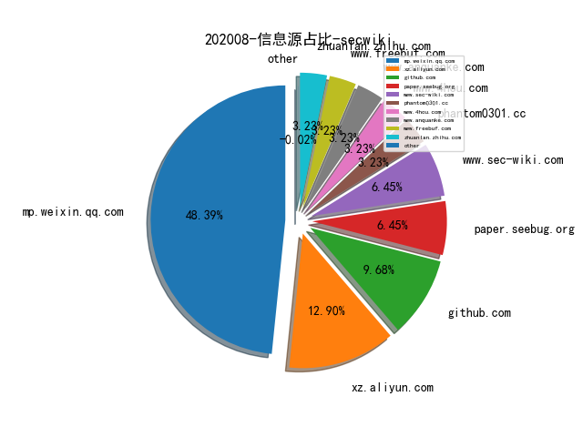
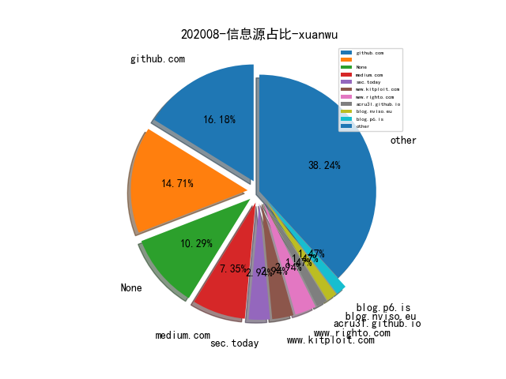
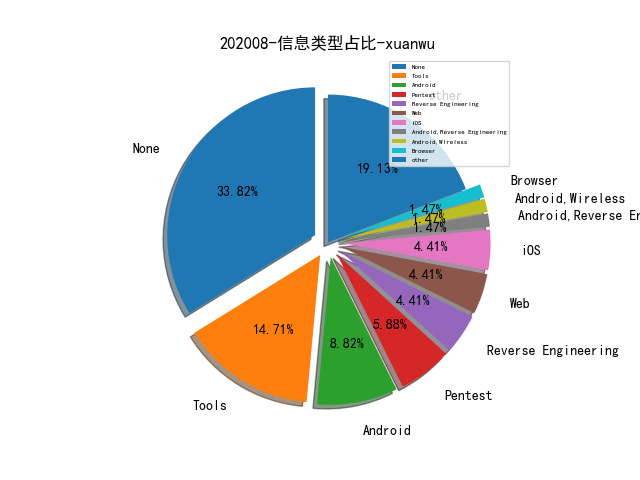
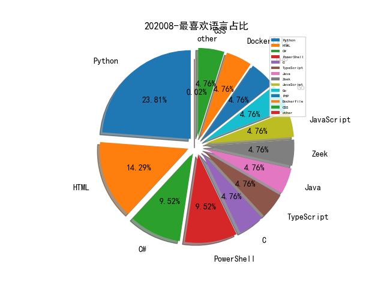

# [数据--所有](README_20.md)
# [数据--年度](README_2020.md)
# 202008 信息源与信息类型占比

# 微信公众号 推荐
| nickname_english | weixin_no | title | url| 
| --- | --- | --- | ---| 
| ChaMd5安全团队 | chamd5sec | NETGEAR httpd缓冲区溢出漏洞分析 | https://mp.weixin.qq.com/s/bDCOmABucnhPfquvEmH0hA | 3| 
| 安全学术圈 | secquan | RAID 2020 论文录用列表 | https://mp.weixin.qq.com/s/WoDK9X3bg_WNy12EC_Hz7g | 1| 
| 宽字节安全 | gh_2de2b9f7d076 | Shiro回显利用工具（更新为burp插件 | https://mp.weixin.qq.com/s/LSmO0R-9D2Tj-zRxDu7wWw | 1| 
| 雷神众测 | thorsrc | 近源渗透测试之Keylogger实战 | https://mp.weixin.qq.com/s/ra_N5dkhZOcHmdHuzl-oQw | 1| 

# 组织github账号 推荐
| github_id | title | url | org_url | org_profile | org_geo | org_repositories | org_people | org_projects | repo_lang | repo_star | repo_forks| 
| --- | --- | --- | --- | --- | --- | --- | --- | --- | --- | --- | ---| 

# 私人github账号 推荐
| github_id | title | url | p_url | p_profile | p_loc | p_company | p_repositories | p_projects | p_stars | p_followers | p_following | repo_lang | repo_star | repo_forks | 
| --- | --- | --- | --- | --- | --- | --- | --- | --- | --- | --- | --- | --- | --- | ---| 
| mitre-attack | 关于辅助实现自动化ATT＆CK归纳的python脚本 | https://github.com/mitre-attack/attack-scripts/tree/master/layers | None | None | None | None | 0 | 0 | 0 | 0 | 0 | TypeScript,Zeek,Python,JavaScript,HTML,PowerShell | 0 | 0 | 1| 
| napocahv | Napoca - Bitdefender 开源的 Hypervisor，提供多个安全相关的功能 | https://github.com/napocahv/napoca | None | None | None | None | 0 | 0 | 0 | 0 | 0 | C | 87 | 22 | 1| 

# medium_xuanwu 推荐
| title | url| 
| --- | ---| 

# medium_secwiki 推荐
| title | url| 
| --- | ---| 

# zhihu_xuanwu 推荐
| title | url| 
| --- | ---| 

# zhihu_secwiki 推荐
| title | url| 
| --- | ---| 

# xz_xuanwu 推荐
| title | url| 
| --- | ---| 

# xz_secwiki 推荐
| title | url| 
| --- | ---| 
| Android渗透测试HTTPS证书校验绕过 | https://xz.aliyun.com/t/8047| 

# 日更新程序
`python update_daily.py`