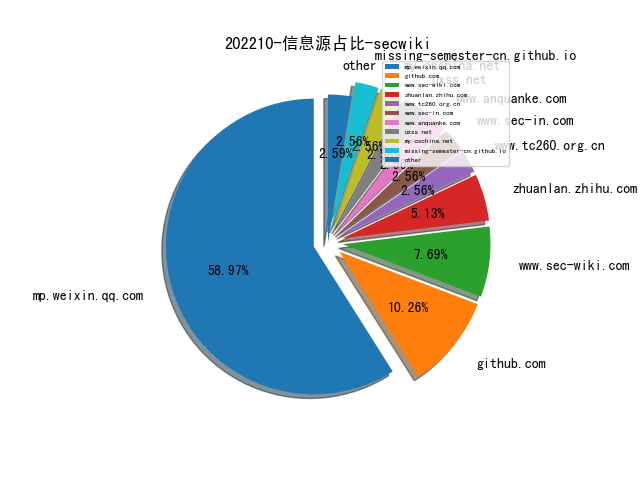
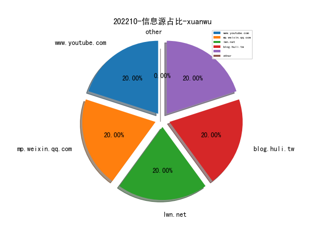
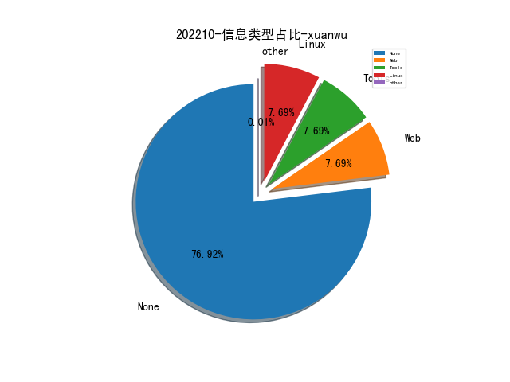
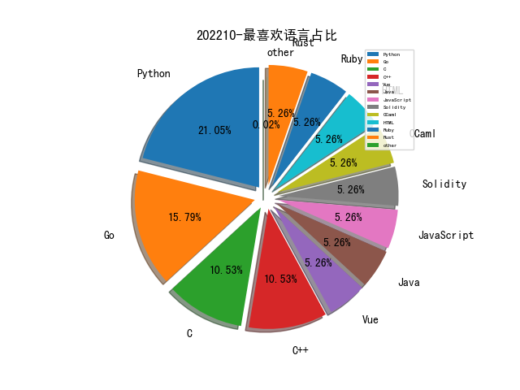

# [数据--所有](README_20.md)
# [数据--年度](README_2022.md)
# 202210 信息源与信息类型占比

# 微信公众号 推荐
| nickname_english | weixin_no | title | url| 
| --- | --- | --- | ---| 
| 赛博回忆录 | cybermemory | 最新CS RCE曲折的复现路 | https://mp.weixin.qq.com/s?__biz=MzIxNDAyNjQwNg==&mid=2456098978&idx=1&sn=d511d5a674d84eeaf262c8e389ae0403&chksm=803c696bb74be07d8ef8e473b11ffe4dce57b58ccf82e8615ab15d9ba6bba9263360c01276a8 | 1| 
| 碳基体 | tanjiti_security | 那些年我研发的无用模块——攻击样本回放模块 | https://mp.weixin.qq.com/s/zNTAGbM_Tjv9dWcjlsWkqg | 1| 
| 安全学术圈 | secquan | DEAR：一种基于深度学习的程序自动修复方法 | https://mp.weixin.qq.com/s/glgVqNDDInTRO97xexLuCg | 1| 
| 华为安全 | HuaweiSecurity | 论道攻防第2期丨攻防演练态势及防守思路 | https://mp.weixin.qq.com/s/yOvmo7RBrpKHL_hetT8jKg | 1| 
| 阿里开发者 | ali_tech | 安全同学讲Maven重打包的故事 | https://mp.weixin.qq.com/s/xsJkB0onUkakrVH0wejcIg | 1| 
| 陌陌安全 | MomoSecurity | 如何绕过 JA3 指纹校验？ | https://mp.weixin.qq.com/s/og2IKo8lcydh8PROUPD7jQ | 1| 
| 网安国际 | inforsec | 【网络安全研究进展系列】Fuzzing的研究之旅 | https://mp.weixin.qq.com/s/NCMIpTuroYoglRMiw7z7_w | 1| 
| Th0r安全 | gh_3ad192d9c87f | 2020美亚杯个人赛复盘 | https://mp.weixin.qq.com/s/sA7FS9g0Uq5WcO-yuUxEWg | 1| 
| 桥的断想 | TasteMiss | 车联网安全基础知识之USB SPH2.0线束制作 | https://mp.weixin.qq.com/s/01tV6GfK8L4hNEyn0suwdw | 1| 
| SecUN安全村 | sec-un | 企业安全建设的起步｜科技创新型企业专刊·安全村 | https://mp.weixin.qq.com/s/cqEMl0Jchu40c7Itxc0qww | 1| 
| 看雪学苑 | ikanxue | 动静态结合分析非标准MD5算法及还原 | https://mp.weixin.qq.com/s/5ZbBEIh-JsyoscIWCqYJyw | 1| 
| 一个人的安全笔记 | xjiek2015 | [HTB] Nunchucks Writeup | https://mp.weixin.qq.com/s/HPVEB8408-7NhuGzf9DGCg | 1| 
| Beacon Tower Lab | WebRAY_BTL | 最新CS RCE（CVE-2022-39197）复现心得分享 | https://mp.weixin.qq.com/s/89wXyPaSn3TYn4pmVdr-Mw | 1| 
| 顺丰安全应急响应中心 | SFSRC- | 干货 , IM钓鱼防不胜防？秘籍来了！ | https://mp.weixin.qq.com/s/0Gs_7Ut4zGGUWQwQAy90jQ | 1| 
| 虎符智库 | TT_Thinktank | 威胁情报：重要的与不重要的 | https://mp.weixin.qq.com/s/CSxUkgBb_8Did6bEpzBiaQ | 1| 
| 跳跳糖社区 | tttangsec | 域内用户Hash获取方式总结 | https://mp.weixin.qq.com/s/k-VUKcivMw3bncK5RW2Mvg | 2| 
| RainSec | RainSec111 | 对5.6w条xray结果的简单分析 | https://mp.weixin.qq.com/s/vhNGTBq8owncjlWyPJ0XGA | 1| 
| M01N Team | m01nteam | AWS S3 Bucket子域接管实现可信钓鱼服务攻击 | https://mp.weixin.qq.com/s/9BeHub6YCp0oM8jHrK6_dg | 1| 
| 零部安全 | sec-services | 漏洞管理过程中的定量计算方法 | https://mp.weixin.qq.com/s/5C6NeiNb6pifrZZh1vR_cg | 1| 
| 电网智囊团 | gridthink | 一文搞懂电力系统调度数据网4+1+1区 | https://mp.weixin.qq.com/s/wcs0mWzBXh96Ds-qJ9H6xQ | 1| 
| 军机故阁 | gh_e57baf46bdf5 | 使用 JARM 轻松识别 Internet 上的恶意服务器 | https://mp.weixin.qq.com/s/phtGCVnaiff-vKgJVTR0PQ | 1| 
| 落水轩 | gh_c10ee4802699 | 美国司法部网络安全述职报告 | https://mp.weixin.qq.com/s/nIbSV4dGpVtp98beqeL2Hg | 1| 
| 威胁棱镜 | THREAT_PRISM | 恶意 Tor 浏览器安装程序正通过 YouTube 进行分发 | https://mp.weixin.qq.com/s/c3jixzRxo0eg2IrA9xcJtw | 1| 
| XG小刚 | XG_WEB | 阿某云-WAF挑战赛wp | https://mp.weixin.qq.com/s/H1kslnpYbAmUOs7g0SpFWQ | 1| 
| 湛卢工作室 | xuehao_studio | 云原生安全系列（一） , Kubernetes云原生靶场搭建 | https://mp.weixin.qq.com/s/XmEhvrzwmcjW9lBIZMl2ag | 1| 
| 关键信息基础设施安全保护联盟筹 | gh_1c74abeb39a6 | 专家观点, 网络空间战略预警体系的建设思考 | https://mp.weixin.qq.com/s/2z9ze6N4p2R_Tokbk0g-vA | 1| 
| 迪哥讲事 | growing0101 | idor相关研究 | https://mp.weixin.qq.com/s/C6NuprrVSAx2Nh0fPXidwA | 7| 
| 拨开云雾 | Under_Sakura | 代码检索和摘要中的自监督对比学习 | https://mp.weixin.qq.com/s/pTNNIeico9mcDqvcXos3cA | 1| 
| leveryd | gh_8d7f6ed4daff | 浅析洞态iast产品 | https://mp.weixin.qq.com/s/fq2m59L_2Piqyeufl6eZFQ | 1| 

# 组织github账号 推荐
| github_id | title | url | org_url | org_profile | org_geo | org_repositories | org_people | org_projects | repo_lang | repo_star | repo_forks| 
| --- | --- | --- | --- | --- | --- | --- | --- | --- | --- | --- | ---| 

# 私人github账号 推荐
| github_id | title | url | p_url | p_profile | p_loc | p_company | p_repositories | p_projects | p_stars | p_followers | p_following | repo_lang | repo_star | repo_forks | 
| --- | --- | --- | --- | --- | --- | --- | --- | --- | --- | --- | --- | --- | --- | ---| 
| woodpecker-framework | woodpecker-framwork-release: 高危漏洞精准检测与深度利用框... | https://github.com/woodpecker-framework/woodpecker-framwork-release | None | None | None | None | 0 | 0 | 0 | 0 | 0 | HTML,Java | 0 | 0 | 1| 
| google | FFmpeg 被发现一个堆越界写漏洞，可以通过构造的 mp4 文件实现 RCE | https://github.com/google/security-research/security/advisories/GHSA-vhxg-9wfx-7fcj | None | None | None | None | 0 | 0 | 0 | 0 | 0 | Vue,Java,Python,JavaScript,C++,HTML,Go,Rust | 0 | 0 | 1| 
| bw3ll | SHAREM - Windows Shellcode 辅助分析和构造的工具 | https://github.com/bw3ll/sharem | https://github.com/Bw3ll?tab=followers |  | None | None | 3 | 0 | 0 | 0 | 0 | Python | 0 | 0 | 1| 
| airbus-seclab | AutoResolv - 用于解析导入函数详细信息的 IDA Pro 插件 | https://github.com/airbus-seclab/AutoResolv | None | None | None | None | 0 | 0 | 0 | 0 | 0 | Python,C,Ruby,OCaml,C++ | 0 | 0 | 1| 
| SunWeb3Sec | DeFiHackLabs: Reproduce DeFi hack incidents using Foundry | https://github.com/SunWeb3Sec/DeFiHackLabs | https://github.com/SunWeb3Sec?tab=followers | Lets make Web3 more secure! | None | None | 6 | 0 | 5 | 0 | 0 | Solidity | 0 | 0 | 1| 
| Ptkatz | OrcaC2: 一款基于Websocket加密通信的多功能C&C框架 | https://github.com/Ptkatz/OrcaC2 | https://github.com/Ptkatz?tab=followers | ☔️ | None | None | 2 | 0 | 55 | 0 | 0 | Go | 0 | 0 | 1| 
| PowerLZY | Bold-Falcon: 开源的自动化恶意软件分析系统 | https://github.com/PowerLZY/Bold-Falcon | https://github.com/PowerLZY?tab=followers |  | None | None | 32 | 0 | 138 | 0 | 0 | Python | 0 | 0 | 1| 
| HavocFramework | Havoc: 可延展的后渗透远控框架 | https://github.com/HavocFramework/Havoc | None | None | None | None | 0 | 0 | 0 | 0 | 0 | Go,Python,C | 0 | 0 | 1| 
| Anugrahsr | Awesome-web3-Security: A curated list of web3Security mate... | https://github.com/Anugrahsr/Awesome-web3-Security | https://github.com/Anugrahsr?tab=followers | Hey! i am Anugrah SR A Biologist moving to the field of cybersecurity. #Biology #Bioinformatics #ML #hacking #bash #python | Kerala | None | 64 | 0 | 105 | 0 | 0 |  | 0 | 0 | 1| 

# medium_xuanwu 推荐
| title | url| 
| --- | ---| 

# medium_secwiki 推荐
| title | url| 
| --- | ---| 

# zhihu_xuanwu 推荐
| title | url| 
| --- | ---| 

# zhihu_secwiki 推荐
| title | url| 
| --- | ---| 
| 推荐系统排序环节的特征Embedding建模 | https://zhuanlan.zhihu.com/p/573576653| 
| 基于语音数据的实体和关系抽取 | https://zhuanlan.zhihu.com/p/573667782| 

# xz_xuanwu 推荐
| title | url| 
| --- | ---| 

# xz_secwiki 推荐
| title | url| 
| --- | ---| 

# 日更新程序
`python update_daily.py`