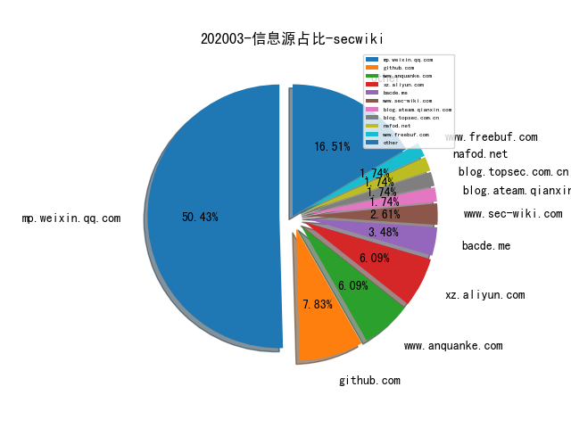
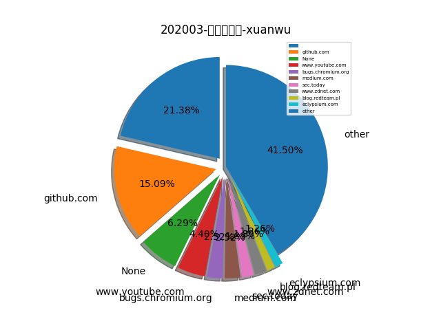
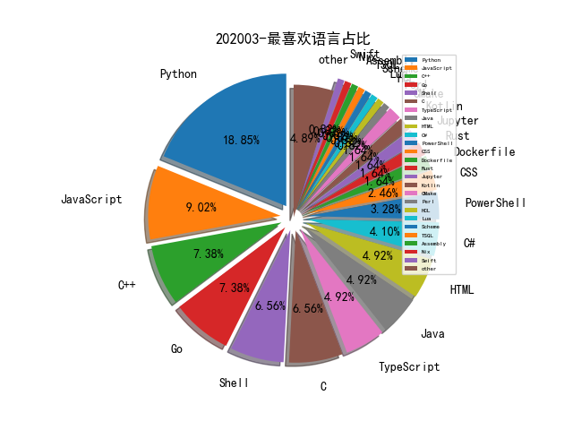

# [数据--所有](README_20.md)
# [数据--年度](README_2020.md)
# 202003 信息源与信息类型占比

# 微信公众号 推荐
| nickname_english | weixin_no | title | url| 
| --- | --- | --- | ---| 
| 安全学术圈 | secquan | 对CVE中的无效漏洞报告进行分类和预测 | https://mp.weixin.qq.com/s/laYXRDTtAn9kBqV1G99gog | 2| 
| 绿盟科技研究通讯 | nsfocus_research | 恶意软件命名与描述规范研究 | https://mp.weixin.qq.com/s/KGfsmEUu_fMH9Vj3TleMMQ | 1| 
| 落水轩 |  | 基于开源情报解密美国雷神山火神山 | https://mp.weixin.qq.com/s/OCAK5byqIvXttqxxSQmDkQ | 1| 
| 黑金笔谈 | heijinbitan | 网络威胁检测技术NTA | https://mp.weixin.qq.com/s/DYqFKBIj1BKwDzTpnO_tHg | 1| 
| 腾讯安全应急响应中心 | tsrc_team | WAF建设运营及AI应用实践 | https://mp.weixin.qq.com/s/fTm1hUfRmm6ujmjvSHRLUA | 2| 
| GoCN | golangchina | 「开源发布」 滴滴内部监控系统 Nightingale 开源啦 | https://mp.weixin.qq.com/s/Wo_em4yB5dRPvFecma4bkw | 1| 
| Ms08067安全实验室 | Ms08067_com | 提权之DLL注入 | https://mp.weixin.qq.com/s/T3C44Jc2vsTcisS7pWHnZA | 10| 
| 君哥的体历 | jungedetili | 张欧：数字银行可信网络实践 | https://mp.weixin.qq.com/s/VRG9LEbGTxhpMmCUTUSA8w | 2| 
| 白帽子的成长之路 | whitehat_day | 2020年开源情报（OSINT）TOP20 工具 | https://mp.weixin.qq.com/s?__biz=MzI2NDY1NDg0OA==&mid=2247484049&idx=1&sn=e6e716cfcfef01956c1acc7d684d44d1 | 1| 
| 盘古实验室 | PanguLab | 微信远程攻击面简单的研究与分析 | https://mp.weixin.qq.com/s/yMQN3MciI-0f3mzz_saiwQ | 1| 
| PolarisLab | PolarisLab | 追踪与新冠状病毒相关的安卓恶意软件 | https://mp.weixin.qq.com/s/fLDNLJIWwvrUUwt6Pi6T4A | 2| 
| 山丘安全攻防实验室 | hillsec | 一篇文章带你从XSS入门到进阶(附Fuzzing+BypassWAF+Payloads) | https://mp.weixin.qq.com/s/EOPCstDYmFVtaLYNcUQLzA | 2| 
| 零队 |  | 加载远程XSL文件的宏免杀方法 | https://mp.weixin.qq.com/s?__biz=MzU2NTc2MjAyNg==&mid=2247483758&idx=1&sn=1bd0006d16747389046058ea34c3b7b7&chksm=fcb783ebcbc00afd694b7a2ee10ad32aff0a534963878541ee17974ffee29c63342f4e617661&token=1823181969&lang=zh_CN#rd | 1| 
| AI科技评论 | aitechtalk | 如何以初学者角度写好一篇国际学术论文？ | https://mp.weixin.qq.com/s/zwTlXBrZiC88y9F5DDU0_g | 1| 
| Tide安全团队 | TideSec | 【红蓝对抗】windows hash 抓取总结 | https://mp.weixin.qq.com/s/jaJi2hXoKKrDbEm1kcY16g | 17| 
| heysec | bloodzer007 | 日志分析系列(三):分析实战篇 | https://mp.weixin.qq.com/s/h2pHi3PVn_92aEIOvB1Yjg | 2| 
| 安全乐观主义 |  | SDL已死，应用安全路在何方？ | https://mp.weixin.qq.com/s/tYRiKiI7bjgyzQguMA1mrw | 1| 
| 安全喷子 |  | 威胁狩猎101文档 | https://mp.weixin.qq.com/s/0hOtnTz9QrKlLivAobjU7Q | 1| 
| 安恒信息安全研究院 |  | 蓝牙安全之Class of device | https://mp.weixin.qq.com/s/TIYvcThrfOC40rqcy-VGCg | 1| 
| 腾讯御见威胁情报中心 |  | 腾讯安全威胁情报中心“明炉亮灶”工程：​自动化恶意域名检测揭秘 | https://mp.weixin.qq.com/s/QV8ErKHow3b-AMp6HMzKQg | 1| 
| 赵武的自留地 |  | 写在Goby新版发布前，讨论网络安全测试工具的发展 | https://mp.weixin.qq.com/s/hW0A1jwq-pm4M-4LGUZIrA | 1| 
| PeckShield | PeckShield | 硬核：解密美国司法部起诉中国OTC承兑商洗钱案件 | https://mp.weixin.qq.com/s/wWrm3gwT72Pc8Nxw-1OiSw | 1| 
| 七夜安全博客 | qiye_safe | 无文件执行：一切皆是shellcode (上) | https://mp.weixin.qq.com/s/Bv0xebGKaJ2GGwntKGq2NQ | 1| 
| 星阑科技 | StarCrossCN | PHP 开源白盒审计工具初探（下） | https://mp.weixin.qq.com/s/6Y7anVvO9C5_nqdJihuFMw | 2| 
| 水滴安全实验室 | EversecLab | 物联网漏洞挖掘及利用实践：mips栈溢出 | https://mp.weixin.qq.com/s/psVle6RAcTqX8VY_d4ouKg | 1| 
| 爱奇艺技术产品团队 | iQIYI-TP | 开源 | 爱奇艺网络流量分析引擎QNSM及其应用 | https://mp.weixin.qq.com/s/flQdwQn9A1vxNs-iHQBHWA | 2| 
| 道法术 |  | 2020 IoT Threat Report (简单解读版) | https://mp.weixin.qq.com/s/AqUyHGLzlmrBSKfk-IxW6g | 1| 
| PaperWeekly | paperweekly | 文本分类和序列标注“深度”实践 | https://mp.weixin.qq.com/s/afO58DDDZGb5w_EEG8oW6Q | 1| 
| 奇安信威胁情报中心 |  | 网空威胁情报（CTI）日益成熟：2020年SANSCTI调查结果解读 | https://mp.weixin.qq.com/s/ERakfCjEjW_UfViz9KoxFQ | 1| 
| 哈工大SCIR | HIT_SCIR | 赛尔笔记 | 机器阅读理解简述 | https://mp.weixin.qq.com/s/Rm1uFunX9IRQaL_rUAZxfQ | 1| 
| 工业菜园 | gycy-2019 | 菜农观点 | 陆宝华：关于智慧城市安全的讨论 | https://mp.weixin.qq.com/s/1-xpgttndYIXGkyspTIp1w | 1| 
| 湛卢工作室 | xuehao_studio | DIY | 树莓派搭载kali Linux | https://mp.weixin.qq.com/s/aOWEheNMxIYTBalDErSuMQ | 1| 
| 云众可信 | yunzhongkexin | 原创干货 | Java代码审计之跨站脚本攻击 | https://mp.weixin.qq.com/s/lQNixguOJahjM-AXvPoHqQ | 1| 
| 银河安全实验室 | Galaxy-Lab | 尝试利用Cython将Python项目转化为单个.so | https://mp.weixin.qq.com/s/YRKY7FgLFw-w4QIlrNd-FA | 1| 
| 安天 | Antiylab | 安天对“超高能力网空威胁行为体”系列分析回顾 | https://mp.weixin.qq.com/s/N0LxStDpc6GyzpyszYnguQ | 1| 
| 小议安全 | xiaoyianquan | 零信任架构远程办公实战 | https://mp.weixin.qq.com/s/Kgm0wuPeQHX7fJoUondz4Q | 1| 
| 永安在线反欺诈 | YongAnOnline | 业务安全蓝军测评标准白皮书 | https://mp.weixin.qq.com/s/23fcilR_XhrGLWSaKv21zA | 1| 
| 青衣十三楼飞花堂 |  | burp pro 2020.2 | https://mp.weixin.qq.com/s/WXdEvc0p04KjyOlmb4qtRg | 1| 
| SecWiki | SecWiki | 2020 Google夏日编程之安全项目列表 | https://mp.weixin.qq.com/s/Gf937RjTpA0QsT2DJFQRqQ | 1| 
| 大潘点点 | dapandiandian | 网安产业结构和动力分析——从合规型向能力型 | https://mp.weixin.qq.com/s/V6P-6X_fnw_kvHWMxtqwLg | 1| 
| 物联网IOT安全 | IOTsafety | Cobalt Strike｜从入门到入狱 | https://mp.weixin.qq.com/s/WAqgHn0DrXerEeow131w4Q | 1| 

# 组织github账号 推荐
| github_id | title | url | org_url | org_profile | org_geo | org_repositories | org_people | org_projects | repo_lang | repo_star | repo_forks| 
| --- | --- | --- | --- | --- | --- | --- | --- | --- | --- | --- | ---| 

# 私人github账号 推荐
| github_id | title | url | p_url | p_profile | p_loc | p_company | p_repositories | p_projects | p_stars | p_followers | p_following | repo_lang | repo_star | repo_forks | 
| --- | --- | --- | --- | --- | --- | --- | --- | --- | --- | --- | --- | --- | --- | ---| 
| lirantal | Awesome Node.js Security resources | https://github.com/lirantal/awesome-nodejs-security#static-code-analysis | https://github.com/snyksec | 🥑 Developer Advocate @snyksec | @nodejs Security WG | @jsheroes ambassador | Author of Essential Node.js Security | #opensource #web ❤ | Tel Aviv, Israel | @snyk | 240 | 0 | 695 | 621 | 271 | JavaScript | 2600 | 108 | 1| 
| unamer | 之前被用于 WizardOpium APT 攻击行动的 CVE-2019-1458 Windows LPE 漏洞的 Exploit | https://github.com/unamer/CVE-2019-1458 | http://127.0.0.1/phpMyAdmin |  | C:\Windows\ | None | 39 | 0 | 35 | 499 | 4 | Python,C,C++ | 748 | 359 | 1| 
| moonbingbing | OpenResty 最佳实践 | https://github.com/moonbingbing/openresty-best-practices | None |  | None | 360 | 30 | 0 | 49 | 465 | 5 | Python,Lua,C,Perl | 2900 | 726 | 1| 
| alphaSeclab | Android 安全方向的资料整理 | https://github.com/alphaSeclab/android-security// | None |  | None | None | 19 | 0 | 40 | 307 | 0 |  | 1600 | 274 | 2| 
| woj-ciech | LeakLooker X - 数据库/源码泄漏监控工具 | https://github.com/woj-ciech/LeakLooker-X | None |  | None | None | 15 | 0 | 0 | 306 | 0 | Python,Go,JavaScript,CSS | 1100 | 227 | 1| 
| Leezj9671 | 渗透测试和安全面试的经验之谈 | https://github.com/Leezj9671/Pentest_Interview | http://neversec.top | 2018 newly graduated student. Web pentester/Python coder. 公众号: NeverSec | Shenzhen,CN | None | 45 | 0 | 95 | 178 | 0 | Python,JavaScript,Dockerfile | 891 | 207 | 1| 
| dayt0n | 64-bit iOS boot image patcher written in C | https://github.com/dayt0n/kairos | http://dayt0n.com | 19. iOS and OS X tinkerer. Computer Science at UAH. | United States | None | 37 | 0 | 43 | 132 | 47 | Python,C,Shell,C++ | 23 | 7 | 1| 
| ChanChiChoi | 人脸识别相关的 Papers 收集 - Awesome Face Recognition | https://github.com/ChanChiChoi/awesome-Face_Recognition | http://www.cnblogs.com/shouhuxianjian/ |  | China | None | 21 | 0 | 184 | 110 | 51 | Python,Jupyter | 1800 | 495 | 1| 
| zsdlove | Hades - 静态代码脆弱性检测系统 | https://github.com/zsdlove/Hades | None |  | None | None | 126 | 0 | 193 | 62 | 16 | Python,Java,Smali | 163 | 41 | 1| 
| mike-goodwin | owasp-threat-dragon-desktop: 威胁建模工具 | https://github.com/mike-goodwin/owasp-threat-dragon-desktop | https://github.com/OWASP |  | UK | @OWASP | 24 | 0 | 1 | 54 | 1 | Shell,JavaScript,HTML,CSS | 398 | 88 | 1| 
| EddieIvan01 | iox: 端口转发 & 内网代理工具 | https://github.com/EddieIvan01/iox/blob/master/docs/README_CN.md | http://iv4n.cc/ |  | 127.0.0.1 | None | 36 | 0 | 55 | 51 | 16 | Go,Python,Scheme | 115 | 23 | 1| 
| CTF-MissFeng | bayonet: SRC资产管理系统 | https://github.com/CTF-MissFeng/bayonet | None |  | None | None | 3 | 0 | 57 | 46 | 0 | Python | 443 | 87 | 1| 
| ATpiu | asset-scan: 甲方企业的外网资产周期性扫描监控系统 | https://github.com/ATpiu/asset-scan | None | Penetration Test/Gopher/App Sec/ICS Sec | None | None | 100 | 0 | 292 | 28 | 119 | Go,Python | 40 | 6 | 1| 
| ody5sey | Voyager: 安全工具集合平台 | https://github.com/ody5sey/Voyager | None |  | None | None | 3 | 0 | 1 | 21 | 0 | Python,HTML | 147 | 61 | 1| 
| GuoKerS | 基于协程的CVE-2020-0796快速检测脚本 | https://github.com/GuoKerS/aioScan_CVE-2020-0796 | https://o0o0.club | 好好学习，天天向上。 | Guang Xi | None | 43 | 0 | 281 | 15 | 41 | Python,C#,HTML,PowerShell | 10 | 5 | 1| 
| open-source-rs | The-Cyber-Intelligence-Analyst-Cookbook | https://github.com/open-source-rs/The-Cyber-Intelligence-Analyst-Cookbook | None |  | None | None | 8 | 0 | 0 | 13 | 2 | Python,PHP | 34 | 7 | 1| 
| onSec-fr | 基于 HTTP 协议的异步反弹 Shell | https://github.com/onSec-fr/Http-Asynchronous-Reverse-Shell | None | Cybersecurity Enthusiast. | None | None | 4 | 0 | 7 | 12 | 1 | C#,Shell,PowerShell | 78 | 20 | 1| 
| renzu0 | nw-tips: Win内网_域控安全 | https://github.com/renzu0/nw-tips | None |  | None | None | 31 | 0 | 2 | 12 | 2 | Python,TypeScript | 3 | 2 | 1| 
| threat-hunting | Awesome Threat Detection and Hunting library | https://github.com/threat-hunting/awesome_Threat-Hunting | None |  | Sweden | None | 42 | 0 | 5 | 11 | 16 | JavaScript,Java | 96 | 20 | 1| 
| aforensics | HiddenVM — Use any desktop OS without leaving a trace. | https://github.com/aforensics/HiddenVM | None |  | None | None | 1 | 0 | 0 | 9 | 0 | Shell | 836 | 31 | 1| 
| karkason | PyWinSandbox - Python 实现的将进程放到 Sandbox 环境运行的工具 | https://github.com/karkason/pywinsandbox | None |  | None | None | 3 | 0 | 19 | 6 | 7 | Python,C++ | 61 | 3 | 1| 
| Equationliu | ImageNet 图像分类对抗攻击 No.3 solution | https://github.com/Equationliu/Attack-ImageNet | None |  | None | None | 9 | 0 | 19 | 4 | 1 | Python | 2 | 1 | 1| 
| LennyLeng | SOC_Sankey_Generator: 从SOC日志中进行数据ETL与数据可视化的工具 | https://github.com/LennyLeng/SOC_Sankey_Generator | None | None | None | None | 0 | 0 | 0 | 0 | 0 | None | 0 | 0 | 1| 
| google | Google 开发的对抗 USB Keystroke 攻击的工具的源码 | https://github.com/google/ukip | None | None | None | None | 0 | 0 | 0 | 0 | 0 | C,Shell,Java,Python,Kotlin,JavaScript,C++,TypeScript,Go,Rust | 0 | 0 | 2| 
| hardenedlinux | srcinv: source code audit tool 代码审计工具 | https://github.com/hardenedlinux/srcinv | None | None | None | None | 0 | 0 | 0 | 0 | 0 | HTML,C,Shell,Assembly,Roff,C++,Nix,Zeek,Go | 243 | 56 | 1| 
| microsoft | 微软开源的支持 Checked C 版本的 clang 编译器 | https://github.com/microsoft/checkedc-clang | None | None | None | None | 0 | 0 | 0 | 0 | 0 | TypeScript,Java,C#,JavaScript,C++,Python,Go,CMake,TSQL,PowerShell,HCL | 0 | 0 | 2| 
| nowsecure | NowSecure 开源的基于 Frida 的 API Trace 工具 | https://github.com/nowsecure/frida-trace | None | None | None | None | 0 | 0 | 0 | 0 | 0 | C,TypeScript,Java,Python,JavaScript,Smarty,Dockerfile,CSS | 541 | 112 | 1| 
| pyppeteer | pyppeteer2 - 用于控制 Headless Chrome 的 puppeteer 的 Python 移植版 | https://github.com/pyppeteer/pyppeteer2 | None | None | None | None | 0 | 0 | 0 | 0 | 0 | Python | 0 | 0 | 1| 

# medium_xuanwu 推荐
| title | url| 
| --- | ---| 
| Remote Image Upload Leads to RCE (Inject Malicious Code to PHP-GD Image) | http://medium.com/@asdqwedev/remote-image-upload-leads-to-rce-inject-malicious-code-to-php-gd-image-90e1e8b2aada| 
| OWASP 中提到的最严重的 API 漏洞类型 - BOLA (Broken Object Level Authorization) 是怎么回事儿 | http://medium.com/@inonst/a-deep-dive-on-the-most-critical-api-vulnerability-bola-1342224ec3f2| 
| 滥用 hostPath 挂载逃逸 Kubernetes Namespace | http://medium.com/m/global-identity?redirectUrl=https%3A%2F%2Fblog.appsecco.com%2Fkubernetes-namespace-breakout-using-insecure-host-path-volume-part-1-b382f2a6e216| 
| Avast 安全浏览器可以被滥用 NTFS Hardlink 特性实现本地提权 | http://medium.com/m/global-identity?redirectUrl=https%3A%2F%2Fsidechannel.tempestsi.com%2Fvulnerability-in-avast-secure-browser-enables-escalation-of-privileges-on-windows-eb770d196c45%3F| 
| php博客平台Typecho代码执行漏洞详细分析 | http://medium.com/@knownsec404team/analysis-of-typecho-front-end-getshell-vulnerability-4c1ce43eaeaa| 

# medium_secwiki 推荐
| title | url| 
| --- | ---| 

# zhihu_xuanwu 推荐
| title | url| 
| --- | ---| 

# zhihu_secwiki 推荐
| title | url| 
| --- | ---| 
| 谈谈蜜罐（调研）与内网安全 | https://zhuanlan.zhihu.com/p/110886405| 

# 日更新程序
`python update_daily.py`