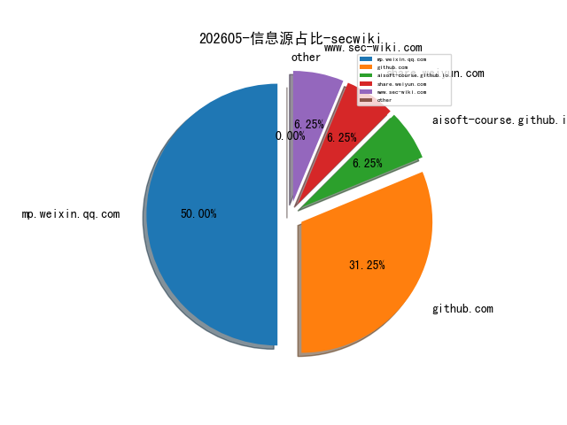
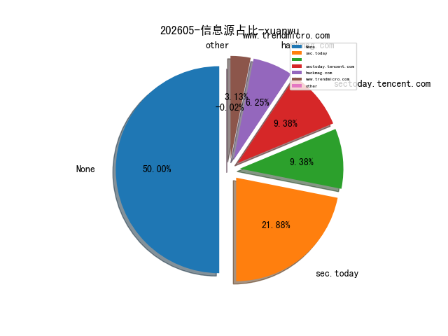
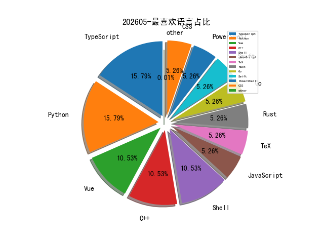

# [数据--所有](README_20.md)
# [数据--年度](README_2026.md)
# 202605 信息源与信息类型占比

# 网络安全书籍 推荐
| date_added | language | title | author | link | size| 
| --- | --- | --- | --- | --- | ---| 
| 2026-05-15 05:32:38 | English | Your New Colleague is a Copilot | unknown | https://www.wowebook.org/your-new-colleague-is-a-copilot/ | unknown| 
| 2026-05-14 18:44:23 | English | Build Python Web Apps with Streamlit | unknown | https://www.wowebook.org/build-python-web-apps-with-streamlit/ | unknown| 
| 2026-05-14 17:21:57 | English | Data Engineering with Generative and Agentic AI on AWS | unknown | https://www.wowebook.org/data-engineering-with-generative-and-agentic-ai-on-aws/ | unknown| 
| 2026-05-11 18:33:26 | English | Prompting Python for Full Stack Development | unknown | https://www.wowebook.org/prompting-python-for-full-stack-development/ | unknown| 
| 2026-05-11 13:22:16 | English | Real-Time Intelligence with Microsoft Fabric | unknown | https://www.wowebook.org/real-time-intelligence-with-microsoft-fabric/ | unknown| 
| 2026-05-10 10:35:57 | English | Analytics Optimization with Columnstore Indexes in Microsoft SQL Server, 2nd Edition | unknown | https://www.wowebook.org/analytics-optimization-with-columnstore-indexes-in-microsoft-sql-server-2nd-edition/ | unknown| 
| 2026-05-08 08:49:13 | English | Large Language Models: The Hard Parts | unknown | https://www.wowebook.org/large-language-models-the-hard-parts/ | unknown| 
| 2026-05-05 19:54:13 | English | Kubernetes for Absolute Beginners | unknown | https://www.wowebook.org/kubernetes-for-absolute-beginners/ | unknown| 
| 2026-05-04 20:30:14 | English | Pro API Security Testing in ASP.NET Core | unknown | https://www.wowebook.org/pro-api-security-testing-in-asp-net-core/ | unknown| 
| 2026-05-02 19:55:34 | English | Microsoft Defender for Endpoint in Depth, 2nd Edition | unknown | https://www.wowebook.org/microsoft-defender-for-endpoint-in-depth-2nd-edition/ | unknown| 
| 2026-05-02 13:58:11 | English | Advanced Cyber Threat Intelligence and Hunting | unknown | https://www.wowebook.org/advanced-cyber-threat-intelligence-and-hunting/ | unknown| 
| 2026-05-02 11:02:50 | English | Cybersecurity Architect’s Handbook, 2nd Edition | unknown | https://www.wowebook.org/cybersecurity-architects-handbook-2nd-edition/ | unknown| 
| 2026-05-01 19:30:00 | English | Agentic AI with Microsoft Foundry | unknown | https://www.wowebook.org/agentic-ai-with-microsoft-foundry/ | unknown| 

# 微信公众号 推荐
| nickname_english | weixin_no | title | url| 
| --- | --- | --- | ---| 
| AI员工上线 | None | 暴涨108%！2026最大科技IPO诞生，英伟达终于不是唯一选择了 | https://mp.weixin.qq.com/s/UFnKuXiLhNf3acI_V8k5yQ | 4| 
| CppGuide |  | 给大家演示一下AI远控训练营到底做什么产品 | https://mp.weixin.qq.com/s/Zd9O77C6sZBsDdNcyLTkIQ | 4| 
| Damian攻防实验室 | None | 内网渗透踩坑！图片上传失败？竟是小米路由防火墙搞鬼 | https://mp.weixin.qq.com/s/hkmgu_gZ3JKJIkV-guIc2w | 2| 
| Gh0xE9 | None | 如何让自己的博客爆闪别人 | https://mp.weixin.qq.com/s/CwLNyXWNTM1ccSq0QBURgg | 2| 
| IoT物联网技术 | None | 65元，打造私人 AI 助理！国产开源 PicoClaw 把 Claude/DeepSeek/豆包 塞进树莓派，管控 IoT 智能家居设备 | https://mp.weixin.qq.com/s/3JAVZDW_zXCO-tBs4l8B4Q | 9| 
| Nday Poc | None | 【2周年庆】致Nday Poc全体成员的一封信(第二天)抽奖规则变动 | https://mp.weixin.qq.com/s/W9P1dFmFXHc9B4xTC9cqpg | 5| 
| Rsec | Abhi Sharma Abhi Sharma | 0160.罚款 900 美元 IDOR：未经授权通过直接 API 访问表单附件 | https://mp.weixin.qq.com/s/AtqGYtDbbb4K0R-KpMuBuA | 1| 
| XiAnG学安全 |  | 电子取证平台又更新了：团队赛、海量赛题、知识库、训练分析一次说清 | https://mp.weixin.qq.com/s/TtSpsC5dB6_dRX1iz6ai-A | 2| 
| 乌雲安全 | None | 红队神器｜Vue 站点未授权漏洞一键挖掘 -v2.0 | https://mp.weixin.qq.com/s/8gGSgPpLkQ1xtlXvINSzDw | 4| 
| 升斗安全 | None | 原型链污染的赏金密码：从 fetch 到 defineProperty 的绕过艺术 | https://mp.weixin.qq.com/s/QyfvPvc2mxhUeuXyHVeZ7Q | 3| 
| 取证与溯源 |  | 电子取证平台又更新了：团队赛、海量赛题、知识库、训练分析一次说清 | https://mp.weixin.qq.com/s/bmPAJ3G2NYSpV8yQQK0F4Q | 2| 
| 大眼睛网络安全 | None | 暗网付费帖子解锁(第十六期) | https://mp.weixin.qq.com/s/eBUu07ofkIT7mQS5jEWE2A | 2| 
| 安全产品人的赛博空间 | None | 做了两个 Claude Code 插件，把一些重复劳动省了 | https://mp.weixin.qq.com/s/vm9Db6zpD6xhjTcfGxGoxQ | 1| 
| 安全牛科技 | 河南省工信安联盟 河南省工信安联盟 | 工业网络安全周报-2026年第16期 | https://mp.weixin.qq.com/s/l-eAj5ysi2qa4qi-l6crpw | 3| 
| 安帝Andisec | OT工控安全领导者 OT工控安全领导者 | 工业网络安全周报-2026年第19期 | https://mp.weixin.qq.com/s/4W3pO1IiAtMKGVDmFj2yqg | 2| 
| 安恒fan | 安恒fan 安恒fan | 19热爱·正当燃 , 我们的19周年庆，全是滚烫的美好篇章 | https://mp.weixin.qq.com/s/JPWf79wsGBVmt3zDQIASrw | 2| 
| 山水SRC | None | 并发举报竞争条件漏洞 | https://mp.weixin.qq.com/s/CHHYlBXin8QlXJ0rwN_vGQ | 2| 
| 快手安全应急响应中心 | 快手SRC 快手SRC | 2026白帽赏金挑战赛！快手SRC邀你来挖 | https://mp.weixin.qq.com/s/oEa4p9Xet__EsnQD6oVuYA | 1| 
| 数缘信安社区 | None | 【征文】“抗量子密码”专题征文通知 | https://mp.weixin.qq.com/s/9EkfScYSzYajON8jn39Rwg | 1| 
| 智探AI应用 | 点击关注→ 点击关注→ | 江苏省“AI＋”行动方案：推广模型驱动的金融智能体服务 | https://mp.weixin.qq.com/s/uGHEx1xhs3f8sUJoMvcpkQ | 32| 
| 毅心安全 | None | 分享两个应急响应中实用的进程任务管理器 | https://mp.weixin.qq.com/s/MP-GbaH9MCcsbG3Jt3uY9A | 2| 
| 河南等级保护测评 | None | 微软2026年5月份于周二补丁日针对78个漏洞发布安全补丁 | https://mp.weixin.qq.com/s/mxYkNueI3x4KtDdxPWhvZQ | 6| 
| 海哥网络安全 | 海哥网络安全 海哥网络安全 | 新手挖漏洞神器：50 个高危端口完整版清单 | https://mp.weixin.qq.com/s/WdL2QmyngffrLS_jfcZYnA | 4| 
| 爱坤sec | None | 天塌了，全球互联网基础设施，nginx爆RCE，利用方式竟如此简单 | https://mp.weixin.qq.com/s/Coxl5fLG-dGr9Qimlkc6MQ | 2| 
| 爱拍照的老李 | None | 俄黑客组织Turla 将 Kazuar 后门转变为模块化 P2P 木马网络以实现持久访问 | https://mp.weixin.qq.com/s/h671x3uIGVMoVIozCWrsoQ | 10| 
| 玄道夜谈 | None | 分享图片 | https://mp.weixin.qq.com/s/AVuF9PdIg_HAHla_o2p-hQ | 7| 
| 生有可恋 | None | linux 下获取文件绝对路径 | https://mp.weixin.qq.com/s/yuywjtjvSES1lxWnvyAmFw | 12| 
| 电子取证及可信应用协创中心 |  | DigiForensics 电子取证学习与训练平台正式开放！一站式解决你的所有学习痛点 | https://mp.weixin.qq.com/s/ygkynimmqnWLCngcbwXYBA | 1| 
| 白帽子 | None | Hermes的应用（七）：分析DirtyFrag(CVE-2026-43284)高危漏洞Poc | https://mp.weixin.qq.com/s/bdy4PrPmqG6DTBfPcaCUAw | 5| 
| 皇后红队 | None | 【内网渗透】rootkit后门Reptile2.0权限维持 | https://mp.weixin.qq.com/s/9LjTCP9K3Y802Xh7BmmNfw | 2| 
| 祺印说信安 | None | 美国贷款中心数据泄露事件影响12.3万人 | https://mp.weixin.qq.com/s/WAqok9_0muNe3K5eFOEr_w | 4| 
| 秦安战略 | None | 秦安：如何阻止暴力？特朗普一离开中国就威胁伊朗，中伊均发声 | https://mp.weixin.qq.com/s/M43Cq2gvVJpStMZR-o_JfA | 2| 
| 稻草人安全团队 | xiaoxxx xiaoxxx | 产业政策新词——\"模数共振\" | https://mp.weixin.qq.com/s/VQ_Rn8d9NUPMykezux3ygg | 3| 
| 网空闲话plus | None | Anthropic发布战略警报：2028年前中国AI或与美国形成“近前沿并驾齐驱” | https://mp.weixin.qq.com/s/VNVTZaSa9tlEZnkAdp2Sag | 25| 
| 网络与安全实验室 | None | 每周文章分享-259 | https://mp.weixin.qq.com/s/_DBxctxxsFhaLuziDLocHw | 1| 
| 网络侦查研究院 | None | 非法植入病毒，四人落网阻断诈骗黑手 | https://mp.weixin.qq.com/s/1PwNO3qRFZMInSjZNZpDng | 24| 
| 网络安全和信息化 |  | 造假摆拍！“盲人在盲道被电动车撞”等虚假视频被通报 | https://mp.weixin.qq.com/s/dwjjHn2P6Vgt3PNp_VYihw | 6| 
| 网络安全学习室 | 点击关注👉 点击关注👉 | SRC 每日漏洞复现学习系列（第 2 篇）垂直越权漏洞+漏洞报告模板 | https://mp.weixin.qq.com/s/qfELG3imPQpmkD8Cy6waMw | 6| 
| 网络安全实验室 | Flag Flag | 20000元/月，招网络安全工程师 | https://mp.weixin.qq.com/s/qWiJzgOSMtdAS6pGvItvDA | 7| 
| 网络安全直通车 | None | 人这一生，终究要学会与孤独相爱 | https://mp.weixin.qq.com/s/iNyvnfKNeAi6Aq7mFVLG5w | 11| 
| 赛欧思安全研究实验室 | SOC SOC | 赛欧思一周资讯分类汇总(2026-05-11 ~ 2026-05-16) | https://mp.weixin.qq.com/s/L-vJLaRnt53liEwRwiDAVQ | 5| 
| 运维星火燎原 | None | 从单机到微服务，互联网架构升级底层逻辑全看懂 | https://mp.weixin.qq.com/s/c6x3s0B6_h9NPaW5-6bnQw | 2| 
| 青衣十三楼飞花堂 | None | 在地下_马识途_摘录(9) | https://mp.weixin.qq.com/s/oKp2UdGR2k0taxd9RkBcpQ | 4| 
| 黑白之道 |  | AI 驱动的红队免杀知识库 , Webshell 免杀、WAF/RASP/EDR 绕过、流量伪装等实战Tips | https://mp.weixin.qq.com/s/40xun7CtUT31EISAr98TMw | 27| 
| 0x八月 | None | AI 驱动的渗透测试 CLI 工具 — 说人话，打漏洞 | https://mp.weixin.qq.com/s/M58-s1GDTAjSJT1cSI8jeg | 4| 
| 360漏洞研究院 | 360漏洞研究院 360漏洞研究院 | Chrome沙箱中也能利用，Windows 内核特权提升漏洞（CVE-2026-40369） | https://mp.weixin.qq.com/s/3nt_kHvQqHDO9E_2YKrgGg | 4| 
| AI+网络安全笔记 | Yang Yang | AI智能体权限管理：安全与效率的平衡之道 | https://mp.weixin.qq.com/s/xRPGxEvViUobQR-I98VJNw | 3| 
| AI赋能汽车 |  | 威尔森：2026年北京车展展后总结报告 | https://mp.weixin.qq.com/s/UPHEuOhGBHQ43jMDz7JcZg | 7| 
| C4安全 | 油漆工 油漆工 | dddd内部版本1.6更新，新增一些弱口令检测+一键对接收集域名 | https://mp.weixin.qq.com/s/BNbttbdzyWjKDILNXo5Crw | 2| 
| CVE-SEC | CVE-SEC CVE-SEC | UUID 即通行证：Gradient CI 未认证 Worker 注册与供应链投毒威胁 | https://mp.weixin.qq.com/s/R22cTUZwm0EZ8ZxJMrNRAQ | 9| 
| DFIR蘇小沐 |  | DigiForensics 电子取证学习与训练平台正式开放！一站式解决你的所有学习痛点 | https://mp.weixin.qq.com/s/Ef6nEDm-UHkEO32b83EHuQ | 1| 
| DigiForensics | DyNooob AND Jack DyNooob AND Jack | 感谢大家太热情啦!二群来啦 | https://mp.weixin.qq.com/s/QOvczcoU-ZOIFtdHi7tUdQ | 2| 
| Esn技术社区 | None | 红队攻击 Web3 AI 代理攻击途径的指南攻击 | https://mp.weixin.qq.com/s/_BDvYVudigZa_fTDThIYJA | 20| 
| FreeBuf |  | Windows DNS客户端漏洞可导致远程代码执行攻击 | https://mp.weixin.qq.com/s/XreczO_mTaQmUlrBUFr9vw | 19| 
| FreeBuf知识大陆APP | None | 直播预告：AI重塑白帽圈，暴富还是出局？ | https://mp.weixin.qq.com/s/2fD01ZvECoi8hBlj7TY3bA | 1| 
| Ghost Wolf Lab | None | 终端隐形链：OSC 8超链接注入攻击 | https://mp.weixin.qq.com/s/v3ES8XbXVu4GKjwKXBlHNA | 4| 
| Hacking黑白红 | None | 突发！富士康遭勒索攻击：1100万文件泄露 | https://mp.weixin.qq.com/s/KNZ4XFRW1doRrlK4pXfq6w | 28| 
| Khan安全团队 | 忍者 忍者 | 伪装成 Google Gemini CLI 的新型 Windows 恶意软件攻击活动分析 | https://mp.weixin.qq.com/s/ZruHEc_FUxwuKrPl-sb4aw | 24| 
| LTAC | liang liang | 免杀分析 , PowerShell命令执行、检测与绕过 | https://mp.weixin.qq.com/s/7Tto5H7OxmpTQGkyyVfOuQ | 2| 
| Quest安全团队 | L×K@y L×K@y | 实战逻辑漏洞（短信横向）利用 | https://mp.weixin.qq.com/s/jI4hCcuQWPqcm8IDslVQ0g | 2| 
| SPEEDCoding | 李北辰 李北辰 | 6. 二进制文件格式与解析 | https://mp.weixin.qq.com/s/XlwRxJlYP5kUnnmWSIxSBg | 6| 
| T00ls安全 | mstkey mstkey | 提权实录：通过命名管道劫持可写服务 | https://mp.weixin.qq.com/s/BWBnWC_fvISyebvj1YLrWQ | 1| 
| YY的黑板报 | adra1n adra1n | Markdown 是给作者爽的，HTML 是给读者爽的 | https://mp.weixin.qq.com/s/kZ-k2rv0Gw13pO83gRW6Cg | 4| 
| Yak Project | YAK YAK | Web Fuzzer 强化：AI自动修改数据包与智能测漏洞 | https://mp.weixin.qq.com/s/kqLGRhmQa8fs5HifQHqMsQ | 1| 
| huan666 | None | AI赋能安全测试-APK文件逆向分析(jadx-ai-mcp) | https://mp.weixin.qq.com/s/PJrpsQoDiKno2ytjSDuzkA | 1| 
| solar应急响应团队 | Moir、州弟 Moir、州弟 | 【深度解析】曾在海南度假 极度了解国内生态的The Gentlemen勒索组织内部数据全景剖析（一） | https://mp.weixin.qq.com/s/Htq3D6Gr2n-4Bb7emlYXgw | 3| 
| three安全之路 | lucy lucy | Trae 使用 Cline 插件配置 Claude/GPT/Gemini 大模型教程 | https://mp.weixin.qq.com/s/mDoxnDtlbFyTwF7wSXrxig | 3| 
| 一己之见安全团队 | 这小子嘴硬 这小子嘴硬 | 代码审计篇——文件操作 | https://mp.weixin.qq.com/s/6-vZTQjtGYZU5vXP8NV9BQ | 2| 
| 中国网络空间安全协会 |  | 第四期网络安全学院学生创新资助计划正式启动 | https://mp.weixin.qq.com/s/uIwDBGCErIkvDVV4d6ikZg | 3| 
| 中孚信息 |  | 中孚信息强势入围嘶吼2026网安图谱，全栈安全能力获行业权威认可 | https://mp.weixin.qq.com/s/U0ShEJooBqj8dg52dw-UEQ | 5| 
| 中睿天下 | None | 官宣 , 中睿天下入选CNCERT国家级应急支撑单位，网络安全监测领域再获权威认可 | https://mp.weixin.qq.com/s/pGOsTHWJSLdXePre3R0q0w | 1| 
| 云鼎实验室 | 腾讯云安全 腾讯云安全 | 【漏洞预警】Linux Kernel 越权任意文件读取漏洞，PoC 已公开 | https://mp.weixin.qq.com/s/mutmN1nje_x5bZAmQm8I9g | 1| 
| 亚信安全 | 你信任的 你信任的 | 2026年攻防演练即将开启：以攻击面管理为核心，构筑主动防御新防线 | https://mp.weixin.qq.com/s/zpw8YLQ1twXB-qaYzxt-Mg | 4| 
| 亿人安全 | None | 揭露偷资料的小偷学员 | https://mp.weixin.qq.com/s/vg0r8qE9zBV-4YPHWeohbQ | 1| 
| 代码卫士 | Lawrence Abrams Lawrence Abrams | 思科：注意已遭利用的满分 SD-WAN 新 0day | https://mp.weixin.qq.com/s/QtIoNRdUW6t4dQfpzr6OCA | 8| 
| 信安世纪 | 点击关注→ 点击关注→ | 配置秒级同步，业务全天候在线！APV重塑多活数据中心流量编排 | https://mp.weixin.qq.com/s/5-MPDsWT75hksYHlZ5E6BA | 1| 
| 信安在线资讯 |  | 中央网信办：平台发布短视频必选6类标签 | https://mp.weixin.qq.com/s/w_E8wm35yMrirfe8eGiZpQ | 8| 
| 信息安全研究 |  | 专家观点｜智能体出海的风险特征与规范应对 | https://mp.weixin.qq.com/s/lvHt6JVSCpAGQ40vcBSAVQ | 18| 
| 信息网络安全杂志 |  | 西南石油大学网络空间安全科技创新团队在CCF A类期刊IEEE TDSC发表最新前沿研究成果 | https://mp.weixin.qq.com/s/TX549Bhk_PcQL6cVp8xZVQ | 6| 
| 信通云服 |  | 【高危漏洞预警】Windows 存储空间控制器提权漏洞（CVE-2026-35415） | https://mp.weixin.qq.com/s/dxSq7GoaSDEWy5-6intj3Q | 4| 
| 像梦又似花 | CyberSecGuy CyberSecGuy | 意想不到:Bitlocker加密竟然可破解 | https://mp.weixin.qq.com/s/i3W5BZqdzX-YGnCiPfepIw | 2| 
| 全球技术地图 | 全球君 全球君 | 美国国家科学基金会启动“X-Labs”计划，拟十年投入15亿美元推动突破性科研 | https://mp.weixin.qq.com/s/oV30CSVwryYDJMErItD1Yg | 9| 
| 公安部网安局 |  | 网警提醒：拓宽风险防范领域 守牢线上线下平安 | https://mp.weixin.qq.com/s/rOMpW2N-4YsB7FBONKKvDQ | 25| 
| 内生安全联盟 | 数世咨询 数世咨询 | AI赋能安全：信心爆棚，落地极差 | https://mp.weixin.qq.com/s/sC68i4PFOnWPO0hyfYafng | 18| 
| 创信华通 |  | 创信资讯丨教育信息系统密评怎么做？创信华通这场培训会讲透了 | https://mp.weixin.qq.com/s/-fi9qE8EPRo3-2gzJuqoAw | 1| 
| 北京路劲科技有限公司 |  | 商用密码应用安全性评估实战-物理与环境安全层面测评全过程讲解 | https://mp.weixin.qq.com/s/kBMOsQfwanRIHLMGtrMdYA | 1| 
| 北信源 |  | 5·15  全国投资者保护宣传日 | https://mp.weixin.qq.com/s/ZgIh5yZlfTIj2T-hthsgFg | 1| 
| 南风漏洞复现文库 | None | 天锐绿盾审批系统findOnlineUserForPage.do接口存在信息泄露漏洞 附POC | https://mp.weixin.qq.com/s/PdUpr8J3aW_kqYsQmRqj_w | 2| 
| 取证额头 | None | 开源软件分享  给你的密码加道锁 | https://mp.weixin.qq.com/s/lgZtzutGBS8RSjwjqnpT9w | 2| 
| 古月安全 | 三呼呼 三呼呼 | deepseek V4 版本 竟然出现了思考BUG | https://mp.weixin.qq.com/s/ql7ZQ_4lsZD9WRBnnadOjw | 3| 
| 只会看监控的实习生 | 菜狗 菜狗 | 高价招募护网简历，学生社会都可以 | https://mp.weixin.qq.com/s/w0p5GtVWUi1LrNahwTltVA | 4| 
| 启明星辰安全简讯 |  | 【漏洞通告】NGINX ngx_http_rewrite_module堆缓冲区溢出漏洞(CVE-2026-42945) | https://mp.weixin.qq.com/s/xzwFu7Khfq50FxnKMXme5Q | 9| 
| 启明星辰集团 | None | 筑牢智能时代的数字长城：Token经济呼唤全域全栈安全防护体系 | https://mp.weixin.qq.com/s/-mCRYppiZyx_VsqJj5gdbQ | 3| 
| 哆啦安全 | 云天实验室 云天实验室 | 二进制逆向智能分析辅助工具V3.1 | https://mp.weixin.qq.com/s/1P_45UEI2kQRDoHBHmt1cQ | 2| 
| 嘉韦思 |  | AI攻击潮来袭，您的防线准备好了吗？ | https://mp.weixin.qq.com/s/vs_ycwstd25qCZ4J-Y9fmw | 1| 
| 嘶吼专业版 |  | CACTER反钓鱼演练系统升级上线｜只需四步，即开即用！ | https://mp.weixin.qq.com/s/46b00pG5I6qhJSnXo7mzGw | 2| 
| 国舜股份 |  | 实力蝉联｜国舜科技入选嘶吼2026网络安全产业图谱16项细分领域 | https://mp.weixin.qq.com/s/OOEICgAoub8wiPg0_OZNtQ | 2| 
| 夜幕讲安全 | None | 自学黑客技术顺序很重要别弄错了 | https://mp.weixin.qq.com/s/Alvuro_D4eQJjiwqn-8saQ | 5| 
| 天创培训 | 天创培训 天创培训 | 培训通知丨关于举办国家注册人工智能安全专家培训开班通知 | https://mp.weixin.qq.com/s/Xm192PMltU1JpPy7_Q_5MQ | 2| 
| 天唯信息安全 | 天唯科技 天唯科技 | 勒索月报,360攻克4月两大勒索威胁：Wmansvcs全系变种可解密，Sorry完整攻击链曝光 | https://mp.weixin.qq.com/s/IarFlCMPfM_Tgg2zFHSRzA | 4| 
| 奇安信 CERT |  | 【已复现】Linux Kernel ptrace 本地权限提升漏洞(QVD-2026-26977)安全风险通告 | https://mp.weixin.qq.com/s/SIs8VZVo_vnjeVuBB7NGsA | 12| 
| 奇安信威胁情报中心 | 威胁情报中心 威胁情报中心 | 每周高级威胁情报解读(2026.05.08~05.14) | https://mp.weixin.qq.com/s/Orp3GYn3lNQNWnYEFXFk9Q | 4| 
| 好靶场 |  | 机器学习--基础入门--03机器学习学习路线 | https://mp.weixin.qq.com/s/AbGxDQJBgNchQM8HKulLkA | 5| 
| 安全内参 |  | 生成式人工智能大规模个人信息泄露的协同治理路径 | https://mp.weixin.qq.com/s/gMLbU-BGv24_1xyYjwP62g | 6| 
| 安全喵喵站 | HKHACK HKHACK | 报名开放｜HKHACK 2026 正式启动，全球安全技术力量汇聚香港 | https://mp.weixin.qq.com/s/LFfME6hxmy0LG3nnAbTJIg | 2| 
| 安全圈的那点事儿 | 网络安全9527 网络安全9527 | 在 Pwn2Own Berlin 2026 大会上，Microsoft Edge、Windows 11 和 LiteLLM 遭到攻击 | https://mp.weixin.qq.com/s/XBz6ha4me9Q-jlo27Vl2Cg | 29| 
| 安全大脑 | 安全大脑 安全大脑 | 网络攻击模型之ATT&amp;CK模型 | https://mp.weixin.qq.com/s/b7XHL_coYncSE9tMFmyafw | 1| 
| 安全天书 | None | 【红队工具】SOAPy--SOCKS5代理与ADWS进攻性交互 | https://mp.weixin.qq.com/s/DGISHzgE5aUMKZb2u7l6rQ | 6| 
| 安全牛 |  | OpenAI 推出 Daybreak，对标 Anthropic Mythos 发力 AI 网络防御；CNNVD发布关于微软多个安全漏洞的通报, 牛览 | https://mp.weixin.qq.com/s/Fy6ia-3Btlo046Iugn2L0Q | 12| 
| 安全狗的自我修养 | None | 还有6年前没用过的东西 | https://mp.weixin.qq.com/s/J8YkYiPasA45hhd3a_5TVg | 15| 
| 安全艺术 | 安全艺术 安全艺术 | 客户要求 , Elasticsearch未授权访问的危害证明 | https://mp.weixin.qq.com/s/FCSQ6NDKsSiQPJqpL1xftA | 5| 
| 安在 | 安全内参 安全内参 | 上市银行将大量客户隐私数据上传给了未授权AI | https://mp.weixin.qq.com/s/44GSQKhuWD5HyzhBF5DwNg | 14| 
| 安恒信息 |  | 安恒19岁生日嘉年华，比个“耶”再出发！ | https://mp.weixin.qq.com/s/2h74MHGmskTzt40b8378Dw | 4| 
| 安服驻场记 | None | DeepSeek关于&lt;think>的解释 | https://mp.weixin.qq.com/s/rfaleZZZ4GelElaYw7LUbg | 5| 
| 山石网科新视界 | 山石网科 山石网科 | 定档苏州，5.20启幕｜2026年白金合作伙伴走进山石网科 | https://mp.weixin.qq.com/s/Vrk2z3PGGAp0dIUz7FUBlA | 7| 
| 工业互联网标识智库 |  | 关于征集《数据智能体研究报告（2026）》参编单位的通知 | https://mp.weixin.qq.com/s/tG0Pc4VKg_spQjoUuLwNpQ | 3| 
| 工业安全产业联盟平台 |  | 重磅！2026“人工智能+制造”融合创新研讨会首批早鸟票开抢，AI赋能新质生产力 | https://mp.weixin.qq.com/s/G5eUs2NtoyvGTnsZJ7OhVQ | 5| 
| 幻泉之洲 |  | 扩展Burp Suite：玩转Montoya API（第十部分）——Burp AI | https://mp.weixin.qq.com/s/yxOz7w8LWBxkLvom9xJKHA | 28| 
| 广东网警 | 公安部网安局 公安部网安局 | 网警守护网络安全，系列提醒之“AI生成内容安全”篇 | https://mp.weixin.qq.com/s/0Tcnnuk-CMtKQROHAqn11g | 3| 
| 广州网警 |  | 网警守护网络安全，系列提醒之“AI生成内容安全”篇 | https://mp.weixin.qq.com/s/WEbdZJfnO2XQOiKuQ2AIdg | 3| 
| 建哥聊安全 | 建哥聊安全 建哥聊安全 | 万丈高楼平地起，SQL数据库得学习。 | https://mp.weixin.qq.com/s/FFN50vqQhn5wJHQzR2uvHw | 3| 
| 开心网安 | tangkaixing tangkaixing | 从客户端加密配置到伪造签名：一次支付金额篡改漏洞的挖掘实录 | https://mp.weixin.qq.com/s/tGCBO7xlYvu7bUqGhND8Hw | 1| 
| 微步在线 |  | 玩AI 安全，竟然能拿这么多钱？ | https://mp.weixin.qq.com/s/Q7_2tslo050tRtWVacSdbg | 2| 
| 微步在线研究响应中心 |  | npm热门依赖包遭投毒，维护者账号被接管 | https://mp.weixin.qq.com/s/evlZJUrLR5OKqP_JBSJyKQ | 3| 
| 快手技术 | 快手技术 快手技术 | ICLR 2026｜快手GoalRank：颠覆两阶段范式，生成式排序迈入Scaling Law时代！ | https://mp.weixin.qq.com/s/j-CQbAnqP-LvnsDByJjXQg | 2| 
| 慢雾科技 | 慢雾安全团队 慢雾安全团队 | 威胁情报｜Mistral AI 官方 SDK 供应链投毒分析 | https://mp.weixin.qq.com/s/psAhg1D3wbsNeNwyg4R2HQ | 3| 
| 懒虫零信噪 | 懒虫零信噪 懒虫零信噪 | 暗网线报 , 黑客声称持有台湾心战大队内部资料以4.8个比特币兜售 | https://mp.weixin.qq.com/s/IM_JouEtpw_SWUllv9RkHw | 6| 
| 数世咨询 |  | AI赋能安全：信心爆棚，落地极差 | https://mp.weixin.qq.com/s/OXzTGcRXH58Xe_1pPtnO0w | 12| 
| 斗象智能安全 | 斗象科技 斗象科技 | 是时候让安全运营Agent“直连”数据底座了 | https://mp.weixin.qq.com/s/nGlZxV9j7BSnXTLHKwA94Q | 1| 
| 昆仑AI安全实验室 | 逍遥 逍遥 | 聊真东西的地方，今天终于敢开门了 | https://mp.weixin.qq.com/s/06q583CGiE1XaEGv8lD8JQ | 11| 
| 星羽安全 | None | DudeSuite v1.2.2.2 新赛季重大更新 | https://mp.weixin.qq.com/s/B2vu2pKqETyf4LMotSoPvw | 1| 
| 李白你好 | yunhai666 yunhai666 | AI 驱动的红队免杀知识库 , Webshell 免杀、WAF/RASP/EDR 绕过、流量伪装等实战Tips | https://mp.weixin.qq.com/s/KX6rGdogPP90AHfEDW6c8w | 2| 
| 极客安全 | 国信中心 国信中心 | 每周网络安全简讯 ( 2026年 第20周 ) | https://mp.weixin.qq.com/s/uSnkL9l9VMeinuzms1bqog | 3| 
| 极客零零七 | None | 深度解析 OpenAI Daybreak：GPT-5.5 与智能体架构如何重塑代码安全防线？ | https://mp.weixin.qq.com/s/0y9mPJUeMqE_Ut537b-wiQ | 2| 
| 梓陌说科技 | None | 零失败可乐鸡翅，嫩滑入味，孩子超爱吃 | https://mp.weixin.qq.com/s/BRg2R8W5zYlt9R4vlKGWkQ | 11| 
| 江南信安 |  | 安全资讯汇总：2026.5.11-2026.5.15 | https://mp.weixin.qq.com/s/QrFjtciYTw5xL7vV0iw_VQ | 4| 
| 沧海讲安全 |  | 282G教程放送！2026网络安全资料最全合集（从0到挖漏洞、打CTF、护网、就业） | https://mp.weixin.qq.com/s/76y61eknc6G-oD9Qalm0wg | 3| 
| 河马安全区 |  | 烟花 | https://mp.weixin.qq.com/s/1pZD_c5B0CMSwRCASbf_zw | 1| 
| 泷羽Sec-Norsea | None | 抓包之后再也不用手动分析了！Anything Analyzer 来了 | https://mp.weixin.qq.com/s/GApG-JXuabVoWU7CZwNpLQ | 10| 
| 洞悉安全团队 | 洞悉安全团队 洞悉安全团队 | 后天正式开课！速来免费领4节公开课·洞悉安全实战精品课 | https://mp.weixin.qq.com/s/AHaF15V_nmGFVmfNKvEvTQ | 3| 
| 洞见网安 | AJay13 AJay13 | 网安原创文章推荐【2026/5/14】 | https://mp.weixin.qq.com/s/pdDrdp93G-wgl7Vi5S-oag | 7| 
| 深信服千里目安全技术中心 | 深瞳漏洞实验室 深瞳漏洞实验室 | 【漏洞通告】Linux Kernel Fragnesia 权限提升漏洞(CVE-2026-46300) | https://mp.weixin.qq.com/s/r2FHhy43tRYoZlBt9OYgcw | 9| 
| 深圳市网络与信息安全行业协会 | None | 头部车企因违规出售用户数据被罚近9000万！ | https://mp.weixin.qq.com/s/Xfwc7ElkUogOYXUU-s9AIQ | 6| 
| 深潜sec安全团队 |  | 揭露偷资料的小偷学员 | https://mp.weixin.qq.com/s/M6_fflBRmOQsJzu42PG6Aw | 3| 
| 渊亭防务 | None | 防务快讯 , 美军开展MDACS多域火炮系统测试 | https://mp.weixin.qq.com/s/M6LRchhgmztwEwW-2K_ASw | 6| 
| 渗透Xiao白帽 |  | 揭露偷资料的小偷学员 | https://mp.weixin.qq.com/s/jYP9MXmg8RFS4U7RWOxHFw | 2| 
| 玄月调查小组 | None | 恐怖如斯！Mythos搞定18个V8漏洞，AI漏洞利用比人类还稳? | https://mp.weixin.qq.com/s/0Nn65decO4Tl9_TA34Dwzg | 7| 
| 瑞星 |  | 从“成人游戏”到亚足联，4月网络攻击无孔不入 | https://mp.weixin.qq.com/s/bLEt0bkYnC_JSDuM7rt4Xg | 2| 
| 电子取证wiki | DIDCTF DIDCTF | 电子取证平台又更新了：团队赛、海量赛题、知识库、训练分析一次说清 | https://mp.weixin.qq.com/s/fyEwIdsteyP4GIcOQBMPFw | 1| 
| 盛邦安全WebRAY |  | AI重塑攻防边界：盛邦安全联合八方权威发布2025测绘与反测绘报告，点亮星地立体防御“活地图” | https://mp.weixin.qq.com/s/753FMr6zCBiQTdjkBRTw7w | 3| 
| 盛邦安全应急响应中心 |  | 网络安全信息与动态周报2026年第19期（5月4日-5月10日） | https://mp.weixin.qq.com/s/2E-4-QZ79W3DcbMYFuA90g | 2| 
| 看雪学苑 | 看雪招聘 看雪招聘 | 本周更新职位：薪资最高70k，企业直招一键投递 | https://mp.weixin.qq.com/s/p1hy8CbN6Xl-aQ-7u8U5WQ | 8| 
| 知远战略与防务研究所 | 知远所 知远所 | 【推荐】知远蓝军战术态势数据系统系列产品 | https://mp.weixin.qq.com/s/rndVreGmy8xNBv7dYOo-qg | 25| 
| 米好信安 | 米好信安 米好信安 | 米好信安成功上榜深圳市网络与信息安全行业协会《2026年网络与信息安全行业全景图》 | https://mp.weixin.qq.com/s/KFS-bbIgjuhlxGwMYDIWQw | 2| 
| 红客攻防实验室 | None | 真实企业攻防演练现场,到底有多恐怖？ | https://mp.weixin.qq.com/s/ysw6Ah_QeeF2In6j3EesfQ | 10| 
| 绿盟科技威胁情报 | None | 国际认可 , 绿盟科技入选Gartner®《网络威胁情报技术魔力象限》远见者象限 | https://mp.weixin.qq.com/s/ve-TNGlJEld-jDtOei9ryw | 3| 
| 网安国际 |  | 报名即将截止｜“CCF-INFORSEC网络空间安全前沿创新论坛”23日在京召开 | https://mp.weixin.qq.com/s/kcUe6SBPDnusOUPW9F5kOQ | 1| 
| 网安寻路人 | 张朝 张朝 | 登机了的黄仁勋，与尚未抵岸的H200（DOP社群成员观点） | https://mp.weixin.qq.com/s/-ntPmIjWbxDU63EK6u9BgA | 3| 
| 网络安全研习社 | 小张 小张 | BVES 虚拟逆向：从 Opcode 到 Flag 的完整分析 | https://mp.weixin.qq.com/s/101wIRDPG8mIYDoLIkVLTA | 1| 
| 网络技术干货圈 | None | 我终于成功组装了我的Socket 775 + AGP电脑，主板：Intel D865GSA，CPU：奔腾 4 HT 641，内存：2GB DDR400，GPU：128MB PNY GeForce 6200 | https://mp.weixin.qq.com/s/B3xab2GMKLpWDFQ__qXnNg | 28| 
| 网络技术联盟站 | None | 什么是专线网络？ | https://mp.weixin.qq.com/s/lhFu8zquGwW0j3_dBdF8_Q | 32| 
| 网络空间信息安全学习 | None | 上新日 , 别让 Claude 在后台等你批权限，集中管理编程 Agent！Vibe Island 上架 | https://mp.weixin.qq.com/s/pcCnRcXinr1Wik4L5nc6MA | 2| 
| 网络靖安司CSIZ |  | “人工智能驱动中小企业数字化转型的网络安全实践”项目研讨会在上海召开 | https://mp.weixin.qq.com/s/0RXH3p0UEtCRJCsSC5iE7g | 1| 
| 羊羊羊的forensic | None | DigiForensics 电子取证学习与训练平台正式开放！一站式解决你的所有学习痛点 | https://mp.weixin.qq.com/s/0iO6-2lwY-avWIfbzcSG6Q | 1| 
| 美亚柏科 | 美亚柏科 美亚柏科 | 重磅发布｜揭秘取证赛事拿奖神器 | https://mp.weixin.qq.com/s/CCcZqgzghZm5_ferbZ55cg | 1| 
| 老五说网络 | None | 持续搬砖...... | https://mp.weixin.qq.com/s/w644zyXwfnzDJBtc_EacBQ | 1| 
| 老李的信息化自留地 | None | 如何确保信息系统账号安全？ | https://mp.weixin.qq.com/s/CM80dentYFHrZuHkROiRgQ | 6| 
| 老登的安全观 | iconic iconic | 如何在 2026 年构建有效的事件响应计划 | https://mp.weixin.qq.com/s/gjEMsvxKqmSL5UjZ3yUf6w | 1| 
| 联想全球安全实验室 | CSL CSL | 新手必备！大模型微调全流程 | https://mp.weixin.qq.com/s/nzXBkMa0KgH-ksnGS2_oOA | 1| 
| 能信安资讯 | None | 能信安：漏洞通告 | https://mp.weixin.qq.com/s/izVy1U113E-dxqZ_edKunA | 2| 
| 腾讯技术工程 |  | 腾讯混元推出轻量翻译大模型，无需联网，手机直接运行！ | https://mp.weixin.qq.com/s/IeI8zD8YmCON0BN0YCMu1Q | 2| 
| 腾讯玄武实验室 | admin admin | 每日安全动态推送(26/5/15) | https://mp.weixin.qq.com/s/MM0jh4O_xJfaZ6FiDoPDCw | 2| 
| 船山信安 | None | 美国放行H200：不是松绑，是升级版芯片战 | https://mp.weixin.qq.com/s/8gkKTXjQ7gcE6mziS6Oplg | 10| 
| 蚁景网安 |  | 邀请函 , 2026xa0AI+网络安全高级研讨会 | https://mp.weixin.qq.com/s/fKRsxI2RUvKTP3wJtWyS_w | 4| 
| 蚁景网络安全 |  | 【免费领】国内第一本Android应用安全与逆向分析教程 | https://mp.weixin.qq.com/s/uyyEFTv_tI8poDSNs_MJUA | 6| 
| 表图 | None | 中国 SaaS 没等来“人”，可能先等来了 Agent | https://mp.weixin.qq.com/s/QTpwgkqmc3xxXJL7MVGLZg | 4| 
| 观安信息 |  | 邀请函｜「数安漕河泾」系列活动：AI时代的企业数据安全 | https://mp.weixin.qq.com/s/pIHXz9H100HpWuf07rcDQg | 1| 
| 计算机与网络安全 |  | 2026年4月勒索软件流行态势报告 | https://mp.weixin.qq.com/s/Vdjcim9zya7j8s7tI5dnTg | 6| 
| 讯飞安全 |  | 讯飞SRC , 限时挖洞活动（0积分送端午礼盒） | https://mp.weixin.qq.com/s/hP1SNLluTa1BbERKyGmPpQ | 1| 
| 谈思实验室 |  | 追觅造车主体公司232万元股权被冻结，实控人为俞浩 | https://mp.weixin.qq.com/s/bA7bKi-b0vSnNETxgwVdtA | 18| 
| 赛博生存指南 | None | AI 生成 , Shai-Hulud (TeamPCP) 源码分析 | https://mp.weixin.qq.com/s/zTvbYM61cr7bFDHYRcjuLw | 1| 
| 赛查查 |  | ccb决赛web wp--eznginx | https://mp.weixin.qq.com/s/zVQwvCb7RitTVUr75P7FTw | 24| 
| 进击安全 | 知名小朋友 知名小朋友 | 代码审计JAVA源码RCE漏洞记录-学员投稿 | https://mp.weixin.qq.com/s/WEKljGmKR1pEaZwF9k0qoQ | 2| 
| 迷雾光航 | 流岁金沙 流岁金沙 | web安全之多端点条件竞争漏洞 | https://mp.weixin.qq.com/s/eAG0u5SFs6Bon_wt0OL_BA | 2| 
| 金盾信安 |  | 一图读懂《中国智慧教育发展报告（2025-2026）》 | https://mp.weixin.qq.com/s/M76ZTyPUHBUv9e4xcqNTag | 3| 
| 铁军哥 | None | 在这个互不相识的数字荒野，我们凭什么敢把隐私数据交给远端的服务器？ | https://mp.weixin.qq.com/s/NRdSmH8b_KJEp1RW_qRToA | 6| 
| 银河实验室 | 银河实验室 银河实验室 | 认知影响机制的演进：神经科学视角下的信息交互新趋势 | https://mp.weixin.qq.com/s/I1-DfyL-8FMUWv_NiBSsqQ | 2| 
| 阿里安全响应中心 |  | 抢先加入AI时代顶尖安全团队！阿里云2027届实习生招聘来了！ | https://mp.weixin.qq.com/s/srQ-46rOxne_SfCpeGNuAg | 3| 
| 陌笙不太懂安全 | balala4533 balala4533 | u200b验证码渗透最全总结 | https://mp.weixin.qq.com/s/2fkhLaZ_-4-vb80I0DVsmQ | 6| 
| 隐雾安全 | 隐雾安全 隐雾安全 | 【src实战】, .0，让地址校验失效 | https://mp.weixin.qq.com/s/-RD5qTXXC6nyRBz21TW_Pw | 6| 
| 雷盾信安 |  | 虚拟化/云环境专属FAQ | https://mp.weixin.qq.com/s/KYoR_lQP7C5P5Z5A1zn_iQ | 4| 
| 鱼影安全 | 落寞的鱼 落寞的鱼 | 第四届“盘古石杯”国际电子数据取证大赛-计算机部分（刘洋）详细版Writeup | https://mp.weixin.qq.com/s/HEsyNL8hPW73h3WQ6sqhHw | 2| 
| 黑客网络安全 | amuxiaohuo amuxiaohuo | 野路子档案：嫖chang暗号里面的“坑钱”陷阱 | https://mp.weixin.qq.com/s/g1uwTsDyid5yC3c8KbDTVg | 2| 
| 黑猫安全 | 鹏鹏同学 鹏鹏同学 | 博通发布 VMware Fusion 安全更新，修复本地提权至 Root 权限漏洞 | https://mp.weixin.qq.com/s/cAy01n7mC6T9Lr1d3r_E9g | 8| 
| 360数字安全 |  | 勒索月报,360攻克4月两大勒索威胁：Wmansvcs全系变种可解密，Sorry完整攻击链曝光 | https://mp.weixin.qq.com/s/A6pONqpunxvP_qkBXaj2AQ | 5| 
| 404号浪漫 | 404号浪漫 404号浪漫 | NGINX Rift：利用18年前的漏洞实现NGINX远程代码执行（CVE-2026-42945） | https://mp.weixin.qq.com/s/XNh9mBd7nbPpyZdrwtaMdA | 5| 
| AI紫队安全研究 | AI紫队安全研究 AI紫队安全研究 | 紧急预警！银狐Silver Fox 伪造税务公文全球撒网，全新 ABCDoor 后门潜伏，目标直指俄、印多国机构 | https://mp.weixin.qq.com/s/EjHtScOyofmPNrwvx8SlTQ | 4| 
| APT-101 | APT-101 APT-101 | 别只防 npm 了！AI 技能供应链正在被大规模投毒 | https://mp.weixin.qq.com/s/htcPgXyQ5wm-ZvpN8v621g | 6| 
| Attacker安全 | Attacker安全 Attacker安全 | 突发｜DeepSeek 现重大漏洞，输入特殊字符可直接泄露他人对话内容 | https://mp.weixin.qq.com/s/5KnUW9vvlMtaeQABAYmgJg | 1| 
| CNNVD安全动态 | CNNVD CNNVD | CNNVD关于微软多个安全漏洞的通报 | https://mp.weixin.qq.com/s/aLCyE4L7yucSkDmzidTeLQ | 4| 
| DX安全实验室 |  | 紧急通知！2026年HVV护网行动招募正式启动！ | https://mp.weixin.qq.com/s/f1OtBguQeXfZXwB7LEsefg | 1| 
| Gaobai文库 | None | 网页端 DeepSeek 上下文泄露实测 | https://mp.weixin.qq.com/s/FSm67bnTrp9M8FS7dAykAg | 1| 
| HACK之道 |  | 收到工资1182415.18元，爱你DeepSeek！ | https://mp.weixin.qq.com/s/BzoVuH6D_P-w9UffbjPZ8g | 4| 
| Ots安全 |  | VSCode Copilot聊天中的远程代码执行 | https://mp.weixin.qq.com/s/J3MO2FSBKxD--JkK4EG5wA | 7| 
| Sec打更人 | md-bot md-bot | CVE-2026-8196-JeecgBoot-mLogin接口授权绕过漏洞报告 | https://mp.weixin.qq.com/s/04Nk2TcwRw3zv7djwnrW8A | 4| 
| e安在线 | e安在线 e安在线 | 首次发现！AI生成零日漏洞利用工具并实施网络攻击 | https://mp.weixin.qq.com/s/3fklcZ8Sx51BHn0CPFE4fQ | 5| 
| kali笔记 | None | 树莓派安装系统到移动磁盘或U盘 | https://mp.weixin.qq.com/s/Tye4Ue5_BqxAH2uAEu6F-A | 2| 
| 丁爸 情报分析师的工具箱 | 丁爸 丁爸 | 【资料】伊朗、乌克兰、石油、粮食、关岛：地缘政治 | https://mp.weixin.qq.com/s/FH7IZyR7yPIyK5OeXM14xQ | 6| 
| 不止Sec | joe1sn joe1sn | 【免杀】使用ollvm混淆程序 | https://mp.weixin.qq.com/s/Pz_Y14DRzZc_MCUpi_eT4g | 3| 
| 中国信息安全 |  | 黄殿中院士：立足数字中国全局 深耕八闽数智沃土 开创智能时代新未来 | https://mp.weixin.qq.com/s/zh4eWRQaUuxc6QUYWC0wJg | 30| 
| 中国软件评测中心 |  | 【培训活动】赛迪认证“数智化转型使能（DT+）”第三期培训报名通道开放！ | https://mp.weixin.qq.com/s/qGvAVr0a3EkOqmuXpJz8CA | 6| 
| 中成信息 | 安全实验室 安全实验室 | 【已复现】漏洞通告 , Linux 内核 Fragnesia 权限提升漏洞(CVE-2026-46300) | https://mp.weixin.qq.com/s/G--7OVlmwJfe4d506K06sQ | 2| 
| 中资网安 | CACT CACT | 国资国企在线监管安全运营（重庆）分中心成立暨第一次工作会议在渝成功召开 | https://mp.weixin.qq.com/s/zr9IEApLCQ2dCSkBjyNLhw | 1| 
| 交大捷普 |  | 实力认证 , 捷普入围2026网络安全产业图谱多项细分领域！ | https://mp.weixin.qq.com/s/Iewcwj-CErxFbxVa7gETmg | 2| 
| 信息安全与通信保密杂志社 | Cismag Cismag | 2026杂志征文 , “数智时代下认知安全的发展、治理与挑战”专题 | https://mp.weixin.qq.com/s/YWEGMz1CCHcPQ7fe_fNdVw | 11| 
| 凌日网络与信息安全团队LapR1skT | LRT凌日 LRT凌日 | CVE复现 , CVE-2025-58360漏洞复现 | https://mp.weixin.qq.com/s/BtkmHs3kCnSgnkVeAxq5ng | 3| 
| 利刃信安 | 利刃信安 利刃信安 | 基于 GM/T 0015 的数字证书完整合规检查项 | https://mp.weixin.qq.com/s/Nj7oUoLi-lqQUE3xlmDNWQ | 4| 
| 北邮 GAMMA Lab | 李书杰 李书杰 | 专题解读｜突破数据瓶颈：合成数据驱动的大模型训练新路径 | https://mp.weixin.qq.com/s/MCubE6Aefb_0HP78KH0EDg | 4| 
| 可信安全 |  | 中国信通院【首批】互联网智能体可信互联握手能力评估正式启动！ | https://mp.weixin.qq.com/s/gNOEsnIqlinYrcvox2jXUw | 1| 
| 君说安全 |  | 行业资讯：紫光云增资扩股引入投资者并形成关联交易 | https://mp.weixin.qq.com/s/qAzrSqRzX-msWElEML6E6w | 48| 
| 周小粥讲安全 | 周小粥 周小粥 | 从0到进阶网安必通关的10个靶场，附项目地址！ | https://mp.weixin.qq.com/s/HWfqhsQK0-wHmnwltRp8tg | 6| 
| 国家网络安全通报中心 |  | 公安部计算机信息系统安全产品质量监督检验中心检测发现41款违法违规收集使用个人信息的移动应用 | https://mp.weixin.qq.com/s/OTdm7faodcYhGkAJpRHQQQ | 1| 
| 塞讯安全验证 |  | 合法签名也能是木马，供应链投毒正在让企业防线陷入失明 | https://mp.weixin.qq.com/s/wIqgMla1i5NFwyzyMjeSkg | 2| 
| 大仙安全说 | 大仙 大仙 | 大模型安全深度学习指南：提示注入与越狱攻击专题(2) | https://mp.weixin.qq.com/s/tEahp2PIEawWSr70g-CHCA | 2| 
| 天威诚信 | 数字信任云服务商 数字信任云服务商 | 政策关注 , 《网络安全等级保护条例》有新动态、新推进 | https://mp.weixin.qq.com/s/ZlUOtVkU8LOIv74suJl5KA | 4| 
| 字节跳动技术团队 | 火山引擎存储 火山引擎存储 | 重构大模型通信架构：火山引擎 RocketMQ For AI 解决方案 | https://mp.weixin.qq.com/s/cyamfuP6J2db3r50EN3QJQ | 4| 
| 安世加 |  | 富士康确认遭勒索攻击 | https://mp.weixin.qq.com/s/VdhUg0aN2dNbGxHQbaGAmg | 4| 
| 安全419 | 安全419 安全419 | 安全419｜一周国际网安资讯：AI工具滥用 供应链攻击激增 | https://mp.weixin.qq.com/s/Xai71raHpc9YhO-6joenvg | 3| 
| 安全圈 |  | 【安全圈】微软警告“ Dirty Frag ” Linux 内核漏洞已遭黑客利用 | https://mp.weixin.qq.com/s/vO4Doq0VioQlbVQ0xRjHuA | 12| 
| 安全威胁纵横 | HackerNews HackerNews | 黑客瞄准韩国大型电子制造商 | https://mp.weixin.qq.com/s/_GD0N8jdY_OLfw7YN-IWEw | 4| 
| 安天移动安全 |  | 2026年4月移动设备威胁态势盘点 | https://mp.weixin.qq.com/s/Nsu-aI4bQPenrtyL9h9XYA | 1| 
| 安安是个小妹妹 | 安爸 安爸 | 起诉豆包第一人！豆包误导损失600元，起诉后，豆包竟称“你绝对能赢” | https://mp.weixin.qq.com/s/OvkFAffHllIMHLL6a_1oYw | 2| 
| 安羽安全 | 安羽安全 安羽安全 | DeepSeek 输入了六个字符，看到了不该看到的东西，是隐私泄露，还是 AI 的记忆闪回？ | https://mp.weixin.qq.com/s/ka0S7pniL7mrM_Fno0MwMQ | 4| 
| 安迈信科应急响应中心 |  | 【漏洞通告】OpenClaw 安全漏洞（CVE-2026-41365） | https://mp.weixin.qq.com/s/u49Yf_ftvomVOQfY1N13ig | 2| 
| 工联安全众测 |  | 关注！2026年第19周工信领域大事要闻 | https://mp.weixin.qq.com/s/YIzumrUobnN4MgPfccgROw | 3| 
| 情报分析师 | 文刀 文刀 | 伊朗的\"数字间谍工厂\"，当聊天App变成招募特工的武器 | https://mp.weixin.qq.com/s/I_NSqviqQPmzSfLCB5_t1w | 12| 
| 情报分析师Pro | 文刀 文刀 | 伊朗的\"数字间谍工厂\"，当聊天App变成招募特工的武器 | https://mp.weixin.qq.com/s/nJZr4sRlLYEE1h3B0b5Leg | 4| 
| 挖个洞先 | 挖个洞先 挖个洞先 | 【银行逆向百例】17Android逆向之libDexHelper梆梆加固frida检测绕过 | https://mp.weixin.qq.com/s/LxbfK28ZoSZg5hbJ5qGfHA | 2| 
| 掌控安全EDU | zkaq-17828 zkaq-17828 | 某edu后台绕过到getshell | https://mp.weixin.qq.com/s/YoKuf2V4N1sWmpTwnwOApw | 3| 
| 数据安全合规交流部落 |  | 报---deepseek疑似出现信息泄露 | https://mp.weixin.qq.com/s/VmmfPGpZyIj_2_uBo55lCQ | 3| 
| 梆梆安全 | 梆梆安全 梆梆安全 | 公安部通报41款APP违规收集个人信息：充电、加速器、AI换脸类应用成不合规风险高发区 | https://mp.weixin.qq.com/s/B8EB-OwofQ40sLnamLk2jg | 5| 
| 汇能云安全 |  | 富士康北美工厂确认遭勒索攻击，8TB 数据外泄传闻刺痛全球电子供应链 | https://mp.weixin.qq.com/s/t55KP3A_8rHTf2QlHu-MfQ | 3| 
| 泷羽Sec-陌离 |  | WxProbe —— 公众号敏感信息收集工具 | https://mp.weixin.qq.com/s/3vnxJTS6QEjHYvA0fjRIrQ | 5| 
| 滴滴技术 | 封宇 唐永振 封宇 唐永振 | 多轮 Agent 场景下，滴滴的 EAGLE-3 训推加速实践 | https://mp.weixin.qq.com/s/PZMX-55W_gqJKtHIYXJVyA | 1| 
| 漏洞盒子 |  | 我们造了一个白帽游乐场HACKER LAND！ | https://mp.weixin.qq.com/s/mHJOPlkdwvGAdiSDjLbZKQ | 3| 
| 独眼情报 | 🅼🅰🆈 🅼🅰🆈 | 一名匿名研究员的「补丁日特别表演」：YellowKey 与 GreenPlasma 把微软逼到墙角 | https://mp.weixin.qq.com/s/RPpEFIyIFmp_WH-VQyYCUQ | 16| 
| 猎户攻防实验室 |  | NGINX 漏洞预警：18 年老洞可 RCE，PoC 已公开 | https://mp.weixin.qq.com/s/s4fizQHJgSEMm2p-g0UEwg | 1| 
| 白帽子章华鹏 |  | 头部互联网/智能制造/出海科技等热门赛道和优质企业岗位直推负责人 | https://mp.weixin.qq.com/s/M-0ycDTcqNnT7R0aCS0odw | 2| 
| 矢安科技 | 威胁情报运营中心 威胁情报运营中心 | 漏洞通告｜Linux Kernel Fragnesia 本地权限提升漏洞 CVE-2026-46300 | https://mp.weixin.qq.com/s/k0QCeZfPYCLkuww3z_Z0fA | 2| 
| 等保测评和商密评估 | 糖果 糖果 | 飞度刷题助手新增密评考试图片自研题 | https://mp.weixin.qq.com/s/WF4kzPBHJwnP439diFuTZg | 2| 
| 红细胞安全实验室 | 路人甲 路人甲 | 泛微ecology 历史漏洞浅析(二) | https://mp.weixin.qq.com/s/DzBEQWostGd0rGg5vluKSA | 1| 
| 绿盟科技 | 绿盟君 绿盟君 | 从网安尖兵到志愿先锋：绿盟科技在党委书记胡忠华带领下公益实践纪实 | https://mp.weixin.qq.com/s/YrazVMvOKZovFRRlTpeEbw | 5| 
| 绿盟科技CERT | NS-CERT NS-CERT | 【已复现】Linux内核Fragnesia权限提升漏洞（CVE-2026-46300） | https://mp.weixin.qq.com/s/Z5bL9bRj-C1ltheUCPtLwQ | 3| 
| 编程技术栈 | None | 如何逼自己30天学会网络安全技术？ | https://mp.weixin.qq.com/s/Bwifx4UjTPioRVn9fEfAMg | 2| 
| 网安小趴菜 | None | AI 漫画聊\"社会工程学\" | https://mp.weixin.qq.com/s/guPuHB50ox1hM0x_S-re1g | 1| 
| 网易智企-易盾 | AI驱动的 AI驱动的 | \"清朗\"专项行动全面落地：两阶段、14项重点，企业如何系统应对 | https://mp.weixin.qq.com/s/UfEqHKsbAoYc89TV96uIgg | 1| 
| 网络个人修炼 | ralap ralap | 开源病毒求扩散，热心网友送助攻？蠕虫开源后的24小时反转大戏 | https://mp.weixin.qq.com/s/aqv8t_T5SaufBiL3hO6itg | 2| 
| 网络安全与等保测评 | None | 现在一小撮撮垃圾测评机构这么黑了？ | https://mp.weixin.qq.com/s/_GNaXFsnuIrFhgm3If0Q9g | 1| 
| 网络小斐 | 小斐Lab 小斐Lab | 网络监控：企业网络设备监控实战 10+ 台深信服 AC 接入夜莺平台 | https://mp.weixin.qq.com/s/wanwx8B9FRHrji_nfONqMw | 1| 
| 美团技术团队 | 美团机器人研究院 美团机器人研究院 | MARS TALK 香港大学站｜共话具身智能的技术演进与商业化进程 | https://mp.weixin.qq.com/s/bgh4UyMdqEvCbgRucGMuaw | 3| 
| 良月安全 |  | 2026国HW来了！预付 3–8K 差旅费 | https://mp.weixin.qq.com/s/uKNRpxiBJ6JVIO-q5Xts9w | 1| 
| 蓝军开源情报 | 所长007 所长007 | 【会员下载】史诗狂怒 II：确保美国在伊朗的目标 | https://mp.weixin.qq.com/s/MxvrlM6m9eEKquRMTACD8w | 32| 
| 谷安天下 |  | 今年，我们是否还要继续为员工做网络安全意识宣传工作？ | https://mp.weixin.qq.com/s/FXxFqF-E2o56HcXvDSqKPQ | 2| 
| 货拉拉安全应急响应中心 |  | 福利 , 任意有效漏洞得货拉拉SRC限定端午礼盒！ | https://mp.weixin.qq.com/s/hU6lMyw9jl_28hAdETz1KA | 2| 
| 软件安全与逆向分析 | 非虫 非虫 | 解决一个安卓15/16调试APK运行adb jdwp无输出的问题 | https://mp.weixin.qq.com/s/r1Xwer7Fn4xJBmmsSQ_aEA | 4| 
| 进击的HACK |  | BypassPro 自动化bypass Auth和Waf | https://mp.weixin.qq.com/s/V5NJMWePGlf31dTUFrdr8A | 4| 
| 重生之成为赛博女保安 | AugustTheodor AugustTheodor | 关于deepseek最近被“曝出”的用户信息泄露漏洞 | https://mp.weixin.qq.com/s/S63NjdDpozz7sEyR5XtOKQ | 3| 
| 金夏安全 | 金夏 金夏 | 【已复现】deepseek疑似出现用户上下文内容泄露 | https://mp.weixin.qq.com/s/mryh7svePY16KX5vsvXZ_g | 1| 
| 金瀚信安 | 工业互联网安全 工业互联网安全 | 关于实施人工智能科技伦理审查与服务先导计划的通知 | https://mp.weixin.qq.com/s/IKgvFupvxstkQqTMZ3CxoQ | 2| 
| 阿乐你好 |  | 自己token | https://mp.weixin.qq.com/s/U8_msjIomk_0XKDr9-dx9g | 3| 
| 飓风网络安全 | jufeng jufeng | 【高危漏洞预警】NGINX ngx_http_rewrite_module堆缓冲区溢出漏洞(CVE-2026-42945) | https://mp.weixin.qq.com/s/aa3dru8viVfzXNaTzVlZyA | 4| 
| 骨哥说事 | 骨哥说事 骨哥说事 | 遗忘密码11年，AI 成功帮男子找回 40 万美元比特币 | https://mp.weixin.qq.com/s/gm1rEJKDGz3w9gu0fvX1hw | 9| 
| 黑哥虾撩 | None | 在上一篇文章 《罗福莉访谈之后：Vibe Coding → Vibe Working → Vibe Forking》https://mp.weixin.qq.com/s/D4bAcI3TN4b_cEhk-aftNQ 提 | https://mp.weixin.qq.com/s/lQlDSSJM_qplBlgcxXCAJA | 2| 
| 0day收割机 |  | 孚盟云CRM BusinessPriceReport.aspx SQL注入漏洞 | https://mp.weixin.qq.com/s/7AOjDNkDRfxquCJfKyh2Tw | 5| 
| 306Safe | ladon ladon | AI安全知识分享(含答案)-长期更新 | https://mp.weixin.qq.com/s/YAik-O-bsgNXOdJCgQ7kzg | 2| 
| 360威胁情报中心 | 高级威胁研究院 高级威胁研究院 | APT-C-55（Kimsuky）组织依托GitHub+Dropbox分发恶意载荷的攻击活动分析 | https://mp.weixin.qq.com/s/Ibz3FeA7twg-VCujA3cV_g | 1| 
| AI安全圈 | 见山 见山 | 周三：AI安全面经，微信大模型安全 | https://mp.weixin.qq.com/s/AgiW-yjJ1cXDxbgcYu9SBQ | 1| 
| HackSee安全生活 | HackSee安全团队 HackSee安全团队 | GemStuffer滥用150 RubyGems来窃取英国议会门户网站的数据 | https://mp.weixin.qq.com/s/uTU6QFFuwdnE78iSyrPCqg | 4| 
| ListSec | 我出趟远门 我出趟远门 | 《杀死一只知更鸟》阅读笔记 | https://mp.weixin.qq.com/s/24qf_F69K3J7hIwxn4pWUg | 5| 
| Neon-X Sec | SharkJ0001 SharkJ0001 | ProScanKill:Windows进程溯源与处置工具 | https://mp.weixin.qq.com/s/OaWGrQkTDBFO-reeJYCv5A | 1| 
| OSINT情报分析师 | Cyber MaLoo Cyber MaLoo | 深网与暗网论坛：网络黑产世界，正在变成一座“地下互联网” | https://mp.weixin.qq.com/s/aGHzANiFjWDe7k-ddHmxeA | 1| 
| Oxo Security | Oxo Security Oxo Security | 【AI安全】恶意篡改论文评分？SafeReview 防御方案 | https://mp.weixin.qq.com/s/4AY9pptUYd_QUJQmbWvqwg | 5| 
| SecurityPaper | whoami0002 whoami0002 | Node-RED EXEC 节点未授权命令执行漏洞复现 | https://mp.weixin.qq.com/s/Dv295GjxO59yH3-dnbNVGA | 1| 
| Serendipity的小屋 | Serendipity Serendipity | 2026盘古石杯wp（服务器） | https://mp.weixin.qq.com/s/ykMy9WPY7i1p2botsyebrQ | 2| 
| XatuSec | XATUSEC XATUSEC | 2026年第十六届XATUSEC网络攻防大赛成功举办 | https://mp.weixin.qq.com/s/aS_geqSlzpFnKsC7j4lKqA | 1| 
| YaYaLiou网安 | YAYALIOU YAYALIOU | BADUSB的制作以及关于解决BADUSB输入法和大小写问题 | https://mp.weixin.qq.com/s/4ZSLhV9MTWLZxJ_19RdSVQ | 1| 
| 中原智图 | None | 6 分钟充满，跑 1500 公里！宁德时代的 “神行”，正在郑州寻找最佳搭档 | https://mp.weixin.qq.com/s/CIt-ZiltQ1UM44w7hDfzGg | 4| 
| 久安世纪 | 久安世纪 久安世纪 | 久安世纪与阜阳联通产学研合作基地正式揭牌 共启数字协同创新新征程 | https://mp.weixin.qq.com/s/hmJFjsb788sutEgVTSW-IA | 1| 
| 二进制空间安全 |  | 神秘黑客组织利用Linux服务器运维组件漏洞大量安插后门 | https://mp.weixin.qq.com/s/G9oSiIyDSGLYm91Su2EvSg | 1| 
| 云影安全实验室 |  | 2026盘古石杯wp（服务器） | https://mp.weixin.qq.com/s/DVUJBACYj5ucKNtZxL7ZlQ | 1| 
| 云起无垠 | AI赋能安全实践者 AI赋能安全实践者 | AI Native知识普惠工程（二）：Claude Code使用技巧分享来了 | https://mp.weixin.qq.com/s/rqt7hpbq0XFlgtnnPJjd8A | 1| 
| 博智非攻研究院 | 博智非攻研究院 博智非攻研究院 | AI正极大降低了攻击OT系统的门槛 | https://mp.weixin.qq.com/s/xSF7ZKpBBMjtRbWPN5i8pA | 1| 
| 四叶草安全 | 小草 小草 | 首站调研！西安市人大常委会主任赵璟一行莅临四叶草安全考察指导 | https://mp.weixin.qq.com/s/dHaZp4Xm82rHNkVbu6SRNA | 1| 
| 国家互联网应急中心CNCERT | CNCERT CNCERT | 网络安全信息与动态周报2026年第19期（5月4日-5月10日） | https://mp.weixin.qq.com/s/1y7nGs2E7b8LpZVQkt0wPQ | 1| 
| 国家网络空间安全云社区 |  | 前沿技术论道｜NCC首届白帽大会全网议题征集正式开启 | https://mp.weixin.qq.com/s/WqSHFsv3w7SA-JTnow8_fw | 1| 
| 复旦白泽战队 | 复旦白泽战队 复旦白泽战队 | 新闻 , 好导师讲座：杨珉教授受邀作《人工智能安全与治理》专题报告 | https://mp.weixin.qq.com/s/0fIK3JULHRiVpDoZbJGa8A | 3| 
| 天融信 |  | 从运行环境到安全防护，天融信以全栈产品矩阵护航“智能体”落地 | https://mp.weixin.qq.com/s/leCugiM0hkg-SpQuRToCqQ | 4| 
| 奇安网情局 | 奇安侦察兵 奇安侦察兵 | 500万到1.38亿：美国网络司令部2027财年AI预算激增26倍 | https://mp.weixin.qq.com/s/reYyBNmkjoEySiUu6QUSRg | 2| 
| 字节跳动安全中心 |  | 抖音专测享3倍积分！重大漏洞奖励20万元！ | https://mp.weixin.qq.com/s/JMLZFRm6ssIpBlTR9Uy4ng | 1| 
| 安全卷不动了 | v@st v@st | 网络安全行业真实的嘉豪 | https://mp.weixin.qq.com/s/4HAIFlJcuM8au8Y6w57qEA | 1| 
| 安全认证途途 |  | 密评到底是什么？企业密码合规必备指南 | https://mp.weixin.qq.com/s/qJfEkYhF2bmNivi7cZR9fg | 1| 
| 安全邦官方订阅号 | 安全邦 安全邦 | 蓝牙设备暗藏安全隐患！日常便捷背后，这些防护要点务必牢记 | https://mp.weixin.qq.com/s/Puce2AuSnfTuefYzmbVb9g | 1| 
| 安博通 | 安博通 安博通 | 安博通大模型安全网关：全链路守护大模型，让AI合规、安全、好用 | https://mp.weixin.qq.com/s/OVAedjWkS8j1A343JvjPkQ | 2| 
| 安芯网盾 | 内存安全领军者 内存安全领军者 | 国家信息中心信息与网络安全部领导莅临安芯网盾交流指导，共探网络安全创新发展 | https://mp.weixin.qq.com/s/txz8atBbZHQ1WZW07gy4Jg | 1| 
| 小刘说攻防 | None | 网安证书五花八门，你真的选对了吗？ | https://mp.weixin.qq.com/s/bfYcbqQZeeaZIc2uS46nkA | 7| 
| 小叶Sec |  | 仅限5席｜“好靶场·高校种子计划”正式启动，半年全功能免费 | https://mp.weixin.qq.com/s/NiU74W4lkmsEnbfyFP_Kiw | 6| 
| 小话安全 | 小话安全 小话安全 | 代码即防线：医院信息技术与廉政建设 | https://mp.weixin.qq.com/s/e_KrILaB4aZpC-XAKDZYkA | 4| 
| 悟安 | 慧等保 慧等保 | 守护数据安全，保护个人信息 | https://mp.weixin.qq.com/s/WN2p3EhuWkfEs_hqv4VACQ | 2| 
| 愚者sec | Fisherwithfish Fisherwithfish | 10min拥有一个自己的ai桌宠陪你干活（非技术） | https://mp.weixin.qq.com/s/RNQtcG3A01SIqNZmx7i7Cw | 1| 
| 效率源 | 效哥 效哥 | 线上培训｜电子数据鉴定及恢复系列课程--第四期【Windows程序与安卓程序相似性比对浅谈】 | https://mp.weixin.qq.com/s/ImqulS3bV97JxWlBuMJkfA | 1| 
| 斗象科技 |  | 斗象入选中国信通院“智能体开源社区”首批成员单位 | https://mp.weixin.qq.com/s/aWJesRJz-9xGLZBoSoD8tw | 7| 
| 无糖反网络犯罪研究中心 | 向网络犯罪开炮的 向网络犯罪开炮的 | 钉钉直播 , 战鹰导学公开课：实战！解码Telegram黑产江湖 | https://mp.weixin.qq.com/s/3d6FZq3vp2Hg3b8XiGYcsg | 1| 
| 棉花糖fans | 棉花糖糖糖 棉花糖糖糖 | 免费代发招聘信息第55期：北京海淀区 央企网络安全驻场 | https://mp.weixin.qq.com/s/O17dIY3MN3yuSt6ILDUChQ | 2| 
| 江城安知 | 是JC啊 是JC啊 | 漫谈AI安全：当传统漏洞遇上AI——618个漏洞背后的聚类真相 | https://mp.weixin.qq.com/s/6GBUGydmKah9fqoj_ZyKgg | 1| 
| 深圳网安培训学院 | 培训中心 培训中心 | 警惕！网络美女牵出惊天骗局：一款APK掏空钱包，技术扒开“XX精选”木马真面目 | https://mp.weixin.qq.com/s/tzhwN2LGxukzWgZ0Gh7_mg | 1| 
| 渊亭科技 | 渊亭科技 渊亭科技 | @所有人，T049集合！ | https://mp.weixin.qq.com/s/n7KKcArSg9SeOCoA3DmFgw | 1| 
| 渗透测试安全日记 | None | Webshell获取常见方法总结 | https://mp.weixin.qq.com/s/qFi9paCf9SJBdlHRsz2CLQ | 2| 
| 滴滴安全应急响应中心 |  | DSRC活动｜白帽赏金挑战赛进行中！ | https://mp.weixin.qq.com/s/BG3u9cJzY7JESDiVmC9xyQ | 1| 
| 猫头鹰OSINT | Owllntel Owllntel | 一部手机，如何成为死亡令：以色列AI定点清除系统深度揭秘 | https://mp.weixin.qq.com/s/Vsfd2MkhGXiI2XpRPkTR0Q | 2| 
| 由由学习吧 | teacher李 teacher李 | AxClaw逆向分析 | https://mp.weixin.qq.com/s/GL4VUTOBqFNx0RqZrXLCWQ | 1| 
| 白帽子社区团队 | 无问社区 无问社区 | 无问AI网安模型API接入说明 | https://mp.weixin.qq.com/s/V-OGP2c5lZV7FsNnzjE--g | 2| 
| 睿伟网络科技 |  | Radware荣获2026年PeerSpot DDoS防护解决方案领导者称号 | https://mp.weixin.qq.com/s/WcMdczAQV3HRXgRGTk2HTA | 1| 
| 绿盟科技研究通讯 | 创新研究院 创新研究院 | 虚拟汽车靶场：让汽车攻防、教学与竞赛真正落地 | https://mp.weixin.qq.com/s/I-UI1M4z6atctvwQOjMn1Q | 1| 
| 网御星云 |  | 网御星云CLAW类智能体应用安全超融合一体机，原生安全赋能，落地一步到位！ | https://mp.weixin.qq.com/s/-Qf3enL4o3oVW_nTJ1jjeA | 2| 
| 网空安全手札 | Rainb0w-AI Rainb0w-AI | OpenClaw高风险历史漏洞专项分析报告（含POC/EXP） | https://mp.weixin.qq.com/s/PB6k-1EdM48BRdnHITe-dQ | 1| 
| 网络安全备忘录 | 网络安全备忘录 网络安全备忘录 | 从预测到修心：一条完整的决策与成长路径 | https://mp.weixin.qq.com/s/mmpToNh5atIRulw4-Hkkag | 2| 
| 网络安全威胁和漏洞信息共享平台 | NVDB NVDB | 通过备案的网络产品安全漏洞收集平台（第1批） | https://mp.weixin.qq.com/s/tM_41sRvAiTVx_nZ_qmuxA | 1| 
| 蛙王工具库 |  | Hvv定价现状 | https://mp.weixin.qq.com/s/EHNM-CPeEiVKe5ie5lWeUQ | 2| 
| 融云攻防实验室 | by 融云安全-sm by 融云安全-sm | 漏洞预警｜天融信上网行为管理 PC 存在跨站脚本漏洞 | https://mp.weixin.qq.com/s/WDqcEXO2Y_Soc855EyncqA | 1| 
| 谷安培训 | 花小钱考考证 花小钱考考证 | 这四大硬核证书，你就考吧，一考一个惊喜 | https://mp.weixin.qq.com/s/KLi-MuuIqRclYIblmQ1KcQ | 4| 
| 轩公子谈技术 | private null private null | 从登录页面到服务器登录拿下多个网站权限 | https://mp.weixin.qq.com/s/gjr4EXjVLRl5_O8DE0MAtQ | 2| 
| 迪普科技 |  | 关于迪普科技DPX29000交换机！你想了解的都在这（上篇） | https://mp.weixin.qq.com/s/GYwIT4vsMtu_RfoslNixqg | 1| 
| 金天的网络安全 | 金鸷数安 金鸷数安 | 数据安全运营平台产品出圈密码：UI设计做好这6点，更受用户青睐 | https://mp.weixin.qq.com/s/pKPQZ4fpN-qyRx1eXMCKqA | 2| 
| 零时科技 | 零时科技 零时科技 | AI 与链上安全 , 加密资产安全的智能哨兵 | https://mp.weixin.qq.com/s/iLF-ORxVehJj78HZ7Ou_tg | 1| 
| 青烟学安全 | None | 【安全运营】Nginx违规反代检测和月报绘图工具 | https://mp.weixin.qq.com/s/3fL8SuP4LvftvD0yczys9w | 1| 
| 0x727开源安全团队 | Micropoor Micropoor | 你站在哪里 | https://mp.weixin.qq.com/s/9Oa0YlPdJPekRQSGd8TIiw | 2| 
| BeatRex网安AI观测站 | BeatRex BeatRex | 6年网安沉浮：从国内一线厂商安服被裁到央企项目经理上岸的真实成长 | https://mp.weixin.qq.com/s/ao3mnjqdJ1D15osJHkAK3A | 2| 
| CISSP Learning | CISSP Learning CISSP Learning | 【OSG10变化】Domain 3 安全工程的核心变化 | https://mp.weixin.qq.com/s/N6ximOOyUi9AG3_TDGcO6g | 4| 
| GGDog Sec | GGDog Sec GGDog Sec | 大学挂了十几科的我，毕业时，被推荐当优秀毕业生了 | https://mp.weixin.qq.com/s/YKncCVri3rDl_5BgTIt8qQ | 2| 
| HackingGroup | HG公益运营小组 HG公益运营小组 | PrivacyHound（哮天犬）发布：一款开源 Android 隐私监控利器 | https://mp.weixin.qq.com/s/NqjRsCvVsCpSNUcu2bis1w | 1| 
| IRTeam工业安全 | 剑思庭 剑思庭 | 漏洞挖掘-武器工程化-自动化渗透，AI全自动化攻击时代还是来了！ | https://mp.weixin.qq.com/s/v_DAPB9d0-_jHTEb2LZLAg | 1| 
| IoVSecurity | GRCC GRCC | 航电系统信息安全防护工程培训课程2026 | https://mp.weixin.qq.com/s/no85yeYF2v0A0LntrwLD8A | 18| 
| OSINT情报世界 | 少钧 少钧 | 针对中国海外核心资产项目定向狙击的IDI | https://mp.weixin.qq.com/s/VFbzPSQkOPn0jLMvNkcv9Q | 7| 
| SecureNexusLab | i3eg1nner i3eg1nner | OpenAI 发布 Daybreak，从发现漏洞到生成补丁 | https://mp.weixin.qq.com/s/NoruzlDrfMAu5klw4u-CxA | 6| 
| W不懂安全 | W不懂安全 W不懂安全 | 还不会搭建 API 中转站？New API 搭建属于你自己的 AI Token 中转站 | https://mp.weixin.qq.com/s/GV1ajrIhcQ-t2vqrn-LSdw | 5| 
| ap0s | ap0s ap0s | Apache Tomcat Tribes EncryptInterceptor 加密绕过反序列化漏洞分析（CVE-2026-34486） | https://mp.weixin.qq.com/s/q6W0t4fsx_SStzcXlXCCKg | 1| 
| sec随谈 | sec随谈 sec随谈 | AI遭劫持：Claude Chrome扩展程序存在严重漏洞，恶意脚本可控制您的AI | https://mp.weixin.qq.com/s/D-PMrvpJ0NXO7wRXf5gkow | 1| 
| web安全小白 | web安全小白 web安全小白 | 越权漏洞挖掘新思路 | https://mp.weixin.qq.com/s/Taru2nAeqEjnQoFtbhFcfA | 1| 
| xsser的博客 | xsser xsser | 公司开源项目被google点名了，暗示中国威胁论 | https://mp.weixin.qq.com/s/YZd6_SvukAN2vl9tOFy11g | 1| 
| 一起聊安全 |  | 2026年度开源安全与风险分析报告 | https://mp.weixin.qq.com/s/L75TrmVPvgv2cSIBEmAspw | 1| 
| 不秃头的安全 | MY0723 MY0723 | ShadowScan 安全扫描器 | https://mp.weixin.qq.com/s/vEbTHhYls_vBR4emIYd4LQ | 1| 
| 与智慧做朋友 | 李志勇 李志勇 | AI时代，人哪些能力反而越来越重要？ | https://mp.weixin.qq.com/s/dWBybmkx8QMo08i9eCf-mw | 2| 
| 中尔安全实验室 | 数观天下 数观天下 | 保护AI Agent：2026年最大的网络安全难题 | https://mp.weixin.qq.com/s/tJ5YTNW38I5zuh6m6t5e0A | 1| 
| 什么安全 | 什么安全 什么安全 | 【漏洞复现】0day-迈普多业务融合网关逻辑缺陷导致登录绕过 | https://mp.weixin.qq.com/s/ODwNF6DABtS6sioP-OsL7g | 1| 
| 信息安全D1net | Tim Keary Tim Keary | 数据泄露重灾区！拒绝影子AI：企业如何守住AI时代的最后一道防线 | https://mp.weixin.qq.com/s/rSjiSmmKGR01stAZCCg1dg | 2| 
| 倬其安 | Hash先生 Hash先生 | Claude Mythos Preview：企业网络安全的颠覆性威胁及应对策略 | https://mp.weixin.qq.com/s/OzvjIvm0lTqzMl__2P5Ndg | 1| 
| 华盟信安 |  | 醒醒吧，你点的不是“同城约会”，是给自己的智商交的裸税 | https://mp.weixin.qq.com/s/-IFGx8yDDB7mjK0kOkN8lA | 1| 
| 墨菲安全 |  | 上海线下闭门沙龙：聊AI 和企业安全 | https://mp.weixin.qq.com/s/d8tvALDp_NGr9K3p8B6AiQ | 1| 
| 墨菲安全实验室 | 墨菲安全实验室 墨菲安全实验室 | Mini Shai-Hulud 蠕虫式投毒继续扩散，TanStack、Mistral、Squawk 等生态受影响，周下载量超千万 | https://mp.weixin.qq.com/s/DLcTz51h5NnIH7mjcxWDjQ | 2| 
| 奇安信集团 | 中国数联 中国数联 | 齐向东做客数联大讲堂 解码AI时代的网络安全形势与应对 | https://mp.weixin.qq.com/s/evhWmCxG5fcBqOwz4N--tQ | 8| 
| 学网安的韭菜 | 轻松点 轻松点 | 浅聊Pwn2Own，网安入行需慎重 | https://mp.weixin.qq.com/s/mUIYsrb0wCo0pnfgoiY6dA | 1| 
| 安全圈动向 | Kit Chung Kit Chung | 拿Shell只需后台权限？深度剖析 Ivanti EPMM 最新 RCE 漏洞 (CVE-2026-6973) | https://mp.weixin.qq.com/s/f9IH0K1mGrR_2s6hAF1TMQ | 1| 
| 实战安全研究 |  | 漏洞复现 , 大蚂蚁 (BigAnt) 即时通讯系统 moveDept 存在SQL注入漏洞 | https://mp.weixin.qq.com/s/rWPjwlgoK2RFhIKpyTReWQ | 3| 
| 小红书技术REDtech | REDtech REDtech | QCon 北京 2026 , 把自动化测试当 AI Coding 来做：小红书 GUI Agent 实战回顾 | https://mp.weixin.qq.com/s/J9MhLDpATavgSmZ_1WrtxA | 2| 
| 小贝说安全 | securityfact securityfact | AI是法律意义上的“人”吗？ | https://mp.weixin.qq.com/s/GSsKk-vGgiGGtw2V9qc9Zw | 1| 
| 平航科技 | 航哥 航哥 | 第26期《平航电子取证技术简报》实物刊来了！ | https://mp.weixin.qq.com/s/nDl6_8tAv894Kd_O4mvRdw | 1| 
| 攻防录 | 攻防路 攻防路 | 对Auth/Waf 自动化bypass的burpsuite插件 | https://mp.weixin.qq.com/s/31t-MuE3ONY5G7GVSDCfJw | 3| 
| 智榜样网络安全学习中心 | 小智 小智 | 护网在即，HVV 高频面试题 - SQL 注入 | https://mp.weixin.qq.com/s/wmlKvYCostlPrqE5xRHFqQ | 2| 
| 暴暴的皮卡丘 | 比心皮卡丘 比心皮卡丘 | AI应用WEB风险重构（二）之XSS重构 | https://mp.weixin.qq.com/s/BicIyjGKp0uszoZeS2L8Pg | 2| 
| 武汉网络安全 |  | 王忠林主持召开省委网络安全和信息化委员会会议 不断提升做好新形势下网信工作的能力水平 营造清朗网络环境 赋能经济社会高质量发展 | https://mp.weixin.qq.com/s/chtVqxies3G0Xm--IiMZiQ | 1| 
| 浅安安全 | 浅安 浅安 | 工具 , ActiveMQ-EXPtools | https://mp.weixin.qq.com/s/gETwnszuVVuKf5NIgWjAPA | 3| 
| 漏洞集萃 | Pwn1 Pwn1 | 揭露流氓APP是怎么围剿猎杀用户的 | https://mp.weixin.qq.com/s/5Xn8MZ23lhEGzhyH2kHEOw | 1| 
| 火绒安全 | 火绒安全 火绒安全 | 诚邀渠道合作伙伴共启新征程 | https://mp.weixin.qq.com/s/EHGJk1-kVFyazCwjWfPVBA | 6| 
| 炼石网络CipherGateway | 数据安全建设就找 数据安全建设就找 | 喜报！炼石上榜《2026中国AI赋能网络安全全景图》 | https://mp.weixin.qq.com/s/j1GMUL1t88zfvPH70xdZag | 1| 
| 爱唠叨的Nil |  | 13 个模型大 PK，780局厮杀！到底谁最牛逼？ | https://mp.weixin.qq.com/s/F59BciWxeZJKP4e9iKZUJA | 5| 
| 犀牛安全 | Rhinoer Rhinoer | DAEMON Tools 供应链攻击导致官方安装程序被恶意软件入侵 | https://mp.weixin.qq.com/s/roVvvw6O6sEOCO5RMEoQNQ | 1| 
| 白安全组 | 【白】 【白】 | 一年一度项目群 | https://mp.weixin.qq.com/s/oEAp2mmz8hkGlotFq-3gYw | 1| 
| 白泽安全实验室 | BaizeSec BaizeSec | 警惕！AI黑客攻击将会大规模爆发，传统防御体系面临失效风险 | https://mp.weixin.qq.com/s/x5F03MI5gDK9FF_xrz1cWg | 1| 
| 皮皮宋渗透笔记 | 皮皮宋 皮皮宋 | 上篇｜企业资产收集入门：基础信息+产品信息+根域名备案 | https://mp.weixin.qq.com/s/Pmioctz2fImqrs5wys5rcA | 3| 
| 知树安全团队 | 鼹鼠 鼹鼠 | 逆风C++QT中控台逆向课程 | https://mp.weixin.qq.com/s/vx8dskklwz6T_eXaHakgjw | 4| 
| 神龙叫 | 杨冀龙 杨冀龙 | 漏洞太多，修不过来，厂商拒收漏洞--大模型挖洞带来的变革和规则重写 | https://mp.weixin.qq.com/s/senxqy0qs7eXW3lne-d3jw | 2| 
| 穹苍经略 | 夸父 夸父 | AI提升了工作效率，为什么我们还在加班？ | https://mp.weixin.qq.com/s/zxtSIebrcWUmALTDbjG9OQ | 1| 
| 网安百色 |  | PHP SOAP扩展漏洞或致远程代码执行 | https://mp.weixin.qq.com/s/mFK47EiAfZTEblT2Mfmw9g | 4| 
| 网络安全罗盘 | 绿盟君 绿盟君 | 安全与发展：《智能体规范应用与创新发展实施意见》与《审慎采用指南CAAS》的理解和比较 | https://mp.weixin.qq.com/s/lCFnHIh0injhEn9GLGyjag | 1| 
| 老烦的草根安全观 | 草根老烦 草根老烦 | 人生五十二年记 | https://mp.weixin.qq.com/s/IShpg-_WONPrm48wUXBBlg | 2| 
| 苏说安全 | 全国网安标委 全国网安标委 | 10项网络安全国家标准获批发布 | https://mp.weixin.qq.com/s/eZklTHkLRZRdzcZjZR21Zg | 3| 
| 银遁安全团队 | xiachuchunmo xiachuchunmo | 【应届生】【全栈】【ai无敌】 | https://mp.weixin.qq.com/s/VacU0lU8yIZmxxlEhS8bIg | 2| 
| 陌陌安全 | 陌陌安全 陌陌安全 | 春日福利暴击！陌陌 Q1 直播抽奖，惊喜好礼等你来薅～ | https://mp.weixin.qq.com/s/9nVDVIQkmBsWQ5uu6kLvzw | 1| 
| 雪面科技 | XueMian XueMian | 前端核心生态 TanStack 被投毒：攻击者没有偷 npm 账号，却借官方 CI 发了 84 个恶意版本 | https://mp.weixin.qq.com/s/mW8y5y218EAw_mX1nR7c9g | 1| 
| 飞天诚信 | 飞天诚信 飞天诚信 | Qi2成为国际标准！宏思电子鉴权芯片助力无线充电产品出海合规 | https://mp.weixin.qq.com/s/We-QTrjd-Pu2F6uTAjiDhw | 1| 
| 0xSec笔记本 | 0xSec笔记本 0xSec笔记本 | 网安,渗透,电子取证实战 700+ 个 Cybersecurity Skills 精选推荐,适配常见Agent | https://mp.weixin.qq.com/s/y_SNJMoDC9p-csKVBPrQNw | 2| 
| CISP |  | 2026年3月CISP考试成绩 | https://mp.weixin.qq.com/s/nLof24PGB35Et8IO_BwLbA | 3| 
| CNVD漏洞平台 | CNVD CNVD | 上周关注度较高的产品安全漏洞(20260504-20260510) | https://mp.weixin.qq.com/s/xGp_ssbM95m1TJ1JQShgVg | 2| 
| GSDK安全团队 |  | AI 原生安全测试平台 - CyberStrikeAI | https://mp.weixin.qq.com/s/PiuCq-9adu-5t9W-Hpwk0g | 1| 
| Hx0战队 |  | 《Hx0鹰眼v1.0.2上线 , 侧边栏AI抓包利器，免费送出100份月卡兑换码》 | https://mp.weixin.qq.com/s/llJb-VONZ9STKk3OCcfVPg | 2| 
| IOTsecZone | 小睿 小睿 | 从嵌入式基础到真实漏洞挖掘 | https://mp.weixin.qq.com/s/pERVXxNNWMjZq8glq0FW-g | 1| 
| TIPFactory情报工厂 | Ti Ti | 让 AI 用 IDA 去找 IDA 自己的漏洞：一次 clang 参数注入的逆向之旅 | https://mp.weixin.qq.com/s/atMxb0sUhE8I0k4mb5CIiQ | 1| 
| Web安全工具库 | zt382 zt382 | 网络安全资产扫描系统 -- NetScan（5月9日更新） | https://mp.weixin.qq.com/s/8lZs2Kb48JE1FXNrUbKnbg | 2| 
| XCTF联赛 | XCTF联赛 XCTF联赛 | ACTF 2026落幕，dda_com战队夺冠！ | https://mp.weixin.qq.com/s/ee9a5znRgVh7EN_nJs1Z_Q | 2| 
| dmd5安全 | dmd5安全 dmd5安全 | GhostTrack 开源情报工具深度解析 | https://mp.weixin.qq.com/s/r8piKWLFN1OtmS5wTL534A | 1| 
| securitainment | Andy Gill Andy Gill | 2026 年网络安全入行指南 - 蓝队与 SOC 岗位从零到一 | https://mp.weixin.qq.com/s/xjaS-8EqdS7lqw1YSqyvug | 6| 
| yudays实验室 | yudays yudays | 别再贪 “超低价永久机” 的便宜了！正规大促 99 元 = 4 核 4G，稳到离谱 | https://mp.weixin.qq.com/s/GA1DVmmLbVF-PVpIFMLvqQ | 1| 
| 一个不正经的黑客 | 一个不正经的黑客 一个不正经的黑客 | 免费！傻瓜直开爽用 claude opus 4.7 顶级模型 | https://mp.weixin.qq.com/s/HcFsa2YQMgTexc2UbE-ggQ | 1| 
| 书中自有代码来 | 书中自有代码来 书中自有代码来 | CTF之通过栈溢出偷出信息 | https://mp.weixin.qq.com/s/ViZnGRYTJX1pVWSuFehKhQ | 3| 
| 信息安全国家工程研究中心 | NERCIS NERCIS | 国际货币基金组织发布风险提示：人工智能会助推网络攻击，让金融稳定性风险加剧 | https://mp.weixin.qq.com/s/Vu6Z-1dtjCj-Ym7Us8zIIw | 2| 
| 信益安信息安全研究院 | 信益安研究院 信益安研究院 | 全新免杀skills：AI自主分析对抗杀软、沙箱！！！ | https://mp.weixin.qq.com/s/A_KzZMzJwmKQgK0pY0cavQ | 2| 
| 兰花豆说网络安全 | 承影 承影 | 2.75亿条数据被窃！全球最大教育平台Canvas遭遇黑色一周 | https://mp.weixin.qq.com/s/CMsBH3pu5xZwjcobmYi0_g | 2| 
| 减熵实验室 | 减熵实验室 减熵实验室 | 活动邀请：2026上半年中国及海外数字监管热点问题研讨会 | https://mp.weixin.qq.com/s/XUEDDiBxAMDya_iYW7CsTA | 2| 
| 北山安全 |  | 小拉SRC端午礼盒活动惊喜上线！ | https://mp.weixin.qq.com/s/JXD8SVI20_e5M4sq2c-tqA | 1| 
| 听风安全 |  | 利用AI一键开启proto全自动明文时代 | https://mp.weixin.qq.com/s/iOpCiZ7HQa4_gjVtlbHk3g | 1| 
| 天融信教育 |  | [5月27至30日·武汉]高校网络安全人才项目化实战培养体系研修班启动报名 | https://mp.weixin.qq.com/s/8IFgYgZwBs6m9Cd_os757g | 2| 
| 奇安信技术研究院 | 星图实验室 星图实验室 | 【天穹】内核暗渡：Linux Copy Fail 漏洞 CVE-2026-31431 利用分析 | https://mp.weixin.qq.com/s/c30OU3STwWdvcLF0cbeUzA | 1| 
| 安全女王 | None | AI：已经到了两边都能理解的年纪-记母亲节 | https://mp.weixin.qq.com/s/67jZZf-vjuago1i87ltk2Q | 1| 
| 安全学术圈 | 小编 小编 | 中国科学院信息工程研究所 , SafeHarness：告别防御盲区，为智能体Harness穿上「全生命周期安全护甲」 | https://mp.weixin.qq.com/s/A2GChXWS--1jsQR4YK7Vfg | 1| 
| 安势信息 | 安势信息 安势信息 | 5月19日开播｜AI时代拐点已至，代码分析技术与产业将如何被剧烈重塑？ | https://mp.weixin.qq.com/s/xRcfvjkUmx2VmPm6FJxDWw | 1| 
| 异空间安全 | 异空间安全雨幕 异空间安全雨幕 | 银行外网艰难打点至内网渗透实战解析（HW护网专项+真实案例贯穿版） | https://mp.weixin.qq.com/s/bjQNVOJuiQiZjNrEWt16bA | 2| 
| 志在片语 | 小志z 小志z | New API × 雷池WAF：打造完全由你掌控的数据的AI中转网关 | https://mp.weixin.qq.com/s/W3jM4azSoaakT_rKEmcYxA | 1| 
| 攻城狮成长日记 | None | DevOps 网络基础 | https://mp.weixin.qq.com/s/OOiKtq-Xl7W3RWQ4cDDKJg | 2| 
| 星悦安全 |  | 睡了个觉+花费2 元，AI挖出我的第一个 IOT RCE 漏洞 | https://mp.weixin.qq.com/s/sNP0A3p_J4pTjpxdSsmFzQ | 2| 
| 晨星安全团队 | 晨星安全团队 晨星安全团队 | Windows Tomcat内存马权限维持实战 | https://mp.weixin.qq.com/s/evbihsxWNYUNTbNb3c2SxQ | 1| 
| 江苏国保信息系统测评中心 |  | 系统上线前，你必须过的那道「密码关」—商用密码应用安全性评估全流程拆解 | https://mp.weixin.qq.com/s/f6xGy_EklkHiO-_EifRUbQ | 1| 
| 法克安全 | 不知名选手 不知名选手 | 【游戏辅助浅析】你的号成数据号了吗？ | https://mp.weixin.qq.com/s/v3X9OURlxzcXRR4GlGHXww | 1| 
| 猎聘安全应急响应中心 | LPSRC LPSRC | 【活动】LPSRC 翻倍活动开启！！最高三倍积分！！！ | https://mp.weixin.qq.com/s/Hv7JKTXStbkfoa2K3moAHA | 1| 
| 珞安科技 | 自主研发技术驱动 自主研发技术驱动 | 大白话 说密改——密码篇 | https://mp.weixin.qq.com/s/o-e6OUM0ksVGhvNQscs1_w | 1| 
| 百灵猫开源情报分析师 | 罗城OSINT 罗城OSINT | 重稀土的两股对冲力量：战争在推高，技术在削薄 | https://mp.weixin.qq.com/s/NsSmI2zGcnlbb7F1A0QooQ | 2| 
| 篝火信安 | 火星来的小男孩 火星来的小男孩 | 常见未授权访问漏洞总结 | https://mp.weixin.qq.com/s/DNft9VVupw1p2e6m4ZZKLA | 1| 
| 网络安全老宋 | 宝十八 宝十八 | 2026年国内镜像源补充篇：uv、pixi、pnpm等新一代工具配置指南 | https://mp.weixin.qq.com/s/B9tlWM_YRCh3Z8-7olsfZA | 3| 
| 观雪安全 | None | Codex vs Claude Code：终端编程Agent入门 | https://mp.weixin.qq.com/s/nXL37FQCE7ViFVjgkytLjw | 3| 
| 赛博研究院 | 赛博研究院 赛博研究院 | 麦肯锡观点：AI价值陷阱与核心增长机遇 | https://mp.weixin.qq.com/s/m9na2Qlf8YEoH_obFZqZuA | 3| 
| 超安全 | HardyXie HardyXie | 重塑人的安全：深度解析“网络安全行为与文化计划(SBCP)” | https://mp.weixin.qq.com/s/LKHpPsU1PTrMn6gs3M4eYQ | 3| 
| 跟着斯叔唠安全 | 跟着斯叔唠安全 跟着斯叔唠安全 | 适合网安人的速成古法加解密逆向教程 | https://mp.weixin.qq.com/s/6O5FuVXVmszKrk-pVuMU-g | 4| 
| 野猪与安全 | None | 朝九晚五已读不回之正在助力每一个痴心妄想 | https://mp.weixin.qq.com/s/Y4BvF7-5dV2ywjOeujZBQQ | 1| 
| 雷神众测 | 雷神众测 雷神众测 | 雷神众测漏洞周报2026.4.27-2026.5.10 | https://mp.weixin.qq.com/s/Y-MeVpGfMNwLZTL8geTnsg | 1| 
| 顺丰安全应急响应中心 |  | 关于近期某白帽安全测试活动影响生产业务的通报 | https://mp.weixin.qq.com/s/mheXlCqnoFVTKEXDfGGbog | 1| 
| 马哥网络安全 | 点击关注 👉 点击关注 👉 | 应急响应实战方案手册，网安人必备！ | https://mp.weixin.qq.com/s/r6VUujyqUCBgScQr0Kgl5Q | 7| 
| 黑客技术与网络安全 | 权限提升中 权限提升中 | 某大厂员工爆料：干了一年，几乎天天10点下班，年底给了个B+，以为会涨薪，结果一分没有，从此以后早点走。。。 | https://mp.weixin.qq.com/s/5bIX47tTwog_jpjOSMknHA | 2| 
| 黑极客hijackY | None | 想学AI又不知道有哪些课程 | https://mp.weixin.qq.com/s/Ot2PsOJ5dz2AHiaOQivsEg | 1| 
| 0x00安全 | MiNi MiNi | [渗透测试] 记一次Web登录通杀渗透测试 | https://mp.weixin.qq.com/s/sKnkggrEfy_BW8JA-EaB_g | 1| 
| AI与安全 | None | 机器人操作系统ROS2的安全设计 | https://mp.weixin.qq.com/s/XD6b86z_XO_eJT1o0zpy_g | 2| 
| GTG网络安全实验室 | None | 新能源出海必看：一张表看懂全球网络安全合规红线 | https://mp.weixin.qq.com/s/Bqp8P-zUq7JN_C1LLp-82w | 2| 
| KK安全说 | None | 面向开发者的十大AI工具 | https://mp.weixin.qq.com/s/INvi0vFRh4mT4iLCBesMVQ | 1| 
| MicroPest | MicroPest MicroPest | Hermes的应用（八）：视频分析 | https://mp.weixin.qq.com/s/TjQ5Na5gLE-b2Xzo-yFqoQ | 3| 
| RedTeam | None | 《社会正义谬误》读书笔记 | https://mp.weixin.qq.com/s/it4Q5mMLLmMgO6md4-nH3Q | 1| 
| Security for AI | None | CSA AISMM v3.7：企业AI安全成熟度模型的结构、标准与实践路径 | https://mp.weixin.qq.com/s/gSTxNVanwavkUosh40LsWw | 1| 
| Z2O安全攻防 | None | 挖了半年SRC颗粒无收 | https://mp.weixin.qq.com/s/cT182qzmA2JpZUHX8sh3sA | 2| 
| kingman安全 | None | 做个\"脚本小子\"--防被投毒篇 | https://mp.weixin.qq.com/s/_35p4V7XwBZksVZyS51nRg | 1| 
| 一个人的安全笔记 | None | 用 AI 加速研发效率，重写我的个人博客 | https://mp.weixin.qq.com/s/IuVfpkQETLX7wIbd6NPStQ | 1| 
| 二道情报贩子 | gomenasai gomenasai | 在日本被捕后的拘留所经历 | https://mp.weixin.qq.com/s/4H_34omfYmmw9K3lbg3ZbQ | 1| 
| 南风安全站 | 南风 南风 | 26年高价诚聘HVV初中高级研判 | https://mp.weixin.qq.com/s/EO4jd5SE5GZ-yUQ_0rhxQQ | 1| 
| 吾爱破解论坛 | None | 谈谈我对VMProtect代码保护”通解”的一点看法 | https://mp.weixin.qq.com/s/gPqxQDUR3ErVOMpWC2gudQ | 1| 
| 安全学习那些事儿 | None | 离职员工侵入公司远程删除数据 被行政处罚 | https://mp.weixin.qq.com/s/ff_eigjSEhrqtmshFB7hrw | 13| 
| 安全赛博 | None | 专门针对 DeepSeek V4 Flash 模型打造的极简、原生的本地推理引擎 | https://mp.weixin.qq.com/s/lzkeQbydG_mlmKSp8JbOxw | 1| 
| 安天集团 | 安天研究院 安天研究院 | 基于Dirty Frag漏洞发现过程的“攻击原语”思考——再论漏洞发现与分析工作的人机分工 | https://mp.weixin.qq.com/s/ugp9359ThAHC3JIH-G9zWA | 3| 
| 小东安全日记 | None | 伪装 accountsd 的 macOS Botnet 木马分析 | https://mp.weixin.qq.com/s/f_K3uNEZ-Cywd0mwrkAgNw | 1| 
| 小趴菜网安学习路 | None | Fastjson反序列化（一） | https://mp.weixin.qq.com/s/i-4BVrFRBdTF9iX1FnJiLQ | 1| 
| 平凡在修行 | None | 【域攻防】约束性委派的利用 | https://mp.weixin.qq.com/s/lC9M_e07qoqQ1MKJsobWtA | 4| 
| 开源情报技术研究院 | None | 暗网泄露:数据库 [AM] 亚美尼亚 manychat 用户数据 | https://mp.weixin.qq.com/s/31SXDqM-YCwjtfed0VR8Cw | 2| 
| 新潮信息安全 | None | 母亲节｜以爱致母爱 以网安护平安 | https://mp.weixin.qq.com/s/XtE6EmR189P6SokXiuGXSw | 1| 
| 正在思考ing | None | 2026fic初赛计算机&amp;互联网取证部分 | https://mp.weixin.qq.com/s/7YeaeZFm1jJ_3He4cpe-bw | 3| 
| 神农Sec | None | 攻防千层饼：新时代渗透测试攻防全景拆解 | https://mp.weixin.qq.com/s/u-_vwHYVYF3wMKbl3jIUEA | 3| 
| 空天感知 | None | ICEYE 指挥车里的“秘密”，一张被老外热议的 SAR 影像 | https://mp.weixin.qq.com/s/iLqGH8csf9nadlB9bR90TA | 2| 
| 网络安全研究站 | None | Linux超高危漏洞！网络安全一周新闻速看（20260510期） | https://mp.weixin.qq.com/s/zGBhlQGzQepSbSrDYCwPyQ | 1| 
| 老鑫安全 | None | 免杀新姿势：利用 Windows 机器学习（WinML）在内存中隐蔽执行恶意载荷 | https://mp.weixin.qq.com/s/FV_Vf3FiCXJZPhSfB5w56w | 2| 
| 见微开源情报洞察 | 白昼 白昼 | Maven 智能系统：美军 AI 作战平台的运作逻辑 | https://mp.weixin.qq.com/s/lv2oHL_herB3uwfXVFRx_Q | 1| 
| 锐安全 | None | DeepSeek要融500亿，“极致的技术理想主义者”价值几何？ | https://mp.weixin.qq.com/s/qKVWn1_t_6Mv9wAE7S34hQ | 3| 
| 魔方安全 | None | 以爱之名｜魔方安全祝您母亲节快乐！ | https://mp.weixin.qq.com/s/HP0nAVFlKZJoKWYDCmFXkA | 1| 
| 黑客联盟l | None | Mozilla惊爆安全漏洞：Mythos工具几乎零误报 | https://mp.weixin.qq.com/s/3EqkdufFiifxcjUakXlbZA | 3| 
| 黑鸟 | 黑鸟 黑鸟 | VoIP号码生态系统和黑产利用现状 | https://mp.weixin.qq.com/s/otYDrHkmPPP7G0589fYY_A | 5| 
| NOP Team | None | NSS 后门 , Linux 后门系列 | https://mp.weixin.qq.com/s/jmHzG8o-Q3JT5zYcvTxp0w | 1| 
| YMs0ra的安全漫路 | None | 从密码重置到 Gogs RCE：Silentium 双链路提权 | https://mp.weixin.qq.com/s/RvHBZAQKvHyjxEgkTsYsHA | 1| 
| 安全研究GoSSIP | None | G.O.S.S.I.P 特别推荐 2026-05-09 破译者 | https://mp.weixin.qq.com/s/bReMHn5Z3hZt51eXSZ4Q8w | 2| 
| 湘安无事 | None | 五一弯道超车！深情版Edu+SRC培训限时低价，文末免费抽奖(两份kfc+五个无影激活码) | https://mp.weixin.qq.com/s/gvFJt3Y5b3tVsqq0M9TroQ | 2| 
| AI技术笔记 | None | Copilot pro 1~5年会员 Microsoft 365 个人高级版 | https://mp.weixin.qq.com/s/Os_uKeCo-iS26DeojAEwvg | 5| 
| AI简化安全 | dimu dimu | Agentic AI时代的安全重构：从大模型风险到自治智能体安全体系 | https://mp.weixin.qq.com/s/fJLdMhg0P-Y4hK6fxYWTDw | 1| 
| HZ安全实验室 | None | 影响巨大！Linux 提权大洞 | https://mp.weixin.qq.com/s/FIxxL0TIftVy7NHv4U8DFA | 1| 
| ISC2网络安全 | ISC2 China ISC2 China | 备考CISSP丨CISSP在线英文培训课程计划 | https://mp.weixin.qq.com/s/OxFrYtoiJfsbcwV6vP2Iqw | 2| 
| IceByte-Sec | None | Dirty Frag: Linux 内核页缓存污染通用本地提权深度解析 | https://mp.weixin.qq.com/s/wQSpeRwrXOTw0Ns3fZsTNw | 1| 
| Ncko | None | [安全工具]burp-payload-notebook：把 Burp 常用 Payload 管理这件小事，做顺手了 | https://mp.weixin.qq.com/s/qz3lJLrqMQDA3gkSKJ33uw | 3| 
| Nu1L Team |  | 第四届京麒 CTF 挑战赛 , 如期赴约，静候强者！ | https://mp.weixin.qq.com/s/MreXW9RTDDFNbbhJx3HDfQ | 1| 
| OnePanda-Sec | None | 高危！新一代 “脏管道” 漏洞来袭，几乎所有 Linux 系统秒破 Root | https://mp.weixin.qq.com/s/hFRTMcbjYxNwqUe6VjFl9Q | 1| 
| PokerSec | None | 【漏洞预警】Linux Kernel Dirty Frag 本地权限提升漏洞 | https://mp.weixin.qq.com/s/SykEwIjjQjSPkND3c6xyDA | 1| 
| RCS-TEAM | None | 正在被利用！Palo Alto防火墙RCE漏洞CVE-2026-0300，不认证就能拿 root | https://mp.weixin.qq.com/s/GmjwyUAGC7CFhRaC6NcF_w | 1| 
| SAINTSEC | None | Dirty Frag Linux提权漏洞的复现和修复建议 | https://mp.weixin.qq.com/s/EsqvinVw5_FmVu6R4fF80w | 1| 
| Secu的矛与盾 | None | Linux 又爆高危提权漏洞：Dirty Frag | https://mp.weixin.qq.com/s/e5M0SF2P6O-gfQAPP9wwKg | 1| 
| Spade sec | None | 漏洞预警 - Linux内核「Dirty Frag」0day | https://mp.weixin.qq.com/s/1dy_v8AAzB3pZBxBNiJk_g | 1| 
| StudySec | None | Dirty Frag：Linux 本地提权漏洞 | https://mp.weixin.qq.com/s/WKyE3t4e8wNw04k6eQkcQg | 1| 
| TtTeam | None | 伪装成 Windows 包管理器 Chocolatey 的新型恶意软件攻击活动威胁情报 | https://mp.weixin.qq.com/s/j5hJXyQc6M1d32c0SVcZGg | 4| 
| WgpSec狼组安全团队 | None | CVE-2026-31431 Copy Fail 通杀版 EXP：动态偏移计算实现任意 ELF 提权 | https://mp.weixin.qq.com/s/e5MqEr-N4_sCFoSZ8LS7zA | 1| 
| Y5Sec | None | Ghost Bits / Cast Attack 分析 | https://mp.weixin.qq.com/s/o3pZCLyJYYnDTMpoHH3zOw | 1| 
| 云梦安全 | None | （已复现）9年潜伏、无需竞态、失败不崩：为什么 Dirty Frag 今年最危险的 Linux 提权链之一 | https://mp.weixin.qq.com/s/hmEISd1Ddb1p0dHjH_e0GA | 1| 
| 信息安全动态 | 老张 老张 | 离职2月还能登录CRM？这5件事IT必须做 | https://mp.weixin.qq.com/s/odn7ehF9BlfXTtU4471cjQ | 1| 
| 国际云安全联盟CSA | None | CSA 安全革新奖榜单：谁在定义AI驱动的安全新范式？ | https://mp.weixin.qq.com/s/bWqizg3JAVTsAg_Fg3stTA | 1| 
| 天欣AI | 天欣 天欣 | Trae Solo 上线了移动端！以后可以在手机上指挥 AI 编程了 | https://mp.weixin.qq.com/s/4LMbSck41exx3aemIpvsFA | 2| 
| 天融信阿尔法实验室 | None | 【风险提示】天融信关于Linux Kernel本地权限提升漏洞Dirty Frag的风险提示 | https://mp.weixin.qq.com/s/WCgLSMpo-vfG1wBPOtcFIg | 1| 
| 威胁猎人Threat Hunter | None | 威胁猎人黑话词典2.0｜打击欺诈行为，快速了解黑灰产黑话（信贷欺诈篇） | https://mp.weixin.qq.com/s/bU2QzXW4MNefpFa6Zj-hVg | 1| 
| 威零安全团队 | None | Go语言免杀skill项目——bypassav-skills | https://mp.weixin.qq.com/s/ZfeLLrWBujg8ReSoQPiZIQ | 2| 
| 安全攻防屋 | None | Dirty Frag 漏洞：续 Copy Fail 之后，Linux 再曝“核弹级”提权漏洞 | https://mp.weixin.qq.com/s/vNEEjG1n0p8TzzlXVMPS9A | 2| 
| 安全脉脉 | zh1chu zh1chu | 速看 , 工控安全招聘 | https://mp.weixin.qq.com/s/TTa3kEkuvrlWT9XmSIzUyg | 1| 
| 安恒信息CERT | 安恒CERT 安恒CERT | 【已复现】Linux Kernel Dirty Frag 本地权限提升漏洞 | https://mp.weixin.qq.com/s/OVq7H4MiUBckIG_bHSDdEw | 1| 
| 弱口令安全实验室 | None | 【安全研究】万字拆解Edge明文密码驻留机制与19款Chromium浏览器同源隐患深度复盘 | https://mp.weixin.qq.com/s/LoG9CRAMgddm7A6YR3u7Ug | 1| 
| 恒星EDU | None | AI合规怎么做？AI攻击怎么防？5.18上海站，这场醒脑沙龙别错过 | https://mp.weixin.qq.com/s/6IpPOm59KegpFUdppWPMeQ | 2| 
| 数说安全 | None | 数说安全《2026中国网络安全市场全景图》调研开始 | https://mp.weixin.qq.com/s/HAY7YEMZ_9P0Pog5BqeZgw | 3| 
| 河北镌远网络科技有限公司 | None | 【招聘】高薪岗位热招中，期待优秀的你加入 | https://mp.weixin.qq.com/s/t6j_6GsRWNIyPIMn01DZ0Q | 2| 
| 渗透测试 | None | Linux LPE通用提权 0day目前没有漏洞编号 | https://mp.weixin.qq.com/s/kGt18bmQSVIXD2yri5fs-A | 1| 
| 湘岚实验室 | None | 全网首发 , 护网红蓝队实战特训营 | https://mp.weixin.qq.com/s/OLkzVqxdehxU1ZH0MPghYQ | 1| 
| 王麻子的复利人生 | 王麻子 王麻子 | 耐心等待五次机遇，50万你的逆袭之路人生 | https://mp.weixin.qq.com/s/SZfiWQR6OxaRmibghwbTrA | 1| 
| 知秋安全 | None | 双利用链配合Linux通杀提权0day \"DirtyFrag\" | https://mp.weixin.qq.com/s/3-32iS0mEsS3BMsq3K2yZA | 1| 
| 网安潮汐 | N2O N2O | 哪家销售最能“打”？网安公司人均签单额及毛利率分析 | https://mp.weixin.qq.com/s/Mah5u4N_rxnubeGqTlx5eQ | 2| 
| 网络空间安全军民融合创新中心 | None | 告别静态标签：DarkAtlas发布“六维六层”网络威胁归因模型 | https://mp.weixin.qq.com/s/EvrUnCS68rYDw4E5Q4j94Q | 1| 
| 芸云虾扯蛋 | None | 大量网安项目来袭 | https://mp.weixin.qq.com/s/-UVvqQsyvgDTaCd1ieVORw | 1| 
| 莫白AI安全团队 | None | Dirty Frag：Linux 史诗级通用提权漏洞链，全发行版沦陷 | https://mp.weixin.qq.com/s/VrDeblzP4Ge_c7CHdwtA9g | 2| 
| 观安无相实验室 | None | 安全威胁情报周报（2026/05/02-2026/05/08） | https://mp.weixin.qq.com/s/v80V-rEtsEMeEZ0gcyVgJQ | 1| 
| 词不达意安全团队 | None | 文件捆绑的“终极形态”：纯Shellcode + 白程序Patch | https://mp.weixin.qq.com/s/vsreIcAauIXNQx2zfKmVsQ | 1| 
| 迪哥讲事 | None | 有意思的逻辑缺陷 | https://mp.weixin.qq.com/s/sjGvCsFtXyJhw8onB9RxRA | 5| 
| 酷酷信安 |  | Dirty Frag：2026年严重的 Linux 本地提权漏洞深度分析 | https://mp.weixin.qq.com/s/y1IH1fPjfFda83yWGsC9eg | 1| 
| 银河哈希 | None | 【已复现】漏洞预警 , Linux内核本地提权漏洞 Dirty Frag | https://mp.weixin.qq.com/s/zBA1KTq-w8ZbCuNOSEu5Nw | 1| 
| 锦岳智慧 |  | 再传捷报｜锦岳智慧成功通过ISO三大管理体系国际权威认证 | https://mp.weixin.qq.com/s/bI2ymfb1Smcf_ppWHP3OIA | 1| 
| 闪石星曜CyberSecurity | None | AI 都能代码审计了？你说你还不会代码审计基础...... | https://mp.weixin.qq.com/s/4F18ifTd_LRvKKzwwU2q4g | 8| 
| 青藤云安全 | 让云更安全 让云更安全 | 青藤防病毒能力金融行业认可简报 | https://mp.weixin.qq.com/s/wDRrvs6HS-AofCN-zmEaWA | 1| 
| 韭要学JAVA安全 | None | Linux内核0day漏洞“Dirty Frag” | https://mp.weixin.qq.com/s/ub_f17RuqUAZEIELcBmLUw | 2| 
| 首席安全官 | None | 公安部网安局：某高校履行网络安全义务不力被警方处罚 | https://mp.weixin.qq.com/s/ACcNtBGVMDdiSWfC4uKNxg | 2| 
| 鹏组安全 | None | CVE-2026-31431漏洞实测：统信、麒麟、欧拉、Ubuntu 等系统受影响明细 | https://mp.weixin.qq.com/s/pt_AA3zt7Z3wFFmhV6fzRg | 1| 
| 黑客茶话会 | None | 【安全警报】732字节的\"核弹\"：Linux内核Copy Fail漏洞一键Root所有服务器 | https://mp.weixin.qq.com/s/OECvdYrKJgjjuZJ639K4gA | 9| 
| 黑鸟略略略 | None | Dirty Frag：通用 Linux 本地权限提升漏洞 | https://mp.weixin.qq.com/s/r1HFilXhqeIdzA71Ze05ug | 1| 
| 龙哥网络安全 | 龙哥 龙哥 | AI快要把程序员逼死了，做网安的反而躺赢！ | https://mp.weixin.qq.com/s/FMrLpdyraI3ij5ZxyRm20w | 1| 
| SecHub网络安全社区 |  | LLM开源方案Ollama曝严重漏洞，30万个部署面临信息失窃风险 | https://mp.weixin.qq.com/s/DAj0tAzmqtJMqtCB2ADVDQ | 1| 
| 赛博知识驿站 | ipurple ipurple | Cross-Session Activation：横向移动的隐秘进化 | https://mp.weixin.qq.com/s/0TMqCBdHr07NKjcFYZ0m0w | 1| 
| 360安全应急响应中心 |  | 360SRC , 第四届白帽赏金挑战赛正式开启！诚邀全网顶尖白帽，共探安全边界 | https://mp.weixin.qq.com/s/Nm5woX3Fuv1Z7NED4GaEzw | 1| 
| ADLab | 启明星辰 启明星辰 | 智能体驱动的漏洞挖掘实践 | https://mp.weixin.qq.com/s/dnAi9Gz0i6TlBdaZ2YYQBw | 1| 
| AI安全工坊 | AI安全工坊 AI安全工坊 | 国安部连发 3 警告：你公司 AI 是不是也在裸奔？ | https://mp.weixin.qq.com/s/jJB-w4xMMBJIqvNwjz2EMg | 2| 
| Hack分享吧 | None | 挖洞效率翻倍！敏感信息扫描神器来了 | https://mp.weixin.qq.com/s/WBmnvCvfla-Nunv8JwB0XQ | 1| 
| SCUCTF | SCUCTF SCUCTF | 报名开启 , 2026年度CTF“揭榜挂帅”擂台赛 | https://mp.weixin.qq.com/s/SrmIe7wVO3LdPQxWkPIgqQ | 1| 
| Sky的安全观 | None | （61）ISO管理体系的认证审核 — 企业信息安全负责人必读系列丛书书稿《ISO/IEC 42001: 2023人工智能管理体系的标准谬误辨析与实施详解》 | https://mp.weixin.qq.com/s/cRyo0miG49SUY1sHe-As2w | 10| 
| Zer0day安全 | Zer0day安全团队 Zer0day安全团队 | ISCC比赛PWN题沦陷，COPY FAIL如何进行攻击（附带模板） | https://mp.weixin.qq.com/s/LZk2uKEhOLvBBwLGVwlOCg | 2| 
| 一把梭安全 | 一把梭安全 一把梭安全 | 2026第四届全国数据安全职业技能竞赛暨第四届全国安防行业职业技能竞赛“美亚柏科杯”数据安全管理员职业技能竞赛总决赛第二批18号下午wp | https://mp.weixin.qq.com/s/-aokqaJajF8ka7Poj6a2DQ | 1| 
| 云天网络空间安全 |  | 云天 · 安全通告（2026年5月6日） | https://mp.weixin.qq.com/s/snhiZtcpMwRzTzpdLbCzoQ | 1| 
| 信安保密 | None | 石梁：说说“延迟满足” | https://mp.weixin.qq.com/s/zRWVQxgoISR0EcUob_x9zw | 4| 
| 信安百科 | None | CVE-2026-42167｜ProFTPD允许绕过身份验证的远程代码执行漏洞（POC） | https://mp.weixin.qq.com/s/5731YTo52q1vp7LrWzyoLg | 2| 
| 信息安全大事件 |  | 涉网企业必看！未办网络安全备案，后果很严重 | https://mp.weixin.qq.com/s/wP45Gb489LIQ1G9aUbjVUg | 2| 
| 偏远酒馆 | _7ingLian _7ingLian | MCP+BurpSuite 实现AI漏洞挖掘 | https://mp.weixin.qq.com/s/qbVvalyDCVG1GM01LXZxUw | 1| 
| 凌曦安全 | None | 凌曦安全：从0-1的漏洞挖掘心得 | https://mp.weixin.qq.com/s/GcNu04j1Pck_SzmBN4XNzA | 1| 
| 大山子雪人 | openclaw雪人分身 openclaw雪人分身 | 一行判断失误攻破 Android Wireless ADB：同 WiFi 静默拿adb shell | https://mp.weixin.qq.com/s/92wXBZNV8RqSV-46MgNCug | 1| 
| 天黑说嘿话 | None | 技术干货｜拆解大模型全链路攻防：从攻击范式到工程化防御 | https://mp.weixin.qq.com/s/vk-3rgUOKxlvuAYirRgaLA | 1| 
| 太乙Sec实验室 | 大荒Sec 大荒Sec | 【漏洞预警】核弹级提权漏洞 CVE-2026-31431已复现 含Poc | https://mp.weixin.qq.com/s/w7bK4SaiqCxoRDSAcQTt6A | 1| 
| 夯磅棱 | None | 3.65TB数据被窃，2.75亿人信息泄露？全球近万所学校陷入危机 | https://mp.weixin.qq.com/s/_ZXwR5fdqxyeGVRwDPU3JQ | 1| 
| 娜璋AI安全之家 | Eastmount Eastmount | [智能体攻防实战] 一.大模型赋能网络入侵检测实战探索（CodeBuddy和d.run实现） | https://mp.weixin.qq.com/s/iatnItf7YOAYAQyVA69AJg | 1| 
| 安全极客 | 知识分享者 知识分享者 | 【论文速读】,生成漏洞验证测试以帮助增强复杂软件的安全性 | https://mp.weixin.qq.com/s/RUgtM6UMQxAxihbAu-oj2Q | 1| 
| 安小圈 |  | 美军AI“七缺一”：Anthropic的孤勇，能否挡住算法战争的潘多拉魔盒？ | https://mp.weixin.qq.com/s/zuunXSy49_eWWZ9WcKOl0Q | 1| 
| 小帅安全 | 小帅安全 小帅安全 | 分享一次EDU实战，辗转突破登录口到达后台 | https://mp.weixin.qq.com/s/PcSUlm665bDbDhHRRisZEg | 2| 
| 度小满安全应急响应中心 | None | 2026白帽赏金挑战赛开始啦 | https://mp.weixin.qq.com/s/eTy6mb7xvX7qzHeK3cZPSg | 1| 
| 我不懂安全 | None | 实战SQL注入某面板防火墙绕过 | https://mp.weixin.qq.com/s/CeH42vZGNAJISYYBX3wL9A | 1| 
| 攻防SRC | 喜吾安璇 喜吾安璇 | 深度解析：OpenAI 的红队测试，如何在发布前找出模型漏洞 | https://mp.weixin.qq.com/s/zveO60reYLzH1AWA-A9Tow | 3| 
| 星盟安全团队 | 星盟安全团队 星盟安全团队 | 第一届 Polaris CTF 2026 招新赛完美落幕 | https://mp.weixin.qq.com/s/H8hRdnT8Id9uLpC8Gv-Yrw | 1| 
| 深信服科技 |  | 深信服入选“挑战杯”揭榜挂帅发榜单位，正式发布《AI+安全大模型平台的智能体研究》赛题 | https://mp.weixin.qq.com/s/9RfUisHM73k_8e5oatMrSQ | 1| 
| 瓜神网络安全&amp;分享 | None | 今天不聊技术，聊聊A股 | https://mp.weixin.qq.com/s/KKhWBqpVyK7QSbbS0fVApA | 1| 
| 网络安全小杨 | 小杨 小杨 | 密码杂谈（三）：迈进现代 | https://mp.weixin.qq.com/s/SQpiGHmVnXAmjKnCVDdPzA | 1| 
| 网络安全透视镜 | None | 绷不住了，懂王开始卖Token了 | https://mp.weixin.qq.com/s/Mi_02o23kogAD4CdmVS8vg | 1| 
| 网络空间安全科学学报 |  | 重要声明xa0,xa0关于存在假冒编辑部进行论文核查的紧急声明 | https://mp.weixin.qq.com/s/2tG97dPrco88RmKq56norw | 1| 
| 苏州信息安全法学所 | 抗量子工作组 抗量子工作组 | 全球抗量子密码政策法律动态跟踪（第22期） | https://mp.weixin.qq.com/s/R7eCwtwG4gIJuWVWa5VNzw | 4| 
| 补天平台 | None | 5 月补天战神榜来啦，现金奖励 + 专属荣誉，速冲！ | https://mp.weixin.qq.com/s/-0venFTcGQ7t0TB209aBTA | 1| 
| 边界无限 |  | 捷报 , 边界无限成功中标某股份制银行RASP项目 | https://mp.weixin.qq.com/s/V31gaefgQPZRqc1GNlck4A | 1| 
| 长亭安全观察 |  | 攻防实战×智能体矩阵，长亭筑牢金融AI原生安全底座 | https://mp.weixin.qq.com/s/rNfBFwp34ySpBiW2AvFqeg | 1| 
| 雾见安全 | None | 雾见安全｜2026“攻防演练”全国招募重磅开启！ | https://mp.weixin.qq.com/s/YaXIWunT0rFgKabc4zP4SA | 1| 
| 飞宇极光 | 飞宇极光 飞宇极光 | 飞宇极光荣获工商银行“模速之星—新锐成长奖”，以AI安全共筑科创金融新生态 | https://mp.weixin.qq.com/s/VPVhg5BHx3Qa-bqackGtwg | 2| 
| Clarmy吱声 |  | 从卫星火点到可见光 AI：森林火情监测技术路线全解析 | https://mp.weixin.qq.com/s/TiJQG46Gi4PcmC0XyPlBKQ | 2| 
| Gcow安全团队 | None | 我给AI写了一份2500行的\"免杀教程\"，它学会了自己绕过360 | https://mp.weixin.qq.com/s/-tAeLoyHyvitpDN1UNCzWg | 1| 
| NUX战队 | 李林 李林 | 战队近日在软件系统安全赛以及数字中国创新大赛等获佳绩 | https://mp.weixin.qq.com/s/8E-SCqNN5IgStS-j3Iq-nA | 1| 
| Zner sec |  | Vulnerable AI Lab | https://mp.weixin.qq.com/s/hAjkcFfe0vSl1-iDK02wrQ | 2| 
| 仙网攻城狮 | 太白 太白 | 安全达人已陨落 | https://mp.weixin.qq.com/s/o0Magr7Ebfg7U4KitKeBHg | 1| 
| 十月的进阶之路 | 十月的进阶之路 十月的进阶之路 | Frida 16.5.7字符特征去除 | https://mp.weixin.qq.com/s/xSP30HF5PfG-C9fxwsL8RA | 1| 
| 夜组OSINT | NightTeam NightTeam | Handala黑客组织“提前死亡行动”（Operation Premature Death）泄露约400名美国海军军官数据 | https://mp.weixin.qq.com/s/7SOXdB7NjwEvhTYDkxbBKA | 1| 
| 夜组安全 | Bu7terf1y Bu7terf1y | 40x 状态码绕过工具，集成多种绕过策略，快速检测和绕过 Web 应用访问限制 | https://mp.weixin.qq.com/s/zW_T-Zi8m2bml4QNEPX5_Q | 1| 
| 大崔说网安 | None | 网络安全运营服务价值 | https://mp.weixin.qq.com/s/PkbH3KzpwlvMU0ITN5hZbQ | 1| 
| 安全管理杂谈 | 马金龙 马金龙 | 我用AI蒸馏了一个自己 | https://mp.weixin.qq.com/s/cIPCkE96sojzM6iL_EGiIg | 1| 
| 成渝Sec | 成渝Sec 成渝Sec | Spring Boot 前后端分离渗透测试 | https://mp.weixin.qq.com/s/swUwtx2h22UMCMw7agDfvw | 3| 
| 扫地僧的茶饭日常 | kk kk | VMware Workstation 17.6 中文版安装教程附带文件 | https://mp.weixin.qq.com/s/grfJke2w1_PQDkKxa0ILjA | 1| 
| 携程安全应急响应中心 |  | 五一专场进行中 , 高危3倍 全域可测 | https://mp.weixin.qq.com/s/Ci4F8_5xC8b49Ui9yZ2shg | 1| 
| 星宇Sec | None | 国家电网疑似被黑 | https://mp.weixin.qq.com/s/zr3SNKGIt34uOyp6U7EwWQ | 1| 
| 星航安全实验室 |  | AI模型大放送火热进中，Deepseek-v4、GPT-5.5、Glm-5.1、Kimi-k2.6、minimax-m2.7 ~>-&lt;~ | https://mp.weixin.qq.com/s/005jsbTPw327u8YISpfTVA | 1| 
| 暗影安全 | 67626d 67626d | 2026.05.05日，国家电网威胁情报，被挂马！ | https://mp.weixin.qq.com/s/tOMJUBzPNVA2Oy-qzApCGA | 1| 
| 略懂安全的三秋 | None | 从签名绕过到密钥伪造——JWT认证机制的五条攻击路径 | https://mp.weixin.qq.com/s/cOtouJDPKJpc7fiMiD0MrQ | 2| 
| 自主创新如是说 | None | 好书莫蒙尘 书香润童心｜网信自主创新产业商会爱心捐书倡议邀您同行 | https://mp.weixin.qq.com/s/eN-td7Gt42_ArVm1SFd7_w | 1| 
| 自在安全 | None | CVE-2026-41940 深度分析影响7000万+量级的cPanel/WHM认证绕过漏洞：从CRLF注入到匿名RCE | https://mp.weixin.qq.com/s/oqD8Pxgauo_ej3QzDYLhQA | 1| 
| 赵武的自留地 | 白帽汇赵武 白帽汇赵武 | 山河无恙，膝下承欢 | https://mp.weixin.qq.com/s/z27cKj21VBxbzU38PoVfAw | 1| 
| 道玄网安驿站 | 道玄安全 道玄安全 | IOT安全常见的测试类型 | https://mp.weixin.qq.com/s/OHWMR5etxyNxgHa54Drdgg | 1| 
| 金盾检测股份 | None | 立夏 , 满城夏花，万物并秀 | https://mp.weixin.qq.com/s/mXi-skDve30ogzrThL-ssA | 2| 
| 锐鉴安全 | None | 武装你的浏览器-Penetration Testing Kit | https://mp.weixin.qq.com/s/2M6zjOdT84CxrNVpJiR8GQ | 1| 
| 鬼麦子 | 鬼麦子 鬼麦子 | 安全检测agent开发笔记(2) | https://mp.weixin.qq.com/s/pfjJhR2eevIv5dC0M79luQ | 1| 
| 魔都安全札记 | None | 抖音上的“谷歌中国回归” | https://mp.weixin.qq.com/s/EU_I8gPBS5LFxe7oG4J4Pw | 1| 
| 黑客技术家园 | None | 豆包笨吗？还收费 | https://mp.weixin.qq.com/s/ewt2YV-QntRoR1HiALuYDw | 1| 
| AI与代码安全 | None | 代码不再只是代码：Google CodeWiki 如何重塑软件工程认知 | https://mp.weixin.qq.com/s/s9VXQCC6OLl_zvnvxTbqmw | 1| 
| Echo Reply | 7ACE 7ACE | RFC 813 之 Kimi 总结版 | https://mp.weixin.qq.com/s/_l_OAz0WQf1wq5NRq-A5jA | 2| 
| Flanker论AI | None | 我做了一个开源的豆包手机 | https://mp.weixin.qq.com/s/WqscKGhQ2-0tFd-pzeygJg | 1| 
| NoteSec | None | lodash库原型污染漏洞（CVE-2019-10744） | https://mp.weixin.qq.com/s/iWoBYhiTP7p-uqhlU5LjZg | 1| 
| 一只岸上的鱼 | 一只岸上的鱼 一只岸上的鱼 | Docker入门之最轻量的编排神器docker compose | https://mp.weixin.qq.com/s/-a5iLiCGgc0W3uH53kcaPA | 1| 
| 代码小铺 | 代码小铺 代码小铺 | 核方法：从线性到非线性的\"升维打击\" | https://mp.weixin.qq.com/s/5ke-G_ng40v4FXSmQANmNg | 1| 
| 低调学安全 | 学安全也就图一乐 学安全也就图一乐 | CyberStrikeAI 新增 C2：不是多一个 Shell，是多一条可编排的「长链路」 | https://mp.weixin.qq.com/s/QLq2bkP-V7naeVPmAQbKKA | 1| 
| 暗镜 | None | 恶意 TanStack 软件包滥用安装后脚本窃取开发者机密 | https://mp.weixin.qq.com/s/hcD-2Fvo0eP9vbIkHMKX3g | 2| 
| 渝融云安全 | 渝融云安全 渝融云安全 | 五四青年节｜每一行安全代码，都是青年的五四答卷 | https://mp.weixin.qq.com/s/9NMffhDG8OobBA-PP73XZg | 1| 
| 零日安全实验室 | None | 拉个中转站的群[吃瓜] | https://mp.weixin.qq.com/s/iZpSfkq_IMxxAOZIOpFa8A | 1| 
| AI安全手记 | None | AI 开发者必备：4款内网穿透工具，让本地大模型服务秒变公网 API | https://mp.weixin.qq.com/s/BvzX_UFTvxeRhOpgpuiNzg | 1| 
| AI怎么玩 | e1knot e1knot | Gemini Enterprise Agent Platform — Govern 深度技术解析 | https://mp.weixin.qq.com/s/Elyv1gRWVtOBlXhmzDfObA | 1| 
| DataFunTalk | DataFun、OpenKG DataFun、OpenKG | 本体：不是知识图谱的旧瓶新酒，而是大模型的语义操作系统 | https://mp.weixin.qq.com/s/S_yJDG4s6BSZ2I3Zry4a8Q | 1| 
| OnionSec | None | 多次面试后的复盘与体会 | https://mp.weixin.qq.com/s/hAQ6XBaJ4bmjouQyghY0Ow | 1| 
| Real返璞归真 | None | 2026年第三届“长城杯”网数智安全大赛Reverse AK题解（含总决赛全部题目附件） | https://mp.weixin.qq.com/s/Yiu77nsqNRP5yk0IG9HNew | 1| 
| fullbug | None | 个人博客Hugo接入阿里云腾讯云ESA边缘加速实战指南 | https://mp.weixin.qq.com/s/6kPq1dRi4GBDPmXLlqk-Hw | 1| 
| 今木信息安全 | None | 安全小知识-第三十四期_构建企业“免疫系统”：现代安全运维的技术筋骨、实战推演与价值落地艺术 | https://mp.weixin.qq.com/s/y7mb0GvcVC1XYsJmdBh87g | 1| 
| 墨云安全 | None | 九载砺剑，智破万象 , 墨云科技九周年，用AI重新定义攻防 | https://mp.weixin.qq.com/s/3G2F-K9m40s0TdJTq2KBJg | 1| 
| 大兵说安全 | None | 如何检测利用CVE-2026-31431漏洞的攻击 | https://mp.weixin.qq.com/s/Y0pGV45K-COSrPL4DJ7CWA | 1| 
| 威胁棱镜 | Avenger Avenger | 威胁情报生态系统的产出与共享 | https://mp.weixin.qq.com/s/mZAklDi8RoMOywaXFrPSTA | 1| 
| 安静安全 | None | 静师傅的net版代码审计skill开源!!! 自动反编译dll自动审计net代码 | https://mp.weixin.qq.com/s/ZL5U6ZdRXZ8658U2HAHIWQ | 1| 
| 智动心域 | None | 雨落青岛，治愈时刻 | https://mp.weixin.qq.com/s/dHcR494xC2tDOCP0FlqyUQ | 1| 
| 渗透安全HackTwo | None | Linux 内核史诗级本地提权漏洞 全网深度复现、原理完整分析( CVE-2026-31431) | https://mp.weixin.qq.com/s/HSEs0UIFLReNbIFfPHJJcg | 2| 
| 简单读写 | None | 数学题库相似题检索系统 | https://mp.weixin.qq.com/s/gBF_B3tmmooEtLPjJ3i9GQ | 1| 
| 网安工具库 | None | xia_tan：基于BurpSuite的自动化漏洞探测插件 | https://mp.weixin.qq.com/s/O5CYKKIsJ4R_QrzgiN0w7w | 1| 
| 长弓三皮 | None | b2801_[bagku] [MISC]_webshell流量分析 writeup | https://mp.weixin.qq.com/s/lI0cOVr6x6Bv8hbwAtJU8g | 1| 
| 非尝咸鱼贩 | None | 寻找微信故乡 2：阿尔巴尼亚首都一日游 | https://mp.weixin.qq.com/s/eaglSRY9OJvjUiD2fWY2Dw | 1| 
| MY战略 | MY MY | 致安全工程师的一封信：长风既起，别故图新 | https://mp.weixin.qq.com/s/nP63yR371-Dh9PzAW7KGJw | 1| 
| 世说方圆 | 干标准化的老刘 干标准化的老刘 | 美军新版《网络空间研发试验鉴定指南》（图解） | https://mp.weixin.qq.com/s/Anb03PnJmQw64AlhGr-uIA | 1| 

# 私人github账号 推荐
| github_id | title | url | p_url | p_profile | p_loc | p_company | p_repositories | p_projects | p_stars | p_followers | p_following | repo_lang | repo_star | repo_forks | 
| --- | --- | --- | --- | --- | --- | --- | --- | --- | --- | --- | --- | --- | --- | ---| 
| Fokkyp | SoftwareCopyright-Skill: 中国软件著作权申请材料Skills | https://github.com/Fokkyp/SoftwareCopyright-Skill | https://github.com/Fokkyp?tab=followers | Product Manager , Vibe Coding Enthusiast (AI Full-Stack) , Product Design & System Architecture | Beijing | None | 6 | 0 | 163 | 0 | 0 | Python,Shell,Vue,Swift | 0 | 0 | 1| 
| Knaithe | 1DayNews: 聚合多源漏洞情报 | https://github.com/Knaithe/1DayNews | https://github.com/Knaithe?tab=followers | Security Researcher | None | None | 6 | 0 | 561 | 0 | 0 | Python,Shell,TypeScript,CSS,C++ | 0 | 0 | 1| 
| ShenaoW | awesome-llm-supply-chain-security | https://github.com/ShenaoW/awesome-llm-supply-chain-security | https://github.com/ShenaoW?tab=followers | PhD Student @ Huazhong Univerisity of Science and Technology | Wuhan | Huazhong University of Science and Technology | 31 | 0 | 224 | 0 | 0 | TeX,TypeScript | 0 | 0 | 1| 
| likaia | nginxpulse: 轻量级 Nginx 访问日志分析与可视化面板 | https://github.com/likaia/nginxpulse | https://github.com/likaia?tab=followers | A front-end development engineer WeChat: Baymax-kt | Guang Zhou | need a job | 69 | 0 | 223 | 0 | 0 | TypeScript,Go,Vue | 0 | 0 | 1| 
| raystyle | Marketplaces: RAY的私有Claude Code插件 | https://github.com/raystyle/Marketplaces/ | https://github.com/raystyle?tab=followers |  | beijing | None | 23 | 0 | 12 | 0 | 0 | Rust,JavaScript,PowerShell,C++ | 0 | 0 | 1| 

# 日更新程序
`python update_daily.py`