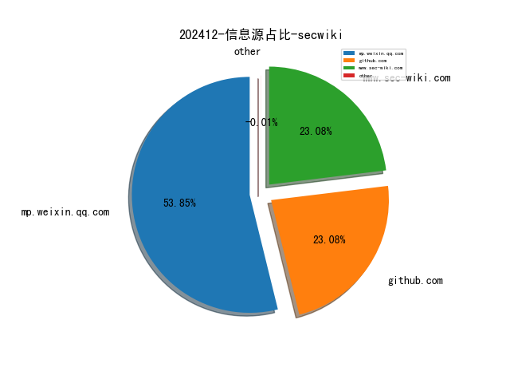
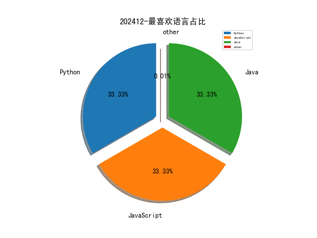

# [数据--所有](README_20.md)
# [数据--年度](README_2024.md)
# 202412 信息源与信息类型占比

# 网络安全书籍 推荐
| date_added | language | title | author | link | size| 
| --- | --- | --- | --- | --- | ---| 
| 2024-12-05 22:04:56 | English | Mastering Spring AI: The Java Developer’s Guide for Large Language Models and Generative AI | unknown | https://www.wowebook.org/mastering-spring-ai-the-java-developers-guide-for-large-language-models-and-generative-ai/ | unknown| 
| 2024-12-05 21:19:27 | English | Hacking MySQL: Breaking, Optimizing, and Securing MySQL for Your Use Case | unknown | https://www.wowebook.org/hacking-mysql-breaking-optimizing-and-securing-mysql-for-your-use-case/ | unknown| 
| 2024-12-05 18:20:35 | English | Full Stack Development with Microsoft Blazor | Peter Himschoot | http://libgen.st/book/index.php?md5=993A13934BEB290011841638C70A9786 | 19 MB [PDF]| 
| 2024-12-03 08:13:34 | English | Quick Start Guide to Large Language Models: Strategies and Best Practices for Using ChatGPT and Other LLMs | unknown | https://www.wowebook.org/quick-start-guide-to-large-language-models-strategies-and-best-practices-for-using-chatgpt-and-other-llms/ | unknown| 
| 2024-12-02 08:39:26 | English | Building Applications with Large Language Models | unknown | https://www.wowebook.org/building-applications-with-large-language-models/ | unknown| 
| 2024-12-01 08:32:06 | English | MCQ for Python Users | unknown | https://www.wowebook.org/mcq-for-python-users/ | unknown| 
| 2024-12-01 07:16:26 | English | Working Smarter with Microsoft Project | unknown | https://www.wowebook.org/working-smarter-with-microsoft-project/ | unknown| 
| 2024-12-01 01:51:43 | English | How to Undertake Surveillance and Reconnaissance: From a Civilian and Military Perspective | Hank Prunckun | http://libgen.st/book/index.php?md5=10E4E480DF83D60BCFCB05B1F7621B4A | 26 MB [PDF]| 

# 微信公众号 推荐
| nickname_english | weixin_no | title | url| 
| --- | --- | --- | ---| 
| Hacking Group 0434 | None | Docker0day，影响近4000台主机 | https://mp.weixin.qq.com/s?__biz=MzkxNzY0MzE2NQ==&mid=2247483958&idx=1&sn=bd8d4407a74e628e6eb222ab3b30070a | 1| 
| Jie安全 | None | 记一次JAVA代码审计过程 | https://mp.weixin.qq.com/s?__biz=Mzg2NDg2MDIxNQ==&mid=2247485194&idx=1&sn=47071e2c86a784f6eeca99def55e03ef | 2| 
| Ots安全 | None | 研究人员在 Solana 流行的 Web3.js npm 库中发现后门 | https://mp.weixin.qq.com/s?__biz=MzAxMjYyMzkwOA==&mid=2247525456&idx=4&sn=8cd3078a9e7d7d7ef48a07f74c9f2cea | 4| 
| Spade sec | None | JS逆向系列13-反调试之console.log | https://mp.weixin.qq.com/s?__biz=MzkzNTcwOTgxMQ==&mid=2247484945&idx=1&sn=fa7b25e755058313784395e96b9a7b44 | 2| 
| TtTeam | None | 实战红蓝：谈一谈NSmartProxy流量特征在实战中的表现 | https://mp.weixin.qq.com/s?__biz=Mzg2NTk4MTE1MQ==&mid=2247486222&idx=1&sn=f1b43263c2fab0c92dd05ae1bcc4c16d | 2| 
| Web安全工具库 | None | 渗透测试流程和信息收集（4天学习打包下载） | https://mp.weixin.qq.com/s?__biz=MzI4MDQ5MjY1Mg==&mid=2247515084&idx=2&sn=b120e313c97d4536c80632e683e28445 | 4| 
| XDsecurity | None | 开源情报,国际动态,日本加大对外军事援助力度 | https://mp.weixin.qq.com/s?__biz=Mzg2NTcyNjU4Nw==&mid=2247485731&idx=1&sn=ba663e8ccb2a7d544ce2ba6c089ae98b | 2| 
| dotNet安全矩阵 | None | 漏洞分析 , 挖掘 .NET SqlSugar 框架SQL注入 | https://mp.weixin.qq.com/s?__biz=MzUyOTc3NTQ5MA==&mid=2247497324&idx=3&sn=726aa5ada489a6cc591b1f36e419bb9b | 6| 
| kali笔记 | None | 浅谈利用PDF钓鱼攻击 | https://mp.weixin.qq.com/s?__biz=MzkxMzIwNTY1OA==&mid=2247509598&idx=1&sn=be74c502c8b0cd301e12048e894f9257 | 2| 
| securitainment | None | Spring Properties 远程代码执行 | https://mp.weixin.qq.com/s?__biz=MzAxODM5ODQzNQ==&mid=2247485622&idx=1&sn=c6b1a76d598054eb86efa917775f6188 | 1| 
| xsser的博客 | None | OpenAI Reft原理 | https://mp.weixin.qq.com/s?__biz=MzA4NzA5OTYzNw==&mid=2247484509&idx=1&sn=95296a0075e98ff1f032770686b0273a | 1| 
| 一起聊安全 | None | 《网络安全标准实践指南——粤港澳大湾区（内地、香港）个人信息跨境处理保护要求》发布 | https://mp.weixin.qq.com/s?__biz=MzI3NjUzOTQ0NQ==&mid=2247516429&idx=1&sn=a2230fc3254e93c4039dee91e9e83cae | 2| 
| 七芒星实验室 | None | 【SDL实践指南】Foritify结构化规则定义 | https://mp.weixin.qq.com/s?__biz=Mzg4MTU4NTc2Nw==&mid=2247493770&idx=2&sn=d76331319fa028f0f4379b0f87c23020 | 4| 
| 中国信息安全 | None | 盘点 , 中国互联网联合辟谣平台2024年11月辟谣榜 | https://mp.weixin.qq.com/s?__biz=MzA5MzE5MDAzOA==&mid=2664231649&idx=6&sn=de9e641a21b56254e7712d2173d22d8d | 6| 
| 乌雲安全 | None | SRC漏洞挖掘之道 | https://mp.weixin.qq.com/s?__biz=MzAwMjA5OTY5Ng==&mid=2247525108&idx=1&sn=6e27512b02e4148cf87e701c0a56e75c | 2| 
| 京东安全应急响应中心 | None | 【活动】2024漏洞马拉松活动来袭，史无前例反爬专项单个奖励最高5w！ | https://mp.weixin.qq.com/s?__biz=MjM5OTk2MTMxOQ==&mid=2727840329&idx=1&sn=8e4b7109f4601396270ae0922058dd61 | 1| 
| 人遁安全 | None | 流量隧道之为什么这么熟练啊混蛋！！！ | https://mp.weixin.qq.com/s?__biz=Mzk0NDQwMDY1Nw==&mid=2247484835&idx=1&sn=521f9926215fa23ecc7e3a22e50418a3 | 2| 
| 信安王子 | None | 免费领取云服务器 | https://mp.weixin.qq.com/s?__biz=Mzg4MjY5MDE4NA==&mid=2247486099&idx=1&sn=be8717a9d8c3165e8e0d3faed6be15dd | 1| 
| 信息安全国家工程研究中心 | None | 【会议通知】第21届中国信息和通信安全学术会议 （CCICS 2024） 会议通知 | https://mp.weixin.qq.com/s?__biz=MzU5OTQ0NzY3Ng==&mid=2247498497&idx=1&sn=c03924c013154c0f1fb65868e606e490 | 1| 
| 全栈网络空间安全 | None | 云原生上的流量采集方案 | https://mp.weixin.qq.com/s?__biz=Mzg3NTUzOTg3NA==&mid=2247514770&idx=1&sn=9cf68d3bc6aca144805f88abc2c1456c | 1| 
| 内生安全联盟 | None | 中共中央办公厅 国务院办公厅关于推进新型城市基础设施建设打造韧性城市的意见 | https://mp.weixin.qq.com/s?__biz=Mzg4MDU0NTQ4Mw==&mid=2247527541&idx=2&sn=c63e514f319487a0f9492628d15766c9 | 2| 
| 军哥网络安全读报 | None | 新的Windows 0day漏洞：攻击者几乎无需用户交互即可窃取 NTLM 凭据 | https://mp.weixin.qq.com/s?__biz=MzI2NzAwOTg4NQ==&mid=2649793408&idx=3&sn=07c14519c7e26f4483bd662559941c89 | 6| 
| 北京磐石安科技有限公司 | None | Cyber Storm介绍和24年演练活动 | https://mp.weixin.qq.com/s?__biz=MzkwNDI0MjkzOA==&mid=2247485578&idx=1&sn=ace99016166def6272bd9c669ac54e61 | 1| 
| 君说安全 | None | 疑似渗透测试人员将报告暴露在公网上：又一次网络安全警钟的敲响 | https://mp.weixin.qq.com/s?__biz=MzUzNjkxODE5MA==&mid=2247487670&idx=1&sn=caa8365aea41b08d1f10663bcbbb10b7 | 2| 
| 启明星辰集团 | None | 2024北京移动合作伙伴大会 , 启明星辰以安全筑基，强化数字首都生态建设~ | https://mp.weixin.qq.com/s?__biz=MzA3NDQ0MzkzMA==&mid=2651729716&idx=1&sn=5af3809e324d68d52fdcc673aaac2a0c | 1| 
| 国源天顺 | None | 集成平台在备战三级等保测评中容易被忽略的测试点 | https://mp.weixin.qq.com/s?__biz=Mzg3MTU1MTIzMQ==&mid=2247495326&idx=1&sn=9f7e9281880d8288f9b4593ac9fabdc4 | 1| 
| 大学生信息安全竞赛 | None | 第十八届全国大学生 信息安全竞赛（创新实践能力赛）暨第二届“长城杯”铁人三项赛（防护赛）-初赛样题 | https://mp.weixin.qq.com/s?__biz=MzAxNTc1ODU5OA==&mid=2665516288&idx=1&sn=bf740448eae1d15b5b6260ddcae697d0 | 2| 
| 天津恒御科技有限公司 | None | 一图读懂《数据安全法》 | https://mp.weixin.qq.com/s?__biz=MzU4NjY3OTAzMg==&mid=2247514200&idx=2&sn=8e9afe2b6956b2078aa8fdbe1eb86696 | 2| 
| 威努特安全网络 | None | 一周全球重大网络安全事件速递（第四十九期） | https://mp.weixin.qq.com/s?__biz=MzAwNTgyODU3NQ==&mid=2651129471&idx=1&sn=dffcc16aad30616bd4da851acd82023a | 2| 
| 字节跳动技术团队 | None | 首次覆盖超 11 类真实编程场景！豆包大模型团队开源代码大模型全新基准 | https://mp.weixin.qq.com/s?__biz=MzI1MzYzMjE0MQ==&mid=2247512182&idx=1&sn=79f715cb468f2c63823c288d744ff8d6 | 1| 
| 安全内参 | None | 严重损害数据安全，湖南一IT公司被罚20万元 | https://mp.weixin.qq.com/s?__biz=MzI4NDY2MDMwMw==&mid=2247513246&idx=1&sn=a4a663b3a67c336106c8f2c644048dbf | 1| 
| 安全君呀 | None | 记一次简单的代码审计项目案例 | https://mp.weixin.qq.com/s?__biz=MzkyOTUxMzk2NQ==&mid=2247485642&idx=1&sn=afcc7c4a8330cefeed2195326b87685f | 2| 
| 安全学习那些事儿 | None | 伏特加制造商Stoli美国子公司因网络攻击申请破产保护 | https://mp.weixin.qq.com/s?__biz=MzkxNTI2NTQxOA==&mid=2247495333&idx=5&sn=029e03fecfdb3f4faecb6f6fa6c72ae0 | 5| 
| 安全帮Live | None | 财富自由之路～BTC链上数据分析（2） | https://mp.weixin.qq.com/s?__biz=MzI3NTcwNTQ2Mg==&mid=2247487437&idx=1&sn=186e98a065acc146787ca83cbd1898e9 | 1| 
| 安全牛课堂 | None | CCRC大动作丨双12疯狂返现！超乎想象！ | https://mp.weixin.qq.com/s?__biz=MzIxNTM4NDY2MQ==&mid=2247514701&idx=2&sn=c818950db7e27b1f8fc553093c035913 | 2| 
| 安全狗的自我修养 | None | Go ：恶意软件开发（第一部分） | https://mp.weixin.qq.com/s?__biz=MzkwOTE5MDY5NA==&mid=2247503764&idx=1&sn=b19dd0d0aaf00894b6867890bdc6ffc2 | 3| 
| 安天集团 | None | 安天AVL SDK反病毒引擎升级通告（20241207） | https://mp.weixin.qq.com/s?__biz=MjM5MTA3Nzk4MQ==&mid=2650209337&idx=1&sn=6fbb9e098c7de5d552560a0086994e4f | 1| 
| 安帝Andisec | None | 工业网络安全周报-2024年第47期 | https://mp.weixin.qq.com/s?__biz=MzU3ODQ4NjA3Mg==&mid=2247562884&idx=1&sn=e8248c41107cd2946c1a99e47946b5be | 1| 
| 安恒信息 | None | 专家解读 , 强化可信管控能力建设，筑牢可信数据空间安全底座 | https://mp.weixin.qq.com/s?__biz=MjM5NTE0MjQyMg==&mid=2650621527&idx=1&sn=a236021a337cc3a8ed97f9affd095611 | 2| 
| 安服仔Yu9 | None | 无限安全靶场-月挑战1 | https://mp.weixin.qq.com/s?__biz=Mzg4Mzg2MjgxNg==&mid=2247485558&idx=1&sn=e22cb428a2af8d4e5b699e4962b0da80 | 1| 
| 小谢取证 | None | 第一届数证杯团体赛---服务器取证 | https://mp.weixin.qq.com/s?__biz=Mzg4MTcyMTc5Nw==&mid=2247488040&idx=1&sn=a0334692600b13eeb492492504719a7b | 1| 
| 开源情报技术研究院 | None | 网络安全资讯周报(12/02- 12/06) | https://mp.weixin.qq.com/s?__biz=MzkwNjQxOTk1Mg==&mid=2247486013&idx=1&sn=f40f8a6aec65e95d86545c8d9c961eba | 1| 
| 我真不是红队啊 | None | 新手福利-没什么亮点的目录扫描器 | https://mp.weixin.qq.com/s?__biz=MzUzNjg5ODkxMA==&mid=2247484085&idx=1&sn=93bac200a0c409fa3a210b17d3887c80 | 1| 
| 掌控安全EDU | None | 高级渗透测试 , 南昌 | https://mp.weixin.qq.com/s?__biz=MzUyODkwNDIyMg==&mid=2247545711&idx=2&sn=2816e78bedaf9d7391d3650d2ea555ef | 2| 
| 新蜂网络安全实验室 | None | Mitre Att&ck框架T1036.006(文件名后面的空格）技术的简单实现 | https://mp.weixin.qq.com/s?__biz=MzI0NTI4NjEwOQ==&mid=2247484920&idx=1&sn=2bada6774d9702240e6f8d840640f4dc | 1| 
| 星悦安全 | None | 高质量企业+eduSRC漏洞挖掘实战资料分享 | https://mp.weixin.qq.com/s?__biz=Mzg4MTkwMTI5Mw==&mid=2247487942&idx=1&sn=15aa489d022ced042139dc1381fcafd4 | 1| 
| 智佳网络安全 | None | 【PWN】堆溢出2.23 Off-By-One | https://mp.weixin.qq.com/s?__biz=Mzk0NDYwOTcxNg==&mid=2247485038&idx=1&sn=2d307c01f15498c12c5bcad97233f8ab | 1| 
| 格格巫和蓝精灵 | None | 应急响应案例2-Windows Rootkit系列之紫狐病毒（驱动隐藏） | https://mp.weixin.qq.com/s?__biz=MzI5NDg0ODkwMQ==&mid=2247486101&idx=1&sn=b3288b6bc42442aea8b486ef7b770bc7 | 2| 
| 沃克学安全 | None | 支付类漏洞挖掘技巧总结 | https://mp.weixin.qq.com/s?__biz=MzkzMjIxNjExNg==&mid=2247485990&idx=1&sn=303f4ff26e9de1a67b30a91e4094d384 | 1| 
| 河南等级保护测评 | None | 如何确保数据传输的安全？ | https://mp.weixin.qq.com/s?__biz=Mzg2NjY2MTI3Mg==&mid=2247497742&idx=1&sn=65f891f01b529e0d1b833f415e961043 | 2| 
| 洞见网安 | None | 网安原创文章推荐【2024/12/6】 | https://mp.weixin.qq.com/s?__biz=MzAxNzg3NzMyNQ==&mid=2247489287&idx=1&sn=0bcad9b487207878323efd307520db0c | 1| 
| 浅安安全 | None | 工具 , testssl.sh | https://mp.weixin.qq.com/s?__biz=MzkwMTQ0NDA1NQ==&mid=2247491663&idx=4&sn=36cd8db57528ec88320c885363e52f78 | 8| 
| 犀牛安全 | None | 施耐德电气的开发平台遭黑客窃取遭入侵 | https://mp.weixin.qq.com/s?__biz=Mzg3ODY0NTczMA==&mid=2247491691&idx=1&sn=9b9c8e2f112b7a949299b107e535dee0 | 2| 
| 狼蛛安全实验室 | None | Patchwork组织以研发计划为诱饵针对中国科研人员发起网络间谍攻击 | https://mp.weixin.qq.com/s?__biz=Mzg4MDYwNDc5Nw==&mid=2247486449&idx=1&sn=3c2392b3909040de8de4608ddbf0d568 | 1| 
| 玄道夜谈 | None | 分享图片 | https://mp.weixin.qq.com/s?__biz=MzI3Njc1MjcxMg==&mid=2247493762&idx=1&sn=973da2869f5315124a92a8d1b30e85ca | 1| 
| 白帽学子 | None | 学JAVA的，负责烧烤去 | https://mp.weixin.qq.com/s?__biz=MzkyNzIxMjM3Mg==&mid=2247488433&idx=2&sn=38fc26119e0c6b7e90ab0c7d6855f0e9 | 4| 
| 神农Sec | None | 雷池WAF自动化实现安全运营实操案例终极篇 | https://mp.weixin.qq.com/s?__biz=Mzk0Mzc1MTI2Nw==&mid=2247485989&idx=1&sn=75ff28feb5e2c0947e142dba2b3ee914 | 2| 
| 祺印说信安 | None | 2024年最危险的25个软件漏洞 | https://mp.weixin.qq.com/s?__biz=MzA5MzU5MzQzMA==&mid=2652113041&idx=2&sn=ce9243791a081b087a014d89f2b9f468 | 6| 
| 秦国商鞅 | None | 原创—结合现实生活谈宋元明几代文化特点的启发 | https://mp.weixin.qq.com/s?__biz=Mzg4NzAwNzA4NA==&mid=2247485012&idx=1&sn=17e9732f2240fe59d693e15d747f6175 | 1| 
| 秦安战略 | None | 秦安：中国发起反攻！三协会发布美国芯片不安全声明，终于硬气了 | https://mp.weixin.qq.com/s?__biz=MzA5MDg1MDUyMA==&mid=2650475585&idx=1&sn=cae33fd03378a024713cd8d1e8dda0c6 | 6| 
| 竞远网络安全 | None | 竞远安全亮相2024数字科技生态大会，联袂中国电信共筑量子安全向新体系 | https://mp.weixin.qq.com/s?__biz=MzAwMTU3NTcwMg==&mid=2650274654&idx=1&sn=3f65f5376bccc4280ada545b7681bae3 | 1| 
| 网安杂谈 | None | 寒冬里，请大家一起守护网络安全的光 | https://mp.weixin.qq.com/s?__biz=MzAwMTMzMDUwNg==&mid=2650889403&idx=1&sn=e897fbed8f792feee464a354cc1ff11e | 1| 
| 网空闲话plus | None | 5th域安全微讯早报【20241207】294期 | https://mp.weixin.qq.com/s?__biz=MzkyMjQ5ODk5OA==&mid=2247505890&idx=3&sn=47e21573cf8243020e5634436d6e96c4 | 7| 
| 网络与安全实验室 | None | 每周文章分享-189 | https://mp.weixin.qq.com/s?__biz=MzI1MTQwMjYwNA==&mid=2247501068&idx=1&sn=9f8694af34940c4022a258456fac4198 | 1| 
| 网络安全与人工智能研究中心 | None | 人工智能与网络安全双向赋能，推动数字化时代安全新实践——2024第三届北外滩网络安全论坛圆满举办 | https://mp.weixin.qq.com/s?__biz=MzkwMTQyODI4Ng==&mid=2247495127&idx=3&sn=b59f9e1c6e8859881826417cd99e0474 | 3| 
| 网络安全与取证研究 | None | MongoDB数据库应用指南——现场数据固定与后续分析 | https://mp.weixin.qq.com/s?__biz=Mzg3NTU3NTY0Nw==&mid=2247489410&idx=1&sn=0fb062c1727dae042899b1666aa78cba | 2| 
| 网络安全者 | None | 渗透测试 -- Web漏洞介绍和Sql注入漏洞 | https://mp.weixin.qq.com/s?__biz=MzU3NzY3MzYzMw==&mid=2247498845&idx=2&sn=25201142c51e9dbeacbaf956dbf30b41 | 2| 
| 聚铭网络 | None | 【一周安全资讯1207】工信部《国家智能制造标准体系建设指南（2024）》公开征求意见；四大行业协会齐发声：谨慎采购美国芯片！ | https://mp.weixin.qq.com/s?__biz=MzIzMDQwMjg5NA==&mid=2247506261&idx=1&sn=1fc8381217fe253457be6b3589812a15 | 1| 
| 船山信安 | None | 提示词注入攻击 | https://mp.weixin.qq.com/s?__biz=MzU2NDY2OTU4Nw==&mid=2247517529&idx=1&sn=1f2ab74fd23353da073f01b722ea92c3 | 2| 
| 苏说安全 | None | 公司系统遭攻击被处罚！原因是…… | https://mp.weixin.qq.com/s?__biz=Mzg5OTg5OTI1NQ==&mid=2247489360&idx=1&sn=743dad60e8a0057bf95bd1bba90dc1b9 | 2| 
| 藏剑安全 | None | 还有人没有用上Mac的渗透浏览器？ | https://mp.weixin.qq.com/s?__biz=Mzg5MDA5NzUzNA==&mid=2247488581&idx=1&sn=a6073c2a8a7b45a9c9da1d8077fecb22 | 1| 
| 计算机与网络安全 | None | 网信安全人才能力白皮书 | https://mp.weixin.qq.com/s?__biz=MjM5OTk4MDE2MA==&mid=2655261379&idx=2&sn=6fa4fa5ce435ba7a031ecc015f24a23d | 6| 
| 说安全 如何安全 | None | 2021、2022、2023网信自主创新调研报告（附报告下载） | https://mp.weixin.qq.com/s?__biz=MzkyODY5ODAyOA==&mid=2247488734&idx=1&sn=b78e34583800e0cf6f3abd89ed4643f6 | 2| 
| 谷安培训 | None | 【DPO/CIPM/CIPP/CIPT/CDSP】直降千元,配备专业师资 | https://mp.weixin.qq.com/s?__biz=MzU4MjUxNjQ1Ng==&mid=2247519864&idx=2&sn=3f80d53dda62ce14662f109d595a3ce2 | 2| 
| 赛博研究院 | None | 中办 国办发布关于推进新型城市基础设施建设打造韧性城市的意见 | https://mp.weixin.qq.com/s?__biz=MzUzODYyMDIzNw==&mid=2247515648&idx=2&sn=9575372f8b8301b3d3dbcae1c110d4ae | 2| 
| 进击安全 | None | 记一次JAVA代码审计过程 | https://mp.weixin.qq.com/s?__biz=MzkyMjM5NDM3NQ==&mid=2247486169&idx=1&sn=06e49fd2f6cf2dbdca4eb3c550ed86cf | 2| 
| 进击的HACK | None | 云安全学习-密钥泄露与CF利用框架 | https://mp.weixin.qq.com/s?__biz=MzkxNjMwNDUxNg==&mid=2247486945&idx=2&sn=beee676ac80e94387272c03affb7e5cb | 4| 
| 逆向有你 | None | PC逆向 -- 用户APC执行 | https://mp.weixin.qq.com/s?__biz=MzA4MzgzNTU5MA==&mid=2652037147&idx=2&sn=2980166e539b9fecaf3f664831f7a1ae | 2| 
| 道一安全 | None | 我们创建了一个不一样的永久免费星球 | https://mp.weixin.qq.com/s?__biz=MzU5OTMxNjkxMA==&mid=2247488117&idx=1&sn=de704fb745b4bb0a89b9f733dea1f85d | 2| 
| 银遁安全团队 | None | 【吃瓜】门当户对？ | https://mp.weixin.qq.com/s?__biz=MzU3MjU4MjM3MQ==&mid=2247488779&idx=2&sn=a700412c093a958739753ca2b34f298b | 4| 
| 长弓三皮 | None | 全民狂欢！国内免费ChatGPT强势来袭，让你与AI零距离互动！ | https://mp.weixin.qq.com/s?__biz=MzU2NzIzNzU4Mg==&mid=2247488485&idx=1&sn=10565929ffed59e6e4390fb21cb5b216 | 2| 
| 长风安全 | None | 代码审计 ｜ Jump Server堡垒机历史漏洞审计 | https://mp.weixin.qq.com/s?__biz=Mzg4MDkyMTE4OQ==&mid=2247486180&idx=1&sn=258dd29d0a97c72092bd6b722048e94d | 1| 
| 高等精灵实验室 | None | FileGator：一款小巧精干的多用户文件管理器 | https://mp.weixin.qq.com/s?__biz=MzA4MjkzMTcxMg==&mid=2449046537&idx=1&sn=07b8063ac99ef010af67bb497941f53c | 2| 
| 高级红队专家 | None | 【MalDev-07】Anti-Debugging反调试-3 | https://mp.weixin.qq.com/s?__biz=MzIzODMyMzQxNQ==&mid=2247484338&idx=1&sn=9027a615b51110970118c7542b5d989f | 2| 
| 黑白之道 | None | sqlmap被动代理小工具 | https://mp.weixin.qq.com/s?__biz=MzAxMjE3ODU3MQ==&mid=2650604682&idx=4&sn=b00a4b26e07c7fbcb487eb3616ea6456 | 7| 
| 龙哥网络安全 | None | Web 安全基础知识梳理大全，零基础入门到精通，收藏这篇就够了 | https://mp.weixin.qq.com/s?__biz=MzU3MjczNzA1Ng==&mid=2247493764&idx=2&sn=49814375341ebaf698c9ea5a46428b8b | 2| 
| 360数字安全 | None | 年关将至，这些单位用360安全大模型交上安全运营高分成绩单 | https://mp.weixin.qq.com/s?__biz=MzA4MTg0MDQ4Nw==&mid=2247577443&idx=1&sn=7b4aee259ff4b0f57dc1e8331a0282b0 | 1| 
| FreeBuf | None | CABED：一款针对Chrome应用程序绑定数据的加密解密工具 | https://mp.weixin.qq.com/s?__biz=MjM5NjA0NjgyMA==&mid=2651309094&idx=4&sn=a4310a5d090519e47811b92239c23f69 | 8| 
| HW专项行动小组 | None | 24.学习ysoserial.net的plugins第三弹 | https://mp.weixin.qq.com/s?__biz=MzkzNTUwNTg2Ng==&mid=2247485368&idx=1&sn=202562c801678511127cdd30c038de29 | 1| 
| Heihu Share | None | Java 安全 , 从 Shiro 底层源码看 Shiro 漏洞 (下) | https://mp.weixin.qq.com/s?__biz=MzkwMzQyMTg5OA==&mid=2247486322&idx=1&sn=fbd61172d2e9bb94ebd76a78608b2ced | 1| 
| Jiyou too beautiful | None | HTB-Vintage笔记 | https://mp.weixin.qq.com/s?__biz=Mzk0MTQxOTA3Ng==&mid=2247489250&idx=1&sn=e244c73804185afe5f0cf4752865bdbc | 1| 
| Khan安全攻防实验室 | None | CVE-2024-42327 Zabbix SQL注入 POC | https://mp.weixin.qq.com/s?__biz=MzAwMjQ2NTQ4Mg==&mid=2247495970&idx=1&sn=ff9a5f04745abfade7cb4ca85fc55840 | 6| 
| SecWiki | None | SecWiki周刊（第560期） | https://mp.weixin.qq.com/s?__biz=MjM5NDM1OTM0Mg==&mid=2651053387&idx=2&sn=4b51298fb6fab120254a946528eb1431 | 2| 
| TIPFactory情报工厂 | None | 银狐源码解读—核心组件模块 | https://mp.weixin.qq.com/s?__biz=MzkyMjM0ODAwNg==&mid=2247488293&idx=1&sn=bee6dc02f085dec126c8d1245b2ffb60 | 1| 
| Undoubted Security | None | 【文中抽奖】爱奇艺VIP年卡 | https://mp.weixin.qq.com/s?__biz=MzI0NjE1NDYyOA==&mid=2247484719&idx=1&sn=0aff84d804e5d6ff45b827ac7cfaa1fa | 1| 
| XiAnG学安全 | None | 数证杯决赛-个人赛（手机+计算机） | https://mp.weixin.qq.com/s?__biz=Mzk0MTQzNjIyNg==&mid=2247493229&idx=1&sn=aed1defe75ee702653360ef7c7cbd6b7 | 2| 
| 丁永博的成长日记 | None | OneForAll | https://mp.weixin.qq.com/s?__biz=MzkyOTMxNDM3Ng==&mid=2247488721&idx=1&sn=d4fbee068ecb5bf642577c821b7b0821 | 1| 
| 丁爸 情报分析师的工具箱 | None | 【情报】美国近100 前国家安全官员联名写公开信反对特朗普提名的情报总监 | https://mp.weixin.qq.com/s?__biz=MzI2MTE0NTE3Mw==&mid=2651148108&idx=1&sn=c2415bf2b354721489840516265d55f9 | 2| 
| 东方隐侠安全团队 | None | 网安瞭望台第9期：0day 情报，OAuth 2.0授权流程学习 | https://mp.weixin.qq.com/s?__biz=Mzg2NTkwODU3Ng==&mid=2247514008&idx=1&sn=5c670c62b4c5fa4a355f424e56645be1 | 2| 
| 中国网络空间安全协会 | None | 网络安全“王牌对王牌” 瞬间精彩集锦 | https://mp.weixin.qq.com/s?__biz=MzA3ODE0NDA4MA==&mid=2649401030&idx=1&sn=4301045eabfb58d9d2b89ef131edc09d | 1| 
| 二进制磨剑 | None | IDA技巧（84）数组索引 | https://mp.weixin.qq.com/s?__biz=MzI1Mjk2MTM1OQ==&mid=2247485072&idx=1&sn=827ff916f0ddc990a5fea031426385c9 | 2| 
| 亿人安全 | None | 记某次金融小程序数据加密及签名逆向 | https://mp.weixin.qq.com/s?__biz=Mzk0MTIzNTgzMQ==&mid=2247518573&idx=1&sn=c13e8eb25be6895c34dbc5964a38c9c2 | 1| 
| 信安404 | None | 推荐一个好用的自动化越权扫描工具 | https://mp.weixin.qq.com/s?__biz=Mzk0NjQ5MTM1MA==&mid=2247492697&idx=1&sn=810d7d7add607c1c2115b46717f69ebb | 1| 
| 信息安全大事件 | None | 谷歌DNS服务器8.8.8.8/8.8.4.4出现短时间宕机 大量用户报告谷歌服务不可用 | https://mp.weixin.qq.com/s?__biz=MzkzNjIzMjM5Ng==&mid=2247490073&idx=1&sn=811e5e5d11e0c72f4e0738421e697e3b | 1| 
| 冷漠安全 | None | 「漏洞复现」易宝OA GetUDEFStreamID SQL注入漏洞 | https://mp.weixin.qq.com/s?__biz=MzkyNDY3MTY3MA==&mid=2247486248&idx=1&sn=c5db4ce371a7d76a113ec5be58c6a312 | 2| 
| 安全圈 | None | 【安全圈】德勤遭勒索攻击，被窃取机密数据超1TB | https://mp.weixin.qq.com/s?__biz=MzIzMzE4NDU1OQ==&mid=2652066435&idx=4&sn=a7ab4eff0bdc2fdfa411f2523a1a1279 | 7| 
| 安全研究GoSSIP | None | G.O.S.S.I.P 阅读推荐 2024-12-06 小心预训练语言模型变成隐私陷阱 | https://mp.weixin.qq.com/s?__biz=Mzg5ODUxMzg0Ng==&mid=2247499320&idx=1&sn=84b5871a92d7f701a8b9764c4f51cfe1 | 2| 
| 山石网科新视界 | None | 山石网科受邀参加2024年信息技术创新公益交流会 | https://mp.weixin.qq.com/s?__biz=MzAxMDE4MTAzMQ==&mid=2661296206&idx=2&sn=8796544f80829a704d86021c0a6bbcca | 2| 
| 强网竞赛 | None | 凝心聚力，共筑强网丨第八届“强网杯”全国网络安全挑战赛圆满收官 | https://mp.weixin.qq.com/s?__biz=Mzg4MjY3NDQ2Ng==&mid=2247487758&idx=1&sn=9ea80796bcad6902535d5f60a65668d1 | 6| 
| 教父爱分享 | None | 【免杀干货】杀毒软件检测详解 | https://mp.weixin.qq.com/s?__biz=MzI1Mjc3NTUwMQ==&mid=2247537058&idx=1&sn=e1aa16a7450e6eb919e87021ac20192a | 2| 
| 极客安全 | None | 安全动态丨网络空间安全动态第237期 | https://mp.weixin.qq.com/s?__biz=MzU2MjcwOTY1Mg==&mid=2247521075&idx=2&sn=01843b8face63ba46257a829c0db539f | 2| 
| 混子Hacker | None | 【漏洞复现】CVE-2024-41713 | https://mp.weixin.qq.com/s?__biz=MzUxMTk4OTA1NQ==&mid=2247484772&idx=1&sn=8e593a28c598c058805d54e0cfef6028 | 1| 
| 独眼情报 | None | 【事件调查】深入调查onlyfans国内“被解封”谣言 | https://mp.weixin.qq.com/s?__biz=MzkzNDIzNDUxOQ==&mid=2247492863&idx=1&sn=a90f6465a5009a26bcd7c8fe7cf6e261 | 9| 
| 网安百色 | None | 未严格落实网络安全责任制，一企业被处罚 | https://mp.weixin.qq.com/s?__biz=MzI0NzE4ODk1Mw==&mid=2652094215&idx=2&sn=5c222c0309ade68baa956b3d2a50ba89 | 4| 
| 网络与信息法学会 | None | 【资讯】海南省人大常委会公布《海南自由贸易港国际数据中心发展规定》 | https://mp.weixin.qq.com/s?__biz=MzU1NDY3NDgwMQ==&mid=2247548091&idx=5&sn=024f6beb23a5ea65f11eee1016947e37 | 5| 
| 网络空间信息安全学习 | None | 上新日 , 隐私痕迹清理工具 PrivaZer，键鼠屏幕共享软件 Multiplicity 4 上架！ | https://mp.weixin.qq.com/s?__biz=MzI2MjcwMTgwOQ==&mid=2247492100&idx=1&sn=2a6f6404b66e69557cb393a5bae2a1b2 | 1| 
| 菜狗安全 | None | JAVA安全-模板注入-Thymeleaf | https://mp.weixin.qq.com/s?__biz=Mzg4MzkwNzI1OQ==&mid=2247485531&idx=1&sn=ee869dfdc691401e35027f07d1a9c63c | 1| 
| 迪哥讲事 | None | 从JS代码审计到GraphQL利用的管理账户接管 | https://mp.weixin.qq.com/s?__biz=MzIzMTIzNTM0MA==&mid=2247496534&idx=1&sn=493cff035c6dde66c5b31d96de6f3834 | 2| 
| 透明魔方 | None | u200c最早的病毒—MBR病毒 | https://mp.weixin.qq.com/s?__biz=MzI4NzA1Nzg5OA==&mid=2247485595&idx=2&sn=0e38828d93d4a4e8ec98cfeeb69e8fdd | 2| 
| 长亭安全观察 | None | 再夺第一！长亭科技荣获第八届“强网杯”全国网络安全挑战赛线下赛冠军！ | https://mp.weixin.qq.com/s?__biz=MzkyNDUyNzU1MQ==&mid=2247486383&idx=1&sn=688646e959199e30a7057f5c7a7e17c3 | 1| 
| 飓风网络安全 | None | 【漏洞预警】SonicWall SMA100 SSL-VPN缓冲区溢出漏洞CVE-2024-45318 | https://mp.weixin.qq.com/s?__biz=MzI3NzMzNzE5Ng==&mid=2247489275&idx=1&sn=31722ca4a5e3edc74c5e218e4bfedbdf | 1| 
| 鸿鹄实验室 | None | 优秀免杀项目推荐：\\nhttps://github.com/rad9800/BootExecuteEDR\\n\\n原理为Windows 服务启动之前进行操作，类似于之前的权限维持手法。可利用此方案禁用EDR。 | https://mp.weixin.qq.com/s?__biz=MzU0MjUxNjgyOQ==&mid=2247492219&idx=1&sn=860b27bf590bb194536f4e8cf6e02ca1 | 1| 
| A9 Team | None | Windows常规应急 | https://mp.weixin.qq.com/s?__biz=MzkzNzI2Mzc0Ng==&mid=2247486342&idx=1&sn=7f19ac711aa23420e8154fb8f9d92c1d | 1| 
| AI与安全 | None | 通俗地说说RAG及其与大模型的结合 | https://mp.weixin.qq.com/s?__biz=Mzg5NTMxMjQ4OA==&mid=2247485284&idx=1&sn=a4b555dae32f49d7f9a469f7ef7b157b | 1| 
| ChaMd5安全团队 | None | 喜报！ChaMD5团队AI组获Datacon AI安全赛道最终排名第四！ | https://mp.weixin.qq.com/s?__biz=MzIzMTc1MjExOQ==&mid=2247511652&idx=1&sn=c7c86bf615fcabab78ff35327b44aff4 | 1| 
| Day1安全团队 | None | 2024双十一安全保卫战｜Day1安全团队战报 | https://mp.weixin.qq.com/s?__biz=MzU1NDU1NTI5Nw==&mid=2247488130&idx=1&sn=8e94e95d479db575f99589fc1b8eb343 | 1| 
| Echo Reply | None | Wireshark & Packetdrill , TCP RST 之连接不存在的服务端口 | https://mp.weixin.qq.com/s?__biz=MzA5NTUxODA0OA==&mid=2247493054&idx=1&sn=9aa118b745b703068af6a2c40e6a5f5d | 1| 
| HACK之道 | None | 12月，一个新方向爆了，70k很稳！ | https://mp.weixin.qq.com/s?__biz=MzIwMzIyMjYzNA==&mid=2247517084&idx=1&sn=f3f55861dbd66aa24cf342c6074b84cb | 1| 
| RongRui安全团队 | None | 二开哥斯拉-绕过cloudflare流量检测 | https://mp.weixin.qq.com/s?__biz=MzkwMzcwMDU5OA==&mid=2247484055&idx=1&sn=d9bf533093a85156acc9d52b79183c55 | 1| 
| Sec Online | None | 等级保护 , 定级备案 | https://mp.weixin.qq.com/s?__biz=MzIyMjU3MDg3Mw==&mid=2247489022&idx=1&sn=1c7f4ce4aa41915da6bf2cfc2fac15ca | 1| 
| SecretTeam安全团队 | None | Windows权限控制相关的防御与攻击技术 | https://mp.weixin.qq.com/s?__biz=MzkzMDQ5MDM3NA==&mid=2247487114&idx=1&sn=69890ae99784ecfdc8e9a4a7cf1225ad | 1| 
| Timeline Sec | None | 喜报 , Timeline Sec团队荣获ByteSRC2024年度“优秀合作伙伴”称号 | https://mp.weixin.qq.com/s?__biz=MzA4NzUwMzc3NQ==&mid=2247496884&idx=1&sn=5b1338d92621ecc586e84a03ee65eb8b | 1| 
| Van1sh | None | 2024 网鼎杯 半决赛&决赛 | https://mp.weixin.qq.com/s?__biz=Mzg5OTkxMzM3NA==&mid=2247485847&idx=1&sn=effe1dc792f4822d8b4123effa388646 | 1| 
| Z0安全 | None | 【漏洞复现】Apache OFBiz远程代码执行漏洞(CVE-2024-45195) | https://mp.weixin.qq.com/s?__biz=Mzk0OTY2ODE1NA==&mid=2247484884&idx=1&sn=c3d38f9f57d4e2b96d95aea5b15ddaa6 | 1| 
| 中国电信安全 | None | 倒计时1天 , 安全广筑 护你“州”全 | https://mp.weixin.qq.com/s?__biz=MzkxNDY0MjMxNQ==&mid=2247531560&idx=2&sn=d884e89f67bee7fb15c420c68cdd9bcb | 2| 
| 云计算和网络安全技术实践 | None | vulnhub之Matrix-2的实践 | https://mp.weixin.qq.com/s?__biz=MzA3MjM5MDc2Nw==&mid=2650748838&idx=1&sn=00aa5d5e8d6bb1cfb0c3d8cbad275ab3 | 1| 
| 关键信息基础设施安全保护联盟 | None | 中关村华安关键信息基础设施安全保护联盟三项标准草案对外征集 | https://mp.weixin.qq.com/s?__biz=MzkxNjU2NjY5MQ==&mid=2247508098&idx=3&sn=9822bd5aa86509569c90cb406ed3555e | 3| 
| 再说安全 | None | 三个欧洲网络安全实习机会：你准备好了吗？（2024-11-30） | https://mp.weixin.qq.com/s?__biz=MzkyODYwODkyMA==&mid=2247484719&idx=1&sn=029ea87c4c576f7d48c04b8464b5b990 | 1| 
| 嘉诚安全 | None | 荣耀再临｜嘉诚信息再度上榜《中国网络安全企业100强》 | https://mp.weixin.qq.com/s?__biz=MzU4NjY4MDAyNQ==&mid=2247496841&idx=1&sn=11846a3e433eb98369ec6ec068543db8 | 1| 
| 夜组安全 | None | 一个半自动化springboot打点工具，内置目前springboot所有漏洞 | https://mp.weixin.qq.com/s?__biz=Mzk0ODM0NDIxNQ==&mid=2247492888&idx=1&sn=e82e6cc24fad3f50641261e79572cc04 | 1| 
| 天际友盟 | None | [1202]一周重点暗网情报｜天际友盟情报站 | https://mp.weixin.qq.com/s?__biz=MzIwNjQ4OTU3NA==&mid=2247509862&idx=1&sn=d52dc1d5142943a5e756baf2612aabfb | 1| 
| 威零安全实验室 | None | 【新增PHP类型】蚁剑 , 哥斯拉免杀 过雷池、D盾、安全狗的 XlByPassWAF v1.1已更新！ | https://mp.weixin.qq.com/s?__biz=Mzg4Mzg4OTIyMA==&mid=2247485843&idx=1&sn=379dca0b0551c3a8260b7d113607b925 | 1| 
| 安全info | None | 你同意用隐私换取个性化服务吗？ | https://mp.weixin.qq.com/s?__biz=Mzg2MTc0NTYyNg==&mid=2247486743&idx=1&sn=e3951ece06d97eaba5df3a8551bf785d | 1| 
| 安全分析与研究 | None | 针对银狐一些最新攻击样本加载过程的调试分析 | https://mp.weixin.qq.com/s?__biz=MzA4ODEyODA3MQ==&mid=2247489593&idx=1&sn=4791b9831434d21de5e329c04ffde76c | 1| 
| 安全喵喵站 | None | u200b隐形创业？以色列科技潮流新变化 | https://mp.weixin.qq.com/s?__biz=MzkzNjE5NjQ4Mw==&mid=2247542363&idx=1&sn=9ae32e3a27d5e5e7fdccb8ba0b3b8d92 | 1| 
| 安全新说 | None | 中国网络安全企业100强（安全牛，第十二版） | https://mp.weixin.qq.com/s?__biz=MzA3NDIwNTY5Mw==&mid=2247507140&idx=1&sn=92f7ce8b075b0f65f361e345e02c1d28 | 1| 
| 安全洞察知识图谱 | None | .NET 安全攻防知识交流社区 | https://mp.weixin.qq.com/s?__biz=MzkyMDM4NDM5Ng==&mid=2247488877&idx=2&sn=490126f20f9e5c0dbf2007abc95c9b57 | 2| 
| 安小圈 | None | 【2024年】83%的组织 报告了内部攻击 | https://mp.weixin.qq.com/s?__biz=Mzg2MDg0ODg1NQ==&mid=2247535293&idx=4&sn=d4d236b455cab296a609eb2fddbb52ad | 4| 
| 成都链安 | None | 助力科技兴警,四川省公安厅刑侦局组织的首期链上案件研判实战培训班在成都链安成功举办 | https://mp.weixin.qq.com/s?__biz=MzU2NzUxMTM0Nw==&mid=2247513237&idx=1&sn=887867700e6e47cc4f7815c38e649e2b | 1| 
| 技术修道场 | None | zk-SNARKs 与 zk-STARKs：零知识证明的两条路径 | https://mp.weixin.qq.com/s?__biz=MzA4NTY4MjAyMQ==&mid=2447899664&idx=1&sn=eda4b42fe5381ff510d411963886f40d | 1| 
| 星尘安全 | None | XT 交易所遭到黑客攻击，170 万美元的加密货币被盗，提款已停止 | https://mp.weixin.qq.com/s?__biz=Mzg3NTY0MjIwNg==&mid=2247484972&idx=1&sn=af0ac957af2f30cf431f79c07c83b79c | 1| 
| 星落安全团队 | None | 文末获取 , 基于卡巴斯基虚拟化技术实现内核Hook | https://mp.weixin.qq.com/s?__biz=MzkwNjczOTQwOA==&mid=2247491255&idx=1&sn=557595ed39256247197085690907cda6 | 1| 
| 极道安全 | None | 薅羊毛技术解析 | https://mp.weixin.qq.com/s?__biz=Mzg5Mjk0NzI2Mg==&mid=2247483763&idx=1&sn=b1c7f4d9e30d4d2267d858cfbd4a79de | 1| 
| 极验 | None | 近5亿ins用户信息遭爬虫？极验反爬新思路 | https://mp.weixin.qq.com/s?__biz=MzI2MDE5MTQxNg==&mid=2649722979&idx=1&sn=16e105490e0c29510127d59a0822f0b8 | 1| 
| 永信至诚 | None | 永信至诚「数字风洞」支撑超大规模靶场及AI自动化实战测试评估，2024“中华武数杯”全国网络攻防精英赛收官 | https://mp.weixin.qq.com/s?__biz=MzAwNDUyMjk4MQ==&mid=2454828625&idx=1&sn=930e64d80e9dde90a9a4e1541b254c0e | 1| 
| 汇能云安全 | None | 重庆一学校因未履行好网络安全保护义务被处罚，电脑遭境外黑客远控植入木马 | https://mp.weixin.qq.com/s?__biz=MzIwNzAwOTQxMg==&mid=2652250930&idx=1&sn=f7bc68609c96238df9bf6b79559270db | 1| 
| 汽车电子嵌入式 | None | AUTOSAR OS模块详解(二) Counter | https://mp.weixin.qq.com/s?__biz=Mzg2NTYxOTcxMw==&mid=2247492882&idx=1&sn=6c2df5be54cd336d31d3cb16e4924166 | 1| 
| 泷羽Sec | None | 社工靶场推荐 | https://mp.weixin.qq.com/s?__biz=Mzg2Nzk0NjA4Mg==&mid=2247496328&idx=1&sn=3b01b07cac5722695b10187308e85a66 | 1| 
| 渗透安全HackTwo | None | 记一次从0到1的漏洞挖掘过程 发现Accesssecret泄露实现权限接管 越权等漏洞,挖洞技巧 | https://mp.weixin.qq.com/s?__biz=Mzg3ODE2MjkxMQ==&mid=2247489204&idx=1&sn=8bf569f2824beddb053d74868d67d981 | 1| 
| 爱喝酒烫头的曹操 | None | 【新增PHP类型】蚁剑 , 哥斯拉免杀 过雷池、D盾、安全狗的 XlByPassWAF v1.1已更新！ | https://mp.weixin.qq.com/s?__biz=MzkwOTIzODg0MA==&mid=2247491256&idx=1&sn=b367b232fb68d53f849330476cf3bef4 | 1| 
| 猫鼠信安 | None | 发货100cms存在SSRF漏洞分析 | https://mp.weixin.qq.com/s?__biz=Mzg2NjUzNzg4Ng==&mid=2247484687&idx=1&sn=6b3aebc2aa377f1ec8d89d07168de4c3 | 1| 
| 白帽攻防 | None | 【漏洞复现】OfficeWeb365 SaveDraw 任意文件上传getshell漏洞 | https://mp.weixin.qq.com/s?__biz=MzkyMjcxNzE2MQ==&mid=2247484430&idx=1&sn=ce83f5232dd760583f858e6ddccf7aa7 | 1| 
| 知攻善防实验室 | None | 为什么CTF挑战赛选择雷池作为环境？ | https://mp.weixin.qq.com/s?__biz=MzkxMTUwOTY1MA==&mid=2247489639&idx=1&sn=bca0b0dbd9ec58d1e662b05f7297735d | 1| 
| 网安守护 | None | 今天推荐这本《巴拉吉预言》 | https://mp.weixin.qq.com/s?__biz=MzU4NDY3MTk2NQ==&mid=2247490915&idx=1&sn=350c13cf6e21b30f1d6b41ec6193c8cd | 1| 
| 网安知识库 | None | 网络安全必学技能-JS逆向基础 | https://mp.weixin.qq.com/s?__biz=Mzg2Mzg1MTA5MQ==&mid=2247484522&idx=1&sn=fcba319c89e4bcaaae0e5b407d9c943b | 1| 
| 网络个人修炼 | None | Windows 自动登录配置指南 | https://mp.weixin.qq.com/s?__biz=MzkzMDQ0NzQwNA==&mid=2247485686&idx=1&sn=ee5f98f830a7ef9a532493c93f427459 | 1| 
| 网络安全实验室 | None | 中国网安/三十所校园招聘网络安全岗 | https://mp.weixin.qq.com/s?__biz=MzU4OTg4Nzc4MQ==&mid=2247504775&idx=3&sn=55b6f38a65c95682df57886a6c969877 | 3| 
| 菜鸟学信安 | None | 开源的Webshell管理器--游魂 | https://mp.weixin.qq.com/s?__biz=MzU2NzY5MzI5Ng==&mid=2247504061&idx=1&sn=92014a616ed3945fbbb3b9541ddfac92 | 1| 
| 蜚语科技 | None | 官方肯定！蜚语科技荣获第七届进博会感谢信 | https://mp.weixin.qq.com/s?__biz=MzI5NzI5NzY1MA==&mid=2247489204&idx=1&sn=6f3c2cf8fa5e3914b50a7c477b98c25b | 1| 
| 赛欧思安全研究实验室 | None | Propertyrec 泄露事件暴露了 50 多万条背景调查记录 | https://mp.weixin.qq.com/s?__biz=MzU0MjE2Mjk3Ng==&mid=2247488134&idx=1&sn=c1e658e2ed638060246e634d738f7325 | 1| 
| 迪普科技 | None | 攻击流量无所遁形丨迪普科技流量编排解决方案助力广西广电筑牢安全防线 | https://mp.weixin.qq.com/s?__biz=MzA4NzE5MzkzNA==&mid=2650367668&idx=1&sn=a493b5d1655d817588b0f4964a4f91ca | 1| 
| 阿乐你好 | None | 真抽象啊 2023年的文章也不放过了 | https://mp.weixin.qq.com/s?__biz=MzIxNTIzNTExMQ==&mid=2247490457&idx=1&sn=27c14eb4c417dac70725289404791e5a | 1| 
| 青衣十三楼飞花堂 | None | LLVM Pass转储类或结构的内存布局 | https://mp.weixin.qq.com/s?__biz=MzUzMjQyMDE3Ng==&mid=2247487768&idx=1&sn=89d39255b09284433239ad822791febc | 1| 
| 黑猫安全 | None | 黑客从乌干达中央银行盗走了数百万美元 | https://mp.weixin.qq.com/s?__biz=Mzg3OTc0NDcyNQ==&mid=2247492845&idx=5&sn=7123a7614628de4b34c31ca280c0cb94 | 5| 
| GG安全 | None | 与牛子哥自研后门的一次对抗经历 | https://mp.weixin.qq.com/s?__biz=MzIwMjE2NTM5Mg==&mid=2247485341&idx=1&sn=7999ea2058ddf09b7428291f2f4721d8 | 2| 
| Gh0xE9 | None | VB程序设计常用函数及使用方法 | https://mp.weixin.qq.com/s?__biz=MzAwNTc5MTMyNg==&mid=2247500051&idx=7&sn=f9027e71e24cd5fc28541f9723048fc2 | 7| 
| IoVSecurity | None | 强制性国家标准 GB 44495 - 2024《汽车整车信息安全技术要求》 | https://mp.weixin.qq.com/s?__biz=MzU2MDk1Nzg2MQ==&mid=2247616425&idx=3&sn=0110c0575bc13488a3318ce43c80f075 | 3| 
| Z2O安全攻防 | None | 一个低危就回本，怎么亏？ | https://mp.weixin.qq.com/s?__biz=Mzg2ODYxMzY3OQ==&mid=2247517444&idx=2&sn=6e614e9d372f4ec12097958d42f04285 | 2| 
| ZeroPointZero安全团队 | None | 古剑山WriteUP | https://mp.weixin.qq.com/s?__biz=MzkyMDY5OTg5OA==&mid=2247491001&idx=1&sn=101e4d7fce840d136d4e24f935658a67 | 1| 
| 三沐数安 | None | 横向移动：远程服务 | https://mp.weixin.qq.com/s?__biz=MzU1NjczNjA0Nw==&mid=2247485789&idx=1&sn=c6a19e4fa62e866815845b4169e95770 | 1| 
| 也许是一只羊 | None | 8元的游戏，却很破防。love choice-拣爱 | https://mp.weixin.qq.com/s?__biz=MzkyMTQzNTM3Ng==&mid=2247483848&idx=1&sn=845adc515efda2a8635ddef38a5cf3f6 | 1| 
| 全球技术地图 | None | 俄罗斯修订核政策及试射新导弹 遏制乌对其本土纵深打击 | https://mp.weixin.qq.com/s?__biz=MzI1OTExNDY1NQ==&mid=2651617473&idx=1&sn=29352079f478a817cd4ef8e12fb9def3 | 1| 
| 创信华通 | None | 创信要闻丨聚焦密码检测产教融合，电子科大与创信华通联合组建『西南商用密码检测研究院』 | https://mp.weixin.qq.com/s?__biz=MzUxNTQxMzUxMw==&mid=2247524544&idx=1&sn=92fb26d1d046f4740089bc14e2f5db57 | 1| 
| 励行安全 | None | 公众号征稿 | https://mp.weixin.qq.com/s?__biz=MzkxNTY4NTQwMg==&mid=2247484100&idx=2&sn=7eff51cbdfbeac4f7a83159b024d2fbb | 4| 
| 商密君 | None | 点击网站内链接跳转至非法网站，湖南一网络科技公司被罚1万元 | https://mp.weixin.qq.com/s?__biz=MzI5NTM4OTQ5Mg==&mid=2247632623&idx=4&sn=85418183f653db75593bd3e04e44a5b0 | 4| 
| 在下小白 | None | Python实现Telegram自动签到脚本 | https://mp.weixin.qq.com/s?__biz=MzkyNzUzMjM1NQ==&mid=2247484729&idx=1&sn=2c1a9677e1dd45759aba9526ff7b2d84 | 1| 
| 安在 | None | 知识星球xa0,xa0历年网安报告、PPT合集下载；生成式AI安全、数字风险防护等资源更新 | https://mp.weixin.qq.com/s?__biz=MzU5ODgzNTExOQ==&mid=2247632468&idx=1&sn=7e1e3da404f2a5e0336011c7632c0611 | 1| 
| 帅仔回忆录 | None | 网络安全“生涯”简记，当下即是全部 | https://mp.weixin.qq.com/s?__biz=Mzg2NTczNDg1MQ==&mid=2247485751&idx=1&sn=ee2c68fd085acc6ef5e619f991fca5c8 | 1| 
| 微步在线研究响应中心 | None | 威胁情报周报（11.25~11.30） | https://mp.weixin.qq.com/s?__biz=Mzg5MTc3ODY4Mw==&mid=2247507500&idx=1&sn=21051d0e959798f739cc0bad552a8713 | 1| 
| 思极安全实验室 | None | 什么CNVD证书批量化挖掘 ？ | https://mp.weixin.qq.com/s?__biz=MzAwOTQzMjMwOQ==&mid=2247483890&idx=1&sn=a691603b482681117b33c8e20dcc55db | 1| 
| 悟安 | None | 密码应用安全性评估设计方案 | https://mp.weixin.qq.com/s?__biz=MzU5MTIxNzg0Ng==&mid=2247488021&idx=1&sn=64e85b47d60ab24a14abc83f6bd17a73 | 1| 
| 情报分析师 | None | 开源情报信息，一网打尽！ | https://mp.weixin.qq.com/s?__biz=MzA3Mjc1MTkwOA==&mid=2650557740&idx=2&sn=f6fc48826abf2a20d2788c84617315ca | 2| 
| 暴暴的皮卡丘 | None | 华为Share背后的Wi-Fi Direct应用层风险 | https://mp.weixin.qq.com/s?__biz=MzU0NDI5NTY4OQ==&mid=2247486232&idx=1&sn=8464a833e6eec1dc1ff7b5eb8cca14d6 | 1| 
| 朽木的安全杂谈 | None | 加班 | https://mp.weixin.qq.com/s?__biz=Mzg5OTkwMjEwMg==&mid=2247483871&idx=1&sn=5a5b7ece758ebd038a3242287d42ed0e | 1| 
| 李白你好 | None | 永久的渗透攻防知识库,手慢无 | https://mp.weixin.qq.com/s?__biz=MzkwMzMwODg2Mw==&mid=2247509527&idx=1&sn=aee4e9dc7e6109538ba2c2efecd40617 | 2| 
| 棉花糖fans | None | 偷偷分享一份南梁手册应该没人看见吧 | https://mp.weixin.qq.com/s?__biz=MzkyOTQzNjIwNw==&mid=2247490440&idx=1&sn=680b3135499bceee90c6d727ddfb7954 | 1| 
| 知黑 | None | 为了爱情，女朋友割腕相逼… | https://mp.weixin.qq.com/s?__biz=MzAxMDk3MzkyOA==&mid=2247486962&idx=1&sn=fccbcabca04cff7690200bc3c82a4cdf | 1| 
| 网络技术联盟站 | None | 网工最容易搞混的三个概念：防火墙、网闸、堡垒机，一文让你轻松搞明白！ | https://mp.weixin.qq.com/s?__biz=MzIyMzIwNzAxMQ==&mid=2649463267&idx=1&sn=f42714daafd3449fe284e3bc39c7b4aa | 1| 
| 网络研究观 | None | 全球 DDoS 攻击物联网僵尸网络背后的神秘角色 | https://mp.weixin.qq.com/s?__biz=MzkxNDM4OTM3OQ==&mid=2247504889&idx=3&sn=15bd80967b9914059cfa1bcf27806b4e | 3| 
| 网络空间安全研究院UESTC | None | 西部光电子大会——网络安全大模型与新型密码技术成功举行 | https://mp.weixin.qq.com/s?__biz=Mzk0MDMwNjU3Ng==&mid=2247484443&idx=1&sn=e337528d1c784084ffc5ec520846626f | 1| 
| 菜鸟小新 | None | 为什么程序员都喜欢开源的软件? | https://mp.weixin.qq.com/s?__biz=Mzg4OTI0MDk5MQ==&mid=2247493177&idx=1&sn=45f5e1d2f3eb619898ebc4f5eecac555 | 2| 
| 谈思实验室 | None | 汽车功能安全---ISO26262 | https://mp.weixin.qq.com/s?__biz=MzIzOTc2OTAxMg==&mid=2247546790&idx=1&sn=4cbd2ae514da01cd8c2e825aabd36a69 | 1| 
| 金盾信安 | None | 赛场直击 , 河南省第六届“金盾信安杯”网络与数据安全大赛线上挑战赛战绩出炉 | https://mp.weixin.qq.com/s?__biz=MjM5NjA2NzY3NA==&mid=2448680108&idx=1&sn=a1edd6a4bdd7b25c72f5ff16bd105da2 | 1| 
| 锐安全 | None | 我跟安全投资大佬聊了聊：原以为是资本没钱了，其实是资本没路了 | https://mp.weixin.qq.com/s?__biz=MzAxOTk3NTg5OQ==&mid=2247491715&idx=1&sn=91a229fa6913a15b5447cfcffd2d0e3d | 1| 
| 黑客街安全团队 | None | 倒计时8天！2024补天杯破解大赛150W奖金池，先到先得！ | https://mp.weixin.qq.com/s?__biz=Mzg5OTQzNTI4Nw==&mid=2247488898&idx=1&sn=a77f4c24a16aff3a496137a64b5f7cae | 1| 

# 私人github账号 推荐
| github_id | title | url | p_url | p_profile | p_loc | p_company | p_repositories | p_projects | p_stars | p_followers | p_following | repo_lang | repo_star | repo_forks | 
| --- | --- | --- | --- | --- | --- | --- | --- | --- | --- | --- | --- | --- | --- | ---| 
| Ar3h | 本文详细介绍了一个名为web-chains的强大工具，它能够生成多种类型的恶意负载，包括针对Java反序列化的payload，并提供了丰富的混淆选项。此外，该工具还具备字节码生成能力以及定制化特性，使其在渗透测试和漏洞研究中具有极高的实用价值。 | https://github.com/Ar3h/web-chains | https://github.com/Ar3h?tab=followers | 未知攻，焉知防 | 杭州 | 数字马力 SDL | 9 | 0 | 231 | 0 | 0 | Java | 0 | 0 | 1| 
| KinofRikin | CISSP学习资料2 | https://github.com/KinofRikin/CisspStudy | https://github.com/KinofRikin?tab=followers |  | None | None | 92 | 0 | 616 | 0 | 0 | Python,JavaScript | 0 | 0 | 1| 
| wuzukang | CISSP 学习笔记 | https://github.com/wuzukang/CISSP | https://github.com/wuzukang?tab=followers | If you wan to live a memorable life , you have to be the kind of person who remembers to remember . | None | None | 1 | 0 | 29 | 0 | 0 |  | 0 | 0 | 1| 

# 日更新程序
`python update_daily.py`