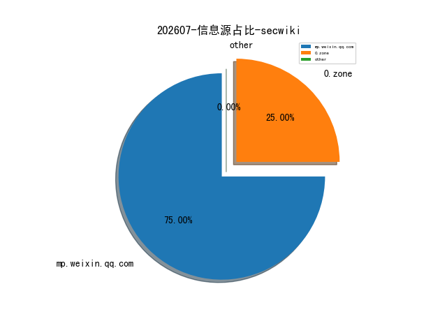
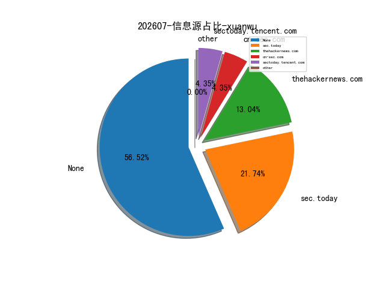

# [数据--所有](README_20.md)
# [数据--年度](README_2026.md)
# 202607 信息源与信息类型占比

# 网络安全书籍 推荐
| date_added | language | title | author | link | size| 
| --- | --- | --- | --- | --- | ---| 
| 2026-07-16 17:22:43 | English | Microsoft Security Operations Analyst Exam Ref SC-200 Guide, 2nd Edition | unknown | https://www.wowebook.org/microsoft-security-operations-analyst-exam-ref-sc-200-guide-2nd-edition/ | unknown| 
| 2026-07-16 15:05:10 | English | Ultimate AI Agent Development with Semantic Kernel | unknown | https://www.wowebook.org/ultimate-ai-agent-development-with-semantic-kernel/ | unknown| 
| 2026-07-16 14:20:25 | English | Ultimate Kubernetes Virtualization with KubeVirt | unknown | https://www.wowebook.org/ultimate-kubernetes-virtualization-with-kubevirt/ | unknown| 
| 2026-07-11 20:52:43 | English | Python for Algorithmic Trading Cookbook, 2nd Edition | unknown | https://www.wowebook.org/python-for-algorithmic-trading-cookbook-2nd-edition/ | unknown| 
| 2026-07-09 20:59:57 | English | Advanced Blazor Architecture with .NET 10 and Azure OpenAI | unknown | https://www.wowebook.org/advanced-blazor-architecture-with-net-10-and-azure-openai/ | unknown| 
| 2026-07-09 17:33:11 | English | Databricks Certified Generative AI Engineer Associate Study Guide | unknown | https://www.wowebook.org/databricks-certified-generative-ai-engineer-associate-study-guide/ | unknown| 
| 2026-07-09 17:11:27 | English | Data Analytics Toolkit: From Excel to Python, R, and Tableau | unknown | https://www.wowebook.org/data-analytics-toolkit-from-excel-to-python-r-and-tableau/ | unknown| 
| 2026-07-09 16:31:53 | English | Python & AI For Dummies | unknown | https://www.wowebook.org/python-ai-for-dummies/ | unknown| 
| 2026-07-04 06:29:54 | English | Generative AI for Business Innovation | unknown | https://www.wowebook.org/generative-ai-for-business-innovation/ | unknown| 
| 2026-07-02 20:18:45 | English | LLMs for Modern Software Delivery and DevOps | unknown | https://www.wowebook.org/llms-for-modern-software-delivery-and-devops/ | unknown| 
| 2026-07-02 19:43:42 | English | Hands-On Image Processing and Computer Vision with Python, 2nd Edition | unknown | https://www.wowebook.org/hands-on-image-processing-and-computer-vision-with-python-2nd-edition/ | unknown| 
| 2026-07-02 19:07:24 | English | Practical LLM Evaluation for Production Systems | unknown | https://www.wowebook.org/practical-llm-evaluation-for-production-systems/ | unknown| 
| 2026-07-01 20:59:05 | English | Multimodal Generative AI in the Enterprise: From Pixels to Profit | unknown | https://www.wowebook.org/multimodal-generative-ai-in-the-enterprise-from-pixels-to-profit/ | unknown| 
| 2026-07-01 19:37:01 | English | AI Under Attack | unknown | https://www.wowebook.org/ai-under-attack/ | unknown| 
| 2026-07-01 16:07:50 | English | Python Automation Cookbook, 3rd Edition | unknown | https://www.wowebook.org/python-automation-cookbook-3rd-edition/ | unknown| 

# 微信公众号 推荐
| nickname_english | weixin_no | title | url| 
| --- | --- | --- | ---| 
| 信息安全动态 | 老张 老张 | 信息安全等级保护培训 | https://mp.weixin.qq.com/s/y41wNvKxQHrm4oFrVU1yaw | 2| 
| 泷羽Sec | 仙草里没有草噜丶 仙草里没有草噜丶 | Ciphey：AI 驱动的自动解密/解码工具，Rust重构版 | https://mp.weixin.qq.com/s/2bA9gOWD75AzCVcRuLpu7Q | 1| 
| 计算机与网络安全 |  | 60页PPT Harness Engneering——驯服Agent：从理论到落地 | https://mp.weixin.qq.com/s/xGUGylMcp5S6aWHPJ4mlBw | 8| 
| CISP |  | CISP培训讲师申请表、维持申请表及管理办法 | https://mp.weixin.qq.com/s/Uoa899_zDUP7BT71BS017A | 2| 
| EversecTechInc |  | 专题报告 , 恒安嘉新网络安全-APT攻击、勒索病毒及互联网漏洞专题分析报告 | https://mp.weixin.qq.com/s/ZHBhcOoiwyZkUCHWuI2ydw | 2| 
| HackSee安全生活 | HackSee安全团队 HackSee安全团队 | Firefox、Chrome、Adobe 和 VMware 更新修复了多项关键安全漏洞 | https://mp.weixin.qq.com/s/Kndq5ayLaknllpu48PedcA | 3| 
| Hx0战队 |  | DeepSentry 2.0.1 正式发布：让 AI 安全 Agent 真正跑进应急现场 | https://mp.weixin.qq.com/s/jsOyLcJORUrLotkCBjGt1g | 1| 
| securitainment | nytrosecurity nytrosecurity | 当 LLM 做了超出职责的事 | https://mp.weixin.qq.com/s/uMIVkBC0z4Fe0FCS2UlKzA | 3| 
| 中国信息安全 | 季川 季川 | 评论 , 让网络测评生态清朗可信 | https://mp.weixin.qq.com/s/h2xRfcEzU-Jb4dvoMksbSQ | 23| 
| 中国网络空间安全协会 |  | 亮点前瞻 , 国家网信办将在2026年APEC数字周期间举办系列活动 | https://mp.weixin.qq.com/s/TvTt9y2mkAzxeQSpUB5GuQ | 1| 
| 云原生安全指北 | Dubito Dubito | 蔚来招聘AI云基础设施安全工程师 | https://mp.weixin.qq.com/s/JZCyqT-oqmQpaY3KOZVaxg | 1| 
| 交大捷普 | None | 精品产品 , 捷普工控等保检查工具箱 | https://mp.weixin.qq.com/s/5ncDO28r_-_yjOYYwqn8dQ | 5| 
| 京东安全应急响应中心 | 邀您参赛的 邀您参赛的 | 2026京麒CTF决赛 倒计时三天！ | https://mp.weixin.qq.com/s/5W7ubcEbSrYJfrKmwTnv4Q | 2| 
| 亿赛通 |  | 企业文档安全最佳实践（四）：集团权限归集与统一管理——横纵立体，密钥定界 | https://mp.weixin.qq.com/s/Sym0sftp4AbYS76RDcBqeA | 1| 
| 信息网络安全杂志 |  | 南京理工大学网络空间安全学院2025级硕士生学术论文被网安领域顶会USENIX Security 2026录用 | https://mp.weixin.qq.com/s/Oltj7xfNfo915i0k4EI4sA | 7| 
| 全球技术地图 |  | 面向2035：人工智能与机器人技术对国家安全的影响 | https://mp.weixin.qq.com/s/NlSCuCuyu7zpEJ1Jyc1M9g | 9| 
| 全频带阻塞干扰 | None | 暗流涌动！某NGO 组织遭遇秘密监视窃听～ | https://mp.weixin.qq.com/s/VyNHk0XVa18yJeXQWR5MgA | 1| 
| 北京路劲科技有限公司 |  | 密评高风险判定指引系列（二）：物理和环境安全与网络和通信安全高风险判定 | https://mp.weixin.qq.com/s/ifEMkQ4W62a6AXOPqGQBvw | 1| 
| 合合信息 | 合合君 合合君 | WAIC 2026 倒计时，合合信息展台亮点前瞻！ | https://mp.weixin.qq.com/s/UNFv5PfMRv36_216PORasA | 1| 
| 天懋信息 |  | 安全快报 , 巴基斯坦多个执法系统遭网络间谍组织恶意入侵 | https://mp.weixin.qq.com/s/Br_vvGO6p3V-4EXDVyODmw | 1| 
| 奇安信安全服务 |  | 2026年5月考试成绩 | https://mp.weixin.qq.com/s/JgSpmgtd4BJTC1ttx0_rNg | 1| 
| 奇安信集团 |  | AI又惹祸了？硅谷大佬Mac遭一键清空，智能体安全再敲警钟 | https://mp.weixin.qq.com/s/se5RbrUn3m7A8fSm8kbWfw | 9| 
| 安全学习那些事儿 |  | 印度最大核电站疑遭勒索攻击 黑客泄露大量文件包括设计图纸 | https://mp.weixin.qq.com/s/RQfGOKOgPPICrIOlWyfwaA | 10| 
| 安在 | 走狗是狗哥 走狗是狗哥 | 进入AI时代，微软为何打算终结“周二补丁日”？ | https://mp.weixin.qq.com/s/VA9yqdgv9yFcMsD5rk4U2A | 10| 
| 安恒信息 |  | 安恒信息党委获评滨江两新组织产业链“攻坚先锋”荣誉称号 | https://mp.weixin.qq.com/s/zlPwQ13QYUIFKt7W9BDTHg | 2| 
| 工联安全众测 |  | 工联安全大讲堂第三十七期即将开讲！ | https://mp.weixin.qq.com/s/0KGOY3Tjqj2SJWPLUuBvWw | 2| 
| 微步在线 |  | 最后一站，上海！CSOP2026·AI安全大会完美收官 | https://mp.weixin.qq.com/s/v96sdbxZWhO5rg6ImY4MCQ | 2| 
| 恒星EDU |  | 西湖论剑×阿里云：大赛在即，专属AI算力支持已就位 | https://mp.weixin.qq.com/s/Ei-Tk5U10LPAOGorPVpVIA | 2| 
| 情报分析师 | FF FF | 【情报分析】伊朗前总统艾哈迈迪内贾德为何被指认被摩萨德招募？ | https://mp.weixin.qq.com/s/5sl2G1eN2j_ocbuVV4i_dg | 8| 
| 慢雾科技 | 慢雾安全团队 慢雾安全团队 | 数码港 Web4.0 与智能体安全联盟成立，慢雾(SlowMist) 出任创始成员 | https://mp.weixin.qq.com/s/cy3qCJYBJTa-BPWUzyNeEg | 1| 
| 海蜃 |  | 深度技术_AI_Agent_智能体_安全__2026年最值得学习的网络安全新方向 | https://mp.weixin.qq.com/s/SJgedmH1bovvjYZCat2ntw | 1| 
| 深圳网安培训学院 | 啊斋 啊斋 | 关于优化数据分析师人才培养及考核的通知 | https://mp.weixin.qq.com/s/BCoumtgJYpJ__wRXS9twbw | 1| 
| 渗透笔记 | Mc Mc | DOUBLETROUBLE: 1靶场实战 | https://mp.weixin.qq.com/s/lksrrlQa7i43nNHaoarxHg | 1| 
| 漏洞战争 | 漏洞战争 漏洞战争 | USENIX Security 2026 — Cycle 1 论文清单与摘要（下） | https://mp.weixin.qq.com/s/WBMkwRnFP0MX-nNHtqP2pA | 2| 
| 漏洞盒子 | None | 挖洞，再挖点Token！ | https://mp.weixin.qq.com/s/ZQ5SkcIfB7vOeYxKuxGFYw | 1| 
| 百度安全应急响应中心 |  | 【更新】BSRC业务系数调整！产品线范围更清晰！ | https://mp.weixin.qq.com/s/MnOmDMLgIE6iC9f03p8uOg | 1| 
| 网安国际 |  | 文末抽奖｜南开大学2026 DataCon AI安全夏令营正式开启！顶尖高校+头部大厂大咖齐聚！ | https://mp.weixin.qq.com/s/ssARsOH3pcmREL4piYh8cg | 1| 
| 网安培训 |  | 招聘｜中国网络安全审查认证和市场监管大数据中心2026年度公开招聘公告 | https://mp.weixin.qq.com/s/Dugl86clsPIGN-zp1jQm3Q | 1| 
| 网易智企-易盾 | AI驱动的 AI驱动的 | 现场直聘，为您的业务招募一位“企业级智能伙伴”｜WAIC 2026 | https://mp.weixin.qq.com/s/UD7kQKRQB_83tsySK2fYNg | 2| 
| 网络安全备忘录 | 网络安全备忘录 网络安全备忘录 | 交通运输部印发《交通运输数据安全管理办法》（附全文） | https://mp.weixin.qq.com/s/hTi2FVYnaMnIDNKa713sBA | 1| 
| 网络安全老宋 | 宝十八 宝十八 | 渗透测试从业者的新工具 潜影 TraceHarvest | https://mp.weixin.qq.com/s/wRyYs_Mtn22GfKHEQtzexg | 2| 
| 网络空间信息安全学习 |  | Listary V7 Beta 发布！本地文件搜索体验全面进化 | https://mp.weixin.qq.com/s/udoNSJuGzWFLhgYD9OKijQ | 1| 
| 聚铭网络 |  | 一年花掉400小时登陆设备，这笔运维账没人算过！ | https://mp.weixin.qq.com/s/YDgLkRjxf7moKjg3jQP_ZQ | 2| 
| 腾讯技术工程 | 腾讯技术工程 腾讯技术工程 | 腾讯PCG联合深圳河套学院：在全双工语音大模型领域取得重要突破，获 ACL 2026 杰出论文奖 | https://mp.weixin.qq.com/s/d7TgHluCVmGM90Rjjny0Mw | 2| 
| 自主创新如是说 |  | 巾帼聚力筑数据根基，智赋企业启数字新程｜《高质量数据集构建与应用》专项培训圆满落幕 | https://mp.weixin.qq.com/s/OHBmMqFLEnHafu1OgUXpCQ | 1| 
| 苏州信息安全法学所 |  | 苏州市召开商用密码应用与执法业务培训研讨会 | https://mp.weixin.qq.com/s/Hwkhg6pV7G6Gfx6qrf1nhg | 2| 
| 蚂蚁安全响应中心 |  | AntSRC 年度 TOP8 白帽榜单正式公布，致谢每一位安全同行者 | https://mp.weixin.qq.com/s/Uwk13Yps3Y05V0DRJB6Kdg | 1| 
| 西湖论剑网络安全技能大赛 |  | 西湖论剑×阿里云：大赛在即，专属AI算力支持已就位 | https://mp.weixin.qq.com/s/wYUTVMGgyE18KXNnS6Y5_Q | 1| 
| 进击的HACK |  | 开源 AI Hacker 工具 strix | https://mp.weixin.qq.com/s/ChcAZ42hEL4B3n1SVlaerA | 4| 
| 长亭安全观察 |  | 增速第一！长亭科技跃升中国暴露面管理市场前三 | https://mp.weixin.qq.com/s/PF7dECO0089Wy_GzrC5KDQ | 2| 
| 黑客茶话会 | None | 教育行业SRC供应商漏洞变化 (2026-07-16) | https://mp.weixin.qq.com/s/-2A5Sscw0Y0eAj-4f6eUaw | 4| 
| 黑白之道 |  | 用AI分析Wireshark 数据包 一切变得很简单 | https://mp.weixin.qq.com/s/AYxik2PgkiDOEmLvvmzv8w | 6| 
| AI赋能汽车 |  | 地平线机器人：关键转折期的平台型标的机遇 | https://mp.weixin.qq.com/s/wrAWlQ-Gc3Xes1he-gwnng | 4| 
| CyberSecurityDaily |  | 网络安全日报 , 2026-07-15 | https://mp.weixin.qq.com/s/5i0uzkCgYM2QiPvZDojRRQ | 2| 
| DX安全实验室 |  | 全域项目充足｜长期驻场 / 短期冲刺岗位同步招募 | https://mp.weixin.qq.com/s/qiBRbP_yztk9VG_FM2RIYA | 1| 
| DataCon大数据安全分析竞赛 |  | 重磅招募｜南开大学2026 DataCon AI安全夏令营正式开启！顶尖高校+头部大厂大咖齐聚！ | https://mp.weixin.qq.com/s/Yzz75DnZM3dWA6Ums9dK1w | 1| 
| EDUSRC |  | 2026湖北大学招聘非编特岗人员公告（网安岗） | https://mp.weixin.qq.com/s/4-vgDF8ZllJljWZLH08dsQ | 2| 
| IoT物联网技术 | ~ ~ | 从封闭孤岛到开放协同，传统 SCADA/HMI 与现代开源 AIoT 工业物联网平台的较量，插件式架构，兼容 Modbus、OPC、MQTT 协议 | https://mp.weixin.qq.com/s/HxHvXuVVzvm5j1x-rLkgdQ | 6| 
| Khan安全团队 |  | sci论文一直投不中？大牛帮指导选刊投稿返修后，被拒的SCI全中了！ | https://mp.weixin.qq.com/s/ObFjFagSst3qSe6kW6ziuA | 6| 
| TtTeam |  | 威胁预警：不法站点借 2026 世界杯开展非法转播与恶意软件分发攻击 | https://mp.weixin.qq.com/s/Jk4mxd1paP6H79dqrQswbQ | 2| 
| X黑手 | None | kalidroid在手机上运行kali linux无需root | https://mp.weixin.qq.com/s/sWEKEhToNLqlpdFXyEXdwA | 1| 
| solar应急响应团队 | None | 【勒索预警】新勒索家族 OROVA 出现 | https://mp.weixin.qq.com/s/2X-2kkZREyqKVBQeDxSVVg | 1| 
| 丁爸 情报分析师的工具箱 |  | 【竞赛通知】第四届全国大学生开源情报数据采集与分析挑战专项 | https://mp.weixin.qq.com/s/ahGzvJGIWtdMZLK-OD992g | 6| 
| 中资网安 |  | 热点速览 , 每周网安大事件（20260706-20260713） | https://mp.weixin.qq.com/s/IZEyDGXml2vMwCLnZeEOgA | 1| 
| 亚信安全 | 你信任的 你信任的 | 116领域获认可｜亚信安全入围第五期《数字安全护航技术能力全景图》 | https://mp.weixin.qq.com/s/o0kEnz-7mTbukj-Wg4-JcQ | 2| 
| 信息安全与通信保密杂志社 | Cismag Cismag | 全国首批、级别最高！天融信获AI服务安全能力评定“建设+检测”双证 | https://mp.weixin.qq.com/s/OdQWtRINjVVN-6AJASOliw | 4| 
| 信息安全最新论文技术交流 |  | 中国科协 , 2026重大科学问题、工程技术难题和产业技术问题 | https://mp.weixin.qq.com/s/SK1VkiZE1SJXhUtngyAgeQ | 2| 
| 信息安全研究 |  | 动态｜《中国互联网发展报告2026》正式发布 | https://mp.weixin.qq.com/s/lrfR5LQVemefTyxc6MpdEA | 9| 
| 公安部网安局 | None | 法治在线：网警严打涉汛等涉灾网络谣言 | https://mp.weixin.qq.com/s/f9u4-PH_YqPMM7lFDGl5Rg | 11| 
| 内生安全联盟 | 第一财经 第一财经 | 科技 , 宇树机器人首次操刀活体手术 | https://mp.weixin.qq.com/s/--g4vKaIJE8gD1FbGBwUSQ | 6| 
| 助安社区 | Ravie Lakshmanan Ravie Lakshmanan | 本周回顾：ShareFile 威胁、Citrix Bleed 2 勒索软件、AI 编码攻击及更多 | https://mp.weixin.qq.com/s/KMwKIf6-BVNz8_NmkthZ0w | 1| 
| 华顺信安威胁情报中心 |  | 【热点安全风险】7月15日 , Microsoft正在将更多AI辅助发现的安全修复纳入Patch Tuesday节奏 | https://mp.weixin.qq.com/s/dUwT_0wXTy91V4pGLxTkYw | 2| 
| 君说安全 |  | 行业资讯：安恒核心技术人员发生调整 | https://mp.weixin.qq.com/s/fbcVitxPsFBEpIE0Wd4cpA | 2| 
| 启明星辰安全简讯 |  | 【漏洞通告】微软7月多个安全漏洞 | https://mp.weixin.qq.com/s/UQzh3uPTGijQy9-lwA2TIA | 7| 
| 国舜股份 |  | 57项细分领域：国舜科技实力登榜信通院第五期《数字安全护航技术能力全景图》 | https://mp.weixin.qq.com/s/YwrMVXKN-t6q380EvfqCAQ | 1| 
| 国际云安全联盟CSA上海代表处 |  | 警惕！图片藏毒，AI代码审查被绕过：CSA揭秘GhostCommit新型供应链攻击 | https://mp.weixin.qq.com/s/5kcQecKD_3hzuZ6QsdUEUQ | 2| 
| 夜组安全 | EthanOK EthanOK | Web3智能合约安全漏洞检测工具 | https://mp.weixin.qq.com/s/ylUhqNEMjPDfS4lul9peig | 2| 
| 天创培训 | 天创培训 天创培训 | 持证刚需｜CISP-AISS第二期8.26开班，席位抢先锁定 | https://mp.weixin.qq.com/s/387FbG-43SIGfGJFEWkcmw | 1| 
| 天融信 |  | 天融信：构建“自制-自知-自治”数据安全闭环，让AI搭子更靠谱 | https://mp.weixin.qq.com/s/oGPJwLymSerumsp9lIRJ1Q | 7| 
| 天融信安全漏洞响应中心 | TOPSRC TOPSRC | TOPSRC 2026年第二季度奖励公告 | https://mp.weixin.qq.com/s/I05iSfv77wVUOjIWerDc8A | 1| 
| 奉天安全团队 | None | 【NCC合作招募】安全众测即将上线，诚邀种子企业共筑网安防线！ | https://mp.weixin.qq.com/s/ZdYvWi3qIC2Sj0pEbXcLLw | 1| 
| 安全内参 |  | “金鹰计划”启动：美国政府依托前沿AI构建漏洞发现与修复协同体系 | https://mp.weixin.qq.com/s/DVNwLvLl4uFB-nhPshsU8A | 8| 
| 安全牛 |  | 2026年9月起Microsoft Entra ID将通行密钥设为默认认证，逐步淘汰短信语音MFA；美国国防部暂停网络安全成熟度认证第二阶段强制审核, 牛览 | https://mp.weixin.qq.com/s/O9lOOxMRce4BlfbkBNOqMw | 8| 
| 安全牛科技 | 河南省工信安联盟 河南省工信安联盟 | 会员单位推介系列丨河南省德备通信科技有限公司 | https://mp.weixin.qq.com/s/FNEPLgVq7TeHH0xKakTUVQ | 1| 
| 安全狗的自我修养 | None | mumu模拟器没得账号只能脱机用了 | https://mp.weixin.qq.com/s/amhaY3XySeQp8dWR06LcnQ | 2| 
| 小草培养创研中心 |  | 校企合作｜西安科技大学师生莅临四叶草安全开展专业认知实习 | https://mp.weixin.qq.com/s/K9oZQ4I8mSyORuDPebt51w | 1| 
| 工业安全产业联盟平台 |  | 安全可控丨工信部等四部门印发《关于推动互联网基础资源高质量发展的指导意见》 | https://mp.weixin.qq.com/s/uU4SX92vXCgRtCewWSqCTw | 5| 
| 常行科技 |  | 十二年，正青春 , 常行科技2026年中会议暨十二周年庆典圆满举行 | https://mp.weixin.qq.com/s/oCe8mm_4lVJmWOW7ST_VtA | 1| 
| 快手安全应急响应中心 |  | 快手账号专测启动！｜最高20万奖励 | https://mp.weixin.qq.com/s/VTYsGbQVFQXsKiP8mXYHFg | 1| 
| 悟安 | 慧等保 慧等保 | 合规先行、安全可控：大模型与 AI 智能体安全检测全流程解析 | https://mp.weixin.qq.com/s/J4h_4TBfMx0L-MjTtwOWIQ | 1| 
| 掌控安全EDU | 掌控者 掌控者 | 7月社区投稿活动 , 漏洞挖掘/AI渗透 | https://mp.weixin.qq.com/s/OX6LBRFhJwuAeTW17sd_7w | 5| 
| 探知安全 |  | 7月15日高危CVE漏洞速报 | https://mp.weixin.qq.com/s/Glwk6X_Akq3BtXaUeSslkQ | 1| 
| 搞安全的面具侠 | 搞安全的面具侠 搞安全的面具侠 | hvv 2026 - 今年攻防演练的新变量：WAF 看不见，后端却执行了 | https://mp.weixin.qq.com/s/IGYpjaeqhJZvuYHb-HcYmw | 1| 
| 无糖反网络犯罪研究中心 | 向网络犯罪开炮的 向网络犯罪开炮的 | 从情报实战到研判实战，第二期火力全开！, 第三期报名中 | https://mp.weixin.qq.com/s/5t_4oY_84JTuZAP-5-DCMw | 1| 
| 梓陌说科技 |  | iPhone自带功能查台风路径！不用下载APP，实时看动向 | https://mp.weixin.qq.com/s/O81a0QY5WtdiWVtuOReXHQ | 7| 
| 棉花糖网络安全工具箱 | 棉花糖糖糖 棉花糖糖糖 | 史诗级安全扫描工具降临！4900+漏洞覆盖重新定义安全边界 | https://mp.weixin.qq.com/s/UTmUPTETr9bT-395dX8vEw | 5| 
| 武汉网络安全 |  | 理事动态 , 达梦数据×海光信息×新华三×麒麟软件×新开普联合发布xa0教育行业全栈国产一体化解决方案 | https://mp.weixin.qq.com/s/1kzTFfPSikj3RJi_xQ7csg | 8| 
| 汇能云安全 |  | 370 万个假 OAuth ID 扫描 200 万企业用户：微软身份系统的信息泄露攻击 | https://mp.weixin.qq.com/s/Ecx-8QcOfyaJO-MDYJmhIw | 3| 
| 河南等级保护测评 |  | 传统培训体系正在失效，当员工成长速度超越组织学习能力 | https://mp.weixin.qq.com/s/wTGx0jdPhesbyAj2YUCTZA | 3| 
| 洞见网安 | AJay13 AJay13 | 网安原创文章推荐【2026/7/14】 | https://mp.weixin.qq.com/s/HhLRg7a09K2sN3ael-Z5aA | 3| 
| 深信服科技 |  | 从“安全债”到“安全资产”，发电企业网安运营有了“尺子”——解读发电行业网络安全成熟度模型团标 | https://mp.weixin.qq.com/s/CiKcI5lvgLuLvVOmqr1FQg | 3| 
| 湖南金盾评估中心 | 湖南金盾 湖南金盾 | 2026 密码技术应用员四级考试即将启动 | https://mp.weixin.qq.com/s/51CQe7b_NxXf8OmdjojuXQ | 1| 
| 猎洞时刻 | NCC安全云社区 NCC安全云社区 | NCC合作招募】安全众测即将上线，诚邀种子企业共筑网安防线！ | https://mp.weixin.qq.com/s/xp3zp0KDFQvKvNNBKjAmiw | 1| 
| 玄道夜谈 | None | 分享图片 | https://mp.weixin.qq.com/s/OIH3I7uQAxD7HmoaqHCb6g | 6| 
| 白安全组 |  | 腾讯冠军+阿里前四，这次他把实战经验搬上了WAIC讲台 | https://mp.weixin.qq.com/s/VGKaoat3DVeMd1Hdzr3AGQ | 1| 
| 白帽子 |  | 微软认证的UEFI引导程序，反倒成了绕过安全启动的捷径 | https://mp.weixin.qq.com/s/j0E951MGgS3fuTLyVjeb-g | 3| 
| 百度安全 |  | 《国家网络身份认证公共服务管理办法》实施一周年 筑牢数字屏障守护公民个人身份信息安全 | https://mp.weixin.qq.com/s/rci2XoTokL0YL6D_E-EIXg | 2| 
| 盛邦安全WebRAY |  | 信关站揭秘：卫星互联网如何接入地面骨干网？ | https://mp.weixin.qq.com/s/p8dvy0-ncwrNDkh071TFcA | 4| 
| 神州希望网络安全 |  | 一封来自海南国际商业航天发射有限公司的感谢信 | https://mp.weixin.qq.com/s/fcraUM4lhdKxzmyxcDWvwA | 1| 
| 红客攻防实验室 |  | 72小时全球黑客狂欢，APT+勒索+0Day齐炸 | https://mp.weixin.qq.com/s/4OFzggw7m5k8bBG9yzcsRg | 1| 
| 网安鲲为帝 | None | 零成本搭建AI短剧全流程工作台🔥 | https://mp.weixin.qq.com/s/QYY-c6HEZ2W_GoJa4NVY_A | 2| 
| 网络侦查研究院 | 子午猫 子午猫 | 成都公安亮剑专项行动公布十大典型案例，抓获电信诈骗5148人，追赃挽损1875万元 | https://mp.weixin.qq.com/s/U7iVVrpA7DDJlqCQZYXcQw | 9| 
| 网络安全和信息化 |  | 国家网信办发布7款提供手机端侧生成式人工智能服务已备案信息 | https://mp.weixin.qq.com/s/2RrsYSW0nITft0ZzawmCkg | 7| 
| 网络空间安全科学学报 |  | 中国科协发布 , 2026前沿科学问题 | https://mp.weixin.qq.com/s/CVu4dN7dod0J-O1cSHoRfw | 1| 
| 腾讯安全 |  | 腾讯云 x 万得：为万得AI构筑三层安全防线 | https://mp.weixin.qq.com/s/-BKWJ3zJMcyUzUute1dkMg | 1| 
| 船山信安 | None | 我们的团队一直在努力！ | https://mp.weixin.qq.com/s/ChbpVGsoIH-rkh38S_R8KQ | 4| 
| 苏说安全 |  | CNNVD通报OpenClaw多个安全漏洞 | https://mp.weixin.qq.com/s/6ORZfXD31yoXd1F89Wljgg | 4| 
| 补天平台 |  | 7 月补天战神榜开启！赏金发放，荣誉就位！ | https://mp.weixin.qq.com/s/2b30HVMUPZDbBe64tULdXQ | 1| 
| 观安信息 |  | 共探十五五数智防护路径｜观安信息亮相中国互联网大会 分享AI安全实践 | https://mp.weixin.qq.com/s/Er2aCCYH4Zg4tGvXzuK63g | 2| 
| 谈思实验室 |  | 超高级别中欧盛会，震撼来袭！Humanoid Europe中欧人形机器人与物理AI科技大会定档11月慕尼黑 | https://mp.weixin.qq.com/s/ZlnP9O_GQYCWmT44z0MbrQ | 9| 
| 赛查查 |  | Al x Cybersecurity Challenge香港人工智能网络安全挑战赛wp(Miscellaneous全) | https://mp.weixin.qq.com/s/W_Ee-Uvqe74g3HglMWvDqg | 24| 
| 铁军哥 | 衡水石头哥 衡水石头哥 | 通过UDP/IP上的MPLS实现确定性网络（DetNet）数据包复制、消除和排序功能（PREOF） | https://mp.weixin.qq.com/s/5Ue2Ukvv48z6c1DGY_svLA | 4| 
| 陌笙不太懂安全 | NCC NCC | 【NCC合作招募】首批安全众测项目即将上线，诚邀种子企业共筑网安防线！ | https://mp.weixin.qq.com/s/y7MtVGRK1nFUEBkB3zdemw | 4| 
| 青藤云安全 |  | 青藤 AI 夏令营：孩子们 5 天造出属于自己的 AI 作品 | https://mp.weixin.qq.com/s/C2euJmdqWUPSMVY5D4SSGA | 2| 
| AI安全工坊 | AI安全工坊 AI安全工坊 | 你为 AI 付的第二笔钱，才是最贵的 | https://mp.weixin.qq.com/s/l3z1jsFYMrGxD3Ajsb6-dw | 2| 
| AI技术笔记 | gemini gemini | Gemini 正式进入 AI 办公时代：Google 正在打造自己的 Copilot | https://mp.weixin.qq.com/s/Q7NfBm550k5zkcy3Ngz1pQ | 9| 
| AI紫队安全研究 | AI紫队安全研究 AI紫队安全研究 | 重磅预警！去中心化黑客集群Scattered Spider来袭：不靠0day，一通电话就能拿下企业全网 | https://mp.weixin.qq.com/s/7tjMZKbnQ-3IKMCTHjo2rg | 4| 
| BeatRex网安AI观测站 | BeatRex BeatRex | 网安AI速报 , 2026.07.14 | https://mp.weixin.qq.com/s/idHsMyCyZly0P5Z6XII3RA | 2| 
| C4安全 | Yhsec Yhsec | [AI]Claude + Skills 自动漏洞挖掘 | https://mp.weixin.qq.com/s/Suse7SDHzmHToDp59O8RvA | 1| 
| CUIT网络空间安全学院 |  | 【资警反诈】同学，请查收这份《大学生防诈必备清单》，有点长，但很管用！ | https://mp.weixin.qq.com/s/-g2B3W9enZBoJZmu3wQPuw | 4| 
| CppGuide |  | 推荐两个远程控制开发专栏 | https://mp.weixin.qq.com/s/t4ZK7SCQFo--drTZTAf5pA | 1| 
| DARKNAVY | deepsec deepsec | deepsec 攻防实录｜AI 黑客如何突破无人机安全边界？ | https://mp.weixin.qq.com/s/G9xRKZmrS_AKB8AKmoutXg | 1| 
| EnhancerSec |  | AI漏洞挖掘：我的一些感想 | https://mp.weixin.qq.com/s/9GljM5jXaRDKFCxHLyMGPA | 1| 
| FreeBuf |  | 新型macOS窃密软件伪装苹果崩溃报告框架，窃取浏览器凭据 | https://mp.weixin.qq.com/s/SULZH1huDJwVaygrt3WG6A | 18| 
| FreeBuf知识大陆APP | None | 直播预告：红队眼中的“Mythos攻破NSA”... | https://mp.weixin.qq.com/s/2RR7mWI_V0CebfyRVpxRLw | 2| 
| GGDog Sec | GGDog Sec GGDog Sec | 今日你的校招体验身份：一名被争抢的红队大佬(附实习校招交流群) | https://mp.weixin.qq.com/s/TWNeJTETiuoQxtl8gKpAIA | 3| 
| GTG网络安全实验室 | GTG-Hardy GTG-Hardy | 重磅澄清！欧盟CRA新规：提前研发的老产品型号，2027年后不能随便量产了 | https://mp.weixin.qq.com/s/lJPX5A5iSgi551DBbc_1hA | 2| 
| HACK之道 | 手术刀 手术刀 | 信息收集边缘资产挖掘大全（两万字奶爸级教程） | https://mp.weixin.qq.com/s/9ARKAyMW1t0rPXYcMPiW0Q | 2| 
| Hacking黑白红 | hacking hacking | 副局长\"手搓\"AI小程序火了！用腾讯WorkBuddy写代码，10亿token只花20多块？ | https://mp.weixin.qq.com/s/AchTY5JiT7hBP2DKoX3-8A | 3| 
| ISC2网络安全 | ISC2 China ISC2 China | 【活动预告】ISC2西南分会云讲坛：AI 安全运营专场 | https://mp.weixin.qq.com/s/FTayKOt9G0FA0eh50y6UvA | 1| 
| MessFreeSecurity | MessFeel MessFeel | hvv 2026 - 不是 Potato：攻击者如何冒充一个不存在的 RPC 服务，坐等 SYSTEM 上钩 | https://mp.weixin.qq.com/s/V244PJ7dAZvavTeWWlLKkA | 7| 
| Ots安全 |  | CVE-2026-42989：Windows 10 1607 权限提升漏洞 + POC | https://mp.weixin.qq.com/s/BBFHM1gaxGrL6LtM51oe4A | 6| 
| SecLab安全实验室 | Zero老Z Zero老Z | 对不起，要得罪一些人了：别从 Paper IE 学成 Paper Hacker | https://mp.weixin.qq.com/s/BUyh50EcDVk1WOd2j9GIgA | 1| 
| YY的黑板报 | adra1n adra1n | 开源一个 OTP 管理工具-口令盒子 | https://mp.weixin.qq.com/s/OlO3O15u_U-CrH6VDt-ASQ | 2| 
| e安在线 | e安在线 e安在线 | 苹果起诉OpenAI使用技术手段窃取商业机密 | https://mp.weixin.qq.com/s/xe8t2wNWKat2PmoaAYFyvA | 1| 
| freedom安全 | cc cc | 自写c2单文件对抗EDR | https://mp.weixin.qq.com/s/GcZfx6eA8Ia3Cnv3uymbhg | 1| 
| 一己之见安全团队 | 这小子嘴硬 这小子嘴硬 | 网安薪资分布：杭州篇 | https://mp.weixin.qq.com/s/OlFWjoq89BRmqgRTcxUQOQ | 3| 
| 上海等保测评 | 保保顾问 保保顾问 | 上海企业等保定级，为什么多数人的\"第一级\"一开始就定错了 | https://mp.weixin.qq.com/s/OGfq-np8MMgupRu8iRxo9Q | 3| 
| 中国电信安全 |  | 省专协同 聚力赋能 , 海东青雄鹰计划训练营（第三期）·京沪江浙圆满结营 | https://mp.weixin.qq.com/s/4YJQd4Jk7qbJEGqGDfL_bQ | 3| 
| 乌雲安全 | 新智元 新智元 | GPT-5.6被曝重大bug！ | https://mp.weixin.qq.com/s/alpdchhI_NeSu1gXgZRpQg | 3| 
| 云南启安科技 | 云南启安 云南启安 | Windows HTTP.sys 整数溢出漏洞(CVE-2026-47291) | https://mp.weixin.qq.com/s/1n8RZtRK8p51VyUdPDt8-Q | 1| 
| 代码卫士 | Bill Toulas Bill Toulas | 日本最大的出租车运营商因遭网络攻击被迫关闭系统 | https://mp.weixin.qq.com/s/2YBdlXQXaqW_GRNZtG3N-w | 4| 
| 信安之路 | xazlsec xazlsec | 课程中心上线了 | https://mp.weixin.qq.com/s/rHtONMpALUBdhigo6TArpA | 1| 
| 倬其安 | Hash先生 Hash先生 | 企业AI系统攻击面梳理与防护落地思路 | https://mp.weixin.qq.com/s/k75P0T4Few0xjGsVBV8TjQ | 1| 
| 像梦又似花 | CyberSecGuy CyberSecGuy | 全网首发:RUST开发对接SAP系统RFC接口 | https://mp.weixin.qq.com/s/h23BUYdklDb2er9g--NQRg | 1| 
| 六边形攻防安全 | 网安布道师 网安布道师 | 黑名单不是防火墙 六边形靶场 RCE 中篇：disable_functions、分隔符、空格绕过 | https://mp.weixin.qq.com/s/81skvRTYVKysNO_n32UKfQ | 3| 
| 利刃信安 | None | 一文读懂 GM/T 0031-2025《安全电子签章密码技术规范》 | https://mp.weixin.qq.com/s/wqp_Ht5OlU_hDIZ_1t1-GA | 6| 
| 北京昊网网络安全与数字化服务 | 北京昊网 北京昊网 | 招聘需求,2026年7月14日 | https://mp.weixin.qq.com/s/gui6J61u8pnPap1ClC2IMg | 1| 
| 升斗安全 | 升斗安全XiuXiu 升斗安全XiuXiu | 赏金猎人的SameSite扫盲贴：别再因为看不懂Cookie错失漏洞 | https://mp.weixin.qq.com/s/VuGIzzxWTwwGBPHOdLzSbw | 3| 
| 卡巴斯基威胁情报 | 卡巴斯基 卡巴斯基 | 仅核查网址远远不够：利用微软官网实施的设备代码钓鱼攻击 | https://mp.weixin.qq.com/s/weTIK84gE49scv77GgfYOQ | 3| 
| 卡布奇诺的派对 | 卡布奇诺的派对 卡布奇诺的派对 | 【基于带外检测的SSRF盲注 —— PortSwigger“Blind SSRF with out-of-band detection”完整通关指南】 | https://mp.weixin.qq.com/s/R57bIS0NrV04PdOMC8jEJg | 2| 
| 可信安全 |  | 《智能体零信任发展洞察》行业调研报告启动！ | https://mp.weixin.qq.com/s/UzGIaCc8C1bR6fGJDZF8lg | 2| 
| 君陌社区渗透安全笔记 | 君陌社区 君陌社区 | CTFHub：第八十五关——JSON Web Token——修改签名算法 | https://mp.weixin.qq.com/s/dEEnp5bfuWxaK4fmJDQjKw | 3| 
| 哆啦安全 | 云天实验室 云天实验室 | Pixel8 Android15刷机方法(一键刷机脚本) | https://mp.weixin.qq.com/s/x84GlP1LCOWrWXxSQ4TQPg | 3| 
| 国家网络安全通报中心 |  | 《国家网络身份认证公共服务管理办法》实施一周年——筑牢数字屏障  守护公民个人身份信息安全 | https://mp.weixin.qq.com/s/07SWe_v_2SzKTgP4UrpCuA | 1| 
| 国家网络空间安全云社区 | 王全洲 王全洲 | AI赋能Jadx静态分析APK代码实战指南 | https://mp.weixin.qq.com/s/IpecR0YXm7C7T3JD0KSLXw | 1| 
| 国瑞电磁空间安全实验室 | 大佬刘 大佬刘 | 【设备】用好设备，杜绝偷录！—GR-120防录音屏蔽器 | https://mp.weixin.qq.com/s/LlEllm7JCuJxxwu94_S8Ig | 1| 
| 夜组OSINT | NightTeam NightTeam | 伊朗伊斯兰革命卫队（IRGC / Sepah）的人事与财务机密文件泄露 | https://mp.weixin.qq.com/s/6hSEcH93cZgGVCkI2obh7w | 1| 
| 天威诚信 | 数字信任云服务商 数字信任云服务商 | 邀请函 , 天威诚信邀您出席“人工智能+招标采购”共享共建交流研讨会 | https://mp.weixin.qq.com/s/7-U9o0b8f59rGT7bW4R81g | 1| 
| 天御攻防实验室 | 天御 天御 | 澳大利亚信号局与Anthropic公司签署三份合同 | https://mp.weixin.qq.com/s/e6PqRre3UZq7qE9rvU8unQ | 1| 
| 奇安信威胁情报中心 | 威胁情报中心 威胁情报中心 | 连自己的GitHub都管不好：CISA的844MB凭据泄露，给全行业上了一堂公开课 | https://mp.weixin.qq.com/s/nqg1NXriBJakmyMu6nfuZA | 2| 
| 奇安网情局 | 奇安侦察兵 奇安侦察兵 | CMMC政策急转弯：美国国防部在网络安全与国防工业扩张间寻求新平衡 | https://mp.weixin.qq.com/s/t0wb7A7ST6I72DtczhLBUA | 1| 
| 好靶场 | Elon Elon | 祝贺“江思澄”师傅获得”第十届御网杯——（一等奖） | https://mp.weixin.qq.com/s/j2DI8x8_ZbC9gD4thSJGBg | 1| 
| 字节脉搏实验室 | tcode tcode | 你点了“允许”，不代表你看见了真实风险：AI 编程助手的信任边界该重画了 | https://mp.weixin.qq.com/s/jZk_C34f7a3hjpbEpsJdyA | 8| 
| 安世加 |  | PCI DSS 从入门到实践（上）：一分钟看懂支付行业最重要的安全标准 | https://mp.weixin.qq.com/s/PYlVn4ng-C9amzobpNqLMw | 1| 
| 安全419 | 安全419 安全419 | 微步在线薛锋：攻击者迈入“工业化” 防守方亟待走出“农业时代” | https://mp.weixin.qq.com/s/0Ioq8ZlUtUaWfg9CQZBNtg | 3| 
| 安全info | We12 We12 | 圈内悄悄火了！一年省下数万元，网安都在用的数据分类分级系统 | https://mp.weixin.qq.com/s/tC7FOG_WMXyXTNFKkC0ukQ | 2| 
| 安全分析与研究 | pandazhengzheng pandazhengzheng | 周星驰，我唯一的偶像 | https://mp.weixin.qq.com/s/-fSwSIHOSd5HR797NyZhUg | 4| 
| 安全喵喵站 | Z-ONE Z-ONE | 跨越山海，征战全球：Z+ 中国网络安全科技全球加速营·2026届·申请开启 | https://mp.weixin.qq.com/s/XtU-sT-pyqiaXHnFwJhbeA | 4| 
| 安全圈 |  | 【安全圈】一封邮件就能让AI\"失忆\"并被操控：MemGhost攻击曝光 | https://mp.weixin.qq.com/s/KLH3VwGAPD7kr2k7badLSA | 11| 
| 安全圈的那点事儿 | 网络安全9527 网络安全9527 | 微软将三条 Salesforce 攻击路径与 ShinyHunters 一年的活动联系起来 | https://mp.weixin.qq.com/s/CfNbH_ZV7nOgeUhW6C1PBg | 6| 
| 安全天书 | Hello888 Hello888 | 手把手教你IDA自动逆向分析样本 | https://mp.weixin.qq.com/s/WPPuJHpk0b4cVo9DUYG0HA | 3| 
| 安全客 | 安全客 安全客 | 停产六周即破产：德国37年纺织老厂之死，揭示网络攻击最残酷的真相 | https://mp.weixin.qq.com/s/yxEPtelXYv5wR5RYPmanAA | 3| 
| 安全管理杂谈 | 马金龙 马金龙 | 老马的AI分身，今天在QClaw正式\"营业\"了 | https://mp.weixin.qq.com/s/SGCyHc9R4HEnLueaImo6nw | 2| 
| 安全诸子 | 陈看山 陈看山 | 第33篇 全栈AI · 从Skill注入到系统级失控 | https://mp.weixin.qq.com/s/OSF_qJRZefzTNgXZ87m_9w | 2| 
| 安博通 | 安博通 安博通 | 同样的算力集群，为什么别人的利用率更高？ | https://mp.weixin.qq.com/s/Oz5dY6FNWREdHoGIBTGBWw | 1| 
| 安羽安全 | 安羽安全 安羽安全 | 本周漏洞速递｜9个高危漏洞预警+漏洞复现 | https://mp.weixin.qq.com/s/VoyGVtkQDGZyGWRN1zAb0w | 1| 
| 实战安全研究 | 简单机械R 简单机械R | 0day , 企业信息发送平台 getLicenceDetail 存在任意文件读取漏洞 | https://mp.weixin.qq.com/s/JRfwNdzBd-gbW9tO-EkUFA | 1| 
| 小刘说攻防 | 小刘说攻防 小刘说攻防 | 30 种高频网络协议，一文全部梳理清楚 | https://mp.weixin.qq.com/s/ibaJtt3jQiadymiEr9cNew | 3| 
| 小叶Sec |  | 祝贺“江思澄”师傅获得”第十届御网杯——（一等奖） | https://mp.weixin.qq.com/s/l3ubq1fO_RkCZ7RnX6E36Q | 1| 
| 小红书技术REDtech |  | 小红书企业级 AI 个人助理——从 0 到全员覆盖 | https://mp.weixin.qq.com/s/EweW8JDC9gF3datV2HZHRw | 1| 
| 山河学安全 | an7ln an7ln | Src捡钱12，AI一键自动挖掘小程序漏洞 | https://mp.weixin.qq.com/s/g88J0mJZXAp59Xj5beZKgw | 1| 
| 山石网科新视界 | None | 中标｜某高校网络安全项目 | https://mp.weixin.qq.com/s/jY-AhT90LLZg3XvgH7Ca8w | 3| 
| 工业互联网标识智库 |  | 数据集建设实操 数据采集：高质量数据集建设的“第一公里” | https://mp.weixin.qq.com/s/3iow9_64L3gZ8XPW6adIfQ | 3| 
| 归不去的光影 |  | 网络安全攻击载荷深度分析报告 | https://mp.weixin.qq.com/s/z3J_js7CycPWpurXhK6F_A | 1| 
| 情报分析师Pro | DMT DMT | 与伊朗关联的MuddyWater黑客组织针对四大洲组织发动网络间谍活动，全球网络威胁对我海外资产风险 | https://mp.weixin.qq.com/s/cTTW4tV6ThxtFA5mDKVAcQ | 5| 
| 懒虫零信噪 | None | 勒索预警 , 某知名自动驾驶科技公司遭勒索组织威胁，核心数据面临风险 | https://mp.weixin.qq.com/s/i3D7OwPDbBGi1r92UfNZqg | 2| 
| 技术修道场 | Hankzheng Hankzheng | 硬核解析：黑客如何用“假Passkey”实时绕过MFA，接管微软365？ | https://mp.weixin.qq.com/s/WZe3FbVEJi1FjAMwS8r14Q | 2| 
| 攻城狮成长日记 | didiplus didiplus | 我在GitHub刷到一个诗词API，顺手写了款小程序 | https://mp.weixin.qq.com/s/7tgoGO9ZPl6-zR0flGZQHA | 1| 
| 攻防SRC | 喜吾安璇 喜吾安璇 | 西安市2026年高中阶段学校招生政策问答：招生单元没有合并，跨区域招生范围进一步扩大 | https://mp.weixin.qq.com/s/dyy50ejy8BgNkc966G_8Qg | 1| 
| 斗象科技 |  | 斗象AI安全工厂：全链路Token安全中枢（WAIC首发版）来了 | https://mp.weixin.qq.com/s/dre77IAE_PyYpFQiksH02w | 2| 
| 昆仑AI安全实验室 | 昆仑AI安全实验室 昆仑AI安全实验室 | 别装了！我用Claude Desktop + Codex + OpenClaw 搭了个免费AI开发环境，效率直接起飞 | https://mp.weixin.qq.com/s/qqBe0M5tGWEW8ofU8VJ-Kw | 4| 
| 智动心域 | None | 分享图片 | https://mp.weixin.qq.com/s/j6WK7C0QASHo1BYqcr4USQ | 1| 
| 智探AI应用 | None | 摩根大通CEO：部分岗位因AI已裁员30-40%！ | https://mp.weixin.qq.com/s/w3qdmGTrKsPGnhitzvb24w | 22| 
| 暗网哨兵 | 暗网哨兵 暗网哨兵 | 数据安全预警 , 暗网出现国内某警校数据泄露 | https://mp.weixin.qq.com/s/aly-EWgU3J0LtY4xJWNaeg | 4| 
| 李白你好 | 助力行业的 助力行业的 | 突发！Telegram t.me 短链接停止解析 | https://mp.weixin.qq.com/s/JkyZgx4zmF0hNZvHYkoZng | 1| 
| 棉花糖fans | 棉花糖糖糖 棉花糖糖糖 | Jenkins 被 AI 挖掘出200+高危 ？是真的吗？ | https://mp.weixin.qq.com/s/WBvUF-W2kH49zZDujG89fQ | 1| 
| 江南信安 |  | 【转载】郑建华院士: “密码定义安全” 的思考与愿景 | https://mp.weixin.qq.com/s/eBIYvBNP1nzxGgHKRgWHhg | 2| 
| 泷羽Sec-陌离 |  | OSCP百日备考18｜Windows提权（上）：信息收集+内核漏洞+服务配置错误，从低权用户摸到SYSTEM | https://mp.weixin.qq.com/s/Uf7ZeAqNwgLQH5N9QSumBg | 1| 
| 浙大网安 |  | 会议预告 , 2026·WAIC 共见产业数据智能的跃迁与普惠 | https://mp.weixin.qq.com/s/EeIRZzmunxtLQKKq6RFdDw | 1| 
| 渝融云安全 |  | 焕新登场！渝融云全新工服上线，颜值实力双在线 | https://mp.weixin.qq.com/s/xn1mn-zunf1aH749ViB8Hg | 2| 
| 独眼情报 | None | 🍉 | https://mp.weixin.qq.com/s/5gbE7BST6jnZo4L82C6n2A | 17| 
| 猫头鹰OSINT | Owllntel Owllntel | 美海军最新研究：将二进制文件变成AI逆向的提示注入武器 | https://mp.weixin.qq.com/s/TADcdfp9qUeaNHQEpU-0qQ | 2| 
| 百晓安全 | 百晓Phil 百晓Phil | AI Agent 时代，一次误判如何改写整条攻击路径 | https://mp.weixin.qq.com/s/zszvzMYKuUT492aBin5yfQ | 1| 
| 知攻善防实验室 | ChinaRan404 ChinaRan404 | 吃瓜吃瓜！某聊天软件！全球知名域名被停止解析！ | https://mp.weixin.qq.com/s/wf4od71-c_qMEqmyq4x_-Q | 1| 
| 知远战略与防务研究所 | 知远所 知远所 | 知远防卫预算数据工程建设情况简介 | https://mp.weixin.qq.com/s/bbkggDFIOwqXVXp--88fFQ | 13| 
| 空天感知 | mapxiaotu mapxiaotu | 唱唱反调，媒体宣发北京密云手搓叫应APP可能暴露不小麻烦 | https://mp.weixin.qq.com/s/Z3mEebUpsU88QvdDFOG8GQ | 2| 
| 等级保护那些事 |  | GB/T 31509征求意见稿来了！信息安全风险评估实施指南八大核心变化 | https://mp.weixin.qq.com/s/dlrVOMLoNN6aseOTi2xRJg | 1| 
| 网安寻路人 | 洪延青 洪延青 | 从数据到场景：EDPB匿名化新指引与封闭计算环境 | https://mp.weixin.qq.com/s/gq70aLJAFAd7NbLhRd2aDg | 1| 
| 网空闲话plus | 网空闲话 网空闲话 | 美英等13国19机构联合点名俄FSB：全球关键基础设施的路由器暗战警报拉响 | https://mp.weixin.qq.com/s/1dc7WII6JJrwN9SW0sCfaA | 9| 
| 网络个人修炼 | ralap ralap | 想搜个靠谱官网，现在怎么这么难？ | https://mp.weixin.qq.com/s/R4auQerDadlT4WA7H0oFXQ | 1| 
| 网络安全与等保测评 | 糖果 糖果 | 南京网警发布-南京等保备案网上办理须知 | https://mp.weixin.qq.com/s/OkeokRWMhtdVeqtpQJpaqA | 2| 
| 网络安全直通车 | guowei guowei | 2026 年算力服务器电源行业词条报告 | https://mp.weixin.qq.com/s/8CDl7fB4w6g2D0tfDFoDzA | 1| 
| 网络安全透视镜 | 网络安全透视镜 网络安全透视镜 | 【AI安全】gpt-5.6-sol限制高？为什么我拿到手就能绕 | https://mp.weixin.qq.com/s/2pEGi_F2N44yl5GETVDd4g | 2| 
| 网络技术干货圈 | 圈圈 圈圈 | 交换机堆叠和级联到底有什么区别？很多网络工程师刚入行都容易弄混 | https://mp.weixin.qq.com/s/geC8g418w8eVNLkwErxhxg | 1| 
| 网络技术联盟站 | None | 7×24稳定运行，NAS专用红盘批量就位 | https://mp.weixin.qq.com/s/WcOTrszFvESXOsM0lFszlQ | 14| 
| 老付话安全 | 老付话安全 老付话安全 | 聚焦工业控制系统（ICS）网络安全的实战化异常行为检测 | https://mp.weixin.qq.com/s/tkir-yubDamOCkwHQ0dlUw | 3| 
| 蓝星安全 | 蓝星安全 蓝星安全 | AI安全知识库正式开放了 | https://mp.weixin.qq.com/s/fdciGeIccuWcbVHznurSCg | 5| 
| 蚁景网络安全 |  | 【免费领】求职宝典：渗透测试工程师面试题大全（含答案） | https://mp.weixin.qq.com/s/OWpvXR6qefZi72hMZovQpA | 4| 
| 蛙王工具库 |  | 网安薪资分布：杭州篇 | https://mp.weixin.qq.com/s/Ndl7brz8vGmtzey6oymiLg | 2| 
| 赛博生存指南 | None | 伍师鬼师yyds | https://mp.weixin.qq.com/s/zXRM-80WvBv3VTN3JoMehQ | 5| 
| 赛欧思安全研究实验室 | SOC SOC | 法国指责俄罗斯发起网络攻击行动，将召见俄驻法大使并实施制裁 | https://mp.weixin.qq.com/s/uF2kYOaWuW3m-kjEVUYusA | 1| 
| 软件安全与逆向分析 | 非虫 非虫 | 来了！你要的安卓完美云手机方案 | https://mp.weixin.qq.com/s/N4GnaWFTL4aWVEnLeTlRxQ | 1| 
| 逆熵寻生 | CabinQ CabinQ | 【工具学习14】Impacket 工具实战教程（二） | https://mp.weixin.qq.com/s/SRemVgp0xPobWMlW8GN9og | 1| 
| 释然IT杂谈 | z释然z z释然z | 我给公司做等保三级整改，连续加班一个月，踩了12个坑 | https://mp.weixin.qq.com/s/YbQcoKvqc0KLUwjhbvwqbQ | 1| 
| 重生之成为赛博女保安 | AugustTheodor AugustTheodor | 聊一聊CORS跨域漏洞的危害 | https://mp.weixin.qq.com/s/s6hhOyoq3xKgy22nJLMAsQ | 1| 
| 闪石星曜CyberSecurity | 时钟安全 时钟安全 | 380节？平均45分钟？时钟安全之零基础到全栈攻防实战课程  ？？？ | https://mp.weixin.qq.com/s/iQQCg-X4GzfKib4z3-c4Gw | 1| 
| 隐雾安全 | 隐雾安全 隐雾安全 | 【SRC实战】AI帮我挖到的第一个高危 | https://mp.weixin.qq.com/s/QZDzPgKJVSJTbtIC5cX9_g | 2| 
| 雷盾信安 | 雷盾信安 雷盾信安 | 无需手动溯源，跨模块无缝下钻！这块 “拼图” 如何把 1 小时排查压缩为 1 分钟处置？ | https://mp.weixin.qq.com/s/yVXEmojkr4146ESnhXBTGg | 2| 
| 雷神众测 | 雷神众测 雷神众测 | 雷神众测漏洞周报2026.7.6-2026.7.12 | https://mp.weixin.qq.com/s/GuW07t2BbduJ5m3bDfdi9g | 1| 
| 青衣十三楼飞花堂 | 沈沉舟 沈沉舟 | 两道初二分式方程练习题 | https://mp.weixin.qq.com/s/WrsedIjTekpMa434O0V_8w | 3| 
| 风铃Sec | wolfsec wolfsec | AI Agent 与原生速度融合的高保真漏洞扫描器 —— Vigolium | https://mp.weixin.qq.com/s/zc59bWR3OiatN7uIuWyjDw | 1| 
| 飓风网络安全 | jufeng jufeng | 【高危AI漏洞预警】n8n令牌验证绕过漏洞(CVE-2026-59208) | https://mp.weixin.qq.com/s/ab5lAthSUHY5HsvfJkSYZQ | 1| 
| 首席安全官 | 首席安全官 首席安全官 | 派拓CEO：当前安全攻防的关键是抢先发现并修复漏洞 | https://mp.weixin.qq.com/s/nCVgM6J_aCcc3pHpTAD8aQ | 1| 
| 黑猫安全 | 鹏鹏同学 鹏鹏同学 | 谷歌与微软下架拥有 160 万安装量的 ModHeader 插件：查出暗藏潜伏数据收集程序 | https://mp.weixin.qq.com/s/XDVHg_SuEq6eYNRj0XsWIQ | 4| 
| AI与代码安全 | None | 2026 年值得推荐的 8 款 AI SAST源代码静态分析工具：测试与对比结果 | https://mp.weixin.qq.com/s/F6qCR0Ir22JbENwi6YiY_w | 1| 
| Coder小Q | Litt1eQ Litt1eQ | 【密码学】门限 FALCON 签名代码实现 | https://mp.weixin.qq.com/s/deXKT79DqUe4KJoqv8EKuQ | 1| 
| Ghost Wolf Lab | None | WebAssembly 线性内存幻境 | https://mp.weixin.qq.com/s/M84-krSRVB8FHyQqnsCYkg | 1| 
| crossoverJie | None | 读完 Bun 用 Rust 重写：1 个人 11 天重写 50 万行代码是怎么做到的 | https://mp.weixin.qq.com/s/52kMLQxyXHjtsoZBvVavIA | 1| 
| 君哥的体历 | None | 安全观察：AI攻防升级与网络安全审查两大热点解读｜总第314周 | https://mp.weixin.qq.com/s/0SY6v0IdugDbZErAG3Rrog | 1| 
| 我的安全视界观 | None | 【AI复盘】Amadey + StealC 运营覆灭事件 | https://mp.weixin.qq.com/s/dITUh-dd02GPrIUmnEBzbA | 2| 
| 数缘信安社区 | None | 第八届“侧信道与故障分析测评技术”研讨会（SAFE 2026） | https://mp.weixin.qq.com/s/xKMx2vPODCubhgxqNyXZuw | 1| 
| 星宇Sec | None | Ghost Font｜一款人类可以识别但AI无法识别的反人工智能字体 | https://mp.weixin.qq.com/s/r4hv4gw241VkjbGE9MXAfw | 2| 
| 晟晖科技 | None | 数据安全风险评估，90%的单位第一步就错了 | https://mp.weixin.qq.com/s/t7u0ES-Op3W8N2BQYt8v7Q | 2| 
| 渗透安全HackTwo | None | AI大模型攻击思路，涵盖提示词劫持、知识库投毒、多语种混淆 + 身份伪装、诱导 AI 输出涉密后台核心配置 | https://mp.weixin.qq.com/s/3lwjg9_dzeoC-S2JC4jmmA | 1| 
| 瓜神网络安全&分享 | None | 十年磨一剑｜2016-2025软考信息安全真题+章节练习，上线小程序了（附免费资料） | https://mp.weixin.qq.com/s/clcilwct_xn6ZgMvi3RoxA | 1| 
| 秦安战略 | None | 秦汉：评基辅弹药库爆炸追责，不能止于中层官员，事关制胜之道！ | https://mp.weixin.qq.com/s/dM4f0DJoeiESytkFBd7CDw | 1| 
| 运维星火燎原 | None | 网络分区还是丢包？18年运维老兵带你层层拆穿跨机房通信的隐形杀手 | https://mp.weixin.qq.com/s/KGOQtWW0nB3VDov801MHiw | 1| 
| 锐鉴安全 | None | 安全评估必备插件-CaptchaDos | https://mp.weixin.qq.com/s/jxOVbGwQxmgv87IjOy2sJw | 1| 
| 长弓三皮 | None | BugKuxa0WEB POST writeup | https://mp.weixin.qq.com/s/gGFTKs7q-bzft2RO4n6weQ | 3| 
| 黑客网络安全 | amuxiaohuo amuxiaohuo | 每天8杯水其实是营销骗局：你被「喝水指南」骗了多少年？ | https://mp.weixin.qq.com/s/6gpMgA3-ZkgjOjPO_cfwXw | 2| 
| 00后反骨崽 | None | 本日学习笔记：汇编进阶 + Web 入门实战 | https://mp.weixin.qq.com/s/tXRNlR42IWwn494YWOQ_6g | 2| 
| IoVSecurity | None | 智能汽车网络安全与信息安全基础培训课程 2026 | https://mp.weixin.qq.com/s/YLMvU0WZXjAwlydTVtJPMA | 4| 
| Nday Poc | None | 孚盟云 ExportExData.aspx SQL注入漏洞 | https://mp.weixin.qq.com/s/yomDc2224FxsEeU0GcEKmg | 1| 
| NowSec | None | 边界设备为何总是勒索入口？ | https://mp.weixin.qq.com/s/yiP5hKUr2Y42XyPidfM9GQ | 1| 
| Purpleroc的札记 | None | 成熟的AI该学会自己赚会员费了：一下午，它帮我薅了1000刀奖金 | https://mp.weixin.qq.com/s/YeeipqkkQq4spdpAtMlKbA | 1| 
| W不懂安全 | None | Ubuntu服务器安装图形化界面（XFCE + XRDP）, Windows 远程桌面连接教程 | https://mp.weixin.qq.com/s/Z-xHS9n6bG5LUCjJVDIWnA | 1| 
| 二进制磨剑 | None | 高考毕业季｜大一勇闯网安：少年未被磨平，只是学会了与 AI 同行 | https://mp.weixin.qq.com/s/M3LIMr6cZcNWGtxcuvE3Lw | 1| 
| 全栈安全 | None | 一文读懂欧盟CRA：谁在管、管什么、不报后果有多严重？（附法案原文） | https://mp.weixin.qq.com/s/fzRlvsIs3mmw0OUDXqlATA | 2| 
| 兰花豆说网络安全 | None | AI安全，正在成为网络安全行业未来五年最大的增量市场 | https://mp.weixin.qq.com/s/ud1flxMJuv8wixuACDuroA | 1| 
| 农夫安全开源计划 | None | SBYD正式上线 | https://mp.weixin.qq.com/s/JlfqpkG_74j0Ii_yI8Ynkg | 1| 
| 只会看监控的实习生 | None | 记录某项目中一次较为顺利的溯源反制过程 | https://mp.weixin.qq.com/s/40PPzzdGafgQHo5_GrYu1Q | 1| 
| 哪吒网络安全 | None | 深入剖析 CVE-2026-1207：Django RasterField(PostGIS) 栅格查询 SQL 注入漏洞 | https://mp.weixin.qq.com/s/9XBaIsT6w9sRhgUCLgr7YQ | 6| 
| 天黑说嘿话 | None | Claude Code 指令保姆级教程——新手从零上手 | https://mp.weixin.qq.com/s/13xdCsyovJtL-oEArgElhQ | 1| 
| 威胁情报Z分析 | None | Npm 恶意包 china_airlines 伪装 Cloudflare 页面，定向钓鱼窃取用户凭证 | https://mp.weixin.qq.com/s/j9HvGNvFH9hO-8wiT-N6Jg | 2| 
| 安全值班室 | None | 护网2026,蓝队备战全攻略 | https://mp.weixin.qq.com/s/bs8A1f-bO3pgbhawUgWQPw | 2| 
| 安全学习之路 | None | 07 AI 威胁情报工厂：从 IOC 到 TTP 的自动化分析链 | https://mp.weixin.qq.com/s/YQaGlk4Z_-iE4geTB1lwhA | 1| 
| 幻泉之洲 | None | 拆解那些千奇百怪的反向Shell命令 | https://mp.weixin.qq.com/s/lirzKK7CKdPzzG6I4cI1pA | 2| 
| 开源情报技术研究院 | None | 暗网泄露:欧洲赌场信息涵盖欧洲：德国、奥地利、意大利等 | https://mp.weixin.qq.com/s/uJNFCMfTJVvZccWrQlrFlw | 3| 
| 撅人 | None | 紧急预警 , CVE-2026-21053 , 三星自带电子邮件应用任意文件写入漏洞 | https://mp.weixin.qq.com/s/XYrXBlPz6R6pOYTT_faBSg | 1| 
| 明不可欺 | None | 随手拍、跑腿原来有这么多的秘密 | https://mp.weixin.qq.com/s/ZnQf0yMrlLFVutr7QRJZmA | 1| 
| 暗镜 | None | SilverFox 活动将 ValleyRAT 转变为具有 Rootkit 功能的多阶段恶意软件 | https://mp.weixin.qq.com/s/b6pZ9B7ugDuhk7q0-uYlpw | 2| 
| 杂杂咱谈 | None | 紧急安全预警｜MCP Server Kubernetes 爆出高危参数注入漏洞(CVE-2026-61459)，可导致 Kubernetes 集群完全沦陷 | https://mp.weixin.qq.com/s/NujKp6tHTIkutAVBVpnWjQ | 1| 
| 极客安全 | None | 每周网络安全简讯 ( 2026年 第28周 ) | https://mp.weixin.qq.com/s/ADcEdekV4MUk9Gl3VyC5rA | 2| 
| 洞源实验室 | None | DevSecOps：安全如何丝滑融入DevOps（Gartner 2016 经典报告全解读） | https://mp.weixin.qq.com/s/F8xI---pJGq5Rgu23UdO2Q | 1| 
| 灰帽大于 | None | Windows 应急响应工具手册 | https://mp.weixin.qq.com/s/FrLWdb5UjJ27mX05Noqa4w | 1| 
| 爱拍照的老李 | None | 台风预警还是挺吓人，治愈系的蓝天白云高山草甸只留给敢冒险的人… | https://mp.weixin.qq.com/s/Uov2DJa_3K3WrJKWGQxqCw | 1| 
| 犀牛安全 | None | SkillCloak 让恶意 AI 代理技能通过自解压打包来规避静态扫描器 | https://mp.weixin.qq.com/s/opxxYfBjwTS4gpexdS_oAA | 1| 
| 白帽子安全笔记2.0 | None | LNK快捷方式实战化利用技术 | https://mp.weixin.qq.com/s/ZBqLADc1d2wAOel5KiuMdA | 1| 
| 网络安全实验室 | None | 网安证书别乱考NISP/CISP/PTE 一次分清 | https://mp.weixin.qq.com/s/c60FsIfnc7hxuUqvQFlcHg | 2| 
| 网络安全研究站 | None | 首个  一键式 Android 17 漏洞利用链。网络安全一周新闻速看（20260712期） | https://mp.weixin.qq.com/s/MIdF6e91bLrMyfjSVLhS-A | 2| 
| 老鑫安全 | None | 手把手搭建一个带渗透能力的AI助理：Hermes完整部署指南 | https://mp.weixin.qq.com/s/ffJ7HXQctFTrnq7PB3676A | 1| 
| 谷安培训 | None | OffSec 认证的价值 | https://mp.weixin.qq.com/s/1uFhaZ6Zun7qwHFNofGeaw | 2| 
| Esn技术社区 | None | 2026 结构化__1__如何实现人工智能！！！如你无法实现你自己的人工智能那么你就无法完成进入Ai赋能的任何行业！！！ | https://mp.weixin.qq.com/s/UUDl8pbjlcWQcWkr9ebLHQ | 2| 
| OnionSec | None | 在城市之间，遇见不同的人生 | https://mp.weixin.qq.com/s/UBtNDj6KqUWlBG0aLjJk4g | 2| 
| Sec朝阳 | None | 周日晚八点分享《IoT安全不是一个岗位，而是一组靠近真实设备的安全工作》 | https://mp.weixin.qq.com/s/VeilwXr8FenLcq96yzaKog | 1| 
| WgpSec狼组安全团队 | None | 浑象 —— AI 时代的安全能力评测基座 | https://mp.weixin.qq.com/s/lT7p-tS6zwG4taPjpnM8lA | 1| 
| 一个人挺好 wa | None | Kalidroid——无需root在手机上运行kali | https://mp.weixin.qq.com/s/qw0NqJgxclpgg8R5zYfCgQ | 1| 
| 奶牛安全 | None | 数据泄露情报2026.7.11 - 1.5T美国移民律师所数据泄露，有SSN和护照照片，外贸开店的人有福了 | https://mp.weixin.qq.com/s/Ny7pkJEFjJMK2r-GIkOyHw | 3| 
| 安全研究员 | None | 记一次对STM32F103固件的提取与逆向分析 | https://mp.weixin.qq.com/s/ufm-FuVzTdP1Z4xq9P8NtA | 1| 
| 弥天安全实验室 | None | 【成功复现】XWiki Platform目录遍历漏洞(CVE-2026-34151) | https://mp.weixin.qq.com/s/lXQDZe66GqnEiV7aCrxVQA | 1| 
| 漏洞推送 | None | 基于GPT架构的webshell识别模型 | https://mp.weixin.qq.com/s/lfz-YKOoI8UQ-lnTZjRnBw | 1| 
| 看雪学苑 | None | 第二届软件系统安全赛决赛 StudentManagement 详解 | https://mp.weixin.qq.com/s/n4QTpIX7rOEa71snqLMXGg | 5| 
| 红蓝对抗技战术 | None | 攻防技战术动态一周更新 - 20260706 | https://mp.weixin.qq.com/s/2kkiWYT9o9gl6v4nb-v2xw | 1| 
| 网安百色 | None | WordPress插件漏洞遭大规模武器化 | https://mp.weixin.qq.com/s/_1JnI5G2U76_3h7RjDlyIA | 4| 
| 酷皇音乐 | None | 原创—21世纪是大变局，经济科技医疗大变局 | https://mp.weixin.qq.com/s/aZQk9BLuh_Gziirqlcjzkw | 3| 
| 采链纵横 | None | 15万亿央企采购体系迎来绿色重构：企业供应链竞争进入低碳时代 | https://mp.weixin.qq.com/s/lmO9cfuYOIy4ZEY9Z6zMbg | 1| 
| 马哥网络安全 | None | 一款基于 Windows 桌面端渗透测试工具箱 | https://mp.weixin.qq.com/s/g9_8rhePmO3qd1SAIcWmSg | 3| 
| 黄师傅的赛博dojo | None | 大模型也要下半场了？ | https://mp.weixin.qq.com/s/mHqcNHt4JkTBqkPFUpBc1A | 1| 
| 黑鸟 | None | QuadRF项目：能穿墙 “看见” WiFi，还能追踪无人机 | https://mp.weixin.qq.com/s/F1ewM24x50cXXmuQ59CHfw | 2| 
| 360数字安全 | None | 大模型平台集体关停自建智能体，360发布首份企业智能体安全运营指南 | https://mp.weixin.qq.com/s/wab0zoc-uWm4gMakEFE7uQ | 1| 
| 360漏洞研究院 | None | 【已复现】隐藏15年的 Linux Kernel 提权漏洞 GhostLock（CVE-2026-43499） | https://mp.weixin.qq.com/s/T60wZJnLEZQdEEC16bcT5A | 1| 
| BlockSec | None | 面向普通用户的链上追赃工具：BlockSec Trace AI 即将上线 | https://mp.weixin.qq.com/s/qhgG0tdqFcvzEIF4OkC4NA | 1| 
| Oxo Security | Oxo Security Oxo Security | 【AI安全】Llm-Vuln-Checker开源！金丝雀悄悄揪出LLM安全漏洞 | https://mp.weixin.qq.com/s/pFH1fmJfTxweGR91iY3NPQ | 2| 
| Rsec | Hamzadzworm Hamzadzworm | 0184.并非真正的 403 错误：我如何最终访问了 10 万 Azure AD 用户：我的微软研究院故事 | https://mp.weixin.qq.com/s/IKG0_5Vg09puHS1z1gBq1g | 2| 
| d2550自留地 | None | 简单绕过claude浏览器检测 | https://mp.weixin.qq.com/s/0L5c0tybtbuQajRF0tEl5Q | 1| 
| flower安全 | None | 国产开源项目爆火国外！语义分析引擎撞上真实攻防 | https://mp.weixin.qq.com/s/PRUkzJC96kvz87SGiIH6Rg | 1| 
| 一只岸上的鱼 | None | 微软 WSL Containers（WSLC）不完全指南：Docker Desktop 之外的新选择 | https://mp.weixin.qq.com/s/cwMdmE0B-FBGj_Br0OVYrw | 2| 
| 一起聊安全 | None | 《能源行业数据分类分级指南（2026年版）》发布 | https://mp.weixin.qq.com/s/qyHbKwfcw686JpNwcGZVaA | 1| 
| 中孚信息 | None | 数据安全进入AI时代：多模态小模型如何重构风险识别？ | https://mp.weixin.qq.com/s/vypaAlZNq0F6Fc_YnrXqyQ | 1| 
| 信息安全D1net | None | AI黑客以机器速度攻破防线，企业该如何重构网络安全预算？ | https://mp.weixin.qq.com/s/jYlNlcthEWC3zpjkXHxabQ | 1| 
| 北邮 GAMMA Lab | None | 开源项目 , GammaGL 发布 0.6.0 版本 | https://mp.weixin.qq.com/s/onENZAowWZDmlgtpCz7sAw | 1| 
| 华为安全 |  | AI安全 , AI黑客都上桌了，你的防火墙准备好了吗？ | https://mp.weixin.qq.com/s/MDUMceC6juXAivw7pmFnBA | 2| 
| 华为安全应急响应中心 | None | AI时代下对安全攻防演进的思考（下篇） | https://mp.weixin.qq.com/s/GkwXynJjuj80vcvlmcISsw | 2| 
| 取lnnn证 | None | GreenLeaf 靶场渗透 | https://mp.weixin.qq.com/s/nAjLwBc10erFLzMyR3PO-A | 1| 
| 只愿壹生爱壹人 | None | Miko-专注力机制AI安全测试 Agent [开源] | https://mp.weixin.qq.com/s/MNlXzMjirAvd1OzSDhsqkA | 1| 
| 吾爱破解论坛 | None | 【清理未活跃会员】清理2026年十八周年开放注册未活跃会员公告 | https://mp.weixin.qq.com/s/wVazVYCE1RwC1RDEnXn3BQ | 3| 
| 周小粥讲安全 | 周小粥 周小粥 | 想靠挖漏洞赚赏金？别只会机械跑工具了！掌握这5大核心技术，进阶SRC实战 | https://mp.weixin.qq.com/s/RH2n5i8uP_lh0JmPjKnD8A | 2| 
| 四叶草安全 | None | AI 应用实验室成立，四叶草安全加速 AI+网安体系化落地 | https://mp.weixin.qq.com/s/T2itL8EYzgO9yj7C6VbNcQ | 2| 
| 奇安信 CERT |  | 【已复现】用友U8cloud XChangeServlet SQL注入漏洞(QVD-2026-38848)安全风险通告 | https://mp.weixin.qq.com/s/CIKNm78KOXbfkO_aXCcgIg | 1| 
| 娜璋AI安全之家 | None | [AI安全论文] (50)TDSC23 T-Trace：基于多源系统日志关联的APT溯源图构建 | https://mp.weixin.qq.com/s/5G3x9z-shB23gFRp2EDYOg | 1| 
| 字节跳动技术团队 | 火山引擎 AI 安全 火山引擎 AI 安全 | Mythos 对企业安全架构影响的思考 | https://mp.weixin.qq.com/s/gyqJ0JsG8OUyXV_oeMv1Jw | 1| 
| 安全极客 | 知识分享者 知识分享者 | 【论文速读】, 隐蔽引爆：扫描器规避和代理技能恶意软件的动态检测 | https://mp.weixin.qq.com/s/GM51DVKzWL8C9LPOOrVIEA | 1| 
| 安恒fan | None | 安恒招聘 , 众多研发岗位招聘中！ | https://mp.weixin.qq.com/s/_pfebdZnEYbNWtfUmzbmFQ | 1| 
| 安芯网盾 | None | 安芯网盾受邀参与香港网络安全行业研究，分享国际市场实践观察 | https://mp.weixin.qq.com/s/t4Qa-tN2hee6r0aqeX8Keg | 1| 
| 数说安全 | None | 三大金融监管联合发文，金融业网安管理办法公开征求意见 | https://mp.weixin.qq.com/s/cysE7PIwCKQGgvsJcodVKA | 1| 
| 智榜样网络安全学习中心 | None | 开源的入侵检测系统  Wazuh 搭建教程 | https://mp.weixin.qq.com/s/SUiD0vK4nAgGWRYOr_WSiQ | 1| 
| 毅心安全 | None | PentAGI：19k Star 的全自主渗透测试\"人工通用智能\"，这次他们把企业级可观测性也塞进去了 | https://mp.weixin.qq.com/s/ZkimFAMqC2azCnVMLEBoyw | 1| 
| 沧海讲安全 | None | 一行代码敲出“铁窗泪”？学网络安全千万别碰的3条红线，碰了毁一生！ | https://mp.weixin.qq.com/s/2eraf-Ae7aqTR0-QccB87w | 1| 
| 深信服千里目安全技术中心 |  | 网络安全信息与动态周报2026年第27期（6月29日-7月5日） | https://mp.weixin.qq.com/s/qjfI6iWPQDxVOmhvHemITQ | 3| 
| 炼石网络CipherGateway | None | 速下载！200页图解《能源行业数据分类分级指南（2026）》 | https://mp.weixin.qq.com/s/CNtldVyVhKhSn3H5NZX5Xg | 1| 
| 瑞星 | None | 谁在装成“司令部工作汇报”，潜入印度军方电脑？ | https://mp.weixin.qq.com/s/0xVt4GaRho7NcwuIgFNhug | 1| 
| 白帽子社区团队 | None | 【无问AI网安模型】二进制漏洞分析挖掘能力实战测评 | https://mp.weixin.qq.com/s/KwXtaKHC8b7PwcbUqvYjcA | 2| 
| 秋风的安全之路 | None | 必须开始面对生活了 | https://mp.weixin.qq.com/s/8MkXmiXZ0ThzzSbgViiOrQ | 1| 
| 绿盟科技 | None | 行业认可 , 绿盟科技AI服务成果入选“CCIA网络安全新技术新产品新服务（第二批）” | https://mp.weixin.qq.com/s/siLACeOW82Ho2cVi78NNcg | 1| 
| 网络安全启蒙 | None | PHP 代码审计进入 AI 时代：40+ Agent 协作挖洞，21 类漏洞全自动覆盖 | https://mp.weixin.qq.com/s/gcdNGcYMQjblLr_J2SnQyA | 1| 
| 美亚柏科 |  | 凌晨三点的警务值班室，你该不会还在…… | https://mp.weixin.qq.com/s/rom3eud6GStRcB8KZdPFXQ | 3| 
| 美团技术团队 | 龙猫 LongCat 龙猫 LongCat | 正式开源！美团 LongCat-2.0 同步开放国产卡推理代码 | https://mp.weixin.qq.com/s/iCq4jVlTdKOt74zAMYIIdw | 1| 
| 表图 | 四楼南侧东 四楼南侧东 | 头部网安公司已经不讲高增长了：股权激励计划里的 5% 增长预期 | https://mp.weixin.qq.com/s/5YvOxVq0qJefVJ5Ra0lKnA | 1| 
| 谷安天下 | 上海国家会计学院 上海国家会计学院 | 响应《人工智能时代内部审计行动共识》，这门AI审计课，让“人机协同”落了地 | https://mp.weixin.qq.com/s/LpLcs2O3sZuvQCHY5Vjhwg | 1| 
| 赛博研究院 | 赛博研究院 赛博研究院 | 速查！72款移动应用违法违规收集使用个人信息 | https://mp.weixin.qq.com/s/NYbKCzLSJrFSEljPLegkNQ | 4| 
| 软件开发安全生命周期 | None | SDL序列课程-第73篇-安全需求-机器申请ACL开通需求-一般，产品新申请的服务器放在指定 VLAN | https://mp.weixin.qq.com/s/5pzWPtqku8rlb1bu6QwcvQ | 1| 
| 酷酷信安 |  | AI 编程助手中发现了一个名为“GhostApproval”的新漏洞 | https://mp.weixin.qq.com/s/kU75b2VwHaGfvSmizljhvw | 1| 
| 金盾信安 |  | 人社部、国家发改委、工信部、国家数据局联合发布《关于加快推进“人工智能＋人社”应用发展的实施意见》 | https://mp.weixin.qq.com/s/PSjMKL0xpXYx_mKh-dvurw | 1| 
| 青鸾sec | None | 网安自学一年，从电脑小白到大厂实习，我的回顾与复盘 | https://mp.weixin.qq.com/s/CLUGUIsJ2t1eISznrWpyYA | 1| 
| 骏安检测 | None | 江苏骏安与云上华安签署战略合作 共推网络安全测试智能化升级 | https://mp.weixin.qq.com/s/6dFB3sUqyjx3FvetPEVKRg | 1| 
| Moonlight安全 | None | 大模型 2025–2026 新CVE 漏洞全景/技术详情 | https://mp.weixin.qq.com/s/rxFYZyc7tNO2TYz4jQsYPg | 1| 
| crackme安全实验室 | None | 【第三部分】写出军规级代码：JSF AV C++编码标准 | https://mp.weixin.qq.com/s/YEod3SegtJfF3FLc-zWELQ | 3| 
| 不秃头的安全 | None | AI 渗透初探：从零开始的实战赋能记录 | https://mp.weixin.qq.com/s/_pUhWLx7zHepgNvWghaXfQ | 1| 
| 安全学术圈 | None | 2026年度河南省科学技术奖受理项目公示（网络空间安全领域） | https://mp.weixin.qq.com/s/ckcckAh9PDsQgZ_dqE8Eug | 2| 
| 安全进化论 | None | AI生成内容安全及风控管理技术应用指南 | https://mp.weixin.qq.com/s/uxpv9F5SH29ErmxQbYiDog | 1| 
| 数世咨询 | None | 速看 , 全国安全合规测评机构一站式查询平台正式上线 | https://mp.weixin.qq.com/s/SowUTvsKhEz8PlM4LoIIAA | 3| 
| 白白学安全 | None | Apache Shiro 反序列化漏洞利用全解析 | https://mp.weixin.qq.com/s/oM26QWwsbWrzaxsj8Yl7XA | 1| 
| 菜根网络安全杂谈 | None | 政务网站常见网络安全隐患及整改落地指南 | https://mp.weixin.qq.com/s/EEo0ekBpgHuN6J_A0015_A | 1| 
| 马甲三号 |  | AI驱动下0day武器平民化对网络安全防御的不可逆影响分析 | https://mp.weixin.qq.com/s/3_a5t_P6YiyEp_WDopo0Vw | 1| 
| AI安全圈 | None | 伯克利AI漏洞计划 | https://mp.weixin.qq.com/s/50BX-Y2TAq3D-d9bkRlguw | 1| 
| APT-101 | APT-101 APT-101 | AI Agent 技能供应链的“隐身衣”与动态防御新范式 | https://mp.weixin.qq.com/s/IcUVR8HOLH14ttjLTQOl1g | 1| 
| CNNVD安全动态 | None | 信息安全漏洞月报（2026年06月） | https://mp.weixin.qq.com/s/N9ED93sg-sFkZcdKoeKeFw | 1| 
| CNVD漏洞平台 | None | CNVD漏洞周报2026年第26期 | https://mp.weixin.qq.com/s/nbpafQwu4CqMuu-zx-xYyA | 1| 
| M01N Team | 天元实验室 天元实验室 | AI安全案例分析xa0, JadePuffer勒索软件利用AI代理自动化攻击 | https://mp.weixin.qq.com/s/l6DikffX9wnT0GqKBGpLKg | 1| 
| OSINT情报世界 | None | 美国拨款12亿美元全球部署470个“反华项目” | https://mp.weixin.qq.com/s/ULAyOX0LVzgw_ff3RsAOGQ | 1| 
| Security for AI | None | MCP新规范所带来的安全漏洞 | https://mp.weixin.qq.com/s/JsKUFbdw5NRNaNlFRzom4A | 1| 
| Serendipity的小屋 | Serendipity Serendipity | 2026FIC决赛（windows服务器部分） | https://mp.weixin.qq.com/s/fq9BAds1wu_gCiZfj2V0DA | 1| 
| huan666 | None | AI 赋能安全领域优质网站汇总盘点2 | https://mp.weixin.qq.com/s/Gxw7nZTqT_fYBf2iGajMaA | 1| 
| luther-sec | None | 手机安装 Claude Code + 配置 DeepSeek 完整教程 | https://mp.weixin.qq.com/s/IRvDRMEkjJevpBzbq6Nyiw | 1| 
| sec随谈 | None | 在Langflow开源软件中发现的严重安全漏洞 | https://mp.weixin.qq.com/s/S4TMmQLkB7x-WAoTA7W-2w | 1| 
| 云中栈 | None | 同餐时光-情侣餐厅更新日志v1.0.8 | https://mp.weixin.qq.com/s/MTAUAJSxqEWHKjhwqdFllw | 1| 
| 云淡纤尘 | SkyAsh SkyAsh | 【趣味分享】基于ESP32开发板+小智AI的AI语音控制小车配置保姆级教程（源码链接在文章末尾） | https://mp.weixin.qq.com/s/IOmEtWhIMQbcXO5HGBCpPg | 1| 
| 信安保密 | None | 石梁：人生的长征路上需要多读书读好书 | https://mp.weixin.qq.com/s/AwvMyVRU_NGesh_yfSWMrw | 1| 
| 凌霜雁安全志 |  | 网络安全证书·考证直通车 | https://mp.weixin.qq.com/s/zQIpP6ftkS_1jw1ipyw-ag | 1| 
| 创信华通 |  | 创信资讯丨绿茵逐梦，聚力前行，“创信杯”2026营销中心足球联谊赛圆满收官！ | https://mp.weixin.qq.com/s/Uk4G9-me9ikfaU-fz3UxsQ | 1| 
| 取证与溯源 | None | 2026平航杯 计算机取证题解析 | https://mp.weixin.qq.com/s/pAdaeJUN307t_RbI8HGNqQ | 1| 
| 哈啰安全应急响应中心 HSRC | 哈啰信息安全 哈啰信息安全 | HSRC , 2026年第二季度奖励公告 | https://mp.weixin.qq.com/s/Kb6Uvo5rkTQ-B51_ZcwPug | 1| 
| 天唯信息安全 | 天唯科技 天唯科技 | 深圳前海某半导体企业诚聘 IT、 ERP人才 | https://mp.weixin.qq.com/s/8EItIyRkigOGDYZYUNrb7A | 2| 
| 安全女王 | None | omg 你 吓 到 我 啦 ,再这么vibecoding网安就要 | https://mp.weixin.qq.com/s/2lIfuC7GCxw1QEjBU73f-A | 1| 
| 小安数记pro | 小安Air 小安Air | HTB-Redeemer：Redis 基础知识分享 | https://mp.weixin.qq.com/s/iqySqOIOmYkeddCjMYQpKA | 1| 
| 快手技术 | None | ICML 2026 Spotlight｜快手联合中科院软件所提出业界首个隐喻视频理解基准与方法 | https://mp.weixin.qq.com/s/XmG6vQIEZxShoF4b9PpEMA | 1| 
| 极客零零七 | None | [安全周报] 你 clone 的那个 PoC，运行即中招——ChocoPoC 把安全研究员本人变成了猎物 | https://mp.weixin.qq.com/s/3cC6MXiaBcJi-6uouqQ59w | 1| 
| 深安安全 | deepsec deepsec | 从规则匹配到大模型推理：DeepX重塑API逻辑漏洞测试 | https://mp.weixin.qq.com/s/qsv6yEj5h53-UG7A-HuL0Q | 1| 
| 渗透测试 | None | 本地离线大模型 Ai+Burp Suite爆破不再手动输验证码 , Killcap-验证码自动识别插件，支持普通验证码和计算型验证码！ | https://mp.weixin.qq.com/s/e_l8OfuQrdoG0fMmLe716g | 1| 
| 火绒安全 | None | 诚邀渠道合作伙伴共启新征程 | https://mp.weixin.qq.com/s/y-yoWZJIBgrtG6urylMbLg | 1| 
| 狐狸说安全 | None | 很严重了，劝全体网安极限搞钱吧。。 | https://mp.weixin.qq.com/s/CjJNUyCiFMiP1RdCtS_ETg | 1| 
| 珂技知识分享 | None | ldap利用工具公开——JNDIexp | https://mp.weixin.qq.com/s/_dE3ZS5cBho8Gjfms2i2zA | 1| 
| 生有可恋 | None | Vibe Coding 的项目如何取名 | https://mp.weixin.qq.com/s/s_POFLR4o0GhFmxBE1MyvA | 1| 
| 甲方安全建设 | bggsec bggsec | 分享下用了几个月的 web 管理 ai agent 方案 : duckterm-web | https://mp.weixin.qq.com/s/5LcvvokxdvO095D7tCL5-Q | 1| 
| 睿伟网络科技 | None | Radware AI Xploit Shield：AI 驱动的定制化防护，为漏洞修复争取时间 | https://mp.weixin.qq.com/s/dqrkCBm-M3bIANfyX8JCSg | 1| 
| 矢安科技 | None | 矢安科技入选2026 AIIA 安全防护专项先锋案例 | https://mp.weixin.qq.com/s/Xd3jRbeWNG6IlSqOZDrr1A | 1| 
| 维度攻防 | None | 对标 Codex！阿里开源 Qwen Code，免费可商用全能终端编程助手 | https://mp.weixin.qq.com/s/Pvg6r-1viNbcHJcapLVBUA | 1| 
| 网络与信息安全参考 | None | LSASS被攻是内网失守的起点，AVC 2026专项测试给了一套硬核防护思路 | https://mp.weixin.qq.com/s/zMRjrt1thCMj9lBnrTz9VQ | 1| 
| 网络空间安全科学与技术 | None | 转载 , 第二届CCF人文智能大会交流论文征稿 | https://mp.weixin.qq.com/s/q-mFtJ3mcFEkCH1DbjY2nA | 1| 
| 航行资本 | None | 【202606706】网安市场周度监测Vol.316 | https://mp.weixin.qq.com/s/P-KcJrhtiXfqROvIButUcA | 1| 
| 野猪与安全 | None | 累到不想上班，穷到无法辞职，年轻到不能退休 | https://mp.weixin.qq.com/s/UDRPvIsWTIkQvemf5YdBqw | 1| 
| 金天的网络安全 | None | 你的APP正在违规吗？— 8类高频违规场景，建议速查 | https://mp.weixin.qq.com/s/2_U_graJYa7OeIl7WO0SVw | 1| 
| 长亭科技 |  | 为了让国产大模型追上Mythos，我们拿出家底拼了！ | https://mp.weixin.qq.com/s/rph7VhptUWKc82uggbOZ7A | 1| 
| 阿乐你好 | None | code | https://mp.weixin.qq.com/s/aB42sovkq1ZAaKeT5JhE2w | 1| 
| 黑客技术与网络安全 | None | 630GB 机密文件外泄：为什么苹果的供应链成了最薄弱一环 | https://mp.weixin.qq.com/s/w-ey6N85qEm0D00rwJdbgg | 1| 
| 鼎信安全 | None | 鼎信安全xa0,xa0网络安全一周资讯 | https://mp.weixin.qq.com/s/HJlrKfDcXpOQ_ZJzvVAqKA | 1| 
| 0x八月 | 0x八月 0x八月 | 从0到1渗透测试自动化心得 | https://mp.weixin.qq.com/s/WTt1AnX2nWnzTTBJ6tYhoQ | 2| 
| AI简化安全 | dimu dimu | 以 OpenClaw 为中枢：自动采集、学习沉淀与综合应用｜AI 安全情报 68 天实践 | https://mp.weixin.qq.com/s/JYFxI9L1tkqW5qJoAJ5mKA | 1| 
| PuddingLaRose | Souvenir_BC Souvenir_BC | 笔记补档 , 数字取证概述 | https://mp.weixin.qq.com/s/BpMADfFLXfqzZcIRGkJygQ | 1| 
| XinYiSleepSecc | XinYiSec XinYiSec | 2026-07-01-XXL-JOB-XSS-RCE | https://mp.weixin.qq.com/s/tak2i-evQdCksMrHk0S3zA | 1| 
| 一路狂飚的蜗牛 | 黄鹂儿 黄鹂儿 | 【2026年中总结】三十而立这半年：跳槽、减肥、结婚，开启人生下一篇章~ | https://mp.weixin.qq.com/s/eCudYWNAkWC_koczhSqWug | 1| 
| 不吃猹的瓜 | s1r1us s1r1us | 从 V8 OOB 到 RCE：我让 Claude Opus 写了一条 Chrome 漏洞利用链 | https://mp.weixin.qq.com/s/H9rSTDY4Z_-40HTDy0CeIA | 1| 
| 地图大师的漏洞追踪指南 | 地图大师挖漏洞 地图大师挖漏洞 | AI渗透的第零步：CCswitch、CodeX、Claude code安装及大模型APIkey配置 | https://mp.weixin.qq.com/s/rnYQNFVxGqcqCNOgm-pHXQ | 1| 
| 渗透云记 | 沐寒 沐寒 | 【思路学习】EasyShell实现进程注入 | https://mp.weixin.qq.com/s/hkjaV_wxOJKLNxH9HE-ngA | 1| 
| 透明魔方 | catfishfighting catfishfighting | 安全部门不是所有安全问题的唯一责任人 | https://mp.weixin.qq.com/s/n_wlF-6Tqf5IY018Q6efVQ | 2| 
| 锐安全 | 晓兵Jason 晓兵Jason | 大模型安全赛道“贴身肉搏”，Top 5谁将率先撞线？ | https://mp.weixin.qq.com/s/9sl8nqtekeOCfun_jbNVZA | 1| 
| 三叉戟AI手记 | rosey rosey | Agentic SOC 实践：Flocks | https://mp.weixin.qq.com/s/doB_kc72DzjRqfZUBtOckA | 1| 

# 日更新程序
`python update_daily.py`