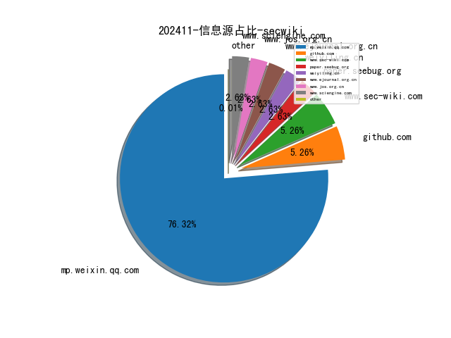
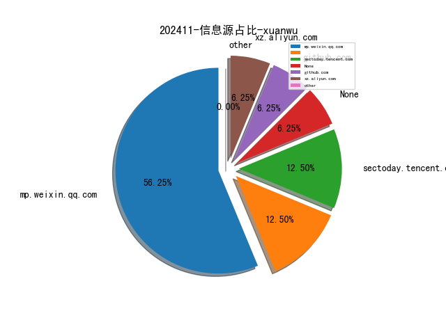
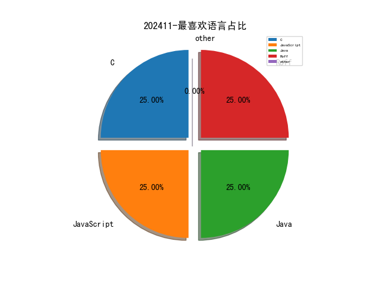

# [数据--所有](README_20.md)
# [数据--年度](README_2024.md)
# 202411 信息源与信息类型占比

# 网络安全书籍 推荐
| date_added | language | title | author | link | size| 
| --- | --- | --- | --- | --- | ---| 
| 2024-11-16 09:26:29 | English | Microsoft Power Platform For Dummies | Jack A. Hyman | http://libgen.st/book/index.php?md5=4632253D6649D23A4F444FA702849AC9 | 25 MB [PDF]| 
| 2024-11-16 09:28:14 | English | Deep Dive into the Power Platform in the Age of Generative AI: Architectural Insights and Best Practices for Intelligent Business Solutions | Biswa Pujarini Mohapatra | http://libgen.st/book/index.php?md5=D1C4F1426509A823AF04AE86B09E28CE | 10 MB [PDF]| 
| 2024-11-14 20:11:14 | English | ChatGPT and AI for Accountants | Scott Dell, Mfon Akpan | http://libgen.st/book/index.php?md5=9E1EFC37FCC45B9E12F6114017EEDB17 | 2 MB [EPUB]| 
| 2024-11-14 07:22:47 | English | Microsoft 365 Administration Cookbook, 2nd Edition | unknown | https://www.wowebook.org/microsoft-365-administration-cookbook-2nd-edition/ | unknown| 
| 2024-11-14 06:24:06 | English | Mastering OpenTelemetry and Observability: Enhancing Application and Infrastructure Performance and Avoiding Outages | unknown | https://www.wowebook.org/mastering-opentelemetry-and-observability-enhancing-application-and-infrastructure-performance-and-avoiding-outages/ | unknown| 
| 2024-11-14 06:02:26 | English | Async Rust: Unleashing the Power of Fearless Concurrency | unknown | https://www.wowebook.org/async-rust-unleashing-the-power-of-fearless-concurrency/ | unknown| 
| 2024-11-13 12:00:29 | English | Design and Deploy IoT Network & Security with Microsoft Azure | unknown | https://www.wowebook.org/design-and-deploy-iot-network-security-with-microsoft-azure/ | unknown| 
| 2024-11-13 08:12:25 | English | Generative AI in Education | unknown | https://www.wowebook.org/generative-ai-in-education/ | unknown| 
| 2024-11-12 05:34:04 | English | Powerful Python: Patterns and Strategies with Modern Python | unknown | https://www.wowebook.org/powerful-python-patterns-and-strategies-with-modern-python/ | unknown| 
| 2024-11-10 05:22:52 | English | Rust For Database: A Comprehensive Guide to Building Scalable, Reliable, and Secure Database Applications with Rust, for Developers and Database Administrators | Radcliffe, Patrick | http://libgen.st/book/index.php?md5=D3A9459385A137F8D51CE917DE9CDD65 | 349 kB [EPUB]| 
| 2024-11-10 13:24:50 | English | Health and Safety: Risk Management | Tony Boyle, Fiona Charlton | http://libgen.st/book/index.php?md5=0A1C5B93C930BF446CBDF090202BC05B | 11 MB [PDF]| 
| 2024-11-10 09:24:55 | English | Prompt Engineering for LLMs | unknown | https://www.wowebook.org/prompt-engineering-for-llms/ | unknown| 
| 2024-11-09 20:10:12 | English | Python Programming for Mathematics | Guillod, Julien | http://libgen.st/book/index.php?md5=D273B997F81D6F8AED737D183103ABD2 | 6 MB [EPUB]| 
| 2024-11-09 20:09:20 | English | Powerful Python (for Raymond Rhine) | Aaron Maxwell | http://libgen.st/book/index.php?md5=FEB01601F4EC620AA80851942EC662C0 | 2 MB [EPUB]| 
| 2024-11-09 20:06:10 | English | You Don’t Need a £1Million Cybersecurity Budget | Oosthuizen, Izak | http://libgen.st/book/index.php?md5=B1D5AEFC16B8A25B55B981E44169F3BB | 1 MB [EPUB]| 
| 2024-11-09 20:15:52 | English | Theres No Such Thing as Crypto Crime : An Investigative Handbook | Nick Furneaux | http://libgen.st/book/index.php?md5=7C97223CFF87256B1772AFF8F940821A | 28 MB [EPUB]| 
| 2024-11-08 09:48:45 | English | Microsoft Power Apps Cookbook, 3rd Edition | unknown | https://www.wowebook.org/microsoft-power-apps-cookbook-3rd-edition/ | unknown| 
| 2024-11-08 08:57:09 | English | Modern Time Series Forecasting with Python, 2nd Edition | unknown | https://www.wowebook.org/modern-time-series-forecasting-with-python-2nd-edition/ | unknown| 
| 2024-11-08 06:58:13 | English | Microsoft Cybersecurity Architect Exam Ref SC-100, 2nd Edition | unknown | https://www.wowebook.org/microsoft-cybersecurity-architect-exam-ref-sc-100-2nd-edition/ | unknown| 
| 2024-11-07 08:03:00 | English | Microsoft 365 Certified: Collaboration Communications Systems Engineer Associate Certification Companion | unknown | https://www.wowebook.org/microsoft-365-certified-collaboration-communications-systems-engineer-associate-certification-companion/ | unknown| 
| 2024-11-05 20:15:13 | English | Microsoft 365 Certified: Collaboration Communications Systems Engineer Associate Certification Companion : A Guide to Prepare for Exam MS-721 | Fabrizio Volpe | http://libgen.st/book/index.php?md5=9313AE77C205F9DB7A8DBD5DEB064592 | 6 MB [EPUB]| 
| 2024-11-05 19:22:15 | English | Gene Flow: Monitoring, Modelling and Mitigation | Wei Wei PhD (editor), Neal Stewart PhD (editor) | http://libgen.st/book/index.php?md5=6B6061625103B423F9F7D056F3F03831 | 12 MB [PDF]| 
| 2024-11-05 19:13:16 | English | Prompt Engineering for LLMs (for True Epub) | John Berryman and Albert Ziegler | http://libgen.st/book/index.php?md5=A01DADF08241D9DE7287171271C1CFC5 | 11 MB [EPUB]| 
| 2024-11-04 05:42:47 | English | beginners guide to streamlit with python | unknown | https://it-ebooks.info/book/1686051862-beginners_guide_to_streamlit_with_python/ | unknown| 
| 2024-11-04 05:42:47 | English | firewalls dont stop dragons 5th edition | unknown | https://it-ebooks.info/book/1686052309-firewalls_dont_stop_dragons_5th_edition/ | unknown| 
| 2024-11-04 06:16:19 | English | Application Lifecycle Management on Microsoft Power Platform | unknown | https://www.wowebook.org/application-lifecycle-management-on-microsoft-power-platform/ | unknown| 
| 2024-11-03 16:27:52 | English | Introduction to Number Theory & Cryptography: The Foundation of Digital Security (With 400+ Practice Questions for Undergraduates and Graduates) | Cristen Weldon | http://libgen.st/book/index.php?md5=F29BF940B8991899B7CD7EC716C4B755 | 12 MB [PDF]| 
| 2024-11-03 16:15:13 | English | Mastering Python: A Comprehensive Crash Course for Beginners | Hussain, Frahaan; Hussain, Kameron | http://libgen.st/book/index.php?md5=F584A1B9E1B817E0D4345228681B1685 | 548 kB [EPUB]| 
| 2024-11-03 16:14:31 | English | Object-Oriented Python: Master OOP through Game Development and GUI Applications | Kameron Hussain | http://libgen.st/book/index.php?md5=32FD1140D66F95C5C34C9281A81B2C02 | 499 kB [EPUB]| 
| 2024-11-03 14:41:09 | English | Unveiling NIST Cybersecurity Framework 2.0 | unknown | https://www.wowebook.org/unveiling-nist-cybersecurity-framework-2-0/ | unknown| 
| 2024-11-02 09:57:15 | English | Decoding Large Language Models | unknown | https://www.wowebook.org/decoding-large-language-models/ | unknown| 
| 2024-11-02 04:41:35 | English | PYTHON OBJECT-ORIENTED PROGRAMMING: Adventures with Python and Processing Playground | BM, Roger | http://libgen.st/book/index.php?md5=3963E1D4C150410CD420FDF3A1E175F4 | 13 MB [EPUB]| 
| 2024-11-02 04:40:13 | English | Engineering AI Systems: Architecture and DevOps Essentials (for Raymond Rhine) | Len Bass; Qinghua Lu; Ingo Weber; Liming Zhu | http://libgen.st/book/index.php?md5=60ED4AFFFFF9A67EE410F785C4960E5A | 4 MB [EPUB]| 
| 2024-11-01 20:15:20 | English | Artificial Intelligence for Cybersecurity | unknown | https://www.wowebook.org/artificial-intelligence-for-cybersecurity/ | unknown| 
| 2024-11-01 11:33:53 | English | Programming Microsoft Dynamics 365 Business Central, 7th Edition | unknown | https://www.wowebook.org/programming-microsoft-dynamics-365-business-central-7th-edition/ | unknown| 
| 2024-11-01 06:23:25 | English | Enhancing Your Cloud Security with a CNAPP Solution | unknown | https://www.wowebook.org/enhancing-your-cloud-security-with-a-cnapp-solution/ | unknown| 

# 微信公众号 推荐
| nickname_english | weixin_no | title | url| 
| --- | --- | --- | ---| 
| FreeBuf | None | 如何使用Locksmith查找和修复AD证书服务中的错误安全配置 | https://mp.weixin.qq.com/s?__biz=MjM5NjA0NjgyMA==&mid=2651307300&idx=4&sn=298d1a5299844fc126334aa11fc06dfb | 52| 
| HW专项行动小组 | None | 2.ASP.NET Route型内存马 | https://mp.weixin.qq.com/s?__biz=MzkzNTUwNTg2Ng==&mid=2247485100&idx=1&sn=9ae88340de14c8e139af1d3ab48ff111 | 3| 
| Hack分享吧 | None | 绕过各种杀软dumphash工具 | https://mp.weixin.qq.com/s?__biz=MzA4NzU1Mjk4Mw==&mid=2247492065&idx=1&sn=0c379f679fb03bce8ae4685911505cb4 | 3| 
| Red Teams | None | 覆盖网络攻防与分析5个方向纯干货分享 | https://mp.weixin.qq.com/s?__biz=Mzg5MjUyMTgyNg==&mid=2247485303&idx=1&sn=49782f9a101d9ce095685640f0325041 | 1| 
| wavecn | None | BASIC 语言发明人去世，想起自己用过很多种 BASIC | https://mp.weixin.qq.com/s?__biz=Mzg4Njc0Mjc3NQ==&mid=2247486532&idx=1&sn=6c4c6a13e22108effaea9b1f453b0adc | 2| 
| 中国网络空间安全协会 | None | “乌镇峰会活动”倒计时2天！ | https://mp.weixin.qq.com/s?__biz=MzA3ODE0NDA4MA==&mid=2649400723&idx=1&sn=31e4fecf7056691beb247485dc86867d | 4| 
| 乌雲安全 | None | 武装你的Brupsuite | https://mp.weixin.qq.com/s?__biz=MzAwMjA5OTY5Ng==&mid=2247524907&idx=1&sn=e4cc1da6be56615bbc81ddea530bfb5f | 4| 
| 君说安全 | None | 网络安全认知科普（三）：一个“穷光蛋”需要保险箱么？ | https://mp.weixin.qq.com/s?__biz=MzUzNjkxODE5MA==&mid=2247487429&idx=1&sn=244d85253f3ef27106ca57151c9ee3c7 | 3| 
| 喵苗安全 | None | 【招聘】常行科技招人啦～ | https://mp.weixin.qq.com/s?__biz=Mzg5MjkwODc4MA==&mid=2247485590&idx=1&sn=b0af107502f6df6d76560ee01eb20a1a | 8| 
| 奇安信高校合作中心 | None | 2024世界职业技术教育发展大会邀请函 | https://mp.weixin.qq.com/s?__biz=MzkwMTM1MTA4MQ==&mid=2247487031&idx=1&sn=ac328896b438624435e8018b61ddb176 | 2| 
| 字节跳动技术团队 | None | 「会说话」的 AI ，扣子智能语音 OpenAPI 开启内测申请 | https://mp.weixin.qq.com/s?__biz=MzI1MzYzMjE0MQ==&mid=2247511386&idx=1&sn=7cc18c28156b42b144946325f89b186e | 7| 
| 安全小将李坦然 | None | GitHubActions & 阿里云解决国内镜像拉取问题 | https://mp.weixin.qq.com/s?__biz=MzkwMDQ4MDU2MA==&mid=2247484392&idx=1&sn=b5a388f710cd1ef83d4b9085a2c2224b | 3| 
| 安恒信息 | None | 国家数据局确定2025年阶段性目标，多项部署助推实现数字中国建设 | https://mp.weixin.qq.com/s?__biz=MjM5NTE0MjQyMg==&mid=2650618654&idx=1&sn=64b916fa8fd4883333910ce87df36cf4 | 1| 
| 情报分析师Pro | None | “独狼”恐怖袭击者心理行为特征及防范治理策略 | https://mp.weixin.qq.com/s?__biz=MzkwNzM0NzA5MA==&mid=2247501834&idx=1&sn=8188cb9686a083cf28abb640f808d0c0 | 6| 
| 明暗安全 | None | 你一定要知道的黑客教父龚蔚的网安故事 | https://mp.weixin.qq.com/s?__biz=MzkxMjYxODcyNA==&mid=2247485095&idx=1&sn=e6357c450a1bf400d5a69c752a65f92b | 6| 
| 暗影网安实验室 | None | 【正义审判】联合网警打击棉花糖fans违法行为 | https://mp.weixin.qq.com/s?__biz=MzIyNTIxNDA1Ng==&mid=2659211121&idx=1&sn=80755f39615f06dfe4839adad23c924b | 7| 
| 河南等级保护测评 | None | 国外：一周网络安全态势回顾之第73期 | https://mp.weixin.qq.com/s?__biz=Mzg2NjY2MTI3Mg==&mid=2247497603&idx=1&sn=f7c54211116e341eb01ef67b2e783545 | 9| 
| 洞见网安 | None | 网安原创文章推荐【2024/11/16】 | https://mp.weixin.qq.com/s?__biz=MzAxNzg3NzMyNQ==&mid=2247489203&idx=1&sn=a3bc22af5648d0d15a20d18dcbc827fe | 4| 
| 狐狸说安全 | None | 师傅们，终于跨过了4W这个坎！！ | https://mp.weixin.qq.com/s?__biz=MzUzMDQ1MTY0MQ==&mid=2247506249&idx=1&sn=623bd33a6a964a11f9f7f3dcc2e57fb4 | 2| 
| 白安全组 | None | DC-4靶场练习（拯救基础学习） | https://mp.weixin.qq.com/s?__biz=MzU4MjYxNTYwNA==&mid=2247487548&idx=1&sn=27be0b6b3b387a19a48e63ca889787be | 1| 
| 白帽子 | None | CVE-2024-25600：WordPress Bricks Builder RCE | https://mp.weixin.qq.com/s?__biz=MzAwMDQwNTE5MA==&mid=2650247657&idx=1&sn=b0600f03ef9bbffbcaa4fbf1fe0d87f7 | 3| 
| 白帽学子 | None | 梦想成真 | https://mp.weixin.qq.com/s?__biz=MzkyNzIxMjM3Mg==&mid=2247488246&idx=2&sn=7bf9d9cd97fa2fa4d569113afc9d2dd0 | 7| 
| 祺印说信安 | None | 盗窃并洗钱约10亿美元比特币的男子被判入狱5年 | https://mp.weixin.qq.com/s?__biz=MzA5MzU5MzQzMA==&mid=2652112613&idx=2&sn=20433b76b20bb7d2514d11c5b37e9286 | 16| 
| 红岸基地网络安全 | None | 【正义审判】红岸赵小龙配合公某安打击违法犯罪团伙:棉花糖fans | https://mp.weixin.qq.com/s?__biz=MzkxMDc0MTc5Mw==&mid=2247483774&idx=1&sn=d600128d7719d5f5d50e0b420b9c2ffb | 2| 
| 网空闲话plus | None | 每周网安态势概览【20241117】046期 | https://mp.weixin.qq.com/s?__biz=MzkyMjQ5ODk5OA==&mid=2247505252&idx=2&sn=da6a96963b165b640dcd5d4ef6a6af4f | 17| 
| 网络安全与取证研究 | None | 2024数证杯初赛部分wp[计算机、手机、数据分析] | https://mp.weixin.qq.com/s?__biz=Mzg3NTU3NTY0Nw==&mid=2247489361&idx=1&sn=4178c6cc60cd27106fbd20d6841702a8 | 4| 
| 网络安全与等保测评 | None | 一文读懂敏感标记和强制访问控制，让你恍然大悟。 | https://mp.weixin.qq.com/s?__biz=MzIwNDYzNTYxNQ==&mid=2247502220&idx=1&sn=6f1de2bf96464925e8a93da76579ea53 | 2| 
| 网络技术干货圈 | None | 网络工程师需要掌握的10个Linux网络命令，收藏！ | https://mp.weixin.qq.com/s?__biz=MzUyNTExOTY1Nw==&mid=2247527270&idx=1&sn=8acdae8eb9546aa6c7da4278dcc3f43c | 5| 
| 网络空间信息安全学习 | None | 大学生节：青春不迷茫，梦想正起航！ | https://mp.weixin.qq.com/s?__biz=MzI2MjcwMTgwOQ==&mid=2247491998&idx=1&sn=71f3ca374308a821543caa6f72b74a0c | 3| 
| 苏说安全 | None | 信创产品目录 , 安全可靠测评结果汇总 | https://mp.weixin.qq.com/s?__biz=Mzg5OTg5OTI1NQ==&mid=2247489137&idx=1&sn=4a74a847e1ac2772d4933c1e42f0c438 | 6| 
| 英语学习经验 | None | 翻译/作文：常见的中国思想文化术语（四） | https://mp.weixin.qq.com/s?__biz=Mzk0NDI1NTk0MQ==&mid=2247484661&idx=1&sn=d2623f330271abbf8fe51371d18e4b79 | 6| 
| 草帽一只尔 | None | 开源情报（osint）在太空探索与安全中的革新应用 | https://mp.weixin.qq.com/s?__biz=Mzg2MTg3NzQ5OQ==&mid=2247485409&idx=1&sn=e8720983847c7eaa4d83ecb803449f46 | 3| 
| 计算机与网络安全 | None | 数字孪生网络架构 | https://mp.weixin.qq.com/s?__biz=MjM5OTk4MDE2MA==&mid=2655259079&idx=2&sn=c98ecab9c620685c8ef2da4e82f094be | 7| 
| 说安全 如何安全 | None | 守护数字世界的隐形盾牌：揭秘密码安全的力量（附PPT下载） | https://mp.weixin.qq.com/s?__biz=MzkyODY5ODAyOA==&mid=2247488303&idx=1&sn=0a55f32f80d57c0b81c763d416a2ed6d | 6| 
| 赛宁网安 | None | 倒计时3天！第七届“强网”拟态防御国际精英挑战赛即将打响 | https://mp.weixin.qq.com/s?__biz=MzA4Mjk5NjU3MA==&mid=2455487357&idx=1&sn=972885777275e40cccc72e66a1ddbb0b | 2| 
| 进击的HACK | None | javasec , fastjson底层分析 | https://mp.weixin.qq.com/s?__biz=MzkxNjMwNDUxNg==&mid=2247486791&idx=1&sn=13f4e24766ead43850d4b4199c8e5f5b | 8| 
| 银遁安全团队 | None | 【漏洞复现】九思OA dl存在任意文件读取漏洞 | https://mp.weixin.qq.com/s?__biz=MzU3MjU4MjM3MQ==&mid=2247488389&idx=2&sn=2bea1165ad80d38c1329593ca08c6e55 | 6| 
| 长弓三皮 | None | 最新Canvas模式丨ChatGPT/GPT4辅助课题设计与SCI科研论文写作与AI绘图实战应用会议 | https://mp.weixin.qq.com/s?__biz=MzU2NzIzNzU4Mg==&mid=2247487948&idx=1&sn=7e286a2b843db9590677030b8cf37768 | 3| 
| 风铃Sec | None | C/C++逆向：对象内存分布&__thiscall | https://mp.weixin.qq.com/s?__biz=Mzk0MjY1ODE5Mg==&mid=2247484703&idx=1&sn=da3e2b77b77399b64e7e5cba07734877 | 1| 
| 高等精灵实验室 | None | Puter：轻松在你的NAS中跑一个类似Windows的网络操作系统！ | https://mp.weixin.qq.com/s?__biz=MzA4MjkzMTcxMg==&mid=2449046413&idx=1&sn=51a0baeeda5f78269497a89529badfd5 | 4| 
| 黑白之道 | None | 很强的一款恶意软件反检测工具 | https://mp.weixin.qq.com/s?__biz=MzAxMjE3ODU3MQ==&mid=2650603615&idx=4&sn=a69d9f5d013f6b6583a560d481353ce9 | 16| 
| AI与安全 | None | 2024年融资超过1亿美元的AI初创公司 | https://mp.weixin.qq.com/s?__biz=Mzg5NTMxMjQ4OA==&mid=2247485064&idx=1&sn=f426bb7b93c5326e52db3170e7d6e3ef | 2| 
| CISSP | None | 中国信息安全测评中心招聘安全测评人员 | https://mp.weixin.qq.com/s?__biz=Mzg4MTg0MjQ5OA==&mid=2247487210&idx=1&sn=f50a8364be1d5be6b19ceff0f0ccb215 | 6| 
| DataCon大数据安全分析竞赛 | None | 比赛第四日排名榜，DataCon2024激战正酣！ | https://mp.weixin.qq.com/s?__biz=MzU5Njg1NzMyNw==&mid=2247488618&idx=1&sn=631786178eb7b8258b09c14a78da734a | 3| 
| Heihu Share | None | Java 安全 , SpEL 表达式注入 | https://mp.weixin.qq.com/s?__biz=MzkwMzQyMTg5OA==&mid=2247484845&idx=1&sn=c0217076a5fd491659277cb2f8141c7b | 3| 
| IoVSecurity | None | UN-R 155/156在KBA型式批准程序范围内进行测试的技术服务指定/认可规则的应用（A、B、D类） | https://mp.weixin.qq.com/s?__biz=MzU2MDk1Nzg2MQ==&mid=2247615716&idx=3&sn=5e7387e4b2c377b104afda7cf3307ea5 | 31| 
| Jie安全 | None | 代码审计之XX系统二次注入到RCE | https://mp.weixin.qq.com/s?__biz=Mzg2NDg2MDIxNQ==&mid=2247485148&idx=1&sn=f91f2c3afb4b235588e10bd607c98930 | 4| 
| Khan安全攻防实验室 | None | 干货｜一文搞懂加密流量检测的解决方法和技术细节 | https://mp.weixin.qq.com/s?__biz=MzAwMjQ2NTQ4Mg==&mid=2247495642&idx=2&sn=b3dcbf84ece998bc7d37eba09360c8de | 12| 
| ListSec | None | game of active directory(GOAD)  part 2 查找用户 | https://mp.weixin.qq.com/s?__biz=MzIwMjUyNDM0OA==&mid=2247485741&idx=1&sn=9a40c3120022b1fce1ecfacb043b19a7 | 1| 
| Ots安全 | None | CVE-2024-28888：福昕阅读器中使用释放后导致远程代码执行 | https://mp.weixin.qq.com/s?__biz=MzAxMjYyMzkwOA==&mid=2247523915&idx=1&sn=0522e35aa0afa2167e0dfd9d5a6954d7 | 25| 
| Relay学安全 | None | Windows恶意软件分析-基础 | https://mp.weixin.qq.com/s?__biz=Mzg5MDg3OTc0OA==&mid=2247488143&idx=1&sn=077d14ed0f95dbbdcfd52d3b5ea517d9 | 4| 
| Sec Online | None | “Sec Online” 安全助手 | https://mp.weixin.qq.com/s?__biz=MzIyMjU3MDg3Mw==&mid=2247488990&idx=1&sn=df59871d1227c2298183775cd4b95af0 | 3| 
| T0daySeeker | None | 最新Patchwork(白象)Protego远控木马接收某远控指令后将导致远控木马无法响应后续远控指令 | https://mp.weixin.qq.com/s?__biz=MzAwNDUzNDExMQ==&mid=2247485153&idx=1&sn=99d2497e42867758a14dae2f7209727a | 2| 
| TtTeam | None | 国产化综合红队协同工具TangGo更新！ | https://mp.weixin.qq.com/s?__biz=Mzg2NTk4MTE1MQ==&mid=2247486124&idx=1&sn=af892705af3ce0201c9db2e87154b84f | 4| 
| XG小刚 | None | 阿里云ESA挑战赛 | https://mp.weixin.qq.com/s?__biz=MzIwOTMzMzY0Ng==&mid=2247487845&idx=1&sn=b945b5cfe622920c96e3b9b113b843fe | 1| 
| Z2O安全攻防 | None | 建了个SRC专项漏洞知识库 | https://mp.weixin.qq.com/s?__biz=Mzg2ODYxMzY3OQ==&mid=2247517203&idx=2&sn=3074826837ddd653a7d1ae03a600a0b4 | 19| 
| dotNet安全矩阵 | None | .NET 通过模块和驱动收集本地EDR的工具 | https://mp.weixin.qq.com/s?__biz=MzUyOTc3NTQ5MA==&mid=2247496726&idx=3&sn=b0adf477b3758b832e5637c415188f76 | 15| 
| flowers-boy | None | CTF之web基础 | https://mp.weixin.qq.com/s?__biz=MzkxMzY5NDUyMQ==&mid=2247484795&idx=1&sn=32c7546a207297a5d901d418c7e5c4a3 | 2| 
| kali笔记 | None | 浏览器数据导出工具-SharpWeb | https://mp.weixin.qq.com/s?__biz=MzkxMzIwNTY1OA==&mid=2247509078&idx=1&sn=c031c270a2b3ed14db2bf017d264f9c3 | 4| 
| nday POC | None | 用友U8 Cloud service/approveservlet SQL注入漏洞 | https://mp.weixin.qq.com/s?__biz=MzkzMTcwMTg1Mg==&mid=2247489182&idx=1&sn=43153077f1b12d816a475a87439b5cf7 | 3| 
| securitainment | None | Arsenal 绕过 EDR/XDR 并使恶意软件分析更困难 | https://mp.weixin.qq.com/s?__biz=MzAxODM5ODQzNQ==&mid=2247485134&idx=2&sn=75e50e7b7100753597c06ad0087b3773 | 9| 
| thelostworld | None | 【漏洞预警】易思智能物流无人值守系统SQL注入 | https://mp.weixin.qq.com/s?__biz=MzIyNjk0ODYxMA==&mid=2247487499&idx=4&sn=69d6613ba3812956a0388203252d7a8f | 4| 
| 一起聊安全 | None | 关键信息基础设施商用密码使用管理规定（征求意见稿） | https://mp.weixin.qq.com/s?__biz=MzI3NjUzOTQ0NQ==&mid=2247515887&idx=1&sn=88bd97ba8bccf16013a97e6dea958101 | 2| 
| 七芒星实验室 | None | 甲方安全之第三方组件问题概览 | https://mp.weixin.qq.com/s?__biz=Mzg4MTU4NTc2Nw==&mid=2247493593&idx=2&sn=2e541c3705fc48eec0afe44078bc334b | 4| 
| 二进制空间安全 | None | 利用安全专家工具nxc进行MSSQL渗透 | https://mp.weixin.qq.com/s?__biz=MzkxOTUyOTc0NQ==&mid=2247492383&idx=1&sn=50d7c529969978d62adc98e3e07ccd63 | 7| 
| 儒道易行 | None | 【Pikachu】XML外部实体注入实战 | https://mp.weixin.qq.com/s?__biz=Mzg5NTU2NjA1Mw==&mid=2247494292&idx=1&sn=4e8ae27e30b4fd72bd29dbe13c0a21cc | 10| 
| 全栈安全 | None | 敏感词检测技术及Top工具介绍 | https://mp.weixin.qq.com/s?__biz=MzkyMTYyOTQ5NA==&mid=2247485778&idx=1&sn=ff255b5095ce3281167fa786355c0f6b | 3| 
| 全球技术地图 | None | 俄乌战场上的FPV无人机攻防战术分析 | https://mp.weixin.qq.com/s?__biz=MzI1OTExNDY1NQ==&mid=2651617143&idx=1&sn=b585d4b781dec212feb5972631363a0b | 19| 
| 兰花豆说安全 | None | 网络安全人士必知的国产密码知识和行业前景 | https://mp.weixin.qq.com/s?__biz=MzI3NzM5NDA0NA==&mid=2247489785&idx=1&sn=b330a66c19bc49250719c645e0a2ea7d | 3| 
| 内生安全联盟 | None | 第四届网络空间内生安全学术大会，重要议程提前速览 → | https://mp.weixin.qq.com/s?__biz=Mzg4MDU0NTQ4Mw==&mid=2247526712&idx=2&sn=a904340bb444b24e1791378c124a8b74 | 23| 
| 再说安全 | None | Linux服务器攻击面梳理（2024）下集 | https://mp.weixin.qq.com/s?__biz=MzkyODYwODkyMA==&mid=2247484541&idx=1&sn=2f9de3863d1f60726031a17d9e186315 | 11| 
| 冷漠安全 | None | 「漏洞复现」全新优客API接口管理系统 index/doc SQL注入漏洞 | https://mp.weixin.qq.com/s?__biz=MzkyNDY3MTY3MA==&mid=2247486044&idx=1&sn=a388724f830e410cf1647a67efee8f84 | 9| 
| 前沿信安资讯阵地 | None | 来一场极致的沉浸式音乐之旅 | https://mp.weixin.qq.com/s?__biz=MzA3MTM0NTQzNA==&mid=2455779906&idx=1&sn=a85242c1d1dcea433efe33af520ec5ac | 1| 
| 剑客古月的安全屋 | None | app攻防-实战修改资源&去广告与弹窗 | https://mp.weixin.qq.com/s?__biz=MzkxNDY0NjY3MQ==&mid=2247485218&idx=1&sn=ab5361c68ea10f0496eeceda0b7b2bdc | 3| 
| 十九线菜鸟学安全 | None | 00【邮件安全】关于邮件安全，我们都会面临哪些风险 | https://mp.weixin.qq.com/s?__biz=MzI1OTUyMTI2MQ==&mid=2247484666&idx=1&sn=6bbab33457f624747b131895835a84d6 | 1| 
| 吉祥学安全 | None | 渗透、应急、代码审计20个靶场 | https://mp.weixin.qq.com/s?__biz=MzkwNjY1Mzc0Nw==&mid=2247486386&idx=1&sn=9434f275fae43978e22897b31806200f | 5| 
| 商密君 | None | 人均最高7.2万元！知名律所因泄露用户个人信息赔偿超5700万元 | https://mp.weixin.qq.com/s?__biz=MzI5NTM4OTQ5Mg==&mid=2247632154&idx=4&sn=9599a2411f8f3e5fc8319a6ac09d4b73 | 33| 
| 夜组安全 | None | 一款java漏洞集合工具 | https://mp.weixin.qq.com/s?__biz=Mzk0ODM0NDIxNQ==&mid=2247492730&idx=1&sn=4830f7a0e4dfa7e50b8fb0ccc7e0e0b9 | 5| 
| 大象只为你 | None | 为什么说Redis是高性能的？ | https://mp.weixin.qq.com/s?__biz=MzI5NzUyNzMzMQ==&mid=2247485402&idx=1&sn=6633a9baf56a2f0d6f99febe26722f8d | 7| 
| 安全圈 | None | 【安全圈】俄罗斯黑客利用文件拖放、删除操作触发 Windows 0day 漏洞攻击乌克兰目标 | https://mp.weixin.qq.com/s?__biz=MzIzMzE4NDU1OQ==&mid=2652066024&idx=4&sn=46592438737abae8701b9ba1b7160d86 | 39| 
| 安全狗的自我修养 | None | top 500强企业老总下班跟我挤公交，难道也是摆拍吗？ | https://mp.weixin.qq.com/s?__biz=MzkwOTE5MDY5NA==&mid=2247502885&idx=1&sn=668b29d81030f97534be838c35f90942 | 5| 
| 安全红蓝紫 | None | 为什么没有真正的零信任? | https://mp.weixin.qq.com/s?__biz=MzI1NjQxMzIzMw==&mid=2247496779&idx=1&sn=805d661dab7596f963bebe464a1d7bdf | 3| 
| 安全逐梦人 | None | 记录日常挖掘漏洞 | https://mp.weixin.qq.com/s?__biz=MzkxNzUxMjU5OQ==&mid=2247484847&idx=1&sn=ab525f7b54b1842379879fcb44279dfe | 1| 
| 安在 | None | 在看 , 厂商：本周热门网络安全产业动态 | https://mp.weixin.qq.com/s?__biz=MzU5ODgzNTExOQ==&mid=2247631304&idx=2&sn=9f0e965e42fe8500ee594d7e1152a35e | 24| 
| 安帝Andisec | None | 工业网络安全周报-2024年第44期 | https://mp.weixin.qq.com/s?__biz=MzU3ODQ4NjA3Mg==&mid=2247561191&idx=1&sn=5c82c9fae37eb037bd993abe5367c8fa | 5| 
| 安知讯 | None | 工信部通报27款App，包括乐播投屏、黑鲨游戏SDK等 | https://mp.weixin.qq.com/s?__biz=MzIxMDIwODM2MA==&mid=2653931103&idx=1&sn=fb46bb39b0db6cf268232463de6ff0b2 | 20| 
| 小兵搞安全 | None | Fckeditor编辑器漏洞汇集 | https://mp.weixin.qq.com/s?__biz=MzA3NTc0MTA1Mg==&mid=2664712071&idx=1&sn=98356c1f6829546d47af1e4d43f89ace | 1| 
| 小白学安全 | None | 银狐木马知多少 | https://mp.weixin.qq.com/s?__biz=Mzg2MDA5Mzg1Nw==&mid=2247486594&idx=1&sn=17eca406ed25ba80275eae1c6ae77936 | 1| 
| 山石网科新视界 | None | 山石网科SD-WAN获奖：跨界融合·应用典范！ | https://mp.weixin.qq.com/s?__biz=MzAxMDE4MTAzMQ==&mid=2661295304&idx=1&sn=8210f71719df982298762e5517501cdf | 5| 
| 工业互联网标识智库 | None | 2024年中小企业数字化“链式”转型活动在广州成功举办 | https://mp.weixin.qq.com/s?__biz=MzU1OTUxNTI1NA==&mid=2247591475&idx=1&sn=d0bda78bb6f3e5b31c4a8ce51a1686aa | 6| 
| 张无瑕思密达 | None | 辛瓦尔荆棘和康乃馨【06】：约旦河西岸的武装行动 | https://mp.weixin.qq.com/s?__biz=MzkwMzI1ODUwNA==&mid=2247487622&idx=1&sn=f9fd57e11c1521e24eca9418a9dec8f4 | 4| 
| 掌控安全EDU | None | 攻防演练 , 一次近源渗透 | https://mp.weixin.qq.com/s?__biz=MzUyODkwNDIyMg==&mid=2247545126&idx=1&sn=b2f2e3d1dba89c587651768a66070b2d | 19| 
| 教父爱分享 | None | 安排！网络安全学习资源免费送！ | https://mp.weixin.qq.com/s?__biz=MzI1Mjc3NTUwMQ==&mid=2247536298&idx=1&sn=ee736ca873d098b1450be5575875d051 | 6| 
| 星悦安全 | None | (0day)某全新UI自助打印微信小程序系统SQL+RCE漏洞代码审计 | https://mp.weixin.qq.com/s?__biz=Mzg4MTkwMTI5Mw==&mid=2247486133&idx=1&sn=a795a853e80c985de5fceca4309365ce | 6| 
| 星盟安全 | None | 2024鹏城杯（初赛） WP | https://mp.weixin.qq.com/s?__biz=MzU3ODc2NTg1OA==&mid=2247491229&idx=1&sn=e2d1aab7474afc0b54613c7f00829e7e | 3| 
| 智佳网络安全 | None | PWN-堆溢出导致任意地址写 | https://mp.weixin.qq.com/s?__biz=Mzk0NDYwOTcxNg==&mid=2247484983&idx=1&sn=ba5f251394468c525917e24bb2b6a728 | 1| 
| 李白你好 | None | 资产收集常用工具以及思路总结 | https://mp.weixin.qq.com/s?__biz=MzkwMzMwODg2Mw==&mid=2247509314&idx=1&sn=4e286a1c43f839e3b4d15a33eac58c5e | 5| 
| 浙大网安 | None | 区块链与数据安全全国重点实验室团队荣获NeurIPS’24国际人工智能安全竞赛冠军！ | https://mp.weixin.qq.com/s?__biz=Mzg5NDczNDc4NA==&mid=2247495327&idx=1&sn=70b4a2a0f5d42737973bfaf2f637519b | 2| 
| 犀利猪安全 | None | 手拿把掐 , 一次要素过多的真实攻防复原记录，经典万年老洞拿下Shell，爽飞 | https://mp.weixin.qq.com/s?__biz=Mzk0NzQxNzY2OQ==&mid=2247487260&idx=1&sn=3e9c278ed62c84467df5ea442828435e | 5| 
| 独眼情报 | None | PostgreSQL数据库存在高危漏洞CVE-2024-10979（8.8） | https://mp.weixin.qq.com/s?__biz=MzkzNDIzNDUxOQ==&mid=2247492449&idx=2&sn=ded00a05c99093340d9c413be00b1a5a | 16| 
| 玄道夜谈 | None | 分享图片 | https://mp.weixin.qq.com/s?__biz=MzI3Njc1MjcxMg==&mid=2247493617&idx=1&sn=1871b51afeb8f8f9ec89230d922bea61 | 8| 
| 电子物证 | None | 【国产手机操作系统的沧桑往事】 | https://mp.weixin.qq.com/s?__biz=MzAwNDcwMDgzMA==&mid=2651048036&idx=2&sn=637f7d74d86c8399ab4319f1bf7e8805 | 2| 
| 白帽子左一 | None | 攻击面资产梳理可视化 | https://mp.weixin.qq.com/s?__biz=MzI4NTcxMjQ1MA==&mid=2247614116&idx=1&sn=858089a3ff610b74d80b50acd23536c0 | 19| 
| 看雪学苑 | None | x64dbg入门实战 | https://mp.weixin.qq.com/s?__biz=MjM5NTc2MDYxMw==&mid=2458582512&idx=2&sn=c7e3bc4105db5cf8e3f21aae9d113d2a | 32| 
| 神农Sec | None | 分享团队某地级市攻防演练的漏洞复盘 | https://mp.weixin.qq.com/s?__biz=Mzk0Mzc1MTI2Nw==&mid=2247485338&idx=1&sn=615b6a9ca710339fdd1b48528711a058 | 4| 
| 秦国商鞅 | None | 原创—微型小说—网络安全版孔乙己 作者:酷帥王子 | https://mp.weixin.qq.com/s?__biz=Mzg4NzAwNzA4NA==&mid=2247484949&idx=1&sn=af6674f37de599bc4b1d836f26c30d07 | 2| 
| 秦安战略 | None | 牟林：马斯克现象透视，背后有一点很可怕，显示中美根本差别 | https://mp.weixin.qq.com/s?__biz=MzA5MDg1MDUyMA==&mid=2650475277&idx=3&sn=14b3c1f05d95826388f48f6e72f86ed8 | 19| 
| 紫队安全研究 | None | Awaken Likho黑客组织瞄准俄罗斯政府机构，新型木马程序曝光 | https://mp.weixin.qq.com/s?__biz=Mzg3OTYxODQxNg==&mid=2247485408&idx=1&sn=a338481a473b2d63b3ba98780cd84edf | 6| 
| 网安探索员 | None | 资产收集常用工具以及思路总结 | https://mp.weixin.qq.com/s?__biz=MzkzNTYwMTk4Mw==&mid=2247488016&idx=1&sn=ae433530b54807250c730cd7e343d0b2 | 3| 
| 网络安全学习爱好者 | None | phpstudy_2016-2018_rce 漏洞复现 | https://mp.weixin.qq.com/s?__biz=Mzk0MzI2NzQ5MA==&mid=2247486636&idx=1&sn=5d9cfbe6b8393b15c60b04ca9c2c9588 | 5| 
| 网络技术联盟站 | None | 网络防火墙有哪些类型？ | https://mp.weixin.qq.com/s?__biz=MzIyMzIwNzAxMQ==&mid=2649462888&idx=1&sn=53a4ce17aec7f99c7738e42f617f829e | 3| 
| 网络研究观 | None | 间谍软件集团 NSO 承认因客户滥用其间谍软件而切断与其联系 | https://mp.weixin.qq.com/s?__biz=MzkxNDM4OTM3OQ==&mid=2247504498&idx=5&sn=dbc010389d9ffe21b7dd3707e0908a06 | 22| 
| 网络空间安全研究院UESTC | None | 国家重点研发计划“分布式无证书网络身份系统的关键技术”项目启动会在北京成功举办 | https://mp.weixin.qq.com/s?__biz=Mzk0MDMwNjU3Ng==&mid=2247484413&idx=1&sn=442723fd2f1db610ad658511fee27fd5 | 1| 
| 羽泪云小栈 | None | thm_pwn108 | https://mp.weixin.qq.com/s?__biz=MzkxMjYyMjA3Mg==&mid=2247485256&idx=1&sn=c270089dff0d99f2cb4bf45522e27d55 | 4| 
| 菜狗安全 | None | JAVA代审-JreCms(SpringBoot版) | https://mp.weixin.qq.com/s?__biz=Mzg4MzkwNzI1OQ==&mid=2247485406&idx=1&sn=296aa1b2ece36c097b52fc3ac0e437a6 | 2| 
| 虎符智库 | None | 网络安全成熟度：CISO 议程的必备内容 | https://mp.weixin.qq.com/s?__biz=MzIwNjYwMTMyNQ==&mid=2247492813&idx=1&sn=b98551268c37c3a0911bed2e85c08c8f | 2| 
| 谈思实验室 | None | PKI 体系快速了解 | https://mp.weixin.qq.com/s?__biz=MzIzOTc2OTAxMg==&mid=2247546120&idx=2&sn=4d95390fc3fa9d3d3e9cadc5e1d24b8a | 30| 
| 赛博研究院 | None | 科技界领袖将在欧洲网络峰会上探讨特朗普回归问题 | https://mp.weixin.qq.com/s?__biz=MzUzODYyMDIzNw==&mid=2247514554&idx=1&sn=601e729202ed0ac82d3aa7ee7d098817 | 14| 
| 赛欧思安全研究实验室 | None | 赛欧思一周资讯分类汇总(2024-11-11 ~ 2024-11-16) | https://mp.weixin.qq.com/s?__biz=MzU0MjE2Mjk3Ng==&mid=2247488052&idx=1&sn=383329d883919be73d8402109f8d572f | 1| 
| 迪哥讲事 | None | 一次完整的渗透测试 | https://mp.weixin.qq.com/s?__biz=MzIzMTIzNTM0MA==&mid=2247496351&idx=1&sn=b35159fe95e7c3537c6b73b1a7284d36 | 6| 
| 道玄网安驿站 | None | AI代码审计和POC编写 | https://mp.weixin.qq.com/s?__biz=Mzg4NTg5MDQ0OA==&mid=2247487335&idx=1&sn=c2800f225873a4a1b38711bacba10316 | 1| 
| 金盾信安 | None | 【重磅发布】2024数据治理年会成果发布看点 | https://mp.weixin.qq.com/s?__biz=MjM5NjA2NzY3NA==&mid=2448678955&idx=3&sn=7255b56c7b5e90e1e9cbd73b6be59fad | 18| 
| 锦岳智慧 | None | 供应链安全之：供应链劫持的安全防护与处置 | https://mp.weixin.qq.com/s?__biz=MzkxMzQwNDcxNg==&mid=2247486699&idx=1&sn=f3d3d5d3e6e24e2179a6de46c2e6eae0 | 1| 
| 青春计协 | None | 信息收集小总结~ | https://mp.weixin.qq.com/s?__biz=Mzg4MzU3MTcwNg==&mid=2247485983&idx=1&sn=d8a6b34cf871a86db0bb75d59a9e81eb | 6| 
| 黄豆安全实验室 | None | 神人TV之惊人的国护蓝队高手和Hae插件斗智斗勇的故事 | https://mp.weixin.qq.com/s?__biz=MzkzNjczNzEyMw==&mid=2247484057&idx=1&sn=0b23d36a3016bfa74ffbfdcbcc6f1a94 | 3| 
| 天驿安全 | None | Msmap ：一个内存 WebShell 生成器 | https://mp.weixin.qq.com/s?__biz=MzkxNjIxNDQyMQ==&mid=2247497960&idx=1&sn=dc8bb209c20c2abcb8b8393acd933384 | 1| 
| 安全喵喵站 | None | 出海·新加坡｜中国网安闪耀CSWA，探索东南亚 | https://mp.weixin.qq.com/s?__biz=MzkzNjE5NjQ4Mw==&mid=2247542008&idx=3&sn=2c6611f060663a6fe2343ad61794ee27 | 3| 
| 安全洞察知识图谱 | None | 一个永久的.NET渗透工具和知识仓库 | https://mp.weixin.qq.com/s?__biz=MzkyMDM4NDM5Ng==&mid=2247488517&idx=2&sn=948f1c328c41b25c6a0c5184e818647d | 1| 
| 安全视安 | None | 【学习资源】hackerone 漏洞报告合集 ｜ src挖掘学习 | https://mp.weixin.qq.com/s?__biz=Mzg4NzgzMjUzOA==&mid=2247485288&idx=1&sn=75889a7cc3e66eb63c28d5227738feee | 5| 
| 星落安全团队 | None | 支持自定义密码 , 哥斯拉免杀 过360、火绒、D盾 XlByPassGodzilla v1.3已更新！ | https://mp.weixin.qq.com/s?__biz=MzkwNjczOTQwOA==&mid=2247490524&idx=1&sn=3a1b82dbf5c83d33eecd349c0072b8bc | 5| 
| 永信至诚 | None | 永信至诚春秋AI测评「数字风洞」，以模测模助力AI智能体实现数字健康 | https://mp.weixin.qq.com/s?__biz=MzAwNDUyMjk4MQ==&mid=2454828353&idx=1&sn=49b9227cd21c1def7fd71f3c2339b20c | 1| 
| 渗透安全HackTwo | None | 助力红队! MDUT渗透利器二开增强版,漏洞探测 | https://mp.weixin.qq.com/s?__biz=Mzg3ODE2MjkxMQ==&mid=2247489015&idx=1&sn=aae32e04b5ba3ae1730d2bc8e0315a9f | 5| 
| 逆向有你 | None | 安卓逆向 -- 不碰/proc/pid/maps拿到目标App地址分布思路分享 | https://mp.weixin.qq.com/s?__biz=MzA4MzgzNTU5MA==&mid=2652036790&idx=1&sn=a7d721b3b1cfab6671cc7fdb6295b684 | 7| 
| 0x6270安全团队 | None | 团队知识星球安利 | https://mp.weixin.qq.com/s?__biz=Mzg4Njc1MTIzMw==&mid=2247485717&idx=2&sn=00fb3970d9748f6cae86f5ae15a967b7 | 2| 
| 360威胁情报中心 | None | APT-C-55（Kimsuky）组织利用GitHub作为载荷平台的攻击活动分析 | https://mp.weixin.qq.com/s?__biz=MzUyMjk4NzExMA==&mid=2247504218&idx=1&sn=47c3680b0c07f8e130630073914a3992 | 2| 
| 360数字安全 | None | 又一产业学院揭牌！三方携手共育实战型网络安全人才 | https://mp.weixin.qq.com/s?__biz=MzA4MTg0MDQ4Nw==&mid=2247576484&idx=2&sn=7090fc5ea9fbeed18aea5b2dea123161 | 9| 
| Delta Insights | None | 网络安全动态 - 2024.11.14 | https://mp.weixin.qq.com/s?__biz=MzU1MzEzMzAxMA==&mid=2247486744&idx=1&sn=2b3db87863c03c060e059ad0acf6526a | 9| 
| HW安全之路 | None | 三层防护：企业数据库安全架构实战指南 | https://mp.weixin.qq.com/s?__biz=MzI5MjY4MTMyMQ==&mid=2247486801&idx=1&sn=725dbd4e50f236e3049a6520dc9e825d | 10| 
| NOVASEC | None | SharpWeb-支持Chrome v20解密 | https://mp.weixin.qq.com/s?__biz=MzUzODU3ODA0MA==&mid=2247489747&idx=1&sn=dc077cc92e70cae0e6986ede77e8e855 | 1| 
| cy安全MD5 | None | 2024高校联盟CTF杯——昌吉学院校赛 | https://mp.weixin.qq.com/s?__biz=MzkzODcyNDg1OQ==&mid=2247483814&idx=1&sn=abfaacfcd7959f609e37fcc6b1a8de0a | 1| 
| 中国信息安全 | None | 关注 , 公安部公布10起网上侵权假冒犯罪典型案例 | https://mp.weixin.qq.com/s?__biz=MzA5MzE5MDAzOA==&mid=2664229535&idx=5&sn=f1046a3f7ceb994b1f8266fdbbbd7b31 | 59| 
| 中国软件评测中心 | None | 决胜在即：2024年中关村仿生机器人大赛启示录 | https://mp.weixin.qq.com/s?__biz=MjM5NzYwNDU0Mg==&mid=2649247918&idx=2&sn=30b3e356c876c5fac2878b60ed8ef35b | 8| 
| 云科安信Antira | None | 再谈弱口令，全域应用风险防护攻略来袭！ | https://mp.weixin.qq.com/s?__biz=Mzg2NTk3NjczNQ==&mid=2247485384&idx=1&sn=d25583a6041ebc1db14b77db3fc1cb50 | 2| 
| 代码卫士 | None | FBI、CISA和NSA公布2023年利用最频繁的15个漏洞 | https://mp.weixin.qq.com/s?__biz=MzI2NTg4OTc5Nw==&mid=2247521484&idx=2&sn=719611812a4cbf91cb5c976ad2da4620 | 16| 
| 信安路漫漫 | None | SSRF总结 | https://mp.weixin.qq.com/s?__biz=Mzg2MzkwNDU1Mw==&mid=2247485324&idx=1&sn=22abd098f549816f09be840331966bb9 | 1| 
| 信息安全国家工程研究中心 | None | 转载 , 听说过AI造谣吗？ | https://mp.weixin.qq.com/s?__biz=MzU5OTQ0NzY3Ng==&mid=2247498180&idx=2&sn=a79ddc74b0644c7831dd945a9d947d5f | 4| 
| 全栈网络空间安全 | None | 高效排障：详解RST，判定连接重置根因（二） | https://mp.weixin.qq.com/s?__biz=Mzg3NTUzOTg3NA==&mid=2247514648&idx=1&sn=f9cb7903e0f59cf076df90d319da3376 | 2| 
| 关键信息基础设施安全保护联盟 | None | 警惕！新型安卓银行恶意软件正威胁你的银行账户！ | https://mp.weixin.qq.com/s?__biz=MzkxNjU2NjY5MQ==&mid=2247507615&idx=2&sn=be48f4077f4b1438d2de011a2f9087d2 | 9| 
| 励行安全 | None | 新闻 , VMware免费了！ | https://mp.weixin.qq.com/s?__biz=MzkxNTY4NTQwMg==&mid=2247483994&idx=1&sn=57e102c9b778a6e55e70f41d25fa3bac | 5| 
| 千寻安服 | None | Burp插件编写笔记（2）某客户端的加解密插件 | https://mp.weixin.qq.com/s?__biz=MzkzMzI3OTczNA==&mid=2247487364&idx=1&sn=bc840ba039046e626db73c094dfbbc76 | 1| 
| 启明星辰集团 | None | 华为鲲鹏认证加持！启明星辰信创安全产品能力持续突破 | https://mp.weixin.qq.com/s?__biz=MzA3NDQ0MzkzMA==&mid=2651729244&idx=1&sn=f83272e47d714286ff21d8ff72282d00 | 9| 
| 天融信 | None | 天融信列入Gartner®特权访问管理产品“代表性供应商” | https://mp.weixin.qq.com/s?__biz=MzA3OTMxNTcxNA==&mid=2650951839&idx=2&sn=2385b2c50c700124eb1fa6117ae7abd1 | 7| 
| 奇安信集团 | None | 奇安信集团获评“责任100,CSR中国教育榜”最佳责任企业品牌 | https://mp.weixin.qq.com/s?__biz=MzU0NDk0NTAwMw==&mid=2247621836&idx=2&sn=e6820306404c8d1ae856919126ebf56d | 19| 
| 威努特安全网络 | None | 附下载 , 车路云一体化网络建设部署指南 | https://mp.weixin.qq.com/s?__biz=MzAwNTgyODU3NQ==&mid=2651128741&idx=2&sn=62fcf1668198e4413bd74ec695e20149 | 2| 
| 安全419 | None | 安全419《抗量子密码系列访谈》之吉大正元 | https://mp.weixin.qq.com/s?__biz=MzUyMDQ4OTkyMg==&mid=2247544953&idx=1&sn=3883eed2a6b845c2f9d7681574112da4 | 18| 
| 安全牛课堂 | None | 云安全市场增速明显,文末免费试听课程领取方式 | https://mp.weixin.qq.com/s?__biz=MzIxNTM4NDY2MQ==&mid=2247514060&idx=2&sn=2406535892cccbdc0605e1a221981558 | 10| 
| 平航科技 | None | 平航手机取证方案已支持国产“鸿蒙NEXT”系统 | https://mp.weixin.qq.com/s?__biz=MzI0OTEyMTk5OQ==&mid=2247493768&idx=1&sn=b9f93aa143a7ea4c08b3f5d65b80fddc | 2| 
| 开源网安 | None | 江浙某测评公司：提升代码审计能力，确保评测项目高质量交付 | https://mp.weixin.qq.com/s?__biz=MzI0NzY1MDgyMw==&mid=2247513144&idx=1&sn=31f9fe3bc9daec7a238fece52b100b8c | 8| 
| 思极安全实验室 | None | jar包环境下注入内存马 | https://mp.weixin.qq.com/s?__biz=MzAwOTQzMjMwOQ==&mid=2247483851&idx=1&sn=1ef6e459bc4f9054c72488303290b99b | 1| 
| 悟安 | None | 如何做数据安全风险评估 | https://mp.weixin.qq.com/s?__biz=MzU5MTIxNzg0Ng==&mid=2247487978&idx=1&sn=271aeb053793c18c4da72d96f9eb24f4 | 2| 
| 情报分析站 | None | 从影视剧里学习如何躲避跟踪 | https://mp.weixin.qq.com/s?__biz=MzkxMDIwMTMxMw==&mid=2247494060&idx=1&sn=74951d4b49216bde582dc66bb6d68290 | 5| 
| 技术修道场 | None | Fortinet 重磅发布 AI 驱动的下一代数据防泄漏解决方案 FortiDLP！ | https://mp.weixin.qq.com/s?__biz=MzA4NTY4MjAyMQ==&mid=2447899611&idx=1&sn=62cb19185aa69c31c0f70dd49aca5cc3 | 1| 
| 攻防之道 | None | 《琅琊榜》：智慧与胸怀，让人淡然从容地面对人生的风雨 | https://mp.weixin.qq.com/s?__biz=MzIyNDcwODgwMA==&mid=2247485310&idx=1&sn=8dc1c04d8e8b421d5b31dccf3b455a72 | 2| 
| 朱厌安全 | None | 【SRC】未授权访问漏洞引发的惨案....... | https://mp.weixin.qq.com/s?__biz=Mzg4Njg3MDk5Ng==&mid=2247486759&idx=1&sn=dd53a459259c153a9a8cf3f7c9e6fdc5 | 3| 
| 梆梆安全 | None | 梆梆安全荣获第九届“创客中国”全国企业组500强 网安赛道10强 | https://mp.weixin.qq.com/s?__biz=MjM5NzE0NTIxMg==&mid=2651134448&idx=1&sn=624a6d4f441b5fcdd86409273dc092fe | 8| 
| 泛安全 | None | 【干货原创】实网攻防演习常态化，会带来什么变化01 | https://mp.weixin.qq.com/s?__biz=MzU3NjQ5NTIxNg==&mid=2247485208&idx=4&sn=bc53ec8dd49f0d1b04e4843b4d5d4072 | 36| 
| 泷羽Sec | None | 【渗透测试】DC-8提权靶机综合渗透教程 | https://mp.weixin.qq.com/s?__biz=Mzg2Nzk0NjA4Mg==&mid=2247493402&idx=1&sn=f82fd09a24fc8a0ca2ea5a8b657378aa | 3| 
| 浅安安全 | None | 工具 , chanzi | https://mp.weixin.qq.com/s?__biz=MzkwMTQ0NDA1NQ==&mid=2247491390&idx=4&sn=07ee2e2a3f9192f4e59cf9fd68693d07 | 4| 
| 混入安全圈的程序猿 | None | 钓鱼邮件？还带附件？我就想看看钓鱼邮件的附件文档里面到底写了啥咋办？ | https://mp.weixin.qq.com/s?__biz=MzU3ODI3NDc4NA==&mid=2247484581&idx=1&sn=111cb3c048f408e0d9078bf331d72afb | 1| 
| 炼石网络CipherGateway | None | 三期全汇总 , 29家企业78款产品入围国测“安全可靠测评”名单 | https://mp.weixin.qq.com/s?__biz=MzkyNzE5MDUzMw==&mid=2247558630&idx=1&sn=8e9c005ed3497b3ca5923c6775c8653c | 4| 
| 狼蛛安全实验室 | None | 俄罗斯背景的Gamaredon网络间谍组织及其攻击技术深度解析 | https://mp.weixin.qq.com/s?__biz=Mzg4MDYwNDc5Nw==&mid=2247486353&idx=1&sn=a660c15e8a657de2b4cc5b562f916e95 | 1| 
| 百度安全 | None | 再获认可！百度多模态内容安全解决方案获WitAwards 2024年度大奖 | https://mp.weixin.qq.com/s?__biz=MjM5MTAwNzUzNQ==&mid=2650510914&idx=1&sn=280a03ac6d9b283e7b76ed346eade8c7 | 2| 
| 百度安全实验室 | None | 文心快码3.0 引领智能代码助手率先进入智能体时代 | https://mp.weixin.qq.com/s?__biz=MzA3NTQ3ODI0NA==&mid=2247487443&idx=1&sn=cb87c756d6b0407423a098950ecbd23a | 1| 
| 盛邦安全WebRAY | None | DayDayMap全球网络空间资产测绘平台获评WIT2024【年度安全技术变革TOP10】 | https://mp.weixin.qq.com/s?__biz=MzAwNTAxMjUwNw==&mid=2650276999&idx=1&sn=6332bf3b5121213d4eaa5763fc85ed81 | 9| 
| 红队蓝军 | None | 新书来了！2024，我们在幽暗的谷底仰望云安全的星空 | https://mp.weixin.qq.com/s?__biz=Mzg2NDY2MTQ1OQ==&mid=2247522751&idx=1&sn=078a1c6f68f04f900f6b8e0e2144cc71 | 6| 
| 网安百色 | None | 母婴APP涉嫌泄露用户隐私？“信息裸奔”何时休 | https://mp.weixin.qq.com/s?__biz=MzI0NzE4ODk1Mw==&mid=2652094028&idx=2&sn=b3f479a625b1b42e2653a0a36221bbff | 10| 
| 网络与信息法学会 | None | 【资讯】工信部发布《关于侵害用户权益行为的APP（SDK）通报（2024年第9批，总第44批）》 | https://mp.weixin.qq.com/s?__biz=MzU1NDY3NDgwMQ==&mid=2247547326&idx=2&sn=17beb0b31538a94d30baf5d61336a5dc | 14| 
| 网络安全和信息化 | None | 27款APP及SDK存在侵害用户权益行为被通报 | https://mp.weixin.qq.com/s?__biz=MjM5MzMwMDU5NQ==&mid=2649168380&idx=2&sn=fe261f542db59243674503920d784451 | 25| 
| 网络安全等保与关保 | None | 守护密码安全 | https://mp.weixin.qq.com/s?__biz=MzUyNjk2MDU4MQ==&mid=2247486362&idx=1&sn=84321cee68dc30198c1b46e09d01f823 | 1| 
| 船山信安 | None | php伪协议 | https://mp.weixin.qq.com/s?__biz=MzU2NDY2OTU4Nw==&mid=2247517032&idx=1&sn=987f522bdb83421d39b52824bb177b81 | 6| 
| 蓝桥云课精选 | None | 【备赛16届蓝桥杯】历年真题及题解 - 回忆迷宫 | https://mp.weixin.qq.com/s?__biz=MzkwODM4NDM5OA==&mid=2247519468&idx=2&sn=57b8ef07f14378ec204f5861fc3850a4 | 4| 
| 逆向成长日记 | None | LineageOS 踩坑 | https://mp.weixin.qq.com/s?__biz=Mzg4NTg0MjMzNQ==&mid=2247484044&idx=1&sn=f466c2d39188e4b4434e1f77045f26eb | 1| 
| 透明魔方 | None | 如何“不要脸”的做好应急演练桌面演练 | https://mp.weixin.qq.com/s?__biz=MzI4NzA1Nzg5OA==&mid=2247485530&idx=1&sn=63fefd9dbe907b53536cfcbeccfd688d | 1| 
| 道一安全 | None | 【必备】免费攻防知识库分享 | https://mp.weixin.qq.com/s?__biz=MzU5OTMxNjkxMA==&mid=2247487505&idx=1&sn=cf7d22f5d938d6dd3d2ac4937abd1c0f | 2| 
| 锐安全 | None | IT治理框架的惊鸿一瞥 | https://mp.weixin.qq.com/s?__biz=MzAxOTk3NTg5OQ==&mid=2247491607&idx=1&sn=b870723ae9ea077de613a03767b36489 | 1| 
| 长亭安全观察 | None | 3项网络安全国家标准获批发布 | https://mp.weixin.qq.com/s?__biz=MzkyNDUyNzU1MQ==&mid=2247486183&idx=1&sn=e7a9f2a0048acbced67a343b835b7245 | 9| 
| 零羊IT | None | 时隔半年后的闲聊 | https://mp.weixin.qq.com/s?__biz=MzkyMTQzNTM3Ng==&mid=2247483829&idx=1&sn=f9cbbc977c14bcb77e1aaf00d35b565c | 1| 
| 飓风网络安全 | None | 【漏洞预警】GitLab Kubernetes集群代理未授权访问漏洞（CVE-2024-9693） | https://mp.weixin.qq.com/s?__biz=MzI3NzMzNzE5Ng==&mid=2247489157&idx=1&sn=1f5ad72d63c024e79894451071bcb1ac | 7| 
| CNNVD安全动态 | None | 信息安全漏洞周报（2024年第46期） | https://mp.weixin.qq.com/s?__biz=MzAxODY1OTM5OQ==&mid=2651457932&idx=1&sn=2cfd6b980c993ee4c03fa625942c56e2 | 2| 
| CatalyzeSec | None | 用友YonBIP yonbiplogin任意文件读取漏洞复现及POC | https://mp.weixin.qq.com/s?__biz=MzkxNjY1MjY3OQ==&mid=2247487904&idx=1&sn=c41e6f8bb705ed1b40cf8f87a434c1f2 | 3| 
| FreeBuf知识大陆APP | None | 第一次听说漏洞复现也能赚钱 | https://mp.weixin.qq.com/s?__biz=Mzk0OTY1NTI5Mw==&mid=2247489732&idx=1&sn=6ecf3c97e31f78a833e79a5b305fce95 | 2| 
| Web安全工具库 | None | 渗透测试 -- 完整的内网域渗透 | https://mp.weixin.qq.com/s?__biz=MzI4MDQ5MjY1Mg==&mid=2247514744&idx=2&sn=9eb680c44286dcdfc0f6b3e631c2f267 | 4| 
| XiAnG学安全 | None | 2024“美亚杯”第十届中国电子数据取证大赛团队赛参考WP | https://mp.weixin.qq.com/s?__biz=Mzk0MTQzNjIyNg==&mid=2247493220&idx=1&sn=101012ca414ffa06e8cea9f4dad3c52b | 3| 
| Zacarx随笔 | None | AI 大模型安全、监管与合规标准读本与实操指南 | https://mp.weixin.qq.com/s?__biz=MzkxMDU5MzY0NQ==&mid=2247484357&idx=1&sn=6a260d442fed9b73a059502ec10893d7 | 1| 
| 丁爸 情报分析师的工具箱 | None | 【资料】美军及其盟友打算如何扭转实力衰退？ | https://mp.weixin.qq.com/s?__biz=MzI2MTE0NTE3Mw==&mid=2651147771&idx=2&sn=cb9200f084b896616051271f3375f832 | 7| 
| 三沐数安 | None | 探讨！安全左移与右侧的防护，今日有感。 | https://mp.weixin.qq.com/s?__biz=MzU1NjczNjA0Nw==&mid=2247485491&idx=1&sn=e45c80e7ea5b41b2de96c89bb2c7df72 | 5| 
| 中国电信安全 | None | 再获认可！2023-2024年度卓越企业 | https://mp.weixin.qq.com/s?__biz=MzkxNDY0MjMxNQ==&mid=2247531319&idx=2&sn=7539685bcbd392c8a18560fe924e809c | 9| 
| 中孚安全技术研究 | None | Apache OFBiz 命令执行漏洞分析（CVE-2024-45195、CVE-2024-45507） | https://mp.weixin.qq.com/s?__biz=Mzg4Nzc3MTk3Mg==&mid=2247488799&idx=1&sn=3fcedfd76ad5aa653ae31e9acc7ceacc | 1| 
| 云下信安 | None | 如何应对 AI 崛起带来的爬虫横行 | https://mp.weixin.qq.com/s?__biz=MzU2MzY1NjU3Ng==&mid=2247485841&idx=1&sn=3ebf2f1822bfa74756f23eb431f5b076 | 1| 
| 云众可信 | None | 喜讯 , 位列榜首！云众可信荣获2024网络安全“金帽子”年度创新成果典型案例 | https://mp.weixin.qq.com/s?__biz=Mzg2NDU3Mzc5OA==&mid=2247489627&idx=1&sn=c7e5c4840972b74d5823e66b5078815c | 1| 
| 亚信安全 | None | 涉及92个漏洞！微软发布11月补丁日安全通告 | https://mp.weixin.qq.com/s?__biz=MjM5NjY2MTIzMw==&mid=2650619752&idx=2&sn=0c31585bd1f151ac62aec4b9bbfa00fa | 13| 
| 信安404 | None | 【工具更新】Nessus 最新windows版Cracked（附下载） | https://mp.weixin.qq.com/s?__biz=Mzk0NjQ5MTM1MA==&mid=2247492604&idx=1&sn=6f3605c2656dd9e273269a6d5f816037 | 4| 
| 信息安全与通信保密杂志社 | None | 湖南一IT公司未履行数据安全保护义务被罚5万元 | https://mp.weixin.qq.com/s?__biz=MzkwMTMyMDQ3Mw==&mid=2247596003&idx=2&sn=d7c6c26087f99936e86daf79e1d4aea1 | 18| 
| 信息安全大事件 | None | Microsoft 修复了 90 个新缺陷，包括被积极利用的 NTLM 和任务计划程序错误 | https://mp.weixin.qq.com/s?__biz=MzkzNjIzMjM5Ng==&mid=2247489970&idx=1&sn=1d6fa25114cba93f249d37f05cdda7b7 | 8| 
| 创信华通 | None | 创信资讯丨创信华通成功入选《商用密码检测机构(商用密码应用安全性评估业务)目录》 | https://mp.weixin.qq.com/s?__biz=MzUxNTQxMzUxMw==&mid=2247524225&idx=1&sn=eff36f6013d9b962eb8ffadb4f9bbf38 | 2| 
| 利刃信安 | None | 小米疑似“收买”百度，“红米”已变百家号敏感词 | https://mp.weixin.qq.com/s?__biz=MzU1Mjk3MDY1OA==&mid=2247518609&idx=1&sn=cef5a52533e7e3a8f1652a0ee8d2f0dd | 7| 
| 吉吉说安全 | None | 挖掘漏洞-小白到脚本小子的进阶之路(小脑篇) | https://mp.weixin.qq.com/s?__biz=MzkwNjY1NjI2Mg==&mid=2247487295&idx=1&sn=e3e1be9ae9f24240a8b4e85cc8347f3c | 2| 
| 吉祥快学网络安全吧 | None | 黑客很炫酷？你意想不到真实面目，笑翻朋友圈！ | https://mp.weixin.qq.com/s?__biz=MzkzMzcxNTQyNw==&mid=2247485227&idx=1&sn=be6abeb50d5a0d32f2595a0b9aea4296 | 3| 
| 启明星辰安全简讯 | None | 【漏洞通告】Laravel注入漏洞（CVE-2024-52301） | https://mp.weixin.qq.com/s?__biz=MzkzNzY5OTg2Ng==&mid=2247500223&idx=3&sn=f211154d83781731843966be5e7169d5 | 15| 
| 哈拉少安全小队 | None | 最后两个 | https://mp.weixin.qq.com/s?__biz=MzAxNzkyOTgxMw==&mid=2247493687&idx=1&sn=723c7038df30d5badd2d7db1f3d1bd52 | 2| 
| 嘉诚安全 | None | 2024年11月微软补丁日多个高危漏洞安全风险通告 | https://mp.weixin.qq.com/s?__biz=MzU4NjY4MDAyNQ==&mid=2247496728&idx=1&sn=7965047c17252a88a498d1eaacef9c99 | 1| 
| 天极智库 | None | 【国际视野】美国国防部发布《私有5G部署战略》 | https://mp.weixin.qq.com/s?__biz=MzIyMjQwMTQ3Ng==&mid=2247490758&idx=2&sn=d316a9bffdb2bf74eb75bd89ef1fdc28 | 4| 
| 天融信教育 | None | 每日安全提醒~ | https://mp.weixin.qq.com/s?__biz=MzU0MjEwNTM5Ng==&mid=2247520110&idx=5&sn=5882b2a26ef3802487c04dd77863bb32 | 8| 
| 天融信阿尔法实验室 | None | 【风险提示】天融信关于微软2024年11月安全更新的风险提示 | https://mp.weixin.qq.com/s?__biz=Mzg3MDAzMDQxNw==&mid=2247496662&idx=1&sn=89c2e0f34e55b91c488ba8ef1c710f04 | 1| 
| 安世加 | None | ISO认证证书上常见的认可标志CNAS、UKAS、ANAB、IAF、IATF、IQNET等是什么意思？ | https://mp.weixin.qq.com/s?__biz=MzU2MTQwMzMxNA==&mid=2247540651&idx=1&sn=5607c2a85e27fd0654f10834260ffc53 | 10| 
| 安信安全 | None | 黄奇帆3万字讲稿：新质生产力的逻辑内涵与实施路径 | https://mp.weixin.qq.com/s?__biz=MzAxNTYwOTU1Mw==&mid=2650092397&idx=1&sn=5d65cf1e090e04c0b63578a51499f350 | 3| 
| 安全内参 | None | 网络攻击致使英国司法部囚车追踪报警系统瘫痪 | https://mp.weixin.qq.com/s?__biz=MzI4NDY2MDMwMw==&mid=2247513066&idx=2&sn=50f8db91be903b5dfb115af553942231 | 18| 
| 安全君呀 | None | 【js逆向渗透系列01】利用JSRPC秒杀JS加密 | https://mp.weixin.qq.com/s?__biz=MzkyOTUxMzk2NQ==&mid=2247485212&idx=1&sn=ae88ca476dd1da899d783482df6ffeaf | 2| 
| 安全极客 | None | 【论文速读】, 迈向自动化渗透测试：引入大语言模型基准、分析与改进 | https://mp.weixin.qq.com/s?__biz=MzkzNDUxOTk2Mw==&mid=2247495107&idx=1&sn=5559505a308ac9cb15d8370ce5af2fba | 7| 
| 安全研究GoSSIP | None | G.O.S.S.I.P 阅读推荐 2024-11-13 K-Hunt++ | https://mp.weixin.qq.com/s?__biz=Mzg5ODUxMzg0Ng==&mid=2247499190&idx=1&sn=72d25d43880140476f83ce17b377284e | 5| 
| 安恒信息CERT | None | 网络安全信息与动态周报2024年第45期（11月4日-11月10日） | https://mp.weixin.qq.com/s?__biz=MzUzOTE2OTM5Mg==&mid=2247490158&idx=3&sn=4a63c4a279370fca2a4dc35dd93664e5 | 3| 
| 实战安全研究 | None | 一次无效的JAVA任意文件上传审计 | https://mp.weixin.qq.com/s?__biz=MzU0MTc2NTExNg==&mid=2247491082&idx=1&sn=07caeb11b05fb19ef2f2ace1425d87ad | 4| 
| 小白菜安全 | None | 漏洞推送,用友YonBIP yonbiplogin存在任意文件读取漏洞(附nuclei) | https://mp.weixin.qq.com/s?__biz=MzIzOTM2MzczNQ==&mid=2247485127&idx=1&sn=dddcd3f21cf35ca6f216341d6564d33a | 6| 
| 小白逆向之旅 | None | 逆向百例之基于chatgpt还原某里231 | https://mp.weixin.qq.com/s?__biz=Mzg5NTY3MTc2Mg==&mid=2247483970&idx=1&sn=84f4282af719af02ba4245e608b3057f | 1| 
| 小谢取证 | None | 2024“美亚杯”第十届中国电子数据取证大赛团队赛参考WP | https://mp.weixin.qq.com/s?__biz=Mzg4MTcyMTc5Nw==&mid=2247488038&idx=1&sn=0be660184ac01d158d2ef473feb80e79 | 5| 
| 工业安全产业联盟平台 | None | 通知丨征集《网络安全技术 嵌入式操作系统安全规范》标准参编单位 | https://mp.weixin.qq.com/s?__biz=MzI2MDk2NDA0OA==&mid=2247530204&idx=2&sn=d5d013d18e6d39eeb464b90b99d40448 | 12| 
| 攻城狮成长日记 | None | 别再找了！这五款堡垒机满足你的所有需求 | https://mp.weixin.qq.com/s?__biz=MjM5OTc5MjM4Nw==&mid=2457383573&idx=1&sn=b613ac36aa3d0ebd6ee00348f019ee2f | 3| 
| 数世咨询 | None | 全球石油巨头因网络攻击损失超2.5亿元 | https://mp.weixin.qq.com/s?__biz=MzkxNzA3MTgyNg==&mid=2247522644&idx=2&sn=114ccb9f7634fc43344f3a909f30763d | 17| 
| 数说安全 | None | 蚂蚁集团“基于大模型的安全平行切面与智能威胁检测系统”入选《2024人工智能先锋案例集》 | https://mp.weixin.qq.com/s?__biz=MzkzMDE5MDI5Mg==&mid=2247508015&idx=2&sn=1e1ca5c4bea8520d8bc046bbd11154bf | 4| 
| 方桥安全漏洞防治中心 | None | 第十二期 · 安钥®「漏洞处置标准作业程序（SOP）」征文启示 | https://mp.weixin.qq.com/s?__biz=Mzk0OTQzMDI4Mg==&mid=2247484346&idx=1&sn=3ad077dc85b5741a5250f2ef1424f99d | 2| 
| 春秋伽玛 | None | 聚焦前沿技术攻防，2024“中华武数杯”全国网络攻防精英赛报名启动 | https://mp.weixin.qq.com/s?__biz=MzkyNDA5NjgyMg==&mid=2247500115&idx=1&sn=f23cf0da5c789523213f38bc102050e0 | 2| 
| 深信服千里目安全技术中心 | None | 深信服漏洞治理综合技术能力获认可！CNVD给予12星好评 | https://mp.weixin.qq.com/s?__biz=Mzg2NjgzNjA5NQ==&mid=2247523842&idx=2&sn=b9124857bac988d1212fa9b72549629b | 2| 
| 混子Hacker | None | 【工具推荐】jsEncrypter.jar实现burp对js加密爆破 | https://mp.weixin.qq.com/s?__biz=MzUxMTk4OTA1NQ==&mid=2247484602&idx=1&sn=f261ec0e5d227a2b1887f006a011b96c | 6| 
| 火绒安全 | None | 诚邀渠道合作伙伴共启新征程 | https://mp.weixin.qq.com/s?__biz=MzI3NjYzMDM1Mg==&mid=2247520504&idx=2&sn=553ba34518181afb5784de9fb95a3f33 | 7| 
| 珞安科技 | None | 技术支持 , 珞安科技助力2024年工业智能与安全管控全国总决赛圆满落幕 | https://mp.weixin.qq.com/s?__biz=MzU2NjI5NzY1OA==&mid=2247511390&idx=1&sn=44609831a410647998e117bde2c96f04 | 4| 
| 电子取证wiki | None | 数证杯电子数据取证分析大赛 检材 | https://mp.weixin.qq.com/s?__biz=MzkzNTQzNTQzMQ==&mid=2247485110&idx=1&sn=456471a0f1015dd3827370be6da8d64f | 2| 
| 绿盟科技 | None | 城轨交通网络安全系列（六）｜ 城轨车载安全解决方案为智慧城轨保驾护航 | https://mp.weixin.qq.com/s?__biz=MjM5ODYyMTM4MA==&mid=2650461794&idx=1&sn=a288611b9062ffdb46178ffda47d0814 | 21| 
| 网安加社区 | None | 论坛亮点｜2024 OWASP中国安全技术论坛即将举办 | https://mp.weixin.qq.com/s?__biz=Mzg4MjQ4MjM4OA==&mid=2247521341&idx=1&sn=98c290a34ecac224405c22c13f3c1c51 | 8| 
| 网安培训 | None | 从短信平台被入侵事件的发生，看网络安全应急响应工作 | https://mp.weixin.qq.com/s?__biz=MzIzNTEzNzIyMA==&mid=2247486604&idx=1&sn=a5b2643fdc174d1dfef8ced4a5434ba4 | 1| 
| 网安守护 | None | 阿里巴巴起诉前核心员工周畅 | https://mp.weixin.qq.com/s?__biz=MzU4NDY3MTk2NQ==&mid=2247490854&idx=1&sn=a79d80004bbc8419c52a38eb5d94ef79 | 4| 
| 网安观察室XQ | None | 网络安全态势周报（11月4日-11月10日）2024年第44期 | https://mp.weixin.qq.com/s?__biz=MzkzNjM4ODc3OQ==&mid=2247485476&idx=1&sn=ca91ebecff54bbc653d5fa10e3b30ec5 | 2| 
| 网安鲲为帝 | None | 【免杀工具】灰程序进程隐藏免杀 | https://mp.weixin.qq.com/s?__biz=Mzk0OTY3OTc5Mw==&mid=2247484774&idx=1&sn=c52edf021130efb638851ee09a52a8eb | 4| 
| 网新安服 | None | Microsoft 11 月 CVE 漏洞预警 | https://mp.weixin.qq.com/s?__biz=MzA5OTk2OTY5MA==&mid=2247485640&idx=1&sn=8b123244b4bcdbba6b3b8b9b4af5fb41 | 1| 
| 网络安全者 | None | 渗透测试 -- 网络协议攻防 | https://mp.weixin.qq.com/s?__biz=MzU3NzY3MzYzMw==&mid=2247498555&idx=2&sn=8b1ad7bdd28a1bb8c38382c0259829cb | 4| 
| 网络空间安全科学学报 | None | 表彰！《网络空间安全科学学报》2023-2024年度优秀论文 | https://mp.weixin.qq.com/s?__biz=MzI0NjU2NDMwNQ==&mid=2247504160&idx=1&sn=c15d4241630feddfd156a7d02bcc1ca7 | 8| 
| 美亚柏科 | None | 支持率再提升！汽车取证大师新升级版本发布 | https://mp.weixin.qq.com/s?__biz=MjM5NTU4NjgzMg==&mid=2651428113&idx=2&sn=a5453e355f89582123609e301ebb8c83 | 13| 
| 腾讯技术工程 | None | 变量名字，怎么命名更好？ | https://mp.weixin.qq.com/s?__biz=MjM5ODYwMjI2MA==&mid=2649786621&idx=1&sn=c39b5604df0b3f78525ccb35dd16bd54 | 7| 
| 蚁景网安 | None | 禅道后台命令执行漏洞 （二） | https://mp.weixin.qq.com/s?__biz=MzkyNTY3Nzc3Mg==&mid=2247487615&idx=1&sn=45646567d20c872a9c1e47c73c8bdc1a | 9| 
| 蚁景网络安全 | None | 【免费领】内网渗透神器：Coablt Strike官方教程（中文版） | https://mp.weixin.qq.com/s?__biz=MzkxNTIwNTkyNg==&mid=2247551432&idx=2&sn=29abdb5ff3451a62f783e52d7f0e1fac | 16| 
| 蟹堡安全团队 | None | [网鼎杯2024-玄武组]Re2 | https://mp.weixin.qq.com/s?__biz=MzkyMTUzMDY1OA==&mid=2247484998&idx=2&sn=68bbedc1fe25ed2724e87f429cdbb096 | 5| 
| 认知独省 | None | 终端对抗防御逃逸-内存免杀 | https://mp.weixin.qq.com/s?__biz=MzU0NTI4MDQwMQ==&mid=2247484184&idx=1&sn=101b31368a5a3b3f2d1f3c1b68ecb628 | 2| 
| 赛查查 | None | 赛事通知 , 关于举办2024年网络安全标准知识竞赛的通知 | https://mp.weixin.qq.com/s?__biz=Mzk0NTU0ODc0Nw==&mid=2247490001&idx=1&sn=b5ed0c497adc4ca311720edeee1fc2b8 | 4| 
| 进击安全 | None | 一次无效的JAVA任意文件上传审计 | https://mp.weixin.qq.com/s?__biz=MzkyMjM5NDM3NQ==&mid=2247486064&idx=1&sn=d24a85c138cb2ea1d2de22561e784d61 | 3| 
| 长风实验室 | None | “盾立方”构建网络安全纵深防御体系 | https://mp.weixin.qq.com/s?__biz=Mzg4MDY1MzUzNw==&mid=2247497882&idx=1&sn=83f8fbe0c536cf3658eedf3923b60bc7 | 9| 
| 阿里云安全 | None | 公共云网络安全即服务！阿里云稳居市占率第一！ | https://mp.weixin.qq.com/s?__biz=MzA4MTQ2MjI5OA==&mid=2664091383&idx=1&sn=4b8ba87662694fc9acbee8db18fc6f86 | 1| 
| 青藤云安全 | None | 新书来了！2024，我们在幽暗的谷底仰望云安全的星空 | https://mp.weixin.qq.com/s?__biz=MzAwNDE4Mzc1NA==&mid=2650849678&idx=1&sn=aebbf9032160e043bb1f6ebd7c0e2ba0 | 1| 
| 马哥网络安全 | None | 这8个高危端口，渗透测试最需要检查！ | https://mp.weixin.qq.com/s?__biz=MzkxMzMyNzMyMA==&mid=2247567259&idx=2&sn=5b875b5153327a5969c4d10b421f1960 | 21| 
| 默安科技 | None | 11月19日，我们乌镇见！ | https://mp.weixin.qq.com/s?__biz=MzIzODQxMjM2NQ==&mid=2247499523&idx=1&sn=fd48c703a36a1f8fbdaad4367e378eea | 2| 
| 360安全应急响应中心 | None | 360SRC x ADConf 11.13 北京见 | https://mp.weixin.qq.com/s?__biz=MzkzOTIyMzYyMg==&mid=2247494517&idx=3&sn=0b49cbe8d5f75b96ded14f7eff81c236 | 5| 
| Day1安全团队 | None | 限时翻倍｜双11热力不减，ByteSRC狂欢14天 | https://mp.weixin.qq.com/s?__biz=MzU1NDU1NTI5Nw==&mid=2247488055&idx=1&sn=5c57055bb9275e9a54a27dad53555b6a | 1| 
| H4nk技师日志 | None | 要像运营一家公司运营自己 | https://mp.weixin.qq.com/s?__biz=Mzg5MDcwOTM4OQ==&mid=2247485987&idx=1&sn=a6efad72d129c12b72d1646cb7cfedbf | 1| 
| ISEC安全e站 | None | 工信领域数据安全：数据分类分级的实践与挑战 | https://mp.weixin.qq.com/s?__biz=MzIxNzU5NzYzNQ==&mid=2247489341&idx=1&sn=1a0c518d9a7ce115d1319117ae5054bc | 2| 
| OPPO安全中心 | None | 【众测挑战赛2404】海外电商业务火热进行中！超丰富的额外奖励等着你！ | https://mp.weixin.qq.com/s?__biz=MzUyNzc4Mzk3MQ==&mid=2247493907&idx=2&sn=50a8945864d391496ef2ef471684b79d | 2| 
| OneTS安全团队 | None | 明年假期日历！多放2天假 | https://mp.weixin.qq.com/s?__biz=MzkxMDY3MzQyNQ==&mid=2247484617&idx=1&sn=8b719ed67389a15e684b772d46cd732f | 2| 
| TIPFactory情报工厂 | None | 使用内核回调表进程注入 | https://mp.weixin.qq.com/s?__biz=MzkyMjM0ODAwNg==&mid=2247488225&idx=1&sn=25e61763e4c7d57ad65fc503687b5706 | 2| 
| Timeline Sec | None | TimelineSec助力ByteSRC限时翻倍活动，双11热力不减，狂欢14天！ | https://mp.weixin.qq.com/s?__biz=MzA4NzUwMzc3NQ==&mid=2247496753&idx=2&sn=13074d2dd3e09addaf4e3d065662949d | 5| 
| Van1sh | None | 2024 网鼎杯 青龙&白虎 | https://mp.weixin.qq.com/s?__biz=Mzg5OTkxMzM3NA==&mid=2247485751&idx=1&sn=d07fb76f8e0b1a0cf9cd974c19b163f5 | 1| 
| Y1X1n安全 | None | 认识正向代理、反向代理、正向 Shell 和反弹 Shell | https://mp.weixin.qq.com/s?__biz=MzI4MDcxODc4MQ==&mid=2247484638&idx=1&sn=027c3ebc3148852e093a6642ed6436a9 | 1| 
| 一己之见安全团队 | None | “乐子” | https://mp.weixin.qq.com/s?__biz=MzkzNzY3ODk4MQ==&mid=2247484083&idx=1&sn=dcb8f0f017c92c7d48fa995277893ff2 | 1| 
| 中孚信息 | None | 中孚信息入选国家信息安全漏洞库（CNVD）用户组支撑单位！ | https://mp.weixin.qq.com/s?__biz=MzAxMjE1MDY0NA==&mid=2247508539&idx=1&sn=5ea965a9da9251282e46633deaa24fb9 | 1| 
| 亿人安全 | None | 为什么老外如此钟爱国产 WAF | https://mp.weixin.qq.com/s?__biz=Mzk0MTIzNTgzMQ==&mid=2247518209&idx=2&sn=bb3240bf346f51f3d57b2c8f738f0824 | 3| 
| 信安客 | None | 这次软考高级吊打了大批不认真学习的人 | https://mp.weixin.qq.com/s?__biz=MzU2NzMwNTgxNQ==&mid=2247491503&idx=1&sn=a319100e99b4d06b21f0ad866819d571 | 3| 
| 信息安全D1net | None | 企业安全事件频发，查明原因面临重重挑战 | https://mp.weixin.qq.com/s?__biz=MzA3NTIyNzgwNA==&mid=2650259446&idx=1&sn=0e876166c00f878ef0a93ab88a0b8a05 | 4| 
| 信息安全研究 | None | 【业界动态】国家工业信息安全发展研究中心开展2024年工控安全漏洞技术生态培育行动 | https://mp.weixin.qq.com/s?__biz=MzA3NzgzNDM0OQ==&mid=2664991228&idx=3&sn=62bff109754d3a97887ebe74f02b360b | 26| 
| 偏远酒馆 | None | 关于新版本gowitness/snap强制占用磁盘解决方案 | https://mp.weixin.qq.com/s?__biz=MzkwMDMwNDgwNQ==&mid=2247485586&idx=1&sn=8a7a7997dc5dc4c510a96dd9abcddfa0 | 1| 
| 南风漏洞复现文库 | None | D-Link多款产品account_mgr.cgi接口存在远程命令执行漏洞CVE-2024-10914 附POC | https://mp.weixin.qq.com/s?__biz=MzIxMjEzMDkyMA==&mid=2247487762&idx=1&sn=a25eeab4481350dc19897a38bb313f5e | 3| 
| 台下言书 | None | web-chians:一款全新的Java Payload生成框架 | https://mp.weixin.qq.com/s?__biz=MzIyNDkwNjQ5Ng==&mid=2247486094&idx=1&sn=4ab0d51e9add95d944299e91e490830c | 1| 
| 四叶草安全 | None | 四叶草安全荣获年度优秀行业解决方案奖项 | https://mp.weixin.qq.com/s?__biz=MjM5MTI2NDQzNg==&mid=2654552032&idx=1&sn=54c4dc1f53851e855dfcb27ff7e5f028 | 1| 
| 天际友盟 | None | 再赴香港，天际友盟亮相CISO Forum | https://mp.weixin.qq.com/s?__biz=MzIwNjQ4OTU3NA==&mid=2247509751&idx=1&sn=bf3609677271cc965d9c1798e2e787eb | 4| 
| 奇安网情局 | None | 特朗普政策取向将影响网络安全等领域科技格局 | https://mp.weixin.qq.com/s?__biz=MzI4ODQzMzk3MA==&mid=2247489276&idx=1&sn=e57acc14b20b5309d343e4435835dfc1 | 3| 
| 娜璋AI安全之家 | None | [译文] LLM安全：4.绕过 Azure AI 内容安全防护措施（字符注入和对抗机器学习） | https://mp.weixin.qq.com/s?__biz=Mzg5MTM5ODU2Mg==&mid=2247500965&idx=1&sn=8e786b9b106b128bdcad2a3fa3f25288 | 1| 
| 字节跳动安全中心 | None | 限时翻倍｜双11热力不减，ByteSRC狂欢14天 | https://mp.weixin.qq.com/s?__biz=MzUzMzcyMDYzMw==&mid=2247494171&idx=1&sn=3a4b9fb054528a6bf33dd4b789c84756 | 3| 
| 安全工程师实录 | None | Thinkphp5.1.0-Thinkphp5.1. 文件包含漏洞（CNVD-2024-29981） | https://mp.weixin.qq.com/s?__biz=Mzg3MTc0MDYwMg==&mid=2247483857&idx=1&sn=aff0dbf3a61af3559608afafa41f87fa | 1| 
| 安全狗 | None | 亚信安全云主机安全DeepSecurity全新而来！四大升级全意守护企业云安全新局 | https://mp.weixin.qq.com/s?__biz=MjM5NTc2NDM4MQ==&mid=2650842022&idx=1&sn=c879064dbf3dd870715a8d5a780563f7 | 4| 
| 安全的黑魔法 | None | 前端js加密调试的靶场:encrypt-labs | https://mp.weixin.qq.com/s?__biz=MzU4Mzc4MDQyOQ==&mid=2247484288&idx=1&sn=be31469c5afe882406c387121003b3c8 | 1| 
| 安全社 | None | Backup-X 网站备份扫描 | https://mp.weixin.qq.com/s?__biz=MzkwMzUyNDIwMA==&mid=2247484087&idx=1&sn=0d7509ed280ae31147b988592b11b689 | 1| 
| 安全脉脉 | None | Autel MaxiCharger（CVE-2024-23967 /CVE-2024-23957解析） | https://mp.weixin.qq.com/s?__biz=Mzk0MzQzNzMxOA==&mid=2247487551&idx=1&sn=ac70ab02c53603efeffc9019a9f32702 | 3| 
| 山石网科安全技术研究院 | None | 山石网科获得2024大湾区网络安全大会多项荣誉 | https://mp.weixin.qq.com/s?__biz=MzUzMDUxNTE1Mw==&mid=2247508693&idx=1&sn=526f227bb3c55b867cca2f39f16f8285 | 2| 
| 弥天安全实验室 | None | 【成功复现】D-Link NAS远程命令执行漏洞(CVE-2024-10914) | https://mp.weixin.qq.com/s?__biz=MzU2NDgzOTQzNw==&mid=2247502586&idx=1&sn=0128b8d78adfaf4169f5c1b2a56acceb | 2| 
| 慢雾科技 | None | Doo Group 与 MistTrack 达成合作伙伴关系，共促加密交易的安全与合规 | https://mp.weixin.qq.com/s?__biz=MzU4ODQ3NTM2OA==&mid=2247500641&idx=1&sn=623e19b75de821ef7791699d8017f04f | 3| 
| 摸鱼Sec | None | Thinkphp3文件包含(CNVD-2024-39045) | https://mp.weixin.qq.com/s?__biz=MzkwODUxMDUwMg==&mid=2247483802&idx=1&sn=bcda4c000871e19b64bce3bb3edd25aa | 1| 
| 教育网络信息安全 | None | 招贤纳士 | https://mp.weixin.qq.com/s?__biz=MzI0ODI4Njk0Ng==&mid=2247492190&idx=4&sn=3f5d30727bbdc0958785fdf912d1fb83 | 4| 
| 暗魂攻防实验室 | None | 【CTF比赛版】anhunsec_ctf_V2.5 比赛专属系统正式发布！ | https://mp.weixin.qq.com/s?__biz=MzkyMjE1NzQ2MA==&mid=2247489433&idx=1&sn=7001e0a23e82c2f760e53dd3814bbaf3 | 3| 
| 朽木的安全杂谈 | None | 注意身体 | https://mp.weixin.qq.com/s?__biz=Mzg5OTkwMjEwMg==&mid=2247483831&idx=1&sn=867865ea66cb7116a31a4312d310f73c | 3| 
| 杭师大网安 | None | 第七届浙江省大学生网络与信息安全竞赛获奖喜讯 | https://mp.weixin.qq.com/s?__biz=Mzg5MzA1MDIzMg==&mid=2247495763&idx=1&sn=0d51e06c7835b8678966f2aa328da4dd | 1| 
| 河北镌远网络科技有限公司 | None | 企望制造ERP系统 drawGrid.action SQL注入致RCE漏洞复现 | https://mp.weixin.qq.com/s?__biz=MzU3MzU4NjI4OQ==&mid=2247515400&idx=1&sn=e731ccb64a86e4c2739d60cdbcbbd9d0 | 2| 
| 深圳市网络与信息安全行业协会 | None | 国家密码管理局公告（49号） | https://mp.weixin.qq.com/s?__biz=MzU0Mzk0NDQyOA==&mid=2247520458&idx=2&sn=10cda7896fbe6f735c8bf57493f3d664 | 5| 
| 渗透练习生 | None | 【罗村 , 畅乐水上乐园】仅￥38抢水上乐园上午场单人门票！2大2小仅136元抢原价272套票！罗畅乐 | https://mp.weixin.qq.com/s?__biz=Mzg4MzUyODY5NQ==&mid=2247485115&idx=1&sn=89a0173ca19cfb586909660b8be4a12c | 1| 
| 生有可恋 | None | 不完美副屏方案 | https://mp.weixin.qq.com/s?__biz=Mzk0MTI4NTIzNQ==&mid=2247491967&idx=1&sn=469487f14a39041c18d9feff9a1e6224 | 1| 
| 白泽安全实验室 | None | 新勒索软件Ymir的攻击过程深度分析 | https://mp.weixin.qq.com/s?__biz=MzI0MTE4ODY3Nw==&mid=2247492409&idx=1&sn=bad69bda681cbcd1c641bd3ed3b03cce | 5| 
| 百度安全应急响应中心 | None | 沙龙报名｜“智效融合，安全护航”·深圳站 第七期「度安讲」 技术沙龙来了！ | https://mp.weixin.qq.com/s?__biz=MzA4ODc0MTIwMw==&mid=2652541815&idx=1&sn=be377d2a895edff502d9ee49217a0d2c | 1| 
| 百灵猫开源情报分析师 | None | 第三弹：图像情报（IMINT）工具资源汇总（已验证无失效资源，全部可用） | https://mp.weixin.qq.com/s?__biz=MzkxMTA3MDk3NA==&mid=2247486658&idx=1&sn=f821f5056d21f1c26fba11fd61603e66 | 3| 
| 知道创宇404实验室 | None | 原创 Paper , CodeQL 入门和基本使用 | https://mp.weixin.qq.com/s?__biz=MzAxNDY2MTQ2OQ==&mid=2650989722&idx=1&sn=4ee139f266525a694921823448fe4709 | 1| 
| 神州希望网络安全 | None | 突破：神州希望成功入选国家商用密码检测机构目录 | https://mp.weixin.qq.com/s?__biz=MzA4Mzg1ODMwMg==&mid=2650724401&idx=1&sn=0d34f43f173b253713c8c1515a625d1b | 2| 
| 绿盟科技研究通讯 | None | 正式发布 , 绿盟科技云原生ATT&CK矩阵 | https://mp.weixin.qq.com/s?__biz=MzIyODYzNTU2OA==&mid=2247498038&idx=1&sn=e11becc0e4b45329590ad59cf73cf37b | 3| 
| 老烦的草根安全观 | None | 网络安全缩略语汇编手册-M（2） | https://mp.weixin.qq.com/s?__biz=MzA5MTYyMDQ0OQ==&mid=2247493449&idx=1&sn=bac39936de5ceb7d1fd4be0fc3aeeade | 1| 
| 腾讯安全 | None | 威胁情报如何成为安全产品“连接器”？腾讯安全行业沙龙落地 | https://mp.weixin.qq.com/s?__biz=Mzg5OTE4NTczMQ==&mid=2247525521&idx=1&sn=45ea9caf663575fabdcf52533142663a | 2| 
| 车小胖谈网络 | None | Socket连接和TCP连接有什么区别，都是传输数据，谁能讲一下这其中的关联吗？ | https://mp.weixin.qq.com/s?__biz=MzIxNTM3NDE2Nw==&mid=2247490220&idx=1&sn=1c95bf0a2b0eab0c6b595771cc819fc8 | 3| 
| 零漏安全 | None | APT攻击检测与反制技术体系深度解析 | https://mp.weixin.qq.com/s?__biz=MzkyMDUzMzY1MA==&mid=2247499321&idx=1&sn=a0f43d2f7c1662e8db6264814be668aa | 2| 
| 黑战士 | None | 全网最详细的burp验证码爆破 | https://mp.weixin.qq.com/s?__biz=MzUxMzQ2NTM2Nw==&mid=2247493571&idx=1&sn=39cc802f23dcd0d63b5d0129a553d0c7 | 1| 
| 黑熊安全 | None | DataGear resolveSql 远程代码执行漏洞 | https://mp.weixin.qq.com/s?__biz=Mzg2MTg2NzI5OA==&mid=2247484703&idx=1&sn=29463d14ba55d7518b19b784ede3957b | 2| 
| GSDK安全团队 | None | 综合信息收集、漏洞扫描工具 - ScopeSentryu200b | https://mp.weixin.qq.com/s?__biz=MzIzNTE0Mzc0OA==&mid=2247485924&idx=1&sn=880e377ede7aa9c733bfcc7c142fb276 | 3| 
| Hacking黑白红 | None | 我的第一本“AI 大模型安全、监管”实操指南（送书3本） | https://mp.weixin.qq.com/s?__biz=Mzg2NDYwMDA1NA==&mid=2247542635&idx=1&sn=7fcb5f3d63e184278f47bf15622d4ba4 | 7| 
| Nil聊安全 | None | 产品推荐 , 2024 值得推荐的免费堡垒机 | https://mp.weixin.qq.com/s?__biz=MzkyMDY4MTc2Ng==&mid=2247483960&idx=1&sn=5505186ba0429aab3f76f248c06d1890 | 2| 
| SecWiki | None | SecWiki周刊（第558期） | https://mp.weixin.qq.com/s?__biz=MjM5NDM1OTM0Mg==&mid=2651053371&idx=1&sn=54574c6a1241f584b2fde56bfb74015b | 1| 
| TahirSec | None | Linux , Mirai家族新变种Meow僵尸网络分析 | https://mp.weixin.qq.com/s?__biz=MzkzNjIwMzM5Nw==&mid=2247489844&idx=1&sn=b095d873238ce7a6ee979d76c258fe86 | 1| 
| Theloner安全团队 | None | 双11保卫战，恭喜Theloner成员拿下司令、军长、师长！ | https://mp.weixin.qq.com/s?__biz=MzI2Mzc4ODc1NQ==&mid=2247489446&idx=1&sn=6a67dac68077c7d8105ff9497c45bb5a | 1| 
| Undefin3d安全团队 | None | 2024江西省\"赣育杯\"决赛---PWN | https://mp.weixin.qq.com/s?__biz=MzkxNTc1MzQyNw==&mid=2247488113&idx=1&sn=6d2225ccf76eaf6c8ce397793f441889 | 1| 
| Urkc安全 | None | 【赠书】,AI 大模型安全、监管与合规标准读本与实操指南 | https://mp.weixin.qq.com/s?__biz=MzkxNTU5NTI1Ng==&mid=2247486234&idx=1&sn=0dff38eebfa22948e5d794157e7e125f | 3| 
| WIN哥学安全 | None | 为什么老外如此钟爱国产 WAF | https://mp.weixin.qq.com/s?__biz=MzkwODM3NjIxOQ==&mid=2247502089&idx=1&sn=fe6b5bfcb0fe631f60dad22536217f78 | 4| 
| WK安全 | None | AI安全 , 大模型时代下的安全隐患规避 | https://mp.weixin.qq.com/s?__biz=Mzg2ODg3NzExNw==&mid=2247488359&idx=1&sn=24d0806fd7ac4fb0bdd35e1d470d1959 | 3| 
| ZeroPointZero安全团队 | None | 【赠书】解锁 AI 大模型安全监管与合规：标准与实操全指南 | https://mp.weixin.qq.com/s?__biz=MzkyMDY5OTg5OA==&mid=2247490862&idx=1&sn=a92592c0501aa8228931cab3d9989508 | 3| 
| e0m安全屋 | None | 命令执行绕过分享 | https://mp.weixin.qq.com/s?__biz=Mzg5MjY2NTU4Mw==&mid=2247486484&idx=1&sn=e0c2129088bf81a0b935382ffb8dbef5 | 1| 
| simple学安全 | None | src,不一样的短信轰炸漏洞 | https://mp.weixin.qq.com/s?__biz=Mzk0NTY5Nzc1OA==&mid=2247484059&idx=1&sn=87fa141a777f753e81a79ff8146c69d0 | 3| 
| solar专业应急响应团队 | None | 【文章转载】Veeam漏洞再度成为攻击焦点，Akira、Fog后，Frag勒索软件横空出世！ | https://mp.weixin.qq.com/s?__biz=MzkyOTQ0MjE1NQ==&mid=2247492512&idx=1&sn=bcd1f52b62122191cc018f75fdc814d5 | 4| 
| 不秃头的安全 | None | 火热的AI 大模型有哪些安全、监管与合规标准？结尾送书~~ | https://mp.weixin.qq.com/s?__biz=Mzg3NzkwMTYyOQ==&mid=2247487930&idx=1&sn=5090e62478815aab199c9391c8a31e4c | 1| 
| 信安之路 | None | 为摸鱼而生，安服仔必备 | https://mp.weixin.qq.com/s?__biz=MzI5MDQ2NjExOQ==&mid=2247499665&idx=1&sn=f34d62aaccb17c76e5f94eef1de52973 | 1| 
| 信安保密 | None | 说说“自我精神内耗” | https://mp.weixin.qq.com/s?__biz=MjM5MzUyMzM2NA==&mid=2652914536&idx=4&sn=a829103d640713737a7f3240b1c72aba | 8| 
| 埋藏酱油瓶 | None | 【开源工具】- Docker版Windows | https://mp.weixin.qq.com/s?__biz=MzA5OTI3MTE5MQ==&mid=2247485388&idx=1&sn=009ce027d8682176a5a35e030d4543ae | 2| 
| 大伯为安全 | None | 别被钓鱼啦！ToDesk的用户或潜在用户们，注意安全嗷 | https://mp.weixin.qq.com/s?__biz=MzkwOTU5Mjk5MA==&mid=2247485089&idx=1&sn=d16aa4bb27d1e5615cc0aa9af0194010 | 2| 
| 奇安信 CERT | None | 安全热点周报：大规模 PSAUX 勒索软件攻击瞄准 22,000 个 Cyberu200bu200bPanel 实例 | https://mp.weixin.qq.com/s?__biz=MzU5NDgxODU1MQ==&mid=2247502393&idx=1&sn=56da5e531eb88ae8b5bfc24fea45484f | 2| 
| 安全新说 | None | 亚信安全完成并购亚信科技，百亿级“安全+数智化”软件企业诞生 | https://mp.weixin.qq.com/s?__biz=MzA3NDIwNTY5Mw==&mid=2247506898&idx=2&sn=9ce9ea7d731111fef58c3531a4c0febf | 2| 
| 安全管理杂谈 | None | 安全行车：关乎生命的每一公里 | https://mp.weixin.qq.com/s?__biz=MzI5MjEyOTE4MA==&mid=2648520021&idx=1&sn=da2f5c9319951b7ad726d27e9dfe4943 | 1| 
| 安天移动安全 | None | 语音交友概率游戏新玩法，是不是破解涉赌风险的“密码”？ | https://mp.weixin.qq.com/s?__biz=MjM5NTY4NzcyNg==&mid=2650249769&idx=1&sn=de43e11880c54234d5c6c318d440867d | 1| 
| 宸极实验室 | None | 『红蓝对抗』记一次某网站劫持跳转菠菜站点事件的分析 | https://mp.weixin.qq.com/s?__biz=Mzg4NTA0MzgxNQ==&mid=2247489593&idx=1&sn=445f9707c6ed3fcf575f36a835d6a9b5 | 1| 
| 平安集团安全应急响应中心 | None | 活动预告：平安SRC线上沙龙·第七期等你来参与！ | https://mp.weixin.qq.com/s?__biz=MzIzODAwMTYxNQ==&mid=2652145253&idx=1&sn=36abe4d3ba704e176d4cc67527a41032 | 1| 
| 快手技术 | None | 统一存储、缩短链路，快手从 Clickhouse 到 Apache Doris 实现湖仓分离向湖仓一体的升级 | https://mp.weixin.qq.com/s?__biz=Mzg2NzU4MDM0MQ==&mid=2247492281&idx=1&sn=6c69c1a779c3037abddb73943dca9ded | 1| 
| 恒星EDU | None | 连续七年！安恒信息助力第七届浙江省大学生网络与信息安全竞赛圆满收官 | https://mp.weixin.qq.com/s?__biz=MzU1MzE3Njg2Mw==&mid=2247509862&idx=1&sn=4db96010e4ef724d8d7602966b42cfc5 | 1| 
| 我爱林 | None | 漏洞复现 ,, 苹果IOS端IPA签名工具Sign.php接口存在任意命令执行 | https://mp.weixin.qq.com/s?__biz=MzI2Mzc3OTg1Ng==&mid=2247492618&idx=1&sn=90efb91aa4bbdd9061a6322293c9b6a6 | 1| 
| 有恒安全 | None | SRC挖掘 , 文件下载漏洞getshell | https://mp.weixin.qq.com/s?__biz=Mzk0NDU5NTc4OA==&mid=2247484259&idx=1&sn=d73b9eda68f232d22c9e0bc8cfd75695 | 1| 
| 杰哥就是逊 | None | Thinkphp框架漏洞扫描工具V1.0发布！ | https://mp.weixin.qq.com/s?__biz=MzkxNTczMjA1Ng==&mid=2247483932&idx=1&sn=32a305594c09709de05178cf8ccfbc00 | 2| 
| 极客安全 | None | 国家密码管理局公告（49号） | https://mp.weixin.qq.com/s?__biz=MzU2MjcwOTY1Mg==&mid=2247520254&idx=1&sn=20115455c58557de313bdba260b2b423 | 4| 
| 泾弦安全 | None | 免杀对抗从0开始（五） | https://mp.weixin.qq.com/s?__biz=Mzk0MzU5NTg1Ng==&mid=2247484829&idx=1&sn=e9c4a46a9ce6897a6b3ae1446a36d725 | 1| 
| 深信服科技 | None | 深信服“云对抗”发布！定义新一代实战对抗模式 | https://mp.weixin.qq.com/s?__biz=MjM5MTAzNjYyMA==&mid=2650593719&idx=2&sn=1b04ed30c67a1532ee27d18288197ccd | 4| 
| 渗透安全团队 | None | 实战 , 某x教育局遗漏高危漏洞 | https://mp.weixin.qq.com/s?__biz=MzkxNDAyNTY2NA==&mid=2247519223&idx=2&sn=8edac79d5328723f24f3fe02da3d0869 | 4| 
| 漏洞盒子 | None | 漏洞盒子x星纪魅族SRC , 漏洞盒子「企业SRC」新住客 | https://mp.weixin.qq.com/s?__biz=MzA5NzQ0Mjc5NA==&mid=2649765605&idx=1&sn=3e7fe59663a371f5d765c723e2b96132 | 1| 
| 火炬木攻防实验室 | None | 赣CTF官方writeup | https://mp.weixin.qq.com/s?__biz=Mzg4NzcxOTI0OQ==&mid=2247486647&idx=1&sn=6c39233e8bded7b7be769f0cfec3b6de | 1| 
| 猎洞时刻 | None | 我勒个烧刚，天才安全工程师！ | https://mp.weixin.qq.com/s?__biz=MzkyNTUyNTE5OA==&mid=2247486140&idx=1&sn=28941330def773a0930b660e4986a8e4 | 1| 
| 白帽子飙车路 | None | 【赠书抽奖】实战指南：AI大模型安全监管与合规操作全攻略 | https://mp.weixin.qq.com/s?__biz=MzI1ODI0MTczNQ==&mid=2247491134&idx=1&sn=fe6e9a66f918442990b0c49e1f34eacd | 1| 
| 盘古石取证 | None | 巅峰对决，敬请期待！第四届全国刑事技术技能大赛决赛即将开赛！ | https://mp.weixin.qq.com/s?__biz=Mzg3MjE1NjQ0NA==&mid=2247513711&idx=1&sn=4635da5d8d4a21582e13ceea974e57ea | 3| 
| 知攻善防实验室 | None | 双11-马上开V2024-11小迪安全培训 | https://mp.weixin.qq.com/s?__biz=MzkxMTUwOTY1MA==&mid=2247489476&idx=1&sn=6860c3e6d57bf25bfdcee9648d1f6eb8 | 2| 
| 竞远网络安全 | None | 2024大湾区网络安全大会圆满落幕，竞远安全引领安全行业服务创新实践 | https://mp.weixin.qq.com/s?__biz=MzAwMTU3NTcwMg==&mid=2650274619&idx=1&sn=9dbea60fd1f68dee83b837e937594d89 | 1| 
| 绿盟科技威胁情报 | None | 开源前哨 · 热点情报速览（2024.11.5-2024.11.11） | https://mp.weixin.qq.com/s?__biz=Mzg2Nzg0NDkwMw==&mid=2247492976&idx=1&sn=8143c3e63c151cccc2108dc960a53d33 | 1| 
| 网安寻路人 | None | 津沪闽京自贸区数据跨境流动清单管理制度研究 | https://mp.weixin.qq.com/s?__biz=MzIxODM0NDU4MQ==&mid=2247505396&idx=1&sn=51099b5182e5eda85b94959a3e732376 | 1| 
| 网星安全 | None | 【倒计时2天】ADConf 线上直播预约开启！！速抢前排！ | https://mp.weixin.qq.com/s?__biz=MzkxNTEzMTA0Mw==&mid=2247495989&idx=1&sn=84523ca7bb6e0c4a75bd1e7984639e41 | 2| 
| 网络安全与人工智能研究中心 | None | 马自达被曝存在多个漏洞，黑客可执行任意代码 | https://mp.weixin.qq.com/s?__biz=MzkwMTQyODI4Ng==&mid=2247494709&idx=3&sn=7be57fcfb56d6b7e01ca3c4d7a842bf9 | 6| 
| 腾讯玄武实验室 | None | 每日安全动态推送(24/11/11) | https://mp.weixin.qq.com/s?__biz=MzA5NDYyNDI0MA==&mid=2651959892&idx=1&sn=c565c2b12f476f82a0854a4073950b08 | 6| 
| 表哥带我 | None | 第二届CN::FNST公益比赛 | https://mp.weixin.qq.com/s?__biz=Mzg4NDg2NTM3NQ==&mid=2247484447&idx=1&sn=0a5428dcf9bb368372354ae02b27e4c7 | 3| 
| 谢公子学安全 | None | Rubeus的使用 | https://mp.weixin.qq.com/s?__biz=MzI2NDQyNzg1OA==&mid=2247493774&idx=1&sn=f1fbdec102256c5b0e6afe3c55c238c0 | 1| 
| 迪普科技 | None | 聚焦智慧医疗发展，迪普科技携信息安全创新方案亮相医疗卫生信息技术创新高峰大会 | https://mp.weixin.qq.com/s?__biz=MzA4NzE5MzkzNA==&mid=2650366392&idx=1&sn=064df589a72cef487dc0c5cbe0e2af33 | 2| 
| 重生者安全 | None | 为什么老外如此钟爱国产 WAF | https://mp.weixin.qq.com/s?__biz=Mzg4NTczMTMyMQ==&mid=2247486198&idx=1&sn=9b875d98a336c135e71b43ad30bf1b2f | 1| 
| 阿里安全响应中心 | None | 先知先行——灯塔系列城市沙龙 · 北京站成功举办！ | https://mp.weixin.qq.com/s?__biz=MzIxMjEwNTc4NA==&mid=2652996878&idx=1&sn=db98147c5b36a816d80b004e0aed95ee | 3| 
| 隼目安全 | None | 【重要通知】关于举办第二届CN-fnst::CTF的通知 | https://mp.weixin.qq.com/s?__biz=Mzk0OTUwNTU5Nw==&mid=2247486885&idx=1&sn=b751737c89a7044017df3f83449a43e2 | 1| 
| 魔方安全 | None | 安全卫士 , 魔方安全漏洞周报 | https://mp.weixin.qq.com/s?__biz=MzI3NzA5NDc0MA==&mid=2649291845&idx=1&sn=f381efe5ebe05970c8e7c676b0885b9f | 3| 
| 黑客技术家园 | None | 微信钱被诈骗？别急，手把手教你尽力挽回损失！值得大家收藏哦 | https://mp.weixin.qq.com/s?__biz=MzI2OTk4MTA3Ng==&mid=2247496045&idx=2&sn=f7d74ac900c9abf4105e35941684343a | 5| 
| 黑客联盟l | None | 如何提高 AI 辅助软件开发的安全性 | https://mp.weixin.qq.com/s?__biz=MzA5NzQxMTczNA==&mid=2649166815&idx=3&sn=6f6f2a557964ec152a3671a314b949b4 | 9| 
| 鼎信安全 | None | 鼎信安全 , 网络安全一周资讯 | https://mp.weixin.qq.com/s?__biz=MzIwOTc4MTE4Nw==&mid=2247500590&idx=1&sn=ec8b452df0dd18f1dc0a1db838c5a628 | 1| 
| HACK之道 | None | 师傅们，一个门槛很低的新方向！ | https://mp.weixin.qq.com/s?__biz=MzIwMzIyMjYzNA==&mid=2247516543&idx=1&sn=ef395ad8db3cc0023dc985bafdf467f6 | 2| 
| XDsecurity | None | 开源情报,国际动态,浅要分析特朗普胜选后对华政策趋势——贸易、军事部分 | https://mp.weixin.qq.com/s?__biz=Mzg2NTcyNjU4Nw==&mid=2247485639&idx=1&sn=7d8895a3fc49736e76d89369a6013371 | 4| 
| 冲鸭安全 | None | 手把手填鸭式的Shellcode编写入门教程 | https://mp.weixin.qq.com/s?__biz=MzkyOTc0NDY2Nw==&mid=2247484475&idx=1&sn=c547456c579a52518c0e556c372f2dd0 | 2| 
| 吾爱破解论坛 | None | 双十一开放注册微信抽奖活动，再送40个账号注册码或300论坛币，下午两点开奖，详见：【开放注册公告】吾爱破解论坛2024年11月11日光棍节开放注册公告。\\n\\nPS：中奖同学务必在今天领奖，过期作废。 | https://mp.weixin.qq.com/s?__biz=MjM5Mjc3MDM2Mw==&mid=2651141438&idx=1&sn=a025fa1f39e3afcfad00258768f2d44e | 6| 
| 安全学习那些事儿 | None | 《物联网终端安全准入控制技术指南》(征求意见稿)公开征求意见 | https://mp.weixin.qq.com/s?__biz=MzkxNTI2NTQxOA==&mid=2247494954&idx=2&sn=2f580d50337b307e7d4be0b431f104db | 16| 
| 安天集团 | None | 安天网络行为检测能力升级通告（20241110） | https://mp.weixin.qq.com/s?__biz=MjM5MTA3Nzk4MQ==&mid=2650208840&idx=1&sn=3b082b2e66fe5e70b558285ffe05a23e | 5| 
| 情报分析师 | None | 特朗普政策对全球人工智能格局的影响分析 | https://mp.weixin.qq.com/s?__biz=MzA3Mjc1MTkwOA==&mid=2650557288&idx=2&sn=0d01dd5d668b563a35f07a39ceb3ab2e | 7| 
| 潇湘信安 | None | 找到一个师傅们做私活的好地方！ | https://mp.weixin.qq.com/s?__biz=Mzg4NTUwMzM1Ng==&mid=2247512623&idx=1&sn=51e113e1e76531a5c5e5c5eec638b1f5 | 1| 
| 犀牛安全 | None | 美国：哥伦布市的市政服务系统遭勒索软件攻击，导致 50 万人数据被盗 | https://mp.weixin.qq.com/s?__biz=Mzg3ODY0NTczMA==&mid=2247491480&idx=1&sn=c632723177364a8c6bcc2fa73123d9b2 | 1| 
| 网安日记本 | None | 渗透测试实战—高权限shell碰上杀毒软件 | https://mp.weixin.qq.com/s?__biz=MzkyNjczNzgzMA==&mid=2247484243&idx=1&sn=7be64811180f609aabb97149aacadf41 | 1| 
| 网络安全实验室 | None | 网络安全行业10大副业汇总，总有一个适合你 | https://mp.weixin.qq.com/s?__biz=MzU4OTg4Nzc4MQ==&mid=2247504459&idx=1&sn=fa3ca560209abef3e3e5861991debb9a | 6| 
| 菜鸟学信安 | None | 2024攻防技战法合集 | https://mp.weixin.qq.com/s?__biz=MzU2NzY5MzI5Ng==&mid=2247503865&idx=1&sn=c55d1d878a2f3b44d2f3b166bff86df0 | 1| 
| 蓝极战队 | None | [REVERSE]我出的题大家觉得BT，毕竟大家都在F5伪代码 | https://mp.weixin.qq.com/s?__biz=MzkwMDMyOTA1OA==&mid=2247484340&idx=1&sn=0315371dc86be6eadd22881dacd672a9 | 1| 
| 软件安全与逆向分析 | None | 安全研究员的macOS配置完全指南 | https://mp.weixin.qq.com/s?__biz=MzU3MTY5MzQxMA==&mid=2247484701&idx=1&sn=dd92422c2316ea0f5b5463614acde45d | 2| 
| 锋刃科技 | None | XStream 二进制流驱动导致的堆栈溢出拒绝服务漏洞（CVE-2024-47072） | https://mp.weixin.qq.com/s?__biz=MzUxMjc0MTE3Mw==&mid=2247494377&idx=1&sn=a745e93d0c79f3c7630f3167934a64ee | 1| 
| 龙哥网络安全 | None | 6款好用的安全审计工具！【网络安全安全管理入门必知必会】 | https://mp.weixin.qq.com/s?__biz=MzU3MjczNzA1Ng==&mid=2247492756&idx=2&sn=74cfd96377421f0f4d27a7706f823dd4 | 2| 
| BurpSuite实战教程 | None | 【双“11”活动】百人共创一本书，请踊跃参与 | https://mp.weixin.qq.com/s?__biz=MzU5NzQ3NzIwMA==&mid=2247486150&idx=1&sn=d1ac9ced609f5e9e696d4ce81271f56a | 3| 
| Cyb3rES3c | None | 中间件安全,WebLogic漏洞汇总 | https://mp.weixin.qq.com/s?__biz=Mzg2MTc1MjY5OQ==&mid=2247486133&idx=1&sn=febe31ffff79efcf3b3fdfac6080f7a7 | 2| 
| Eonian Sharp | None | 福利来啦 免费送 | https://mp.weixin.qq.com/s?__biz=Mzg3NzUyMTM0NA==&mid=2247487583&idx=1&sn=6c86b4d48a9f7124879fb4f22b1f00b3 | 4| 
| Gh0xE9 | None | 从零开始的俄罗斯方块教程 | https://mp.weixin.qq.com/s?__biz=MzAwNTc5MTMyNg==&mid=2247499686&idx=1&sn=1bc19b2c1e1e2d129ba67532968d4143 | 3| 
| Ghost Wolf Lab | None | 利用AI进行渗透测试的攻击面 | https://mp.weixin.qq.com/s?__biz=MzI3OTM3OTAyNw==&mid=2247485883&idx=1&sn=1902bdbc849c1ca957ec246c828ee869 | 1| 
| StaticCodeAnalysis | None | 深入探究静态代码分析工具 | https://mp.weixin.qq.com/s?__biz=Mzk0MzY1NDc2MA==&mid=2247484163&idx=1&sn=8f9ade2a944615caf3f0893372e6c94f | 1| 
| flower安全 | None | 【经典回顾】任意用户密码重置漏洞解析 | https://mp.weixin.qq.com/s?__biz=MzkxNjQyODY5MA==&mid=2247486922&idx=1&sn=fa5403e9fb2b5572ffb28ad0b872e5b7 | 1| 
| 二进制磨剑 | None | IDA 技巧(70) 多重高亮 | https://mp.weixin.qq.com/s?__biz=MzI1Mjk2MTM1OQ==&mid=2247484979&idx=1&sn=1eb005c44dded0aadeef60db042dff62 | 2| 
| 土拨鼠的安全屋 | None | 1day ｜ 网神SecGate3600-A1500会话鉴权逻辑漏洞 | https://mp.weixin.qq.com/s?__biz=Mzk0ODY1NzEwMA==&mid=2247484559&idx=1&sn=dfa06985780ced7479518e5c4f1a7d1b | 3| 
| 安全光圈 | None | [含POC]宏景人力资源信息管理系统uploadLogo存在任意文件上传漏洞 | https://mp.weixin.qq.com/s?__biz=Mzk0MDY2NTY5Mw==&mid=2247485539&idx=1&sn=cc966d740f341ab5a0417166bafd8a37 | 2| 
| 星空网络安全 | None | 绕过Linux系统限制 | https://mp.weixin.qq.com/s?__biz=MzkxNTY3MTE5MA==&mid=2247485500&idx=1&sn=0437c84c27a667b495fdd66e12ab3ab2 | 3| 
| 网络与数据法律实务 | None | 汇业在北京发布律师行业首个AI倡议 | https://mp.weixin.qq.com/s?__biz=MzAxOTk5NDY1MQ==&mid=2247486987&idx=1&sn=4495ee1b9f27c3439ce5219944ebf507 | 2| 
| 网络安全回收站 | None | 旧笔记本电脑改便携显示器 | https://mp.weixin.qq.com/s?__biz=Mzg2MTc1NDAxMA==&mid=2247484189&idx=1&sn=cfd28c49958eff3f1b6a91048d64b2af | 1| 
| 菜菜sec | None | 实战 , 记一次隐藏js接口到短信轰炸 | https://mp.weixin.qq.com/s?__biz=MzkzNTQwNjQ4OA==&mid=2247483979&idx=1&sn=20e8960aec2bbcf93f1446fa0741ced9 | 1| 
| 赤弋安全团队 | None | 攻防利器-Tomcat工具 | https://mp.weixin.qq.com/s?__biz=MzkzNzQyMDkxMQ==&mid=2247487773&idx=1&sn=0e106b5f245887fa947f765df701e47c | 1| 
| 起凡安全 | None | SRC中的几个sql注入挖掘过程 | https://mp.weixin.qq.com/s?__biz=MzkzODUzMjA1MQ==&mid=2247484539&idx=1&sn=5eb566fbb603172826f8ce28904e5987 | 1| 
| 银天信息 | None | 湖南省网信办、省市场监管局联合执法约谈17家应用程序运营企业负责人 | https://mp.weixin.qq.com/s?__biz=MzA4MDk4NTIwMg==&mid=2454063639&idx=1&sn=bdf912cdbc90646ef86a4cd1ce0ad5f3 | 1| 
| 黑客白帽子 | None | 2024年咖啡机选购指南，多款咖啡机评测：飞利浦、雪特朗、格米莱、德龙、百胜图怎么选？ | https://mp.weixin.qq.com/s?__biz=MzA5MzYzMzkzNg==&mid=2650962002&idx=3&sn=c2fca215e392c38cf2fb4aea7162cade | 7| 
| Beacon Tower Lab | None | Xlight FTP Server整数溢出漏洞(CVE-2024-46483)分析与复现 | https://mp.weixin.qq.com/s?__biz=MzkyNzcxNTczNA==&mid=2247486773&idx=1&sn=d265a545b7ba37c5291d890bb91d4528 | 1| 
| BlockSec | None | 非法资金流动案例分析：$55M DAI 钓鱼事件 | https://mp.weixin.qq.com/s?__biz=MzkyMzI2NzIyMw==&mid=2247488291&idx=1&sn=87aec6770f5841f9a07efe17fcef74d4 | 1| 
| CAICT可信安全 | None | 11月11日威胁情报技术应用沙龙即将召开 | https://mp.weixin.qq.com/s?__biz=Mzk0MjM1MDg2Mg==&mid=2247501800&idx=1&sn=297d9e805e5cf83515a65268f5bc4196 | 2| 
| CertiK | None | 顾荣辉在新加坡金融科技节发表主旨演讲：安全不仅是竞争优势，更是共同责任 | https://mp.weixin.qq.com/s?__biz=MzU5OTg4MTIxMw==&mid=2247503569&idx=1&sn=1c63162625d71382c79b6d7b024db054 | 4| 
| M01N Team | None | 每周蓝军技术推送（2024.11.2-11.8） | https://mp.weixin.qq.com/s?__biz=MzkyMTI0NjA3OA==&mid=2247493860&idx=1&sn=6d2a66aa356dd26af4b2cec501b9fe15 | 2| 
| Max安全研究院 | None | windows利用Redis主从复制获取系统权限 | https://mp.weixin.qq.com/s?__biz=MzUzNjk3NDc2Ng==&mid=2247484271&idx=1&sn=0f5682621b6ec4d900bc883a30799117 | 1| 
| Yak Project | None | 拿不下总统之位，那就用热加载拿下验证码识别与爆破好了！ | https://mp.weixin.qq.com/s?__biz=Mzk0MTM4NzIxMQ==&mid=2247524449&idx=1&sn=722e674e5220798785a59ed140e66763 | 2| 
| e安在线 | None | 安全学习 , CISAW-RM风险管理 | https://mp.weixin.qq.com/s?__biz=MzI1OTA1MzQzNA==&mid=2651246844&idx=4&sn=ddfe1e6edbd8c596c640fc73bc438039 | 9| 
| yudays实验室 | None | 看了这个文章，也许你也可以加入 | https://mp.weixin.qq.com/s?__biz=MzU0NjU5NDE4Mg==&mid=2247485528&idx=1&sn=d36f49cb5121755a86d3b355f0c17615 | 1| 
| 万径安全 | None | YAK 新书出版！《CDSL-YAK 网络安全领域编程语言—从入门到实践》 | https://mp.weixin.qq.com/s?__biz=MzIwMzI1MDg2Mg==&mid=2649945042&idx=1&sn=77a399270be8741d83b659b201258f4f | 1| 
| 中学生CTF | None | 热烈祝贺！山东省“技能兴鲁”职业技能大赛网络安全赛项线上赛初赛成功举办 | https://mp.weixin.qq.com/s?__biz=MzU3MzEwMTQ3NQ==&mid=2247507480&idx=1&sn=ced7b4d27a745b41e9a168a6878c6736 | 1| 
| 合规渗透 | None | Docker 提权 | https://mp.weixin.qq.com/s?__biz=MzkzOTI2NjUyNA==&mid=2247485242&idx=1&sn=ecd9e8c1e582b8be6959c23c660959c1 | 1| 
| 哔哩哔哩技术 | None | B站S赛直播中的关键事件识别与应用 | https://mp.weixin.qq.com/s?__biz=Mzg3Njc0NTgwMg==&mid=2247501290&idx=1&sn=0430e00c4c0fb662d0baf43afb290238 | 2| 
| 嘶吼专业版 | None | 知行合一：丈八网络靶场平台赋能“实战型”网络安全人才建设 | https://mp.weixin.qq.com/s?__biz=MzI0MDY1MDU4MQ==&mid=2247579462&idx=2&sn=4306f0b8d3a0fd2cd87100da0097af1d | 5| 
| 地图大师的漏洞追踪指南 | None | 白帽黑客的春天来了？德国修法引爆圈内热议，中国白帽黑客也将迎来“正名”时刻！ | https://mp.weixin.qq.com/s?__biz=MzI5MDcyODIzNg==&mid=2247484628&idx=1&sn=1f94843d280e7934e9c69e8cfe6fe28e | 2| 
| 天权信安Megrez | None | 关于公众号进行账号迁移的说明 | https://mp.weixin.qq.com/s?__biz=Mzg5NzY0OTQ2Mg==&mid=2247494805&idx=1&sn=deb993014d3fd74e2c970479f687fc9b | 1| 
| 奇安信技术研究院 | None | 天穹 , SDC 2024：大模型技术在恶意软件分析中的实践 | https://mp.weixin.qq.com/s?__biz=Mzg4OTU4MjQ4Mg==&mid=2247488098&idx=1&sn=33b2466f2ffba2197ab3ba936b4362c5 | 2| 
| 奇安信洞鉴 | None | 字节跳动、网易高层接连陷入反腐风波！一文带你读懂涉企犯罪 | https://mp.weixin.qq.com/s?__biz=Mzg4NDYzNzIzNQ==&mid=2247492036&idx=1&sn=1966bf35121d729d4089113f7af4c1bb | 1| 
| 奇安信病毒响应中心 | None | 每周勒索威胁摘要 | https://mp.weixin.qq.com/s?__biz=MzI5Mzg5MDM3NQ==&mid=2247497771&idx=1&sn=f38400e728898f6f2dbcb63d460fe81c | 1| 
| 安全Si语 | None | 这就是一个公告！~ | https://mp.weixin.qq.com/s?__biz=MzU4NTkwMzgzNQ==&mid=2247483957&idx=1&sn=8e8e753e9754e0688234d1b5b2cc2e7a | 1| 
| 安全客 | None | 德国联邦司法部发布计算机刑法草案，白帽黑客迎来合法曙光 | https://mp.weixin.qq.com/s?__biz=MzA5ODA0NDE2MA==&mid=2649787203&idx=1&sn=ff09fa6eb442d0516eabd906be8abd58 | 1| 
| 工业信息安全产业发展联盟 | None | 网络数据安全公益培训预告 | https://mp.weixin.qq.com/s?__biz=MzUyMzA1MTM2NA==&mid=2247498637&idx=1&sn=0ba9cf14880f1ef4aeba7c19584250be | 6| 
| 度小满安全应急响应中心 | None | DXMSRC助力｜先知安全沙龙 - 北京站明日开启！ | https://mp.weixin.qq.com/s?__biz=Mzg2MjIzODI3Mw==&mid=2247492922&idx=2&sn=30d41500a0725a5201d732cfdf70f2c1 | 2| 
| 悬镜安全 | None | 持续引领 , AI智能代码疫苗！悬镜安全持续引领十大软件供应链安全代表厂商 | https://mp.weixin.qq.com/s?__biz=MzA3NzE2ODk1Mg==&mid=2647794719&idx=1&sn=5b913ebbf7cd964e5da8f19e8c63c686 | 2| 
| 效率源 | None | 【2025款】最新一代 , 效率源手机取证恢复分析系统，全面覆盖执法部门取证研判需求 | https://mp.weixin.qq.com/s?__biz=MjM5ODQ3NjAwNQ==&mid=2650550732&idx=1&sn=7957c611a254daa1091ea0036393cddf | 2| 
| 数据安全合规交流部落 | None | 红队：不止于渗透测试 | https://mp.weixin.qq.com/s?__biz=MzU2MDQ0NzkyMw==&mid=2247484872&idx=1&sn=bc56a2065554cadbe775bcfb05a6c351 | 1| 
| 格格巫和蓝精灵 | None | Java Payload 生成框架的设计与实现 | https://mp.weixin.qq.com/s?__biz=MzI5NDg0ODkwMQ==&mid=2247486087&idx=1&sn=d39a395fdf32b60a67dda9335e825380 | 1| 
| 棉花糖fans | None | 给你们发工具不是让你们当大黑客被人溯源的啊！（余麻子哭吼脸） | https://mp.weixin.qq.com/s?__biz=MzkyOTQzNjIwNw==&mid=2247489881&idx=1&sn=c37c8b523552294ad51fb088987087cd | 2| 
| 泰晓科技 | None | 实时分析工具 rtla timerlat 介绍（二）：延迟测试原理 | https://mp.weixin.qq.com/s?__biz=MzA5NDQzODQ3MQ==&mid=2648194241&idx=1&sn=5b0b129173ae96d055e15a5f5efe91a0 | 1| 
| 洞源实验室 | None | 大语言模型安全，到底是什么的安全 | https://mp.weixin.qq.com/s?__biz=Mzg4Nzk3MTg3MA==&mid=2247487588&idx=1&sn=c8f5cb9cddd7a3951e6db41ea62897de | 2| 
| 玲珑安全 | None | 超出范围的域存在XSS？我是这样提高危害的 | https://mp.weixin.qq.com/s?__biz=Mzg4NjY3OTQ3NA==&mid=2247486028&idx=1&sn=716a830880ae0887ed295f780b16513b | 3| 
| 白帽100安全攻防实验室 | None | 车联网安全入门指北 | https://mp.weixin.qq.com/s?__biz=MzIxMDYyNTk3Nw==&mid=2247514991&idx=1&sn=b0d96944c2f9d616a3540e5d7f976783 | 1| 
| 白帽子安全笔记 | None | [bug修复]完全无法检测的CobaltStrike | https://mp.weixin.qq.com/s?__biz=Mzg2ODE5OTM5Nw==&mid=2247486425&idx=1&sn=19911e3793263a7e493204e2b666403c | 2| 
| 白帽攻防 | None | 【漏洞复现】同望OA系统tooneAssistantAttachement.jsp接口处存在任意文件读取漏洞 | https://mp.weixin.qq.com/s?__biz=MzkyMjcxNzE2MQ==&mid=2247484202&idx=1&sn=853b3e38f6be3f100a2ec767dc95dfa1 | 1| 
| 盛邦安全应急响应中心 | None | 烽火狼烟丨暗网数据及攻击威胁情报分析周报（11/04-11/08） | https://mp.weixin.qq.com/s?__biz=Mzk0NjMxNTgyOQ==&mid=2247484445&idx=1&sn=d7a27c66f3a0d27aa4726e94154e3c4a | 2| 
| 移动安全星球 | None | HarmonyOSNext模拟器Root（无视模拟器镜像完整性验证）（二） | https://mp.weixin.qq.com/s?__biz=MzI3Mzk2OTkxNg==&mid=2247486308&idx=1&sn=63af1f4428a3402981c10a9523a3862a | 1| 
| 第59号 | None | 每周安全速递³¹⁷｜勒索组织Hellcat声称已窃取Schneider Electric公司超过40GB的压缩数据 | https://mp.weixin.qq.com/s?__biz=MzI0NDgxMzgxNA==&mid=2247496386&idx=1&sn=b069f44157a3ab1220518cc65418ec2a | 2| 
| 网络安全罗盘 | None | 【国内网安政策简评】全国数据标准化技术委员会成立，数据工作体系加速完善 | https://mp.weixin.qq.com/s?__biz=Mzg3OTg0OTAyOQ==&mid=2247486116&idx=1&sn=98acf8bb5bfd918e38ad545b85a9f68b | 2| 
| 网络攻防创新实验室 | None | 实验室2组队伍参加2024睿抗网络安全赛获二等奖 | https://mp.weixin.qq.com/s?__biz=MzIzNDcyMDM1MQ==&mid=2247484187&idx=1&sn=65e83262613a7d3e01d52d06d357e94b | 1| 
| 网络空间安全军民融合创新中心 | None | 美军官员和学者建议采取综合方法解决网络部队战备问题 | https://mp.weixin.qq.com/s?__biz=MzU0ODg5Mjc2NA==&mid=2247490072&idx=1&sn=5d2b6bf4d3abcc29aef6e93cc016fa03 | 1| 
| 联想全球安全实验室 | None | CVE-2019-13288漏洞分析 | https://mp.weixin.qq.com/s?__biz=MzU1ODk1MzI1NQ==&mid=2247491100&idx=1&sn=82084a0c0fef11259adf5b2c5862d69c | 2| 
| 芳华绝代安全团队 | None | 超出范围的域存在XSS？我是这样提高危害的 | https://mp.weixin.qq.com/s?__biz=MzI4NTYwMzc5OQ==&mid=2247498888&idx=1&sn=5d960a347aba4757720ce8e0512b55c4 | 3| 
| 蜚语科技 | None | 【11月12日直播预告】聚焦《大模型驱动的智能软件安全测试》，邀您一起解锁重磅干货 | https://mp.weixin.qq.com/s?__biz=MzI5NzI5NzY1MA==&mid=2247488170&idx=1&sn=0f2e29f0bfabf2832b09783c4180d5c4 | 1| 
| 观安无相实验室 | None | 安全威胁情报周报（2024/11/02-2024/11/08） | https://mp.weixin.qq.com/s?__biz=Mzg4NjYyMzUyNg==&mid=2247490848&idx=1&sn=f795636196a5bf1f91b32c565c4982a5 | 1| 
| 靖安科技 | None | 上海市公安局警务航空队搭建「低空天网」，全面保障2024中国国际进口博览会 | https://mp.weixin.qq.com/s?__biz=Mzk0NjIzOTgzNw==&mid=2247499999&idx=1&sn=cdbcc29e95adae1b342e4f3663ccadb2 | 1| 
| 魅族安全应急响应中心 | None | 星纪魅族SRCx漏洞盒子, 星纪魅族SRC入驻漏洞盒子 | https://mp.weixin.qq.com/s?__biz=MzI0Mzg2NjM3NQ==&mid=2247500086&idx=1&sn=bf40fafed49511dce9413effe486d16f | 1| 
| 汽车信息安全 | None | 青骥编译 l 安全软件部署：软件制造商如何确保客户可靠性 | https://mp.weixin.qq.com/s?__biz=Mzg3MTI0NDQwNg==&mid=2247488460&idx=1&sn=f6b833a3f7860002a1f8380930a49c86 | 1| 
| 汽车电子嵌入式 | None | TC3xx芯片PFlash的ECC校验问题补充 | https://mp.weixin.qq.com/s?__biz=Mzg2NTYxOTcxMw==&mid=2247492807&idx=1&sn=12731316e529f43d40e027ff1ea1c667 | 1| 
| 跟着斯叔唠安全 | None | 又是安全报告？那是因为你没用上这个。。。 | https://mp.weixin.qq.com/s?__biz=MzkzNDI5NjEzMQ==&mid=2247484298&idx=1&sn=1c91d08b0d0d28d5597c312ee64178a0 | 3| 
| DFIR蘇小沐 | None | 【数据加解密篇】利用NTFS数据流（ADS）隐写加密取证分析 | https://mp.weixin.qq.com/s?__biz=MzI2MTUwNjI4Mw==&mid=2247488706&idx=1&sn=d397f4d67abaa3eed5febbcbe4215aa1 | 2| 
| EBCloud | None | 加密算法大揭秘：安全与效率的权衡 | https://mp.weixin.qq.com/s?__biz=Mzg4MTA2MTc4MA==&mid=2247493441&idx=1&sn=75f3256eee38757297755edb7c0f2453 | 1| 
| RongRui安全团队 | None | 新版C2移交权限与CS待公开 | https://mp.weixin.qq.com/s?__biz=MzkwMzcwMDU5OA==&mid=2247483994&idx=1&sn=5af04335f7caa48763d4fa0e21190839 | 1| 
| 一个不正经的黑客 | None | 哥！我们打的是ctf吧？你干嘛给我DDOS了？ | https://mp.weixin.qq.com/s?__biz=MzkwODI1ODgzOA==&mid=2247506194&idx=1&sn=d01f1ead8d5b35d034315c6fbe38514e | 1| 
| 两年半网安练习生 | None | 企业src意外之喜系列第五集（小米src） | https://mp.weixin.qq.com/s?__biz=MzkyNDQ5NDM3OA==&mid=2247483988&idx=1&sn=871ea7764353c10de83b005a06743079 | 1| 
| 中龙技术 | None | 深信服内推福利（Sangfor） | https://mp.weixin.qq.com/s?__biz=Mzg3Mzg1OTYyMQ==&mid=2247487636&idx=5&sn=7894a09ab36f80182f53fcd3aae57da8 | 5| 
| 五色石课堂 | None | 儿童网络安全：构建安全防线 | https://mp.weixin.qq.com/s?__biz=Mzg2NjkxNzA0Ng==&mid=2247484809&idx=2&sn=5bb288f8f40f311360f564e34ff1cd4b | 6| 
| 内蒙古等保测评 | None | 通知 , 关于更换新版等级保护测评服务认证证书样式的说明 | https://mp.weixin.qq.com/s?__biz=MzI4MjExMzAwNA==&mid=2247487386&idx=1&sn=10e8dc391041420448237cf984b73c09 | 1| 
| 卡巴斯基网络安全大百科 | None | 从隔离系统中窃取数据的新方法 | https://mp.weixin.qq.com/s?__biz=MzAxNjg3MjczOA==&mid=2247486203&idx=1&sn=4025699528e56820106a70385d75be9c | 3| 
| 在下小白 | None | 如何将 Astro 部署在对象存储上 | https://mp.weixin.qq.com/s?__biz=MzkyNzUzMjM1NQ==&mid=2247484715&idx=1&sn=6a625b4ba68a667a8f2474f560f80122 | 1| 
| 塞讯安全验证 | None | FASTCash 恶意软件新型 Linux 变种袭击 ATM 支付交换机 | https://mp.weixin.qq.com/s?__biz=Mzk0MTMzMDUyOA==&mid=2247503067&idx=4&sn=17d948064f5492291564e31d22d3280e | 4| 
| 安羽安全 | None | Vue Vben Admin硬编码漏洞 | https://mp.weixin.qq.com/s?__biz=MzkwMzY5NTg0Mg==&mid=2247484063&idx=1&sn=2f48bcee9839343d50cafb48a0ec2872 | 1| 
| 小白安全工具 | None | Exp-ToolsV1.3.1更新 | https://mp.weixin.qq.com/s?__biz=MzkyMTQwNjA4NA==&mid=2247485118&idx=1&sn=eee78d9d95d9656113e2124fd9944b29 | 1| 
| 我真不是红队啊 | None | 利用websocket进行水坑攻击 | https://mp.weixin.qq.com/s?__biz=MzUzNjg5ODkxMA==&mid=2247484053&idx=1&sn=cb66a627e4b103d21406b8f9bfb30534 | 1| 
| 智能汽车开发者平台 | None | 2024车身电子技术论坛 | https://mp.weixin.qq.com/s?__biz=MzkyOTMwMDQ5MQ==&mid=2247519874&idx=2&sn=72920ecf00096b23541aa60674aea8df | 2| 
| 沃克学安全 | None | 记一次实战小程序漏洞测试到严重漏洞 | https://mp.weixin.qq.com/s?__biz=MzkzMjIxNjExNg==&mid=2247485698&idx=1&sn=ff5b0137eed726c1cfa2476f5a9c7e18 | 3| 
| 渗透云笔记 | None | 实战进攻性安全｜深度掌握进攻性安全技巧（第二期） | https://mp.weixin.qq.com/s?__biz=MzU2NzkxMDUyNg==&mid=2247492118&idx=1&sn=b7ffeb143b0de96a1f22823214012364 | 1| 
| 瞌睡虫小K | None | 【竞赛】2024Dozer新生赛考核 | https://mp.weixin.qq.com/s?__biz=MzI4MTIxMzkxMg==&mid=2247485529&idx=1&sn=38a46b0154cd20be8e3dd180d423c30f | 1| 
| 知道创宇 | None | 知道创宇助力“清朗”行动整治，向同城版块信息乱象“亮剑” | https://mp.weixin.qq.com/s?__biz=MjM5NzA3Nzg2MA==&mid=2649869978&idx=1&sn=e74bfbe74950e7093aa83e23d415e99b | 2| 
| 编程技术栈 | None | 【网络安全】如何从实战中学习漏洞挖掘？零基础入门到精通（超详细），收藏这一篇就够了_渗透测试 | https://mp.weixin.qq.com/s?__biz=MzkxNDU0MTUyNw==&mid=2247490916&idx=2&sn=11a498ff5e349e53493386887961560b | 2| 
| 菜鸟学渗透 | None | KingPortal开发系统kingclient存在任意文件读取漏洞 | https://mp.weixin.qq.com/s?__biz=Mzg2NzkxOTQ0OA==&mid=2247484470&idx=1&sn=e9ade5bddf3e9da7adb014d0d06f4e8f | 1| 
| 补天漏洞响应平台 | None | 第五期 , 冲刺年度榜单！补天校园GROW计划2024年最后一期~ | https://mp.weixin.qq.com/s?__biz=MzU4MzgwODc3Ng==&mid=2247497101&idx=2&sn=20630ab2a2e039f8a616aaac57e4aa8f | 2| 
| 赛博安全社团 | None | 橘子战报丨第八届强网杯Writeup By or4nge | https://mp.weixin.qq.com/s?__biz=MzkyNDIyNTE0OQ==&mid=2247484994&idx=1&sn=bcba9dc49c7890fe7ccca0777b3b6954 | 1| 
| 风奕安全 | None | Linux进程伪装(三)：优化版本demo | https://mp.weixin.qq.com/s?__biz=MzkzODgwNzczMw==&mid=2247483756&idx=1&sn=1e294c47ee90d120b904b4aa2f93943f | 1| 
| 飞羽技术工坊 | None | 这实习生就离谱 | https://mp.weixin.qq.com/s?__biz=MzkwODQyMjgwNg==&mid=2247485249&idx=1&sn=baa07a1d6baea4e888b569868f5902cd | 1| 
| ACT Team | None | 2024年第八届“强网杯”全国网络安全挑战赛线上初赛Pwn Writeup | https://mp.weixin.qq.com/s?__biz=Mzg2OTcyODc1OA==&mid=2247488557&idx=1&sn=8653a99a5f38d001314aaecea2372c36 | 1| 
| CISSP Learning | None | 数据残留处理方式对比总结 | https://mp.weixin.qq.com/s?__biz=MzIyMjYzNDgzMg==&mid=2247487508&idx=1&sn=d1156177f1ece2d7a87338c6cd363fb5 | 1| 
| Code4th安全团队 | None | 第八届强网杯 - Write UP | https://mp.weixin.qq.com/s?__biz=MzkzMzE5OTQzMA==&mid=2247485414&idx=1&sn=db1b2dc084a79c92fccbf845566e8821 | 1| 
| Longwaer安全百晓堂 | None | 来看看这么多年，为什么挖洞，你只会挖低危！ | https://mp.weixin.qq.com/s?__biz=MzkxODY0NjE5MA==&mid=2247484983&idx=1&sn=a55e3658e84cb640de29815d479dcc77 | 1| 
| OPPO安珀实验室 | None | 首款移动智能终端机密计算系统产品获CCRC EAL4+证书 | https://mp.weixin.qq.com/s?__biz=MjM5Njk1MDY5Ng==&mid=2247491077&idx=1&sn=3bd59ea038b463c6d400134affc14366 | 2| 
| OSINT情报分析师 | None | 乌克兰与朝鲜军队首次交火，韩国称逾万朝鲜士兵进入俄罗斯 | https://mp.weixin.qq.com/s?__biz=MzkxNzU5MjE0OA==&mid=2247485276&idx=1&sn=8bfc1e504cd3ebd49c1bca49096b4394 | 1| 
| Viola后花园 | None | 记忆中的家里菜 | https://mp.weixin.qq.com/s?__biz=MzI2Njg1OTA3OA==&mid=2247484164&idx=1&sn=94eea9ab4639e4cb44f80812e44eefb6 | 1| 
| fkalis | None | 【海外src漏洞挖掘】通过对比数据包和重置链接，发现 2500 美元赏金的账户接管！ | https://mp.weixin.qq.com/s?__biz=MzkyODcwOTA4NA==&mid=2247486347&idx=1&sn=615dffd38c4f7df1c02d93b8d9cbb8dd | 2| 
| 中通安全应急响应中心 | None | 中通安全招聘安全运营工程师 | https://mp.weixin.qq.com/s?__biz=MzUyMTcwNTY3Mg==&mid=2247486286&idx=1&sn=ac19714efc5ca8ffba6487f35f3312f0 | 1| 
| 云安全联盟CSA | None | CSA发布 ,xa0 2024年云计算顶级威胁Top11 | https://mp.weixin.qq.com/s?__biz=MzA3NzM2MTQ3OA==&mid=2649818802&idx=1&sn=2410ecd469ca6b66fbbaed9cfe89edfe | 1| 
| 代码审计SDL | None | 随便聊聊安全建设当前现状 | https://mp.weixin.qq.com/s?__biz=MzI2NTExNzcxNQ==&mid=2247484331&idx=1&sn=765c2659da031dbb4b2efa769b73c68d | 3| 
| 信息安全笔记 | None | 我是如何三个月通过CISSP考试的 | https://mp.weixin.qq.com/s?__biz=MjM5MzI3NzE4NA==&mid=2257484329&idx=1&sn=7881105996b5ea20ef97f6bc1b954dca | 1| 
| 取证者联盟 | None | 资源分享 , 越来越卷的数字侦查&取证比赛 | https://mp.weixin.qq.com/s?__biz=Mzg4MzEwMDAyNw==&mid=2247485168&idx=1&sn=533d4f8339b3481c31d0d3126a5ce808 | 1| 
| 吉祥在职场 | None | 马东和付航的人生哲学：拒绝标签、破壳而生！ | https://mp.weixin.qq.com/s?__biz=MzI1ODY3MTA3Nw==&mid=2247486549&idx=1&sn=f430d0c89b0324e2f928b0b0739b16a0 | 2| 
| 国家互联网应急中心CNCERT | None | 上周关注度较高的产品安全漏洞(20241028-20241103) | https://mp.weixin.qq.com/s?__biz=MzIwNDk0MDgxMw==&mid=2247499443&idx=2&sn=8486ce03af29247af53c30b12bd5cc7e | 2| 
| 国家信息安全服务资质 | None | 测评公告（2024年第8号） | https://mp.weixin.qq.com/s?__biz=MzI0NDg4MTIyNQ==&mid=2247485985&idx=1&sn=4919ce803bfc8a1ba4e59e144893a180 | 1| 
| 天御攻防实验室 | None | 对威胁情报行业现状的反思 | https://mp.weixin.qq.com/s?__biz=MzU0MzgyMzM2Nw==&mid=2247486063&idx=1&sn=11e005a726ced95e872e2ce7fb228ba2 | 1| 
| 威胁棱镜 | None | Open-Source Intelligence Summit 2024议题慢递 | https://mp.weixin.qq.com/s?__biz=MzkyMzE5ODExNQ==&mid=2247487460&idx=1&sn=8c5d9a22b844d923d9d5fb938bd920a0 | 1| 
| 安全学术圈 | None | 东南大学 , F-ACCUMUL：基于协议指纹和累积有效载荷长度样本的Tor-Snowflake流量识别框架 | https://mp.weixin.qq.com/s?__biz=MzU5MTM5MTQ2MA==&mid=2247491340&idx=1&sn=2498e1158e6267c2e6299a825775a2d2 | 1| 
| 安全方案与实践 | None | 零信任与AI（续2） | https://mp.weixin.qq.com/s?__biz=MzkyMzU2NjQyNA==&mid=2247483920&idx=1&sn=42372f22956870740aa535865a80cae0 | 2| 
| 安全牛 | None | 44项网络安全国家标准正式立项，涉及密码、零信任等领域；Okta紧急修复重大安全漏洞，或导致长用户名账户被入侵 , 牛览 | https://mp.weixin.qq.com/s?__biz=MjM5Njc3NjM4MA==&mid=2651133191&idx=2&sn=50e926351161983963b43a0f71f5843c | 2| 
| 安芯网盾 | None | 安芯网盾与京东科技达成战略合作，携手共筑数字安全新生态 | https://mp.weixin.qq.com/s?__biz=MzU1Njk1NTYzOA==&mid=2247491364&idx=1&sn=39c8da7614c05170ccacee8a0c282dc7 | 1| 
| 扶楹安全 | None | 60天怒挖2w+，优秀学员笑笑教你如何逆袭 | https://mp.weixin.qq.com/s?__biz=MzkyNzQzODA3Ng==&mid=2247484700&idx=1&sn=c77f2cb32965d402f1881ba6a875943a | 1| 
| 深圳网安培训学院 | None | 2024年10月29日网络与信息安全管理员职业技能等级认定评价结果公示 | https://mp.weixin.qq.com/s?__biz=Mzg3MDYzMjAyNA==&mid=2247485901&idx=1&sn=ca056fbf0debafb7fb6eabd27f077909 | 1| 
| 爱加密 | None | 移动应用安全合规动态：多款百万下载量移动应用被曝安全隐患，可泄露用户数据（第十三期） | https://mp.weixin.qq.com/s?__biz=MjM5NzU4NjkyMw==&mid=2650746174&idx=1&sn=dc1ddf9796c2713f0677394b08855553 | 2| 
| 知机安全 | None | Ollama AI 框架暴露的六大漏洞 | https://mp.weixin.qq.com/s?__biz=MzIzNDU5NTI4OQ==&mid=2247487889&idx=1&sn=53bb9c3a2d817313df9719cbfcb2d448 | 1| 
| 米斯特安全团队 | None | AI安全 , Ai安全提示词设计与攻防 {设计篇} | https://mp.weixin.qq.com/s?__biz=MzU2NDc2NDYwMA==&mid=2247485891&idx=1&sn=a55cb95e98cd9cd637bed044a11a085a | 1| 
| 网络安全创新服务基地 | None | 中网信安实力承办金砖大赛网络安全防护治理实战技能大赛（华中赛区）圆满落幕 | https://mp.weixin.qq.com/s?__biz=MzA3Nzk3NTA4Nw==&mid=2247515709&idx=1&sn=1d4650f0272ea9a6ead6c2faeeb1385c | 2| 
| 补天平台 | None | 稿费翻倍，双十一狂欢！奇安信攻防社区投稿第五期~ | https://mp.weixin.qq.com/s?__biz=MzI2NzY5MDI3NQ==&mid=2247506020&idx=1&sn=49a6fab47e1cd3494a7ebfc5818cf1cb | 2| 
| 轩公子谈技术 | None | 告别代码审计恐惧症，跟我一起轻松学会！ | https://mp.weixin.qq.com/s?__biz=MzU3MDg2NDI4OA==&mid=2247490821&idx=1&sn=920f65500d017d517d2cfc32b8360025 | 1| 
| 采链纵横 | None | 电梯采购项目案例剖析：资格文件错位能否导致投标失效？ | https://mp.weixin.qq.com/s?__biz=MzkxMzMyMDE4OA==&mid=2247483784&idx=1&sn=5619768a532b5d646992cc20a1c0adf3 | 1| 
| 雷神众测 | None | 先知安全沙龙 - 北京站 11月9日开启！ | https://mp.weixin.qq.com/s?__biz=MzI0NzEwOTM0MA==&mid=2652503180&idx=1&sn=fad22205c4d18326c4aefaa39a2482f4 | 2| 
| CNVD漏洞平台 | None | 上周关注度较高的产品安全漏洞(20241028-20241103) | https://mp.weixin.qq.com/s?__biz=MzU3ODM2NTg2Mg==&mid=2247495439&idx=2&sn=a9586d0dcb23602c937ef5fc763fdd5a | 2| 
| H4ll0 H4ck3r | None | 一款安全应急响应的图形化工具 | https://mp.weixin.qq.com/s?__biz=MzkwNzcyNTUwNQ==&mid=2247483941&idx=1&sn=4233e83be1fd41237881690124a9f0eb | 1| 
| UKFC安全 | None | UKFC2024 强网杯 WP | https://mp.weixin.qq.com/s?__biz=MzkyNTU4OTc3MA==&mid=2247485177&idx=1&sn=9f97040a464bd55bbbcf4e417879fbbe | 1| 
| WgpSec狼组安全团队 | None | 第八届强网杯全国网络安全挑战赛 WriteUp | https://mp.weixin.qq.com/s?__biz=MzIyMjkzMzY4Ng==&mid=2247509346&idx=1&sn=5335ba25a5870c63ad0599e33d030a02 | 1| 
| b1gpig信息安全 | None | 非遗白酒，纯粮酿造，口感好，不上头的青眼酒，已获得99.97%好评！ | https://mp.weixin.qq.com/s?__biz=Mzg3NzcwODQ0Ng==&mid=2247484045&idx=3&sn=1f9ea1dc51687e79704739dc47cc81dd | 5| 
| leison安全 | None | 2024浙江省大学生网络与信息安全竞赛wp | https://mp.weixin.qq.com/s?__biz=Mzg4Mjg5MjMxOA==&mid=2247483880&idx=1&sn=37ff4bfae4693748ae6d203bbe630e7e | 2| 
| vivo安全应急响应中心 | None | 全是干货！2024 vivo千镜安全实验室技术沙龙报名开启 | https://mp.weixin.qq.com/s?__biz=MzU4NzU1MjE4OQ==&mid=2247487894&idx=1&sn=218fbc302cf44bfb69a64676c0acf019 | 1| 
| 兰花豆说网络安全 | None | 不懂软件开发，做不好网络安全（二） | https://mp.weixin.qq.com/s?__biz=MzI3NzM5NDA0NA==&mid=2247489708&idx=1&sn=215852704e1c2ec3654033ff0dae300a | 3| 
| 嗨嗨安全 | None | 第八届强网杯全国网络安全挑战赛 WriteUp | https://mp.weixin.qq.com/s?__biz=MzIzMjg0MjM5OQ==&mid=2247487826&idx=1&sn=8619b25ce2cf0ebe4a4160b87104854f | 2| 
| 国家网络安全通报中心 | None | 网络安全宣传片-网页“暗链”专题 | https://mp.weixin.qq.com/s?__biz=MzU1MTE1MjU5Nw==&mid=2247485339&idx=1&sn=b3888f108d8f97cefede1bf8b7eabcb9 | 2| 
| 墨菲安全 | None | 听说在这上班超有“安全感”！ | https://mp.weixin.qq.com/s?__biz=MzkwOTM0MjI5NQ==&mid=2247487960&idx=1&sn=957ad877ce722cdf6a10d8234bfb8df2 | 1| 
| 复旦白泽战队 | None | 我实验室4篇论文被NDSS 2025接收！ | https://mp.weixin.qq.com/s?__biz=MzU4NzUxOTI0OQ==&mid=2247491258&idx=1&sn=8797c7b08fa32a4b1bab8cc521945ef1 | 1| 
| 安迈信科应急响应中心 | None | 【漏洞通告】WordPress 1.2.5 及以下版本的 ReCaptcha 集成 - 反射式跨站点脚本 | https://mp.weixin.qq.com/s?__biz=Mzg2NjczMzc1NA==&mid=2247486379&idx=7&sn=d0fb1d7af9e7d9990ad9c17043d272bf | 7| 
| 小黑说安全 | None | Docker-Api RCE 图形化利用工具 | https://mp.weixin.qq.com/s?__biz=MzkxNjQyMjcwMw==&mid=2247486695&idx=2&sn=4fd49e5cfbfb62753f2e02474f1d3a7e | 2| 
| 晓说森林 | None | 第3章业务连续性计划 | https://mp.weixin.qq.com/s?__biz=Mzg3NTU1OTc3Mw==&mid=2247484462&idx=1&sn=5d459b1dd1f4545e1dc0d02d3be83470 | 2| 
| 深信服安全应急响应中心 | None | 深信服SRC邀您共同关注【先知安全沙龙】 - 北京站 11月9日开启！ | https://mp.weixin.qq.com/s?__biz=MzkxNDY5MDAwOQ==&mid=2247485402&idx=1&sn=25f50d1335d36311c3378cc8de5060a6 | 2| 
| 源鲁安全实验室 | None | 2024“源鲁杯”高校网络安全技能大赛圆满落幕！ | https://mp.weixin.qq.com/s?__biz=Mzg5MDk3MTgxOQ==&mid=2247499842&idx=1&sn=2fcae4d9e4e6231db1c16d3f03d28271 | 1| 
| 网安杂谈 | None | 书生大模型训练营L1-第1关.书生大模型全链路开源体系 | https://mp.weixin.qq.com/s?__biz=MzAwMTMzMDUwNg==&mid=2650889223&idx=1&sn=7d159ad0ecf41c6ce91bc4c6f49ba840 | 2| 
| 网络小斐 | None | 打造融合式监控平台满足99%企业对监控告警的需求 | https://mp.weixin.qq.com/s?__biz=MzIzNjU5NDE2MA==&mid=2247489725&idx=1&sn=7bd6c70fa2411a1facc30a0771aca85d | 1| 
| 货拉拉安全应急响应中心 | None | 【货拉拉安全2025届校招盛启】北深杭三地等你来投！ | https://mp.weixin.qq.com/s?__biz=Mzg2MDU5NjI0Mw==&mid=2247490240&idx=1&sn=337d1b1212833f13c02fb71c95638a31 | 1| 
| 赛哈文 | None | 使用网络安全技术预测美国总统大选结果 | https://mp.weixin.qq.com/s?__biz=Mzg3ODkzNjU4NA==&mid=2247485515&idx=1&sn=e82574a358ead5fba436e5345a4e8dc0 | 1| 
| 陌陌安全 | None | 没有眼花，没有看错！额外抽奖机会来了！ | https://mp.weixin.qq.com/s?__biz=MzI2OTYzOTQzNw==&mid=2247488561&idx=1&sn=bdd267e0020ca574809eb88ec24f6172 | 1| 
| 零组攻防实验室 | None | 【web-chains】Web版Java Payload生成与利用平台 | https://mp.weixin.qq.com/s?__biz=MzU5OTAzNTgzNQ==&mid=2247485322&idx=1&sn=182be16c06814146c677e7051775748f | 1| 
| 顺丰安全应急响应中心 | None | SFSRC助力 , 完整议程发布！先知安全沙龙 - 北京站 11月9日开启！ | https://mp.weixin.qq.com/s?__biz=MzU3OTAyODk4MQ==&mid=2247490975&idx=2&sn=dc0fcde35694db39a3d7a97f0725ad5b | 2| 
| 骏安检测 | None | 新规发布｜11月1日起，13项网络安全国家标准开始实施 | https://mp.weixin.qq.com/s?__biz=MzkxODczNjA4NQ==&mid=2247493917&idx=1&sn=626a197ef3524bd3987b28d5fba7cfc3 | 1| 
| 骨哥说事 | None | 今日一图 | https://mp.weixin.qq.com/s?__biz=MjM5Mzc4MzUzMQ==&mid=2650260110&idx=1&sn=70c5b64746b1fe44243a75ac4edb34ab | 1| 
| 黑哥虾撩 | None | 分享一个“细思极恐”的提示词 | https://mp.weixin.qq.com/s?__biz=Mzg5OTU1NTEwMg==&mid=2247484270&idx=1&sn=4594fbeeebd0c33542c9446376239d57 | 1| 
| 黑盾云 | None | 第二百期【黑盾云】每周安全头条（2024.10.28-11.3） | https://mp.weixin.qq.com/s?__biz=MzUzMzE5MTQ0Mw==&mid=2247491219&idx=1&sn=e3c58a058388cbc303829d7eacd83042 | 1| 
| AtomsTeam | None | 活动总结,Hacking Group 0772线下沙龙圆满结束 | https://mp.weixin.qq.com/s?__biz=Mzg3ODgyMzMzNw==&mid=2247484375&idx=1&sn=58fa12c39ed1b8b75ef5a05daae6568e | 1| 
| ChaMd5安全团队 | None | 2024第四届“网鼎杯”白虎组 writeup | https://mp.weixin.qq.com/s?__biz=MzIzMTc1MjExOQ==&mid=2247511269&idx=1&sn=a4c200603b7ffad3b899248e9b9cdc92 | 1| 
| KK安全说 | None | 一个攻防人员喜欢的AI | https://mp.weixin.qq.com/s?__biz=Mzg4NzgyODEzNQ==&mid=2247488343&idx=1&sn=93a46afde043126b4830ce7897fc4eae | 2| 
| Nu1L Team | None | N1CTF 2024开启注册，细则发布 | https://mp.weixin.qq.com/s?__biz=MzU4MTg1NzAzMA==&mid=2247490424&idx=1&sn=0f8685c4afd4d3995a83f1092eaeebe0 | 1| 
| 与智慧做朋友 | None | 网络安全行业要向消费电子行业学习：洞察人性、匹配能力、迭代需求，要一直在路上！ | https://mp.weixin.qq.com/s?__biz=MzA3OTg3Mjg3NA==&mid=2456976630&idx=1&sn=a2369dc6be50d7d36eb268c0e5b74636 | 1| 
| 暴暴的皮卡丘 | None | Android 私有文件窃取风险挖掘 | https://mp.weixin.qq.com/s?__biz=MzU0NDI5NTY4OQ==&mid=2247486135&idx=1&sn=ffcb88e38e413c25ade43166ff710fa4 | 1| 
| 网络安全备忘录 | None | 电力行业等保测评与国标的差异介绍（以三级为例） | https://mp.weixin.qq.com/s?__biz=MzA3NDMyNDM0NQ==&mid=2247484567&idx=1&sn=fef11b74e93eb536c91f19b8e1d9f86f | 1| 
| 苏诺木安全团队 | None | 【Nday】某友U8 Cloud uapbd.refdef.query SQL注入漏洞【附poc】 | https://mp.weixin.qq.com/s?__biz=MzkwMjYzNTE4MA==&mid=2247485120&idx=1&sn=efb92a8ebf2971b56ee8320b7305db5a | 1| 
| 钟毓安全 | None | 过年之怎么回八卦的亲戚 | https://mp.weixin.qq.com/s?__biz=MzkzNjM5NDU0OA==&mid=2247486173&idx=1&sn=ed0c7e287f2e5882278572231ad9b800 | 1| 
| 0x00实验室 | None | 招聘 , 驻场安全服务工程师 | https://mp.weixin.qq.com/s?__biz=Mzg5MDY2MTUyMA==&mid=2247491567&idx=1&sn=3b52b23405230e75e6deaa10ebb1cc49 | 1| 
| KeepHack1ng | None | 靶机渗透-Cicada | https://mp.weixin.qq.com/s?__biz=MzkzOTQ5MzY3OQ==&mid=2247484189&idx=1&sn=dedfa3ff696bf46d2b68de8ab729cb84 | 1| 
| OneMoreThink | None | 攻防靶场(28)：通过SNMP进行信息收集 JOY | https://mp.weixin.qq.com/s?__biz=MzI0NjA3Mzk2NQ==&mid=2247495234&idx=1&sn=7d65cced8806a71f2c87bdb47bcff49f | 2| 
| SSP安全研究 | None | HTB : Hospital | https://mp.weixin.qq.com/s?__biz=Mzg5MzMzNTUzMA==&mid=2247485509&idx=1&sn=3eec76a209c3bfbb9077e1d0f601c65c | 1| 
| 东方隐侠安全团队 | None | 漏洞分析｜Cyberu200bu200bPanel 控制面板存在远程命令执行漏洞(QVD-2024-44346) | https://mp.weixin.qq.com/s?__biz=Mzg2NTkwODU3Ng==&mid=2247512232&idx=1&sn=d148df835abbc43fb9571364ab040468 | 2| 
| 信安百科 | None | CVE-2024-43532｜Microsoft Remote Registry Service特权提升漏洞（POC） | https://mp.weixin.qq.com/s?__biz=Mzg2ODcxMjYzMA==&mid=2247485685&idx=2&sn=13428af7f389014028621bea8c536f63 | 2| 
| 华为安全 | None | UBBF2024｜华为联合南非最大运营商MTN发布SASE解决方案，护航非洲企业数智化转型 | https://mp.weixin.qq.com/s?__biz=MzAwODU5NzYxOA==&mid=2247505298&idx=1&sn=22833ca7b0e8f227d9b9a0dbc376ec0c | 1| 
| 听风安全 | None | 从druid一路杀到云控制台 | https://mp.weixin.qq.com/s?__biz=Mzg3NzIxMDYxMw==&mid=2247503301&idx=1&sn=0e2e22bcb45da6d00c9545946296e19f | 1| 
| 大仙安全说 | None | 安全驻场岗位招聘 | https://mp.weixin.qq.com/s?__biz=MzkxMDYwODk2NQ==&mid=2247484535&idx=1&sn=315d4d2205c6007f95b31923b000ae31 | 1| 
| 安全分析与研究 | None | WikiLoader最新攻击样本加载执行过程详细分析 | https://mp.weixin.qq.com/s?__biz=MzA4ODEyODA3MQ==&mid=2247489449&idx=1&sn=9b5205ae168d448c285fcdc008688d96 | 1| 
| 脆脆小鲨安全 | None | 北京昊网安全线下提升班限时特惠，保就业课程火热报名中！ | https://mp.weixin.qq.com/s?__biz=MzkwODYyNTI1NA==&mid=2247484059&idx=1&sn=e1c3f0343a5d4764f13df3f58be06d94 | 1| 
| 锦鲤安全 | None | 【CobaltStrike】OneCS 4.9 20241101 更新（汉化+CrossC2 适配+大量优化 ） | https://mp.weixin.qq.com/s?__biz=Mzg5MDg0NzUzMw==&mid=2247484221&idx=1&sn=0d10848e2d1ca22c7d9b678f9242ed05 | 1| 
| 陈冠男的游戏人生 | None | 【Hardware】CrewCTF 2024 Sniff One && Sniff Two | https://mp.weixin.qq.com/s?__biz=MzU5OTU3NDEzOQ==&mid=2247492632&idx=1&sn=5f18deaaacbbdbf148f99eb25451f3ba | 1| 
| 零时科技 | None | 【安全月报】, 10月区块链安全事件有所上涨，因黑客攻击等损失金额达1.47亿美元 | https://mp.weixin.qq.com/s?__biz=MzU1OTc2MzE2Mg==&mid=2247489108&idx=1&sn=74dafc2527b4206f0e8c9da20283b3c9 | 1| 
| 青衣十三楼飞花堂 | None | 不肯放弃治疗的渣渣们 | https://mp.weixin.qq.com/s?__biz=MzUzMjQyMDE3Ng==&mid=2247487708&idx=1&sn=a786f2c861fb6cbdb86d218a284e88cc | 1| 
| 黑鸟 | None | 外媒曝光：美国CIA曾针对委内瑞拉实施网络战 | https://mp.weixin.qq.com/s?__biz=MzAxOTM1MDQ1NA==&mid=2451182853&idx=1&sn=eb6aad1bae830d21c17e57b4cbada5b9 | 1| 
| ADLab | None | Apache Solr漏洞CVE-2024-45216分析 | https://mp.weixin.qq.com/s?__biz=MzAwNTI1NDI3MQ==&mid=2649619683&idx=1&sn=60a15fd441cd9eab219b60845a04dbe7 | 1| 
| 亿赛通 | None | 亿赛通CDG续保特惠，限时买赠活动再升级 | https://mp.weixin.qq.com/s?__biz=MzA5MjE0OTQzMw==&mid=2666307033&idx=1&sn=eadd7da6af23e2fa51dfbea1446337ab | 1| 
| 北邮 GAMMA Lab | None | NeurIPS 2024 让大语言模型使用代码解决图分析推理任务 | https://mp.weixin.qq.com/s?__biz=Mzg4MzE1MTQzNw==&mid=2247490891&idx=1&sn=e2ea1cd867c6617cd8c008c61dccc0bb | 1| 
| 取证与溯源 | None | 应急响应排查思路 | https://mp.weixin.qq.com/s?__biz=MzUyOTcyNDg1OA==&mid=2247484089&idx=1&sn=22083a12ab2a66be4c7ea5c4d5159599 | 1| 
| 君哥的体历 | None | 关于勒索防护的探讨（防入侵+数据恢复）；EDR主机安全管理、漏洞管理、资产管理的日报如何汇总统计；对威胁情报的讨论｜总第271周 | https://mp.weixin.qq.com/s?__biz=MzI2MjQ1NTA4MA==&mid=2247491610&idx=1&sn=438031527be962084da64f2670cadb29 | 1| 
| 增益安全 | None | 各类勒索软件利用CyberPanel RCE严重漏洞无差别实施勒索攻击！ | https://mp.weixin.qq.com/s?__biz=MzI3ODk3ODE2OA==&mid=2247484373&idx=1&sn=cb9cf6754bfb3422c1199a404f122579 | 1| 
| 天空卫士SkyGuard | None | 天空卫士亮相香港金融科技周，引领\"简化统一、智能防御\"新范式 | https://mp.weixin.qq.com/s?__biz=MzA5MjQyODY1Mw==&mid=2648512971&idx=2&sn=77e93fdf964bdfbe9b918f0d9f3ec7d7 | 2| 
| 安全帮 | None | 更快更强的全方位内网扫描工具 | https://mp.weixin.qq.com/s?__biz=MzkzNjQwOTc4MQ==&mid=2247489811&idx=1&sn=f3a02170f3abd6ec2c8a488e53493e69 | 1| 
| 安易科技AneSec | None | 第二十六届中国国际软件博览会 , 安易科技荣获软优秀软件工程师并加入创新联盟主权算力联合创新实验室 | https://mp.weixin.qq.com/s?__biz=MzkwMTI3ODUxOQ==&mid=2247485185&idx=1&sn=23eededfdfdb566a3d432faa54123406 | 1| 
| 寒鹭网络安全团队 | None | Java反序列化--cc1链 | https://mp.weixin.qq.com/s?__biz=MzkwNDQxODMzNg==&mid=2247485000&idx=1&sn=8e71093380f0238499091d82f3b9db7e | 1| 
| 小艾搞安全 | None | 免杀杂谈系列（1）｜shellcode加载器之免杀小技巧 | https://mp.weixin.qq.com/s?__biz=Mzg3MTY3NzUwMQ==&mid=2247489726&idx=1&sn=ee05fdef75e81a34f23dd83be25ecc04 | 1| 
| 扫地僧的茶饭日常 | None | Apache Solr身份验证绕过漏洞CVE-2024-45216（附nuclei脚本） | https://mp.weixin.qq.com/s?__biz=Mzg5NTUyNTI5OA==&mid=2247486286&idx=1&sn=dc06909361ed85115e935097a12d2468 | 1| 
| 斗象智能安全 | None | Next Level！斗象OBS旁路流量处置能力升级至100Gbps | https://mp.weixin.qq.com/s?__biz=MzIwMjcyNzA5Mw==&mid=2247494986&idx=1&sn=f086e2d331174c4cb8187d16ff0fbc85 | 1| 
| 泽鹿安全 | None | 泰山学院与泽鹿安全举行“就业基地”“实践教学基地”授牌仪式活动 | https://mp.weixin.qq.com/s?__biz=Mzg5MjE1NzgzMw==&mid=2247489531&idx=1&sn=1d543eb45650be0ff54a532d9d85790d | 1| 
| 珂技知识分享 | None | web选手入门pwn(20) ——网鼎杯PWN01 | https://mp.weixin.qq.com/s?__biz=MzUzNDMyNjI3Mg==&mid=2247487132&idx=1&sn=b9f6dfea720511a3bffcf18f065ba030 | 1| 
| 电科网安 | None | “话费慢充”：赌博上分之话费慢充洗钱 | https://mp.weixin.qq.com/s?__biz=MzU3ODk0MzE4OA==&mid=2247487785&idx=1&sn=2776a6e7b3a58cd5a333dafbaf5da90e | 1| 
| 白鼠安全团队 | None | 再起航，实力不说，老品牌值得信赖 | https://mp.weixin.qq.com/s?__biz=MzIwMjkxMTY5Mg==&mid=2247484775&idx=1&sn=8e0455c6ae69d3d52b8c1e681a02ffe2 | 1| 
| 矢安科技 | None | 【技术分享】探索云安全之元数据攻与防 | https://mp.weixin.qq.com/s?__biz=Mzg2Mjc3NTMxOA==&mid=2247515287&idx=1&sn=714ea83288ddfadf698b6a81608ecc20 | 1| 
| 老鑫安全 | None | 红队武器开发系列：利用 Windows 线程池 API 和 I/O 完成回调来实现代理 DLL 加载 | https://mp.weixin.qq.com/s?__biz=MzU0NDc0NTY3OQ==&mid=2247487976&idx=1&sn=9ea0c1f7fca9082035b0051792823f08 | 1| 
| 菜鸟小新 | None | Apache Shiro 身份验证绕过漏洞 (CVE-2020-11989 | https://mp.weixin.qq.com/s?__biz=Mzg4OTI0MDk5MQ==&mid=2247492901&idx=1&sn=24066f0644407a3130407041eb21cf53 | 1| 
| 表图 | None | 240930 更新：网络安全上市公司们的现金还能撑多久？ | https://mp.weixin.qq.com/s?__biz=MzUzOTI4NDQ3NA==&mid=2247484677&idx=1&sn=3b616fe5d2126f3dc3aea1f99b7d91e4 | 1| 
| 边界无限 | None | 安全419《9问CEO》系列之：边界无限陈佩文 | https://mp.weixin.qq.com/s?__biz=MzAwNzk0NTkxNw==&mid=2247486995&idx=1&sn=da057a917cb8bb0f302d3ff5552c76aa | 1| 
| 长亭科技 | None | 攻防有道，“智”护安全｜长亭科技成功举办攻防技术研讨会 | https://mp.weixin.qq.com/s?__biz=MzIwNDA2NDk5OQ==&mid=2651388417&idx=1&sn=a073dbed1f7e5609c061aa4263af0bbf | 1| 
| 非尝咸鱼贩 | None | 万圣夜惊魂，凌晨四点被跨国大巴扔在斯洛文尼亚高速加油站 | https://mp.weixin.qq.com/s?__biz=Mzk0NDE3MTkzNQ==&mid=2247485490&idx=1&sn=14386cfa2283ef2a8d3322916482a803 | 1| 
| 鹏组安全 | None | 渗透测试-快速获取目标中存在的漏洞(小白版) | https://mp.weixin.qq.com/s?__biz=Mzg5NDU3NDA3OQ==&mid=2247490683&idx=1&sn=ce9514490a927cfe10fe7b05f111703a | 1| 

# 私人github账号 推荐
| github_id | title | url | p_url | p_profile | p_loc | p_company | p_repositories | p_projects | p_stars | p_followers | p_following | repo_lang | repo_star | repo_forks | 
| --- | --- | --- | --- | --- | --- | --- | --- | --- | --- | --- | --- | --- | --- | ---| 
| Ar3h | 本文详细介绍了一个名为web-chains的强大工具，它能够生成多种类型的恶意负载，包括针对Java反序列化的payload，并提供了丰富的混淆选项。此外，该工具还具备字节码生成能力以及定制化特性，使其在渗透测试和漏洞研究中具有极高的实用价值。 | https://github.com/Ar3h/web-chains | https://github.com/Ar3h?tab=followers | 未知攻，焉知防 | 杭州 | 数字马力 SDL | 9 | 0 | 231 | 0 | 0 | Java | 0 | 0 | 1| 
| Java-Chains | web-chains: Web 版 Java Payload 生成与漏洞利用工具 | https://github.com/Java-Chains/web-chains | None | None | None | None | 0 | 0 | 0 | 0 | 0 | HTML,Dockerfile | 0 | 0 | 1| 
| NASP-THU | 本文介绍的ProphetFuzz是一个基于大型语言模型（LLM）的全自动模糊测试工具，能够仅通过文档预测并自动对高风险选项组合进行模糊测试。该方法无需人工干预，显著提高了自动化安全检测的能力和效率。 | https://github.com/NASP-THU/ProphetFuzz | None | None | None | None | 0 | 0 | 0 | 0 | 0 | Roff | 0 | 0 | 1| 
| Yricky | abcde: openHarmony逆向工具包 | https://github.com/Yricky/abcde | https://github.com/Yricky?tab=followers |  | Hangzhou | @bytedance | 20 | 0 | 33 | 0 | 0 | Kotlin | 0 | 0 | 1| 
| cryptocoinjs | 本文揭示了在基于ECC的加密中，由于对压缩公钥缺乏曲线检查导致的安全漏洞。攻击者可利用此弱点从仅需11次ECDH会话的信息提取私钥，这是一项重大发现。 | https://github.com/cryptocoinjs/secp256k1-node/security/advisories/GHSA-584q-6j8j-r5pm | None | None | None | None | 0 | 0 | 0 | 0 | 0 | C,JavaScript | 0 | 0 | 1| 

# 论坛 推荐
| title | url| 
| --- | ---| 
| 本文深入探讨了PAM（Pluggable Authentication Modules）后门的技术细节与实践方法，并提出了一种创新性的改进方案——即通过修改PAM的逻辑而非直接替换核心文件，以实现更隐蔽且持久化的访问控制绕过。文章亮点在于详细介绍了如何利用pam_permit.so模块特性构建更为隐秘的后门。 | https://xz.aliyun.com/t/7902?time__1311=n4%2BxnD0G0%3DeQq0Ki%3DKDsA3Exmgx0xY5Nviix| 

# 日更新程序
`python update_daily.py`