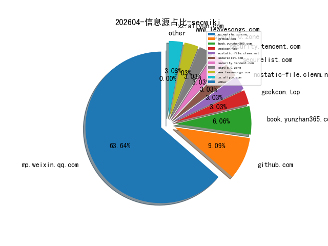
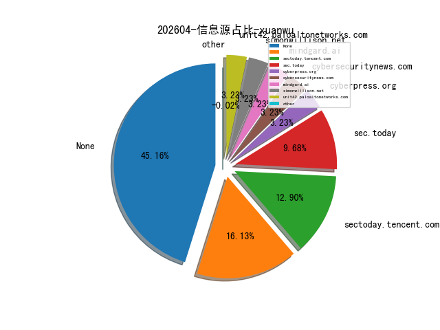
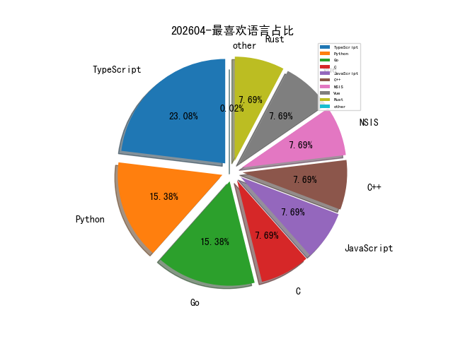

# [数据--所有](README_20.md)
# [数据--年度](README_2026.md)
# 202604 信息源与信息类型占比

# 网络安全书籍 推荐
| date_added | language | title | author | link | size| 
| --- | --- | --- | --- | --- | ---| 
| 2026-04-03 06:11:32 | English | Practical Generative AI: From Concept to Deployment | unknown | https://www.wowebook.org/practical-generative-ai-from-concept-to-deployment/ | unknown| 
| 2026-04-03 05:24:52 | English | Agentic AI for Engineers | unknown | https://www.wowebook.org/agentic-ai-for-engineers/ | unknown| 
| 2026-04-03 04:45:40 | English | Building and Training Generative AI Models | unknown | https://www.wowebook.org/building-and-training-generative-ai-models/ | unknown| 
| 2026-04-03 04:39:20 | English | Ultimate Certified Kubernetes Administrator (CKA) Certification Guide | unknown | https://www.wowebook.org/ultimate-certified-kubernetes-administrator-cka-certification-guide/ | unknown| 
| 2026-04-02 09:05:09 | English | Generative AI for Game Development | unknown | https://www.wowebook.org/generative-ai-for-game-development/ | unknown| 
| 2026-04-02 08:44:39 | English | Ultimate Certified Kubernetes Application Developer (CKAD) Certification Guide | unknown | https://www.wowebook.org/ultimate-certified-kubernetes-application-developer-ckad-certification-guide/ | unknown| 

# 微信公众号 推荐
| nickname_english | weixin_no | title | url| 
| --- | --- | --- | ---| 
| ADLab | 启明星辰 启明星辰 | 从开源仓库到链上C2：一起利用GitHub与AI热点的规模化攻击活动分析 | https://mp.weixin.qq.com/s/04ZOdzOawFnQmaCPV04xfg | 1| 
| AI赋能汽车 |  | 2026智驾未来：AI重塑汽车消费新纪元 | https://mp.weixin.qq.com/s/yEnJpcxRZZTtUSrbHPl5Qg | 2| 
| APT250 | 华华老师 华华老师 | 别被热点晃了眼，普通人还是平淡地活下去吧 | https://mp.weixin.qq.com/s/DsH1bfi_WAE3UmOqMwPMGA | 1| 
| AnWangsec | chicheng chicheng | 赛博鞭子 | https://mp.weixin.qq.com/s/rEi22lWEL2A4NShbwBzzTw | 1| 
| BlockSec | BlockSec BlockSec | BlockSec 安全周报｜八起攻击，漏洞都藏在哪？（3.23–3.29） | https://mp.weixin.qq.com/s/4VRmCfM6um2mRGIe5mSy5w | 1| 
| CISP | CNNVD CNNVD | 人工智能重要安全漏洞的通报-OpenClaw多个安全漏洞 | https://mp.weixin.qq.com/s/7Sm4XdD-by4z0ijr4cxcPA | 1| 
| CNNVD安全动态 | CNNVD CNNVD | 人工智能重要安全漏洞的通报-OpenClaw多个安全漏洞 | https://mp.weixin.qq.com/s/PQvOEWHzxckHnsLmowzcXg | 1| 
| Eonian Sharp | 永恒之锋实验室 永恒之锋实验室 | 增强espscan对openclaw的指纹识别 | https://mp.weixin.qq.com/s/7pKyDHRDM1cCw3Pr3hErug | 1| 
| HackSee安全生活 | HackSee安全团队 HackSee安全团队 | 苹果扩展iOS 18.7.7更新到更多设备以阻止暗剑漏洞 | https://mp.weixin.qq.com/s/BWaW2zk5MtJSFOl5KOfOzw | 1| 
| Hacking黑白红 | hacking hacking | 阿里P7被裁3年，现在小国企年薪28万！收入巅峰永远停在了2022年，125万 | https://mp.weixin.qq.com/s/3ZnGvyp9Uke3yFWfbBFcCw | 1| 
| ListSec | None | Google gemma 4速度还是可以的 | https://mp.weixin.qq.com/s/I6okcf-xLVf8IO5jUm9OzA | 1| 
| MicroPest | MicroPest MicroPest | 温习Hadoop编程 | https://mp.weixin.qq.com/s/MBsIwLTP3_7wxlM9fE_L_A | 1| 
| Ots安全 |  | Windows内核微型植入曝光：2000字节即可实现内存隐身与远程控制-售价1万美元 | https://mp.weixin.qq.com/s/c17SqwKI8fqdWGZHuC0mRQ | 3| 
| Sky的安全观 | 27001.CN 27001.CN | 【福利赠送】ISO 22301业务连续性管理体系导入实施案例（9）风险和机遇的识别和应对 | https://mp.weixin.qq.com/s/pLeFpn_8XB9a1vfcZW8uIA | 2| 
| T先生 Mr.Think | T先生 MrT T先生 MrT | 边界正在失效，数据正在成为安全的真正核心 | https://mp.weixin.qq.com/s/9wr3qsWugME4FswyZcurnQ | 1| 
| VenusEye服务号 | VenusEye威胁情报 VenusEye威胁情报 | 零检出威胁再升级：蔓灵花APT2026新型攻击链与高级逃逸技术深度分析 | https://mp.weixin.qq.com/s/h_G2AL9-QyKfyixXV3QrfQ | 1| 
| W不懂安全 | W不懂安全 W不懂安全 | 国内网络监管升级，“机场”频频被查，灰色产业收紧，从“翻墙整治”到互联网生态重塑，一次讲清背后的逻辑 | https://mp.weixin.qq.com/s/9UYM1qYVCtVPQDfspbb1BQ | 1| 
| YY的黑板报 | adra1n adra1n | AI 时代，开发能力正在“通货膨胀”，而“产品感”才是硬通货 | https://mp.weixin.qq.com/s/6cggCaGuOz4lM_HHRX9ryA | 1| 
| Yak Project | YAK YAK | Memfit AI 长期记忆：让渗透 Agent 告别 “失忆”，练就实战肌肉记忆 | https://mp.weixin.qq.com/s/yCM2jpi_iHGZr_RuwvPP0w | 1| 
| Z2O安全攻防 | None | 最近一年给圈友抽了近百本书？ | https://mp.weixin.qq.com/s/wu7cQMqhu4oqUpz4e7ObuQ | 1| 
| e安在线 | e安在线 e安在线 | 中央网信办、工业和信息化部、公安部关于开展2026年个人信息保护系列专项行动的公告 | https://mp.weixin.qq.com/s/lxLyXvXpZPMfdRHzBwbXpg | 1| 
| kali笔记 | 大表哥吆 大表哥吆 | Claude Code 源码泄露！3 分钟读懂整个项目 | https://mp.weixin.qq.com/s/7k3gxG5WcquZdP7KiT1KNQ | 1| 
| momo安全 | momo安全 momo安全 | 威胁情报日报 2026-04-03 | https://mp.weixin.qq.com/s/K-zxsji8UuGufmglKwOWkw | 1| 
| sec随谈 | sec随谈 sec随谈 | Joomla! 发布安全补丁：关键文件删除和 Web 服务漏洞暴露 | https://mp.weixin.qq.com/s/TO88zsQvbOvSeAyaJ5TCRg | 1| 
| solar应急响应团队 | solarsec solarsec | 2026-3月Solar应急响应公益月赛排名及官方题解 | https://mp.weixin.qq.com/s/2mnpzKlVuQi-AhszjZ642Q | 1| 
| three安全之路 | lucy lucy | 使用burpsuite插件如何无脑挖的第一个公益漏洞（小白挖洞） | https://mp.weixin.qq.com/s/lAAppfkpz9Kzm9ivM7oVDg | 1| 
| 一只岸上的鱼 | 一只岸上的鱼 一只岸上的鱼 | 让你的龙虾openclaw有专业的笔记本和知识库 | https://mp.weixin.qq.com/s/FwQcyswp3alJxVIh26WkOA | 1| 
| 个人信息违法违规处理投诉举报 |  | 中央网信办、工业和信息化部、公安部关于开展2026年个人信息保护系列专项行动的公告 | https://mp.weixin.qq.com/s/4BvVbP6uPJsErbHHI_qlUg | 1| 
| 中国信息安全 |  | CNNVD , 通报OpenClaw多个安全漏洞 | https://mp.weixin.qq.com/s/VZe-2EuXfVCHlivqLqZrLg | 7| 
| 乌雲安全 | GhostShell GhostShell | Chrome 再曝高危0day漏洞：CVE-2026-5281 ！ | https://mp.weixin.qq.com/s/4z41CoSHRR0StQ2BG8HCvQ | 1| 
| 云鼎实验室 | 腾讯云安全 腾讯云安全 | 「AI开源组件安全风险」系列二：VulnAgent发现 NVIDIA 3个AI基础设施漏洞，并获官方致谢 | https://mp.weixin.qq.com/s/XEp4P3hxLCny3Ii1FWqP0w | 1| 
| 交大捷普 |  | 捷普清明节放假保障通知请查收！ | https://mp.weixin.qq.com/s/QAJKFXZQvZoUJJXn64vD1A | 1| 
| 众亦信安 | zyxa zyxa | 那个差点让公司破产、让我坐牢的下午：我用一场网络安全惊魂，给所有职场人上了一课 | https://mp.weixin.qq.com/s/LwaSGPVHvIkUDBL7NOT2HQ | 1| 
| 信息安全与通信保密杂志社 | Cismag Cismag | 中央网信办、工业和信息化部、公安部关于开展2026年个人信息保护系列专项行动的公告 | https://mp.weixin.qq.com/s/dGK5G394GEH2yYwSE7CZjA | 3| 
| 六边形攻防安全 |  | LinIR-Linux下的应急响应采集工具 | https://mp.weixin.qq.com/s/tAzLdD5u58X0jcpWYRFwzA | 1| 
| 内生安全联盟 |  | 国际观察 , 78% 制造企业有攻击经历，制造业安全防线亟待加固 | https://mp.weixin.qq.com/s/8rOOJKiPXbp6EMV-UUUJJg | 2| 
| 北邮 GAMMA Lab | 郝宇 郝宇 | TKDE 2026｜DGP：面向图分布外检测的解耦图提示学习 | https://mp.weixin.qq.com/s/q-TmxVceHcCmXQnXbRubhw | 1| 
| 只会弱口令 | 只会弱口令 只会弱口令 | 一次渗透学员母校捡漏通杀？ | https://mp.weixin.qq.com/s/itoWbHHrelIkj4fVkfUQKA | 1| 
| 合合信息 | 合合君 合合君 | 合合信息亮相2026金融AI联盟大会，携手阿里云共同启动“超级智能体计划” | https://mp.weixin.qq.com/s/1-X-IQwKTPmLJheXzddXaw | 1| 
| 君说安全 |  | 行业资讯：中孚信息 2025年度拟不进行利润分配 | https://mp.weixin.qq.com/s/ZjnYvypaaM3POUqFTSaGEg | 5| 
| 哆啦安全 | CCMS CCMS | Paperclip方案：用组织架构、预算与工单系统，将一群AI代理运行成一家“零人力公司” | https://mp.weixin.qq.com/s/GHi_fL2REQOb92zZvF0wTg | 1| 
| 嘶吼专业版 | 胡金鱼 胡金鱼 | 嘶吼安全动态｜中央网信办等三部门开展2026年个人信息保护系列专项行动 Axios供应链攻击事件系朝鲜黑客组织所为 | https://mp.weixin.qq.com/s/T68dCRYqc-HhRqZJkOJUQg | 2| 
| 四叶草安全 | 小草 小草 | 丝享Talk沙龙·人机共潮生｜四叶草安全朱利军解析智能体安全核心解法 | https://mp.weixin.qq.com/s/ZMKM4MwPi2eHFJNiypEEhA | 1| 
| 国源天顺 | 国源天顺 国源天顺 | 图解信息安全技术 网络安全等级保护基本要求第7部分:大数据系统安全扩展要求 | https://mp.weixin.qq.com/s/yl7xmSkSOhJzWc6MdR53TQ | 2| 
| 国际云安全联盟CSA |  | 第九届云安全联盟大中华区大会成功举办：AI安全进入“原生”时代，构建韧性的数字未来 | https://mp.weixin.qq.com/s/eXXKrc9W-w38WSsjXXsVvA | 1| 
| 天创培训 | 天创培训 天创培训 | 安全预警丨OpenClaw 多项高危安全漏洞预警 | https://mp.weixin.qq.com/s/et3YPRYda6D2CciWuHXyrw | 1| 
| 天融信 |  | 天融信出席网安标委“标准周”，倡议共筑互联互通的网络安全防御体系 | https://mp.weixin.qq.com/s/vq69N11CFANpdbiLPV321A | 2| 
| 奇安信 CERT |  | 今日（2026年4月3日）OpenClaw 最新安全动态总结 | https://mp.weixin.qq.com/s/kyg_5EDT2YY7SPuIuNWjXQ | 2| 
| 奇安信病毒响应中心 | QAX病毒响应中心 QAX病毒响应中心 | 每周勒索威胁摘要 | https://mp.weixin.qq.com/s/1XFfvosrTRNB5uy2mpCVJA | 1| 
| 奇富科技安全应急响应中心 | 原360数科SRC 原360数科SRC | 安全争锋・QFSRC 众测挑战 | https://mp.weixin.qq.com/s/zyRt6-s7vzWxO8Rax77Maw | 1| 
| 威胁猎人Threat Hunter | 猎人君 猎人君 | 2026年3月全球恶意手机号趋势报告 | https://mp.weixin.qq.com/s/JR2WwODRsl5xcn9h194oXg | 1| 
| 安世加 | 安世加 安世加 | 中央网信办、工业和信息化部、公安部关于开展2026年个人信息保护系列专项行动的公告 | https://mp.weixin.qq.com/s/4Swqq33IKYNlFUuTyuIoFg | 1| 
| 安全内参 |  | 美国政府通过“破例”与“破壁”全面升级全球亲美信息战 | https://mp.weixin.qq.com/s/8SVOa-KvBp10apRiSB4eiQ | 2| 
| 安全圈的那点事儿 | 网络安全9527 网络安全9527 | OpenSSH 10.3 修复了 Shell 注入和多个 SSH 安全问题 | https://mp.weixin.qq.com/s/we8H9oPVl8GLiCuxFXL5DQ | 3| 
| 安全天书 | Hello888 Hello888 | APT都在用的权限维持 | https://mp.weixin.qq.com/s/Brs4yIbtAX9jSXJAWryDPQ | 1| 
| 安全威胁纵横 | HackerNews HackerNews | Mercor 卷入 LiteLLM 供应链攻击，Lapsus$ 叫卖 4TB 招聘数据 | https://mp.weixin.qq.com/s/ZOh9I1yWKfsqvevos1MPAg | 1| 
| 安全攻防团队 |  | 「AI开源组件安全风险」系列二：VulnAgent发现 NVIDIA 3个AI基础设施漏洞，并获官方致谢 | https://mp.weixin.qq.com/s/Ce-w-wYgWE0MgND9bpDGjw | 1| 
| 安全牛 |  | 英伟达 GPU 遭新型 Rowhammer 攻击，主机可被完全接管；Google发布Gemma 4：开源AI迈向本地化部署新阶段, 牛览 | https://mp.weixin.qq.com/s/vyix5l78DQwQmyC9oFdrkA | 2| 
| 安全艺术 | 安全艺术 安全艺术 | 资产测绘在漏洞挖掘中的应用 | https://mp.weixin.qq.com/s/jClK3tYOWByjt8997ksO2w | 1| 
| 安在 | 安在 安在 | 免费赠送 , 企业办公安全意识培训科普素材（第二十一期） | https://mp.weixin.qq.com/s/acae9Cy-f93H-5bijS6BYQ | 3| 
| 安小圈 |  | 【工具分享】弱口令爆破及字典生成工具整理，可免费下载！ | https://mp.weixin.qq.com/s/B5dvDy7ol5xr6S6QcIE_Og | 2| 
| 安恒信息 |  | 2026生态伙伴大会,安恒信息全新生态战略与政策体系重磅发布 | https://mp.weixin.qq.com/s/N7i0_gxB72dPWrLSxLVDpQ | 1| 
| 寰宇密阁 | 寰宇秘阁 寰宇秘阁 | LLMNR / NBT-NS 与 SMB 中继攻击 | https://mp.weixin.qq.com/s/k5OW28ZKISP5_XV88-2WKw | 1| 
| 小白逆向之旅 |  | a_bogus逆向对决：$86 搞定 vs $293 打了水漂 | https://mp.weixin.qq.com/s/pB0Keu17tuxK2iMBEiWpPg | 1| 
| 平航科技 |  | 【放假通知】清明安康，假期服务不停歇！ | https://mp.weixin.qq.com/s/TE-YCJerh4OBfSJF97Maug | 1| 
| 幻泉之洲 |  | 攻击路径管理的版图，终于延伸到了macOS | https://mp.weixin.qq.com/s/W3hXIrqtrouQ-_bZIhVlJA | 2| 
| 广东网警 | 公安部网安局 公安部网安局 | 网警打谣记 , 公安部网安局公布3起网络谣言典型案例 | https://mp.weixin.qq.com/s/CeWx2B8R_IZqug8JLNvROg | 1| 
| 广州网警 | 公安部网安局 公安部网安局 | 警惕弱口令，否则你的账号会“门户大开”！ | https://mp.weixin.qq.com/s/V6ilHr4jyerW52Uba5OyPA | 1| 
| 建哥聊安全 | 建哥聊安全 建哥聊安全 | 危险函数之preg_replace函数 | https://mp.weixin.qq.com/s/vgZ3TkzccBYhEFDoYtif7A | 1| 
| 异空间安全 | 异空间安全 异空间安全 | 2026 内网渗透隧道技术全解：从 Chisel 到 ICMP，一篇吃透 | https://mp.weixin.qq.com/s/epWlzeKvQYTU55joH2v3KQ | 1| 
| 弥天安全实验室 | 弥天安全实验室 弥天安全实验室 | 【成功复现】OpenCode远程代码执行漏洞(CVE-2026-22812) | https://mp.weixin.qq.com/s/L86RCrNlpz6LGqQSlcCMVw | 1| 
| 微步在线 | ThreatBook ThreatBook | Flocks狂撒万亿Token，奖励为安全奋战的你 | https://mp.weixin.qq.com/s/OPa_jbBFhhcFeYgn_HH3lw | 1| 
| 情报分析师 | 001 001 | 首尔想绕开华盛顿，用法国技术造核潜艇 | https://mp.weixin.qq.com/s/ZVBeF5FvF55Sh81ddkuFYA | 4| 
| 攻防录 | 攻防路 攻防路 | WMPFDebugger 微信小程序调试神器 | https://mp.weixin.qq.com/s/Vs4oPx7CwQKtk_ov3FHMYQ | 1| 
| 效率源 | 效率源科技 效率源科技 | 效率源 , 清明节值班安排 | https://mp.weixin.qq.com/s/dP01SDL8EVsB_CjhqrzSqw | 1| 
| 教育网络信息安全 | 教育等保测评中心 教育等保测评中心 | 招贤纳士 | https://mp.weixin.qq.com/s/q2SCuJPrbuZa4Sb51i8v6g | 7| 
| 星盟安全团队 | TokameinE TokameinE | PolarisCTF Reverse-ShakeLife WriteUp | https://mp.weixin.qq.com/s/p0h3M7QLdqm7O2qecZCVjA | 1| 
| 智探AI应用 | 点击关注→ 点击关注→ | 百融至信、百度等6家入围企业报价公布！中原消费金融2026年智能语音供应商入围项目 | https://mp.weixin.qq.com/s/KdePVLvbv9XJkQ53tuZA2w | 5| 
| 智榜样网络安全学习中心 | 小智 小智 | Kali 2026.1 重磅发布！来看看都更新了什么 | https://mp.weixin.qq.com/s/hkiCzxZ2IhvpHahnvnKclQ | 1| 
| 有赞安全应急响应中心 |  | 有赞SRC清明活动 | https://mp.weixin.qq.com/s/zuFyDtuthzp209vgZOdRgA | 1| 
| 梦醒安全 | m3x1 m3x1 | 记一次某实训系统域控攻击过程wp | https://mp.weixin.qq.com/s/mpjyptrXYYHHRi6in0Ka9A | 1| 
| 江南信安 |  | 安全资讯汇总：2026.3.30-2026.4.3 | https://mp.weixin.qq.com/s/dwzz00Exkk4ubxhaJD_O7w | 1| 
| 浪飒sec | None | AI大模型API网关 | https://mp.weixin.qq.com/s/jzx0ukZ_86p27EwqPaVjSA | 1| 
| 海哥网络安全 | 海哥网络安全 海哥网络安全 | 【2026最新版】全网最全网络攻防教程（0基础到进阶、漏洞挖掘、CTF比赛、护网行动、就业等等） | https://mp.weixin.qq.com/s/wNRCf72FjXkpzxX-TfYEHQ | 1| 
| 深信服科技 |  | 深信服签约国家人工智能应用中试基地（医疗领域）合作伙伴，共推“AI+医疗”高质量发展 | https://mp.weixin.qq.com/s/iVG1XdfIzmwzyoTY_yvbLw | 1| 
| 深圳市网络与信息安全行业协会 | NIS研究院 NIS研究院 | 三部门联合发布2026年个人信息保护系列专项行动 | https://mp.weixin.qq.com/s/lkzrkeKt9gW8WUBz7kw7rg | 1| 
| 渗透测试安全日记 | None | 场景端口漏洞组件 , 信息安全实战干货分享 | https://mp.weixin.qq.com/s/2lOHY_4DJmRGGMZcif9K6Q | 1| 
| 玄月调查小组 | 玄月调查小组 玄月调查小组 | 渗透测试迎来巨变！AWS Security Agent正式发布 | https://mp.weixin.qq.com/s/nam_dzv1maIldkVddnwFeQ | 1| 
| 珂技知识分享 | 珂字辈 珂字辈 | web选手入门pwn(34)——bllhl_book | https://mp.weixin.qq.com/s/GiWYmeWNU9dZpYN2WoyVQA | 1| 
| 白帽子章华鹏 |  | 聊聊Claude code和Agent运行时安全 | https://mp.weixin.qq.com/s/ulUVTMvbsyY6ZkFwi8Nnzg | 1| 
| 盘古石取证 |  | 2026盘古石取证-清明假期值班安排 | https://mp.weixin.qq.com/s/loD6cYBBdZOQDj48YYEALg | 1| 
| 盛邦安全WebRAY |  | 以智御变，实战向新：盛邦安全研发体系全面拥抱AI | https://mp.weixin.qq.com/s/ZLjwRdO11FbkezqTPyPQiQ | 1| 
| 盛邦安全应急响应中心 |  | 网络安全信息与动态周报2026年第13期（3月23日-3月29日） | https://mp.weixin.qq.com/s/ihl8RDx_RTeiXQJ6l_9u7Q | 2| 
| 看雪学苑 | 看雪课程 看雪课程 | 本周更新-环境篇！冰与火的战歌：Windows内核攻防实战 | https://mp.weixin.qq.com/s/gCC_B7ziDhByqW8Ah-Vexw | 4| 
| 知远战略与防务研究所 | 知远所 知远所 | “分队战术决心沙盘推演”研修班开班通知 | https://mp.weixin.qq.com/s/IqTCh7xMwKeSiggvBj6u7g | 7| 
| 空天感知 | mapxiaotu mapxiaotu | CrossEarth-SAR：首个十亿级SAR跨域语义分割基础模型，指标优异 | https://mp.weixin.qq.com/s/Dr9tfvGgSNQvSa8FT1zB0Q | 1| 
| 绿盟科技 | 绿盟君 绿盟君 | 国际认可 , 绿盟科技跻身亚太区OT安全代表厂商 | https://mp.weixin.qq.com/s/2fJw0D7FgL6xOAMqL2SB_Q | 3| 
| 绿盟科技研究通讯 | 刘文懋 刘文懋 | 开放与安全的博弈：OpenClaw爆火后的安全挑战 | https://mp.weixin.qq.com/s/pmxBtF4GgS2fp4f6yJJr8g | 1| 
| 网安前线 | Kevu Kevu | 常规测绘都扫不到的“孤岛资产”怎么找？安全运营进阶实战手册 | https://mp.weixin.qq.com/s/oZvqBIV12CpaDrjUFxHB4w | 1| 
| 网安百色 |  | 星巴克漏洞事件 | https://mp.weixin.qq.com/s/Msagzh8x7ftnUewe_CTXWA | 2| 
| 网空闲话plus | 网空闲话 网空闲话 | 网安早报【20260403】080期 | https://mp.weixin.qq.com/s/YKsFy9xwKwHorjW7Eu6olA | 1| 
| 网络技术干货圈 | 圈圈 圈圈 | 思科故障排查命令 TOP50 | https://mp.weixin.qq.com/s/UII3ZNSSrWOOuaOPLY7UOw | 3| 
| 网络技术联盟站 | None | L4的保守与担当：萝卜快跑停滞折射安全底线 | https://mp.weixin.qq.com/s/sPYIU6iYSZHRWCkfoRuGhw | 1| 
| 网络空间信息安全学习 |  | 别再手动换壁纸了，这套免费方案快到离谱！ | https://mp.weixin.qq.com/s/mYnf8c9kJh0niufFDjd_hw | 1| 
| 能信安资讯 |  | 微软发现\"AI摘要\"按钮被用于操控聊天机器人推荐内容 | https://mp.weixin.qq.com/s/0Nsf_HvaddRspNGkyws_8g | 1| 
| 腾讯安全 |  | 聚焦中小银行反电诈，中国金融传媒与腾讯联合发布《AI赋能行业共治》白皮书 | https://mp.weixin.qq.com/s/8boNIyqfjfUWriv8PuS9-g | 1| 
| 腾讯安全威胁情报中心 | 腾讯安全威胁情报 腾讯安全威胁情报 | 借\"码\"行凶 , Claude Code 源码泄露引爆供应链投毒，窃密木马暗度陈仓 | https://mp.weixin.qq.com/s/A453NsiQ8mz7cyb-0O0Pzw | 1| 
| 船山信安 | 奋斗的小浪 奋斗的小浪 | 原创 , 以选择为灯，以努力为桥，写给每一位赶路的人 | https://mp.weixin.qq.com/s/XwGb1CsLWfdnNLuCyWb3fg | 1| 
| 芸云虾扯蛋 | 芸芸众生 芸芸众生 | hw开始了，第一批开始招人 | https://mp.weixin.qq.com/s/TxHQomkWZrN-Gh8OLzRoMA | 1| 
| 虎符网络 |  | 清明节值守安排 | https://mp.weixin.qq.com/s/PTrGoaP-BQumtjor58Tj6g | 1| 
| 蚁景网络安全 |  | 【免费领】SQL Server最佳安全配置实操教程（含检测及修复） | https://mp.weixin.qq.com/s/VoFqz0S_fk2FrDiS3V6wMw | 2| 
| 表哥带我 | 泼猴爱炉罐 泼猴爱炉罐 | 将离职员工转换成赛博骨灰盒 | https://mp.weixin.qq.com/s/VBVN7gjED9fq1P0O7inDvw | 1| 
| 观安信息 |  | CSA大中华区大会｜观安信息斩获双项殊荣 解码智能体安全之道 | https://mp.weixin.qq.com/s/rtbXmDQIyjcEC-9mQJ8mdw | 1| 
| 谷安培训 | OffSec OffSec | OffSec与德勤葡萄牙宣布建立战略合作伙伴关系 | https://mp.weixin.qq.com/s/GqJq6hw8sjN3GgVkx6gXCQ | 1| 
| 贝雷帽SEC | OpenHarness OpenHarness | 一款比Claude Code轻44倍的开源Agent框架，兼容Claude全套技能和插件 | https://mp.weixin.qq.com/s/1NjF8uUT0Ess7Kd4GT3sxA | 1| 
| 运维帮 | 南非蜘蛛 南非蜘蛛 | 你喜欢被动还是主动？用proactive-agent让你的虾变成主动虾 | https://mp.weixin.qq.com/s/aSoHITCFlakhUZd8SBc9rQ | 1| 
| 迪普科技 |  | 迪普科技2026年清明假期保障通知 | https://mp.weixin.qq.com/s/yudgS94JGA3tpr4Ri2CtXQ | 1| 
| 逆向有你 | scz scz | WEB前端逆向在nodejs环境中复用webpack代码 | https://mp.weixin.qq.com/s/LxaorGOOq41gO1jVdQ0MxA | 1| 
| 道一安全 | 道一安全 道一安全 | 首发自动化渗透、代码审计、CTF、流量分析等安全相关的skills收集仓库 | https://mp.weixin.qq.com/s/u98qj6MNNslUJ-SU5Kaq4w | 1| 
| 郑州市网络安全协会 | 公安部网安局 公安部网安局 | 中央网信办、工业和信息化部、公安部关于开展2026年个人信息保护系列专项行动的公告 | https://mp.weixin.qq.com/s/PEckN2rWtp6AXFtonDc5wA | 1| 
| 金盾信安 |  | 国家网信办发布《小型个人信息处理者个人信息保护简化措施规定（征求意见稿）》 | https://mp.weixin.qq.com/s/RMaICOhoU_D84w_LmL0VgA | 3| 
| 银天信息 | 零零捌信安观察 零零捌信安观察 | 信息安全漏洞周报【第068期】 | https://mp.weixin.qq.com/s/e3Alv9ruS5kHS_A0YOjjug | 1| 
| 锐鉴安全 | None | Web前端组件漏洞总结，安服水洞必备 | https://mp.weixin.qq.com/s/JJPKbDIW90AIB4gdafBhNg | 1| 
| 阿乐你好 |  | 反蒸馏skill | https://mp.weixin.qq.com/s/5moTqKzLOVYxUmj0asXKxw | 1| 
| 陌笙不太懂安全 | 陌笙 陌笙 | 记某edusrc相同站点相同打法的二次高危挖掘 | https://mp.weixin.qq.com/s/0P2-L6acwNt5fyrjOpsB0Q | 1| 
| 隐雾安全 | 隐雾安全 隐雾安全 | 【JS解密】JS解密踩坑思路 | https://mp.weixin.qq.com/s/hvEYjaZtdqHT9qLMAomqgA | 1| 
| 零时科技 | 零时科技 零时科技 | 2.8 亿美元一夜归零 , DeFi 热潮下，你漏掉了这几道安全锁 | https://mp.weixin.qq.com/s/Ji-iPtN4BIY2BKww0zRAug | 1| 
| 骨哥说事 | 骨哥说事 骨哥说事 | 某米C400智能摄像头的逆向分析与漏洞利用 | https://mp.weixin.qq.com/s/5TAxg8bdfSCmsyKxHSkC0Q | 1| 
| 魔方安全 |  | 实力见证！魔方安全入选《2026年网络与信息安全行业全景图》 | https://mp.weixin.qq.com/s/20lRkv1pphKDQOxrcnlGJg | 2| 
| 黑客网络安全 | None | 当萝卜快跑自动驾驶变成“自动瘫痪”：一场关于L4自动驾驶架构的惨痛压力测试 | https://mp.weixin.qq.com/s/vTV6P0NmXOgKMIe2vWc4aA | 1| 
| 黑猫安全 | 鹏鹏同学 鹏鹏同学 | 孩之宝遭网络攻击，公司正调查是否发生数据泄露 | https://mp.weixin.qq.com/s/aLE1cwFVpLiPwVy77jR4ag | 3| 
| 黑白之道 |  | LinIR-Linux下的应急响应采集工具 | https://mp.weixin.qq.com/s/QmK9uqidty-0rEQydeQE5A | 4| 
| 鼎信安全 |  | 鼎信安全 , 清明节放假通知 | https://mp.weixin.qq.com/s/xanopeeATPUMBlOJl6p8fg | 1| 
| 龙哥网络安全 | 龙哥 龙哥 | 白帽挖漏洞，看这1篇就够了，12年老司机的经验 | https://mp.weixin.qq.com/s/f0xTHde1OM6IysrOZDyW9Q | 1| 
| 黑鸟 | 黑鸟 黑鸟 | 网络犯罪论坛日志揭示了参与人员的匿名网络选择习惯 | https://mp.weixin.qq.com/s/ZnwaRAM33KFu1GOAH2AXIA | 1| 

# 私人github账号 推荐
| github_id | title | url | p_url | p_profile | p_loc | p_company | p_repositories | p_projects | p_stars | p_followers | p_following | repo_lang | repo_star | repo_forks | 
| --- | --- | --- | --- | --- | --- | --- | --- | --- | --- | --- | --- | --- | --- | ---| 
| antgroup | ClawAegis：类智能体的安全纵深防御架构 | https://github.com/antgroup/ClawAegis/blob/main/README_zh.md | None | None | None | None | 0 | 0 | 0 | 0 | 0 | Python,Go,C,TypeScript,C++ | 0 | 0 | 1| 

# 日更新程序
`python update_daily.py`