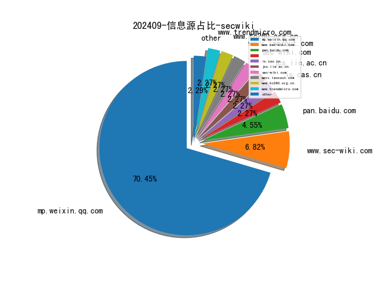
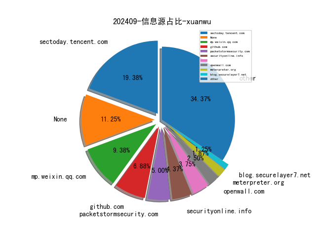
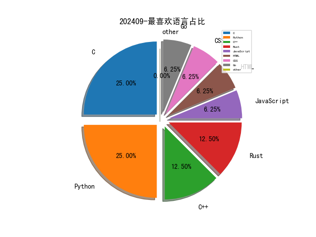

# [数据--所有](README_20.md)
# [数据--年度](README_2024.md)
# 202409 信息源与信息类型占比

# 网络安全书籍 推荐
| date_added | language | title | author | link | size| 
| --- | --- | --- | --- | --- | ---| 
| 2024-09-20 08:02:21 | English | beginners guide to streamlit with python | unknown | https://it-ebooks.info/book/1686051862-beginners_guide_to_streamlit_with_python/ | unknown| 
| 2024-09-20 08:56:07 | English | Malware Development for Ethical Hackers | unknown | https://www.wowebook.org/malware-development-for-ethical-hackers/ | unknown| 
| 2024-09-20 08:42:10 | English | Security Monitoring with Wazuh | unknown | https://www.wowebook.org/security-monitoring-with-wazuh/ | unknown| 
| 2024-09-20 07:23:57 | English | Cryptography Algorithms, Second Edition | unknown | https://www.wowebook.org/cryptography-algorithms-second-edition/ | unknown| 
| 2024-09-19 07:03:59 | English | Data Management Strategy at Microsoft | unknown | https://www.wowebook.org/data-management-strategy-at-microsoft/ | unknown| 
| 2024-09-19 01:40:10 | English | Never Search Alone: The Job Seeker’s Playbook | Phyl Terry | http://libgen.rs/book/index.php?md5=87741DBE6BEC87EFB9A9710A3521E072 | 756 kB [EPUB]| 
| 2024-09-19 00:34:02 | English | Continuous Testing, Quality, Security, and Feedback: Essential strategies and secure practices for DevOps, DevSecOps, and SRE transformations | Marc Hornbeek | http://libgen.rs/book/index.php?md5=89D482F5295E48D67A7C7712F4C390D4 | 15 MB [EPUB]| 
| 2024-09-18 13:59:58 | English | (Chapman & Hall/CRC The Python Series) Introduction to Quantitative Social Science with Python | Weiqi Zhang, Dmitry Zinoviev | http://libgen.rs/book/index.php?md5=62CA7E93660107DB2D06CD36C9267730 | 9 MB [PDF]| 
| 2024-09-18 13:59:42 | English | (Chapman & Hall/CRC The Python Series) Introduction to Quantitative Social Science with Python | Weiqi Zhang, Dmitry Zinoviev | http://libgen.rs/book/index.php?md5=CFF38192086B599C78340754F5C3A8B2 | 4 MB [EPUB]| 
| 2024-09-18 19:44:08 | English | ChatGPT For Dummies (2 Books in 1): Chatgpt Prompts & Chatgpt for Beginners - Over 300 Prompts and Learning Examples | Oliver Ruiz | http://libgen.rs/book/index.php?md5=7BE62D3DC4E4E496DA20BA85F24396EB | 2 MB [PDF]| 
| 2024-09-18 19:44:04 | English | ChatGPT For Dummies (2 Books in 1): Chatgpt Prompts & Chatgpt for Beginners - Over 300 Prompts and Learning Examples | Oliver Ruiz | http://libgen.rs/book/index.php?md5=A8624C3112C6DB947B4D10CFE36CEACD | 1 MB [EPUB]| 
| 2024-09-17 11:48:31 | English | Idiomatic Rust: Code like a Rustacean By Brenden Matthews (Final Release) | Brenden Matthews | http://libgen.rs/book/index.php?md5=C8C5F4C506FCF571017C793E94DA2619 | 2 MB [EPUB]| 
| 2024-09-17 08:19:17 | English | Mastering Microsoft Defender for Office 365 | unknown | https://www.wowebook.org/mastering-microsoft-defender-for-office-365/ | unknown| 
| 2024-09-16 16:41:28 | English | ChatGPT and AI for Accountants | unknown | https://www.wowebook.org/chatgpt-and-ai-for-accountants/ | unknown| 
| 2024-09-16 07:26:27 | English | Python Natural Language Processing Cookbook, Second Edition | unknown | https://www.wowebook.org/python-natural-language-processing-cookbook-second-edition/ | unknown| 
| 2024-09-15 19:56:15 | English | Falcon Feather and Valkyrie Sword: Feminine Shamanism, Witchcraft and Magick | Conway D.J. | http://libgen.rs/book/index.php?md5=909CEE416449EF43E377F85DA93FCC58 | 3 MB [PDF]| 
| 2024-09-14 09:15:08 | English | Supply Chain Finance: Mechanisms, Risk Analytics, and Technology | Gangshu Cai | http://libgen.rs/book/index.php?md5=E085C491817E592473840285BD5CDFB5 | 19 MB [PDF]| 
| 2024-09-14 09:15:05 | English | Supply Chain Finance: Mechanisms, Risk Analytics, and Technology | Gangshu Cai | http://libgen.rs/book/index.php?md5=C62B2D64FE7CCBD41007015550260749 | 38 MB [EPUB]| 
| 2024-09-14 09:09:59 | English | From Concept to Profit: Bold Moves, Smart Strategies, and Proven Tactics, Secrets and Insights to Kick Start Your New Business and Soar Beyond the Competition | Lloyd Morfin | http://libgen.rs/book/index.php?md5=F89AAA8193DC302046A8B909813D622E | 1 MB [PDF]| 
| 2024-09-14 09:02:11 | English | Secure Health: A Guide to Cybersecurity for Healthcare Managers | Mohamed Hammad (editor), Gauhar Ali (editor), Mohammed A. El-Affendi (editor), Yassine Maleh (editor), Ahmed A. Abd El-Latif (editor) | http://libgen.rs/book/index.php?md5=635FA33990E6D5FF2DB0468925CEA5D5 | 9 MB [PDF]| 
| 2024-09-14 09:02:09 | English | Secure Health: A Guide to Cybersecurity for Healthcare Managers | Mohamed Hammad (editor), Gauhar Ali (editor), Mohammed A. El-Affendi (editor), Yassine Maleh (editor), Ahmed A. Abd El-Latif (editor) | http://libgen.rs/book/index.php?md5=C357DEFD7C24678F567386D22FD885C4 | 7 MB [EPUB]| 
| 2024-09-14 21:16:15 | English | Engage, Excel, and Elevate with Microsoft Viva Engage: Transform Your Organization Through Communities and Conversations | Charles Waghmare | http://libgen.rs/book/index.php?md5=01354F394F9F02A431B15460C4F1E6BC | 2 MB [EPUB]| 
| 2024-09-14 21:16:12 | English | Engage, Excel, and Elevate with Microsoft Viva Engage: Transform Your Organization Through Communities and Conversations | Charles Waghmare | http://libgen.rs/book/index.php?md5=2515FA9AB021621E15C8658229710C91 | 4 MB [PDF]| 
| 2024-09-14 21:02:25 | English | CompTIA Tech+ CertMike: Prepare. Practice. Pass the Test! Get Certified!: Exam FC0-U71 (CertMike Get Certified) | Mike Chapple | http://libgen.rs/book/index.php?md5=7BC7EAD65F3C694B6FEC4A188058AAB1 | 60 MB [RAR]| 
| 2024-09-14 20:57:07 | English | Kickstart Blockchain and Cryptography Fundamentals: Navigate the Intricacies of Modern Blockchain, Cryptography, Smart Contracts, and Hyperledger for ... Real-World Transformations (English Edition) | Prof. Veerendra Kumar Jain | http://libgen.rs/book/index.php?md5=C7A9F4861EE624A639FDE6AF9BE87F2E | 44 MB [RAR]| 
| 2024-09-14 19:11:02 | English | Hack the Cybersecurity Interview: Navigate Cybersecurity Interviews with Confidence, from Entry-level to Expert roles | Christophe Foulon, Ken Underhill, Tia Hopkins | http://libgen.rs/book/index.php?md5=97B70838E93594FD3AA0F715F88471B1 | 16 MB [RAR]| 
| 2024-09-13 22:52:43 | English | Tech Leadership Playbook: Building and Sustaining High-Impact Technology Teams | Alexsandro Souza | http://libgen.rs/book/index.php?md5=482841D406AF5358B3A378CED0BF4545 | 4 MB [PDF]| 
| 2024-09-13 19:48:56 | English | IT Audit Field Manual: Strengthen your cyber defense through proactive IT auditing | Lewis Heuermann | http://libgen.rs/book/index.php?md5=8FDEC5AAC4655735C883765F859F00F9 | 5 MB [EPUB]| 
| 2024-09-13 06:30:44 | English | The Developer’s Playbook for Large Language Model Security | unknown | https://www.wowebook.org/the-developers-playbook-for-large-language-model-security/ | unknown| 
| 2024-09-13 06:05:02 | English | LLMs and Generative AI for Healthcare | unknown | https://www.wowebook.org/llms-and-generative-ai-for-healthcare/ | unknown| 
| 2024-09-12 17:40:18 | English | Raspberry Pi IoT In Python Using GPIO Zero, 2nd Edition | Harry Fairhead, Mike James | http://libgen.rs/book/index.php?md5=39C0A42D027B4A8B43B07050C297F3FF | 25 MB [PDF]| 
| 2024-09-12 20:03:28 | English | Programming with GitHub Copilot: Write Better Code--Faster! | Kurt Dowswell | http://libgen.rs/book/index.php?md5=767B5E4F3636195C26B79C4825BFD1ED | 24 MB [PDF]| 
| 2024-09-12 19:43:03 | English | Build a Website with ChatGPT: No coding experience necessary | Paul McFedries | http://libgen.rs/book/index.php?md5=34E27654C547FC433E4348606C2FA8DA | 43 MB [EPUB]| 
| 2024-09-12 19:18:18 | English | Better APIs: Quality, Stability, Observability | Mikael Vesavuori | http://libgen.rs/book/index.php?md5=255C6B2C6E78F21F173E9CE82FFB78BB | 4 MB [PDF]| 
| 2024-09-12 19:18:17 | English | Better APIs: Quality, Stability, Observability | Mikael Vesavuori | http://libgen.rs/book/index.php?md5=ECFF1C92C65834889F1249B80A2B48E6 | 4 MB [EPUB]| 
| 2024-09-12 09:11:41 | English | Continuous Testing, Quality, Security, and Feedback | unknown | https://www.wowebook.org/continuous-testing-quality-security-and-feedback/ | unknown| 
| 2024-09-12 08:55:22 | English | Mastering DevOps on Microsoft Power Platform | unknown | https://www.wowebook.org/mastering-devops-on-microsoft-power-platform/ | unknown| 
| 2024-09-12 09:51:11 | English | Generative AI Application Integration Patterns | unknown | https://www.wowebook.org/generative-ai-application-integration-patterns/ | unknown| 
| 2024-09-12 16:37:45 | English | Generative AI in Action | unknown | https://www.wowebook.org/generative-ai-in-action/ | unknown| 
| 2024-09-11 06:14:07 | English | The Early-Career Professional’s Guide to Generative AI | unknown | https://www.wowebook.org/the-early-career-professionals-guide-to-generative-ai/ | unknown| 
| 2024-09-11 14:52:18 | English | Generative AI in Action | Amit Bahree | http://libgen.rs/book/index.php?md5=A44C80EC69D5BFE2065EB9B4824D341C | 29 MB [PDF]| 
| 2024-09-11 17:08:19 | English | Building AI Intensive Python Applications | unknown | https://www.wowebook.org/building-ai-intensive-python-applications/ | unknown| 
| 2024-09-11 16:58:17 | English | UX for Enterprise ChatGPT Solutions | unknown | https://www.wowebook.org/ux-for-enterprise-chatgpt-solutions/ | unknown| 
| 2024-09-11 16:40:40 | English | MS-700 Managing Microsoft Teams Exam Guide, Third Edition | unknown | https://www.wowebook.org/ms-700-managing-microsoft-teams-exam-guide-third-edition/ | unknown| 
| 2024-09-10 10:47:47 | English | Playful Python Projects | unknown | https://www.wowebook.org/playful-python-projects/ | unknown| 
| 2024-09-10 03:14:51 | English | Microsoft Copilot for Windows 11 | unknown | https://www.wowebook.org/microsoft-copilot-for-windows-11/ | unknown| 
| 2024-09-10 11:26:02 | English | Engage, Excel, and Elevate with Microsoft Viva Engage | unknown | https://www.wowebook.org/engage-excel-and-elevate-with-microsoft-viva-engage/ | unknown| 
| 2024-09-10 19:54:47 | English | Quantum Computing and Supply Chain Management: A New Era of Optimization | Pronaya Bhattacharya; Ahdi Hassan; Pushan Kumar Dutta | http://libgen.rs/book/index.php?md5=EA3173180C1272DBDE77FDE890836FA6 | 12 MB [EPUB]| 
| 2024-09-10 19:37:51 | English | The Ansible Workshop: Hands-On Learning For Rapid Mastery | Aymen El Amri | http://libgen.rs/book/index.php?md5=83DC4CB5A6354A083367A808B98F7F66 | 1 MB [EPUB]| 
| 2024-09-10 19:36:59 | English | Computer and Information Security Handbook | John R. Vacca (editor) | http://libgen.rs/book/index.php?md5=C137B482E13FC7DE27F38BC546B10A27 | 321 MB [RAR]| 
| 2024-09-10 19:36:57 | English | Computer and Information Security Handbook | John R. Vacca (editor) | http://libgen.rs/book/index.php?md5=5BAE65A20ED77B89B219F7237904A5FE | 309 MB [EPUB]| 
| 2024-09-10 18:27:23 | English | DevSecOps for Azure: End-to-end supply chain security for GitHub, Azure DevOps, and the Azure cloud | David Okeyode, Joylynn Kirui | http://libgen.rs/book/index.php?md5=CF6649101E36539CB856730EBB43E616 | 38 MB [EPUB]| 
| 2024-09-09 07:24:54 | English | (Series of computational physics) Thermal Physics Tutorial with Python Simulations | Kouh, Minjoon; Kouh, Taejoon | http://libgen.rs/book/index.php?md5=2A27B59C720F6EE2D308330BDFA79987 | 17 MB [EPUB]| 
| 2024-09-09 07:11:28 | English | Introduction to Engineering and Scientific Computing with Python | Clough, David E.; Chapra, Steven C. | http://libgen.rs/book/index.php?md5=E05EEED69898343EC1997CE722BE4FC3 | 20 MB [EPUB]| 
| 2024-09-09 06:55:00 | English | Computational Framework for the Finite Element Method in MATLAB® and Python | Sumets, Pavel | http://libgen.rs/book/index.php?md5=948BD8F613091DDD02AF223C79F26FB4 | 9 MB [EPUB]| 
| 2024-09-09 20:19:26 | English | Public Key Cryptography: 4th International Workshop on Practice and Theory in Public Key Cryptosystems, PKC 2001, Cheju Island, Korea, February 13-15, ... (Lecture Notes in Computer Science, 1992) | Kwangjo Kim (editor) | http://libgen.rs/book/index.php?md5=076ED84707F87B2F7447F4EC41E346A8 | 4 MB [PDF]| 
| 2024-09-09 19:53:47 | English | Data Mining with Python (Chapman & Hall/CRC The Python Series) | Di Wu | http://libgen.rs/book/index.php?md5=31EA5C5FC4E9E5051F6536E370F9748B | 14 MB [PDF]| 
| 2024-09-09 19:44:09 | English | Research Methodologies in Supply Chain Management | Herbert Kotzab, Stefan Seuring (editor), Martin Müller (editor), Gerald Reiner (editor) | http://libgen.rs/book/index.php?md5=69430E0B9B8B639DE3C5CF98F4FA18DA | 3 MB [PDF]| 
| 2024-09-08 12:19:18 | English | An Introduction to Derivative Securities, Financial Markets, and Risk Management (Third Edition) | Robert A Jarrow, Arkadev Chatterjea | http://libgen.rs/book/index.php?md5=01CECBF43561DBFD045D83965C2477A7 | 9 MB [PDF]| 
| 2024-09-08 08:35:43 | English | An Introduction to R and Python For Data Analysis: A Side-By-Side Approach | Brown, Taylor R. | http://libgen.rs/book/index.php?md5=647BA26BFE108210F8B5DF841D905D21 | 13 MB [EPUB]| 
| 2024-09-08 08:30:41 | English | (the python series) Introduction to Python for Humanists | William J.B. Mattingly | http://libgen.rs/book/index.php?md5=B26E0576E7B21A6E3F080E788109E13D | 20 MB [EPUB]| 
| 2024-09-08 08:29:25 | English | Python Packages | Tomas Beuzen; Tiffany Timbers | http://libgen.rs/book/index.php?md5=A78B3D2E03B34F080FE75F5AAA953177 | 19 MB [EPUB]| 
| 2024-09-08 08:12:08 | English | MS-700 Managing Microsoft Teams Exam Guide | Nate Chamberlain, Peter Rising | http://libgen.rs/book/index.php?md5=0DE950A2831B2CBCC1689755C1DF3DC9 | 33 MB [EPUB]| 
| 2024-09-08 21:00:01 | English | Microsoft Copilot for Windows 11: Understanding the AI-Powered Features in Windows 11 | Anand Narayanaswamy | http://libgen.rs/book/index.php?md5=6D4501EC5A5DF2A8874DDBB5ABBE295C | 16 MB [EPUB]| 
| 2024-09-08 20:44:50 | English | (Routledge Studies in Linguistics) Data Analytics for Discourse Analysis with Python: The Case of Therapy Talk | Dennis Tay | http://libgen.rs/book/index.php?md5=2B54E302E6119E08B6F5D989A3554BBD | 2 MB [EPUB]| 
| 2024-09-07 16:24:46 | English | Raspberry Pi OS System Administration with systemd and Python | Robert M. Koretsky | http://libgen.rs/book/index.php?md5=4A4C01522C8FAF247636D2326C80EB58 | 5 MB [EPUB]| 
| 2024-09-07 16:24:43 | English | Raspberry Pi OS System Administration with systemd and Python | Robert M. Koretsky | http://libgen.rs/book/index.php?md5=7FFBE025FA2BA956525D0C51169283F3 | 25 MB [PDF]| 
| 2024-09-07 18:27:12 | English | AI-Driven Cybersecurity and Threat Intelligence: Cyber Automation, Intelligent Decision-Making and Explainability | Iqbal H. Sarker | http://libgen.rs/book/index.php?md5=F769FFBB6993C406159444B5BD3DEB9E | 22 MB [RAR]| 
| 2024-09-07 18:27:10 | English | AI-Driven Cybersecurity and Threat Intelligence: Cyber Automation, Intelligent Decision-Making and Explainability | Iqbal H. Sarker | http://libgen.rs/book/index.php?md5=C58A9F13BC824576B8AF52F71D3EC772 | 14 MB [EPUB]| 
| 2024-09-07 18:27:08 | English | AI-Driven Cybersecurity and Threat Intelligence: Cyber Automation, Intelligent Decision-Making and Explainability | Iqbal H. Sarker | http://libgen.rs/book/index.php?md5=33A0BD999BD50B617E1D28C4069DAECB | 7 MB [PDF]| 
| 2024-09-07 18:26:10 | English | Next-Generation Cybersecurity: AI, ML, and Blockchain (Blockchain Technologies) | Keshav Kaushik (editor), Ishu Sharma (editor) | http://libgen.rs/book/index.php?md5=2FF104CAA6BD1A29DFFFDCBEBC4095AE | 38 MB [RAR]| 
| 2024-09-07 18:26:08 | English | Next-Generation Cybersecurity: AI, ML, and Blockchain (Blockchain Technologies) | Keshav Kaushik (editor), Ishu Sharma (editor) | http://libgen.rs/book/index.php?md5=43EBB4D256B5B2FAD1C926790B76CBF3 | 27 MB [EPUB]| 
| 2024-09-07 18:26:07 | English | Next-Generation Cybersecurity: AI, ML, and Blockchain (Blockchain Technologies) | Keshav Kaushik (editor), Ishu Sharma (editor) | http://libgen.rs/book/index.php?md5=C5ECC52EF2633DD787A8C335E5EF17E7 | 10 MB [PDF]| 
| 2024-09-07 23:48:58 | English | A Simple Introduction to Python (Chapman & Hall/CRC The Python Series) | Stephen Lynch | http://libgen.rs/book/index.php?md5=1F6CFF7B5E6B0D7D295461AFCE37B2A2 | 4 MB [EPUB]| 
| 2024-09-07 23:11:47 | English | UX for Enterprise ChatGPT Solutions: A practical guide to designing enterprise-grade LLMs | Richard H. Miller | http://libgen.rs/book/index.php?md5=18B22892108866E63198412E07AD6E22 | 16 MB [EPUB]| 
| 2024-09-06 12:43:08 | English | Implementing GitOps with Kubernetes | unknown | https://www.wowebook.org/implementing-gitops-with-kubernetes/ | unknown| 
| 2024-09-06 11:22:31 | English | Microsoft Power BI Performance Best Practices, Second Edition | unknown | https://www.wowebook.org/microsoft-power-bi-performance-best-practices-second-edition/ | unknown| 
| 2024-09-05 19:33:22 | English | Incident Response for Windows | unknown | https://www.wowebook.org/incident-response-for-windows/ | unknown| 
| 2024-09-05 16:52:33 | English | DevSecOps for Azure | unknown | https://www.wowebook.org/devsecops-for-azure/ | unknown| 
| 2024-09-05 11:59:46 | English | Securing Industrial Control Systems and Safety Instrumented Systems | unknown | https://www.wowebook.org/securing-industrial-control-systems-and-safety-instrumented-systems/ | unknown| 
| 2024-09-04 09:36:27 | English | Fraud Examination | W. Steve Albrecht, Chad O. Albrecht, Conan C. Albrecht, Mark F. Zimbelman | http://libgen.rs/book/index.php?md5=217BB3B9F56D57BF514CE6144E5AB92D | 2 MB [PDF]| 
| 2024-09-04 09:01:49 | English | Starting Out with Python (Pearson+) | Tony Gaddis | http://libgen.rs/book/index.php?md5=578A4251EFD147BE3BB212205F509107 | 1 MB [PDF]| 
| 2024-09-04 06:16:12 | English | Exam Ref AZ-104 Microsoft Azure Administrator | Charles Pluta; | http://libgen.rs/book/index.php?md5=D612CBAA9567B2126D2A07BA082E6DF8 | 38 MB [EPUB]| 
| 2024-09-03 13:12:09 | English | Microsoft 365 Copilot: Harness the Power of Generative AI in the Microsoft Apps You Use Every Day | Jess Stratton | http://libgen.rs/book/index.php?md5=0990DCFADBAC0FCD55B74B360BCDCF0D | 16 MB [EPUB]| 
| 2024-09-03 13:12:04 | English | Microsoft 365 Copilot: Harness the Power of Generative AI in the Microsoft Apps You Use Every Day | Jess Stratton | http://libgen.rs/book/index.php?md5=957E5CE1F13FAA7D21EA683E46FD834C | 37 MB [PDF]| 
| 2024-09-03 21:20:48 | English | Generative AI-Powered Assistant for Developers | unknown | https://www.wowebook.org/generative-ai-powered-assistant-for-developers/ | unknown| 
| 2024-09-03 20:35:51 | English | Hack the Cybersecurity Interview, Second Edition | unknown | https://www.wowebook.org/hack-the-cybersecurity-interview-second-edition/ | unknown| 
| 2024-09-03 20:04:00 | English | Accelerating IoT Development with ChatGPT | unknown | https://www.wowebook.org/accelerating-iot-development-with-chatgpt/ | unknown| 
| 2024-09-03 19:29:42 | English | The AI Value Playbook | unknown | https://www.wowebook.org/the-ai-value-playbook/ | unknown| 
| 2024-09-03 17:22:17 | English | Machine Learning and Generative AI for Marketing | unknown | https://www.wowebook.org/machine-learning-and-generative-ai-for-marketing/ | unknown| 
| 2024-09-02 05:04:13 | English | Advanced Excel 365: Including ChatGPT Tips | Ritu Arora | http://libgen.rs/book/index.php?md5=E80745E6123FD270D452A454375DE32E | 41 MB [RAR]| 
| 2024-09-02 10:56:51 | English | Python Feature Engineering Cookbook, Third Edition | unknown | https://www.wowebook.org/python-feature-engineering-cookbook-third-edition/ | unknown| 
| 2024-09-02 09:27:09 | English | Kubernetes: An Enterprise Guide, Third Edition | unknown | https://www.wowebook.org/kubernetes-an-enterprise-guide-third-edition/ | unknown| 
| 2024-09-02 08:19:02 | English | Mark as downloadedDownloaded Security and Privacy in Web 3.0 | Meng Shen, Xiangyun Tang, Wei Wang, Liehuang Zhu | http://libgen.rs/book/index.php?md5=9BA4003927D79EAE68669272404CA14E | 6 MB [PDF]| 
| 2024-09-01 23:42:40 | English | 100 Deadly Skills: The SEAL Operatives Guide to Eluding Pursuers, Evading Capture, and Surviving Any Dangerous Situation | Clint Emerson | http://libgen.rs/book/index.php?md5=E6AB747FE1C2E60E5B7BF1226F566D71 | 53 MB [AZW3]| 

# 微信公众号 推荐
| nickname_english | weixin_no | title | url| 
| --- | --- | --- | ---| 
| CAICT可信安全 | None | 报名启动 , 中国信通院【首批】云应用安全能力评估开始报名！ | https://mp.weixin.qq.com/s?__biz=Mzk0MjM1MDg2Mg==&mid=2247501517&idx=1&sn=b14c50351b1f3e3ff18d48d04a4de5ce | 4| 
| CISSP | None | 携程信息安全部多岗位招聘！ | https://mp.weixin.qq.com/s?__biz=Mzg4MTg0MjQ5OA==&mid=2247486650&idx=1&sn=f8d1408778843e9fb76040612b2bd378 | 16| 
| Docker中文社区 | None | 使用Kubernetes进行AI推理的5个理由 | https://mp.weixin.qq.com/s?__biz=MzI1NzI5NDM4Mw==&mid=2247498075&idx=1&sn=ea44f6d79df185ad42699e942e62ff0b | 4| 
| E安全 | None | 加密平台Ghost被捣毁，涉大规模贩毒、洗钱等犯罪活动 | https://mp.weixin.qq.com/s?__biz=MzI4MjA1MzkyNA==&mid=2655347356&idx=1&sn=acc6b7818812cbebb2cc3222635159a4 | 2| 
| GoUpSec | None | Tor用户身份暴露，隐私神话破灭 | https://mp.weixin.qq.com/s?__biz=MzkxNTI2MTI1NA==&mid=2247500906&idx=2&sn=23c69665f54a1dc7acc2e25da19deefb | 7| 
| HACK之道 | None | CISP认证明天开班，速来！ | https://mp.weixin.qq.com/s?__biz=MzIwMzIyMjYzNA==&mid=2247515846&idx=2&sn=b544fa61204416f0155bd740601691c2 | 7| 
| HW安全之路 | None | 渗透测试中的神秘工具：掌握自删除文件技巧 | https://mp.weixin.qq.com/s?__biz=MzI5MjY4MTMyMQ==&mid=2247485607&idx=1&sn=f5f7a181a710e78668453e4ada74844d | 9| 
| Khan安全攻防实验室 | None | 论文一直投不中？保姆级SCI全程投稿发表服务来了！润色、选刊、投稿、返修，直至中刊！ | https://mp.weixin.qq.com/s?__biz=MzAwMjQ2NTQ4Mg==&mid=2247494884&idx=2&sn=5421ab503e365e3f5116ef54b05be910 | 14| 
| NOVASEC | None | APIFinderPlus：JS响应信息提取工具内测 | https://mp.weixin.qq.com/s?__biz=MzUzODU3ODA0MA==&mid=2247489715&idx=1&sn=ae0620567c17cd5257cd95cec4b5141b | 1| 
| Nu1L Team | None | 第七届N1CTF定档11月09日！ | https://mp.weixin.qq.com/s?__biz=MzU4MTg1NzAzMA==&mid=2247490403&idx=1&sn=22607249b24fb9206c0eb1e2c4a29568 | 2| 
| Ots安全 | None | Shwmae：（shuh-my） 是一种 Windows Hello 滥用工具，是“滥用 Windows Hello 而不断手” | https://mp.weixin.qq.com/s?__biz=MzAxMjYyMzkwOA==&mid=2247514968&idx=2&sn=29fc55639b654bf3ebf971c4074f7a32 | 23| 
| Relay学安全 | None | ShellcodeFluctuation项目解析 | https://mp.weixin.qq.com/s?__biz=Mzg5MDg3OTc0OA==&mid=2247487591&idx=1&sn=eb9fa959a6f81c12bcd2f71c8e74ba60 | 2| 
| SCA御盾 | None | 【漏洞复现】某平台-cdnfile-readfile-linux/windows任意文件读取漏洞 | https://mp.weixin.qq.com/s?__biz=MzkzNjYwODg3Ng==&mid=2247485560&idx=1&sn=0e8989ba1d3351f8d1c5a15f6d1857e3 | 4| 
| Sec探索者 | None | 【漏洞复现】泛微E-Mobile client/cdnfile 任意文件读取漏洞 | https://mp.weixin.qq.com/s?__biz=MzkyNDYwNTcyNA==&mid=2247487184&idx=1&sn=9a4ad386a3e5957a3180e70943765173 | 1| 
| TtTeam | None | 证书速通--ISO27001 Foundation | https://mp.weixin.qq.com/s?__biz=Mzg2NTk4MTE1MQ==&mid=2247485988&idx=1&sn=ddcb65ddb37cf60391564c975a7feb52 | 6| 
| Web安全工具库 | None | 渗透测试 -- 文件上传篇11课合集 | https://mp.weixin.qq.com/s?__biz=MzI4MDQ5MjY1Mg==&mid=2247514190&idx=2&sn=5fcc58be4f69438c9d56a2bbae31adf8 | 9| 
| backdoor | None | Plugx 开源情报集合 & 碎碎念 | https://mp.weixin.qq.com/s?__biz=MzI5MzkwMzU1Nw==&mid=2247485125&idx=1&sn=0e8ffd7afb1a8f1dc9318a799e6225dc | 1| 
| dotNet安全矩阵 | None | SoapShell 更新 , 新增站点根目录下适配某版本哥斯拉的WebShell | https://mp.weixin.qq.com/s?__biz=MzUyOTc3NTQ5MA==&mid=2247495404&idx=3&sn=26996229e99bf2907e96d166b41a1c1c | 17| 
| goddemon的小屋 | None | 巧用多客户端差异性获取敏感信息（斩获3k） | https://mp.weixin.qq.com/s?__biz=MzI2NTc1ODY0Mw==&mid=2247486116&idx=1&sn=8c750655d9023b2dad81592fdb802333 | 3| 
| kali笔记 | None | 常见ZIP密码破解工具 | https://mp.weixin.qq.com/s?__biz=MzkxMzIwNTY1OA==&mid=2247507995&idx=1&sn=37abf38b7b3348cae1893641c40db787 | 4| 
| moonsec | None | 【全新升级，安全精英必经之路 —— 新版渗透测试培训震撼来袭！】 | https://mp.weixin.qq.com/s?__biz=MzAwMjc0NTEzMw==&mid=2653588487&idx=1&sn=c1ecfcad3a99ee12df228b5de24bf8f6 | 2| 
| thelostworld | None | 【漏洞复现】nginxWebUI远程命令执行漏洞 | https://mp.weixin.qq.com/s?__biz=MzIyNjk0ODYxMA==&mid=2247487491&idx=1&sn=4500c396e7ceeb105a02eff13d46b73a | 5| 
| vivo安全应急响应中心 | None | 公告 , vivoSRC积分发放 | https://mp.weixin.qq.com/s?__biz=MzU4NzU1MjE4OQ==&mid=2247487854&idx=2&sn=4d50013ec11dcc5ba396b07038f85dcf | 3| 
| wavecn | None | 采购使用传呼机、对讲机归谁管？ | https://mp.weixin.qq.com/s?__biz=Mzg4Njc0Mjc3NQ==&mid=2247486399&idx=1&sn=1f1f5ebdb83befd9f923f51c969a7135 | 6| 
| 丁爸 情报分析师的工具箱 | None | 【情报实战】如何查询黎巴嫩爆炸BP机的台湾生产厂家 | https://mp.weixin.qq.com/s?__biz=MzI2MTE0NTE3Mw==&mid=2651146248&idx=1&sn=b693402828bc302591dd6d5d7e842c20 | 15| 
| 二进制磨剑 | None | IDA 技巧(58) 键盘修饰键 | https://mp.weixin.qq.com/s?__biz=MzI1Mjk2MTM1OQ==&mid=2247484738&idx=1&sn=0c38fa2f8c7408ed4446751693841b71 | 3| 
| 二进制空间安全 | None | 真主党寻呼机和对讲机同时爆炸背后的技术原理分析 | https://mp.weixin.qq.com/s?__biz=MzkxOTUyOTc0NQ==&mid=2247491657&idx=1&sn=52421af5097d8f5b7d65ee5ac29afc0c | 1| 
| 京东安全应急响应中心 | None | 【活动】反爬专项开测！ | https://mp.weixin.qq.com/s?__biz=MjM5OTk2MTMxOQ==&mid=2727838670&idx=1&sn=36e10239120ed33922f6d1d08c4faa9e | 4| 
| 信安404 | None | WmiExec可视化利用工具 | https://mp.weixin.qq.com/s?__biz=Mzk0NjQ5MTM1MA==&mid=2247492294&idx=1&sn=6b389ad16748b3e116421b054e91c305 | 3| 
| 信安王子 | None | 2024高危漏洞合集.pdf | https://mp.weixin.qq.com/s?__biz=Mzg4MjY5MDE4NA==&mid=2247484244&idx=1&sn=a877a98f54282c6411b1e94ba5fea0c8 | 4| 
| 关键信息基础设施安全保护联盟 | None | 中关村实验室2025届毕业生科研岗秋招公告 | https://mp.weixin.qq.com/s?__biz=MzkxNjU2NjY5MQ==&mid=2247506705&idx=2&sn=c1eb306201a2267335892047cc9e283f | 11| 
| 军哥网络安全读报 | None | 伊朗黑客试图窃取特朗普信息，以引起拜登竞选团队的兴趣，但未能成功 | https://mp.weixin.qq.com/s?__biz=MzI2NzAwOTg4NQ==&mid=2649792448&idx=3&sn=76704e8dfbb7d033fd805636b05e0c40 | 9| 
| 利刃信安 | None | 【装机必备】一站式打造属于自己的 Windows 装机必备软件集合 | https://mp.weixin.qq.com/s?__biz=MzU1Mjk3MDY1OA==&mid=2247516806&idx=1&sn=37cfa1a06e085d01e376491aa3bafe60 | 9| 
| 北邮 GAMMA Lab | None | 微调之外的大模型应用技术 | https://mp.weixin.qq.com/s?__biz=Mzg4MzE1MTQzNw==&mid=2247490482&idx=1&sn=75f719dbed7149e41cdc085e2b0e5c61 | 1| 
| 君说安全 | None | “两高一弱”为什么是最危险的网络安全漏洞？ | https://mp.weixin.qq.com/s?__biz=MzUzNjkxODE5MA==&mid=2247486856&idx=1&sn=110500711775a74ce280971b1e1a48ee | 5| 
| 哈拉少安全小队 | None | 高级免杀对抗&红队武器化开发五期来袭 | https://mp.weixin.qq.com/s?__biz=MzAxNzkyOTgxMw==&mid=2247493515&idx=1&sn=2eb470b2ecd75de9d09223c7350a050c | 7| 
| 哔哩哔哩技术 | None | bilibili邀您参与DataFunSummit2024：数据产品在线峰会，共创数据产品前沿技术！ | https://mp.weixin.qq.com/s?__biz=Mzg3Njc0NTgwMg==&mid=2247500526&idx=2&sn=ed633da63294a07bbf26f650ad6a0bf8 | 3| 
| 喵苗安全 | None | 每周云安全动态推送(2024.9.2-2024.9.20） | https://mp.weixin.qq.com/s?__biz=Mzg5MjkwODc4MA==&mid=2247485181&idx=1&sn=156fdd59be2d9a83a554044b35a60518 | 1| 
| 嗨嗨安全 | None | 红队笑传之穿穿部-记一次攻防演练被某部委安全团队拷打全过程 | https://mp.weixin.qq.com/s?__biz=MzIzMjg0MjM5OQ==&mid=2247487641&idx=1&sn=7adb0e4ed913302416325097309d55a8 | 2| 
| 嘶吼专业版 | None | 关于发布《网络安全标准实践指南——敏感个人信息识别指南》的通知 | https://mp.weixin.qq.com/s?__biz=MzI0MDY1MDU4MQ==&mid=2247578057&idx=2&sn=94d9a22f9856533c1f9cb9eebe3c2e05 | 10| 
| 天唯信息安全 | None | 新的 Linux 恶意软件 Hadooken 针对 Oracle WebLogic 服务器 | https://mp.weixin.qq.com/s?__biz=MzkzMjE5MTY5NQ==&mid=2247500828&idx=1&sn=63521fbc25ec48f8c1fa9ad28492366b | 9| 
| 天地和兴 | None | 黎巴嫩BB机爆炸事件：再次为供应链安全发出警示信号 | https://mp.weixin.qq.com/s?__biz=MjM5Mzk0MDE2Ng==&mid=2649608158&idx=1&sn=8988b7e21cced023b8fb7e15d299ce55 | 6| 
| 奇安信天工实验室 | None | 天工实验室诚聘漏洞挖掘工程师，多地设岗！ | https://mp.weixin.qq.com/s?__biz=Mzk0OTU2ODQ4Mw==&mid=2247486131&idx=1&sn=a1fe6ae73676b633d6bb2fd4afdca32f | 1| 
| 奇安信威胁情报中心 | None | 每周高级威胁情报解读(2024.09.13~09.19) | https://mp.weixin.qq.com/s?__biz=MzI2MDc2MDA4OA==&mid=2247512526&idx=1&sn=226aaa01d6780810c2d5bd1bb04a104e | 3| 
| 威努特安全网络 | None | 守护江海物流网络：威努特智慧港口网络安全防护方案 | https://mp.weixin.qq.com/s?__biz=MzAwNTgyODU3NQ==&mid=2651126922&idx=1&sn=79a6b03bd9e7b896c514d9a9418e1409 | 4| 
| 字节跳动技术团队 | None | 豆包招聘速递｜豆包大模型 Speech 团队热招中 | https://mp.weixin.qq.com/s?__biz=MzI1MzYzMjE0MQ==&mid=2247510496&idx=1&sn=1b9f7fcbb8929a9363a0de5e5cf553b2 | 12| 
| 安全喵喵站 | None | 应对网络威胁新策略——「中国网安科技沙龙·香港站」三期成功落幕 | https://mp.weixin.qq.com/s?__biz=MzkzNjE5NjQ4Mw==&mid=2247540860&idx=2&sn=24768338de0de93d8bb0c76dbc31b3dd | 4| 
| 安全学习那些事儿 | None | 浙江省印发《浙江省数据知识产权实务指引(试行)》 | https://mp.weixin.qq.com/s?__biz=MzkxNTI2NTQxOA==&mid=2247494135&idx=4&sn=f7491427afda41138b0f1e1b340117ac | 33| 
| 安全客 | None | 车臣领导人卡德罗夫称马斯克远程禁用其Cybertruck电动皮卡车 | https://mp.weixin.qq.com/s?__biz=MzA5ODA0NDE2MA==&mid=2649786915&idx=1&sn=e4c2e82b77e9944412dc67d88c93313e | 5| 
| 安全小工坊 | None | 双十一保卫战 14家SRC资产一键收集 | https://mp.weixin.qq.com/s?__biz=MzU5MTE4Mzk0NQ==&mid=2247484502&idx=1&sn=68dabc3fb09c8cfdb0fbe99829d9a6eb | 1| 
| 安全牛课堂 | None | ITIL4认证备考知识点（保存打印） | https://mp.weixin.qq.com/s?__biz=MzIxNTM4NDY2MQ==&mid=2247512933&idx=3&sn=fda2c8c867032d993703ca5e88039f75 | 13| 
| 安全狗的自我修养 | None | 从初始枚举到完整域名入侵 — Forest | https://mp.weixin.qq.com/s?__biz=MzkwOTE5MDY5NA==&mid=2247500192&idx=1&sn=d0c3df0e72a63333289c61f83e6010ac | 4| 
| 山石网科新视界 | None | 山石网科，中国网络安全市场100强！ | https://mp.weixin.qq.com/s?__biz=MzAxMDE4MTAzMQ==&mid=2661294383&idx=1&sn=e2453f9d93cbaa86bbfe46002b5c5bd9 | 6| 
| 平安集团安全应急响应中心 | None | 火热进行中！14家SRC邀您加入双11安全保卫战 | https://mp.weixin.qq.com/s?__biz=MzIzODAwMTYxNQ==&mid=2652145222&idx=1&sn=26cb1bc133ddfe194aee81693cbf4186 | 3| 
| 微步在线 | None | 惊险一刻：公司网络差点被打穿 | https://mp.weixin.qq.com/s?__biz=MzI5NjA0NjI5MQ==&mid=2650182322&idx=1&sn=f02f34f2ae3a876f42d8456408e97522 | 1| 
| 技术修道场 | None | HTTP Connection头字段：连接管理的幕后功臣 | https://mp.weixin.qq.com/s?__biz=MzA4NTY4MjAyMQ==&mid=2447899435&idx=1&sn=e806f762a832bcaa520a71acbc335485 | 5| 
| 掌控安全EDU | None | 重磅来袭 , 掌控安全特邀\"嘉宾课\" 扬帆起航 | https://mp.weixin.qq.com/s?__biz=MzUyODkwNDIyMg==&mid=2247543652&idx=1&sn=eb9187019bfe0abff074f632573ad467 | 14| 
| 携程安全应急响应中心 | None | 招贤纳士丨携程信息安全部社会招聘 | https://mp.weixin.qq.com/s?__biz=MzAwOTczODMxMw==&mid=2651017462&idx=1&sn=0d533f468391e45ca8ee1f7b32f85587 | 1| 
| 放之 | None | 金融安全架构设计中的反思 | https://mp.weixin.qq.com/s?__biz=Mzg3ODAzNjg5OA==&mid=2247485266&idx=1&sn=46b03ae8317f257778080688fc4f821c | 1| 
| 晓说森林 | None | 第9章 安全漏洞、威胁和对策 | https://mp.weixin.qq.com/s?__biz=Mzg3NTU1OTc3Mw==&mid=2247484316&idx=1&sn=9add825eb00efe4b88ab4532d639bd8a | 1| 
| 李白你好 | None | 黎巴嫩寻呼机（BP机）爆炸事件研判分析 | https://mp.weixin.qq.com/s?__biz=MzkwMzMwODg2Mw==&mid=2247508643&idx=1&sn=27993c2579ef4b063b0f8f5485e9e7d3 | 5| 
| 柠檬赏金猎人 | None | 阿里云accesskey利用工具 | https://mp.weixin.qq.com/s?__biz=Mzg2Mzg2NDM0NA==&mid=2247484771&idx=1&sn=c35da88f267532f40e37a7f3b5bb09ec | 2| 
| 汇能云安全 | None | 360：让安全运营“自动驾驶”照进现实 | https://mp.weixin.qq.com/s?__biz=MzIwNzAwOTQxMg==&mid=2652250499&idx=1&sn=c4d9c52a863381534c906e673cea503d | 2| 
| 河南等级保护测评 | None | AT&T将就2023年数据泄露事件支付1300万美元和解金 | https://mp.weixin.qq.com/s?__biz=Mzg2NjY2MTI3Mg==&mid=2247497174&idx=2&sn=5977325729c82c0af00246eadd5806df | 20| 
| 浅安安全 | None | 漏洞预警 , 泛微E-Office任意文件读取漏洞 | https://mp.weixin.qq.com/s?__biz=MzkwMTQ0NDA1NQ==&mid=2247490665&idx=2&sn=b97c36a928d0e083d290c17b65863c93 | 27| 
| 浩凯信安 | None | 2024年首届教育信息技术应用创新大赛！！！ | https://mp.weixin.qq.com/s?__biz=Mzk0MjY3MTM4Nw==&mid=2247483943&idx=1&sn=90c35abfa725788af7e3187ee8673ef1 | 1| 
| 渗透Xiao白帽 | None | 高级免杀&红队武器化开发五期来袭 | https://mp.weixin.qq.com/s?__biz=MzI1NTM4ODIxMw==&mid=2247501041&idx=1&sn=aaa8ba3e036cd6d4dc66165658b43bd1 | 1| 
| 渗透安全HackTwo | None | 批量SpringBoot漏洞扫描利用工具 绕过waf检测,漏洞探测 | https://mp.weixin.qq.com/s?__biz=Mzg3ODE2MjkxMQ==&mid=2247488452&idx=1&sn=c58c200c7f08cf944819e252f3754594 | 8| 
| 湖南省网络空间安全协会 | None | BP机爆炸后，对讲机也爆炸了 , 网络+供应链攻击之迷 | https://mp.weixin.qq.com/s?__biz=MzAwMTg3MDQzOA==&mid=2247510178&idx=1&sn=46976d4847692726f89ba4db01363f3c | 5| 
| 湘安无事 | None | 筑牢云安全防线：《eBPF云原生安全》实战指南 | https://mp.weixin.qq.com/s?__biz=MzU3Mjk2NDU2Nw==&mid=2247492377&idx=1&sn=8650618fc6f1d85bdb19632f8acb2ae3 | 2| 
| 炼石网络CipherGateway | None | 速下载 , 300页图解《敏感个人信息识别指南》附修订对照 | https://mp.weixin.qq.com/s?__biz=MzkyNzE5MDUzMw==&mid=2247555685&idx=1&sn=051ab6ecca53a3dac6cff0e063a2d7e9 | 4| 
| 独眼情报 | None | 什么是已知被利用漏洞 (KEV) 目录 | https://mp.weixin.qq.com/s?__biz=MzkzNDIzNDUxOQ==&mid=2247489765&idx=3&sn=e446cb2faef7325f096cd7ad4e727070 | 56| 
| 独立观察员博客 | None | 不可不知的WPF动画（Animation） | https://mp.weixin.qq.com/s?__biz=MzA3NDE0NTA0MA==&mid=2649212164&idx=1&sn=5caf433e4e2dfad883566fc53afe7207 | 4| 
| 琴音安全 | None | 关于举办2024年首届教育信息技术应用创新大赛的通知 | https://mp.weixin.qq.com/s?__biz=Mzg3NTk4MzY0MA==&mid=2247487227&idx=1&sn=149cee020fbf2f92ab27d52cc14de368 | 4| 
| 电子物证 | None | 【主流软路由取证技巧】 | https://mp.weixin.qq.com/s?__biz=MzAwNDcwMDgzMA==&mid=2651047929&idx=2&sn=fb2c018d9203290f8a587cdd9ff706e1 | 4| 
| 白帽学子 | None | 工具 , ShiroScan | https://mp.weixin.qq.com/s?__biz=MzkyNzIxMjM3Mg==&mid=2247487568&idx=1&sn=bb29264b94f7fe24a724317ff8ca0d98 | 7| 
| 白泽安全实验室 | None | APT组织UNC2970利用木马化PDF阅读器进行复杂网络攻击——每周威胁情报动态第193期（09.13-09.19） | https://mp.weixin.qq.com/s?__biz=MzI0MTE4ODY3Nw==&mid=2247492329&idx=1&sn=59423fef5dff987b31cd737cfdd7a58c | 4| 
| 祺印说信安 | None | 俄罗斯安全公司 Doctor Web 遭黑客攻击 | https://mp.weixin.qq.com/s?__biz=MzA5MzU5MzQzMA==&mid=2652110687&idx=2&sn=bad160de1ca220e2b72bfb2e6cea4337 | 4| 
| 秦安战略 | None | 王常胜：现在看，袁世凯丧权辱国的《二十一条》，依然还得警惕 | https://mp.weixin.qq.com/s?__biz=MzA5MDg1MDUyMA==&mid=2650473736&idx=4&sn=dca4f69292b09850e378ebd7713a5585 | 44| 
| 紫队安全研究 | None | 揭秘朝鲜黑客组织Kimsuky最新动作，新型木马MoonPeak浮出水面 | https://mp.weixin.qq.com/s?__biz=Mzg3OTYxODQxNg==&mid=2247484999&idx=1&sn=45a6f3d968061c2a1cb6a1f59ecfe10b | 9| 
| 网安加社区 | None | 如何攻克医疗行业网络犯罪难题？ | https://mp.weixin.qq.com/s?__biz=Mzg4MjQ4MjM4OA==&mid=2247519635&idx=1&sn=772cd3352c33573093b329f337b4e810 | 13| 
| 网络安全与人工智能研究中心 | None | 谷歌云被曝重大漏洞：或影响数百万台服务器 | https://mp.weixin.qq.com/s?__biz=MzkwMTQyODI4Ng==&mid=2247493929&idx=3&sn=301aacd85cbbe8478729ffbfdadfc3c7 | 3| 
| 网络安全与取证研究 | None | 2024龙信杯电子数据取证竞赛报名开始 | https://mp.weixin.qq.com/s?__biz=Mzg3NTU3NTY0Nw==&mid=2247489184&idx=1&sn=715d4a9593183e67232673e7ac411c3d | 8| 
| 网络安全实验室 | None | 机场招聘网络安全岗 | https://mp.weixin.qq.com/s?__biz=MzU4OTg4Nzc4MQ==&mid=2247503823&idx=5&sn=b96c3228027bbb740a7e4156e0e4f23d | 14| 
| 网络空间信息安全学习 | None | 艺术疗愈心灵：一幅画的力量 | https://mp.weixin.qq.com/s?__biz=MzI2MjcwMTgwOQ==&mid=2247491671&idx=1&sn=13d87acf11cc589c69ff7e5e76c1fb6e | 5| 
| 船山信安 | None | 浅谈FastAPI框架下的内存马 | https://mp.weixin.qq.com/s?__biz=MzU2NDY2OTU4Nw==&mid=2247516279&idx=1&sn=4d487bd5aeba7cc466d40de054850075 | 11| 
| 良月安全 | None | [漏洞复现]泛微e-mobile cdnfile文件读取漏洞分析复现 | https://mp.weixin.qq.com/s?__biz=MzkzMDcxNzg4MA==&mid=2247484314&idx=1&sn=9821b870efd35bab88ba180270d34b1a | 3| 
| 苏说安全 | None | 2024年安徽省重点工业互联网平台公布 | https://mp.weixin.qq.com/s?__biz=Mzg5OTg5OTI1NQ==&mid=2247488605&idx=1&sn=104aa9b0d1010a096f71b0bce24a88b5 | 10| 
| 菜鸟学信安 | None | 某护网中的小程序渗透 | https://mp.weixin.qq.com/s?__biz=MzU2NzY5MzI5Ng==&mid=2247502880&idx=1&sn=226fe86d766524629dfab08d2ce0e619 | 3| 
| 薄说安全 | None | 轨道交通通用安全平台的需求浅析 | https://mp.weixin.qq.com/s?__biz=Mzg2NzU3MzkyMg==&mid=2247484475&idx=1&sn=303f7468dba4e61880f7622042600b2e | 1| 
| 融云攻防实验室 | None | 漏洞预警 天融信运维安全审计系统 login.jsp存在命令执行漏洞 | https://mp.weixin.qq.com/s?__biz=MzkyMTMwNjU1Mg==&mid=2247491747&idx=1&sn=41a03390c1d46b06512fd6e2f52e89ce | 1| 
| 计算机与网络安全 | None | 智慧物流落地场景解决方案 | https://mp.weixin.qq.com/s?__biz=MjM5OTk4MDE2MA==&mid=2655255602&idx=8&sn=f00caaa11e572e2f7e16d7dd32c82c25 | 64| 
| 逆向有你 | None | 蕾丝之约：转身遇见爱 | https://mp.weixin.qq.com/s?__biz=MzA4MzgzNTU5MA==&mid=2652036093&idx=2&sn=c2788dc33d603672fabfef7f6081c640 | 10| 
| 透明魔方 | None | 读读《中华人民共和国数据安全法》 | https://mp.weixin.qq.com/s?__biz=MzI4NzA1Nzg5OA==&mid=2247485446&idx=1&sn=3f7844647665027f8fb9f056664b356a | 7| 
| 道一安全 | None | 不知不觉间，您的隐私正在被窃取！ | https://mp.weixin.qq.com/s?__biz=MzU5OTMxNjkxMA==&mid=2247486943&idx=1&sn=1ce528f4ebf271d736df1c2d249d3a67 | 3| 
| 释然IT杂谈 | None | 【Tools】一个专门为CTF设计开箱即用的操作系统CTF-OS | https://mp.weixin.qq.com/s?__biz=MzIxMTEyOTM2Ng==&mid=2247503804&idx=1&sn=2fba90f2aaedb0b659cda8017d9a9a2f | 1| 
| 重生之成为赛博女保安 | None | 关于举办2024年首届教育信息技术应用创新大赛的通知 | https://mp.weixin.qq.com/s?__biz=MzIxOTQ1OTY4OQ==&mid=2247485818&idx=1&sn=85e9812a0bc811ec037831d317a55240 | 4| 
| 钟毓安全 | None | 一款集成化的Web渗透测试工具集 | https://mp.weixin.qq.com/s?__biz=MzkzNjM5NDU0OA==&mid=2247486114&idx=1&sn=dfed437c951dbce2bef9ff1c79ea00d6 | 3| 
| 银遁安全团队 | None | 【0day】某软件开发有限公司王道4S管理系统GetKuCunInfo存在SQL注入漏洞 | https://mp.weixin.qq.com/s?__biz=MzU3MjU4MjM3MQ==&mid=2247487609&idx=1&sn=078bd5e26c040c44866d0580c2a259d9 | 5| 
| 阿呆攻防 | None | 9.22晚7点SpringKill公开课讲反序列化 | https://mp.weixin.qq.com/s?__biz=MzIzNDU5Mzk2OQ==&mid=2247486269&idx=1&sn=8a12893d6319a2a80e6e7636a8ce6583 | 2| 
| 阿里安全响应中心 | None | 奖金池丰厚！淘天电商反爬专项众测活动火热进行中 | https://mp.weixin.qq.com/s?__biz=MzIxMjEwNTc4NA==&mid=2652995533&idx=1&sn=ee8cedc36b667dbe3c25cbc80e2f3f83 | 6| 
| 青春计协 | None | 一次简单通用未授权漏洞挖掘 | https://mp.weixin.qq.com/s?__biz=Mzg4MzU3MTcwNg==&mid=2247485719&idx=1&sn=3824e63b8c04f2ff371ffb48e88d1601 | 3| 
| 飞羽技术工坊 | None | 一个月，自己开发的小程序从上线到退休 | https://mp.weixin.qq.com/s?__biz=MzkwODQyMjgwNg==&mid=2247485173&idx=1&sn=a78379f96bd8a8bf67068faf41500e26 | 2| 
| 马赛克安全实验室 | None | 【漏洞复现】nginxWebUI远程命令执行漏洞 | https://mp.weixin.qq.com/s?__biz=MzI5MzU4ODE5Mw==&mid=2247485352&idx=1&sn=a8a7b44bdc74941e7488c27e3347aee0 | 5| 
| 高等精灵实验室 | None | 纯干货不啰嗦，全国31省IPTV组播地址合集！ | https://mp.weixin.qq.com/s?__biz=MzA4MjkzMTcxMg==&mid=2449045980&idx=1&sn=8973ba9edb43dd6d32dd9db8e169da2d | 7| 
| 黑猫安全 | None | 国际刑事警察行动拆解了黑客团伙“Ghost”通信平台 | https://mp.weixin.qq.com/s?__biz=Mzg3OTc0NDcyNQ==&mid=2247492430&idx=3&sn=2fb335d2a62183bb2cb58941b64b9126 | 3| 
| 黑白之道 | None | 文末赠书,不知不觉间，您的隐私正在被窃取！ | https://mp.weixin.qq.com/s?__biz=MzAxMjE3ODU3MQ==&mid=2650600632&idx=2&sn=d4351b264a8eae1679d252729ba47240 | 29| 
| 3072 | None | Off-By-One Con2024 N-day fullchain 利用 | https://mp.weixin.qq.com/s?__biz=MzU4OTk0NDMzOA==&mid=2247489979&idx=2&sn=01c03249efe77c11e4b275bcac0c9879 | 3| 
| 360数字安全 | None | 首批！360安全大模型获中国信通院基础网络安全能力评估认证 | https://mp.weixin.qq.com/s?__biz=MzA4MTg0MDQ4Nw==&mid=2247575538&idx=2&sn=e92cf40795c506ba25020609ab32b2ef | 20| 
| APP个人信息保护治理 | None | 筑基蓄力再升级，APP认证签名技术标准上升为行业标准 | https://mp.weixin.qq.com/s?__biz=MzU3NzYzOTIwNg==&mid=2247486196&idx=1&sn=9ef2d43ba62ec6269008a853379537eb | 2| 
| BOSS直聘安全应急响应中心 | None | 活动已开启｜ BOSS直聘SRC邀您加入双11安全保卫战 | https://mp.weixin.qq.com/s?__biz=MzkyODIwNDI3NA==&mid=2247486136&idx=1&sn=2c8b7f7e58fc7e69b4781d601536be2b | 2| 
| CatalyzeSec | None | 【CTF】Linux-动态链接器 | https://mp.weixin.qq.com/s?__biz=MzkxNjY1MjY3OQ==&mid=2247486380&idx=1&sn=678056501d026066008b4141d0e5d09f | 8| 
| CertiK | None | CertiK：Ventures宣布4500万美元投资计划，Token Scan等社区安全工具免费开放 | https://mp.weixin.qq.com/s?__biz=MzU5OTg4MTIxMw==&mid=2247503377&idx=1&sn=82482f53401e048333e072581f046162 | 7| 
| Hacking黑白红 | None | 黎巴嫩寻呼机爆炸，罪魁祸首-网络安全供应链安全？ | https://mp.weixin.qq.com/s?__biz=Mzg2NDYwMDA1NA==&mid=2247540619&idx=2&sn=44228666c631ebed84ba3fb57757e735 | 13| 
| IoVSecurity | None | S32 汽车处理平台的安全架构 | https://mp.weixin.qq.com/s?__biz=MzU2MDk1Nzg2MQ==&mid=2247613445&idx=3&sn=5627a9974e72d085723a28a45d7527b9 | 39| 
| KCon 黑客大会 | None | 定义网安培训新风向，KCon有奖调研等你发声！ | https://mp.weixin.qq.com/s?__biz=MzIzOTAwNzc1OQ==&mid=2651138057&idx=1&sn=af6c8c16b677b9636dd4625304c810e5 | 1| 
| PolarCTF | None | PolarCTF 网络安全2024秋季个人挑战赛：赛前培训与答疑直播即将开启！ | https://mp.weixin.qq.com/s?__biz=MzU5NzY2OTQ0Mg==&mid=2247484228&idx=1&sn=930a1d6022cb0b945a5aac32037b5b4e | 1| 
| T0daySeeker | None | Patchwork(白象)APT组织PGoshell后门攻击场景复现 | https://mp.weixin.qq.com/s?__biz=MzAwNDUzNDExMQ==&mid=2247485066&idx=1&sn=558a7a2dfc736e15b0826905c799ef0f | 3| 
| WIN哥学安全 | None | SSRF打穿内网 | https://mp.weixin.qq.com/s?__biz=MzkwODM3NjIxOQ==&mid=2247501833&idx=1&sn=650a086ea1158057dec8d9fd714b2ade | 2| 
| WebSec | None | (0day新接口)某资产管理运营系统存在SQL注入漏洞 | https://mp.weixin.qq.com/s?__biz=MzkyMzYwNTEyNg==&mid=2247487078&idx=1&sn=8fb2c5f2d9cd6a4c2579fa694dda5a03 | 2| 
| WeeklyFeed | None | IM推广的部分案例与原理 | https://mp.weixin.qq.com/s?__biz=Mzk0NTMxMzExMA==&mid=2247483837&idx=1&sn=40d08dd8d32db9c4b349b295d9dbed02 | 1| 
| Z2O安全攻防 | None | 建了个SRC专项漏洞知识库 | https://mp.weixin.qq.com/s?__biz=Mzg2ODYxMzY3OQ==&mid=2247515495&idx=2&sn=da6a6ac0f91f10afad4ab7f3301b6a41 | 21| 
| fkalis | None | 【海外SRC赏金挖掘】供应链攻击，通过依赖投毒实现RCE（Dependency Confusion 漏洞） | https://mp.weixin.qq.com/s?__biz=MzkyODcwOTA4NA==&mid=2247485533&idx=1&sn=b70b23874678655aa24a3f25024b593d | 11| 
| 一己之见安全团队 | None | 看完？你就有了等保项目经验！ | https://mp.weixin.qq.com/s?__biz=MzkzNzY3ODk4MQ==&mid=2247484078&idx=1&sn=b7ffa8a47965ab6e34ed0ea8b6152a31 | 1| 
| 中国保密协会科学技术分会 | None | 手机直连卫星技术综述（上篇） | https://mp.weixin.qq.com/s?__biz=MzIxMzI4ODI1MA==&mid=2247488617&idx=1&sn=4bee848372a5a599440e7f6d936b0ee8 | 2| 
| 中国信息安全 | None | 评论 , 使用AI技术当守住法律边界 | https://mp.weixin.qq.com/s?__biz=MzA5MzE5MDAzOA==&mid=2664225743&idx=6&sn=f28acc79971516f4dfcd5893d8c6038a | 73| 
| 中国网络空间安全协会 | None | 网络安全系列公益课之四【防范网络沉迷】 | https://mp.weixin.qq.com/s?__biz=MzA3ODE0NDA4MA==&mid=2649400305&idx=1&sn=2d5d93b7130833b9234dd32b8e8f752e | 15| 
| 云科安信Antira | None | 攻击者视角看安全，全域风险防护还能这样做！ | https://mp.weixin.qq.com/s?__biz=Mzg2NTk3NjczNQ==&mid=2247485227&idx=1&sn=0d0d7f0ec6b96485fc25452dca5d9fa8 | 2| 
| 云起无垠 | None | 云起无垠荣获第九届“创客中国”网络安全专题赛二等奖 | https://mp.weixin.qq.com/s?__biz=Mzg3Mjg4NTcyNg==&mid=2247489739&idx=1&sn=92678d0e63354223a81e11fd8e83827f | 4| 
| 亚信安全 | None | 黎巴嫩BP机一声炸响，开启了未来网络战的新形态 | https://mp.weixin.qq.com/s?__biz=MjM5NjY2MTIzMw==&mid=2650618959&idx=1&sn=4df8560e56841ce26a4e0b7cbb936fe4 | 18| 
| 代码卫士 | None | CISA、FBI督促消除XSS漏洞 | https://mp.weixin.qq.com/s?__biz=MzI2NTg4OTc5Nw==&mid=2247520856&idx=2&sn=e42af408ee177430c69f52668c7cc6eb | 19| 
| 众智维安 | None | RedOps⁺安全意识联合一体化平台，构建更全面的安全防护体系 | https://mp.weixin.qq.com/s?__biz=MzU5Mjg0NzA5Mw==&mid=2247493203&idx=1&sn=06d9e677853b70290bc99c04ac5cd6d9 | 5| 
| 信息安全与通信保密杂志社 | None | 不履行网络安全保护义务，内蒙古网警通报多家单位 | https://mp.weixin.qq.com/s?__biz=MzkwMTMyMDQ3Mw==&mid=2247593844&idx=3&sn=8152fd0d2c948ee58190daaaf07c6b85 | 35| 
| 信息安全国家工程研究中心 | None | 处罚案例 , 不履行网络安全保护义务是违法行为！多家单位被通报！ | https://mp.weixin.qq.com/s?__biz=MzU5OTQ0NzY3Ng==&mid=2247497776&idx=1&sn=31baebf52ccd59c2676776e39f28e677 | 3| 
| 信息安全研究 | None | 【业界动态】全国一体化算力网应用优秀案例集之五 , 构建算网融合平台 赋能行业场景应用 | https://mp.weixin.qq.com/s?__biz=MzA3NzgzNDM0OQ==&mid=2664989885&idx=3&sn=915a8f572c0fc3371acbd16289b3a20a | 32| 
| 儒道易行 | None | 2024健身打卡第 46 天 | https://mp.weixin.qq.com/s?__biz=Mzg5NTU2NjA1Mw==&mid=2247492782&idx=1&sn=bb8704bfbcc1dfe627a1d0ecf020938d | 17| 
| 全球技术地图 | None | 美国和日本即将达成协议，限制对华芯片技术出口 | https://mp.weixin.qq.com/s?__biz=MzI1OTExNDY1NQ==&mid=2651615713&idx=2&sn=112973472f7b8205e5d7eed3746b1e88 | 23| 
| 内生安全联盟 | None | 研究调查 , 大多数网络领导者担心AI生成的代码会增加风险 | https://mp.weixin.qq.com/s?__biz=Mzg4MDU0NTQ4Mw==&mid=2247523705&idx=2&sn=002f24802d3d39b6109645fece0bb860 | 28| 
| 军机故阁 | None | 国外航班跟踪的OSINT工具资源 | https://mp.weixin.qq.com/s?__biz=MzU5Mjk3MDA5Ng==&mid=2247486316&idx=1&sn=2d6ee2deb28194ade0710f57a8e84563 | 3| 
| 冷漠安全 | None | 「漏洞复现」华望云会议管理平台 checkDoubleUserNameForAdd SQL注入漏洞 | https://mp.weixin.qq.com/s?__biz=MzkyNDY3MTY3MA==&mid=2247485498&idx=1&sn=eef8d9f5be09d05d40f17078b097d54b | 12| 
| 创信华通 | None | 网络安全为人民，网络安全靠人民！创信华通国家网络安全宣传周活动回顾 | https://mp.weixin.qq.com/s?__biz=MzUxNTQxMzUxMw==&mid=2247523886&idx=1&sn=8b549654093ff87f4537310ffb77c5fa | 6| 
| 北京路劲科技有限公司 | None | 易行网安学习平台技能测试，引领精准学习之旅 | https://mp.weixin.qq.com/s?__biz=MzUyMjAyODU1NA==&mid=2247491621&idx=1&sn=7793d8fc7d03aaf234d0236e455cd8d3 | 5| 
| 华顺信安 | None | 案例精讲 , FOBrain带你领略运营商的资产安全运营和降本增效平衡秘籍 | https://mp.weixin.qq.com/s?__biz=MzUzNjg1OTY3Mg==&mid=2247491653&idx=1&sn=2eefd37875cdbedc410003ba9849693b | 4| 
| 南风漏洞复现文库 | None | 泛微移动管理平台E-mobile client/cdnfile/接口存在任意文件读取 附POC | https://mp.weixin.qq.com/s?__biz=MzIxMjEzMDkyMA==&mid=2247487354&idx=1&sn=5fc612abdc315c3f5a468470a5cbd51a | 4| 
| 卡巴斯基网络安全大百科 | None | 2024 年后量子密码学将在何处以及如何使用 | https://mp.weixin.qq.com/s?__biz=MzAxNjg3MjczOA==&mid=2247485965&idx=1&sn=d61bc3a98c4fbdff8ce7ad228b4c2eb4 | 4| 
| 合规渗透 | None | 脑洞大开的新型钓鱼方法 -- reCAPTCHA 网络钓鱼 | https://mp.weixin.qq.com/s?__biz=MzkzOTI2NjUyNA==&mid=2247484997&idx=1&sn=6408afd8d8478e6cacaf36606c0b7ae5 | 4| 
| 吉祥在职场 | None | 十一居然要值班！又是想辞职的一天！ | https://mp.weixin.qq.com/s?__biz=MzI1ODY3MTA3Nw==&mid=2247486370&idx=1&sn=92f02881eba5cb678489a73e870580b9 | 5| 
| 吉祥学安全 | None | 从黎巴嫩寻呼机爆炸，看网络安全供应链安全 | https://mp.weixin.qq.com/s?__biz=MzkwNjY1Mzc0Nw==&mid=2247485883&idx=1&sn=49d7c68b2388b5985aac28ea66dbfe37 | 10| 
| 启明星辰集团 | None | 以“算”为擎 以“智”扬帆 , 启明星辰出席2024中国移动数智金融大会 | https://mp.weixin.qq.com/s?__biz=MzA3NDQ0MzkzMA==&mid=2651727993&idx=1&sn=687f6065d351e3d1b7c737658c7450bd | 16| 
| 商密君 | None | BP机爆炸后，对讲机也爆炸了 , 网络+供应链攻击之迷 | https://mp.weixin.qq.com/s?__biz=MzI5NTM4OTQ5Mg==&mid=2247630599&idx=5&sn=14242a639d664f0fe7d25a25f4af14aa | 59| 
| 喵星安全研究所 | None | 吃瓜丨可曾听闻HTTP语言？ | https://mp.weixin.qq.com/s?__biz=Mzg2MTg4NTMzNw==&mid=2247484146&idx=1&sn=d402b4540df3b4fb7f165fb9eaa647fd | 1| 
| 四叶草安全 | None | 四叶草安全受邀参加文景企业家座谈会 | https://mp.weixin.qq.com/s?__biz=MjM5MTI2NDQzNg==&mid=2654551859&idx=1&sn=48ae5f01f24f1b73c14757c57ea6923b | 3| 
| 国家互联网应急中心CNCERT | None | 上周关注度较高的产品安全漏洞(20240909-20240915) | https://mp.weixin.qq.com/s?__biz=MzIwNDk0MDgxMw==&mid=2247499350&idx=2&sn=4102c823ee70a61fbb84a0eb8d98af47 | 9| 
| 塞讯安全验证 | None | 警惕全球无差别攻击威胁，Hunters International 卷土重来！ | https://mp.weixin.qq.com/s?__biz=Mzk0MTMzMDUyOA==&mid=2247500821&idx=3&sn=669de99cbb7dd9a67d132e352957dfd6 | 4| 
| 天融信教育 | None | 天融信出席「第八届深港澳大数据论坛」，谈AI赋能打造网安新质生产力 | https://mp.weixin.qq.com/s?__biz=MzU0MjEwNTM5Ng==&mid=2247519748&idx=1&sn=0b3bfd26732c413c98c994d265def605 | 18| 
| 奇安信集团 | None | 因勒索攻击泄露患者敏感数据，这家医疗巨头赔偿超4.6亿元 | https://mp.weixin.qq.com/s?__biz=MzU0NDk0NTAwMw==&mid=2247618362&idx=2&sn=21e0357b23806afcc366f0db4c01e943 | 29| 
| 安世加 | None | 安全聘 , 小米诚邀您的加入 | https://mp.weixin.qq.com/s?__biz=MzU2MTQwMzMxNA==&mid=2247540074&idx=1&sn=2340841a78f11e70e5fc1a217eb677ae | 16| 
| 安信安全 | None | 真主党寻呼机连环爆炸，疑似暗藏以色列恶意软件 | https://mp.weixin.qq.com/s?__biz=MzAxNTYwOTU1Mw==&mid=2650091939&idx=1&sn=dc0c2c42f5166c91b50a7070da56807a | 5| 
| 安全419 | None | “BP机爆炸”事件 可能重新定义未来的网络战 | https://mp.weixin.qq.com/s?__biz=MzUyMDQ4OTkyMg==&mid=2247542347&idx=1&sn=f3336ffb5fc0c87feabf17fa7122abcc | 26| 
| 安全分析与研究 | None | 伪装成京东金融候选人登记表的钓鱼样本详细分析 | https://mp.weixin.qq.com/s?__biz=MzA4ODEyODA3MQ==&mid=2247488894&idx=1&sn=f626fdd3d0285f60d61d01cb47a9e97c | 3| 
| 安全圈 | None | 【安全圈】建筑行业会计软件Foundation遭受攻击，威胁行为者利用MSSQL漏洞进行入侵 | https://mp.weixin.qq.com/s?__biz=MzIzMzE4NDU1OQ==&mid=2652064524&idx=3&sn=ac02f46258dacbf415152fe2bad17d2e | 56| 
| 安全新说 | None | 关于发布《网络安全标准实践指南——敏感个人信息识别指南》的通知 | https://mp.weixin.qq.com/s?__biz=MzA3NDIwNTY5Mw==&mid=2247506232&idx=1&sn=4ecf9be4c27e7673811ef39525fe398b | 7| 
| 安全方案与实践 | None | 传统网络安全与零信任网络安全的对比 | https://mp.weixin.qq.com/s?__biz=MzkyMzU2NjQyNA==&mid=2247483852&idx=1&sn=2b574ae426dc92ec7d09e1de9a39308c | 1| 
| 安全极客 | None | “AI+Security”系列第3期（二）：AI赋能自动化渗透测试 | https://mp.weixin.qq.com/s?__biz=MzkzNDUxOTk2Mw==&mid=2247494680&idx=1&sn=a22762d0b01d03e5b57d2a4add551a1b | 7| 
| 安全的矛与盾 | None | 工具更新-修复过数字杀毒注入的崩溃问题 | https://mp.weixin.qq.com/s?__biz=Mzg5MDc4OTUyNg==&mid=2247484511&idx=1&sn=38aef215d492d92cfffa222cfbbcea93 | 2| 
| 安全社 | None | 安全圈神偷毒瘤\"星落安全\" | https://mp.weixin.qq.com/s?__biz=MzkwMzUyNDIwMA==&mid=2247484055&idx=1&sn=d6357ae83ad19ba92658fbc10b487b25 | 3| 
| 安协小天使 | None | Vidar-Team 信息安全协会2024招新啦！！！ | https://mp.weixin.qq.com/s?__biz=MzIxNDU2ODg3Mw==&mid=2247485937&idx=1&sn=2a5b65923c4d8ed820a1f3549aafb35c | 1| 
| 安恒信息 | None | 浙江省新质生产力科普体验馆花落安恒信息！还有更多全国科普日精彩等你解锁 | https://mp.weixin.qq.com/s?__biz=MjM5NTE0MjQyMg==&mid=2650615345&idx=2&sn=54fcc5992b3c6408f9f2d27766817311 | 11| 
| 安知讯 | None | 金融监管总局：金融机构应加强App数据安全管理、建立移动应用个人信息保护制度 | https://mp.weixin.qq.com/s?__biz=MzIxMDIwODM2MA==&mid=2653930825&idx=1&sn=b52a1c36ceee2af36f9d391d1c6d01a4 | 24| 
| 安芯网盾 | None | 安芯网盾荣获CREST认证，网络安全服务能力获国际权威认可 | https://mp.weixin.qq.com/s?__biz=MzU1Njk1NTYzOA==&mid=2247491312&idx=1&sn=2fc27cdcaa48fa8f33885ceaa4c96960 | 2| 
| 小红书技术REDtech | None | 小红书推出AIGC加速新算法TDD | https://mp.weixin.qq.com/s?__biz=Mzg4OTc2MzczNg==&mid=2247491246&idx=1&sn=9600802fbe114bd9e60061778d029cee | 3| 
| 小羊安全屋 | None | 【文件读取】泛微E-Mobile-client/cdnfile | https://mp.weixin.qq.com/s?__biz=MzkyMTY1NDc2OA==&mid=2247486823&idx=1&sn=78b77bfa6e5032ca1e442abaf9748644 | 1| 
| 工业互联网标识智库 | None | 辽宁省工业互联网标识解析“贯通”行动计划正式启动 , 2024全球工业互联网大会 | https://mp.weixin.qq.com/s?__biz=MzU1OTUxNTI1NA==&mid=2247590977&idx=1&sn=097e2f537cb2bbe6557696455c26463d | 8| 
| 开源聚合网络空间安全研究院 | None | 【安全科普】OSS存储桶漏洞总结 | https://mp.weixin.qq.com/s?__biz=MzI4NTE4NDAyNA==&mid=2650396972&idx=1&sn=cf200ebcf2ba4ee3988760f23507cc03 | 3| 
| 张无瑕思密达 | None | 中国人有福了！极氪汽车和以色列智驾公司Mobileye强强联合，加快在华技术落地 | https://mp.weixin.qq.com/s?__biz=MzkwMzI1ODUwNA==&mid=2247487472&idx=1&sn=1d59125ffcedacc7d7b2c3e0107278f8 | 3| 
| 影域实验室 | None | Windows钩子技术与恶意软件应用 | https://mp.weixin.qq.com/s?__biz=MzkzODU3MzA5OQ==&mid=2247484860&idx=1&sn=a686479e22a8edd7f503a80feab84565 | 1| 
| 微博安全应急响应中心 | None | 司令5w！微博安全活动即将开启｜14家SRC邀您参加双11安全保卫战 | https://mp.weixin.qq.com/s?__biz=MzI3MzQ0OTQ2MQ==&mid=2247485912&idx=1&sn=68a09a41d3230fa974845ca6dd1fb411 | 1| 
| 快手安全应急响应中心 | None | 活动已开启｜快手SRC邀您加入双11安全保卫战 | https://mp.weixin.qq.com/s?__biz=MzU5MDg0MDc2MQ==&mid=2247496401&idx=1&sn=f1e8367acc100f543dbb6686b8272ff8 | 1| 
| 思极安全实验室 | None | 1day-网御某网关任意文件下载(未公开) | https://mp.weixin.qq.com/s?__biz=MzAwOTQzMjMwOQ==&mid=2247483810&idx=1&sn=1d939ece528f93d1267a9d29980dda2c | 1| 
| 情报分析师 | None | 西方非政府组织在吉尔吉斯斯坦的操控分析 | https://mp.weixin.qq.com/s?__biz=MzA3Mjc1MTkwOA==&mid=2650555056&idx=2&sn=8770ede2571442a678aa16ca72f6134f | 10| 
| 情报分析师Pro | None | 黎巴嫩爆炸案后，日本无线电设备制造商 Icom 今天宣布启动一项内部调查 | https://mp.weixin.qq.com/s?__biz=MzkwNzM0NzA5MA==&mid=2247500570&idx=1&sn=f8870fe71eba5b4b7b16c62cfcd01c32 | 4| 
| 情报分析站 | None | 事件调查中 （使用） 声音的基础知识 | https://mp.weixin.qq.com/s?__biz=MzkxMDIwMTMxMw==&mid=2247493844&idx=1&sn=7da6bdf8afd1643ccf92d02680a0ab8c | 3| 
| 攻防实验室 | None | eBPF：云原生安全的超级英雄，重塑未来安全防御格局！ | https://mp.weixin.qq.com/s?__biz=MzkyMzU5NTM5Nw==&mid=2247488319&idx=1&sn=c8b15b2dfbc4922afa0bb6542b532a6b | 1| 
| 数世咨询 | None | SOAR永垂不朽 | https://mp.weixin.qq.com/s?__biz=MzkxNzA3MTgyNg==&mid=2247516918&idx=1&sn=b314cf2d6350b22ef6adaf51166f573c | 13| 
| 星悦安全 | None | 2024最新9.9付费进群系统存在SQL注入漏洞 | https://mp.weixin.qq.com/s?__biz=Mzg4MTkwMTI5Mw==&mid=2247485590&idx=1&sn=5a5ead66d652671247319358fde3c1df | 11| 
| 暗魂攻防实验室 | None | 【CTF】暗魂CTF平台-windows应急响应-writeup | https://mp.weixin.qq.com/s?__biz=MzkyMjE1NzQ2MA==&mid=2247489396&idx=1&sn=3e164195281fc408c823f33f37bad57a | 1| 
| 极核安全 | None | 【周年总结】极核安全一周年纪念！ | https://mp.weixin.qq.com/s?__biz=MzkyNjYwMjIxNA==&mid=2247483883&idx=1&sn=2a95e22f23e49ef52e8d54cd599b4f75 | 1| 
| 深信服千里目安全技术中心 | None | CNVD漏洞周报2024年第37期 | https://mp.weixin.qq.com/s?__biz=Mzg2NjgzNjA5NQ==&mid=2247523639&idx=2&sn=f72c98fada6e952b880ce69d69e1f446 | 4| 
| 深信服科技 | None | 托管云，照亮一条不同寻常的上云之路 | https://mp.weixin.qq.com/s?__biz=MjM5MTAzNjYyMA==&mid=2650591847&idx=1&sn=5c5b6f2edd6513e845ffb850f77d9e9d | 6| 
| 渗透安全团队 | None | APP渗透 , Reqable抓包神器安装使用&自动化脚本解密 | https://mp.weixin.qq.com/s?__biz=MzkxNDAyNTY2NA==&mid=2247518809&idx=2&sn=0e2c1a14e2ffcd8a50dbbeea94a2040b | 8| 
| 滴滴技术 | None | 深度拆解滴滴国际化建站提效利器：环境差异配置管理 | https://mp.weixin.qq.com/s?__biz=MzU1ODEzNjI2NA==&mid=2247571704&idx=1&sn=a3b2450d206bc3fca5a8403d48c29e90 | 3| 
| 漏洞404 | None | APP无隐私政策要求【实战某驾考A案例】 | https://mp.weixin.qq.com/s?__biz=Mzg5NTcxODQ4OA==&mid=2247486042&idx=2&sn=b77ed8b24ab72b2844d983197e9334cb | 2| 
| 漏洞文库 | None | 【漏洞复现】灵当CRM系统index.php存在SQL注入漏洞 | https://mp.weixin.qq.com/s?__biz=MzkwNTE4Mzc2Mg==&mid=2247486430&idx=1&sn=87065b2e93e01b86b80dd32099efbe54 | 4| 
| 爱加密 | None | 爱加密入选国家互联网应急中心浙江分中心网络安全应急服务支撑单位！ | https://mp.weixin.qq.com/s?__biz=MjM5NzU4NjkyMw==&mid=2650745655&idx=2&sn=ea763158c74b343b8ed59d62be987132 | 8| 
| 爱喝酒烫头的曹操 | None | SRC安全知识库，发车！ | https://mp.weixin.qq.com/s?__biz=MzkwOTIzODg0MA==&mid=2247491172&idx=1&sn=89336ec1fe3ce66035027c4ed7912997 | 3| 
| 珂技知识分享 | None | web选手入门pwn(20) ——csu+magic | https://mp.weixin.qq.com/s?__biz=MzUzNDMyNjI3Mg==&mid=2247487059&idx=1&sn=5591a4cef05e0bce31c0f51275040579 | 1| 
| 珞安科技 | None | 技术支持,珞安科技助力2024年中国工业互联网安全大赛河南省选拔赛圆满成功 | https://mp.weixin.qq.com/s?__biz=MzU2NjI5NzY1OA==&mid=2247510933&idx=1&sn=d74dd660e1602074131ac17505b14271 | 6| 
| 白帽子左一 | None | 云安全 , AWS S3存储桶安全设计缺陷分析 | https://mp.weixin.qq.com/s?__biz=MzI4NTcxMjQ1MA==&mid=2247613041&idx=1&sn=543c168be13acb8545cf933b8e13259c | 13| 
| 白帽黑客训练营 | None | 新手小白如何学习黑客，黑客零基础怎么自学 | https://mp.weixin.qq.com/s?__biz=MzIzNjIwNTQ5MQ==&mid=2247485016&idx=1&sn=c0c8be58d1786c20c42ebf426ed25854 | 5| 
| 百度安全 | None | 百度安全与云安全联盟CSA大中华区联合发布《AI安全产业图谱（2024）》 | https://mp.weixin.qq.com/s?__biz=MjM5MTAwNzUzNQ==&mid=2650510747&idx=2&sn=5d1aaf59732dc24c89ec217f9f243c23 | 4| 
| 百度安全实验室 | None | 百度副总裁陈洋：大模型让软件开发更高效、更安全 | https://mp.weixin.qq.com/s?__biz=MzA3NTQ3ODI0NA==&mid=2247487310&idx=1&sn=609ebdd9694166a507f60834c0b958b7 | 2| 
| 盛邦安全WebRAY | None | 盛邦安全入选IDC《中国WAAP厂商技术能力评估，2024》报告，获满分评价！ | https://mp.weixin.qq.com/s?__biz=MzAwNTAxMjUwNw==&mid=2650276480&idx=1&sn=bd5247860ef6709280e6cf5148d42487 | 8| 
| 看雪学苑 | None | 网信办关于《人工智能生成合成内容标识办法（征求意见稿）》公开征求意见的通知 | https://mp.weixin.qq.com/s?__biz=MjM5NTc2MDYxMw==&mid=2458574073&idx=3&sn=97d123a5bc4c0be26ddbbb276c89bdd1 | 45| 
| 知机安全 | None | 【2024-09-19】每日安全资讯 | https://mp.weixin.qq.com/s?__biz=MzIzNDU5NTI4OQ==&mid=2247487715&idx=1&sn=cd72b41f94be281f7aba8dc7ac25a1a2 | 6| 
| 等级保护测评 | None | 不履行网络安全保护义务是违法行为！多家单位被通报！ | https://mp.weixin.qq.com/s?__biz=MzU1ODM1Njc1Ng==&mid=2247498130&idx=1&sn=16ea1a69373f1d1400bc9f589c7fca2d | 1| 
| 绿盟科技 | None | 供应链阴谋：黎巴嫩爆炸事件背后的网络攻防 | https://mp.weixin.qq.com/s?__biz=MjM5ODYyMTM4MA==&mid=2650458585&idx=1&sn=ae6ce70b2d2822985ebb7c5129035736 | 27| 
| 网安守护 | None | 世界黑客大会Black Hat USA 2024 全部文档 | https://mp.weixin.qq.com/s?__biz=MzU4NDY3MTk2NQ==&mid=2247490686&idx=1&sn=deaf4ed7737e60b9c0c1e34b924db764 | 4| 
| 网星安全 | None | 集权系列科普 , 0 成本学新技能，k8s科普指南，一目了然 | https://mp.weixin.qq.com/s?__biz=MzkxNTEzMTA0Mw==&mid=2247495715&idx=1&sn=1fd28e7ca4db3c351b6ad483db9fee0f | 4| 
| 网络安全和信息化 | None | 专家解读 , 从中欧美比较的角度理解我国《人工智能安全治理框架》的特点 | https://mp.weixin.qq.com/s?__biz=MjM5MzMwMDU5NQ==&mid=2649166920&idx=2&sn=29d864acfc0b515bc752983d6873146b | 30| 
| 网络技术干货圈 | None | 一文带你搞懂VXLAN报文格式，网工先收藏！ | https://mp.weixin.qq.com/s?__biz=MzUyNTExOTY1Nw==&mid=2247526716&idx=1&sn=38e1304a0755bcbf4d6a81390fbd3ace | 9| 
| 网络研究观 | None | 暗网新倒计时：Orca 勒索软件进入网络犯罪世界 | https://mp.weixin.qq.com/s?__biz=MzkxNDM4OTM3OQ==&mid=2247502496&idx=5&sn=323b4f7ad18cfb713857581079fe0c20 | 64| 
| 美亚柏科 | None | 即刻报名！电子数据取证分析师职业技能等级认定，开启职业新篇章 | https://mp.weixin.qq.com/s?__biz=MjM5NTU4NjgzMg==&mid=2651420960&idx=1&sn=c3fdd780ca4018ae9b06b5517cb7f2dc | 14| 
| 腾讯安全 | None | 权威认可！腾讯安全入选Forrester API安全市场报告 | https://mp.weixin.qq.com/s?__biz=Mzg5OTE4NTczMQ==&mid=2247524855&idx=1&sn=2589e8ea787431e52c72154ce85f8c94 | 6| 
| 腾讯技术工程 | None | 消息队列选型看这一篇就够了 | https://mp.weixin.qq.com/s?__biz=MjM5ODYwMjI2MA==&mid=2649785705&idx=1&sn=dbd5c5f7119bd34e2b13598df5062636 | 8| 
| 菜狗安全 | None | 菜狗安全一周年(福利+抽奖) | https://mp.weixin.qq.com/s?__biz=Mzg4MzkwNzI1OQ==&mid=2247485139&idx=1&sn=3e6420f55e391159015d5b1273309911 | 3| 
| 蚁景网安 | None | 蚁景网安讲师团大直播：抽课程免单大奖！ | https://mp.weixin.qq.com/s?__biz=MzkyNTY3Nzc3Mg==&mid=2247487077&idx=1&sn=df819de34e7b9f8a8e46d389664e6ba0 | 18| 
| 补天平台 | None | 2024补天白帽大会：报名通道已开启，早鸟票限时抢！ | https://mp.weixin.qq.com/s?__biz=MzI2NzY5MDI3NQ==&mid=2247504943&idx=1&sn=62ef202d8c6fc27b5c929f7f799b525c | 2| 
| 补天漏洞响应平台 | None | 2024补天白帽大会：报名通道已开启，早鸟票限时抢！ | https://mp.weixin.qq.com/s?__biz=MzU4MzgwODc3Ng==&mid=2247496755&idx=1&sn=977e6f4d6b864104adcf7e2b7863fe82 | 2| 
| 谈思实验室 | None | 曝蔚来欲收购奥迪工厂！ | https://mp.weixin.qq.com/s?__biz=MzIzOTc2OTAxMg==&mid=2247543332&idx=3&sn=3349aed94b9ace3b8a148ccd4932dc98 | 33| 
| 谢公子学安全 | None | 腾讯安全云鼎实验室招人 | https://mp.weixin.qq.com/s?__biz=MzI2NDQyNzg1OA==&mid=2247493718&idx=1&sn=46eb68c34fd87536ae53cd5772a81680 | 1| 
| 赛博研究院 | None | 观点 , 一文读懂《粤港澳大湾区（内地、澳门）个人信息跨境流动标准合同实施指引》 | https://mp.weixin.qq.com/s?__biz=MzUzODYyMDIzNw==&mid=2247510548&idx=1&sn=67b0c53de714c8d3108d9173beef5d29 | 15| 
| 进击安全 | None | 2024最新9.9付费进群系统存在SQL注入漏洞 | https://mp.weixin.qq.com/s?__biz=MzkyMjM5NDM3NQ==&mid=2247485952&idx=1&sn=a8d000b5501d66f285ace205cf7fcc52 | 2| 
| 迪哥讲事 | None | 一次十分详细的漏洞挖掘记录,新思路+多个高危 | https://mp.weixin.qq.com/s?__biz=MzIzMTIzNTM0MA==&mid=2247495928&idx=1&sn=1afca4fc9b4535d61ae95af4c09b168f | 12| 
| 锐安全 | None | 世界最牛安全架构SAFE，它来了！ | https://mp.weixin.qq.com/s?__biz=MzAxOTk3NTg5OQ==&mid=2247491133&idx=1&sn=3be58ee04fd2e79ceb1d55ac631f240d | 3| 
| 锐眼安全实验室 | None | 说一下，计划四点开始注销公众号 | https://mp.weixin.qq.com/s?__biz=MzIyOTczMjI2MQ==&mid=2247486410&idx=1&sn=d1ed7c44302f36cefe1a6c84251cbebc | 5| 
| 长亭安全观察 | None | 发布 , 金融监管总局印发《关于加强银行业保险业移动互联网应用程序管理的通知》 | https://mp.weixin.qq.com/s?__biz=MzkyNDUyNzU1MQ==&mid=2247485737&idx=1&sn=b381660a6846d61e37e56d3a08e0a168 | 8| 
| 隼目安全 | None | 红队笑传之穿穿部-记一次攻防演练被某部委安全团队拷打全过程 | https://mp.weixin.qq.com/s?__biz=Mzk0OTUwNTU5Nw==&mid=2247486501&idx=1&sn=896f1fcdf85e2c351b735a9186fbf9ec | 3| 
| 青藤云安全 | None | 第一！青藤在《云原生安全能力指南》报告中取得双维度第一 | https://mp.weixin.qq.com/s?__biz=MzAwNDE4Mzc1NA==&mid=2650849486&idx=1&sn=98379a0b1cb2fd97b0976e0e81bbc0c4 | 5| 
| 青衣十三楼飞花堂 | None | Linux中Time Travel Debugging (TTD) | https://mp.weixin.qq.com/s?__biz=MzUzMjQyMDE3Ng==&mid=2247487617&idx=1&sn=2176835b53128ea4b20607b68fe1a0fe | 7| 
| 马哥网络安全 | None | 马哥八维一体网络安全，打破专业的边界！ | https://mp.weixin.qq.com/s?__biz=MzkxMzMyNzMyMA==&mid=2247563649&idx=2&sn=44c7349dfa088b67d0c1636dde04a122 | 24| 
| 骨哥说事 | None | 绕过 CSP，实现 Netlify CDN 上XSS | https://mp.weixin.qq.com/s?__biz=MjM5Mzc4MzUzMQ==&mid=2650259847&idx=1&sn=533bc2c68235ddbd4979f204bc72e90a | 2| 
| 黑客联盟l | None | 揭秘最为知名的黑客工具之一：Armitage | https://mp.weixin.qq.com/s?__biz=MzA5NzQxMTczNA==&mid=2649166419&idx=1&sn=b12a68fc7b7f63fa3c2f9db12be11f81 | 6| 
| 默安科技 | None | 默安科技携手\"M局\" 护航边疆铁路软件供应链安全建设 | https://mp.weixin.qq.com/s?__biz=MzIzODQxMjM2NQ==&mid=2247499238&idx=1&sn=19884fa834f5efbde8cf354a8564e55d | 3| 
| 0x6270安全团队 | None | 团队知识星球安利 | https://mp.weixin.qq.com/s?__biz=Mzg4Njc1MTIzMw==&mid=2247485692&idx=2&sn=9eec8dc4b0e0ceb00dbb72a6686f5909 | 4| 
| CNVD漏洞平台 | None | 上周关注度较高的产品安全漏洞(20240909-20240915) | https://mp.weixin.qq.com/s?__biz=MzU3ODM2NTg2Mg==&mid=2247495294&idx=2&sn=9aebbbfe94c24d3a4691f81461c6196c | 6| 
| CyberOk | None | 定向网络攻击？供应链攻击？黎巴嫩传呼机爆炸刷新网络战TTP | https://mp.weixin.qq.com/s?__biz=MzU3MDM2NzkwNg==&mid=2247486461&idx=1&sn=e70a08f681af72e31b31663c6bc015cb | 1| 
| FreeBuf | None | Shuffle：一款完全自动化的安全栈增强平台 | https://mp.weixin.qq.com/s?__biz=MjM5NjA0NjgyMA==&mid=2651302087&idx=4&sn=14e7fc8ffaf614c0708a84c5fbe67b2d | 56| 
| ISEC安全e站 | None | 个人信息安全“硬核”守护：企业引领方向，个人贡献力量，共筑安全防火墙！ | https://mp.weixin.qq.com/s?__biz=MzIxNzU5NzYzNQ==&mid=2247489260&idx=1&sn=b931b90784d0798ef8c38e78236e16c9 | 4| 
| IoT物联网技术 | None | 2024 华东医院信息网络大会又更新多位出席嘉宾！ | https://mp.weixin.qq.com/s?__biz=MjM5OTA4MzA0MA==&mid=2454935122&idx=1&sn=b40fad99264f2aadfc371010850b9c09 | 7| 
| Jiyou too beautiful | None | HTB-Caption笔记（水文版） | https://mp.weixin.qq.com/s?__biz=Mzk0MTQxOTA3Ng==&mid=2247489187&idx=1&sn=8104b9a836c590a8d8da5094b9c9ab8d | 2| 
| SecHub网络安全社区 | None | SGN编码器——最好的Shellcode编码器 | https://mp.weixin.qq.com/s?__biz=MzI5NTUzNzY3Ng==&mid=2247488787&idx=1&sn=5fb8649d6cd88feef0f78ba46358db53 | 1| 
| Timeline Sec | None | 请不要抱怨行情不好，行动起来你也可以 | https://mp.weixin.qq.com/s?__biz=MzA4NzUwMzc3NQ==&mid=2247495704&idx=1&sn=7913584d1b3be2d9627c2165ab8b0b73 | 4| 
| XCTF联赛 | None | SCTF 2024｜青春风暴 竞燃金秋 | https://mp.weixin.qq.com/s?__biz=MjM5NDU3MjExNw==&mid=2247515382&idx=1&sn=54b89328f755e00e96c3866e5da563e0 | 1| 
| XCon | None | 拥抱变化，保持开放,,XCon2024部分演讲PPT开放浏览~ | https://mp.weixin.qq.com/s?__biz=MzU4ODUzMTU4Mg==&mid=2247486537&idx=1&sn=7e1c96e747a097fbc8208799b26f0984 | 1| 
| XDsecurity | None | 招聘,蚂蚁集团,上海、杭州、长沙 | https://mp.weixin.qq.com/s?__biz=Mzg2NTcyNjU4Nw==&mid=2247485499&idx=1&sn=ba033f8dd28a44db3db72fbf9c70582b | 1| 
| e安在线 | None | 攻击者声称窃取SAP软件公司2600名员工敏感数据 | https://mp.weixin.qq.com/s?__biz=MzI1OTA1MzQzNA==&mid=2651246318&idx=1&sn=d8819e2be0004ce2c672e32a3dfec2cb | 3| 
| here404 | None | 两个基础Web的CTF题目 | https://mp.weixin.qq.com/s?__biz=Mzg5MzUzMDQ1NA==&mid=2247484981&idx=1&sn=76b7326ccfe9e7e82ad4cf51db77e879 | 1| 
| ipasslab | None | 系学术委员会活动通知 | https://mp.weixin.qq.com/s?__biz=MzIxNDUwMTY2NQ==&mid=2247485023&idx=1&sn=d5108ad7036e8d1dce6e931ae3a9c6ee | 1| 
| nday POC | None | 【漏洞复现】万户 ezOFFICE filesendcheck_gd.jsp SQL注入漏洞 | https://mp.weixin.qq.com/s?__biz=MzkzMTcwMTg1Mg==&mid=2247487352&idx=1&sn=38251089953b5dee86637a463015d603 | 2| 
| 一个安全研究员 | None | 读完200本书后，我对阅读有一些不成熟的想法 | https://mp.weixin.qq.com/s?__biz=MzU5MDI0ODI5MQ==&mid=2247486747&idx=1&sn=5f5967307da684c993d9153674c6a294 | 1| 
| 七芒星实验室 | None | 【号外号外】腾讯云鼎实验室招人啦～ | https://mp.weixin.qq.com/s?__biz=Mzg4MTU4NTc2Nw==&mid=2247493307&idx=1&sn=15daf3b8c6ad75d6534baffb63f23204 | 1| 
| 万径安全 | None | 勿忘九一八！ | https://mp.weixin.qq.com/s?__biz=MzIwMzI1MDg2Mg==&mid=2649944871&idx=1&sn=4f638b99aaf1649314815d3f50ced461 | 3| 
| 三叶草小组Syclover | None | SCTF 2024｜青春风暴 竞燃金秋 | https://mp.weixin.qq.com/s?__biz=MzIzOTg0NjYzNg==&mid=2247490836&idx=1&sn=a3a8ac016eb4a7beb7c726903261f741 | 1| 
| 专注安管平台 | None | SOAR的未来 | https://mp.weixin.qq.com/s?__biz=MzUyNzMxOTAwMw==&mid=2247484818&idx=1&sn=1966e121ac2e4f4dacda712854534d0c | 1| 
| 中国电信安全 | None | 每周更新：安全锦囊第十七期 | https://mp.weixin.qq.com/s?__biz=MzkxNDY0MjMxNQ==&mid=2247530022&idx=1&sn=c630b70da51ab41afa602deb8620d16c | 16| 
| 中国软件评测中心 | None | 中国软件评测中心获批建设国家市场监督管理总局技术创新中心 | https://mp.weixin.qq.com/s?__biz=MjM5NzYwNDU0Mg==&mid=2649247266&idx=1&sn=5681f3af87b74445ea7ef779ea8884a0 | 19| 
| 亿人安全 | None | 云安全攻防实战-《eBPF云原生安全》 | https://mp.weixin.qq.com/s?__biz=Mzk0MTIzNTgzMQ==&mid=2247517419&idx=1&sn=89d956cfcafe1f85beed2ef95b7347a5 | 6| 
| 兰花豆说网络安全 | None | BP机爆炸事件与网络战的潘多拉魔盒 | https://mp.weixin.qq.com/s?__biz=MzI3NzM5NDA0NA==&mid=2247489301&idx=1&sn=707c12b8fda5b173bcb3390b78da1c53 | 12| 
| 凝聚力安全团队 | None | 【漏洞复现】赛蓝企业管理系统 System_FocusList_SubmitUploadify 任意文件上传漏洞 | https://mp.weixin.qq.com/s?__biz=MzkyMDUwOTU1MA==&mid=2247484775&idx=1&sn=5d83f4c3d7956cda4f93b31646d8736e | 10| 
| 剑客古月的安全屋 | None | Java安全-SSTI+SSRF+XXE实战教学 | https://mp.weixin.qq.com/s?__biz=MzkxNDY0NjY3MQ==&mid=2247485009&idx=1&sn=e65161342cb9c71e9f9399533da4babb | 2| 
| 华云安 | None | 华云安荣登AI安全图谱，威胁检测与响应实力获业界认可 | https://mp.weixin.qq.com/s?__biz=MzI1Njc5NTY1MQ==&mid=2247500185&idx=1&sn=7f07fb220771f5c5604b914034151cd6 | 4| 
| 吉祥快学网络安全吧 | None | 最大安全漏洞：寻呼机电池被远程引爆！苹果特斯拉用户瑟瑟发抖 | https://mp.weixin.qq.com/s?__biz=MzkzMzcxNTQyNw==&mid=2247484925&idx=1&sn=70689f524995b785a2ab003f43aefd52 | 8| 
| 君哥的体历 | None | 探讨防止终端信息泄漏的主流方式以及基础架构部存在的必要性, 总第261周 | https://mp.weixin.qq.com/s?__biz=MzI2MjQ1NTA4MA==&mid=2247491441&idx=1&sn=1cefa7764ae6c0153ca308335f0eecc9 | 1| 
| 听风安全 | None | “李鬼”软件暗设后门，对抗杀软侵蚀系统 | https://mp.weixin.qq.com/s?__biz=Mzg3NzIxMDYxMw==&mid=2247502439&idx=1&sn=a29edbac5d8f533e5e34ad1e97e8c7a9 | 5| 
| 国际云安全联盟CSA | None | CDSP 2.0数据安全认证专家课程介绍 | https://mp.weixin.qq.com/s?__biz=MzkwMTM5MDUxMA==&mid=2247499055&idx=1&sn=3fafbaf63ed59d55422bcb1709653d1d | 6| 
| 天驿安全 | None | 2024渗透测试技术交流群 | https://mp.weixin.qq.com/s?__biz=MzkxNjIxNDQyMQ==&mid=2247497593&idx=2&sn=d89e7bece1fb52649f71557aeecf9d04 | 2| 
| 奇安网情局 | None | 黎巴嫩真主党遭受疑似由网络攻击引发的传呼机爆炸袭击 | https://mp.weixin.qq.com/s?__biz=MzI4ODQzMzk3MA==&mid=2247489118&idx=1&sn=bd3280ca0a6d8b0c59b9bd74b6c1ed74 | 2| 
| 威零安全实验室 | None | 【工具】cs免杀加载器 过360核晶、火绒 正式发布！ | https://mp.weixin.qq.com/s?__biz=Mzg4Mzg4OTIyMA==&mid=2247485743&idx=1&sn=673d301c75624f938486425cddf48024 | 6| 
| 安全光圈 | None | 未授权注册管理员-记一个金融行业的越权 | https://mp.weixin.qq.com/s?__biz=Mzk0MDY2NTY5Mw==&mid=2247485421&idx=1&sn=2f74dd0d110168f7bb8b13d12171802e | 3| 
| 安全内参 | None | 韩国与北约合作举办国际性“2024年联盟力量”网络演习 | https://mp.weixin.qq.com/s?__biz=MzI4NDY2MDMwMw==&mid=2247512638&idx=2&sn=74c2476bc9a115ac1d96960e27c7b3c5 | 21| 
| 安全学术圈 | None | 法国EURECOM , X-Ray-TLS : 通过从内存中提取会话密钥对TLS会话进行透明解密 | https://mp.weixin.qq.com/s?__biz=MzU5MTM5MTQ2MA==&mid=2247491208&idx=1&sn=7753f7851d4196b1f4e72398a7c4cffb | 3| 
| 安全牛 | None | 活动预告 , 网络空间地理学的理论、技术与实战论坛即将举办 | https://mp.weixin.qq.com/s?__biz=MjM5Njc3NjM4MA==&mid=2651132243&idx=2&sn=1d2b665f17036aa12c958f100edc0c6d | 7| 
| 安全随笔 | None | JavaWeb之Filter、Listener组件 | https://mp.weixin.qq.com/s?__biz=MzU1MTA4ODM4MQ==&mid=2247485643&idx=1&sn=52e6ccb8877882f0d10f33d7fa0bf17c | 2| 
| 安在 | None | 超级CSO研修班｜“线上播课”第四节：数安实践 | https://mp.weixin.qq.com/s?__biz=MzU5ODgzNTExOQ==&mid=2247628462&idx=3&sn=e0d189fd58540ede2a606220360d61b1 | 22| 
| 安天集团 | None | 启航新篇章，共筑安全梦 — 首期INSPC恶意代码分析工程师认证培训正式开班！ | https://mp.weixin.qq.com/s?__biz=MjM5MTA3Nzk4MQ==&mid=2650207055&idx=1&sn=395b2382c2148233677e9662e6712703 | 8| 
| 实战安全研究 | None | SSRF打穿内网 | https://mp.weixin.qq.com/s?__biz=MzU0MTc2NTExNg==&mid=2247490984&idx=1&sn=6db7ca7ca915636668823aad7966a9f2 | 6| 
| 寻云安全团队 | None | 【转】接单啦！承接各类安全项目！！！ | https://mp.weixin.qq.com/s?__biz=MzkzMzEwNzIzNQ==&mid=2247506724&idx=1&sn=883142cf7aa1db3160f9e315f0ababf0 | 1| 
| 山海之关 | None | 人工智能大模型框架核弹级漏洞复现 | https://mp.weixin.qq.com/s?__biz=Mzg4MjcxMTAwMQ==&mid=2247488442&idx=1&sn=1b77b13971e89d71577b2dd0679cbb9b | 2| 
| 工业安全产业联盟平台 | None | 零信任丨基于零信任网络的医院数据安全防护能力创新与应用 | https://mp.weixin.qq.com/s?__biz=MzI2MDk2NDA0OA==&mid=2247529293&idx=2&sn=79a025c924f78064d7bc41362a0a0ded | 9| 
| 弱口令安全实验室 | None | MSSQL绕过杀软上线 | https://mp.weixin.qq.com/s?__biz=MzkyNzMyNjcwNQ==&mid=2247487210&idx=1&sn=916599f44edf953510d45c82d5293f8f | 1| 
| 教父爱分享 | None | 黑客通过后门引爆？黎巴嫩寻呼机爆炸事件的真相是..... | https://mp.weixin.qq.com/s?__biz=MzI1Mjc3NTUwMQ==&mid=2247535468&idx=1&sn=0cf073539f684a8d75b5ec2bb46ec0ce | 3| 
| 方桥安全漏洞防治中心 | None | 第五期 · 安钥®「漏洞处置标准作业程序（SOP）」征文启示 | https://mp.weixin.qq.com/s?__biz=Mzk0OTQzMDI4Mg==&mid=2247484225&idx=1&sn=b4579bc10a6ba9c7674ff7b2af68d32c | 5| 
| 明暗安全 | None | 工具 ｜ 漏扫搭建的服务器厂商比较 | https://mp.weixin.qq.com/s?__biz=MzkxMjYxODcyNA==&mid=2247484350&idx=1&sn=b44c18b179aceb159cab9f24410c04c7 | 1| 
| 星尘安全 | None | 创建一个 AI 蜜罐来与攻击者进行复杂的互动 | https://mp.weixin.qq.com/s?__biz=Mzg3NTY0MjIwNg==&mid=2247484719&idx=1&sn=09d1f8c8b6fb4e1f12419d5a0ff41912 | 4| 
| 暗影网安实验室 | None | 最新消息！黎巴嫩发生寻呼机爆炸，疑似黑客远程网络攻击！ | https://mp.weixin.qq.com/s?__biz=MzIyNTIxNDA1Ng==&mid=2659210467&idx=1&sn=2b547f746fa2e630f0511bd85c2077d9 | 7| 
| 暴暴的皮卡丘 | None | Windows进程空洞（Hollow Process ）注入 | https://mp.weixin.qq.com/s?__biz=MzU0NDI5NTY4OQ==&mid=2247485997&idx=1&sn=d4ebbb2bcf122abb659df4850e7f3ee0 | 3| 
| 林言的安全圈 | None | 攻防教程2==》主动信息收集 | https://mp.weixin.qq.com/s?__biz=MzkwMTY3MjkwNQ==&mid=2247483700&idx=1&sn=9d1ac34cc8304347969a737136b0f58c | 1| 
| 格格巫和蓝精灵 | None | 震惊：黑客攻击之远程引爆BP机 | https://mp.weixin.qq.com/s?__biz=MzI5NDg0ODkwMQ==&mid=2247486053&idx=1&sn=27f9ccef7960858c0526715283742cc3 | 2| 
| 深圳市网络与信息安全行业协会 | None | 2023年度职称评审通过人员证书打印指南 | https://mp.weixin.qq.com/s?__biz=MzU0Mzk0NDQyOA==&mid=2247519119&idx=1&sn=7eed8e2b25f7cc9823910ed561819851 | 6| 
| 湖南金盾评估中心 | None | 喜报 I 湖南金盾中标湖南铁塔2024-2027年等保测评项目 | https://mp.weixin.qq.com/s?__biz=MzIyNTI0ODcwMw==&mid=2662129101&idx=1&sn=d16f795eb8c7dc733d6c0c92aa4a2ff0 | 2| 
| 犀利猪安全 | None | 进化为工具老子 , 当登录包采用Json格式并整段base64编码时如何使用Burp爆破 | https://mp.weixin.qq.com/s?__biz=Mzk0NzQxNzY2OQ==&mid=2247486876&idx=1&sn=7c08a63dde7f7f478a5e585c56e72343 | 3| 
| 犀牛安全 | None | 恶意软件将浏览器锁定在自助服务终端模式以窃取 Google 凭证 | https://mp.weixin.qq.com/s?__biz=Mzg3ODY0NTczMA==&mid=2247491074&idx=1&sn=3667d3c670c73e0dd23aa066e4a911d1 | 6| 
| 白帽子安全笔记 | None | 免杀HelloWorld，0/71通过所有杀软 | https://mp.weixin.qq.com/s?__biz=Mzg2ODE5OTM5Nw==&mid=2247486097&idx=1&sn=6a0e75ace072e5fe2981444cdd3d1b93 | 2| 
| 白帽子社区团队 | None | 经典漏洞Spring Cloud Function SPEL表达式注入（文末活动） | https://mp.weixin.qq.com/s?__biz=MzkzNDQ0MDcxMw==&mid=2247486910&idx=1&sn=b7b6e4cae61a0debceec38a9d4801c0a | 7| 
| 盘古石取证 | None | 初探iOS18：以电子数据取证视角，解析新版本带来的新变化 | https://mp.weixin.qq.com/s?__biz=Mzg3MjE1NjQ0NA==&mid=2247504292&idx=1&sn=d5dd0fde709c4d52cc1ddecc7a7ef5f1 | 4| 
| 知攻善防实验室 | None | [Win11]集成化综合漏洞扫描系统[更新] | https://mp.weixin.qq.com/s?__biz=MzkxMTUwOTY1MA==&mid=2247488772&idx=1&sn=81be39a149108b37daa011a23d624a34 | 2| 
| 知道创宇 | None | 零事故！零失分！2024国家级攻防演练，知道创宇是如何做到的？（附案例分享） | https://mp.weixin.qq.com/s?__biz=MjM5NzA3Nzg2MA==&mid=2649869490&idx=1&sn=a7598c33fc2bb676eaccefb2792ea202 | 6| 
| 红云谈安全 | None | ShellSweepPlus 介绍：开源 Web Shell 检测 | https://mp.weixin.qq.com/s?__biz=MzI0MTUwMjQ5Nw==&mid=2247488253&idx=1&sn=6b57dbfe70a8ceca13512cdf673db6f6 | 6| 
| 红队蓝军 | None | 全文干货！Redis漏洞利用详解 （下） | https://mp.weixin.qq.com/s?__biz=Mzg2NDY2MTQ1OQ==&mid=2247521351&idx=1&sn=cb4e12582f843e6211bac2dd8fa7e5ad | 5| 
| 网安观察室XQ | None | 网络安全态势周报（9月9日-9月15日）2024年第36期 | https://mp.weixin.qq.com/s?__biz=MzkzNjM4ODc3OQ==&mid=2247485355&idx=1&sn=4149f096b56515f329d5a131c8c95901 | 2| 
| 网络与信息法学会 | None | 【资讯】金融监管总局办公厅印发《关于加强银行业保险业移动互联网应用程序管理的通知》（附答记者问） | https://mp.weixin.qq.com/s?__biz=MzU1NDY3NDgwMQ==&mid=2247545481&idx=1&sn=7bac61c9725684a73261ff1d00d12968 | 20| 
| 网络安全威胁和漏洞信息共享平台 | None | 关于防范新型勒索病毒Cicada3301的风险提示 | https://mp.weixin.qq.com/s?__biz=MzA5Nzc4Njg1NA==&mid=2247489137&idx=1&sn=d449f6691b3ce8772aba3e4cce5d1be8 | 1| 
| 网络技术联盟站 | None | 网络工程中出场率最高的三层交换机到底是个啥？与路由器有啥本质区别？ | https://mp.weixin.qq.com/s?__biz=MzIyMzIwNzAxMQ==&mid=2649461476&idx=1&sn=81a555ec9ed46aad71d310bc01686350 | 7| 
| 腾讯玄武实验室 | None | 每日安全动态推送(9-18) | https://mp.weixin.qq.com/s?__biz=MzA5NDYyNDI0MA==&mid=2651959797&idx=1&sn=2c24c2fbefb61b0d028efd5d5d07657b | 7| 
| 表哥带我 | None | 九一八 | https://mp.weixin.qq.com/s?__biz=Mzg4NDg2NTM3NQ==&mid=2247484381&idx=1&sn=e1eaf24044901c1c981e22f4a0398392 | 1| 
| 赛查查 | None | 报名开启！第七届“强网”拟态防御国际精英挑战赛正式官宣 | https://mp.weixin.qq.com/s?__biz=Mzk0NTU0ODc0Nw==&mid=2247489490&idx=1&sn=7445f96cbe91927ba55d62cdb60dbc1f | 6| 
| 金盾信安 | None | 国家金融监督管理总局印发《关于加强银行业保险业移动互联网应用程序管理的通知》 | https://mp.weixin.qq.com/s?__biz=MjM5NjA2NzY3NA==&mid=2448671445&idx=1&sn=c482608aa9e6942d299a6eb68517bdd1 | 22| 
| 高级红队专家 | None | 分享图片 | https://mp.weixin.qq.com/s?__biz=MzIzODMyMzQxNQ==&mid=2247484144&idx=1&sn=ee04fae16441c57bd16ef6e7c482c4e0 | 4| 
| 黑哥虾撩 | None | 跟ChatGPT o1探讨黎巴嫩突发寻呼机(BP机)爆炸事件技术可行性 | https://mp.weixin.qq.com/s?__biz=Mzg5OTU1NTEwMg==&mid=2247484167&idx=1&sn=f4fe17650be108d2aefdea82edbe8a74 | 1| 
| 鼎信安全 | None | 鼎信安全 , 网络安全一周资讯 | https://mp.weixin.qq.com/s?__biz=MzIwOTc4MTE4Nw==&mid=2247500190&idx=1&sn=5807599163cd3f85c9f594479441a050 | 3| 
| 龙哥网络安全 | None | 渗透WEP新思路Hirte原理解析【黑客渗透测试零基础入门必知必会】 | https://mp.weixin.qq.com/s?__biz=MzU3MjczNzA1Ng==&mid=2247490667&idx=2&sn=8c4b0773e47910d71aee49faebacdd50 | 8| 
| CAPPVD漏洞库 | None | 月圆中秋情意浓，千里相思共此时！ | https://mp.weixin.qq.com/s?__biz=MzkyMjM4MzY5Ng==&mid=2247485914&idx=1&sn=473cdca50f7f2df9a72514fd0ed5ea91 | 2| 
| DFIR蘇小沐 | None | 【中秋】但愿人长久，千里共婵娟 | https://mp.weixin.qq.com/s?__biz=MzI2MTUwNjI4Mw==&mid=2247488631&idx=1&sn=2c163a01aa5755b07e2c0b1940b799bd | 1| 
| IMPERVA | None | Imperva祝您中秋快乐 | https://mp.weixin.qq.com/s?__biz=MzI1OTYyOTUyOA==&mid=2247487649&idx=1&sn=a0b81ace316c25190186441ca3e95fa7 | 1| 
| ISC平台 | None | ISC祝您中秋快乐！ | https://mp.weixin.qq.com/s?__biz=MjM5ODI2MTg3Mw==&mid=2649818563&idx=1&sn=e73386860a45a2e987a10d4e1a84bb95 | 3| 
| 云众可信 | None | 中秋节 , 月满中秋，万事皆安 | https://mp.weixin.qq.com/s?__biz=Mzg2NDU3Mzc5OA==&mid=2247489586&idx=1&sn=6dfc260dfdde80f1c9d7b124c1c07ef8 | 1| 
| 信安百科 | None | 惊天Bug！阿里云盘可浏览他人私密照片视频? | https://mp.weixin.qq.com/s?__biz=Mzg2ODcxMjYzMA==&mid=2247485603&idx=2&sn=7a450481b12d7edcc8a382ace761579f | 1| 
| 全栈安全 | None | 一文读懂密钥交换（DH、ECDH）算法（附密码国标） | https://mp.weixin.qq.com/s?__biz=MzkyMTYyOTQ5NA==&mid=2247485089&idx=1&sn=23ae390382454fc5dc2c7fe167ece7b7 | 6| 
| 公安部网络安全等级保护中心 | None | 中秋佳节 阖家欢乐 | https://mp.weixin.qq.com/s?__biz=MzU3NTQwNDYyNA==&mid=2247487988&idx=1&sn=bdb4deb9ea70436efcae425bc3acaf7a | 1| 
| 剁椒Muyou鱼头 | None | 【漏洞复现】HTTPD-AC1.0服务未授权漏洞 | https://mp.weixin.qq.com/s?__biz=MzkxMTY1MTIzOA==&mid=2247484252&idx=1&sn=8070a3e92564931fd641c093d16cac65 | 2| 
| 前沿信安资讯阵地 | None | 中秋佳节 , 月明明，饼圆圆，月满花香 | https://mp.weixin.qq.com/s?__biz=MzA3MTM0NTQzNA==&mid=2455779013&idx=1&sn=ab4ebbe5a8578cb0bf780038d717bdb8 | 8| 
| 吾爱破解论坛 | None | 分享图片 | https://mp.weixin.qq.com/s?__biz=MjM5Mjc3MDM2Mw==&mid=2651141362&idx=1&sn=fd6e6c082a91032cdca85ebdeb2f09d9 | 2| 
| 嘉诚安全 | None | 中秋节 , 月满人团圆，月圆越思念！ | https://mp.weixin.qq.com/s?__biz=MzU4NjY4MDAyNQ==&mid=2247496395&idx=1&sn=a54e966ee988320373b7219b06a33bd1 | 5| 
| 天极智库 | None | 分享图片 | https://mp.weixin.qq.com/s?__biz=MzIyMjQwMTQ3Ng==&mid=2247490633&idx=1&sn=dd2d7a2e5922215dedf3e49a0e4d6e91 | 2| 
| 天空卫士SkyGuard | None | 数据安全的守护者：天空卫士祝您中秋快乐，阖家欢乐！ | https://mp.weixin.qq.com/s?__biz=MzA5MjQyODY1Mw==&mid=2648505550&idx=1&sn=f708382e8d2834a44ece3d6a588c5d98 | 4| 
| 天融信 | None | 你赏中秋圆月，我守万家平安 | https://mp.weixin.qq.com/s?__biz=MzA3OTMxNTcxNA==&mid=2650943180&idx=1&sn=78a3878fb72719a424ce958fd9d6e943 | 16| 
| 天防安全 | None | 月满中秋，共享团圆,中秋节快乐！ | https://mp.weixin.qq.com/s?__biz=MzU1Mzk0MjU1OQ==&mid=2247493008&idx=1&sn=3dda813b2c601e66d228383e5d39ba5a | 1| 
| 安天移动安全 | None | 中秋 , 月满中秋，安全相伴 | https://mp.weixin.qq.com/s?__biz=MjM5NTY4NzcyNg==&mid=2650249697&idx=1&sn=8a82d8829492fb45f7662c2e97b3a7b0 | 2| 
| 安小圈 | None | 中秋节-3 | https://mp.weixin.qq.com/s?__biz=Mzg2MDg0ODg1NQ==&mid=2247528994&idx=1&sn=5f7f8a3937b7c0ddff1d35e019b17393 | 7| 
| 安易科技AneSec | None | 安易科技 , 祝您中秋佳节快乐！ | https://mp.weixin.qq.com/s?__biz=MzkwMTI3ODUxOQ==&mid=2247485139&idx=1&sn=408afe927cbbfbbd1a190416a0fd165a | 1| 
| 度小满安全应急响应中心 | None | DXMSRC｜愿得年年，常见中秋月 | https://mp.weixin.qq.com/s?__biz=Mzg2MjIzODI3Mw==&mid=2247492857&idx=1&sn=0810957674a836445bb8237b6c471776 | 2| 
| 开源网安 | None | 开源网安祝大家中秋快乐，阖家团圆！ | https://mp.weixin.qq.com/s?__biz=MzI0NzY1MDgyMw==&mid=2247512365&idx=1&sn=ce7dd78f43475595de2ffdca0d91de6e | 8| 
| 慢雾科技 | None | 月满中秋，与你同乐！ | https://mp.weixin.qq.com/s?__biz=MzU4ODQ3NTM2OA==&mid=2247500403&idx=1&sn=ba9c1aed0631cd45a44ca8d95068f1cb | 7| 
| 效率源 | None | 今日中秋 , 美好满人间，月圆人团圆 | https://mp.weixin.qq.com/s?__biz=MjM5ODQ3NjAwNQ==&mid=2650549997&idx=1&sn=4e015f6a2d624f91df21502751efbc72 | 1| 
| 有价值炮灰 | None | 使用 Joern 进行漏洞挖掘 | https://mp.weixin.qq.com/s?__biz=MzA3MzU1MDQwOA==&mid=2247485001&idx=1&sn=da3119d133f4a708a1b23b254314fc36 | 1| 
| 梆梆安全 | None | 中秋节 , 皎月添福，桂香添喜，喜得盈满，千里婵娟 | https://mp.weixin.qq.com/s?__biz=MjM5NzE0NTIxMg==&mid=2651134165&idx=1&sn=640eb2ba73f590747d8b3b0a58926377 | 13| 
| 洞见网安 | None | 网安原创文章推荐【2024/9/16】 | https://mp.weixin.qq.com/s?__biz=MzAxNzg3NzMyNQ==&mid=2247488886&idx=1&sn=caf661112c293970b2317a55e7aa2e70 | 6| 
| 矢安科技 | None | 中秋快乐！ | https://mp.weixin.qq.com/s?__biz=Mzg2Mjc3NTMxOA==&mid=2247514125&idx=1&sn=9cafd679a4f3398a1963017d89137532 | 1| 
| 竞远网络安全 | None | 祝大家中秋节快乐！ | https://mp.weixin.qq.com/s?__biz=MzAwMTU3NTcwMg==&mid=2650274553&idx=1&sn=ae5f8d034d5fdfddbb774bab6ab70f76 | 3| 
| 米好信安 | None | 米好信安恭祝大家中秋快乐！ | https://mp.weixin.qq.com/s?__biz=MzU1NTYxMjA5MA==&mid=2247503318&idx=1&sn=bc9bc80bd6978d6be8ba54f1aa99f57b | 6| 
| 蜚语科技 | None | 共赴中秋月圆节｜您有一份心意好礼来自蜚语科技，请查收 | https://mp.weixin.qq.com/s?__biz=MzI5NzI5NzY1MA==&mid=2247486291&idx=1&sn=1ea78fc1ea78b02f2ff0a5db5a27e559 | 3| 
| 锦行科技 | None | 中秋团圆 | https://mp.weixin.qq.com/s?__biz=MzIxNTQxMjQyNg==&mid=2247493268&idx=1&sn=3e4222c9adbb1901d1754dd523323c84 | 5| 
| 零时科技 | None | 中秋节 , 安全守护，月圆中秋！ | https://mp.weixin.qq.com/s?__biz=MzU1OTc2MzE2Mg==&mid=2247488984&idx=1&sn=db1af1f2c7f515ecfd4cd88d621a000e | 2| 
| 骏安检测 | None | 中秋｜皓月当空 澄光千里 | https://mp.weixin.qq.com/s?__biz=MzkxODczNjA4NQ==&mid=2247493759&idx=1&sn=457b309af77dbb0aba804f769a5e4077 | 4| 
| 魔方安全 | None | 安全如月，团圆无虞 | https://mp.weixin.qq.com/s?__biz=MzI3NzA5NDc0MA==&mid=2649291630&idx=1&sn=e00eceaeb48cc111054f0e79981b0b5f | 3| 
| Ares信息安全 | None | Hack The Box - Crafty | https://mp.weixin.qq.com/s?__biz=MzkxODQxOTUxMg==&mid=2247483844&idx=1&sn=0ecc6f0401550a9b0539bfe438d54b30 | 1| 
| Gamer茶馆 | None | Gamer打卡：看看号称中国最大的游戏博物馆到底如何？ | https://mp.weixin.qq.com/s?__biz=MzIzNjI1OTY5Mw==&mid=2247487003&idx=1&sn=d939e0201f51f82538c25d95ad9a4d00 | 1| 
| KK安全说 | None | 网络犯罪分子正在使用的工具 | https://mp.weixin.qq.com/s?__biz=Mzg4NzgyODEzNQ==&mid=2247488089&idx=1&sn=76719e7892cc765bc63b0de1e7d51f55 | 7| 
| Urkc安全 | None | 白盒代码安全审计系统及静态 php 代码审计 | https://mp.weixin.qq.com/s?__biz=MzkxNTU5NTI1Ng==&mid=2247485959&idx=1&sn=a77609dff22763b93b4291c5d879861f | 3| 
| fullbug | None | django实现开发、测试、生产环境配置区分 | https://mp.weixin.qq.com/s?__biz=MjM5NDMwMjEwMg==&mid=2451851854&idx=1&sn=dbe0ae7606a58dfb39d2c0736886e763 | 1| 
| 一个不正经的黑客 | None | 各大云网盘相继出事，谁来守护云上数据安全。 | https://mp.weixin.qq.com/s?__biz=MzkwODI1ODgzOA==&mid=2247505924&idx=1&sn=eed61342697324ccbf9178a20c82d55e | 2| 
| 哆啦安全 | None | Android Camera系统框架及虚拟摄像头研究(深入浅出) | https://mp.weixin.qq.com/s?__biz=Mzg2NzUzNzk1Mw==&mid=2247497070&idx=1&sn=d71d81b6816dfcb9185b4bf4ffbe1ff9 | 5| 
| 天策安全技术联盟 | None | 人工智能模型也有安全隐患!攻击实例及反制策略展示 | https://mp.weixin.qq.com/s?__biz=MzI5ODE3NjQzOA==&mid=2247488113&idx=1&sn=6ec6cfd15b0dc02f1bc25511a98a8140 | 1| 
| 天际友盟 | None | [0916]一周重点暗网情报｜天际友盟情报站 | https://mp.weixin.qq.com/s?__biz=MzIwNjQ4OTU3NA==&mid=2247509345&idx=1&sn=24b1467591beabd1932f5c9727c8c905 | 2| 
| 安全视安 | None | 【版本更新】ProxyCat - 如猫咪般灵活的代理池中间件 v1.4 Release！ | https://mp.weixin.qq.com/s?__biz=Mzg4NzgzMjUzOA==&mid=2247485094&idx=1&sn=1b1f726c5e5a648add141c70673846bb | 3| 
| 小迪安全 | None | 【中秋也得卷啊】, 小迪安全培训 | https://mp.weixin.qq.com/s?__biz=MzA5MzQ3MDE1NQ==&mid=2653940602&idx=1&sn=368a331708688464273bc414e67a56fb | 1| 
| 棉花糖fans | None | 又一位群友退出网安，但转行前端 | https://mp.weixin.qq.com/s?__biz=MzkyOTQzNjIwNw==&mid=2247488320&idx=1&sn=91fcca75a6de04c432d35b5920b0deeb | 9| 
| 渗透测试安全攻防 | None | 浅谈Zstandard压缩算法 | https://mp.weixin.qq.com/s?__biz=MzkyNTUyNDMyOA==&mid=2247487374&idx=1&sn=d072ed79f0e5075ff64293e489eb4e6e | 2| 
| 老鑫安全 | None | 自写C2，补充大脑营养，促进骨骼生长 | https://mp.weixin.qq.com/s?__biz=MzU0NDc0NTY3OQ==&mid=2247487882&idx=1&sn=54afda04f3dae7cfe1c444b0fc79089b | 2| 
| 赛宁网安 | None | 报名开启！第七届“强网”拟态防御国际精英挑战赛正式官宣 | https://mp.weixin.qq.com/s?__biz=MzA4Mjk5NjU3MA==&mid=2455486599&idx=1&sn=e31db7728485ca75d5da3a14235d5e8a | 6| 
| OneMoreThink | None | 应急靶场(12)：【玄机】Linux入侵排查 | https://mp.weixin.qq.com/s?__biz=MzI0NjA3Mzk2NQ==&mid=2247494216&idx=1&sn=035b0dd16d0ba888389827886532b4d9 | 1| 
| Piusec | None | Fastjson 1.2.24 RCE复现 | https://mp.weixin.qq.com/s?__biz=Mzg3Nzk1OTA1OQ==&mid=2247484711&idx=1&sn=a697ff02702f42dff3f352e70cdc6ed0 | 1| 
| SSP安全研究 | None | 面试渗透安全岗位，这些问题不会可不行 | https://mp.weixin.qq.com/s?__biz=Mzg5MzMzNTUzMA==&mid=2247485268&idx=1&sn=c54833e722189b7cc72feb3cebdc4532 | 1| 
| SecNL安全团队 | None | ThinkPHP5路由rce漏洞分析 | https://mp.weixin.qq.com/s?__biz=MzU2MDE2MjU1Mw==&mid=2247485702&idx=1&sn=3f9ff14b98a25f19e2f62cf6e6691201 | 2| 
| xsser的博客 | None | 不知道写点什么 | https://mp.weixin.qq.com/s?__biz=MzA4NzA5OTYzNw==&mid=2247484471&idx=1&sn=1d736d58975ca9841fad768758684ca0 | 1| 
| 与智慧做朋友 | None | 网络时空管控，日益成为网络系统的基础支撑！应该受到重视 | https://mp.weixin.qq.com/s?__biz=MzA3OTg3Mjg3NA==&mid=2456976427&idx=1&sn=54a2698b45b916467ab57057458a86d1 | 1| 
| 乌雲安全 | None | 中国信息安全测评中心招聘网安技术岗非编人员 | https://mp.weixin.qq.com/s?__biz=MzAwMjA5OTY5Ng==&mid=2247524008&idx=1&sn=d191b2968aec540a6f80b4e9a94d0855 | 7| 
| 天禧信安 | None | 议题招募！2024 ZAC首届闭门沙龙会议举办 | https://mp.weixin.qq.com/s?__biz=MzUyMTE0MDQ0OA==&mid=2247493758&idx=1&sn=ede16c28ccd74096704a5cca1ec83d60 | 1| 
| 安第斯智能云 | None | OPPO大模型升级为AndesGPT-2.0，跻身领导者行列！ | https://mp.weixin.qq.com/s?__biz=Mzg4MzE2MzY1OA==&mid=2247498667&idx=1&sn=f3dafd82b7e9ce88aafe126e580ec1fb | 1| 
| 山石网科安全技术研究院 | None | 中天皓月明世界，风柔雨润抖尘埃，愿逐月华流照君。 | https://mp.weixin.qq.com/s?__biz=MzUzMDUxNTE1Mw==&mid=2247508226&idx=1&sn=fcf8cfce2ccc393552ab9d2cc71ef2fe | 5| 
| 无影安全实验室 | None | 无影安全实验室-内部圈子 | https://mp.weixin.qq.com/s?__biz=Mzg5NzUyNTI1Nw==&mid=2247496265&idx=1&sn=c77cd7ea39fccada3b992a1e14023f3f | 1| 
| 永信至诚 | None | 永信至诚「数字风洞」助力京津冀地区实战人才选拔丨第四届“长城杯”网络安全大赛暨京津冀网络安全技能竞赛收官 | https://mp.weixin.qq.com/s?__biz=MzAwNDUyMjk4MQ==&mid=2454827458&idx=1&sn=b74e72e39af62472950d0339247cb2c9 | 2| 
| 泽鹿安全 | None | 传统老月饼，传递浓浓祝福 | https://mp.weixin.qq.com/s?__biz=Mzg5MjE1NzgzMw==&mid=2247489110&idx=1&sn=f635dc5ab881d9bb77753c5e59735ddc | 3| 
| 玄道夜谈 | None | 分享图片 | https://mp.weixin.qq.com/s?__biz=MzI3Njc1MjcxMg==&mid=2247493230&idx=1&sn=dd3de1bdd4fcb6a23c11aea431f929a1 | 7| 
| 秦国商鞅 | None | 原创-处事不惊坐怀不乱气沉丹田人生哲学 | https://mp.weixin.qq.com/s?__biz=Mzg4NzAwNzA4NA==&mid=2247484893&idx=1&sn=ea796cb8234a2d16c009334325629fcb | 4| 
| 网络安全创新服务基地 | None | 金秋守网安 满月人团聚,中网信安与您共迎中秋佳节！ | https://mp.weixin.qq.com/s?__biz=MzA3Nzk3NTA4Nw==&mid=2247515515&idx=1&sn=c9ef8357e09293d6b8b5fe7b5d8533da | 8| 
| 菜鸟小新 | None | 适用于 Kubernetes 1.6 的 CIS 基准测试 | https://mp.weixin.qq.com/s?__biz=Mzg4OTI0MDk5MQ==&mid=2247492689&idx=1&sn=000610a311024c0d14aaf0ffdc8bd4e0 | 5| 
| 行长叠报 | None | 伴月追星 , BUGBANK邀你同享中秋好时节 | https://mp.weixin.qq.com/s?__biz=MzAxODg1MDMwOQ==&mid=2247506029&idx=1&sn=42cb545ec65d2e36a63fb5d89b45b8fe | 2| 
| 进击的HACK | None | ZIP密码暴力破解 | https://mp.weixin.qq.com/s?__biz=MzkxNjMwNDUxNg==&mid=2247486001&idx=1&sn=d95a5a064ad0b3affef2e69403dfd3ef | 4| 
| 道玄网安驿站 | None | API接口文件包含+命令执行 | https://mp.weixin.qq.com/s?__biz=Mzg4NTg5MDQ0OA==&mid=2247486762&idx=1&sn=f6e65d0f82a5926b428ee57450f7f081 | 2| 
| 黑客技术与网络安全 | None | 开源下载工具Aria被诈骗份子使用，开发者无奈清空代码仓库 | https://mp.weixin.qq.com/s?__biz=MzIyMDEzMTA2MQ==&mid=2651167893&idx=1&sn=dc6a1177df460d8f0e55030270a3e8d6 | 2| 
| 黑客白帽子 | None | 【LSP专享】更新至304位女主播直播录屏，助眠视频左颜玉很下饭高清视频1V | https://mp.weixin.qq.com/s?__biz=MzA5MzYzMzkzNg==&mid=2650959703&idx=3&sn=41250ccbc9dca86b8f47fd9963f3e9ce | 24| 
| 齐鲁师院网络安全社团 | None | 网络安全社团纳新！！！ | https://mp.weixin.qq.com/s?__biz=MzU3MDU5NTA1MQ==&mid=2247498277&idx=1&sn=627e25a17833a747eaadaa886674abeb | 1| 
| Code4th安全团队 | None | 代码审计指南 - Github开源Java项目 | https://mp.weixin.qq.com/s?__biz=MzkzMzE5OTQzMA==&mid=2247485124&idx=1&sn=743da2cdbc41c7779fad5cd4de01adb5 | 2| 
| Day1安全团队 | None | 燃爆！两天三夜线下特训课，见证成长奇迹！ | https://mp.weixin.qq.com/s?__biz=MzU1NDU1NTI5Nw==&mid=2247487978&idx=1&sn=1a267eaa2ec7a52b2b0f1ae9eeeebc30 | 2| 
| EDI安全 | None | 玄机靶场护网应急类靶场投稿有奖活动正式启动！ | https://mp.weixin.qq.com/s?__biz=MzIzMTQ4NzE2Ng==&mid=2247495000&idx=1&sn=3342a68b2514fcb8990e2f803195fc8d | 1| 
| OWASP | None | 中秋特辑 , 共赏明月，守护安全 | https://mp.weixin.qq.com/s?__biz=MjM5OTk5NDMyMw==&mid=2652098899&idx=1&sn=38614d81e3768b2327d1424f3e472941 | 1| 
| Rsec | None | HTB靶场 sightless (Linux)[Easy] | https://mp.weixin.qq.com/s?__biz=MzA4NDQ5NTU0MA==&mid=2647690025&idx=1&sn=0c0ecf303f1083313a1b5641aaed3da4 | 2| 
| Yak Project | None | 超级牛哭诉常年被认错，Yaklang和Yakit有哪些区别 | https://mp.weixin.qq.com/s?__biz=Mzk0MTM4NzIxMQ==&mid=2247521347&idx=1&sn=767277c99e12f8fb2c08104b53fe6f99 | 1| 
| solar专业应急响应团队 | None | 【新闻转载】因黑客窃取并泄露病人隐私，该医疗行业巨头支付了超4.6亿元的赔偿金 | https://mp.weixin.qq.com/s?__biz=MzkyOTQ0MjE1NQ==&mid=2247490930&idx=1&sn=69a30ea39b3ffb39458b99f1612fdf12 | 3| 
| 一起聊安全 | None | 国家互联网信息办公室关于《人工智能生成合成内容标识办法（征求意见稿）》公开征求意见的通知 | https://mp.weixin.qq.com/s?__biz=MzI3NjUzOTQ0NQ==&mid=2247514414&idx=2&sn=6ebde3008248d160bb6447a3178df100 | 6| 
| 丈八网安 | None | 丈八网安荣膺第九届“创客中国”网络安全中小企业创新创业大赛“卓越奖” | https://mp.weixin.qq.com/s?__biz=MzkwNzI1NDk0MQ==&mid=2247492003&idx=1&sn=82c63d8e61aa405b152d67d5d7e5a8c8 | 2| 
| 三沐数安 | None | UNC5537 针对 Snowflake 客户实例进行数据窃取和勒索 | https://mp.weixin.qq.com/s?__biz=MzU1NjczNjA0Nw==&mid=2247484957&idx=1&sn=86443a544d03e8830c1267d5b30baa59 | 9| 
| 云弈安全 | None | 月满中秋，“弈”起团圆 , 云弈科技祝您节日快乐！ | https://mp.weixin.qq.com/s?__biz=MzU2ODY0ODk2Nw==&mid=2247489440&idx=1&sn=dd746e5f2dad56d358359549f1ddd3ca | 3| 
| 信息安全D1net | None | Aflac引领保险业身份验证变革 通过无密码认证提升客户体验与安全 | https://mp.weixin.qq.com/s?__biz=MzA3NTIyNzgwNA==&mid=2650259137&idx=1&sn=720f216188cf08cfddff0596a93134ab | 7| 
| 千寻安服 | None | SSTI-Tornado | https://mp.weixin.qq.com/s?__biz=MzkzMzI3OTczNA==&mid=2247487279&idx=1&sn=bf0efb1331c1102d37dbfd85ddbc0895 | 1| 
| 华为安全 | None | 第二届“天网杯”网络安全大赛，华为安全产品零漏洞完赛 | https://mp.weixin.qq.com/s?__biz=MzAwODU5NzYxOA==&mid=2247505032&idx=2&sn=c75b3ad01df79dd65e9b15f78d79cd51 | 7| 
| 华为安全应急响应中心 | None | 第二届“天网杯”网络安全大赛，华为安全产品零漏洞完赛 | https://mp.weixin.qq.com/s?__biz=MzI0MTY5NDQyMw==&mid=2247523288&idx=1&sn=9b5e9b542ad1cdb1cd97d8156cd0f394 | 2| 
| 天御攻防实验室 | None | 与Hunters International勒索软件团伙的谈判记录 | https://mp.weixin.qq.com/s?__biz=MzU0MzgyMzM2Nw==&mid=2247486000&idx=1&sn=45e69cc203c96a48457c6e699cc9451a | 1| 
| 奇安信病毒响应中心 | None | 每周勒索威胁摘要 | https://mp.weixin.qq.com/s?__biz=MzI5Mzg5MDM3NQ==&mid=2247496748&idx=1&sn=8225f1f5a2c23de24ac1ce676fc66c75 | 3| 
| 奇安盘古 | None | 北京市第六届职业技能大赛电子数据取证分析师赛项圆满落幕 | https://mp.weixin.qq.com/s?__biz=MzI2MDA0MTYyMQ==&mid=2654404321&idx=1&sn=deb3629dc1a9a1167d0df14820637b04 | 1| 
| 安全研究GoSSIP | None | 【丰厚奖金池】外滩大会：全球AI攻防挑战赛报名启动，探索大模型时代攻防之道 | https://mp.weixin.qq.com/s?__biz=Mzg5ODUxMzg0Ng==&mid=2247498865&idx=1&sn=3d3bfbe9e7602995b2d61b51f86a4ff0 | 6| 
| 安全笔记 | None | Phpstorm+Xdebug动态调试php代码教程 | https://mp.weixin.qq.com/s?__biz=Mzg3NDc3NDQ3NA==&mid=2247484637&idx=1&sn=481534fceecd4a78358454d03a447aef | 1| 
| 安羽安全 | None | 商混ERP operater-action.aspx SQL注入漏洞 | https://mp.weixin.qq.com/s?__biz=MzkwMzY5NTg0Mg==&mid=2247484002&idx=1&sn=bc022018cf06f10b9ec46fd4b7314b9a | 2| 
| 小惜渗透 | None | 又收费了？没关系我会出手 | https://mp.weixin.qq.com/s?__biz=Mzg3OTcxMjE2NQ==&mid=2247487051&idx=2&sn=003108e69c20215486d0bfc88a1c4308 | 1| 
| 平航科技 | None | 【福满中秋，花好月圆】平航科技中秋放假通知 | https://mp.weixin.qq.com/s?__biz=MzI0OTEyMTk5OQ==&mid=2247493540&idx=1&sn=051514735a73b67388582b31299b64fa | 1| 
| 悟安 | None | 网络安全为人民，网络安全靠人民 | https://mp.weixin.qq.com/s?__biz=MzU5MTIxNzg0Ng==&mid=2247487927&idx=1&sn=40635c74b49a5c8bc9d541ef2a9ca621 | 1| 
| 我不懂安全 | None | 应急响应实战---是谁修改了我的密码？ | https://mp.weixin.qq.com/s?__biz=Mzg2NDcwNjkzNw==&mid=2247487150&idx=1&sn=8aefa8324fa68e79deeddb9b95daa43b | 2| 
| 我吃饼干 | None | 【漏洞复现】哲霖机械ERP存在DownloadInpFile任意文件读取漏洞 | https://mp.weixin.qq.com/s?__biz=MzkzODY2ODA0OA==&mid=2247485836&idx=3&sn=6e78c9915edf51d686714d150a9649f5 | 4| 
| 攻城狮成长日记 | None | Docker镜像源不再受限，开发者的极速时代现已开启！ | https://mp.weixin.qq.com/s?__biz=MjM5OTc5MjM4Nw==&mid=2457382676&idx=1&sn=21f313f1e2ee33ad17190923ff44a3fe | 7| 
| 教育网络信息安全 | None | 招贤纳士 | https://mp.weixin.qq.com/s?__biz=MzI0ODI4Njk0Ng==&mid=2247492104&idx=2&sn=f0f98c0e6ed79795bbc047be0ef23192 | 2| 
| 数说安全 | None | AI驱动安全，金睛云华登榜国家工信部专精特新“小巨人” | https://mp.weixin.qq.com/s?__biz=MzkzMDE5MDI5Mg==&mid=2247507684&idx=2&sn=f624d05749f9d03518c7b1f9a59b621e | 9| 
| 智检安全 | None | 模糊测试基础（一） | https://mp.weixin.qq.com/s?__biz=MzkyNTUyOTk0NA==&mid=2247487646&idx=1&sn=0d57c4ddd70a5d9d968cbacec91d95e5 | 3| 
| 梅苑安全 | None | 实战中获取JS文件的各种场景 | https://mp.weixin.qq.com/s?__biz=MzkwMTU2NzMwOQ==&mid=2247484404&idx=1&sn=295e4209184c53c46e52adcebc2733ea | 6| 
| 每天一个入狱小技巧 | None | 应急响应实战---是谁修改了我的密码？ | https://mp.weixin.qq.com/s?__biz=Mzg2MzYzNjEyMg==&mid=2247487195&idx=1&sn=e4ca2df47290e4f4578213edb1be4cbe | 1| 
| 泷羽Sec | None | 伪静态注入的几种方式 | https://mp.weixin.qq.com/s?__biz=Mzg2Nzk0NjA4Mg==&mid=2247491135&idx=1&sn=d1bebeeb65fcc872452aa2b113a35c27 | 3| 
| 源鲁安全实验室 | None | CTF参赛攻略：如何在“源鲁杯”脱颖而出？ | https://mp.weixin.qq.com/s?__biz=Mzg5MDk3MTgxOQ==&mid=2247497213&idx=1&sn=9a5166047d13caf0ef016bf7bd00c05d | 3| 
| 火绒安全 | None | 中秋期间火绒将持续为您护航 | https://mp.weixin.qq.com/s?__biz=MzI3NjYzMDM1Mg==&mid=2247519910&idx=1&sn=387959d6bcd4ab8de27c449d67b3a4c5 | 5| 
| 电科网安 | None | spring中不同类型的的bean注入 | https://mp.weixin.qq.com/s?__biz=MzU3ODk0MzE4OA==&mid=2247487465&idx=3&sn=909855c51c10699bb82052bc7806f7b8 | 6| 
| 知道创宇404实验室 | None | 原创 Paper , 使用 Peach 进行基于变异和生成的 fuzzing | https://mp.weixin.qq.com/s?__biz=MzAxNDY2MTQ2OQ==&mid=2650988702&idx=1&sn=281656d78aeb3f4318336630f589cab8 | 5| 
| 网安探索员 | None | 小白必看的Bypass WAF食用方法 | https://mp.weixin.qq.com/s?__biz=MzkzNTYwMTk4Mw==&mid=2247487268&idx=1&sn=cdba3ae6d7c6cd7ecd90ff06245cc74e | 5| 
| 网络安全透视镜 | None | 45岁失业，65岁领退休金，资本主义国家老工人晚景凄凉—人民日报视角看当下 | https://mp.weixin.qq.com/s?__biz=MzIxMTg1ODAwNw==&mid=2247500260&idx=1&sn=286e42f30cf54e7ec0e0468cc0d45f9c | 2| 
| 虎符智库 | None | 深入探讨：人工智能生态系统的安全性 | https://mp.weixin.qq.com/s?__biz=MzIwNjYwMTMyNQ==&mid=2247492246&idx=1&sn=71f881b1e1f6801e0390522b1a0e88e4 | 1| 
| 螣龙Vision | None | 连GPU都没用，凭什么说16是AI phone？ | https://mp.weixin.qq.com/s?__biz=MzkyMDIyNTAzMA==&mid=2247488004&idx=1&sn=53da4abf59a687f1b473d39c50320e18 | 1| 
| 超安全 | None | 个人信息与隐私保卫战 , 莫让朋友圈成为“隐私泄露”高发地！ | https://mp.weixin.qq.com/s?__biz=MzU0MDc5ODM0Mg==&mid=2247484628&idx=1&sn=6608f5b6f8f02444ec316387d3bbc28e | 1| 
| 轩公子谈技术 | None | 应急响应实战---是谁修改了我的密码？反正不是我 | https://mp.weixin.qq.com/s?__biz=MzU3MDg2NDI4OA==&mid=2247490045&idx=1&sn=1ca330636fe5c36f15cd8b41d2f31ad0 | 1| 
| 迪普科技 | None | 迪普科技2024年中秋节假期保障通知 | https://mp.weixin.qq.com/s?__biz=MzA4NzE5MzkzNA==&mid=2650362604&idx=2&sn=8ebac817d553263dfe47f9aebb82e80d | 6| 
| 阿乐你好 | None | 某研究所招聘威胁情报工程师 初、中、高级 | https://mp.weixin.qq.com/s?__biz=MzIxNTIzNTExMQ==&mid=2247490210&idx=1&sn=4547ed46a1227aeb3ca4ecda9576de3d | 2| 
| 阿里云安全 | None | 阿里云亮相2024国家网安周 , AI驱动的云上新质安全成亮点 | https://mp.weixin.qq.com/s?__biz=MzA4MTQ2MjI5OA==&mid=2664091194&idx=1&sn=887670f6b85c25b50d54cb0cd91b640c | 2| 
| 飓风网络安全 | None | 9.14hvv情报 | https://mp.weixin.qq.com/s?__biz=MzI3NzMzNzE5Ng==&mid=2247488875&idx=1&sn=1c444328bd1772f640c4dacc7ababf6a | 9| 
| 360漏洞云 | None | 顶尖科创大会“S创上海2024”即将启幕！AI安全科创圆桌邀你共话！ | https://mp.weixin.qq.com/s?__biz=Mzg5MTc5Mzk2OA==&mid=2247501604&idx=1&sn=a480f61e346a9e99223c494347c3da33 | 2| 
| Art Of Hunting | None | [AOH 032][世界五百强第1位][零售巨头]从基础设施到任意业务系统接管 | https://mp.weixin.qq.com/s?__biz=MzkzMTIyOTA1NA==&mid=2247484310&idx=1&sn=13a4d4e1e9f1c7a712bf21993ac1bce0 | 1| 
| CKCsec安全研究院 | None | 又一篇网安顶会！这个idea简直“ 杀疯了 ” .... | https://mp.weixin.qq.com/s?__biz=MzkxMTIyMjg0NQ==&mid=2247495308&idx=1&sn=67436c714f599c2b24cac78b617d4f8b | 1| 
| Eonian Sharp | None | EonianSharp · 永恒之锋安全 | https://mp.weixin.qq.com/s?__biz=Mzg3NzUyMTM0NA==&mid=2247487260&idx=1&sn=c24975d1aa6985665a2dca2189fc9b37 | 4| 
| HackSee | None | 生白蒜有望促进心脏健康，降低疾病风险 | https://mp.weixin.qq.com/s?__biz=MzI5NTA0MTY2Mw==&mid=2247485627&idx=1&sn=5ac7c469beb761fc364ac2454cca7943 | 3| 
| IIE Safety | None | 说实话，网络安全让我真的挣到了钱 | https://mp.weixin.qq.com/s?__biz=MzIwMzU0ODczOA==&mid=2247486864&idx=1&sn=710d83ebd7311fd8aec15a1cd40cc7f7 | 2| 
| OSINT情报分析师 | None | 阿里云新加坡数据中心突发火灾，影响评估仍在进行中中关村储能产业技术联盟 | https://mp.weixin.qq.com/s?__biz=MzkxNzU5MjE0OA==&mid=2247485114&idx=1&sn=a42e202373bbb18d782dd97489ceb08b | 2| 
| XRSec | None | 有人喜欢你 | https://mp.weixin.qq.com/s?__biz=MzUyMzE1MzI3NA==&mid=2247486505&idx=1&sn=3cc763870c877d1c11b92ecfe01d387c | 2| 
| YY的黑板报 | None | 高通 410 棒子折腾记 | https://mp.weixin.qq.com/s?__biz=Mzg5NzY5NjM5Mg==&mid=2247484886&idx=1&sn=48fcc8889bf31a0b1c4cd299d2814f41 | 1| 
| ZAC安全 | None | 议题招募！2024 ZAC首届闭门沙龙会议举办 | https://mp.weixin.qq.com/s?__biz=MzkzMjIxMDU5OA==&mid=2247498571&idx=1&sn=9bfaba180371cacbf408e25f2a89e18e | 1| 
| crossoverJie | None | 邀请函 , Pulsar Meetup 北京 2024 | https://mp.weixin.qq.com/s?__biz=MzIyMzgyODkxMQ==&mid=2247487805&idx=1&sn=5812107a26ca69afad4105ed826927cc | 1| 
| 信安路漫漫 | None | 勒索病毒应急流程 | https://mp.weixin.qq.com/s?__biz=Mzg2MzkwNDU1Mw==&mid=2247485151&idx=1&sn=bb726ef59d266b4e42fe26e0c53a8aa7 | 3| 
| 信息安全大事件 | None | Quad7 僵尸网络扩展至以 SOHO 路由器和 VPN 设备为目标 | https://mp.weixin.qq.com/s?__biz=MzkzNjIzMjM5Ng==&mid=2247489774&idx=1&sn=62ad0a7d8f4e6a8941344ff25f1e77d6 | 5| 
| 信睿网络 | None | 【限时特惠】线下课程火热报名中！ | https://mp.weixin.qq.com/s?__biz=Mzg4MDA2NjExMA==&mid=2247490049&idx=1&sn=1b581d1e555d935090d381b807641d34 | 1| 
| 创宇安全智脑 | None | 创宇安全智脑 , 灵当 CRM multipleUpload.php 任意文件上传等97个漏洞可检测 | https://mp.weixin.qq.com/s?__biz=MzIwNjU0NjAyNg==&mid=2247489574&idx=1&sn=75532b50de8d7726b2c6c2176f9708d9 | 2| 
| 国家网络安全通报中心 | None | 黑龙江网安总队召开全省网络安全保护工作会议 | https://mp.weixin.qq.com/s?__biz=MzU1MTE1MjU5Nw==&mid=2247485219&idx=1&sn=cf83160b76acf97958ed1355d119954c | 2| 
| 墨云安全 | None | 研究,金融领域大语言模型应用安全探析 | https://mp.weixin.qq.com/s?__biz=MzU5ODE2NDA3NA==&mid=2247496467&idx=1&sn=c8c827e48052d55b8a00e6f7dd09ef86 | 2| 
| 夜组安全 | None | 牛的！用于host碰撞而生的小工具,专门检测渗透中需要绑定hosts才能访问的主机或内部系统 | https://mp.weixin.qq.com/s?__biz=Mzk0ODM0NDIxNQ==&mid=2247492179&idx=1&sn=f6cb219ce22bf26c19e5d4fc5756dc66 | 2| 
| 奇安信高校合作中心 | None | 围绕产业发展、聚焦产业需求，武职人工智能学院构筑产教融合“五金”共同体 | https://mp.weixin.qq.com/s?__biz=MzkwMTM1MTA4MQ==&mid=2247486996&idx=1&sn=6dd8e076db43707f551a867a0ed4c5fc | 1| 
| 威胁猎人Threat Hunter | None | 威胁猎人发布《信贷欺诈虚假流水研究报告》 | https://mp.weixin.qq.com/s?__biz=MzI3NDY3NDUxNg==&mid=2247497917&idx=1&sn=2b5feeb429711a453088abc3325d47c9 | 2| 
| 安恒信息服务平台 | None | 花维保的钱，用全新产品！安恒信息以旧换新活动正式开启 | https://mp.weixin.qq.com/s?__biz=MzkwODE2OTU0NA==&mid=2247492964&idx=1&sn=ca480f9ec4b6529f461a358b3c9a1709 | 1| 
| 工业信息安全产业发展联盟 | None | 关注 , 2024年国家网络安全宣传周——智能网联汽车安全分论坛在广州顺利举办！ | https://mp.weixin.qq.com/s?__biz=MzUyMzA1MTM2NA==&mid=2247498454&idx=1&sn=7f57eb51cba516828e12467e80983932 | 3| 
| 工联安全众测 | None | 习言道｜网络安全对国家安全牵一发而动全身 | https://mp.weixin.qq.com/s?__biz=MzkyMDMwNTkwNg==&mid=2247487180&idx=1&sn=695d97ba2ea6765b97e0b1b9cbd7d00b | 1| 
| 广东省网络安全应急响应中心 | None | 【第二轮通知】2024年广东省首届信息系统适配验证师职业技能竞赛 | https://mp.weixin.qq.com/s?__biz=MzUzNTI2MzU0OQ==&mid=2247497589&idx=6&sn=a974faa4e77d402b50cf034ee0da5dbf | 6| 
| 微众安全应急响应中心 | None | 中秋来微众SRC挖洞，获11.8万的现金奖励 | https://mp.weixin.qq.com/s?__biz=Mzg4NjAyODc1NQ==&mid=2247487078&idx=1&sn=56fb68f600ab297224473cb7e953a50a | 1| 
| 微步在线研究响应中心 | None | Hunters International 勒索团伙究竟何许人？ | https://mp.weixin.qq.com/s?__biz=Mzg5MTc3ODY4Mw==&mid=2247506944&idx=1&sn=017d66dd0b57a75a7f71583121f66724 | 3| 
| 滑板人之家 | None | 安服仔检测工具-海康系列检测工具. | https://mp.weixin.qq.com/s?__biz=MzIyMDkxMTk4MQ==&mid=2247484028&idx=1&sn=079e313344d5ab1c7c637ee819e6eb3e | 1| 
| 爱奇艺技术产品团队 | None | 爱奇艺广告智能算力探索与实践 | https://mp.weixin.qq.com/s?__biz=MzI0MjczMjM2NA==&mid=2247498380&idx=1&sn=240bf32d603b0bd1fa4818f2b473a120 | 1| 
| 猎洞时刻 | None | 支付漏洞之拆分购买漏洞案例 | https://mp.weixin.qq.com/s?__biz=MzkyNTUyNTE5OA==&mid=2247485986&idx=2&sn=492244dec82b5b5ae0f76be8ac043c65 | 4| 
| 生有可恋 | None | 通过事件查看器检查Windows异常关机情况 | https://mp.weixin.qq.com/s?__biz=Mzk0MTI4NTIzNQ==&mid=2247491750&idx=1&sn=493488ecdf92cc360c826769979a655d | 2| 
| 白帽100安全攻防实验室 | None | WMCTF 2024 官方WP | https://mp.weixin.qq.com/s?__biz=MzIxMDYyNTk3Nw==&mid=2247514933&idx=2&sn=188781764abc37d3fe94d69c26f30182 | 2| 
| 白帽攻防 | None | 【漏洞复现】Windows TCP/IP远程执行代码蓝屏漏洞(CVE-2024-38063) | https://mp.weixin.qq.com/s?__biz=MzkyMjcxNzE2MQ==&mid=2247483932&idx=1&sn=b0526beaa3d429a2442b65c573d3560a | 3| 
| 百度安全应急响应中心 | None | 司令5w！报名开启｜BSRC与13家SRC邀您加入双11安全保卫战 | https://mp.weixin.qq.com/s?__biz=MzA4ODc0MTIwMw==&mid=2652541175&idx=1&sn=fcf9663c3158cde4f0ffc3ffb1ee26b3 | 2| 
| 绿盟科技研究通讯 | None | 送你一张船票，开启网安梦幻之旅 | https://mp.weixin.qq.com/s?__biz=MzIyODYzNTU2OA==&mid=2247497822&idx=1&sn=a583c223cf10a07cd85aea591641e20f | 2| 
| 编程技术栈 | None | 卷运维不如卷网络安全？真的假的？ | https://mp.weixin.qq.com/s?__biz=MzkxNDU0MTUyNw==&mid=2247490308&idx=1&sn=97868233ebc89ea653f52de51d09e796 | 3| 
| 网安寻路人 | None | 欧盟委员会《<数据法>常见问题解答（1.0版本）》中译文 | https://mp.weixin.qq.com/s?__biz=MzIxODM0NDU4MQ==&mid=2247504483&idx=1&sn=b9ecfabcbc2dfed66353f21b46756610 | 1| 
| 网空闲话plus | None | 5th域安全微讯早报【20240912】220期 | https://mp.weixin.qq.com/s?__biz=MzkyMjQ5ODk5OA==&mid=2247503178&idx=2&sn=387cafc36ffde00bf76664f2d6411ca5 | 16| 
| 网络个人修炼 | None | zabbix6.4服务端详细安装教程 | https://mp.weixin.qq.com/s?__biz=MzkzMDQ0NzQwNA==&mid=2247485355&idx=1&sn=7ed1ac9e075c30ec0508b057ef3741c8 | 2| 
| 网络安全卓越验证示范中心 | None | ITU-T SG17安全研究组2022-2024研究周期最后一次全会圆满闭幕 中国信通院安全所取得多项进展 | https://mp.weixin.qq.com/s?__biz=MzkxNzE4NDk3OA==&mid=2247487017&idx=2&sn=3a2e2109189f0cceca8318eab579ff13 | 2| 
| 网络安全者 | None | tomcat自动化漏洞扫描利用工具 -- TomcatScanPro(9月9日更新) | https://mp.weixin.qq.com/s?__biz=MzU3NzY3MzYzMw==&mid=2247498220&idx=1&sn=489aad022a89c1b33acb85e01711fc35 | 3| 
| 腾讯科恩实验室 | None | BinaryAI更新布告｜摆脱特征码和特征工程束缚，语义化恶意文件检测功能上线 | https://mp.weixin.qq.com/s?__biz=MzU1MjgwNzc4Ng==&mid=2247511896&idx=1&sn=17f4962ddd9b42727e3a499ea79b39f6 | 1| 
| 起凡安全 | None | 一次攻防演练记录 | https://mp.weixin.qq.com/s?__biz=MzkzODUzMjA1MQ==&mid=2247484227&idx=1&sn=9a2942201acad0a36065c0cdd4ff452f | 1| 
| 长亭科技 | None | 长亭x趋境：一张4090让安全大模型进入千亿时代 | https://mp.weixin.qq.com/s?__biz=MzIwNDA2NDk5OQ==&mid=2651388240&idx=1&sn=5dfe506177704309afef56a1ff80c211 | 3| 
| 零羊IT | None | 网络安全的未来？ | https://mp.weixin.qq.com/s?__biz=MzkyMTQzNTM3Ng==&mid=2247483812&idx=1&sn=68016eae7918edf7d1af9a266254b215 | 2| 
| 雾都的猫 | None | 黑客使用假域名在交易卡骗局中欺骗特朗普支持者 | https://mp.weixin.qq.com/s?__biz=Mzk0OTQ0MTI2MQ==&mid=2247484565&idx=1&sn=cc112fb3cac607243a34bc226c998b45 | 1| 
| 风炫安全 | None | FileZen文件禅2.0版本发布，支持本地模型 | https://mp.weixin.qq.com/s?__biz=MzI4MTQxMjExMw==&mid=2247485584&idx=1&sn=f9299bb36e8ad18c1bc8ea696a095d2e | 1| 
| 黑客驰 | None | 2024信息安全书单推荐 | https://mp.weixin.qq.com/s?__biz=Mzg4MzgwMDE2Mw==&mid=2247488092&idx=1&sn=d6265068876319a36d2c45c04a8ab75c | 1| 
| BlockSec | None | 香港演讲回顾｜BlockSec加速数码港元技术安全双轮驱动 | https://mp.weixin.qq.com/s?__biz=MzkyMzI2NzIyMw==&mid=2247488151&idx=1&sn=bb7cde463bfdda4c0e297aa76fe433c3 | 2| 
| CNNVD安全动态 | None | CCS2024 , 国家漏洞库网络安全漏洞治理产业协同创新研讨活动成功举办 | https://mp.weixin.qq.com/s?__biz=MzAxODY1OTM5OQ==&mid=2651456430&idx=1&sn=2fc8e4a6c25f2aedf0780201cf653d78 | 6| 
| EBCloud | None | GPU技术演进与AI加速 | https://mp.weixin.qq.com/s?__biz=Mzg4MTA2MTc4MA==&mid=2247493358&idx=1&sn=ce90071728881a82d9097fbe6fe99b23 | 2| 
| Hack分享吧 | None | PostExpKit插件更新：文件下载模块 | https://mp.weixin.qq.com/s?__biz=MzA4NzU1Mjk4Mw==&mid=2247491592&idx=1&sn=4de04bb7b929e2e549c78d3a7c02b89f | 2| 
| Heihu Share | None | 语言特性 , JAVA IO类结构 | https://mp.weixin.qq.com/s?__biz=MzkwMzQyMTg5OA==&mid=2247484303&idx=1&sn=2c55f9d2d8cb445a47f1b0602e283c32 | 1| 
| NOP Team | None | 一个记录本机IP的程序 | https://mp.weixin.qq.com/s?__biz=MzU1NDkwMzAyMg==&mid=2247502534&idx=1&sn=680bf94ad28fc21ea3507b7b672cff03 | 1| 
| 信安客 | None | 国内个人信息安全4大权威认证：PIPP、PIPA、PIPCA、CISAW-PIS | https://mp.weixin.qq.com/s?__biz=MzU2NzMwNTgxNQ==&mid=2247491367&idx=1&sn=57dc1818e47b85605d1657684cb78494 | 1| 
| 全栈网络空间安全 | None | WPS用户警惕！APT-C-60利用WPS Office漏洞部署SpyGlace后门 | https://mp.weixin.qq.com/s?__biz=Mzg3NTUzOTg3NA==&mid=2247513410&idx=1&sn=45f8784b477676ad27edda1dfe1fc79e | 3| 
| 内存泄漏 | None | 陈佩斯账号紧急发布：硬刚到底！ | https://mp.weixin.qq.com/s?__biz=MzU2MjU2MzI3MA==&mid=2247484453&idx=3&sn=27be6d13d5c43fa32c80ca485e9b0730 | 3| 
| 启明星辰安全简讯 | None | 【漏洞通告】Ivanti Endpoint Manager反序列化远程代码执行漏洞（CVE-2024-29847） | https://mp.weixin.qq.com/s?__biz=MzkzNzY5OTg2Ng==&mid=2247499953&idx=3&sn=10bc245245173dc1fe42df0ecce72009 | 18| 
| 复旦白泽战队 | None | 白泽迎新 , 学术扬帆时，共踏新征程！ | https://mp.weixin.qq.com/s?__biz=MzU4NzUxOTI0OQ==&mid=2247490905&idx=1&sn=1d8773a49480f88487d536761d8e2219 | 4| 
| 天融信阿尔法实验室 | None | 【风险提示】天融信关于微软2024年9月安全更新的风险提示 | https://mp.weixin.qq.com/s?__biz=Mzg3MDAzMDQxNw==&mid=2247496658&idx=1&sn=02005282a824b73cb47aac5119d935e7 | 1| 
| 安全狗 | None | 亚信安全正式加入金砖创新基地项目，推进新型工业安全创新发展 | https://mp.weixin.qq.com/s?__biz=MjM5NTc2NDM4MQ==&mid=2650841882&idx=1&sn=b5ff644c6073a3ede18d01c272f5551f | 5| 
| 安恒信息CERT | None | 网络安全信息与动态周报2024年第36期（9月2日-9月8日） | https://mp.weixin.qq.com/s?__biz=MzUzOTE2OTM5Mg==&mid=2247490044&idx=2&sn=d26b61dad175603d72e7397a863e653d | 2| 
| 小白菜安全 | None | 漏洞推送,景ERP管理系统UploadInvtSpFile存在任意文件上传漏洞 | https://mp.weixin.qq.com/s?__biz=MzIzOTM2MzczNQ==&mid=2247485024&idx=1&sn=d71facf4d4f55b5a0ca61bb844a61d4f | 4| 
| 小艾搞安全 | None | 一文搞懂windows UAC机制逻辑及提权原理 | https://mp.weixin.qq.com/s?__biz=Mzg3MTY3NzUwMQ==&mid=2247489677&idx=1&sn=1e6771481101a516d1c15647ae312307 | 1| 
| 常行科技 | None | 2024网络安全宣传周,常行力量在行动 | https://mp.weixin.qq.com/s?__biz=MzA4NjMwMzI3Mg==&mid=2247500180&idx=1&sn=5cbb95d20a92adced8911a3834ef1a8f | 3| 
| 弥天安全实验室 | None | 记某SRC忽略漏洞新姿势！！！ | https://mp.weixin.qq.com/s?__biz=MzU2NDgzOTQzNw==&mid=2247502405&idx=1&sn=d6d8b3ddc784e61c624739f177458953 | 2| 
| 樱花庄的本间白猫 | None | 脸，要否？ | https://mp.weixin.qq.com/s?__biz=Mzk0NDU1NTA5MA==&mid=2247483958&idx=1&sn=6bc44a189f9816f641f4ad8bfc2aa2c5 | 2| 
| 潇湘信安 | None | 记一次密码重置到后台GetShell | https://mp.weixin.qq.com/s?__biz=Mzg4NTUwMzM1Ng==&mid=2247511987&idx=1&sn=865da611e455a4b43bb2052dae395e0f | 1| 
| 灵创科技安全服务 | None | 喜讯,灵创科技入选“商丘市网络安全技术支撑单位” | https://mp.weixin.qq.com/s?__biz=Mzg4MzEzOTEwMw==&mid=2247492018&idx=1&sn=ea9efeeb34343418272e440b4930a551 | 1| 
| 白帽子 | None | 威胁情报 , DarkHotel APT 组织 Observer 木马攻击分析 | https://mp.weixin.qq.com/s?__biz=MzAwMDQwNTE5MA==&mid=2650247615&idx=1&sn=116f6aebc962036f66f8cdc4edea1bfe | 3| 
| 瞌睡虫小K | None | 【2024年国家网络安全宣传周】【科普宣传】如何避免信息过载与网络焦虑 | https://mp.weixin.qq.com/s?__biz=MzI4MTIxMzkxMg==&mid=2247485359&idx=1&sn=4841bfe7f8a2728edaaa5b92bbc1e42a | 1| 
| 网安鲲为帝 | None | 【免杀】重磅！罕有！多参数php不死马！ | https://mp.weixin.qq.com/s?__biz=Mzk0OTY3OTc5Mw==&mid=2247484548&idx=1&sn=99c3dc5be83546ad1b72435a706c6c16 | 1| 
| 网新安服 | None | Microsoft 9 月 CVE 漏洞预警 | https://mp.weixin.qq.com/s?__biz=MzA5OTk2OTY5MA==&mid=2247485636&idx=1&sn=f919964957bf8acd9d7ebccf2c2fc78c | 1| 
| 联想全球安全实验室 | None | 联想全球安全实验室热招AI安全领域精英，欢迎志同道合的小伙伴加入！ | https://mp.weixin.qq.com/s?__biz=MzU1ODk1MzI1NQ==&mid=2247490779&idx=1&sn=564e5fb7b7d98e037f342d0c8d29c77a | 1| 
| 蝰蛇信息安全实验室 | None | 2024蝰蛇信息安全实验室招新啦！ | https://mp.weixin.qq.com/s?__biz=MzA3NzgyNjUwNA==&mid=2247492080&idx=1&sn=69373db6348c074b03e6f5b5fb28995a | 2| 
| 逆向成长日记 | None | Http2.0 请求头解压缩 | https://mp.weixin.qq.com/s?__biz=Mzg4NTg0MjMzNQ==&mid=2247483992&idx=1&sn=eb47d6a12bf1be90f29c7bd9305c53cb | 2| 
| 404安全 | None | ViewState反序列化-不常见加密组合 | https://mp.weixin.qq.com/s?__biz=MzU0NDk1NjAwOQ==&mid=2247483868&idx=1&sn=76db351b64d0eb91e2b75dfaad5ab156 | 1| 
| 7coinSec | None | 「POC」Jenkins-Remoting任意文件读取漏洞(CVE-2024-43044) | https://mp.weixin.qq.com/s?__biz=MzkyMTMxNjQ5NA==&mid=2247484810&idx=1&sn=0729c383b72071dc4c24b1eb6f134eea | 3| 
| LemonSec | None | 一文学会DNS隧道搭建 | https://mp.weixin.qq.com/s?__biz=MzUyMTA0MjQ4NA==&mid=2247551131&idx=3&sn=79d7fc918f708a2c0a955ba74743d0be | 3| 
| MicroPest | None | 作个骑行人 | https://mp.weixin.qq.com/s?__biz=MjM5NDcxMDQzNA==&mid=2247489267&idx=1&sn=2f593cae4f502916b81327d7a3b51aae | 1| 
| OPPO安全中心 | None | 【司令5w！报名开启】OSRC与13家SRC邀您加入双11安全保卫战 | https://mp.weixin.qq.com/s?__biz=MzUyNzc4Mzk3MQ==&mid=2247493752&idx=1&sn=1eaa428d9c4b1dfcb23438272011fee2 | 1| 
| OSINT研习社 | None | 高级持续性威胁 (APT) 攻击指南 | https://mp.weixin.qq.com/s?__biz=Mzg4MzA4NTM0OA==&mid=2247491774&idx=1&sn=44e3ddd47be98d93f5ff9070c2d61630 | 4| 
| XH安全 | None | JAVA内存马生成工具 | https://mp.weixin.qq.com/s?__biz=MzkxNDcxNjk1MQ==&mid=2247483772&idx=1&sn=d66d24f37a324cc2eafc7b09cad00c45 | 1| 
| 中通安全应急响应中心 | None | 关于中通SRC恢复漏洞测试的通知 | https://mp.weixin.qq.com/s?__biz=MzUyMTcwNTY3Mg==&mid=2247486263&idx=1&sn=f73406fc022a52936ad43f7b4d6adb58 | 1| 
| 北京磐石安科技有限公司 | None | 2024年国家网络安全宣传周 , 网络安全法律知识划重点啦！ | https://mp.weixin.qq.com/s?__biz=MzkwNDI0MjkzOA==&mid=2247485397&idx=1&sn=32a43cec1a0e31707c5af8324d28cfb1 | 2| 
| 奇安信 CERT | None | 【已复现】Apache OFBiz 服务端请求伪造漏洞(CVE-2024-45507)安全风险通告第二次更新 | https://mp.weixin.qq.com/s?__biz=MzU5NDgxODU1MQ==&mid=2247502047&idx=2&sn=02def7dfd210294564b852a1c08450f3 | 6| 
| 安全的黑魔法 | None | 苏州 渗透 能打红队的优先 | https://mp.weixin.qq.com/s?__biz=MzU4Mzc4MDQyOQ==&mid=2247484205&idx=1&sn=4abbc2af4e7f3aa8221966a02dd1d2b5 | 2| 
| 安全聚 | None | 【漏洞预警】FreeBSD UAF代码执行漏洞（CVE-2024-43102） | https://mp.weixin.qq.com/s?__biz=MzkyNzQzNDI5OQ==&mid=2247486618&idx=1&sn=726983ee2692969cc4638bddbd6e8a2c | 2| 
| 安全脉脉 | None | 车联网安全招聘看这里！！ | https://mp.weixin.qq.com/s?__biz=Mzk0MzQzNzMxOA==&mid=2247487367&idx=2&sn=5a8c352ef5288c7c26effdc1659722ca | 2| 
| 小毅安全阵地 | None | 2024年国家网络安全宣传周 , 看这里！网络安全法律知识划重点啦！ | https://mp.weixin.qq.com/s?__biz=Mzg4MDE0MzQzMw==&mid=2247487750&idx=1&sn=f0aab31d7f18d0440a9a530ff1941100 | 2| 
| 小谢取证 | None | Fofa平台使用入门--利用网站小图标绕过CDN | https://mp.weixin.qq.com/s?__biz=Mzg4MTcyMTc5Nw==&mid=2247485203&idx=1&sn=75fe0ac6dfc9b0f9f702bf321eb430c7 | 3| 
| 我的安全视界观 | None | 推荐：图说安全年度打卡活动 | https://mp.weixin.qq.com/s?__biz=MzI3Njk2OTIzOQ==&mid=2247486310&idx=1&sn=7d0a19d51d4367d00b8e72188c5d9730 | 2| 
| 携程技术 | None | 干货 , 能效变革，携程酒店前端BFF实践 | https://mp.weixin.qq.com/s?__biz=MjM5MDI3MjA5MQ==&mid=2697276238&idx=1&sn=3e61ec17c08d6ac75aec9c641ec499cb | 1| 
| 橘猫学安全 | None | FTPBruter：一个FTP服务器暴力破解脚本 | https://mp.weixin.qq.com/s?__biz=Mzg5OTY2NjUxMw==&mid=2247513037&idx=3&sn=89fb9462d4ef2618a6e72189884bb154 | 3| 
| 泰晓科技 | None | 体验图形编程KTurtle，从积木块过渡到程序指令 - 国内首个面向儿童的 Linux 系统盘 | https://mp.weixin.qq.com/s?__biz=MzA5NDQzODQ3MQ==&mid=2648194082&idx=1&sn=340d90c014a7a2fb493f1287a5971073 | 3| 
| 漏洞之星 | None | 你敢干 我就敢发 | https://mp.weixin.qq.com/s?__biz=Mzg2ODc0Mjc0Mw==&mid=2247484114&idx=1&sn=c35f8f0604691ae442a5867d31cbc1df | 2| 
| 电子取证wiki | None | 通道开启！2024年“龙信杯”全国电子数据取证大赛邀您参与 | https://mp.weixin.qq.com/s?__biz=MzkzNTQzNTQzMQ==&mid=2247484969&idx=1&sn=e9496ce86e1383606adbcb12ac98a543 | 2| 
| 网络安全备忘录 | None | 2024年度北京地区电信和互联网行业数据安全管理实施方案 | https://mp.weixin.qq.com/s?__biz=MzA3NDMyNDM0NQ==&mid=2247484525&idx=1&sn=ce2b567ac3931f19bd7af45e43abf94a | 3| 
| 网络安全等保与关保 | None | 国家安全部举办教师节庆祝表彰大会暨“实战砺兵2024”成果展示活动 | https://mp.weixin.qq.com/s?__biz=MzUyNjk2MDU4MQ==&mid=2247486302&idx=1&sn=8c3026d890c8710d2cc5fa85cd8d9f51 | 2| 
| 网络空间安全与法治协同创新中心 | None | 从部署到运维：全球安全机构联手打造AI安全部署指南 , 英美安全机构《AI系统安全部署指南》全文翻译 | https://mp.weixin.qq.com/s?__biz=MzkwMTQyODI4Ng==&mid=2247493757&idx=3&sn=3e1495e8dc4fc07889dadca2c498b02d | 9| 
| 网络空间安全科学学报 | None | 《网络空间安全科学学报》编辑部恭祝各位教育工作者教师节快乐！ | https://mp.weixin.qq.com/s?__biz=MzI0NjU2NDMwNQ==&mid=2247501270&idx=1&sn=b312d1a087e46f831274096140e4093b | 1| 
| 苏诺木安全团队 | None | 【Nday】某户-ezOFFICE filesendcheck_gd SQL注入漏洞【附poc】 | https://mp.weixin.qq.com/s?__biz=MzkwMjYzNTE4MA==&mid=2247485058&idx=1&sn=2726848aba4bbbeab6b9115213542efd | 3| 
| 贝壳安全应急响应中心 | None | 贝壳SRC助力｜司令5w！14家SRC邀您加入双11安全保卫战 | https://mp.weixin.qq.com/s?__biz=MzA5MjA0OTAwOQ==&mid=2247485462&idx=1&sn=61c239991693c6cf6da3ad33524e3210 | 1| 
| 锦岳智慧 | None | 师恩如炬，致敬每一位引路人！ | https://mp.weixin.qq.com/s?__biz=MzkxMzQwNDcxNg==&mid=2247486558&idx=1&sn=6aa491718995b53130f11c43ce32e783 | 1| 
| 鱼影安全 | None | 2024年“羊城杯”粤港澳大湾区网络安全大赛Crypto-Writeup | https://mp.weixin.qq.com/s?__biz=MzkyOTI4NTY4MQ==&mid=2247490869&idx=1&sn=b8050068508973fe7bea493fc4f0b672 | 4| 
| CNCERT国家工程研究中心 | None | LiteSpeed 曝出严重漏洞，致使超 600 万 WordPress 网站遭攻击 | https://mp.weixin.qq.com/s?__biz=MzUzNDYxOTA1NA==&mid=2247546821&idx=4&sn=a612e0ab0f8706e0036c396c402390ce | 14| 
| ChaMd5安全团队 | None | 论文解读:《函数调用的阴暗面：破解大型语言模型的途径》 | https://mp.weixin.qq.com/s?__biz=MzIzMTc1MjExOQ==&mid=2247510937&idx=1&sn=38ab990542b9cbd54cd06f9b6ec05a71 | 2| 
| SecWiki | None | SecWiki周刊（第549期） | https://mp.weixin.qq.com/s?__biz=MjM5NDM1OTM0Mg==&mid=2651053317&idx=1&sn=e21a70c6285df9d0d64f0ef76611ce79 | 1| 
| Tenable安全 | None | 美国CISA组织发现: 90%的针对关键基础设施的攻击是通过身份及权限错误配置实现的 | https://mp.weixin.qq.com/s?__biz=MzIyMTg0MTE3MA==&mid=2247487278&idx=1&sn=5f81a0af4921f478ef7c490ef69f14e1 | 1| 
| UKFC安全 | None | UKFC2024 羊城杯WP | https://mp.weixin.qq.com/s?__biz=MzkyNTU4OTc3MA==&mid=2247485022&idx=1&sn=d1f9f937f42c4f16e2b0601e116bb06c | 1| 
| 中孚信息 | None | 荣誉上榜,中孚信息入选2024年中国网安产业竞争力50强 | https://mp.weixin.qq.com/s?__biz=MzAxMjE1MDY0NA==&mid=2247508450&idx=1&sn=6039d24c86dba23b2780bd73093c17d9 | 2| 
| 云计算和网络安全技术实践 | None | vulnhub之symfonos3的实践 | https://mp.weixin.qq.com/s?__biz=MzA3MjM5MDc2Nw==&mid=2650748669&idx=1&sn=18eace96f71f80e9a760eb5473187e59 | 2| 
| 信安保密 | None | 让他人开心是一种智慧（专业朗诵版） | https://mp.weixin.qq.com/s?__biz=MjM5MzUyMzM2NA==&mid=2652914396&idx=4&sn=96fc741a096e1e51bee768d35b84da03 | 4| 
| 信息新安全 | None | 2024年国家网络安全宣传周亮点十足 | https://mp.weixin.qq.com/s?__biz=MjM5NDA3ODY4Ng==&mid=2247488787&idx=2&sn=76170c4a66f1276fd73b6e3e2563589e | 2| 
| 关键基础设施安全应急响应中心 | None | 黑客通过 PWA 应用窃取 iOS、Android 用户的银行凭证 | https://mp.weixin.qq.com/s?__biz=MzkyMzAwMDEyNg==&mid=2247545718&idx=4&sn=e7e6095f757729b1a5577a56ddf635cb | 14| 
| 奇安信洞鉴 | None | 以黑帽SEO案为例，解析木马攻防战 | https://mp.weixin.qq.com/s?__biz=Mzg4NDYzNzIzNQ==&mid=2247491777&idx=2&sn=3ae07716d3ac35daa14009941b53f79b | 2| 
| 字节跳动安全中心 | None | 50万元奖金池｜ByteHACK漏洞挖掘赛等你报名 | https://mp.weixin.qq.com/s?__biz=MzUzMzcyMDYzMw==&mid=2247493777&idx=1&sn=853ffd52cd3e4fe26b3ace83a7d96042 | 2| 
| 安迈信科应急响应中心 | None | 【漏洞通告】使用 OpenEdge 默认 TLS 证书的客户端连接可能会绕过 TLS 主机名验证 (CVE-2024-7346) | https://mp.weixin.qq.com/s?__biz=Mzg2NjczMzc1NA==&mid=2247486283&idx=6&sn=dab423aa01c0d69dc548faaa4e9d52d2 | 6| 
| 德斯克安全小课堂 | None | 是时候再次重新认识云桌面了！ | https://mp.weixin.qq.com/s?__biz=MzA3MTUxNzQxMQ==&mid=2453885456&idx=1&sn=6b265404b78dae9fa32aa4d015117d5c | 1| 
| 我真不是红队啊 | None | wmiExec可视化利用工具 | https://mp.weixin.qq.com/s?__biz=MzUzNjg5ODkxMA==&mid=2247484038&idx=1&sn=6227938b63d8f4589f087e3c6d1bae19 | 2| 
| 攻防SRC | None | 牛马说 | https://mp.weixin.qq.com/s?__biz=MzIyNDg2MDQ4Ng==&mid=2247486567&idx=1&sn=b9cb04ab0ca00b25035252647f674547 | 2| 
| 新潮信息安全 | None | 2024网络安全宣传周——网络安全为人民 网络安全靠人民 | https://mp.weixin.qq.com/s?__biz=MzkwNDcyODgwOQ==&mid=2247486265&idx=1&sn=245ac59a04fdf43db1959603e977e40d | 1| 
| 汽车电子嵌入式 | None | TC3xx 芯片SPI模块详解 | https://mp.weixin.qq.com/s?__biz=Mzg2NTYxOTcxMw==&mid=2247492564&idx=1&sn=d7b761ace3d6fc6375d0139f4e1ae895 | 3| 
| 沃克学安全 | None | Apache OFBiz又爆未授权RCE—CVE-2024-45195 | https://mp.weixin.qq.com/s?__biz=MzkzMjIxNjExNg==&mid=2247485481&idx=1&sn=d38f62bf0c963760c633730c0bd712c5 | 1| 
| 流浪猫收容所 | None | 千亿文本单机bloom去重实战 | https://mp.weixin.qq.com/s?__biz=MzIzMDY2NTIxNg==&mid=2247484175&idx=1&sn=ffcff9342e3984d6498548b7a66d956c | 1| 
| 浅梦安全 | None | 【漏洞复现,含POC】HW期间用友系列漏洞整理(1) | https://mp.weixin.qq.com/s?__biz=Mzk0NzUyNTk1NQ==&mid=2247486119&idx=1&sn=2ccb2c8ad8917760323cfea4826c1e55 | 2| 
| 狐狸说安全 | None | One-Fox工具箱V8.2中秋特别优化版发布—文末抽奖 | https://mp.weixin.qq.com/s?__biz=MzUzMDQ1MTY0MQ==&mid=2247505881&idx=1&sn=7f1e2fd2c20bb0b5f29dcfcb1915576d | 1| 
| 白安全组 | None | HackerOne私人邀请CTF杂记 | https://mp.weixin.qq.com/s?__biz=MzU4MjYxNTYwNA==&mid=2247487481&idx=1&sn=054fcdb135636e35056bae59d48044c7 | 1| 
| 绿盟科技威胁情报 | None | 开源前哨 · 热点情报速览（2024.09.02-2024.09.09） | https://mp.weixin.qq.com/s?__biz=Mzg2Nzg0NDkwMw==&mid=2247492786&idx=1&sn=5396ff3e0009dbf466a7de6432525aab | 3| 
| 草帽一只尔 | None | X（Twitter）平台上的开源情报（osint）搜索方法和技巧 | https://mp.weixin.qq.com/s?__biz=Mzg2MTg3NzQ5OQ==&mid=2247485258&idx=1&sn=b44b073462b9b097871a04c0315b0597 | 3| 
| 赛欧思安全研究实验室 | None | Progress LoadMaster 易受 10/10 严重程度 RCE 漏洞影响 | https://mp.weixin.qq.com/s?__biz=MzU0MjE2Mjk3Ng==&mid=2247487688&idx=1&sn=9aa1ec435f827a0f8eccbc02edc29e94 | 2| 
| 银针安全 | None | 多组件客户端 | https://mp.weixin.qq.com/s?__biz=Mzg2MDY2ODc5MA==&mid=2247484010&idx=1&sn=6face0aa268ccb988c6072b3a6d5a0ee | 1| 
| 雷神众测 | None | 雷神众测漏洞周报2024.09.02-2024.09.08 | https://mp.weixin.qq.com/s?__biz=MzI0NzEwOTM0MA==&mid=2652503092&idx=1&sn=7eb9b0a033af163cd89464f3755bf727 | 2| 
| 顺丰安全应急响应中心 | None | SFSRC助力 ,【内含福利】白帽技术沙龙&极客之夜来了！ | https://mp.weixin.qq.com/s?__biz=MzU3OTAyODk4MQ==&mid=2247490084&idx=2&sn=2cbff3a9648c0957c6ea909a9f57ea21 | 2| 
| 黑白天实验室 | None | SDL序列课程-第23篇-SDLC与DevSecOps区别篇也进行总结 | https://mp.weixin.qq.com/s?__biz=MzU4NTY4MDEzMw==&mid=2247493985&idx=2&sn=179cc5581e60442f91459638207fe15b | 3| 
| 黑盾云 | None | 第一百九十三期【黑盾云】每周安全头条（2024.9.2-9.8） | https://mp.weixin.qq.com/s?__biz=MzUzMzE5MTQ0Mw==&mid=2247491197&idx=1&sn=837c6348184f4eb9e8a7ecb0067e7fb9 | 1| 
| ACT Team | None | 2024年第四届“长城杯”网络安全大赛_暨京津冀网络安全技能竞赛（初赛）Writeup | https://mp.weixin.qq.com/s?__biz=Mzg2OTcyODc1OA==&mid=2247488352&idx=1&sn=dbc3c89dbda6a4301f272a8580a5691e | 1| 
| Esn技术社区 | None | Linux—列表 （黑客技术与自动化为目的的Linux入门列表） | https://mp.weixin.qq.com/s?__biz=MzU5Njg5NzUzMw==&mid=2247490334&idx=2&sn=f72338ea974ccca1b3514185f5ed33ad | 2| 
| Flower Sec | None | Android app抓包场景详解 | https://mp.weixin.qq.com/s?__biz=MzkyOTY2Mjc4Mg==&mid=2247484028&idx=1&sn=e17091446e0553b7ecedc57bb4566361 | 1| 
| Ms08067安全实验室 | None | 无敌了！强烈建议网安人今年拿下软考！ | https://mp.weixin.qq.com/s?__biz=MzU1NjgzOTAyMg==&mid=2247521346&idx=1&sn=684f1844abc717cb4e51d97571bcaf53 | 2| 
| SeeUSec | None | 网络安全为人民，网络安全靠人民 | https://mp.weixin.qq.com/s?__biz=MzkzMjE4NzU5MA==&mid=2247488239&idx=1&sn=b08e2bb2282e4565397bd5784ba5d6d3 | 2| 
| 云下信安 | None | 蓝队最强型态--人形蜜罐 | https://mp.weixin.qq.com/s?__biz=MzU2MzY1NjU3Ng==&mid=2247485834&idx=2&sn=748b945ea4b718762343103cd4d801a7 | 2| 
| 小兵搞安全 | None | 闲聊——2024年差不多就这样了 | https://mp.weixin.qq.com/s?__biz=MzA3NTc0MTA1Mg==&mid=2664711854&idx=1&sn=40d4aa40bad4a470f71e186034099dde | 1| 
| 由由学习吧 | None | ctftools-all-in-one pro版本已发布 | https://mp.weixin.qq.com/s?__biz=MzI1NzUxOTUzMA==&mid=2247485507&idx=1&sn=0359e9a1849a82a8c22bb22132d3ed49 | 1| 
| 秃头的逆向痴想 | None | Apple Music 中的 URI 权限操控 | https://mp.weixin.qq.com/s?__biz=MzIzNDE3NjI0MQ==&mid=2247484074&idx=1&sn=57ed188a46ac100ee8d5e15840b20ac8 | 2| 
| 锦鲤安全 | None | 【CS插件】OneScreenshot 截图插件 | https://mp.weixin.qq.com/s?__biz=Mzg5MDg0NzUzMw==&mid=2247484140&idx=1&sn=3234bcfdd2c7712477c2def8b4c3b87d | 1| 
| 零漏安全 | None | 【版本更新】ProxyCat - 如猫咪般灵活的代理池中间件 v1.4 Release！ | https://mp.weixin.qq.com/s?__biz=MzkyMDUzMzY1MA==&mid=2247499279&idx=1&sn=845aae7cbcb93f40b755fb4bd9a57ebb | 1| 
| 鬼麦子 | None | 解放思想 | https://mp.weixin.qq.com/s?__biz=Mzg4MzY3MTgyMw==&mid=2247483982&idx=1&sn=b22d48a373b4149fabbe83adaaf7d8d4 | 1| 
| APT250 | None | .NET技巧 - 控制台应用隐藏窗口 | https://mp.weixin.qq.com/s?__biz=MzkwODY2MzMyMA==&mid=2247484103&idx=1&sn=b50413d6446a95e57faf16815879aaa7 | 1| 
| MSEC运营号 | None | M-SEC 社区：中秋抽奖，惊喜一触即发 | https://mp.weixin.qq.com/s?__biz=Mzk0MzUxOTc2MQ==&mid=2247484722&idx=1&sn=ee7dd9369135d503b374dfbb56a8f90b | 1| 
| TahirSec | None | APT , Patchwork组织近期攻击活动分析 | https://mp.weixin.qq.com/s?__biz=MzkzNjIwMzM5Nw==&mid=2247489429&idx=1&sn=81d342c7262fb6bc3559e30b187c622c | 1| 
| ZeroPointZero安全团队 | None | 解锁网络安全巅峰：HVV实战课程与超值福利 | https://mp.weixin.qq.com/s?__biz=MzkyMDY5OTg5OA==&mid=2247488996&idx=1&sn=43accfa8dc12eddb1a38171a37c639bf | 1| 
| 中泊研安全应急响应中心 | None | 2024年国家网络安全宣传周将于9月9日至15日举办 | https://mp.weixin.qq.com/s?__biz=Mzg2NDc0MjUxMw==&mid=2247485881&idx=1&sn=6f2bb5108572deda0b6df059bec998b0 | 1| 
| 剁椒鱼头没剁椒 | None | AWVS最新版本8.28 | https://mp.weixin.qq.com/s?__biz=Mzg3MDk0OTc1Nw==&mid=2247487677&idx=1&sn=82d1abab74f097259e79bc6323ad3257 | 2| 
| 十九线菜鸟学安全 | None | 中秋抽奖，惊喜一触即发 | https://mp.weixin.qq.com/s?__biz=MzI1OTUyMTI2MQ==&mid=2247484659&idx=1&sn=e81c6bde929c8fbabaa65abbafc7956a | 1| 
| 学蚁致用 | None | M-SEC社区联动，中秋节礼盒抽奖 | https://mp.weixin.qq.com/s?__biz=MzI0MDI5MTQ3OQ==&mid=2247484612&idx=1&sn=a316c98c91a1d7b66be9387040682fdf | 1| 
| 开源情报技术研究院 | None | 网络安全资讯周报（9/2- 9/6） | https://mp.weixin.qq.com/s?__biz=MzkwNjQxOTk1Mg==&mid=2247485972&idx=1&sn=fe40e9326a5bab6b2da59c7e4ccbf0a9 | 1| 
| 星盟安全 | None | SEKAICTF 2024 Writeup --Polaris战队 | https://mp.weixin.qq.com/s?__biz=MzU3ODc2NTg1OA==&mid=2247490362&idx=1&sn=1e6fb6a321a70d20dc525d6cbb43a597 | 1| 
| 深信服安全应急响应中心 | None | 深信服SRC邀您共同关注「洞见未来 共筑安全」白帽技术沙龙&极客之夜 | https://mp.weixin.qq.com/s?__biz=MzkxNDY5MDAwOQ==&mid=2247485374&idx=1&sn=f37a6e9c0e3f022dbe9a50e4aeee6678 | 1| 
| 网络与安全实验室 | None | 每周文章分享-176 | https://mp.weixin.qq.com/s?__biz=MzI1MTQwMjYwNA==&mid=2247500609&idx=1&sn=7363fc81e1974a2ed6fb75654e5c0920 | 1| 
| 网络安全回收站 | None | M-SEC社区联动：中秋礼盒抽奖 | https://mp.weixin.qq.com/s?__biz=Mzg2MTc1NDAxMA==&mid=2247484094&idx=1&sn=19da173cd3d1c2c2a98aaa5e63968aae | 1| 
| 网络安全自学 | None | 天线的分类 | https://mp.weixin.qq.com/s?__biz=MzI3NzQ3NzY4OA==&mid=2247484075&idx=1&sn=7f1fb3714cdbfed36c3160e52a6389e3 | 1| 
| 网络空间安全研究院UESTC | None | 四川省自然科学基金重大项目“智能联网工业控制系统主动安全理论与技术”项目研讨会在成电国际创新中心成功举办 | https://mp.weixin.qq.com/s?__biz=Mzk0MDMwNjU3Ng==&mid=2247484312&idx=1&sn=6d3017caf44f0a71449a5bcc9e032439 | 2| 
| 车小胖谈网络 | None | 字节一面：TCP 和 UDP 可以使用同一个端口吗？ | https://mp.weixin.qq.com/s?__biz=MzIxNTM3NDE2Nw==&mid=2247490128&idx=1&sn=57c3fe32a4a644bbf1261778fac0b186 | 1| 
| 阿肯的不惑之年 | None | 数据跨境安全浅谈 | https://mp.weixin.qq.com/s?__biz=MzIyMjUzNzYyNA==&mid=2247484562&idx=1&sn=25dec81542bf1be9c6082ca942009df8 | 2| 
| 随风四千里 | None | 国内SAAS业务真就死路一条？ | https://mp.weixin.qq.com/s?__biz=MzkyMzY1NDYxMQ==&mid=2247483770&idx=1&sn=f671b8484e345d859dfb756614140b6e | 1| 
| 安全帮 | None | 号称中国英伟达 “象帝先”一夕倒闭 员工薪水记账上 | https://mp.weixin.qq.com/s?__biz=MzkzNjQwOTc4MQ==&mid=2247489641&idx=1&sn=5d967f2ad048f9ff0fb7cc3f8820a0f2 | 3| 
| F12sec | None | 【安全热点】为什么建议大家都来做网安公众号？ | https://mp.weixin.qq.com/s?__biz=Mzg5NjU3NzE3OQ==&mid=2247489921&idx=1&sn=3e3e2e3f5019426dfd8539ab247fc2ad | 1| 
| GG安全 | None | 网数中心-CDO首席数据官9月班正在招募中，日程安排抢先看！ | https://mp.weixin.qq.com/s?__biz=MzIwMjE2NTM5Mg==&mid=2247485244&idx=1&sn=deb4a3c6fbfce78df85678207087f3c2 | 2| 
| SecIN技术平台 | None | CCS2024,精彩前瞻内容速览 | https://mp.weixin.qq.com/s?__biz=MzI4Mzc0MTI0Mw==&mid=2247499133&idx=2&sn=0bb3484ac2b965cea8e470c210612c2d | 2| 
| 众亦信安 | None | 想做长短期项目的师傅看过来 | https://mp.weixin.qq.com/s?__biz=Mzg5NTkxNzg4MA==&mid=2247488891&idx=1&sn=ff9cb50897c21cf8238dd6e8431e8468 | 1| 
| 华住安全响应中心 | None | 【HSRC活动】快来领取你的中秋礼盒吧！ | https://mp.weixin.qq.com/s?__biz=MzAwNTcyMTc4OQ==&mid=2247484454&idx=1&sn=8499b3a1ac77da6b500f0553d4fa8849 | 1| 
| 安全之眼SecEye | None | 开源在线免杀生成平台 | https://mp.weixin.qq.com/s?__biz=MzkzOTY1MzcyOQ==&mid=2247489557&idx=1&sn=39413c167152a924e6f54fba0e50dd16 | 1| 
| 安全威胁纵横 | None | 美国某州计划生育协会遭入侵，近 100GB 敏感数据被泄露 | https://mp.weixin.qq.com/s?__biz=Mzk0MDYwMjE3OQ==&mid=2247485930&idx=1&sn=8ef232a13013b01434c684b1e4ca69c2 | 2| 
| 森柒柒 | None | 中秋佳节！宠粉时刻！感恩遇见！ | https://mp.weixin.qq.com/s?__biz=MzU2MDkzMTk3Mg==&mid=2247485301&idx=1&sn=46a65ea52825b2113a8a5c0ea267a888 | 1| 
| 比伯信安 | None | Goby  2024红版 | https://mp.weixin.qq.com/s?__biz=MzkzNDcyNjM4MA==&mid=2247484000&idx=1&sn=4283cb16a401f434cf28c876fda13bb8 | 1| 
| 猪猪谈安全 | None | SpEL表达式注入漏洞总结 | https://mp.weixin.qq.com/s?__biz=MzIyMDAwMjkzNg==&mid=2247513380&idx=1&sn=c597ca25d97dfa3d225abefdc38ec2ce | 1| 
| 白昼信安 | None | 5K人选择的技术社区-安排一波福利 | https://mp.weixin.qq.com/s?__biz=MzU1NzgyMzA0OA==&mid=2247490347&idx=1&sn=59a2923df48c9d19af954c82170939e2 | 1| 
| 网安培训 | None | 数据安全评估师（CCRC-DSA）白皮书 | https://mp.weixin.qq.com/s?__biz=MzIzNTEzNzIyMA==&mid=2247486410&idx=2&sn=9f5f25eecbc84d01857a079b23381bde | 2| 
| 美团技术团队 | None | 社招｜美团Keeta技术岗位热招中，邀你共赴星辰大海！ | https://mp.weixin.qq.com/s?__biz=MjM5NjQ5MTI5OA==&mid=2651779329&idx=3&sn=bce5a58df78872a77261cec1ce8ec63a | 3| 
| 蓝桥云课精选 | None | 【备赛16届蓝桥杯】蓝桥杯历年真题及题解 - 压缩变换 | https://mp.weixin.qq.com/s?__biz=MzkwODM4NDM5OA==&mid=2247518968&idx=2&sn=8bfd830fad580e656a7183c6d3d06f1b | 2| 
| 360安全应急响应中心 | None | 「洞见未来 共筑安全」白帽技术沙龙&极客之夜来了！ | https://mp.weixin.qq.com/s?__biz=MzkzOTIyMzYyMg==&mid=2247494292&idx=2&sn=7116c85fac0717b720ffcb504911243c | 2| 
| Undoubted Security | None | 重生之我是网安赏金猎人（六） | https://mp.weixin.qq.com/s?__biz=MzI0NjE1NDYyOA==&mid=2247484645&idx=1&sn=90921c25c75be312b8b49f7ae7e5fe27 | 1| 
| 二进制科学 | None | 在m2上编译frida16.1.3 | https://mp.weixin.qq.com/s?__biz=MjM5NDMzMzAwNQ==&mid=2247485663&idx=1&sn=16dd4466e25402a6399d677d2ca7886b | 1| 
| 像梦又似花 | None | 你知道吗？截止2024年，世界上最拥挤的公寓楼 - 内住2万人 | https://mp.weixin.qq.com/s?__biz=MzkwMjQyNjAxMA==&mid=2247484405&idx=1&sn=551325d458c8bd9e8e09e71d83d214c3 | 1| 
| 无限学习安全团队 | None | 微信小程序辅助渗透-自动化工具更新1.21版本 | https://mp.weixin.qq.com/s?__biz=MzkyNTYzMTg3OQ==&mid=2247485700&idx=1&sn=86d52dd16b3295d6b23f33d7576c7d80 | 1| 
| 汉华信安 | None | 汉华信安 , 荣获中国路桥感谢函 | https://mp.weixin.qq.com/s?__biz=Mzg5ODYyMTI2NA==&mid=2247484536&idx=1&sn=cf2ea3aebcca435131df2d10fb394855 | 1| 
| 稻草人安全团队 | None | JDK高版本的模块化以及反射类加载限制绕过 | https://mp.weixin.qq.com/s?__biz=Mzg2MzU2NDMzMA==&mid=2247487168&idx=1&sn=f7d5097a9e8e957480652935db8eab8d | 1| 
| 粵港澳大灣區網絡安全協會 | None | 报名开启 , 网络安全赋能制造业，协会安全沙龙「走进制造业」首站——走进TOP手机研发企业！ | https://mp.weixin.qq.com/s?__biz=MzkwOTUyODE5Mg==&mid=2247485199&idx=1&sn=fa3fd0210f3ebcf8799b6bab8b78b493 | 1| 
| 美团安全应急响应中心 | None | 美团安全亮相KCon 2024，分享RDI技术新视角 | https://mp.weixin.qq.com/s?__biz=MzI5MDc4MTM3Mg==&mid=2247493266&idx=1&sn=148ab2c53446796b415384e9fd0dbaf2 | 1| 
| 360漏洞众包响应平台 | None | 荣耀巅峰，时代铭记！城市守护者计划正式发布！以青春之名，共筑安全防线，共守网络疆域！ | https://mp.weixin.qq.com/s?__biz=MzkzNjIyNjM1OA==&mid=2247485011&idx=1&sn=b29fedf8ac47804dc0224ea91ae67d96 | 1| 
| Echo Reply | None | Wireshark & Packetdrill 系列合集目录 | https://mp.weixin.qq.com/s?__biz=MzA5NTUxODA0OA==&mid=2247492905&idx=1&sn=c8bb22ae4d086fce4722d328a7241516 | 1| 
| GSDK安全团队 | None | 杀软识别工具 - Antivirus-Scan | https://mp.weixin.qq.com/s?__biz=MzIzNTE0Mzc0OA==&mid=2247485866&idx=1&sn=87a38fae745a567a4d3e9b8aa0bdf149 | 2| 
| IOTsecZone | None | 【限时特惠】线下课程火热报名中！ | https://mp.weixin.qq.com/s?__biz=Mzg2NTgwNzg5MQ==&mid=2247486952&idx=1&sn=36886e135bfa12bf40e480d66f069ee6 | 1| 
| NS Demon团队 | None | 中秋福利，速来参与！ | https://mp.weixin.qq.com/s?__biz=Mzg4ODYyMDMzOA==&mid=2247488793&idx=1&sn=e73b27a78e701ec335326ac89ddc210a | 1| 
| Nil聊安全 | None | 2024 年预防网络攻击的12项网络安全最佳实践和措施 | https://mp.weixin.qq.com/s?__biz=MzkyMDY4MTc2Ng==&mid=2247483940&idx=1&sn=f315e9aa45c02c57df0766fc733a5ec9 | 1| 
| SecretTeam安全团队 | None | Windows信息收集工具-TeamSrcet-RdpLog | https://mp.weixin.qq.com/s?__biz=MzkzMDQ5MDM3NA==&mid=2247485275&idx=1&sn=cca77980db570c9a144665b26049aa43 | 1| 
| Tide安全团队 | None | 山东省移动应用八月份安全态势 | https://mp.weixin.qq.com/s?__biz=Mzg2NTA4OTI5NA==&mid=2247517130&idx=1&sn=63d9a3f94e7e7739b2d8376ded0452e5 | 1| 
| WalkingCloud | None | GrayLog对接DLP并实现数据安全告警单独发送给员工主管 | https://mp.weixin.qq.com/s?__biz=MzU2MjU1OTE0MA==&mid=2247499303&idx=1&sn=e74dde967720a652cd277a628c6796c1 | 2| 
| WiFi安全应急响应中心 | None | Coming Back Soon | https://mp.weixin.qq.com/s?__biz=MzI1NTY2MTkwNw==&mid=2247487392&idx=1&sn=f64860a2b37ee3494e9de401c389495d | 1| 
| W啥都学 | None | Adobe ColdFusion （CVE-2023-26360 入侵了美国联邦民事执行局）漏洞分析，实现反弹思路， | https://mp.weixin.qq.com/s?__biz=Mzg4NTgxNTc5Mg==&mid=2247486675&idx=1&sn=63e6f415e8df75ebc74724e870224326 | 1| 
| e0m安全屋 | None | jenkins CVE-2024-43044 | https://mp.weixin.qq.com/s?__biz=Mzg5MjY2NTU4Mw==&mid=2247486465&idx=1&sn=cf83bf9e381c1a5511d9ac6819ca5002 | 1| 
| lufeisec | None | 某中间件反序列化链曲折调试 | https://mp.weixin.qq.com/s?__biz=MzU1NzkwMzUzNg==&mid=2247484231&idx=1&sn=f8bb40741e8953141fa78ee31de72705 | 1| 
| 不秃头的安全 | None | 攻防实战 , 某金融src的一次较复杂攻击链进入后台 | https://mp.weixin.qq.com/s?__biz=Mzg3NzkwMTYyOQ==&mid=2247487654&idx=1&sn=ac59d7a517606d509da23d06659043d6 | 1| 
| 两年半网安练习生 | None | 第五集预告+粉丝福利 | https://mp.weixin.qq.com/s?__biz=MzkyNDQ5NDM3OA==&mid=2247483971&idx=1&sn=d7af5196e035f4e4b8b436962ef81b33 | 1| 
| 中睿天下 | None | 中睿天下上榜数说安全“2024中国网络安全市场100强” | https://mp.weixin.qq.com/s?__biz=MzAwNjc0MDA1NA==&mid=2650141049&idx=1&sn=35ce68b613982729ef7931635985a0ea | 1| 
| 南阳网络空间安全研究院 | None | 一周网络安全速递 | https://mp.weixin.qq.com/s?__biz=Mzg5MjkxMDc4MA==&mid=2247483823&idx=1&sn=d6089728805ef5d98ff67b2a22108dbd | 1| 
| 奇安信安全应急响应中心 | None | QAXSRC中秋月饼派送 | https://mp.weixin.qq.com/s?__biz=Mzg5OTYwMTY5MA==&mid=2247517840&idx=1&sn=54ec78142a152b383e0422e8cf57bbdf | 1| 
| 安全之道 | None | CVE-2024-7593 - Ivanti-vTM身份认证绕过 | https://mp.weixin.qq.com/s?__biz=Mzg5MzE4MjAxMw==&mid=2247484355&idx=1&sn=3cc06e9be0533a8b280c0f85848baf56 | 1| 
| 安全洞察知识图谱 | None | 实战 , 对自己学校内网漫游 | https://mp.weixin.qq.com/s?__biz=MzkyMDM4NDM5Ng==&mid=2247487039&idx=1&sn=79475f118570bb4774a485c179c8d036 | 1| 
| 安全红蓝紫 | None | 击败人工智能深度伪造的黄金标准 | https://mp.weixin.qq.com/s?__biz=MzI1NjQxMzIzMw==&mid=2247492976&idx=1&sn=c41e3a545d203757e0786c1eef889661 | 2| 
| 希潭实验室 | None | 第103篇：对一个加密混淆的java内存马的反混淆实战分析 | https://mp.weixin.qq.com/s?__biz=MzkzMjI1NjI3Ng==&mid=2247486969&idx=1&sn=cd7f4a8ab3eb0aa2daba5cf312cf21db | 1| 
| 技可达工作室 | None | 加密货币量化回测工具开发记录 | https://mp.weixin.qq.com/s?__biz=MzU3NDY1NTYyOQ==&mid=2247486010&idx=1&sn=d095d813687760f76a1fa85723348cb2 | 2| 
| 紫金山实验室 | None | 在PML过暑假，做一个幸福的娃 | https://mp.weixin.qq.com/s?__biz=MzU4NDc2MzcwNw==&mid=2247498137&idx=1&sn=dce7611f2be431b794c814ca523a9610 | 1| 
| 网络安全罗盘 | None | 【国外网安政策快评】美国发布《关于将网络安全成熟度模型认证要求纳入合同流程的拟议规则》，拟将CMMC认证作为国防采购要件 | https://mp.weixin.qq.com/s?__biz=Mzg3OTg0OTAyOQ==&mid=2247486046&idx=1&sn=a28412e4f1e4a5e54be42878b327f9f6 | 1| 
| 脚本小子 | None | 浪潮云财务系统UploadListFile接口处存在任意文件上传漏洞【漏洞复现,附nuclei-POC】 | https://mp.weixin.qq.com/s?__biz=MzkyOTcwOTMwMQ==&mid=2247484299&idx=1&sn=28cce31ca5ae204f4da23deb14a74313 | 1| 
| 艾克sec | None | .NET反序列化漏洞类型以及案例分析（1）-LosFormatter | https://mp.weixin.qq.com/s?__biz=MzkxNTUwNjgxOQ==&mid=2247484289&idx=1&sn=e2cd69f644e6b8bad746fa5055693d4b | 1| 
| 芸云虾扯蛋 | None | 无问社区福利 | https://mp.weixin.qq.com/s?__biz=MzkwMzI4NDU0MA==&mid=2247484480&idx=1&sn=9125b72cebac1900227944d74dc093b0 | 1| 
| 表图 | None | 不是每一块钱的收入都一样：哪家网络安全上市公司更受市场青睐 | https://mp.weixin.qq.com/s?__biz=MzUzOTI4NDQ3NA==&mid=2247484651&idx=1&sn=c66c96db345b3d52cde642c7cde40a5a | 1| 
| 诸葛安全 | None | [24HW总结] 400+漏洞POC汇总 | https://mp.weixin.qq.com/s?__biz=MzkxODczMzQ1MA==&mid=2247484674&idx=1&sn=86a7bb2160c9da1bba46aa4564ff44f9 | 1| 
| 赛博昆仑 | None | 青马红客“精英训练营”圆满落幕，赛博昆仑全程鼎力支持 | https://mp.weixin.qq.com/s?__biz=MzkwMDI0ODkyMw==&mid=2247484562&idx=2&sn=dcd65a1a3cdfab1195a29f7bfc77e93f | 2| 
| 黑客技术家园 | None | 一款非常不错的插件推荐给大家，可以更改你的gps地址值得大家体验一下 | https://mp.weixin.qq.com/s?__biz=MzI2OTk4MTA3Ng==&mid=2247494394&idx=2&sn=a48aeece1bb1c273adc4a38b2fc1318b | 2| 
| FreeBuf安全咨询 | None | LianSpy：针对俄罗斯用户的新Android间谍软件 | https://mp.weixin.qq.com/s?__biz=Mzg2MTAwNzg1Ng==&mid=2247494804&idx=1&sn=3f8abfd1c27c79f9a511cd9e9f3b8443 | 1| 
| TIPFactory情报工厂 | None | MSI 文件漏洞的探索 | https://mp.weixin.qq.com/s?__biz=MzkyMjM0ODAwNg==&mid=2247488058&idx=1&sn=3cb21c6ed20893aa8b5f76007d577c58 | 1| 
| TimeAxis Sec | None | 【文末抽奖】JNDI注入(基础篇) | https://mp.weixin.qq.com/s?__biz=MzIxNzY1MTc1OA==&mid=2247484415&idx=1&sn=1e3a8427bfbe37d381f996f604da636f | 1| 
| Ting丶的安全笔记 | None | 【海外SRC赏金挖掘】IIS欢迎页面到SSRF拿下美金！（IIS默认页面如何测试） | https://mp.weixin.qq.com/s?__biz=MzkyODY3NjkyNQ==&mid=2247484290&idx=1&sn=cb5c2d2d8e6ca839e0b8d5b98eee4acd | 1| 
| 安全随心录 | None | 第十七课-系统学习代码审计：Java反序列化基础-类加载过程和类加载器讲解 | https://mp.weixin.qq.com/s?__biz=MzkxNjY0NDM3OA==&mid=2247484151&idx=1&sn=d5cf409aabf78f7766622492ab0e028d | 1| 
| 巨黑科 | None | Jenkins 任意命令执行漏洞 CVE-2024-43044 | https://mp.weixin.qq.com/s?__biz=MzkzODY3ODI0Nw==&mid=2247484101&idx=1&sn=902163048d1df69f6f5b087f11e8e1e8 | 1| 
| 数据安全合规交流部落 | None | HVV2024POC漏洞核查思路 | https://mp.weixin.qq.com/s?__biz=MzU2MDQ0NzkyMw==&mid=2247484850&idx=1&sn=d8259a8a6f631c69a331466ec553adaa | 1| 
| 混入安全圈的程序猿 | None | Android破签：密钥native方法里了？不会C也看不懂IDA？用这个工具吧~ | https://mp.weixin.qq.com/s?__biz=MzU3ODI3NDc4NA==&mid=2247484494&idx=1&sn=1c63a7913f36f0962e3cfeacc59a6d0b | 1| 
| 知黑 | None | 兄弟被改造成女人前，我还一直以为是个玩笑！ | https://mp.weixin.qq.com/s?__biz=MzAxMDk3MzkyOA==&mid=2247486613&idx=1&sn=0969e7052aacf680848dcf30b3b210b5 | 1| 
| 红蓝攻防研究实验室 | None | 进程注入——通过VEH向量异常处理进行进程注入 | https://mp.weixin.qq.com/s?__biz=Mzg4NzkwMDA5NQ==&mid=2247484651&idx=1&sn=9a951551fb2aa4ad06571b25ed80a481 | 1| 
| 边界无限 | None | 边界无限上榜数说安全《2024中国网安新势力30强》 | https://mp.weixin.qq.com/s?__biz=MzAwNzk0NTkxNw==&mid=2247486982&idx=1&sn=93319ab7576d004327713d2eee5c5266 | 1| 
| 边界骇客 | None | 太抽象了 | https://mp.weixin.qq.com/s?__biz=MzU1NTkzMTYxOQ==&mid=2247485711&idx=1&sn=ea8f7e9f16d8b6699ae269f6f900094e | 1| 
| Daylight庆尘 | None | JS逆向入门：AES加解密及其Python脚本实现与解析 | https://mp.weixin.qq.com/s?__biz=Mzg3Mzg3OTU4OQ==&mid=2247491699&idx=1&sn=8c1fb0fd1e9477a06f59b24f68674112 | 1| 
| OpenWrt | None | OpenWrt做主路由or旁路由，来投个票 | https://mp.weixin.qq.com/s?__biz=MzU4MTgxNDc2MQ==&mid=2247485896&idx=1&sn=4f311be6622572a99caca9e5660229d3 | 1| 
| XG小刚 | None | Thymeleaf模板注入还能打吗？ | https://mp.weixin.qq.com/s?__biz=MzIwOTMzMzY0Ng==&mid=2247487839&idx=1&sn=f7ab87173b12014ccfefa0f47f33df8f | 1| 
| XiAnG学安全 | None | 记录某次 溯源反制 全过程 | https://mp.weixin.qq.com/s?__biz=Mzk0MTQzNjIyNg==&mid=2247492406&idx=1&sn=970d4e60aac8cd895206e357e32bf73f | 1| 
| vExpert | None | 最新版本固件引出的麻烦 | https://mp.weixin.qq.com/s?__biz=MzUyOTkzMjk1Ng==&mid=2247485980&idx=1&sn=c7b7569ef0c1d3f8f6df283d88779e0b | 1| 
| 不懂安全的果仁 | None | 实战,任意用户漏洞挖掘分享 | https://mp.weixin.qq.com/s?__biz=Mzg4NDg3NjE5MQ==&mid=2247485065&idx=1&sn=a62a0479493cae0a6b6cea6506250443 | 1| 
| 小黑说安全 | None | Thymeleaf模板注入还能打吗？ | https://mp.weixin.qq.com/s?__biz=MzkxNjQyMjcwMw==&mid=2247486452&idx=1&sn=8bc15d1d342b71c4f4dfd8cf9ff29a96 | 1| 
| 我爱林 | None | 漏洞复现 ,, Bazaar swaggerui目录遍历 | https://mp.weixin.qq.com/s?__biz=MzI2Mzc3OTg1Ng==&mid=2247492608&idx=1&sn=58853db4366ab941adbcef183a9a8cb2 | 1| 
| 扫地僧的茶饭日常 | None | 【漏洞复现】奥威亚-教学视频应用云平台-任意文件上传漏洞 (附批量验证脚本) | https://mp.weixin.qq.com/s?__biz=Mzg5NTUyNTI5OA==&mid=2247485828&idx=1&sn=7363589e4e901c21dfab146714d83f1b | 1| 
| 技术分享交流 | None | 深入探秘 ansible-vault 命令 | https://mp.weixin.qq.com/s?__biz=MzAxMDIwNjg2MA==&mid=2247486006&idx=1&sn=c9f32cd8d6404548fffc418c8a51ff0e | 1| 
| 滴滴安全应急响应中心 | None | DSRC中秋活动 ｜ 好礼如“月”而至（内含中秋礼盒领取攻略） | https://mp.weixin.qq.com/s?__biz=MzA3Mzk1MDk1NA==&mid=2651908403&idx=1&sn=649a8eb1e9a92a8ab28b6f5a6c42f405 | 1| 
| 粤西网络空间安全实验室 | None | 每月网络安全动向（98） | https://mp.weixin.qq.com/s?__biz=MzkyODMxNzQ2NQ==&mid=2247487750&idx=1&sn=f01520d13381758876ecad01ff7bdbe7 | 1| 
| 风铃Sec | None | C/C++逆向：寻找mian函数（其他） | https://mp.weixin.qq.com/s?__biz=Mzk0MjY1ODE5Mg==&mid=2247484474&idx=1&sn=dcb3d4cdfc0e34ede39b9c00000ea814 | 1| 

# 私人github账号 推荐
| github_id | title | url | p_url | p_profile | p_loc | p_company | p_repositories | p_projects | p_stars | p_followers | p_following | repo_lang | repo_star | repo_forks | 
| --- | --- | --- | --- | --- | --- | --- | --- | --- | --- | --- | --- | --- | --- | ---| 
| AFLplusplus | 本文深入探讨了AFL-Fuzzer的改进版本，即American Fuzzy Lop++（AFL++），特别聚焦于其fuzze_one例程的不同实现方式。文章亮点在于详细解析了算法选择机制和多种变异操作，如覆盖与插入字典条目、自动额外数据覆盖及插入以及拼接技术等高级模糊测试策略。 | https://github.com/AFLplusplus/AFLplusplus/blob/stable/src/afl-fuzz-one.c#L3159 | None | None | None | None | 0 | 0 | 0 | 0 | 0 | Python,C,Rust | 0 | 0 | 1| 
| SamuelTulach | 介绍了一种能够替换Windows引导加载程序中mcupdate_<platform>.dll文件的漏洞利用方法，并提供了相应的漏洞利用代码。 | https://github.com/SamuelTulach/PwnedBoot | https://github.com/SamuelTulach?tab=followers | Mostly interested in x86 architecture, UEFI environment, early boot stages of Windows, and HyperV. Likes to mess around with games anti-cheats and DRM. | Czechia | None | 57 | 0 | 200 | 0 | 0 | C,C++ | 0 | 0 | 1| 
| blackorbird | 讨论了网络战中的内部冲突和不协调现象，突出了网络战中的核心技术问题 | https://github.com/blackorbird/APT_REPORT/blob/master/International%20Strategic/Russia/Disjointed_Cyber_Warfare_Internal_Conflicts_among_.pdf | https://github.com/blackorbird?tab=followers | APT hunter threat analyst | https://twitter.com/blackorbird | https://twitter.com/blackorbird | 46 | 0 | 128 | 0 | 0 | Python,C | 0 | 0 | 2| 
| cure53 | 本文档详细介绍了HTML5安全作弊表，包括一系列与XSS攻击相关的向量、用于测试的实用文件以及一些以前隐藏的功能。这是对网络安全研究人员和防御者的一个宝贵资源。 | https://github.com/cure53/H5SC | https://github.com/cure53?tab=followers | And there is fire where we walk. | Berlin | Fine penetration tests for fine websites | 20 | 0 | 33 | 0 | 0 | JavaScript,HTML | 0 | 0 | 1| 
| fortra | 对Microsoft Windows DWM核心库中的漏洞进行分析和利用 | https://github.com/fortra/CVE-2024-30051?tab=readme-ov-file | None | None | None | None | 0 | 0 | 0 | 0 | 0 | Python,C,C++ | 0 | 0 | 1| 
| lizhianyuguangming | 介绍了一款针对Tomcat服务的弱口令检测、漏洞检测以及本地文件包含攻击工具。 | https://github.com/lizhianyuguangming/TomcatScanPro | https://github.com/lizhianyuguangming?tab=followers |  | None | None | 1 | 0 | 6 | 0 | 0 | Python | 0 | 0 | 1| 
| rotarydrone | 可以用于解密和收集来自Windows客户端安装的GlobalProtect配置、cookies和HIP文件。 | https://github.com/rotarydrone/GlobalUnProtect | https://twitter.com/rotarydrone |  | None | None | 5 | 0 | 0 | 0 | 0 |  | 0 | 0 | 1| 
| seekbytes | 该文章介绍了一款用于分析PDF文件的新工具，可以提取和分析PDF文件中的重要载荷，理解对象之间的关系，并可视化指向文件中其他对象或位置的引用。该工具使用pdf-rs和Rust兼容性，不需要额外的软件、库或外部服务来运行。 | https://github.com/seekbytes/IPA | https://github.com/seekbytes?tab=followers |  | None | None | 12 | 0 | 23 | 0 | 0 | Go,CSS,Rust | 0 | 0 | 1| 

# medium 推荐
| title | url| 
| --- | ---| 
| 在Netlify的图像CDN上发现XSS漏洞并说明了如何绕过内容安全策略 | https://sudhanshur705.medium.com/bypassing-csp-via-url-parser-confusions-xss-on-netlifys-image-cdn-755a27065fd9| 
| 本文介绍了通过IIS欢迎页面到源代码审查再到LFI的过程，发现了eStreamChat开源软件存在LFI和盲SSRF漏洞。 | https://medium.com/@omarahmed_13016/iis-welcome-page-to-source-code-review-to-lfi-23ec581049f5| 

# 知乎 推荐
| title | url| 
| --- | ---| 
| 关于如何做科研的一些个人经验 | https://zhuanlan.zhihu.com/p/718156903| 

# 日更新程序
`python update_daily.py`