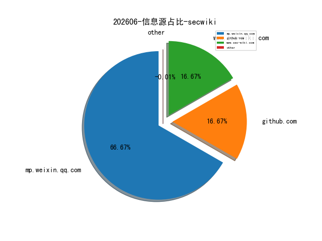
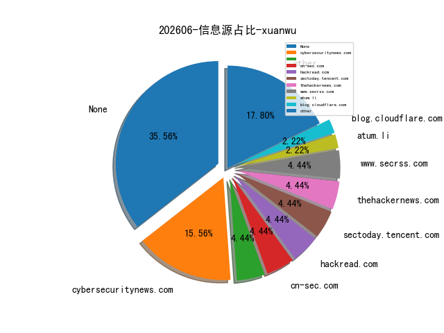
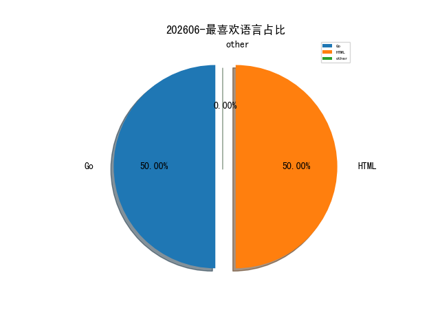

# [数据--所有](README_20.md)
# [数据--年度](README_2026.md)
# 202606 信息源与信息类型占比

# 网络安全书籍 推荐
| date_added | language | title | author | link | size| 
| --- | --- | --- | --- | --- | ---| 
| 2026-06-22 06:52:57 | English | AI Agents in Action, Second Edition | unknown | https://www.wowebook.org/ai-agents-in-action-second-edition/ | unknown| 
| 2026-06-22 06:10:11 | English | Learning Cloud Security | unknown | https://www.wowebook.org/learning-cloud-security/ | unknown| 
| 2026-06-21 10:02:54 | English | Observability Engineering, 2nd Edition | unknown | https://www.wowebook.org/observability-engineering-2nd-edition/ | unknown| 
| 2026-06-21 08:33:29 | English | Algorithmic Short Selling with Python, 2nd Edition | unknown | https://www.wowebook.org/algorithmic-short-selling-with-python-2nd-edition/ | unknown| 
| 2026-06-21 07:53:05 | English | Microsoft Foundry in Action | unknown | https://www.wowebook.org/microsoft-foundry-in-action/ | unknown| 
| 2026-06-16 09:08:08 | English | Getting Started with Microsoft Power Pages | unknown | https://www.wowebook.org/getting-started-with-microsoft-power-pages/ | unknown| 
| 2026-06-15 19:55:04 | English | ML and Generative AI in the Data Lakehouse | unknown | https://www.wowebook.org/ml-and-generative-ai-in-the-data-lakehouse/ | unknown| 
| 2026-06-14 21:20:45 | English | Hands-On RAG for Production | unknown | https://www.wowebook.org/hands-on-rag-for-production/ | unknown| 
| 2026-06-14 20:22:38 | English | Creative AI Agents with Copilot Studio | unknown | https://www.wowebook.org/creative-ai-agents-with-copilot-studio/ | unknown| 
| 2026-06-11 15:57:41 | English | Data Science Projects Using Python | unknown | https://www.wowebook.org/data-science-projects-using-python/ | unknown| 
| 2026-06-11 13:57:54 | English | Full Stack Web Development with React, Angular, Node.js, and DevOps | unknown | https://www.wowebook.org/full-stack-web-development-with-react-angular-node-js-and-devops/ | unknown| 
| 2026-06-08 06:26:16 | English | Web Automation with Playwright and Python using AI and MCP | unknown | https://www.wowebook.org/web-automation-with-playwright-and-python-using-ai-and-mcp/ | unknown| 
| 2026-06-04 18:54:04 | English | Building Generative AI for Enterprise | unknown | https://www.wowebook.org/building-generative-ai-for-enterprise/ | unknown| 
| 2026-06-04 18:13:37 | English | The Agentic Enterprise | unknown | https://www.wowebook.org/the-agentic-enterprise/ | unknown| 
| 2026-06-03 11:04:10 | English | RAG from First Principles | unknown | https://www.wowebook.org/rag-from-first-principles/ | unknown| 
| 2026-06-03 11:17:44 | English | TPRM-Driven Supply Chain Cybersecurity | unknown | https://www.wowebook.org/tprm-driven-supply-chain-cybersecurity/ | unknown| 
| 2026-06-03 11:39:32 | English | Offensive Automotive Cybersecurity | unknown | https://www.wowebook.org/offensive-automotive-cybersecurity/ | unknown| 

# 微信公众号 推荐
| nickname_english | weixin_no | title | url| 
| --- | --- | --- | ---| 
| 306Safe | ladon ladon | Cursor配DeepSeek,免费AI编程 | https://mp.weixin.qq.com/s/ey_QvDYPN_aqGtynzmAgsQ | 3| 
| 360数字安全 |  | 近八成中招设备防护缺位，360发布5月勒索软件态势报告 | https://mp.weixin.qq.com/s/HPj7stqDP1pFYFSWSJ-W_g | 2| 
| 5号黯区 | dt dt | 重要！HW长期全国招聘！！ | https://mp.weixin.qq.com/s/rbZHAqvZTddOqlPwGd_d6A | 1| 
| AI紫队安全研究 | AI紫队安全研究 AI紫队安全研究 | 路由器沦为间谍跳板！APT28“梦幻熊”劫持MooBot僵尸网络，全球政企持续遭隐秘窃密 | https://mp.weixin.qq.com/s/XypcK58hl2gaGizDdLcVbw | 1| 
| AI赋能汽车 |  | 2026年岚图汽车：央国企高端新能源品牌，全矩阵布局 | https://mp.weixin.qq.com/s/XoSbf6tjLBbU-FUZnZzcxA | 3| 
| C4安全 |  | AI 时代的 mcp 攻防探讨 | https://mp.weixin.qq.com/s/iXZDLCiw2crnO3GX5_7yGQ | 1| 
| Echo Reply | 7ACE 7ACE | Wireshark TS , Badssl Certificate 测试案例三 | https://mp.weixin.qq.com/s/UkwgyCYuQinUIqAf2QZdaw | 1| 
| FreeBuf |  | CyberSentinel AI整合33款黑客工具，实现本地离线执行高危扫描 | https://mp.weixin.qq.com/s/Xa0TV8z97bt2NK1UrtnW8w | 14| 
| GTG网络安全实验室 | GTG-Hardy GTG-Hardy | 出口欧盟必看！CRA存量产品合规分水岭：2027年前上市产品不用全合规，但这条红线谁都躲不开 | https://mp.weixin.qq.com/s/MzrCh9aViOwvkJrbjpY_4Q | 1| 
| Hacking黑白红 | hacking hacking | 官媒肯定一锤定音！《湖北日报》评雷军早餐风波：一笑置之方显实业格局 | https://mp.weixin.qq.com/s/M_FASk8QzIq2CoRJ-nRvyQ | 9| 
| ISC平台 |  | “不安全智能体”会带来什么后果？ISC.AI 2026将答案搬到现场 | https://mp.weixin.qq.com/s/P4h7i3JJMiC75t64hfhmig | 7| 
| IoT物联网技术 | ~ ~ | 微信「小微」来了！一句话点外卖、挂号、管理朋友圈、生成小程序，覆盖 14 亿用户，一举超越豆包、千问 | https://mp.weixin.qq.com/s/7pyCBzoo7s3tTtlpL_w5Fg | 1| 
| OSINT情报世界 | 少钧 少钧 | 德国情报界组织机构及运作体系 | https://mp.weixin.qq.com/s/PFJJp6fsXMzHCq5frYsN3g | 6| 
| SCERT科技服务平台 | SCERT SCERT | 一文搞懂 AI：零基础扫盲，告别 “术语焦虑” | https://mp.weixin.qq.com/s/3ntIf-Q331XViqFDzKKUqA | 1| 
| Web安全工具库 | CurlySean CurlySean | TongWeb反序列化漏洞场景的图形化检测与利用工具 | https://mp.weixin.qq.com/s/p6ofAy0btEooWr8G17HTSA | 2| 
| e安在线 | e安在线 e安在线 | GentleKiller 深度解析：The Gentlemen 团伙的 EDR 杀手工具 | https://mp.weixin.qq.com/s/R7RXWJKYOSWzsuEIvLms2w | 1| 
| sec随谈 | sec随谈 sec随谈 | Node.js 安全更新：需要紧急处理 | https://mp.weixin.qq.com/s/vuKqdBZVWFWJhzEuQ0sVBg | 1| 
| 丈八科技 |  | 筑牢电力网络安全防线：丈八科技中标新疆移动攻防智能推演项目 | https://mp.weixin.qq.com/s/8EQiYKW3smJvgLl0-STqWA | 1| 
| 三叶草小组Syclover |  | SCTF 2026 , 官方 WP | https://mp.weixin.qq.com/s/iYvdmanvY5a4nnAn8VLFlw | 1| 
| 中国信息安全 | 本刊采编中心 本刊采编中心 | 全面加强国家安全教育 护航“十五五”新征程（一） | https://mp.weixin.qq.com/s/uvaZqb2MUI6k06RtLddBTA | 8| 
| 中孚信息 |  | 以图鉴势，三域登榜｜中孚信息实力入选嘶吼《2026xa0AI+网络安全产业图谱》三大核心赛道 | https://mp.weixin.qq.com/s/ARzI1115iHncNhRQoNPbKg | 1| 
| 中成信息 | 中成信息 中成信息 | 安全热点周报 , 一周网络安全大事件盘点（2026/06/15-2026/06/19） | https://mp.weixin.qq.com/s/KEE9iDgDKBzLe3Ukl3w7aA | 2| 
| 乌雲安全 |  | 抱歉，团队已经解散了！ | https://mp.weixin.qq.com/s/VZmO5EUNrPLstoxAcBFz_A | 2| 
| 亚信安全 | 你信任的 你信任的 | 银狐防不住、红蓝“秒破”？是时候洗牌你的终端防御架构了 | https://mp.weixin.qq.com/s/5Lmk23I0SHzj2F1hQvcEww | 1| 
| 交大捷普 |  | 每周网安资讯 （6.16-6.22）,三部门联合发布《网络数据安全风险评估办法》，规范企业数据安全管理 | https://mp.weixin.qq.com/s/6rabaNNPEm7egSQuizNWhw | 2| 
| 代码卫士 | Ionut Arghire Ionut Arghire | 多家网络安全公司受 Klue 供应链攻击影响 | https://mp.weixin.qq.com/s/6tuUg1wKSuqQ9hj6wO-hAg | 2| 
| 代码小铺 | 代码小铺 代码小铺 | 因果推断：相关不等于因果 | https://mp.weixin.qq.com/s/DdA9yY3jQFO9infTuEh_YQ | 4| 
| 信息安全与通信保密杂志社 | Cismag Cismag | 启明星辰荣获“华为终端安全奖励计划二等奖” | https://mp.weixin.qq.com/s/oVnRL4f3Q_Gbi-xBkMfS1Q | 5| 
| 信息安全国家工程研究中心 | NERCIS NERCIS | 专家解读｜建立健全数据安全风险评估制度 筑牢国家数据安全屏障 | https://mp.weixin.qq.com/s/hTJJoS_iKpN1j6tUs24ZRA | 2| 
| 信息网络安全杂志 |  | 华中科技大学 , 硕士生魏攀悦的论文被会议DCC 2026录用 | https://mp.weixin.qq.com/s/OqI5sMz0AVEPykSuCgvezw | 3| 
| 全球技术地图 |  | 拨开欧盟碳关税的规则迷雾 | https://mp.weixin.qq.com/s/eoRYg98jidbcM0qEI3RKSw | 4| 
| 公安部网安局 |  | 国家网络与信息安全信息通报中心通报40款违法违规收集使用个人信息的移动应用 | https://mp.weixin.qq.com/s/3s9jydiAXX8zyVW2oPw-Ag | 3| 
| 六边形攻防安全 | 网安布道师 网安布道师 | OSCP 中 SMTP / POP3 邮件服务攻击思路与实战总结(下)  Postfish靶场 | https://mp.weixin.qq.com/s/aAuArmnL0lFZ5jpYV5aKzQ | 2| 
| 内生安全联盟 |  | 财政部突然发文“拉黑”46家美国企业 | https://mp.weixin.qq.com/s/f1AMUKrk15P6lRDcqWV9xQ | 4| 
| 卡布奇诺的派对 | 卡布奇诺的派对 卡布奇诺的派对 | 【Shopify Help Center AI 助手 Markdown 渲染缺陷导致 CSRF 与 RXSS 组合攻击】 | https://mp.weixin.qq.com/s/7Mi6U9HjWMzbOwdCAPJ0nw | 4| 
| 可信安全 |  | 2026全球数字经济大会·云智算安全论坛暨SecGo大会来袭，重磅成果抢先看 | https://mp.weixin.qq.com/s/PKt6KHDGjM_wnL44N79dKw | 1| 
| 君哥的体历 | 聂君 聂君 | 通过 AI agent + 通用大模型，实现海量告警研判分析实践 | https://mp.weixin.qq.com/s/lk5dRcTaZjwe_zBd-Hg8ZA | 3| 
| 启明星辰安全简讯 |  | 安全简讯（2026.06.22） | https://mp.weixin.qq.com/s/RNO8Z-WGcW6kFDb3_AXZBQ | 2| 
| 吾爱破解论坛 | 吾爱pojie 吾爱pojie | 红魔多屏协同自动创建xa0E:\\\\code_decodeew\\\\pre_music_cutxa0文件夹xa0bug | https://mp.weixin.qq.com/s/LHrHE7fikeP62J2zojuUWg | 1| 
| 夜子安全Sec | 夜子 夜子 | 某区护网利用ai+手工挖掘心得 | https://mp.weixin.qq.com/s/cjwcV1Yp2h9jtadVZcl27Q | 1| 
| 夜组安全 | aalhea aalhea | 给 AI 渗透助手装上\"安全带\"——不锁油门，只锁刹车 , AI Agent 在渗透测试场景下既能放手测试，又不会脱库、删库、留后门 | https://mp.weixin.qq.com/s/WKCtc0FtPeEd6eOF1Cvmzg | 1| 
| 天融信 |  | 60天倒计时⏰数据安全风险评估新规落地，企业如何有序适配？ | https://mp.weixin.qq.com/s/36Jut2UudXkrDFax65qvdw | 3| 
| 天驿安全 |  | 2026年，离职潮彻底消失了。。。 | https://mp.weixin.qq.com/s/-Inl4JAqLKeqYjizDWSbkQ | 1| 
| 奇安信威胁情报中心 | 威胁情报中心 威胁情报中心 | INC勒索软件Rust双平台加密器技术演进与攻击链解构 | https://mp.weixin.qq.com/s/cSYzJ_KeOcF9wy8WYWUp8w | 3| 
| 好靶场 |  | 好靶场永久会员转手 | https://mp.weixin.qq.com/s/ZGgOzMvRerpygYUdGMl6Dw | 4| 
| 字节脉搏实验室 | tcode tcode | phpMyFAQ 权限漏洞提醒：后台账号不是“可信内网”，权限变更也要审计 | https://mp.weixin.qq.com/s/keT_CAUl4KZw22uhBWviGA | 3| 
| 字节跳动技术团队 | 视频与边缘 视频与边缘 | 沙发搬到线上：火山引擎视频云如何用 RTC+直播打造一场“云上陪看房”？ | https://mp.weixin.qq.com/s/mQxdiBssBoVCtC4d2iKZOw | 1| 
| 安全分析与研究 | pandazhengzheng pandazhengzheng | 银狐黑产组织BYOVD攻击技术深度详解 | https://mp.weixin.qq.com/s/5GfaxwR6cYlBK_vWxcHH3w | 2| 
| 安全喵喵站 | Bruce ZHANG Bruce ZHANG | 中国网络安全行业正面临一场意义的危机 | https://mp.weixin.qq.com/s/GfzQWoYgikpHIvd0zVc-Hg | 2| 
| 安全极客 | 知识分享者 知识分享者 | 第149期,GPTSecurity周报 | https://mp.weixin.qq.com/s/jZalVcBvusVPq6Tj4nov0A | 2| 
| 安全牛 |  | 中央网信办启动3 个月清朗专项，集中整治账号名称信息四大乱象；三部门发布《网络数据安全风险评估办法》, 牛览 | https://mp.weixin.qq.com/s/NnDSyPlmD1b-Wphrj56zPw | 2| 
| 安全牛科技 | 河南省工信安联盟 河南省工信安联盟 | 工业网络安全周报-2026年第21期 | https://mp.weixin.qq.com/s/YaZMbu-X90X6Sy5tiNWrUw | 2| 
| 安全狗的自我修养 | haidragon haidragon | GraphQL授权检查缺失如何暴露了一台HealthTech独角兽的医疗记录 | https://mp.weixin.qq.com/s/UgKpjuCFkoKDwnF-QICANQ | 1| 
| 安全赛博 | 安全赛博 安全赛博 | 关于使用Google竞价排名分享Claude对话的恶意投毒 | https://mp.weixin.qq.com/s/r969nf8JFqE5n6R20QwFWA | 1| 
| 安在 |  | 苏州银行领760.97万元开业以来最大罚单，涉网络安全与数据安全违规 | https://mp.weixin.qq.com/s/3EpvVAoXu62GYz3EjOsDug | 9| 
| 安小圈 | 成都东契奇科技 成都东契奇科技 | 数据安全风险评估费怎么测算 | https://mp.weixin.qq.com/s/lPj8QPNAIKThtiKNRdZV_g | 3| 
| 安恒信息 |  | AI Agent 能独立打一场 CTF 吗?安恒全新赛制等你挑战 | https://mp.weixin.qq.com/s/OHOICSyHXy26AR0DKFKTXg | 1| 
| 安羽安全 | 安羽安全 安羽安全 | 本周漏洞速递｜11个高危漏洞预警+漏洞复现 | https://mp.weixin.qq.com/s/cqn_J1oFpsJD6NzG6Id2QA | 1| 
| 实战安全研究 |  | 漏洞复现 , 东胜物流管理软件 UserInfo.aspx SQL注入漏洞 | https://mp.weixin.qq.com/s/_oSYWilp7b4_fn1C5bN8YA | 1| 
| 小帅安全 | 小帅安全 小帅安全 | 记录一下如何批量进行ICP备案查询 | https://mp.weixin.qq.com/s/MUEvwbcbCBc1Hl3MVSQ-Kw | 1| 
| 工业互联网标识智库 |  | EN 18219深度解读——如何为物理产品、经济主体建立唯一的“数字身份证” | https://mp.weixin.qq.com/s/RGtBf0zzhRxzV1WYmz89TQ | 2| 
| 幻泉之洲 |  | 越狱：V8 堆沙箱的两种绕过姿势 | https://mp.weixin.qq.com/s/-PYEMzmTc54T1q0xT37QkQ | 2| 
| 建哥聊安全 | 建哥聊安全 建哥聊安全 | 打开A页面但是跳转到B页面了？有可能是这个原因 | https://mp.weixin.qq.com/s/z76li2eKbnWZA3XuRfjgWA | 2| 
| 微步在线 |  | 微步技术合伙人黄雅芳：员工和虚拟员工带来的办公安全挑战 | https://mp.weixin.qq.com/s/B02hnyQhU7o0xkl91fZdJw | 1| 
| 我的安全视界观 | None | 【AI复盘】员工VibeCoding引发数据泄露事件 | https://mp.weixin.qq.com/s/4GVQaXWj9Rf_w9TsdCFaeA | 1| 
| 技术修道场 | Hankzheng Hankzheng | 代码执行+模型被盗！盘点谷歌云Vertex AI存储桶抢注Bug的底层前沿姿势 | https://mp.weixin.qq.com/s/cNFfbZJhBcgJcd2SaE8SVg | 1| 
| 掌控安全EDU | zkaq - 洛川 zkaq - 洛川 | edu某大学的小程序和学生信息系统漏洞挖掘 | https://mp.weixin.qq.com/s/6o6W_hlnMN9QmOs1-NcvHw | 3| 
| 攻城狮成长日记 | didiplus didiplus | 我把Visio卸载了，因为发现了这个开源神器 | https://mp.weixin.qq.com/s/0_LIHu-PO-893Wixs3pUVA | 4| 
| 攻防之路JZhoucdc | jzhoucdc jzhoucdc | ADCS-ESC4枚举和利用 | https://mp.weixin.qq.com/s/NKV4Qv4qvsXDUjldiMFrKg | 3| 
| 数世咨询 |  | 直播预约：ISC.AI 2026开幕式与未来峰会 | https://mp.weixin.qq.com/s/JjZmxGb-ptWIPAIk9RBtDA | 3| 
| 智探AI应用 | 点击关注→ 点击关注→ | 安硕139.9万、宇信139万、可利邦127万！富滇银行2026年AI智能尽调报告助手采购项目 | https://mp.weixin.qq.com/s/Vqu-b1dhzfK3hAuiSss0XQ | 12| 
| 权说安全 | 权说安全 权说安全 | 【权说安全】技术分享专栏正式开启对外征稿，有稿酬哦~ | https://mp.weixin.qq.com/s/mON1q1ZXnZo1Oi3pcXN5AQ | 2| 
| 极客零零七 | 极客零零七 极客零零七 | [安全周报] $1000 挖出 21 个 0day + 11.6 亿次撞库破 8.6 万台防火墙——2026 年漏洞的\"发现\"和\"利用\"，同周进入量产 | https://mp.weixin.qq.com/s/CCiFESTBkXIvMEfWeiVOiQ | 1| 
| 梆梆安全 | 梆梆安全 梆梆安全 | 公安部通报40款违规APP，教育行业面临合规大考，未成年人个人信息安全再敲警钟 | https://mp.weixin.qq.com/s/JMGlbMBzB2XcPDQ6BCB_-g | 2| 
| 梓陌说科技 | None | #辣妹 #甜美御姐 #纯欲 #冷萌脸 | https://mp.weixin.qq.com/s/R0NFkPlzYcr4J1NIsuDklg | 1| 
| 汇能云安全 | None | 8.8TB 医疗数据被窃，亚马逊 One Medical 遭 ShinyHunters勒索 | https://mp.weixin.qq.com/s/i-15uV4JOc30L7nABcGXNg | 1| 
| 江南信安 |  | 江南信安×抗量子密码｜这场技术沙龙，值得期待 | https://mp.weixin.qq.com/s/n8vS16YSL2yZpYctBuhAtA | 1| 
| 汽车信息安全 | 青骥 青骥 | 青骥推广｜2026智能汽车安全技术创新论坛，与行业嘉宾共赴汽车安全之约！ | https://mp.weixin.qq.com/s/LSHq_7dO_XV_iu3saohi6w | 1| 
| 深圳市网络与信息安全行业协会 | NIS研究院 NIS研究院 | 《深圳市网络安全行业企业及产品推荐名录2026》 | https://mp.weixin.qq.com/s/hnhlHXoukVNfDGdO1ulDEA | 1| 
| 深圳网安培训学院 | 培训中心 培训中心 | 2026年6月12日职业技能等级认定评价结果公示 | https://mp.weixin.qq.com/s/WhvnLxmdQOXFXvM1Kf25Vg | 1| 
| 渊亭防务 | 渊亭防务 渊亭防务 | 勾勒未来陆战体系雏形的法国CAPINT新一代主战坦克 | https://mp.weixin.qq.com/s/zXps3uWYuwBwCug-DOSwDg | 1| 
| 湘安无事 | 深情哥 深情哥 | 豆包的xss漏洞复现(蹭热点版) | https://mp.weixin.qq.com/s/hKnSpfWIod-hnG4DQFm4lg | 1| 
| 爱奇艺技术产品团队 |  | 纳逗Pro全链路赋能、专项免费算力支持！爱奇艺AI影视创作营第二期来了 | https://mp.weixin.qq.com/s/mmJXzukLDnbwRHT20014zg | 1| 
| 猎洞时刻 | 猎洞时刻 猎洞时刻 | 2026招聘蓝队HVV工程师第二批次招聘（含初级） | https://mp.weixin.qq.com/s/7vWev_UyFB9yItIHFheOAA | 1| 
| 生有可恋 | hyang0 hyang0 | 人人都是程序员 | https://mp.weixin.qq.com/s/yUMohLPE8-s_gnuwugp0cQ | 4| 
| 看雪学苑 | 看雪课程 看雪课程 | 大模型落地必学！提示词越狱与防御 | https://mp.weixin.qq.com/s/A3zveh4Gbmw_ZP7_WwBsYg | 6| 
| 睿伟网络科技 |  | 从提示词注入到任务偏离：针对AI代理的新型攻击 | https://mp.weixin.qq.com/s/t02ZTDt7j3kz0ADaU2eAHA | 1| 
| 知其安科技 |  | 通过 AI agent + 通用大模型，实现海量告警研判分析实践 | https://mp.weixin.qq.com/s/b-VvaFYqJWSFCXq6gsgTXw | 1| 
| 知远战略与防务研究所 | 知远所 知远所 | 【转载】理解 Mission 网络与 Task 网络的关系—兼论构建目标实现过程本体 | https://mp.weixin.qq.com/s/hJtZgHMlOh1Ud2WFp02_Uw | 11| 
| 穿过丛林 | 吴雨濛、李珍 吴雨濛、李珍 | ACM TOSEM26：面向基于学习的漏洞检测的多类型样本生成 | https://mp.weixin.qq.com/s/CqSe9VaVKBsw0WKzzByYnQ | 1| 
| 等保测评和商密评估 | 糖果 糖果 | 飞度发布第一款“鹊桥”项目管理系统，适用于各类测评机构 | https://mp.weixin.qq.com/s/8NNpHjtI1KO81hN3AhCL1A | 1| 
| 红队蓝军 | plag plag | 内网仿真靶机《GreenTiger》wp | https://mp.weixin.qq.com/s/32SvDRiRY-7p954C5fxm3w | 1| 
| 网空闲话plus | 网空闲话 网空闲话 | 暗网快讯【20260622】148期 | https://mp.weixin.qq.com/s/q1c_3Pu6COaB6HII1oPXFw | 9| 
| 网络个人修炼 | ralap ralap | 分享几款干净无广告的 Windows 冷门免费工具 | https://mp.weixin.qq.com/s/siVMI69ZAb0ga30du3hIxg | 1| 
| 网络侦查研究院 | 子午猫 子午猫 | 揭秘网络交友骗局,“约炮” 背后的天价陷阱与黑色产业链 | https://mp.weixin.qq.com/s/UeyjySxrFWEyCg4l5aQHQA | 9| 
| 网络安全与等保测评 | 糖果 糖果 | 飞度发布第一款“鹊桥”项目管理系统，适用于各类测评机构 | https://mp.weixin.qq.com/s/2yJsz1qitNHQQfZkls0SKw | 1| 
| 网络安全和信息化 |  | 境外间谍情报机关利用弹窗广告开展情报活动，国家安全部提醒→ | https://mp.weixin.qq.com/s/i1oYToBJRuoy8HMA5055pg | 6| 
| 网络安全实验室 | Flag Flag | 在校生/在职考CISP、NISP二级、CISP-PTE条件一文说透 | https://mp.weixin.qq.com/s/1KuRWWLQmHyjpiAy9ctIjA | 2| 
| 网络安全直通车 | guowei guowei | 十五五顶层部署！一体推进教育、科技、人才融合发展，激活高质量发展倍增效应 | https://mp.weixin.qq.com/s/eL11Jj3X9NuuA0DTsOUr2g | 7| 
| 网络安全者 | yushao yushao | AI渗透测试 -- 一道“弱口令爆破”题的解题记录：别忽略 Cookie 里的提示 | https://mp.weixin.qq.com/s/4GhfLFEzXzW31KFTNjHstw | 1| 
| 网络技术干货圈 | 圈圈 圈圈 | 为什么广播风暴能让整个网络瞬间瘫痪？ | https://mp.weixin.qq.com/s/ouO0Ou1Ar-EnBvE3KnrSew | 2| 
| 网络技术联盟站 | None | 二层交换机与三层交换机有啥区别？ | https://mp.weixin.qq.com/s/wAAKnV3ZJQSpSEpyvM9gmA | 11| 
| 老登的安全观 | iconic iconic | 你以为你在管人，其实你在赶人 | https://mp.weixin.qq.com/s/9Ar4mzXwgRHg1fbf-PghjQ | 1| 
| 老皮的碎碎念念 |  | 电子取证一周大事记（2026年6月15日 — 6月21日） | https://mp.weixin.qq.com/s/gbqc-ulaLiA5yHP7HcBnYw | 1| 
| 聚铭网络 |  | 聚铭网络受邀加入南京市雨花台区人工智能学会理事会成员单位 | https://mp.weixin.qq.com/s/wcYZCEa2lBvaz0KQWYdVmA | 1| 
| 腾讯玄武实验室 | admin admin | 每日安全动态推送(26/6/22) | https://mp.weixin.qq.com/s/bUNm24ozzLshczhYKBHYvQ | 2| 
| 航行资本 | 航行资本 航行资本 | 【20260622】网安市场周度监测Vol.314 | https://mp.weixin.qq.com/s/GF5NZa_KaaM8uM5zuxaStw | 1| 
| 船山信安 | AzumiSaki AzumiSaki | 入门地用低噪声扫描的方式出更多信息 | https://mp.weixin.qq.com/s/7KEdp5OmzLU3xoFf1f97KQ | 4| 
| 苏说安全 |  | 怎么判断一个项目该不该跟进 | https://mp.weixin.qq.com/s/Ot9WfWSxBU2W2_nKiVrWBw | 1| 
| 蓝军开源情报 | 止戈为武 止戈为武 | 认知战：多域作战中的认知效能提升 | https://mp.weixin.qq.com/s/EMA3ul-0bEe8g51ofGB9EQ | 16| 
| 薄说安全 | 薄说安全 薄说安全 | 从 Claude Code 架构出发，如何理解大模型的系统安全边界 | https://mp.weixin.qq.com/s/k9CcfDIArfrhvUJfQK_6ag | 1| 
| 蚁景网络安全 |  | 【免费领】全网最贴近实战的Web安全开发测试指南 | https://mp.weixin.qq.com/s/ZXNAMq1LKTcNsDripclCTA | 2| 
| 观安无相实验室 |  | 安全威胁情报周报（2026/06/13-2026/06/19） | https://mp.weixin.qq.com/s/7a_6wd1N9PJpvdH_Lw48pA | 2| 
| 计算机与网络安全 |  | 车联网服务平台风险评估实施指南 | https://mp.weixin.qq.com/s/O9MZc9EmJ47es4AHg8pCLw | 5| 
| 赛博生存指南 | GLM-5.2 GLM-5.2 | 工具 , aiscan —— 一个 160 行 Agent 循环，如何驱动整套安全扫描引擎 | https://mp.weixin.qq.com/s/-pF7myMpj2SU_an3WO8ojw | 3| 
| 赛查查 |  | 2026FIC 决赛 Linux服务器部分 | https://mp.weixin.qq.com/s/GoYo0r05vbMMJMzZFlFMKw | 8| 
| 赛欧思安全研究实验室 | SOC SOC | 巴西疑遭黑客入侵，国家预警通知系统被迫暂停运行 | https://mp.weixin.qq.com/s/NlkSdL0qYgr1TKw7dVK01Q | 1| 
| 金盾信安 |  | 国家金融监督管理总局有关司局负责人就《关于银行业保险业人工智能安全开发应用的指导意见》答记者问 | https://mp.weixin.qq.com/s/04I0satvd1Xn6Dldh2FdiA | 3| 
| 铁军哥 | 衡水铁头哥 衡水铁头哥 | 技术揭秘：如何用Docker在服务器上“手搓”百台安卓云手机？ | https://mp.weixin.qq.com/s/HdJSbnwDYJEfhaq8w6Xgjw | 2| 
| 银遁安全团队 | xiachuchunmo xiachuchunmo | 我弹豆包 | https://mp.weixin.qq.com/s/XQncJzUoA-5cgNikjbNUvQ | 1| 
| 长亭安全观察 |  | 一年一评、保存3年，数据安全评估进入硬合规时代 | https://mp.weixin.qq.com/s/JwH8h1KKVFbztjg0KVIGUQ | 3| 
| 阿乐你好 |  | 网安大神 | https://mp.weixin.qq.com/s/RU4jaSBDjgbTyDOhHrlcsQ | 2| 
| 阿里安全响应中心 |  | 王牌A计划｜四月月度奖励 | https://mp.weixin.qq.com/s/tL3dQ3_nd3zmtRksMiMY0A | 1| 
| 隐雾安全 | 猫猫 猫猫 | 【猫猫周报xa0Vol.12】有人出货了，有人出去玩了 | https://mp.weixin.qq.com/s/Mv1Qqcb3gsPeFO1Lxyyxug | 1| 
| 飓风网络安全 | jufeng jufeng | 【高危漏洞预警】FreeBSD KTLS本地权限提升漏洞(CVE-2026-45257) | https://mp.weixin.qq.com/s/Ao7jqzuTB3iUZG-ZHTfBbQ | 2| 
| 黑猫安全 | 鹏鹏同学 鹏鹏同学 | 全球 SocGholish 专项清理行动：已修复 14971 个 WordPress 站点 | https://mp.weixin.qq.com/s/FWfeDKc6tg2aAWJgNyoqWw | 3| 
| 默安科技 | None | 雳鉴 IAST AI 能力落地战报 | https://mp.weixin.qq.com/s/JNfsnB1sugzCihvVUZdhyw | 1| 
| Ghost Wolf Lab | Pi Box Pi Box | UBTI的攻击面测绘与 COM 劫持 | https://mp.weixin.qq.com/s/by2WPjpTofKtRZVpTOC26Q | 1| 
| 独眼情报 | 🅼🅰🆈 🅼🅰🆈 | 欧洲委员会300GB数据被泄露 | https://mp.weixin.qq.com/s/OSbmGH2EwhfZBo9jumfgwA | 4| 
| 0xSec笔记本 | 0xSec笔记本 0xSec笔记本 | 2026 年第三届 “聚合 獬豸杯” WP,通过ai学取证系列,检材3-服务器取证详细解题思路 | https://mp.weixin.qq.com/s/W3KOIbJUV_WM4IPEGRWDbA | 1| 
| Esn技术社区 | None | 端午节快乐！…我们与Ai-Agent共同探讨如何（破解者是）破解所以软件！同时我们要如何防止自己的软件被破解！ | https://mp.weixin.qq.com/s/c85rgsVziRT5SXdHu_pG2Q | 2| 
| MS02423 | MS02423 MS02423 | HackMyVm靶场之Tellme. | https://mp.weixin.qq.com/s/ogHHqsz2D1JAVeUjB9y9HQ | 1| 
| Ncko | niuko niuko | [安全工具]JsonExp — Fastjson/Jackson 反序列化漏洞自动化检测利器 | https://mp.weixin.qq.com/s/OXo-7q1Gn6gkogcvBcarWg | 1| 
| Ots安全 |  | CVE-2026-42530 NGINX 远程代码执行 | https://mp.weixin.qq.com/s/-eu8nZly2SUHrccaov4ELg | 3| 
| Oxo Security | Oxo Security Oxo Security | 【AI安全】Agent 七层攻击面拆解！正则之外的全套分层防御 | https://mp.weixin.qq.com/s/VWbKS9fWCPFXolGFR_jq8Q | 1| 
| Reset安全 |  | 网安热点 · 2026-06-20 | https://mp.weixin.qq.com/s/tvX-JOUAdZsF9WUkmoz3bg | 2| 
| W不懂安全 | W不懂安全 W不懂安全 | BurpSuite MCP 结合AI客户端，实现自动化网站渗透，让 AI 替你挖洞 | https://mp.weixin.qq.com/s/GdNEEkuj0FxAeJu-hL9BMA | 1| 
| YNsec安全实验室 |  | AI 原生代码审计的历史性拐点:点星的能力边界与横向对比实测 | https://mp.weixin.qq.com/s/E8IAGlM4NCZgIOKTruIQBg | 2| 
| fullbug | xiejava xiejava | 腾讯开源WeKnora知识库部署实战(含踩坑排查) | https://mp.weixin.qq.com/s/EZyIaeh9izC-8IyPK9nJwg | 1| 
| huan666 | huan666 huan666 | hack-skills助力AI深耕安全测试保姆级教程 | https://mp.weixin.qq.com/s/gPxm7q-beih_xFlDi-kAaQ | 1| 
| 一只岸上的鱼 | 一只岸上的鱼 一只岸上的鱼 | 告别nvm！fnm：新一代极速Node版本管理工具全攻略 | https://mp.weixin.qq.com/s/IpnzUCzpRc9DcNlAsALEHQ | 1| 
| 低调学安全 | 学安全也就图一乐 学安全也就图一乐 | 从「事实清单」到「攻击路径图」：CyberStrikeAI 项目管理的一次认知升级 | https://mp.weixin.qq.com/s/Ak_uBoz9z6m8sRHCpGd78A | 1| 
| 信益安信息安全研究院 | 信益安研究院 信益安研究院 | AI 安全 skills —— 自动化渗透 AI 应用系统 | https://mp.weixin.qq.com/s/qx3nlvUerv_mR-LZEjlEcA | 1| 
| 凌曦安全 | 凌曦安全 凌曦安全 | 实战三合一，倒计时两天！！！ | https://mp.weixin.qq.com/s/jLqEo4tYncS5lNOhUuCE3Q | 1| 
| 利刃信安 | None | 【商密测评】GM/T 0148-2025《证书注册子系统证书服务接口规范》 | https://mp.weixin.qq.com/s/HuW3WcHC5hE7PT-NQrLrLQ | 4| 
| 君说安全 |  | 行业资讯：某网络安全漏洞扫描产品采购项目中标结果显示，绿盟漏扫中标５套 | https://mp.weixin.qq.com/s/fanoyyyq0cATDulcgy247g | 2| 
| 夜安团队SEC |  | AI 原生代码审计的历史性拐点:点星的能力边界与横向对比实测 | https://mp.weixin.qq.com/s/dzax7Fxzzi44_NSsOZ0U4w | 1| 
| 安全天书 | Hello888 Hello888 | Patch免杀工具--绕过各大杀软检测 | https://mp.weixin.qq.com/s/LplMmDNUXPU_7KdYCn0CKw | 1| 
| 安帝Andisec | OT工控安全领导者 OT工控安全领导者 | 工业网络安全周报-2026年第24期 | https://mp.weixin.qq.com/s/gdFg5pTSuSLVlEUs955lAA | 1| 
| 山河学安全 | 山河 山河 | AI能挖洞了，安全从业者靠什么吃饭？ | https://mp.weixin.qq.com/s/Klxmyr3AAhEBvQIAmS3pBQ | 1| 
| 情报分析师 | DMT DMT | 如何调查来自其他国家的人 | https://mp.weixin.qq.com/s/JUxyM4bdoMCndEJhxebbQw | 2| 
| 暗镜 | ZM ZM | 黑客滥用 NinjaOne RMM 代理远程访问巴西组织 | https://mp.weixin.qq.com/s/VTWt5DGrQNZpE0S69tDIbg | 1| 
| 河南等级保护测评 | 何威风 何威风 | 网络安全等级保护：如何正确处理终止的等级保护对象 | https://mp.weixin.qq.com/s/blPxTPHYvemtwqMi6OAnrw | 4| 
| 洋芋学AI | None | AI时代，真正值钱的能力，正在悄悄改变 | https://mp.weixin.qq.com/s/xWyLZVB4RniNW8On6oRSeQ | 2| 
| 玄月调查小组 | 玄月调查小组 玄月调查小组 | 漏洞分析超越Mythos还不够！微软真正厉害的是知道MDASH还差在哪 | https://mp.weixin.qq.com/s/fHr-PUpAH6nuuZ0RvaribA | 3| 
| 知树安全团队 | 鼹鼠 鼹鼠 | al-khaser-master恶意软件反检测工具 | https://mp.weixin.qq.com/s/mfKXJppdyBWF9O-rymI-YA | 2| 
| 码云精炼 | 静观云起 静观云起 | 快速理解大模型和Agent的区别 | https://mp.weixin.qq.com/s/T3lGq4Q-FbwEUBD4Fa975w | 1| 
| 竞远安全 | 网信中国 网信中国 | 专家解读｜高质量开展网络数据安全风险评估 推动网络数据安全治理长效发展 | https://mp.weixin.qq.com/s/LnOvCbqWK6H--mlTIcBiBQ | 2| 
| 网安百色 |  | Node.js发布关键安全更新，修复影响120万站点的12个高危漏洞 | https://mp.weixin.qq.com/s/xkb7zrRB1roGvWVrJD_yKA | 2| 
| 网络与安全实验室 |  | 每周文章分享-264 | https://mp.weixin.qq.com/s/2w31pKPrnAGj5c9GojA3VQ | 1| 
| 赛博研究院 | 赛博研究院 赛博研究院 | G7 AI闭门会议内幕：封杀、座次与路线之争 | https://mp.weixin.qq.com/s/td6VeUNxnK7VAp6AzaZLCQ | 5| 
| 软件开发安全生命周期 | Wens0n Wens0n | SDL序列课程-第71篇-安全需求-域名申请变更需求-提供服务器和IP资源，第三方负责开发和运维的模式，禁止使用XXX的域名 | https://mp.weixin.qq.com/s/A48WA5d4WUBfoWi9769Xtg | 1| 
| 陌笙不太懂安全 | 小猪佩琪 小猪佩琪 | 渗透测试实战中url跳转漏洞 | https://mp.weixin.qq.com/s/XvT5NiH_KapaYRpGlQEjlA | 1| 
| 马哥网络安全 | 点击关注👉 点击关注👉 | 如何配置防火墙？让你菜鸟变大佬！（以华为防火墙为例） | https://mp.weixin.qq.com/s/qng9MxZKH4dJcNBy5tKrjA | 1| 
| 黑白之道 | Red Hunter Red Hunter | 新型无代码攻击曝光：AI结合Telegram，普通攻击者也能远程控制肉鸡 | https://mp.weixin.qq.com/s/MKFH_Kk0p4vVrneoXgEkCA | 2| 
| 360漏洞云 |  | 【报名开启】「智弈」AI智能体攻防实战沙龙议程抢先看 | https://mp.weixin.qq.com/s/2J_NZw5YNjDmwI3cbyfm-Q | 1| 
| EnhancerSec | EnhancerSec EnhancerSec | 端午安康 | https://mp.weixin.qq.com/s/aFQa2gETkT9_ZCF9kD3Jqw | 1| 
| GGDog Sec | GGDog Sec GGDog Sec | 千字解析实习垂直性，如何在校招当一名受欢迎的应届生(网络安全) | https://mp.weixin.qq.com/s/RPX_xj4AoxPH8XbWwv9ToA | 2| 
| Khan安全团队 | 忍者 忍者 | EtherRAT/EtherHiding 恶意软件活动 | https://mp.weixin.qq.com/s/1j70dEeyG-UwfPnvrD2vYA | 4| 
| OnionSec | jishuzhain jishuzhain | 写 Medium 快一个月了 | https://mp.weixin.qq.com/s/Ql6o5yl8ufbphxrbjnZC4w | 2| 
| Sec Online | None | 端午安康 | https://mp.weixin.qq.com/s/Xx8WAE4koFwli0RaO6TJ8A | 1| 
| T00ls安全 | None | 🚩 粽香传情，端午安康！ | https://mp.weixin.qq.com/s/Ho84b9OUeqDuX89DFYS79Q | 1| 
| TtTeam |  | 第六章xa0-xa0重生之我是AI人：47 个攻击技能 — 怎么被 LLM 调用 | https://mp.weixin.qq.com/s/ii7B_J9MIa83I3EUYiSmIQ | 1| 
| Z2O安全攻防 | None | 该来的还是来了 | https://mp.weixin.qq.com/s/gbik3BRb8LzkN6vTjkai_g | 2| 
| Zer0day安全 | cONtro1 cONtro1 | CVE-2026-41940 cPanel/WHM 认证绕过漏洞复现 | https://mp.weixin.qq.com/s/C4TMWcOt5mGUlTdJgkZ9KQ | 1| 
| 一个不正经的黑客 | None | Nginx 又被爆出严重漏洞！ | https://mp.weixin.qq.com/s/GNYDcnCqqdO7b4kqNa2v4Q | 1| 
| 亿人安全 |  | 【报名开启】「智弈」AI智能体攻防实战沙龙议程抢先看 | https://mp.weixin.qq.com/s/zENPgKHQqHi6wuwg-8DWFw | 1| 
| 信息安全动态 | 老张 老张 | 新时代-等级保护2.0安全解决方案 | https://mp.weixin.qq.com/s/sG-kon4VENghSwpyUYoSYA | 1| 
| 公安部网络安全等级保护中心 |  | 端午安康 | https://mp.weixin.qq.com/s/98rIinyhY_md_gIoij16tw | 1| 
| 兰花豆说网络安全 | 承影 承影 | LockBit勒索病毒的前世今生和应对策略 | https://mp.weixin.qq.com/s/rlary7V2Wp9OYK8zaIXgCA | 3| 
| 凌日网络与信息安全团队LapR1skT | LRT凌日 LRT凌日 | CVE复现 , CVE-2026-42588漏洞复现 | https://mp.weixin.qq.com/s/A6kIw7wyw7pDzCedBwSHNA | 1| 
| 北京观成科技 |  | 端午安康！ | https://mp.weixin.qq.com/s/KveRAIxiv97aGG1Wg8io_g | 1| 
| 十月的进阶之路 | 十月的进阶之路 十月的进阶之路 | 【代码审计】JNDI注入+Servlet内存马 | https://mp.weixin.qq.com/s/kKScRd0gyXwhy8RFX8LXLQ | 2| 
| 升斗安全 | 升斗安全XiuXiu 升斗安全XiuXiu | 赏金猎人注意：点击劫持攻防别只配一半，CSP该上场了 | https://mp.weixin.qq.com/s/jfMwPLmtTM618qrXyy2VHg | 1| 
| 哆啦安全 | 云天实验室 云天实验室 | Redroid Android13云手机定制(一键优化清理磁盘) | https://mp.weixin.qq.com/s/5kc6xh3APVvKOqFUGgfSjw | 1| 
| 安全圈 |  | 【安全圈】初级黑客在其 C2 下线后使用 Tailscale 和 OpenSSH 保持访问 | https://mp.weixin.qq.com/s/b-sATdDvaKIJUXTY8r4SbA | 6| 
| 安全学习之路 | lidasimida lidasimida | Burp Suite 官方 MCP：把 AI Agent 接进 Web 安全测试工作台 | https://mp.weixin.qq.com/s/v8mAk2Mg7Fh6VXZCkqWYpQ | 1| 
| 安全无界 | pippybear pippybear | hackerone之5000刀的高危burp漏洞 | https://mp.weixin.qq.com/s/IcSxIInZjTP0pYCm8CWrqw | 1| 
| 安领荟科技 | None | 端午安康 , 梦想粽会实现 | https://mp.weixin.qq.com/s/pmAVuziJb07H7j3szzlnOw | 2| 
| 小刘说攻防 | None | 600个Linux命令，可以少用但不能不会！ | https://mp.weixin.qq.com/s/jVFigO5l-vBQupGacrIwiw | 3| 
| 小叶Sec |  | 粽叶揽清风，岁岁皆安康 | https://mp.weixin.qq.com/s/IqGH8CQFdSNtGSiJcYQ3sA | 1| 
| 工联安全众测 |  | 李乐成在浙江调研新兴产业和未来产业发展 | https://mp.weixin.qq.com/s/kct2u4Adzk4LjdqHiTnh3g | 1| 
| 广州网警 | 公安部网安局 公安部网安局 | 法治日报：公安部网安局公布5起打击“银狐”木马病毒典型案例 | https://mp.weixin.qq.com/s/5Mnvp43wznXSG9C9P53oVg | 1| 
| 度小满安全应急响应中心 |  | DXMSRC , 祝白帽师傅们端午安康 | https://mp.weixin.qq.com/s/7MZelUQqggFv-19fby7gUQ | 1| 
| 开源情报技术研究院 | c0nsen c0nsen | 提示注入攻击（Prompt Injection）解析：2026年现状、案例与防御策略 | https://mp.weixin.qq.com/s/WqIViobZiglGGCtqFqdp-g | 1| 
| 弥天安全实验室 | 弥天安全实验室 弥天安全实验室 | 【智能工具】渗透神器Kali搭载Claude Code实践 | https://mp.weixin.qq.com/s/u1k5I2klrkdldPxI9FlCVA | 3| 
| 效率源 | 效哥 效哥 | 端午 , 四时花竞巧，九子粽争新 | https://mp.weixin.qq.com/s/ww1_gcAhGZCwjRF7p1LaVQ | 1| 
| 昆仑AI安全实验室 | 逍遥 逍遥 | 中危变高危，赏金翻3倍：我用AI改写漏洞报告的话术模板全公开 | https://mp.weixin.qq.com/s/EX0iX63qfAkdEzvyQ-ta7g | 1| 
| 晨星安全团队 | 晨星安全团队 晨星安全团队 | 晨星安全助力第一届“好靶场”网络安全综合赛重磅启动 | https://mp.weixin.qq.com/s/BY9IInyhSjlX_0RXvpKSBA | 1| 
| 渗透安全HackTwo | ebzzaa ebzzaa | 红队内网渗透利器，告别原版特征暴露（支持免杀）内网扫描爆破后渗透一站式落地 | https://mp.weixin.qq.com/s/gyBWw8vcr6HyHLWa2CWKGw | 1| 
| 湖南金盾评估中心 | 湖南金盾 湖南金盾 | 一盾守网络，一叶寄安康｜湖南金盾祝您端午吉祥 | https://mp.weixin.qq.com/s/F7dBwzmiaVxlxrx57ynkbw | 2| 
| 炼石网络CipherGateway | 数据安全建设就找 数据安全建设就找 | 端午节 , 数据粽深四海安，密码艾护万家全 | https://mp.weixin.qq.com/s/wmlI8KMJem3S7vZj3kGVZQ | 1| 
| 爱唠叨的Nil | 爱唠叨的Nil 爱唠叨的Nil | LOGOS开源、豆包语音3.0、Claude Code支持Artifacts | https://mp.weixin.qq.com/s/IGqAzgWLgH343eZ-EmZ7jA | 1| 
| 猫头鹰OSINT | Owllntel Owllntel | 信息越公开，越需要方法：四本开源情报经典读物 | https://mp.weixin.qq.com/s/QM47Alrqd8dhv2I0aPipdA | 2| 
| 玲珑安全 | 玲珑安全 玲珑安全 | MCP工具投毒攻击 | https://mp.weixin.qq.com/s/FB6lsJ2G7rHO8USadCk6LA | 2| 
| 祺印说信安 | 公安部网安局 公安部网安局 | 净网专项行动 , 公安部网安局公布10起打击整治网络谣言违法犯罪典型案例 | https://mp.weixin.qq.com/s/nYkxALlna8tFYROpsY-XjA | 1| 
| 绿盟科技 | None | 执AI之桨，驭数安之浪，承家国安康 | https://mp.weixin.qq.com/s/lg3ykYo-lUu3dIOddvpNKQ | 3| 
| 网络安全民工 | 网络安全民工 网络安全民工 | 第7章 Agent 求职面试准备与行业实践 | https://mp.weixin.qq.com/s/crODlLEeZiIRL6CenfwNLQ | 5| 
| 美创资讯 | None | 万“粽”一心 ，智护数据 | https://mp.weixin.qq.com/s/QHmb5IMxSGBiQhuXPPcTRw | 1| 
| 谈思实验室 |  | 人工智能安全 | https://mp.weixin.qq.com/s/QXeoiiEkRRVY0Lf-WPznWw | 7| 
| 路亚黔 | None | 黄金大罗非 | https://mp.weixin.qq.com/s/AWA3wOmNq5xkKGy2dhJrqw | 2| 
| 进击的HACK |  | 工具推荐 , 面向红队协作的控制平面型工作台 | https://mp.weixin.qq.com/s/EEkKPpIMYSzo6D3pKsAe4A | 3| 
| 迪哥讲事 | h1 h1 | 重置2FA导致的账户劫持 | https://mp.weixin.qq.com/s/Yp93aSid1C3ZvJJK6uPkfg | 1| 
| 酷皇音乐 | 酷帥王子 酷帥王子 | 原创-为什么说一个中年最大体面最大尊严就是不认真不较真不当真 | https://mp.weixin.qq.com/s/z3NCQammoVfHHthkRxkGVQ | 2| 
| 金盾检测股份 | None | 千帆竞渡，粽香满堂，端午安康！ | https://mp.weixin.qq.com/s/dBQFIF7-maqpG13yz8rBRA | 1| 
| 银基科技INGEEK | None | 端午节｜迎风踏浪，纵横山海，端午安康！ | https://mp.weixin.qq.com/s/k5QrT8nltE2WEoE48GA03Q | 1| 
| 银天信息 | 零零捌信安观察 零零捌信安观察 | 信息安全漏洞周报【第079期】 | https://mp.weixin.qq.com/s/sInx4poFY9pet1C_6gB-hw | 1| 
| 雨滴梦呓 |  | SkyLine v4 —— AI 驱动的自主渗透测试系统 | https://mp.weixin.qq.com/s/9Im7dLAeSkfXrHdiHg3mEA | 1| 
| 零域矩阵 | 零域矩阵 零域矩阵 | AI浪潮下的CTF：能否成为走向智力奥林匹克的赛场 | https://mp.weixin.qq.com/s/YN2oTJU0RBchZW4aQyr5DA | 1| 
| 骨哥说事 | 骨哥说事 骨哥说事 | 【$1,600】Shopify帮助中心AI助手XSS漏洞 | https://mp.weixin.qq.com/s/3n1C0DY4YE60MQVIzH2tbg | 2| 
| 黑鸟 | 黑鸟 黑鸟 | 一僵尸网络被曝光与以色列上市公司有关 | https://mp.weixin.qq.com/s/D13j42HmB558jg07jf6XqA | 3| 
| 360安全应急响应中心 | None | 【报名开启】「智弈」AI智能体攻防实战沙龙议程抢先看 | https://mp.weixin.qq.com/s/erke6MzJ5p2kwqbGKzJEVw | 1| 
| CISP | None | 关于NISI转换CISI的公告 | https://mp.weixin.qq.com/s/zyyHw5BaMm90NgnYFebhjw | 1| 
| CNNVD安全动态 | None | 人工智能重要漏洞通报（2026年第九期） | https://mp.weixin.qq.com/s/tj099pgcLF3C9rKU7bqOqQ | 1| 
| CatalyzeSec | None | 【工具推荐】红队利器VueCrack | https://mp.weixin.qq.com/s/OxifmSk2oyEJeACkAc29fg | 2| 
| DeepPhish | None | 现实智械危机：AI沦为网络钓鱼工具，成功率高达54%！ | https://mp.weixin.qq.com/s/-DZjFFso_WxQI3eL8KxJ8A | 1| 
| GSDK安全团队 | None | 存储桶检测插件 - Browser-BucketScan | https://mp.weixin.qq.com/s/WU3TFw4PXqruecy2SzWLtg | 1| 
| R10Lab | R10Lab R10Lab | 一个PCAP包，十分钟溯源——AI驱动的流量溯源分析实战全揭秘-pcap-traceability-report | https://mp.weixin.qq.com/s/UJTtJamKEtRL3XmltGUIKQ | 1| 
| RedTeam回忆录 | None | AI 赋能 哥斯拉 MCP 插件：联动 Claude 打造红队 Webshell 自动化作战工具 | https://mp.weixin.qq.com/s/do7uYAuHkyLr07tP4SahMw | 1| 
| Ting的安全笔记 | None | 攻防旺季 Rundll又活了 Dump Lsass免杀过最新360（附代码视频） | https://mp.weixin.qq.com/s/YGSVO3dVbTh0XpJyrw1lRg | 1| 
| Yak Project | None | Yakit 新功能：Edit Binary 让上传包里的不可见字符可控了 | https://mp.weixin.qq.com/s/VGsPhbBtrwN8ygYpqKSCiw | 1| 
| crossoverJie |  | 从 Warp 换到 cmux：一个更适合 AI Agent 的终端 | https://mp.weixin.qq.com/s/7tnPJez7t-CM5zmR-91O6A | 1| 
| 一个人挺好 wa | None | CipherBridge ——面向APP/Web 加解密逆向分析、渗透测试神器 | https://mp.weixin.qq.com/s/SZ22dKTCwK25OZFZ64vDxw | 1| 
| 一个努力的学渣 | None | 逻辑漏洞之登录模块18种利用方法 | https://mp.weixin.qq.com/s/0ScVykFvzJnw9Y9WkjQXcQ | 1| 
| 丁爸 情报分析师的工具箱 | 丁爸 丁爸 | 【资料】美国政府持续在此领域资助中国，显示该领域中美合作展现出较强韧性 | https://mp.weixin.qq.com/s/j7WHsfqMoE_xUXPnk7130A | 2| 
| 中国网络空间安全协会 | None | 《网络数据安全风险评估办法》答记者问 | https://mp.weixin.qq.com/s/uDy66cS_HgQ0I95Lju1Oxg | 3| 
| 中新赛克 |  | DATA+AI战略首发：中新赛克让 AI 真正扎根业务一线创造价值 | https://mp.weixin.qq.com/s/Is2QZ81mtCflk2M2XOiTeg | 1| 
| 任子行 | None | 理财公司迎监管评级｜任子行数据安全分类分级，数安三件套夯实数据治理高分底座 | https://mp.weixin.qq.com/s/TWsz90aW745-0WDGGU21oQ | 1| 
| 信息安全研究 | None | 动态｜《Token驱动智能经济研究报告（2026年）》正式发布 | https://mp.weixin.qq.com/s/Hj3C-o1hgGvXxp-z9LS-iw | 4| 
| 北邮 GAMMA Lab | 刘海博 刘海博 | 专题解读 , Harness Engineering：AI 工程正在从“调模型”走向“造环境” | https://mp.weixin.qq.com/s/ui8sR9O7L5bA_0092BOSiA | 1| 
| 南风漏洞复现文库 | 2026-6-18更新 2026-6-18更新 | 天地伟业Easy7 queryDataByTypeEx接口存在SQL注入漏洞 附POC | https://mp.weixin.qq.com/s/rNx3yX6gGluZl3kS4J-T5g | 1| 
| 取证者联盟 | None | AI证据观察之四｜AI伪造证据九问审查法 | https://mp.weixin.qq.com/s/H0Z3zLJtbmhZUpGfaeIF9g | 1| 
| 句芒安全实验室 | None | LLM Agent攻击链全拆解：从System Prompt泄露到完整权限获取的6步Kill Chain | https://mp.weixin.qq.com/s/ph-6Ux__5Xkybhn_3p_BRw | 1| 
| 国信安全 | None | 2026年国家电子政务外网安全培训会（第二期）在大连成功举办 | https://mp.weixin.qq.com/s/0IhzPG-UcfyG9vH-pjUu4w | 1| 
| 国家网络安全通报中心 | None | 国家网信办、工业和信息化部、公安部联合公布《网络数据安全风险评估办法》 | https://mp.weixin.qq.com/s/TpCGskKEJA0M_6qFuSfvyw | 2| 
| 塞讯科技 | None | 当钓鱼邮件盯上 AI Agent，风险不止点错链接 | https://mp.weixin.qq.com/s/Y3AOkKimWLrwLUBhqctTZg | 1| 
| 墨菲安全 | None | 国家安全部点名预警！软件供应链投毒治理指南来了 | https://mp.weixin.qq.com/s/WuqiHCi35JFnkQyv9BssIA | 1| 
| 天创培训 | None | 重磅｜抢占AI安全赛道：企业资质+人员CISP-AISS双布局 | https://mp.weixin.qq.com/s/G_WzCBC363YEP9AQ1T4GVQ | 1| 
| 天唯信息安全 | None | 关于印发《实施网络安全标识的产品目录（第一批）》及相关实施规则的通知 | https://mp.weixin.qq.com/s/60p4yB4fjSJhYTpFXjrReg | 3| 
| 天威诚信 | None | 天威诚信参编，《OS应用软件包签名/验证技术规范》发布 | https://mp.weixin.qq.com/s/xOlZsHFX9owkGtsQxmvYtA | 1| 
| 天懋信息 | None | 安全快报 , 伊朗黑客组织Handala声称入侵美国加州水务系统并窃取5GB数据 | https://mp.weixin.qq.com/s/CkuClwN0j5JjY414P72j9g | 1| 
| 奇安信 CERT | None | 安全热点周报：Oracle 缓解了 PeopleSoft 零日漏洞在数据窃取攻击中的利用 | https://mp.weixin.qq.com/s/CibPYDSRuZfV1GQRo4kClw | 1| 
| 奇安信病毒响应中心 | None | 每周勒索威胁摘要 | https://mp.weixin.qq.com/s/2nuNx3RvtLjSywZo20hIBQ | 1| 
| 奇安信集团 | None | 关于举办全国网络安全“双师型”教师研修班（AI网络安全威胁响应）的通知 | https://mp.weixin.qq.com/s/QR2jdnhmSnz5uvkJq22HZg | 2| 
| 如棠安全 | None | 【漏洞预警】大华智慧园区综合管理平台未授权访问漏洞 | https://mp.weixin.qq.com/s/ZIlyS54lU2bUWaB3Y_Yo3Q | 1| 
| 学网安的韭菜 | None | 度小满SRC太有心意了 | https://mp.weixin.qq.com/s/j64JLJo0RmXKuLvRKfhy_g | 1| 
| 宁盾科技 | None | 端午安康 , 宁盾端午节放假通知 | https://mp.weixin.qq.com/s/Zrf-pscP-MngW_7vK3AWxg | 1| 
| 安全学习那些事儿 | None | 上交所发布《人工智能大模型企业适用科创板第五套上市标准》 | https://mp.weixin.qq.com/s/pE8V8DAgUdMcBrM2nZG9pw | 7| 
| 安全客 | None | Splunk AI Toolkit曝高危漏洞：CVSS 9.1，可远程执行任意系统命令 | https://mp.weixin.qq.com/s/H8kFhVqIZi_zq-XyVi4rbw | 1| 
| 安全渗透自学笔记 | None | 黑客工具备忘录 | https://mp.weixin.qq.com/s/BZnL1U59CXCC8vMiDhow_w | 1| 
| 小石学习笔记 | None | 境外恶意IP地址防范与通报(来自公安部网安局) | https://mp.weixin.qq.com/s/gbijfVZPeQsQabp-S8Ul0A | 1| 
| 广东网警 | None | 净网专项行动,网警侦破一起涉世界杯网络赌博推广引流案件 | https://mp.weixin.qq.com/s/S-hWljUqp7pmgKHhAwTtdQ | 1| 
| 当年浪安全 | None | 刷擦边小视频也能通杀edu？ | https://mp.weixin.qq.com/s/aTK0ZScMkunc2SkzdRwpHw | 1| 
| 快手技术 | None | 快Star邮轮夜宴邀请｜ICML 2026 汉江烟火，不见不散 | https://mp.weixin.qq.com/s/Nf0W5qkd_nZyn-Uc9iZnsw | 2| 
| 慢雾科技 | None | MistTrack 季度更新：风险衰减模型、链路分析与开发者能力增强 | https://mp.weixin.qq.com/s/s2CKPZ-LthjxU9GQOlBxDw | 2| 
| 星宇Sec | None | FIFA世界杯流媒体后台被曝高危漏洞：公开注册账号即可访问核心直播配置 | https://mp.weixin.qq.com/s/C-g4nMzVf2INSkT6BpJJhA | 1| 
| 松杨网络安全资料库 | None | bshare 域名过期抢注事件 | https://mp.weixin.qq.com/s/el8kgTrBRFM4VczpXDP15A | 1| 
| 极客安全 | None | 每周网络安全简讯 ( 2026年 第25周 ) | https://mp.weixin.qq.com/s/4kIuWXVelhkaXpd8B0ZgIw | 2| 
| 武汉网络安全 | None | 深耕国密人才培养｜思为同飞商用密码实训平台，打通理论→实操全链路 | https://mp.weixin.qq.com/s/MgYCmPthNZqmc0OznOoFjQ | 3| 
| 沥泉科技 | None | 福利现场 , 纸箱归猫，礼盒归你 | https://mp.weixin.qq.com/s/QrIh45QFxN5Zie_gRF4U7Q | 1| 
| 洞见网安 | None | EISS-AI安全之北京站（2026.06.26/周五/北京） | https://mp.weixin.qq.com/s/x1v6ahUewnTmnj-unjSaPw | 1| 
| 渝融云安全 |  | 乔迁新址启新程｜渝融云吉安公司正式入驻市行政中心大楼 | https://mp.weixin.qq.com/s/UkHPZV1UwSFVztkXVJHSig | 1| 
| 火绒安全 | 火绒安全 火绒安全 | 诚邀渠道合作伙伴共启新征程 | https://mp.weixin.qq.com/s/99mqecITGCItZkyrVU7c0g | 2| 
| 玄道夜谈 | None | 分享图片 | https://mp.weixin.qq.com/s/mxhyOnl8gsHwIJDGBSSnyg | 1| 
| 白帽子社区团队 | None | 【无问社区】无问AI网安模型价格下调通知 | https://mp.weixin.qq.com/s/Wpvp5PeHviAbnIDPM6xbHg | 2| 
| 白帽黑客训练营 | None | 八方网域网安课怎么样 | https://mp.weixin.qq.com/s/HXhGboLoGRJUu9EKmhcKpQ | 1| 
| 盘古石取证 | None | 2026盘古石取证-端午假期值班安排 | https://mp.weixin.qq.com/s/LqhslHhdQKxV0JSgudPi4w | 1| 
| 盛邦安全WebRAY | None | AI 爬虫来势汹汹！反爬治理该如何突围？ | https://mp.weixin.qq.com/s/nQG14PQUyHVZO7mzmUGDLg | 1| 
| 红客攻防实验室 | None | 最顶级的骗局，从来都不像骗局 | https://mp.weixin.qq.com/s/x8QtZDiIDuW598ZexwboRA | 1| 
| 绿盟科技研究通讯 | None | 供应链投毒——利用仿冒PyPI实现AI助手定向误导 | https://mp.weixin.qq.com/s/lRgoACpnbk-qtkDiBRtVhw | 1| 
| 网御星云 | None | 天关·零信任+“3+2+2”产业实践：多维能力升级，解锁行业规模化落地路径 | https://mp.weixin.qq.com/s/ok1bEw0s35cmkfqpt-Emtw | 1| 
| 网易智企-易盾 | None | 深度解读｜艾瑞报告重磅发布，网易智企-易盾持续领跑内容风控行业 | https://mp.weixin.qq.com/s/IsQNRx3eUh0N7xjQ8VMTIg | 1| 
| 美亚柏科 | None | 端午假期服务不“打烊”，美亚柏科技术支持7*24小时在线 | https://mp.weixin.qq.com/s/XBDT2Y8RS_OAkvthh08BsA | 1| 
| 联想全球安全实验室 | None | Claude Desktop Connection Refused 故障排查以及本地 VM runtime 剖析 | https://mp.weixin.qq.com/s/nV55I6Vh6Ea1qzogvJ9voA | 1| 
| 腾讯安全 | None | 腾讯云AICC正式上线：为云上部署大模型提供可验证的安全保障 | https://mp.weixin.qq.com/s/yzGYd2lhXvuIO80UbEQaKQ | 1| 
| 苏州信息安全法学所 | None | 寰球密码简报（2026年乙本第15期）丨“先收集、后解密”风险：后量子密码应对趋势 | https://mp.weixin.qq.com/s/1pStBYa8dyDO1DHhMxxdIA | 2| 
| 蚁景网安 | None | jumpserver_decrypto 投毒项目分析 | https://mp.weixin.qq.com/s/7Su8v49bFShll1sGvpvD9A | 1| 
| 词不达意安全团队 | None | PhantomCtx：一种用于逃避 EDR 的激活上下文劫持新方法 | https://mp.weixin.qq.com/s/ZhAgr31ND0GaSbZIeGPcXQ | 1| 
| 赛宁信息 | None | 近期校赛快讯 | https://mp.weixin.qq.com/s/JSEISA0RxJBHRwEpqrNr9g | 2| 
| 金夏安全 | None | 【域名劫持事件】某社区卫生服务中心公众号某个功能点居然跳转黄色网站？ | https://mp.weixin.qq.com/s/4ATK2cNyC0S2bGFJPpMKHQ | 1| 
| 锐安全 | 岑义涛 岑义涛 | 研究完50家美国AI相关公司，为你秘制了一幅AI时代航海图 | https://mp.weixin.qq.com/s/79XQAPGwWEzmsoK-V5qIrA | 2| 
| 零时科技 | None | 世界杯火热开赛，USDT 正成为赌球“新宠”？ | https://mp.weixin.qq.com/s/1XqWtL6fF_GLqRQ6_5eDSg | 1| 
| 黄师傅的赛博dojo | None | Token 到底怎么买才划算？ | https://mp.weixin.qq.com/s/z-S2GZ9UCQSJcuJLrA5idw | 1| 
| 鼎夏智能 | None | “社会组织协同创新，助力企业AI转型”专题交流活动在鼎夏智能举办 | https://mp.weixin.qq.com/s/K1fboYl4IzD62ynJSqXSXQ | 1| 
| 安全学术圈 | 张强 张强 | 四川大学 , Darkflow：高性能暗网流量特征提取工具 | https://mp.weixin.qq.com/s/phP9X94GpSohwqDjDS-LxA | 4| 
| 人民网研究院 | 工信微报 工信微报 | 工信部印发《“人工智能+信息通信”创新发展实施意见（2026—2028年）》 | https://mp.weixin.qq.com/s/Uf2TZS3JTphJbnOIRTLrcw | 1| 
| 联合参考动态 | 拎壶冲 拎壶冲 | 美国防高级研究计划局DARPA 2025年 265项在研项目梳理 | https://mp.weixin.qq.com/s/nqRe8DMVU-1OV0c4ascLLA | 1| 
| AI安全社 | 极客凡 极客凡 | 美国发布人工智能安全战略，Anthropic扩大Glasswing防守计划 | https://mp.weixin.qq.com/s/6UMOlUAlCPCTtTf6pLa72Q | 1| 
| SwimSec | 划水摸鱼 划水摸鱼 | AI时代安全运营交互新范式: BrowserSecOps / CliSecOps / ChatSecOps | https://mp.weixin.qq.com/s/Qi1irnNeEXfRkYpBc8RYNQ | 2| 
| 模安局 | 面向未来AI治理的 面向未来AI治理的 | 从 EDR 到 ADR：Agent 安全正在进入检测响应时代 | https://mp.weixin.qq.com/s/rxTahSBenD_jjF3RJ4Pn3g | 1| 
| 小贝说安全 | 韦韬 韦韬 | 蚂蚁韦韬：维度战争与NbSP零越范式 | https://mp.weixin.qq.com/s/KV5p4K6zDsyHuwLrdeeYdQ | 3| 
| 黑哥虾撩 | heige heige | Mythos/GPT5.5 网络安全模型分水岭 | https://mp.weixin.qq.com/s/wjlU2pGLLgprPotTxTbgzQ | 1| 

# 私人github账号 推荐
| github_id | title | url | p_url | p_profile | p_loc | p_company | p_repositories | p_projects | p_stars | p_followers | p_following | repo_lang | repo_star | repo_forks | 
| --- | --- | --- | --- | --- | --- | --- | --- | --- | --- | --- | --- | --- | --- | ---| 
| Ed1s0nZ | CyberStrikeAI：AI 原生安全测试平台 | https://github.com/Ed1s0nZ/CyberStrikeAI/blob/main/README_CN.md | https://github.com/Ed1s0nZ?tab=followers |  | 08:50 (UTC +08:00) | None | 34 | 0 | 33 | 0 | 0 | Go,HTML | 0 | 0 | 1| 
| HKUSTDial | Supervisor-Skills: 从 Idea 构思到论文投稿 | https://github.com/HKUSTDial/Supervisor-Skills/tree/main | None | None | None | None | 0 | 0 | 0 | 0 | 0 | Python | 0 | 0 | 1| 
| Trae1ounG | 顶会论文图表复现绘制Skills | https://github.com/Trae1ounG/paper-plot-skills | https://github.com/Trae1ounG?tab=followers | First-year masters student @ CASIA , Focus on LLMs reasoning and interpretability & Do sth useful and impactful. | Beijing | Institute of Automation, Chinese Academy of Sciences | 29 | 1 | 482 | 0 | 0 | Python | 0 | 0 | 1| 
| datawhalechina | 从零开始构建智能体 | https://github.com/datawhalechina/hello-agents | None | None | None | None | 0 | 0 | 0 | 0 | 0 | Python,TypeScript,JavaScript,Jupyter | 0 | 0 | 1| 
| oritera | Cairn: CTF/自动化渗透 Agent 开源项目 | https://github.com/oritera/Cairn | None | None | None | None | 0 | 0 | 0 | 0 | 0 | Python | 0 | 0 | 1| 
| yhy0 | 承影：开源的类 BurpSuite 应用 ChYing | https://github.com/yhy0/ChYing | https://github.com/yhy0?tab=followers | 修道之初，谁不想当剑仙 yhysec@qq.com | 剑宗 | None | 76 | 0 | 746 | 0 | 0 | Go,Python,Java | 0 | 0 | 1| 

# 日更新程序
`python update_daily.py`