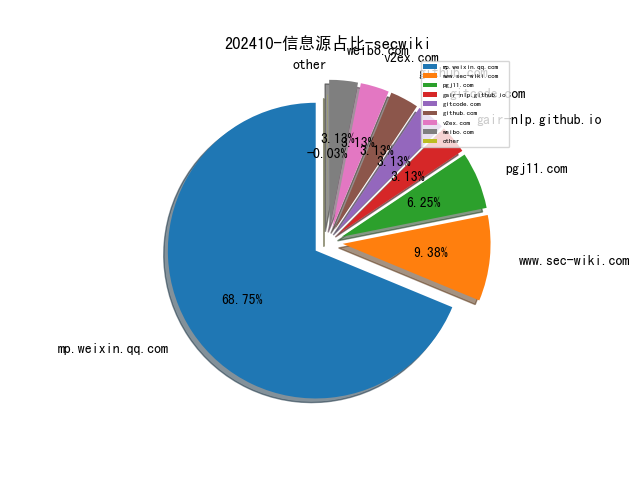
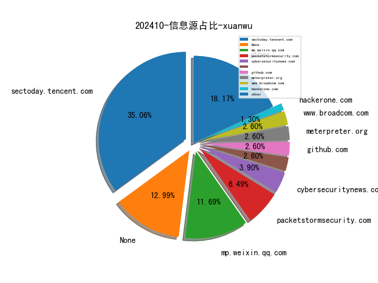
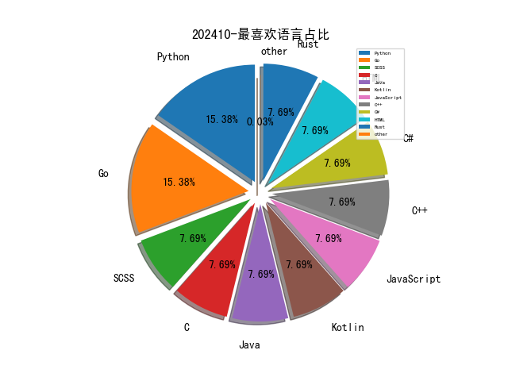

# [数据--所有](README_20.md)
# [数据--年度](README_2024.md)
# 202410 信息源与信息类型占比

# 网络安全书籍 推荐
| date_added | language | title | author | link | size| 
| --- | --- | --- | --- | --- | ---| 
| 2024-10-07 02:44:47 | English | beginners guide to streamlit with python | unknown | https://it-ebooks.info/book/1686051862-beginners_guide_to_streamlit_with_python/ | unknown| 
| 2024-10-07 06:44:58 | English | Building AI Applications with OpenAI APIs | unknown | https://www.wowebook.org/building-ai-applications-with-openai-apis/ | unknown| 
| 2024-10-07 05:58:39 | English | Microsoft Azure AI Fundamentals AI-900 Exam Guide | unknown | https://www.wowebook.org/microsoft-azure-ai-fundamentals-ai-900-exam-guide/ | unknown| 
| 2024-10-06 11:17:31 | English | Offensive Security Using Python | unknown | https://www.wowebook.org/offensive-security-using-python/ | unknown| 
| 2024-10-06 17:16:24 | English | RAG-Driven Generative AI | unknown | https://www.wowebook.org/rag-driven-generative-ai/ | unknown| 
| 2024-10-05 07:17:28 | English | Build a Website with ChatGPT | unknown | https://www.wowebook.org/build-a-website-with-chatgpt/ | unknown| 
| 2024-10-05 08:03:46 | English | Learn Generative AI with PyTorch | unknown | https://www.wowebook.org/learn-generative-ai-with-pytorch/ | unknown| 
| 2024-10-04 09:25:59 | English | Building AI Applications with OpenAI APIs: Leverage ChatGPT, Whisper, and DALL-E APIs to build 10 innovative AI, 2nd Edition | Martin Yanev | http://libgen.st/book/index.php?md5=1372DE245C92309DCA7422D3075C4CF8 | 5 MB [EPUB]| 
| 2024-10-03 07:29:20 | English | Critical Security Controls for Effective Cyber Defense | unknown | https://www.wowebook.org/critical-security-controls-for-effective-cyber-defense/ | unknown| 
| 2024-10-03 13:13:25 | English | Routledge Handbook on Cultural Heritage and Disaster Risk Management | Rohit Jigyasu (editor), Ksenia Chmutina (editor) | http://libgen.st/book/index.php?md5=6040389CE70058DB56F90C72EA497865 | 8 MB [PDF]| 
| 2024-10-03 13:09:14 | English | Scientific Data: A 50 Steps Guide using Python (De Gruyter Textbook) | Matthias Josef Hofmann | http://libgen.st/book/index.php?md5=7B97F048C0DCBCD71DE44D33CE7170A6 | 20 MB [PDF]| 
| 2024-10-03 13:05:24 | English | (National Bureau of Economic Research Conference Report) The Economics of Privacy | Avi Goldfarb, Catherine E. Tucker | http://libgen.st/book/index.php?md5=EE511D75EBC04057696B5F7646F26FDE | 7 MB [EPUB]| 
| 2024-10-02 08:27:08 | English | Idiomatic Rust: Code like a Rustacean | Brenden Matthews | http://libgen.st/book/index.php?md5=C502C8F43F373F0882D472A15168F255 | 7 MB [EPUB]| 
| 2024-10-02 11:53:30 | English | AI-Powered Developer: Build software with ChatGPT and Copilot | Nathan B. Crocker | http://libgen.st/book/index.php?md5=E55B4F3EB6EAB9F07792AED60810BA2F | 15 MB [EPUB]| 
| 2024-10-02 11:14:38 | English | Generative AI in Action (Final Release) | Amit Bahree | http://libgen.st/book/index.php?md5=E214C3623EE2A6F3BFFFF239A4DFDF1F | 29 MB [PDF]| 
| 2024-10-02 10:44:24 | English | Scientific Data: A 50 Steps Guide using Python | Matthias Hofmann | http://libgen.st/book/index.php?md5=D2B5F556C51C322D3C1290596E1EE181 | 12 MB [EPUB]| 
| 2024-10-02 10:39:48 | English | Generative AI and ChatGPT For Beginners: A Comprehensive Guide to Harness the Power of AI, Boost Productivity, and Get More Done in Less Time (Tech Mastery) | Sebhastian, Nathan | http://libgen.st/book/index.php?md5=844CB9673C57335FB0C9E9AAE0D870E7 | 9 MB [EPUB]| 
| 2024-10-02 18:14:21 | English | Numerical Python: Scientific Computing and Data Science Applications with Numpy, SciPy and Matplotlib, 3rd Edition | unknown | https://www.wowebook.org/numerical-python-scientific-computing-and-data-science-applications-with-numpy-scipy-and-matplotlib-3rd-edition/ | unknown| 

# 微信公众号 推荐
| nickname_english | weixin_no | title | url| 
| --- | --- | --- | ---| 
| CISSP Learning | None | 防火墙的未来 | https://mp.weixin.qq.com/s?__biz=MzIyMjYzNDgzMg==&mid=2247487329&idx=1&sn=88f54122a1a4859af623e85e139a9b89 | 3| 
| CyberOk | None | 现阶段中国阶层格局变化的十大新特点 | https://mp.weixin.qq.com/s?__biz=MzU3MDM2NzkwNg==&mid=2247486478&idx=2&sn=2075708ed4151350a2ede98349df57a9 | 2| 
| Docker中文社区 | None | docker 和传统虚拟机有什么区别？ | https://mp.weixin.qq.com/s?__biz=MzI1NzI5NDM4Mw==&mid=2247498106&idx=1&sn=133d2d04e45d828225190e2c8edb1040 | 2| 
| FreeBuf | None | The-Bastion：一款针对SSH的安全取证与审计工具 | https://mp.weixin.qq.com/s?__biz=MjM5NjA0NjgyMA==&mid=2651303868&idx=4&sn=53b0b745f4e9e18dd7c51b9433b529db | 24| 
| HW安全之路 | None | 文件里的\"隐形人\"：揭秘Windows不为人知的ADS技术 | https://mp.weixin.qq.com/s?__biz=MzI5MjY4MTMyMQ==&mid=2247485839&idx=1&sn=712885564ccf3ed86af172065b7082bf | 7| 
| TeamsSix | None | LC 多云资产梳理工具已更新至 v1.1.0 版本 | https://mp.weixin.qq.com/s?__biz=MzI5Mzk5NTIwMg==&mid=2247487315&idx=1&sn=4f4166cbcd5db1a2ecd1b5e21970c59b | 1| 
| WalkingCloud | None | GrayLog6.0.X通过yum方式升级到最新版本 | https://mp.weixin.qq.com/s?__biz=MzU2MjU1OTE0MA==&mid=2247499346&idx=1&sn=cb491beb429f01d58938488c1c8136f7 | 1| 
| WebSec | None | 干货 , 什么，有狗快跑！慢着，这次手把手教你怎么过狗！（sql注入篇） | https://mp.weixin.qq.com/s?__biz=MzkyMzYwNTEyNg==&mid=2247487089&idx=1&sn=f50e8778a02f6b043364572a4f676063 | 2| 
| WgpSec狼组安全团队 | None | LC 多云资产梳理工具已更新至 v1.1.0 版本 | https://mp.weixin.qq.com/s?__biz=MzIyMjkzMzY4Ng==&mid=2247508398&idx=1&sn=096e7d4b225f47a759df8066db2222ad | 1| 
| fkalis | None | 某金融src的一次较复杂攻击链进入后台 | https://mp.weixin.qq.com/s?__biz=MzkyODcwOTA4NA==&mid=2247485952&idx=2&sn=0a06813b2cded8f3a2a23b93e17dadfb | 5| 
| kali笔记 | None | 一款开源轻量级的网站应用防火墙-SamWaf | https://mp.weixin.qq.com/s?__biz=MzkxMzIwNTY1OA==&mid=2247508200&idx=1&sn=183c27b0725ecd156ec249cf3e565477 | 3| 
| 全栈安全 | None | 带你体验一款主流且开源的Web漏洞扫描工具 | https://mp.weixin.qq.com/s?__biz=MzkyMTYyOTQ5NA==&mid=2247485393&idx=1&sn=ed4f71197933ca368e923fd71781fd81 | 2| 
| 军哥网络安全读报 | None | Salt Typhoon入侵美宽带提供商，可能访问系统并获取其他数据 | https://mp.weixin.qq.com/s?__biz=MzI2NzAwOTg4NQ==&mid=2649792625&idx=3&sn=f224920d60ba4b951237b41643671506 | 12| 
| 剁椒Muyou鱼头 | None | 【技术分享】新手渗透测试必须搭建的环境！ | https://mp.weixin.qq.com/s?__biz=MzkxMTY1MTIzOA==&mid=2247484303&idx=1&sn=1d661a513a4846bc8a333fcf320a97e6 | 2| 
| 前沿信安资讯阵地 | None | 一图看懂《关键信息基础设施安全保护条例》前沿典藏版 | https://mp.weixin.qq.com/s?__biz=MzA3MTM0NTQzNA==&mid=2455779267&idx=1&sn=792e31e722ff1ca4a1b8a7fcae9caf37 | 5| 
| 安全内参 | None | 运营商“内鬼”违规提供短信接口，为397万个未实名手机号注册微信 | https://mp.weixin.qq.com/s?__biz=MzI4NDY2MDMwMw==&mid=2247512735&idx=1&sn=52075aee0e04caffea2b63e20b8c3153 | 1| 
| 安全喵喵站 | None | 1007 , 排名·香港·中国网络安全科技商业评级 | https://mp.weixin.qq.com/s?__biz=MzkzNjE5NjQ4Mw==&mid=2247541022&idx=2&sn=98e8031659114bc020655945faf876bd | 5| 
| 安全学习那些事儿 | None | 纬创遭受网络攻击：网站已恢复正常 运营无重大影响 | https://mp.weixin.qq.com/s?__biz=MzkxNTI2NTQxOA==&mid=2247494410&idx=2&sn=b504ab8e010821042b3339aec7d2acdd | 13| 
| 小迪安全 | None | 最后一天,迎接V2024-11小迪安全培训 | https://mp.weixin.qq.com/s?__biz=MzA5MzQ3MDE1NQ==&mid=2653940613&idx=1&sn=9bc3cd3cb156c63d341f6a3be1cdb352 | 2| 
| 悟安 | None | 网络安全等级保护怎么做 | https://mp.weixin.qq.com/s?__biz=MzU5MTIxNzg0Ng==&mid=2247487940&idx=1&sn=64a2e230bc4fad16b2b1ab0e96365209 | 1| 
| 星悦安全 | None | 微信公众号小说漫画系统存在前台任意文件上传漏洞(RCE) | https://mp.weixin.qq.com/s?__biz=Mzg4MTkwMTI5Mw==&mid=2247485751&idx=1&sn=f269f2e394f6779cdc687f97d4d9c0e8 | 5| 
| 星落安全团队 | None | 【抽奖送现金】国庆最后一天福利 , 星落安全专场优惠券 | https://mp.weixin.qq.com/s?__biz=MzkwNjczOTQwOA==&mid=2247488085&idx=1&sn=8766c37242b5302a6bd678c052b95e14 | 1| 
| 河南等级保护测评 | None | 我们在量化风险管理方面做得越来越好了吗？ | https://mp.weixin.qq.com/s?__biz=Mzg2NjY2MTI3Mg==&mid=2247497370&idx=2&sn=efa5b6c914f186d5efad25f923adff8b | 10| 
| 泷羽Sec | None | SFeather::CTF官方WP汇总 | https://mp.weixin.qq.com/s?__biz=Mzg2Nzk0NjA4Mg==&mid=2247492137&idx=1&sn=226fb401a0823741592f1f6fc8a106c5 | 2| 
| 源鲁安全实验室 | None | 2024 YLCTF  ,  倒计时 3 天 ！ | https://mp.weixin.qq.com/s?__biz=Mzg5MDk3MTgxOQ==&mid=2247497250&idx=1&sn=e02bfb0ac7faf06398b83e26e356cf0d | 1| 
| 犀牛安全 | None | 警方拆除与 483,000 名受害者有关的手机解锁装置 | https://mp.weixin.qq.com/s?__biz=Mzg3ODY0NTczMA==&mid=2247491231&idx=1&sn=8891911286075efa3becd884bdd911d0 | 2| 
| 独眼情报 | None | CVE-2024-47191：OATH-Toolkit PAM 模块中的严重缺陷可能导致 Root 漏洞 | https://mp.weixin.qq.com/s?__biz=MzkzNDIzNDUxOQ==&mid=2247490735&idx=8&sn=7f35021d8e3d64cc77f78ffba937facf | 37| 
| 玄道夜谈 | None | 分享图片 | https://mp.weixin.qq.com/s?__biz=MzI3Njc1MjcxMg==&mid=2247493300&idx=1&sn=3b2cf0c178a52e3b7c6c84dc8cca79c2 | 5| 
| 白帽学子 | None | 子域提取工具 SubCerts | https://mp.weixin.qq.com/s?__biz=MzkyNzIxMjM3Mg==&mid=2247487678&idx=1&sn=f5745c229ba1ae8b13c6335eba9680de | 6| 
| 知攻善防实验室 | None | [安全开发]国庆优惠最后一天！统一85折！仅需313！ | https://mp.weixin.qq.com/s?__biz=MzkxMTUwOTY1MA==&mid=2247489019&idx=1&sn=d7c76beb2f0bc948902e04cea7a63885 | 1| 
| 祺印说信安 | None | 信息安全手册：网络安全角色指南 | https://mp.weixin.qq.com/s?__biz=MzA5MzU5MzQzMA==&mid=2652111467&idx=2&sn=fb6c3bda080882433824bc51beed5aa7 | 10| 
| 网空闲话plus | None | 5th域安全微讯早报【20241007】241期 | https://mp.weixin.qq.com/s?__biz=MzkyMjQ5ODk5OA==&mid=2247503876&idx=3&sn=96f53786ca89e902e43ca3ed0545b278 | 13| 
| 网络安全与取证研究 | None | 免登录读取微信聊天记录 | https://mp.weixin.qq.com/s?__biz=Mzg3NTU3NTY0Nw==&mid=2247489241&idx=1&sn=ad5f4edf2ed71c646856f76a5d30172b | 6| 
| 网络安全实验室 | None | 1600+资源已更新 | https://mp.weixin.qq.com/s?__biz=MzU4OTg4Nzc4MQ==&mid=2247503901&idx=2&sn=e9af5adc8e1a1cac05d260844932227b | 8| 
| 船山信安 | None | go_ssti风险 | https://mp.weixin.qq.com/s?__biz=MzU2NDY2OTU4Nw==&mid=2247516549&idx=1&sn=8c72e498fde4ae8133172c899fd5c16b | 5| 
| 苏说安全 | None | 关于智能化、信息化、数字化、数智化、智慧化 | https://mp.weixin.qq.com/s?__biz=Mzg5OTg5OTI1NQ==&mid=2247488753&idx=1&sn=de3078f199f9ca82323ee57b3536b724 | 6| 
| 菜鸟学渗透 | None | KingPortal开发系统 信息泄露（Redis地址及密码、系统用户名及密码） | https://mp.weixin.qq.com/s?__biz=Mzg2NzkxOTQ0OA==&mid=2247484245&idx=1&sn=497f5b3ee01939773e8d7669afeab454 | 2| 
| 计算机与网络安全 | None | 文件下载指南 | https://mp.weixin.qq.com/s?__biz=MjM5OTk4MDE2MA==&mid=2655256785&idx=1&sn=0e34ca13fac58ed3bf0dd88d6482e759 | 11| 
| 进击的HACK | None | 一次简单的私活 | https://mp.weixin.qq.com/s?__biz=MzkxNjMwNDUxNg==&mid=2247486215&idx=1&sn=e334ddfa888676a5cb85af1c6a8afc69 | 7| 
| 锦岳智慧 | None | 数据暴露面管理：数据安全和合规的基础与起点 | https://mp.weixin.qq.com/s?__biz=MzkxMzQwNDcxNg==&mid=2247486657&idx=1&sn=e63bb2b40e43ae5d452590cb4589a307 | 1| 
| 青衣十三楼飞花堂 | None | 王平回忆录 | https://mp.weixin.qq.com/s?__biz=MzUzMjQyMDE3Ng==&mid=2247487661&idx=1&sn=20da91ea965ca5456dee52d47ff7aa90 | 3| 
| 高等精灵实验室 | None | SimpleX Chat：无需身份识别的下一代安全通讯工具 | https://mp.weixin.qq.com/s?__biz=MzA4MjkzMTcxMg==&mid=2449046091&idx=1&sn=b1b6e70ec223ce09943dfa4e3c8455d6 | 3| 
| 黑白之道 | None | 一款功能强大的网络安全综合工具 | https://mp.weixin.qq.com/s?__biz=MzAxMjE3ODU3MQ==&mid=2650601564&idx=4&sn=d1df146d2c09155a36e1aef9100d7574 | 16| 
| AI与安全 | None | CrowdStrike的AI能力分析 | https://mp.weixin.qq.com/s?__biz=Mzg5NTMxMjQ4OA==&mid=2247484539&idx=1&sn=274133e4d89df5f781ced4bd95cdc9db | 2| 
| BurpSuite实战教程 | None | 3分钟搞懂DES vs 3DES的区别 | https://mp.weixin.qq.com/s?__biz=MzU5NzQ3NzIwMA==&mid=2247485899&idx=1&sn=7d060fae8333f65156166df5156425fd | 6| 
| Hacking黑白红 | None | 网络安全界“奥运会”--2024“网鼎杯”网络安全大赛（报名截止日期10月20日） | https://mp.weixin.qq.com/s?__biz=Mzg2NDYwMDA1NA==&mid=2247540753&idx=3&sn=5fded17c0396d48fc9bcaaee2e0f548e | 3| 
| IoT物联网技术 | None | 不用再争了！老旧小区加装电梯，AIoT「适老型」智能电梯一站式解决方案 | https://mp.weixin.qq.com/s?__biz=MjM5OTA4MzA0MA==&mid=2454935437&idx=1&sn=3e700d53339f626ce13418557ff8df53 | 5| 
| IoVSecurity | None | YDT6014-2024车路协同通信密码应用技术要求(报批稿) 工信部 发布 | https://mp.weixin.qq.com/s?__biz=MzU2MDk1Nzg2MQ==&mid=2247614115&idx=3&sn=f3591ac7b1ad4de3a45d9574f2d7ef7b | 18| 
| Khan安全攻防实验室 | None | 名声在外 | https://mp.weixin.qq.com/s?__biz=MzAwMjQ2NTQ4Mg==&mid=2247494987&idx=1&sn=3f45fc76b6d848aabaeab1aaeee007be | 3| 
| OSINT情报分析师 | None | 家里的红富士熟了 | https://mp.weixin.qq.com/s?__biz=MzkxNzU5MjE0OA==&mid=2247485196&idx=1&sn=fda24ccefea2bef322c95b6bda5941ca | 2| 
| Ots安全 | None | 2022年俄乌冲突网络战争中的“酸雨行动” | https://mp.weixin.qq.com/s?__biz=MzAxMjYyMzkwOA==&mid=2247517578&idx=1&sn=226e46f3229010cf91a5726bf49d6fa0 | 14| 
| Rsec | None | HTB靶场 Cicada(Windows)[Easy] | https://mp.weixin.qq.com/s?__biz=MzA4NDQ5NTU0MA==&mid=2647690163&idx=1&sn=4a1621444e756a5a783fa599c4520a55 | 1| 
| Urkc安全 | None | 针对 Electron App 的漏洞利用工具 | https://mp.weixin.qq.com/s?__biz=MzkxNTU5NTI1Ng==&mid=2247486037&idx=1&sn=d6c64bfc8ba212200da23f420f5a294e | 1| 
| Z2O安全攻防 | None | 实战-某国主站www.gov.xx绕过补丁Getshell及相关思路 | https://mp.weixin.qq.com/s?__biz=Mzg2ODYxMzY3OQ==&mid=2247515799&idx=1&sn=16d20a5b2089673544a949dd319a7d5b | 2| 
| dotNet安全矩阵 | None | .NET 一款解密CryptoObfuscator混淆的工具 | https://mp.weixin.qq.com/s?__biz=MzUyOTc3NTQ5MA==&mid=2247495833&idx=2&sn=bfecb4cd26a7a61a423fb0cee4cfed5e | 18| 
| wavecn | None | 微软不作为：VSCode 恶意插件层出不穷 | https://mp.weixin.qq.com/s?__biz=Mzg4Njc0Mjc3NQ==&mid=2247486436&idx=1&sn=6e8b3725c5e9e734716af6ab37d89949 | 1| 
| 一个不正经的黑客 | None | 寻找 TeamViewer 0day 漏洞（二）：逆向身份验证协议 | https://mp.weixin.qq.com/s?__biz=MzkwODI1ODgzOA==&mid=2247506009&idx=1&sn=f16378da4eef9713e48225b98db38346 | 3| 
| 丁爸 情报分析师的工具箱 | None | 【工具】全球黑客聚集的10个知名论坛 | https://mp.weixin.qq.com/s?__biz=MzI2MTE0NTE3Mw==&mid=2651146633&idx=1&sn=5e753809dd164ef05f66a464568a0d3d | 7| 
| 与智慧做朋友 | None | 密码工作，从【服务对象】出发，更能前途远大！ | https://mp.weixin.qq.com/s?__biz=MzA3OTg3Mjg3NA==&mid=2456976543&idx=1&sn=ba8b17a697c1861f71a4609c88ad1487 | 5| 
| 中国信息安全 | None | 关注 , 中央网信办部署开展“清朗·整治违规开展互联网新闻信息服务”专项行动 | https://mp.weixin.qq.com/s?__biz=MzA5MzE5MDAzOA==&mid=2664226696&idx=3&sn=52e0c1bcb6bdcb59b93e3402e3d0ed03 | 6| 
| 人遁安全 | None | Cloudlist 资产管理工具，蓝队资产管理利器 | https://mp.weixin.qq.com/s?__biz=Mzk0NDQwMDY1Nw==&mid=2247484430&idx=1&sn=60486a178240fd81070ce06a47d323ab | 5| 
| 信安王子 | None | 全球十大黑客聚集网站 | https://mp.weixin.qq.com/s?__biz=Mzg4MjY5MDE4NA==&mid=2247484299&idx=1&sn=b0f732b048b3da1f6f1002c107a38a6d | 1| 
| 信息安全与通信保密杂志社 | None | 多位专家解读《网络数据安全管理条例》 | https://mp.weixin.qq.com/s?__biz=MzkwMTMyMDQ3Mw==&mid=2247594397&idx=1&sn=47bd3b8e95ae92329a2dfa78e7db09db | 1| 
| 信息安全笔记 | None | ctf之php反序列化 | https://mp.weixin.qq.com/s?__biz=MjM5MzI3NzE4NA==&mid=2257484308&idx=1&sn=ea920386eb9fa4cdc2a1255aa0e14fab | 1| 
| 全栈网络空间安全 | None | 【总结】设备漏洞挖掘思路 | https://mp.weixin.qq.com/s?__biz=Mzg3NTUzOTg3NA==&mid=2247514050&idx=1&sn=2536ede840f63cdf0250e2d94ddb8b8a | 5| 
| 全球技术地图 | None | 加快建设世界科技强国的根本遵循 | https://mp.weixin.qq.com/s?__biz=MzI1OTExNDY1NQ==&mid=2651616110&idx=1&sn=28a6e4424254042ff2895e80016f7a83 | 6| 
| 内存泄漏 | None | 网络世界大冒险：VNC连接完整指南！ | https://mp.weixin.qq.com/s?__biz=MzU2MjU2MzI3MA==&mid=2247484467&idx=1&sn=4079cdb1a146be15907306c267e71a02 | 2| 
| 内生安全联盟 | None | 论文丨量子计算信息安全威胁与应对策略分析 | https://mp.weixin.qq.com/s?__biz=Mzg4MDU0NTQ4Mw==&mid=2247524257&idx=1&sn=c47fd3be70a9b266c7726844fca616a9 | 6| 
| 再说安全 | None | 网络安全风险量化的 6 个真相 | https://mp.weixin.qq.com/s?__biz=MzkyODYwODkyMA==&mid=2247484231&idx=1&sn=5c6ab03b76328a7687e8ce5f61e1decb | 6| 
| 冷漠安全 | None | 「漏洞复现」用友U8 CRM config/fillbacksetting.php SQL注入漏洞 | https://mp.weixin.qq.com/s?__biz=MzkyNDY3MTY3MA==&mid=2247485659&idx=1&sn=e281df00860e8b672e57e78ccb217067 | 7| 
| 凝聚力安全团队 | None | 【漏洞复现】金蝶云星空ERP SaveUserPassport .net反序列化漏洞 | https://mp.weixin.qq.com/s?__biz=MzkyMDUwOTU1MA==&mid=2247484850&idx=1&sn=a974bb78e24c30cb87fe0dc079f8bba8 | 6| 
| 利刃信安 | None | 【商密测评】物理和环境安全（基本要求、测评要求、测评对象、注意事项、推荐应用、密评改造、测评指导、典型产品、证据截图）总结归纳 | https://mp.weixin.qq.com/s?__biz=MzU1Mjk3MDY1OA==&mid=2247518040&idx=1&sn=56006aa690ae3ffb72a1a52063517513 | 6| 
| 卡卡罗特取西经 | None | 从shiro命令执行到远程桌面登录 | https://mp.weixin.qq.com/s?__biz=MzkyODUzMjEzOA==&mid=2247483787&idx=1&sn=56053a927cb73e0a494c2df1ee450d36 | 1| 
| 吉祥学安全 | None | 物联网安全才是未来的安全的趋势 | https://mp.weixin.qq.com/s?__biz=MzkwNjY1Mzc0Nw==&mid=2247485955&idx=1&sn=56bcdbe29f16c5251f8b1c83672ecaa3 | 1| 
| 哈拉少安全小队 | None | 红队武器库和资源集合-持续更新 | https://mp.weixin.qq.com/s?__biz=MzAxNzkyOTgxMw==&mid=2247493593&idx=1&sn=e4c8cc33a77f5385c9be04b5e65833ee | 6| 
| 商密君 | None | 中央网信办部署开展“清朗·整治违规开展互联网新闻信息服务”专项行动 | https://mp.weixin.qq.com/s?__biz=MzI5NTM4OTQ5Mg==&mid=2247631019&idx=3&sn=3f8d4423078e6c06c6f5fc27334c49a2 | 11| 
| 太空安全 | None | Starlink PoP NetWork 详解（更新） | https://mp.weixin.qq.com/s?__biz=MzkwNjM4NTg4OQ==&mid=2247498672&idx=2&sn=c887901ef3d25cf6fa49ae0ea26790bc | 9| 
| 安全圈 | None | 【安全圈】用户在一次复杂的钓鱼攻击中损失了价值3200万美元的spWETH | https://mp.weixin.qq.com/s?__biz=MzIzMzE4NDU1OQ==&mid=2652064984&idx=4&sn=e1efdb97b5a9e0a6265bef7448af99a0 | 23| 
| 安全帮 | None | 红队武器库漏洞利用工具合集 - VulToolsKit | https://mp.weixin.qq.com/s?__biz=MzkzNjQwOTc4MQ==&mid=2247489661&idx=1&sn=c299c5bf6f7b9270c5138b9e83c9e8c1 | 2| 
| 安全有术 | None | 《金融数据中心容灾建设指引》附下载链接 | https://mp.weixin.qq.com/s?__biz=MzkzMDY2MDA2Ng==&mid=2247485624&idx=1&sn=e8e195eb8cb21c874407f649a6f00ef5 | 1| 
| 安全狗的自我修养 | None | 全网最全最深入超100节的ebpf基础与底层原理源码分析终于更完了,恶意软件整体更到190节啦 | https://mp.weixin.qq.com/s?__biz=MzkwOTE5MDY5NA==&mid=2247501277&idx=1&sn=1c78b73122c6b1791f00b92e4750c00a | 4| 
| 安全的黑魔法 | None | 攻防演练中一些必不可少的工具 | https://mp.weixin.qq.com/s?__biz=MzU4Mzc4MDQyOQ==&mid=2247484249&idx=1&sn=dec96c30dc7bfd97ed7dcdddbc35ffcd | 1| 
| 安全红蓝紫 | None | 全球身份新闻简报(1) | https://mp.weixin.qq.com/s?__biz=MzI1NjQxMzIzMw==&mid=2247494608&idx=1&sn=eb194d11d3817166831dafc5fd66716c | 5| 
| 安天集团 | None | 安全行动，只为中国（四）—— 移动安全威胁分析响应处置篇 | https://mp.weixin.qq.com/s?__biz=MjM5MTA3Nzk4MQ==&mid=2650207786&idx=1&sn=c15e6f785393a5d8d418f35bc50be16d | 6| 
| 安知讯 | None | 浦发银行被罚，涉数据治理不审慎等 | https://mp.weixin.qq.com/s?__biz=MzIxMDIwODM2MA==&mid=2653930893&idx=1&sn=1b10dfa0b997e4ad2ad82c22c4de90b9 | 6| 
| 小黑说安全 | None | 免登录读取微信聊天记录 | https://mp.weixin.qq.com/s?__biz=MzkxNjQyMjcwMw==&mid=2247486534&idx=1&sn=b2f17c49b82bfd63480c3be1bef88327 | 1| 
| 工业互联网标识智库 | None | 10月9日召开！标识工作组会议来了 | https://mp.weixin.qq.com/s?__biz=MzU1OTUxNTI1NA==&mid=2247591132&idx=1&sn=e1dc47a10bdead8b7b71cf0711b62342 | 3| 
| 掌控安全EDU | None | 重磅消息  , 赏金猎人板块 | https://mp.weixin.qq.com/s?__biz=MzUyODkwNDIyMg==&mid=2247544038&idx=3&sn=e989421625b1dd99ff43f4c77d54d40e | 18| 
| 星空网络安全 | None | 暗网：黑市和隐藏网络之旅 | https://mp.weixin.qq.com/s?__biz=MzkxNTY3MTE5MA==&mid=2247485430&idx=1&sn=01551ccc38c1793d8ddc80684d8e3182 | 7| 
| 棉花糖fans | None | [资料分享]信息安全技术IT安全运维管理指南 | https://mp.weixin.qq.com/s?__biz=MzkyOTQzNjIwNw==&mid=2247489358&idx=1&sn=cbab96bb94d26dfd687962777ebc644b | 2| 
| 洞见网安 | None | 网安原创文章推荐【2024/10/3】 | https://mp.weixin.qq.com/s?__biz=MzAxNzg3NzMyNQ==&mid=2247488977&idx=1&sn=1d29c997e8db7d0f55e27d83462d5a04 | 5| 
| 猎洞时刻 | None | SRC 奇特的优惠券越权小分享 | https://mp.weixin.qq.com/s?__biz=MzkyNTUyNTE5OA==&mid=2247486134&idx=2&sn=a6ddbd045d7f150aee06df026c78c247 | 3| 
| 白帽子 | None | 成功破解Tor的匿名性，时序分析攻击技术这么厉害？ | https://mp.weixin.qq.com/s?__biz=MzAwMDQwNTE5MA==&mid=2650247631&idx=1&sn=7cd67c2c5d6ef3ff55713a8d85566f4e | 1| 
| 白帽子左一 | None | 初中级渗透测试 , 南昌 | https://mp.weixin.qq.com/s?__biz=MzI4NTcxMjQ1MA==&mid=2247613418&idx=2&sn=484cd54a3e15017749db698ae59397a3 | 10| 
| 白帽子程序员 | None | 【重磅发布】关于举办第四届“网鼎杯”网络安全大赛的通知 | https://mp.weixin.qq.com/s?__biz=Mzg3Mjc0MDQ2Nw==&mid=2247494446&idx=2&sn=635f2778da80a791082ebe64f712ec79 | 2| 
| 白泽安全实验室 | None | Necro木马利用隐写术和多阶段攻击策略感染超过1100万设备 | https://mp.weixin.qq.com/s?__biz=MzI0MTE4ODY3Nw==&mid=2247492352&idx=1&sn=08811888bfba38612ccda52298fd4f19 | 3| 
| 看雪学苑 | None | 目录更新！《安卓系统定制实战》 | https://mp.weixin.qq.com/s?__biz=MjM5NTc2MDYxMw==&mid=2458577822&idx=2&sn=f3c99a4f8db570575d66e51835f7286a | 12| 
| 硅步security | None | 个人技术爱好修炼 - DY无人直播助手使用说明 | https://mp.weixin.qq.com/s?__biz=MzkwMjI2OTc3MQ==&mid=2247488096&idx=1&sn=92090aedcf0987f36852fe046c3fa98a | 1| 
| 秦安战略 | None | 《诗词游记》第368期：秦淮人家晚晴楼 | https://mp.weixin.qq.com/s?__biz=MzA5MDg1MDUyMA==&mid=2650474110&idx=3&sn=f2a7f733ba589807a40e30988a8fa446 | 19| 
| 紫队安全研究 | None | 五角大楼、FBI与DHS联合揭露朝鲜黑客行动 | https://mp.weixin.qq.com/s?__biz=Mzg3OTYxODQxNg==&mid=2247485160&idx=1&sn=b56516cfa01e163f0da871d77a398c0b | 7| 
| 绿盟科技 | None | 智汇长安 , 跟着小鹰City Walk Day 5 | https://mp.weixin.qq.com/s?__biz=MjM5ODYyMTM4MA==&mid=2650459212&idx=1&sn=06c0b021c82d09c6b7170672e365bfc0 | 2| 
| 网安守护 | None | AWVS API接口 食用简单方式 | https://mp.weixin.qq.com/s?__biz=MzU4NDY3MTk2NQ==&mid=2247490762&idx=1&sn=94afc09a8b45a6a1820feb47848cd9e3 | 2| 
| 网安寻路人 | None | 英国政府近期就AI网络安全“行为守则”公开征求意见（全文翻译） | https://mp.weixin.qq.com/s?__biz=MzIxODM0NDU4MQ==&mid=2247504737&idx=1&sn=f6cbc1f2c51e97b6f438e8b087786f29 | 1| 
| 网安百色 | None | 5起利用AI工具编造谣言典型案例！ | https://mp.weixin.qq.com/s?__biz=MzI0NzE4ODk1Mw==&mid=2652093738&idx=2&sn=5a95d11e76a1cdbd4e61f42f29565ca9 | 4| 
| 网络与安全实验室 | None | 团队科研成果分享-41 | https://mp.weixin.qq.com/s?__biz=MzI1MTQwMjYwNA==&mid=2247500760&idx=1&sn=f084b2d39a9a5a66696dd69beda0614e | 2| 
| 网络安全与人工智能研究中心 | None | 新勒索软件 Shinra 与 Limpopo 浮出水面 | https://mp.weixin.qq.com/s?__biz=MzkwMTQyODI4Ng==&mid=2247494159&idx=3&sn=20a6b68ab0677664bbf4d403d7f0b467 | 9| 
| 网络技术干货圈 | None | Cisco 命令速查表，网络工程师收藏！ | https://mp.weixin.qq.com/s?__biz=MzUyNTExOTY1Nw==&mid=2247526883&idx=1&sn=44da0c5c8d5501dc06ba9b308f04f3c7 | 7| 
| 网络技术联盟站 | None | 网工进阶岔路口：策略路由和路由策略，两者到底有啥区别？ | https://mp.weixin.qq.com/s?__biz=MzIyMzIwNzAxMQ==&mid=2649461913&idx=1&sn=e8803d39f1ad5924ee766fa6a4dae555 | 5| 
| 网络研究观 | None | 电报在网络犯罪领域留下的空白将如何弥补？ | https://mp.weixin.qq.com/s?__biz=MzkxNDM4OTM3OQ==&mid=2247503159&idx=1&sn=7f34d0d81fff365765937955e8d0adbc | 6| 
| 网络空间信息安全学习 | None | 世界住房日：全球住房权变革！ | https://mp.weixin.qq.com/s?__biz=MzI2MjcwMTgwOQ==&mid=2247491744&idx=1&sn=fe7e98fdc52e99436f3c91caf07e09a8 | 3| 
| 美亚柏科 | None | “美亚杯”赛前培训，助您高效备赛 | https://mp.weixin.qq.com/s?__biz=MjM5NTU4NjgzMg==&mid=2651421594&idx=2&sn=3f7be7d3d9c12b48a6ef26b552837778 | 2| 
| 老烦的草根安全观 | None | 老烦读《网络数据安全管理条例》之五 | https://mp.weixin.qq.com/s?__biz=MzA5MTYyMDQ0OQ==&mid=2247493386&idx=1&sn=6b7722a4c5827c11c922d60bcb3764bf | 5| 
| 老鑫安全 | None | 杀死那个名为360安全的软件 | https://mp.weixin.qq.com/s?__biz=MzU0NDc0NTY3OQ==&mid=2247487942&idx=1&sn=ba641657fdd74f09e3a62c8fd6023a7a | 1| 
| 菜鸟学信安 | None | 某众测项目中有手就行的几个漏洞 | https://mp.weixin.qq.com/s?__biz=MzU2NzY5MzI5Ng==&mid=2247503083&idx=1&sn=be4a6143eb42c3717ae07ce965573cde | 2| 
| 谈思实验室 | None | 奔驰、宝马、大众：反对！ | https://mp.weixin.qq.com/s?__biz=MzIzOTc2OTAxMg==&mid=2247544209&idx=2&sn=334b31537cf2d8ff5c8b60a0096c2032 | 12| 
| 迪哥讲事 | None | 国庆最后一天福利 , 星球免费名额赠送＋知识星球优惠券放送 | https://mp.weixin.qq.com/s?__biz=MzIzMTIzNTM0MA==&mid=2247496032&idx=1&sn=bb53e9059d1700f9432f649e845cec27 | 4| 
| 锐安全 | None | 合规市场真相揭秘：为何数据安全赛道“雷声大雨点小”？ | https://mp.weixin.qq.com/s?__biz=MzAxOTk3NTg5OQ==&mid=2247491256&idx=1&sn=de06781e6dac94b6d3bc031b41e259cc | 3| 
| 鸿鹄实验室 | None | 新版Chrome浏览器解密补充 | https://mp.weixin.qq.com/s?__biz=MzU0MjUxNjgyOQ==&mid=2247492217&idx=1&sn=53e725cc48bcf1f476f067c8a96690fc | 1| 
| 黄豆安全实验室 | None | NewStarCTF2024第一周WP | https://mp.weixin.qq.com/s?__biz=MzkzNjczNzEyMw==&mid=2247483979&idx=1&sn=7d0fa73ad636c9ecb0e31354490b2596 | 1| 
| 黑客技术家园 | None | 详细给大家介绍生活中最常用的定位方式，以及定位原理 | https://mp.weixin.qq.com/s?__biz=MzI2OTk4MTA3Ng==&mid=2247495431&idx=2&sn=89bb5fc76493d377926ad53d3753746d | 2| 
| 黑客驰 | None | 网络世界大冒险：VNC连接完整指南！ | https://mp.weixin.qq.com/s?__biz=Mzg4MzgwMDE2Mw==&mid=2247488136&idx=1&sn=7ed8620e0c1a2c16fe03e8521b57bb7d | 2| 
| 龙哥网络安全 | None | Vulnhub靶机Kioptrix level-4 多种姿势渗透详解【黑客渗透测试零基础入门必知必会】 | https://mp.weixin.qq.com/s?__biz=MzU3MjczNzA1Ng==&mid=2247491299&idx=2&sn=429ae8369650538ba8b8ccec03112eae | 4| 
| DFIR蘇小沐 | None | 【闲时光】语默动静·2024国庆 | https://mp.weixin.qq.com/s?__biz=MzI2MTUwNjI4Mw==&mid=2247488635&idx=1&sn=bf17c1ac7f2004b5321882b04e36dccf | 1| 
| Esn技术社区 | None | Git同步准备中 | https://mp.weixin.qq.com/s?__biz=MzU5Njg5NzUzMw==&mid=2247490343&idx=1&sn=266bc79d504c3ccd452085f8dd9cc76a | 1| 
| Gamer茶馆 | None | 网易，游戏热爱者？？？ | https://mp.weixin.qq.com/s?__biz=MzIzNjI1OTY5Mw==&mid=2247487010&idx=1&sn=b2a0ef848f3d6e7351c93827dfacd95a | 1| 
| Mask安全小组 | None | 某次省级HW中某度用户名溯源方法及案例（2） | https://mp.weixin.qq.com/s?__biz=MzkyNDM4MzQ3MA==&mid=2247483856&idx=1&sn=3ccc7ca4f47d199e73e60ab6c32be71d | 3| 
| OneMoreThink | None | 应急实战(9)：一次简简单单的应急 | https://mp.weixin.qq.com/s?__biz=MzI0NjA3Mzk2NQ==&mid=2247494324&idx=1&sn=1a7ce7c349e94ee9f6e031d2ca9e22ef | 2| 
| Ting丶的安全笔记 | None | 保研网络安全你需要了解、注意什么 | https://mp.weixin.qq.com/s?__biz=MzkyODY3NjkyNQ==&mid=2247484314&idx=1&sn=975fcac8eacc907d7675b56c577dcf7d | 1| 
| hacker30 | None | 机缘巧合下的未授权访问之旅 | https://mp.weixin.qq.com/s?__biz=MzkxNzY2MjU2Mg==&mid=2247483760&idx=1&sn=8cdfca1d972130b2b769b9d2773718e1 | 1| 
| solar专业应急响应团队 | None | 【新闻转载】勒索软件团伙每月用新型MedusaLocker变种感染100多家机构 | https://mp.weixin.qq.com/s?__biz=MzkyOTQ0MjE1NQ==&mid=2247491024&idx=1&sn=ef6642aec538d93cf2a2bd9cbb101a26 | 1| 
| 哆啦安全 | None | Windows安装MinGW及C++及Qt环境和配置 | https://mp.weixin.qq.com/s?__biz=Mzg2NzUzNzk1Mw==&mid=2247497183&idx=1&sn=e2be31d15b48ba34100ecd32c3560f6d | 3| 
| 地图大师的漏洞追踪指南 | None | \"国庆最后机会！地图大师SRC挖洞课程永久名额即将截止，错过等一年！\" | https://mp.weixin.qq.com/s?__biz=MzI5MDcyODIzNg==&mid=2247484512&idx=1&sn=7fdea4a1a5a0d55d178701b8f6b8e8d0 | 1| 
| 巢安实验室 | None | 对某端口转发工具的一次分析_ | https://mp.weixin.qq.com/s?__biz=MzU2MjY1ODEwMA==&mid=2247491862&idx=1&sn=c2dafb1d10ff6397505adf3963a8f609 | 1| 
| 智佳网络安全 | None | 【BaseCTF】SSTV音频隐写 | https://mp.weixin.qq.com/s?__biz=Mzk0NDYwOTcxNg==&mid=2247484136&idx=1&sn=a125efc77fd517cc4ee3cc9f8d5aa47b | 1| 
| 网安加社区 | None | 百家讲坛 , 潘继平：AI赋能DevOps平台：全面提升代码安全性 | https://mp.weixin.qq.com/s?__biz=Mzg4MjQ4MjM4OA==&mid=2247520170&idx=1&sn=8d9ec5a397497a21b3773d1bd4521616 | 2| 
| 黑哥虾撩 | None | 降维打击：从《三体》到现代战争的技术演变 | https://mp.weixin.qq.com/s?__biz=Mzg5OTU1NTEwMg==&mid=2247484178&idx=1&sn=7d7d3a198df83a1288a9bcce15490166 | 2| 
| 0x6270安全团队 | None | 慢讯 | https://mp.weixin.qq.com/s?__biz=Mzg4Njc1MTIzMw==&mid=2247485699&idx=1&sn=f1a9037739bdb0ff2e0097d45c07d488 | 1| 
| APT250 | None | Windows NTLM中继攻击（PortBender二进制可执行文件) | https://mp.weixin.qq.com/s?__biz=MzkwODY2MzMyMA==&mid=2247484123&idx=1&sn=7891d5e94bdbdf6896a78aec9668c116 | 2| 
| HACK之道 | None | SRC通过越权拿下高危漏洞 | https://mp.weixin.qq.com/s?__biz=MzIwMzIyMjYzNA==&mid=2247515975&idx=1&sn=fc34ebb2e5bf60646927fd254eb9d533 | 1| 
| Heihu Share | None | Java 安全 , ClassLoader 理解与利用一篇就够了 | https://mp.weixin.qq.com/s?__biz=MzkwMzQyMTg5OA==&mid=2247484422&idx=1&sn=7986b9b13afc1bbfe66449ea9f7c38bd | 1| 
| 三沐数安 | None | 俄罗斯网络攻击重点转向乌克兰军事基础设施，网络安全在基础设施上的投入必要性。 | https://mp.weixin.qq.com/s?__biz=MzU1NjczNjA0Nw==&mid=2247485040&idx=1&sn=ad5e5dd5ea10a78b3e96e90e7237423c | 1| 
| 信息时代的犯罪侦查 | None | 如何使用ECharts辅助开展数据可视化分析？ | https://mp.weixin.qq.com/s?__biz=MzAxNTA4NDAwOQ==&mid=2650736988&idx=1&sn=5e1734a5c81916d6113bf0d3ad513927 | 1| 
| 像梦又似花 | None | 2024年最新Win10/Win11系统永久激活教程（免费、无需密钥、支持离线激活） | https://mp.weixin.qq.com/s?__biz=MzkwMjQyNjAxMA==&mid=2247484502&idx=1&sn=6c8e5e43412e8da691a66314160bccd2 | 1| 
| 国家网络安全通报中心 | None | 网络安全宣传片-\"两高一弱\"专题（二） | https://mp.weixin.qq.com/s?__biz=MzU1MTE1MjU5Nw==&mid=2247485270&idx=1&sn=128fd77f5e52e7905bcc7adec41a9eef | 2| 
| 天际友盟 | None | [1004] 一周重点威胁情报｜天际友盟情报站 | https://mp.weixin.qq.com/s?__biz=MzIwNjQ4OTU3NA==&mid=2247509612&idx=1&sn=0964a62be82554c3fe2eb9ed9a049ad9 | 1| 
| 安全君呀 | None | 每日扩展 , 密码学 | https://mp.weixin.qq.com/s?__biz=MzkyOTUxMzk2NQ==&mid=2247485033&idx=1&sn=c5d6d893e801cabbb2a969f61d092ab7 | 1| 
| 小杨学安全 | None | 反弹Shell流量加密 | https://mp.weixin.qq.com/s?__biz=Mzk0NzM4OTQ5NQ==&mid=2247484485&idx=1&sn=96976b91421581b5c734acf8dd0a5422 | 2| 
| 泛安全 | None | 原创文章目录 | https://mp.weixin.qq.com/s?__biz=MzU3NjQ5NTIxNg==&mid=2247484997&idx=5&sn=add2b275e64bfaccc7b50cfba44a4c21 | 10| 
| 洞源实验室 | None | 一次解决Go编译问题的经过 | https://mp.weixin.qq.com/s?__biz=Mzg4Nzk3MTg3MA==&mid=2247487471&idx=1&sn=b18b36cfc7dda23d4381d6c74933b8cd | 1| 
| 犀利猪安全 | None | 速速转发 , 国家专项扶贫资金？假假假！ | https://mp.weixin.qq.com/s?__biz=Mzk0NzQxNzY2OQ==&mid=2247486934&idx=1&sn=a5aeb0973f86011ef1466543e53e85ac | 2| 
| 知机安全 | None | 【2024-10-04】每日安全资讯 | https://mp.weixin.qq.com/s?__biz=MzIzNDU5NTI4OQ==&mid=2247487826&idx=1&sn=d6af51871facdee98a07967a718aee67 | 1| 
| 网络安全和信息化 | None | 1—8月我国软件业务收入85492亿元，信息安全收入增长持续放缓 | https://mp.weixin.qq.com/s?__biz=MjM5MzMwMDU5NQ==&mid=2649167596&idx=1&sn=166c4e568ab45af21e4bfb3e9ce6cc31 | 7| 
| 道一安全 | None | 【工具分享】轻量级代码审计扫描工具 | https://mp.weixin.qq.com/s?__biz=MzU5OTMxNjkxMA==&mid=2247487185&idx=2&sn=7c381cb266b9e6e50d0419809f99bf56 | 3| 
| 长风安全 | None | 工具｜CSDN付费、登录、关注限制绕过 | https://mp.weixin.qq.com/s?__biz=Mzg4MDkyMTE4OQ==&mid=2247484491&idx=1&sn=d82360e07ddf998c17bea52297802a81 | 1| 
| 风铃Sec | None | C/C++逆向：函数逆向分析-调用约定分析 | https://mp.weixin.qq.com/s?__biz=Mzk0MjY1ODE5Mg==&mid=2247484582&idx=1&sn=6dd97c66ed4136000e2501a71f003fea | 1| 
| CISSP | None | 某大型集团信息安全建设和优化案例 | https://mp.weixin.qq.com/s?__biz=Mzg4MTg0MjQ5OA==&mid=2247486764&idx=1&sn=4f49b373c517f00405742e162d84e13c | 1| 
| Desync InfoSec | None | 始于Nitrogen钓鱼，陷于Sliver，终于BlackCat | https://mp.weixin.qq.com/s?__biz=MzkzMDE3ODc1Mw==&mid=2247488663&idx=1&sn=a8c89745d6decc19555c15876d45b14c | 1| 
| KK安全说 | None | OSINT终极指南 | https://mp.weixin.qq.com/s?__biz=Mzg4NzgyODEzNQ==&mid=2247488134&idx=1&sn=ae5f930d00120242f4f321acd1e5db5b | 6| 
| Kali渗透测试教程 | None | 开源SOC实现（十五）-Shuffle | https://mp.weixin.qq.com/s?__biz=MzI3NDYwMzI4Mg==&mid=2247486631&idx=1&sn=e555b23d003c506e3b03bb4ef83d147e | 2| 
| NOP Team | None | 一个记录本机IP的程序 ｜ 功能更新 | https://mp.weixin.qq.com/s?__biz=MzU1NDkwMzAyMg==&mid=2247502555&idx=1&sn=67a323c98aa31d608e7e81d6768a4e09 | 1| 
| RedTeaming | None | 高危产品指纹维护计划1.0 | https://mp.weixin.qq.com/s?__biz=MzUyMDgzMDMyMg==&mid=2247484465&idx=1&sn=80feb4c98ed2b33c50b118eea562ceac | 1| 
| TtTeam | None | 互联网大厂面试题目 | https://mp.weixin.qq.com/s?__biz=Mzg2NTk4MTE1MQ==&mid=2247486008&idx=1&sn=6d60ae781b93e704be175cf2c110599b | 1| 
| moonsec | None | 【活动最后一天】全新升级，安全精英必经之路 —— 新版渗透测试培训震撼来袭！ | https://mp.weixin.qq.com/s?__biz=MzAwMjc0NTEzMw==&mid=2653588501&idx=1&sn=d15993aa12cb3893aa45433b34f5745c | 1| 
| 中国保密协会科学技术分会 | None | 车联网技术与安全综述 | https://mp.weixin.qq.com/s?__biz=MzIxMzI4ODI1MA==&mid=2247488653&idx=1&sn=bb0dbd02bf6ccbebcef5e282f2605fcd | 1| 
| 中国电信安全 | None | 【04号投票了】2024年中国电信集团成果贡献奖 | https://mp.weixin.qq.com/s?__biz=MzkxNDY0MjMxNQ==&mid=2247530319&idx=1&sn=3b0e3311412f679c31ad11f589427ee8 | 1| 
| 乌雲安全 | None | 实战,MSSQL绕过杀软上线 | https://mp.weixin.qq.com/s?__biz=MzAwMjA5OTY5Ng==&mid=2247524054&idx=1&sn=e9b2247270fe1484495c9671c3c912bb | 1| 
| 吾爱破解论坛 | None | 论坛访问故障已解决，恢复访问，感谢大家的理解和支持。 | https://mp.weixin.qq.com/s?__biz=MjM5Mjc3MDM2Mw==&mid=2651141400&idx=1&sn=91ffccc5e37cc420d680124dacc67f72 | 1| 
| 呼啦啦安全 | None | 面试经验分享 | https://mp.weixin.qq.com/s?__biz=Mzg5OTg5NzkwNw==&mid=2247485447&idx=1&sn=691e89ba8629e84c79a8ad57a9c11664 | 1| 
| 国际云安全联盟CSA | None | 《网络数据安全管理条例》解读--数字经济发展的坚强后盾 | https://mp.weixin.qq.com/s?__biz=MzkwMTM5MDUxMA==&mid=2247499612&idx=1&sn=1cf706ffa76285885a7eee4c4e696257 | 1| 
| 在下小白 | None | BurpSuite抓包MUMU模拟器12 | https://mp.weixin.qq.com/s?__biz=MzkyNzUzMjM1NQ==&mid=2247484695&idx=1&sn=a5543fddfb4fa7a7d3df86d2210b61d4 | 1| 
| 大伯为安全 | None | 内网渗透隧道搭建 | https://mp.weixin.qq.com/s?__biz=MzkwOTU5Mjk5MA==&mid=2247484482&idx=2&sn=36e88f71bc63af702842ca724577ddcd | 2| 
| 富贵安全 | None | 安全运维之从0-1搭建Jumpserver | https://mp.weixin.qq.com/s?__biz=MzkxNzY5MTg1Ng==&mid=2247483821&idx=1&sn=3a1a436282d845ef514fa9ba84b064d8 | 1| 
| 小呆安全 | None | 分享图片 | https://mp.weixin.qq.com/s?__biz=MzkzNTUwNzIxNA==&mid=2247484445&idx=1&sn=c7cd335d7254e8a27352ccdf60e6bf1e | 1| 
| 思极安全实验室 | None | 记一次攻防演练总结(2) | https://mp.weixin.qq.com/s?__biz=MzAwOTQzMjMwOQ==&mid=2247483821&idx=1&sn=9658bdf0ca388089a085ee49e271b062 | 1| 
| 情报分析站 | None | 此人不存在？ | https://mp.weixin.qq.com/s?__biz=MzkxMDIwMTMxMw==&mid=2247493938&idx=2&sn=db8e8a0b8ad7fee9d48265e0c95f4554 | 2| 
| 暗影网安实验室 | None | 新手必刷的10个渗透靶场！ | https://mp.weixin.qq.com/s?__biz=MzIyNTIxNDA1Ng==&mid=2659210523&idx=1&sn=8d909b0de99e79c110f1fc464db36b9b | 1| 
| 柠檬赏金猎人 | None | golang实现的交互shell | https://mp.weixin.qq.com/s?__biz=Mzg2Mzg2NDM0NA==&mid=2247484790&idx=1&sn=77ab3f621fa3817f9c297d28053c6c92 | 1| 
| 泰晓科技 | None | 泰晓 Linux 实验盘再升级，集成 LoongArch 实验环境 | https://mp.weixin.qq.com/s?__biz=MzA5NDQzODQ3MQ==&mid=2648194109&idx=1&sn=82d71e92be764df66566ee2c49cb37b4 | 1| 
| 皓月的笔记本 | None | 【漏洞复现】pgAdmin4 敏感信息泄露漏洞（CVE-2024-9014） | https://mp.weixin.qq.com/s?__biz=Mzk0ODM0NDExMg==&mid=2247484544&idx=1&sn=c24c78f413a2f5661a6f3accbf369575 | 2| 
| 网络与信息法学会 | None | 【资讯】中央网信办部署开展“清朗·整治违规开展互联网新闻信息服务”专项行动 | https://mp.weixin.qq.com/s?__biz=MzU1NDY3NDgwMQ==&mid=2247545854&idx=1&sn=ac1517974f542a2f1b8ffe4be63887f2 | 4| 
| 轩公子谈技术 | None | 一次有趣的渗透测试 | https://mp.weixin.qq.com/s?__biz=MzU3MDg2NDI4OA==&mid=2247490061&idx=1&sn=2f51377be04ea7132e2511ff9b74dac1 | 1| 
| 软件安全与逆向分析 | None | 安卓系统第三季更新完毕，全季完结撒花 | https://mp.weixin.qq.com/s?__biz=MzU3MTY5MzQxMA==&mid=2247484659&idx=1&sn=fedde8cc3736964dd6a4387c5b570d95 | 1| 
| 道玄网安驿站 | None | Proving Grounds-BlackGate | https://mp.weixin.qq.com/s?__biz=Mzg4NTg5MDQ0OA==&mid=2247487133&idx=1&sn=108222bd13b7a7475d6349fc5d296903 | 4| 
| 黑帽渗透技术 | None | Aircrack安卓渗透工具使用详细用法以及下载 | https://mp.weixin.qq.com/s?__biz=MzAxNTQwMjAzOA==&mid=2452514788&idx=1&sn=351c7301bbf806bfb7b870f002deffb5 | 1| 
| 关键信息基础设施安全保护联盟 | None | 【重磅发布】关于举办第四届“网鼎杯”网络安全大赛的通知 | https://mp.weixin.qq.com/s?__biz=MzkxNjU2NjY5MQ==&mid=2247507052&idx=1&sn=e12223639d12cbc30372fb7d735e4809 | 1| 
| 大象只为你 | None | MySQL存储引擎InnoDB、索引和索引下推 | https://mp.weixin.qq.com/s?__biz=MzI5NzUyNzMzMQ==&mid=2247485298&idx=1&sn=910ca124043295ae8726120c6c54e49d | 1| 
| 奇安网情局 | None | 加拿大建立武装部队网络司令部以整合军事网络能力 | https://mp.weixin.qq.com/s?__biz=MzI4ODQzMzk3MA==&mid=2247489160&idx=1&sn=25ca5984afc06a16cce81297eeed6ec3 | 1| 
| 我吃饼干 | None | 【资源分享】最新BurpSuite2024.9专业中英文开箱即用版下载 | https://mp.weixin.qq.com/s?__biz=MzkzODY2ODA0OA==&mid=2247485860&idx=1&sn=68424ed3cd202b3e54d98ad94b151efc | 1| 
| 暗魂攻防实验室 | None | 对某款智能手表的分析与攻击 | https://mp.weixin.qq.com/s?__biz=MzkyMjE1NzQ2MA==&mid=2247489398&idx=1&sn=177322b5f09cbc07b9a92f808c857456 | 1| 
| 陈冠男的游戏人生 | None | 对某款智能手表的分析与攻击 | https://mp.weixin.qq.com/s?__biz=MzU5OTU3NDEzOQ==&mid=2247492551&idx=1&sn=e5ef781ea086a18cab0400c8bd76edbe | 1| 
| CertiK | None | 恭贺华诞 ｜ CertiK：积蓄星火，以待磅礴 | https://mp.weixin.qq.com/s?__biz=MzU5OTg4MTIxMw==&mid=2247503438&idx=1&sn=4e02fa30f528903f595591a3f8a04c64 | 1| 
| Crystal Equation | None | 分享图片 | https://mp.weixin.qq.com/s?__biz=MzkzMzU5OTI3OQ==&mid=2247483957&idx=1&sn=6629e308fcde50a28b57413176cb638e | 1| 
| Echo Reply | None | 我为什么不喜欢用 tcpdump -i any | https://mp.weixin.qq.com/s?__biz=MzA5NTUxODA0OA==&mid=2247492953&idx=1&sn=e53f8a2bd0ebcdcb347bdb3a043e2f20 | 1| 
| JOY的安全屋 | None | 国庆快乐 | https://mp.weixin.qq.com/s?__biz=Mzg2ODkyNjU4NQ==&mid=2247483984&idx=1&sn=edbc8c763db6471e52de81c535865d3a | 1| 
| KeepHack1ng | None | Linux 默认打印系统RCE漏洞复现 | https://mp.weixin.qq.com/s?__biz=MzkzOTQ5MzY3OQ==&mid=2247484134&idx=1&sn=5e0a98cd6317a39e02170b350f3b8099 | 1| 
| SecWiki | None | SecWiki周刊（第552期） | https://mp.weixin.qq.com/s?__biz=MjM5NDM1OTM0Mg==&mid=2651053337&idx=1&sn=9e978709a7c4a2f139ab986c62f29aca | 1| 
| Sec探索者 | None | 【0基础学免杀】大白哥免杀课6期，属于你的免杀0到1 | https://mp.weixin.qq.com/s?__biz=MzkyNDYwNTcyNA==&mid=2247487304&idx=1&sn=38ea473d9713efa7fdd05efa3fca3816 | 1| 
| web安全笔记 | None | 渗透测试之黑灰产----ZJ盘C销 | https://mp.weixin.qq.com/s?__biz=MzkzMzQwNDkzMQ==&mid=2247484310&idx=1&sn=c9bea631e8257cd0bdce3492fae071bf | 1| 
| xsser的博客 | None | AI时代的宏观篇 | https://mp.weixin.qq.com/s?__biz=MzA4NzA5OTYzNw==&mid=2247484485&idx=1&sn=c843ee4e5cdc784589e3d46cdbf9b13d | 1| 
| 众安天下Allsec | None | 盛世华诞，众安守护 , 共筑网络安全，庆祝新中国成立75周年 | https://mp.weixin.qq.com/s?__biz=MzIyOTUzODY5Ng==&mid=2247504268&idx=1&sn=94a532fcdf84890b3bfb703936649f05 | 1| 
| 兰花豆说网络安全 | None | API已成为企业内部数据泄露的罪魁祸首 | https://mp.weixin.qq.com/s?__biz=MzI3NzM5NDA0NA==&mid=2247489347&idx=1&sn=9369169ffc0d42d42ca73f6d24f560f2 | 1| 
| 卫星黑客 | None | 浅谈卫星系统安全 | https://mp.weixin.qq.com/s?__biz=MzIxMjExNDMzNw==&mid=2247484584&idx=1&sn=6d46abb6f87f011af6c532fbb2a083ed | 1| 
| 台下言书 | None | 热烈庆祝中华人民共和国成立75周年 | https://mp.weixin.qq.com/s?__biz=MzIyNDkwNjQ5Ng==&mid=2247485988&idx=1&sn=810b9ef218d885d906363edc07718c2a | 1| 
| 夜组安全 | None | 国庆节快乐！ | https://mp.weixin.qq.com/s?__biz=Mzk0ODM0NDIxNQ==&mid=2247492324&idx=1&sn=82a8107ead7993f6cf2273a99f3aea3d | 1| 
| 天启者安全 | None | 天启者安全祝大家国庆节快乐 | https://mp.weixin.qq.com/s?__biz=MzkxNjY2MjY3NQ==&mid=2247483971&idx=1&sn=9877fd14ee3eaec47aad0d58ecf5c19f | 1| 
| 安全光圈 | None | 吃瓜一览《国庆去哪里，既小众又便宜?》 | https://mp.weixin.qq.com/s?__biz=Mzk0MDY2NTY5Mw==&mid=2247485478&idx=1&sn=17c0ec9adaf62aa8f6aaf80e723121dc | 1| 
| 安全视安 | None | 【翻译】如何绕过 Golang SSL 验证 | https://mp.weixin.qq.com/s?__biz=Mzg4NzgzMjUzOA==&mid=2247485134&idx=1&sn=4224ab2610c20923f8c2b9377414c874 | 2| 
| 安帝Andisec | None | 安帝速递｜【工业网络安全月报2024年-9月】 | https://mp.weixin.qq.com/s?__biz=MzU3ODQ4NjA3Mg==&mid=2247559738&idx=2&sn=d090a61bf137e4dea82ea1e8b7c4fd7d | 2| 
| 山海之关 | None | SCTF 2024 writeup by Arr3stY0u | https://mp.weixin.qq.com/s?__biz=Mzg4MjcxMTAwMQ==&mid=2247488534&idx=1&sn=9445239e5a3e39d0b5e6e556dda31d0f | 1| 
| 异空间安全 | None | 国庆就业班团购优惠，携手同行，共创未来 | https://mp.weixin.qq.com/s?__biz=MzIzOTUwMjI5MA==&mid=2247485549&idx=1&sn=053089b7d543d293fd3f95beba3e055a | 1| 
| 情报分析师 | None | 量子计算将如何改变战争的未来 | https://mp.weixin.qq.com/s?__biz=MzA3Mjc1MTkwOA==&mid=2650555885&idx=2&sn=0c9623e46577d63a0a78acacb4c881d1 | 2| 
| 情报分析师Pro | None | 哈里斯和特朗普在科技政策上的分歧 | https://mp.weixin.qq.com/s?__biz=MzkwNzM0NzA5MA==&mid=2247500726&idx=1&sn=d9b1ce14456aa8f18eac4262fb568b00 | 2| 
| 扶楹安全 | None | 分享图片 | https://mp.weixin.qq.com/s?__biz=MzkyNzQzODA3Ng==&mid=2247484567&idx=1&sn=3a036be6f20183d243f040e40797785a | 1| 
| 攻防SRC | None | 关于举办第四届“网鼎杯”网络安全大赛的通知 | https://mp.weixin.qq.com/s?__biz=MzIyNDg2MDQ4Ng==&mid=2247486600&idx=1&sn=8a809b8ec69f6d34ed6edc6d5ba945d7 | 1| 
| 朱厌安全 | None | 山河锦绣，国盛家兴！ | https://mp.weixin.qq.com/s?__biz=Mzg4Njg3MDk5Ng==&mid=2247486748&idx=1&sn=af4d2e729421b57f0bc20faec5ba5d88 | 1| 
| 泽鹿安全 | None | 庆祝中华人民共和国成立75周年 | https://mp.weixin.qq.com/s?__biz=Mzg5MjE1NzgzMw==&mid=2247489124&idx=1&sn=39f0ce0c8253df4bb7a1552a8a856425 | 1| 
| 灵创科技安全服务 | None | 热烈庆祝中华人民共和国成立75周年 | https://mp.weixin.qq.com/s?__biz=Mzg4MzEzOTEwMw==&mid=2247492024&idx=1&sn=a7f8cc281bf5a876b39a764b8f44f14f | 1| 
| 狐狸说安全 | None | 盛世华诞 举国同庆 | https://mp.weixin.qq.com/s?__biz=MzUzMDQ1MTY0MQ==&mid=2247505944&idx=1&sn=f55a07d521dac7642791a59ffb1cdf6b | 1| 
| 狗头网络安全 | None | ★热烈庆祝中华人民共和国成立75周年★ | https://mp.weixin.qq.com/s?__biz=Mzk0ODU4MjIyNQ==&mid=2247484000&idx=1&sn=0a0f6ea3fc607aa0c5d48d674ddd5647 | 1| 
| 独立观察员博客 | None | WordPress 更换服务器迁移注意事项 | https://mp.weixin.qq.com/s?__biz=MzA3NDE0NTA0MA==&mid=2649212181&idx=1&sn=e59807ad08985e9969200a9af4aa8f22 | 1| 
| 秦国商鞅 | None | 原创-一个底层阶级的大专生家长训诫子女的一番话 | https://mp.weixin.qq.com/s?__biz=Mzg4NzAwNzA4NA==&mid=2247484909&idx=1&sn=3f83451c5cddee93f7a226ee43369837 | 2| 
| 粤西网络空间安全实验室 | None | 每月网络安全动向（99） | https://mp.weixin.qq.com/s?__biz=MzkyODMxNzQ2NQ==&mid=2247487836&idx=1&sn=7d4be8ff0128aa821f9d996a6b3ec953 | 1| 
| 网络空间安全科学学报 | None | 会议预告 , 2024卫星互联网会议 | https://mp.weixin.qq.com/s?__biz=MzI0NjU2NDMwNQ==&mid=2247501996&idx=1&sn=137c551c822c6a46b62d458c77520f4d | 1| 
| 蚁景网安 | None | 盛世华诞，国庆快乐！ | https://mp.weixin.qq.com/s?__biz=MzkyNTY3Nzc3Mg==&mid=2247487211&idx=1&sn=120f44a70741f29a0d5aa9869c39a424 | 1| 
| 诸葛安全 | None | 生在红旗下，长在春风里，人民有信仰，国家有力量，目光所致皆为华夏，五星闪耀皆为信仰，愿以吾辈之青春，捍卫盛世之中华，捍卫中华！ | https://mp.weixin.qq.com/s?__biz=MzkxODczMzQ1MA==&mid=2247484680&idx=1&sn=c4643d8e3727e555e5b7efe392dcc28d | 1| 
| 贝雷帽SEC | None | 【OSCP】pipy | https://mp.weixin.qq.com/s?__biz=Mzk0MDQzNzY5NQ==&mid=2247492597&idx=1&sn=a89e0d8c07889bc5a8e9f69ca4832c56 | 1| 
| 阿里安全响应中心 | None | 第二阶段开始｜14家SRC邀您加入双11安全保卫战 | https://mp.weixin.qq.com/s?__biz=MzIxMjEwNTc4NA==&mid=2652995689&idx=1&sn=b55f6b25e0b01e16f5c02f024122ea68 | 1| 
| 骨哥说事 | None | 2024年9月星球内容汇总 | https://mp.weixin.qq.com/s?__biz=MjM5Mzc4MzUzMQ==&mid=2650259928&idx=2&sn=e53eac1b8d7c7540dc0bccbe02804d51 | 2| 
| 黑客联盟l | None | 夏威夷健康中心在遭受勒索软件攻击后披露数据泄露 | https://mp.weixin.qq.com/s?__biz=MzA5NzQxMTczNA==&mid=2649166535&idx=3&sn=6cb0ee398830638b391bd9899bb88fab | 3| 

# 日更新程序
`python update_daily.py`