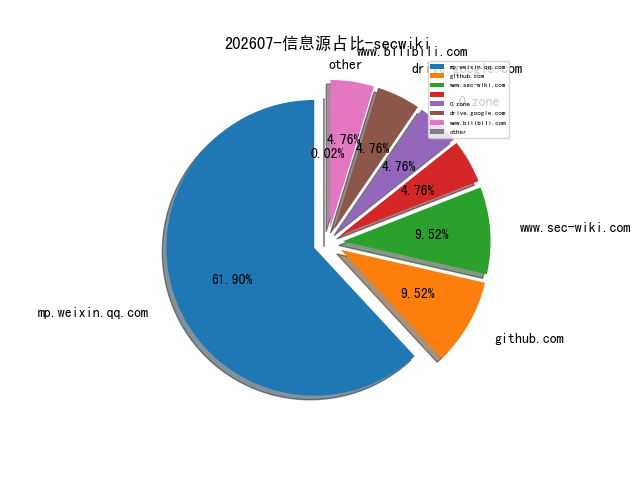
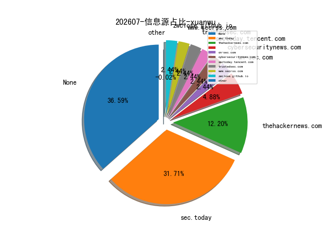
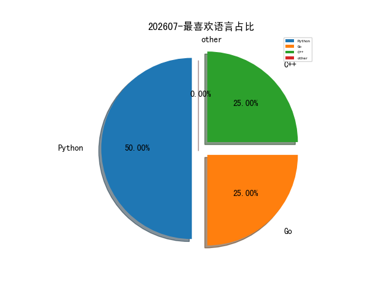

# [数据--所有](README_20.md)
# [数据--年度](README_2026.md)
# 202607 信息源与信息类型占比

# 网络安全书籍 推荐
| date_added | language | title | author | link | size| 
| --- | --- | --- | --- | --- | ---| 
| 2026-07-16 17:22:43 | English | Microsoft Security Operations Analyst Exam Ref SC-200 Guide, 2nd Edition | unknown | https://www.wowebook.org/microsoft-security-operations-analyst-exam-ref-sc-200-guide-2nd-edition/ | unknown| 
| 2026-07-16 15:05:10 | English | Ultimate AI Agent Development with Semantic Kernel | unknown | https://www.wowebook.org/ultimate-ai-agent-development-with-semantic-kernel/ | unknown| 
| 2026-07-16 14:20:25 | English | Ultimate Kubernetes Virtualization with KubeVirt | unknown | https://www.wowebook.org/ultimate-kubernetes-virtualization-with-kubevirt/ | unknown| 
| 2026-07-11 20:52:43 | English | Python for Algorithmic Trading Cookbook, 2nd Edition | unknown | https://www.wowebook.org/python-for-algorithmic-trading-cookbook-2nd-edition/ | unknown| 
| 2026-07-09 20:59:57 | English | Advanced Blazor Architecture with .NET 10 and Azure OpenAI | unknown | https://www.wowebook.org/advanced-blazor-architecture-with-net-10-and-azure-openai/ | unknown| 
| 2026-07-09 17:33:11 | English | Databricks Certified Generative AI Engineer Associate Study Guide | unknown | https://www.wowebook.org/databricks-certified-generative-ai-engineer-associate-study-guide/ | unknown| 
| 2026-07-09 17:11:27 | English | Data Analytics Toolkit: From Excel to Python, R, and Tableau | unknown | https://www.wowebook.org/data-analytics-toolkit-from-excel-to-python-r-and-tableau/ | unknown| 
| 2026-07-09 16:31:53 | English | Python & AI For Dummies | unknown | https://www.wowebook.org/python-ai-for-dummies/ | unknown| 
| 2026-07-04 06:29:54 | English | Generative AI for Business Innovation | unknown | https://www.wowebook.org/generative-ai-for-business-innovation/ | unknown| 
| 2026-07-02 20:18:45 | English | LLMs for Modern Software Delivery and DevOps | unknown | https://www.wowebook.org/llms-for-modern-software-delivery-and-devops/ | unknown| 
| 2026-07-02 19:43:42 | English | Hands-On Image Processing and Computer Vision with Python, 2nd Edition | unknown | https://www.wowebook.org/hands-on-image-processing-and-computer-vision-with-python-2nd-edition/ | unknown| 
| 2026-07-02 19:07:24 | English | Practical LLM Evaluation for Production Systems | unknown | https://www.wowebook.org/practical-llm-evaluation-for-production-systems/ | unknown| 
| 2026-07-01 20:59:05 | English | Multimodal Generative AI in the Enterprise: From Pixels to Profit | unknown | https://www.wowebook.org/multimodal-generative-ai-in-the-enterprise-from-pixels-to-profit/ | unknown| 
| 2026-07-01 19:37:01 | English | AI Under Attack | unknown | https://www.wowebook.org/ai-under-attack/ | unknown| 
| 2026-07-01 16:07:50 | English | Python Automation Cookbook, 3rd Edition | unknown | https://www.wowebook.org/python-automation-cookbook-3rd-edition/ | unknown| 

# 学习视频 推荐
| title | url| 
| --- | ---| 
| CCF形式化方法与软件安全新技术青年论坛-回放 | https://www.bilibili.com/video/BV1gYNd6dETT/?vd_source=cf356e754c3297351584ba6a3f42dc76| 

# 微信公众号 推荐
| nickname_english | weixin_no | title | url| 
| --- | --- | --- | ---| 
| AI技术笔记 | None | ChatGPT 5.6 最新模型 140 充值 | https://mp.weixin.qq.com/s/Z1ojF8rp_3mhjvzGkKHRLA | 12| 
| CISP | None | 授权培训机构2026年8月CISP培训开班计划公告 | https://mp.weixin.qq.com/s/C_TAQaBJ11NpgWZM0zbZRA | 4| 
| IoT物联网技术 | None | 永别啦！网贷信用卡大结清：央国企、事业编、公务员、上市职工一招清零负债 | https://mp.weixin.qq.com/s/BKJ1sMoZnoK1pEFBwJeBVg | 8| 
| NowSec | JacobWang JacobWang | OpenAI 的 AI Agent 攻击 Hugging Face：当模型为了通过测试开始入侵真实系统 | https://mp.weixin.qq.com/s/fWcrDCy7gd9qZ-l9aeefPw | 3| 
| SCERT科技服务平台 |  | 《信息化项目造价咨询服务 标准体系框架》（T/SCSIA 0019-2025）联合发布（附全文） | https://mp.weixin.qq.com/s/R7MvlX6lTYgintzDxzeUsQ | 1| 
| 上海等保测评 | 保保顾问 保保顾问 | 上海政务单位做等保，这五个坑最容易卡住 | https://mp.weixin.qq.com/s/AbQxY6MIKZJUU1YuCp2jXw | 4| 
| 中国电信安全 |  | 会议预告 , 第一届CCF网络与系统安全大会嘉宾阵容揭晓 | https://mp.weixin.qq.com/s/3KmL3ZWPoQJ9lyERWPz6vg | 7| 
| 京数安 | None | 清朗\"暑期专项来了，做未成年个人信息合规的朋友都在翻这本手册 | https://mp.weixin.qq.com/s/AJT9i7KSzOB0Mw2OkLQkiQ | 2| 
| 信息安全国家工程研究中心 | NERCIS NERCIS | 专家解读｜为小型个人信息处理者合理松绑减负 推进个人信息处理活动包容审慎监管 | https://mp.weixin.qq.com/s/kNMuVML4DAUJXV29KMmzYQ | 2| 
| 公安部网安局 | None | 焦点访谈：聚焦“短视频虚假摆拍乱象” | https://mp.weixin.qq.com/s/3FOlNbS_Nqynvnq2xxjsxg | 18| 
| 助安社区 | Ravie Lakshmanan Ravie Lakshmanan | 本周回顾：失控AI代理、Check Point漏洞利用、Slopsquatting、ClickFix诱饵及其他事件 | https://mp.weixin.qq.com/s/qn1BBn5wKtx6gfW0MForbw | 2| 
| 夜组安全 | ZonWin ZonWin | VulnFlanker 漏洞监测平台 , WatchVuln 高价值漏洞采集与推送 | https://mp.weixin.qq.com/s/s1vS1aW6lCzGn1Jd1rKXbw | 4| 
| 天融信 | None | 天融信：AI驱动医疗数据安全运营体系，实现从合规治理到智能运营 | https://mp.weixin.qq.com/s/cBx4O4W5Ma19tpZHUZmkZA | 10| 
| 天融信教育 | None | 邀请函丨CISP 注册信息安全专业人员认证培训一合规刚需丨持证上岗丨职称等同丨地方补贴丨 | https://mp.weixin.qq.com/s/gX2FFE7Ve2lSv8dGXpscFQ | 1| 
| 天黑说嘿话 |  | Fastjson2 AutoType 安全问题确认：现有版本尚无正式修复，公开 EXP 到底能走多远 | https://mp.weixin.qq.com/s/6Ph43vq3XrBj5n3s21Cw_w | 6| 
| 安全客 | None | OpenAI开源Codex Security CLI：用于发现、验证和修复安全漏洞 | https://mp.weixin.qq.com/s/nnWfsr1tVIhdedn-oUgiSw | 5| 
| 微步在线 |  | HuggingFace首次披露AI入侵全量细节 | https://mp.weixin.qq.com/s/H1ggn-0u_T-PpjVRszTuTw | 3| 
| 我的安全视界观 | None | 【AI复盘】AI Agent自动化勒索攻击事件 | https://mp.weixin.qq.com/s/9lUJ3kOL6OJkkJPx1Wyu-g | 3| 
| 晟晖科技 |  | 漏洞通告,Microsoft Office代码执行漏洞(CVE-2026-55022) | https://mp.weixin.qq.com/s/SqsGBVNmPUSUQZYdkxTZag | 6| 
| 梓陌说科技 | None | iOS 26.6正式版，哪些系统不用更新，哪些系统必更？ | https://mp.weixin.qq.com/s/svlaaW2TEi-hTMB9rNQ_sA | 16| 
| 渗透安全团队 |  | “系统正在维护” 影子资产实战思路 | https://mp.weixin.qq.com/s/EL67pUvwu3c8fGvDIORb8g | 2| 
| 狐狸说安全 | None | One-Fox零基础培训计划（二期本周开班），带你从配置环境到实战攻防 | https://mp.weixin.qq.com/s/vWmmoD4BLfima-N58YQBtg | 2| 
| 独眼情报 | None | 黑客的漏洞监控平台，随时可能失效 | https://mp.weixin.qq.com/s/HqYi_jNztyYug4DXLagQqA | 22| 
| 玄月调查小组 | None | OpenAI 开源了Codex Security CLI | https://mp.weixin.qq.com/s/XbMvQdw4TLcgfqIWIpG85Q | 1| 
| 疆来攻防 |  | 我就靠这3句SQL，搞定了leader要的所有数据 | https://mp.weixin.qq.com/s/MgvagQW0fofKNBsoE7bTqQ | 1| 
| 睿伟网络科技 | None | AI代理全面渗透，企业安全治理是否到位 | https://mp.weixin.qq.com/s/BTHh3Gn8IuU6S-sNaxcQ_w | 2| 
| 等保测评和商密评估 |  | 中国网络空间安全协会关基专委会召开“大模型与重要行业领域网络安全”技术研讨会 | https://mp.weixin.qq.com/s/6s4zT1V3mxR6Hw2zIKowaQ | 1| 
| 网络侦查研究院 | 子午猫 子午猫 | 市面上所有“代收赚佣金”全是跑分洗钱！新旧套路一次性扒干净 | https://mp.weixin.qq.com/s/ItIa_HDwxWgr2kcYeNpNNA | 27| 
| 菜鸟学信安 | Hi-FullHouse Hi-FullHouse | 一个网络安全Skill技能库 - 39大模块，195个安全Skills，覆盖完整攻击面与防御面 | https://mp.weixin.qq.com/s/UXpSP4cDhDI0qh-Hb31C2A | 2| 
| 蓝军开源情报 | 止戈为武 止戈为武 | 美以伊战争的法律和战略反思——胁迫信号、认知战还是全面战争？ | https://mp.weixin.qq.com/s/dYCJWfeKhWcUCJMv2P5Jow | 1| 
| 释然IT杂谈 |  | 一台没打补丁的虚拟机，攻穿了整家企业内网 | https://mp.weixin.qq.com/s/pAoU6Yv77cyo5RlBxs8muA | 2| 
| 黑鸟 | 黑鸟 黑鸟 | HuggingFace遭大模型自主攻击事件复盘 | https://mp.weixin.qq.com/s/vXZY8GYrZkOeuQOHxhvGVA | 5| 
| 默安科技 | None | 格物致知xa0研发有格 ,xa0默安科技正式发布 AI 原生研发治理平台 | https://mp.weixin.qq.com/s/Fil95R7Q0hcEyIbDwyWS5w | 1| 
| BeatRex网安AI观测站 | BeatRex BeatRex | 网安AI速报 , 2026.07.28 | https://mp.weixin.qq.com/s/-6_l9evfbLZknwZz6F5mmA | 6| 
| CyberSecurityDaily | None | 网络安全日报 , 2026-07-27 | https://mp.weixin.qq.com/s/wrrlJ6-5Ws7xNNzhhSMJzg | 10| 
| ISC2网络安全 | ISC2 China ISC2 China | 【活动预告】ISC2北京分会线下技术分享会丨智攻智防：探索 AI 时代安全新范式 | https://mp.weixin.qq.com/s/YSpliWz5YByATNFFs8vDsQ | 2| 
| KK安全说 | None | 第一届AI Safety&amp;Security人工智能安全与风险治理大会议程 | https://mp.weixin.qq.com/s/yb-H9THQo37v8a4LWTWm3w | 1| 
| NUX战队 | None | 战队近日在第二十八届中国机器人及人工智能大赛获得佳绩 | https://mp.weixin.qq.com/s/m6z0VXCMvoWPcE4PyQ-ekw | 2| 
| Ots安全 | - - | 小白必看！国内办公智能体推荐指南：从热门到小众，总有一款适合你！ | https://mp.weixin.qq.com/s/V5Ubvv2pfu25_K5VUi22eQ | 9| 
| WK安全 | None | 招聘 , 广州安全岗位！ | https://mp.weixin.qq.com/s/-PbxxHL7xXmVGKf4UxlhRw | 1| 
| e安在线 | e安在线 e安在线 | 泰国财政部遭AI智能体攻陷！攻击基础设施全曝光 | https://mp.weixin.qq.com/s/-A7T6HfmNac7FMmcqY0Gzg | 3| 
| 中国网络空间安全协会 |  | 中国网络空间安全协会关基专委会召开“大模型与重要行业领域网络安全”技术研讨会 | https://mp.weixin.qq.com/s/aEBB-xfQk9TFhu6n-0N8NA | 9| 
| 中资网安 | CACT CACT | 热点速览 , 每周网安大事件（20260720-20260726） | https://mp.weixin.qq.com/s/Y97bfy1k7JmpW0YcXwk_zQ | 2| 
| 云弈安全 |  | 标准发布｜云弈科技参编 T/CCIA 006-2026《人工智能防火墙安全技术要求》正式发布 | https://mp.weixin.qq.com/s/Dgfsx5WAw1s1B8PC3gKobw | 1| 
| 交大捷普 |  | 焕新升级！捷普漏洞扫描系统（AI版本）新版本发布！ | https://mp.weixin.qq.com/s/40jjNTlkZWGz7NysOfzAog | 7| 
| 信息安全与通信保密杂志社 | Cismag Cismag | 全球首部智能体安全强制性国家标准正式立项 | https://mp.weixin.qq.com/s/BvxGVp-V7l0Nh_EQcjR66g | 6| 
| 信息安全动态 | 老张 老张 | 俄情报部门劫持IP摄像头监视军运：87,000台设备暴露，默认密码是最大漏洞 | https://mp.weixin.qq.com/s/A3VyGaxmz8SJFjsvryGbLg | 4| 
| 信息安全研究 |  | 动态｜《商用密码检测机构（商用密码应用安全性评估业务）质量管理体系建设指引》正式发布 | https://mp.weixin.qq.com/s/8ovlivaoc43XwtaFXXjn7A | 13| 
| 信息网络安全杂志 |  | 中山大学 , 计算机学院本科生在数据挖掘顶级会议KDD 2026发表论文 | https://mp.weixin.qq.com/s/J3XL3vfAHYnPxqjI8CvHSw | 12| 
| 内生安全联盟 |  | 泰国财政部遭 AI 智能体攻陷！攻击基础设施全曝光 | https://mp.weixin.qq.com/s/jOMTrjVih0AUlXLLgznQ0g | 14| 
| 华为安全 |  | 第五届中国IPv6创新发展大会IPv6行业赋能分论坛举办，华为携手产业共建人工智能防火墙安全技术规范 | https://mp.weixin.qq.com/s/7hwhY2hKMTiVkD_gFGxZYg | 3| 
| 合合信息 | 合合君 合合君 | 合合信息2027届校园招聘正式启动 | https://mp.weixin.qq.com/s/CRiBaixwH9C4yxQoJ7e97A | 2| 
| 君说安全 | None | 全线飘红 | https://mp.weixin.qq.com/s/_g4ZgxfgQ5ZGcLK3ByRVCw | 6| 
| 哈啰安全应急响应中心 HSRC | 哈啰信息安全 哈啰信息安全 | HSRC关于AI生成漏洞报告的处置公告 | https://mp.weixin.qq.com/s/x7dVk4TbK1vmWH-EzhniCA | 2| 
| 国家互联网应急中心CNCERT |  | CNVD漏洞周报2026年第29期 | https://mp.weixin.qq.com/s/Ql8ZFjGRTYDB7jYj4iyG5Q | 1| 
| 国际云安全联盟CSA上海代表处 | 姜来 姜来 | CSA预警, 智能体底层框架级漏洞--通过篡改元数据完美避开提示注入防护 | https://mp.weixin.qq.com/s/OAWs3646H1y7W85v9igdYg | 3| 
| 天创培训 | 天创培训 天创培训 | 喜报 ,2026年6月CISP考试南京地区通过名单 | https://mp.weixin.qq.com/s/7WgSuDAi8AL4DO2azrr9FA | 2| 
| 天启攻防实验室 | 匆匆过客 匆匆过客 | 内推｜驻场、护网招聘 | https://mp.weixin.qq.com/s/BazEr1dNaas5mui5-SRJfQ | 1| 
| 天唯信息安全 | 天唯科技 天唯科技 | 90%企事业单位遭勒索失陷并非黑客技术碾压！一场真实攻防复盘，拆解安全运营六大致命短板→ | https://mp.weixin.qq.com/s/LPsln5izbAgAe4gEveQHgQ | 3| 
| 天威诚信 | None | 👆 解锁智能 换种方式管证书 | https://mp.weixin.qq.com/s/3f3VPLbshT-m8srUcHz75g | 2| 
| 安全学术圈 | 郭凌嘉 郭凌嘉 | 中国科学院信息工程研究所 , TRAIL：基于知识增强大模型推理的虚假网络威胁情报自动检测 | https://mp.weixin.qq.com/s/JxnyOJXQgZ63wNaHFaWuJQ | 4| 
| 安天垂直响应平台 | 安天CERT 安天CERT | 安天智能体完成Fastjson 2.x RCE漏洞PoC验证 | https://mp.weixin.qq.com/s/WFL13fBelHczVdQk6u544g | 1| 
| 安恒信息 |  | 安恒信息开展物联网产业园党委“书记分享会”主题活动 | https://mp.weixin.qq.com/s/XfN-C7f9kNK1Cs14B3OV7w | 10| 
| 山石网科新视界 | None | 中标｜云南旅游职业技术学院网络安全项目 | https://mp.weixin.qq.com/s/XTw2I7GbByWDFaQc0swxYw | 4| 
| 广东网警 | 公安部网安局 公安部网安局 | 人民日报：这些涉灾网络谣言要严查 | https://mp.weixin.qq.com/s/Hg6MXTjOG9pDfg5RmIBWaw | 2| 
| 广州网警 | 公安部网安局 公安部网安局 | 公安部：今年上半年共侦办利用AI工具生成网络谣言案件170余起 | https://mp.weixin.qq.com/s/M87f07Q0t3urk5sxj1QPLw | 2| 
| 情报分析师 | FF FF | Telegram招募者在欧盟国家悬赏实施纵火与情报搜集针对乌克兰相关目标，我海外利益与侨民社区面临类似混合威胁的风险 | https://mp.weixin.qq.com/s/BrIXZBtnOCKhp1ZTYx73JA | 13| 
| 掌控安全EDU | 掌控者 掌控者 | 7月社区投稿活动 , 漏洞挖掘/AI渗透 | https://mp.weixin.qq.com/s/wK0twtlscBq_2JDCjOoWjA | 8| 
| 攻防录 | 攻防路 攻防路 | ARTEX：自主渗透测试系统 | https://mp.weixin.qq.com/s/f3r-Tie_cft32obLvAILLg | 2| 
| 数说安全 | None | 就在刚刚！英伟达成立 Open Secure AI Alliance 黄仁勋：防御者需要“前沿 AI 生态” | https://mp.weixin.qq.com/s/8-2B25cXZYKmn8Ck8yk9Xg | 2| 
| 新潮信息安全 |  | 公司简介 | https://mp.weixin.qq.com/s/_AEI_CSJiKRcTKlmxKz6aA | 1| 
| 无影安全实验室 | shine shine | 护网人员急招！(帮朋友转发，有需要可以联系) | https://mp.weixin.qq.com/s/d9nY_wu7PNOSli1n0sYQAQ | 1| 
| 暗魂安全团队 |  | SpecterAI V1.5 单兵作战系统正式发布 | https://mp.weixin.qq.com/s/zE6rPde_ZHEMMB2W2CzD6w | 1| 
| 棉花糖网络安全工具箱 | 棉花糖糖糖 棉花糖糖糖 | 微信小程序安全审计领域的颠覆性工具诞生！23个MCP工具让AI自动完成渗透测试 | https://mp.weixin.qq.com/s/KbAz9l7yLOCPR8Pviqn6Jw | 8| 
| 河北镌远网络科技有限公司 | 河北镌远 河北镌远 | 致敬每一位运维人！避开这些高频坑，才是网安运维进阶的关键 | https://mp.weixin.qq.com/s/QUMUi5nuaDMjTWDFDQlpSw | 1| 
| 洞见网安 | AJay13 AJay13 | 网安原创文章推荐【2026/7/27】 | https://mp.weixin.qq.com/s/dIdavNNMbbPSq0h6QBECdw | 8| 
| 滴滴安全应急响应中心 |  | DSRC , 平台维护通知 | https://mp.weixin.qq.com/s/SI36c_2gY65LiCQPUOXiRg | 1| 
| 炼石网络CipherGateway | 数据安全建设就找 数据安全建设就找 | 喜报！炼石网络入选2026年《网络安全企业100强》 | https://mp.weixin.qq.com/s/UhGVhdHRRdm9UfrWtiT8Eg | 2| 
| 玄道夜谈 | None | 分享图片 | https://mp.weixin.qq.com/s/nThtfYXeTDoyvV3ijwXvgw | 8| 
| 盛邦安全WebRAY |  | 筑牢邮件安全防线：GB/T 37002-2026正式发布，盛邦安全参与标准制定 | https://mp.weixin.qq.com/s/KexwV7tRUHoogilGkq8xSg | 7| 
| 神州希望网络安全 |  | 应急演练也能“自动打分”？神州希望开启演练新篇章！ | https://mp.weixin.qq.com/s/w5MeI4QO_5KEBVe0R0bxDQ | 2| 
| 红客攻防实验室 | 红客攻防实验室 红客攻防实验室 | \"网络安全到底值不值得学？暑假生的朋友，可以免费体验，赠送全套入门视频课程~ | https://mp.weixin.qq.com/s/x4seddW9BJgetMEwFRsAgA | 3| 
| 网络安全和信息化 |  | 美国拟调查制裁我人工智能企业 商务部回应 | https://mp.weixin.qq.com/s/Pp4VbLqp9uMJ7Mg_2M6nGQ | 16| 
| 网络安全实验室 |  | 深信服[X-STAR]2027届顶尖人才校招引进提前批正式启动 | https://mp.weixin.qq.com/s/5ateWl8wOTnZXAsb1YCzFg | 12| 
| 网络漏洞侦探 | 强哥 强哥 | 网安专业的大学生千万别干这两件事：别让无效消耗毁掉你的竞争力 | https://mp.weixin.qq.com/s/rlh2zfhu5R71BfpIjJsgFA | 1| 
| 网络空间信息安全学习 |  | 「给荔一夏」折扣开启，正版软件 6 折起！Eagle、酷呆桌面、ByePhotos…… | https://mp.weixin.qq.com/s/3N_vm7_IEBjVoLl3LQ4HBw | 4| 
| 美创资讯 | None | 案例｜美创科技助力某商业银行全流程落地《数据安全管理能力提升专项行动》 | https://mp.weixin.qq.com/s/tvKErBD5xFyCME4UT5Z_tg | 1| 
| 自主创新如是说 |  | 【精读】2025网信自主创新调研报告-第九章（案例5） | https://mp.weixin.qq.com/s/_kKdGUUiTYwpuN8aaL3b8g | 3| 
| 苏说安全 | None | 国家信息化发展报告（2025年） | https://mp.weixin.qq.com/s/roADy5fs5nMy8wDPPMszCw | 9| 
| 蔡文姬的安全小屋 | cwj cwj | 每日安全快讯 2026-07-28 | https://mp.weixin.qq.com/s/I6eDKBO6qNA015WIPvtOFg | 1| 
| 谷安培训 |  | AI安全风口红利期！CISP-AISA解锁网络安全新赛道 | https://mp.weixin.qq.com/s/6UupyoceWTLB5lPo3qPBwA | 5| 
| 里哥讲攻防 | None | 如果你想自学网络安全，一定要先看看这篇！ | https://mp.weixin.qq.com/s/cgoY5U9FlA2T5RWgV8Wizw | 1| 
| 铁军哥 | None | 【送书、送插件、送周边】告别手搓脚本！Zabbix官方出原生插件了 | https://mp.weixin.qq.com/s/IKSH80r96GkjVWl3zmFDuw | 10| 
| 长亭安全观察 |  | 招人啦！长亭科技2027届AI顶尖人才校招启动！ | https://mp.weixin.qq.com/s/osD7tEauB0flICOySiQuPQ | 5| 
| 黑哥虾撩 |  | 【转】Mythos向左，AiPy往右｜继Mythos之后，他们又发现100多个漏洞 | https://mp.weixin.qq.com/s/O884mg-JECELA9Wwu6Bb6Q | 1| 
| 0xArgus |  | Claude Max 20x 订阅漏洞分析 | https://mp.weixin.qq.com/s/OODDmAA5v8Wb0tN1jvUtMQ | 1| 
| AI赋能汽车 |  | 一个吉利：从“多生孩子好打架”到“握指成拳” | https://mp.weixin.qq.com/s/taD9rjie9xi0EbrMSZRssw | 7| 
| C4安全 | None | 我做了一个用自然语言挖漏洞的 AI 渗透工具：VulnClaw | https://mp.weixin.qq.com/s/fnuSmqUoRNglZ3tu4ceb6Q | 3| 
| FreeBuf | None | PentesterFlow开源，AI打通渗透测试全流程 | https://mp.weixin.qq.com/s/iKnl4WaJnAdFbkEaXUNALw | 28| 
| FreeBuf知识大陆APP | None | 直播预告：同样的思路凭啥他下课就能挖2W？ | https://mp.weixin.qq.com/s/w1vrPWSAfYngONJqlT26Ag | 3| 
| Gaobai文库 | None | 无问AI模型网络安全工程化问题评测结果 | https://mp.weixin.qq.com/s/1XrEe_w9Y_jiZKVcG9kZhw | 1| 
| Hunter取证 |  | 开源｜无需桌面端！WEB版桌面AI渗透智能体 Web 独立版架构解析 | https://mp.weixin.qq.com/s/bS_itVhd5rqfD8hbxNjPkQ | 1| 
| ISC2北京分会 | 秘书长 秘书长 | 智攻智防：探索 AI 时代安全新范式 | https://mp.weixin.qq.com/s/cWb42D0NSbv3xLlDRLMOIw | 1| 
| IoVSecurity | None | 基于人工智能算法的船舶通信网络安全性能研究 | https://mp.weixin.qq.com/s/gij80TxImvhpH9QExP2D1Q | 14| 
| TIPFactory情报工厂 | None | You know what I mean | https://mp.weixin.qq.com/s/PnS5vksgEyAkw9dEvr3iXA | 1| 
| XYsec | None | 【edu通杀刷分】CVE-2026-63030/60137-Wp2Shell命令执行+SQL注入 | https://mp.weixin.qq.com/s/ueK61lTVaHIWmD86XvyNEQ | 1| 
| Z2O安全攻防 | None | 一名合格红队的成长之路 | https://mp.weixin.qq.com/s/K-Goi1MoAcDJf_udcEuZJA | 4| 
| kali笔记 | None | 超低成本户外气象基站 | https://mp.weixin.qq.com/s/9RvSo9Uugkq5nR5K6poa1g | 1| 
| night安全 | None | 刚升到 Gitea 1.27.0 以为安全了？两个 0day 直接 RCE | https://mp.weixin.qq.com/s/PONVOe9ehMxbB86HiVKSQw | 1| 
| 世纪网安 | None | 喜报 , 海南世纪网安勇夺第四届“熵密杯”密码安全挑战赛全国三等奖 | https://mp.weixin.qq.com/s/NMwvO-q0cY8jqkvthllsdw | 1| 
| 中国信息安全 | None | 关注 , 网信部门严管“自媒体”未规范标注信息来源行为 | https://mp.weixin.qq.com/s/p4QCiU-S1pvZKLf0AySphA | 39| 
| 中孚信息 | None | 聚力护航数智济南！中孚信息当选济南市网络空间安全协会首届会长单位 | https://mp.weixin.qq.com/s/Kgdg7oVedREiLP2WCilJ5Q | 3| 
| 乌雲安全 |  | 公开征集45名网络安全从业者升名校研究生！基层人员均可报名参加！ | https://mp.weixin.qq.com/s/c4zs9pOgAEUe32s-9TUaWA | 5| 
| 代码卫士 | None | Claude AI共享聊天记录被指出现在谷歌搜索结果中 | https://mp.weixin.qq.com/s/iG5C8egDZVADbUycqmEG3Q | 6| 
| 信安在线资讯 |  | 国家网信办、公安部联合公布《小型个人信息处理者个人信息保护简化措施规定》 | https://mp.weixin.qq.com/s/me2jEQh7Bo_W0L4UiDX3PA | 1| 
| 北京路劲科技有限公司 | None | 昌平办公选址 - 未来财经产业园（金河水务办公楼  ） | https://mp.weixin.qq.com/s/wvmj6zlGxo2Me7jzFii1rw | 2| 
| 启明星辰安全简讯 | None | 【漏洞通告】Fastjson2 AutoType校验绕过远程代码执行漏洞 | https://mp.weixin.qq.com/s/K9tzMuWWhMA_2Ls9JF4qIg | 11| 
| 启明星辰集团 | None | 一等奖！启明星辰再获国家级行业权威奖项 | https://mp.weixin.qq.com/s/UjntvnsakZP8IunSujR3AQ | 2| 
| 喵星安全研究所 | None | 【吃瓜】26HVV飞侠哥，事件全程爽点笑不停 | https://mp.weixin.qq.com/s/PHHhRVJ5X8rb_05hYksW1A | 2| 
| 奇安信集团 | None | 黑客用偷来的数据“零元购”，这家上市公司损失超8800万元 | https://mp.weixin.qq.com/s/RohRsJorfa58d6lah2Hb7w | 19| 
| 威胁情报Z分析 | None | 俄语黑客利用谷歌Gemini命令行界面控制了八台牙科诊所电脑的僵尸网络 | https://mp.weixin.qq.com/s/SiBq_7ltYzWbbaInPeIzOQ | 5| 
| 安全内参 | None | CNCERT：关于Dysphoria僵尸网络大范围传播的风险提示 | https://mp.weixin.qq.com/s/FKbHzhq9NPDqgafo5l4eEQ | 10| 
| 安全天书 | None | （限时文章）安全天书课程｜助力实战免杀钓鱼 | https://mp.weixin.qq.com/s/Ry0fHqOTc8aCB9E1nE0XtA | 4| 
| 安全牛 | None | 国家网信办、公安部联合公布《小型个人信息处理者个人信息保护简化措施规定》；缅甸妙瓦底电诈园区数月内大规模复建 , 牛览 | https://mp.weixin.qq.com/s/LHkXtMKYnhLH-PKuJW7wTw | 12| 
| 安全狗的自我修养 | None | AI辅助app逆向实战视频教程大全更新 | https://mp.weixin.qq.com/s/3bq9fkgBUiiezeYF4E9ueA | 6| 
| 安在 | None | 湛江市网信办查处未备案生成式AI服务 违规App涉有害信息被立案处罚 | https://mp.weixin.qq.com/s/lLGCMkYbQ4OhFRBMdB-uUw | 18| 
| 工业安全产业联盟平台 | None | 国家标准丨7月1日起，《智能工厂安全一体化》系列国家标准实施（附下载） | https://mp.weixin.qq.com/s/1S1MWwUpd0AUytodNmHfog | 9| 
| 工联安全众测 | None | 关注！2026年第30周工信领域大事要闻 | https://mp.weixin.qq.com/s/f3CrFFNC0ck5TZQmpxoqZg | 4| 
| 悟安 | None | 智能时代的安全底座：从数据合规到AI原生防护 | https://mp.weixin.qq.com/s/-CuvCxPo9RjdHuO2K4Rqkg | 2| 
| 日趣收奇室 | 奶泡噗 奶泡噗 | 在家里哪里都能待？就是不能在自己房间？学术垃圾也有它的作用？大学生破防就在一瞬？这点东西能饱？减肥后突然有点理解男？ | https://mp.weixin.qq.com/s/9hgihvtuq9hyQeATQ5xvvQ | 1| 
| 晨星安全团队 | None | 第一届好靶场综合赛比赛结果排行名单 | https://mp.weixin.qq.com/s/QghWV4kr5m74aiFcwUF6Sg | 1| 
| 智探AI应用 | None | AI快讯：连连与银联国际达成智能体支付合作 ，企业微信智能助理开启内测 | https://mp.weixin.qq.com/s/sO79QrzJAXc2mU92PjrRfw | 41| 
| 暗镜 | ZM ZM | 俄罗斯情报部门劫持网络摄像头监控向乌克兰运送武器 | https://mp.weixin.qq.com/s/43Sf9g7V_zO_38ic8SzOrg | 3| 
| 江南信安 | None | 江南信安荣登《网络安全企业100强》，排名跃升17位彰显硬核实力 | https://mp.weixin.qq.com/s/a4kp74uFPDL3OVEW1ISVXA | 4| 
| 深圳市网络与信息安全行业协会 | None | 罚单, 未建立健全全流程数据安全管理制度，未开展风险评估，重庆企业被罚 | https://mp.weixin.qq.com/s/9x-gt6IinQEb3CkdWItdYQ | 1| 
| 渗透安全HackTwo | None | 吃透APP逻辑漏洞挖掘思路：汇总越权、信息泄露、重放刷VIP、加固后仍挖出高危逻辑漏洞等真实实战案例 | https://mp.weixin.qq.com/s/kX3gnGpTPU06rrJTsEyb6A | 4| 
| 湖北省网络和数据安全协会 | None | 国家网信办、公安部联合公布《小型个人信息处理者个人信息保护简化措施规定》 | https://mp.weixin.qq.com/s/kw4fKVh1V-648sW8FwH09g | 1| 
| 烽侦网络安全研究院 | None | 甘肃烽侦网络安全研究院在京参加2026“网安联·中国行”北京站党建联学活动 | https://mp.weixin.qq.com/s/mBawKvjsL3nYLdxm8pf-dQ | 1| 
| 玲珑安全 | None | 未来，也许不用再自己开发 AI 自动化系统了 | https://mp.weixin.qq.com/s/SWLoLz43ucgbZQsax6JFOQ | 1| 
| 神农Sec | None | 2026HVV红蓝情报分析交流群（广告勿扰） | https://mp.weixin.qq.com/s/OWxz8hsQEpsueCuR-CHjqw | 1| 
| 福Us1r | None | 某SRC连环druid下的全回显SSRF | https://mp.weixin.qq.com/s/R0N2Poeb-H-DravhW2InAw | 1| 
| 红队安全圈 | None | Invicti 26.7.0 更新 - 漏洞扫描神器！ | https://mp.weixin.qq.com/s/ZZ_s9cBW5Y4QOauvjfgrPA | 2| 
| 绿洲安全 | None | java安全基础—注解 | https://mp.weixin.qq.com/s/l5CV142Y_Ak7vXy0daSaHw | 1| 
| 网安鲲为帝 | None | 想做副业起号的可以看看这个 | https://mp.weixin.qq.com/s/4nGXoRbSVDag5_sehZgOxQ | 3| 
| 网御星云 |  | 御话资讯 , 安全动态，一文速览 | https://mp.weixin.qq.com/s/JVg1gk7owBiahzoZ1EHG0g | 2| 
| 网络安全者 | Chris-biu Chris-biu | 智能自动化漏洞挖掘平台 -- AutoHunter | https://mp.weixin.qq.com/s/-8C2V0a_pNmNfZXhcoxpgw | 1| 
| 网络技术联盟站 | None | Wi-Fi 路由器选择指南 | https://mp.weixin.qq.com/s/Rq8VCZW6myjAIuTZBJhVCA | 31| 
| 老皮的碎碎念念 | None | 电子取证大事记（2026年7月21日 — 7月26日） | https://mp.weixin.qq.com/s/m_dfLxttCP4iAFZiaZDbLA | 1| 
| 船山信安 | None | 【吃瓜】19岁日薪1200天才hacker的陨落 | https://mp.weixin.qq.com/s/b_TBbDbya3uXO_lIyNJPWQ | 6| 
| 观安信息 | None | WAIC｜观安信息入选人工智能安全漏洞治理联盟首批成员 | https://mp.weixin.qq.com/s/1aAYCJ_Wkph4m0T8EV1Nzg | 4| 
| 谈思实验室 | None | AI系统的信息安全风险与防护策略 | https://mp.weixin.qq.com/s/x7r-AEMZ92EIqn-Y5Ix_Lg | 14| 
| 赛博研究院 | None | 50亿美元加码，美国重注“创世纪计划” | https://mp.weixin.qq.com/s/apGvnmX5IBOw7KHY-Nh-FQ | 8| 
| 赛查查 | None | 2026黄鹤杯网络安全人才创新大赛学生组（Misc部分） | https://mp.weixin.qq.com/s/HEDRih5xoCFJtxCi2AAK8g | 40| 
| 迪普科技 | None | 荣获浙江省安防科学技术进步奖！迪普科技视频网安全运营技术再获权威认可 | https://mp.weixin.qq.com/s/55yZ6vqhRLYf4p2dR1Ph7g | 3| 
| 郑州市网络安全协会 | None | 协会在京参加2026“网安联·中国行”北京站党建联学活动 | https://mp.weixin.qq.com/s/p_gpXGfxtfas8XWEDjblvQ | 1| 
| 金天的网络安全 | None | 算力网 , 智能经济时代的“国家电网” | https://mp.weixin.qq.com/s/umKMEqtw6gHbsZATVqzLOA | 2| 
| 闪石星曜AI攻防实验室 | None | Fastjson2劲爆RCE！！！官方临时缓解建议。 | https://mp.weixin.qq.com/s/KNJxeZ8XfRukdKlWOe30ag | 1| 
| 阿乐你好 | None | 修养 | https://mp.weixin.qq.com/s/UCBJEd4nWNJhgUJIE0mNSw | 5| 
| 马哥网络安全 | None | Web常见漏洞合集，420页Web应用安全权威指南（附PDF） | https://mp.weixin.qq.com/s/RgweNfBqPltqeznbjzXsOA | 5| 
| 黑客茶话会 | None | 教育行业SRC供应商漏洞变化 (2026-07-27) | https://mp.weixin.qq.com/s/8EoP3RnjXrsoEcbz5ddHkw | 5| 
| 黑猫安全 | 鹏鹏同学 鹏鹏同学 | 澳大利亚能源供应商 Origin Energy 披露发生数据泄露事件，大量客户信息遭到波及。 | https://mp.weixin.qq.com/s/HIBDFntk_-6rnq7JASegmg | 7| 
| 鼎信安全 | None | 鼎信安全xa0,xa0网络安全一周资讯 | https://mp.weixin.qq.com/s/bvQN8HKxb98vKMHc-wLa9w | 2| 
| 龙哥网络安全 | None | 缺口100万+，这行严重缺人！有计算机底子的直接躺赢... | https://mp.weixin.qq.com/s/cRSPKaSj_SYMUJm1BBgk5A | 5| 
| MessFreeSecurity | None | 分享图片 | https://mp.weixin.qq.com/s/Vqo8-10HuFkK3_vOQ0SQxQ | 8| 
| 一个人挺好 wa | None | SpecterAIxa0AI 渗透系统 | https://mp.weixin.qq.com/s/aBGlLpSQlN5mGgaxbYFntQ | 2| 
| 全球技术地图 |  | 美军发布《中国关于杀伤链和杀伤网研究报告》 | https://mp.weixin.qq.com/s/S-DyncHZwEkZGA_nJZJLqQ | 10| 
| 卫界安全-阿呆攻防 | None | ios过爱某frida检测有会的吗（有偿） | https://mp.weixin.qq.com/s/0ybFkimIjv3CEJbSU1y3yA | 1| 
| 周小粥讲安全 | None | 国内挖漏洞众测平台最全合集，拿赏金必看 | https://mp.weixin.qq.com/s/1WX1ihuin8GEHFesJFKJVQ | 4| 
| 学着码代码 | 学者码代码 学者码代码 | 试着部署一套开源EDR架构 | https://mp.weixin.qq.com/s/7LjHk3HcfCbumG9wjDLn8Q | 1| 
| 安全圈 | None | 【安全圈】Notepad++ 插件悄然安装恶意软件 | https://mp.weixin.qq.com/s/MYmmH6mr90BGPHAJv_BK2Q | 15| 
| 安全渗透自学笔记 |  | 密码重置 | https://mp.weixin.qq.com/s/YGM0OZh5_wyeFKKS8npDEA | 1| 
| 实战安全研究 |  | 漏洞复现 , Langflow validate_code 远程命令执行漏洞 | https://mp.weixin.qq.com/s/Oa9pVBMLUSGOzg0kV9y4tw | 5| 
| 幻泉之洲 |  | AI 自主入侵来了：Hugging Face 被黑事件暴露了三个残酷真相 | https://mp.weixin.qq.com/s/DFNPrH0iW6Qli3sjBKL9ng | 3| 
| 弥天安全实验室 | 弥天安全实验室 弥天安全实验室 | 【成功复现】Linux Kernel XFS Reflink本地权限提升漏洞(CVE-2026-64600) | https://mp.weixin.qq.com/s/rig5KozDcNQgz-A_sH1K8w | 2| 
| 数缘信安社区 | 数缘科技 数缘科技 | 利用RFM Rowhammer防御机制攻击GPU | https://mp.weixin.qq.com/s/dM8hOf0rvQsUaAeayhmWxQ | 2| 
| 星宇Sec | None | ❗❗LINUX 核心原始碼外洩！！！ | https://mp.weixin.qq.com/s/fheeVmKY_pzV73w4Un5DnQ | 3| 
| 渝融云安全 |  | 复盘蓄力，冲刺攻坚｜渝融云2026年中经营复盘部署会圆满落幕 | https://mp.weixin.qq.com/s/GQZ1k8cv5OY45dX2_bQ09w | 4| 
| 白帽子 |  | 研究人员公布usbliter8 硬件漏洞越狱iOS 27方案 | https://mp.weixin.qq.com/s/Oqw4Yq6aSgH0kuQ3kTsXmw | 5| 
| 红紫蓝攻防实验室 | 点我关注→ 点我关注→ | 学术年会 , 中关村网络空间安全 | https://mp.weixin.qq.com/s/OJuJyI7cguSiXW57nU46Fg | 1| 
| 网安守护 | None | 一个真正改善渗透测试的模型升级 | https://mp.weixin.qq.com/s/pqJ0lUjJLeyAuKhvHCnv1g | 1| 
| 网络安全老宋 | 宝十八 宝十八 | 日志查到了怎么发同事？ LogLite 一键复制现场 | https://mp.weixin.qq.com/s/LypgGOdM_M4TflnaDu-SNw | 4| 
| 计算机与网络安全 |  | PPT 面向 Skills 的上下文工程：CodeBuddy Spec-Coding 的结合实战 | https://mp.weixin.qq.com/s/ZNFWx3rI2R8ikSMkY930ZA | 10| 
| 鸿渐Ai | 鸿渐 鸿渐 | T-agent v8.0 更新详解：物理约束驱动的企业级 AI 智能体管理平台 | https://mp.weixin.qq.com/s/QTV3P-KCY36Ea-bwQd_YaA | 1| 
| HACK安全 | None | SRC漏洞挖掘实战培训招生第一期｜附带文末抽奖 | https://mp.weixin.qq.com/s/PnGTTACKPwU9dihhmsveeQ | 1| 
| JohnThink | JohnSay JohnSay | NIST的Kimi K3网络攻击能力实测报告与启示 | https://mp.weixin.qq.com/s/qQEYRvo_M_RsdEPJkGCiaA | 1| 
| Khan安全团队 | None | 1v1论文指导！985/211专业对口导师手把手指导至录用！SCI/SSCI/EI/中文核心/毕业论文 | https://mp.weixin.qq.com/s/DzVYrViHz6-pCr9EnIV-mQ | 12| 
| 倍果科技 | None | PDF快捷方式（Link马）钓鱼技术分享 | https://mp.weixin.qq.com/s/StFDO_dBtO0S4HPHsnKLvQ | 1| 
| 华顺信安威胁情报中心 | None | 【热点安全风险】7月25日 , Clop 勒索团伙正针对互联网暴露的 PTC Windchill 和 FlexPLM 实例开展数据窃取勒索活动 | https://mp.weixin.qq.com/s/QfMB0oA8mvJga20skcbLUA | 3| 
| 安天集团 | None | 安天AVL SDK反病毒引擎升级通告（20260725） | https://mp.weixin.qq.com/s/gfKaq7ESW0Om0PVVRWyfSA | 7| 
| 小刘说攻防 | None | 自学网络安全正确路线，千万不要弄错了.... | https://mp.weixin.qq.com/s/tBK47YUehdbNWI_yzJbtMw | 5| 
| 小叶Sec | None | 好靶场杯 官方部分WP | https://mp.weixin.qq.com/s/IeuttGoPvTgye0AaC763GA | 2| 
| 杂杂咱谈 | None | OpenAI 确认：ChatGPT 全球宕机，API 与 Codex 同步受影响，约 50 分钟后恢复 | https://mp.weixin.qq.com/s/j8FBA4rxI-tuHBZ6sPrpUA | 2| 
| 祺印说信安 | None | 每位安全领导者都应该问的三个问题 | https://mp.weixin.qq.com/s/dGmMc3lq1T1popB3w2zidg | 5| 
| 编程技术栈 | None | 网络安全从计算机基础到实战完整进阶指南！ | https://mp.weixin.qq.com/s/b-5NLWD42r5LEzuj2wLlzw | 1| 
| 网安百色 | None | Chrome 150紧急修复四大高危漏洞 | https://mp.weixin.qq.com/s/vuQ5d_37WtyD0Gkf7-mdhg | 8| 
| 网络与安全实验室 | None | 每周文章分享-268 | https://mp.weixin.qq.com/s/MWDl5TkGRkR0gHiiKIP7BQ | 2| 
| 网络安全与等保测评 | None | 携程被市场监督总局处罚51.79亿元 | https://mp.weixin.qq.com/s/dLjvjFVPkJvu8cc6iX3qBA | 5| 
| 网络攻防创新实验室 | None | 4名学生参加江苏省第四届数据安全技术应用职业技能竞赛 | https://mp.weixin.qq.com/s/RTjqUukLV8tpFFyaDEPMEQ | 1| 
| 聚铭网络 | None | 【一周安全资讯0725】中央网信办部署开展“清朗·未成年人网络保护”专项行动；OpenAI大模型“失控”自主攻击，中国AI出手救场 | https://mp.weixin.qq.com/s/49oQBfu5NkxQs8dbuMB6vA | 4| 
| 进击的HACK | None | opencode自动化渗透测试，给银手铐加一层限制 | https://mp.weixin.qq.com/s/uwj0r3IQC3gjtIObPVU-MQ | 5| 
| 陌笙不太懂安全 | None | [工具推荐]全自动深度-收集各种响应中的API接口-API剑 | https://mp.weixin.qq.com/s/V5DfCdJ9nZ-RrKYRu-zw8w | 7| 
| 高等精灵实验室 | None | 繁阴栖夏蝉，风动一声长 | https://mp.weixin.qq.com/s/K-wbo6UX97GL427Yssb6CA | 2| 
| Hx0战队 | None | DeepSentry v2.0.2 Ultimate 正式发布：让安全 Agent 更稳定、更可控、更适合真实环境 | https://mp.weixin.qq.com/s/DzL48iZESTzQrEz9AUtZwQ | 2| 
| securitainment | None | Certighost（CVE-2026-54121） | https://mp.weixin.qq.com/s/YeqxnLoGDB1v6aCDYBgN3w | 4| 
| 中国软件评测中心 | None | 数智技术驱动碳管理 透明可信铸就新范式——第二十八届中国科协年会专题论坛在京举行 | https://mp.weixin.qq.com/s/4Ey7fGcatrDERyxVkBTmUA | 3| 
| 安世加 | None | 安全聘 , 小鹏汽车招人啦 | https://mp.weixin.qq.com/s/qLR1NTu7hUlINSSIiDBIog | 3| 
| 新华三主动安全 | None | Redis身份认证后远程代码执行漏洞通告【已复现】 | https://mp.weixin.qq.com/s/B68WNHqi5RiBNiohd04b3w | 1| 
| 沧海讲安全 | None | 零基础如何靠挖漏洞拿下5位数赏金？这份网络安全进阶路线图请收好！ | https://mp.weixin.qq.com/s/uzZ89X-BG-wExcRo7bdOqg | 4| 
| 河南等级保护测评 | None | 国家网信办、公安部联合公布《小型个人信息处理者个人信息保护简化措施规定》 | https://mp.weixin.qq.com/s/0rdP2YiQYNqT1cw1vPN5EA | 5| 
| 浙大网安 | None | 会议预告 , 第一届CCF网络与系统安全大会嘉宾阵容揭晓 | https://mp.weixin.qq.com/s/7Hl4-J9LbziO1npjJI20XA | 2| 
| 银遁安全团队 | None | 咱们的产品命名一定要这样吗？ | https://mp.weixin.qq.com/s/fJoCsmJ_oTZ4bBf9mn6D7w | 2| 
| DX安全实验室 | None | 告别项目断档｜长短期项目双线岗位同步招募 | https://mp.weixin.qq.com/s/oPowRhCL_p1ck4DocNa-Pw | 2| 
| VEDA卫达信息 | None | 盛夏逢大暑｜荷风消酷暑，心静自安然 | https://mp.weixin.qq.com/s/pVeY1g-WQCcBBj1dYEceoQ | 1| 
| WIN哥学安全 | None | 今年后端这工资是认真的吗？ | https://mp.weixin.qq.com/s/sYU97yaRb5k97qqJK7F8hw | 1| 
| sec随谈 | None | 600,000个网站面临风险:Ninja Forms存储型XSS漏洞CVE-2026-65048,CVSS评分高达9.3 | https://mp.weixin.qq.com/s/psdy-kk9b-Wx-OxdH_QNuw | 2| 
| 中国网络安全产业公共服务平台 | None | 卓越示范中心发布先进网络安全标准化实践库——第一期：电信行业核心业务系统商用密码应用实践 | https://mp.weixin.qq.com/s/chcAPk062ryZ_QlkhuarCg | 1| 
| 亚信安全 | None | OpenAI智能体化身黑客攻破沙箱，亚信安全如何破解Agent越权危机？ | https://mp.weixin.qq.com/s/VEs6cipcN6fP733PxMssdg | 5| 
| 六边形攻防安全 | None | 从“不会开直升机”到“现在会了”：AI与脑机接口，会重新定义学习吗？ | https://mp.weixin.qq.com/s/KGGktj2tCFOenPTNMYSP0g | 4| 
| 利刃信安 | None | 梁文锋四小时投资人会议实录 | https://mp.weixin.qq.com/s/mb-PI2HcdzR-lv0T2xZSzQ | 10| 
| 哪吒网络安全 | None | 网络安全法律红线完全指南 | https://mp.weixin.qq.com/s/yAoVQjtCFxVNOEGVP8OWfg | 7| 
| 墨菲安全 | None | AI如何重构企业安全？深圳沙龙议题分享剧透 | https://mp.weixin.qq.com/s/4MBmKvAVT3l3dPKedFRgRA | 2| 
| 天懋信息 | None | 安全快报 , 俄罗斯情报部门利用北约国家和乌克兰联防摄像头漏洞监视军事行动 | https://mp.weixin.qq.com/s/9V01iepOzB3hGFiqHbEKJw | 2| 
| 安全进化论 | None | AI Agent 沙箱网络安全：从流量隔离到智能治理 | https://mp.weixin.qq.com/s/gFg9lm-sjAv3c3lFkq8j7w | 2| 
| 平安集团安全应急响应中心 | None | 关于 PSRC 平台关闭的公告 | https://mp.weixin.qq.com/s/bs80WMkQrwxZlkHYz0UqLw | 1| 
| 成都链安 | None | 金秋砺剑•聚力攻坚,涉虚拟货币案件打击实战培训9月班（成都站第35期）正式启动报名！ | https://mp.weixin.qq.com/s/nlMWKeV9xS72pZ_lO-7zUQ | 1| 
| 泷羽Sec-静安 | None | 好靶场杯第一届综合赛道（流量分析-古法赛道）详细版Wireup | https://mp.weixin.qq.com/s/D4YSX_1-ZpcbT5WmYfcXkg | 1| 
| 腾讯安全 | None | 腾讯云天御风控Agent升级，企业零门槛接入 | https://mp.weixin.qq.com/s/hDfiuGK1dzrwOV02sbZ8cQ | 2| 
| 观初科技 | None | 观初科技InsightSec , 大暑 - 大暑破局，炙烤“漏”洞 | https://mp.weixin.qq.com/s/p2rNwoaHId7mLPcwd-Ieuw | 1| 
| 马甲三号 | None | HuggingFace被AI入侵事件续：我们离天网还有多远？ | https://mp.weixin.qq.com/s/1m32jqoakQmCG3_mxuxIwg | 2| 
| 黑白之道 | None | 漏洞挖掘信息收集技巧 | https://mp.weixin.qq.com/s/Td5558oH8-x7yMXesBTl-Q | 7| 
| AI简化安全 | None | 基于PA的智能体安全落地方案看智能体安全如何落地 | https://mp.weixin.qq.com/s/eoyNx9mA_75Y1oEFvnhWRw | 2| 
| 减熵实验室 | None | WAIC2026世界人工智能大会速写：10幅宏观画像+10个细节瞬间+10项重磅观点+10款重要产品+10条趋势总结 | https://mp.weixin.qq.com/s/rrW9IlMzBu3kBWl1atRyig | 2| 
| 北京磐石安科技有限公司 | None | 上半年经典落地案例汇总 | https://mp.weixin.qq.com/s/9QVWQNGMFUW2Ied2XpzTZA | 1| 
| 武汉网络安全 | None | 理事动态 , 德发公司2026年第二季度技术之星 | https://mp.weixin.qq.com/s/0H7wh10SSz94NNqd9tBVGw | 11| 
| 网易智企-易盾 | None | 从“能用AI”到“敢用AI”，网易智企给出AI时代可信安全答案 | https://mp.weixin.qq.com/s/GsVbo87baOkTR2RmvU2DxQ | 3| 
| 丁爸 情报分析师的工具箱 | 丁爸 丁爸 | 【开源报告】美军情报服务商深度分析 | https://mp.weixin.qq.com/s/yoz3HSln_Isbr7_Ov1PVkg | 9| 
| 漏洞战争 | riusksk riusksk | 2026年AI顶会Agent技术综述 | https://mp.weixin.qq.com/s/M04bjOXuSdeDLmuBAbyhxQ | 3| 
| AI与安全 | None | CVE都可以自动发现并申请了，看看开源的AutoCVE | https://mp.weixin.qq.com/s/M5BaUAQ_NbjULHgFZjBjkA | 1| 
| NISL实验室 | NISL实验室 NISL实验室 | 大模型也看不懂的黑产黑话：真实世界对抗性地下黑话检测研究 | https://mp.weixin.qq.com/s/KVtWwc3nPasQn2ZRmAVtpg | 1| 
| 中成信息 | None | 安全热点周报 , 一周网络安全大事件盘点（2026/07/13-2026/07/17） | https://mp.weixin.qq.com/s/hRIdn9N16BjA3XxIWmp3WQ | 1| 
| 信息安全大事件 | None | 可口可乐旗下品牌再遭勒索重创，企业如何抵御勒索风暴？ | https://mp.weixin.qq.com/s/GauWr1Vb4Xz-1LSayCT-BQ | 1| 
| 剁椒Muyou鱼头 | None | OpenAI爬虫每天狂刷十几万次，300G日志差点把服务器拖垮 | https://mp.weixin.qq.com/s/JkXcWEaUuzOJ78X33vNzng | 1| 
| 只会看监控的实习生 | None | 记一次微信小程序逆向 | https://mp.weixin.qq.com/s/L9d5Xt2_4l6_o0oXRkFcUQ | 2| 
| 四季信安 |  | 大号【智安笔记】 | https://mp.weixin.qq.com/s/WBGXZ7f3qbNJhgkSttF7nQ | 1| 
| 国家信息安全服务资质 | None | 世界人工智能大会,人工智能安全漏洞治理联盟正式成立 | https://mp.weixin.qq.com/s/YMzECQW84tmHltimRvfZPA | 1| 
| 安全分析与研究 | None | 功夫女足 | https://mp.weixin.qq.com/s/74b-Ng87cWF_RvqwqQ5VUw | 5| 
| 安恒信息CERT |  | 【已复现】WordPress REST API 批处理路由混淆与 SQL 注入远程代码执行漏洞（CVE-2026-63030） | https://mp.weixin.qq.com/s/eYQLrvMFAPWGJ-eDhtDLlg | 1| 
| 数世咨询 | CNNVD CNNVD | 世界人工智能大会,人工智能安全漏洞治理联盟正式成立 | https://mp.weixin.qq.com/s/JfX-81HT37OrUF13_9MiyQ | 4| 
| 湘安无事 | None | 深情版edu+src培训（暑假跟着深情哥愉快用ai挖洞吧） | https://mp.weixin.qq.com/s/9vtbdD5qUKMgLPGVjO-kfA | 1| 
| 电子取证wiki | None | 2026“聚合杯”电子数据取证大赛正式启动！ | https://mp.weixin.qq.com/s/9UEhrzQC5BfY-x16R4PVzA | 1| 
| 看雪学苑 | None | 从零手写检测引擎+可视化大屏+AI 智能分析，完整交付企业级产品 | https://mp.weixin.qq.com/s/9d6BOrbcPNtjK4fFWQ3RfQ | 7| 
| 竞远安全 | None | AI筑安全屏障｜竞远安全携AI大模型评估平台亮相第三届粤网安 · 新技术交流大会 | https://mp.weixin.qq.com/s/b0kjrJmN-xzMG7yu9141Qw | 1| 
| 魔方安全 | None | 精彩回顾｜魔方安全亮相第三届粤网安大会，共绘网络安全新蓝图！ | https://mp.weixin.qq.com/s/zNIY_c8sdx2SZcmCNgXQrg | 1| 
| 黑熊安全 | None | 我已购入spaceX | https://mp.weixin.qq.com/s/Vh5dYpoUZcxaYU0MOZZ4hA | 1| 
| CIO之家 | None | 靠贩卖PPT方案的咨询顾问会消失吗 | https://mp.weixin.qq.com/s/dHXy5mnaTVylSVd7U96ZIQ | 1| 
| CUIT网络空间安全学院 | None | 三下乡 , 网络空间安全学院“红炉寻迹·薪续三线”团队开展“赓续红色基因 传承三线精神”大学生社会实践活动 | https://mp.weixin.qq.com/s/rDweNRtIIzjNCD41tk9Y1A | 6| 
| Gh0xE9 | None | 护网国护 蓝队中级 没啥要求 价格高于市场价 毕业 | https://mp.weixin.qq.com/s/IG-SKHFgk0MNuIQjdLS9fA | 1| 
| HACK之道 | icecliffs icecliffs | 一款牛叉的小程序反编译逆向工具 | https://mp.weixin.qq.com/s/WxoP33kyaF9kR5UYgzALFA | 3| 
| HackSee安全生活 | None | GitHub Copilot 在聊天中拒绝有害请求，然后用代码写入 | https://mp.weixin.qq.com/s/PyScGsGdyOu16kMMSahBPA | 4| 
| wavecn | None | AI编程就是一头蛮牛 | https://mp.weixin.qq.com/s/Viw03h-8h8ptPYW31Irz3g | 1| 
| 信安客 | None | AI 安全攻防持续升级｜构建全生命周期防护，CCRC-AISO 护航企业 AI 安全 | https://mp.weixin.qq.com/s/nqKjPy6a1Vis1rxCKqqKsg | 1| 
| 信安网络技术 | None | 习近平在2026世界人工智能大会暨人工智能全球治理高级别会议开幕式上的主旨讲话（全文） | https://mp.weixin.qq.com/s/5_1OiNfSq_Wsk0n_cLiUuw | 1| 
| 奇安信 CERT | None | 微软创纪录的漏洞补丁月意味了什么 | https://mp.weixin.qq.com/s/i_ETBHfxzhk7h4Fh0ZQ4Pw | 4| 
| 安全学习那些事儿 | None | 可口可乐旗下超滤奶品牌fairlife遭遇黑客攻击 全美生产运营暂停 | https://mp.weixin.qq.com/s/UkJAA99HYAww_9bmbIjMnQ | 13| 
| 工业互联网标识智库 | None | 中国信通院与ISO/IEC JTC 5围绕产品数字护照开展技术交流 | https://mp.weixin.qq.com/s/0ZyRr-9m3PCwfTVfDdiBMQ | 5| 
| 平航科技 |  | 手机取证实战利器！关键时刻能解决大问题 | https://mp.weixin.qq.com/s/a-Kkp4yF-_g0wrB_1DqW4w | 1| 
| 探知安全 |  | 7月17日高危CVE漏洞速报 | https://mp.weixin.qq.com/s/6OWnpcSne6uRX6UJ6ouloQ | 2| 
| 教育网络信息安全 | None | 转载 , 2026年高校思想政治工作队伍数字素养能力提升专题培训班 | https://mp.weixin.qq.com/s/ifFnqyNxSiK3PyEiziruUg | 6| 
| 泷羽Sec | 仙草里没有草噜丶 仙草里没有草噜丶 | Ciphey：AI 驱动的自动解密/解码工具，Rust重构版 | https://mp.weixin.qq.com/s/2bA9gOWD75AzCVcRuLpu7Q | 1| 
| 电子取证及可信应用协创中心 | None | Forensics++ 开源取证工具工作台正式上线! | https://mp.weixin.qq.com/s/Vi7654aVGxR_4e-85R5bdw | 1| 
| 等级保护测评 | None | 把握和应对人工智能发展的机遇和挑战，习主席强调这些关键点！ | https://mp.weixin.qq.com/s/rEa-f1WnSv_YEI6kYEqpTw | 1| 
| 能信安资讯 |  | 能信安：漏洞通告 | https://mp.weixin.qq.com/s/u3fQutex_-GhLy7GGwk9Fg | 1| 
| 蚁景网安 | None | 报名倒计时7天xa0,xa02026xa0AI+网络安全高级研讨会 | https://mp.weixin.qq.com/s/d_bESLdC4cURpJwkqJr1Nw | 1| 
| 蚁景网络安全 | None | 报名倒计时7天 , 2026xa0AI+网络安全高级研讨会 | https://mp.weixin.qq.com/s/V3WicS5l00WQzQApT_9Nig | 5| 
| 表图 | None | [译苑雅集Vol. 15] Own Your Weights: 企业要不要拥有自己的模型？ | https://mp.weixin.qq.com/s/B3erNKdPvp1WD8RXawHsQg | 2| 
| 观安无相实验室 | None | 安全威胁情报周报（2026/07/11-2026/07/17） | https://mp.weixin.qq.com/s/ojPZQPM2yFe_Hq3t8N_vEg | 1| 
| 赛宁信息 | None | 教、学、练、赛、评五位一体丨赛宁大模型实验场重新定义AI人才培养 | https://mp.weixin.qq.com/s/VmnLuTeWHhgoURgfaAly3Q | 1| 
| 边界无限 |  | 边界无限获长亭科技战略投资： AI + 运行时防护能力的强强联手 | https://mp.weixin.qq.com/s/R_SEy5f1rUirGnTCeIkaZA | 1| 
| 逆向有你 | None | 安卓逆向 -- 某诗词类APP会员保姆教程 | https://mp.weixin.qq.com/s/fBqqzzPWJxD7BIyX0SdZyg | 1| 
| 锦岳智慧 | None | 用AI跑赢漏洞攻防战：漏洞自动化挖掘、验证、防御实战框架 | https://mp.weixin.qq.com/s/SF0zqSBiMeQuOjfxAnLjjw | 2| 
| 长亭科技 | None | 安全运营智能体获 IDC 认可！长亭开源双引擎推动生态共建 | https://mp.weixin.qq.com/s/9b-nGXBfxTv_Pt4BoRXMpA | 3| 
| EversecTechInc |  | 专题报告 , 恒安嘉新网络安全-APT攻击、勒索病毒及互联网漏洞专题分析报告 | https://mp.weixin.qq.com/s/ZHBhcOoiwyZkUCHWuI2ydw | 2| 
| 云原生安全指北 | Dubito Dubito | 蔚来招聘AI云基础设施安全工程师 | https://mp.weixin.qq.com/s/JZCyqT-oqmQpaY3KOZVaxg | 1| 
| 京东安全应急响应中心 | 邀您参赛的 邀您参赛的 | 2026京麒CTF决赛 倒计时三天！ | https://mp.weixin.qq.com/s/5W7ubcEbSrYJfrKmwTnv4Q | 2| 
| 亿赛通 |  | 企业文档安全最佳实践（四）：集团权限归集与统一管理——横纵立体，密钥定界 | https://mp.weixin.qq.com/s/Sym0sftp4AbYS76RDcBqeA | 1| 
| 全频带阻塞干扰 | None | 暗流涌动！某NGO 组织遭遇秘密监视窃听～ | https://mp.weixin.qq.com/s/VyNHk0XVa18yJeXQWR5MgA | 1| 
| 奇安信安全服务 |  | 2026年5月考试成绩 | https://mp.weixin.qq.com/s/JgSpmgtd4BJTC1ttx0_rNg | 1| 
| 恒星EDU |  | 西湖论剑×阿里云：大赛在即，专属AI算力支持已就位 | https://mp.weixin.qq.com/s/Ei-Tk5U10LPAOGorPVpVIA | 2| 
| 慢雾科技 | 慢雾安全团队 慢雾安全团队 | 数码港 Web4.0 与智能体安全联盟成立，慢雾(SlowMist) 出任创始成员 | https://mp.weixin.qq.com/s/cy3qCJYBJTa-BPWUzyNeEg | 1| 
| 海蜃 |  | 深度技术_AI_Agent_智能体_安全__2026年最值得学习的网络安全新方向 | https://mp.weixin.qq.com/s/SJgedmH1bovvjYZCat2ntw | 1| 
| 深圳网安培训学院 | 啊斋 啊斋 | 关于优化数据分析师人才培养及考核的通知 | https://mp.weixin.qq.com/s/BCoumtgJYpJ__wRXS9twbw | 1| 
| 渗透笔记 | Mc Mc | DOUBLETROUBLE: 1靶场实战 | https://mp.weixin.qq.com/s/lksrrlQa7i43nNHaoarxHg | 1| 
| 漏洞盒子 | None | 挖洞，再挖点Token！ | https://mp.weixin.qq.com/s/ZQ5SkcIfB7vOeYxKuxGFYw | 1| 
| 百度安全应急响应中心 |  | 【更新】BSRC业务系数调整！产品线范围更清晰！ | https://mp.weixin.qq.com/s/MnOmDMLgIE6iC9f03p8uOg | 1| 
| 网安国际 |  | 文末抽奖｜南开大学2026 DataCon AI安全夏令营正式开启！顶尖高校+头部大厂大咖齐聚！ | https://mp.weixin.qq.com/s/ssARsOH3pcmREL4piYh8cg | 1| 
| 网安培训 |  | 招聘｜中国网络安全审查认证和市场监管大数据中心2026年度公开招聘公告 | https://mp.weixin.qq.com/s/Dugl86clsPIGN-zp1jQm3Q | 1| 
| 网络安全备忘录 | 网络安全备忘录 网络安全备忘录 | 交通运输部印发《交通运输数据安全管理办法》（附全文） | https://mp.weixin.qq.com/s/hTi2FVYnaMnIDNKa713sBA | 1| 
| 腾讯技术工程 | 腾讯技术工程 腾讯技术工程 | 腾讯PCG联合深圳河套学院：在全双工语音大模型领域取得重要突破，获 ACL 2026 杰出论文奖 | https://mp.weixin.qq.com/s/d7TgHluCVmGM90Rjjny0Mw | 2| 
| 苏州信息安全法学所 |  | 苏州市召开商用密码应用与执法业务培训研讨会 | https://mp.weixin.qq.com/s/Hwkhg6pV7G6Gfx6qrf1nhg | 2| 
| 蚂蚁安全响应中心 |  | AntSRC 年度 TOP8 白帽榜单正式公布，致谢每一位安全同行者 | https://mp.weixin.qq.com/s/Uwk13Yps3Y05V0DRJB6Kdg | 1| 
| 西湖论剑网络安全技能大赛 |  | 西湖论剑×阿里云：大赛在即，专属AI算力支持已就位 | https://mp.weixin.qq.com/s/wYUTVMGgyE18KXNnS6Y5_Q | 1| 
| DataCon大数据安全分析竞赛 |  | 重磅招募｜南开大学2026 DataCon AI安全夏令营正式开启！顶尖高校+头部大厂大咖齐聚！ | https://mp.weixin.qq.com/s/Yzz75DnZM3dWA6Ums9dK1w | 1| 
| EDUSRC |  | 2026湖北大学招聘非编特岗人员公告（网安岗） | https://mp.weixin.qq.com/s/4-vgDF8ZllJljWZLH08dsQ | 2| 
| TtTeam |  | 威胁预警：不法站点借 2026 世界杯开展非法转播与恶意软件分发攻击 | https://mp.weixin.qq.com/s/Jk4mxd1paP6H79dqrQswbQ | 2| 
| X黑手 | None | kalidroid在手机上运行kali linux无需root | https://mp.weixin.qq.com/s/sWEKEhToNLqlpdFXyEXdwA | 1| 
| solar应急响应团队 | None | 【勒索预警】新勒索家族 OROVA 出现 | https://mp.weixin.qq.com/s/2X-2kkZREyqKVBQeDxSVVg | 1| 
| 信息安全最新论文技术交流 |  | 中国科协 , 2026重大科学问题、工程技术难题和产业技术问题 | https://mp.weixin.qq.com/s/SK1VkiZE1SJXhUtngyAgeQ | 2| 
| 国舜股份 |  | 57项细分领域：国舜科技实力登榜信通院第五期《数字安全护航技术能力全景图》 | https://mp.weixin.qq.com/s/YwrMVXKN-t6q380EvfqCAQ | 1| 
| 天融信安全漏洞响应中心 | TOPSRC TOPSRC | TOPSRC 2026年第二季度奖励公告 | https://mp.weixin.qq.com/s/I05iSfv77wVUOjIWerDc8A | 1| 
| 奉天安全团队 | None | 【NCC合作招募】安全众测即将上线，诚邀种子企业共筑网安防线！ | https://mp.weixin.qq.com/s/ZdYvWi3qIC2Sj0pEbXcLLw | 1| 
| 安全牛科技 | 河南省工信安联盟 河南省工信安联盟 | 会员单位推介系列丨河南省德备通信科技有限公司 | https://mp.weixin.qq.com/s/FNEPLgVq7TeHH0xKakTUVQ | 1| 
| 小草培养创研中心 |  | 校企合作｜西安科技大学师生莅临四叶草安全开展专业认知实习 | https://mp.weixin.qq.com/s/K9oZQ4I8mSyORuDPebt51w | 1| 
| 常行科技 |  | 十二年，正青春 , 常行科技2026年中会议暨十二周年庆典圆满举行 | https://mp.weixin.qq.com/s/oCe8mm_4lVJmWOW7ST_VtA | 1| 
| 快手安全应急响应中心 |  | 快手账号专测启动！｜最高20万奖励 | https://mp.weixin.qq.com/s/VTYsGbQVFQXsKiP8mXYHFg | 1| 
| 搞安全的面具侠 | 搞安全的面具侠 搞安全的面具侠 | hvv 2026 - 今年攻防演练的新变量：WAF 看不见，后端却执行了 | https://mp.weixin.qq.com/s/IGYpjaeqhJZvuYHb-HcYmw | 1| 
| 无糖反网络犯罪研究中心 | 向网络犯罪开炮的 向网络犯罪开炮的 | 从情报实战到研判实战，第二期火力全开！, 第三期报名中 | https://mp.weixin.qq.com/s/5t_4oY_84JTuZAP-5-DCMw | 1| 
| 汇能云安全 |  | 370 万个假 OAuth ID 扫描 200 万企业用户：微软身份系统的信息泄露攻击 | https://mp.weixin.qq.com/s/Ecx-8QcOfyaJO-MDYJmhIw | 3| 
| 深信服科技 |  | 从“安全债”到“安全资产”，发电企业网安运营有了“尺子”——解读发电行业网络安全成熟度模型团标 | https://mp.weixin.qq.com/s/CiKcI5lvgLuLvVOmqr1FQg | 3| 
| 湖南金盾评估中心 | 湖南金盾 湖南金盾 | 2026 密码技术应用员四级考试即将启动 | https://mp.weixin.qq.com/s/51CQe7b_NxXf8OmdjojuXQ | 1| 
| 猎洞时刻 | NCC安全云社区 NCC安全云社区 | NCC合作招募】安全众测即将上线，诚邀种子企业共筑网安防线！ | https://mp.weixin.qq.com/s/xp3zp0KDFQvKvNNBKjAmiw | 1| 
| 白安全组 |  | 腾讯冠军+阿里前四，这次他把实战经验搬上了WAIC讲台 | https://mp.weixin.qq.com/s/VGKaoat3DVeMd1Hdzr3AGQ | 1| 
| 百度安全 |  | 《国家网络身份认证公共服务管理办法》实施一周年 筑牢数字屏障守护公民个人身份信息安全 | https://mp.weixin.qq.com/s/rci2XoTokL0YL6D_E-EIXg | 2| 
| 网络空间安全科学学报 |  | 中国科协发布 , 2026前沿科学问题 | https://mp.weixin.qq.com/s/CVu4dN7dod0J-O1cSHoRfw | 1| 
| 补天平台 |  | 7 月补天战神榜开启！赏金发放，荣誉就位！ | https://mp.weixin.qq.com/s/2b30HVMUPZDbBe64tULdXQ | 1| 
| 青藤云安全 |  | 青藤 AI 夏令营：孩子们 5 天造出属于自己的 AI 作品 | https://mp.weixin.qq.com/s/C2euJmdqWUPSMVY5D4SSGA | 2| 
| AI安全工坊 | AI安全工坊 AI安全工坊 | 你为 AI 付的第二笔钱，才是最贵的 | https://mp.weixin.qq.com/s/l3z1jsFYMrGxD3Ajsb6-dw | 2| 
| AI紫队安全研究 | AI紫队安全研究 AI紫队安全研究 | 重磅预警！去中心化黑客集群Scattered Spider来袭：不靠0day，一通电话就能拿下企业全网 | https://mp.weixin.qq.com/s/7tjMZKbnQ-3IKMCTHjo2rg | 4| 
| CppGuide |  | 推荐两个远程控制开发专栏 | https://mp.weixin.qq.com/s/t4ZK7SCQFo--drTZTAf5pA | 1| 
| DARKNAVY | deepsec deepsec | deepsec 攻防实录｜AI 黑客如何突破无人机安全边界？ | https://mp.weixin.qq.com/s/G9xRKZmrS_AKB8AKmoutXg | 1| 
| EnhancerSec |  | AI漏洞挖掘：我的一些感想 | https://mp.weixin.qq.com/s/9GljM5jXaRDKFCxHLyMGPA | 1| 
| GGDog Sec | GGDog Sec GGDog Sec | 今日你的校招体验身份：一名被争抢的红队大佬(附实习校招交流群) | https://mp.weixin.qq.com/s/TWNeJTETiuoQxtl8gKpAIA | 3| 
| GTG网络安全实验室 | GTG-Hardy GTG-Hardy | 重磅澄清！欧盟CRA新规：提前研发的老产品型号，2027年后不能随便量产了 | https://mp.weixin.qq.com/s/lJPX5A5iSgi551DBbc_1hA | 2| 
| Hacking黑白红 | hacking hacking | 副局长\"手搓\"AI小程序火了！用腾讯WorkBuddy写代码，10亿token只花20多块？ | https://mp.weixin.qq.com/s/AchTY5JiT7hBP2DKoX3-8A | 3| 
| SecLab安全实验室 | Zero老Z Zero老Z | 对不起，要得罪一些人了：别从 Paper IE 学成 Paper Hacker | https://mp.weixin.qq.com/s/BUyh50EcDVk1WOd2j9GIgA | 1| 
| YY的黑板报 | adra1n adra1n | 开源一个 OTP 管理工具-口令盒子 | https://mp.weixin.qq.com/s/OlO3O15u_U-CrH6VDt-ASQ | 2| 
| freedom安全 | cc cc | 自写c2单文件对抗EDR | https://mp.weixin.qq.com/s/GcZfx6eA8Ia3Cnv3uymbhg | 1| 
| 一己之见安全团队 | 这小子嘴硬 这小子嘴硬 | 网安薪资分布：杭州篇 | https://mp.weixin.qq.com/s/OlFWjoq89BRmqgRTcxUQOQ | 3| 
| 云南启安科技 | 云南启安 云南启安 | Windows HTTP.sys 整数溢出漏洞(CVE-2026-47291) | https://mp.weixin.qq.com/s/1n8RZtRK8p51VyUdPDt8-Q | 1| 
| 信安之路 | xazlsec xazlsec | 课程中心上线了 | https://mp.weixin.qq.com/s/rHtONMpALUBdhigo6TArpA | 1| 
| 倬其安 | Hash先生 Hash先生 | 企业AI系统攻击面梳理与防护落地思路 | https://mp.weixin.qq.com/s/k75P0T4Few0xjGsVBV8TjQ | 1| 
| 像梦又似花 | CyberSecGuy CyberSecGuy | 全网首发:RUST开发对接SAP系统RFC接口 | https://mp.weixin.qq.com/s/h23BUYdklDb2er9g--NQRg | 1| 
| 北京昊网网络安全与数字化服务 | 北京昊网 北京昊网 | 招聘需求,2026年7月14日 | https://mp.weixin.qq.com/s/gui6J61u8pnPap1ClC2IMg | 1| 
| 升斗安全 | 升斗安全XiuXiu 升斗安全XiuXiu | 赏金猎人的SameSite扫盲贴：别再因为看不懂Cookie错失漏洞 | https://mp.weixin.qq.com/s/VuGIzzxWTwwGBPHOdLzSbw | 3| 
| 卡巴斯基威胁情报 | 卡巴斯基 卡巴斯基 | 仅核查网址远远不够：利用微软官网实施的设备代码钓鱼攻击 | https://mp.weixin.qq.com/s/weTIK84gE49scv77GgfYOQ | 3| 
| 卡布奇诺的派对 | 卡布奇诺的派对 卡布奇诺的派对 | 【基于带外检测的SSRF盲注 —— PortSwigger“Blind SSRF with out-of-band detection”完整通关指南】 | https://mp.weixin.qq.com/s/R57bIS0NrV04PdOMC8jEJg | 2| 
| 可信安全 |  | 《智能体零信任发展洞察》行业调研报告启动！ | https://mp.weixin.qq.com/s/UzGIaCc8C1bR6fGJDZF8lg | 2| 
| 君陌社区渗透安全笔记 | 君陌社区 君陌社区 | CTFHub：第八十五关——JSON Web Token——修改签名算法 | https://mp.weixin.qq.com/s/dEEnp5bfuWxaK4fmJDQjKw | 3| 
| 哆啦安全 | 云天实验室 云天实验室 | Pixel8 Android15刷机方法(一键刷机脚本) | https://mp.weixin.qq.com/s/x84GlP1LCOWrWXxSQ4TQPg | 3| 
| 国家网络安全通报中心 |  | 《国家网络身份认证公共服务管理办法》实施一周年——筑牢数字屏障  守护公民个人身份信息安全 | https://mp.weixin.qq.com/s/07SWe_v_2SzKTgP4UrpCuA | 1| 
| 国家网络空间安全云社区 | 王全洲 王全洲 | AI赋能Jadx静态分析APK代码实战指南 | https://mp.weixin.qq.com/s/IpecR0YXm7C7T3JD0KSLXw | 1| 
| 国瑞电磁空间安全实验室 | 大佬刘 大佬刘 | 【设备】用好设备，杜绝偷录！—GR-120防录音屏蔽器 | https://mp.weixin.qq.com/s/LlEllm7JCuJxxwu94_S8Ig | 1| 
| 夜组OSINT | NightTeam NightTeam | 伊朗伊斯兰革命卫队（IRGC / Sepah）的人事与财务机密文件泄露 | https://mp.weixin.qq.com/s/6hSEcH93cZgGVCkI2obh7w | 1| 
| 天御攻防实验室 | 天御 天御 | 澳大利亚信号局与Anthropic公司签署三份合同 | https://mp.weixin.qq.com/s/e6PqRre3UZq7qE9rvU8unQ | 1| 
| 奇安信威胁情报中心 | 威胁情报中心 威胁情报中心 | 连自己的GitHub都管不好：CISA的844MB凭据泄露，给全行业上了一堂公开课 | https://mp.weixin.qq.com/s/nqg1NXriBJakmyMu6nfuZA | 2| 
| 奇安网情局 | 奇安侦察兵 奇安侦察兵 | CMMC政策急转弯：美国国防部在网络安全与国防工业扩张间寻求新平衡 | https://mp.weixin.qq.com/s/t0wb7A7ST6I72DtczhLBUA | 1| 
| 好靶场 | Elon Elon | 祝贺“江思澄”师傅获得”第十届御网杯——（一等奖） | https://mp.weixin.qq.com/s/j2DI8x8_ZbC9gD4thSJGBg | 1| 
| 字节脉搏实验室 | tcode tcode | 你点了“允许”，不代表你看见了真实风险：AI 编程助手的信任边界该重画了 | https://mp.weixin.qq.com/s/jZk_C34f7a3hjpbEpsJdyA | 8| 
| 安全419 | 安全419 安全419 | 微步在线薛锋：攻击者迈入“工业化” 防守方亟待走出“农业时代” | https://mp.weixin.qq.com/s/0Ioq8ZlUtUaWfg9CQZBNtg | 3| 
| 安全info | We12 We12 | 圈内悄悄火了！一年省下数万元，网安都在用的数据分类分级系统 | https://mp.weixin.qq.com/s/tC7FOG_WMXyXTNFKkC0ukQ | 2| 
| 安全喵喵站 | Z-ONE Z-ONE | 跨越山海，征战全球：Z+ 中国网络安全科技全球加速营·2026届·申请开启 | https://mp.weixin.qq.com/s/XtU-sT-pyqiaXHnFwJhbeA | 4| 
| 安全圈的那点事儿 | 网络安全9527 网络安全9527 | 微软将三条 Salesforce 攻击路径与 ShinyHunters 一年的活动联系起来 | https://mp.weixin.qq.com/s/CfNbH_ZV7nOgeUhW6C1PBg | 6| 
| 安全管理杂谈 | 马金龙 马金龙 | 老马的AI分身，今天在QClaw正式\"营业\"了 | https://mp.weixin.qq.com/s/SGCyHc9R4HEnLueaImo6nw | 2| 
| 安全诸子 | 陈看山 陈看山 | 第33篇 全栈AI · 从Skill注入到系统级失控 | https://mp.weixin.qq.com/s/OSF_qJRZefzTNgXZ87m_9w | 2| 
| 安博通 | 安博通 安博通 | 同样的算力集群，为什么别人的利用率更高？ | https://mp.weixin.qq.com/s/Oz5dY6FNWREdHoGIBTGBWw | 1| 
| 安羽安全 | 安羽安全 安羽安全 | 本周漏洞速递｜9个高危漏洞预警+漏洞复现 | https://mp.weixin.qq.com/s/VoyGVtkQDGZyGWRN1zAb0w | 1| 
| 小红书技术REDtech |  | 小红书企业级 AI 个人助理——从 0 到全员覆盖 | https://mp.weixin.qq.com/s/EweW8JDC9gF3datV2HZHRw | 1| 
| 山河学安全 | an7ln an7ln | Src捡钱12，AI一键自动挖掘小程序漏洞 | https://mp.weixin.qq.com/s/g88J0mJZXAp59Xj5beZKgw | 1| 
| 归不去的光影 |  | 网络安全攻击载荷深度分析报告 | https://mp.weixin.qq.com/s/z3J_js7CycPWpurXhK6F_A | 1| 
| 情报分析师Pro | DMT DMT | 与伊朗关联的MuddyWater黑客组织针对四大洲组织发动网络间谍活动，全球网络威胁对我海外资产风险 | https://mp.weixin.qq.com/s/cTTW4tV6ThxtFA5mDKVAcQ | 5| 
| 懒虫零信噪 | None | 勒索预警 , 某知名自动驾驶科技公司遭勒索组织威胁，核心数据面临风险 | https://mp.weixin.qq.com/s/i3D7OwPDbBGi1r92UfNZqg | 2| 
| 技术修道场 | Hankzheng Hankzheng | 硬核解析：黑客如何用“假Passkey”实时绕过MFA，接管微软365？ | https://mp.weixin.qq.com/s/WZe3FbVEJi1FjAMwS8r14Q | 2| 
| 攻城狮成长日记 | didiplus didiplus | 我在GitHub刷到一个诗词API，顺手写了款小程序 | https://mp.weixin.qq.com/s/7tgoGO9ZPl6-zR0flGZQHA | 1| 
| 攻防SRC | 喜吾安璇 喜吾安璇 | 西安市2026年高中阶段学校招生政策问答：招生单元没有合并，跨区域招生范围进一步扩大 | https://mp.weixin.qq.com/s/dyy50ejy8BgNkc966G_8Qg | 1| 
| 斗象科技 |  | 斗象AI安全工厂：全链路Token安全中枢（WAIC首发版）来了 | https://mp.weixin.qq.com/s/dre77IAE_PyYpFQiksH02w | 2| 
| 昆仑AI安全实验室 | 昆仑AI安全实验室 昆仑AI安全实验室 | 别装了！我用Claude Desktop + Codex + OpenClaw 搭了个免费AI开发环境，效率直接起飞 | https://mp.weixin.qq.com/s/qqBe0M5tGWEW8ofU8VJ-Kw | 4| 
| 智动心域 | None | 分享图片 | https://mp.weixin.qq.com/s/j6WK7C0QASHo1BYqcr4USQ | 1| 
| 暗网哨兵 | 暗网哨兵 暗网哨兵 | 数据安全预警 , 暗网出现国内某警校数据泄露 | https://mp.weixin.qq.com/s/aly-EWgU3J0LtY4xJWNaeg | 4| 
| 李白你好 | 助力行业的 助力行业的 | 突发！Telegram t.me 短链接停止解析 | https://mp.weixin.qq.com/s/JkyZgx4zmF0hNZvHYkoZng | 1| 
| 棉花糖fans | 棉花糖糖糖 棉花糖糖糖 | Jenkins 被 AI 挖掘出200+高危 ？是真的吗？ | https://mp.weixin.qq.com/s/WBvUF-W2kH49zZDujG89fQ | 1| 
| 泷羽Sec-陌离 |  | OSCP百日备考18｜Windows提权（上）：信息收集+内核漏洞+服务配置错误，从低权用户摸到SYSTEM | https://mp.weixin.qq.com/s/Uf7ZeAqNwgLQH5N9QSumBg | 1| 
| 猫头鹰OSINT | Owllntel Owllntel | 美海军最新研究：将二进制文件变成AI逆向的提示注入武器 | https://mp.weixin.qq.com/s/TADcdfp9qUeaNHQEpU-0qQ | 2| 
| 百晓安全 | 百晓Phil 百晓Phil | AI Agent 时代，一次误判如何改写整条攻击路径 | https://mp.weixin.qq.com/s/zszvzMYKuUT492aBin5yfQ | 1| 
| 知攻善防实验室 | ChinaRan404 ChinaRan404 | 吃瓜吃瓜！某聊天软件！全球知名域名被停止解析！ | https://mp.weixin.qq.com/s/wf4od71-c_qMEqmyq4x_-Q | 1| 
| 知远战略与防务研究所 | 知远所 知远所 | 知远防卫预算数据工程建设情况简介 | https://mp.weixin.qq.com/s/bbkggDFIOwqXVXp--88fFQ | 13| 
| 空天感知 | mapxiaotu mapxiaotu | 唱唱反调，媒体宣发北京密云手搓叫应APP可能暴露不小麻烦 | https://mp.weixin.qq.com/s/Z3mEebUpsU88QvdDFOG8GQ | 2| 
| 等级保护那些事 |  | GB/T 31509征求意见稿来了！信息安全风险评估实施指南八大核心变化 | https://mp.weixin.qq.com/s/dlrVOMLoNN6aseOTi2xRJg | 1| 
| 网安寻路人 | 洪延青 洪延青 | 从数据到场景：EDPB匿名化新指引与封闭计算环境 | https://mp.weixin.qq.com/s/gq70aLJAFAd7NbLhRd2aDg | 1| 
| 网空闲话plus | 网空闲话 网空闲话 | 美英等13国19机构联合点名俄FSB：全球关键基础设施的路由器暗战警报拉响 | https://mp.weixin.qq.com/s/1dc7WII6JJrwN9SW0sCfaA | 9| 
| 网络个人修炼 | ralap ralap | 想搜个靠谱官网，现在怎么这么难？ | https://mp.weixin.qq.com/s/R4auQerDadlT4WA7H0oFXQ | 1| 
| 网络安全直通车 | guowei guowei | 2026 年算力服务器电源行业词条报告 | https://mp.weixin.qq.com/s/8CDl7fB4w6g2D0tfDFoDzA | 1| 
| 网络安全透视镜 | 网络安全透视镜 网络安全透视镜 | 【AI安全】gpt-5.6-sol限制高？为什么我拿到手就能绕 | https://mp.weixin.qq.com/s/2pEGi_F2N44yl5GETVDd4g | 2| 
| 网络技术干货圈 | 圈圈 圈圈 | 交换机堆叠和级联到底有什么区别？很多网络工程师刚入行都容易弄混 | https://mp.weixin.qq.com/s/geC8g418w8eVNLkwErxhxg | 1| 
| 老付话安全 | 老付话安全 老付话安全 | 聚焦工业控制系统（ICS）网络安全的实战化异常行为检测 | https://mp.weixin.qq.com/s/tkir-yubDamOCkwHQ0dlUw | 3| 
| 蓝星安全 | 蓝星安全 蓝星安全 | AI安全知识库正式开放了 | https://mp.weixin.qq.com/s/fdciGeIccuWcbVHznurSCg | 5| 
| 蛙王工具库 |  | 网安薪资分布：杭州篇 | https://mp.weixin.qq.com/s/Ndl7brz8vGmtzey6oymiLg | 2| 
| 赛博生存指南 | None | 伍师鬼师yyds | https://mp.weixin.qq.com/s/zXRM-80WvBv3VTN3JoMehQ | 5| 
| 赛欧思安全研究实验室 | SOC SOC | 法国指责俄罗斯发起网络攻击行动，将召见俄驻法大使并实施制裁 | https://mp.weixin.qq.com/s/uF2kYOaWuW3m-kjEVUYusA | 1| 
| 软件安全与逆向分析 | 非虫 非虫 | 来了！你要的安卓完美云手机方案 | https://mp.weixin.qq.com/s/N4GnaWFTL4aWVEnLeTlRxQ | 1| 
| 逆熵寻生 | CabinQ CabinQ | 【工具学习14】Impacket 工具实战教程（二） | https://mp.weixin.qq.com/s/SRemVgp0xPobWMlW8GN9og | 1| 
| 重生之成为赛博女保安 | AugustTheodor AugustTheodor | 聊一聊CORS跨域漏洞的危害 | https://mp.weixin.qq.com/s/s6hhOyoq3xKgy22nJLMAsQ | 1| 
| 闪石星曜CyberSecurity | 时钟安全 时钟安全 | 380节？平均45分钟？时钟安全之零基础到全栈攻防实战课程  ？？？ | https://mp.weixin.qq.com/s/iQQCg-X4GzfKib4z3-c4Gw | 1| 
| 隐雾安全 | 隐雾安全 隐雾安全 | 【SRC实战】AI帮我挖到的第一个高危 | https://mp.weixin.qq.com/s/QZDzPgKJVSJTbtIC5cX9_g | 2| 
| 雷盾信安 | 雷盾信安 雷盾信安 | 无需手动溯源，跨模块无缝下钻！这块 “拼图” 如何把 1 小时排查压缩为 1 分钟处置？ | https://mp.weixin.qq.com/s/yVXEmojkr4146ESnhXBTGg | 2| 
| 雷神众测 | 雷神众测 雷神众测 | 雷神众测漏洞周报2026.7.6-2026.7.12 | https://mp.weixin.qq.com/s/GuW07t2BbduJ5m3bDfdi9g | 1| 
| 青衣十三楼飞花堂 | 沈沉舟 沈沉舟 | 两道初二分式方程练习题 | https://mp.weixin.qq.com/s/WrsedIjTekpMa434O0V_8w | 3| 
| 风铃Sec | wolfsec wolfsec | AI Agent 与原生速度融合的高保真漏洞扫描器 —— Vigolium | https://mp.weixin.qq.com/s/zc59bWR3OiatN7uIuWyjDw | 1| 
| 飓风网络安全 | jufeng jufeng | 【高危AI漏洞预警】n8n令牌验证绕过漏洞(CVE-2026-59208) | https://mp.weixin.qq.com/s/ab5lAthSUHY5HsvfJkSYZQ | 1| 
| 首席安全官 | 首席安全官 首席安全官 | 派拓CEO：当前安全攻防的关键是抢先发现并修复漏洞 | https://mp.weixin.qq.com/s/nCVgM6J_aCcc3pHpTAD8aQ | 1| 
| AI与代码安全 | None | 2026 年值得推荐的 8 款 AI SAST源代码静态分析工具：测试与对比结果 | https://mp.weixin.qq.com/s/F6qCR0Ir22JbENwi6YiY_w | 1| 
| Coder小Q | Litt1eQ Litt1eQ | 【密码学】门限 FALCON 签名代码实现 | https://mp.weixin.qq.com/s/deXKT79DqUe4KJoqv8EKuQ | 1| 
| Ghost Wolf Lab | None | WebAssembly 线性内存幻境 | https://mp.weixin.qq.com/s/M84-krSRVB8FHyQqnsCYkg | 1| 
| crossoverJie | None | 读完 Bun 用 Rust 重写：1 个人 11 天重写 50 万行代码是怎么做到的 | https://mp.weixin.qq.com/s/52kMLQxyXHjtsoZBvVavIA | 1| 
| 君哥的体历 | None | 安全观察：AI攻防升级与网络安全审查两大热点解读｜总第314周 | https://mp.weixin.qq.com/s/0SY6v0IdugDbZErAG3Rrog | 1| 
| 瓜神网络安全&分享 | None | 十年磨一剑｜2016-2025软考信息安全真题+章节练习，上线小程序了（附免费资料） | https://mp.weixin.qq.com/s/clcilwct_xn6ZgMvi3RoxA | 1| 
| 秦安战略 | None | 秦汉：评基辅弹药库爆炸追责，不能止于中层官员，事关制胜之道！ | https://mp.weixin.qq.com/s/dM4f0DJoeiESytkFBd7CDw | 1| 
| 运维星火燎原 | None | 网络分区还是丢包？18年运维老兵带你层层拆穿跨机房通信的隐形杀手 | https://mp.weixin.qq.com/s/KGOQtWW0nB3VDov801MHiw | 1| 
| 锐鉴安全 | None | 安全评估必备插件-CaptchaDos | https://mp.weixin.qq.com/s/jxOVbGwQxmgv87IjOy2sJw | 1| 
| 长弓三皮 | None | BugKuxa0WEB POST writeup | https://mp.weixin.qq.com/s/gGFTKs7q-bzft2RO4n6weQ | 3| 
| 黑客网络安全 | amuxiaohuo amuxiaohuo | 每天8杯水其实是营销骗局：你被「喝水指南」骗了多少年？ | https://mp.weixin.qq.com/s/6gpMgA3-ZkgjOjPO_cfwXw | 2| 
| 00后反骨崽 | None | 本日学习笔记：汇编进阶 + Web 入门实战 | https://mp.weixin.qq.com/s/tXRNlR42IWwn494YWOQ_6g | 2| 
| Nday Poc | None | 孚盟云 ExportExData.aspx SQL注入漏洞 | https://mp.weixin.qq.com/s/yomDc2224FxsEeU0GcEKmg | 1| 
| Purpleroc的札记 | None | 成熟的AI该学会自己赚会员费了：一下午，它帮我薅了1000刀奖金 | https://mp.weixin.qq.com/s/YeeipqkkQq4spdpAtMlKbA | 1| 
| W不懂安全 | None | Ubuntu服务器安装图形化界面（XFCE + XRDP）, Windows 远程桌面连接教程 | https://mp.weixin.qq.com/s/Z-xHS9n6bG5LUCjJVDIWnA | 1| 
| 二进制磨剑 | None | 高考毕业季｜大一勇闯网安：少年未被磨平，只是学会了与 AI 同行 | https://mp.weixin.qq.com/s/M3LIMr6cZcNWGtxcuvE3Lw | 1| 
| 全栈安全 | None | 一文读懂欧盟CRA：谁在管、管什么、不报后果有多严重？（附法案原文） | https://mp.weixin.qq.com/s/fzRlvsIs3mmw0OUDXqlATA | 2| 
| 兰花豆说网络安全 | None | AI安全，正在成为网络安全行业未来五年最大的增量市场 | https://mp.weixin.qq.com/s/ud1flxMJuv8wixuACDuroA | 1| 
| 农夫安全开源计划 | None | SBYD正式上线 | https://mp.weixin.qq.com/s/JlfqpkG_74j0Ii_yI8Ynkg | 1| 
| 安全值班室 | None | 护网2026,蓝队备战全攻略 | https://mp.weixin.qq.com/s/bs8A1f-bO3pgbhawUgWQPw | 2| 
| 安全学习之路 | None | 07 AI 威胁情报工厂：从 IOC 到 TTP 的自动化分析链 | https://mp.weixin.qq.com/s/YQaGlk4Z_-iE4geTB1lwhA | 1| 
| 开源情报技术研究院 | None | 暗网泄露:欧洲赌场信息涵盖欧洲：德国、奥地利、意大利等 | https://mp.weixin.qq.com/s/uJNFCMfTJVvZccWrQlrFlw | 3| 
| 撅人 | None | 紧急预警 , CVE-2026-21053 , 三星自带电子邮件应用任意文件写入漏洞 | https://mp.weixin.qq.com/s/XYrXBlPz6R6pOYTT_faBSg | 1| 
| 明不可欺 | None | 随手拍、跑腿原来有这么多的秘密 | https://mp.weixin.qq.com/s/ZnQf0yMrlLFVutr7QRJZmA | 1| 
| 极客安全 | None | 每周网络安全简讯 ( 2026年 第28周 ) | https://mp.weixin.qq.com/s/ADcEdekV4MUk9Gl3VyC5rA | 2| 
| 洞源实验室 | None | DevSecOps：安全如何丝滑融入DevOps（Gartner 2016 经典报告全解读） | https://mp.weixin.qq.com/s/F8xI---pJGq5Rgu23UdO2Q | 1| 
| 灰帽大于 | None | Windows 应急响应工具手册 | https://mp.weixin.qq.com/s/FrLWdb5UjJ27mX05Noqa4w | 1| 
| 爱拍照的老李 | None | 台风预警还是挺吓人，治愈系的蓝天白云高山草甸只留给敢冒险的人… | https://mp.weixin.qq.com/s/Uov2DJa_3K3WrJKWGQxqCw | 1| 
| 犀牛安全 | None | SkillCloak 让恶意 AI 代理技能通过自解压打包来规避静态扫描器 | https://mp.weixin.qq.com/s/opxxYfBjwTS4gpexdS_oAA | 1| 
| 白帽子安全笔记2.0 | None | LNK快捷方式实战化利用技术 | https://mp.weixin.qq.com/s/ZBqLADc1d2wAOel5KiuMdA | 1| 
| 网络安全研究站 | None | 首个  一键式 Android 17 漏洞利用链。网络安全一周新闻速看（20260712期） | https://mp.weixin.qq.com/s/MIdF6e91bLrMyfjSVLhS-A | 2| 
| 老鑫安全 | None | 手把手搭建一个带渗透能力的AI助理：Hermes完整部署指南 | https://mp.weixin.qq.com/s/ffJ7HXQctFTrnq7PB3676A | 1| 
| Esn技术社区 | None | 2026 结构化__1__如何实现人工智能！！！如你无法实现你自己的人工智能那么你就无法完成进入Ai赋能的任何行业！！！ | https://mp.weixin.qq.com/s/UUDl8pbjlcWQcWkr9ebLHQ | 2| 
| OnionSec | None | 在城市之间，遇见不同的人生 | https://mp.weixin.qq.com/s/UBtNDj6KqUWlBG0aLjJk4g | 2| 
| Sec朝阳 | None | 周日晚八点分享《IoT安全不是一个岗位，而是一组靠近真实设备的安全工作》 | https://mp.weixin.qq.com/s/VeilwXr8FenLcq96yzaKog | 1| 
| WgpSec狼组安全团队 | None | 浑象 —— AI 时代的安全能力评测基座 | https://mp.weixin.qq.com/s/lT7p-tS6zwG4taPjpnM8lA | 1| 
| 奶牛安全 | None | 数据泄露情报2026.7.11 - 1.5T美国移民律师所数据泄露，有SSN和护照照片，外贸开店的人有福了 | https://mp.weixin.qq.com/s/Ny7pkJEFjJMK2r-GIkOyHw | 3| 
| 安全研究员 | None | 记一次对STM32F103固件的提取与逆向分析 | https://mp.weixin.qq.com/s/ufm-FuVzTdP1Z4xq9P8NtA | 1| 
| 漏洞推送 | None | 基于GPT架构的webshell识别模型 | https://mp.weixin.qq.com/s/lfz-YKOoI8UQ-lnTZjRnBw | 1| 
| 红蓝对抗技战术 | None | 攻防技战术动态一周更新 - 20260706 | https://mp.weixin.qq.com/s/2kkiWYT9o9gl6v4nb-v2xw | 1| 
| 酷皇音乐 | None | 原创—21世纪是大变局，经济科技医疗大变局 | https://mp.weixin.qq.com/s/aZQk9BLuh_Gziirqlcjzkw | 3| 
| 采链纵横 | None | 15万亿央企采购体系迎来绿色重构：企业供应链竞争进入低碳时代 | https://mp.weixin.qq.com/s/lmO9cfuYOIy4ZEY9Z6zMbg | 1| 
| 黄师傅的赛博dojo | None | 大模型也要下半场了？ | https://mp.weixin.qq.com/s/mHqcNHt4JkTBqkPFUpBc1A | 1| 
| 360数字安全 | None | 大模型平台集体关停自建智能体，360发布首份企业智能体安全运营指南 | https://mp.weixin.qq.com/s/wab0zoc-uWm4gMakEFE7uQ | 1| 
| 360漏洞研究院 | None | 【已复现】隐藏15年的 Linux Kernel 提权漏洞 GhostLock（CVE-2026-43499） | https://mp.weixin.qq.com/s/T60wZJnLEZQdEEC16bcT5A | 1| 
| BlockSec | None | 面向普通用户的链上追赃工具：BlockSec Trace AI 即将上线 | https://mp.weixin.qq.com/s/qhgG0tdqFcvzEIF4OkC4NA | 1| 
| Oxo Security | Oxo Security Oxo Security | 【AI安全】Llm-Vuln-Checker开源！金丝雀悄悄揪出LLM安全漏洞 | https://mp.weixin.qq.com/s/pFH1fmJfTxweGR91iY3NPQ | 2| 
| Rsec | Hamzadzworm Hamzadzworm | 0184.并非真正的 403 错误：我如何最终访问了 10 万 Azure AD 用户：我的微软研究院故事 | https://mp.weixin.qq.com/s/IKG0_5Vg09puHS1z1gBq1g | 2| 
| d2550自留地 | None | 简单绕过claude浏览器检测 | https://mp.weixin.qq.com/s/0L5c0tybtbuQajRF0tEl5Q | 1| 
| flower安全 | None | 国产开源项目爆火国外！语义分析引擎撞上真实攻防 | https://mp.weixin.qq.com/s/PRUkzJC96kvz87SGiIH6Rg | 1| 
| 一只岸上的鱼 | None | 微软 WSL Containers（WSLC）不完全指南：Docker Desktop 之外的新选择 | https://mp.weixin.qq.com/s/cwMdmE0B-FBGj_Br0OVYrw | 2| 
| 一起聊安全 | None | 《能源行业数据分类分级指南（2026年版）》发布 | https://mp.weixin.qq.com/s/qyHbKwfcw686JpNwcGZVaA | 1| 
| 信息安全D1net | None | AI黑客以机器速度攻破防线，企业该如何重构网络安全预算？ | https://mp.weixin.qq.com/s/jYlNlcthEWC3zpjkXHxabQ | 1| 
| 北邮 GAMMA Lab | None | 开源项目 , GammaGL 发布 0.6.0 版本 | https://mp.weixin.qq.com/s/onENZAowWZDmlgtpCz7sAw | 1| 
| 华为安全应急响应中心 | None | AI时代下对安全攻防演进的思考（下篇） | https://mp.weixin.qq.com/s/GkwXynJjuj80vcvlmcISsw | 2| 
| 取lnnn证 | None | GreenLeaf 靶场渗透 | https://mp.weixin.qq.com/s/nAjLwBc10erFLzMyR3PO-A | 1| 
| 只愿壹生爱壹人 | None | Miko-专注力机制AI安全测试 Agent [开源] | https://mp.weixin.qq.com/s/MNlXzMjirAvd1OzSDhsqkA | 1| 
| 吾爱破解论坛 | None | 【清理未活跃会员】清理2026年十八周年开放注册未活跃会员公告 | https://mp.weixin.qq.com/s/wVazVYCE1RwC1RDEnXn3BQ | 3| 
| 四叶草安全 | None | AI 应用实验室成立，四叶草安全加速 AI+网安体系化落地 | https://mp.weixin.qq.com/s/T2itL8EYzgO9yj7C6VbNcQ | 2| 
| 娜璋AI安全之家 | None | [AI安全论文] (50)TDSC23 T-Trace：基于多源系统日志关联的APT溯源图构建 | https://mp.weixin.qq.com/s/5G3x9z-shB23gFRp2EDYOg | 1| 
| 字节跳动技术团队 | 火山引擎 AI 安全 火山引擎 AI 安全 | Mythos 对企业安全架构影响的思考 | https://mp.weixin.qq.com/s/gyqJ0JsG8OUyXV_oeMv1Jw | 1| 
| 安全极客 | 知识分享者 知识分享者 | 【论文速读】, 隐蔽引爆：扫描器规避和代理技能恶意软件的动态检测 | https://mp.weixin.qq.com/s/GM51DVKzWL8C9LPOOrVIEA | 1| 
| 安恒fan | None | 安恒招聘 , 众多研发岗位招聘中！ | https://mp.weixin.qq.com/s/_pfebdZnEYbNWtfUmzbmFQ | 1| 
| 安芯网盾 | None | 安芯网盾受邀参与香港网络安全行业研究，分享国际市场实践观察 | https://mp.weixin.qq.com/s/t4Qa-tN2hee6r0aqeX8Keg | 1| 
| 智榜样网络安全学习中心 | None | 开源的入侵检测系统  Wazuh 搭建教程 | https://mp.weixin.qq.com/s/SUiD0vK4nAgGWRYOr_WSiQ | 1| 
| 毅心安全 | None | PentAGI：19k Star 的全自主渗透测试\"人工通用智能\"，这次他们把企业级可观测性也塞进去了 | https://mp.weixin.qq.com/s/ZkimFAMqC2azCnVMLEBoyw | 1| 
| 深信服千里目安全技术中心 |  | 网络安全信息与动态周报2026年第27期（6月29日-7月5日） | https://mp.weixin.qq.com/s/qjfI6iWPQDxVOmhvHemITQ | 3| 
| 瑞星 | None | 谁在装成“司令部工作汇报”，潜入印度军方电脑？ | https://mp.weixin.qq.com/s/0xVt4GaRho7NcwuIgFNhug | 1| 
| 白帽子社区团队 | None | 【无问AI网安模型】二进制漏洞分析挖掘能力实战测评 | https://mp.weixin.qq.com/s/KwXtaKHC8b7PwcbUqvYjcA | 2| 
| 秋风的安全之路 | None | 必须开始面对生活了 | https://mp.weixin.qq.com/s/8MkXmiXZ0ThzzSbgViiOrQ | 1| 
| 绿盟科技 | None | 行业认可 , 绿盟科技AI服务成果入选“CCIA网络安全新技术新产品新服务（第二批）” | https://mp.weixin.qq.com/s/siLACeOW82Ho2cVi78NNcg | 1| 
| 网络安全启蒙 | None | PHP 代码审计进入 AI 时代：40+ Agent 协作挖洞，21 类漏洞全自动覆盖 | https://mp.weixin.qq.com/s/gcdNGcYMQjblLr_J2SnQyA | 1| 
| 美亚柏科 |  | 凌晨三点的警务值班室，你该不会还在…… | https://mp.weixin.qq.com/s/rom3eud6GStRcB8KZdPFXQ | 3| 
| 美团技术团队 | 龙猫 LongCat 龙猫 LongCat | 正式开源！美团 LongCat-2.0 同步开放国产卡推理代码 | https://mp.weixin.qq.com/s/iCq4jVlTdKOt74zAMYIIdw | 1| 
| 谷安天下 | 上海国家会计学院 上海国家会计学院 | 响应《人工智能时代内部审计行动共识》，这门AI审计课，让“人机协同”落了地 | https://mp.weixin.qq.com/s/LpLcs2O3sZuvQCHY5Vjhwg | 1| 
| 软件开发安全生命周期 | None | SDL序列课程-第73篇-安全需求-机器申请ACL开通需求-一般，产品新申请的服务器放在指定 VLAN | https://mp.weixin.qq.com/s/5pzWPtqku8rlb1bu6QwcvQ | 1| 
| 酷酷信安 |  | AI 编程助手中发现了一个名为“GhostApproval”的新漏洞 | https://mp.weixin.qq.com/s/kU75b2VwHaGfvSmizljhvw | 1| 
| 金盾信安 |  | 人社部、国家发改委、工信部、国家数据局联合发布《关于加快推进“人工智能＋人社”应用发展的实施意见》 | https://mp.weixin.qq.com/s/PSjMKL0xpXYx_mKh-dvurw | 1| 
| 青鸾sec | None | 网安自学一年，从电脑小白到大厂实习，我的回顾与复盘 | https://mp.weixin.qq.com/s/CLUGUIsJ2t1eISznrWpyYA | 1| 
| 骏安检测 | None | 江苏骏安与云上华安签署战略合作 共推网络安全测试智能化升级 | https://mp.weixin.qq.com/s/6dFB3sUqyjx3FvetPEVKRg | 1| 
| Moonlight安全 | None | 大模型 2025–2026 新CVE 漏洞全景/技术详情 | https://mp.weixin.qq.com/s/rxFYZyc7tNO2TYz4jQsYPg | 1| 
| crackme安全实验室 | None | 【第三部分】写出军规级代码：JSF AV C++编码标准 | https://mp.weixin.qq.com/s/YEod3SegtJfF3FLc-zWELQ | 3| 
| 不秃头的安全 | None | AI 渗透初探：从零开始的实战赋能记录 | https://mp.weixin.qq.com/s/_pUhWLx7zHepgNvWghaXfQ | 1| 
| 白白学安全 | None | Apache Shiro 反序列化漏洞利用全解析 | https://mp.weixin.qq.com/s/oM26QWwsbWrzaxsj8Yl7XA | 1| 
| 菜根网络安全杂谈 | None | 政务网站常见网络安全隐患及整改落地指南 | https://mp.weixin.qq.com/s/EEo0ekBpgHuN6J_A0015_A | 1| 
| AI安全圈 | None | 伯克利AI漏洞计划 | https://mp.weixin.qq.com/s/50BX-Y2TAq3D-d9bkRlguw | 1| 
| APT-101 | APT-101 APT-101 | AI Agent 技能供应链的“隐身衣”与动态防御新范式 | https://mp.weixin.qq.com/s/IcUVR8HOLH14ttjLTQOl1g | 1| 
| CNNVD安全动态 | None | 信息安全漏洞月报（2026年06月） | https://mp.weixin.qq.com/s/N9ED93sg-sFkZcdKoeKeFw | 1| 
| CNVD漏洞平台 | None | CNVD漏洞周报2026年第26期 | https://mp.weixin.qq.com/s/nbpafQwu4CqMuu-zx-xYyA | 1| 
| M01N Team | 天元实验室 天元实验室 | AI安全案例分析xa0, JadePuffer勒索软件利用AI代理自动化攻击 | https://mp.weixin.qq.com/s/l6DikffX9wnT0GqKBGpLKg | 1| 
| OSINT情报世界 | None | 美国拨款12亿美元全球部署470个“反华项目” | https://mp.weixin.qq.com/s/ULAyOX0LVzgw_ff3RsAOGQ | 1| 
| Security for AI | None | MCP新规范所带来的安全漏洞 | https://mp.weixin.qq.com/s/JsKUFbdw5NRNaNlFRzom4A | 1| 
| Serendipity的小屋 | Serendipity Serendipity | 2026FIC决赛（windows服务器部分） | https://mp.weixin.qq.com/s/fq9BAds1wu_gCiZfj2V0DA | 1| 
| huan666 | None | AI 赋能安全领域优质网站汇总盘点2 | https://mp.weixin.qq.com/s/Gxw7nZTqT_fYBf2iGajMaA | 1| 
| luther-sec | None | 手机安装 Claude Code + 配置 DeepSeek 完整教程 | https://mp.weixin.qq.com/s/IRvDRMEkjJevpBzbq6Nyiw | 1| 
| 云中栈 | None | 同餐时光-情侣餐厅更新日志v1.0.8 | https://mp.weixin.qq.com/s/MTAUAJSxqEWHKjhwqdFllw | 1| 
| 云淡纤尘 | SkyAsh SkyAsh | 【趣味分享】基于ESP32开发板+小智AI的AI语音控制小车配置保姆级教程（源码链接在文章末尾） | https://mp.weixin.qq.com/s/IOmEtWhIMQbcXO5HGBCpPg | 1| 
| 信安保密 | None | 石梁：人生的长征路上需要多读书读好书 | https://mp.weixin.qq.com/s/AwvMyVRU_NGesh_yfSWMrw | 1| 
| 凌霜雁安全志 |  | 网络安全证书·考证直通车 | https://mp.weixin.qq.com/s/zQIpP6ftkS_1jw1ipyw-ag | 1| 
| 创信华通 |  | 创信资讯丨绿茵逐梦，聚力前行，“创信杯”2026营销中心足球联谊赛圆满收官！ | https://mp.weixin.qq.com/s/Uk4G9-me9ikfaU-fz3UxsQ | 1| 
| 取证与溯源 | None | 2026平航杯 计算机取证题解析 | https://mp.weixin.qq.com/s/pAdaeJUN307t_RbI8HGNqQ | 1| 
| 安全女王 | None | omg 你 吓 到 我 啦 ,再这么vibecoding网安就要 | https://mp.weixin.qq.com/s/2lIfuC7GCxw1QEjBU73f-A | 1| 
| 小安数记pro | 小安Air 小安Air | HTB-Redeemer：Redis 基础知识分享 | https://mp.weixin.qq.com/s/iqySqOIOmYkeddCjMYQpKA | 1| 
| 快手技术 | None | ICML 2026 Spotlight｜快手联合中科院软件所提出业界首个隐喻视频理解基准与方法 | https://mp.weixin.qq.com/s/XmG6vQIEZxShoF4b9PpEMA | 1| 
| 极客零零七 | None | [安全周报] 你 clone 的那个 PoC，运行即中招——ChocoPoC 把安全研究员本人变成了猎物 | https://mp.weixin.qq.com/s/3cC6MXiaBcJi-6uouqQ59w | 1| 
| 深安安全 | deepsec deepsec | 从规则匹配到大模型推理：DeepX重塑API逻辑漏洞测试 | https://mp.weixin.qq.com/s/qsv6yEj5h53-UG7A-HuL0Q | 1| 
| 渗透测试 | None | 本地离线大模型 Ai+Burp Suite爆破不再手动输验证码 , Killcap-验证码自动识别插件，支持普通验证码和计算型验证码！ | https://mp.weixin.qq.com/s/e_l8OfuQrdoG0fMmLe716g | 1| 
| 火绒安全 | None | 诚邀渠道合作伙伴共启新征程 | https://mp.weixin.qq.com/s/y-yoWZJIBgrtG6urylMbLg | 1| 
| 珂技知识分享 | None | ldap利用工具公开——JNDIexp | https://mp.weixin.qq.com/s/_dE3ZS5cBho8Gjfms2i2zA | 1| 
| 生有可恋 | None | Vibe Coding 的项目如何取名 | https://mp.weixin.qq.com/s/s_POFLR4o0GhFmxBE1MyvA | 1| 
| 甲方安全建设 | bggsec bggsec | 分享下用了几个月的 web 管理 ai agent 方案 : duckterm-web | https://mp.weixin.qq.com/s/5LcvvokxdvO095D7tCL5-Q | 1| 
| 矢安科技 | None | 矢安科技入选2026 AIIA 安全防护专项先锋案例 | https://mp.weixin.qq.com/s/Xd3jRbeWNG6IlSqOZDrr1A | 1| 
| 维度攻防 | None | 对标 Codex！阿里开源 Qwen Code，免费可商用全能终端编程助手 | https://mp.weixin.qq.com/s/Pvg6r-1viNbcHJcapLVBUA | 1| 
| 网络与信息安全参考 | None | LSASS被攻是内网失守的起点，AVC 2026专项测试给了一套硬核防护思路 | https://mp.weixin.qq.com/s/zMRjrt1thCMj9lBnrTz9VQ | 1| 
| 网络空间安全科学与技术 | None | 转载 , 第二届CCF人文智能大会交流论文征稿 | https://mp.weixin.qq.com/s/q-mFtJ3mcFEkCH1DbjY2nA | 1| 
| 航行资本 | None | 【202606706】网安市场周度监测Vol.316 | https://mp.weixin.qq.com/s/P-KcJrhtiXfqROvIButUcA | 1| 
| 野猪与安全 | None | 累到不想上班，穷到无法辞职，年轻到不能退休 | https://mp.weixin.qq.com/s/UDRPvIsWTIkQvemf5YdBqw | 1| 
| 黑客技术与网络安全 | None | 630GB 机密文件外泄：为什么苹果的供应链成了最薄弱一环 | https://mp.weixin.qq.com/s/w-ey6N85qEm0D00rwJdbgg | 1| 
| 0x八月 | 0x八月 0x八月 | 从0到1渗透测试自动化心得 | https://mp.weixin.qq.com/s/WTt1AnX2nWnzTTBJ6tYhoQ | 2| 
| PuddingLaRose | Souvenir_BC Souvenir_BC | 笔记补档 , 数字取证概述 | https://mp.weixin.qq.com/s/BpMADfFLXfqzZcIRGkJygQ | 1| 
| XinYiSleepSecc | XinYiSec XinYiSec | 2026-07-01-XXL-JOB-XSS-RCE | https://mp.weixin.qq.com/s/tak2i-evQdCksMrHk0S3zA | 1| 
| 一路狂飚的蜗牛 | 黄鹂儿 黄鹂儿 | 【2026年中总结】三十而立这半年：跳槽、减肥、结婚，开启人生下一篇章~ | https://mp.weixin.qq.com/s/eCudYWNAkWC_koczhSqWug | 1| 
| 不吃猹的瓜 | s1r1us s1r1us | 从 V8 OOB 到 RCE：我让 Claude Opus 写了一条 Chrome 漏洞利用链 | https://mp.weixin.qq.com/s/H9rSTDY4Z_-40HTDy0CeIA | 1| 
| 地图大师的漏洞追踪指南 | 地图大师挖漏洞 地图大师挖漏洞 | AI渗透的第零步：CCswitch、CodeX、Claude code安装及大模型APIkey配置 | https://mp.weixin.qq.com/s/rnYQNFVxGqcqCNOgm-pHXQ | 1| 
| 渗透云记 | 沐寒 沐寒 | 【思路学习】EasyShell实现进程注入 | https://mp.weixin.qq.com/s/hkjaV_wxOJKLNxH9HE-ngA | 1| 
| 透明魔方 | catfishfighting catfishfighting | 安全部门不是所有安全问题的唯一责任人 | https://mp.weixin.qq.com/s/n_wlF-6Tqf5IY018Q6efVQ | 2| 
| 锐安全 | 晓兵Jason 晓兵Jason | 大模型安全赛道“贴身肉搏”，Top 5谁将率先撞线？ | https://mp.weixin.qq.com/s/9sl8nqtekeOCfun_jbNVZA | 1| 
| 三叉戟AI手记 | rosey rosey | Agentic SOC 实践：Flocks | https://mp.weixin.qq.com/s/doB_kc72DzjRqfZUBtOckA | 1| 

# 私人github账号 推荐
| github_id | title | url | p_url | p_profile | p_loc | p_company | p_repositories | p_projects | p_stars | p_followers | p_following | repo_lang | repo_star | repo_forks | 
| --- | --- | --- | --- | --- | --- | --- | --- | --- | --- | --- | --- | --- | --- | ---| 
| GSTovey | Traffic-Classification-Paper-LLM-Wiki 网络流量分类研究论文... | https://github.com/GSTovey/Traffic-Classification-Paper-LLM-Wiki/blob/main/README.zh-CN.md | None | None | None | None | 0 | 0 | 0 | 0 | 0 | None | 0 | 0 | 1| 
| bojieli | 深入理解 AI Agent：设计原理与工程实践 | https://github.com/bojieli/ai-agent-book | https://github.com/bojieli?tab=followers | Chief Scientist @ Pine AI | None | @19PINE-AI @ustclug | 159 | 0 | 470 | 0 | 0 | Python,C++ | 0 | 0 | 1| 
| xxyyue | LLM Observer Proxy： 基于 Go 与 Bifrost 的大模型运行域可观... | https://github.com/xxyyue/llm-observer-proxy-go | https://github.com/xxyyue?tab=followers |  | None | None | 3 | 0 | 51 | 0 | 0 | Python,Go | 0 | 0 | 1| 

# 日更新程序
`python update_daily.py`