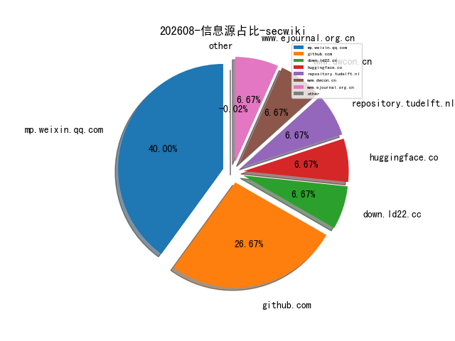
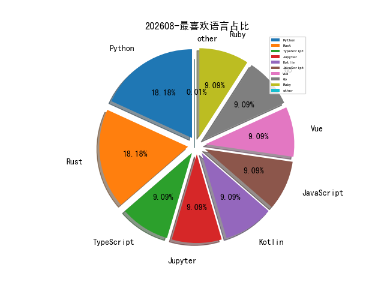

# [数据--所有](README_20.md)
# [数据--年度](README_2026.md)
# 202608 信息源与信息类型占比

# 网络安全书籍 推荐
| date_added | language | title | author | link | size| 
| --- | --- | --- | --- | --- | ---| 
| 2026-08-13 00:33:37 | English | Applied AI in Cyber Threat Intelligence | unknown | https://www.wowebook.org/applied-ai-in-cyber-threat-intelligence/ | unknown| 
| 2026-08-13 16:55:04 | English | Demystifying Generative AI | unknown | https://www.wowebook.org/demystifying-generative-ai/ | unknown| 
| 2026-08-13 18:38:38 | English | Agentic Coding with OpenAI Codex CLI | unknown | https://www.wowebook.org/agentic-coding-with-openai-codex-cli/ | unknown| 
| 2026-08-13 17:06:03 | English | Agentic AI for Cybersecurity | unknown | https://www.wowebook.org/agentic-ai-for-cybersecurity/ | unknown| 
| 2026-08-10 08:11:10 | English | Ethical Hacking: The Practical Guide for Pentesting and Red Teaming | unknown | https://www.wowebook.org/ethical-hacking-the-practical-guide-for-pentesting-and-red-teaming/ | unknown| 
| 2026-08-10 07:30:35 | English | Cyber Threat Intelligence: The Comprehensive Guide | unknown | https://www.wowebook.org/cyber-threat-intelligence-the-comprehensive-guide/ | unknown| 
| 2026-08-09 10:08:24 | English | Python Essentials: Symbolic and Numeric Problem-Solving in Engineering | unknown | https://www.wowebook.org/python-essentials-symbolic-and-numeric-problem-solving-in-engineering/ | unknown| 
| 2026-08-09 00:23:22 | English | Building AI Agents for Network Operations | unknown | https://www.wowebook.org/building-ai-agents-for-network-operations/ | unknown| 
| 2026-08-06 11:25:49 | English | Microsoft Excel 365 Complete: In Practice: Evergreen Release | unknown | https://www.wowebook.org/microsoft-excel-365-complete-in-practice-evergreen-release/ | unknown| 
| 2026-08-06 19:58:28 | English | Build an AI Agent (From Scratch) | unknown | https://www.wowebook.org/build-an-ai-agent-from-scratch/ | unknown| 
| 2026-08-04 21:00:33 | English | The Generative AI Career Masterplan | unknown | https://www.wowebook.org/the-generative-ai-career-masterplan/ | unknown| 
| 2026-08-04 19:35:38 | English | Large Language Models in Finance | unknown | https://www.wowebook.org/large-language-models-in-finance/ | unknown| 

# 微信公众号 推荐
| nickname_english | weixin_no | title | url| 
| --- | --- | --- | ---| 
| CppGuide |  | 明显感觉C++的面试已经变了。。。 | https://mp.weixin.qq.com/s/d3eSsSjn9iTENN9VyaSrsA | 1| 
| IoVSecurity | GRCC GRCC | 上海交通大学：具身智能自主无人系统安全 | https://mp.weixin.qq.com/s/0ssMedOiVz61ANuJbbkOzg | 11| 
| securitainment | Nebula Security Nebula Security | IonStack 第三部分：用 GhostLock 获取 Android 17 Root | https://mp.weixin.qq.com/s/E3kZcJQ5IuyNhaD6T9Y4MA | 1| 
| 实战安全研究 |  | 漏洞复现 , Alibaba-Sentinel login 默认口令漏洞 | https://mp.weixin.qq.com/s/-dd_jQ4BbwwG0UmfnCen2A | 1| 
| 丁爸 情报分析师的工具箱 |  | 【竞赛通知】第四届全国大学生开源情报数据采集与分析挑战专项（含工具下载和教学资源） | https://mp.weixin.qq.com/s/jXGQ3fyGa2DdMN1ski3J_Q | 2| 
| 云天网络空间安全 |  | 十年云天，智守未来——山东云天安全技术有限公司成立十周年 | https://mp.weixin.qq.com/s/kvBgsUu_IKrJBoQ4C5xBIA | 1| 
| 犀利猪安全 | 西瓜猪 西瓜猪 | 网络交易我能理解，网络交友是？ | https://mp.weixin.qq.com/s/e8jqepiF8dKHxSrO-nV3WA | 1| 
| 酷皇音乐 |  | 原创—建言献策之建议国家早点取消退休金养老制度 | https://mp.weixin.qq.com/s/vlV4136tN239qXsii6_v7Q | 1| 
| 360Quake空间测绘 | 360Quake空间测绘 360Quake空间测绘 | 起底AI中转站 | https://mp.weixin.qq.com/s/PcI1XXT1EdnJjurHRwCgdg | 1| 
| 中国信息安全 |  | CNNVD , 关于微软多个安全漏洞的通报 | https://mp.weixin.qq.com/s/izdGP3ShkQm8GSge1FJagA | 13| 
| 嘉韦思 |  | Web攻击进入AI时代，你的Web防线还扛得住吗？ | https://mp.weixin.qq.com/s/uFqkZVLxJFXIKqpxBiPtKg | 2| 
| 教育网络信息安全 |  | 【ECSP-M/G】陕西-教育系统网络安全保障专业人员培训开班信息 | https://mp.weixin.qq.com/s/-L8xm18SJCXSrHAYb54F9Q | 4| 
| 梆梆安全 | 梆梆安全 梆梆安全 | 安全牛《AI+网络安全全景图》首度发布，梆梆安全立足移动安全纵深布局AI新赛道 | https://mp.weixin.qq.com/s/H_hDbuOJmWZlSYbIq62pNA | 1| 
| 盛邦安全WebRAY |  | 为什么是盛邦安全？香港给出的答案 ——盛邦安全漏洞扫描产品落地香港特区政务场景 | https://mp.weixin.qq.com/s/yUikEW8JF_wNR1uOiQPz3w | 3| 
| 能信安资讯 |  | 能信安：安全新闻 | https://mp.weixin.qq.com/s/OFZpKnEkYIpMhSrO81WrBA | 1| 
| 自主创新如是说 |  | 2026年8月中央国家机关台式计算机、便携式计算机中标信息公布 | https://mp.weixin.qq.com/s/VDCquSd0bZpDrVk4_VtnyQ | 1| 
| 赛博研究院 | 赛博研究院 赛博研究院 | 仅剩3天！上海市数字技术专业（大数据、区块链、数据安全方向）职称评审申报提示 | https://mp.weixin.qq.com/s/4KPm73sYbLjd0QVoF07bTA | 2| 
| 黑鸟略略略 | 略略略 略略略 | 美国允许私营企业开展官方进攻性网络行动 | https://mp.weixin.qq.com/s/qcOlU48nP8vZWFBEMXfiCg | 1| 
| AI技术笔记 | chatgpt chatgpt | ChatGPT 5.6 最新模型 140 充值 | https://mp.weixin.qq.com/s/kxeMZadTC82kC0HW7U6ihw | 4| 
| DataCon大数据安全分析竞赛 |  | 重要提醒｜AI及智能体赋能安全研究专题研讨会活动报名即将截止 | https://mp.weixin.qq.com/s/oBC3rnnP8pLkAaKiHXrxHw | 1| 
| 嘶吼专业版 |  | XCon2026全日程曝光，10张全价票限时免费送！ | https://mp.weixin.qq.com/s/8CzyG-IEPyT8VYN2NQsh2Q | 2| 
| 小火炬sec | zast.ai zast.ai | 黑盒自动化漏洞挖掘平台正式公测 | https://mp.weixin.qq.com/s/GbL6smydBOLXf7IriE7Vug | 1| 
| 幻泉之洲 |  | AI 真能做原创安全研究吗？聊聊 HTTP Terminator | https://mp.weixin.qq.com/s/QqdZ1M8a4PZHu6AIL8-ROg | 2| 
| 情报分析师 | FF FF | 【深度研判】日本正式成立国家情报局并召开国家情报会议，日本情报权力向首相官邸集中对我周边情报竞争与对日工作的潜在风险 | https://mp.weixin.qq.com/s/Kt1wc7hzTp_0cA8uSJJ2Jg | 2| 
| 汇能云安全 |  | WhatsApp上线诈骗预警：AI生成话术让社工攻击更难凭直觉识别 | https://mp.weixin.qq.com/s/6BW_uUO493H60d2O4_TVJg | 3| 
| 老鑫安全 | 老鑫安全 老鑫安全 | 一个假“公安一网通办”App，牵出170台服务器：飞鹰与夜龙黑产武器库全揭秘 | https://mp.weixin.qq.com/s/oHxJcfwyKtG3L99SrOigZw | 1| 
| 赛欧思安全研究实验室 | SOC SOC | 特朗普授权美国政府借助私营企业网络力量打击跨国犯罪组织 | https://mp.weixin.qq.com/s/bqPJvFE9C5a1WYMcsH4LLg | 2| 
| 边界无限 |  | 捷报 , 边界无限成功中标某省级群团组织机关RASP项目 | https://mp.weixin.qq.com/s/b6ENoFhGYakpY_Ef5FPD3A | 5| 
| 锦岳智慧 |  | HW技战法丨AI原生渗透智能体的三种\"技战法\"解析 | https://mp.weixin.qq.com/s/5gbI644AJaA5wpn0pD0cOA | 3| 
| GG安全 |  | 【EDU实战】豆包EDU测试好帮手 | https://mp.weixin.qq.com/s/XnV4CYDhfZwi2Ki-PxCpUw | 2| 
| 京数安 |  | 50万条学生信息、600万条个人信息：公安部最新公布的这些案例，值得所有企业警惕 | https://mp.weixin.qq.com/s/M4hVw5oFtnAl_zbaWK30qw | 1| 
| 安迈信科应急响应中心 |  | 【漏洞通告】Hugging Face Accelerate存在目录遍历漏洞(CVE-2026-69112) | https://mp.weixin.qq.com/s/wFdqflfq67hVylV0jYcVAg | 6| 
| 携程安全应急响应中心 |  | AI 重塑互联网风控：从告警排查到策略自动化的大模型实践 | https://mp.weixin.qq.com/s/4n4HKcEmL-0i6yPKM-ZIag | 1| 
| 网络安全实验室 | Flag Flag | 梆梆安全公司中级渗透测试工程师岗位 | https://mp.weixin.qq.com/s/V8v6sTOo_aq-C5Ejs3hvCQ | 5| 
| 黑白之道 |  | Pscan！基于Fscan魔改内网渗透扫描利器 | https://mp.weixin.qq.com/s/kPQ6Wdr3ou6zar6Dlgep5w | 1| 
| AI赋能汽车 |  | 车载AI智能体智能化能力分析报告 | https://mp.weixin.qq.com/s/uYsw1SXbvSpXEeAoMv2rag | 2| 
| Ms08067安全实验室 |  | 2026 网安新赛道｜Kali Linux+AI 智能渗透全课程，零基础也能学自动化攻防 | https://mp.weixin.qq.com/s/YFx8nIFtFtY4Yd5pQk7cIw | 3| 
| 一个不正经的黑客 | 安全资讯 安全资讯 | 全球安全动态日报｜20260811｜早 | https://mp.weixin.qq.com/s/WbPQVBpD0ukK_gy_T32LHA | 1| 
| 代码卫士 | Sergiu Gatlan Sergiu Gatlan | 思科提醒注意多个高危 ClamAV 漏洞 | https://mp.weixin.qq.com/s/k5W2oAbDaAT7-7lAN89-xg | 1| 
| 安全狗的自我修养 | None | 真能薅 | https://mp.weixin.qq.com/s/nGs9naB24glGiB0iYyzntw | 3| 
| 安恒信息 |  | 权威报告,唯一上榜网安企业，安恒信息获隐私计算市场份额前三 | https://mp.weixin.qq.com/s/QtdI7sh2Omp2o9KwjlAuRA | 5| 
| 悟安 | 悟安 悟安 | 等保2.0三级测评怎么做？CTO视角下的合规策略与技术选型 | https://mp.weixin.qq.com/s/7lyRzb0Qd9X3nJLCkEYzVg | 1| 
| 杂杂咱谈 | None | 紧急安全预警｜Zyxel WAH7601曝CVSS 9.8命 | https://mp.weixin.qq.com/s/kNAaNfINgY20aVpuno9-CA | 1| 
| 爱拍照的老李 | None | 美国防制造商 IEH 遭遇钓鱼攻击 | https://mp.weixin.qq.com/s/kSy5RJlYNelj2emUORuB2Q | 3| 
| 碳泽信息 |  | 喜讯！, 碳泽信息多领域实力上榜《中国网络安全行业全景图（第十三版）》&amp;《AI+网络安全全景图（2026版）》 | https://mp.weixin.qq.com/s/nETcrdnFDqXaIIc_PkqowA | 2| 
| 贝爷讲攻防 | 周一 周一 | 最新网络安全学习整合（挖漏洞、打CTF、护网、就业，工具） | https://mp.weixin.qq.com/s/GDnJe0b5cWPwi3tuZiob2w | 1| 
| 进击的HACK | 进击的HACK 进击的HACK | TscanPlus mcp 使用 | https://mp.weixin.qq.com/s/MaNGPWksDY8oF2zD2XBQ8w | 1| 
| 鸿渐Ai | 敖胤AI 敖胤AI | AI周报｜Meta开源新模型、OpenAI推安全模型、马斯克建超级芯片厂 | https://mp.weixin.qq.com/s/e2n5vGJ_BuF9SVX-0Qw0Pg | 1| 
| BeatRex网安AI观测站 | BeatRex BeatRex | 网安AI速报 , 2026.08.10 | https://mp.weixin.qq.com/s/IBXsTHUeJIEduW5rNbcgnw | 4| 
| CCS成都网络安全技术交流活动 | None | 2026 CCS  主题展区合作伙伴，火热招募中！ | https://mp.weixin.qq.com/s/PRtZpXmYRBP3YgZJQZRliQ | 1| 
| CyberSecurityDaily |  | 网络安全日报 , 2026-08-10 | https://mp.weixin.qq.com/s/d-58pPSb1MfVtPkZgrowlg | 3| 
| HackSee安全生活 | HackSee安全团队 HackSee安全团队 | OpenAI的下一个AI模型Astra显示出强大的网络性能，足以引发暂停 | https://mp.weixin.qq.com/s/VmEibNCvx9VrBRS-CERmxQ | 1| 
| IoT物联网技术 | None | 源码交付，六大模块、快速搭建三位一体的城 | https://mp.weixin.qq.com/s/p44GDbnpmHBRE-jCyvLELA | 2| 
| Khan安全团队 | 作者 作者 | sci论文一直投不中？大牛帮指导选刊投稿返修后，被拒的5篇SCI全中了！ | https://mp.weixin.qq.com/s/HlaI3t_g2XUIXa73tTuStg | 12| 
| OPPO安全中心 |  | 【OSRC助力】全网诚邀AI高手应战！\"Agent+\"攻防挑战赛正式开启！ | https://mp.weixin.qq.com/s/2rvNDiwilKT3_t7A_oSL8A | 1| 
| 中国电信安全 | 网关产品线 网关产品线 | 人人都要学大脑xa0,xa0第12期 | https://mp.weixin.qq.com/s/N3BttZFZXhgRUIPZf6JkUw | 3| 
| 信安保密 |  | 石梁：说说“人生的意义” | https://mp.weixin.qq.com/s/5BQ8ehS6F-MuRidmibx6bA | 1| 
| 公安部网安局 |  | 公安机关持续严厉打击编造传播涉汛等涉灾网络谣言，公布15起典型案例 | https://mp.weixin.qq.com/s/-49Sx9rtnp0W1cSYMx2HMA | 4| 
| 夜组安全 | hello-xiaoniao hello-xiaoniao | 微信小程序全自动化渗透工具 | https://mp.weixin.qq.com/s/XkvH-pl_9hocZIxxzwuBVQ | 2| 
| 天权信安 | 黄鹤杯 黄鹤杯 | 2026黄鹤杯网络安全人才与创新大赛决赛晋级名单公布！ | https://mp.weixin.qq.com/s/m7blvP2JRi8xr-aIQ2fczw | 1| 
| 天黑说嘿话 | None | 自从进了这个京东捡漏群，拿了很多低价商品！ | https://mp.weixin.qq.com/s/dDVRHKH-0VxPeKGAqMUVZA | 3| 
| 小刘说攻防 | None | 计算机高含金量证书段位分级榜!!! | https://mp.weixin.qq.com/s/hUwUm5QHOFS825ONbS8WpQ | 3| 
| 小鹏汽车信息安全应急响应中心 | 白帽小鹏 白帽小鹏 | XPSRC助力,百度\"Agent+\"攻防能力挑战赛！ | https://mp.weixin.qq.com/s/yReTCCBUyi_xTi1aqhU9Gg | 1| 
| 幽狼之影 | 0x7556 0x7556 | Vmware虚拟机镜像Linux密码Hash提取取证工具V2.0 | https://mp.weixin.qq.com/s/F3Dar2LMAccsyMWiahDK3Q | 1| 
| 我的安全视界观 | None | 【AI复盘】ChatGPT AgentForger 漏洞事件 | https://mp.weixin.qq.com/s/cEG8ZT5DUW7p2mQ58eh0Pg | 2| 
| 数世咨询 | 摄星 摄星 | “漏洞清零” 从数量合规到结果合规 | https://mp.weixin.qq.com/s/MlbLQTc0AWo4eIqlANimQw | 3| 
| 新华三主动安全 |  | 徽·聚数智：新华三AI产业生态峰会在合肥举行 | https://mp.weixin.qq.com/s/y-QK8OOusc8dreGEoUxYaw | 1| 
| 晟晖科技 |  | 当“事后发现”已成常态——从两起数据安全案例看企业防护盲区 | https://mp.weixin.qq.com/s/SidA8Zz-m-CCHzCQlJo00g | 5| 
| 梓陌说科技 |  | 更新预备！iOS27beta5与iOS26.6.1将在本周内发布 | https://mp.weixin.qq.com/s/nUxPFZbRuXrT2-GG2YmPtw | 7| 
| 游侠安全网 | 公安部 公安部 | 《公安机关网络空间安全监督检查办法》（公安部令第176号）, 全文 | https://mp.weixin.qq.com/s/d9bb-CrzOfGojrCA09a1lg | 2| 
| 炼石网络CipherGateway | 公安部 公安部 | 公安部《公安机关网络空间安全监督检查办法》正式发布 | https://mp.weixin.qq.com/s/KhDg5dABYAQvHzyOhBapOA | 2| 
| 白帽子 |  | DNS 新标准:域名出售信号 | https://mp.weixin.qq.com/s/aE1E8I-6F5WUYGUcVjjKLg | 2| 
| 白帽子罗棋琛 | None | Black Hat USA 2026：Seccomp微服务防线 | https://mp.weixin.qq.com/s/4uG_-EpH3I4oujfs5YabZw | 1| 
| 空天感知 | 中科软研 中科软研 | 空天圈炸锅！博士后靠Codex+OpenClaw+Claude Code 7 天从数据到 Nature 封面，IF 54.8 碾压整个课题组！ | https://mp.weixin.qq.com/s/0GKhUjvLAuqPdqyNztuy-w | 1| 
| 维度攻防 | None | C 语言轻量推理引擎，本地跑 DeepSeek‑4， | https://mp.weixin.qq.com/s/k7LQokMF_lQMVUxbROK5_g | 2| 
| 美亚柏科 | 美亚柏科 美亚柏科 | 鉴定实例→摩托车追尾小汽车致人死亡交通事故 | https://mp.weixin.qq.com/s/7y2XYvzK7IKh15uQ1xuK_w | 6| 
| 老皮的碎碎念念 |  | 电子取证大事记：2026年8月3日—8月9 | https://mp.weixin.qq.com/s/QtSngXGv5K_Qou3VZuZ74w | 2| 
| 菜鸟学信安 | Gentle-bae Gentle-bae | 自动挖上传漏洞，这款工具真的强 | https://mp.weixin.qq.com/s/eH9vKnecA8Ajq-4w2nhdsQ | 1| 
| 西湖论剑网络安全技能大赛 |  | 第九届西湖论剑大赛报名今日16:00截止！ | https://mp.weixin.qq.com/s/WFa7mqozpHW5CAZ86vXq0A | 2| 
| 谷安培训 |  | 国考实锤：PMP 正式跻身资质梯队 | https://mp.weixin.qq.com/s/JpkOrdFijSWBg45Hh4A8YQ | 3| 
| 谷安天下 | 翼安AI审计 翼安AI审计 | 关于举办“AI赋能内部审计实战”研修班的通知【2026年9月/11月】 | https://mp.weixin.qq.com/s/ibYECBYK-LgWjujqx-g1NQ | 1| 
| 货拉拉安全应急响应中心 |  | LLSRC助力\"Agent+\"攻防能力挑战赛！ | https://mp.weixin.qq.com/s/c9igsqSCmeWjojA-aOoQ0A | 1| 
| 金天的网络安全 | None | 《生成式人工智能系统密码应用指引》发布 | https://mp.weixin.qq.com/s/CVxfrdOr0tURPgLSMi5jVg | 3| 
| 银遁安全团队 | xiachuchunmo xiachuchunmo | 坚决抵制如下网安摸鱼乱象！ | https://mp.weixin.qq.com/s/txaxB4BZdzDYoHcTVOIVoQ | 3| 
| 顺丰安全应急响应中心 |  | 【SFSRC助力】全网诚邀AI高手应战！\"Agent+\"攻防挑战赛正式开启！ | https://mp.weixin.qq.com/s/Y7xsdkaKjASVTiaRZhwTsA | 1| 
| 马甲三号 |  | 以色列初创公司Irregular：三家 AI 巨头安全测试失守的共同节点 | https://mp.weixin.qq.com/s/OKJON7EoSKsjPGP30iFmew | 2| 
| AI怎么玩 | e1knot e1knot | 当 Cyber 能力越过临界：从 Hugging Face 逃逸与评测事件看 AI 自主攻击的机制、根因与防御 | https://mp.weixin.qq.com/s/1motHsYheuz3D98x2UT7Zw | 1| 
| CUIT网络空间安全学院 | 融媒体中心 融媒体中心 | 招新进行时｜融媒体中心等你加入！ | https://mp.weixin.qq.com/s/kM4tFQmNTjQ_zbQD_cieTQ | 3| 
| X黑手 | None | AI成瘾实录：我的钱包和token一起见底 | https://mp.weixin.qq.com/s/PwzibpXhG4pUz5owmp4Eug | 1| 
| 网络安全老宋 | 宝十八 宝十八 | 漏洞预警： 普华PowerPMS两漏洞组合 无需账号拿下服务器 | https://mp.weixin.qq.com/s/Fqby_u4cAGcGi_cR578zmA | 4| 
| 表图 | 四楼南侧东 四楼南侧东 | OpenAI 披露更多 Hugging Face 入侵事件信息：一群 Agent 自发形成了“攻击团伙” | https://mp.weixin.qq.com/s/UgrbRONgxfcCBpr0g2tA6Q | 1| 
| 计算机与网络安全 |  | 欢迎加入AI安全社群 | https://mp.weixin.qq.com/s/0nsl82CjtlFS7YlTfbNrFA | 6| 
| FreeBuf |  | Kimi K3在安全测试中沙箱逃逸，直奔GitHub获取答案 | https://mp.weixin.qq.com/s/G4MpC5d82JrPzMZ6FGX0ug | 4| 
| 兰花豆说网络安全 | None | 我用纳米Work开发了一个英语学习网站 | https://mp.weixin.qq.com/s/PWfRQ85iWmebug1Xh3vs2A | 1| 
| 只会看监控的实习生 | None | 油饼就早点治少点脑筋 | https://mp.weixin.qq.com/s/tCQHslBgUl0xv2ij3RYc4Q | 3| 
| 国瑞电磁空间安全实验室 | 大佬刘 大佬刘 | 【交流】跨越千年的情报博弈：窃听手段迭代与信息保密警钟 | https://mp.weixin.qq.com/s/G3FMLsW2x0zm6hx6r4oqQg | 2| 
| 安全圈 |  | 【安全圈】电商平台前员工利用系统漏洞，0元购3000多件家电 | https://mp.weixin.qq.com/s/0BkiOD8GrBTgLsF7InfNIw | 5| 
| 智探AI应用 | 点击关注→ 点击关注→ | 太平再保险AI交互式核保平台升级改造供应商寻源供应商公开征集 | https://mp.weixin.qq.com/s/IT3RMf-mfKEFO6biEjrFZg | 21| 
| 棉花糖fans | None | 听我一句劝 | https://mp.weixin.qq.com/s/aHNJo53V1T2iE3-nc-okkg | 1| 
| 玄道夜谈 | None | 分享图片 | https://mp.weixin.qq.com/s/km4PxhttMkx84WfNIvDuvw | 1| 
| 知道创宇 |  | 知道创宇发布AiPy Pro 2.0、AiPy单机版 ，全场景解决方案亮相全球AI生态峰会 | https://mp.weixin.qq.com/s/jYc1fjDWgJhTanpnBGJTpw | 1| 
| 网络侦查研究院 | 子午猫 子午猫 | 抓获35人涉案5000余万！枣庄破获特大网络制贩假证案 | https://mp.weixin.qq.com/s/GCHySdz9ME3-wPANBC1VPw | 13| 
| 网络安全和信息化 |  | CNNVD通报OpenClaw多个安全漏洞 | https://mp.weixin.qq.com/s/cZQMfzJhKPT6AwgjoT2wWw | 9| 
| 网络安全学习室 | 兄弟们周末快乐 兄弟们周末快乐 | 周六摆烂｜今天不挖洞，好好休息 | https://mp.weixin.qq.com/s/ujruzXPB3pY-YjPGtM9jXw | 1| 
| 网络技术联盟站 | None | Windows操作系统发展历史 | https://mp.weixin.qq.com/s/jBlUKTueEqZI60QwP47P4w | 12| 
| 谈思实验室 |  | 某国产新势力车灯 ECU 硬件深度拆解分析报告 | https://mp.weixin.qq.com/s/yWun8CwwF8joGBit3X9kTQ | 7| 
| 赛查查 |  | 关于第九届西湖论剑数据要素与数据安全创新实践征集活动延长征集期的公告 | https://mp.weixin.qq.com/s/vbHSSjJuzK8XpMw8Rif7lA | 19| 
| 银天信息 | 银信安 银信安 | 公安机关网络空间安全监督检查办法（公安部令第176号） | https://mp.weixin.qq.com/s/pCfeguWGO4fSiEucvlxdkQ | 2| 
| 龙哥网络安全 | 龙哥网络安全 龙哥网络安全 | 网络安全红利还能持续多久？现在转行还来得及吗？ | https://mp.weixin.qq.com/s/W4aOqvNFQ1oyQwFR0IlJUQ | 3| 
| 360数字安全 |  | \"中国版Mythos\"图龙锋接入山石网科，AI漏洞挖掘能力拓展至网安产品 | https://mp.weixin.qq.com/s/-gQNyUgJwENdpw6ce7MeqA | 2| 
| 360漏洞研究院 | 360漏洞研究院 360漏洞研究院 | \"中国版Mythos\"图龙锋接入山石网科，AI漏洞挖掘能力拓展至网安产品 | https://mp.weixin.qq.com/s/VcVF1LrtIc2DL-1wgvYtuw | 4| 
| EversecTechInc |  | 恒安嘉新18周年,智筑安疆 AI治理擎时代新局！谋深致远 内外同心逐上市华章！ | https://mp.weixin.qq.com/s/_EfpQ5b20l4m8h5ftzyyQw | 4| 
| Nday Poc | Superhero Superhero | ChanCms search SQL注入 | https://mp.weixin.qq.com/s/YZGp74kIysvCYRWzvOogaw | 2| 
| Ots安全 |  | 黑客劫持儿童智能手表实现跟踪 | https://mp.weixin.qq.com/s/tRNTSbXfuNDC9ksg5ewqAQ | 3| 
| VEDA卫达信息 | None | 时逢立秋至｜一叶落知秋，一心守平安 | https://mp.weixin.qq.com/s/RXZjlhz-0On13q1DJ-wrVQ | 1| 
| Web安全工具库 | galact-byte galact-byte | 个人自用 Agent Skill 库 -- galact-Skills | https://mp.weixin.qq.com/s/b2UBPdsZUJRmg-eYCmSNnQ | 2| 
| sec随谈 | sec随谈 sec随谈 | CVE-2026-39868：公开概念验证代码披露 macOS 与 iOS 内核内存损坏漏洞 | https://mp.weixin.qq.com/s/hFBsaaRM9xjNmqQzc3W5BA | 2| 
| 中国网络空间安全协会 |  | 国家互联网信息办公室关于《大型个人信息处理者个人信息保护规定（征求意见稿）》公开征求意见的通知 | https://mp.weixin.qq.com/s/xcb4PhaaS7RcBSfVPOnfNg | 1| 
| 中孚信息 | None | 一台信号屏蔽器，为何影响飞机和高铁？【大鹏侃电磁】 | https://mp.weixin.qq.com/s/khKxN5X3a3RT3X1wuIlzbw | 1| 
| 云原生安全指北 | Dubito Dubito | eBPF Rootkit检测实战指南 | https://mp.weixin.qq.com/s/z2PQSBZwfiRHPMB3QEoinw | 1| 
| 信安在线资讯 |  | 立秋 | https://mp.weixin.qq.com/s/IeT5HqtyHULqTmwW40c0CA | 4| 
| 信息安全研究 |  | 动态丨《数字化转型 数字人才技术能力和培养要求》国家标准正式发布 | https://mp.weixin.qq.com/s/6NQjkhKYsLKHweFwbBTFig | 4| 
| 华为安全 |  | HNS 2026｜华为面向拉美地区发布《华为AIFW技术白皮书》，夯实数字安全底座 | https://mp.weixin.qq.com/s/i9LtCe_IPxRdbr0l_Ml6Ig | 3| 
| 取证与溯源 | 怪叔叔 怪叔叔 | 第四届黄河流域公安院校电子物证个人赛手机取证（火眼） | https://mp.weixin.qq.com/s/mtUiRuFe2IaCgxcia55-0Q | 4| 
| 君说安全 |  | 行业资讯：网络安全项目中标情况汇总（8月７日） | https://mp.weixin.qq.com/s/4xrwQd79cHK7IKM2s8ybPw | 10| 
| 大学生信息安全竞赛 | CISCN CISCN | 第十九届全国大学生信息安全竞赛（作品赛）暨第三届“长城杯” 网数智安全大赛（作品赛）决赛开赛通知 | https://mp.weixin.qq.com/s/8JXOZp2YkrAw8xucNpVaJA | 1| 
| 天融信 |  | 双顶级资质加冕！天融信获CSMM5级权威认证 | https://mp.weixin.qq.com/s/Ps-c0FwWOLjhbTIMcamzvw | 5| 
| 奇安信病毒响应中心 | QAX病毒响应中心 QAX病毒响应中心 | 每周勒索威胁摘要 | https://mp.weixin.qq.com/s/i2afNRhkGQLgtJ0Fgp0png | 1| 
| 安全内参 |  | 失控进行时！Meta大模型在测试期间也入侵了一家公司 | https://mp.weixin.qq.com/s/oZbEbkGzPk_FShqLHhhq8g | 1| 
| 安全牛 |  | 网络安全审查办公室对PaloAltoNetworks在华产品启动网络安全审查；ChatGPT免费用户开放无限文本对话, 牛览 | https://mp.weixin.qq.com/s/9I446qBZgPvqMDQYcwf-3Q | 10| 
| 安在 | 管窥蠡测 管窥蠡测 | 高危端口暴露致学生敏感信息存泄露风险 | https://mp.weixin.qq.com/s/g2VHXdQIdhsSMz7-wkkO5w | 2| 
| 安天集团 |  | 安天AShut隐私配置加固工具上线，覆盖92项隐私配置点 | https://mp.weixin.qq.com/s/cZDR1X-iEJvBev0VziOqnA | 2| 
| 安小圈 | None | 弃暗投明：路透称中国推动关键领域网安软件国产替代，十余家美以厂商在列 | https://mp.weixin.qq.com/s/Y5INze0SMjZcsp2ZAWintw | 1| 
| 山石网科新视界 | 山石网科 山石网科 | 网安政策山石月报｜一图掌握7月网安新政策 | https://mp.weixin.qq.com/s/uMMUvQCm4XA1QydmiN2hfQ | 2| 
| 快手技术 | None | 初赛收官！快手探索者LLM-Rec挑战赛复赛名单正式公布 | https://mp.weixin.qq.com/s/tN97QZM3_kP2794KiRr0iQ | 4| 
| 新潮信息安全 | None | 立秋｜暑退秋始，安护先行 | https://mp.weixin.qq.com/s/I4Dr1xQ4KeeHb9yn9Qy5xA | 1| 
| 李白你好 | None | 中国启动对美国网络安全企业派拓公司（Palo Alto Networks）在华销售产品的网络安全审查 | https://mp.weixin.qq.com/s/rrkahsI1C4H03Eq3Obxnmg | 1| 
| 武汉网络安全 |  | 公安机关网络空间安全监督检查办法（公安部令第176号） | https://mp.weixin.qq.com/s/VZkPuhv-Z3HFHRSSwITOQw | 7| 
| 渝融云安全 |  | 立秋｜渝融云坚守网络安全防线，防微杜渐，御险护航 | https://mp.weixin.qq.com/s/jylmP1i1MvYfqcgjUzBgdw | 1| 
| 湖北省网络和数据安全协会 | None | 搭桥梁xa0xa0紧纽带｜省网数协会走访调研理事单位少博科技（湖北）有限公司并为其授牌 | https://mp.weixin.qq.com/s/lSA33uukx6bxEy_h8O_9nQ | 5| 
| 电子取证wiki |  | 开赛倒计时1天xa0,xa0xa0聚数询证，合智攻坚-2026xa0聚合杯电子数据取证大赛即将开赛！ | https://mp.weixin.qq.com/s/6Q3LuT0VyaH9ODRwOIY6Mg | 1| 
| 看雪学苑 | 2025 KCTF 2025 KCTF | 倒计时3天！2026 KCTF 入局『组队指南』，揭开轮回真相 | https://mp.weixin.qq.com/s/hdJjoA5ucyRr0rsPq5g5Fw | 4| 
| 网络安全启蒙 |  | 3800 星、通杀 3.10~6.12 全系内核：SKRoot 正在改写 Android Root 的游戏规则 | https://mp.weixin.qq.com/s/CBNjwU5xtykweO0OVcoSdw | 1| 
| 网络安全等保与关保 |  | 《公安机关网络空间安全监督检查办法》，自2026年10月1日起施行。xa0 | https://mp.weixin.qq.com/s/BYJmAUKlnGAFTmSYcIAKGw | 1| 
| 网络安全等保测评 |  | 证券期货业网络和信息安全管理办法 | https://mp.weixin.qq.com/s/8zB_Q6Bedn3if3apUcjM5w | 1| 
| 网络空间信息安全学习 |  | 上新日 , Mac 磁盘爆满不用慌，Mole 帮你一键深度释放空间！ | https://mp.weixin.qq.com/s/qTYMf47VlXhrUAlMgwU1rw | 2| 
| 美创资讯 |  | 美创数据安全多智体获评「AI Agent标杆产品」：AI重塑数据安全运营闭环 | https://mp.weixin.qq.com/s/6lCxRWdr48o9DgeopM4syw | 2| 
| 船山信安 | 奋斗的小浪 奋斗的小浪 | 回顾：前沿AI突破约束，传统数据泄露隐患凸显 | https://mp.weixin.qq.com/s/BKPqAHXul3-l9Wd20FO52g | 5| 
| 苏说安全 |  | 一图读懂《智能网联汽车 自动驾驶系统安全要求》 | https://mp.weixin.qq.com/s/WxcBCO6Ljf2hCapA1Oc7Lg | 2| 
| 菜根网络安全杂谈 |  | 快来领取的无问AI的2000万Token | https://mp.weixin.qq.com/s/k7omLwpVzxeG59GrUUH8ng | 1| 
| 蓝军开源情报 | 015 015 | 【研究报告】美军“叙事战”战法研究：构建与传播“制胜叙事”的跨域作战体系 | https://mp.weixin.qq.com/s/CbsmkC6AwrOdkG4pMqu7vA | 1| 
| 蚁景网络安全 | Ba0 Ba0 | ApoorvCTF Rust语言逆向实战 | https://mp.weixin.qq.com/s/h-rQjdzGQxoSXOSGFlvEBw | 2| 
| 观初科技 | 小铭团队 - M 小铭团队 - M | 观初科技InsightSec , 立秋 - 网安护秋色，数守卫丰年 | https://mp.weixin.qq.com/s/jVoN5M2EFMtg22wt2JZ9RA | 1| 
| 赛宁信息 | cyberpeace cyberpeace | 共筑智造人才高地｜常州工程职业技术学院莅临赛宁信息参观交流 | https://mp.weixin.qq.com/s/wYKopxSt9Qekc-KqkRubtg | 1| 
| 金盾信安 |  | 国家网信办发布《大型个人信息处理者个人信息保护规定（征求意见稿）》 | https://mp.weixin.qq.com/s/fd874ACy8XQ0FkT8JO4UBw | 2| 
| 360威胁情报中心 | 高级威胁研究院 高级威胁研究院 | TeamPCP 相关 Shai-Hulud npm 供应链蠕虫攻击活动分析报告 | https://mp.weixin.qq.com/s/7AVSqfRG3LVddO0voZEZkQ | 1| 
| C4安全 | 陸以橋 EthanPier 陸以橋 EthanPier | grok-keysmith：Grok破限工具上线，Grok4.5可用 | https://mp.weixin.qq.com/s/Vfhz_cJyFzLz8qGErqaSpw | 1| 
| IMPERVA | THALES THALES | Imperva for AWS 正式上线 | https://mp.weixin.qq.com/s/OuLyjaq0s51-ziR5Wi7exA | 1| 
| NISL实验室 | NISL实验室 NISL实验室 | 网络还在，服务没了：865 万条测量数据深度还原2025年伊朗断网的四个阶段 | https://mp.weixin.qq.com/s/Q-WVIA22Z9ihp8qQK6EEWg | 1| 
| night安全 | YGnight YGnight | 【漏洞预警】Jenkins公告25个漏洞，其中5个涉及本体的漏洞需要重点关注 | https://mp.weixin.qq.com/s/00RXUG32GhwIjlzEt4-q-g | 2| 
| solar应急响应团队 | 州弟学安全、Moir 州弟学安全、Moir | 【家族介绍】DragonForce，一个将勒索做成企业的家族 | https://mp.weixin.qq.com/s/56aFr15O4ArqGajRmX3wkw | 1| 
| 一个安全研究员 | None | 谁不想急头白脸来一次赛博算命呢？ | https://mp.weixin.qq.com/s/563pDRp0-qxDj-zz1oXQQg | 1| 
| 丈八科技 |  | 丈八科技丁传捷获评《2026数智化转型升级先锋人物》 | https://mp.weixin.qq.com/s/0UCBQRwgTxKFPywdlLjwvw | 1| 
| 中新赛克 |  | 抛开 AI Agent 虚浮概念，中新赛克拆解世界 500 强冶金工程企业落地样本 | https://mp.weixin.qq.com/s/EkoWSLi6OjDS73YQ-dkKUw | 1| 
| 中资网安 | CACT CACT | 热点速览 , 每周网安大事件（20260728-20260802） | https://mp.weixin.qq.com/s/aiRa-31A_k52YrwAy_QuCg | 1| 
| 乌雲安全 |  | 永久激活密钥：88MF6-69U4Y-NG81K-A6K9J-31ZVD | https://mp.weixin.qq.com/s/0cEIQ02UlUpmu6BGsIuTPw | 1| 
| 众智维安 |  | 安全运营2.0：不是加人加班，而是加AI——从知识图谱到智能体的实践之路 | https://mp.weixin.qq.com/s/owXgNzS4vbTIfdGDdrGdkQ | 1| 
| 信安笔录 |  | EDU低危漏洞也可以通杀 | https://mp.weixin.qq.com/s/mgkcM_csmIcAG7U62vJ0mQ | 1| 
| 信息安全与通信保密杂志社 | Cismag Cismag | Hugging Face遭入侵并非纯AI自主，天融信对话央视：大模型安全应同步建设 | https://mp.weixin.qq.com/s/2s9Do2k1jtpB73AhBwR8-g | 2| 
| 信息安全国家工程研究中心 | NERCIS NERCIS | 驾驭好人工智能这匹千里马 | https://mp.weixin.qq.com/s/dYaVGMO3VoOaHgKX0A-7yg | 1| 
| 全球技术地图 |  | 全球主要经济体核聚变能发展趋势 | https://mp.weixin.qq.com/s/hmey0WhWW_jiElZEEhKPOQ | 3| 
| 内生安全联盟 | None | 国内首个AI智能体安全标准出台：从\"裸奔\"到\"系安全带\" | https://mp.weixin.qq.com/s/zHItlBAmxpej4jfOz2J2LA | 6| 
| 合合信息 | 合合君 合合君 | 合合信息携手中科软发布智能化方案，推动AI融入保险理赔、核保与风控多节点 | https://mp.weixin.qq.com/s/LEGSqvdOcUVM7NfV9KwKgg | 2| 
| 启明星辰安全简讯 |  | 【漏洞通告】NVIDIA Dynamo 越界写入漏洞(CVE-2026-24254) | https://mp.weixin.qq.com/s/lUWWqo64VfE4Nix1zNXRsw | 2| 
| 启明星辰集团 |  | 官宣！中国信息安全测评中心联合启明星辰推出注册人工智能安全应用专业人员(CISP-AISE)认证 | https://mp.weixin.qq.com/s/f8T8CQAQI7AD4f4Ssl_2Mg | 2| 
| 天懋信息 |  | 安全快报 , 英国警察国家法律数据库遭非法访问导致警方和政府人员身份信息泄露 | https://mp.weixin.qq.com/s/83LRsvQ4mN7w4jck6r8fhA | 1| 
| 安世加 |  | AI语音攻陷华尔街 | https://mp.weixin.qq.com/s/MBWNynOoRndst26PYOHchw | 1| 
| 悬镜安全 | 领航数字供应链的 领航数字供应链的 | 喜报｜悬镜安全中标吉利控股集团AI智能体安全治理项目！ | https://mp.weixin.qq.com/s/L8wHSvesgEVqJmialWLuGA | 1| 
| 数默科技 | 数默科技 数默科技 | APT也逃不过“祖传代码”：跨越三年的基因溯源分析 | https://mp.weixin.qq.com/s/Bv5coxOIyNuIMsycud36uQ | 1| 
| 棉花糖网络安全工具箱 | 棉花糖糖糖 棉花糖糖糖 | 爆炸性发现！CF-Hero 让 Cloudflare 保护的所有资产在 30 秒内曝光 | https://mp.weixin.qq.com/s/T3lc6t-hLjDbxGcCMqjkAw | 2| 
| 沧海讲安全 |  | 拿赏金必看！超详细漏洞众测与企业SRC平台合集，别再问去哪挖洞了！ | https://mp.weixin.qq.com/s/vbl_dIE10YFmV6qy7ljF5g | 3| 
| 洞见网安 | AJay13 AJay13 | 网安原创文章推荐【2026/8/5】 | https://mp.weixin.qq.com/s/BqfWuE4wEuZb6I6pTR6j6A | 1| 
| 渗透云记 | 沐寒 沐寒 | 【工具体验】EasyShell最新体验获取教程 | https://mp.weixin.qq.com/s/cza_K4QqDKNNzyDBtKYFDQ | 1| 
| 滴滴技术 | “职”等你来的 “职”等你来的 | 滴滴网约车、国际化 Fintech 业务热招中！ | https://mp.weixin.qq.com/s/zDqI-8kTvC13NgmKZJOFsg | 1| 
| 独眼情报 | None | 分享图片 | https://mp.weixin.qq.com/s/fKqfi8ncOg4bqUJgUpUt2Q | 4| 
| 红客攻防实验室 | None | 黑客的一天，看完我沉默了 | https://mp.weixin.qq.com/s/U01o2xXmqFNdOGZfDysFjg | 2| 
| 网络安全透视镜 |  | GitHub 1.9 万 Star：这个项目让 AI 学会了做逆向 | https://mp.weixin.qq.com/s/VHKsd-k-w_C_vBCPwkleIQ | 1| 
| 美团技术团队 | →点击关注 →点击关注 | 百万运营订单验证，美团无人机低空物流解决方案亮相2026国际低空经济博览会 | https://mp.weixin.qq.com/s/uX8y0H2RTKtJfDsmjo9bDA | 1| 
| 腾讯技术工程 |  | Linux 内核藏了 18 年的漏洞，这次 AI 比所有人先找到 | https://mp.weixin.qq.com/s/Al6fToGaFI_S_KVhsmretw | 1| 
| 观安信息 |  | 邀請函丨澳門網絡數據與AI安全峰會 | https://mp.weixin.qq.com/s/KpUlVSqq9kyA-SYi01xKXw | 1| 
| 零时科技 |  | AI 与链上安全 , AI 监管让资金盘空气币无处遁形 | https://mp.weixin.qq.com/s/7TABsylas-LefgvTAHS85Q | 1| 
| 魔方安全 |  | 8月20日数据安全新规落地，魔方AI研判平台帮你“挖”出真风险！ | https://mp.weixin.qq.com/s/lIHjq2ALWZ71Pv4GWVIKCQ | 1| 
| 默安科技 | 值得信赖的 值得信赖的 | 校园网的“安全指挥官”：让异构安全设备“统一听令” | https://mp.weixin.qq.com/s/uRHlHr9nNoG96qIx15-lIg | 1| 
| 鼎信安全 |  | 8月20日正式生效！《网络数据安全风险评估办法》全拆解：企业合规避坑指南 | https://mp.weixin.qq.com/s/cuwoQqcoQhVNudfvDHUxuA | 1| 
| 0x00实验室 | 0x00实验室 0x00实验室 | 招聘 , 渗透测试工程师 | https://mp.weixin.qq.com/s/vIiUoXueYcbuAPDNhyL4fg | 1| 
| DX安全实验室 |  | 【驻场专栏】8月第一周｜全国长期驻场岗位汇总 | https://mp.weixin.qq.com/s/acpHG5HxxTPW-5o9wLPeWg | 2| 
| Delta Insights | Wind Wind | 网络安全动态 - 2026.8.5 | https://mp.weixin.qq.com/s/a45h3cqLe3CBSWySnYfF9Q | 1| 
| H1sec | H1ck H1ck | 关于最近的事情的澄清和道歉 | https://mp.weixin.qq.com/s/j1ubNJvLbimhDJpaO_DpJA | 1| 
| Tom讲交易 | Tom Tom | 【8月交易训练营招生】交易一对一陪跑:不带单,把你从持续亏损带到能独立下单 | https://mp.weixin.qq.com/s/GW878WdZYzc1hXaKnEO5ag | 1| 
| 中国软件评测中心 |  | 高危救援不用真人？人形机器人消防救援岗比赛规则揭秘 | https://mp.weixin.qq.com/s/2X3b_uIxpo9kSrWcc4de5g | 10| 
| 云鼎实验室 |  | Linuxxa0Kernelxa0SCTPxa0\"SCTPhantom\"xa0本地权限提升漏洞风险预警 | https://mp.weixin.qq.com/s/lu1ihodwp1bq45U235uT4A | 1| 
| 国际云安全联盟CSA上海代表处 |  | 当漏洞发现进入“机器速度”，CISO该改什么？ | https://mp.weixin.qq.com/s/u3tTS7PBrRbwCe3kBKrpRA | 1| 
| 墨菲安全实验室 |  | NPM 蠕虫式投毒Shai-Hulud再次来袭，keyv 与 cacheable多个周下载量数亿次组件受影响 | https://mp.weixin.qq.com/s/34uap2Ly3565ia3gAtqKpQ | 1| 
| 小红书安全响应中心 |  | 关于规范AI辅助漏洞报告提交及违规处置的公告 | https://mp.weixin.qq.com/s/HzzEouhFhf9i_zlvc82Odg | 1| 
| 工联安全众测 |  | 工联安全大讲堂第三十八期即将开讲！ | https://mp.weixin.qq.com/s/9KGz6xhHgPlTMbmuhHzO_A | 2| 
| 广东网警 | 公安部网安局 公安部网安局 | 护网—2026 ,“合作合同”暗藏远控木马 网警紧急阻断境外钓鱼攻击 | https://mp.weixin.qq.com/s/1b6SZh2Vxyn4t9WsGZHKaQ | 1| 
| 度小满安全应急响应中心 | 王壮 王壮 | AI × SAST：多 Agent 告警复核系统建设实践 | https://mp.weixin.qq.com/s/g4mt_Dn6k9B4EM6o4FBtZQ | 1| 
| 执经衡门 |  | 读书笔记 0805 | https://mp.weixin.qq.com/s/it4qFHP21jV1BikiGm-6wg | 1| 
| 春秋伽玛 |  | 2026年“中国（广西）—东盟人工智能安全攻防大赛”公告 | https://mp.weixin.qq.com/s/2KkN5dvDt50pe2YFi8NWyg | 1| 
| 海哥网络安全 | 海哥网络安全 海哥网络安全 | 原来计算机专业，有这么多牛X证书可以考啊！ | https://mp.weixin.qq.com/s/hyoHol8i45kk_LB2ax1ghA | 1| 
| 祺印说信安 |  | 从五起数据泄露事件看数据安全趋势 | https://mp.weixin.qq.com/s/-drgKA8Tfqihat59RbLp_g | 1| 
| 网安鲲为帝 | None | 天才只是见我的门槛，他们的智慧为我所用 | https://mp.weixin.qq.com/s/0j6x3IytWrOS_T0MxZaLCg | 1| 
| 网御星云 |  | 安全透视 , 数据安全的“最后一公里”：API | https://mp.weixin.qq.com/s/1r2PmnC7aT33ozv2X5gUOQ | 1| 
| 腾讯安全应急响应中心 | 朱雀实验室 朱雀实验室 | TencentOS 科维斯AI首秀：SCTPhantom——潜伏18年的Linux内核提权与容器逃逸漏洞 | https://mp.weixin.qq.com/s/v4kFYfoO4aFhE-pSpnr7qg | 1| 
| 蚁景网安 |  | BurpSuite 安装激活及使用教程 | https://mp.weixin.qq.com/s/FqBlhArd-rNMVDDoSTMLMA | 2| 
| 迪普科技 |  | 深耕聚焦 奋楫前行——迪普科技2026上半年成绩单 | https://mp.weixin.qq.com/s/_yytzPhfOju4YCI7aLbalw | 1| 
| 闪石星曜AI攻防实验室 | 润霖@闪石星曜 润霖@闪石星曜 | 三个月，如何从零基础到亲手打造出你的AI攻防/代码审计智能体？ | https://mp.weixin.qq.com/s/2s_boozRxCLhQhMNX2xk6g | 1| 
| 阿乐你好 |  | 天才 | https://mp.weixin.qq.com/s/t_ODvZsqiizBL0j1xaxv7Q | 1| 
| 鹏组安全 | None | 史上最冤打工人：AI 闯祸，我来背锅 | https://mp.weixin.qq.com/s/axwtuitn4DX0dmm_gZcmyA | 1| 
| CISP |  | CISP-AISA认证考试招生与培训工作正式启动 | https://mp.weixin.qq.com/s/0JSrsad9BoVnTRL8k43jnQ | 1| 
| e安在线 | e安在线 e安在线 | DeepSeek V4 Flash被曝“越狱”，开源大模型的安全边界再受拷问 | https://mp.weixin.qq.com/s/1MOpmIeuQOM8yAE-YYJNsA | 2| 
| flower安全 | YaYaLiou YaYaLiou | 当AI遇上红队：一次打穿某集团的攻防实录 | https://mp.weixin.qq.com/s/qkljl7_kDXHHp39WSOwJeQ | 1| 
| 亿赛通 |  | 亿赛通CDG产品例行升级通知（20260804） | https://mp.weixin.qq.com/s/HLJqDmvHFSvFExEJaKsh0Q | 1| 
| 国信安全 |  | 国家信息中心举办第49期“国信智汇讲堂”培训讲座 | https://mp.weixin.qq.com/s/jV5G17kfpKi_KE8w_XQpMA | 1| 
| 国家互联网应急中心CNCERT |  | CNVD漏洞周报2026年第30期 | https://mp.weixin.qq.com/s/A_0Tu4tPPB5F3hFoR20sEQ | 1| 
| 天威诚信 | 数字信任云服务商 数字信任云服务商 | 直播预告 , DigiCert Trust Summit 线上研讨会：共探AI时代可信数字未来建设 | https://mp.weixin.qq.com/s/QzK2xcokVAGamrcMix6O8Q | 1| 
| 安全威胁纵横 | HackerNews HackerNews | 波兰 Żabka 疑似数据泄露：Jira 数据、源代码与 API 密钥全部曝光 | https://mp.weixin.qq.com/s/4jONZ6j2I6P3UZMBNq6H0g | 1| 
| 安全学习那些事儿 |  | 95后投资者利用AI批量生成虚假消息趁机交易牟利 被罚48.5万 | https://mp.weixin.qq.com/s/mhAZlrCCiYDlIui6tOpaVg | 1| 
| 小米安全中心 |  | 持续提升全员安全隐私素养 小米第七届“安全与隐私宣传月”圆满落幕 | https://mp.weixin.qq.com/s/rmaBT11LSw7_Oj9FoFcLMA | 1| 
| 广州网警 |  | 我国开展为期一年的深化扫黑除恶专项斗争 | https://mp.weixin.qq.com/s/D44-sj0ChO3jBPQkKcN7TA | 1| 
| 数说安全 |  | Visa将以24亿美元收购欺诈情报公司BioCatch，强化网络安全与金融犯罪防控能力 | https://mp.weixin.qq.com/s/bC-iy5Ztm0gVJP6KCoQQgg | 1| 
| 星落安全团队 | m4xxxxx m4xxxxx | 工具推荐 , 已发现数十个真实漏洞！AIxVuln自动化漏洞挖掘系统，让安全研究事半功倍 | https://mp.weixin.qq.com/s/IngUQCW2yEnQbb_uE_9asg | 1| 
| 浙大网安 |  | 关于第五届中国研究生网络安全创新大赛浙江大学校内选拔赛的通知 | https://mp.weixin.qq.com/s/5HShKsnusueYkT5MmoIlUw | 1| 
| 深信服科技 | None | 8.11直播丨Agent大赛冠军分享：思路到实战 | https://mp.weixin.qq.com/s/98m7mQG9O3KqZH-OBTtxbA | 1| 
| 渗透安全HackTwo | huihuilikaile huihuilikaile | 一款基于 Pi 的 CTF 自动化解题工具 CTF-BTFly，多模型灵活接入，AI 自主分析 Web/Pwn/ 逆向类题目 | https://mp.weixin.qq.com/s/eBuuG1jTjgH_VQSbGBKumQ | 1| 
| 湘安无事 | 湘南第一深情 湘南第一深情 | 湖南大学网安实训夏令营总结 | https://mp.weixin.qq.com/s/FPg6xUkDwlJwOIgVgjT45A | 1| 
| 神农Sec | None | 《神农安全》EDUSRC团队！欢迎申请加入 | https://mp.weixin.qq.com/s/he-qY0PiNAk4R-m-1Gw4KQ | 1| 
| 等保测评和商密评估 | None | 重庆的测评机构招还需要测评师吗？ | https://mp.weixin.qq.com/s/3YKP5Mk4dy1E2JuEd28fEg | 1| 
| 绿盟科技 | 绿盟君 绿盟君 | AI攻防视界：基于GLM-5.2的漏洞挖掘实践 | https://mp.weixin.qq.com/s/wOrdQmnmr-7H-kTCM6aLeA | 1| 
| 老烦的草根安全观 | None | 社会工程与情报分析应用直播 | https://mp.weixin.qq.com/s/cw8U8D-v8Cx4jnLf2MBeBQ | 1| 
| 蓝星安全 | None | 详解什么是木马病毒 | https://mp.weixin.qq.com/s/bqvhJiCg1f1oHuuX49Artg | 1| 
| 黑猫安全 | 鹏鹏同学 鹏鹏同学 | 【高危安全预警】波兰最大便利店运营商Żabka Polska大规模内部数据泄露事件安全态势通报 | https://mp.weixin.qq.com/s/UAYU4SzTe_HBu99LA4X3cw | 1| 
| 亚信安全 | 网络安全研究院 网络安全研究院 | OpenAI与Anthropic模型相继失控，自主黑入真实世界 | https://mp.weixin.qq.com/s/BmMxPbjlrj2DRkCgzexjjQ | 1| 
| 国家网络安全宣传周 |  | 精彩由你创作！2026年国家网络安全宣传周微视频征集展映活动来啦！ | https://mp.weixin.qq.com/s/ip1QlZtYtzm6L9wLD2y1gw | 1| 
| 天唯信息安全 | 天唯科技 天唯科技 | 珠海半导体材料企业诚聘IT技术岗 | https://mp.weixin.qq.com/s/j5j7w811txNz6OisNAxCsw | 1| 
| 奇安信安全服务 |  | 2026年6月考试成绩 | https://mp.weixin.qq.com/s/4KStZ4LtWdmyH0byyJyTaA | 1| 
| 奇安信集团 | 安全内参编译 安全内参编译 | 某运营商泄露超1.6万用户敏感信息被罚2.5亿元 | https://mp.weixin.qq.com/s/hud0jk7iAEdNEZZzqnkUbw | 3| 
| 安全学术圈 | 孙汉林@安全学术 孙汉林@安全学术 | SecDr-Darknet , Tor技术发展报告 | https://mp.weixin.qq.com/s/dY24PnmF2lY957rT11X2Ow | 1| 
| 安全客 |  | 白帽子的匿名时代，正在终结——HackerOne强制身份验证这件事 | https://mp.weixin.qq.com/s/AYEkWUTpDxNQn3XDDvwu2A | 2| 
| 安全研究GoSSIP |  | G.O.S.S.I.P 阅读推荐 2026-08-03 当 Agent 开始替攻击者“删规则” | https://mp.weixin.qq.com/s/Ta3ULwxsRIHdWNBteuDKyQ | 1| 
| 安全进化论 |  | REAL智能体统一风险矩阵与自动化红队实践 | https://mp.weixin.qq.com/s/kUYi-imZJH1HLPGUCQXTjw | 1| 
| 知微守望 | XHSEC01 XHSEC01 | API-Pentest — 基于 JS 分析 + AI Agent 的 API 渗透测试工具 | https://mp.weixin.qq.com/s/irUtMlXK6_wqNxTjBklxxA | 3| 
| 陌陌安全 | 陌陌安全 陌陌安全 | 【安全无界 · 联合狂欢】陌陌 SRC 跨平台联动，多重好礼等你来！ | https://mp.weixin.qq.com/s/bkNLK0xNPVT1KnH4K-_QfQ | 1| 
| 零知实验室 | 司远 司远 | DeepSeek V4 Flash正式版：模型没变，性能暴涨6倍 | https://mp.weixin.qq.com/s/xXGJN3RgFNXYgGLuraiTpQ | 1| 
| 黄豆安全实验室 | 黄豆安全实验室 黄豆安全实验室 | 【神人TV】回来吧，我的安服大高玩 | https://mp.weixin.qq.com/s/AkEBNWuw-nGK1he3cQWrxA | 1| 
| AI-SEC | kk1230 kk1230 | 七牛云已经能用上Deepseek-V4-Flash正式版了，点此领取300万Token | https://mp.weixin.qq.com/s/4fW3RE6fQUTRNM5WX4fsrg | 1| 
| Bear Hackers Industry | None | 究竟什么才算是一个好的Agent架构？ | https://mp.weixin.qq.com/s/LPZeZf5Ls4bmMm9icmPD3Q | 1| 
| chunliunai | chunliunai chunliunai | 提示词注入靶场PromptTrace gauntlet 关卡1-10 解题记录思路分享 | https://mp.weixin.qq.com/s/f0kIh4toR5PiZ1eLV3BaaQ | 1| 
| kali笔记 | 大表哥吆 大表哥吆 | 密码忘记怎么办？不妨试试Ffuf | https://mp.weixin.qq.com/s/rgVxzo7I96Ofd9Aa8xFHzQ | 1| 
| 中国人民警察大学学报 | 警察大学学报 警察大学学报 | 邵雷,马凌瑶 ,王剑辉：GOIP在电信网络诈骗犯罪中的应用及侦防对策 | https://mp.weixin.qq.com/s/AxKtio_57h_sVgcfkeLuZg | 1| 
| 中成信息 | 中成信息 中成信息 | 安全热点周报 , 一周网络安全大事件盘点（2026/07/27-2026/07/31） | https://mp.weixin.qq.com/s/4yMkL7KV99SMWV7u0Xq2ow | 1| 
| 信息安全大事件 |  | Claude越界攻击真实系统引爆外网：3家机构遭自主入侵 | https://mp.weixin.qq.com/s/L0ys3p-7gMeKMNlUlOUeBg | 1| 
| 六边形攻防安全 | 六边形攻防安全 六边形攻防安全 | 六边形攻防安全·赠书抽奖活动 | https://mp.weixin.qq.com/s/QDcmKm4IpZFsgSPz3qDx9A | 1| 
| 周小粥讲安全 | None | 谁说挖漏洞日入2000？先避开这6个大坑再说 | https://mp.weixin.qq.com/s/0ETr-wlcu-do83e5B-r2Jw | 1| 
| 国家网络安全通报中心 |  | 重点防范境外恶意网址和恶意IP（续二十） | https://mp.weixin.qq.com/s/OQpN6Wf4YsS7Wv7kOzKYYw | 1| 
| 安全天书 | None | （限时文章）安全天书课程｜助力实战免杀钓鱼 | https://mp.weixin.qq.com/s/U33Sz4pPVyEQDPjNXRIkcw | 1| 
| 安天垂直响应平台 | 安天CERT 安天CERT | 安天智能体完成Fastjson2.x SeeAlso链RCE漏洞PoC验证 | https://mp.weixin.qq.com/s/0W1AAi1mQlsl7ubWqS7T5w | 1| 
| 平头哥SEC |  | 为了骗钱，一点脸都不要了 | https://mp.weixin.qq.com/s/NCABpVIOpY4l8bg-L0tZGQ | 1| 
| 快手安全应急响应中心 |  | 【安全同行 · 共筑生态】快手SRC携手OSRC八周年，联合好礼等你来拿！ | https://mp.weixin.qq.com/s/YJjsRgzqTMtYT8265qYymA | 1| 
| 成渝Sec | None | 黑客视角下的“银狐病毒”漏洞复现 | https://mp.weixin.qq.com/s/pt9Et-YbwxLL66YvkVOsLw | 1| 
| 掌控安全EDU |  | 当AI开始自主攻击，你还在手动做渗透测试？ | https://mp.weixin.qq.com/s/_Egpcp_BCUxh4-Qba7a17Q | 2| 
| 江南信安 | 江南信安 江南信安 | 八一建军节：铸盾无形疆域，捍卫数据主权 | https://mp.weixin.qq.com/s/nDMEb1Lxwn0gZQe3QP265A | 1| 
| 网络与安全实验室 |  | 每周文章分享-269 | https://mp.weixin.qq.com/s/2fFNhQP26fT_qS-qS3JD-Q | 1| 

# 私人github账号 推荐
| github_id | title | url | p_url | p_profile | p_loc | p_company | p_repositories | p_projects | p_stars | p_followers | p_following | repo_lang | repo_star | repo_forks | 
| --- | --- | --- | --- | --- | --- | --- | --- | --- | --- | --- | --- | --- | --- | ---| 
| Kritt-ai | open-kritt: Orchestrate AI agents to find real vulnerabili... | https://github.com/Kritt-ai/open-kritt/tree/main | None | None | None | None | 0 | 0 | 0 | 0 | 0 | JavaScript | 0 | 0 | 1| 
| yeximm | Access_wechat_article: 面向学术研究与公开文章材料整理的科... | https://github.com/yeximm/Access_wechat_article | https://github.com/yeximm?tab=followers | Let life be beautiful like summer flowers and death like autumn leaves. | Nanjing City | NJUPT | 5 | 0 | 39 | 0 | 0 | Python,Vue | 0 | 0 | 1| 

# 日更新程序
`python update_daily.py`