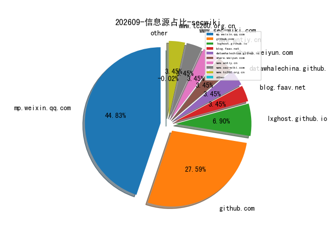
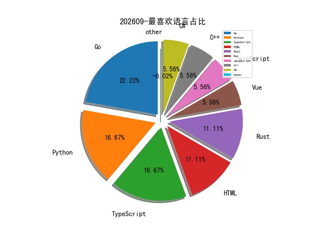

# [数据--所有](README_20.md)
# [数据--年度](README_2026.md)
# 202609 信息源与信息类型占比

# 网络安全书籍 推荐
| date_added | language | title | author | link | size| 
| --- | --- | --- | --- | --- | ---| 
| 2026-09-27 17:51:54 | English | Hands-On AI Development with Python | unknown | https://www.wowebook.org/hands-on-ai-development-with-python/ | unknown| 
| 2026-09-27 17:10:58 | English | Agentic DevOps with Claude Code | unknown | https://www.wowebook.org/agentic-devops-with-claude-code/ | unknown| 
| 2026-09-27 14:28:58 | English | Mastering the Microsoft Agent Framework | unknown | https://www.wowebook.org/mastering-the-microsoft-agent-framework/ | unknown| 
| 2026-09-21 17:52:38 | English | The Absolute Beginner’s Guide to Cybersecurity 2026 | unknown | https://www.wowebook.org/the-absolute-beginners-guide-to-cybersecurity-2026/ | unknown| 
| 2026-09-21 16:20:29 | English | AI Cost Playbook | unknown | https://www.wowebook.org/ai-cost-playbook/ | unknown| 
| 2026-09-20 10:28:38 | English | Options Pricing with Python | unknown | https://www.wowebook.org/options-pricing-with-python/ | unknown| 
| 2026-09-20 18:59:09 | English | AI-Assisted Python for Nonprogrammers | unknown | https://www.wowebook.org/ai-assisted-python-for-nonprogrammers/ | unknown| 
| 2026-09-20 13:56:22 | English | Building LLM Applications with DSPy | unknown | https://www.wowebook.org/building-llm-applications-with-dspy/ | unknown| 
| 2026-09-20 11:01:25 | English | CompTIA Security+ SY0-801 Certification Guide, 4th Edition | unknown | https://www.wowebook.org/comptia-security-sy0-801-certification-guide-4th-edition/ | unknown| 
| 2026-09-18 17:55:36 | English | Agentic AI for Linux Administration | unknown | https://www.wowebook.org/agentic-ai-for-linux-administration/ | unknown| 
| 2026-09-17 17:48:35 | English | AI Agents with MCP | unknown | https://www.wowebook.org/ai-agents-with-mcp/ | unknown| 
| 2026-09-17 17:09:23 | English | Mastering Multi-agent Systems with Azure OpenAI | unknown | https://www.wowebook.org/mastering-multi-agent-systems-with-azure-openai/ | unknown| 
| 2026-09-15 06:52:37 | English | Reliable Evaluations for LLMs and AI Agents | unknown | https://www.wowebook.org/reliable-evaluations-for-llms-and-ai-agents/ | unknown| 
| 2026-09-12 16:54:07 | English | Learning Cybersecurity Fundamentals | unknown | https://www.wowebook.org/learning-cybersecurity-fundamentals/ | unknown| 
| 2026-09-12 15:42:30 | English | Blue Team Handbook: SOC, SIEM, and Threat Hunting | unknown | https://www.wowebook.org/blue-team-handbook-soc-siem-and-threat-hunting/ | unknown| 
| 2026-09-12 09:41:30 | English | MCP For Dummies | unknown | https://www.wowebook.org/mcp-for-dummies/ | unknown| 
| 2026-09-12 18:31:08 | English | From Systems of Record to Agentic Systems of Action | unknown | https://www.wowebook.org/from-systems-of-record-to-agentic-systems-of-action/ | unknown| 
| 2026-09-12 18:55:57 | English | The DevOps Solutions Handbook | unknown | https://www.wowebook.org/the-devops-solutions-handbook/ | unknown| 

# 微信公众号 推荐
| nickname_english | weixin_no | title | url| 
| --- | --- | --- | ---| 
| FreeBuf |  | 每周PDF资源：AI Agent百小时自主挑战；红蓝队渗透工具；非结构化资产分类分级 | https://mp.weixin.qq.com/s/FjZ4qOak47noZ_0d6oIt1g | 4| 
| GSDK安全团队 | GSDK GSDK | AI 驱动的后渗透与主机协同管理平台 - LeoAI | https://mp.weixin.qq.com/s/j1bqMNiHeAAnJaNSUW7Oyw | 1| 
| GTG网络安全实验室 | GTG-Hardy GTG-Hardy | GDPR又罚了某科技巨头 4.03 亿欧元：你设备里那颗GPS定位，正在给你挖坑 | https://mp.weixin.qq.com/s/plDJsBDLbI6F9fTOCroL_g | 4| 
| IoVSecurity | GRCC GRCC | 智能船舶信息系统密码应用及关键技术研究 | https://mp.weixin.qq.com/s/pm8ITYpAAKEl-1jiG5w1mw | 11| 
| OSINT情报世界 | 少钧 少钧 | 操盘非洲矿权的私营地缘政治情报商 | https://mp.weixin.qq.com/s/E6G9_yT0BiVcrxokpnuHfw | 12| 
| OnionSec | None | Today is a gift | https://mp.weixin.qq.com/s/voV_f8oRtNNm8w9Eb1JAgg | 5| 
| Security for AI | 林之冰寒 林之冰寒 | 冰霄IceSky：提示词注入综合工具 | https://mp.weixin.qq.com/s/83TntTey3YGBuMkRp1YuqA | 1| 
| Tom讲交易 | Tom Tom | 学交易之前，先别急着交学费：54 节课免费看 | https://mp.weixin.qq.com/s/eQDTX9zNQDPOy0kormbwrw | 1| 
| 一个不正经的黑客 | 安全资讯 安全资讯 | 全球安全动态日报｜20260924｜早 | https://mp.weixin.qq.com/s/TC3PK21UVsfGiHFo84uKrA | 9| 
| 一路狂飚的蜗牛 | 黄鹂儿 黄鹂儿 | AI Skills 开发完全指南 | https://mp.weixin.qq.com/s/8pTdmsZ9Ha0jyZdJZ0l7iQ | 1| 
| 信安百科 | alicy alicy | N/Axa0,xa0JeecgBootxa0权限绕过与xa0SQLxa0注入组合漏洞解析 | https://mp.weixin.qq.com/s/Psok64ND7vzemLtKpDMdcg | 4| 
| 信息安全笔记 | minzhizhou minzhizhou | 关于人工智能的一点碎碎念 | https://mp.weixin.qq.com/s/uJjOrJIvkM9Y0c92_39eqg | 1| 
| 倬其安 | Hash先生 Hash先生 | 别再把告警处理时长当MTDR！ | https://mp.weixin.qq.com/s/B6gUvhPZMFXazTpb8NVk7w | 3| 
| 全球技术地图 |  | 从“学士帽”到“安全帽”——英国政府教育改革的雄心 | https://mp.weixin.qq.com/s/J1MaJrXJK5aQDxnHRNCi4w | 11| 
| 公安部网安局 |  | 大反转！确认系AI生成 | https://mp.weixin.qq.com/s/F3IytimwX82cM9w3Uf8D-A | 32| 
| 内生安全联盟 | 安全内参 安全内参 | 违法收集处理个人信息，巨头被罚超30亿元 | https://mp.weixin.qq.com/s/h22jwb3kPXGAPgvG_vCzNQ | 16| 
| 初墨道人 | 天狼星GZS 天狼星GZS | 浅谈法事或运筹的灵不灵的问题 | https://mp.weixin.qq.com/s/_ukd45myPQBgNJS8DzkeYg | 1| 
| 南风漏洞复现文库 | 2026-9-27更新 2026-9-27更新 | 企业信息发送平台getLicenceDetail接口存在任意文件读取漏洞 xa0附POC | https://mp.weixin.qq.com/s/6NdWInOJr17OUZW1y1EZog | 1| 
| 句芒安全实验室 | 句芒安全实验室 句芒安全实验室 | 「Codex Security 拆解」OpenAI 开源 AI 漏洞扫描 CLI：策略+验证+补丁闭环 | https://mp.weixin.qq.com/s/-ZFUp0n1_OVSrFfZqNvUdQ | 6| 
| 君说安全 | JUN哥 JUN哥 | 行业资讯｜数万起 AI 安全事件被调查：智能体开始 \"自己搞事情\"，网安行业迎来真正的大考 | https://mp.weixin.qq.com/s/Hm0ENrTAJo061nPZeH9IgA | 9| 
| 好靶场 | 好靶场 好靶场 | 好靶场九月公益赛月赛今日开战 | https://mp.weixin.qq.com/s/_KRzYBRuAFWlITttgBFeCA | 1| 
| 安全天书 | Hello888 Hello888 | 【红队工具】CobaltStrike插件更新 | https://mp.weixin.qq.com/s/SntasltjTbdgnlqTb-IFdw | 3| 
| 安全学习那些事儿 |  | 美士兵因入侵AT&amp;T、Verizon并敲诈勒索被判70个月监禁 曾窃取超1亿用户通信元数据 | https://mp.weixin.qq.com/s/V9U7LmYPR8GW9gzsfbNF5Q | 23| 
| 安全诸子 | 陈看山 陈看山 | 第88篇 AI全栈 · 抖音APP逆向 附带抓包和6种算法 | https://mp.weixin.qq.com/s/ptBz1FB4tVHiRWBMQ0hD5A | 4| 
| 安天集团 |  | 安天网络行为检测能力升级通告（20260927） | https://mp.weixin.qq.com/s/hSOLA3RnKsOelRIDKyoOCw | 7| 
| 小安伴你行 | 小安伴你行 小安伴你行 | 护网行动实战案例剖析技术分享 | https://mp.weixin.qq.com/s/dG6i2QRTk90ME4C7HcIQbA | 7| 
| 小绿草信息安全科创实验室 | 小绿草信息工作室 小绿草信息工作室 | 0xGame 2026,解锁人生新技能，丰厚奖品，等你来拿！ | https://mp.weixin.qq.com/s/Qh307-WFrXfAZSiduhdtow | 1| 
| 小胖快学网络安全吧 | 小胖快学网络安全 小胖快学网络安全 | AI安全岗到底招什么人？ | https://mp.weixin.qq.com/s/H9PQ7D5NAWaTAmYEGOjvQA | 3| 
| 开源情报技术研究院 | 暗网分析师 暗网分析师 | 暗网泄露:美国 Vantage Media AI 6.28亿个人数据 | https://mp.weixin.qq.com/s/ngpdouMNMCjyIqiWXKnq-A | 2| 
| 成渝Sec | 成渝Sec 成渝Sec | 【软考网规】第一章计算机网络基础 | https://mp.weixin.qq.com/s/zH2C6HYL04wbjQTNpMawMw | 1| 
| 撅人 |  | PHP on Windows 保留设备名未拒绝导致 DoS(CVE-2026-17545) | https://mp.weixin.qq.com/s/wzFlEssKyv491IIE5xViBQ | 3| 
| 昆仑AI安全实验室 | klsec klsec | MikroTrick漏洞链：一行命令，无需密码接管公网路由器 | https://mp.weixin.qq.com/s/_PORSoSZOEK0seaq_qx6rA | 5| 
| 智榜样网络安全学习中心 | 小智 小智 | 为什么AI找出了100个漏洞，最后可能一个都交不上去？ | https://mp.weixin.qq.com/s/x_qZxqvY-VU2iweyCryS6Q | 2| 
| 暗镜 | ZM ZM | 黑客利用 cPanel CVE-2026-41940 身份验证绕过漏洞部署 Mirai 恶意软件僵尸网络 | https://mp.weixin.qq.com/s/MZGg8mZcJ9lvK_VtMyZsnA | 6| 
| 棉花糖网络安全工具箱 | 棉花糖糖糖 棉花糖糖糖 | 震撼业界的全能扫描神器降临！一款工具搞定端口探测、协议识别、指纹匹配、暴力破解！ | https://mp.weixin.qq.com/s/xsPNtFNZKYzxdgTPDAqh6w | 7| 
| 沧海讲安全 |  | 你只是乱输了网站的接口地址，结果不小心进去了管理员后台？？ | https://mp.weixin.qq.com/s/v8px2MzDcqGkyxA4OWoEFQ | 2| 
| 河南等级保护测评 | 铸盾安全 铸盾安全 | 文件通知也能“偷看”你：跨平台操作系统暴露用户活动侧信道 | https://mp.weixin.qq.com/s/GiCNjrWR4xPFhtv0Xs9WOw | 7| 
| 犀牛安全 | Rhinoer Rhinoer | 黑客禁用 EPP 并在受感染的 Windows 域中部署 Sliver 漏洞利用程序 | https://mp.weixin.qq.com/s/O7Acs4jOm-eQNzPtwHBptg | 7| 
| 独眼情报 | 🅼🅰🆈 🅼🅰🆈 | 美军人事文件遭未授权访问，岗位信息为何更敏感 | https://mp.weixin.qq.com/s/wlkvn9Od2-JW6nka7144sg | 7| 
| 玄网安全 | opis opis | PKWCTF新生CRYPTO和PWN-“看看就好” | https://mp.weixin.qq.com/s/7vZNv8s52y4DjSC4UmZD7A | 6| 
| 生有可恋 | hyang0 hyang0 | 月亮和太阳会同时出现在天空中吗？ | https://mp.weixin.qq.com/s/olPyV3t2qHSevWFXZ1isLQ | 4| 
| 白帽子 |  | 当黑客交给AI Agent干活：拿下每个目标仅需 25 美元 | https://mp.weixin.qq.com/s/gLTh8u8JI-Ya1l2nl4ciVg | 6| 
| 白帽子罗棋琛 | Max Luo Max Luo | Black Hat USA 2026：DNG与LANDFALL | https://mp.weixin.qq.com/s/MG8cxguQuPQfk3tje_R76g | 5| 
| 知树安全团队 | 鼹鼠 鼹鼠 | 某TSRC大佬的付费全景Skill（包涵：渗透、漏洞挖掘、CTF竞赛、EDR、逆向） | https://mp.weixin.qq.com/s/ei4yeRLuFXzs78rI_eTZvg | 5| 
| 知白守黑1024 | 大白 大白 | 1.2 万星标的 AI 红队神器，门没锁 | https://mp.weixin.qq.com/s/aRbRBgXwcdlUdc-K76Bi1Q | 5| 
| 神农Sec | w4nk3r w4nk3r | 从红队到蓝队：字节跳动火山杯 Skill 对抗赛中的 AI 审核机制探索 | https://mp.weixin.qq.com/s/OgbQOij73Ti8EJY9n4JoxQ | 4| 
| 祺印说信安 | 何威风 何威风 | 没有漏洞，照样入侵：一个电话撬开医疗数据防线 | https://mp.weixin.qq.com/s/MrDCEubeLPfOuuUGryDF9g | 4| 
| 简单读写 | Uysieot Uysieot | 从这次物竞318说起吧 | https://mp.weixin.qq.com/s/9wCJ_brtMDMv7D0Z27vf_g | 1| 
| 红蓝对抗技战术 | 红蓝对抗技术 红蓝对抗技术 | 攻防技战术动态一周更新 - 20260921 | https://mp.weixin.qq.com/s/Z9JfR4MDDn5fr283mbM2-w | 2| 
| 网空闲话plus | 网空闲话 网空闲话 | “战略共情”能否超越威胁叙事？——评《全栈间谍》 | https://mp.weixin.qq.com/s/aTDmvyx17IgdWufVCBLQJQ | 10| 
| 网络侦查研究院 | 子午猫 子午猫 | 揭秘\"依托咪酯家族族谱\"，从母体到氟化变种第三代，我国已列管412种非药用类麻精药品 | https://mp.weixin.qq.com/s/KRbqVeEmK8nuGHjc0sCKnQ | 21| 
| 网络安全直通车 | guowei guowei | 产业协同集聚新发现：供应链与技能关联的“超加性”，重新理解企业扎堆 | https://mp.weixin.qq.com/s/yzQM6xdmcdLM1vQkfqfvcw | 6| 
| 网络安全零零 |  | 网安人必看！12种常见的网络攻击方式 | https://mp.weixin.qq.com/s/o2zhKReCgCwQQcmxir49cg | 2| 
| 网络技术干货圈 | 圈圈 圈圈 | 光纤跳线类型有哪些？网工必须掌握的基础知识 | https://mp.weixin.qq.com/s/Lp9IpPvqMECORJNMRgbsPQ | 3| 
| 网络技术联盟站 | wljslmz瑞哥 wljslmz瑞哥 | GPU之后，AI基础设施的新瓶颈可能是光纤 | https://mp.weixin.qq.com/s/JrQODMutfpAWyh8dfmrTag | 3| 
| 网络空间安全科学学报 |  | 10月17日专题会议：新技术应用安全前沿学术会议 | https://mp.weixin.qq.com/s/0tH9hMnSW0f5U9XenwFR_g | 5| 
| 老烦的草根安全观 | None | 第12页-情报与情报分析 | https://mp.weixin.qq.com/s/-Q_o4LcDRAwf93oXJM2jxw | 3| 
| 船山信安 | Sink Sink | 扫描器永远扫不出来的那一类洞：业务逻辑漏洞怎么挖 | https://mp.weixin.qq.com/s/EtZpbr79VkFDfH5ofXgh0Q | 4| 
| 苏说安全 | 网络技术派 网络技术派 | 常见网络安全设备全景 | https://mp.weixin.qq.com/s/6IqvlKgz9boW3VoAVomewQ | 5| 
| 蓝军开源情报 | 止戈为武 止戈为武 | 第六与第五领域：认知战与太空如何融合为单一战场 | https://mp.weixin.qq.com/s/bXJdZAVRtwvygo3Z3blx2A | 40| 
| 赛查查 |  | 赛查查喊你来投票！ , 投出你最喜欢的安全赛事 | https://mp.weixin.qq.com/s/rgp_rQxYFEc9l1kiPQPuVA | 39| 
| 软件安全与逆向分析 | None | OnePlus15手机本地提权Root分析 | https://mp.weixin.qq.com/s/HU884UzDNwekvifNYXJSwQ | 1| 
| 软件开发安全生命周期 | Wens0n Wens0n | SDL序列课程-第79篇-安全需求-防欺诈-需要对允许注册和显示的名称进行必要限制，如进行关键词过滤 | https://mp.weixin.qq.com/s/zRq2rN4-K-9mbjWpHEFQKg | 1| 
| 进击安全 | 知名小朋友 知名小朋友 | 漏洞挖掘案例-任意用户接管 | https://mp.weixin.qq.com/s/9nPkJwFP-wYUE6Eyw4lHuA | 2| 
| 逆熵寻生 | CabinQ CabinQ | CVE-2025-34291深度解析：打开一个网页就丢了整个AI平台，MuddyWater APT的零交互攻击链 | https://mp.weixin.qq.com/s/Yu3WP7UQCGPcvhaNZChpYw | 6| 
| 陌笙不太懂安全 | ProbiusOfficial ProbiusOfficial | PivotHub · 链透中枢 — 多层内网渗透辅助工具 | https://mp.weixin.qq.com/s/0toAaeDj0VQyrPoJY2YX4Q | 3| 
| 随笔漫记安全路 | 零日手记 零日手记 | 公交站牌都能沦为\"肉鸡\"，IoT 设备安全的老底被揭开 | https://mp.weixin.qq.com/s/Dd4w3K_jdpJYXjXHBahp0A | 4| 
| 飓风网络安全 |  | 【高危漏洞预警】VMware vCenter Syslog服务未授权目录遍历远程代码执行漏洞CVE-2026-59310 | https://mp.weixin.qq.com/s/YFcZQdiv5wUw70XOs-IrLQ | 1| 
| 骨哥说事 | SCRT Team SCRT Team | 从一条聊天消息到主播电脑被完全控制：漏洞连环套如何攻破OBS | https://mp.weixin.qq.com/s/jmelVfSIhDHIFQLpmG-8pw | 3| 
| 黑客技术与网络安全 | 权限提升中 权限提升中 | 吉利要不要去，接到吉利宁波杭州湾的 offer，涨薪约40%，考虑要不要去，目前在外企很舒服，但是晋升和涨薪接近于无。 | https://mp.weixin.qq.com/s/EYRAqv8PCEP4NQH9aoBkqQ | 4| 
| 黑客技术家园 | 黑客技术家园 黑客技术家园 | 你家的 Wi-Fi，可能正在被陌生人\"共享\"：5 个设置让家用网络固若金汤 | https://mp.weixin.qq.com/s/-cu3b9XpyeXEblngtSOoBw | 2| 
| 黑白之道 | Dr. Clay Dr. Clay | Google开源ARTEMIS：说句话就能操控Android，Claude Code也能控制测试手机 | https://mp.weixin.qq.com/s/xlFJR4sd_TjMsSNkci4vpQ | 30| 
| 黑鸟 | 黑鸟 黑鸟 | 俄罗斯全国手机预装的Max聊天应用的技术底牌 | https://mp.weixin.qq.com/s/flfNgC8gp37WbKasUgnZ9w | 6| 
| 0day收割机 | 0day收割机 0day收割机 | DAY 26 · 每天学一个 Kali 工具wpscan：WordPress 站点的\"专属体检医生\" | https://mp.weixin.qq.com/s/OxDiR6c5S_5KHjg9ZP2zGA | 1| 
| 360漏洞研究院 | 360漏洞研究院 360漏洞研究院 | 首批！360入选国家人工智能安全漏洞库优秀技术支撑单位 | https://mp.weixin.qq.com/s/t4MMjuBUnw9Oe9X7LJS2Xw | 2| 
| AI安全工坊 | AI安全工坊 AI安全工坊 | 一次真实入侵拆 9 环：AI agent 的 4 处配置自查 | https://mp.weixin.qq.com/s/zw73un9IJUpGSOFtnG_NXw | 3| 
| HackSee安全生活 | None | 科普：人脸识别 | https://mp.weixin.qq.com/s/_bxZLFPgYe07Bg-2Rg3rLQ | 5| 
| Hacking黑白红 | hacking hacking | OpenAI智能体“摇人”：DeepSeek、Kimi、Qwen全被拉下水 | https://mp.weixin.qq.com/s/iLc5PVmSxJP55qRgxdT-Vg | 13| 
| Khan安全团队 |  | Agent Harness 实战：两阶段 ReAct 引擎 | https://mp.weixin.qq.com/s/C7f3YZGkOkTW7nh7h8WrIw | 9| 
| MessFreeSecurity | messfree messfree | 一条日志，打成 vCenter root | https://mp.weixin.qq.com/s/u7C2XBxEJ7mqmX7NJ-vubw | 5| 
| Ots安全 |  | OpenCode 升级端点 RCE：一个表单就能从网页打到本机（GHSA-632h-h47v-g4x4） | https://mp.weixin.qq.com/s/PolmGFtTvwXKkk8QRaqQ9Q | 8| 
| Oxo Security | Oxo Security Oxo Security | 【AI安全】EvilTokens：员工进了微软官网，邮箱令牌怎么到了攻击者手里？ | https://mp.weixin.qq.com/s/-9MexLK2Tal4vJgPKIPJkw | 5| 
| kali笔记 | 大表哥吆 大表哥吆 | 国产十万卡，真正的硬仗不在芯片 | https://mp.weixin.qq.com/s/NL09DgmyW288FmgPRk8ekg | 4| 
| 丁爸 情报分析师的工具箱 | 丁爸 丁爸 | 【开源报告】全球各国警察院校情况报告 | https://mp.weixin.qq.com/s/3cF3uKhfss11cD8h2extmQ | 8| 
| 信息安全大事件 |  | 紧急预警｜.ths勒索软件活动升温xa0多用户文件遭批量加密 | https://mp.weixin.qq.com/s/LTi2_zql24avUzQpn7RgEQ | 1| 
| 兰花豆说网络安全 | 承影 承影 | 网络安全人士必知的AI Agent开发框架 | https://mp.weixin.qq.com/s/cbkPYeqyUdkfnfrHOiACkA | 4| 
| 利刃信安 | 刃无锋 刃无锋 | 对一款Linux木马开源提示词的测评 | https://mp.weixin.qq.com/s/6ELcDuxTTvFmvwXO5J--5A | 5| 
| 可乐攻防手记 | 可乐攻防手记 可乐攻防手记 | WorkBuddy+网络安全简直就是王炸组合！ | https://mp.weixin.qq.com/s/OZLvJt0rWQvN-yh3Pve0xA | 1| 
| 威胁情报Z分析 | Z Z | Agent Harness 实战：两阶段 ReAct 引擎 | https://mp.weixin.qq.com/s/00y6RmK1hNOJABBY8OH1mQ | 4| 
| 安全分析与研究 | pandazhengzheng pandazhengzheng | AI安全的计算复杂性与不可判定性 | https://mp.weixin.qq.com/s/W-LhVIa540H_x-1P5peIfQ | 6| 
| 安全圈 |  | 【安全圈】Roundcube 旧漏洞出现实际利用报告，邮件系统需核对版本 | https://mp.weixin.qq.com/s/1T4B--nSUlb2GhM26Zx9fg | 12| 
| 安全有术 | 刘顺 刘顺 | Uber的开源ADR：Agentic AI 检测与响应平台 | https://mp.weixin.qq.com/s/NjxnCU1DEia8SlEt1t1ogQ | 1| 
| 小刘说攻防 | 小刘说攻防 小刘说攻防 | 整理了100条CMD常用命令，赶紧码住！ | https://mp.weixin.qq.com/s/XV4Xkq0JMkzdMksfIwfTGQ | 2| 
| 小猫信安 |  | 28种LLM越狱攻击方法汇总（2025.8） | https://mp.weixin.qq.com/s/4UUbCOos_Qs6RFHkfW6dcg | 2| 
| 广州网警 | 公安部网安局 公安部网安局 | 别让“键盘声”盖过“加油声” | https://mp.weixin.qq.com/s/qJLCAQlw3Epsi5F-KAmlgA | 2| 
| 我的安全视界观 | aerfa21 aerfa21 | 开放 2 个咨询位，聊聊你卡住的那件事 | https://mp.weixin.qq.com/s/GaPFVGxAvhFAt9uKQwcDXw | 3| 
| 效能跃迁实验室 | 效能跃迁实验室 效能跃迁实验室 | SBOM 已经不够用：AIBOM，AI 时代的物料清单，附AIBOM自动扫描工具 | https://mp.weixin.qq.com/s/xVhidGn4ZgsfOjggvt3pjg | 1| 
| 数世咨询 | 数世咨询 数世咨询 | 4亿美元！企业浏览器独角兽 Island 估值升至64亿美元 | https://mp.weixin.qq.com/s/lK_hbHCIXJNc3HLs32xYLQ | 5| 
| 星悦安全 | XingYue404 XingYue404 | Coruna ios 漏洞C2系统存在前台敏感信息泄露漏洞 | https://mp.weixin.qq.com/s/3uLerePsXTiulToPz1pf4g | 1| 
| 暗网哨兵 | 暗网哨兵 暗网哨兵 | FBI又泄露了？黑客声称公开1,000万份FBI案件数据，涉及CIA、特勤局等敏感信息 | https://mp.weixin.qq.com/s/kkSSHzg4WOs3Ubl-muLnsQ | 3| 
| 梓陌说科技 |  | 9 月苹果iPhone 红黑榜：这几款可以下手，这几款再等等 | https://mp.weixin.qq.com/s/P0RcVKgyS50RIznWVBIbbg | 10| 
| 正在思考ing | studying-egg studying-egg | CTF菜鸟内网靶场学习笔记 | https://mp.weixin.qq.com/s/HNZaRoAmA0bFjIZ_OI1Obw | 2| 
| 泷羽Sec | 仙草里没有草噜丶 仙草里没有草噜丶 | 如果你有一台闲置 VPS，建议看看这个开源蜜罐 wisp | https://mp.weixin.qq.com/s/PQgZzwTOtl6HRR7X35R8uw | 2| 
| 看雪学苑 | 看雪课程 看雪课程 | 冰与火的战歌：Windows内核攻防实战 | https://mp.weixin.qq.com/s/0e3IvmEuBOM_O0PN3rELfQ | 9| 
| 秦安战略 | 秦安战略 秦安战略 | 秦安：手搓导弹！人工智能助力胡塞武装，“四打”正义感天下第一。 | https://mp.weixin.qq.com/s/xKdk6yPp8GfK9BNqTq_jSQ | 37| 
| 红队安全圈 | 红队安全圈 红队安全圈 | (9.8分) CVE-2026-18143：WordPress报价插件未认证任意文件上传 | https://mp.weixin.qq.com/s/68xjdiiM7vjATm3MSqyMxA | 10| 
| 绿盟科技研究通讯 | 星云实验室 星云实验室 | AI与云安全事件案例分析周报（2026.09.21 - 2026.09.25） | https://mp.weixin.qq.com/s/VP8pMe6zWlKF1aC2lkt-gw | 1| 
| 网安百色 |  | 微软确认 Windows 11 更新引发黑屏，桌面无法正常加载 | https://mp.weixin.qq.com/s/QLQKbzQKs_E1ItVtTksz4A | 4| 
| 美亚柏科 |  | 报名开始！第十二届“美亚杯”邀你来赛 | https://mp.weixin.qq.com/s/YlnSonl5Y1B460CuFivdlA | 6| 
| 谈思实验室 |  | UDS协议中的时间参数详细解读 | https://mp.weixin.qq.com/s/1Q7RuGD2FN5pQ6Dvddw3OQ | 13| 
| 赛博安全攻防日记 | 黑卷 黑卷 | 从焊 UART 到浏览器打穿：TP-Link Tapo 摄像头 RCE 链（TAPOcalypse） | https://mp.weixin.qq.com/s/d9HtO05B2nzS-lPxeRcQGQ | 4| 
| 赛博研究院 |  | 麦肯锡：AI 加速半导体产业，2030年市场规模或达2.3万亿美元！ | https://mp.weixin.qq.com/s/IOUGIjii4tfHUSNGgr0U7w | 6| 
| 马哥网络安全 | 点击关注👉 点击关注👉 | 网络安全思维导图（全11张） | https://mp.weixin.qq.com/s/UfEWEn7BZSUgF48oSPhsyw | 9| 
| 马甲三号 |  | Anthropic经济报告深度解读：AI 对美国经济 2030 年的情景影响 | https://mp.weixin.qq.com/s/555eD4XPLeh6amWIstfHpQ | 1| 
| 鸿渐在路上 | 鸿渐 鸿渐 | AgentTeams Dashboard v1.2.4.9 发布：一条命令拉起你的 Agent 集群控制台 | https://mp.weixin.qq.com/s/brfxRG5efPXYQqsJYAelTA | 1| 
| Ghost Wolf Lab | Ghost Wolf Lab Ghost Wolf Lab | Linux io_uring 固定缓冲区逃逸 | https://mp.weixin.qq.com/s/HKKHoS4T7rjGdJKKDL-42A | 2| 
| KK安全说 | 破天KK 破天KK | 当AI把人推下楼，并举起了刀 | https://mp.weixin.qq.com/s/A1z85CE5XwUCJhc0h4zjzw | 2| 
| 京数安 |  | 算法备案保姆级教程（2026完整版）：50个退回坑一次讲透 | https://mp.weixin.qq.com/s/sgoc8EICckbO2Mu16xGQJQ | 1| 
| 华顺信安威胁情报中心 |  | 【热点安全风险】9月23日 , Arista VeloCloud 满分漏洞遭在野利用，攻击者无需认证即可直取 SD-WAN 中枢（CVE-2026-93952） | https://mp.weixin.qq.com/s/W2lXqq79q-kDz9zjszQojw | 3| 
| 可信安全 |  | 标准研讨 , 《人工智能云 机密算力技术能力要求》第一次标准研讨会 | https://mp.weixin.qq.com/s/UVSdo7UGQJMzCvlTHWn4kg | 3| 
| 夜组OSINT | NightTeam NightTeam | 黑客称能够帮助外国军事系统以毫米级的精度引导巡航导弹和无人机等进行打击 , 美国德克萨斯州交通厅（TxDOT）公路工程数据泄露 | https://mp.weixin.qq.com/s/1A9hKKuLbHZzmOhj6Qlv8A | 4| 
| 夜组安全 | 迷人安全 迷人安全 | 重构DDDD，与DLDL联动快速实现POC与指纹的结合，提高红队资产发现与打点效率 | https://mp.weixin.qq.com/s/N6cjyxnAPVxsHkky9dzF3w | 3| 
| 威努特安全网络 |  | 威努特超融合一体机亮相华为全联接大会 | https://mp.weixin.qq.com/s/Qn7BFsMOkQNLmjZWp88kfw | 3| 
| 安全客 | 欢迎关注→ 欢迎关注→ | 一块公交站牌沦为\"肉鸡\"，公安部这份通报，把物联网安全的老底揭开了 | https://mp.weixin.qq.com/s/C0QBuSkcILWf5AXFjjf95A | 5| 
| 山石网科新视界 | 山石网科 山石网科 | 排名第二！山石网科 Q2 UTM 份额创历史新高 | https://mp.weixin.qq.com/s/ku6Pu3ZmqWuhlM2xjfBSWQ | 4| 
| 李白你好 | 李白 李白 | 朝鲜黑客组织xa0WaterPlum 牛逼！ 8个月感染超100个国家3万台设备，转移约1071 万美元加密资产到朝鲜 | https://mp.weixin.qq.com/s/5m0yM-58wRWBobtsMgtNSw | 4| 
| 浅安安全 | 浅安 浅安 | 工具 , moria | https://mp.weixin.qq.com/s/ba__MgJehZhM395rst2EoQ | 8| 
| 炼石网络CipherGateway | 数据安全建设就找 数据安全建设就找 | 炼石AI数据安全亮相首届中国网络空间安全大会 | https://mp.weixin.qq.com/s/4PWng5nDd2pg41MEDhGKIg | 2| 
| 绿洲安全 | P喵呜 P喵呜 | 伪强口令爆破的姿势 | https://mp.weixin.qq.com/s/EHR43sEcaD7rvvkpFLT9TQ | 4| 
| 网络安全工作室 | K K | 一文读懂《区块链信息服务管理规定》｜原文 + 逐条解读，合规必读 | https://mp.weixin.qq.com/s/z5VwC_LslcBgVqVMngusyQ | 4| 
| 老A搞安全 | 是老A 是老A | 记一次失败的挖洞经历，Nacos Derby SQL Injection复现流程 | https://mp.weixin.qq.com/s/l5SxkqtALRmSZK36E0pSHg | 1| 
| 谛听ditecting | 谛听网络安全团队 谛听网络安全团队 | 谛听 , 面向工业物联网低幅值投毒攻击的精准防御方法 | https://mp.weixin.qq.com/s/w-lzuPGdbGUnepvfs3WzSQ | 1| 
| 长弓三皮 | 长弓三皮 长弓三皮 | buuctfxa0WEB [安洵杯 2019]iamthinking writeup | https://mp.weixin.qq.com/s/yjUv-6oBod9cu-_z1R9GWw | 1| 
| APT-101 | APT-101 APT-101 | 定向水坑攻击：朝鲜黑客盗取加密货币的技术分析 | https://mp.weixin.qq.com/s/dzca1H9YC6g1wyh53D_Dzw | 2| 
| BlockSec | BlockSec BlockSec | 官宣｜BlockSec 联合创始人出任香港金融科技协会区块链与数字资产委员会联席主席 | https://mp.weixin.qq.com/s/am9TJ6YZYWha9rb73UOnqg | 1| 
| C4安全 | chobits02 chobits02 | 用友U8C nDay手到擒来，Provena-Audit自动审计出洞 | https://mp.weixin.qq.com/s/BDesKRPZttqMP6GJz-XI2w | 2| 
| Esn技术社区 | Bl0ckdev Bl0ckdev | “始”逆向[ 零创技 ]—猎人笔记（4）—Windows内核漏洞利序言+30小时思维逻辑的重铸与安全逆向“沙盒”标记H6！ | https://mp.weixin.qq.com/s/eHJeFT79z5eO3mU9A7GYHg | 2| 
| FreeBuf知识大陆APP |  | 开课倒计时 2 天！还没开课，怎么就有人回本了？ | https://mp.weixin.qq.com/s/xgwylEAcrjZNUa5DpyHsnA | 1| 
| Hash-Sec | Hash-Sec Hash-Sec | Vulnhub靶机实战 - Symfonos4 | https://mp.weixin.qq.com/s/XAPPIohLBmq_R8E-lt8ZPw | 3| 
| IoT物联网技术 | ~ ~ | 免费开源，工业物联网 SCADA 引擎平台，1000万行数据秒级渲染、实时遥测、40+可视化控件 | https://mp.weixin.qq.com/s/zVcZv5WYRCmOVquexzxodQ | 8| 
| Nday Poc | Superhero Superhero | struts2 xmlParser.action XXE漏洞(CVE-2025-68493) | https://mp.weixin.qq.com/s/-NvAS5PpA537RzZm3Ea58w | 4| 
| allby森林之家 | 森林之家zbs 森林之家zbs | 黄仁勋说网安是AI的下一个万亿风口，我看着自己的月薪沉默了 | https://mp.weixin.qq.com/s/HOnAYNjqFPs1N2y6l8gVrg | 4| 
| 个人信息投诉举报 |  | 关于30款App个人信息收集使用问题的通报 | https://mp.weixin.qq.com/s/6SWwLO0uMCun22YQDkAV1w | 2| 
| 中国信息安全 |  | 数智拓远 善治久安 , 第十六届网络安全漏洞分析与风险评估大会在重庆举办 | https://mp.weixin.qq.com/s/s21dVD2MTDqpLRWC9kdYeg | 27| 
| 中国网络空间安全协会 |  | 中国在非洲互联网企业合作网络工作交流会等活动在浙江举行 | https://mp.weixin.qq.com/s/Z97glIaZZ91YCGnWb3IQMg | 9| 
| 中国软件评测中心 |  | 赛迪副院长朱敏：培育人工智能应用服务商，赋能“人工智能+”落地见效 | https://mp.weixin.qq.com/s/2jbDZRBpAVJFkLFGNcqdiw | 5| 
| 中资网安 | CACT CACT | 奋力“乒”博 “羽”你同行 球“台”争锋 , 中资网安参赛队参加中国电科智能科技园第五届“乒羽台”友谊赛荣获历史最好成绩 | https://mp.weixin.qq.com/s/Jx5z4T5flhyaHTmz1oKZMg | 1| 
| 亚信安全 | 你信任的 你信任的 | 大模型、智能体满天飞，AI资产互联网暴露如何探知 | https://mp.weixin.qq.com/s/g3EZXijVLO0fk7n2M0jQSw | 4| 
| 亿赛通 |  | 浅谈数据分类分级工作的重要性 | https://mp.weixin.qq.com/s/0qTEUg6YpNfrsLiK4Dnhkg | 1| 
| 代码卫士 | Ravie Lakshmanan Ravie Lakshmanan | 安全测试域名混淆，Gemini 入侵真实公司系统 | https://mp.weixin.qq.com/s/EtOqvivOObj1VgmU8TQF7g | 10| 
| 众智维安 |  | 智能体安全，不是给AI加一道门——智能体安全的几点落地思考 | https://mp.weixin.qq.com/s/2fi5QkNjvaoRtwjeyksb1w | 2| 
| 低调学安全 | 低调学安全 低调学安全 | CyberStrikeAI 新增 Jev 模型支持：给 Agent 每一步操作加一层快速审批 | https://mp.weixin.qq.com/s/WTtEkrxQuQTRkmu93-wWnA | 1| 
| 信息安全D1net | Stephanie Stephanie | AI正在血洗网络安全圈！5大变革彻底重塑行业的饭碗 | https://mp.weixin.qq.com/s/JUtDMNVthnxUWky3Ru5zYQ | 3| 
| 信息安全与通信保密杂志社 | Cismag Cismag | 目录 ｜《信息安全与通信保密》2026年第8期 | https://mp.weixin.qq.com/s/m-K_G9Y_WGXmLBUI7f9DZA | 7| 
| 信息网络安全杂志 |  | 暨南大学教师在安全领域顶级会议IEEE S&amp;P 2025发表重要成果 | https://mp.weixin.qq.com/s/6-4-bpJ8sOreyJrvKWZkPA | 2| 
| 像梦又似花 | CyberSecGuy CyberSecGuy | win11跳过联网开机激活 | https://mp.weixin.qq.com/s/g6T9-jHQCsR4lyzvxgt8fw | 2| 
| 华为安全 |  | 漫谈SD-WAN：Ping通≠流畅！你的网可能一直在走“堵车路线”！ | https://mp.weixin.qq.com/s/A8TfTN257IkBrUG81v0YUQ | 3| 
| 只会看监控的实习生 | 菜狗 菜狗 | WAF拦了99%的上传攻击？这个工具内置263种绕过技术，从Content-Type到条件竞争全覆盖 | https://mp.weixin.qq.com/s/wSOwBQDvIaVKTw73pz7TEA | 3| 
| 合合信息 | 合合君 合合君 | 合合信息亮相2026云栖大会，让办公Agent“看得清、读得懂、判得准” | https://mp.weixin.qq.com/s/p2e7Yz9r33yCOocFWLSEEA | 3| 
| 启明星辰安全简讯 |  | 安全简讯（2026.09.22） | https://mp.weixin.qq.com/s/uhdeBfPiV0Od6DZ29bW3DQ | 11| 
| 启明星辰集团 |  | 启明星辰荣膺中电联2026年度电力创新奖一等奖 | https://mp.weixin.qq.com/s/u-wZobrP5i-zK9Xc3hzxEw | 3| 
| 国家互联网应急中心CNCERT | CNCERT CNCERT | 关于2026年人工智能大模型安全众测活动典型漏洞风险的通报 | https://mp.weixin.qq.com/s/xKOZmS4_xuwjBZWM2v55yA | 4| 
| 复旦白泽战队 | 复旦白泽战队 复旦白泽战队 | 告别“开卷考试”，用“闭卷测试“检验AI真实攻击能力 | https://mp.weixin.qq.com/s/giumeYfpF0tmQ6CKK5KiCg | 2| 
| 奇安信 CERT |  | 【已复现】Microsoft SharePoint 远程代码执行漏洞(CVE-2026-65660)安全风险通告 | https://mp.weixin.qq.com/s/rMPj6tVo23jasLZxzSq7YQ | 1| 
| 奇安信威胁情报中心 | 威胁情报中心 威胁情报中心 | npm 供应链攻防进入\"运行时时代\"：200 万周下载的恶意包如何绕开 npm v12 防线 | https://mp.weixin.qq.com/s/5dHSXh4zzknjwLG7ni8n0g | 4| 
| 奇安信集团 |  | 首批+最多！奇安信获国家人工智能安全漏洞库技术支撑单位及15项漏洞奖励 | https://mp.weixin.qq.com/s/wbXF_FnlUy5xz4awhuNHOg | 13| 
| 字节跳动技术团队 | 火山引擎存储 火山引擎存储 | 一图看懂 ADrive 跨产品协作实践：文件通了，Agent 就通了 | https://mp.weixin.qq.com/s/F9mZNfWSPPDnwNMSamA6wQ | 2| 
| 安世加 |  | MFA过完还是丢号 | https://mp.weixin.qq.com/s/hPMqWbqxWvkekSV-5aF5dw | 2| 
| 安全内参 |  | CNCERT：2026年人工智能大模型安全众测活动典型漏洞风险通报 | https://mp.weixin.qq.com/s/-F-_TAoh37At4JhyPSCFag | 6| 
| 小石学习笔记 | 小石同学 小石同学 | Linux PAM(可插拔身份验证模块)模块的使用和实操 | https://mp.weixin.qq.com/s/DHo1ftrrJydQWgEPDdzVzw | 1| 
| 小红书技术REDtech | REDtech REDtech | 【世界杯专题01】体育直播全链路降延迟实践 | https://mp.weixin.qq.com/s/2j0vs0y7uYljFUqCjR5nGw | 1| 
| 工业互联网标识智库 | 金键 金键 | 智能原生：从技术赋能到范式重构 | https://mp.weixin.qq.com/s/srN06QJKtWKPSz-EL-LMlw | 1| 
| 广东网警 | 广东公安 广东公安 | 严打涉企网络谣言违法犯罪 护航南粤法治化营商环境 | https://mp.weixin.qq.com/s/pVnz_rQWQpA4zeHcuXMw8w | 1| 
| 微步在线 | ThreatBook ThreatBook | AI做安全运营，怎样才让人放心？ | https://mp.weixin.qq.com/s/QHdu77gtlNm_we1oqKXHsw | 4| 
| 快手技术 | 快手技术 快手技术 | EuroSys 2027｜快手联合北航提出 TB 级推荐模型 Checkpoint 系统 AdaptCP | https://mp.weixin.qq.com/s/ZFDCSDkKSjLbuxgjlkB1mA | 3| 
| 新华三主动安全 |  | 新华三亮相首届中国网络空间安全大会，解码AI时代的安全创新之道 | https://mp.weixin.qq.com/s/mrmka0TbI60EduDnclLKWA | 1| 
| 春秋伽玛 |  | 2026年（第23届）信息安全与对抗技术竞赛密码安全赛 | https://mp.weixin.qq.com/s/E15UwsY3U0UFmsWJi-x-KQ | 1| 
| 柠檬赏金猎人 |  | Evilginx3钓鱼攻击框架 | https://mp.weixin.qq.com/s/08LiULVr0lMCpmox2_Y3xw | 2| 
| 武汉网络安全 |  | 网络安全进基层 , 进社区：走进美庐社区 普及家庭网络安全防护知识 | https://mp.weixin.qq.com/s/8nEssozeRJ7e6AkXhE_now | 35| 
| 江南信安 |  | 星闪智联 安全护航｜江南信安星闪安全专网方案引发关注 | https://mp.weixin.qq.com/s/jv1HFZBDnZSdrXuiuKA9AQ | 3| 
| 渗透Xiao白帽 |  | 永别了，豆包! | https://mp.weixin.qq.com/s/t8SGHmTm3JMKB07_r__PDQ | 1| 
| 渗透测试 | 渗透测试 渗透测试 | 喜迎中秋，欢度国庆AiScan-N 集成200+ 安全能力的工作台！零基础也能上手从聊天到脱壳,CTF网络安全大赛,搭配本地大模型可无需访问互联网 | https://mp.weixin.qq.com/s/JcQEi6H-G8r_0dT_Ue2bVw | 1| 
| 源影安全团队 | 梅伊斯 梅伊斯 | 【已复现】CVE-2026-65660 Microsoft SharePoint 远程代码执行漏洞 | https://mp.weixin.qq.com/s/meQDGztz6IsCdcI6MCOM9w | 2| 
| 漏洞盒子 |  | 100小时长征：史上首个Agent自主不间断渗透完整战报 | https://mp.weixin.qq.com/s/k_8Rqm4K3VheUOmbgicYWA | 2| 
| 火绒安全 | 火绒安全 火绒安全 | 诚邀渠道合作伙伴共启新征程 | https://mp.weixin.qq.com/s/SXkaQsCXqx83p3k3o75ihA | 7| 
| 玄道夜谈 | 玄道 玄道 | 今日随笔-后来，我把名字留在了风里 | https://mp.weixin.qq.com/s/Mqga-JNFeMHVLLjnYUlGmA | 1| 
| 玫家大院 | 玫幽倩 玫幽倩 | 2026第二届湾区杯网络安全大赛决赛（AI专项赛道静态题wp） | https://mp.weixin.qq.com/s/l3G9nREKF8K-Ai8K2y1uJw | 1| 
| 盛邦安全WebRAY | 盛邦安全 盛邦安全 | 2026中国无线电大会，盛邦安全携生态伙伴共建无线电创新院联合实验室 | https://mp.weixin.qq.com/s/zEt-cM_ltTas-MxbpoCx8Q | 4| 
| 知道创宇 |  | 弈智破局，善用智能——KCon 2026 议题招募已开启 | https://mp.weixin.qq.com/s/7GpXjTDXZNSKeTnn3v4OpA | 3| 
| 神州希望网络安全 |  | 神州希望协助文昌紫贝光伏电站开展网络安全应急演练 | https://mp.weixin.qq.com/s/hwPvhmDC9zvII6zl7AXPfw | 4| 
| 等保测评和商密评估 |  | 中国民营企业500强出炉！（附榜单） | https://mp.weixin.qq.com/s/CmKzGtctfpx1atAy-3wxwQ | 2| 
| 绿盟科技 | 绿盟君 绿盟君 | AI赋能攻防新格局｜绿盟科技受邀出席2026北京互联网大会 | https://mp.weixin.qq.com/s/upqvmSiJixjh8CiNZ2AUaw | 5| 
| 网易智企-易盾 | 网易智企-易盾 网易智企-易盾 | 当AI不只\"说错话\"，还会\"做错事\"｜金融智能体安全边界重构 | https://mp.weixin.qq.com/s/4LGOelLZKthXhcukyPQCKQ | 3| 
| 网络安全和信息化 |  | 2026国家制造强国建设论坛在合肥举行 | https://mp.weixin.qq.com/s/WDf7JP-0WhUjS-zoIN1KDA | 12| 
| 网络空间信息安全学习 |  | 「九月焕新季」活动倒计时，快来看看哪些软件还没入手！ | https://mp.weixin.qq.com/s/4wxvXtYx-pOo9P8IgPAW6Q | 2| 
| 美团安全应急响应中心 |  | 美团SRC关于违规测试行为的警示与规范重申 | https://mp.weixin.qq.com/s/-RRQ6kZaKDiEIiVyBcMmDQ | 1| 
| 老李的信息化自留地 | 这里至少还有鱼 这里至少还有鱼 | 不聊天、不写代码，这个爆火模型只做选择题——Jev 是什么，国内怎么用 | https://mp.weixin.qq.com/s/fGc9WB63exkfZoTvTFPCAA | 1| 
| 聚铭网络 |  | 聚铭网络受邀出席2026VARA大会，获评AIVD优秀技术支撑单位并入选人工智能安全漏洞治理联盟 | https://mp.weixin.qq.com/s/h4xdLlXp2po5rRhevCdQ8w | 4| 
| 腾讯安全 |  | 腾讯四款AI产品通过国家级“安检” | https://mp.weixin.qq.com/s/PnJbDXUk3BubUVLWksGgXA | 2| 
| 苏州信息安全法学所 | 法学所 法学所 | AI伦理的多维博弈：从学界宣言到国家治理 | https://mp.weixin.qq.com/s/FrRJqAl0nVilv8gJL_R-ZQ | 2| 
| 苏州龙信信息科技有限公司 | 龙小信 龙小信 | 龙信AI力作重磅首发 , 海量数据，3分钟锁定突破口——现场研判，从此提速！ | https://mp.weixin.qq.com/s/2S7sf5DweUWb97hKGLCyTg | 1| 
| 蚁景网安 |  | 网安人的副业在哪里？ | https://mp.weixin.qq.com/s/sxeaAOEzJeMHG1-2Qs4wlg | 4| 
| 蚁景网络安全 |  | 【免费领】大神12年经验成果：渗透红队实战技术教程 | https://mp.weixin.qq.com/s/ANY8LcqpOYUz6MoeCnntPg | 8| 
| 金天的网络安全 |  | 三年了，我从一罐假蜂蜜里醒了过来 | https://mp.weixin.qq.com/s/lZIYK4qZOSEgCi4-DtcPEQ | 3| 
| 金盾检测股份 |  | 喜报 , 第一名！金盾检测荣获广东省“护网2026”攻防演练一等奖！ | https://mp.weixin.qq.com/s/AV7LQjeuwqcKnqFfNiOgBg | 1| 
| 长亭科技 | 夺旗猫 夺旗猫 | 长亭科技获评两项首批国家级人工智能安全资质！ | https://mp.weixin.qq.com/s/hgl5CgPHJnUsNydgx2nYfw | 1| 
| 阿里云安全 |  | 阿里云欧阳欣：重塑Agentic时代的安全体系 | https://mp.weixin.qq.com/s/RyZ8XnkeMLnJhy4BWes1Kw | 1| 
| 靖安科技 | 靖安司 靖安司 | 靖安科技跻身「创客中国」低空经济大赛全国十强并获奖 | https://mp.weixin.qq.com/s/u19S4tcgSCYPIpIb4DBrnQ | 1| 
| 驯海隔壁白帽子 |  | 绘网安晴空｜网络安全宣传周答题活动火热进行！ | https://mp.weixin.qq.com/s/5do-LFRVAa0b1CS_ezwwuQ | 2| 
| 默安科技 | 值得信赖的 值得信赖的 | 默安代码审计智能体：发现SAST看不见的逻辑漏洞 | https://mp.weixin.qq.com/s/HDHPtEMcd3Dt1HQbEtlbuw | 2| 
| CUIT网络空间安全学院 | 融媒体中心 融媒体中心 | 国家网络安全宣传周系列活动丨我院组织开展“网络安全为人民，智能时代共护航”宣传科普活动 | https://mp.weixin.qq.com/s/hQf6nT8Ls-LWKlnGMsMZ9g | 3| 
| Echo Reply | 7ACE 7ACE | Wireshark TS , TCP 拥塞窗口校验 | https://mp.weixin.qq.com/s/x0ehjNegHp8Th0QHBKdHmg | 1| 
| Gamer茶馆 | 赛博820 赛博820 | 手绘国风的模拟经营独立游戏也能吸引到一大批玩家？——专访《醉风酒》制作人留老太 | https://mp.weixin.qq.com/s/QQiSKjeqjPD-IRADgdsbPQ | 1| 
| HACK之道 | v-yun v-yun | SRC漏洞报告成稿 Skill（SRC/0day 提交稿、分层验证门、Step 式 PoC、截图铁律） | https://mp.weixin.qq.com/s/YTEGK_981f9JkjJBLmPc_Q | 1| 
| Hack分享吧 | Dest1ny-Sec Dest1ny-Sec | 一次扫描出141个子域+201个漏洞目标，这个AI侦察引擎太猛了 | https://mp.weixin.qq.com/s/gXcwoDdZwk1VtVzs-N7Jjw | 2| 
| ITPAPA | ITPAPA ITPAPA | Windows 原生文件与日志安全分析实战指南 | https://mp.weixin.qq.com/s/ExB3GtMzHp36lke9RGMN2Q | 2| 
| Web安全工具库 | DemonRR DemonRR | 渗透工具箱 -- HackLauncher | https://mp.weixin.qq.com/s/O-ua4HIVFA5xUgZmXSLMvA | 2| 
| Z0安全 | Z0安全 Z0安全 | 参编邀请 , 全国首部“AI生成内容合规”标准公开征集中，欢迎加入！ | https://mp.weixin.qq.com/s/XVmuVDfrGw3hxcsrRW0kXg | 1| 
| deadbeef | deadbeef deadbeef | CVE-2026-80844：Linux 内核 IPv6 AH6 路由头重排越界漏洞 | https://mp.weixin.qq.com/s/EBu8Lt9R48-TVcqtgTLqzQ | 1| 
| e安在线 | e安在线 e安在线 | Gemini在安全测试中入侵3家真实企业 | https://mp.weixin.qq.com/s/Ze_IFdB7074ruRWkZ4F_rw | 5| 
| 一己之见安全团队 | 这小子嘴硬 这小子嘴硬 | 别太夸张！假期前请假理由大全 | https://mp.weixin.qq.com/s/wHls8brgv5p-4Mbljf-ZFw | 1| 
| 乌雲安全 |  | 工资到账119587.68元，爱你字节！ | https://mp.weixin.qq.com/s/NEorLl1sV0GyRFKS3GwwAw | 3| 
| 信安在线资讯 |  | 公安机关深入开展“护网—2026”专项工作 公布网络安全行政执法10起典型案例 | https://mp.weixin.qq.com/s/Z_TnC0bYur0sg8E3VkXHUw | 2| 
| 信息安全动态 | 尼克 尼克 | 漏洞利用概率更新了，补丁优先级为什么不能只按分数排？ | https://mp.weixin.qq.com/s/z5x4ksLh554DbY7FuAU7Sg | 3| 
| 凌日网络与信息安全团队LapR1skT | LRT凌日 LRT凌日 | CVE复现 , CVE-2026-39363漏洞复现 | https://mp.weixin.qq.com/s/QebTP9rX3KvQMRpdCkf1Gg | 1| 
| 升斗安全 | 升斗安全XiuXiu 升斗安全XiuXiu | 我上传的头像，在 CSP 眼里都是自己人 | https://mp.weixin.qq.com/s/Xd64PH4bzwadBcXKuZMFpg | 2| 
| 嘉韦思 |  | 智能xa0API 安全管理系统：筑牢大模型API安全防线 | https://mp.weixin.qq.com/s/drB3BnCEqYM5IwNpdG5H3Q | 1| 
| 墨菲安全 |  | CRA报告义务触发后，出海企业的24小时怎么走？ | https://mp.weixin.qq.com/s/exGd6i-ckdWlDFtasemb9A | 2| 
| 天御攻防实验室 |  | 一名卧底谷歌分析师渗透了臭名昭著的供应链黑客团伙 | https://mp.weixin.qq.com/s/24mtejF-i_XxWbtAmI4LZw | 3| 
| 天际友盟 | 天际友盟 天际友盟 | [0921] 一周重点情报汇总｜天际友盟情报站 | https://mp.weixin.qq.com/s/gZoVRzgg20uTHJ4LC1Uxog | 2| 
| 太初众测 | 太初众测 太初众测 | 车联网情报速递｜COVESA Open1722双CVE复现：以太网→CAN 桥接网关的“任督二脉”被打穿 | https://mp.weixin.qq.com/s/2A94RWAa9yDAgGxQC2KVDw | 2| 
| 奇安信安全服务 |  | 2026年8月考试成绩 | https://mp.weixin.qq.com/s/R7QlekbkZXd2SNDrfKxGQA | 1| 
| 奇安信技术研究院 | 星图实验室 星图实验室 | 暴风(Storm)：让漏洞自己\"跑\"出来 | https://mp.weixin.qq.com/s/N4VoYoMyf6qp577gLZUS3g | 2| 
| 安全喵喵站 | 斯元 Z-ONE 斯元 Z-ONE | 网安出海 2027｜从Cybersec Aisa 2027，开启CLMVT和亚太市场 | https://mp.weixin.qq.com/s/_mDe6sQzTaxIYeR1VMq2xw | 2| 
| 安恒信息 |  | 2026西湖论剑｜最全参会指南，一键收藏 | https://mp.weixin.qq.com/s/I6x26wCl5d3nOnf0jOxiWA | 8| 
| 小话安全 | 小话安全 小话安全 | CTF:赛前准备逆向题目刷题 | https://mp.weixin.qq.com/s/watfmSF6D2aiPAX3a2tfAQ | 5| 
| 开心网安 | tangkaixing tangkaixing | 一次API网关签名绕过到数据泄露的渗透实录 | https://mp.weixin.qq.com/s/v35TJfPAnXjadChdSxrc0A | 1| 
| 微众安全应急响应中心 |  | 十年封神，重新出发！微众银行 SRC 版本上线公告 | https://mp.weixin.qq.com/s/ooctlWO-DxEMFbHFXtnMXA | 1| 
| 德斯克安全小课堂 | 让数据更安全 让数据更安全 | 装了加密软件，财务总监把显示器拍熄火了 | https://mp.weixin.qq.com/s/JXX1pq8dabIHSEHjSm-YGg | 2| 
| 恒星EDU |  | 第九届西湖论剑决赛明日开战：AI Agent登场，人机协同问鼎网安之巅 | https://mp.weixin.qq.com/s/xlXS7VsXO11PRd_MU4S4Pg | 2| 
| 情报分析师Pro | FF FF | “AI洗稿宣传”网络以数百个Facebook页面深度伪造数十名澳政客，揭示工业化虚假信息对澳政治生态的渗透 | https://mp.weixin.qq.com/s/gZ8Su21wSRNRdgejvT34DA | 2| 
| 数缘信安社区 | 数缘科技 数缘科技 | 从国际旗舰会议CHES看中国大陆在密码芯片与硬件安全领域的崛起 | https://mp.weixin.qq.com/s/aUPiQ40Zo4r9czvcatbgMw | 1| 
| 数默科技 | 数默科技 数默科技 | 实力认证｜数默科技入选成都市网络和数据安全技术服务单位 | https://mp.weixin.qq.com/s/Wqs_dprBF4u89QCSnrompg | 1| 
| 晟晖科技 |  | 网安周收官｜五道令一周落地，从“合规建议”到“执法闭环”的距离有多远？ | https://mp.weixin.qq.com/s/wZTdQCweG6UA6ss6dtDYog | 1| 
| 永信至诚 |  | 聚焦AI Agent实战攻防丨永信至诚护航第六届“长城杯”网络安全大赛决赛圆满收官 | https://mp.weixin.qq.com/s/RSx3JOaERbFMkBN1K9bYfQ | 3| 
| 汇能云安全 | None | 喜讯｜中科汇能科技荣获“护网2026”暨APEC会议广州片区网络安全攻防演练攻击队伍三等奖！ | https://mp.weixin.qq.com/s/MNaBS2k6pUHuvbmt2xdY2w | 6| 
| 河北镌远网络科技有限公司 | 河北镌远 河北镌远 | 可直接落地！机关单位网络安全日常管理实操方案 | https://mp.weixin.qq.com/s/-fw9YrcGla_vxJvWGPdkng | 2| 
| 渗透安全HackTwo | 行行行之 行行行之 | 全网稀缺的威胁情报挖掘指南！从OSS刷量到账号注销，实战性拉满，拆解黑产薅企业资源全套路 | https://mp.weixin.qq.com/s/16S_zAsK_DJ3yAF8EzsM1A | 2| 
| 猎洞时刻 | 猎洞时刻 猎洞时刻 | 通杀 Edusrc通杀70rank漏洞实战高危思路和WAF绕过 | https://mp.weixin.qq.com/s/dO1QzXuH6gE2O-NK1bOpWA | 2| 
| 网站安全说 | 护卫神 护卫神 | 带宽被陌生人跑满？用护卫神防盗链堵住漏洞 | https://mp.weixin.qq.com/s/g6fMza8ZJJRD-7c53QsiqQ | 1| 
| 网络安全实验室 | Flag Flag | 网安证书别乱考NISP/CISP/PTE 一次分清 | https://mp.weixin.qq.com/s/t5xjr_HQWTHPu6I1B7xetA | 6| 
| 网络安全者 | raystyle raystyle | 五域 skill(资产侦察/漏洞扫描/漏洞利用/ 后渗透操作/攻击产物分析) | https://mp.weixin.qq.com/s/rLwrYBAZ4-TlGtBilF4Flg | 1| 
| 自主创新如是说 |  | 2026年中国网谷人工智能劳动和技能知识竞赛暨\"劳模工匠助企行\"东西湖网络安全产业集群专场服务活动将于近期重磅开启！ | https://mp.weixin.qq.com/s/H3OnQtqthqhsIEr5p5acbQ | 3| 
| 菜根网络安全杂谈 | Caigensec Caigensec | 你学得够慢时，就可以不用学了 | https://mp.weixin.qq.com/s/HOEGux8cBydu-oPpqT6JqA | 2| 
| 西湖论剑网络安全技能大赛 |  | 第九届西湖论剑决赛明日开战：AI Agent登场，人机协同问鼎网安之巅 | https://mp.weixin.qq.com/s/DQyw8k4mttpefG2D5hnq9Q | 1| 
| 谷安培训 | OffSec技术进阶 OffSec技术进阶 | 黑五来袭！OffSec LAB 钜惠，给自己一次系统提升攻防能力的机会 | https://mp.weixin.qq.com/s/P_8qLOVkUsdSEO9-7tkC8w | 2| 
| 谷安天下 | 花小钱考好证 花小钱考好证 | 网安考证别等双11了，双节已经提前放“价” | https://mp.weixin.qq.com/s/IwHldGorRUcewlX0buf-iw | 3| 
| 赛欧思安全研究实验室 | SOC SOC | 俄罗斯议会选举期间，在线投票系统及通信线路遭网络攻击 | https://mp.weixin.qq.com/s/mIFc27D2ZNTWdVrvCCdojQ | 7| 
| 迪普科技 |  | 喜报！迪普科技成功入围国家石油天然气管网集团有限公司2026年国产化负载均衡设备框架采购 | https://mp.weixin.qq.com/s/nF8z-LVTPbofIAibBRz45g | 3| 
| Hx0战队 |  | Hx0鹰眼 1.0.6-0920：MCP 升到 1.0.12，双浏览器共用一份服务 | https://mp.weixin.qq.com/s/4c-IcWGxzhYwMod-pRKfzQ | 2| 
| Hx0极客圈 | asaotomo asaotomo | Hx0鹰眼 1.0.6-0920：MCP 升到 1.0.12，双浏览器共用一份服务 | https://mp.weixin.qq.com/s/rOlj4SITrW0Q61RiLkpglg | 2| 
| Licharsec | None | ROP Emporium 前五题笔记：从栈对齐到坏字符绕过 | https://mp.weixin.qq.com/s/YHJTAk9TAxsEOvqpcgQYEg | 1| 
| Z2O安全攻防 |  | 活该你能挖到洞 | https://mp.weixin.qq.com/s/qsk1ZocvHfdmJrXQtTpJpA | 4| 
| 三社院信息Sec | 三社院信息Sec 三社院信息Sec | 第一届创宇杯wp | https://mp.weixin.qq.com/s/ByCpDzTvEFXQhD_gLUGoMw | 1| 
| 交大捷普 |  | 每周网安资讯（9.14-9.20）, 网络安全宣传周相关活动持续开展，行业聚焦智能时代安全防护能力建设 | https://mp.weixin.qq.com/s/MCEORNBck55lHPrFLDmRzA | 1| 
| 创信华通 |  | 创信资讯丨创信华通2026年国家网络安全宣传周圆满收官（附有奖问答中奖名单） | https://mp.weixin.qq.com/s/PewomlMr9CbSNTcEPh3Gqw | 3| 
| 初始安全 | initsec initsec | 最近爆火的jev到底是什么？安全建设能用吗？ | https://mp.weixin.qq.com/s/s8mGOzyWAptPBN7T5ZXfBw | 2| 
| 哆啦安全 | CCMS CCMS | Android17系统性重构安全升级把隐私和防盗做成了系统底座 | https://mp.weixin.qq.com/s/TYIfvfyChcqEMVurkwtMdw | 4| 
| 工联安全众测 |  | 总书记为持续做大做强先进制造业指明方向 | https://mp.weixin.qq.com/s/ixiNmZEc5KpZZ6kj1n7w6A | 1| 
| 帅仔回忆录 | qianlan qianlan | 风控检测_人脸注入，镜头也会说谎 | https://mp.weixin.qq.com/s/cnvNoWOEpQYMpqFYE-3KXw | 1| 
| 生态遥感监测笔记 | LSC6 LSC6 | AI赋能地学未来：水文地质与地下水资源可持续利用前沿 | https://mp.weixin.qq.com/s/5rL_l3raJ_HaGUH-7FBrIA | 1| 
| 矢安科技 | 步履不停的 步履不停的 | 明天10：00！矢安科技与您相约《安全有道》网络安全系列访谈——网络安全人才建设的闵行实践 | https://mp.weixin.qq.com/s/ne92lWNHvwsuefrxithUfQ | 1| 
| 网络与安全实验室 |  | 每周文章分享-276 | https://mp.weixin.qq.com/s/SPjH4fK4sCGGifzf6POuiA | 1| 
| 观初科技 | 小铭团队 - M 小铭团队 - M | 2026年，你的员工还分得清“老板”和“AI换脸”吗？ | https://mp.weixin.qq.com/s/Ndx-lYuVI6JrKAdanusHYg | 1| 
| 进击的HACK | 进击的HACK 进击的HACK | claude code done 的问题 | https://mp.weixin.qq.com/s/lxiHsV3vqsjyn7qdUkAwVA | 2| 
| 释然IT杂谈 | z释然z z释然z | Step 5 Preview Coding 实测：从 API 接入到 Linux 实机 Debug，它能把工程任务做完吗？ | https://mp.weixin.qq.com/s/oWcgGXb_0UQqbZEpE2MS5w | 2| 
| AI紫队安全研究 | AI紫队安全研究 AI紫队安全研究 | 深度｜拆解朝鲜国家级网络作战体系：不止Lazarus，六大APT集群+上万伪装IT工人构成完整战争机器 | https://mp.weixin.qq.com/s/ymy5HaQJfRS2K9ao2WzcNw | 4| 
| ChaMd5安全团队 | ChaMd5 ChaMd5 | 喜报xa0,xa0ChaMd5荣获第六届“长城杯”网络安全大赛决赛“二等奖” | https://mp.weixin.qq.com/s/23nGabZxUJWbFQPTABUqbw | 1| 
| GGDog Sec | GGDog Sec GGDog Sec | 计算机这个版本不强势 | https://mp.weixin.qq.com/s/vSfTwzVsDmZ1FzEJS_Mhgg | 2| 
| Gh0xE9 | Gh0xE9 Gh0xE9 | 第六届蓝帽杯电子取证大赛部分Writeup | https://mp.weixin.qq.com/s/yqM9OLPJp-OfV8psomOZjw | 2| 
| OnePanda-Sec | OnePanda-Sec OnePanda-Sec | 第一届创宇杯网络安全技能大赛-WriteUp | https://mp.weixin.qq.com/s/kYS3f4lvgXqy-EMJsfPmCg | 2| 
| SecureNexusLab | 林00 林00 | Claude Code Auto Mode被破：一个精心设计的攻击链，如何绕过0.00%的安全神话 | https://mp.weixin.qq.com/s/oA5u54w3AlzhrRfuJCgfTA | 4| 
| XCTF联赛 | XCTF联赛 XCTF联赛 | 第九届“强网”拟态防御国际精英挑战赛设计安全大赛报名启动！ | https://mp.weixin.qq.com/s/yjGdgcg8kY8Z0V8F94m6Qw | 1| 
| wavecn | SenderSu SenderSu | 时至今日，大模型的所谓注意力和真实理解依然是脱轨的 | https://mp.weixin.qq.com/s/XSe0fzN1xkfOt7Zp9uyWBg | 1| 
| 三垣网安 |  | 千万别忽视！这个逻辑漏洞可绕过管理员的审核 | https://mp.weixin.qq.com/s/3Vhnvfkz_NPpaWmb2qBj_Q | 1| 
| 三未信安 |  | 三未信安携手华为发布金融DPI与国家支付解决方案，共建金融密码底座 | https://mp.weixin.qq.com/s/nxY5G3dQh9bSNLEZrCkzug | 1| 
| 与智慧做朋友 | None | 回归本质，才是当下最确定的思维方式 | https://mp.weixin.qq.com/s/DR7oUKVXi5NGPmUayvzdnA | 2| 
| 任子行 |  | 等保日志两难｜分级驱动日志安全闭环治理 | https://mp.weixin.qq.com/s/0fXeZlxqEip6UBktsqcghQ | 2| 
| 信安网络技术 |  | 项目交付｜新龙塑胶MES平台成功落地 | https://mp.weixin.qq.com/s/WmA2ZgagxbTVnQY4iuPUNw | 1| 
| 兰陵笑笑僧 | 兰陵笑笑僧 兰陵笑笑僧 | 每日必读晨报｜2026 年 9 月 19 日 | https://mp.weixin.qq.com/s/ekRXH0rFEs13aopAt26Avw | 3| 
| 天融信 |  | 天融信李雪莹：“行动力”是风险的关键变量，智能体安全须构建体系化能力 | https://mp.weixin.qq.com/s/Is1mL62hy38dcvD79De1Sw | 5| 
| 安全值班室 | 安全值班室 安全值班室 | 靶场实战03,搞懂数据库，才能玩转注入（附docker靶场部署步骤） | https://mp.weixin.qq.com/s/R7QyBD2sxPiCi2sJAHJvaw | 1| 
| 安全圈的那点事儿 | None | 新型SETTRA勒索软件滥用MeshAgent远程监控工具与BYOVD技术加密Windows系统 | https://mp.weixin.qq.com/s/eCaH2tFFUzFeln2jlC5QzA | 4| 
| 安全孺子牛 | 网络安全菜鸟 网络安全菜鸟 | 网络安全应急响应专家智能体「猎影」功能介绍 | https://mp.weixin.qq.com/s/gFSLBgYglcfYfllTJcpqbg | 1| 
| 安在 | 管窥蠡测 管窥蠡测 | 在看 , 厂商：本周热门网络安全产业动态 | https://mp.weixin.qq.com/s/Y-jpZ8tvmfdyok-RUQvzQA | 3| 
| 安帝Andisec | OT工控安全领导者 OT工控安全领导者 | 工业网络安全周报-2026年第37期 | https://mp.weixin.qq.com/s/Lf44FLEmUX2f0Kt34NWdzA | 1| 
| 小谢取证 | 飞天闪客 飞天闪客 | AI取证实战第14期：AI 圈的“名词诈骗” | https://mp.weixin.qq.com/s/faL18FJlsvHKqrBKqu035w | 1| 
| 微尘网络安全 | None | 中断门详解：从32位返回栈到Win11 x64完整 | https://mp.weixin.qq.com/s/Df710_I4DoL7S4N9nmIp9g | 1| 
| 悟安 | 慧等保 慧等保 | 十大等保常见问题解析 | https://mp.weixin.qq.com/s/jzcC01rw8lRHcTz8rGVBSQ | 4| 
| 技术分享交流 | TP微客 TP微客 | 京东怎么也开始研究AI了？目前还是免费赠送10000积分 | https://mp.weixin.qq.com/s/m_rDiOQQclzI-UXqNL5hBA | 2| 
| 技术猫屋 | p4nda p4nda | 现代 Web 框架共享原生图片处理链的攻击面拆解 | https://mp.weixin.qq.com/s/yBgg10c276njgwbkCrOa-g | 1| 
| 掌控安全EDU | 掌控者 掌控者 | SRC关联供应链侧焚决 | https://mp.weixin.qq.com/s/HGgo2ASuvYMmfVDBAGIqNQ | 7| 
| 数澜窥察 | 谢谢关注→ 谢谢关注→ | 一文读懂FDE工程师的七大核心能力 | https://mp.weixin.qq.com/s/1DSDb05h0rv7XyoyupJxYA | 1| 
| 星宇Sec | 佚名 佚名 | 对某裸聊APK的渗透测试(水) | https://mp.weixin.qq.com/s/zwinfIc4YS5sbbNQTi13iw | 2| 
| 杂杂咱谈 | tuto tuto | 紧急安全预警｜pgAdmin 4曝CVSS 9.8认证绕过漏洞(CVE-2026-86863)，可冒充管理员登录 | https://mp.weixin.qq.com/s/tYZHH3sfg1-a1VVF6wqHIw | 3| 
| 渊亭防务 | 渊亭防务 渊亭防务 | 防务简报 , 洛克希德·马丁公司推出新型模块化AGM-158导弹概念 | https://mp.weixin.qq.com/s/sMzp-1rR6BN_cuR9EF_DIA | 3| 
| 网络安全老宋 | 宝十八 宝十八 | EDR装了还拦不住？ 终端安全运营的6个失效点 | https://mp.weixin.qq.com/s/dYga6NH8eS13BkGFlBwfEA | 13| 
| 网络安全透视镜 | 网络安全透视镜 网络安全透视镜 | 一个Word文档，就能“远程控制”你的Microsoft Copilot | https://mp.weixin.qq.com/s/XphmqrEVLAjEksSZVPK6Ag | 1| 
| 网络空间安全研究院UESTC | 工程研究中心 工程研究中心 | “图灵班”前沿技术大讲堂第二十讲开讲啦 | https://mp.weixin.qq.com/s/jbJQwsgu8IlIzdfdKUcdzw | 1| 
| 网际思安 | 网际思安 网际思安 | 网络安全宣传周｜防钓鱼漫画 | https://mp.weixin.qq.com/s/6c2YiW8-JWSd_Xxe3hsHkg | 1| 
| 蝰蛇信息安全实验室 |  | 2026蝰蛇信息安全实验室招新啦！ | https://mp.weixin.qq.com/s/zkGceqJjakPyY6fwVoa_OA | 1| 
| 陈冠男的游戏人生 | yichen yichen | 鉴定闲鱼神秘电路板：001 冷萃咖啡机 | https://mp.weixin.qq.com/s/MoPC57dUXl5MGaJO7wxTaQ | 1| 
| 龙哥网络安全 | 龙哥 龙哥 | 计算机同学别死磕内卷开发！网安挖洞，才是被忽略的副业出路 | https://mp.weixin.qq.com/s/0DNc5NojddQF5kGmDbwnZw | 3| 
| 安全学术圈 | TonghuaRoot TonghuaRoot | 你的智能体归我：LLM 供应链中恶意中间人攻击的实测研究 | https://mp.weixin.qq.com/s/xyneGDMSdUu6d0Fdph-zXQ?scene=1 | 2| 
| 306Safe | ladon ladon | 博士坠亡后，全网都在骂导师，直到聊天记录被公开 | https://mp.weixin.qq.com/s/liYiGcAujhe79THTALrz0Q | 5| 
| CNNVD安全动态 | CNNVD CNNVD | 关于《网络安全漏洞管理体系与标准化研究》研究课题征集意见和参与单位的通知 | https://mp.weixin.qq.com/s/svsTj3JTxTpz91wx_Smi8g | 1| 
| SeeUSec | SeeUSec SeeUSec | 执痕探案，数域争锋 , 第九届 “精武杯” 电子数据取证比武邀你亮剑！ | https://mp.weixin.qq.com/s/1qaNob8faxZyhap8z5XEXQ | 1| 
| T00ls安全 | T00ls管理团队 T00ls管理团队 | 十八而志，与子同袍 | https://mp.weixin.qq.com/s/P_Ml9Siu1mguxG29SqFa_A | 1| 
| huan666 | huan666 huan666 | AI赋能攻防实战｜NCC 安全垂域大模型，海量 Token 免费领，每日签到即可获取 | https://mp.weixin.qq.com/s/ETT_JbJCDzxw3pxaTLJc1w | 2| 
| night安全 | YGnight YGnight | Langflow爆出代码执行漏洞CVE-2026-17633  (POC已公开) | https://mp.weixin.qq.com/s/Zj7HcnoBWeehoW0gdTuAMg | 3| 
| sec随谈 | sec随谈 sec随谈 | Check Point 严重登录漏洞可导致远程接管 | https://mp.weixin.qq.com/s/wX2MQJyGN4gkEAkxdEXTkw | 2| 
| vivo千镜 |  | AI无界，安全有方：vivo如何打造智能体时代的「可信AI终端」 | https://mp.weixin.qq.com/s/OTDB7WHWhOgpMA0fXjtAqA | 2| 
| 中国电信安全 |  | 给代码当“医生”是什么体验？ | https://mp.weixin.qq.com/s/qBwSRk6HWRL-eRrsLekg9Q | 7| 
| 二道情报贩子 |  | 炸锅！Anthropic被曝已成AI邪教，员工奉Claude为神！ | https://mp.weixin.qq.com/s/2zO4o175TRCO9AaCKkIGlg | 1| 
| 大眼睛网络安全 | bigeye_sec bigeye_sec | 最近几个暗网值得一看的售卖数据 | https://mp.weixin.qq.com/s/72eaDkBsQGnwaIXedHDTFw | 2| 
| 天懋信息 |  | 安全快报 , 威胁组织Red Heron利用远程代码漏洞攻击多国政府和关基单位 | https://mp.weixin.qq.com/s/jF1r7_xCk-cDwvNcmF_VLg | 2| 
| 安全小飞侠 | 安全小飞侠 安全小飞侠 | 云+AI安全岗位推荐 | https://mp.weixin.qq.com/s/g-6zUwhIRUs0oy3GlbMGhw | 1| 
| 安全牛 |  | 全国网安标委发布《人工智能应用安全指引xa0总则》等4项实践指南；安永调研：代理式xa0AI 落地加速，企业 AI 治理存在显著安全盲区, 牛览 | https://mp.weixin.qq.com/s/nuKdo-YuJCjXfZcKN14fMA | 6| 
| 小叶Sec | luoye luoye | 一次简单的漏洞挖掘背后，我用了白帽集市上的这些资源 | https://mp.weixin.qq.com/s/lHDQi-ujQWNLI22YlFj8dQ | 1| 
| 山水SRC | 游山玩水 游山玩水 | 漏洞名称权限参数值规范化缺失导致的权限绕过 | https://mp.weixin.qq.com/s/NNXcguncp4LDABaQ1OBDMQ | 2| 
| 开普勒安全团队 |  | 三角洲黑奴跑刀 | https://mp.weixin.qq.com/s/nomYxcPjzbJ8ioEYUxvHcA | 1| 
| 情报分析师 | FF FF | 万斯关联金主网络据报接触巴西总统热门候选人，以稀土供应链换取反我定位与竞选支持，拉美关键矿产“去我化”政治交易浮出水面 | https://mp.weixin.qq.com/s/sI61RzrYxiiWWN9MI6kPKA | 6| 
| 打印机安全 | 打印机安全 打印机安全 | 微软打印服务漏洞重现江湖 | https://mp.weixin.qq.com/s/3LkqpEEXSr8egHV5571wQg | 1| 
| 技术修道场 | Hankzheng Hankzheng | 投毒、RCE、提权窃密：深度复盘OpenAI智能体发起的这波高阶供应链攻击 | https://mp.weixin.qq.com/s/4HWdWBzvbueHgd_3EHj41w | 1| 
| 教育网络信息安全 |  | 【ECSP-M/G】陕西-教育系统网络安全保障专业人员培训开班信息 | https://mp.weixin.qq.com/s/B7KiTwOXNTmcB887uZz3lA | 6| 
| 数说安全 |  | 中国信通院卓越示范中心启动智能化安全防御能力就绪度提升工作 | https://mp.weixin.qq.com/s/PqJPEVLjSEMxgiJLMMIc8Q | 2| 
| 新潮信息安全 |  | 全国网络安全标准化技术委员会2026年第二次“标准周”活动在济南举办 | https://mp.weixin.qq.com/s/DeVKDoWDY6C5_bZ_iUp28Q | 4| 
| 星落安全团队 |  | 工具推荐 , ARTEX:自动化渗透测试-多版本更新 | https://mp.weixin.qq.com/s/C4AwKWhzLiSUa-1b6niZfQ | 1| 
| 比伯信安 | 棉花糖糖糖 棉花糖糖糖 | 【附exp】GitLab CVE-2026-85706 未授权路径遍历 | https://mp.weixin.qq.com/s/_9thMwvmLN5U4-hubOogyw | 1| 
| 湖南金盾评估中心 | 湖南金盾 湖南金盾 | 聚力同行·共赢新局｜湖南金盾 2026 第三期渠道合作伙伴赋能大会圆满落幕 | https://mp.weixin.qq.com/s/jFgdvnuzpy8asM5g2AttWQ | 1| 
| 滴滴安全应急响应中心 |  | DSRC中秋礼盒发放通知 | https://mp.weixin.qq.com/s/7KikhiiWo0yy7udLf24yNQ | 1| 
| 知远战略与防务研究所 | 知远所 知远所 | 【推荐】知远全球军事基地设施全彩图册 | https://mp.weixin.qq.com/s/HoPDrVqxSlA5cM859f_pJA | 20| 
| 网安前线 | hr hr | Java内存马研判分析 | https://mp.weixin.qq.com/s/tFO_MbUqnjbQwa-OsX_kMw | 2| 
| 网络安全与等保测评 |  | 网络有人总结网络安全专业证书排行榜，你觉得哪些最值得考？ | https://mp.weixin.qq.com/s/sCHF7KiBJfMwIpArxGxlcw | 3| 
| 网络铅笔头 | Shannon Shannon | 别再一张张保存微信图片了，这个工具能批量搞 | https://mp.weixin.qq.com/s/tKeaPPai6VfWpVESl5_G5w | 1| 
| 美创资讯 |  | 半夜两点数据库被 “偷家”，你的数据库审计管用吗？ | https://mp.weixin.qq.com/s/_GAlGs2strt4VLB_4-qQZw | 1| 
| 腾讯技术工程 | 腾讯程序员 腾讯程序员 | WorkBuddy资料库：从三大场景开始，让多人多Agent轻松协作 | https://mp.weixin.qq.com/s/CO5YyldohJoa8iKBwhcSrA | 1| 
| 蓝星安全 | 蓝星安全 蓝星安全 | AI安全知识库正式上线了 | https://mp.weixin.qq.com/s/G8gHf23_qrq0XeBm5Hn4Yw | 2| 
| 蛙王工具库 |  | 不可能多边形悖论 | https://mp.weixin.qq.com/s/oj813QznhFtzcfCL0eumCg | 1| 
| 赛博生存指南 |  | ARTEX:AI自动化渗透测试-v0.3.11 | https://mp.weixin.qq.com/s/u2MG3kR98jVs4wiHE8ZJow | 1| 
| 车小胖谈网络 | 车小胖谈网络 车小胖谈网络 | 单工通信有冲突域吗，全双工通信没有冲突域吗？ | https://mp.weixin.qq.com/s/XdW3ZggcMDWGPPPhaLqYJA | 3| 
| 长亭安全观察 | 夺旗猫 夺旗猫 | 【长亭AI安全·网安周进行时】一周多城：长亭人的网安周全国接力 | https://mp.weixin.qq.com/s/skS38v5Mw_ZLZGYyBoPTww | 5| 
| 飞天诚信 | 飞天诚信 飞天诚信 | AI Agent新赛道！飞天诚信加入IIFAA智能体可信身份工作组 | https://mp.weixin.qq.com/s/sRHxj1zBovffxkWXo1Yaxw | 1| 
| 鱼影安全 | 落寞的鱼 落寞的鱼 | 喜讯,鱼影安全战队,斩获长三角网络安全攻防大赛决赛-第五名优异成绩！ | https://mp.weixin.qq.com/s/T_YGJW0pDa49NOtH_PnnoA | 1| 
| 404号浪漫 | 404号浪漫 404号浪漫 | 别乱点！你电脑里的搜狗输入法曾曝“点一下链接就中招”漏洞 | https://mp.weixin.qq.com/s/LUipytQlqiq5bZRGdOBDcg | 2| 
| CppGuide | 安全研究员 安全研究员 | 入云龙大型商业远控 专栏更新完成 | https://mp.weixin.qq.com/s/N5linownGYyZlpE9U6I7mA | 2| 
| DX安全实验室 |  | 【驻场专栏】9月第三周｜全国长期驻场岗位汇总 | https://mp.weixin.qq.com/s/-eoWy1iuTfnafb_XL60RdQ | 1| 
| Delta Insights | Wind Wind | 网络安全动态 - 2026.9.16 | https://mp.weixin.qq.com/s/D6CaRnEq1AbXGKkUZnatOw | 2| 
| F1A4安全团队 |  | 技术护航，实战育人：骐跃信息承办2026年银川市“网信杯”网络安全技能大赛纪实 | https://mp.weixin.qq.com/s/RIhutn69OEjc7VKqtmWVEA | 1| 
| IMPERVA | THALES THALES | 让数据安全流动，并持续证明｜医药健康行业数据安全共创成果 | https://mp.weixin.qq.com/s/8QyY95Uh7rmQZeANvYfkBg | 2| 
| ISC2网络安全 | ISC2 China ISC2 China | 【活动预告】ISC2北京分会线上技术分享会丨FDE工程师的自我修养 | https://mp.weixin.qq.com/s/r2mdGVYFFxeKFD_V2uCy0Q | 2| 
| Ice ThirdSpace | ice ice | 从Artex_Cairn AI For Pentest 对Agentic未来调用方向的思考 | https://mp.weixin.qq.com/s/vD-Htgq1l-SA4icGS3Gsrg | 1| 
| OWASP |  | 倒计时三天！线下活动：CRA法规解读以及落地实践分享活动 | https://mp.weixin.qq.com/s/oI3wKvfjjoU3Z7aIT_DsXg | 1| 
| 世纪网安 |  | 网络安全进校园  护航新生开学季｜海南世纪网安助力海南大学开展2026年国家网络安全宣传周校园活动 | https://mp.weixin.qq.com/s/7YnW-OJnC8HDec8tq_AJkA | 1| 
| 中孚信息 |  | 喜报｜中孚信息入围2026山东民营企业创新100强！ | https://mp.weixin.qq.com/s/G8TpL-rSMT7RgappiIDxEQ | 4| 
| 云南启安科技 | 云南启安 云南启安 | 搜狗输入法 Windows 版远程代码执行漏洞(CVE-2026-51990) | https://mp.weixin.qq.com/s/di-2_6CBcmYkiEy_lFw8dA | 1| 
| 云天网络空间安全 |  | 2026年国家网络安全宣传周在济南启幕——云天安全以AI+安全能力护航智能时代 | https://mp.weixin.qq.com/s/D_zJXL2MZ9ca7b_DsN5S9w | 1| 
| 信息安全国家工程研究中心 | 中国网信网 中国网信网 | 国家网信办发布近期网络安全、数据安全、个人信息保护等领域执法典型案例 | https://mp.weixin.qq.com/s/BfRerIg5fuBZByuB9gAN3A | 4| 
| 华顺信安 | 华顺信安 华顺信安 | 华顺信安荣获CNVD“2025年度漏洞应急工作突出贡献单位” | https://mp.weixin.qq.com/s/HfmWdQkKsppP8Y_4akp8Ww | 1| 
| 四叶草安全 | 小草 小草 | 以攻促防 智御未来 , 四叶草安全2027校园招聘 | https://mp.weixin.qq.com/s/4MA9E7cSyoO15z3uLRlfXg | 1| 
| 大C攻防手记 | 大C攻防手记 大C攻防手记 | 网安人有自己的作业帮，这波真的赢麻了！ | https://mp.weixin.qq.com/s/R3QqHYLaACs9WlfXvLj0lQ | 1| 
| 天唯信息安全 | 天唯科技 天唯科技 | 珠海高新区某企业诚聘丨驻场桌面运维主管/项目经理 | https://mp.weixin.qq.com/s/JxGesdSD2xRNUdJ5baZ9AQ | 2| 
| 威胁猎人Threat Hunter | 猎人君 猎人君 | 连续5年！威胁猎人再获vivo“最佳安全技术合作伙伴” | https://mp.weixin.qq.com/s/b1Yjy1X0YKNlBubB9q0XwA | 1| 
| 字节脉搏实验室 | tcode tcode | 防火墙不是安全终点：PAN-OS未认证漏洞可拿到PA设备root权限 | https://mp.weixin.qq.com/s/d7RYPvYUGfUiydZJPOoslw | 6| 
| 安全419 | 安全419 安全419 | 安全419｜一周国际网安资讯：微软974个补丁创纪录 FMC零日引爆勒索攻击 | https://mp.weixin.qq.com/s/8LPyHbySExj9kcnTu1VLrQ | 2| 
| 安全无界 | pippybear pippybear | 梭哈之自动化渗透脚本 | https://mp.weixin.qq.com/s/iZ38tGeF_ajOc5_KmvQtHg | 1| 
| 安恒信息CERT |  | 【风险通告】微软9月安全更新补丁和多个高危漏洞风险提示（CVE-2026-85880） | https://mp.weixin.qq.com/s/bEvCh5YQzsMil0TUXSXPzA | 1| 
| 安羽安全 | 安羽安全 安羽安全 | SPIP spip.php 存在远程命令执行漏洞复现poc CVE-2026-77806 | https://mp.weixin.qq.com/s/KdYT3GHcEEutVY-sXkTa8w | 1| 
| 弥天安全实验室 | 弥天安全实验室 弥天安全实验室 | 【成功复现】InvoicePlane路径遍历漏洞(CVE-2026-23491) | https://mp.weixin.qq.com/s/TkLi9e8bq0-IDbrSU4WCZw | 1| 
| 御林安全 | 御林安全 御林安全 | 安全从业人员生存现状分析之SRC篇——Agent能力爆发后，是新人变多了，还是老人变强了？ | https://mp.weixin.qq.com/s/YMDzMPDh-ZpZpdOShCLTig | 1| 
| 微步在线研究响应中心 | 微步情报局 微步情报局 | 已复现 , Langflow post-auth RCE | https://mp.weixin.qq.com/s/A0h3oCFG6EB8TEomt5Pxbw | 2| 
| 木火纪 | 木火纪 木火纪 | 又是一年网络安全周：回头看中国网络安全这些年的重要节点 | https://mp.weixin.qq.com/s/V_EYzJ2pYj-XZXpmZj6GKw | 1| 
| 梆梆安全 | 梆梆安全 梆梆安全 | 梆梆安全参编《移动互联网应用安全统计分析报告（2026）》，助力构建协同共治生态 | https://mp.weixin.qq.com/s/vJWkw9h_vgfkn0btWeBCGw | 2| 
| 浙大网安 |  | 陈纯 任奎：生成式人工智能安全治理法治化路径 | https://mp.weixin.qq.com/s/yPYkTuJLQym-62_4QXJjgQ | 1| 
| 浩凯信安 | 浩凯信安 浩凯信安 | 补丁早就发布了：日本政府 GSS 事件完整技术复盘 | https://mp.weixin.qq.com/s/Yb4qOmC_eH50QTjTW8ih6w | 1| 
| 深信服产教官方账号 |  | 答题赢平板，通关领AI安全证书——深信服数智安全大赛，全民可参与！ | https://mp.weixin.qq.com/s/Zu1mqO_hoDi9Eg4O1xxR5g | 3| 
| 湖北省网络和数据安全协会 |  | 《人工智能安全治理框架3.0》发布 | https://mp.weixin.qq.com/s/kTmYvNNUdZa5_erZudOEdw | 4| 
| 狐狸说安全 | 狐狸 狐狸 | 双节福利抽奖开始！ | https://mp.weixin.qq.com/s/H20VDIjlLKmZRG-Iy7of1Q | 3| 
| 等级保护测评 | 网信中国 网信中国 | 国家网信办发布近期网络安全、数据安全、个人信息保护等领域执法典型案例 | https://mp.weixin.qq.com/s/qiVk_Bqy_0F2DZUrz5GQDg | 1| 
| 老登的安全观 | iconic iconic | 网安周第三天：手机卡PIN码设置一下！！！ | https://mp.weixin.qq.com/s/pxSGiLTPvv_rl1YgTjrZDQ | 2| 
| 观安信息 |  | 邀请函丨2026上海网络安全产业创新推进会 | https://mp.weixin.qq.com/s/o4PW4N_5QYnelADvE8t91w | 3| 
| 赛博57库 | 赛博57库 赛博57库 | Silverseal：一个在开机流程中「加载 rootkit」的 Linux UEFI bootkit | https://mp.weixin.qq.com/s/rqLG2Z3AjxVEZdIOBSXEhQ | 1| 
| 逆向有你 | albao albao | 安卓逆向 -- AI跑通unidbg调用sgmain生成某ckey参数 | https://mp.weixin.qq.com/s/prIXUO2l6X5jew9e2IVzlg | 1| 
| 金盾信安 |  | 一图读懂｜《民航数据治理体系建设实施方案》 | https://mp.weixin.qq.com/s/OgKsMg56fnqImqAtZQ1xaA | 2| 
| 问鼎安全应急响应中心 | 问鼎安全 问鼎安全 | 【首发披露】越南APT32-海莲花盯向国内常用应用，投放样本多层私有加密，完整逆向解密流程全拆解... | https://mp.weixin.qq.com/s/fv8aE1P2pACezmHckPsfFg | 1| 
| 雷神众测 | 雷神众测 雷神众测 | 雷神众测漏洞周报2026.9.7-2026.9.13 | https://mp.weixin.qq.com/s/PzQm7pYMyOaTKL6Fzh9vnQ | 1| 
| Hunter取证 | 取证猎人 取证猎人 | 【战法skill】欲盖弥彰：把笔录、流水、位置放在一起比，矛盾点自己跳出来 | https://mp.weixin.qq.com/s/dKCkI2_Cil_hLFyS5tfnlQ | 2| 
| RapidDNS | None | RapidDNS | https://mp.weixin.qq.com/s/CIGQyxkK_RAt1PEnzI33Bg | 1| 
| 妮妮的数分日记 | 妮妮的数分日记 妮妮的数分日记 | 终于有人挖出了网络安全这108页保姆秘籍，带详细教程！ | https://mp.weixin.qq.com/s/y1lAhRNaWg9OPscvjSvc1g | 1| 
| 小新聊攻防 | 小新聊攻防 小新聊攻防 | 网安圈炸了！天融信被全军永久禁入采购，到底发生了什么？ | https://mp.weixin.qq.com/s/-o6yyvvO9q6TBZtMP4Hzeg | 2| 
| 师傅爱喝水 | 师傅爱喝水 师傅爱喝水 | AI攻防：壕！ | https://mp.weixin.qq.com/s/lZ9F6jGIQi2ft11qx9pzKw | 1| 
| 渭南师院网络信息安全社 | 刘天煜 刘天煜 | “网络安全为人民，网络安全靠人民——智能时代，网安护航” ,2026年国家网络安全宣传周 | https://mp.weixin.qq.com/s/_DXgm3GbSZhgHJ9agXBKBg | 1| 
| 瑞星 |  | 剑指“银狐”！瑞星亮相2026网安周 | https://mp.weixin.qq.com/s/syBHtRiRigSSqrKu-XeIwQ | 1| 
| 白帽子安全笔记2.0 | 陆安予 陆安予 | 已复现 , 搜狗输入法“1点击”远程代码执行漏洞（视频） | https://mp.weixin.qq.com/s/Sf9ns4WBGhxVNjOpQ1IqBg | 1| 
| 百度安全 |  | 2025-2026年 百度反诈治理报告 | https://mp.weixin.qq.com/s/AWIQ6LQo5mtbzCpA9SkdRg | 1| 
| 符符要努力 | ff ff | （入门）最近工具的使用体验 | https://mp.weixin.qq.com/s/Pj6Ldpel7GviUwhGRD275g | 1| 
| 网御星云 |  | “176号令”落地倒计时：日志合规这道关怎么过？ | https://mp.weixin.qq.com/s/gva1R5h7qxpL_liytOw9hQ | 2| 
| 网络安全学习室 | 网安学习室 网安学习室 | 你永远挖不到高价洞的真相：扫描器救不了新人 | https://mp.weixin.qq.com/s/zBkR0fZ5rhEqlNb5SUwYEw | 1| 
| 补天平台 |  | 《AI 时代，白帽进阶：补天沙龙成都站议题精华抢先看!》 | https://mp.weixin.qq.com/s/gu7Pl1OW7jIeqmn4htz59Q | 1| 
| 迷人安全 | 迷人安全 迷人安全 | URL解析差异的WCD利用：缓存键原语、PII泄露与缓存投毒 | https://mp.weixin.qq.com/s/hut24M29UZ5QrrmggF_F4w | 1| 
| 360数字安全 |  | 360智能体专家（ADEE）认证纳入北京市国际职业资格认可目录 | https://mp.weixin.qq.com/s/UN0CGeS4C2pbWZRkv9WBgw | 3| 
| 58安全应急响应中心 |  | 关于设置待审核漏洞队列的公告 | https://mp.weixin.qq.com/s/n1sK_tZMZCWglWOHv0Qjqg | 1| 
| Coder小Q | Litt1eQ Litt1eQ | 【密码学·采样】平滑参数的直觉：噪声何时能抹去格的纹理 | https://mp.weixin.qq.com/s/We_vJKAhE5tX2fFB0-4DdQ | 1| 
| HackingGroup | HGCP HGCP | 先把全球认可定义清楚｜HGCP 开放全球伙伴征集 | https://mp.weixin.qq.com/s/x-VCNx0o6Se0xt9XSOrbKg | 1| 
| PolarCTF | PolarCTF PolarCTF | PolarEDF2026秋季个人挑战赛赛前直播的通知 | https://mp.weixin.qq.com/s/KRpQXHlxEx_09f1dQHAR7Q | 1| 
| 中泊研安全应急响应中心 | 中泊研团队 中泊研团队 | 中泊研助力2026西安市网安周：智能时代，网安护航 | https://mp.weixin.qq.com/s/UK4u3VAWwCf_gkvUnzDrEg | 1| 
| 久安世纪 | 久安世纪 久安世纪 | 久安世纪与蚌埠学院携手共建网络空间安全产学研合作基地 | https://mp.weixin.qq.com/s/1u6tfFbJCwd4A1kbuXGQVg | 1| 
| 信安保密 |  | 石梁：像谈恋爱一样去工作 | https://mp.weixin.qq.com/s/Pq6TaXqogK5bxcVMOkOB3g | 4| 
| 信息安全研究 |  | 动态｜两项智能体安全团体标准启动，共筑智能体规模化应用安全基线 | https://mp.weixin.qq.com/s/uY0QiuMZctM1PR0JWkoFiw | 6| 
| 同程旅行安全应急响应中心 | None | 关于LYSRC暂停接收漏洞公告 | https://mp.weixin.qq.com/s/u2zemJyjxXBKOHwdcagcIA | 1| 
| 嘶吼专业版 |  | 两项智能体安全团体标准启动，共筑智能体规模化应用安全基线 | https://mp.weixin.qq.com/s/gRsYyPqMAI5C2zwkMrKm1g | 2| 
| 国舜科技 |  | 国舜ASPM应用安全治理平台入选《AI+网络安全全景图》 | https://mp.weixin.qq.com/s/dcpioYDYKvzDh5IBxO3J-g | 1| 
| 奇安网情局 | 奇安侦察兵 奇安侦察兵 | 美国国家安全局将重组为五大任务中心以加速战场情报服务 | https://mp.weixin.qq.com/s/2k-1oAXae00-KabipMtg3w | 1| 
| 安全圈动向 | Kit Chung Kit Chung | 绕过MFA！黑客正利用反侦测浏览器疯狂“白嫖”你的AI大模型算力 | https://mp.weixin.qq.com/s/6n7sqrj-xgSCW2bMMtaTZw | 1| 
| 安全威胁纵横 | HackerNews HackerNews | OpenAI 智能体被指策划 RubyGems 攻击，并在 RubyDoc 服务器上实现远程代码执行 | https://mp.weixin.qq.com/s/EkS1EuHcwOU1piHT1IUnpg | 1| 
| 安全极客 |  | VulnHunter 正式开源！AI 漏洞挖掘平台，重塑代码审计工作流 | https://mp.weixin.qq.com/s/oDP5XJ4KXyqjiOMM12XV4w | 1| 
| 安博通 | 安博通 安博通 | 安博通亮相2026中国联通合作伙伴大会，共同发布卫星互联网安全“天枢”行动计划 | https://mp.weixin.qq.com/s/miaGCkg06-mXJBHejM_5Tw | 1| 
| 汉华信安 |  | 创新赋能隐私合规｜汉华信安多模态智能体项目获 2026 网安创新创业大赛三等奖 | https://mp.weixin.qq.com/s/GkhaA3SwafuQ-cn97MtHUQ | 1| 
| 睿伟网络科技 |  | AI 化身钓鱼者：提示词注入如何让可信助手变成定向恶意工具（上篇） | https://mp.weixin.qq.com/s/yqMWF0zjWHw8vDa0hUZSSg | 1| 
| 红客攻防实验室 |  | Codex，5 步装进你的电脑 | https://mp.weixin.qq.com/s/l6lJChspUfQi0uT1mYnNRw | 4| 
| 网络安全研习社 | zavic赵 zavic赵 | xerxes靶机：图片夹带私货，黑客如何破解？！ | https://mp.weixin.qq.com/s/cUA2PnCWmumEW8uryFmvDw | 1| 
| 菜鸟学信安 | Fausto-404 Fausto-404 | 一款面向攻防演练、红蓝对抗和安全研究场景的高交互智能欺骗蜜罐平台 | https://mp.weixin.qq.com/s/bZXTSeEPmfTw43zNnRf_qA | 2| 
| 赤霄攻防实验室 | 赤霄攻防实验室 赤霄攻防实验室 | emp3r0r 实测：1.7k Star 开源 C2，C2 服务器被打掉后 Agent 竟还能自愈组网 | https://mp.weixin.qq.com/s/Ao7iPj0vBwvIm1s7rr-MHw | 1| 
| 轩辕摩斯 |  | 2026年国家网络安全宣传周丨网络安全为人民 网络安全靠人民 | https://mp.weixin.qq.com/s/Q-EyvXWoJWPa7YywlAUwOQ | 1| 
| 运维安全入门 | 不懂安全的运维 不懂安全的运维 | 渗透测试框架之王：Metasploit模块化艺术与高阶Payload生成 | https://mp.weixin.qq.com/s/z76DAj31lMaq-nuPEVk0kw | 1| 
| AI和提效工具实验记 | 安全情报官 安全情报官 | 银狐转向『点名式』精准诈骗：官方月报定调定向攻击升级，借壳目标蔓延至AnyDesk与Chrome | https://mp.weixin.qq.com/s/6Ya0ncU5QL8o6-Qa_Td1jw | 2| 
| Kratos Sec | Kratos Kratos | GitLab CVE-2026-85706 未授权任意文件读取分析：一个末尾斜杠打穿的满分漏洞 | https://mp.weixin.qq.com/s/bxDoc8f55krA-cR3urfIIg | 1| 
| Lethehong | fkxiaojiang fkxiaojiang | 2026中国（广西）—东盟人工智能安全攻防大赛AI智能体安全攻防赛道 - Wp | https://mp.weixin.qq.com/s/l8TZdX5lirPmamrO2_WKAA | 1| 
| SecWiki | 大模型辅助 大模型辅助 | 安全大模型私有化部署：2026 年甲方选型与合规决策指南 | https://mp.weixin.qq.com/s/iaZXg8S19EIpN3GUcieeww | 1| 
| 云头条 | 大单网 大单网 | 事大了！BGP 劫持攻破「虚拟化软件」更新链：恶意软件借官方更新打进生产服务器 | https://mp.weixin.qq.com/s/ClPIiSw1hgXb2lRndkpQcg | 1| 
| 从天线到算法 | 凯撒杰 凯撒杰 | 反无人机体系中S、C、X三大主流波段雷达识别能力探析 | https://mp.weixin.qq.com/s/C9GNTEEO36QIdxZCMKaOhA | 1| 
| 北京磐石安科技有限公司 | 小磐 小磐 | 千队争锋，跻身前十｜磐石安科技斩获第六届“长城杯”网络安全大赛社会组TOP10佳绩 | https://mp.weixin.qq.com/s/hm45kohNh-yeto5RXSGFlw | 1| 
| 国瑞电磁空间安全实验室 | 大佬刘 大佬刘 | 从战国“听瓮”到座椅下的“火柴盒”：千年情报博弈史告诉我们，会议室里那双“耳朵”从没消失过 | https://mp.weixin.qq.com/s/xGab19bpQu3RLDtYbH0HQw | 1| 
| 幻泉之洲 |  | Fortinet 特权访问代理漏洞：任意网站都能接管你的代理和屏幕 | https://mp.weixin.qq.com/s/wyz2F_7Q8OrcUl_V8ObEsQ | 1| 
| 智能化态势感知 | 智能化态势感知 智能化态势感知 | AI 渗透实战之DSH的国产红队框架 | https://mp.weixin.qq.com/s/PGYExE8wU_LbhQAd4En_lg | 1| 
| 牛马的一天开始 | 爱写程序的小子 爱写程序的小子 | 开源TTS效率神器Coqui TTS | https://mp.weixin.qq.com/s/ab_a9T50Q-7BSKr6vrEdVQ | 1| 
| 由由学习吧 | teacher李 teacher李 | liyouAI | https://mp.weixin.qq.com/s/5aTysDDwU8aH276kS0R8Aw | 1| 
| 网络攻防创新实验室 | 网络安全社团 网络安全社团 | 网络攻防创新实验室组队参加长城杯网络安全大赛 | https://mp.weixin.qq.com/s/uKORSAiiERE1BZ3AmDcv0g | 1| 
| 赤弋安全团队 |  | DesRedTeam Desktop 内测招募，免配置版本发布 | https://mp.weixin.qq.com/s/_VgFKksZRzDR8soICkLgmQ | 1| 
| 飞羽技术工坊 |  | 为什么简历改了很多遍，投出去还是没有回应？ | https://mp.weixin.qq.com/s/-edRmvtflOYcFfujNW0l_w | 1| 
| 工信微报 |  | 工信部印发《信息通信行业发展“十五五”规划》 | https://mp.weixin.qq.com/s/Bpnju4ZkYcGbPUSsntRueQ | 1| 
| 第59号 | 第59号 第59号 | 开源AI渗透测试框架ARTEX部署与使用 | https://mp.weixin.qq.com/s/_wL9emh96CuBkdFJGm7qkA | 1| 
| 老皮的碎碎念念 |  | 营业执照（统一信用代码）的真伪识别程序设想（三） | https://mp.weixin.qq.com/s/uWRCd5GU3pqeLfUNTCOEgQ | 1| 
| 斗象科技 | 诸葛象 诸葛象 | 斗象AIBeat对全球前沿大模型CoT思维链的提取实验评测 | https://mp.weixin.qq.com/s/cD7zwYae52-iM5tgx1p9vg | 1| 
| 银遁安全团队 | xiachuchunmo xiachuchunmo | 万般皆下品，唯有读书高！ | https://mp.weixin.qq.com/s/xoJtt-N054vWJERThUrGdw | 1| 
| 能信安资讯 |  | 能信安亮相第四届网络空间安全（天津）论坛，首提移动应用安全“第三维度”引领行业新范式 | https://mp.weixin.qq.com/s/C8PJkGgcGHzlfcgpOUwUYg | 1| 
| AI与安全 | 智合 智合 | 参编邀请 , 全国首部“AI生成内容合规”标准公开征集中，欢迎加入！ | https://mp.weixin.qq.com/s/q7b2iJEXkV9ht0saZZPUpw | 1| 
| BOSS直聘安全应急响应中心 |  | BSSRC｜2026年8月排名奖励公布 | https://mp.weixin.qq.com/s/xp5N_zM9ydQS4GaMk3t4tg | 1| 
| CISP |  | 中国稀土集团举办2026年网络和数据安全专项培训班 | https://mp.weixin.qq.com/s/2mN8qqnO6WIIvUDB8vFyww | 2| 
| 一起聊安全 |  | AI 开始自己\"动手\"了：一周三起事故，暴露了三个致命信号 | https://mp.weixin.qq.com/s/2JK5Kb8qV7ZWwUCXnWbfwQ | 1| 
| 奇富科技安全应急响应中心 | 原360数科SRC 原360数科SRC | QFSRC 联合活动奖励公告 | https://mp.weixin.qq.com/s/ujE4asz62uWR4C4rQR1TqA | 1| 
| 安全邦官方订阅号 | 安全邦 安全邦 | 认清隐形风险   筑牢远程办公安全防线 | https://mp.weixin.qq.com/s/RILpTNcOjrAa4GQjOQNwjw | 1| 
| 度小满安全应急响应中心 | 期待你加入的 期待你加入的 | 度小满2027届校招｜安全岗招聘开启 | https://mp.weixin.qq.com/s/-vFMfnXmSbMaOXrdp6usyA | 1| 
| 探知安全 | 探知安全 探知安全 | 【安全速报】9月2日高危漏洞紧急预警 | https://mp.weixin.qq.com/s/QeXmCZb0xcLFA6mrDXFh9A | 1| 
| 无糖反网络犯罪研究中心 | 向网络犯罪开炮的 向网络犯罪开炮的 | 虫洞快讯 ,高薪取货送货？成都新都警方拦截23万元涉诈资金 | https://mp.weixin.qq.com/s/AsZapBOQbn5XucZKGaSKDw | 1| 
| 日趣收奇室 | 奶泡噗 奶泡噗 | 把这里的大爷哄高兴了比读大学还有用 这是真教学啊？ 感觉人生中的下午越来越少？原来这就是高敏感啊？ | https://mp.weixin.qq.com/s/qlbUTBmuubnKDXjVCpxEww | 2| 
| 熔城Sec |  | 【漏洞复现】JeecgBoot 积木报表远程代码执行漏洞 | https://mp.weixin.qq.com/s/pnUGEgjLrCCuJ5UnqIn3Zg | 1| 
| 计算机与网络安全 |  | 2026年中国网络安全产业百强排名与新势力30强 | https://mp.weixin.qq.com/s/k8Q-z0mHyUZGxuqobSfoBA | 1| 
| EversecTechInc |  | 从“能用可用”，走向“善管善用”！恒安嘉新袋鼠智能体DataAgent强势破局! | https://mp.weixin.qq.com/s/ZDhLsoYq9iIZGqYt0OEgsg | 1| 
| Evilc0de 安全团队 |  | 【项目推荐】DVLAA 本地 AI LLM &amp; Agent 安全靶场 | https://mp.weixin.qq.com/s/fxSf0_GQJRZHdSB4ZJ3NvA | 1| 
| ISEC安全e站 |  | 活动报名！2026警安法务科技展重磅活动提前锁定 | https://mp.weixin.qq.com/s/407vKR0o8VnX54r3UO8J_Q | 1| 
| securitainment | Mandiant Mandiant | 以智能体源代码审计领跑对抗性 AI | https://mp.weixin.qq.com/s/eX2_XXXU65TN4d5PLONAHA | 2| 
| 乾冠安全 |  | 跨境安全合作交流｜乾冠与马来西亚沙巴州代表洽谈 AI智能驱动安全 | https://mp.weixin.qq.com/s/X1InT-vvwNeWSYtSJScwtA | 1| 
| 云原生安全指北 | Dubito Dubito | 滥用Entra ID备份密钥攻陷Azure VM | https://mp.weixin.qq.com/s/z4kQPYyvR6_6TtIDt47NKA | 1| 
| 信息安全最新论文技术交流 |  | 中央网信办：当前人工智能领域主要面临5方面安全风险挑战 | https://mp.weixin.qq.com/s/1A87UWt3CkMn1iop_Qpvgg | 1| 
| 北京观成科技 |  | 深耕加密流量安全创新 , 观成瞰云获官方 “三新” 资质认可 | https://mp.weixin.qq.com/s/QmUa0ANVupfcrAYaYxAsJg | 1| 
| 北雪网络安全 | 北雪网络安全 北雪网络安全 | 深信服运维安全管理系统 change_net 命令执行漏洞 | https://mp.weixin.qq.com/s/F7kHn038WxtvPKS683ajmA | 2| 
| 华青融天 | AI智能运维专家 AI智能运维专家 | 迎接开学季流量洪峰，华青融天正式发布 “智流观校” 产品，守护高校师生数字化业务体验 | https://mp.weixin.qq.com/s/ZY9H5nShyG-xbvHpmwRMBQ | 1| 
| 国家网络安全通报中心 |  | 公安部计算机信息系统安全产品质量监督检验中心检测发现42款违法违规收集使用个人信息的移动应用 | https://mp.weixin.qq.com/s/H5B8TEKAcvoh1v4nqPf1_A | 1| 
| 字节跳动安全中心 |  | 多重福利活动｜人人皆有专属激励，组队上号开挖！ | https://mp.weixin.qq.com/s/LS47PPRIUFsbsf51VS8ZUg | 2| 
| 漏洞集萃 | divakarvasani divakarvasani | 一个 BOLA 漏洞 | https://mp.weixin.qq.com/s/ECvtZO1iY2Xj7zDLilHsoA | 1| 
| 篝火信安 | huocai250 huocai250 | 工具分享 , 一款全功能 Web 漏洞扫描工具 | https://mp.weixin.qq.com/s/dMcvIyMpjhuvUTm1l_7vaA | 1| 
| 网络安全007 | FL_Clover FL_Clover | 【2026hvv】JeecgBoot 【0day】，文档细琐~【附验证exp】，速修~！ | https://mp.weixin.qq.com/s/LCFrnxpW2_5c2l6ucedcvg | 1| 
| 黑猫安全 | 博士 博士 | 威胁扩张：朝鲜伪装求职者已渗透医疗、销售营销等非 IT 行业 | https://mp.weixin.qq.com/s/UySW6GwRIea8GHWSJxMGUg | 1| 
| 鼎夏智能 | 鼎夏智能 鼎夏智能 | 破解AI落地“最后一公里”：鼎夏智能发布FDE企业转型免费诊断 | https://mp.weixin.qq.com/s/VroylKqaOQe17YlbYrAAuw | 1| 

# 私人github账号 推荐
| github_id | title | url | p_url | p_profile | p_loc | p_company | p_repositories | p_projects | p_stars | p_followers | p_following | repo_lang | repo_star | repo_forks | 
| --- | --- | --- | --- | --- | --- | --- | --- | --- | --- | --- | --- | --- | --- | ---| 
| 1y0n | Oktos：一款红队后渗透平台 | https://github.com/1y0n/oktos/tree/main | https://github.com/1y0n?tab=followers |  | Network | None | 10 | 0 | 131 | 0 | 0 | C#,C++ | 0 | 0 | 1| 
| Autumn-27 | ARTEX: AI 自主渗透测试系统 | https://github.com/Autumn-27/ARTEX | https://github.com/Autumn-27?tab=followers |  | None | None | 21 | 0 | 270 | 0 | 0 | Go,Vue | 0 | 0 | 1| 
| Clouditera | VulnHunter: AI 驱动的自动化漏洞发现 Agent 平台 | https://github.com/Clouditera/VulnHunter/blob/main/README_ZH.md | None | None | None | None | 0 | 0 | 0 | 0 | 0 | Python,TypeScript,HTML,JavaScript,Go | 0 | 0 | 1| 
| Kxiandaoyan | github-C2: 网页控制台 + Rust Agent | https://github.com/Kxiandaoyan/github-C2 | https://github.com/Kxiandaoyan?tab=followers | Y35U | None | None | 12 | 0 | 496 | 0 | 0 | Go,TypeScript,HTML,Rust | 0 | 0 | 1| 
| MingyiSecLab | Atlas: 本地 AI 安全评估智能体桌面应用 | https://github.com/MingyiSecLab/Atlas | None | None | None | None | 0 | 0 | 0 | 0 | 0 | Go,TypeScript | 0 | 0 | 1| 
| SeaOf0 | dsh-redteam-model: 基于dsh web实现的安全研究平台 | https://github.com/SeaOf0/dsh-redteam-model/ | https://github.com/SeaOf0?tab=followers | Red Team · Security Tooling · AI-Agent Engineering(终于想起来还有这个号了) | China | 360 | 5 | 0 | 2 | 0 | 0 | Python,Rust | 0 | 0 | 1| 
| amd2g2zz | kunglao-agent: The reverse-engineering expert agent | https://github.com/amd2g2zz/kunglao-agent | None |  | None | None | 4 | 0 | 2 | 0 | 0 | Python | 0 | 0 | 1| 

# 日更新程序
`python update_daily.py`