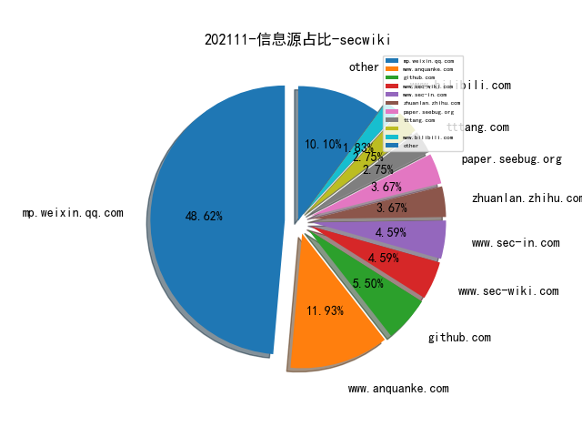
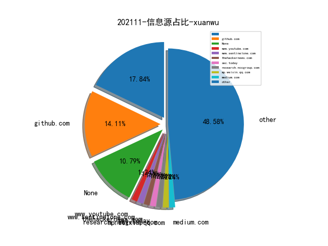
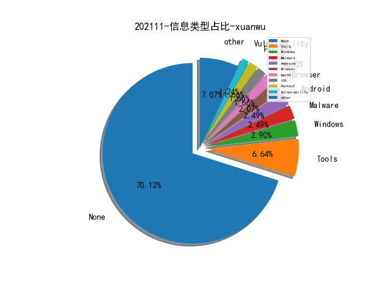

# [数据--所有](README_20.md)
# [数据--年度](README_2021.md)
# 202111 信息源与信息类型占比

# 微信公众号 推荐
| nickname_english | weixin_no | title | url| 
| --- | --- | --- | ---| 
| 鹏组安全 | Kris_Alex2 | 靶机实战-mysql数据库UDF提权 | https://mp.weixin.qq.com/s?__biz=Mzg5NDU3NDA3OQ==&mid=2247484831&idx=1&sn=d0324e3bcdcba1e898275fc98f465fc9 | 7| 
| 电子物证 | ewuzheng | 【RAID-5磁盘阵列】数据恢复 & 手动分析 | https://mp.weixin.qq.com/s?__biz=MzAwNDcwMDgzMA==&mid=2651040500&idx=1&sn=49260a32dd7007e558b3a9a451e61454 | 1| 
| 黑哥说安全 | gh_67cfd5e45750 | 【行为测绘应用实战】使用ZoomEye 一网打尽 Trickbot C2 | https://mp.weixin.qq.com/s/cCXt6FUEYGd6s9cg5VFN0Q | 2| 
| 青衣十三楼飞花堂 | gh_9feb5a276a2a | 用RPC/ALPC调试手段分析Win10 FQDN解析过程 | https://mp.weixin.qq.com/s?__biz=MzUzMjQyMDE3Ng==&mid=2247484933&idx=1&sn=307b70ee89a62b515693da9e57cdecfc | 3| 
| 金色钱江 | Golden-Qianjiang | GitLab未授权+恶意图片命令执行【复现】 | https://mp.weixin.qq.com/s?__biz=Mzg5NTY3NTMxMQ==&mid=2247483947&idx=1&sn=aceecfae514976fcc7933f8fd3fdd5a8 | 1| 
| 腾讯安全威胁情报中心 | gh_05a6c5ec3f78 | 腾讯云容器安全服务（TCSS）捕获利用GitLab ExifTool RCE漏洞在野攻击案例 | https://mp.weixin.qq.com/s?__biz=MzI5ODk3OTM1Ng==&mid=2247499680&idx=2&sn=ab0e5bc5405351fc37e296101e0a85ab | 3| 
| 渗透测试教程 | bzhack | 一些HW面试题记录 | https://mp.weixin.qq.com/s?__biz=MzI3OTIwNDkzNQ==&mid=2651836449&idx=1&sn=e21038587ff2653e04d59af4ad7167bd | 2| 
| 弥天安全实验室 | gh_41292c8e5379 | HVV之免证书劫持https流量 | https://mp.weixin.qq.com/s?__biz=MzU2NDgzOTQzNw==&mid=2247487933&idx=1&sn=464fbdd56a9cffbc6726f6bcecdeec2e | 1| 
| Ots安全 | AnQuan7 | 针对 AWS API Gateway 的 HTTP 标头走私攻击使系统暴露于缓存中毒 | https://mp.weixin.qq.com/s?__biz=MzAxMjYyMzkwOA==&mid=2247493449&idx=2&sn=3ac8693b38a3cbb01b3bd7a38e5cde13 | 4| 
| 黑白天实验室 | HBT-SEC | 针对哈萨克斯坦的基于多阶段 PowerShell 的攻击 | https://mp.weixin.qq.com/s?__biz=MzU4NTY4MDEzMw==&mid=2247491440&idx=1&sn=08242f020765ddadecdae07fccd6f5ea | 1| 
| 鸿鹄实验室 | gh_a2210090ba3f | 利用Com组件绕过UAC | https://mp.weixin.qq.com/s?__biz=MzU0MjUxNjgyOQ==&mid=2247489075&idx=1&sn=cb02c25c346f2e3e1a50a5edc8fcbf39 | 1| 
| 深信服千里目安全实验室 | Further_eye | 【漏洞通告】Hadoop Yarn RPC未授权访问漏洞 | https://mp.weixin.qq.com/s?__biz=MzI4NjE2NjgxMQ==&mid=2650257369&idx=1&sn=e1edd0b1c79dfc3f58acf05f681b71b2 | 3| 
| 星阑科技 | StarCrossCN | SonarQube被爆出现API未授权访问漏洞，大量用户数据存在泄露风险 | https://mp.weixin.qq.com/s?__biz=Mzg5NjEyMjA5OQ==&mid=2247490664&idx=1&sn=c8e81141a28227751db56cf05973472e | 2| 
| 无级安全 | wujisec | 老洞考古,CVE-2020-27986,POC | https://mp.weixin.qq.com/s?__biz=MzI0Nzc0NTcwOQ==&mid=2247485203&idx=1&sn=4cab8abe8191103fdaf627e8914cc33e | 2| 
| 我不是Hacker | gh_aaed037e2267 | 微软权限提升漏洞补丁绕过【附Poc】 | https://mp.weixin.qq.com/s?__biz=MzkwNDI1NDUwMQ==&mid=2247485117&idx=1&sn=2a77b7115d41021ae3625af56242ebc5 | 2| 
| 微步在线研究响应中心 | gh_c108d4d389bf | 警惕！GitLab 严重漏洞在野被广泛利用，企业需立即自查 | https://mp.weixin.qq.com/s?__biz=MzA5MDc1NDc1MQ==&mid=2247490555&idx=1&sn=f81f8ce2c7c52c528cf3b9b383f4d82a | 2| 
| 黑客技术与网络安全 | HackerCoder | 一个HTTP请求，把网站打裂开了！ | https://mp.weixin.qq.com/s?__biz=MzIyMDEzMTA2MQ==&mid=2651159601&idx=2&sn=4ceb26e13206a8b151868c1ea155b51c | 1| 
| 阿里云应急响应 | gh_12f3517e40de | 【漏洞预警】Hadoop Yarn RPC未授权访问漏洞 | https://mp.weixin.qq.com/s?__biz=MzI5MzY2MzM0Mw==&mid=2247486205&idx=1&sn=6e581f7f16eccfee3ae9420227c26ca6 | 1| 
| 阿里云安全 | aliyunsec | Hadoop Yarn RPC 0 Day在野利用分析与传播手段披露 | https://mp.weixin.qq.com/s?__biz=MzA4MTQ2MjI5OA==&mid=2664085773&idx=1&sn=ce93d6a25ec11b6c0fd564f8850025d3 | 1| 
| 谢公子学安全 | xie_sec | CobaltStrike流量特征分析 | https://mp.weixin.qq.com/s?__biz=MzI2NDQyNzg1OA==&mid=2247489784&idx=1&sn=de6ef4c6d73e2655e50f3ad40f7405c5 | 1| 
| 盛邦安全WebRAY | WebRay_weixin | 烽火狼烟丨Hadoop Yarn RPC未授权访问漏洞通告 | https://mp.weixin.qq.com/s?__biz=MzAwNTAxMjUwNw==&mid=2650268199&idx=1&sn=462f242e071a5fc71e3f37e8105e7f53 | 1| 
| 电驭叛客 | Cyber-Hack | API安全生命周期 | https://mp.weixin.qq.com/s/HKsc2EajaZTLPSnX2GqeKg | 1| 
| 奇安信 CERT | gh_64040028303e | 【安全风险通告】SonarQube远程信息泄露漏洞安全风险通告 | https://mp.weixin.qq.com/s?__biz=MzU5NDgxODU1MQ==&mid=2247494996&idx=1&sn=e33611d62e0f182e6aba9b2c62011c89 | 4| 
| 南街老友 | gh_f9a38b1d58f0 | 初尝蜜罐HFish-自定义蜜罐太香了 | https://mp.weixin.qq.com/s?__biz=MzA5OTA0MTU4Mg==&mid=2247485554&idx=2&sn=0245e1699e4d78cfd57316f4a9b4d9ee | 1| 
| 分布式实验室 | dockerone | 万字长文带你全面认识 Kubernetes 中如何实现蓝绿部署、金丝雀发布和滚动更新 | https://mp.weixin.qq.com/s?__biz=MzA5OTAyNzQ2OA==&mid=2649743681&idx=1&sn=242b11006b581dfe2aebb14827b131b6 | 1| 
| 云鼎实验室 | YunDingLab | 勒索软件即服务与IAB产业浅析 | https://mp.weixin.qq.com/s?__biz=MzU3ODAyMjg4OQ==&mid=2247491942&idx=1&sn=4d92d97dcc9edd6480f71ab227d51c3a | 1| 
| M78安全团队 | M78sec | 重生之我是赏金猎人(三)—逆向app破解数据包sign值实现任意数据重放添加 | https://mp.weixin.qq.com/s?__biz=Mzk0NDE4MzE5MA==&mid=2247486545&idx=1&sn=a7481e0aad826b5f77ba3b0a42c1aa51 | 1| 
| 98KSec | AKA-98KSec | 浅析利用Tomcat ApplicationFilterChain类实现半通用回显 | https://mp.weixin.qq.com/s?__biz=Mzk0MTIxNzAyNw==&mid=2247483975&idx=1&sn=4239cabdab207f5af994bc2605349861 | 1| 
| 5号黯区 | gh_b173573a25bb | 利用nim编写shellcode加载器bypass全家桶 | https://mp.weixin.qq.com/s?__biz=Mzg2NzIwMTM3NQ==&mid=2247484268&idx=1&sn=e4c12bf1a1c66cc8461c174c885a2c1b | 1| 
| 黑白之道 | i77169 | 干货｜常见端口渗透总结 | https://mp.weixin.qq.com/s?__biz=MzAxMjE3ODU3MQ==&mid=2650526777&idx=3&sn=0e3d2a25806d0603ae74e3400f703488 | 1| 
| 洋洋的小黑屋 | gh_20dd82f249d7 | Tomcat 内存马（一）Listener型 | https://mp.weixin.qq.com/s?__biz=MzkzOTI1NjI1MA==&mid=2247484688&idx=1&sn=b817c80f6f0c5fb800a864eb0e7ccb0d | 1| 
| XG小刚 | XG_WEB | Mysql注入-Bypass啊理芸 | https://mp.weixin.qq.com/s?__biz=MzIwOTMzMzY0Ng==&mid=2247486638&idx=1&sn=f02d59cae533fe8710f2e0a7e2268434 | 1| 
| 雷石安全实验室 | leishianquan1 | CTF真题之python3的沙箱逃逸 | https://mp.weixin.qq.com/s?__biz=MzI5MDE0MjQ1NQ==&mid=2247512866&idx=1&sn=e2d394e8a825d9b438292704be2c008d | 1| 
| 锦行信息安全 | jeeseensec | 技术分享 , 一次 springboot未授权到云主机接管 | https://mp.weixin.qq.com/s?__biz=MzIxNTQxMjQyNg==&mid=2247488360&idx=1&sn=3ed006f8e7862a2d0d144fb1600f7ebf | 1| 
| WiFi安全应急响应中心 | WiFiSRC | frida-进程注入和server dbus通讯架构分析 | https://mp.weixin.qq.com/s?__biz=MzI1NTY2MTkwNw==&mid=2247486554&idx=1&sn=c8f786553aaaa488a4dec3b7a5a8d3e8 | 1| 
| GobySec | gobysec | 还在手动收集资产？你比别人慢了一步 | https://mp.weixin.qq.com/s?__biz=MzI4MzcwNTAzOQ==&mid=2247509945&idx=1&sn=6a9a013fc8ff29dce7ff46c8ce0c8244 | 1| 
| Gcow安全团队 | Gcow666 | u200b某内网域渗透靶场的writeup | https://mp.weixin.qq.com/s?__biz=MzUyNzk2NDcwMw==&mid=2247487834&idx=1&sn=3fa2a0ef138da515994fbbb8b1c595f0 | 1| 
| 酒仙桥六号部队 | anfu-360 | Android应用攻与防 | https://mp.weixin.qq.com/s/qH6ksA03UcuwQgPHaNuBUg | 2| 
| 赛博回忆录 | cybermemory | 闲来无事，反制GOBY（补档&挂人） | https://mp.weixin.qq.com/s?__biz=MzIxNDAyNjQwNg==&mid=2456098656&idx=1&sn=3179fc5de75e6acac637044d99526d8c | 1| 
| 老刘说NLP | Laoliushuo_NLP | 情报技术：美国DARPA主导的智能化情报分析系列项目概览 | https://mp.weixin.qq.com/s/SERw3ORYBjwxOKcpNZBEGg | 1| 
| 网络侦查研究院 | PCpolicesir | 如何使用PS2EXE将PowerShell脚本编译为可执行程序 | https://mp.weixin.qq.com/s?__biz=MzIxOTM2MDYwNg==&mid=2247508108&idx=3&sn=1113e686ae1a16eb2a802da907d4bb69 | 6| 
| 安恒信息应急响应中心 | gh_1c2b41c1abc7 | VMware vCenter Server权限提升漏洞风险提示 | https://mp.weixin.qq.com/s?__biz=MzUzOTE2OTM5Mg==&mid=2247486640&idx=1&sn=e3df720546a4ff7c537b7cc6a8fe7b8a | 2| 
| Top security | Top_security | 红蓝对抗｜备战大型攻防演练 | https://mp.weixin.qq.com/s?__biz=Mzg3MDU0NjQyMg==&mid=2247487102&idx=1&sn=ffda6c98d01abf2027b702e627c305eb | 1| 
| LSCteam | gh_d97c073d1479 | 业务安全漏洞挖掘——身份认证安全 | https://mp.weixin.qq.com/s?__biz=MzUyMjAyODU1NA==&mid=2247489150&idx=1&sn=dd52a0dae6044d517adba9e47827d36c | 1| 
| 赵武的自留地 | gh_86033a4f818d | 网络安全技术人员如何避开内卷 | https://mp.weixin.qq.com/s/cXV1-YSqngXp332qopEZSw | 1| 
| 渊龙Sec安全团队 | Aabyss-Team | 简简单单实现免杀 | https://mp.weixin.qq.com/s?__biz=Mzg4NTY0MDg1Mg==&mid=2247483989&idx=1&sn=3d4fccd1945d4cf57102cad64aafe220 | 1| 
| 奇安信技术研究院 | jishuyanjiuyuan001 | 【年度报告连载五】电子邮件安全拓展协议现状 | https://mp.weixin.qq.com/s?__biz=Mzg4OTU4MjQ4Mg==&mid=2247485107&idx=1&sn=4d2fc77ec8d5936c9280320ed58ae453 | 1| 
| 关键基础设施安全应急响应中心 | CII-SRC | 微软警告： 钓鱼工具TodayZoo 被广泛用于证书窃取攻击 | https://mp.weixin.qq.com/s?__biz=MzkyMzAwMDEyNg==&mid=2247521996&idx=3&sn=0e3fab31170df80671b66c412630a9a6 | 3| 
| LemonSec | lemon-sec | 对Linux—suid提权的一些总结 | https://mp.weixin.qq.com/s?__biz=MzUyMTA0MjQ4NA==&mid=2247518206&idx=2&sn=4a0e656ad35aca2a918fd91fd7eb2426 | 6| 
| ChaMd5安全团队 | chamd5sec | 新·8220挖矿团伙样本分析报告 | https://mp.weixin.qq.com/s?__biz=MzIzMTc1MjExOQ==&mid=2247498625&idx=1&sn=c1ffa200545713c99d9a8d254c2875d3 | 1| 
| 默安逐日实验室 | gh_995a1a9f25b5 | 容器环境红队手法总结 | https://mp.weixin.qq.com/s?__biz=MzkxMjI3MDgwOA==&mid=2247483918&idx=1&sn=97ae72dc1fbabefb2b19355592ef5a6a | 1| 
| 黑云信息安全 | heiyunxinxi | 渗透攻击-红队-信息收集- | https://mp.weixin.qq.com/s?__biz=Mzg5OTYxMjk0Mw==&mid=2247485184&idx=1&sn=72d8f8dc73a07e409adf9024bdd21e7d | 1| 
| 米斯特安全团队 | acmesec | CaA - BurpSuite流量收集和分析插件 | https://mp.weixin.qq.com/s?__biz=MzU2NDc2NDYwMA==&mid=2247485313&idx=1&sn=99bc7a1bb0d24a2bb8d65b4ff2af1a99 | 1| 
| 玄魂工作室 | xuanhun521 | 移动端逆向教程1.2 安卓常用指令集 | https://mp.weixin.qq.com/s?__biz=MzA4NDk5NTYwNw==&mid=2651428893&idx=1&sn=d57f179dbf8caee2d19a76eb6cc1db91 | 1| 
| 渗透云笔记 | shentouyun | GOby服务器端配置 | https://mp.weixin.qq.com/s?__biz=MzU2NzkxMDUyNg==&mid=2247491229&idx=1&sn=64381662db29438a62724fa4b5d9881c | 1| 
| 互联网合规君 | gh_057ac073892c | 个保法生效后，各大平台“个人信息副本”的申请获取实践 | https://mp.weixin.qq.com/s/fsSHkumgON9DZe1awFTQ0g | 1| 
| Pai Sec Team | huahuaSec | 【HTB系列】BountyHunter | https://mp.weixin.qq.com/s?__biz=MzU3MTU3NDk4Mw==&mid=2247484891&idx=1&sn=baeeaa55c05aaa4a93ecbf129c22924c | 1| 
| NightTeam | locozhou | 小菜花的frida-svc-interceptor | https://mp.weixin.qq.com/s?__biz=Mzg5NzIyMzkzNw==&mid=2247485919&idx=1&sn=ca1402591c1d37c3dc7958a84e2146ea | 1| 
| HACK学习君 | XHacker1961 | 记一次曲折的WAF绕过 | https://mp.weixin.qq.com/s?__biz=MzIzNzMxMDkxNw==&mid=2247486085&idx=1&sn=570b3adf02278319757a76baa0e9342e | 1| 
| CNVD漏洞平台 | None | 关于SonarQube系统存在未授权访问漏洞的安全公告 | https://mp.weixin.qq.com/s?__biz=MzU3ODM2NTg2Mg==&mid=2247490778&idx=1&sn=4fef06e06bce01245e5f473c70e1b793 | 1| 
| 360威胁情报中心 | CoreSec360 | 多场景DoH/DoT配置指南 | https://mp.weixin.qq.com/s?__biz=MzUyMjk4NzExMA==&mid=2247488801&idx=1&sn=3f7c3ab522645a2f47f03d9eec27f2e7 | 1| 
| 锋刃科技 | ahfengren | 【漏洞情报】Linux Kernel TIPC远程代码执行漏洞（CVE-2021-43267） | https://mp.weixin.qq.com/s?__biz=MzUxMjc0MTE3Mw==&mid=2247486815&idx=1&sn=edcd196c775336892e13741a8fa80953 | 2| 
| 系统安全运维 | Taurus-1314147 | Windows 提权命令指南 | https://mp.weixin.qq.com/s?__biz=Mzk0NjE0NDc5OQ==&mid=2247493913&idx=2&sn=3664de61b8eebe71831158b04ef2083d | 16| 
| 知道创宇 | knownsec | 知道创宇云监测—ScanV MAX更新：Apache Spark、Gitlab GraphQL等多个漏洞可监测 | https://mp.weixin.qq.com/s?__biz=MjM5NzA3Nzg2MA==&mid=2649856251&idx=1&sn=0b6874bb84fea2250884b51fed7e6fdd | 3| 
| 看雪学苑 | ikanxue | 全网最详细CVE-2014-0502 Adobe Flash Player双重释放漏洞分析 | https://mp.weixin.qq.com/s?__biz=MjM5NTc2MDYxMw==&mid=2458402566&idx=1&sn=6a8289758711c348b36f8526808747c7 | 7| 
| 猪猪谈安全 | zzt-anquan | 干货 , 一篇文章带你深入理解漏洞之 XXE 漏洞 | https://mp.weixin.qq.com/s?__biz=MzIyMDAwMjkzNg==&mid=2247496638&idx=1&sn=7f16d3de5a533d15a7680e219eeab7a6 | 3| 
| 渗透攻击红队 | RedTeamHacker | 从外网 Weblogic 打进内网，再到约束委派接管域控 | https://mp.weixin.qq.com/s?__biz=MzkxNDEwMDA4Mw==&mid=2247488950&idx=1&sn=48d93f1fac38eae99cc4e78474eb557c | 1| 
| 掌控安全EDU | ZKAQEDU | 文库｜内网渗透之隧道传输技术 | https://mp.weixin.qq.com/s?__biz=MzUyODkwNDIyMg==&mid=2247519631&idx=1&sn=bf5acc4762db1c69e13c9db31bb3e55b | 1| 
| 我是安服 | scaf_0123 | 安服笔记：关于移动应用票据导致的信息泄露 | https://mp.weixin.qq.com/s?__biz=MzkzMzI3OTczNA==&mid=2247484149&idx=1&sn=89796bf56a3fe018a2f29ec850eceff1 | 1| 
| 广软NSDA安全团队 | gh_72de97d4e162 | 内网渗透初探 | https://mp.weixin.qq.com/s?__biz=MzUzMDg5NDQ0Nw==&mid=2247489476&idx=1&sn=a39eed3450e581385b862c09ae556f9f | 1| 
| 小黑的安全笔记 | x1a0heI | 云服务器ftp被动和主动模式都连接失败 | https://mp.weixin.qq.com/s?__biz=MzI4Njk5NjY4OQ==&mid=2247485823&idx=1&sn=43b52f2f7163fba10cf4ba466a3bac29 | 1| 
| 奇安信威胁情报中心 | gh_166784eae33e | APT活动中的Windows系统本地提权漏洞及技术分析 | https://mp.weixin.qq.com/s/6mT0O9eur5-VEs0rbV0-mg | 5| 
| 不懂安全的校长 | sectip | 内网渗透 , 1.内网基础知识 | https://mp.weixin.qq.com/s?__biz=MzkyMzI3OTY4Mg==&mid=2247484768&idx=1&sn=31012b5465686c5eaa96dad6f8f0bbfa | 3| 
| 三六零CERT | CERT-360 | CVE-2021-43267:Linux Kernel TIPC远程代码执行漏洞通告 | https://mp.weixin.qq.com/s?__biz=MzU5MjEzOTM3NA==&mid=2247490400&idx=2&sn=bba79003c867c6a443114d71c6ca96d8 | 5| 
| Linux学习 | LoveLinux1024 | Linux 服务器日常巡检脚本分享 | https://mp.weixin.qq.com/s?__biz=MzI4MDEwNzAzNg==&mid=2649455213&idx=2&sn=93ed9b2bdf233bf7a76bd4599e83a2f7 | 2| 
| Hacking黑白红 | Hacking012 | 【渗透实战系列】,35-旁站信息泄露的dedecms站点渗透 | https://mp.weixin.qq.com/s?__biz=Mzg2NDYwMDA1NA==&mid=2247502760&idx=2&sn=32c3aac95cc15c84c42b071425d19f91 | 2| 
| 看雪学院 | ikanxue | 基于linker实现so加壳补充-------从dex中加载so | https://mp.weixin.qq.com/s?__biz=MjM5NTc2MDYxMw==&mid=2458402519&idx=1&sn=a42e81b669d38f9ff8ed1a8d941b3f2f | 1| 
| 哈拉少安全小队 | gh_b273ce95df95 | 【反序列化利用链通用思路】OkayCMS&Smarty反序列化利用链详细分析 | https://mp.weixin.qq.com/s?__biz=MzAxNzkyOTgxMw==&mid=2247487771&idx=1&sn=8f9a417964064fc54c50d55b111091be | 2| 
| 安全初心 | securityheart | 工具 , \nVMInjector绕过虚拟机登录验证屏幕的工具 | https://mp.weixin.qq.com/s?__biz=MzU4NzU4MDg0Mw==&mid=2247486724&idx=1&sn=4586b52a037ae8fa5ea3f6c90bf78eed | 2| 
| 邑安全 | EansecD | PurpleFox 添加了使用 WebSockets 的新后门 | https://mp.weixin.qq.com/s?__biz=MzUyMzczNzUyNQ==&mid=2247509027&idx=2&sn=8877ebc44f5371a55227dd6ab44a1f4e | 13| 
| 胖猴实验室 | gh_1623eeae8094 | 天府杯华硕会战的围剿与反围剿 | https://mp.weixin.qq.com/s/k1ouK1Gyxpped0ZK4H4h7g | 1| 
| 电子与信息学报 | dzyxxxb | Top100密码学经典论文大盘点 | https://mp.weixin.qq.com/s/iZ7X9bC4yRutkYWiCxuApQ | 1| 
| CodeWisdom | gh_2395906a410f | 技术分享｜基于优化搜索的API序列推荐 | https://mp.weixin.qq.com/s/jbR2nfIGcAjRS-dceTag8Q | 1| 
| 雷神众测 | bounty_team | Mobsf_MAC_AVD_Android动静态环境搭建排坑实战 | https://mp.weixin.qq.com/s?__biz=MzI0NzEwOTM0MA==&mid=2652494861&idx=1&sn=cd3f7d2cd6b44019374f83b27d65b219 | 3| 
| 进德修业行道 | gh_ad128618f5e9 | xss挑战之旅 | https://mp.weixin.qq.com/s?__biz=Mzg5NTU2NjA1Mw==&mid=2247486229&idx=1&sn=c3af95ec1dcfa4dc2f53d20326a5c639 | 1| 
| 贝塔安全实验室 | BetaSecLab | 应急靶场 , 流量分析与溯源 | https://mp.weixin.qq.com/s?__biz=Mzg4MzA4Nzg4Ng==&mid=2247494569&idx=1&sn=b9848f152c09170331c68b4bfbefbc09 | 1| 
| 蛇矛实验室 | gh_2c0238928f82 | 记一次靶场多域场景搭建过程(下) | https://mp.weixin.qq.com/s?__biz=MzkwMjI1NzY4Ng==&mid=2247497247&idx=1&sn=05b4691be503ae8e2c03370420aa8054 | 3| 
| 网络安全应急技术国家工程实验室 | NELCERT | 原创 , CVE-2021-35052：WinRAR远程代码执行漏洞分析 | https://mp.weixin.qq.com/s?__biz=MzUzNDYxOTA1NA==&mid=2247522429&idx=1&sn=66e0ee90cbb3acfc5d73fcd2ed646bb0 | 1| 
| 维他命安全 | VitaminSecurity | Kaspersky：2021年第三季度APT趋势报告 | https://mp.weixin.qq.com/s?__biz=MzUxMDQzNTMyNg==&mid=2247497329&idx=4&sn=59398eae7413bf53354637d4214e320a | 5| 
| 盘古石取证 | Panguite_CN | 基于web日志的溯源 | https://mp.weixin.qq.com/s?__biz=Mzg3MjE1NjQ0NA==&mid=2247491660&idx=1&sn=abe114ae2d012b570a7b7d26534de400 | 1| 
| 火线Zone | huoxian_zone | 常见Android组件/控件漏洞 | https://mp.weixin.qq.com/s?__biz=MzI2NDQ5NTQzOQ==&mid=2247489647&idx=1&sn=2759a30b6777c7a876ef13e72eaaebfc | 2| 
| 潇湘信安 | xxxasec | 记一次SSRF+HFS命令执行回显相关研究 | https://mp.weixin.qq.com/s?__biz=Mzg4NTUwMzM1Ng==&mid=2247492576&idx=1&sn=976bd65bfa66824ccfa2eddd4f70ec2a | 8| 
| 安全客 | anquanbobao | 【技术分享】剖析脏牛4_madvise()与漏洞成因 | https://mp.weixin.qq.com/s?__biz=MzA5ODA0NDE2MA==&mid=2649756378&idx=2&sn=aeda5f3deedf8d45f42227827a831bf7 | 8| 
| 利刃信安 | LRXAEGZ | Mac Nessus 10.0.0 | https://mp.weixin.qq.com/s?__biz=MzU1Mjk3MDY1OA==&mid=2247493357&idx=1&sn=0b874172955fd93014a647199b12d71b | 2| 
| 互联网安全内参 | anquanneican | 警惕：GitLab RCE漏洞 (CVE-2021-22205) 已被广泛利用 | https://mp.weixin.qq.com/s?__biz=MzI4NDY2MDMwMw==&mid=2247500089&idx=3&sn=3c3184baa420ef76c5bab547c905f3bf | 1| 
| 8ypass | sec_in_guangdong | codeql学习笔记1 | https://mp.weixin.qq.com/s?__biz=MzI0NDM5OTYxNg==&mid=2247484470&idx=1&sn=5d44f38fed0c78af9882cfa38262a059 | 1| 
| 腾讯安全应急响应中心 | tsrc_team | 云原生安全攻防｜使用eBPF逃逸容器技术分析与实践 | https://mp.weixin.qq.com/s?__biz=MjM5NzE1NjA0MQ==&mid=2651205381&idx=1&sn=b7771a54e8b01cb6e7201a0ce4784e62 | 1| 
| 红队防线 | klionsec | 一文读懂Kerberos认证流程 | https://mp.weixin.qq.com/s?__biz=MzI0OTkzOTc2Nw==&mid=2247484879&idx=1&sn=bb0e0a65fb3f92141563d9d496ba82c3 | 1| 
| 安世加 | asjeiss | 技术干货 , linux常见backdoor及排查技术 | https://mp.weixin.qq.com/s?__biz=MzU2MTQwMzMxNA==&mid=2247512162&idx=2&sn=941cd451c83885f7dc171595720bcd42 | 1| 
| 合天网安实验室 | hee_tian | 从一道CTF题到HTTP请求走私攻击 | https://mp.weixin.qq.com/s?__biz=MjM5MTYxNjQxOA==&mid=2652882427&idx=1&sn=86d178c9fbf3076adc0466943c8752dc | 4| 
| 军机故阁 | gh_e57baf46bdf5 | 入侵案例分析 | https://mp.weixin.qq.com/s?__biz=MzU5Mjk3MDA5Ng==&mid=2247483917&idx=1&sn=754ca2901e5ed22e93ee95db1c5e762c | 1| 
| 亿人安全 | Yr-Sec | XSS编码浅析 | https://mp.weixin.qq.com/s?__biz=Mzk0MTIzNTgzMQ==&mid=2247487352&idx=1&sn=578780a714e731392032909e11943bf8 | 3| 
| V安全资讯 | v-safe-cn | xhCMS代码审计思路 | https://mp.weixin.qq.com/s?__biz=MzI4MDQ1MzQ0NA==&mid=2247488367&idx=2&sn=c94d1290712dbab20b77e19bf960df78 | 2| 
| TeamsSix | teamssix-com | 代码审计 , Maven 基础知识 | https://mp.weixin.qq.com/s?__biz=MzI5Mzk5NTIwMg==&mid=2247486500&idx=1&sn=a9e87893056ee6b6513dd4f9db076a0a | 2| 
| SecIN技术平台 | sec-in | 原创 , java安全-java RMI | https://mp.weixin.qq.com/s?__biz=MzI4Mzc0MTI0Mw==&mid=2247491656&idx=1&sn=35e4c98ba7c5d3705a23589c3c647a1c | 1| 
| HACK学习呀 | Hacker1961X | 实战 , SRC信息收集思路总结 | https://mp.weixin.qq.com/s?__biz=MzI5MDU1NDk2MA==&mid=2247501144&idx=1&sn=62687584927c415941d674fd6642e706 | 8| 
| Docker中文社区 | dockerchina | 3 种姿势轻松采集 Nginx 日志 | https://mp.weixin.qq.com/s?__biz=MzI1NzI5NDM4Mw==&mid=2247488172&idx=1&sn=963578a287d536b072f77d20eaeb2e0c | 1| 
| Bypass | Bypass-- | Splunk系列：Splunk安装部署篇（一） | https://mp.weixin.qq.com/s?__biz=MzA3NzE2MjgwMg==&mid=2448907552&idx=1&sn=69de936e93e072e6f4b21c67ce5db34f | 1| 
| 骨哥说事 | guge_guge | 一键自动部署渗透工具 | https://mp.weixin.qq.com/s?__biz=MjM5Mzc4MzUzMQ==&mid=2650254865&idx=1&sn=2e0ebaa04cf3b24b957167394e27c69f | 2| 
| 补天平台 | Patchingthesky | 个人总结：使用测绘平台搜目标资产的万能招式 | https://mp.weixin.qq.com/s?__biz=MzI2NzY5MDI3NQ==&mid=2247492220&idx=1&sn=9f7c7dfb6c107b21986f9aea5b5e049d | 1| 
| 橘猫学安全 | gh_af700ee13397 | 干货,横向移动与域控权限维持方法总汇 | https://mp.weixin.qq.com/s?__biz=Mzg5OTY2NjUxMw==&mid=2247485216&idx=1&sn=522ee3b72a1faf34dd3de27f7038dc99 | 6| 
| 墨雪飘影 | SG-CXZ | 免扫码登录腾讯企业邮箱 | https://mp.weixin.qq.com/s?__biz=MzI3NzI4OTkyNw==&mid=2247487677&idx=1&sn=541d15351c374601f79edbe0d3ce9e59 | 1| 
| HACK之道 | hacklearn | 干货,常见6种WAF绕过和防护原理 | https://mp.weixin.qq.com/s?__biz=MzIwMzIyMjYzNA==&mid=2247496452&idx=1&sn=e528b06e502782e9a23895fc56a85f34 | 1| 
| 黑鸟 | blackorbird | 航空产业已成境外情报机构重点网络攻击目标 | https://mp.weixin.qq.com/s/ANDLQBHTzB2uiS54xxyuZw | 2| 
| 释然IT杂谈 | ShiRan_IT | 【干货】思科ASA防火墙上配置透明模式的Failover Active/Acitve | https://mp.weixin.qq.com/s?__biz=MzIxMTEyOTM2Ng==&mid=2247496118&idx=1&sn=f7f9578890d3769c8188719cf6f4ade2 | 3| 
| 虎符智库 | TT_Thinktank | 起底国家级APT组织：蔓灵花（APT-Q-37） | https://mp.weixin.qq.com/s?__biz=MzIwNjYwMTMyNQ==&mid=2247486683&idx=1&sn=440e2c04f077a2465cbac4c00b09ce60 | 2| 
| 网安国际 | inforsec | 2021年网络安全领域四大顶会中国学者发表论文88篇（附目录） | https://mp.weixin.qq.com/s/igXuvxBdVZpM9fkAxnkJ5g | 1| 
| 科技锐新 | qimingyu_java | 一文彻底搞懂Spark | https://mp.weixin.qq.com/s/Uc-EaqL4Q9HchOH3JNQ53A | 1| 
| 祺印说信安 | qiyinshuoxinan | 打印机可能是“间谍”？ 7 种方法防住它“被策反” | https://mp.weixin.qq.com/s?__biz=MzA5MzU5MzQzMA==&mid=2652090643&idx=3&sn=c142700c7ba8828592ed71c2dbb9327b | 1| 
| 石头安全 | gh_bdb076c55582 | WriteUP-6days_lab 靶机 | https://mp.weixin.qq.com/s?__biz=MzkxNTIxOTkzMQ==&mid=2247484327&idx=1&sn=bf8abff5cee1083527869e5ebcc747bc | 1| 
| 盾山实验室 | DunShanRR | ImHex：十六进制编辑器 | https://mp.weixin.qq.com/s?__biz=MzkzMjIwMDY4Nw==&mid=2247485688&idx=1&sn=486c37df65b6479bc9f5e8735039d002 | 4| 
| 疯猫网络 | iloscat | 内网渗透之横向移动—票据传递攻击研究 | https://mp.weixin.qq.com/s?__biz=MzIyMzE5NTQ3Ng==&mid=2650621978&idx=1&sn=f81afa298a18910f8989b8fbf0f10df7 | 11| 
| 灼剑安全团队 | Tsojan | 漏洞复现｜Struts2系列漏洞复现总结 | https://mp.weixin.qq.com/s?__biz=Mzg5OTY1ODMxMg==&mid=2247488794&idx=1&sn=50b2dfda6cac8ae20b0050f99207a207 | 7| 
| 渗透Xiao白帽 | SuPejkj | 【移动安全】Android App—HTTPS证书校验绕过 | https://mp.weixin.qq.com/s?__biz=MzI1NTM4ODIxMw==&mid=2247490402&idx=1&sn=fb65c5e0df9b962f133b492cc05292f9 | 7| 
| 开源聚合网络空间安全研究院 | OSPtech_Cyberspace | 【挖金宝典】SRC信息收集思路分享 | https://mp.weixin.qq.com/s?__biz=MzI4NTE4NDAyNA==&mid=2650390038&idx=1&sn=91b2fae4b2bf29ec89a865fdd6766916 | 1| 
| 平安集团安全应急响应中心 | PSRC_Team | Nexus Repository Manager历史表达式注入漏洞分析 | https://mp.weixin.qq.com/s?__biz=MzIzODAwMTYxNQ==&mid=2652140927&idx=1&sn=9a6fe102df545083af8516b69931685c | 1| 
| 宸极实验室 | ChenJiLab | 『靶场』hackthebox 之 love 靶场实战 | https://mp.weixin.qq.com/s?__biz=Mzg4NTA0MzgxNQ==&mid=2247485171&idx=1&sn=9e60e0c5bfbe144b6119d288621e6248 | 2| 
| 安恒威胁情报中心 | None | 安恒威胁情报中心又又又捕获到在野windows内核1day啦！ | https://mp.weixin.qq.com/s?__biz=MzI1MDU5NjYwNg==&mid=2247492514&idx=1&sn=4d2903dc6f5b71a81344df7b7768fe25 | 3| 
| 安全宇宙 | knownsec818 | 【创宇小课堂】渗透测试-移动端各种方式抓包 | https://mp.weixin.qq.com/s?__biz=MzAxMDc5NzYwNQ==&mid=2652409428&idx=1&sn=8dd83d91f389d463897ebc6ebd27ce9c | 3| 
| 安全学术圈 | secquan | TrustCom会议小记 | https://mp.weixin.qq.com/s/itQMU8HwacjfMsI9cFF6VA | 6| 
| 威胁棱镜 | THREAT_PRISM | 破解版密钥相同，部分CobaltStrike加密流量可解 | https://mp.weixin.qq.com/s/AcIFSjyqn9gzyRkyx3sRIQ | 9| 
| 嘶吼专业版 | Pro4hou | Windows 0 day漏洞影响所有Windows版本 | https://mp.weixin.qq.com/s?__biz=MzI0MDY1MDU4MQ==&mid=2247530978&idx=2&sn=4b867ec41babda4f35cb49ef4acbd517 | 16| 
| 可信系统安全实验室 | gh_296c8139d7e6 | 【11月3讲座回顾】 Building a Secure Open-Source Operating-System Kernel | https://mp.weixin.qq.com/s/UpB07tQxK5vvYl1alSQY3A | 1| 
| 代码卫士 | codesafe | 苹果新漏洞 “Shrootless” 可使攻击者在macOS 系统上安装后门 | https://mp.weixin.qq.com/s?__biz=MzI2NTg4OTc5Nw==&mid=2247508847&idx=1&sn=dbe1ae6473c7b27b86e378fed65af24d | 3| 
| 乌雲安全 | hackctf | 实战,利用SCF文件攻击进行渗透实战 | https://mp.weixin.qq.com/s?__biz=MzAwMjA5OTY5Ng==&mid=2247499586&idx=1&sn=cf4db3553c243c50a465d1f3e901d75c | 6| 
| web安全工具库 | websec-tools | 信息收集 -- JBoss架构 | https://mp.weixin.qq.com/s?__biz=MzI4MDQ5MjY1Mg==&mid=2247491048&idx=1&sn=e7082350dd3803f8f7fbe44ec9fb7b9c | 3| 
| bgbing安全 | bgbingsec | GitLab 未授权rce（反弹shell）CVE-2021-22205 | https://mp.weixin.qq.com/s?__biz=MzkwNzEzMTg3MQ==&mid=2247484883&idx=1&sn=261e8eedf5ab6663f8f8f332008cfa77 | 1| 
| RedCode Team | RedCodetm | 审计｜通读审计之HDWIKI（附原创漏洞）上篇 | https://mp.weixin.qq.com/s?__biz=Mzg5MjY3MTk2Mw==&mid=2247484458&idx=1&sn=c18f7cd8be0798891d6143c957c54a8a | 6| 
| Linux中国 | linux-cn | 如何在 Linux 上杀死一个僵尸进程 , Linux 中国 | https://mp.weixin.qq.com/s?__biz=MjM5NjQ4MjYwMQ==&mid=2664643220&idx=1&sn=2eb3afc1070c19eb1a591a7427250ce8 | 3| 
| Khan安全攻防实验室 | KhanCJSH | 利用PingTunnel上线cobalt strike | https://mp.weixin.qq.com/s?__biz=MzAwMjQ2NTQ4Mg==&mid=2247487911&idx=1&sn=f1d417ca3422da17a8ced173eca3af13 | 1| 
| GoCN | golangchina | 『每周译Go』定位并修复 Go 中的内存泄漏 | https://mp.weixin.qq.com/s?__biz=MzA4ODg0NDkzOA==&mid=2247493669&idx=1&sn=2208d2af6a4b93cfc333fb2d2adcbedf | 1| 
| Gamma实验室 | HackerLearning | 红队攻击-绕过waf以及IDS等流量设备 | https://mp.weixin.qq.com/s?__biz=Mzg2NjQ2NzU3Ng==&mid=2247489039&idx=1&sn=4953b3f8dc6a316f95f07c5e997052a8 | 2| 
| FreeBuf | freebuf | 如何使用EDD枚举域数据 | https://mp.weixin.qq.com/s?__biz=MjM5NjA0NjgyMA==&mid=2651146454&idx=4&sn=28a1affe7d6eba5f8c808a205be23973 | 11| 

# 组织github账号 推荐
| github_id | title | url | org_url | org_profile | org_geo | org_repositories | org_people | org_projects | repo_lang | repo_star | repo_forks| 
| --- | --- | --- | --- | --- | --- | --- | --- | --- | --- | --- | ---| 

# 私人github账号 推荐
| github_id | title | url | p_url | p_profile | p_loc | p_company | p_repositories | p_projects | p_stars | p_followers | p_following | repo_lang | repo_star | repo_forks | 
| --- | --- | --- | --- | --- | --- | --- | --- | --- | --- | --- | --- | --- | --- | ---| 
| spring2go | 一份硬核(hardcore)计算机科学CS自学计划 | https://github.com/spring2go/cs_study_plan | None | None | None | None | 0 | 0 | 0 | 0 | 0 | None | 0 | 0 | 1| 
| r0eXpeR | 主流供应商的一些攻击性漏洞汇总 . | https://github.com/r0eXpeR/supplier | https://github.com/r0eXpeR?tab=followers | <scritp>alera(/xs‘/)</scritp> | China,ShangHai | None | 20 | 0 | 0 | 0 | 0 | Ruby | 0 | 0 | 1| 
| RASSec | WebExp: 2020年~2021年 网站CMS、中间件、框架系统漏洞集合 | https://github.com/RASSec/WebExp | https://github.com/RASSec?tab=followers | Bug Bounty Hunter | Beijing | None | 667 | 0 | 0 | 0 | 0 | C,Java,Classic,Python,JavaScript,C++,HTML,Go,PHP,Ruby | 0 | 0 | 1| 
| EmYiQing | CodeInspector: Java 可控参数分析和数据流跟踪分析 | https://github.com/EmYiQing/CodeInspector | None | None | None | None | 0 | 0 | 0 | 0 | 0 | None | 0 | 0 | 1| 
| 0e0w | 深入理解Java代码审计 | https://github.com/0e0w/HackJava | https://github.com/0e0w?tab=followers | 0 error(s),0 warning(s). | Hohhot | China | 60 | 0 | 0 | 0 | 0 |  | 0 | 0 | 1| 

# medium_xuanwu 推荐
| title | url| 
| --- | ---| 
| 利用 Python Selenium 绕过 Google 的 reCaptcha V3 的验证码 | http://medium.com/analytics-vidhya/how-to-bypass-recaptcha-v3-with-selenium-python-7e71c1b680fc| 
| 利用静态代码分析工具（SAST）的漏洞实现 RCE | http://medium.com/cider-sec/malicious-code-analysis-abusing-sast-mis-configurations-to-hack-ci-systems-13d5c1b37ffe| 

# medium_secwiki 推荐
| title | url| 
| --- | ---| 

# zhihu_xuanwu 推荐
| title | url| 
| --- | ---| 

# zhihu_secwiki 推荐
| title | url| 
| --- | ---| 
| 学习和使用知识图谱需要知道的一些事情 | https://zhuanlan.zhihu.com/p/433073550| 

# xz_xuanwu 推荐
| title | url| 
| --- | ---| 

# xz_secwiki 推荐
| title | url| 
| --- | ---| 

# 日更新程序
`python update_daily.py`