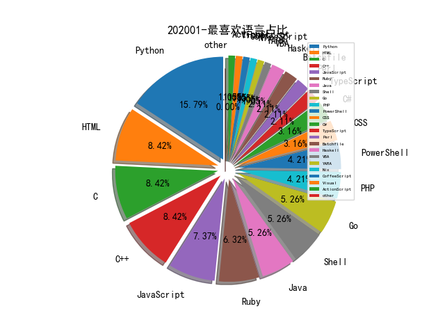

# [数据年报](README_YEAR.md)
# [数据月报-12月](README_12.md)
# [数据月报-11月](README_11.md)
# [数据月报-10月](README_10.md)
# [数据月报-9月](README_9.md)
# [数据月报-8月](README_8.md)
# [数据月报-7月](README_7.md)
# [数据月报-6月](README_6.md)
# [数据月报-5月](README_5.md)
# [数据月报-4月](README_4.md)
# [数据月报-3月](README_3.md)
# 202001 信息源与信息类型占比

# 微信公众号 推荐
| nickname_english | weixin_no | title | url| 
| --- | --- | --- | ---| 
| 君哥的体历 | jungedetili | 2020安全工作展望 | https://mp.weixin.qq.com/s/mihqZ0BJAgee1bEm1ZJAQw | 1| 
| 安全学术圈 | secquan | 安全学术圈2019年度总结 | https://mp.weixin.qq.com/s/VrrQCLOfthxNTFhEqdT3xA | 1| 
| 维他命安全 | VitaminSecurity | 维他命2019大盘点之安全事件/漏洞篇 | https://mp.weixin.qq.com/s/AsVZawBtipQzSdgJHt7eiw | 1| 

# 组织github账号 推荐
| github_id | title | url | org_url | org_profile | org_geo | org_repositories | org_people | org_projects | repo_lang | repo_star | repo_forks| 
| --- | --- | --- | --- | --- | --- | --- | --- | --- | --- | --- | ---| 

# 私人github账号 推荐
| github_id | title | url | p_url | p_profile | p_loc | p_company | p_repositories | p_projects | p_stars | p_followers | p_following | repo_lang | repo_star | repo_forks | 
| --- | --- | --- | --- | --- | --- | --- | --- | --- | --- | --- | --- | --- | --- | ---| 

# 日更新程序
`python update_daily.py`