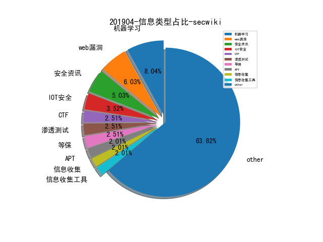

# [数据年报](README_YEAR.md)
# 201904 信息源与信息类型占比

# 微信公众号 推荐
| nickname_english | weixin_no | url | title| 
| --- | --- | --- | ---| 
| TideSec安全团队 | TideSec | https://mp.weixin.qq.com/s/SnYoJlCpJDU4sqo3T4Q8EA | 一个XSS挖矿马的曲折历程 | 5| 

# 组织github账号 推荐
| github_id | title | url | org_url | org_profile | org_geo | org_repositories | org_people | org_projects | repo_lang | repo_star | repo_forks| 
| --- | --- | --- | --- | --- | --- | --- | --- | --- | --- | --- | ---| 
| REhints | 从 UEFI 固件攻击硬件可信任架构(HROT) ，来自 offensive 2019 大会 | https://github.com/REhints/Publications/blob/master/Conferences/Bypassing%20Hardware%20Root%20of%20Trust/offcon2019_final.pdf | http://REhints.com |  | http://REhints.com | 10 | 2 | 0 | Python,C,Assembly,CSS,C++ | 1200 | 249 | 1| 

# 私人github账号 推荐
| github_id | title | url | p_url | p_profile | p_loc | p_company | p_repositories | p_projects | p_stars | p_followers | p_following | repo_lang | repo_star | repo_forks | 
| --- | --- | --- | --- | --- | --- | --- | --- | --- | --- | --- | --- | --- | --- | ---| 
| taviso | swisstable - 访问 Abseil Swiss Tables 的小型 C 封装库 | https://github.com/taviso/swisstable | None |  | None | None | 11 | 0 | 9 | 1100 | 1 | C | 2600 | 193 | 1| 
| zer0yu | 网络空间安全的RSS订阅 | https://github.com/zer0yu/CyberSecurityRSS | http://zeroyu.xyz/ | Every light needs a shadow. You just have to learn how to control it,use it when you need it. | None | None | 28 | 0 | 1900 | 162 | 1100 | Python,C,CSS | 44 | 16 | 1| 
| Mattiwatti | EfiGuard - x64 UEFI bootkit，在启动时修补 Windows 启动管理器以禁用 PatchGuard 和驱动程序签名验证(DSE) | https://github.com/Mattiwatti/EfiGuard | None |  | The Netherlands | None | 19 | 0 | 13 | 87 | 3 | C,Assembly,C++ | 227 | 61 | 1| 

# 日更新程序
`python update_daily.py`