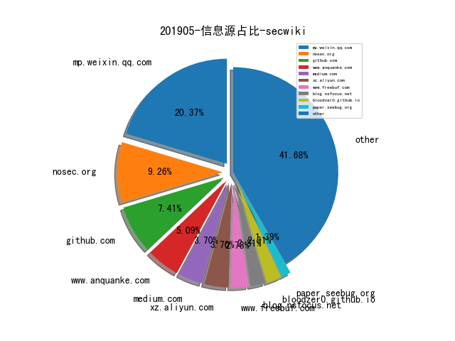
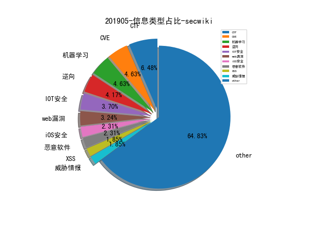

# [数据年报](README_YEAR.md)
# [数据月报-3月](README_3.md)
# 201905 信息源与信息类型占比

# 微信公众号 推荐
| nickname_english | weixin_no | url | title| 
| --- | --- | --- | ---| 

# 组织github账号 推荐
| github_id | title | url | org_url | org_profile | org_geo | org_repositories | org_people | org_projects | repo_lang | repo_star | repo_forks| 
| --- | --- | --- | --- | --- | --- | --- | --- | --- | --- | --- | ---| 

# 私人github账号 推荐
| github_id | title | url | p_url | p_profile | p_loc | p_company | p_repositories | p_projects | p_stars | p_followers | p_following | repo_lang | repo_star | repo_forks | 
| --- | --- | --- | --- | --- | --- | --- | --- | --- | --- | --- | --- | --- | --- | ---| 

# 日更新程序
`python update_daily.py`