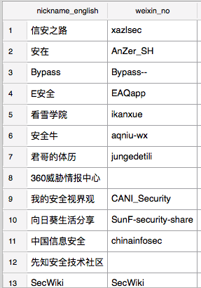

# 爬取secwiki和xuanwu.github.io,分析安全信息站点、安全趋势、安全工作者账号(twitter,weixin,github等)

## 文章DB
[文章DB](data/scrap.db)

## 信息源网站推荐

### secwiki信息源TOPN

> 2014, 国内安全媒体三巨头乌云，freebuf与91ri，博客形式媒体达到顶峰，论坛式媒体开始没落 

> 2015, 国内安全媒体绿盟、安全牛、安全村开始挤进前十，企鹅公众号推出，PC时代的博客媒体开始受到冲击

> 2016, 国内安全媒体猫头鹰挤进前十，企鹅公众号名列前三，知乎专栏也开始冒头，知识付费年代开始

> 2017, 国内安全媒体嘶吼、i春秋、阿里先知论坛、知道创宇paper、360播报陆续出现，安全媒体百花齐放，企鹅公众号取得魁首，知识付费火热

> 2018, 国内安全媒体安全客、白帽子nosec冒头, 企鹅公众号的份额已达到所有安全媒体的总合，知识付费持续火热

> 2019, 还只有短暂的2个月，高质量知识付费媒体medium出现，PC博客是否会在知识付费冲击下成为小众的沟通渠道呢

### xuanwu信息源TOPN

> 如果说secwiki走的平民资讯风(风雨无阻日更)，xuanwu走的就是个人fan qiang 挖洞风（上班更）

> 2016, twitter和github是主要安全工具和漏洞获得源，专属漏洞主要关注chromium、大型安全会议blackhat关注，配套的会议视频托管youtube，ppt托管slideshare也要关注，老牌安全厂商趋势科技、fireeye不拉下，安全资讯主要来自threatpost、seclists、securityaffairs

> 2017, meidum挤进前十，比secwiki早了2年，其他无明显变化

> 2018, twitter虽然一直名列前三（但比例一直在下降，由11.03到7.79到3.66), 漏洞获取源exploit-db的关注比例扩大，开始增加对论文网站arxiv.org与威胁情报厂商talosintelligence的关注

### 安全实验室站点推荐

`select domain,domain_name,count(url) as c from secwiki_detail  where domain_name like '%实验%' or domain_name like '%Lab%' group by domain order by c desc`

`select domain,domain_name,count(url) as c from xuanwu_detail  where domain_name like '%实验%' or domain_name like '%Lab%' group by domain order by c desc`

## 微信公众号推荐

### topn公众号

`select nickname_english,weixin_no,count(url) as c from weixin  where nickname_english != "" group by nickname_english order by  c desc`

### 机器学习公众号

`select nickname_english,weixin_no,weixin_subject ,count(url) as c from weixin where nickname_english != "" and tag='数据挖掘'  group by nickname_english order by c desc`

## twitter推荐

### topn twitter

`select twitter_account,profile_header,profile_header_loc,profile_header_url ,count(url) as c from twitter group by twitter_account order by c desc `

### 安全分析twitter

`select twitter_account,profile_header,profile_header_loc,profile_header_url ,tag,title,count(url) as c from twitter 
where tag like 'Thre%' or tag like '%Machine%'  or tag like '%forensics%' or tag like '%MalwareAnalysis%'
group by twitter_account order by c desc`

### 账号自动关注
[twitter-follow-bot](https://github.com/paulfurley/twitter-follow-bot)

## github推荐

### 组织topn github

`select github_id,org_repositories,org_people,org_projects,org_lang,org_url,org_profile,org_geo,repo_lang,repo_star,repo_forks,count(*) as c 
 from github  
 where github_type=1 
 group by github_id 
 order by c desc,org_repositories desc,org_projects desc `

### 私人topn

`select github_id,p_stars,p_repositories,p_followers,p_following,p_projects,repo_star,repo_forks ,repo_lang, p_profile,p_url,p_company,p_loc,count(*) as c from github  where github_type=0 group by github_id order by c desc , p_followers desc` 

### 账号自动关注

[github-follow-bot](https://github.com/andrewsyc/github-follow-bot)

## 技术趋势

### secwiki技术TOPN

> web安全、漏洞分析、恶意分析、运维安全占据技术文章的50%，挖洞渗透是安全的主旋律

> 移动安全、设备安全等iot安全研究领域在很缓慢的发展中

> 取证分析与数据挖掘技能越来越被人重视

### xuanwu技术TOPN

> 实验室以挖洞为主，特别关注windows浏览器的漏洞 

> 安全分析能力（取证分析、情报分析）是实验室从业人员的必备能力 

> github上挖安全工具也是实验室从业人员的必备能力

### 安全人员最爱用的编程语言

> python 毫无悬念的位居榜首，go 正在大规模流行中，PowerShell windows渗透最爱，Rust号称最安全的语言，JavaJupyter、Scala由于数据分析而崛起

[所有语言](data/github_lang.txt)

> 安全人员特有的小众语言，例如bro、YARA

# 总结

> 与国内安全媒体的日新月异，国外的安全媒体都历史悠久。

> 国内偏休闲，国外偏硬核。其实整个互联网画风，国内都是消遣为主，并且随着移动化会越来越娱乐。

> 互联网巨头以企鹅为代表的已经开始陆续进行流量封锁了，对信息搜索较为敏感的安全从业人员首当其冲
. 大家都在抱怨爬不到了. api又有限，只能上升到app hook了

> 技术上数据挖掘、威胁情报、安全分析的比重越来越重，AI已经不仅仅是噱头了

> 身边越来越多的大佬转向了业务安全、数据安全、广义舆情安全, 虽然本次爬取并没有体现到，但我相信后面会越来越多这些方面的资讯

# ToDo

- [ ] github探宝

- [ ] medium账号提取

- [ ] 微信自动关注 

