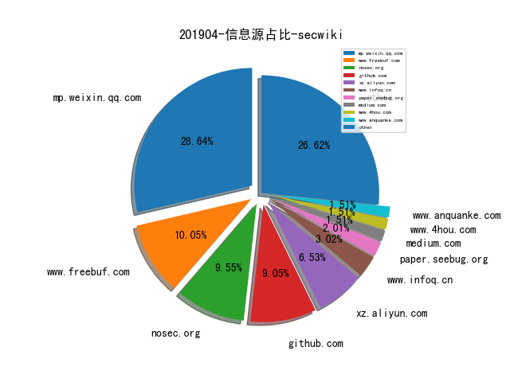
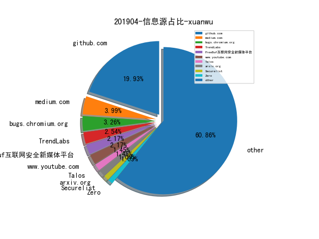
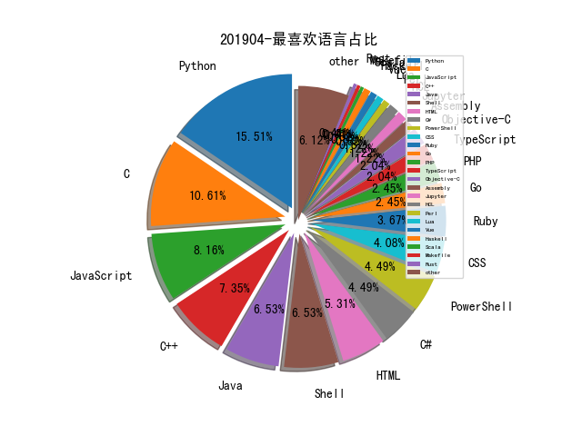

# [数据年报](README_YEAR.md)
# [数据月报-3月](README_3.md)
# 201904 信息源与信息类型占比

# 微信公众号 推荐
| nickname_english | weixin_no | url | title| 
| --- | --- | --- | ---| 
| 安在 | AnZer_SH | https://mp.weixin.qq.com/s/OYPooeIZp8hq4JebOHDJMg | 下一代SIEM@AI：从UEBA到SOAR | 1| 
| 安全小飞侠 | AvFisher | https://mp.weixin.qq.com/s/cyxC4Of4Ic9c_vujQayTLg | Red Team从0到1的实践与思考 | 1| 
| 深度学习自然语言处理 | zenRRan | https://mp.weixin.qq.com/s/PVoQI85YkDSzlA46FRU1OQ | 刘知远：NLP研究入门之道（一） | 1| 
| DJ的札记 | DJ_notes | https://mp.weixin.qq.com/s/pWZ3rRrRHOVMpxUc_vWgAg | 真真假假的创新 - RSAC2019之三 | 1| 
| 我的安全视界观 | CANI_Security | https://mp.weixin.qq.com/s?__biz=MzI3Njk2OTIzOQ==&mid=2247484307&idx=1&sn=3758ef809f9a456d7ed83a2954487f5b&chksm=eb6c21ebdc1ba8fd8888ccf93043b0abc5107b0a96671419bbc8b3795260feded5292248338e&token=748595180&lang=zh_CN#rd | 【SDL最初实践】安全需求 | 1| 
| 数说安全 | SSAQ2016 | https://mp.weixin.qq.com/s/alJyvGi8FPygIe1IYYj2_A | 科创板观察报告：恒安嘉新、安博通、山石和安恒篇 | 1| 
| 国防科技要闻 | CDSTIC | https://mp.weixin.qq.com/s/LXR853Z4E5peVYq89tXKZA | DARPA 2020财年研发预算 人工智能应用研究投资急剧增长 | 1| 
| 天融信阿尔法实验室 |  | https://mp.weixin.qq.com/s/kwp5uxom7Amrj6S_-g8r4Q | 天融信关于ThinkPHP5.1框架结合RCE漏洞的深入分析 | 1| 
| 秦安战略 | qinan1128 | https://mp.weixin.qq.com/s/VCG3QPP4dwcfNlZFC_nnSQ | 中国网络安全产业发展报告 | 1| 
| 京东数字科技研究院 |  | https://mp.weixin.qq.com/s/2afk7pLqgzpUnXgmQgMNEw | 编译 | Palantir中标美国军方8亿美元人工智能系统研发采购计划 | 1| 
| 梅子酒的书札 | a960596293_book | https://mp.weixin.qq.com/s/rlSyABoulRKygPmwfcUuXA | 西湖论剑2019 WriteUp | 1| 
| 360核心安全 | CoreSec360 | https://mp.weixin.qq.com/s/r-jAWFjtOxgd-JyVStFvsg | APT战争中脚本攻击的兵法之道 | 1| 
| TideSec安全团队 | TideSec | https://mp.weixin.qq.com/s/X0mCJECAzyqxDBwhlP_3hg | Weblogic漏洞——从入门到放弃 | 12| 
| 半佛仙人 | banfoSB | https://mp.weixin.qq.com/s/AK6_wP_JtMW5DxzRyWaXXg | 屠夫遇上路霸丨揭秘高利贷与黑产的血色战争 | 1| 
| 图灵人工智能 | TuringAI01 | https://mp.weixin.qq.com/s/Yd0wjUQ03XINnMFLkPkBJg | 人工智能的现状与未来 | 1| 
| 安全学术圈 | secquan | https://mp.weixin.qq.com/s/ZHcikLKeF9ZJg9kyrX-UrA | S&P 2019 论文录用列表 | 1| 
| 格友 |  | https://mp.weixin.qq.com/s/3Ft6205f8kUoCuGzB-hPtg | 在调试器里看QQLive捉迷藏 | 1| 
| 网安国际 | inforsec | https://mp.weixin.qq.com/s/enasXD14SMzj1Cx5grGD3w | 谁劫持了我的DNS：全球域名解析路径劫持测量与分析 | 1| 
| 集智俱乐部 | swarma_org | https://mp.weixin.qq.com/s/vsCAE-6e0jpX8wPw6Sd9eA | 使用深度神经网络对 Twitter进行威胁检测 | 网络科学论文速递16篇 | 1| 

# 组织github账号 推荐
| github_id | title | url | org_url | org_profile | org_geo | org_repositories | org_people | org_projects | repo_lang | repo_star | repo_forks| 
| --- | --- | --- | --- | --- | --- | --- | --- | --- | --- | --- | ---| 
| mwrlabs | SharpGPOAbuse - MWR Labs 开发的基于 C# 的工具，用于滥用 GPO 编辑权限攻击该 GPO 控制的对象 | https://github.com/mwrlabs/SharpGPOAbuse | http://labs.mwrinfosecurity.com/ |  | Basingstoke, Johannesburg, London, Manchester, Singapore, New York | 43 | 0 | 0 | C,Java,Python,JavaScript,C++,C#,Objective-C,Assembly,Ruby,PowerShell,CSS | 1700 | 501 | 1| 
| REhints | 从 UEFI 固件攻击硬件可信任架构(HROT) ，来自 offensive 2019 大会 | https://github.com/REhints/Publications/blob/master/Conferences/Bypassing%20Hardware%20Root%20of%20Trust/offcon2019_final.pdf | http://REhints.com |  | http://REhints.com | 10 | 2 | 0 | Python,C,Assembly,CSS,C++ | 1200 | 249 | 1| 
| google | vulncode-db - 漏洞及漏洞代码整合数据库 | https://github.com/google/vulncode-db | https://opensource.google.com/ | Google ❤️ Open Source | https://opensource.google.com/ | 1447 | 2479 | 0 | C,Java,Python,Kotlin,JavaScript,Haskell,C++,Dart,HTML,Go,PHP | 0 | 0 | 1| 
| OWASP | QRLJacking - 扫描恶意二维码劫持用户登录回话的社工技术分享 | https://github.com/OWASP/QRLJacking/tree/master/QRLJacker | http://www.owasp.org | The OWASP Foundation | http://www.owasp.org | 145 | 26 | 0 | C,Shell,Java,Python,Dockerfile,JavaScript,Perl,HTML,Go,Ruby,CSS | 0 | 0 | 2| 
| fox-it | adconnectdump - 从 Azure AD Connect 服务器中导出凭证的工具 | https://github.com/fox-it/adconnectdump | https://www.fox-it.com/ |  | https://www.fox-it.com/ | 31 | 1 | 0 | C,Shell,Python,Bro,HTML,Ruby,PowerShell | 0 | 0 | 1| 
| Coalfire-Research | DeathMetal - 针对 Intel AMT 的攻击工具集 | https://github.com/Coalfire-Research/DeathMetal | http://www.coalfirelabs.com | Advancing the state of the Infosec industry by providing cutting-edge research, open-source tools and tradecraft | http://www.coalfirelabs.com | 14 | 0 | 0 | C,Python,JavaScript,Lua,PowerShell,HCL | 0 | 0 | 1| 
| RhinoSecurityLabs | Apache Axis 由于代码中加载过期域名托管的资源导致的远程代码执行漏洞详情披露（CVE-2019-0227） | https://github.com/RhinoSecurityLabs/CVEs/blob/master/CVE-2019-0227/README.md | https://rhinosecuritylabs.com | A boutique penetration testing and security assessment firm in Seattle, WA. | Seattle, WA | 10 | 0 | 0 | Python,JavaScript,PowerShell,HCL | 0 | 0 | 1| 
| Nothing2Hide | pcap_ioc: Python library to extract potential IOCs from a ... | https://github.com/Nothing2Hide/pcap_ioc | https://nothing2hide.org/ | Des outils pour protéger linformation | Internet | 9 | 0 | 0 | Python,Shell,PHP,CSS | 0 | 0 | 1| 
| sophoslabs | While parsing an HTML5 stream in concert with custom HTML elements. This results in the stream parser object being freed while still in use. | https://github.com/sophoslabs/CVE-2018-18500/ | https://www.sophos.com/en-us/labs.aspx |  | https://www.sophos.com/en-us/labs.aspx | 4 | 0 | 0 | Python,HTML | 0 | 0 | 1| 

# 私人github账号 推荐
| github_id | title | url | p_url | p_profile | p_loc | p_company | p_repositories | p_projects | p_stars | p_followers | p_following | repo_lang | repo_star | repo_forks | 
| --- | --- | --- | --- | --- | --- | --- | --- | --- | --- | --- | --- | --- | --- | ---| 
| ruanyf | document-style-guide: 中文技术文档的写作规范 | https://github.com/ruanyf/document-style-guide | https://twitter.com/ruanyf |  | Shanghai, China | None | 54 | 0 | 233 | 50300 | 0 | JavaScript | 15700 | 6900 | 1| 
| taviso | swisstable - 访问 Abseil Swiss Tables 的小型 C 封装库 | https://github.com/taviso/swisstable | None |  | None | None | 11 | 0 | 9 | 1100 | 1 | C | 2600 | 193 | 1| 
| jas502n | Weblogic 任意文件上传漏洞（CVE-2019-2618）的 Exploit | https://github.com/jas502n/cve-2019-2618/ | None | 1.misc 2.crypto 3. web 4. reverse 5. android 6. pwn 7. elf | None | None | 129 | 0 | 103 | 661 | 109 | Python,C,Shell,JavaScript,PHP | 294 | 106 | 1| 
| clone95 | Virgilio: Your new Mentor for Data Science E-Learning | https://github.com/clone95/Virgilio | None | I graduated in Italy in IT Engineering, and im currently having my internship in a shiny AI startup. | Bologna, Italy | None | 22 | 0 | 14 | 604 | 27 | Python,Jupyter | 9000 | 1700 | 1| 
| travisgoodspeed | 利用 GHIDRA 逆向 Tytera MD380 的固件 | https://github.com/travisgoodspeed/md380tools/wiki/GHIDRA | None |  | None | None | 31 | 0 | 35 | 593 | 24 | Python,C,C++ | 593 | 190 | 1| 
| k8gege | K8tools: K8工具合集 | https://github.com/k8gege/K8tools | https://www.cnblogs.com/k8gege/ |  | None | None | 6 | 0 | 3 | 237 | 1 | C#,Ruby,PowerShell,C++ | 845 | 320 | 1| 
| hlldz | APC-PPID - 通过 APC 注入创建进程并伪造父进程的项目 | https://github.com/hlldz/APC-PPID | https://artofpwn.com | Pwner, Red Teamer | İstanbul, Türkiye | None | 5 | 0 | 179 | 214 | 22 | Python,PowerShell,C++ | 691 | 159 | 1| 
| pyn3rd | Apache Tomcat 远程代码执行漏洞（CVE-2019-0232），可以通过 Windows enableCmdLineArguments 触发 | https://github.com/pyn3rd/CVE-2019-0232/ | https://twitter.com/pyn3rd |  | Hangzhou | Alibaba Group | 7 | 0 | 0 | 210 | 0 | Python,Batchfile,Java | 118 | 46 | 1| 
| ustayready | fireprox - AWS API Gateway 管理工具，用于动态创建 HTTP 传递代理以实现唯一的 IP 轮换 | https://github.com/ustayready/fireprox | None | divergent thinker/breaker and researcher of stuff | None | None | 39 | 0 | 7 | 194 | 7 | Python,C#,HTML | 702 | 147 | 1| 
| Viralmaniar | I-See-You: Bash and Javascript tool to find the exact location of user | https://github.com/Viralmaniar/I-See-You | https://twitter.com/maniarviral |  | Melbourne, Victoria, Australia | None | 35 | 0 | 220 | 192 | 93 | Python | 705 | 105 | 1| 
| zer0yu | 网络空间安全的RSS订阅 | https://github.com/zer0yu/CyberSecurityRSS | http://zeroyu.xyz/ | Every light needs a shadow. You just have to learn how to control it,use it when you need it. | None | None | 28 | 0 | 1900 | 162 | 1100 | Python,C,CSS | 44 | 16 | 1| 
| djhohnstein | CSharpSetThreadContext - 由 C# 开发的通过 CreateRemoteThread 和 SetThreadContext 执行shellcode 以逃避 Get-InjectedThread 检测的工具 | https://github.com/djhohnstein/CSharpSetThreadContext | https://popeax.io | Operator at SpecterOps. Kali Contributor. | Seattle, WA | None | 48 | 0 | 5 | 130 | 2 | C# | 154 | 35 | 1| 
| eoftedal | Istio/Envoy 目录穿越漏洞详情披露(CVE-2019-9901) | https://github.com/eoftedal/writings/blob/master/published/CVE-2019-9901-path-traversal.md | http://erlend.oftedal.no/blog |  | Oslo, Norway | None | 73 | 0 | 384 | 103 | 67 | C#,JavaScript,Java | 172 | 11 | 1| 
| Mattiwatti | EfiGuard - x64 UEFI bootkit，在启动时修补 Windows 启动管理器以禁用 PatchGuard 和驱动程序签名验证(DSE) | https://github.com/Mattiwatti/EfiGuard | None |  | The Netherlands | None | 19 | 0 | 13 | 87 | 3 | C,Assembly,C++ | 227 | 61 | 1| 
| 0x36 | iOS上的沙箱逃逸漏洞（A11平台，版本<12.2） | https://github.com/0x36/powend | None | . | Morocco | None | 6 | 0 | 23 | 79 | 0 | C,Makefile | 138 | 36 | 1| 
| jthuraisamy | Synaptics 音频 Windows 内核驱动 CxUtilSvc 本地提权漏洞（CVE-2019-9730） | https://github.com/jthuraisamy/CVE-2019-9730/ | http://jackson.thuraisamy.me |  | None | None | 22 | 0 | 37 | 50 | 8 | C#,Python,C,JavaScript,Java | 40 | 9 | 1| 
| cfreal | Apache 本地提权漏洞 Exploit（CVE-2019-0211） | https://github.com/cfreal/exploits/tree/master/CVE-2019-0211-apache | https://github.com/ambionics |  | None | @ambionics | 2 | 0 | 3 | 46 | 0 | PHP,HTML | 281 | 45 | 1| 
| iSafeBlue | 一张渗透测试思维导图 | https://github.com/iSafeBlue/Mind-Map/ | https://b1ue.cn | Security Researcher , Java Development Engineer | None | None | 9 | 0 | 248 | 38 | 35 | JavaScript,Java | 207 | 56 | 1| 
| leeberg | BlueHive - 基于 PowerShell 实现的活动目录密罐用户管理项目，并且带仪表盘以可视化展示结果 | https://github.com/leeberg/BlueHive | http://www.leealanberg.com | Product Manager, Automation Engineer, Content Producer, EX Microsoft MVP, Nerd | Madison, Wisconsin, United States | None | 35 | 0 | 85 | 26 | 64 | C# | 4 | 0 | 1| 
| lis912 | Evaluation_tools: 等级保护测评工具 | https://github.com/lis912/Evaluation_tools | None | 时不时拧巴的菜鸡一只。 | None | None | 8 | 0 | 12 | 24 | 0 | Go,Rust,Shell,HTML,CSS | 97 | 35 | 1| 
| crypto-cypher | 《Privacy for Identities: The Art of Pseudonymity》发布，主要探讨信息安全，隐私权和大规模监控 | https://github.com/crypto-cypher/privacy-for-identities/blob/master/PrivacyForIdentities%20-%20Prerelease.pdf | https://twitter.com/CryptoCypher | Networking. OpSec. Privacy. Coding. Just another paranoid cypherpunk whos terrible at calculus. Dreaming big. | None | None | 7 | 0 | 7 | 20 | 7 | Shell | 32 | 5 | 1| 
| DimopoulosElias | alpc-mmc-uac-bypass - 通过 ALPC 绕过 UAC 的项目 | https://github.com/DimopoulosElias/alpc-mmc-uac-bypass | https://www.linkedin.com/in/dimopouloselias |  | None | None | 5 | 0 | 11 | 15 | 2 | Python,C,C++ | 43 | 10 | 1| 
| sumas | OSCP-Cheatsheet-God - OSCP 考试备忘清单 | https://github.com/sumas/OSCP-Cheatsheet-God | None |  | None | None | 18 | 0 | 1 | 14 | 1 | Python,JavaScript,Java,PHP | 124 | 31 | 1| 
| PokemonGoTeam | CRYPTOPOKEMON: Simple C++ cryptolocker Blowfish CBC | https://github.com/PokemonGoTeam/CRYPTOPOKEMON | http://pokemongo.icu |  | Kiev, Ukraine | PokemonGo | 1 | 0 | 0 | 7 | 0 | C++ | 10 | 3 | 1| 
| mykter | aws-security-cert-service-notes - AWS 服务安全认证学习笔记 | https://github.com/mykter/aws-security-cert-service-notes | http://mykter.com |  | UK | None | 20 | 0 | 29 | 2 | 0 | Python,C,TypeScript | 272 | 52 | 1| 
| AngelCtulhu | Wordpress Support Candy 插件的文件上传漏洞 | https://github.com/AngelCtulhu/CVE-2019-11223/ | http://cert.kalasag.com.ph |  | Pasig | 8Layer Technologies Inc. | 2 | 0 | 0 | 0 | 0 | Python | 0 | 0 | 1| 

# 日更新程序
`python update_daily.py`