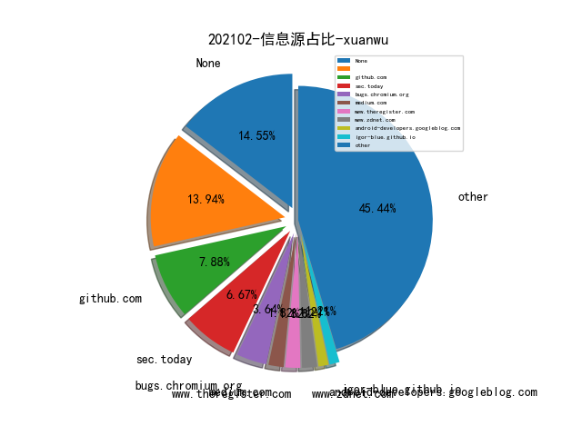
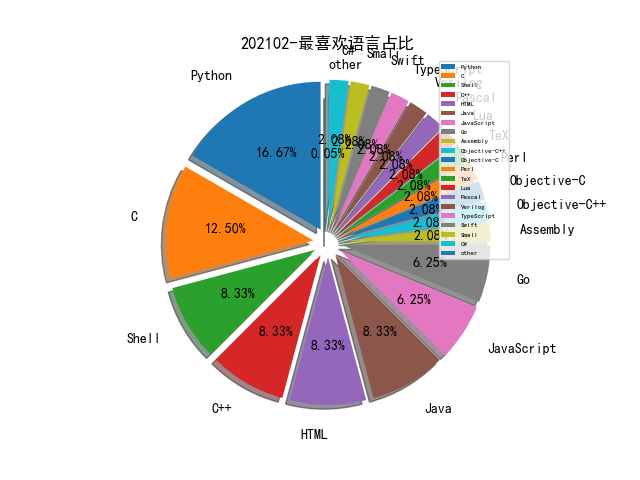

# [数据--所有](README_20.md)
# [数据--年度](README_2021.md)
# 202102 信息源与信息类型占比

# 微信公众号 推荐
| nickname_english | weixin_no | title | url| 
| --- | --- | --- | ---| 
| ChaMd5安全团队 | chamd5sec | 2021HWS冬令营线上赛固件安全-WriteUp | https://mp.weixin.qq.com/s/fwbFMHuVdX-FNa7dB5mw0Q | 1| 
| 字节跳动安全中心 | TouTiaoSec | 安卓Native层共享库fuzzing技术思路及实践 | https://mp.weixin.qq.com/s/eqYj385SGCUo5errVx2CZg | 1| 
| 微步在线研究响应中心 | gh_c108d4d389bf | Metasploit 的 payload 特征 | https://mp.weixin.qq.com/s/C8jHikFag_CulJIcq0filg | 1| 
| 潇湘信安 | xxxasec | 记一次理财杀猪盘渗透测试案例 | https://mp.weixin.qq.com/s/utqGvCTEFS3hQ_GttWHVNw | 1| 
| FCC30+ | Fcc_198905 | 2020网络金融黑产研究报告 | https://mp.weixin.qq.com/s/B_pREKw4SJQjpbVbQLl33w | 1| 
| vivo千镜安全实验室 | gh_54ff3f871510 | 智能终端隐私防跟踪技术实践 | https://mp.weixin.qq.com/s/II5q4tYyZ3JUD4vHy1Fx6A | 1| 
| 威胁棱镜 | THREAT_PRISM | 基于复杂图的 DDoS 攻击团伙发现与跟踪 | https://mp.weixin.qq.com/s/xz3XDHVg2jzMc6Sv-o8YTw | 1| 
| 看雪学院 | ikanxue | python编译后的pyd爆破 | https://mp.weixin.qq.com/s/JvQ38Isf1xXcGOe5wDgXWw | 1| 
| 鸟哥谈云安全 | cnbirdsecintel | 云安全架构连载之一-Azure整体架构及安全亮点详解 | https://mp.weixin.qq.com/s/QNBlsBJaWNXsZLEuNRQcvQ | 1| 

# 组织github账号 推荐
| github_id | title | url | org_url | org_profile | org_geo | org_repositories | org_people | org_projects | repo_lang | repo_star | repo_forks| 
| --- | --- | --- | --- | --- | --- | --- | --- | --- | --- | --- | ---| 

# 私人github账号 推荐
| github_id | title | url | p_url | p_profile | p_loc | p_company | p_repositories | p_projects | p_stars | p_followers | p_following | repo_lang | repo_star | repo_forks | 
| --- | --- | --- | --- | --- | --- | --- | --- | --- | --- | --- | --- | --- | --- | ---| 
| 0xdea | INFILTRATE20 会议研究员 0xdea 关于 Solaris 操作系统多个漏洞研究的分享 | https://github.com/0xdea/raptor_infiltrate20 | https://0xdeadbeef.info/ | You cant argue with a root shell. | Italy | None | 14 | 0 | 0 | 0 | 0 | Python,C,JavaScript,Assembly | 648 | 155 | 1| 
| maddiestone | Project Zero Maddie Stone 对 2020 年野外漏洞利用情况的综述 | https://github.com/maddiestone/ConPresentations/blob/master/Enigma2021.StateOf0day.pdf | http://twitter.com/maddiestone |  | None | None | 4 | 0 | 0 | 0 | 0 | Python | 949 | 122 | 1| 
| ossf | Security Scorecards - 开源组件安全健康度衡量工具 | https://github.com/ossf/scorecard | None | None | None | None | 0 | 0 | 0 | 0 | 0 | Go,Python | 153 | 21 | 1| 
| r4j0x00 | 上周推送的 sudo 溢出漏洞的 Exploit | https://github.com/r4j0x00/exploits/tree/master/CVE-2021-3156 | https://github.com/r4j0x00 | I make exploits | None | None | 14 | 0 | 0 | 0 | 0 | Python,JavaScript,C++ | 228 | 68 | 1| 

# medium_xuanwu 推荐
| title | url| 
| --- | ---| 
| Facebook Messenger Desktop App Arbitrary File Read | http://medium.com/@renwa/facebook-messenger-desktop-app-arbitrary-file-read-db2374550f6d| 
| How I was able to Turn a XSS into a Account Takeover | http://pullerjsecu.medium.com/how-i-was-able-to-turn-a-xss-into-a-account-takeover-ae0c478640e7| 
| Detecting the Leverage of INF-SCT Fetch & Execute Techniques | http://0xbandar.medium.com/detecting-the-leverage-of-inf-sct-fetch-execute-techniques-beca55e24d50?source=social.tw| 

# medium_secwiki 推荐
| title | url| 
| --- | ---| 

# zhihu_xuanwu 推荐
| title | url| 
| --- | ---| 

# zhihu_secwiki 推荐
| title | url| 
| --- | ---| 

# xz_xuanwu 推荐
| title | url| 
| --- | ---| 

# xz_secwiki 推荐
| title | url| 
| --- | ---| 

# 日更新程序
`python update_daily.py`