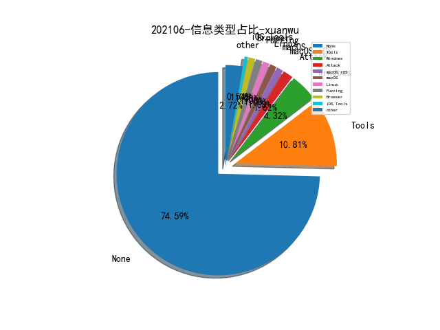

# [数据--所有](README_20.md)
# [数据--年度](README_2021.md)
# 202106 信息源与信息类型占比

# 微信公众号 推荐
| nickname_english | weixin_no | title | url| 
| --- | --- | --- | ---| 
| 非尝咸鱼贩 | awkwardfish1 | iOS Wi-Fi 格式串拒绝服务 0day 分析 | https://mp.weixin.qq.com/s?__biz=Mzk0NDE3MTkzNQ==&mid=2247483943&idx=1&sn=35cf79f82db7781679d9a6902c8aabd4&chksm=c329fcd7f45e75c1a779ad9313400583aecffd42dddb819699b90904f639dcddc7562171a185 | 2| 
| 赛博回忆录 | cybermemory | web选手如何快速卷入二进制世界 | https://mp.weixin.qq.com/s/tU6R2Q4_unEoAMk27vv9xg | 1| 
| 开源情报研究所 | OSINTR | 【技巧】研究Twitter账户要寻找什么及工具 | https://mp.weixin.qq.com/s/L0VjmyXMg2p_KbSMl3NEIw | 1| 
| ChaMd5安全团队 | chamd5sec | skylarinst-winc(10.199.1.19_80).exe样本分析 | https://mp.weixin.qq.com/s/S0lb93pAhnDbcdYXaixicg | 1| 
| 代码审计SDL | gh_50d8f0e890be | 第三方组件安全评估指南 | https://mp.weixin.qq.com/s/45dF9lqnL2ByKgQNmKetyw | 1| 
| 丁爸 情报分析师的工具箱 | dingba2016 | 【资料】开源情报（OSINT）常用工具及其安全使用 | https://mp.weixin.qq.com/s/UiAdHpQABlNarb60L5UGNw | 1| 
| FreeBuf | freebuf | 一文看懂内存马 | https://mp.weixin.qq.com/s/T_6At4Crp1qmdczBSuLYdQ | 1| 
| RapidDNS | gh_6327c9075859 | 如何高效使用RapidDNS | https://mp.weixin.qq.com/s/aoXvdCs5muOaOPWdW1ixJQ | 1| 
| 穿过丛林 | gh_f90eac70537b | 基于API亲密度分析的安卓恶意软件检测系统 | https://mp.weixin.qq.com/s/HmSjFNnaG4VtuR1MR2QjQA | 1| 
| 神光的编程秘籍 | gh_831b7475367e | JavaScript 常见 AST 梳理 | https://mp.weixin.qq.com/s/biQt6cw05-4G-gkJS9fGTQ | 1| 
| 绿盟科技研究通讯 | nsfocus_research | 攻击推理-安全知识图谱在自动化攻击行为提取上的应用 | https://mp.weixin.qq.com/s/0sZKZ-8SgIr3_ESwHFOHSA | 1| 
| 伏羲智库 | FUXIINSTITUTION | DNS-网络安全绕不过去的话题 | https://mp.weixin.qq.com/s/g5_RVxAFgXBIwSLiazsUpw | 1| 
| 我的安全视界观 | CANI_Security | Shift Left在开发安全中的应用 | https://mp.weixin.qq.com/s/CkfOFYOT98uICnVx2YLjsQ | 1| 
| 思想花火 | ttfirework | 跟着Google学习如何写述职报告 | https://mp.weixin.qq.com/s/g07nezJjj2xaMp5z385RTw | 1| 
| 面壁者与执剑人 | gh_eb146885b458 | 怎样系统地管理时间 | https://mp.weixin.qq.com/s/O7xGdZw669xJy3o17ghCbg | 1| 
| 春秋伽玛 | AWDGAME | Writeup , 蓝帽杯半决赛Misc-溯源取证 | https://mp.weixin.qq.com/s/rL-Issg-ouhpMfmcYL76Ow | 1| 
| 君哥的体历 | jungedetili | 实录 , ThreatSource鸟哥：浅谈云安全技术以及安全架构亮点 | https://mp.weixin.qq.com/s/tLHroy8yZIsZCjfdKLK-wQ | 1| 
| 专注安管平台 | gh_48603b9bb05a | 深入研究网络弹性 | https://mp.weixin.qq.com/s/1rwwgErZDO0ygWNY7HPkSA | 1| 
| ZoomEye | ZoomEye_Team | 谈谈网络空间测绘在国家级断电断网事件上的应用 | https://mp.weixin.qq.com/s/vFygIcSNnAgPaEqVBp7LsQ | 1| 
| RedTeam | RedTeams | Static Program Analysis Intruction | https://mp.weixin.qq.com/s/jm2I-_L_NUBTYNhEUBv-iA | 2| 
| M01N Team | m01nteam | 钓鱼页面之无视浏览器URL栏 | https://mp.weixin.qq.com/s/F4GkG1MSOaz3iIGBmDzCTA | 1| 
| APISIX 云原生微服务网关 | gh_04aaf04b2fae | 开源 API 网关架构分析 | https://mp.weixin.qq.com/s/L3X3xfGggjf52a8GofFHEQ | 1| 
| 苹果资本 | Applefunds | 苹果观点：通过RSAC沙盒大赛看未来网络安全新格局 | https://mp.weixin.qq.com/s/2WwlcdYD9NxcIIZ8xfsJmw | 1| 
| 腾讯安全应急响应中心 | tsrc_team | 匿名信使：木马隐蔽通信浅谈 | https://mp.weixin.qq.com/s/X_qPqmpx6uGAs6Y84rV8Jg | 1| 
| 极光无限 | AuroraInfinity | 红蓝对抗 , 基于办公处理软件的控守方案研究 | https://mp.weixin.qq.com/s/cmgw08gtoY2XkLTcMniNVQ | 1| 
| 微步在线研究响应中心 | gh_c108d4d389bf | Gafgyt 变种：Sakura 僵尸网络溯源分析报告 | https://mp.weixin.qq.com/s/PjVIo72rSCsqNYY6536QiA | 1| 
| SecWiki | SecWiki | SecWiki安全招聘（第57期） | https://mp.weixin.qq.com/s/WknlJcosoO6pvrShVF1j2w | 1| 
| 网安寻路人 | DataProtection101 | 发送商业性信息的合规要点 , 国外篇 | https://mp.weixin.qq.com/s/n41AIYll9uo1HyV0ZoIBgg | 2| 
| 天问实验室 | tianwenlab | 智能设备常规测试思路总结 | https://mp.weixin.qq.com/s/jpKP2-lvHVyQhLcMWfrY5Q | 1| 
| Panabit订阅号 | gh_245ade47c8ad | 基于网络流量的网络安全分析与威胁狩猎漫谈（视频版） | https://mp.weixin.qq.com/s/IIrXnFBHde7JPg1samJX5g | 1| 
| 高级页面仔 | seeleland | Code Signing - iOS 代码段的校验机制分析 | https://mp.weixin.qq.com/s/msUwo3YUcfHXkuAp5wRfyQ | 1| 
| Qunar技术沙龙 | QunarTL | Jar 组件自动化风险监测和升级实践 | https://mp.weixin.qq.com/s/3tmwACw-weWCBzipHK79AQ | 1| 
| 章老师说 | gh_dd8867689c3d | 软件工程能力漫谈 | https://mp.weixin.qq.com/s/hJS5LJRZkMZmHm6g2R_jpw | 1| 
| 安全学术圈 | secquan | SCRUTINIZER：通过反编译和机器学习检测恶意软件中的代码复用 | https://mp.weixin.qq.com/s/hdqCwSoXdxAYB8OfL5oJEQ | 6| 
| 威胁棱镜 | THREAT_PRISM | McAfee 如何使用图思考 ATT&CK | https://mp.weixin.qq.com/s/rlFmQdZZTHUnX2D1JSVtFQ | 2| 
| 嘶吼专业版 | Pro4hou | 2021年嘶吼·网络安全产业链图谱发布 | https://mp.weixin.qq.com/s/IDlXpFBtX19CE9PLoSgVYA | 1| 
| 蚂蚁安全实验室 | Alipay_SecurityLab | 智能合约安全系列 -- 举一反三总结篇 | https://mp.weixin.qq.com/s/ZxrBHgZ5a_IuU0nNySIlwA | 1| 

# 组织github账号 推荐
| github_id | title | url | org_url | org_profile | org_geo | org_repositories | org_people | org_projects | repo_lang | repo_star | repo_forks| 
| --- | --- | --- | --- | --- | --- | --- | --- | --- | --- | --- | ---| 

# 私人github账号 推荐
| github_id | title | url | p_url | p_profile | p_loc | p_company | p_repositories | p_projects | p_stars | p_followers | p_following | repo_lang | repo_star | repo_forks | 
| --- | --- | --- | --- | --- | --- | --- | --- | --- | --- | --- | --- | --- | --- | ---| 
| bitterzzZZ | Java内存马学习成果分享和资料整理 | https://github.com/bitterzzZZ/MemoryShellLearn | https://github.com/bitterzzZZ?tab=followers | 一学习就不困了，真的zzZZ | None | None | 17 | 0 | 0 | 0 | 0 | Python,Jupyter,PHP,Java | 0 | 0 | 1| 
| SunLab-GMU | PatchDB: A Large-Scale Security Patch Dataset | https://github.com/SunLab-GMU/PatchDataset | None | None | None | None | 0 | 0 | 0 | 0 | 0 | HTML,Rust | 0 | 0 | 1| 

# medium_xuanwu 推荐
| title | url| 
| --- | ---| 
| 深入理解与检测 C2 框架 — BabyShark。 | http://nasbench.medium.com/understanding-detecting-c2-frameworks-babyshark-641be4595845| 
| Proxy Windows Tooling via SOCKS | http://medium.com/m/global-identity?redirectUrl=https%3A%2F%2Fposts.specterops.io%2Fproxy-windows-tooling-via-socks-c1af66daeef3| 
| 针对进程注入技术深入研究。 | http://medium.com/csg-govtech/process-injection-techniques-used-by-malware-1a34c078612c| 
| An Introduction to Manual Active Directory Querying with Dsquery and Ldapsearch | http://medium.com/m/global-identity?redirectUrl=https%3A%2F%2Fposts.specterops.io%2Fan-introduction-to-manual-active-directory-querying-with-dsquery-and-ldapsearch-84943c13d7eb| 

# medium_secwiki 推荐
| title | url| 
| --- | ---| 

# zhihu_xuanwu 推荐
| title | url| 
| --- | ---| 
| 白泽带你读论文 ,Favocado: Fuzzing the Binding Code of JavaScript Engines Using Semantically Correct Test Cases--该论文选取自NDSS 2021会议的研究对JS引擎进行模糊测试的文章。 | https://zhuanlan.zhihu.com/p/378952042| 

# zhihu_secwiki 推荐
| title | url| 
| --- | ---| 
| 从BAB到SLSA——谈Google的软件供应链风险治理 | https://zhuanlan.zhihu.com/p/382721804| 

# xz_xuanwu 推荐
| title | url| 
| --- | ---| 

# xz_secwiki 推荐
| title | url| 
| --- | ---| 

# 日更新程序
`python update_daily.py`