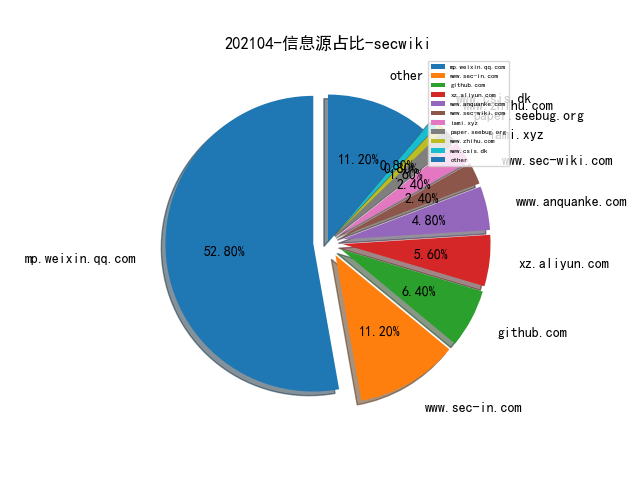

# [数据--所有](README_20.md)
# [数据--年度](README_2021.md)
# 202104 信息源与信息类型占比

# 微信公众号 推荐
| nickname_english | weixin_no | title | url| 
| --- | --- | --- | ---| 
| NISL实验室 | NISL_THU2020 | 【研究成果】国内伪基站垃圾短信生态系统研究 | https://mp.weixin.qq.com/s/te4igYM_PHbf2xedXdmQxw | 1| 
| BlockSec Team | gh_57d94ebc8526 | 鸠占鹊巢: Furucombo 攻击事件分析 | https://mp.weixin.qq.com/s/jDQhFNEeIMT_cdjHkggYjw | 1| 
| 君哥的体历 | jungedetili | 邬晓磊：基于关键词的大型红蓝对抗经验分享 | https://mp.weixin.qq.com/s/8boR_ZucLk5nMJwfi2UdGA | 1| 
| 火线安全平台 | huoxian_cn | 洞态IAST Agent正式开源 | https://mp.weixin.qq.com/s/iSHmK4Fbl0whDvIH-u8tag | 1| 

# 组织github账号 推荐
| github_id | title | url | org_url | org_profile | org_geo | org_repositories | org_people | org_projects | repo_lang | repo_star | repo_forks| 
| --- | --- | --- | --- | --- | --- | --- | --- | --- | --- | --- | ---| 

# 私人github账号 推荐
| github_id | title | url | p_url | p_profile | p_loc | p_company | p_repositories | p_projects | p_stars | p_followers | p_following | repo_lang | repo_star | repo_forks | 
| --- | --- | --- | --- | --- | --- | --- | --- | --- | --- | --- | --- | --- | --- | ---| 
| BC-SECURITY | Starkiller：1.7.0 版本发布。基于 Electron 实现的 Powershell Empire 可视化工具。 | https://github.com/BC-SECURITY/Starkiller/releases | None | None | None | None | 0 | 0 | 0 | 0 | 0 | Python,C#,C,Vue,PowerShell | 0 | 0 | 1| 

# medium_xuanwu 推荐
| title | url| 
| --- | ---| 
| Mikko Kenttälä：macOS Mail 的一个无交互的漏洞。由于符号连接未正确删除，通过自动解压附件，可以实现在 Mail.app 的沙箱环境中添加或修改任意文件。 | http://mikko-kenttala.medium.com/zero-click-vulnerability-in-apples-macos-mail-59e0c14b106c| 

# medium_secwiki 推荐
| title | url| 
| --- | ---| 

# zhihu_xuanwu 推荐
| title | url| 
| --- | ---| 

# zhihu_secwiki 推荐
| title | url| 
| --- | ---| 

# xz_xuanwu 推荐
| title | url| 
| --- | ---| 

# xz_secwiki 推荐
| title | url| 
| --- | ---| 

# 日更新程序
`python update_daily.py`