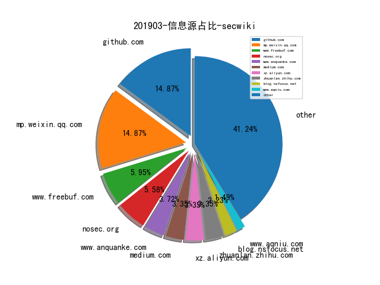
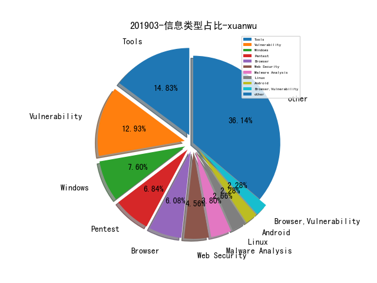

# [数据年报](README_YEAR.md)
# 201903 信息源与信息类型占比

# 微信公众号 推荐
| nickname_english | weixin_no | url | title| 
| --- | --- | --- | ---| 
| 阿里巴巴机器智能 |  | https://mp.weixin.qq.com/s/kv-ZrOF4nnxXoQwFOodzjA | 异常检测的N种方法，阿里工程师都盘出来了 | 1| 
| Alfred数据室 | Alfred_Lab | https://mp.weixin.qq.com/s/j1kgf2RR7jssbWa7uWC-uA | 用大数据扒一扒蔡徐坤的真假流量粉 | Alfred数据室 | 1| 
| 中通安全应急响应中心 | ZTO_SRC | https://mp.weixin.qq.com/s/inANTt-97Rjfr6Rf5lJ07A | 中通内网安全之外发流量管理 | 1| 
| 仙人掌情报站 | sec-cactus | https://mp.weixin.qq.com/s/vxQpnWKBYxzM4aZ3kFw4UA | 董祎铖：态势感知从入坑到重生 | 1| 
| 我的安全视界观 | CANI_Security | https://mp.weixin.qq.com/s/N8rtlk4Ai-Kb9QXW4Q77Lg | 【基础安全】基于齐治堡垒机的自动化功能实践1 | 4| 
| 透雾 | wxWinder | https://mp.weixin.qq.com/s/DCtKYK3Xw_pbdNCUF593Lg | 使用Keras和Tensorflow检测恶意url请求 | 1| 
| 数据安全与取证 | Cflab_net | https://mp.weixin.qq.com/s/ES83wSU-WBrUONGjCN6jYw | 果断收藏！电子取证最全清单 | 1| 
| 绿盟科技研究通讯 | nsfocus_research | https://mp.weixin.qq.com/s/1-yCu8dvp5GzOfK1i4LIhg | 【RSA2019创新沙盒回顾】技术层面看RSA的创新沙盒 | 1| 
| 网安一起行_上海网警 | shanghaiwangjing | https://mp.weixin.qq.com/s/gAS2cFaWMUdY0s6sT6ZtHw | 一图看懂网络安全执法检查 | 1| 
| 安全学术圈 | secquan | https://mp.weixin.qq.com/s/bvQo-VHWdOEisR2adxx6yA | Abusing Web Browsers for Persistent and Stealthy Computation | 3| 
| 腾讯安全应急响应中心 | tsrc_team | https://mp.weixin.qq.com/s/rjcOK3A83oKHkpNgbm9Lbg | AI繁荣下的隐忧——Google Tensorflow安全风险剖析 | 1| 
| Ms08067安全实验室 | Ms08067_com | https://mp.weixin.qq.com/s/xGYfxdp_TQmXiuWvC1sN-g | 步步为营之游走于内网 | 1| 
| 凌天实验室 |  | https://mp.weixin.qq.com/s/59Bj4qk-ClV2eqLu8SKniQ | Cobalt Strike 证书修改 | 1| 
| 安在 | AnZer_SH | https://mp.weixin.qq.com/s/LOrxA4EUB9xecvelTeBQKg | 新锐 | 盛华安张颖：左手SIEM右手服装设计的美女博士 | 1| 
| 数说安全 | SSAQ2016 | https://mp.weixin.qq.com/s/agrm_Xgi1GJP3vmCiL4aVg | 2019年全球网络安全热词排行榜 | 2| 
| 丁爸 情报分析师的工具箱 | dingba2016 | https://mp.weixin.qq.com/s/_ndxkqPfgPjaT_fD82RVvQ | 【情报】数字化时代与美国情报部门的开源信息利用 | 1| 
| 美团技术团队 | meituantech | https://mp.weixin.qq.com/s/inKDcHLaP4M2ZbpxACORXw | 根因分析初探：一种报警聚类算法在业务系统的落地实施 | 1| 

# 组织github账号 推荐
| github_id | title | url | org_url | org_profile | org_geo | org_repositories | org_people | org_projects | repo_lang | repo_star | repo_forks| 
| --- | --- | --- | --- | --- | --- | --- | --- | --- | --- | --- | ---| 
| Microsoft | ChakraCore 的 3 月补丁发布 | https://github.com/Microsoft/ChakraCore/pull/6016 | https://opensource.microsoft.com | Open source, from Microsoft with love | Redmond, WA | 2297 | 4314 | 0 | C,TypeScript,CMake,C#,JavaScript,C++,PowerShell,Python,Objective-C,HTML,F#,Java,Jupyter | 71200 | 9500 | 1| 
| MicrosoftEdge | 用于调试基于 Chromium 的浏览器扩展的工具 | https://github.com/MicrosoftEdge/JsDbg | None | Microsoft Edge open source projects - demos, tools, data | None | 64 | 266 | 0 | C#,JavaScript,C++,Python,HTML,PowerShell | 2000 | 267 | 1| 
| appsecco | using-docker-kubernetes-for-automating-appsec-and-osint-wo... | https://github.com/appsecco/using-docker-kubernetes-for-automating-appsec-and-osint-workflows | http://appsecco.com | PRAGMATIC SECURITY ADVICE. PRACTICAL HELP. KEEPING YOU SAFE. | London, Bangalore, Boston | 31 | 5 | 0 | Shell,Python,JavaScript,Visual,HTML,ActionScript,PHP,CSS | 357 | 97 | 1| 
| facebook | 通过同态散列算法安全地发布更新 - https://code.fb.com/security/homomorphic-hashing/ | https://github.com/facebook/folly/blob/master/folly/experimental/crypto/LtHash.cpp | https://opensource.fb.com | We are working to build community through open source technology. NB: members must have two-factor auth. | Menlo Park, California | 161 | 187 | 0 | C,TypeScript,Java,Python,JavaScript,OCaml,C++,Objective-C,Swift | 0 | 0 | 1| 
| RUB-NDS | TLS-Attacker-BurpExtension - 检测 TLS 安全的BurpSuite 插件 | https://github.com/RUB-NDS/TLS-Attacker-BurpExtension | https://www.nds.ruhr-uni-bochum.de/ | Research and development at the Chair for Network and Data Security concentrates on cryptographic protocols, Internet and XML security. | Ruhr University Bochum | 57 | 7 | 0 | Python,CoffeeScript,PHP,Java,C++ | 0 | 0 | 1| 
| HexHive | SMoTherSpectre PoC | https://github.com/HexHive/SMoTherSpectre | http://hexhive.github.io | Enforcing memory safety guarantees and type safety guarantees at the compiler and runtime level | http://hexhive.github.io | 23 | 2 | 0 | Python,C,HTML,Brainfuck,C++ | 0 | 0 | 1| 
| 360-A-Team | LuWu: 红队基础设施自动化部署工具 | https://github.com/360-A-Team/LuWu | mailto:cert@360.net | 360 A-TEAM is a research team affiliated with 360 ESG. Committed to Web security, APT offensive and defensive, forward-looking attack and defense tools research | cert@360.net | 14 | 3 | 0 | C,Shell,Java,Python,C++,Go,PowerShell | 0 | 0 | 1| 
| SafeBreach-Labs | SirepRAT: Remote Command Execution as SYSTEM on Windows Io... | https://github.com/SafeBreach-Labs/SirepRAT | http://www.safebreach.com | SafeBreach Labs | Worldwide | 12 | 2 | 0 | Python,Shell | 0 | 0 | 1| 
| BSidesSF | BSidesSF CTF 2019 源码、DockerFile 及解决方案发布 | https://github.com/BSidesSF/ctf-2019-release/tree/master/challenges | https://bsidessf.org | Security BSides San Francisco | San Francisco, CA | 4 | 4 | 0 | C,HTML,Ruby,CSS | 0 | 0 | 1| 

# 私人github账号 推荐
| github_id | title | url | p_url | p_profile | p_loc | p_company | p_repositories | p_projects | p_stars | p_followers | p_following | repo_lang | repo_star | repo_forks | 
| --- | --- | --- | --- | --- | --- | --- | --- | --- | --- | --- | --- | --- | --- | ---| 
| s0md3v | 绕过 WAF 的 XSS 检测机制研究 | https://github.com/s0md3v/MyPapers/tree/master/Bypassing-XSS-detection-mechanisms | https://github.com/s0md3v | I make things, I break things and I make things that break things. Twitter: @s0md3v | None | None | 29 | 0 | 0 | 2100 | 0 | Python,JavaScript | 6200 | 713 | 1| 
| trimstray | reload.sh - 通过 SSH 实现重装、恢复以及擦除系统的脚本 | https://github.com/trimstray/reload.sh | https://trimstray.github.io/ | BIO_read(wbio, buf, 4096) | Poland | None | 16 | 0 | 868 | 1200 | 270 | Shell | 17900 | 1600 | 1| 
| jgamblin | CarHackingTools: Install and Configure Common Car Hacking Tools. | https://github.com/jgamblin/CarHackingTools | https://www.jerrygamblin.com | Researcher. Builder. Hacker. Traveler. Cedere Nescio. | United States | None | 64 | 0 | 0 | 1000 | 2 | C,Shell,JavaScript | 5700 | 2900 | 1| 
| unixpickle | 一款针对 Go 二进制和包的混淆工具 | https://github.com/unixpickle/gobfuscate | https://aqnichol.com | Web developer, math geek, and AI enthusiast. | San Francisco, CA | None | 544 | 0 | 147 | 994 | 50 | Python,Go,Objective-C,JavaScript | 590 | 175 | 1| 
| Ridter | 内网渗透 TIPS 分享 | https://github.com/Ridter/Intranet_Penetration_Tips | https://evi1cg.me |  | None | None | 98 | 0 | 343 | 848 | 14 | Python,C | 1600 | 277 | 1| 
| tyranid | The Windows Sandbox Paradox （Flashback），来自 James Forshaw | https://github.com/tyranid/infosec-presentations/blob/master/Nullcon/2019/The%20Windows%20Sandbox%20Paradox%20(Flashback).pdf | None |  | None | None | 31 | 0 | 0 | 638 | 2 | C#,Python,C | 700 | 197 | 1| 
| EtherDream | jsproxy: 一个基于浏览器端 JS 实现的在线代理 | https://github.com/EtherDream/jsproxy | None | [Geeker, Hacker) | Hangzhou, China | None | 20 | 0 | 162 | 619 | 5 | JavaScript | 137 | 55 | 1| 
| Cryptogenic | 在 PS4 6.20 上的 WebKit 远程代码执行漏洞（CVE-2018-4441）利用 | https://github.com/Cryptogenic/PS4-6.20-WebKit-Code-Execution-Exploit | https://twitter.com/SpecterDev | PHP/C++ developer with an interest in user-land and web exploitation. | None | None | 28 | 0 | 38 | 613 | 5 | Go,C,JavaScript,HTML | 591 | 153 | 1| 
| jakeajames | Patchfinders for offsets used in bazads PAC bypass | https://github.com/jakeajames/jelbrekLib/blob/master/patchfinder64.m | None | A random guy on the internet. | Antartica | None | 68 | 0 | 4 | 439 | 7 | Logos,C | 291 | 133 | 1| 
| rvrsh3ll | 将 shellcode 隐藏在资源文件中再通过 CPL 加载执行的POC | https://github.com/rvrsh3ll/CPLResourceRunner | None | I hack code together and hope it works. | NOVA | None | 118 | 0 | 19 | 299 | 9 | Python,C#,HTML,PowerShell | 377 | 114 | 1| 
| ExpLife0011 | 优秀 Windows 内核漏洞利用方向资源收集 | https://github.com/ExpLife0011/awesome-windows-kernel-security-development/blob/master/README.md | None |  | None | None | 2700 | 0 | 2900 | 218 | 445 | Python,Go,C,PowerShell,C++ | 575 | 199 | 1| 
| mpgn | CVE-2019-9580 - StackStorm CORS 验证不当导致的 XSS + RCE 漏洞详情披露 | https://github.com/mpgn/CVE-2019-9580/ | https://github.com/QuokkaLight | ̿ ̿̿̿\̵͇̿̿\=(•̪●)=/̵͇̿̿/̿̿ ̿ ̿ ̿ | Paris | @QuokkaLight | 33 | 0 | 149 | 174 | 14 | Python,HTML,Java | 123 | 37 | 2| 
| houjingyi233 | houjingyi233/CPU-vulnerabiility-collections | https://github.com/houjingyi233/CPU-vulnerabiility-collections | http://houjingyi233.com | security researcher | None | None | 22 | 0 | 633 | 111 | 0 | Visual,Java,C++ | 107 | 54 | 1| 
| xmendez | 模糊测试及暴力破解工具收集的分享：https://twitter.com/Alra3ees/status/1103563481641611264 | https://github.com/xmendez/wfuzz/ | http://wfuzz.org | IT Security Consultant | Security Researcher; Twitter: @x4vi_mendez | None | None | 4 | 0 | 6 | 98 | 1 | Python,Ruby | 1700 | 407 | 1| 
| a13xp0p0v | kernel-hack-drill - Linux 内核漏洞利用开发实验项目 | https://github.com/a13xp0p0v/kernel-hack-drill | https://twitter.com/a13xp0p0v | Linux Kernel Developer & Security Researcher | None | None | 5 | 0 | 0 | 93 | 3 | Python,Go,C,HTML | 420 | 43 | 1| 
| TheKingOfDuck | MySQLMonitor: MySQL实时监控工具（黑盒测试辅助工具） | https://github.com/TheKingOfDuck/MySQLMonitor | None |  | None | None | 58 | 0 | 8 | 65 | 2 | Python,PHP,JavaScript | 69 | 14 | 1| 
| decoder-it | powershellveryless - 绕过 Powershell 受限语言模式及 AMSI 的工具 | https://github.com/decoder-it/powershellveryless/ | None |  | None | None | 9 | 0 | 1 | 63 | 0 | C#,PowerShell,C++ | 129 | 48 | 1| 
| zMarch | Orc - Bash 开发的 Linux 后渗透测试框架 | https://github.com/zMarch/Orc | https://attribution.party | Pentester, hacker, forensicator. I write code, and sometimes I even publish it. Find me on twitter: https://twitter.com/_ta0 | None | None | 6 | 0 | 1 | 59 | 10 | Shell,Assembly,JavaScript | 181 | 20 | 1| 
| mcw0 | HiSilicon DVR 黑客笔记 | https://github.com/mcw0/pwn-hisilicon-dvr/blob/master/README.adoc | None |  | None | None | 5 | 0 | 3 | 57 | 2 | Python | 208 | 87 | 1| 
| bitsadmin | Windows 漏洞利用辅助工具 | https://github.com/bitsadmin/wesng | None |  | Netherlands | None | 9 | 0 | 2 | 46 | 0 | C#,Python,Visual,Batchfile,PowerShell | 238 | 35 | 1| 
| MichaelGrafnetter | 使用 DSInternal 离线攻击活动目录：https://www.dsinternals.com/wp-content/uploads/HIP_AD_Offline_Attacks.pdf | https://github.com/MichaelGrafnetter/DSInternals/releases | https://www.dsinternals.com |  | Prague, Czech Republic | None | 5 | 0 | 9 | 43 | 0 | C# | 339 | 64 | 1| 
| zznop | bn-genesis - 协助分析 SEGA Genesis ROM 的 Binary Ninja 插件 | https://github.com/zznop/bn-genesis | None |  | Dayton, Ohio | None | 12 | 0 | 116 | 36 | 17 | Python,Java,C,Assembly | 71 | 12 | 1| 
| ze0r | Win32k 特权提升漏洞 CVE-2018-8639 漏洞利用 | https://github.com/ze0r/CVE-2018-8639-exp/ | None |  | None | None | 3 | 0 | 2 | 34 | 3 | Python,C++ | 53 | 28 | 1| 
| codemayq | 中文公开聊天语料库 | https://github.com/codemayq/chaotbot_corpus_Chinese | None | new bird in nlp | Beijing China | Peking University | 3 | 0 | 203 | 31 | 11 | Python | 253 | 80 | 1| 
| AdrianVollmer | PowerHub - 辅助 PowerSploit 绕过杀毒软件检测和应用白名单的 Web 应用 | https://github.com/AdrianVollmer/PowerHub | https://github.com/SySS-Research | @mr_mitm | Tübingen, Germany | SySS GmbH @SySS-Research | 8 | 0 | 33 | 29 | 13 | Python,C,Ruby,PowerShell | 126 | 15 | 1| 
| BusesCanFly | Automate discovering and dropping payloads on LAN Raspberr... | https://github.com/BusesCanFly/rpi-hunter | None | I make things, I break things. ¯\_(ツ)_/¯ ‮‮‮ | Somewhere in a linux server | None | 5 | 0 | 416 | 26 | 58 | Python,CSS | 129 | 21 | 1| 
| si9int | Inserting arbitrary files into Google Earth Projects Archives | https://github.com/si9int/OFFSEC-Archive/blob/master/web/Inserting%20arbitrary%20files%20into%20Google%20Earth%20Projects%20Archives.pdf | https://si9int.sh | Whitehat in own definition. | None | None | 8 | 0 | 18 | 23 | 0 | Python | 173 | 27 | 1| 
| chrisnas | DebuggingExtensions - 一款可以用于 Windows 和 Linux 的 .NET Core 控制台的调试工具 | https://github.com/chrisnas/DebuggingExtensions/releases/tag/v1.6 | None |  | None | None | 9 | 0 | 2 | 18 | 1 | C#,PowerShell | 102 | 13 | 1| 
| wish-i-was | femida: Automated blind-xss search for Burp Suite | https://github.com/wish-i-was/femida | None | Twitter https://twitter.com/wish_iwas | None | None | 1 | 0 | 1 | 16 | 2 | Python | 90 | 22 | 1| 
| Bypass007 | Nessus_to_report: Nessus中文报告自动化脚本 | https://github.com/Bypass007/Nessus_to_report | None | A free man | None | None | 4 | 0 | 2 | 13 | 0 | Python | 37 | 14 | 1| 
| stevenaldinger | stevenaldinger/decker: Declarative penetration testing orc... | https://github.com/stevenaldinger/decker | https://www.linkedin.com/in/steven-aldinger-7a32a774/ |  | None | None | 50 | 0 | 48 | 13 | 8 | Go,Shell,Dockerfile | 142 | 7 | 1| 
| CoreyD97 | Stepper: A natural evolution of Burp Suites Repeater tool | https://github.com/CoreyD97/Stepper | https://github.com/nccgroup | Security Consultant @nccgroup UK. | United Kingdom | NCC Group | 8 | 0 | 6 | 12 | 2 | JavaScript,Java | 18 | 3 | 1| 
| SolomonSklash | chomp-scan: 用于简化Bug Bounty/Penetration Test探测阶段的... | https://github.com/SolomonSklash/chomp-scan | None | Penetration tester at FIS Global. | Remote | FIS Global | 16 | 0 | 510 | 12 | 9 | Python,Shell,Vim | 102 | 22 | 1| 
| redaelli | imago-forensics - Python 实现的图像数字取证工具 | https://github.com/redaelli/imago-forensics | None | I’m a cyber security enthusiast. blog: https://www.forensics-matters.com/ twitter: @solventred | None | None | 1 | 0 | 9 | 12 | 16 | Python | 66 | 12 | 1| 
| antonioCoco | 一款自带混淆的ASPX类型的Webshell | https://github.com/antonioCoco/SharPyShell | None | @splinter_code | Italy | None | 1 | 0 | 3 | 10 | 7 | Python | 103 | 16 | 1| 
| 0xpwntester | Sysmon configuration and scripts | https://github.com/0xpwntester/Sysmon | None |  | None | None | 9 | 0 | 5 | 9 | 3 | ASP,Python,C++,C#,Batchfile,PowerShell | 45 | 9 | 1| 
| grigoritchy | (browser exploit)Webkit JavascriptCore array unshift race condition, it leads to RCE. | https://github.com/grigoritchy/unshift-racy | None |  | None | None | 1 | 0 | 0 | 7 | 0 | JavaScript | 11 | 4 | 1| 
| Frint0 | email-enum - 通过搜索主流社交网站判断邮箱是否注册的工具 | https://github.com/Frint0/email-enum | https://pwnable.club | Pro Expert Elite Master Hacker | Los Angeles | None | 3 | 0 | 1 | 5 | 1 | Python,CSS | 167 | 27 | 1| 
| JarekMSFT | MSRC 成员对 Microsoft bug bounty 的介绍、如何 润色 报告及获得更高的奖金 | https://github.com/JarekMSFT/Presentations/blob/master/Getting%20to%2010K_Nullcon2019.pdf | None |  | None | None | 2 | 0 | 0 | 2 | 0 |  | 3 | 1 | 1| 
| BloodHoundAD | 域渗透神器 BloodHound2.1.0 发布 | https://github.com/BloodHoundAD/BloodHound/releases/tag/2.1.0 | None | None | None | None | 0 | 0 | 0 | 0 | 0 | C#,Python,PowerShell | 0 | 0 | 1| 
| firecracker-microvm | firecracker：Secure and fast microVMs for serverless computing | https://github.com/firecracker-microvm/firecracker | None | None | None | None | 0 | 0 | 0 | 0 | 0 | Go,Shell,Rust | 0 | 0 | 1| 
| k8scop | k8s-security-dashboard: A security monitoring solution for... | https://github.com/k8scop/k8s-security-dashboard | None | None | None | None | 0 | 0 | 0 | 0 | 0 | Python | 0 | 0 | 1| 
| xsleaks | 一些可能导致跨域信息泄漏的 DOM API 收集 | https://github.com/xsleaks/xsleaks/wiki/Browser-Side-Channels | None | None | None | None | 0 | 0 | 0 | 0 | 0 |  | 0 | 0 | 1| 

# 日更新程序
`python update_daily.py`