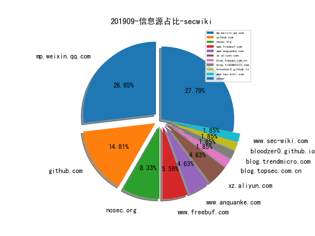

# [数据年报](README_YEAR.md)
# [数据月报-8月](README_8.md)
# [数据月报-7月](README_7.md)
# [数据月报-6月](README_6.md)
# [数据月报-5月](README_5.md)
# [数据月报-4月](README_4.md)
# [数据月报-3月](README_3.md)
# 201909 信息源与信息类型占比

# 微信公众号 推荐
| nickname_english | weixin_no | url | title| 
| --- | --- | --- | ---| 
| 数说安全 | SSAQ2016 | https://mp.weixin.qq.com/s/huQKnnsQtLn0uVZj-wz0Uw | 2019年上半年上市网络安全公司经营简报 | 1| 

# 组织github账号 推荐
| github_id | title | url | org_url | org_profile | org_geo | org_repositories | org_people | org_projects | repo_lang | repo_star | repo_forks| 
| --- | --- | --- | --- | --- | --- | --- | --- | --- | --- | --- | ---| 

# 私人github账号 推荐
| github_id | title | url | p_url | p_profile | p_loc | p_company | p_repositories | p_projects | p_stars | p_followers | p_following | repo_lang | repo_star | repo_forks | 
| --- | --- | --- | --- | --- | --- | --- | --- | --- | --- | --- | --- | --- | --- | ---| 
| matteyeux | 用于加载 Apple SecureROM 的 IDA 插件 | https://github.com/matteyeux/srom64helper | https://github.com/alterway | Sysadmin. Sometimes I write code | Paris | @alterway | 107 | 0 | 115 | 184 | 136 | Python,C | 10 | 4 | 1| 
| 0x7ff | PoC for setting nonce without triggering KPP/KTRR/PAC | https://github.com/0x7ff/dimentio | None | Monero: 42XMRm2cADx8tN3FxA9i2n852PNUTS1JSaDrqdBnxKkiW44WTQMvawFHXmYwxJmhhoKruQHE8bFNjH9BsWH35BjeETyG8fE | None | None | 10 | 0 | 0 | 49 | 6 | C | 28 | 9 | 1| 
| dplusec | 端对端加密的微信聊天插件 | https://github.com/dplusec/tgwechat | None |  | None | None | 2 | 0 | 0 | 1 | 0 | HTML | 15 | 4 | 1| 
| googleprojectzero | DrSancov - j00ru 开源的一款 DynamoRIO 插件，用于在动态插桩中输出 ASAN/ SanitizerCoverage 框架支持的格式方便进一步做分析 | https://github.com/googleprojectzero/DrSancov | None | None | None | None | 0 | 0 | 0 | 0 | 0 | C,C#,C++,Python,HTML,Swift | 0 | 0 | 1| 

# 日更新程序
`python update_daily.py`