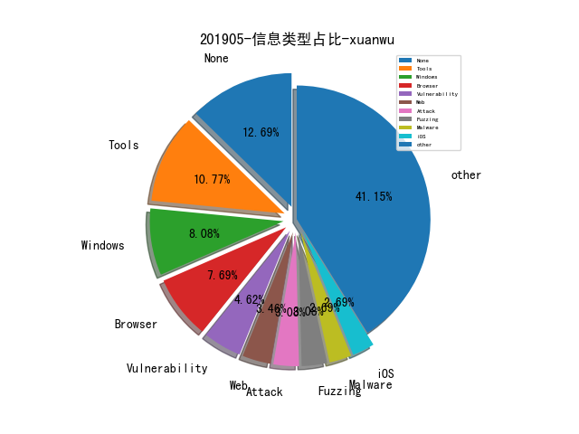

# [数据年报](README_YEAR.md)
# [数据月报-4月](README_4.md)
# [数据月报-3月](README_3.md)
# 201905 信息源与信息类型占比

# 微信公众号 推荐
| nickname_english | weixin_no | url | title| 
| --- | --- | --- | ---| 

# 组织github账号 推荐
| github_id | title | url | org_url | org_profile | org_geo | org_repositories | org_people | org_projects | repo_lang | repo_star | repo_forks| 
| --- | --- | --- | --- | --- | --- | --- | --- | --- | --- | --- | ---| 
| angr | Phuzzer - 用于与 AFL Fuzzer 交互的 Python Wrapper 工具 | https://github.com/angr/phuzzer | http://angr.horse | Next-generation binary analysis framework! | http://angr.horse | 30 | 16 | 0 | C,Shell,Python,C++,HTML,POV-Ray | 3500 | 600 | 1| 
| nccgroup | Blackbox protobuf - NCC Group 开源的用于解码和编辑 Protobuf 数据包的 Burp Suite 扩展 | https://github.com/nccgroup/blackboxprotobuf | https://www.nccgroup.trust | Please report all security issues to security at nccgroup dot com | Global | 180 | 15 | 0 | C,Shell,Java,Python,JavaScript,TypeScript,C#,HTML,Elixir,Go,Rust | 692 | 63 | 1| 
| monzo | response: Monzos real-time incident response and reportin... | https://github.com/monzo/response | https://monzo.com/ | We’re building the best bank on the planet. | London, UK | 101 | 29 | 0 | Python,Ruby,JavaScript,C++,Objective-C,Puppet,Go,Swift | 0 | 0 | 1| 
| quarkslab | Quarkslab 公开了很多他们团队近几年在安全会议上做过的演讲的资料 | https://github.com/quarkslab/conf-presentations | http://www.quarkslab.com |  | http://www.quarkslab.com | 46 | 2 | 0 | Python,Shell,TeX,JavaScript,C++ | 0 | 0 | 1| 
| webarx-security | wpbullet: A static code analysis for WordPress (and PHP) | https://github.com/webarx-security/wpbullet | https://www.webarxsecurity.com/ | WebARX is a cyber security company focusing on web application security. | https://www.webarxsecurity.com/ | 1 | 0 | 0 | Python | 0 | 0 | 1| 

# 私人github账号 推荐
| github_id | title | url | p_url | p_profile | p_loc | p_company | p_repositories | p_projects | p_stars | p_followers | p_following | repo_lang | repo_star | repo_forks | 
| --- | --- | --- | --- | --- | --- | --- | --- | --- | --- | --- | --- | --- | --- | ---| 
| justjavac | 免费的计算机编程类中文书籍 | https://github.com/justjavac/free-programming-books-zh_CN | https://github.com/denoland | Creator of vscode-deno. Currently a contributor to Deno @denoland and author of @denodev. | Tianjin, China | None | 64 | 0 | 810 | 11700 | 128 | TypeScript,JavaScript,HTML | 34200 | 1600 | 1| 
| Tuhinshubhra | ExtAnalysis: Browser Extension Analysis Framework | https://github.com/Tuhinshubhra/ExtAnalysis | https://twitter.com/r3dhax0r | I code and hack for fun! | ... | None | 12 | 0 | 2 | 310 | 0 | Python,PHP,JavaScript,CSS | 913 | 312 | 1| 
| yeyintminthuhtut | Browser、Mitigation 、Kernel 等漏洞利用相关研究 | https://github.com/yeyintminthuhtut/Awesome-Advanced-Windows-Exploitation-References | http://pentest.space | Twitter @yeyint_mth | Singapore | None | 287 | 0 | 459 | 209 | 17 | C#,Shell,PowerShell | 1800 | 514 | 1| 
| vulmon | 在线漏洞搜索引擎 Vulmon 开源了一个本地漏洞检测工具 Vulmap，Vulmap 在本地机器探测安装的软件列表然后请求 Vulmon 的漏洞数据找到可被利用的漏洞及利用代码 | https://github.com/vulmon/Vulmap | https://github.com/yavuzatlas | Open source tools of Vulmon @yavuzatlas @ozelfatih | None | None | 1 | 0 | 1 | 13 | 0 | Python | 171 | 25 | 1| 
| lyxhh | HTTPDecrypt: 利用HTTP协议 远程加解密数据包，实现Burp一条龙... | https://github.com/lyxhh/lxhToolHTTPDecrypt | None |  | None | None | 5 | 0 | 172 | 9 | 0 | Python,JavaScript,HTML | 156 | 38 | 1| 

# 日更新程序
`python update_daily.py`