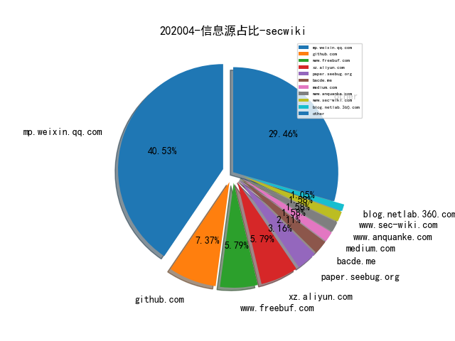
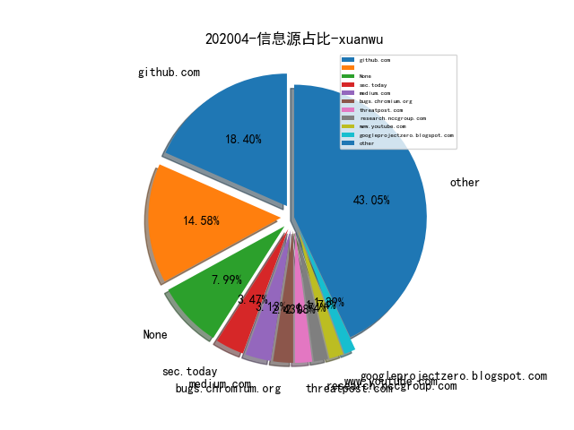

# [数据--所有](README_20.md)
# [数据--年度](README_2020.md)
# 202004 信息源与信息类型占比

# 微信公众号 推荐
| nickname_english | weixin_no | title | url| 
| --- | --- | --- | ---| 
| Ms08067安全实验室 | Ms08067_com | 六种bypass安全软件防护执行的方式 | https://mp.weixin.qq.com/s/sfxJbyJMB6FyGfa6H0G3hA | 1| 
| 关注安全技术 | heresecurity | 常见的web容器后门笔记 | https://mp.weixin.qq.com/s/-cmM1k3--H6p1ditfQHPEw | 1| 
| heysec | bloodzer007 | 工具推荐系列 - sigcheck文件签名检测 | https://mp.weixin.qq.com/s/4oFtOAT-mRYrOuxBIe4XLA | 1| 
| 云众可信 | yunzhongkexin | 原创干货 | 对某大型企业的一次web漏洞挖掘过程 | https://mp.weixin.qq.com/s/GuJgbLfJobTcJ2FMii3IzA | 1| 
| 君哥的体历 | jungedetili | 秦波：大型互联网应用安全SDL体系建设实践 | https://mp.weixin.qq.com/s/STBzFf-NtfbDEA5s9RBdaw | 1| 
| 中国保密协会科学技术分会 |  | 2020 Unit 42 IoT威胁报告（汉译版） | https://mp.weixin.qq.com/s/40fgfbuwa2c5jp6e5vbnxQ | 1| 
| 国防科技要闻 | CDSTIC | 2021财年DARPA预算概况及发展动向解析 | https://mp.weixin.qq.com/s/yEsrMmI0BpvllXaf3TBWkw | 1| 
| 大路咨询 | daluzixun | 中国工业网络安全厂商综合能力概览（2020年第1期） | https://mp.weixin.qq.com/s/6i17MV8T3rou8j0rY-ZbIQ | 1| 
| 小议安全 | xiaoyianquan | 零信任实战系列：远程办公实战（视频） | https://mp.weixin.qq.com/s/ujshgJdZzL9E0sDkl5SNJg | 1| 
| 深澜深蓝 |  | 漏洞分析视角下的CVE-2020-0796漏洞 | https://mp.weixin.qq.com/s/Cn0bF7xG6ESCP2iVYiaW2g | 1| 

# 组织github账号 推荐
| github_id | title | url | org_url | org_profile | org_geo | org_repositories | org_people | org_projects | repo_lang | repo_star | repo_forks| 
| --- | --- | --- | --- | --- | --- | --- | --- | --- | --- | --- | ---| 

# 私人github账号 推荐
| github_id | title | url | p_url | p_profile | p_loc | p_company | p_repositories | p_projects | p_stars | p_followers | p_following | repo_lang | repo_star | repo_forks | 
| --- | --- | --- | --- | --- | --- | --- | --- | --- | --- | --- | --- | --- | --- | ---| 
| tandasat | 在 Hyper-V 环境中测试 UEFI | https://github.com/tandasat/MiniVisorPkg/blob/master/Docs/Testing_UEFI_on_Hyper-V.md | http://standa-note.blogspot.ca/ | Engineer @standa_t | Vancouver, Canada | None | 58 | 0 | 19 | 668 | 3 | C,C++ | 777 | 245 | 1| 
| qazbnm456 | awesome-web-security: List of Web Security materials and ... | https://github.com/qazbnm456/awesome-web-security | https://www.patreon.com/boik | https://www.boik.com.tw/ | Taiwan | None | 109 | 0 | 1100 | 550 | 20 | Python,JavaScript | 4700 | 907 | 1| 
| djhohnstein | SharpChromium - 用于从 Chromium 系列浏览器中获取 Cookie、访问历史、网站登录凭据等敏感信息的工具 | https://github.com/djhohnstein/SharpChromium | https://github.com/specterops | Operator at SpecterOps. Kali Contributor. | Seattle, WA | @specterops | 123 | 0 | 10 | 288 | 6 | C#,VBScript,C++ | 104 | 23 | 1| 
| yardenshafir | KernelDataStructureFinder - 在内核 lookaside 链表中搜索数据结构的工具 | https://github.com/yardenshafir/KernelDataStructureFinder | None |  | None | None | 5 | 0 | 2 | 22 | 0 | C,C++ | 40 | 20 | 1| 
| mrlnc | 禁用LTE网络安全性-商业网络中的配置错误安全研究分享。 | https://github.com/mrlnc/LTE-ciphercheck | None | Research Assistant & PhD student. Mobile Network Security at Ruhr-Universität Bochum. | Bochum, Germany | Ruhr-Universität Bochum | 15 | 0 | 26 | 18 | 30 | C++ | 36 | 13 | 1| 
| ffffffff0x | Dork-Admin: 盘点近年来的数据泄露、供应链污染事件 | https://github.com/ffffffff0x/Dork-Admin | None | None | None | None | 0 | 0 | 0 | 0 | 0 | HTML,Java | 0 | 0 | 1| 

# medium_xuanwu 推荐
| title | url| 
| --- | ---| 
| CVE-2020-0796 Windows SMBv3 LPE漏洞 POC详细分析 | http://medium.com/@knownsec404team/cve-2020-0796-windows-smbv3-lpe-exploit-poc-analysis-c77569124c87| 

# medium_secwiki 推荐
| title | url| 
| --- | ---| 

# zhihu_xuanwu 推荐
| title | url| 
| --- | ---| 

# zhihu_secwiki 推荐
| title | url| 
| --- | ---| 

# 日更新程序
`python update_daily.py`