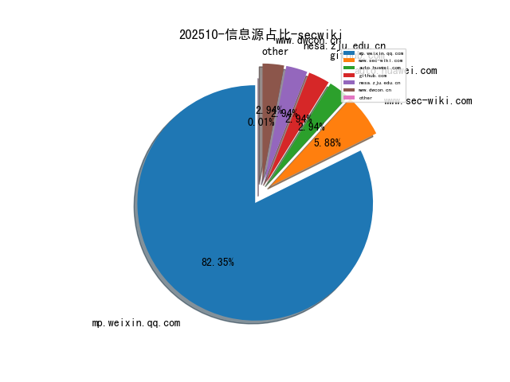
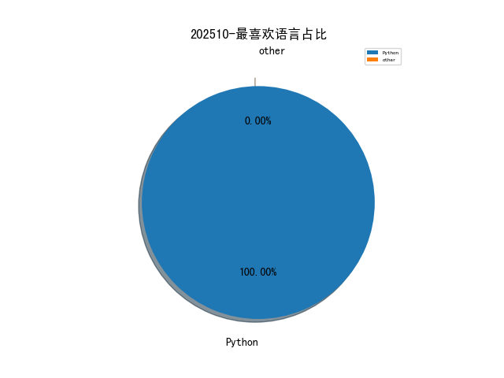

# [数据--所有](README_20.md)
# [数据--年度](README_2025.md)
# 202510 信息源与信息类型占比

# 网络安全书籍 推荐
| date_added | language | title | author | link | size| 
| --- | --- | --- | --- | --- | ---| 
| 2025-10-27 05:30:41 | English | Using Amazon Bedrock: Learn to Architect, Secure and Optimize Generative AI Applications on AWS | unknown | https://www.wowebook.org/using-amazon-bedrock-learn-to-architect-secure-and-optimize-generative-ai-applications-on-aws/ | unknown| 
| 2025-10-26 08:58:08 | English | Surviving a Zombie Attack | Thomas Kingsley Troupe | file.php?id=111180581 | 10973670 [pdf]| 
| 2025-10-23 11:13:37 | English | Ultimate Microsoft XDR for Full Spectrum Cyber Defence | unknown | https://www.wowebook.org/ultimate-microsoft-xdr-for-full-spectrum-cyber-defence/ | unknown| 
| 2025-10-23 08:31:23 | English | CompTIA Cloud+ Certification Guide (Exam CV0-004) | unknown | https://www.wowebook.org/comptia-cloud-certification-guide-exam-cv0-004/ | unknown| 
| 2025-10-23 06:43:28 | English | 97 Things Every Information Security Professional Should Know | unknown | https://www.wowebook.org/97-things-every-information-security-professional-should-know/ | unknown| 
| 2025-10-22 05:02:51 | English | A Common-Sense Guide to Data Structures and Algorithms in Python, Volume 2 | unknown | https://www.wowebook.org/a-common-sense-guide-to-data-structures-and-algorithms-in-python-volume-2/ | unknown| 
| 2025-10-21 11:05:18 | English | Introducing Python: Modern Computing in Simple Packages, 3rd Edition | unknown | https://www.wowebook.org/introducing-python-modern-computing-in-simple-packages-3rd-edition/ | unknown| 
| 2025-10-21 10:31:28 | English | Hands-On APIs for AI and Data Science: Python Development with FastAPI | unknown | https://www.wowebook.org/hands-on-apis-for-ai-and-data-science-python-development-with-fastapi/ | unknown| 
| 2025-10-21 05:18:38 | English | Learning LangChain: Building AI and LLM Applications with LangChain and LangGraph | unknown | https://www.wowebook.org/learning-langchain-building-ai-and-llm-applications-with-langchain-and-langgraph/ | unknown| 
| 2025-10-19 04:44:25 | English | OSINT and the US Intelligence Community: Is the Past Prologue? | Vogel, Kathleen M. (author) | file.php?id=111171839 | 129743 [pdf]| 
| 2025-10-18 00:46:46 | English | The effects of childhood trauma on stress-related vulnerability factors and indicators of suicide risk: An ecological momentary assessment study | Rogerson, Olivia (author);OConnor, Rory C. (author);OConnor, Daryl B. (author) | file.php?id=111163513 | 5476161 [pdf]| 
| 2025-10-18 16:54:50 | English | Securing the Enterprise | unknown | https://www.wowebook.org/securing-the-enterprise/ | unknown| 
| 2025-10-18 12:37:42 | English | Optimizing Cost for Microsoft Workloads on AWS | unknown | https://www.wowebook.org/optimizing-cost-for-microsoft-workloads-on-aws/ | unknown| 
| 2025-10-18 12:16:22 | English | Certified Penetration Testing Professional (CPENT) Exam Guide | unknown | https://www.wowebook.org/certified-penetration-testing-professional-cpent-exam-guide/ | unknown| 
| 2025-10-18 11:06:12 | English | Securing Google Cloud Platform | unknown | https://www.wowebook.org/securing-google-cloud-platform/ | unknown| 
| 2025-10-16 13:30:54 | English | Minimality Concepts Using a New Parameterized Binary Relation in Vector Optimization | Christian Sommer | file.php?id=111160104 | 290850 [pdf]| 
| 2025-10-16 05:23:41 | English | Building Agents with OpenAI Agents SDK | unknown | https://www.wowebook.org/building-agents-with-openai-agents-sdk/ | unknown| 
| 2025-10-15 00:37:40 | English | Android Malware on the Rise | Michael Spreitzenbarth, Felix Freiling | file.php?id=111157346 | 610316 [pdf]| 
| 2025-10-15 15:40:47 | English | Mastering Algorithms with Python | unknown | https://www.wowebook.org/mastering-algorithms-with-python/ | unknown| 
| 2025-10-15 16:01:26 | English | Cybersecurity Beginner’s Guide, 2nd Edition | unknown | https://www.wowebook.org/cybersecurity-beginners-guide-2nd-edition/ | unknown| 
| 2025-10-14 12:38:28 | English | Mobile App Reverse Engineering | Abhinav Mishra | file.php?id=111156877 | 22086597 [epub]| 
| 2025-10-14 09:04:06 | English | AWS Certified Security Study Guide: Specialty (SCS-C02) Exam, 2nd Edition | unknown | https://www.wowebook.org/aws-certified-security-study-guide-specialty-scs-c02-exam-2nd-edition/ | unknown| 
| 2025-10-14 06:32:45 | English | Microsoft 365 Unlocked | unknown | https://www.wowebook.org/microsoft-365-unlocked/ | unknown| 
| 2025-10-14 05:38:08 | English | CompTIA Linux+ Study Guide: Exam XK0-006, 6th Edition | unknown | https://www.wowebook.org/comptia-linux-study-guide-exam-xk0-006-6th-edition/ | unknown| 
| 2025-10-14 05:28:43 | English | CompTIA Linux+ Study Guide: Exam XK0-005, 5th Edition | unknown | https://www.wowebook.org/comptia-linux-study-guide-exam-xk0-005-5th-edition/ | unknown| 
| 2025-10-14 05:17:16 | English | CompTIA Linux+ Study Guide: Exam XK0-004, 4th Edition | unknown | https://www.wowebook.org/comptia-linux-study-guide-exam-xk0-004-4th-edition/ | unknown| 
| 2025-10-14 05:00:16 | English | Mastering AWS Elastic Kubernetes Services | unknown | https://www.wowebook.org/mastering-aws-elastic-kubernetes-services/ | unknown| 
| 2025-10-12 07:37:17 | English | Automate the Boring Stuff with Python Workbook | unknown | https://www.wowebook.org/automate-the-boring-stuff-with-python-workbook/ | unknown| 
| 2025-10-12 07:10:26 | English | Using Generative AI for SEO | unknown | https://www.wowebook.org/using-generative-ai-for-seo/ | unknown| 
| 2025-10-11 11:29:20 | English | Python Machine Learning for Beginners: The First Step-by-Step Guide for Beginners to Programming and Deep Learning with Python. Data Science, Artificial Intelligence Using Scikit-Learn. | JOHNSON, ANDREW | file.php?id=111152153 | 1007898 [epub]| 
| 2025-10-11 07:55:03 | English | CompTIA Linux+ V7 – Pearson Cert Prep (Video) | unknown | https://www.wowebook.org/comptia-linux-v7-pearson-cert-prep-video/ | unknown| 
| 2025-10-11 06:44:44 | English | Building Intelligent AI Agents (Video Course) | unknown | https://www.wowebook.org/building-intelligent-ai-agents-video-course/ | unknown| 
| 2025-10-11 06:27:41 | English | CompTIA Network+ N10-008 Complete Video Course (Video Training) | unknown | https://www.wowebook.org/comptia-network-n10-008-complete-video-course-video-training/ | unknown| 
| 2025-10-09 05:40:51 | English | Generative AI Design Patterns | unknown | https://www.wowebook.org/generative-ai-design-patterns/ | unknown| 
| 2025-10-08 05:34:55 | English | Practical Purple Teaming: The Art of Collaborative Defense | unknown | https://www.wowebook.org/practical-purple-teaming-the-art-of-collaborative-defense/ | unknown| 

# 微信公众号 推荐
| nickname_english | weixin_no | title | url| 
| --- | --- | --- | ---| 
| 0x00实验室 | None | 编译Lsposed源码 , 默认Hook所有app | https://mp.weixin.qq.com/s?__biz=Mzg5MDY2MTUyMA==&mid=2247491933&idx=1&sn=2139813a661f304633636730b41233cf | 1| 
| 0xSec笔记本 | None | SRC漏洞思路分享：通过 OneForAll 挖掘子域，发现与修复云存储“列桶/暴露”风险 | https://mp.weixin.qq.com/s?__biz=Mzk4ODk4NDEyOA==&mid=2247484464&idx=1&sn=38afb29e8971955db637ed105d214b33 | 1| 
| 360数字安全 | None | 10月28日 , 看Agent+千行智变 | https://mp.weixin.qq.com/s?__biz=MzA4MTg0MDQ4Nw==&mid=2247582562&idx=2&sn=33d572b04a0ee04465c0342786dca6d1 | 15| 
| A词不达意 | None | BOF开发 , Dump SAM文件获取明文密码 | https://mp.weixin.qq.com/s?__biz=MzU1NTU5NzA0Mw==&mid=2247483878&idx=1&sn=edc2d564949c1e16711ce4a154c88239 | 1| 
| BITs2Sys | None | BITs2CTF 2025报名开启！等你来战! | https://mp.weixin.qq.com/s?__biz=Mzk1NzM1NTQyNg==&mid=2247483999&idx=1&sn=3a7e9957acca9d026c54d4c4b9b0997f | 1| 
| BeFun安全实验室 | None | 2025 强网杯 部分题解 | https://mp.weixin.qq.com/s?__biz=MzI3NDEzMDgzNw==&mid=2247485250&idx=1&sn=af350315c201f47aaddfe478da2e9936 | 1| 
| Become Team | None | 2025年“羊城杯”网络安全大赛决赛WP | https://mp.weixin.qq.com/s?__biz=Mzk4ODI5Njg2Mw==&mid=2247484361&idx=1&sn=ab7c8984912f770726d302cf993f6a7a | 1| 
| CISP | None | 2025年8月CISP考试成绩 | https://mp.weixin.qq.com/s?__biz=MzI1NzQ0NTMxMQ==&mid=2247490818&idx=1&sn=faa8969b9a8b4b4cf891f826b3661d92 | 1| 
| CISSP Learning | None | PANW的产品技术介绍 | https://mp.weixin.qq.com/s?__biz=MzIyMjYzNDgzMg==&mid=2247487675&idx=1&sn=18396b5bd79da851b30667ac210a6f2e | 3| 
| CNVD漏洞平台 | None | 上周关注度较高的产品安全漏洞(20251020-20251026) | https://mp.weixin.qq.com/s?__biz=MzU3ODM2NTg2Mg==&mid=2247496443&idx=2&sn=3d0eeedba3f78ad71a508a6347a50d2a | 6| 
| DataCon大数据安全分析竞赛 | None | [AI安全 ] LLM-RAG隐私安全赛道出题人有话说，速看！ | https://mp.weixin.qq.com/s?__biz=MzU5Njg1NzMyNw==&mid=2247489419&idx=1&sn=2b3a65fbe7ef576ac0365741c1441759 | 2| 
| FreeBuf | None | Pwn2Own大赛：黑客利用73个0Day漏洞斩获102万美元奖金 | https://mp.weixin.qq.com/s?__biz=MjM5NjA0NjgyMA==&mid=2651329398&idx=4&sn=8f290d4ee3168bcf78599ef5228b96fe | 56| 
| HackSee黑望 | None | Baohuo Android恶意软件通过假Telegram X劫持Telegram账户 | https://mp.weixin.qq.com/s?__biz=MzI5NTA0MTY2Mw==&mid=2247486005&idx=1&sn=98c7a22fc6ec740c9be888f1bb501e30 | 1| 
| ISC2网络安全 | None | CISSP+CCSP：合璧出鞘，决胜下一程 | https://mp.weixin.qq.com/s?__biz=MzUzNTg4NDAyMg==&mid=2247493232&idx=1&sn=deb15582da50269d8785efc9db800254 | 11| 
| IoT物联网技术 | None | 仅2周，副业赚3万元，源码二开智慧农业温室大棚监控系统，交付Web组态可视化大屏 | https://mp.weixin.qq.com/s?__biz=MjM5OTA4MzA0MA==&mid=2454940807&idx=1&sn=a42eaaa28e2a7d47df7ff95b2077fd2e | 13| 
| IoVSecurity | None | 车联网供应链安全与合规培训课程 2025 | https://mp.weixin.qq.com/s?__biz=MzU2MDk1Nzg2MQ==&mid=2247628102&idx=3&sn=1d5e0cd9b9075f7f2e438cc0c3500f94 | 18| 
| Ots安全 | None | Traccar 未经身份验证的 LFI v5.8-v6.8.1 | https://mp.weixin.qq.com/s?__biz=MzAxMjYyMzkwOA==&mid=2247533259&idx=2&sn=81e63fe4fa9fdd2006f1bcb7e39900b6 | 27| 
| Rsec | None | 0074.适合所有人的 OTP：您能找到的最简单的$OTP 泄漏$ | https://mp.weixin.qq.com/s?__biz=MzA4NDQ5NTU0MA==&mid=2647691203&idx=1&sn=36319f92cd3ddadcb85b15168643f611 | 6| 
| XatuSec | None | 2025-2026学年第一学期西安工业大学网络空间安全协会第三次沙龙成功举办 | https://mp.weixin.qq.com/s?__biz=MzUzMjkyMTU1OQ==&mid=2247483992&idx=1&sn=6e3519c6caff7db06251102a868b8f3f | 1| 
| YaYaLiou网安 | None | 2025年“羊城杯”网络安全大赛决赛WP | https://mp.weixin.qq.com/s?__biz=MzkwOTUzMDk4OA==&mid=2247483846&idx=1&sn=bebd44d9a295e6e75b04b703c6ef6072 | 3| 
| Zer0day安全 | None | 第八届“强网”拟态防御国际精英挑战WP | https://mp.weixin.qq.com/s?__biz=Mzk0MzgyOTYzNw==&mid=2247485732&idx=1&sn=454765229d29ba9bf2cb5cfc7f6a326e | 8| 
| mailabc | None | 微软 Outlook 将迎来 AI 大改造，新领导团队主导重建 | https://mp.weixin.qq.com/s?__biz=MzkxMjY3MTI4Mg==&mid=2247485472&idx=1&sn=12e77a5107ecb2b89c5a4743f7b0149c | 3| 
| securitainment | None | CVE-2025-59287 — WSUS 未认证远程代码执行 | https://mp.weixin.qq.com/s?__biz=MzAxODM5ODQzNQ==&mid=2247490958&idx=1&sn=c02fd61f3a371da2ed2ea915c1b5b2d9 | 11| 
| 三未信安 | None | 三未信安山东子公司入选第七批国家级专精特新“小巨人”企业 | https://mp.weixin.qq.com/s?__biz=MzA5ODk0ODM5Nw==&mid=2650332519&idx=1&sn=a3ed6a84b3ff13091a9360f149a36182 | 2| 
| 不秃头的安全 | None | Java反序列化漏洞黑盒挖掘思路-上篇 | https://mp.weixin.qq.com/s?__biz=Mzg3NzkwMTYyOQ==&mid=2247490403&idx=1&sn=aecf3fc09a1dfc33cdafff5c656e0e73 | 3| 
| 中国信息安全 | None | 评论 , 清除“雾霾”让网络空间更清朗 | https://mp.weixin.qq.com/s?__biz=MzA5MzE5MDAzOA==&mid=2664251873&idx=5&sn=ff14a1d1a15e3858aaca7afdb7cd7904 | 75| 
| 中国软件评测中心 | None | 工业和信息化部传达学习贯彻党的二十届四中全会精神 | https://mp.weixin.qq.com/s?__biz=MjM5NzYwNDU0Mg==&mid=2649255391&idx=1&sn=527d1e937f25d4635c92feae8b52a2c7 | 21| 
| 中资网安 | None | 热点速览 , 每周网安大事件（20251020-20251026） | https://mp.weixin.qq.com/s?__biz=MzkxMzAzMjU0OA==&mid=2247553451&idx=1&sn=abf4d9412e4181fd5dc3440935b71b18 | 11| 
| 事件响应回忆录 | None | 银狐情报在线共享文档 | https://mp.weixin.qq.com/s?__biz=MzU4NTg4MzIzNA==&mid=2247484953&idx=1&sn=1f4f5267262a9b11f0ebbc5a5871bf73 | 2| 
| 亚信安全 | None | 亚信安全亮相吉林智慧医疗大会，AI驱动体系化防御系统守护医疗数字化未来 | https://mp.weixin.qq.com/s?__biz=MjM5NjY2MTIzMw==&mid=2650625823&idx=1&sn=259a2bdba4c275b17c8138f55199f32c | 12| 
| 交大捷普 | None | 每周网安资讯（10.21-10.27）, IBM多款产品存在配置文件中存储口令漏洞 | https://mp.weixin.qq.com/s?__biz=MzI2MzU0NTk3OA==&mid=2247507236&idx=1&sn=55d3e96e0b3a6e19c83e5f4e8ba09d07 | 6| 
| 京东安全应急响应中心 | None | JoySafety安全审核大模型重磅更新！提示词注入、多语种、多轮对话检测能力全面加码 | https://mp.weixin.qq.com/s?__biz=MjM5OTk2MTMxOQ==&mid=2727850068&idx=1&sn=a67a376597448593874c3ed1177c1a1a | 2| 
| 亿赛通 | None | 2025 TechWorld , 数驭未来·数据安全专题论坛精彩回顾 | https://mp.weixin.qq.com/s?__biz=MzA5MjE0OTQzMw==&mid=2666307422&idx=1&sn=edfb1005287056de120f5bd9c5b9ab08 | 3| 
| 代码卫士 | None | OpenWrt 修复 DSL 驱动中的 RCE 和内核内存泄露漏洞 | https://mp.weixin.qq.com/s?__biz=MzI2NTg4OTc5Nw==&mid=2247524284&idx=2&sn=3db26e74afeb401ca38364146c82882b | 20| 
| 任子行 | None | 标准解读 , 《GBT 46068—2025 数据安全技术个人信息跨境处理活动安全认证要求》 | https://mp.weixin.qq.com/s?__biz=MzI0NjAyMjU4MA==&mid=2649597672&idx=1&sn=07eecde1e0dcec11c1d662e317fc889b | 4| 
| 信息安全D1net | None | 勒索软件恢复困境：支付赎金的受害者中仍有40%难逃数据丢失 | https://mp.weixin.qq.com/s?__biz=MzA3NTIyNzgwNA==&mid=2650260521&idx=1&sn=f75c8a4309160ba55b363988d3a9b235 | 3| 
| 信息安全与通信保密杂志社 | None | 首次！我国芯片领域取得新突破 | https://mp.weixin.qq.com/s?__biz=MzkwMTMyMDQ3Mw==&mid=2247601984&idx=3&sn=835f04d47006e172aba602bf203054e7 | 28| 
| 信息安全大事件 | None | 平淡无奇却暗藏危机：一份关于15个常被忽视的网络安全盲点的指南 | https://mp.weixin.qq.com/s?__biz=MzkzNjIzMjM5Ng==&mid=2247493191&idx=1&sn=3faae08d3a57d7663fbb78b1bb0c56bb | 8| 
| 信息安全研究 | None | 【业界动态】网安市场周度监测（2025-10-27） | https://mp.weixin.qq.com/s?__biz=MzA3NzgzNDM0OQ==&mid=2664997440&idx=3&sn=a311bc464e5df0732ecba8a58271980f | 30| 
| 信息安全等级保护测评中心 | None | 等级保护标准体系再完善：六项新技术公安行标正式发布 | https://mp.weixin.qq.com/s?__biz=MzIxODQ0NDEyNg==&mid=2247483984&idx=1&sn=c1e418936721c22b3e9d6238de691aba | 1| 
| 全球技术地图 | None | 美国与马来西亚签署谅解备忘录，实现关键矿产供应多元化 | https://mp.weixin.qq.com/s?__biz=MzI1OTExNDY1NQ==&mid=2651622025&idx=2&sn=2cfd6d679b2a1375c21beecd2ea9285f | 21| 
| 内生安全联盟 | None | 有奖征集！人工智能+场景下的10大安全挑战问题 | https://mp.weixin.qq.com/s?__biz=Mzg4MDU0NTQ4Mw==&mid=2247534332&idx=2&sn=c5554b7c6018eb957a85b603f5cfde73 | 18| 
| 军机故阁 | None | 查询任意人信息 | https://mp.weixin.qq.com/s?__biz=MzU5Mjk3MDA5Ng==&mid=2247486615&idx=1&sn=51ae1c9541c93d165ea8b9e6a425a1ef | 1| 
| 北山安全 | None | 通过 URL 解析差异实现 Google Cloud 帐户接管 | https://mp.weixin.qq.com/s?__biz=MzkzNzM1MTcwMA==&mid=2247490275&idx=1&sn=463c382a53dd109424751234f2bfc4c9 | 1| 
| 升斗安全 | None | 挖洞效率翻倍！详解SSRF漏洞的发现与利用，助你斩获高额奖金 | https://mp.weixin.qq.com/s?__biz=MjM5MzM0MTY4OQ==&mid=2447797248&idx=1&sn=34a8903f2ac78814a20d8848bb3eab77 | 2| 
| 吐槽网安的熊猫 | None | 网安的钱都跑到哪去了？ | https://mp.weixin.qq.com/s?__biz=MzkwOTczNzIxNQ==&mid=2247487194&idx=1&sn=ebeee8e614e094f1a978a3aef4b25b0a | 4| 
| 启明星辰安全简讯 | None | 安全简讯（2025.10.27） | https://mp.weixin.qq.com/s?__biz=MzkzNzY5OTg2Ng==&mid=2247501706&idx=1&sn=7f0f8b6db7a8f45c2037acc0740e954c | 14| 
| 启明星辰集团 | None | 持续领跑！23年，18年，10年！ | https://mp.weixin.qq.com/s?__biz=MzA3NDQ0MzkzMA==&mid=2651734765&idx=1&sn=70d86b757b8e79c7531692d6b95a8196 | 9| 
| 嘶吼专业版 | None | 安全动态回顾,CSTIS发布关于防范SEO投毒攻击的风险提示 TP-Link警示Omada网关设备存在高危命令注入漏洞 | https://mp.weixin.qq.com/s?__biz=MzI0MDY1MDU4MQ==&mid=2247585043&idx=2&sn=d620150b7964f8930078220610e10b2a | 15| 
| 四叶草安全 | None | 2025科创西安·SSC网络安全大会两大主题分论坛圆满落幕 | https://mp.weixin.qq.com/s?__biz=MjM5MTI2NDQzNg==&mid=2654553297&idx=1&sn=bb72f6ddf04d78be43c055b71be77cf3 | 6| 
| 国瑞电磁空间安全实验室 | None | 【通知】2025第四期环境物理安全检测技术培训暨防窃视智能探测仪RG01同期上市发售会通知 | https://mp.weixin.qq.com/s?__biz=MzU5MTM4MTIxMA==&mid=2247485643&idx=1&sn=1dd9c293614945ad03be14e7b84a61d8 | 2| 
| 天创培训 | None | 【决赛收官】网络安全巅峰对决，2025“领航杯”决赛圆满落幕 | https://mp.weixin.qq.com/s?__biz=MzA3OTM4Mzc5OQ==&mid=2650105431&idx=1&sn=ba7bae84b461a74545841ed22ae3fd95 | 1| 
| 天威诚信 | None | 携手华为共推新生态，天威诚信出席鸿蒙生态认证类SDK沙龙 | https://mp.weixin.qq.com/s?__biz=MzU4MzY5MzQ4MQ==&mid=2247542880&idx=1&sn=b36c00224f352a65d0a8f04db37381fa | 2| 
| 天融信 | None | 新华水利控股集团有限公司一行到访天融信，开展网络安全和网络意识形态主题党日活动 | https://mp.weixin.qq.com/s?__biz=MzA3OTMxNTcxNA==&mid=2650976591&idx=2&sn=49350313e56753a6e3fcff20bdab33cf | 7| 
| 天际友盟 | None | [1027] 一周重点情报汇总｜天际友盟情报站 | https://mp.weixin.qq.com/s?__biz=MzIwNjQ4OTU3NA==&mid=2247510598&idx=1&sn=6b0193b534db38e7d42c6a2ad0d3bcdb | 3| 
| 奇安信集团 | None | 一场蓄谋2年的国家级APT攻击细节披露：加密技术成为隐藏武器 | https://mp.weixin.qq.com/s?__biz=MzU0NDk0NTAwMw==&mid=2247629566&idx=2&sn=ccee6923e18c5827abe68d6fcc569d0f | 26| 
| 奇富科技安全应急响应中心 | None | 智能时代·可信AI安全 , QFSRC贺 第九届安全开发者峰会圆满落幕！ | https://mp.weixin.qq.com/s?__biz=Mzk0NTY4OTM3Nw==&mid=2247484119&idx=1&sn=d617417e6456036337e588cbffdb8be7 | 1| 
| 字节跳动技术团队 | None | 抖音云游戏调度优化实践 | https://mp.weixin.qq.com/s?__biz=MzI1MzYzMjE0MQ==&mid=2247517104&idx=2&sn=46ca0643e305e7c58309798940aa2b37 | 7| 
| 安世加 | None | LastPass 用户警惕：黑客冒充“死者家属”骗取密码库访问权 | https://mp.weixin.qq.com/s?__biz=MzU2MTQwMzMxNA==&mid=2247543159&idx=1&sn=fda1b290a58ef25be8da3bc29fe29a3d | 11| 
| 安云Security Lab | None | 现代攻防利器：无文件内存马应用及防护（二） | https://mp.weixin.qq.com/s?__biz=MzkwODcyNzMyMA==&mid=2247484885&idx=1&sn=fb6d7270a13284b8b32583245a68ba7b | 1| 
| 安全419 | None | “GEEKCON2025”上海站在沪收官 人工智能与机器人安全成焦点 | https://mp.weixin.qq.com/s?__biz=MzUyMDQ4OTkyMg==&mid=2247551149&idx=4&sn=b8ad689faf1fe776ae42fceca360ebe6 | 9| 
| 安全内参 | None | 别随便连公共Wi-Fi！新型攻击可用普通设备偷录信号，悄悄锁定你的身份 | https://mp.weixin.qq.com/s?__biz=MzI4NDY2MDMwMw==&mid=2247515127&idx=2&sn=1bf6c7b19e5f549ce0b2c95bf653d386 | 19| 
| 安全圈 | None | 【安全圈】3,000 个 YouTube 视频被曝为恶意软件陷阱 | https://mp.weixin.qq.com/s?__biz=MzIzMzE4NDU1OQ==&mid=2652072431&idx=4&sn=d426f008b78a567b13485d8859f776a4 | 54| 
| 安全威胁纵横 | None | 供应链攻击进入新阶段：自我传播的 GlassWorm 蠕虫席卷开发者生态系统 | https://mp.weixin.qq.com/s?__biz=Mzk2ODExMjEyNA==&mid=2247486704&idx=1&sn=063295c396de6333381ef99830349ae9 | 9| 
| 安全学术圈 | None | 鹏城实验室-中山大学 , 郭得科&谢国锐老师博士招生信息 | https://mp.weixin.qq.com/s?__biz=MzU5MTM5MTQ2MA==&mid=2247494137&idx=1&sn=20349eba674c071f34427aa1601786b9 | 12| 
| 安全客 | None | GEEKCON 2025上海站收官：人工智能与机器人安全引关注 | https://mp.weixin.qq.com/s?__biz=MzA5ODA0NDE2MA==&mid=2649789253&idx=1&sn=423648850ba853ce5880c771fb690eee | 5| 
| 安全极客 | None | 第119期 , GPTSecurity周报 | https://mp.weixin.qq.com/s?__biz=MzkzNDUxOTk2Mw==&mid=2247497230&idx=1&sn=45e49301cc4a2e40436345f73ea5691d | 7| 
| 安全牛 | None | 《AI云服务市场发展现状及安全能力洞察》研究报告——安全、可控、可信地“上云用智算” | https://mp.weixin.qq.com/s?__biz=MjM5Njc3NjM4MA==&mid=2651139149&idx=2&sn=459cbd4a4360f43e65bd09eba9b183f4 | 20| 
| 安在 | None | 免费赠送 , 诸子云星球福利大放送 · 攻防漏洞报告合集 | https://mp.weixin.qq.com/s?__biz=MzU5ODgzNTExOQ==&mid=2247645394&idx=3&sn=cb77a0bf1c8dcab95c8d6d52b1f715e0 | 36| 
| 安天集团 | None | 2025中国计算机大会丨安天展示共性核心技术构筑产业安全新生态 | https://mp.weixin.qq.com/s?__biz=MjM5MTA3Nzk4MQ==&mid=2650212925&idx=1&sn=8d626bee95fa0e7ac2da00038b510e5c | 12| 
| 安服仔的救赎 | None | 银狐情报在线共享文档 | https://mp.weixin.qq.com/s?__biz=MjM5ODkxMTEzOA==&mid=2247484713&idx=1&sn=350bf74ba761a7e58a9b28d622151477 | 1| 
| 实战安全研究 | None | 漏洞复现 , 用友U8Cloud pubsmsservlet 远程代码执行漏洞【附poc】 | https://mp.weixin.qq.com/s?__biz=MzU0MTc2NTExNg==&mid=2247492947&idx=1&sn=ef26db52d3e1bf5540918ac94aecce95 | 5| 
| 小草培养创研中心 | None | 2025科创西安·SSC网络安全大会两大主题分论坛圆满落幕 | https://mp.weixin.qq.com/s?__biz=MzIxMDAwNzM3MQ==&mid=2247522157&idx=1&sn=88f3a849b205314d0288419f05d37404 | 5| 
| 山石网科 | None | 山石网科 × 京东双十一特惠｜抢购热潮正在进行中 | https://mp.weixin.qq.com/s?__biz=MjM5MTk4MjA2MA==&mid=2650108272&idx=1&sn=0bc8e0edcab2e4656e878980020bc8f8 | 3| 
| 山石网科新视界 | None | AI 简讯｜重要事件总结：OpenAI 推出 ChatGPT Atlas 浏览器 | https://mp.weixin.qq.com/s?__biz=MzAxMDE4MTAzMQ==&mid=2661303544&idx=3&sn=e4764302d49a668ea6f81fe1c69fcc80 | 18| 
| 工业信息安全创新中心 | None | 《工业领域政策汇编》2025年10月 第3期 | https://mp.weixin.qq.com/s?__biz=MzAwNTc0ODM3Nw==&mid=2247490319&idx=1&sn=b4670ed8598bfb397ab58ebc5e54787a | 10| 
| 工业安全产业联盟平台 | None | 荐读丨网络安全法修正草案将二审 拟增加促进人工智能安全与发展内容 | https://mp.weixin.qq.com/s?__biz=MzI2MDk2NDA0OA==&mid=2247535380&idx=2&sn=64b5173d642543c821348182f3e7a621 | 14| 
| 工联安全众测 | None | 工联安全大讲堂第三十二期即将开讲！ | https://mp.weixin.qq.com/s?__biz=MzkyMDMwNTkwNg==&mid=2247488003&idx=2&sn=980f54aaec97c1c7f276ad742b080a93 | 6| 
| 希潭实验室 | None | 第138篇：俄罗斯卡巴斯基是如何发现美国iPhone手机\"三角测量\"攻击的 , \"三角测量\"系列第4篇 | https://mp.weixin.qq.com/s?__biz=MzkzMjI1NjI3Ng==&mid=2247487856&idx=1&sn=d023b99189f3150a5b5062163e53c7e2 | 4| 
| 情报分析师 | None | 美国以能源为抓手推动地缘政治遏制与印太战略重构对华影响分析 | https://mp.weixin.qq.com/s?__biz=MzA3Mjc1MTkwOA==&mid=2650562722&idx=2&sn=b6b064a04e58d4c23b4f2e3410e8fadf | 12| 
| 情报分析师Pro | None | 美国以能源为抓手推动地缘政治遏制与印太战略重构对华影响分析 | https://mp.weixin.qq.com/s?__biz=MzkwNzM0NzA5MA==&mid=2247511865&idx=1&sn=95f779b5e54389beffb995035aabca5d | 5| 
| 数世咨询 | None | 研究发现：API 安全盲区正在威胁 AI 智能体部署 | https://mp.weixin.qq.com/s?__biz=MzkxNzA3MTgyNg==&mid=2247540620&idx=1&sn=7f33913abb7f3612b8d27e0b5a5e5e2e | 12| 
| 数说安全 | None | GeekCon上的那一拳，打碎了具身智能的安全幻觉 | https://mp.weixin.qq.com/s?__biz=MzkzMDE5MDI5Mg==&mid=2247509864&idx=1&sn=e0205f4d0e0303ab1996775636834960 | 1| 
| 数默科技 | None | 洞·见 , 20251027 | https://mp.weixin.qq.com/s?__biz=Mzk0MDQ5MTQ4NA==&mid=2247488262&idx=1&sn=387a49b093e0a5cb968bb025c710933c | 4| 
| 易云安全应急响应中心 | None | 告别内存马困扰！这款工具能 “梭哈”，高效清除内存马威胁 | https://mp.weixin.qq.com/s?__biz=MzkyNDcwMTAwNw==&mid=2247537132&idx=5&sn=6842441e0a11b433e8a45ca05b916f11 | 26| 
| 星河安全 | None | 【星闻周报】无印良品因物流合作伙伴遭勒索攻击暂停线上销售 | https://mp.weixin.qq.com/s?__biz=Mzk0MTYyNTg3Mg==&mid=2247493253&idx=1&sn=4735a6cbc52363e6a52ea26e8d97ba5a | 3| 
| 智探AI应用 | None | 270万！中银基金大模型应用基础建设项目，含：AI计算服务器、智能体平台软件 | https://mp.weixin.qq.com/s?__biz=MzIxMDIwODM2MA==&mid=2653932851&idx=3&sn=07732d9f22870800a4259c549fe1bc16 | 37| 
| 极客安全 | None | 安全动态丨网络空间安全动态第292期 | https://mp.weixin.qq.com/s?__biz=MzU2MjcwOTY1Mg==&mid=2247522046&idx=2&sn=e4d1fbc99da828783394a451ececafb6 | 6| 
| 梆梆安全 | None | 行业实践｜梆梆安全助力某股份制银行构筑零售金融3.0移动安全防线 | https://mp.weixin.qq.com/s?__biz=MjM5NzE0NTIxMg==&mid=2651136385&idx=1&sn=246c868804ada1cd96d62b815764ff47 | 8| 
| 毅心安全 | None | Qscan - 一个速度极快的内网扫描器 | https://mp.weixin.qq.com/s?__biz=MzkzMTYyMDk1Nw==&mid=2247483934&idx=1&sn=fba67326ac6b713406ac969ea650533b | 1| 
| 泷羽Sec-土狗 | None | 记录vulnhub的DC-2 | https://mp.weixin.qq.com/s?__biz=Mzk2NDAzNzI5NQ==&mid=2247484166&idx=1&sn=ffd016c5604402b676ba516aad3598ab | 1| 
| 深信服千里目安全技术中心 | None | 关于国家授时中心遭受美国国家安全局网络攻击事件的技术分析报告 | https://mp.weixin.qq.com/s?__biz=Mzg2NjgzNjA5NQ==&mid=2247524735&idx=2&sn=26c454e9991be48cebadbf8d9545da9d | 5| 
| 深圳市网络与信息安全行业协会 | None | 六项网络安全等级保护新技术公安行标正式发布 | https://mp.weixin.qq.com/s?__biz=MzU0Mzk0NDQyOA==&mid=2247522784&idx=1&sn=b503e229b752eea47a86b892fcdb48a3 | 9| 
| 渊亭防务 | None | 生成式AI在国际关系场景中的决策倾向 | https://mp.weixin.qq.com/s?__biz=Mzg2NTYyODgyNg==&mid=2247508442&idx=1&sn=63a54f4022a1033eed2fb033e49238a5 | 10| 
| 漏洞集萃 | None | 【漏洞挖掘Tips】关于OTP的常见漏洞和处理方式 | https://mp.weixin.qq.com/s?__biz=MzkxNjc0ODA3NQ==&mid=2247484475&idx=1&sn=c870f992e4c489d059e3c4ad5ffdb2e9 | 3| 
| 火绒安全 | None | 诚邀渠道合作伙伴共启新征程 | https://mp.weixin.qq.com/s?__biz=MzI3NjYzMDM1Mg==&mid=2247527054&idx=2&sn=f1ef186ff255d71a9f24b6a779539041 | 10| 
| 炼石网络CipherGateway | None | 全国密评地图 , 国密局160家密评机构名单正式发布 | https://mp.weixin.qq.com/s?__biz=MzkyNzE5MDUzMw==&mid=2247580218&idx=1&sn=e77f11eda5530f6b2a064842c355844d | 1| 
| 独眼情报 | None | BreachForums 论坛疑似重启 | https://mp.weixin.qq.com/s?__biz=MzkzNDIzNDUxOQ==&mid=2247503780&idx=2&sn=45c8c60abf2a32aa18d2c8d3bb457cf9 | 29| 
| 玄枢战队-Arcane Hub | None | 论文研读与思考,服务化控制信息传输架构与异常检测技术调研 | https://mp.weixin.qq.com/s?__biz=MzU4NjcxMTY3Mg==&mid=2247486836&idx=1&sn=46ec6f7ccd90a6a8759c291938d75f55 | 10| 
| 珞安科技 | None | 典型案例 , 国网某电力公司USB移动存储介质管控项目 | https://mp.weixin.qq.com/s?__biz=MzU2NjI5NzY1OA==&mid=2247513919&idx=1&sn=9f32651c7632a68a21045998a4404155 | 5| 
| 电子取证及可信应用协创中心 | None | JavaScript嗅探器的新变化 | https://mp.weixin.qq.com/s?__biz=MzAxODA3NDc3NA==&mid=2247485697&idx=1&sn=4b259afda876439114d5e8b27846b4b1 | 2| 
| 百灵猫开源情报分析师 | None | 美-马签署稀土协议，这家合资企业值得关注 | https://mp.weixin.qq.com/s?__biz=MzkxMTA3MDk3NA==&mid=2247488128&idx=1&sn=d57ba50a61f0fc6c2cd39f04929e127e | 9| 
| 盛邦安全WebRAY | None | 盛邦安全2026届校园招聘正式启动 | https://mp.weixin.qq.com/s?__biz=MzAwNTAxMjUwNw==&mid=2650279167&idx=2&sn=c8349137e0bf2ec3ef5fa4f74b7ca2f5 | 8| 
| 看雪学苑 | None | 勒索软件团伙Safepay声称入侵监控服务商Xortec | https://mp.weixin.qq.com/s?__biz=MjM5NTc2MDYxMw==&mid=2458602728&idx=3&sn=b30e5a9d4ccaf293c4ce0a1cc2bf16a5 | 43| 
| 知其安科技 | None | 喜报｜知其安荣获第七批国家级专精特新“小巨人”企业！ | https://mp.weixin.qq.com/s?__biz=MzkzNTI5NTgyMw==&mid=2247511861&idx=1&sn=e36189cc089f9124d638239e580088ae | 3| 
| 绿盟科技 | None | 见未来，见不凡｜2025TechWorld智慧安全大会“十刻” | https://mp.weixin.qq.com/s?__biz=MjM5ODYyMTM4MA==&mid=2650474229&idx=1&sn=0c5dfbf314910af48e36a3c32de4e3e7 | 20| 
| 网安国际 | None | DataCon2025报名启动：用数据，守护未来！ (文末抽奖） | https://mp.weixin.qq.com/s?__biz=MzA4ODYzMjU0NQ==&mid=2652318085&idx=1&sn=c17db601076709c3ac814740a18a06be | 1| 
| 网安志异 | None | 绘制地下都市：黑客如何描绘出你Mac电脑内核的秘密蓝图？ Phrack #72-9 | https://mp.weixin.qq.com/s?__biz=MzAxNzYyNzMyNg==&mid=2664232756&idx=1&sn=7d1258218fa0e559b2093085d145029b | 4| 
| 网安探索员 | None | Fastjson2下的反序列化调用链完整过程 | https://mp.weixin.qq.com/s?__biz=MzkzNTYwMTk4Mw==&mid=2247490021&idx=1&sn=a45b04a24b2a6ba9b5c4e157dd65d8dc | 1| 
| 网安百色 | None | 黑客利用 Windows Server Update Services RCE 漏洞 | https://mp.weixin.qq.com/s?__biz=MzI0NzE4ODk1Mw==&mid=2652096578&idx=2&sn=71c0e190ed439156e651b5c8f1eeabae | 6| 
| 网易易盾 | None | 多模态大模型综合防御体系，构筑金融安全 “护城河” | https://mp.weixin.qq.com/s?__biz=MzAwNTg2NjYxOA==&mid=2650744305&idx=1&sn=fc3472bea0e9d1087a39e9b3558795b1 | 3| 
| 网络安全和信息化 | None | 网络安全攻防视角下的资产安全运营策略 | https://mp.weixin.qq.com/s?__biz=MjM5MzMwMDU5NQ==&mid=2649174914&idx=1&sn=0ac19216811f34c06bba00d8daced45c | 37| 
| 网络安全等保与关保 | None | 六项网络安全等级保护新技术公安行标正式发布 | https://mp.weixin.qq.com/s?__biz=MzUyNjk2MDU4MQ==&mid=2247487288&idx=1&sn=4b4e39e9be28d9bda9dac5baf331b651 | 3| 
| 网络技术干货圈 | None | 每天一个网络知识：数字传输 | https://mp.weixin.qq.com/s?__biz=MzUyNTExOTY1Nw==&mid=2247532045&idx=1&sn=894dfb69fd200703c92c4e2ba986d1da | 10| 
| 聚铭网络 | None | 别等被罚才整改！多起网络安全事件暴露合规“空转”困局 | https://mp.weixin.qq.com/s?__biz=MzIzMDQwMjg5NA==&mid=2247508203&idx=1&sn=217c91056129ec1ee5572b80a6c590cb | 7| 
| 腾讯安全 | None | 腾讯安全闪耀2025东京游戏展，ACE和WeTest双线发力 | https://mp.weixin.qq.com/s?__biz=Mzg5OTE4NTczMQ==&mid=2247528243&idx=1&sn=0551aa4d9d6194d06e1063fec6834902 | 6| 
| 腾讯安全威胁情报中心 | None | 情报每周回顾 2025-10-27 | https://mp.weixin.qq.com/s?__biz=MzI5ODk3OTM1Ng==&mid=2247510935&idx=1&sn=a304d7b09b3014a1cb266274e241df44 | 4| 
| 腾讯技术工程 | None | AI编程上瘾指南，一天不用浑身难受 | https://mp.weixin.qq.com/s?__biz=MjM5ODYwMjI2MA==&mid=2649796296&idx=1&sn=4b74759f507c184f7d371a1c9bad588b | 6| 
| 苏州龙信信息科技有限公司 | None | 【赛事资讯】2025年“龙信杯”全国电子数据取证大赛报名通道正式开启！ | https://mp.weixin.qq.com/s?__biz=MzI5NzkxMTIzOQ==&mid=2247493920&idx=1&sn=6023de2d25523f903818c2a2baa7a853 | 1| 
| 蚁景网安 | None | 从 XSS 到 \"RCE\" 的PC端利用链构建 | https://mp.weixin.qq.com/s?__biz=MzkyNTY3Nzc3Mg==&mid=2247490752&idx=1&sn=7c59302b250357c6ef1bf2cf0374a195 | 9| 
| 蚁景网络安全 | None | 【免费领】求职面试真经：网络安全岗位面试题合集（含答案） | https://mp.weixin.qq.com/s?__biz=MzkxNTIwNTkyNg==&mid=2247556613&idx=2&sn=50b26f5de0a2c332f320ea9958e79908 | 22| 
| 观安信息 | None | 网警提醒 , 网络安全降妖手册① 唐僧师徒借扇火焰山 熄灭网络谣言之火 | https://mp.weixin.qq.com/s?__biz=MzIxNDIzNTcxMg==&mid=2247509597&idx=1&sn=deed4a2f2a6a5671398623a11ae78948 | 10| 
| 讯飞安全 | None | 讯飞SRC助力,智能时代·可信AI安全 , 第九届安全开发者峰会圆满落幕！ | https://mp.weixin.qq.com/s?__biz=MzIwMDE5NDg1MA==&mid=2247494710&idx=1&sn=6ac9c77c306244457c5821d8d30db03e | 2| 
| 谈思实验室 | None | 中国汽车出口第一国易主 | https://mp.weixin.qq.com/s?__biz=MzIzOTc2OTAxMg==&mid=2247561463&idx=1&sn=55843a0d487cc7a912819784e67e6757 | 42| 
| 货拉拉安全应急响应中心 | None | 速来集结，货拉拉SRC金秋翻倍活动进行中 | https://mp.weixin.qq.com/s?__biz=Mzg2MDU5NjI0Mw==&mid=2247491016&idx=1&sn=cc9557f06ae9f40d72237b5997d73345 | 3| 
| 赛博昆仑CERT | None | 【复现】Windows Server Update Service远程代码执行漏洞(CVE-2025-59287)风险通告 | https://mp.weixin.qq.com/s?__biz=MzkxMDQyMTIzMA==&mid=2247484948&idx=1&sn=f8f6b3e55768ab8d5e09d021d91da747 | 1| 
| 赛博研究院 | None | 72国签署《联合国打击网络犯罪公约》 | https://mp.weixin.qq.com/s?__biz=MzUzODYyMDIzNw==&mid=2247520877&idx=1&sn=5af15eb0c79de845dcd3d15301b5ca03 | 13| 
| 赛哈文 | None | 美图的\"五分钟野心\"：当影像巨头拿出一把打开AI视频世界的钥匙 | https://mp.weixin.qq.com/s?__biz=Mzg3ODkzNjU4NA==&mid=2247485859&idx=1&sn=56a773220551352312a95029f29534d6 | 2| 
| 车小胖谈网络 | None | 关于我对socket的理解，不知道正确与否？ | https://mp.weixin.qq.com/s?__biz=MzIxNTM3NDE2Nw==&mid=2247490796&idx=1&sn=eaf99295a555fe4e3acefd7747b1701f | 7| 
| 迪哥讲事 | None | 自动SSRF漏洞扫描与利用工具 | https://mp.weixin.qq.com/s?__biz=MzIzMTIzNTM0MA==&mid=2247498469&idx=1&sn=d924920c7a9e0232c18d43f9ad13297b | 14| 
| 迪普科技 | None | 南方数智医疗健康大会丨迪普科技聚焦医院AI安全监测能力，构建智能安全防护体系 | https://mp.weixin.qq.com/s?__biz=MzA4NzE5MzkzNA==&mid=2650386027&idx=1&sn=ba52f3f858505271ce5997d8f9264318 | 2| 
| 金盾信安 | None | 金盾信安 , 网络和数据领域资讯第80期(2025.10.21-2025.10.27） | https://mp.weixin.qq.com/s?__biz=MjM5NjA2NzY3NA==&mid=2448690893&idx=1&sn=51a4f431ae1cb05a1e2a0dd00edbe813 | 14| 
| 银基科技INGEEK | None | 银基科技CEO单宏寅SAECCE 2025演讲：以CCC数字钥匙3.0推动中国汽车驶向全球智能出行新时代 | https://mp.weixin.qq.com/s?__biz=MzIxMjU2NTU4NQ==&mid=2247489700&idx=1&sn=e01c12a943bb7330be487be28debfd58 | 2| 
| 长亭安全观察 | None | 长亭科技上榜国家专精特新“小巨人”，以AI安全创新领跑网络安全新赛道 | https://mp.weixin.qq.com/s?__biz=MzkyNDUyNzU1MQ==&mid=2247488860&idx=1&sn=a57f27028efce9877dc81e03a67c621d | 12| 
| 长亭科技 | None | 【售后专栏】更新！长亭400热线热搜答疑-产品能量胶-9月篇 | https://mp.weixin.qq.com/s?__biz=MzIwNDA2NDk5OQ==&mid=2651389840&idx=2&sn=3aced095060714b77e4f106ba2c8be86 | 6| 
| 阿里云安全 | None | 阿里云安全携手月之暗面共筑AI基础设施“免疫系统” | https://mp.weixin.qq.com/s?__biz=MzA4MTQ2MjI5OA==&mid=2664093326&idx=1&sn=bb67e55352e99da5d2fbf7b43edffde8 | 6| 
| 陌笙不太懂安全 | None | edusrc的sql注入怎么挖掘 | https://mp.weixin.qq.com/s?__biz=Mzk1NzgzMjkxOQ==&mid=2247485733&idx=1&sn=a9fcdee7619103353ffaaa545ffc5a7c | 14| 
| 雷神众测 | None | 雷神众测漏洞周报2025.10.20-2025.10.26 | https://mp.weixin.qq.com/s?__biz=MzI0NzEwOTM0MA==&mid=2652503580&idx=1&sn=8d76dbe1c9bcc3abe91c07cf0db46802 | 2| 
| 马哥网络安全 | None | 一款超棒的网络空间资产测绘工具-Fine | https://mp.weixin.qq.com/s?__biz=MzkxMzMyNzMyMA==&mid=2247575433&idx=2&sn=fa9104ea0dca4bd438cbf122f44083ac | 25| 
| 骨哥说事 | None | WhatsApp百万美元漏洞演示临时撤档 | https://mp.weixin.qq.com/s?__biz=MjM5Mzc4MzUzMQ==&mid=2650262187&idx=1&sn=fe0ab9f0a08b9050e469de9185ff9d4c | 2| 
| 黑晶 | None | EDR对抗从入门到入狱之六: Event Tracing for Windows | https://mp.weixin.qq.com/s?__biz=MzkzMDgyMTM1Ng==&mid=2247485104&idx=1&sn=c5e71edef74db2e6dba08c20d2a7ec9a | 7| 
| 鼎信安全 | None | 鼎信安全 , 网络安全一周资讯 | https://mp.weixin.qq.com/s?__biz=MzIwOTc4MTE4Nw==&mid=2247503059&idx=1&sn=6a475b2320a20b56eb8fbed220ce6c9b | 4| 
| AI+网络安全笔记 | None | 超越传统警报：构建智能情境感知威胁检测系统 | https://mp.weixin.qq.com/s?__biz=Mzk4ODI4MDEzNQ==&mid=2247483961&idx=1&sn=6a6da41488c979415f9825fd678bacdf | 5| 
| AI与安全 | None | 用于评估AI Web渗透测试能力的工具：XBow Bechmark,比靶机更好 | https://mp.weixin.qq.com/s?__biz=Mzg5NTMxMjQ4OA==&mid=2247486354&idx=1&sn=4014e8b3507b47666624e45dde977b6a | 3| 
| AI技术笔记 | None | Excel agent mode 智能体模式：想要啥，就有啥 | https://mp.weixin.qq.com/s?__biz=MzkxNzY0Mzg2OQ==&mid=2247487734&idx=1&sn=b6f0e5fb4503fa24759001702004aa89 | 9| 
| Esn技术社区 | None | 关于停用免费群,启用助推频道方式选择添加高级私密群组！ | https://mp.weixin.qq.com/s?__biz=MzU5Njg5NzUzMw==&mid=2247491988&idx=1&sn=34c508f19380d644cc80f11064226e2a | 3| 
| GET不到的FLAG | None | ecshop4.1.19sql注入分析 | https://mp.weixin.qq.com/s?__biz=MzkyNTY2Nzk0MQ==&mid=2247483922&idx=1&sn=85c908364dcb781be3ba5b804aafed43 | 3| 
| Kali渗透测试教程 | None | 【分享】如何把Apple Watch物尽其用 | https://mp.weixin.qq.com/s?__biz=MzI3NDYwMzI4Mg==&mid=2247486841&idx=1&sn=f467265412fc7265de39c714feffa015 | 1| 
| Khan安全团队 | None | 国自然中标真不难！经真实评委1v1深度打磨的本子，中标率提升87.6%！大牛免费1v1答疑 | https://mp.weixin.qq.com/s?__biz=MzAwMjQ2NTQ4Mg==&mid=2247501685&idx=2&sn=b1cdcc29fe83d518a91aeb03faae559e | 14| 
| LHACK安全 | None | 权限维持来了～文末送书别错过 | https://mp.weixin.qq.com/s?__biz=MzkyMjU2Nzc1Mg==&mid=2247484693&idx=1&sn=1b9572dc7beab3a33bb284a76395f49a | 1| 
| MicroPest | None | 打造 ”基于浏览器的逆向工具“ | https://mp.weixin.qq.com/s?__biz=MjM5NDcxMDQzNA==&mid=2247490036&idx=1&sn=3bebd1c97c778cd3683eed7e46c7d2c4 | 3| 
| NGC660安全实验室 | None | 广州QAX招聘 速投～ | https://mp.weixin.qq.com/s?__biz=MzkyODMxODUwNQ==&mid=2247494597&idx=1&sn=6cb71a1b018c41f2956989facdbf1676 | 1| 
| TtTeam | None | CVE-2025-33073 针对 NTLM 反射 SMB PoC | https://mp.weixin.qq.com/s?__biz=Mzg2NTk4MTE1MQ==&mid=2247488221&idx=1&sn=01f697e35abf4b3140beff0373bd8d55 | 6| 
| W不懂安全 | None | 在海外服务器上实现住宅IP出口：使用 sing-box 搭建链式代理详细教程 | https://mp.weixin.qq.com/s?__biz=MzkyNzYzNTQ2Nw==&mid=2247485440&idx=1&sn=ee3db64fceadde76273b19bbfb4b28aa | 4| 
| 乌雲安全 | None | 实战,某次安全设备突破口的实战案例 | https://mp.weixin.qq.com/s?__biz=MzAwMjA5OTY5Ng==&mid=2247527659&idx=1&sn=a510af8b68ca8fe78d3864017efa5c93 | 2| 
| 倬其安 | None | 零信任为何止步于远程办公？探究未来三大应用场景 | https://mp.weixin.qq.com/s?__biz=Mzg3NTUzOTg3NA==&mid=2247516576&idx=1&sn=c41af5ec1691aeb6ad551d25004cd8ba | 9| 
| 利刃信安 | None | 【网络安全】手把手教你在鸿蒙6上抓包测试 | https://mp.weixin.qq.com/s?__biz=MzU1Mjk3MDY1OA==&mid=2247521128&idx=1&sn=474b4e99370a0a38a345cb897978c866 | 3| 
| 北风漏洞复现文库 | None | XWiki 存在任意文件读取漏洞CVE-2025-55747 附POC | https://mp.weixin.qq.com/s?__biz=Mzk2NDkwMDg3Nw==&mid=2247483740&idx=1&sn=7cddd47901f6cf15ca2f9c8574a64fd1 | 1| 
| 只会看监控的实习生 | None | 速进！全平台项目群“安服崽”交流群 | https://mp.weixin.qq.com/s?__biz=MzkxNzY5MTg1Ng==&mid=2247493408&idx=2&sn=d04145bffbcf4597e2556986f6cec1df | 18| 
| 天黑说嘿话 | None | JS逆向入门学习及靶场练习 | https://mp.weixin.qq.com/s?__biz=MzI5NTQ5MTAzMA==&mid=2247484848&idx=1&sn=8caf8cd2a9997d248be8f6741098f5d5 | 5| 
| 奇安网情局 | None | 美国陆军试点授予军级指挥官更多网络地形权力 | https://mp.weixin.qq.com/s?__biz=MzI4ODQzMzk3MA==&mid=2247490816&idx=1&sn=95fbebb99140ffbe6b08b7e73d17f16b | 3| 
| 安全学习那些事儿 | None | 美国阿拉斯加航空再度发生IT故障 超400架次航班取消 | https://mp.weixin.qq.com/s?__biz=MzkxNTI2NTQxOA==&mid=2247499340&idx=3&sn=f8e9ed591cf7911bdfa8f0d12f42d320 | 25| 
| 安全牛课堂 | None | 来自OSCE³大佬的分享 | https://mp.weixin.qq.com/s?__biz=MzIxNTM4NDY2MQ==&mid=2247518919&idx=1&sn=837ab62bf7aced6021cd2e575abc410c | 3| 
| 数缘信安社区 | None | “微建模”侧信道分析 | https://mp.weixin.qq.com/s?__biz=MzI2NTUyODMwNA==&mid=2247495111&idx=1&sn=408b93a280f17a371f02a5b6a057686c | 2| 
| 梦醒安全 | None | 免费内网穿透工具ZeroNews的使用 | https://mp.weixin.qq.com/s?__biz=MzYzNjAwMjQ3OQ==&mid=2247484008&idx=1&sn=f043b22d74b16dde32ca04a90a35f551 | 5| 
| 河南等级保护测评 | None | 超级芯片是人工智能计算的新前沿 | https://mp.weixin.qq.com/s?__biz=Mzg2NjY2MTI3Mg==&mid=2247502456&idx=2&sn=d6524fe6bb3e14915c2789c73a777683 | 15| 
| 渗透测试安全攻防 | None | Langchain-v1.0体验和迁移笔记 | https://mp.weixin.qq.com/s?__biz=MzkyNTUyNDMyOA==&mid=2247487923&idx=1&sn=16448d1e8a125be8e29ca68caf48f4d1 | 1| 
| 独角鲸网络安全实验室 | None | 空中投放与隐蔽突防——A2PT组织对iOS手机的两起攻击案例的对比解析 | https://mp.weixin.qq.com/s?__biz=MzA4MzMzOTQ4Mw==&mid=2453672702&idx=1&sn=f1f4a896874bafbc51ed75eba15f99a3 | 1| 
| 白帽学子 | None | 水滴工具箱 V9 | https://mp.weixin.qq.com/s?__biz=MzkyNzIxMjM3Mg==&mid=2247491599&idx=1&sn=a131c4c1d4a85a4df2273ee494eadf38 | 4| 
| 秦安战略 | None | 秦安：开始拆白宫，特朗普真的慌了！ | https://mp.weixin.qq.com/s?__biz=MzA5MDg1MDUyMA==&mid=2650481769&idx=1&sn=519a17c98c29d713cd923b991a554d84 | 13| 
| 网安培训 | None | 加强数据安全治理 守好数据安全防线 | https://mp.weixin.qq.com/s?__biz=MzIzNTEzNzIyMA==&mid=2247487041&idx=1&sn=eb75cf15c10f2e3321a9c9007ea3f9cd | 2| 
| 网空闲话plus | None | 高级安卓木马藏身Telegram Messenger，已感染超过58,000台设备，覆盖约3,000种机型 | https://mp.weixin.qq.com/s?__biz=MzkyMjQ5ODk5OA==&mid=2247515118&idx=3&sn=6682d6d50b0c7b6ae0323ee38ec5ca61 | 28| 
| 网络侦查研究院 | None | “网络水军” 全链条覆灭！苍南警方破获特大案件，涉案资金流水达 1000 余万元 | https://mp.weixin.qq.com/s?__biz=MzIxOTM2MDYwNg==&mid=2247519603&idx=1&sn=0c58e15da822409b991862cad0433c0b | 8| 
| 网络安全与取证研究 | None | web3时代取证 | https://mp.weixin.qq.com/s?__biz=Mzg3NTU3NTY0Nw==&mid=2247490304&idx=1&sn=4b534d5e6da17f459b13d98540d2c59f | 6| 
| 花果山讲安全 | None | Linux常用指令和基本知识（运维篇） | https://mp.weixin.qq.com/s?__biz=MzkyMjYxMDM4MA==&mid=2247484190&idx=1&sn=de6cdd9bdb933c8d379f080cf7c63ba1 | 5| 
| 花鸟在线 | None | 通过多级代理实现跨平台 Frida 连接：Linux → macOS → AVD | https://mp.weixin.qq.com/s?__biz=Mzg2ODU0NjUwNw==&mid=2247484401&idx=1&sn=5cbe52693ac392021042147c2bc083f1 | 1| 
| 苏说安全 | None | 下载 , 《密码标准使用指南》2025版 | https://mp.weixin.qq.com/s?__biz=Mzg5OTg5OTI1NQ==&mid=2247492102&idx=1&sn=f7c3200e246db602cf7fa36ad81cf43d | 9| 
| 菜根网络安全杂谈 | None | 这些国产商业化漏洞扫描工具你用过吗 | https://mp.weixin.qq.com/s?__biz=MzI5MTIwOTQ5MA==&mid=2247488761&idx=1&sn=45963b2f11378109c544152375f5946e | 6| 
| 蓝军开源情报 | None | 以色列“8200部队”网络情报支撑加沙军事行动的实践 | https://mp.weixin.qq.com/s?__biz=MzkyMjY1MTg1MQ==&mid=2247496969&idx=2&sn=ce5b49d4c990de39017832d4aeb02c78 | 20| 
| 进击的HACK | None | Burpsuite插件 , CaA 流量数据收集工具 | https://mp.weixin.qq.com/s?__biz=MzkxNjMwNDUxNg==&mid=2247489047&idx=1&sn=69606367814ccc8349aa47176c5c46e9 | 10| 
| 逍遥安全实验室 | None | APP渗透漏洞挖掘思路全景图：从入门到高手进阶指南 | https://mp.weixin.qq.com/s?__biz=Mzk0NTc2MTMxNQ==&mid=2247484974&idx=1&sn=64cb3d42c8a06fdf76ae2e16461c8322 | 2| 
| 道玄网安驿站 | None | EMBA安装 | https://mp.weixin.qq.com/s?__biz=Mzg4NTg5MDQ0OA==&mid=2247488897&idx=1&sn=d3b946007473551d64f85cc3d1a64ed6 | 1| 
| 铁军哥 | None | Mac mini M4运行DeepSeek-R1实测：两步搞定，效率惊人！ | https://mp.weixin.qq.com/s?__biz=MzI4NjAzMTk3MA==&mid=2458862060&idx=1&sn=8b9ca4f1b64efae4c1ba734cb2e12600 | 9| 
| 高等精灵实验室 | None | MusicAssistant：全网音乐/有声书/广播/播客统统拿下，与HomeAssistant珠联璧合！ | https://mp.weixin.qq.com/s?__biz=MzA4MjkzMTcxMg==&mid=2449048110&idx=1&sn=c5189a371f98a502e054c2e66b689a9f | 3| 
| 黑白之道 | None | 一款可以梭哈内存马的工具 | https://mp.weixin.qq.com/s?__biz=MzAxMjE3ODU3MQ==&mid=2650612904&idx=4&sn=f8ac8480b71dc9759d02515e24a88e30 | 22| 
| AI紫队安全研究 | None | 朝鲜黑客出手了！用“高薪offer”钓走欧洲无人机机密，目标直指乌克兰战场 | https://mp.weixin.qq.com/s?__biz=Mzg3OTYxODQxNg==&mid=2247487002&idx=1&sn=8cad4b6a3452eec708135ada17289d1a | 9| 
| AI赋能汽车 | None | 智能网联汽车网络技术路线图（2025-2030） | https://mp.weixin.qq.com/s?__biz=MzkyOTMwMDQ5MQ==&mid=2247521043&idx=1&sn=b1e736a044acb140b100490b54309309 | 8| 
| BEAR HACKERS INDUSTRY | None | RediShell：从PoC到补丁——当 Redis 的 Lua 沙箱被攻破（CVE-2025-49844） | https://mp.weixin.qq.com/s?__biz=MzkwMDcyMjQxOQ==&mid=2247484659&idx=1&sn=077ed29e41039c1f1bca85eed5522575 | 1| 
| Beacon Tower Lab | None | 【1025】重保演习每日情报汇总 | https://mp.weixin.qq.com/s?__biz=MzkyNzcxNTczNA==&mid=2247487888&idx=1&sn=7359ad304f8f904f95919ed7ad171216 | 12| 
| EnhancerSec | None | 警惕聊天框里的“特洛伊木马”！一条协作消息如何让黑客接管你的电脑？ | https://mp.weixin.qq.com/s?__biz=MzI0NjE1NDYyOA==&mid=2247486017&idx=1&sn=18972d3fec7f203f5dd63e8f024dacd5 | 3| 
| FreeBuf知识大陆APP | None | AI浪潮下，初级程序员的出路在哪里？ | https://mp.weixin.qq.com/s?__biz=Mzk0OTY1NTI5Mw==&mid=2247495191&idx=1&sn=36af11341abdcd4e6a3dbb45efa78cb1 | 5| 
| Joker One Security | None | 资产收集工具推荐 | https://mp.weixin.qq.com/s?__biz=MzkyNDU2MDk4NQ==&mid=2247484205&idx=1&sn=4f16bb3ed33ae7aed8ad13df1aa63a2b | 2| 
| KK安全说 | None | 如何把DNS 变成后门 | https://mp.weixin.qq.com/s?__biz=Mzg4NzgyODEzNQ==&mid=2247489821&idx=1&sn=1d6e637c14fbfdfe07abf3347dd5a137 | 3| 
| OpenWrt | None | OpenWrt App安卓版本支持https了 | https://mp.weixin.qq.com/s?__biz=MzU4MTgxNDc2MQ==&mid=2247486462&idx=1&sn=937c9d96a1a4878114eb67c1cf984085 | 2| 
| SQ安全渗透 | None | 安全应急响应时间线创建 | https://mp.weixin.qq.com/s?__biz=Mzg3OTE2MzM3OA==&mid=2247486633&idx=1&sn=b5849cdd36d5412a11717ff605258ea8 | 1| 
| SecLab安全实验室 | None | 一块小“饼干”，守护着你的程序安全：聊聊编译器的 /GS 防护机制 | https://mp.weixin.qq.com/s?__biz=MzI5MjY4MTMyMQ==&mid=2247492642&idx=1&sn=6fbfe16fd9ae7bbbd1f28486af03b029 | 5| 
| SharkLab | None | 漏洞挖掘：Springboot漏洞组合拳造成云接管 | https://mp.weixin.qq.com/s?__biz=Mzk1NzY0ODcwMA==&mid=2247483722&idx=1&sn=937f0a4897ddcaf53311a9eb5e281805 | 1| 
| XCTF联赛 | None | 第九届XCTF国际网络攻防联赛总决赛｜倒计时1天！ | https://mp.weixin.qq.com/s?__biz=MjM5NDU3MjExNw==&mid=2247515863&idx=1&sn=ed33ebb29b8e011b9a0739ec406151c7 | 2| 
| thelostworld | None | 「\"Nextrap\"」10月25日-今日疑似在野情报 | https://mp.weixin.qq.com/s?__biz=MzIyNjk0ODYxMA==&mid=2247487702&idx=1&sn=353a4c7b1a3560ab697501f91afbf885 | 1| 
| 丁爸 情报分析师的工具箱 | None | 【情报】美军网军的供应商 | https://mp.weixin.qq.com/s?__biz=MzI2MTE0NTE3Mw==&mid=2651152625&idx=1&sn=2e266d265191ec6a96072dab03571baf | 13| 
| 东方隐侠安全团队 | None | 构建大模型安全自动化测试框架：从手工POC到AI对抗AI的递归Fuzz实践 | https://mp.weixin.qq.com/s?__biz=Mzg2NTkwODU3Ng==&mid=2247515471&idx=1&sn=6eaf0c005e27a31da530311b75f79b6f | 1| 
| 佰倬信息科技有限责任公司 | None | 佰倬加密方案助力北京某国家级三甲医院核心医疗系统通过密评 | https://mp.weixin.qq.com/s?__biz=Mzg2ODAyMjQxMg==&mid=2247486381&idx=1&sn=f18872d18651a3004a1cb8ab710ff4c2 | 1| 
| 信息安全动态 | None | 员工数据泄露防护：从人因风险到技术防线的全方位策略 | https://mp.weixin.qq.com/s?__biz=Mzg4NDc0Njk1MQ==&mid=2247488026&idx=1&sn=57b0682273031c2762dd03ed57d3bb7d | 5| 
| 公安部网安局 | None | 网络安全降妖手册③师徒路遇车迟国斗法 识破网络赌博之害 | https://mp.weixin.qq.com/s?__biz=MzU0MTA3OTU5Ng==&mid=2247568158&idx=1&sn=0cbe2ae4d938f94a11b9db53c1fdc207 | 28| 
| 兰花豆说网络安全 | None | 隐形战场：网络战争的六种技战术与背后战略意图 | https://mp.weixin.qq.com/s?__biz=MzI3NzM5NDA0NA==&mid=2247492153&idx=1&sn=2a1d714dbd2162205dfb763e44e35531 | 7| 
| 内存泄漏 | None | 冲击2026年票房冠军？国产古装战争大片！王学圻、易烊千玺领衔主演！《杀破狼》导演郑保瑞执导！ | https://mp.weixin.qq.com/s?__biz=MzU2MjU2MzI3MA==&mid=2247485825&idx=3&sn=b7db0b375327b177ccf91d33e3f0c59b | 27| 
| 努力学渗透ing | None | 色敲后台简单审计到webshell | https://mp.weixin.qq.com/s?__biz=MzE5ODc3ODY1NA==&mid=2247484025&idx=1&sn=e0ab04b76cd1f4a0e738dcd839c792b9 | 2| 
| 取证与溯源 | None | 第136篇：美国NSA的苹果手机\"三角测量\"后门的窃密模块分析 , 机器学习引擎识别照片信息 | https://mp.weixin.qq.com/s?__biz=MzUyOTcyNDg1OA==&mid=2247484715&idx=1&sn=029c04426d90e61a683bdc8414261e00 | 5| 
| 君说安全 | None | 行业资讯：信安世纪向不特定对象发行可转换公司债券，主要用于新产品研发 | https://mp.weixin.qq.com/s?__biz=MzUzNjkxODE5MA==&mid=2247494633&idx=1&sn=dbd3c09e52fc8f48378c0f6859ff19a4 | 24| 
| 哆啦安全 | None | 移动端开发和安全自动化分析软件(付费版) | https://mp.weixin.qq.com/s?__biz=Mzg2NzUzNzk1Mw==&mid=2247498879&idx=2&sn=391a03240d9bcca8ddabc38ff463294a | 7| 
| 哈拉少安全小队 | None | 广州奇安信红队招人！！！ | https://mp.weixin.qq.com/s?__biz=MzAxNzkyOTgxMw==&mid=2247494859&idx=1&sn=95f157df94ba71b9269bedba77ea2e87 | 2| 
| 天才少女Alpha | None | 查看deepseek历史记录时间 | https://mp.weixin.qq.com/s?__biz=MzkxMDQ3MTYxMA==&mid=2247484221&idx=1&sn=6302c279a1726a29d57a53f445533a07 | 2| 
| 天禧信安 | None | 红队视角：内网是如何被一步步打穿的？ | https://mp.weixin.qq.com/s?__biz=MzUyMTE0MDQ0OA==&mid=2247494248&idx=1&sn=4edb63566ac15f9b7117fbe226cddd96 | 2| 
| 好靶场 | None | 一个白嫖90个月好靶场会员的方式 | https://mp.weixin.qq.com/s?__biz=Mzg4MDg5NzAxMQ==&mid=2247486533&idx=1&sn=c6f6858d823b33b0e9c15789f20db25b | 4| 
| 威努特安全网络 | None | 美国航空公司遭入侵，无印良品中断在线服务,一周特辑 | https://mp.weixin.qq.com/s?__biz=MzAwNTgyODU3NQ==&mid=2651136730&idx=1&sn=32b20baac57056284aac4ab52ac72161 | 6| 
| 安全分析与研究 | None | 伪装成顺丰天工实验室招聘信息钓鱼样本分析 | https://mp.weixin.qq.com/s?__biz=MzA4ODEyODA3MQ==&mid=2247493909&idx=1&sn=54c8e71e7f93ddc1e8582b548b11dcb8 | 9| 
| 安全圈动向 | None | 9.8高危！CISA刚拉响警报：Oracle、微软这5个漏洞，黑客已在“实战”中！ | https://mp.weixin.qq.com/s?__biz=Mzk1NzM4NzMyMw==&mid=2247485224&idx=1&sn=5cba3750f386e7140ca339d6d1cb2d12 | 7| 
| 安全天书 | None | 【红队思路】简简单单绕过杀软实现用户添加 | https://mp.weixin.qq.com/s?__biz=Mzk0MDczMzYxNw==&mid=2247484674&idx=1&sn=947f31c1cd610747e0124bd1b35e82fc | 3| 
| 安全孺子牛 | None | Suricata入侵检测实战：从规则编写到ICMP扫描告警全解析 | https://mp.weixin.qq.com/s?__biz=MzI2MDI0NTM2Nw==&mid=2247490731&idx=1&sn=d3a85a8b0778c8830bf3e3f258d93dcb | 1| 
| 安全狗的自我修养 | None | 全栈爬虫系列-web爬虫开发与逆向实战视频教程更新到补环境专栏第43节啦。 | https://mp.weixin.qq.com/s?__biz=MzkwOTE5MDY5NA==&mid=2247507904&idx=1&sn=6b038e1d50d4c8e0706e2fb72875c9ff | 10| 
| 安全鸭 | None | 构建大模型安全自动化测试框架：从手工POC到AI对抗AI的递归Fuzz实践 | https://mp.weixin.qq.com/s?__biz=MjM5NDUxMTI2NA==&mid=2247485180&idx=1&sn=08133c80d5eedcd15ca5437c6ca3b192 | 1| 
| 安帝Andisec | None | 工业网络安全周报-2025年第40期 | https://mp.weixin.qq.com/s?__biz=MzU3ODQ4NjA3Mg==&mid=2247567738&idx=1&sn=c0fe92e453ef8e00a27601bb68a5a329 | 5| 
| 平凡安全 | None | 【攻防实战】Redis未授权RCE联动metasploit打穿三层内网(上) | https://mp.weixin.qq.com/s?__biz=Mzg5NTU2NjA1Mw==&mid=2247504449&idx=1&sn=0d2b27079d9a7cf471aaf3da39cf0637 | 4| 
| 扳手讲安全 | None | 2025 安全面试高频 30 题：计算机专业转行者如何答出优势 | https://mp.weixin.qq.com/s?__biz=MzE5MTAzMzY5NA==&mid=2247488052&idx=1&sn=10bb4a9e7a1e9d623e6ee8563ff23682 | 3| 
| 技术修道场 | None | 杀软“假死”、任务计划“复活”！深度揭秘HoldingHands RAT的“神级”绕过术 | https://mp.weixin.qq.com/s?__biz=MzA4NTY4MjAyMQ==&mid=2447901527&idx=1&sn=f8df3fe7af910b904cd2ed29c20ddba6 | 6| 
| 数据安全合规交流部落 | None | 第135篇：美国APT的苹果手机\"三角测量\"行动是如何被溯源发现的 | https://mp.weixin.qq.com/s?__biz=MzU2MDQ0NzkyMw==&mid=2247484927&idx=1&sn=24a32f5b3730ddb7f3c4ecc22549ee48 | 2| 
| 新势界NewFrontier | None | 顶级复刻手表2025最新排行榜 | https://mp.weixin.qq.com/s?__biz=Mzg2MjkwMDY3OA==&mid=2247485799&idx=2&sn=f16bd89e4bc2f7fea07c9852ecdc0d13 | 6| 
| 星空网络安全 | None | 失业后的戾气，正在吞噬普通人 | https://mp.weixin.qq.com/s?__biz=MzkxNTY3MTE5MA==&mid=2247485567&idx=1&sn=a58f1ab6c45bb97e7e2d7423b220430b | 2| 
| 核点点 | None | 使用大模型分析判断一条web请求是否具有攻击威胁 | https://mp.weixin.qq.com/s?__biz=MzU3MDEwMjk2MQ==&mid=2247485293&idx=1&sn=ba607fdce31b3369fe5f45c8274a1a15 | 3| 
| 泷羽Sec-静安 | None | Less-4 GET-Error based-Double Quotes-String | https://mp.weixin.qq.com/s?__biz=MzA3NDE0NTY0OQ==&mid=2247488640&idx=1&sn=80312dd11f9346abbbb3d40073053d3c | 4| 
| 洞见网安 | None | 网安原创文章推荐【2025/10/24】 | https://mp.weixin.qq.com/s?__biz=MzAxNzg3NzMyNQ==&mid=2247490836&idx=1&sn=932d019665f41493de82092a3ebf15d4 | 9| 
| 犀牛安全 | None | Salesforce 遭勒索软件攻击导致大规模数据泄露，并拒绝支付赎金 | https://mp.weixin.qq.com/s?__biz=Mzg3ODY0NTczMA==&mid=2247493821&idx=1&sn=bda7f07ae2810df175fc4ba71a30a268 | 11| 
| 白帽子黑客 | None | 别再傻傻用百度搜了！这个AI工具太懂我了U0001f92f | https://mp.weixin.qq.com/s?__biz=Mzg2NzYzODMxMA==&mid=2247483794&idx=2&sn=d7ada4a493aa98332610fb58286e9b8a | 2| 
| 知行之树 | None | Chrome 浏览器插件之block c某dn.net | https://mp.weixin.qq.com/s?__biz=MzIzMjU1ODY2OA==&mid=2247484339&idx=1&sn=b7241e81cbea9a086cb9316cb938d370 | 1| 
| 神农Sec | None | 神农安全/神农Sec——商务合作 | https://mp.weixin.qq.com/s?__biz=Mzk0Mzc1MTI2Nw==&mid=2247498254&idx=1&sn=7a29a90710c42ea2223c37102a0adfcb | 7| 
| 神州希望网络安全 | None | 神州希望助力儋州市妇幼保健院开展网络安全应急演练 | https://mp.weixin.qq.com/s?__biz=MzA4Mzg1ODMwMg==&mid=2650726161&idx=1&sn=aa190ea73344e5405ab9feac9d566a42 | 4| 
| 祺印说信安 | None | 黑客可以将恶意代码注入防病毒进程以创建后门 | https://mp.weixin.qq.com/s?__biz=MzA5MzU5MzQzMA==&mid=2652119170&idx=2&sn=6b659c285d2cc0ed2b5193885d842542 | 16| 
| 红蓝对抗技战术 | None | 攻防技战术动态一周更新 - 20251020 | https://mp.weixin.qq.com/s?__biz=MzkzODc4NjE1OQ==&mid=2247484085&idx=1&sn=cda882ce992681bf08f9088938e06546 | 3| 
| 网络与安全实验室 | None | 每周文章分享-233 | https://mp.weixin.qq.com/s?__biz=MzI1MTQwMjYwNA==&mid=2247502859&idx=1&sn=7b4bc90474f5562f271709ee2993b14f | 2| 
| 网络安全备忘录 | None | GB/Tu202f22239‑2019《网络安全等级保护基本要求》中第二、三、四级要求项对比（安全扩展要求） | https://mp.weixin.qq.com/s?__biz=MzA3NDMyNDM0NQ==&mid=2247485218&idx=1&sn=82b81161e1b9622a9a0422c58e7fd8c9 | 9| 
| 网络安全实验室 | None | 三所招聘｜2026届应届生招聘正式启动 | https://mp.weixin.qq.com/s?__biz=MzU4OTg4Nzc4MQ==&mid=2247507068&idx=1&sn=8e82015569b79874a6027eeac78434ea | 11| 
| 网络技术联盟站 | None | 二层交换基础，虽简单，但极其重要！ | https://mp.weixin.qq.com/s?__biz=MzIyMzIwNzAxMQ==&mid=2649471363&idx=1&sn=0c332db9198a80194dcfdd090852efff | 9| 
| 美亚柏科 | None | AI驱动新签订单增长23%，国投智能股份第三季度报告发布 | https://mp.weixin.qq.com/s?__biz=MjM5NTU4NjgzMg==&mid=2651446368&idx=1&sn=66dee6f5477b5bc12d85dc7dd37e2ffb | 9| 
| 老鑫安全 | None | 红队免杀心法：告别间接系统调用，无痕调用 NTAPI绕过 EDR堆栈检测 | https://mp.weixin.qq.com/s?__biz=MzU0NDc0NTY3OQ==&mid=2247488746&idx=1&sn=177bb5ad85919f72ce717de7f3c55277 | 2| 
| 自在安全 | None | CVSS 9.8严重漏洞揭秘：CVE-2025-59287 WSUS PreAuth RCE的利用困局 | https://mp.weixin.qq.com/s?__biz=Mzk0NTU5Mjg0Ng==&mid=2247492505&idx=1&sn=a62aa31cf0b1372c8472e6c2226b72b2 | 1| 
| 船山信安 | None | 原创 , “我登录了，就能随便看？别闹了！”——99%的人都搞混的“认证”和“授权” | https://mp.weixin.qq.com/s?__biz=MzU2NDY2OTU4Nw==&mid=2247524583&idx=1&sn=3508c003fcb880518ec639c54abb3976 | 15| 
| 菜狗安全 | None | 某PHP系统前台SQL注入漏洞 | https://mp.weixin.qq.com/s?__biz=Mzg4MzkwNzI1OQ==&mid=2247487417&idx=1&sn=136a8ba9aec41b14f774e4f084d444fe | 2| 
| 落云安全 | None | 普华Powerpms Reg.ashx SQL注入漏洞复现 | https://mp.weixin.qq.com/s?__biz=MzE5ODEwNDM4MA==&mid=2247484185&idx=1&sn=09137ce4f7edda1c1ecd7fe763c3b914 | 8| 
| 计算机与网络安全 | None | 中美智能体发展战略与竞争格局全景报告 | https://mp.weixin.qq.com/s?__biz=MjM5OTk4MDE2MA==&mid=2655293457&idx=2&sn=984351c4b2d80e81e3bd8d260c315b36 | 17| 
| 谷安培训 | None | 真相来了！网络安全圈，双11都在报考啥证 | https://mp.weixin.qq.com/s?__biz=MzU4MjUxNjQ1Ng==&mid=2247525470&idx=1&sn=888abf16dcdf3c3ecc47f687480a33c1 | 17| 
| 贝爷讲攻防 | None | 强烈建议大家去看网安纪录片真能打破信息差 | https://mp.weixin.qq.com/s?__biz=MzE5ODkzMzQxNQ==&mid=2247483823&idx=1&sn=dff831aa9a8c928b435ade2e83f0665e | 4| 
| 赛宁网安 | None | 第九届XCTF国际网络攻防联赛总决赛｜倒计时1天！ | https://mp.weixin.qq.com/s?__biz=MzA4Mjk5NjU3MA==&mid=2455490680&idx=1&sn=ea4eb25e5acd3b1232baf2d7323a7cbf | 4| 
| 赛欧思安全研究实验室 | None | 赛欧思一周资讯分类汇总(2025-10-20 ~ 2025-10-25) | https://mp.weixin.qq.com/s?__biz=MzU0MjE2Mjk3Ng==&mid=2247490183&idx=1&sn=c8031e9be2b512403c034010b49ec960 | 5| 
| 零域矩阵 | None | 公共场所接入WiFi需谨慎，警惕免费WiFi陷阱——模拟攻击者伪造WiFi热点的实验 | https://mp.weixin.qq.com/s?__biz=MzE5ODQ0ODQ3NA==&mid=2247483900&idx=1&sn=cd76c1c540b87b6a817e773f493a8bb3 | 2| 
| 非正常研究SUO | None | “神通”的诱惑：东方修行体系中，为何始终存在超能力的想象？ | https://mp.weixin.qq.com/s?__biz=Mzk1NzI0MzI5NQ==&mid=2247484500&idx=1&sn=a6718a8a5d1f571eb446a03aae9d4148 | 1| 
| 马赛克安全实验室 | None | 「\"Nextrap\"」10月25日-今日疑似在野情报 | https://mp.weixin.qq.com/s?__biz=MzI5MzU4ODE5Mw==&mid=2247485821&idx=1&sn=2453636080d77a24d7443b447773ea94 | 2| 
| 鬼麦子 | None | 参数爆破之两月百万赏金 | https://mp.weixin.qq.com/s?__biz=Mzg4MzY3MTgyMw==&mid=2247484163&idx=1&sn=35a089b4690958cfe5dc2726fc88d51d | 2| 
| 魔都安全札记 | None | 【业务联系方式汇总】首批13家机构获个人信息保护合规审计服务认证机构 | https://mp.weixin.qq.com/s?__biz=Mzg4NzQ4MzA4Ng==&mid=2247486167&idx=1&sn=84671adea8fb3c2f3ca09ab6ab98258b | 5| 
| 黄一研报 | None | 值得期待 | https://mp.weixin.qq.com/s?__biz=MzkzMjIwMDY4Nw==&mid=2247486275&idx=1&sn=e0b7d257adc0c5c88271cc037ee66fe7 | 12| 
| 黑鸟 | None | Windows 服务器更新服务 (WSUS) 远程代码执行漏洞被黑客利用攻击中 | https://mp.weixin.qq.com/s?__biz=MzAxOTM1MDQ1NA==&mid=2451183148&idx=2&sn=7f4ea604c0be618db406165d656c36eb | 13| 
| 龙哥网络安全 | None | 计算机的出路在哪个方向？ | https://mp.weixin.qq.com/s?__biz=MzU3MjczNzA1Ng==&mid=2247500138&idx=1&sn=afdd0fea2b92fa601a3735aa0339fd18 | 5| 
| 360威胁情报中心 | None | APT-C-08（蔓灵花）近期使用application文件钓鱼攻击活动分析 | https://mp.weixin.qq.com/s?__biz=MzUyMjk4NzExMA==&mid=2247507424&idx=1&sn=8fbea6c6d8317d18e1265119afbeda67 | 2| 
| BlockSec | None | 活动回顾 ｜ 上海活动圆满落幕！BlockSec联合国枫律所发布《加密支付合规手册》，共绘数字资产安全新蓝图 | https://mp.weixin.qq.com/s?__biz=MzkyMzI2NzIyMw==&mid=2247490119&idx=1&sn=894de312845efcf1dfb3237036f5a45b | 6| 
| CertiK | None | CertiK CTO出席万向区块链大会，探讨支付安全与合规破局之道 | https://mp.weixin.qq.com/s?__biz=MzU5OTg4MTIxMw==&mid=2247504698&idx=1&sn=277afd8f85853a28df58419a2488f644 | 2| 
| GEEKCON | None | GEEKCON 2025 上海站闭幕丨荣誉榜单·年度鲱鱼奖公布 | https://mp.weixin.qq.com/s?__biz=Mzk0NzQ5MDYyNw==&mid=2247492767&idx=1&sn=b8ec9a121f62eea830dfc5a9a10d623b | 1| 
| Gh0xE9 | None | Log4j，从利用到修复 | https://mp.weixin.qq.com/s?__biz=MzAwNTc5MTMyNg==&mid=2247500584&idx=1&sn=348c3eb416cff61f28c07c8db9d41a34 | 2| 
| M01N Team | 天元实验室 | AI挑战强网杯，行不行？ | https://mp.weixin.qq.com/s/STiMoCywKEjxohM_BRr4dA | 4| 
| Nday Poc | None | 信呼OA openkqjAction SQL注入漏洞 | https://mp.weixin.qq.com/s?__biz=MzkzMTcwMTg1Mg==&mid=2247493079&idx=1&sn=4d3cfe40c026fba9b5163e301cbfd95e | 8| 
| Yak Project | None | 告别低效流量分析！Yakit 热加载实战技巧（文末有惊喜） | https://mp.weixin.qq.com/s?__biz=Mzk0MTM4NzIxMQ==&mid=2247528791&idx=1&sn=4a8beb57a53ce680f8c4886d6343ef13 | 3| 
| Z2O安全攻防 | None | 物联网漏洞挖掘与利用学习 | https://mp.weixin.qq.com/s?__biz=Mzg2ODYxMzY3OQ==&mid=2247520995&idx=1&sn=452109a146e549eb91585ef719fd132e | 12| 
| ccwork安全团队 | None | 数据安全风险评估：企业必做的“安全体检”如何落地？合集（水文） | https://mp.weixin.qq.com/s?__biz=Mzg4Njk2NTEyMg==&mid=2247483878&idx=1&sn=c4faeef0d63e546661fa9295a134f76a | 1| 
| 专注安管平台 | Benny Ye | 从Gartner2025年北美安全峰会看安全运营的发展趋势 | https://mp.weixin.qq.com/s/omzadDrHAu16Yco1p9bL_A | 2| 
| 信安世纪 | None | 1024丨以代码为盾，守数字山河——致敬每一位信息安全“守夜人” | https://mp.weixin.qq.com/s?__biz=MjM5NzgzMjMwNw==&mid=2650665553&idx=1&sn=4c04414f7ec4dc915718bb088632d5f8 | 3| 
| 公安部网络安全等级保护中心 | None | 解读《政务领域人工智能大模型部署应用指引》，守护政务大模型安全合规 | https://mp.weixin.qq.com/s?__biz=MzU3NTQwNDYyNA==&mid=2247488849&idx=1&sn=369c2b9f415eaf3cfccbfec33f4b8161 | 2| 
| 北信源 | None | 坚持企业家俱乐部走进北信源：共话“坚持”精神与企业创新 | https://mp.weixin.qq.com/s?__biz=MzA5MTM1MjMzNA==&mid=2653426826&idx=1&sn=f93e425ef330ad52473b619385d51e12 | 4| 
| 华为安全 | None | AI Network Security , 未然解读：国际某知名大学遭勒索攻击，华为星河AI网络安全支持阻断威胁 | https://mp.weixin.qq.com/s?__biz=MzAwODU5NzYxOA==&mid=2247506594&idx=1&sn=57039c1f6e303ebdf22fb0af656c06b4 | 2| 
| 南风漏洞复现文库 | None | XWiki 存在任意文件读取漏洞CVE-2025-55747 附POC | https://mp.weixin.qq.com/s?__biz=MzIxMjEzMDkyMA==&mid=2247489428&idx=1&sn=b2199af15b8e27895d45c3331e36adf4 | 7| 
| 哔哩哔哩技术 | None | 代码筑梦，优雅永存 , B站2025程序员节高能回顾：一场献给技术人的硬核浪漫 | https://mp.weixin.qq.com/s?__biz=Mzg3Njc0NTgwMg==&mid=2247503649&idx=1&sn=6f72386b455385893fd2be2f57734980 | 2| 
| 国源天顺 | None | 电力行业等保三级设备：清单、参数与安全防护 | https://mp.weixin.qq.com/s?__biz=Mzg3MTU1MTIzMQ==&mid=2247497888&idx=2&sn=e64f0f2dcf38710df267804270cf8994 | 4| 
| 复旦白泽战队 | None | 复旦大学系统软件与安全实验室谈心博士荣获 “2024 年度 ACM SIGSAC 中国 优博奖”（全国仅三位获奖）！ | https://mp.weixin.qq.com/s?__biz=MzU4NzUxOTI0OQ==&mid=2247496439&idx=1&sn=6881f08b4110e57f6588a128aa82e2cb | 5| 
| 大头SEC | None | 2022网鼎杯 web668[346/JndiLog] | https://mp.weixin.qq.com/s?__biz=MzkxOTYwMDI2OA==&mid=2247484471&idx=1&sn=1a70126b512f60749fd286975bc8af00 | 2| 
| 天御攻防实验室 | None | 原计划在Pwn2Own上展示WhatsApp零点击的漏洞研究员疑似因国内压力取消 | https://mp.weixin.qq.com/s?__biz=MzU0MzgyMzM2Nw==&mid=2247486575&idx=1&sn=d25ff0744b82c964d7b5dbaad1a5560e | 6| 
| 娜璋AI安全之家 | None | [成果分享] 软件学报25 , 面向 APT 攻击的溯源和推理研究综述 | https://mp.weixin.qq.com/s?__biz=Mzg5MTM5ODU2Mg==&mid=2247502139&idx=1&sn=0bdc88ab15567bc2392b57b0842f29ac | 2| 
| 安全邦官方订阅号 | None | 2025安全标准体系升级：网络安全企业的适配指南与市场机遇 | https://mp.weixin.qq.com/s?__biz=MzU0NDkyNTQ2OA==&mid=2247486265&idx=1&sn=a659eb696ba3ef92be29ff6bd7f2f6d1 | 4| 
| 安恒信息 | None | “一周懿语”丨第四十四期 | https://mp.weixin.qq.com/s?__biz=MjM5NTE0MjQyMg==&mid=2650635339&idx=1&sn=43c1ef5e1d9a31b1e9c066f0f0a265b7 | 5| 
| 安融技术 | None | 网络安全漏洞的分类分级 | https://mp.weixin.qq.com/s?__biz=MzkwOTg4NDk5NQ==&mid=2247484963&idx=1&sn=9748df443a47a2fe23e25a91f94bfa43 | 6| 
| 工业互联网标识智库 | None | 物联网安全标签系列科普2：美欧等主要国家和地区的安全标签实施路径分析 | https://mp.weixin.qq.com/s?__biz=MzU1OTUxNTI1NA==&mid=2247594118&idx=1&sn=2a99be6ad1abda9241a1a13eb888a8af | 7| 
| 广东网警 | None | 净网-2025 , 编造“爆炸”谣言制造恐慌，网警依法查处 | https://mp.weixin.qq.com/s?__biz=MzA4NTk5NzgxOA==&mid=2657569069&idx=1&sn=4ec67e40624d8d439eb7a71d1001ff5f | 2| 
| 广工AD攻防实验室 | None | A&D攻防工作室 2025 招新宣讲会来啦！ | https://mp.weixin.qq.com/s?__biz=MzU3Njc3NDQ5OA==&mid=2247487688&idx=1&sn=fa019b6b49f9f7e84ceeaec2722fa2c4 | 1| 
| 悬镜安全 | None | 影响力！悬镜安全入选《中国网络安全年鉴2025》引领数字供应链安全产业发展 | https://mp.weixin.qq.com/s?__biz=MzA3NzE2ODk1Mg==&mid=2647797039&idx=1&sn=6e7d8ec35a47d786fa1f2b58645795fb | 2| 
| 携程技术 | None | Happy Trip Tech Day! | https://mp.weixin.qq.com/s?__biz=MjM5MDI3MjA5MQ==&mid=2697276889&idx=1&sn=34125db65717248000b5bfccc0a2c1f2 | 2| 
| 攻防SRC | None | 1024：代码写不完，梦也编不圆 | https://mp.weixin.qq.com/s?__biz=MzIyNDg2MDQ4Ng==&mid=2247487581&idx=1&sn=b879b2cd1f698ad86ff8d4e4be9ae2ec | 2| 
| 极验 | None | 【极验13周年】  从敬畏到共识，向新的山峰攀登 | https://mp.weixin.qq.com/s?__biz=MzI2MDE5MTQxNg==&mid=2649723983&idx=1&sn=024e94ec88a1e7c648f1674dbaaef098 | 1| 
| 柠檬赏金猎人 | None | AI浏览器——“彗星”Comet 浏览器 | https://mp.weixin.qq.com/s?__biz=Mzg2Mzg2NDM0NA==&mid=2247485488&idx=1&sn=7fcc6e17673e8f1ee1e482f4358d60f2 | 2| 
| 梦想说安全 | None | 黑产技术链深度解析：银狐远控的\"套壳\"进化与安全启示 | https://mp.weixin.qq.com/s?__biz=MzYyNTIwNTcyOA==&mid=2247483719&idx=1&sn=6ba4395ea77af99ef6766a88c711d678 | 1| 
| 渊亭科技 | None | 【1024特别更新】V.10.24版本上线，渊亭线下副本限时开启！ | https://mp.weixin.qq.com/s?__biz=MzIzNjE1ODE2OA==&mid=2660192707&idx=1&sn=35537e0c346c263b5337d698ffc5a5ae | 3| 
| 渊龙Sec安全团队 | None | 专访开源布道者曾哥：云端砺剑，开源传灯【T00ls人物专访第十八期】 | https://mp.weixin.qq.com/s?__biz=Mzg4NTY0MDg1Mg==&mid=2247485776&idx=1&sn=21e7c587f021cbab5b4463258f50d564 | 1| 
| 生态遥感监测笔记 | None | 数据分享_全球ESRI 10米年度土地覆盖数据（2017-2024） | https://mp.weixin.qq.com/s?__biz=Mzg4MzgyMjM0NQ==&mid=2247484691&idx=1&sn=c17c0b0b706919e35bc7b699ce000095 | 3| 
| 电信云堤 | None | 直面无形威胁：从近期典型事件看Web安全新挑战与防护之道 | https://mp.weixin.qq.com/s?__biz=Mzk2NDIzNTYwOA==&mid=2247490323&idx=1&sn=6434f743ba94da4b24d18b8d5b284963 | 2| 
| 盛邦安全应急响应中心 | None | 网络安全信息与动态周报2025年第42期（10月13日-10月19日） | https://mp.weixin.qq.com/s?__biz=Mzk0NjMxNTgyOQ==&mid=2247484789&idx=2&sn=c30075cf58e95130ec9b0e8dc7246691 | 6| 
| 神舟网安 | None | 红谷滩区2025年“鸿鹄杯”第三届职工网络安全技能大赛顺利举行 | https://mp.weixin.qq.com/s?__biz=MzUzNTk2NTIyNw==&mid=2247491729&idx=3&sn=2aa0c202977ff8207573a329f37fac89 | 5| 
| 第59号 | None | 每周安全速递³⁶³ , 无印良品因物流供应商遭勒索攻击暂停日本网售 | https://mp.weixin.qq.com/s?__biz=MzI0NDgxMzgxNA==&mid=2247497334&idx=1&sn=28d880730e9d51d53004569b95d91a4d | 4| 
| 网安潮汐 | None | 善战者无赫赫之功：网安的无名之辈 | https://mp.weixin.qq.com/s?__biz=MzU3NDY0NDAxMw==&mid=2247484955&idx=1&sn=2adef6083e93520520ef0d7e1900a284 | 2| 
| 网络漏洞侦探 | None | 新手挖漏洞必知：补天漏洞平台里的专属SRC，企业SRC，公益SRC都是什么意思？真实挖漏洞能赚多少钱？ | https://mp.weixin.qq.com/s?__biz=MzkwMjc0NDk0NQ==&mid=2247487557&idx=2&sn=a27495f561bb66ce3315f68caa6e8c0c | 8| 
| 网络空间信息安全学习 | None | 限时 8 折 , 笔记式算数 App 灵活计算器、文件夹速览工具 Folder Preview Pro 上架！ | https://mp.weixin.qq.com/s?__biz=MzI2MjcwMTgwOQ==&mid=2247492726&idx=1&sn=66267470e3867a4495f933bc9fbc8060 | 5| 
| 联想全球安全实验室 | None | NTLM协议的核心架构缺陷：持续三十年的身份验证危机 | https://mp.weixin.qq.com/s?__biz=MzU1ODk1MzI1NQ==&mid=2247493172&idx=1&sn=b266b3db849c93630e250634eb3e0104 | 2| 
| 苏州信息安全法学所 | None | 法治护航数字信任 共探电子签名发展新路径——第33期无名论坛成功召开 | https://mp.weixin.qq.com/s?__biz=Mzg5NTA5NTMzMQ==&mid=2247502188&idx=1&sn=c3ef5731df57b4dd4f20ee73c8f07b6d | 6| 
| 观安无相实验室 | None | 安全威胁情报周报（2025/10/18-2025/10/24） | https://mp.weixin.qq.com/s?__biz=Mzg4NjYyMzUyNg==&mid=2247492849&idx=1&sn=fc7f2e79f4d59338c645d53521a67b70 | 2| 
| 轩公子谈技术 | None | 你是说甲方让我测他们的漏洞靶场，然后出渗透报告？ | https://mp.weixin.qq.com/s?__biz=MzU3MDg2NDI4OA==&mid=2247491469&idx=1&sn=bc076ca6187e71ef6dd050d1a4389acb | 2| 
| 透明魔方 | None | 等级保护二级（云上新建系统）简洁版安全建设方案 | https://mp.weixin.qq.com/s?__biz=MzI4NzA1Nzg5OA==&mid=2247486193&idx=1&sn=56ec5889c9d38a3ddf11904b741344e0 | 5| 
| 银天信息 | None | 信息安全漏洞周报【第044期】 | https://mp.weixin.qq.com/s?__biz=MzA4MDk4NTIwMg==&mid=2454064379&idx=1&sn=6001ea5dfa131516ddf7990966d4d154 | 4| 
| 银河实验室 | None | 当AI走进兵棋推演：美国陆军战争学院的课堂革命 | https://mp.weixin.qq.com/s?__biz=Mzg3MDczNjcyNA==&mid=2247489879&idx=1&sn=cdc0c77a6bd6183388caa1da5500ee44 | 3| 
| 锐安全 | None | 网络安全专家给大一学生的四堂课 | https://mp.weixin.qq.com/s?__biz=MzAxOTk3NTg5OQ==&mid=2247493353&idx=1&sn=c416ccdc87885096a8f04540fc0d4dda | 1| 
| 靖安科技 | None | 南盘江国有林场有支“懂”山火的“空中护卫队” | https://mp.weixin.qq.com/s?__biz=Mzk0NjIzOTgzNw==&mid=2247500495&idx=1&sn=af969e883b75f65ef097cef498755fc7 | 3| 
| 飓风网络安全 | None | 【高危漏洞预警】Windows服务器更新服务 WSUS远程代码执行漏洞CVE-2025-59287 | https://mp.weixin.qq.com/s?__biz=MzI3NzMzNzE5Ng==&mid=2247490902&idx=1&sn=4543d915a05a12314730d0a34fd61183 | 11| 
| 鼎夏智能 | None | 行业动态,一周安全行业资讯（10.20-10.24） | https://mp.weixin.qq.com/s?__biz=Mzg5ODU0OTI1NA==&mid=2247486062&idx=2&sn=138c37d3aa3643757edb0b1bfe323231 | 4| 
| AI安全工坊 | None | 企业AI落地的黄金法则：从Shopify创新到安全与政务的实践之路 | https://mp.weixin.qq.com/s?__biz=Mzg5MDQyMzg3NQ==&mid=2247485136&idx=1&sn=283d6527cd321a6f68accba2531d3c7e | 3| 
| BurpSuite实战教程 | None | 创业者宝典（精简版） | https://mp.weixin.qq.com/s?__biz=MzU5NzQ3NzIwMA==&mid=2247487244&idx=1&sn=f175d799f264cb8ce7ebe3a32edadf3f | 6| 
| CAICT可信安全 | None | 征集启动！中国信通院《可信AI云 AI原生安全能力成熟度要求》标准参编单位公开征集！ | https://mp.weixin.qq.com/s?__biz=Mzk0MjM1MDg2Mg==&mid=2247508093&idx=1&sn=ba982b5fee46ad4865689f4000282174 | 9| 
| CNNVD安全动态 | None | CNNVD关于Oracle多个安全漏洞的通报 | https://mp.weixin.qq.com/s?__biz=MzAxODY1OTM5OQ==&mid=2651463778&idx=1&sn=07999c8b230c33955ce741d1ea606f5b | 3| 
| GoUpSec | None | Xubuntu官网遭投毒：下载链接被替换为 Windows恶意软件 | https://mp.weixin.qq.com/s?__biz=MzkxNTI2MTI1NA==&mid=2247504283&idx=2&sn=942203f86153296f3a3218d7f9544bca | 10| 
| HACK之道 | None | 别让安全漏洞，拖慢你的大模型落地 | https://mp.weixin.qq.com/s?__biz=MzIwMzIyMjYzNA==&mid=2247520272&idx=1&sn=5b175bb4add592d32bf78bceb173dcf2 | 2| 
| ISEC安全e站 | None | 隐形护盾！文件透明加密如何让内鬼偷不走、员工无感知？ | https://mp.weixin.qq.com/s?__biz=MzIxNzU5NzYzNQ==&mid=2247489542&idx=1&sn=ccb7ede1569386cd71643125fddd4f77 | 1| 
| OSINT研习社 | None | 智能搜索时代已来临，AI搜索引擎Pro会员白嫖 | https://mp.weixin.qq.com/s?__biz=Mzg4MzA4NTM0OA==&mid=2247493992&idx=1&sn=84a114f9abaf60b336fb188638147284 | 2| 
| Purpleroc的札记 | None | 我用5669个样本测试阿里Qwen3Guard，发现了一些让人意外的事 | https://mp.weixin.qq.com/s?__biz=MjM5ODY2MDAzMQ==&mid=2247484869&idx=1&sn=59f6c228ad39b0b1580f8e37311030c6 | 4| 
| Quest安全团队 | None | 实战之短信轰炸漏洞 | https://mp.weixin.qq.com/s?__biz=MzYyNTcyMTE5NQ==&mid=2247483757&idx=1&sn=f972fb8fa75422b01b1ed60ee93db0a4 | 2| 
| TIPFactory情报工厂 | None | EtherHiding：APT恶意软件隐藏区块链里 | https://mp.weixin.qq.com/s?__biz=MzkyMjM0ODAwNg==&mid=2247488653&idx=1&sn=864d531e78d7e5e79a3c7c7e8fc98b99 | 2| 
| flower安全 | None | 物联网（IOT）安全就该这么学！！ | https://mp.weixin.qq.com/s?__biz=MzkxNjQyODY5MA==&mid=2247487345&idx=1&sn=c8323c16066e45c2fc3c15f926cd86d0 | 1| 
| solar应急响应团队 | None | 【成功案例】成功挫败 888 勒索家族历时半年的百万赎金勒索，应急处置全流程高效修复，避免千万损失并获客户赠送锦旗 | https://mp.weixin.qq.com/s?__biz=MzkyOTQ0MjE1NQ==&mid=2247504605&idx=1&sn=fb942b0711ddbfab24897adad2ae2f4f | 2| 
| 中国电信安全 | None | 霜降 , 霜华净尘烟 云堤守网安 | https://mp.weixin.qq.com/s?__biz=MzkxNDY0MjMxNQ==&mid=2247538198&idx=1&sn=7e48571b2a546c3b51da024d8a30061c | 4| 
| 中国网络空间安全协会 | None | 协会理事长会见美国信息产业机构总裁缪万德一行 | https://mp.weixin.qq.com/s?__biz=MzA3ODE0NDA4MA==&mid=2649402940&idx=1&sn=9d6f71f0a06ff32cca63fb6b26565267 | 4| 
| 中新赛克 | None | 强强联合！中新赛克助力陕汽控股打造国有企业审计智能化转型的新标杆 | https://mp.weixin.qq.com/s?__biz=Mzk0ODUwNTg0Ng==&mid=2247490479&idx=1&sn=f2a0a67373dce3206aef8d7d6dfa6d5e | 1| 
| 云鼎实验室 | None | 2025年9月企业必修安全漏洞清单 | https://mp.weixin.qq.com/s?__biz=MzU3ODAyMjg4OQ==&mid=2247496880&idx=1&sn=26a77c6c0a9017da748cdd0558b66525 | 2| 
| 信安客 | None | 网络安全能力认证(CCSC)技术Ⅰ级和管理Ⅱ级线上培训通知 | https://mp.weixin.qq.com/s?__biz=MzU2NzMwNTgxNQ==&mid=2247492011&idx=1&sn=f35b2c3016f22dc0eeecd666cc91c250 | 3| 
| 信安路漫漫 | None | 详解并发漏洞 | https://mp.weixin.qq.com/s?__biz=Mzg2MzkwNDU1Mw==&mid=2247486028&idx=1&sn=ecd822aefcc930ac8b2f72eaa14c1400 | 2| 
| 创宇安全智脑 | None | 创宇安全智脑通用安全能力升级通告（20251023） | https://mp.weixin.qq.com/s?__biz=MzIwNjU0NjAyNg==&mid=2247492269&idx=1&sn=7c2ada9af5ffdaeaa1cb22dafa4eabc9 | 2| 
| 北京观成科技 | None | 【涨知识】蔓灵花攻击事件分析 | https://mp.weixin.qq.com/s?__biz=MzU2Mjg1NjY4Nw==&mid=2247490873&idx=1&sn=65bd16ee481bc92b03acfbfdbb283066 | 1| 
| 卡巴斯基威胁情报 | None | Cookies及其“烘焙”方式：功能、潜在风险及其与会话劫持的关联 | https://mp.weixin.qq.com/s?__biz=MzAxNjg3MjczOA==&mid=2247487128&idx=1&sn=58d35479ffdfffd09a713970ed2c9dd2 | 2| 
| 君哥的体历 | None | 运维安全三大挑战：动态IP管控、漏洞治理与加密架构实战解析｜总第302周 | https://mp.weixin.qq.com/s?__biz=MzI2MjQ1NTA4MA==&mid=2247492259&idx=1&sn=aeaec0448fc82a96940df404c644c4b2 | 1| 
| 塞讯安全验证 | None | 为什么防不住数据外泄，也看不见凭证滥用？ | https://mp.weixin.qq.com/s?__biz=Mzk0MTMzMDUyOA==&mid=2247506876&idx=1&sn=18ede47b350ed6bd6a657c06c364873a | 2| 
| 夜组安全 | None | 一款轻量级 Java CLI 工具，用于抓取、展示和导出 Exploit-DB 的漏洞数据 | https://mp.weixin.qq.com/s?__biz=Mzk0ODM0NDIxNQ==&mid=2247495487&idx=1&sn=6158d493978718cbc0615aacc0da7118 | 5| 
| 天启互联网实验室 | None | 高危CNVD,OA存在SQL注入 | https://mp.weixin.qq.com/s?__biz=MzkzODQzNTU2NA==&mid=2247486550&idx=1&sn=a672b04d5b9e4caf72ef50f19fde2178 | 1| 
| 天欣实验室 | None | 看见记忆：DeepSeek-OCR 的视觉记忆革命 | https://mp.weixin.qq.com/s?__biz=MzkxMDc1NzU1Ng==&mid=2247484415&idx=1&sn=a94a0cdc43d999029753d6eada20218a | 4| 
| 奇安信威胁情报中心 | None | TA585 组织利用 ClickFix 钓鱼技术部署 MonsterV2 RAT 的深度技术分析 | https://mp.weixin.qq.com/s?__biz=MzI2MDc2MDA4OA==&mid=2247516385&idx=1&sn=8f03b35f17ff5a7329d76ece0cb2223d | 4| 
| 奇安信技术研究院 | None | 【天穹】压缩包也能“越狱”？天穹沙箱新增目录穿越检测能力 | https://mp.weixin.qq.com/s?__biz=Mzg4OTU4MjQ4Mg==&mid=2247488876&idx=1&sn=610f886f817498bb5b869948d80a2e40 | 2| 
| 安全代码 | None | 机关单位机密屡遭“破防”！专家建议：构建“终端—流转—定密”三位一体的防护体系 | https://mp.weixin.qq.com/s?__biz=MzIwMTQ2MzU5Nw==&mid=2652462063&idx=1&sn=da70a14068e3c793931ed3367e72e759 | 5| 
| 安全白白 | None | 金和OA JC6 JDBC远程代码执行 | https://mp.weixin.qq.com/s?__biz=MzkyMzI3MTI5Mg==&mid=2247485499&idx=1&sn=19d969e3b3a2812117efa1fa96c1915f | 1| 
| 安全脉脉 | None | 某零部件企业 , 车联网安全面经分享 | https://mp.weixin.qq.com/s?__biz=Mzk0MzQzNzMxOA==&mid=2247488119&idx=1&sn=96be5ddcb9fd321c28c029f8e549c6cf | 1| 
| 小兵搞安全 | None | MailSniper | https://mp.weixin.qq.com/s?__biz=MzA3NTc0MTA1Mg==&mid=2664712566&idx=1&sn=9a469bbd81c697ab6a893c21303061f6 | 2| 
| 小红书技术REDtech | None | 技术、产品同学必看！一场关于「开源、AI、技术人成长」的1024特别课程 | https://mp.weixin.qq.com/s?__biz=Mzg4OTc2MzczNg==&mid=2247493847&idx=1&sn=a41877353e84a0a1d5f04a81d6b1a567 | 1| 
| 小话安全 | None | 应急响应：Linux挖矿木马清除实战 | https://mp.weixin.qq.com/s?__biz=Mzg2MjgwMzIxMA==&mid=2247485687&idx=1&sn=2d428a3b715f1202fb88b3d30ce9ea11 | 5| 
| 强网竞赛 | None | 参赛须知丨行业领域专项赛车联网安全赛道初赛（CTF赛）参赛手册和注意事项 | https://mp.weixin.qq.com/s?__biz=Mzg4MjY3NDQ2Ng==&mid=2247488214&idx=1&sn=9db012bdd60fb2c1da379958a8b465b2 | 11| 
| 快手技术 | None | 快手 KAT-Coder 系列模型家族正式亮相，Air版永久免费！ | https://mp.weixin.qq.com/s?__biz=Mzg2NzU4MDM0MQ==&mid=2247497768&idx=1&sn=0557a3e429a83da204497b19c0318a6e | 3| 
| 我不懂安全 | None | 漏洞挖掘从黑盒到白盒-下篇 | https://mp.weixin.qq.com/s?__biz=Mzg2NDcwNjkzNw==&mid=2247487777&idx=1&sn=0f36e31cc26045fbaa6aec81f033490a | 1| 
| 掌控安全EDU | None | 一文看懂Tomcat架构以及关键知识 | https://mp.weixin.qq.com/s?__biz=MzUyODkwNDIyMg==&mid=2247553049&idx=1&sn=5c2f07120c5c000111ffa922f95815fd | 7| 
| 星夜AI安全 | None | RingQ二开免杀加载器项目详细介绍 | https://mp.weixin.qq.com/s?__biz=MzkzNTgzOTg4Mg==&mid=2247486209&idx=5&sn=86ae2694086be9363a7c14749b08c69a | 5| 
| 星落安全团队 | None | 工具推荐 , 移动端&WEB资产信息收集神器，红队效率翻倍指南 | https://mp.weixin.qq.com/s?__biz=MzkwNjczOTQwOA==&mid=2247496078&idx=1&sn=1510eda2cd0e88df06681a0af7e59d89 | 6| 
| 暗格安全实验室 | None | 渗透篇：某选妃网站渗透测试，拿下后台 | https://mp.weixin.qq.com/s?__biz=MzYyNTEyMjgzMw==&mid=2247483813&idx=1&sn=69caf2d2dba49baa8fdc9f14427e7b60 | 1| 
| 李白你好 | None | 实战攻防 ,  外网打点、内网横向、云上攻防&&现金红包200￥ | https://mp.weixin.qq.com/s?__biz=MzkwMzMwODg2Mw==&mid=2247514240&idx=1&sn=5311f870dd11fbfc0217911645f00d63 | 5| 
| 沥泉科技 | None | 三时而「砺」，沥泉科技2025年度团建活动圆满结束 | https://mp.weixin.qq.com/s?__biz=Mzg5ODg3MTQxNA==&mid=2247492536&idx=1&sn=9a97750f4477bf7537efe8254f9bee53 | 1| 
| 泷羽Sec | None | 新一代内网/域渗透神器--NetExec | https://mp.weixin.qq.com/s?__biz=Mzg2Nzk0NjA4Mg==&mid=2247506221&idx=1&sn=7f04d4d5b645e30b5b7327546712a087 | 2| 
| 洁说安全 | None | 威胁情报监控服务介绍 | https://mp.weixin.qq.com/s?__biz=MzkxMjczNzAzMA==&mid=2247486482&idx=1&sn=662237c99789cd6242cb321d1e5a1a7b | 1| 
| 浅安安全 | None | 工具 , exceed | https://mp.weixin.qq.com/s?__biz=MzkwMTQ0NDA1NQ==&mid=2247494764&idx=4&sn=2b4a8776e9e71d03ab86d9bf91fe53fc | 20| 
| 海云安 | None | 当\"开盒\"成为网暴武器，企业个保责任该如何落地？ | https://mp.weixin.qq.com/s?__biz=MzI2MjY2NTM0MA==&mid=2247492955&idx=1&sn=b4e975d9beb7885130dc8f08951307a0 | 2| 
| 渗透安全HackTwo | None | 内网一键梭哈神器，专为后渗透设计的信息收集工具,快速收集系统信息和凭据（V1.0.2更新）支持HTML报告输出 | https://mp.weixin.qq.com/s?__biz=Mzg3ODE2MjkxMQ==&mid=2247495298&idx=1&sn=f73ec1b15c51554694da7e9743e1769c | 6| 
| 湖南金盾评估中心 | None | 喜报 l 湖南金盾荣获湖南省专精特新中小企业 | https://mp.weixin.qq.com/s?__biz=MzIyNTI0ODcwMw==&mid=2662129737&idx=1&sn=25dcfdc1f950670c6e5a4d1c95740254 | 2| 
| 湘安无事 | None | 深情版edu+src培训讲解(3000) | https://mp.weixin.qq.com/s?__biz=MzU3Mjk2NDU2Nw==&mid=2247494535&idx=2&sn=9dfb9ceda7361c9523471a64d8f16f5b | 4| 
| 白昼信安 | None | 一个有趣的智能问答DOS漏洞 | https://mp.weixin.qq.com/s?__biz=MzU1NzgyMzA0OA==&mid=2247490622&idx=1&sn=c94e9b9432ae2f8f7b0611fda3ef0ee4 | 1| 
| 知然安全 | None | 渗透测试实战：小程序任意账户接管的两大典型案例与经验总结 | https://mp.weixin.qq.com/s?__biz=MzkwOTYxOTYzNA==&mid=2247483881&idx=1&sn=4265230f9e29057b9286918c35415324 | 3| 
| 红队工坊 | None | Windows进程间通信：深入探索（第二部分） | https://mp.weixin.qq.com/s?__biz=Mzk2NDg3NTc1Mg==&mid=2247485038&idx=1&sn=375ba53ce93ac48f1076401a2ee38c78 | 2| 
| 网络安全回收站 | None | Claude Code vs Cursor：浏览器书签分类实战 | https://mp.weixin.qq.com/s?__biz=Mzg2MTc1NDAxMA==&mid=2247484665&idx=1&sn=38cbbc11aea3c18303152b619f08f28d | 1| 
| 网络安全威胁和漏洞信息共享平台 | None | 关于防范SEO投毒攻击的风险提示 | https://mp.weixin.qq.com/s?__biz=MzA5Nzc4Njg1NA==&mid=2247489319&idx=1&sn=fe6436106889426d110c8878025095cf | 2| 
| 网络安全学习室 | None | CTF PWN 入门：1 篇搞懂 “栈溢出”，新手也能控程序拿 Shell | https://mp.weixin.qq.com/s?__biz=MzkzNzk5MjEyNg==&mid=2247486224&idx=1&sn=7a62038c02a7ecabd5e36ca92a87a4a5 | 10| 
| 老登的安全观 | None | “合作***自研安全公司”踩坑实录 | https://mp.weixin.qq.com/s?__biz=MzkzNDcyNDUxNA==&mid=2247485390&idx=1&sn=2abf8b17154fe119ab11d04352f1f683 | 1| 
| 补天平台 | None | 投稿第五期 , 别让你的干货在收藏夹吃灰！ | https://mp.weixin.qq.com/s?__biz=MzI2NzY5MDI3NQ==&mid=2247509487&idx=1&sn=a7d9353d6fdd4c678006fe3fc7166fc2 | 3| 
| 跟着斯叔唠安全 | None | 【99攻防】不靠大厂内部工具，学生党也能搭建自己的攻防打点工作流 | https://mp.weixin.qq.com/s?__biz=MzkzNDI5NjEzMQ==&mid=2247485860&idx=3&sn=5059348ac99e7fb9e99d41fd4e204c05 | 3| 
| 软件开发安全生命周期 | None | SDL序列课程-第60篇-安全需求-文件上传需求-上传文件必须经过重命名处理，不允许原名保存 | https://mp.weixin.qq.com/s?__biz=Mzk0NzE5NjI0Mg==&mid=2247484912&idx=1&sn=b97233f0e44dabc353e37e6153e3d86f | 2| 
| 逆向有你 | None | 每日免费资源更新（20251023） | https://mp.weixin.qq.com/s?__biz=MzA4MzgzNTU5MA==&mid=2652040559&idx=2&sn=6fd8dcbaee64f8a7785af41c413692f5 | 8| 
| 道一安全 | None | 代码审计插件 | https://mp.weixin.qq.com/s?__biz=MzU5OTMxNjkxMA==&mid=2247489540&idx=1&sn=2fe8774e8c3bcd4f5db686a7e209748f | 1| 
| 金盾检测股份 | None | 霜降 , 寒风骤起，新冬将至 | https://mp.weixin.qq.com/s?__biz=MzI5NjA4NjA3OA==&mid=2652103216&idx=1&sn=5981b1fa8bfa68776b83e91950abe9ee | 1| 
| 锐鉴安全 | None | 推荐一款资产“自动化”筛选工具 | https://mp.weixin.qq.com/s?__biz=MzkxMjg3NzU0Mg==&mid=2247486679&idx=1&sn=288fe9f4312c3267c33765cfa9e3ab06 | 4| 
| 静观云起 | None | Amazon S3 断点续传 | https://mp.weixin.qq.com/s?__biz=MzE5MTQzMzg5MA==&mid=2247484157&idx=1&sn=b629a18b6f3beefb760e1898a4100a90 | 4| 
| 风铃Sec | None | 网站篡改、暗链、死链扫描工具 --  Libra | https://mp.weixin.qq.com/s?__biz=Mzk0MjY1ODE5Mg==&mid=2247486960&idx=1&sn=aad0e40c7cd074ac3fc68586262aa479 | 1| 
| 飞天诚信 | None | 优秀汽车芯片供应商！宏思电子亮相2025世界智能网联汽车大会（WICV） | https://mp.weixin.qq.com/s?__biz=MjM5NDE1MjU2Mg==&mid=2649877510&idx=1&sn=27600c1d2174cf28c342b903a71c91d7 | 5| 
| 高级红队专家 | None | 上车啦！, 微信②群聊天交流 , QQ群分享资料 | https://mp.weixin.qq.com/s?__biz=MzIzODMyMzQxNQ==&mid=2247485308&idx=1&sn=692beef74ed8670171aa56064b44420c | 6| 
| 黑客技术家园 | None | 手把手教大家在微信中遭到他人诈骗后应该如何正确操作，避免损失 | https://mp.weixin.qq.com/s?__biz=MzI2OTk4MTA3Ng==&mid=2247497253&idx=1&sn=dbdc8b828385ad669f128fef388d93eb | 1| 
| 黑客联盟l | None | 通用汽车宣布：将在车内集成AI，并推出全新“自动”驾驶辅助系统 | https://mp.weixin.qq.com/s?__biz=MzA5NzQxMTczNA==&mid=2649167276&idx=3&sn=877bb77b9ac43e313e8a3343c8cc8776 | 3| 
| 0x33 SEC | None | 实战案例：Frida 如何优雅地绕过App模拟器检测 | https://mp.weixin.qq.com/s?__biz=Mzk0MzUwNDEzNg==&mid=2247484580&idx=1&sn=fb650b5977334c7cb1293506d4677082 | 2| 
| 360漏洞研究院 | None | 【在野利用】Windows 远程访问连接管理器特权提升漏洞（CVE-2025-59230） | https://mp.weixin.qq.com/s?__biz=Mzk0ODM3NTU5MA==&mid=2247495023&idx=1&sn=19f69b3c53d851826572e74eb95c5ddd | 6| 
| AI安全这点事 | None | TDSC 2025 , 利用时序特征的通道注意力机制增强网站指纹识别 | https://mp.weixin.qq.com/s?__biz=MzkyNzQ1NzI4MA==&mid=2247485840&idx=1&sn=ea19d74dbf8632533467a0cf9ba31026 | 4| 
| EBCloud | None | systemctl isolate命令的那些事儿 | https://mp.weixin.qq.com/s?__biz=Mzg4MTA2MTc4MA==&mid=2247494418&idx=1&sn=e406c71ca811c63d0d2d7c46bacf3d4a | 1| 
| Hacking黑白红 | None | 安全人的焦虑，大多是从学习重新开始的那一刻解决的 | https://mp.weixin.qq.com/s?__biz=Mzg2NDYwMDA1NA==&mid=2247545728&idx=1&sn=8bb0cb50b7494090a71aae96277bbf56 | 3| 
| Horizon Sec | None | 每日一题--[SWPUCTF 2021 新生赛]traditional minus | https://mp.weixin.qq.com/s?__biz=Mzk4ODMwOTc1MA==&mid=2247484593&idx=1&sn=2406562279e675e3feea60fa7da5ff58 | 1| 
| Ms08067安全实验室 | None | 这些证书，是网安圈的“硬通货”和“高薪通行证” | https://mp.weixin.qq.com/s?__biz=MzU1NjgzOTAyMg==&mid=2247524786&idx=1&sn=a1770dae143013808192e881cdac26ab | 2| 
| OPPO安全中心 | None | 【奖励公告】2025年9月&Q3 | https://mp.weixin.qq.com/s?__biz=MzUyNzc4Mzk3MQ==&mid=2247494500&idx=1&sn=a83dde2e9a5a414f174159fb52952bc6 | 1| 
| SecLink安全空间 | None | 网页挂马（Web Skimming / JS 注入）原理与防护指南 | https://mp.weixin.qq.com/s?__biz=Mzk0NDcyMjU2OQ==&mid=2247484912&idx=1&sn=78547bb78931f9d044eda305705bcceb | 2| 
| TQSec网络安全 | None | TQSec 安全团队免费培训计划 | https://mp.weixin.qq.com/s?__biz=MzI0MzE0MDIyNg==&mid=2247483943&idx=1&sn=1098b48dd69b213c22f564e10de8727a | 1| 
| fullbug | None | 开源安全管理平台wazuh-检测SQL注入攻击 | https://mp.weixin.qq.com/s?__biz=MjM5NDMwMjEwMg==&mid=2451852393&idx=1&sn=58dd9e4496d971f740504213fd804b64 | 2| 
| i春秋 | None | ChaMd5安全团队《物联网漏洞挖掘与利用》来了！ | https://mp.weixin.qq.com/s?__biz=MzUzNTkyODI0OA==&mid=2247529292&idx=1&sn=9bf4f3dcac103160c20f75de9eba1d36 | 1| 
| 亚洲诚信TrustAsia | None | 亚数TrustAsia实力入选《中国网络安全年鉴 2025》“中国网络安全科技精选方案”！ | https://mp.weixin.qq.com/s?__biz=MjM5MTUzNzU2NA==&mid=2653707002&idx=1&sn=365d18ddff05996c19b8bf0c7aca00a9 | 1| 
| 亿人安全 | None | edu漏洞挖掘实战：三个典型案例的思路分享 | https://mp.weixin.qq.com/s?__biz=Mzk0MTIzNTgzMQ==&mid=2247523484&idx=1&sn=df16b7ce48c3cd4f9cd191a265de62b7 | 3| 
| 启明星辰网络空间安全教育 | None | 启明星辰知白学院与数据绿洲携手北京理工大学共同打造\"大国重器\"红色研学实践教育基地 | https://mp.weixin.qq.com/s?__biz=MzUzNDg0NTc1NA==&mid=2247511170&idx=1&sn=639a4bfb99cf45cb6717d8929b8d796e | 2| 
| 响应云SRC | None | 自研CTF系统 | https://mp.weixin.qq.com/s?__biz=Mzk4ODg5MTY3Mw==&mid=2247483897&idx=1&sn=0f1076ef7d210166a8534888f8c47272 | 5| 
| 嗜心 | None | 记一次应急响应实战 | https://mp.weixin.qq.com/s?__biz=MzkzMDU3MjIzMA==&mid=2247483951&idx=1&sn=f48f00067f753384c54d6c3a8e3a5ecc | 1| 
| 国际云安全联盟CSA | None | 云网安融合正从 \"城堡护城河\" 迈向智能化SASE时代 | https://mp.weixin.qq.com/s?__biz=MzkwMTM5MDUxMA==&mid=2247508119&idx=1&sn=5402f0116f4c8972d43b4d1ccbc98d57 | 3| 
| 天唯信息安全 | None | GBT 45958-2025 网络安全技术 人工智能计算平台安全框架 将于2026年02月01日实施 | https://mp.weixin.qq.com/s?__biz=MzkzMjE5MTY5NQ==&mid=2247504940&idx=2&sn=ef7fbfa00e3d0dccfe17d64405701cee | 5| 
| 安全研究GoSSIP | None | G.O.S.S.I.P 阅读推荐 2025-10-22 寻找海光内存加密之墙的隙罅 | https://mp.weixin.qq.com/s?__biz=Mzg5ODUxMzg0Ng==&mid=2247500855&idx=1&sn=9665a52bd1baee7fcb1cb841a38f9d45 | 5| 
| 安全笔记库 | None | 普华科技-PowerPMS Reg.ashx接口存在SQL注入漏洞 附POC | https://mp.weixin.qq.com/s?__biz=Mzk2NDkwMDg3Nw==&mid=2247483691&idx=1&sn=62d9cd321b7067dbf36c6b35d227df0b | 3| 
| 安博通 | None | 晶石策略运维+鲁班智能体，实现安全运维的智能飞跃 | https://mp.weixin.qq.com/s?__biz=MzIyNTA5Mzc2OA==&mid=2651138493&idx=1&sn=cf451b587c8d72ef3ac689d3874e05f3 | 3| 
| 小米安全中心 | None | 【百万奖金】小米汽车守护活动正式启动！ | https://mp.weixin.qq.com/s?__biz=MzI2NzI2OTExNA==&mid=2247518311&idx=1&sn=36a8ddf4ba12980e352fab07885d4e9a | 1| 
| 方桥安全漏洞防治中心 | None | 关于开展「安全漏洞防治SOP征集活动」通知 | https://mp.weixin.qq.com/s?__biz=Mzk0OTQzMDI4Mg==&mid=2247485114&idx=1&sn=d6d10dd1f18f1b338dd44e496ab95918 | 1| 
| 智佳网络安全 | None | 【WP】NewStar CTF 2025 Week3 之WEB方向题解 | https://mp.weixin.qq.com/s?__biz=Mzk0NDYwOTcxNg==&mid=2247486362&idx=1&sn=83fabf7c09e40da0df75d5cf65c266d3 | 3| 
| 河北镌远网络科技有限公司 | None | 【网络安全科普】网络安全是什么？ | https://mp.weixin.qq.com/s?__biz=MzU3MzU4NjI4OQ==&mid=2247517825&idx=1&sn=7e000ac9b25f073bfc481ae5f6fd6067 | 5| 
| 泛安全 | None | 原创文章目录 | https://mp.weixin.qq.com/s?__biz=MzU3NjQ5NTIxNg==&mid=2247486106&idx=6&sn=138c7821eb4bf5e989660cfa0a8a9a38 | 6| 
| 漏洞盒子 | None | 谢邀，刚入驻盒子，想知道提交漏洞是一种什么体验？ | https://mp.weixin.qq.com/s?__biz=MzA5NzQ0Mjc5NA==&mid=2649769571&idx=1&sn=b14b76e996e479e2ec0ca2fe4b7777ed | 1| 
| 狐狸说安全 | None | jetbrains 编辑器代码审计插件-Code-Audit-Scanner | https://mp.weixin.qq.com/s?__biz=MzUzMDQ1MTY0MQ==&mid=2247507314&idx=1&sn=37cab88a987c78609517761f00442d74 | 3| 
| 电子取证wiki | None | 聚焦实战赛题，助力取证技术成长 | https://mp.weixin.qq.com/s?__biz=MzkzNTQzNTQzMQ==&mid=2247485827&idx=1&sn=49836d1c4126dd7ee40c5e2578576bc2 | 2| 
| 白帽子左一 | None | 从 GitHub Actions 泄露机密：读取文件与环境变量、拦截网络/进程通信、转储内存 | https://mp.weixin.qq.com/s?__biz=MzI4NTcxMjQ1MA==&mid=2247617341&idx=1&sn=7ac37fa96e41d7753e293ca7d3cd934d | 2| 
| 白帽子社区团队 | None | 红队视角下内网渗透中的 “横向移动” 实战指南 | https://mp.weixin.qq.com/s?__biz=MzkzNDQ0MDcxMw==&mid=2247488280&idx=1&sn=c9d8f71755957155e025377ecfa07954 | 2| 
| 白泽安全实验室 | None | 神秘象（Mysterious Elephant）APT组织的攻击技术持续演化分析 | https://mp.weixin.qq.com/s?__biz=MzI0MTE4ODY3Nw==&mid=2247492805&idx=1&sn=ddf59642c34556790c9d32b90531e703 | 2| 
| 盘古石取证 | None | 盘古石手机取证率先完成iPhone Air适配 | https://mp.weixin.qq.com/s?__biz=Mzg3MjE1NjQ0NA==&mid=2247514875&idx=1&sn=e2764e858dd333ba3e4411d81048194d | 3| 
| 知攻善防实验室 | None | AI 开发？代码补全白嫖 key ？ | https://mp.weixin.qq.com/s?__biz=MzkxMTUwOTY1MA==&mid=2247491706&idx=2&sn=6d5cf1f730fe13e80edc8692ee3a50e2 | 2| 
| 知道创宇 | None | 知道创宇有什么神兵利器？ | https://mp.weixin.qq.com/s?__biz=MjM5NzA3Nzg2MA==&mid=2649872715&idx=1&sn=5a3c2c2fe1ea5f5218b98bbdadaf55be | 3| 
| 绿盟科技研究通讯 | None | Grab公司探索基于LLM的数据分类方案 | https://mp.weixin.qq.com/s?__biz=MzIyODYzNTU2OA==&mid=2247499148&idx=1&sn=8f05e8a6c3183e598bc9c15cfbf03788 | 2| 
| 网络安全直通车 | None | 数据中心氢能应用白皮书 | https://mp.weixin.qq.com/s?__biz=MzkzMjcxOTk4Mg==&mid=2247486063&idx=1&sn=70424926b92706524aebc5c4fc3b2f45 | 5| 
| 网络小斐 | None | 公开征集45名网络工程师升名校硕士！在职人员优先！ | https://mp.weixin.qq.com/s?__biz=MzIzNjU5NDE2MA==&mid=2247491302&idx=1&sn=80940ec5fb6da872e62e5a4d4787d011 | 2| 
| 羊牯塘网络安全研究小组 | None | Kali中Pikachu靶场通关手册 | https://mp.weixin.qq.com/s?__biz=MzAwNTUzNjE3OQ==&mid=2649560275&idx=1&sn=25e5668096ce8e89e4b1e401a0339eaa | 4| 
| 美创资讯 | None | 牛品推荐｜分类分级效能飞跃：美创智能数据安全分类分级平台 | https://mp.weixin.qq.com/s?__biz=MzA3NDE0NDUyNA==&mid=2650818300&idx=1&sn=b90782521679d9a77d607b338008d621 | 2| 
| 菜鸟学信安 | None | 终端实时流量监控工具 Netop | https://mp.weixin.qq.com/s?__biz=MzU2NzY5MzI5Ng==&mid=2247507895&idx=1&sn=ba67dadcca9d1d2fc00821289a8c76bb | 3| 
| 表哥带我 | None | 【吃瓜】当今网络安全培训的悲哀 | https://mp.weixin.qq.com/s?__biz=Mzg4NDg2NTM3NQ==&mid=2247485389&idx=1&sn=d0119477ae292afd88634aaadf4d77e6 | 1| 
| 赛博新经济 | None | 张力拉满、丝滑对接：大模型LLM赋能eBPF重塑网络攻击防御新范式 | https://mp.weixin.qq.com/s?__biz=MzA3MTAwODc0NQ==&mid=2649891564&idx=1&sn=77e5f6945dfbcd5f6b4e29ebae5bbfae | 2| 
| 进击安全 | None | 【APP分析】某APP参数逆向破解分析过程 | https://mp.weixin.qq.com/s?__biz=MzkyMjM5NDM3NQ==&mid=2247486917&idx=1&sn=21d48b5d34f257cfcd23354a981b85e5 | 2| 
| 迷人安全 | None | 收藏级 , Fastjson 反序列化：彻底弄懂面试护网hw再也不怕 | https://mp.weixin.qq.com/s?__biz=MzkwOTUwMTc1OA==&mid=2247484024&idx=1&sn=3d58acac059d923c88b26f5c007c8fcb | 1| 
| 雾帜智能 | None | 全球化进程再提速｜雾帜智能SOAR国际版正式发布 | https://mp.weixin.qq.com/s?__biz=Mzg4MjI0MDAyMg==&mid=2247488811&idx=1&sn=b661fe2804be4f17689d764635bf29c6 | 1| 
| 青春计协 | None | emlog 2.5.3 文件上传漏洞 | https://mp.weixin.qq.com/s?__biz=Mzg4MzU3MTcwNg==&mid=2247486204&idx=1&sn=7a4b0b62de67c246097afb840b7bf698 | 1| 
| 靶机狂魔 | None | 一个强大的 Python 脚本，用于批量处理 IP 地址和域名 | https://mp.weixin.qq.com/s?__biz=MzI0NDI2MzgzNQ==&mid=2651186121&idx=1&sn=04f5f3c2632adf5d62ec683d6148cdfc | 1| 
| 默安科技 | None | 【落地有声】第七期 , AI在开发安全中的实战破局与效率革命 | https://mp.weixin.qq.com/s?__biz=MzIzODQxMjM2NQ==&mid=2247501409&idx=1&sn=832413266022ac616e61a6fda17d6996 | 2| 
| 信安西部 | None | AICodeAuditor（v1.0） | https://mp.weixin.qq.com/s?__biz=MzI3NjM2ODA2Mg==&mid=2247486336&idx=1&sn=649086b170db8659442c066b69a903b5 | 4| 
| A1natas | None | ？CTF 2025 Week1 官方WriteUp | https://mp.weixin.qq.com/s?__biz=MzkxMTc0NjU0OQ==&mid=2247485841&idx=1&sn=bc9cfc06d4d2d94013548ae4445057b1 | 2| 
| C4安全 | None | 渗透测试代理池获取，IP被封了换个代理再测 | https://mp.weixin.qq.com/s?__biz=MzkzMzE5OTQzMA==&mid=2247489072&idx=1&sn=6baa9158e02698c26c4f610ab1362ff7 | 5| 
| ChainSecLabs | None | 跨链mev解析 | https://mp.weixin.qq.com/s?__biz=Mzk0MjM4OTAxNg==&mid=2247484800&idx=1&sn=4363609d7554814d39a63ccffcc68bf6 | 2| 
| Echo Reply | None | Wireshark & Packetdrill , TCP Delayed ACK（1） | https://mp.weixin.qq.com/s?__biz=MzA5NTUxODA0OA==&mid=2247493563&idx=1&sn=ee73c1ebc69ecadf2b45c89a5e770db0 | 1| 
| Ginkgo信息安全实验室 | None | 2025强网杯 write up By Ginkgo | https://mp.weixin.qq.com/s?__biz=MzU2NDgyMzgyOQ==&mid=2247484072&idx=1&sn=b2893ef17e903dc9824745d8f5189bbf | 1| 
| ICT技术营地 | None | 网工面试：OSPFv3介绍 | https://mp.weixin.qq.com/s?__biz=MzkyMTYxMTYyNQ==&mid=2247484610&idx=1&sn=95f57ba769d4cd96556155912a141d05 | 2| 
| OneMoreThink | None | 认证自由组合：1万元拿下3张网络安全权威证书 | https://mp.weixin.qq.com/s?__biz=MzI0NjA3Mzk2NQ==&mid=2247496285&idx=1&sn=fddccc85d312ea9d3c81608221e82928 | 1| 
| Real返璞归真 | None | 蓝桥杯—工业和信息化部不再参与举办该赛事 | https://mp.weixin.qq.com/s?__biz=MzkyODMxMjQ3OQ==&mid=2247485950&idx=1&sn=5ac71431d236b15d1cadd62fa8758af2 | 2| 
| SAINTSEC | SAINTSEC | 第九届“强网杯”全国网络安全挑战赛初赛WriteUp | https://mp.weixin.qq.com/s/4Fo5sZdRJP5J0aLemoz2EA?scene=1&click_id=11 | 2| 
| XDsecurity | None | 代发招聘,北京,薪资OPEN待遇很好 | https://mp.weixin.qq.com/s?__biz=Mzg2NTcyNjU4Nw==&mid=2247486049&idx=1&sn=a7e3172b7ef95f043f71859922cbb4c6 | 2| 
| ZeroPointZero安全团队 | None | 强网杯wp | https://mp.weixin.qq.com/s?__biz=MzkyMDY5OTg5OA==&mid=2247495067&idx=1&sn=7cae61dabb56d0277dcb324aa521207f | 1| 
| dotNet安全矩阵 | None | .NET内网实战： 通过 FileSecurity 获取目录及文件控制列表和规则 | https://mp.weixin.qq.com/s?__biz=MzUyOTc3NTQ5MA==&mid=2247500842&idx=3&sn=4a0ad40d1d2d3f1a120b8f6499800955 | 10| 
| kali笔记 | None | 基于MQTT小程序4.0发布 完全开源！ | https://mp.weixin.qq.com/s?__biz=MzkxMzIwNTY1OA==&mid=2247514375&idx=1&sn=6abc8f4477b668f2f3e4c36c6b152249 | 4| 
| sec随谈 | None | Moxa 严重漏洞（CVE-2025-6950，CVSS 9.9）允许未经身份验证的管理员通过硬编码 JWT 密钥进行接管 | https://mp.weixin.qq.com/s?__biz=Mzk0NzQ0MjA1OA==&mid=2247485467&idx=1&sn=79ea897aa9a945172416d1ef748e1334 | 2| 
| sixone安全团队 | None | STP 生成树协议 | https://mp.weixin.qq.com/s?__biz=MzI5OTQwNjAxNQ==&mid=2247485672&idx=1&sn=7eb00b75d29b2a7f2ca6989791f249ec | 1| 
| 二进制空间安全 | None | 暗网中出售的几种政府部门数据类型及防护建议 | https://mp.weixin.qq.com/s?__biz=MzkxOTUyOTc0NQ==&mid=2247493798&idx=1&sn=2093c80eb3f6fa0c32b7399d0c053b81 | 1| 
| 信安保密 | None | 一个人的人生战略：做好人，做好事 | https://mp.weixin.qq.com/s?__biz=MjM5MzUyMzM2NA==&mid=2652914991&idx=4&sn=6471cdba73f64031f4caea8a45bd8bac | 8| 
| 信息安全国家工程研究中心 | None | 国家安全机关破获美国国家安全局重大网络攻击案 | https://mp.weixin.qq.com/s?__biz=MzU5OTQ0NzY3Ng==&mid=2247501306&idx=1&sn=1a732bebcf3401ceb25396bba62d8f64 | 4| 
| 听风安全 | None | 网络安全证书千千万，哪张才是简历上的“硬通货”？ | https://mp.weixin.qq.com/s?__biz=Mzg3NzIxMDYxMw==&mid=2247504871&idx=1&sn=ddba458fcbebef5542e9118e356457cc | 1| 
| 喵星安全研究所 | None | 老王暴雷了？？？ | https://mp.weixin.qq.com/s?__biz=Mzg2MTg4NTMzNw==&mid=2247484648&idx=1&sn=ea475be9803ee26a51d39e74502aeecf | 1| 
| 夜组OSINT | None | 真的假的？俄罗斯内务部（MVD）1.59亿条公民记录，总计636 GB的数据疑似泄露。几乎所有居民信息？ | https://mp.weixin.qq.com/s?__biz=MzU5MjgwMDg1Mg==&mid=2247487183&idx=1&sn=3764b4227ae3223ae9af8f244378a349 | 5| 
| 天融信教育 | None | 邕州聚英才，强技筑未来丨天融信教育南宁CISP十月班圆满收官！ | https://mp.weixin.qq.com/s?__biz=MzU0MjEwNTM5Ng==&mid=2247520868&idx=3&sn=2d751b6c0b3ca0b45e0c6670279423a1 | 3| 
| 奇安信 CERT | None | 安全热点周报：黑客利用 Velociraptor DFIR 工具发起 LockBit 勒索软件攻击 | https://mp.weixin.qq.com/s?__biz=MzU5NDgxODU1MQ==&mid=2247504042&idx=1&sn=d82288c7bba10d87761012ea2bd9ffcc | 7| 
| 奇安信高校合作中心 | None | 第十八届中国网络空间安全学科专业建设与人才培养研讨会成功举办 | https://mp.weixin.qq.com/s?__biz=MzkwMTM1MTA4MQ==&mid=2247487303&idx=1&sn=43d934ddf737e9fe9e3babd11f32615c | 1| 
| 安全卫士小帮手 | None | 【安全预警】红帆OA MobileOA SQL注入 | https://mp.weixin.qq.com/s?__biz=Mzk0ODYwNjI1NA==&mid=2247484165&idx=1&sn=c1a02bbcd668afaed835171f4ee5873f | 2| 
| 安全架构 | None | 苹果手机已知被利用并被用于黑客/间谍软件攻击漏洞列表 | https://mp.weixin.qq.com/s?__biz=Mzg5MjgxNTQ1MA==&mid=2247488528&idx=1&sn=a5f5345a7a695233f68ca0a95ed4d5ed | 1| 
| 小宝的安全学习笔记 | None | 高德-网络安全专家-北京 | https://mp.weixin.qq.com/s?__biz=Mzg5MjEwNjU5Mg==&mid=2247484698&idx=1&sn=f94009b2af696c140632dabe80bf0e18 | 1| 
| 慢雾科技 | None | Move 安全吗？Typus 权限验证漏洞 | https://mp.weixin.qq.com/s?__biz=MzU4ODQ3NTM2OA==&mid=2247503567&idx=1&sn=153bb0499f61ea8afb5470e47b27dbd5 | 3| 
| 我吃饼干 | None | 【技术分享】从渗透到逆向还原攻击过程 | https://mp.weixin.qq.com/s?__biz=MzkzODY2ODA0OA==&mid=2247486075&idx=1&sn=fd87e8135d0acc3a7f6030b899d7295a | 1| 
| 放之 | None | 密码学运营必知必会 | https://mp.weixin.qq.com/s?__biz=Mzg3ODAzNjg5OA==&mid=2247485410&idx=1&sn=f521c6844e9bc97045de6ae1c4fa0747 | 1| 
| 智动心域 | None | 若依系统druid弱口令 | https://mp.weixin.qq.com/s?__biz=MzE5MTMwODY0NQ==&mid=2247483811&idx=1&sn=f129fbd11ea3dff2661785086b604bb6 | 6| 
| 朱厌安全 | None | JS逆向新思路：从调用链分析绕过单次请求校验（记一次越权漏洞挖掘） | https://mp.weixin.qq.com/s?__biz=Mzg4Njg3MDk5Ng==&mid=2247487094&idx=1&sn=f73d456485795a59dc286fc14585136f | 2| 
| 格格巫和蓝精灵 | None | Frida 入门实战：Android 动态插桩的“光速”起步指南 | https://mp.weixin.qq.com/s?__biz=MzI5NDg0ODkwMQ==&mid=2247486782&idx=1&sn=7d2311f2330b0aabe7b57ee602a61808 | 5| 
| 永信至诚 | None | 第九届 “强网杯” 线上赛圆满收官，永信至诚「数字风洞」支撑万人规模演练测评 | https://mp.weixin.qq.com/s?__biz=MzAwNDUyMjk4MQ==&mid=2454832400&idx=1&sn=5d3d02b5a1e849d2ec2121ff16a42bfb | 1| 
| 汽车电子嵌入式 | None | 《嵌入式高阶C语言》第五十三节课：请维护好你的栈 提高程序稳定性 | https://mp.weixin.qq.com/s?__biz=Mzg2NTYxOTcxMw==&mid=2247494951&idx=1&sn=c808696b70468cdfe0a67727bb94bc9a | 1| 
| 泽鹿安全 | None | 泽鹿安全技术支撑 “铸网2025”暨“铸盾2025”上海市车联网网络安全实战攻防活动成功举办！ | https://mp.weixin.qq.com/s?__biz=Mzg5MjE1NzgzMw==&mid=2247490563&idx=1&sn=32dd0fdf625e7eecffc42f3ab53c755e | 1| 
| 深信服科技 | None | 从被动防御到主动防护，看一家钢铁企业如何筑牢智能制造的安全底座 | https://mp.weixin.qq.com/s?__biz=MjM5MTAzNjYyMA==&mid=2650604037&idx=1&sn=aa88d08d5101bcf971ffc3d3956e479f | 2| 
| 爱加密 | None | 关于国家授时中心遭受美国国家安全局网络攻击事件的技术分析报告 | https://mp.weixin.qq.com/s?__biz=MjM5NzU4NjkyMw==&mid=2650749046&idx=1&sn=22f0c8d16e8fc9eb47f23fb975a153f6 | 2| 
| 牛魔安全 | None | API文档未鉴权导致后台敏感信息泄露 | https://mp.weixin.qq.com/s?__biz=MzE5MTI0MjgyOA==&mid=2247483737&idx=1&sn=49fa67ec4c2a6d640757abd0e9784335 | 1| 
| 玄武盾网络技术实验室 | None | 2025年渗透测试工具Top 30全面解析 | https://mp.weixin.qq.com/s?__biz=MzI4MjkxNzY1NQ==&mid=2247487148&idx=1&sn=4da0b41d9da371d0fcf9ea8f7b51ae0f | 1| 
| 生有可恋 | None | 网盘搜索工具 PanSou | https://mp.weixin.qq.com/s?__biz=Mzk0MTI4NTIzNQ==&mid=2247495333&idx=1&sn=cd158937700781edd0e5ac0288190f57 | 5| 
| 电子物证 | None | 【如何查获150亿美元加密洗钱链】 | https://mp.weixin.qq.com/s?__biz=MzAwNDcwMDgzMA==&mid=2651048656&idx=2&sn=00dd86dd94d2144b03e970c723f51eac | 2| 
| 白帽黑客训练营 | None | 黑客是如何挖漏洞的？ | https://mp.weixin.qq.com/s?__biz=MzIzNjIwNTQ5MQ==&mid=2247485129&idx=1&sn=73c132c13a9fbb48718f2c1319e89ecc | 2| 
| 网安守护 | None | 关于国家授时中心遭受美国国家安全局网络攻击事件的技术分析报告 | https://mp.weixin.qq.com/s?__biz=MzU4NDY3MTk2NQ==&mid=2247492068&idx=1&sn=eab106394c2bfa9eaf3a212af930f6f9 | 4| 
| 网御星云 | None | 御话资讯 , 聚焦“AI+安全”动态，网安热点精选 | https://mp.weixin.qq.com/s?__biz=MzA3NDUzMjc5Ng==&mid=2650204127&idx=1&sn=6cf659d9592708487be6e96580f7c9aa | 3| 
| 网络安全与等保测评 | None | 国家互联网应急中心详细溯源美国国家安全局对国家授时中心实施的重大网络攻击。 | https://mp.weixin.qq.com/s?__biz=MzIwNDYzNTYxNQ==&mid=2247504416&idx=1&sn=f6eb40655ffd4e30cea0a1d0bb095c18 | 6| 
| 老李的信息化自留地 | None | 信息化项目实施和运维需要哪些文档 | https://mp.weixin.qq.com/s?__biz=Mzg3MTU2NzQxNQ==&mid=2247483999&idx=1&sn=c78cb12121b7b47eed426bfd5234e846 | 2| 
| 蛙王工具库 | None | 多云/混合云下的安全运营 | https://mp.weixin.qq.com/s?__biz=MzkwNzM5NDk4Mw==&mid=2247484336&idx=1&sn=4f028bf8aa04578e26acccde6f8adb6a | 2| 
| 赛博知识驿站 | None | CVE-2025-55315 漏洞复现：ASP.NET Kestrel HTTP 走私漏洞分析 | https://mp.weixin.qq.com/s?__biz=Mzk0NjY3NjE4Ng==&mid=2247485872&idx=1&sn=97c194f27f17aa1f4fbfdf0b5dc676c4 | 6| 
| 运维帮 | None | 中秋夜，我用Chaterm抓黑客 | https://mp.weixin.qq.com/s?__biz=MzA3MzYwNjQ3NA==&mid=2651301378&idx=1&sn=2cc307e896475d2bc1946f6aef411812 | 2| 
| 阿里安全响应中心 | None | 阿里云神秘团队曝光：AI时代的新蓝军 | https://mp.weixin.qq.com/s?__biz=MzIxMjEwNTc4NA==&mid=2652998185&idx=1&sn=99ac0a49296a2a67145ced7c733b2dbe | 3| 
| 青藤云安全 | None | 青藤携手中信证券打造云原生安全标杆实践 获评中国网络空间安全协会优秀案例 | https://mp.weixin.qq.com/s?__biz=MzAwNDE4Mzc1NA==&mid=2650850818&idx=1&sn=43bcfbbe4c38b0c64f329ccc5be84afa | 2| 
| Bypass | None | K8s集群入侵排查技巧 | https://mp.weixin.qq.com/s?__biz=MzA3NzE2MjgwMg==&mid=2448909795&idx=1&sn=fc88de4e9201e60063fb5cdd0201a3eb | 1| 
| KeepHack1ng | None | AirPods耳机仓不同灯光代表什么意思？ | https://mp.weixin.qq.com/s?__biz=MzkzOTQ5MzY3OQ==&mid=2247484512&idx=1&sn=fdeff274bdbc8c8c4184492d180d3743 | 2| 
| OA大助手 | None | 第四弹：盘点泛微OA Ecology9日常运维中那些“高频”SQL，你用过几个？ | https://mp.weixin.qq.com/s?__biz=MzkyMzY0MTk2OA==&mid=2247487044&idx=1&sn=c9d7dc27cac48b71d7d4a4243873c8e3 | 2| 
| PokerSec | None | 【漏洞复现】用友 U8 Cloud NCCloudGatewayServlet 命令执行漏洞 | https://mp.weixin.qq.com/s?__biz=MzkyNTYxNDAwNQ==&mid=2247485196&idx=1&sn=a40568bb2665379d086fbddc33fc24dc | 1| 
| RedTeam回忆录 | None | 数字取证-钉钉 TG账户接管 | https://mp.weixin.qq.com/s?__biz=Mzk0MDQwNDI3MQ==&mid=2247484115&idx=1&sn=ee32d5800121059e0534339377a0ba15 | 1| 
| TahirSec | None | 转载 , 关于国家授时中心遭受美国国家安全局网络攻击事件的技术分析报告 | https://mp.weixin.qq.com/s?__biz=MzkzNjIwMzM5Nw==&mid=2247490208&idx=1&sn=d0c4d128de20aebd56604ddde29b1549 | 4| 
| 一个不正经的黑客 | None | Puny-Code与0-Click Account Takeover（零交互账号劫持） | https://mp.weixin.qq.com/s?__biz=MzkwODI1ODgzOA==&mid=2247507292&idx=1&sn=69ed649d35d20f3bc3880e19f4ec2f9a | 1| 
| 全栈安全 | None | 2025网络防御战局逆转！81%企业曾被攻破，AI成双刃剑，零信任真香了？ | https://mp.weixin.qq.com/s?__biz=MzkyMTYyOTQ5NA==&mid=2247487616&idx=1&sn=c4b1962ce2a62123eefc661e7f1b272f | 1| 
| 关键信息基础设施安全保护联盟 | None | 美国启用42款特种网攻武器，对我实施高烈度网攻！国家安全机关破获美国国家安全局重大网络攻击案 | https://mp.weixin.qq.com/s?__biz=MzkxNjU2NjY5MQ==&mid=2247516968&idx=1&sn=5e558a4fad01eec2b92e9cce44729b60 | 2| 
| 卡卡罗特取西经 | None | 直接系统调用 VS 间接系统调用 | https://mp.weixin.qq.com/s?__biz=MzkyODUzMjEzOA==&mid=2247484002&idx=1&sn=0ccfd2964e0091c8ab59dac186bb7a8b | 3| 
| 商密君 | None | 朝日啤酒遭勒索攻击，物流瘫痪，员工数据泄露 | https://mp.weixin.qq.com/s?__biz=MzI5NTM4OTQ5Mg==&mid=2247637663&idx=4&sn=206b8d9b09401ed944d2735775fb603e | 9| 
| 嗨嗨安全 | None | 关于国家授时中心遭受美国国家安全局网络攻击事件的技术分析报告 | https://mp.weixin.qq.com/s?__biz=MzIzMjg0MjM5OQ==&mid=2247488213&idx=1&sn=170b53a31846ea7d5a6795d35bffd70b | 1| 
| 国家互联网应急中心CNCERT | None | 关于国家授时中心遭受美国国家安全局网络攻击事件的技术分析报告 | https://mp.weixin.qq.com/s?__biz=MzIwNDk0MDgxMw==&mid=2247500738&idx=1&sn=15a3608cceb8f229a656a2743e66ef8b | 2| 
| 大眼睛网络安全 | None | NSA特工日志 | https://mp.weixin.qq.com/s?__biz=MzkxNDYxMjM5OA==&mid=2247485896&idx=1&sn=c3c306a2c73ff220ff0f805f8d03021c | 4| 
| 安全有术 | None | 一种支持密文态模糊查询的解决方案 | https://mp.weixin.qq.com/s?__biz=MzkzMDY2MDA2Ng==&mid=2247486202&idx=1&sn=dc30b01319ad82bc4a30201089fded5d | 2| 
| 安全视安 | None | 【APT情报】专门针对亚太外交部门与政府机构的黑客组织 | https://mp.weixin.qq.com/s?__biz=Mzg4NzgzMjUzOA==&mid=2247486182&idx=1&sn=a922abfeb8d6a3f1cb731a4fd505fb5f | 2| 
| 志在片语 | None | 齐鲁师范学院2025级新生CTF网络安全练习平台 Week1 WriteUP | https://mp.weixin.qq.com/s?__biz=MzE5MTEzNzcwNg==&mid=2247484034&idx=1&sn=e31302dac129f0691bee3c33f67a6d49 | 1| 
| 情报分析站 | None | 【新资料5篇】情报和网络安全资源 | https://mp.weixin.qq.com/s?__biz=MzkxMDIwMTMxMw==&mid=2247495060&idx=1&sn=b10682b167a1b2ea64474c7b1042ad52 | 4| 
| 攻防安全组 | None | 抛开博弈,转向币圈:为何我的\"学费\"不能白交 | https://mp.weixin.qq.com/s?__biz=MzU2MDYxNDQ4Ng==&mid=2247484589&idx=1&sn=15c572eb9946c05ff2c63f4cfa09ed48 | 1| 
| 数字人才创研院 | None | 一份CTF“武功秘籍”，值得收藏，（文末自取）！ | https://mp.weixin.qq.com/s?__biz=MzkwODMzOTA2NA==&mid=2247494488&idx=1&sn=f5f4b12225fc48296b9203e86b8fb757 | 1| 
| 星尘安全 | None | 美国 NSA 攻击中国授时中心 3 年，42 款武器直指国家命脉 | https://mp.weixin.qq.com/s?__biz=Mzg3NTY0MjIwNg==&mid=2247486305&idx=1&sn=99598664f421dffb0d51d6f972eb1c63 | 1| 
| 暗镜 | None | 关于国家授时中心遭受美国国家安全局网络攻击事件的技术分析报告 | https://mp.weixin.qq.com/s?__biz=MzIxNDg5ODQxMg==&mid=2247483764&idx=1&sn=b2c0b69cd186a55f05ea855f9eb39fc8 | 4| 
| 暴暴的皮卡丘 | None | 基于LLM的Web漏洞PoC自动生成探索 | https://mp.weixin.qq.com/s?__biz=MzU0NDI5NTY4OQ==&mid=2247486481&idx=1&sn=1b29368f3774a85dc033daa0c53329d6 | 1| 
| 爱唠叨的Nil | None | 基于数据智能化形成学生综评——拆解西安电子科技大学AI案例 | https://mp.weixin.qq.com/s?__biz=MzkyMDY4MTc2Ng==&mid=2247484379&idx=1&sn=f7baf0022db0f9dbcd290ea4d7daacfa | 5| 
| 玄道夜谈 | None | 美国悬赏我的金额是多少？ | https://mp.weixin.qq.com/s?__biz=MzI3Njc1MjcxMg==&mid=2247496639&idx=1&sn=26927b05bbb7682cff4433f2a8d13b5b | 4| 
| 磐石行动演练 | None | 美国入侵中国国家授时中心，破案了！ | https://mp.weixin.qq.com/s?__biz=Mzg5OTc1MDc2Nw==&mid=2247485786&idx=1&sn=06898061ebf2a01421da27b23eecf473 | 1| 
| 网络与信息法学会 | None | 【资讯】福州市政府印发《福州市加快推进数字化全面赋能经济社会高质量发展实施方案》 | https://mp.weixin.qq.com/s?__biz=MzU1NDY3NDgwMQ==&mid=2247557299&idx=4&sn=32e70707c9d33771c8f2a085ff4964e8 | 4| 
| 网络安全 | None | 掌握铁证！国家安全机关破获美国国家安全局重大网络攻击案 | https://mp.weixin.qq.com/s?__biz=MzA4OTM1MzkwNg==&mid=2652895561&idx=1&sn=489f7c0c089592328e98703978a657c3 | 1| 
| 网络安全自学 | None | 基于DSP结构的软件无线电的硬件组成---中频数字无线电 | https://mp.weixin.qq.com/s?__biz=MzI3NzQ3NzY4OA==&mid=2247484119&idx=1&sn=45c1ec184ca8a36b06c75ad3bcc67f13 | 1| 
| 网络攻防创新实验室 | None | 实验室组队参加2025年强网杯全国网络安全挑战赛 | https://mp.weixin.qq.com/s?__biz=MzIzNDcyMDM1MQ==&mid=2247484350&idx=1&sn=9afaa5405cb6bac72ab94dda6cc5524c | 2| 
| 网络空间安全研究院UESTC | None | 国家重点研发计划“分布式无证书网络身份系统的关键技术”中期验收准备会议在电子科技大学举行 | https://mp.weixin.qq.com/s?__biz=Mzk0MDMwNjU3Ng==&mid=2247484911&idx=1&sn=37b0662612ec9abd5b31e00afeff8ebf | 3| 
| 网络铅笔头 | None | 【工具分享】告别频繁切屏！这款微信消息桌面提醒工具，让你专注不打扰（纯本地/安全） | https://mp.weixin.qq.com/s?__biz=MzA3MzgwMzYyMA==&mid=2452890467&idx=1&sn=10eca4de3b38712ef9a36805bd8a675b | 2| 
| 豆豆咨询 | None | 量子密钥分发弹性光网络资源分配一道题目 | https://mp.weixin.qq.com/s?__biz=MzU3MzAzMzk3OA==&mid=2247485225&idx=1&sn=673b03762911c00ce25a2a5f2d27682b | 1| 
| 青衣十三楼飞花堂 | None | 小小四喜欢上了数学 | https://mp.weixin.qq.com/s?__biz=MzUzMjQyMDE3Ng==&mid=2247488715&idx=1&sn=fc214010e130b4ac448be6aefe8fa35a | 3| 
| 非尝咸鱼贩 | None | 海边的苹果安全会议：OBTS v8 | https://mp.weixin.qq.com/s?__biz=Mzk0NDE3MTkzNQ==&mid=2247485691&idx=1&sn=5cfacb1a166c4fcef6b336fa7ad65a57 | 3| 
| 鹏城信安 | None | 【极思】思考框架5.0-个人世界模型 | https://mp.weixin.qq.com/s?__biz=Mzk4ODM2NzU1MA==&mid=2247484772&idx=1&sn=2d9e9a5dd6f9151ed394640809b09f1f | 1| 
| 黑帽渗透技术 | None | 颠覆传统安全检测！这个AI工具让渗透测试效率提升10倍 | https://mp.weixin.qq.com/s?__biz=MzAxNTQwMjAzOA==&mid=2452515009&idx=1&sn=38bcd19367f25c90c15042d672f4417a | 3| 
| CISSP | None | 网络安全自查和迎检工作保障体系表格 | https://mp.weixin.qq.com/s?__biz=Mzg4MTg0MjQ5OA==&mid=2247489387&idx=1&sn=22779d3efab589fcec2f3cd7e8189c30 | 1| 
| Desync InfoSec | None | 从必应搜索到勒索软件：Bumblebee 和 AdaptixC2 植入 Akira | https://mp.weixin.qq.com/s?__biz=MzkzMDE3ODc1Mw==&mid=2247489473&idx=1&sn=ec8eb0aec4e26a4c5fc38941a971ac57 | 1| 
| Flow Geek | None | 给岳父岳母的茶叶生意，我用n8n+Sora 2做了个“印钞机”！ | https://mp.weixin.qq.com/s?__biz=Mzg4MTUzNTI0Nw==&mid=2247484060&idx=1&sn=a591483ebec84878eebd2cb31c935f2b | 1| 
| Hacking Group 0434 | None | [炒冷饭]用友U8Cloud全版本NCCloudGatewayServlet命令执行漏洞分析复现 | https://mp.weixin.qq.com/s?__biz=MzkxNzY0MzE2NQ==&mid=2247484107&idx=1&sn=e8aaddf74920ac1f1203e3bbc16b8bb6 | 1| 
| N0va7安全小记 | None | CVE-2025-11001分析复现 | https://mp.weixin.qq.com/s?__biz=MzkxODg3MTU4NA==&mid=2247484295&idx=1&sn=92f0474593bb32dc6087d690e2127b9c | 1| 
| sec安全 | None | 书接上回edusrc高危8分后出严重10rank | https://mp.weixin.qq.com/s?__biz=MzkwNzIxMzc5Ng==&mid=2247484178&idx=1&sn=99af6f008d43eabb4c8a87afbc53564a | 2| 
| web安全小白 | None | Rce-labs通关记录（上） | https://mp.weixin.qq.com/s?__biz=Mzg4MTgxNjQwOQ==&mid=2247485005&idx=1&sn=987b108ed662747526863917576bdfa3 | 1| 
| 天津恒御科技有限公司 | None | 【网络技术】第十期：抵御毁灭性DDoS攻击实战指南 | https://mp.weixin.qq.com/s?__biz=MzU4NjY3OTAzMg==&mid=2247516853&idx=2&sn=8a5ccc9788709a4f6598f050632f7008 | 2| 
| 安全研究员 | None | 【JAVA安全研究】鉴权绕过 shiro CVE-2010-3863 漏洞研究 | https://mp.weixin.qq.com/s?__biz=Mzk3NTE3MjU4Mg==&mid=2247484388&idx=1&sn=c963717477b61ad0eafeea8cafcc7038 | 1| 
| 小K安全圈 | None | FakeCryptoJS chrome插件版上线啦 | https://mp.weixin.qq.com/s?__biz=Mzk0MzEzMTcwMQ==&mid=2247484622&idx=1&sn=f796dd0b5e2e67a3c509ef3f6add77ea | 1| 
| 有恒安全 | None | Java反序列化漏洞黑盒挖掘思路-下篇 | https://mp.weixin.qq.com/s?__biz=Mzk0NDU5NTc4OA==&mid=2247484738&idx=1&sn=54b273dab74ad766f90779797ffa57e8 | 1| 
| 深夜笔记本 | None | 利用飞牛 FN Connect 已支持docker应用外网访问，搭建一个闲鱼监控平台。 | https://mp.weixin.qq.com/s?__biz=MjM5Nzk3MjMzMA==&mid=2650570455&idx=1&sn=07aa85c94a527acd6736d853cf038454 | 2| 
| 珂技知识分享 | None | 最近一些实战的经验总结 | https://mp.weixin.qq.com/s?__biz=MzUzNDMyNjI3Mg==&mid=2247487702&idx=1&sn=7d95e36fb23da5e9318940f3740c00ec | 2| 
| 由由学习吧 | None | ctftools-all-in-oneV8.5研发进度 | https://mp.weixin.qq.com/s?__biz=MzI1NzUxOTUzMA==&mid=2247486393&idx=1&sn=a4c0fe863712feed082cac0cac6db155 | 1| 
| 秦国商鞅 | None | 原创—世间一切皆是虚妄皆是空 | https://mp.weixin.qq.com/s?__biz=Mzg4NzAwNzA4NA==&mid=2247485368&idx=1&sn=2eb9ac0ae010ac6b1f34bbf9d393dab5 | 3| 
| 竹等寒安全 | None | Linux-网络安全私房菜(二) | https://mp.weixin.qq.com/s?__biz=MzkxODcyNjk4NQ==&mid=2247488647&idx=1&sn=ec1d7e5fc2c3fade960936f4487879dc | 2| 
| 网络安全创新服务基地 | None | 四川省网信行业技能竞赛“网络与信息安全管理员”赛项线上初赛圆满举行 | https://mp.weixin.qq.com/s?__biz=MzA3Nzk3NTA4Nw==&mid=2247517932&idx=1&sn=7f4e7de8b9a6279961ceba39041568a2 | 1| 
| AI与代码安全 | None | 【软件源代码静态分析工具-SAST】常见问题1-8解答 | https://mp.weixin.qq.com/s?__biz=Mzk0MzY1NDc2MA==&mid=2247484497&idx=1&sn=9978bbb1955490d8ffada66ca147df59 | 2| 
| AegisGuard | None | （帮转）实战渗透：GlassFish中间件getshell | https://mp.weixin.qq.com/s?__biz=Mzk0MzYyMjEzMQ==&mid=2247489897&idx=1&sn=8b952578c5c1781a9c9e4d483e39f74a | 1| 
| CyberOk | None | 思科交换机曝“零迪斯科”攻击，SNMP漏洞沦为黑客持久化后门 | https://mp.weixin.qq.com/s?__biz=MzU3MDM2NzkwNg==&mid=2247486692&idx=1&sn=18a1e1fdf380dc675642fb6ca2b85e3a | 1| 
| OnePanda-Sec | None | PWN学习之堆风水1 | https://mp.weixin.qq.com/s?__biz=MzkyMDcyODYwNw==&mid=2247487466&idx=1&sn=47f01edb1a1c8b79fd7295f66d33ee7b | 1| 
| Rot5pider安全团队 | None | 渗透测试信息收集终极指南：构建全域攻击面视图 | https://mp.weixin.qq.com/s?__biz=Mzg5OTYxMjk0Mw==&mid=2247490979&idx=1&sn=1acea748044c3e0752ff27d600e06864 | 1| 
| WeeklyFeed | None | 以色列&伊朗的网络安全战（一）---相关APT组织合集 | https://mp.weixin.qq.com/s?__biz=Mzk0NTMxMzExMA==&mid=2247483890&idx=1&sn=30461a3ec8ce6bd27aad65d23237aad2 | 1| 
| 一起聊安全 | None | 《新时期网络安全人才能力建设指南》报告发布 | https://mp.weixin.qq.com/s?__biz=MzI3NjUzOTQ0NQ==&mid=2247521706&idx=1&sn=1b028cedae12a4b06a4069ff8eb5b63f | 5| 
| 不止Security | None | 网安从业者效率提升利器 | https://mp.weixin.qq.com/s?__biz=MzU3OTYxNDY1NA==&mid=2247485627&idx=1&sn=28104655e65f5de3bb6a2d4ec265ddc1 | 1| 
| 云弈安全 | None | 云弈科技当选北京网络空间安全协会常务理事单位，共筑网络安全新防线 | https://mp.weixin.qq.com/s?__biz=MzU2ODY0ODk2Nw==&mid=2247492403&idx=1&sn=d601dcc07b478c57ce83c0f277f75fd6 | 1| 
| 信科共创检测认证 | None | 【权威发布】国务院办公厅关于印发《电子印章管理办法》的通知 | https://mp.weixin.qq.com/s?__biz=MzIyNTIyMTU1Nw==&mid=2247485922&idx=1&sn=e1ab00be0b9fac70a2535dfeee9dedeb | 1| 
| 先进攻防 | None | NSA 后门与比特币：加密标准中的安全隐患分析 | https://mp.weixin.qq.com/s?__biz=MzI1MDA1MjcxMw==&mid=2649908743&idx=1&sn=75d3fdb59ce3ec88d2940dd557e5cd2a | 1| 
| 千兆安全 | None | 反爬虫--canvas指纹跟踪 | https://mp.weixin.qq.com/s?__biz=Mzk1NzQyNDYxMQ==&mid=2247483991&idx=1&sn=e02a10b2140d6847b82bdea101e9374b | 2| 
| 地图大师的漏洞追踪指南 | None | 搞网络安全，为什么非要“说黑话”？ | https://mp.weixin.qq.com/s?__biz=MzI5MDcyODIzNg==&mid=2247485158&idx=1&sn=22cd797b983aee37c42c8e274177a33e | 2| 
| 天空卫士SkyGuard | None | Oracle 零日漏洞蔓延：数十家企业数据或被窃——企业级数据泄露防线如何重建？ | https://mp.weixin.qq.com/s?__biz=MzA5MjQyODY1Mw==&mid=2648520295&idx=1&sn=cb54e48b0adc6bae3ebb76003f7f40a0 | 1| 
| 奇安信安全应急响应中心 | None | 《奇安信SRC产品漏洞评级标准V3.2》 | https://mp.weixin.qq.com/s?__biz=Mzg5OTYwMTY5MA==&mid=2247522707&idx=1&sn=3fe37934161f504ed6a97232cf0c27c7 | 1| 
| 安全艺术 | None | 【dddd目录扫描】揭秘DLL源码泄露与审计全流程 | https://mp.weixin.qq.com/s?__biz=MzI4MjI2NDI1Ng==&mid=2247485066&idx=1&sn=39986690c4c09f26dbae703e4a2a3f7d | 2| 
| 安势信息 | None | 官网焕新！安势信息以全新形象，解码软件供应链安全流畅体验！ | https://mp.weixin.qq.com/s?__biz=Mzg3MDgyMzkwOA==&mid=2247492118&idx=1&sn=15d47271d8efc82dd668d56de41e0a2b | 4| 
| 广州网警 | None | 净网—2025,虚假摆拍演绎暴力，捏造谣言造成恐慌...网警公布打击网络谣言典型案例 | https://mp.weixin.qq.com/s?__biz=MzAxOTU4ODM2Nw==&mid=2651179923&idx=1&sn=02707d4fd9ff6fa281f5db2abb17a30a | 2| 
| 弥天安全实验室 | None | 【成功复现】Traccar文件包含漏洞(CVE-2025-61666) | https://mp.weixin.qq.com/s?__biz=MzU2NDgzOTQzNw==&mid=2247503633&idx=1&sn=4a7020476dc2b59974ee3c6e7c6a2068 | 1| 
| 悟安 | None | 等保合规之路：一场数字时代的“必修课” | https://mp.weixin.qq.com/s?__biz=MzU5MTIxNzg0Ng==&mid=2247488282&idx=1&sn=3b1d548e505284f8098e5de8639c89bf | 1| 
| 挖个洞先 | None | 【银行逆向百例】14小程序逆向之报错快速定位加解密+版本过低升级4.0微信开启控制台 | https://mp.weixin.qq.com/s?__biz=MzkyNjY3OTI4Ng==&mid=2247485336&idx=1&sn=b99b05f3a1161da2188694eab2b188e9 | 1| 
| 晨星安全团队 | None | 玄机第一章应急响应：webshell查杀与Linux日志分析 | https://mp.weixin.qq.com/s?__biz=Mzk2NDI0MjUyNQ==&mid=2247485562&idx=1&sn=fb64f1d3ba953d2a0d80cb70d2b267e0 | 1| 
| 江南信安 | None | 安全资讯汇总：2025.10.13-2025.10.17 | https://mp.weixin.qq.com/s?__biz=MzA4MTE0MTEwNQ==&mid=2668670792&idx=1&sn=6df2a3518c7fffd118461098b4a48e6d | 3| 
| 深信达 | None | 当员工电脑变成泄密工具，沙箱如何坚守最后安全防线 | https://mp.weixin.qq.com/s?__biz=MzI2ODQ5NTI5OA==&mid=2247485978&idx=1&sn=7a8e2eacdbab657cab97a4068cb4d18d | 1| 
| 深安安全 | None | 深安科技大模型防火墙(LLM-WAF)产品发布，为AI安全构筑新防线 | https://mp.weixin.qq.com/s?__biz=MzkyNzc0MzcwMA==&mid=2247484260&idx=1&sn=e6bbc8815436c4fc964de7f1b6d57ae6 | 2| 
| 渗透结束-非常安全 | None | 漏洞复现 , cherry studio客户端One click命令执行漏洞（CVE-2025-61929） | https://mp.weixin.qq.com/s?__biz=MzAwNDkzMTE0Ng==&mid=2247484359&idx=1&sn=cf91b77bd8c1382f9b6c4e53a144bad8 | 2| 
| 漏洞捕手日记 | None | SRC挖掘--不一样的504 | https://mp.weixin.qq.com/s?__biz=MzE5OTEwMjM1MQ==&mid=2247483933&idx=1&sn=25894192c85630ddfbd8d3bda313d983 | 1| 
| 爬虫逆向小林哥 | None | 【网页逆向】xhs-xs vmp wasm | https://mp.weixin.qq.com/s?__biz=MzU4MDY4ODU2MA==&mid=2247486840&idx=1&sn=cda998c55e777976f61253a2acd69bf3 | 1| 
| 猎洞时刻 | None | 图书馆站点几个实战漏洞小案例 | https://mp.weixin.qq.com/s?__biz=MzkyNTUyNTE5OA==&mid=2247489025&idx=1&sn=c9ddea3bf0a16f3e0aaf7fbe7b92a322 | 4| 
| 瓜神网络安全&分享 | None | 自从进了这个京东捡漏福利群，拿了很多0元商品，还有很多秒杀呢！ | https://mp.weixin.qq.com/s?__biz=MzkwODE4ODUzMg==&mid=2247487239&idx=1&sn=22282f74e27cd0fde6dcb38aed29b62b | 4| 
| 白安全组 | None | 百度网盘一定要冲会员哦！（规避检查的名字，dddd） | https://mp.weixin.qq.com/s?__biz=MzU4MjYxNTYwNA==&mid=2247487891&idx=1&sn=5eda62ebbafe873d976803dd0158d8c7 | 2| 
| 白帽子罗棋琛 | None | 02 宇宙的十二种假说：物质为本，还是意识为本？ | https://mp.weixin.qq.com/s?__biz=Mzk5MDgzMDExMg==&mid=2247484562&idx=1&sn=3c847d21d4a796015547861fb4904e7a | 3| 
| 篝火信安 | None | 科普时间 , AI 系统常见攻击类型及核心原理 | https://mp.weixin.qq.com/s?__biz=MzIyNzc3OTMzNw==&mid=2247486044&idx=1&sn=252201353a0d316c2f299176d690325f | 1| 
| 纯绿色地陪 | None | 西安地陪日记：带3个南方朋友逛吃3天，把兵马俑的震撼和泡馍的香都装进回忆里 | https://mp.weixin.qq.com/s?__biz=MzkxMDMwNDE2OQ==&mid=2247492155&idx=1&sn=aac644cb5a04c16c6fbb2b45c52bf8b9 | 4| 
| 网络个人修炼 | None | Linux vi/vim 滚轮误修改：紧急救援方案 + 永久预防技巧 | https://mp.weixin.qq.com/s?__biz=MzkzMDQ0NzQwNA==&mid=2247487427&idx=1&sn=10a66e4580497d85b49d4fbad9608e24 | 3| 
| 能信安资讯 | None | 能信安：病毒和恶意代码通告 | https://mp.weixin.qq.com/s?__biz=MzI1MTYzMjY1OQ==&mid=2247491326&idx=1&sn=0a3fc1f2f4b6b511a30c3ba8e16c4697 | 2| 
| 陈冠男的游戏人生 | None | 记一次机械革命键盘背光灯维修 | https://mp.weixin.qq.com/s?__biz=MzU5OTU3NDEzOQ==&mid=2247493264&idx=1&sn=bd7569f044f80772832797060017c4d0 | 2| 
| 雷盾信安 | None | 雷盾信安×同济大学签约！2025世界航海装备大会，解锁海洋安全新方向 | https://mp.weixin.qq.com/s?__biz=MzU5OTU3MTg2OQ==&mid=2247486690&idx=1&sn=94fc59edfe20b2945cd95c829217ed20 | 1| 
| B L信安 | None | 大专学计算机网络技术，真的没前途？我见过有人毕业 2 年拿 15K | https://mp.weixin.qq.com/s?__biz=MzkxMDY0ODg0NA==&mid=2247484013&idx=1&sn=cb30c2a71d10e8027940c2119ce75d92 | 1| 
| F5安全团队 | None | 某8同城APP抓包 | https://mp.weixin.qq.com/s?__biz=Mzk0NDYxMjk5Nw==&mid=2247484098&idx=1&sn=6a126efb5741ed19868c20513acc3baf | 1| 
| HACK学习呀 | None | 交易小白必看 , 为什么我滚仓爆赚，而你一碰就爆仓？ | https://mp.weixin.qq.com/s?__biz=MzI5MDU1NDk2MA==&mid=2247513166&idx=1&sn=6fe51f7a04cb3336e2ac4906e419f697 | 1| 
| Sky的安全观 | None | IATF 16949: 2016 标准详解与实施（44）7.5.1.1 质量管理体系文件 | https://mp.weixin.qq.com/s?__biz=MzA5OTEyNzc1Nw==&mid=2247487037&idx=1&sn=988279c93ea93c719930b1b6cf445f6e | 5| 
| Timeline Sec | None | 内推 , 上海亚信科技攻防岗位火热招聘中 | https://mp.weixin.qq.com/s?__biz=MzA4NzUwMzc3NQ==&mid=2247497736&idx=1&sn=94d9627d93fe853285df767368ea0ab8 | 1| 
| UKFC安全 | None | GEEKCON 2025 赛程议题公布！ | https://mp.weixin.qq.com/s?__biz=MzkyNTU4OTc3MA==&mid=2247485496&idx=1&sn=6f5b0acbdabba2a250f42eed2a13ea4c | 1| 
| VEDA卫达信息 | None | 再获殊荣 , 卫达信息动态防御技术荣获第十届“创客中国”企业组优秀奖 | https://mp.weixin.qq.com/s?__biz=Mzg5NDY0NTM2Nw==&mid=2247492963&idx=1&sn=af32fbface31d995c2c3e5751f909667 | 1| 
| Z计划支持大模型创业 | None | 「趋境科技」联合清华技术成果入选国际计算机顶级会议｜Z计划好事发生 | https://mp.weixin.qq.com/s?__biz=MzkyMDU5NzQ2Mg==&mid=2247489346&idx=1&sn=a34e77aad677c82db9414d265df3fb98 | 1| 
| huan666 | None | JWT原理与安全漏洞总结3-算法混淆攻击 | https://mp.weixin.qq.com/s?__biz=MzkzMjk5MDU3Nw==&mid=2247484448&idx=1&sn=7713b78a6cd05cc5858a9965bff78363 | 2| 
| vivo千镜 | None | 隐私安全亮点速递，手机安全体验再升级！ | https://mp.weixin.qq.com/s?__biz=MzI0Njg4NzE3MQ==&mid=2247492262&idx=1&sn=024353e433e01f5ba1fe7ff49ba470e8 | 3| 
| 一己之见安全团队 | None | 多云/混合云下的安全运营 | https://mp.weixin.qq.com/s?__biz=MzkzNzY3ODk4MQ==&mid=2247484484&idx=1&sn=37520f61e503962fb3a91f71aedd14bc | 2| 
| 中科天齐软件安全中心 | None | 深度解析：OWASP AI 成熟度评估模型 | https://mp.weixin.qq.com/s?__biz=MzU5Njc4NjM3NA==&mid=2247496892&idx=1&sn=21682c1b0a8973fbc46475eab1814795 | 1| 
| 二道情报贩子 | None | 网传微软2026年全面启动境外生产 | https://mp.weixin.qq.com/s?__biz=MzU5NTA3MTk5Ng==&mid=2247489686&idx=1&sn=44c2159315e2836423d8e051c7797f13 | 1| 
| 今木安全 | None | 安全小知识-第八期-SSRF漏洞深度剖析 | https://mp.weixin.qq.com/s?__biz=Mzg4Njk1NDg5NQ==&mid=2247483978&idx=1&sn=6f0f78ac9526fde1cac39cc6fce63324 | 2| 
| 众智维安 | None | 国家平台认可｜众智维科技获中国CNVD年度星级认定 | https://mp.weixin.qq.com/s?__biz=MzU5Mjg0NzA5Mw==&mid=2247494689&idx=1&sn=1d1ebb827fa89ed6652545d1fc93dc47 | 3| 
| 像梦又似花 | None | 三级人工智能考试实操笔记 | https://mp.weixin.qq.com/s?__biz=MzkwMjQyNjAxMA==&mid=2247485664&idx=1&sn=65ec3d4446d6ba04f1353e2afcf694dd | 1| 
| 吾爱破解论坛 | None | 吾爱破解安卓逆向入门教程《安卓逆向这档事》二十五课、Unidbg之补完环境我就睡(下) | https://mp.weixin.qq.com/s?__biz=MjM5Mjc3MDM2Mw==&mid=2651143121&idx=1&sn=9caa5cd0ac9247326dcbbd36f581b28d | 2| 
| 国信安全 | None | 长亭科技助力“国信安全监测服务网络”技术体系建设 | https://mp.weixin.qq.com/s?__biz=MzU5MzYzMzU5NA==&mid=2247489483&idx=1&sn=c514c1594ac906d7c6a0785cd5f1fd7e | 2| 
| 墨云安全 | None | 墨云科技携AI攻防方案 精彩亮相GITEX Global 2025 | https://mp.weixin.qq.com/s?__biz=MzU5ODE2NDA3NA==&mid=2247497088&idx=1&sn=1119574b547149fcfdff05c3a8720f15 | 1| 
| 安全牛科技 | None | 工业网络安全周报-2025年第42期 | https://mp.weixin.qq.com/s?__biz=Mzk0MTQ5NjI2Ng==&mid=2247486922&idx=1&sn=0b5a070ef1c9b5f830e9244de865c9d4 | 2| 
| 微步在线研究响应中心 | None | 7-Zip曝目录穿越漏洞，微步OneSEC默认检测 | https://mp.weixin.qq.com/s?__biz=Mzg5MTc3ODY4Mw==&mid=2247507943&idx=1&sn=3d2e716dc29c6a695e9d7ef9dab8d558 | 1| 
| 星络安全实验室 | None | Traccar 在 Windows 上包含未经身份验证的本地文件 - Traccar 配置文件泄漏 | https://mp.weixin.qq.com/s?__biz=Mzk5MDYxODcwMA==&mid=2247484191&idx=1&sn=247fcc2a133f787334f3e5bcd83253dd | 1| 
| 朽木的安全杂谈 | None | CISO 一年整 | https://mp.weixin.qq.com/s?__biz=Mzg5OTkwMjEwMg==&mid=2247483984&idx=1&sn=0afd5df3afddf1040404a02f8271e9da | 1| 
| 梓陌说科技 | None | 国产 EDA：科技领域掀起的一场惊喜风暴 | https://mp.weixin.qq.com/s?__biz=MzIzMzI1Njg3Mw==&mid=2651930272&idx=1&sn=61b1b0ff2bf5925c0458d09b71875173 | 4| 
| 棉花糖fans | None | 免费代发招聘信息第39期：北京 18k 威胁情报分析师 | https://mp.weixin.qq.com/s?__biz=MzkyOTQzNjIwNw==&mid=2247492738&idx=1&sn=cfe9536cc4b3c1bd1dc3b03cb6f9e581 | 1| 
| 楚风安全 | None | 楚风安全第三季度总结 | https://mp.weixin.qq.com/s?__biz=Mzg2NDg2MDIxNQ==&mid=2247486276&idx=1&sn=46e5d71ba6b4a35d1ba50c7322090a90 | 1| 
| 武汉网络安全 | None | 武汉市生成式人工智能发展安全公约 | https://mp.weixin.qq.com/s?__biz=MzA3OTEyODAxMw==&mid=2247510527&idx=2&sn=e42b7251f947ceb27012b7f46e91f142 | 3| 
| 浙大网安 | None | 关于组织参加2025年开源安全奖励计划的通知 | https://mp.weixin.qq.com/s?__biz=Mzg5NDczNDc4NA==&mid=2247495789&idx=1&sn=1362b4130e0e3f2fdd6066288c8cfded | 1| 
| 渗透测试之道 | None | JSSS-Find V6.5：接口太多测不完？AI帮你判断高危漏洞 | https://mp.weixin.qq.com/s?__biz=MzkxMDE5NTIyMA==&mid=2247485205&idx=1&sn=124a050c78d0233e7dbcfa653bd58f79 | 1| 
| 無色逆向 | None | WebSocket通信逆向实战：加解密剖析与完整HTML重构（内附源码） | https://mp.weixin.qq.com/s?__biz=Mzg5MjYyNTgxMQ==&mid=2247484038&idx=1&sn=e189c360bb7dfaefe8f17acab54d1aa8 | 1| 
| 爱奇艺技术产品团队 | None | 盘活数据资产，驱动价值释放：数据仓库与 ChatBI 的融合之道 | https://mp.weixin.qq.com/s?__biz=MzI0MjczMjM2NA==&mid=2247498972&idx=1&sn=586bc014e9dc46228c26af8a16cb3f72 | 1| 
| 空天感知 | None | 告别繁琐API，用PhiDown轻松搞定哨兵数据接入和应用 | https://mp.weixin.qq.com/s?__biz=MzI2MDIyOTMyOA==&mid=2247488182&idx=1&sn=c28ceede7b7b5566107454f29fd96235 | 1| 
| 绿盟科技CERT | None | 【漏洞通告】Samba WINS命令注入漏洞（CVE-2025-10230） | https://mp.weixin.qq.com/s?__biz=Mzk0MjE3ODkxNg==&mid=2247489368&idx=1&sn=257d931862c97f2d81c3436f8c4019c7 | 1| 
| 网络安全lab | None | LearnCTF项目新增集成了pikachu和dvwa靶场 | https://mp.weixin.qq.com/s?__biz=MzYyMjc1NTIwOQ==&mid=2247483721&idx=1&sn=ffa7631eba3f7727367124f6fc6b15a3 | 1| 
| 网络安全罗盘 | None | 【国内网安政策简评】《中央网信办主责国家重点研发计划重点专项管理实施细则》发布，四大要点需关注 | https://mp.weixin.qq.com/s?__biz=Mzg3OTg0OTAyOQ==&mid=2247486551&idx=1&sn=4df58def80334df05c0e36844752920f | 2| 
| 美团技术团队 | None | 美团无人机香港航线升级，国内首个夜间配送服务上线深圳 | https://mp.weixin.qq.com/s?__biz=MjM5NjQ5MTI5OA==&mid=2651781533&idx=2&sn=11f9c1eecbdef040fc9d4c6eaadef92c | 2| 
| CIO之家 | None | 具身智能产业发展规划与场景应用 | https://mp.weixin.qq.com/s?__biz=MjM5NTk5Mjc4Mg==&mid=2655230952&idx=1&sn=b9782137a5e70a88180634354dec2563 | 2| 
| xxzh安全团队 | None | 新团队组建 | https://mp.weixin.qq.com/s?__biz=MzYyNTcyMTE5NQ==&mid=2247483732&idx=1&sn=a36100271daafcc24482b2d69fcd13fa | 1| 
| 信安学习 | None | kawaiiの内核提权洞——CVE-2024-30088 | https://mp.weixin.qq.com/s?__biz=MzkxOTMzNzgxOA==&mid=2247483761&idx=1&sn=34b8cf49ec154ad4a3eb3d2fdc062065 | 2| 
| 做一不做二 | None | 大一学弟EDUSRC第一个高危之实战 | https://mp.weixin.qq.com/s?__biz=MzIxNTg1MjYzOQ==&mid=2247483980&idx=1&sn=e15267d9eebe2fc633ac5e77bd055fcf | 1| 
| 天億网络安全 | None | 华为交换机，路由器，防火墙经常使用的查询命令 | https://mp.weixin.qq.com/s?__biz=MzU4ODU1MzAyNg==&mid=2247513767&idx=1&sn=b6f1ccae6aa0116741856aa18556d546 | 1| 
| 天驿安全 | None | 威胁情报聚合平台 - threat-intel-hub | https://mp.weixin.qq.com/s?__biz=MzkxNjIxNDQyMQ==&mid=2247498275&idx=1&sn=abbebd74a5b7233f38065092d76343e7 | 1| 
| 释然IT杂谈 | None | 内网IT系统对外开放服务，如何确保网络边界安全？ | https://mp.weixin.qq.com/s?__biz=MzIxMTEyOTM2Ng==&mid=2247505627&idx=1&sn=42dc4363f889641633ae022075d70b2e | 1| 
| Cauchy网安 | None | DevGuru靶场“闯关记”：新手如何一步步解锁Root权限密码？ | https://mp.weixin.qq.com/s?__biz=Mzk3NTEyMzQzOA==&mid=2247487329&idx=1&sn=bd20de68e500067c42ff21e8dbedd7ab | 2| 
| JOY的安全屋 | None | 提升漏洞挖掘效率：AI在小程序安全中的实战应用 | https://mp.weixin.qq.com/s?__biz=Mzg2ODkyNjU4NQ==&mid=2247484014&idx=1&sn=32ebef6c5ad8066118054add9fcca97f | 1| 
| WDCIA | None | 下一代威胁情报平台「\"Nextrap\"」 | https://mp.weixin.qq.com/s?__biz=MzUyNzk1NjA5MQ==&mid=2247483955&idx=1&sn=d24d24b59b7201229d17aea018fccd09 | 1| 
| Web安全工具库 | None | 免费资源分享20251014 | https://mp.weixin.qq.com/s?__biz=MzI4MDQ5MjY1Mg==&mid=2247517447&idx=2&sn=c8a9eda53ddd59b1060dc03dd10510c9 | 6| 
| XRSec | None | ARL源码-Arm64-Kali搭建 | https://mp.weixin.qq.com/s?__biz=MzUyMzE1MzI3NA==&mid=2247486736&idx=1&sn=4092b30e8ce854b22d507ca1bef26411 | 1| 
| Zacarx随笔 | None | 聊聊离地攻击：黑客不带刀了，用系统自带的工具攻击你 | https://mp.weixin.qq.com/s?__biz=MzkxMDU5MzY0NQ==&mid=2247485584&idx=1&sn=6d2646c748d7d23c20946046b77929c6 | 4| 
| Zer0 sec | None | 一洞9万，今年最牛逼的学员! | https://mp.weixin.qq.com/s?__biz=MzkyNzg4NTU0NQ==&mid=2247486062&idx=1&sn=6fbc9f67dde6518a46cc0d1cb1d8539e | 1| 
| d2550自留地 | None | 2025年应急处置发现2024年装的系统存在2023年的病毒和2023年爆破登录的日志 | https://mp.weixin.qq.com/s?__biz=Mzk4ODI0MDczMw==&mid=2247483738&idx=1&sn=a824d2d657ea18c944db786114868844 | 1| 
| e安在线 | None | 厦门警方悬赏通缉18名台湾军方违法骨干 , 谷歌推出自动重写漏洞代码提升软件安全 | https://mp.weixin.qq.com/s?__biz=MzI1OTA1MzQzNA==&mid=2651248500&idx=1&sn=7d841df24bdc521277cad9943b459238 | 2| 
| hutututu | None | 用友 u8-cloud VouchFormulaCopyAction sql注入分析 | https://mp.weixin.qq.com/s?__biz=MzkxMzY5NDUyMQ==&mid=2247485499&idx=1&sn=83180f08c8734b9692a9472847834957 | 1| 
| 中孚信息 | None | 政务大模型保密新规出台，中孚“智栏”加持AI保密防线 | https://mp.weixin.qq.com/s?__biz=MzAxMjE1MDY0NA==&mid=2247512333&idx=1&sn=2740c751480ca2692df3e069a73ca49d | 1| 
| 华克斯 | None | Fortify 25.4版本发布 | https://mp.weixin.qq.com/s?__biz=MzI3NzUyNjU5Mg==&mid=2247486120&idx=1&sn=5aa4ea46234e88dd518e702d9bbd9999 | 1| 
| 取证者联盟 | None | 课程介绍 , 数字证据全要素审查高级研修班（兰州） | https://mp.weixin.qq.com/s?__biz=Mzg4MzEwMDAyNw==&mid=2247485406&idx=1&sn=ef1e4f779d1754e0b0d36ef3163d56c7 | 2| 
| 只会弱口令 | None | 一次简单的小程序挖掘，出洞是如此简单！ | https://mp.weixin.qq.com/s?__biz=Mzk4ODMxODQyMQ==&mid=2247483745&idx=1&sn=3bf71a25a71aba36c8b19632dbfa8f63 | 1| 
| 周小粥讲安全 | None | 学黑客网安必备这4个靶场，小白也能用上！边学边练，再不实战就晚了！ | https://mp.weixin.qq.com/s?__biz=MzkzODU5MTkyNQ==&mid=2247486780&idx=1&sn=361071e1862b2554e28b9f3e46a12827 | 4| 
| 安全君呀 | None | 一次很大众的渗透测试过程 | https://mp.weixin.qq.com/s?__biz=MzkyOTUxMzk2NQ==&mid=2247486178&idx=3&sn=7b45cc418fa716944bf985f398e47cf7 | 3| 
| 安全红蓝紫 | None | Okta 警告称，随着AI Agent部署的增长，信任差距将加剧 | https://mp.weixin.qq.com/s?__biz=MzI1NjQxMzIzMw==&mid=2247498160&idx=1&sn=4e423bcdd4625adbd7e4b4af1e107a3e | 2| 
| 安恒信息CERT | None | 网络安全信息与动态周报2025年第39期（9月22日-9月28日） | https://mp.weixin.qq.com/s?__biz=MzUzOTE2OTM5Mg==&mid=2247490604&idx=3&sn=a6f9b0689dfcd2e1d586a91258590910 | 3| 
| 小桃说信息安全 | None | 安全大佬的成长故事－信息安全100人（20) | https://mp.weixin.qq.com/s?__biz=Mzk5MDM2NzQ2Mg==&mid=2247483806&idx=1&sn=2f59d5b1d11f9f729b21b45d0baef02a | 1| 
| 平航科技 | None | 深度解析50余类手机系统日志！PF5200助力完善证据链条 | https://mp.weixin.qq.com/s?__biz=MzI0OTEyMTk5OQ==&mid=2247495203&idx=1&sn=561ec41ce3383bf073020944c48f79fc | 1| 
| 恒星EDU | None | 最高奖金三万元！2025年珠澳琴职业技能大赛暨“深合杯”职业技能竞赛——网络与信息安全管理员竞赛项目喊你来报名！ | https://mp.weixin.qq.com/s?__biz=MzU1MzE3Njg2Mw==&mid=2247511660&idx=1&sn=5a646f4735ef8e4059a4359845ca056f | 1| 
| 指尖安全 | None | 【招聘信息】安全服务工程师（驻场） | https://mp.weixin.qq.com/s?__biz=MzkwMDU5NTE0OQ==&mid=2247488693&idx=1&sn=b98b1b561a278737d638fd6f1b317bdf | 1| 
| 教育网络信息安全 | None | 招贤纳士 | https://mp.weixin.qq.com/s?__biz=MzI0ODI4Njk0Ng==&mid=2247492693&idx=3&sn=1e2889f58fbb9e24e0077208bd2695c2 | 3| 
| 星月安全工坊 | None | 邪修突破统一认证小技巧 | https://mp.weixin.qq.com/s?__biz=Mzk2NDcwNjU2MQ==&mid=2247483988&idx=1&sn=5877afab48b5a1451b3dd4c178dd14b7 | 1| 
| 汇能云安全 | None | 英国 CMA 重拳出击：Google 因 90% 搜索份额被认定垄断地位 | https://mp.weixin.qq.com/s?__biz=MzIwNzAwOTQxMg==&mid=2652252654&idx=1&sn=fe29cffc20ee3a5784fdca0e88f8cc26 | 2| 
| 沧海讲安全 | None | 学黑客网安必备这4个靶场，小白也能用上！边学边练，再不实战就晚了！ | https://mp.weixin.qq.com/s?__biz=MzkzMzkyNTQ0Ng==&mid=2247485092&idx=1&sn=ebaca603bfa6aa6410243f34ebb37437 | 3| 
| 流浪猫收容所 | None | 不会逆向的红队不是好代码审计工程师 | https://mp.weixin.qq.com/s?__biz=MzIzMDY2NTIxNg==&mid=2247484380&idx=1&sn=a24e2bcaa883ad9df58bdac26c9889d7 | 1| 
| 深圳网安培训学院 | None | 职业技能等级“密码技术应用员”11月培训开班通知 | https://mp.weixin.qq.com/s?__biz=Mzg3MDYzMjAyNA==&mid=2247486585&idx=1&sn=866fd62196254002b0bea9cace71419d | 1| 
| 混入安全圈的程序猿艾恩 | None | 一种新的邮件钓鱼方式 | https://mp.weixin.qq.com/s?__biz=MzU3ODI3NDc4NA==&mid=2247484697&idx=1&sn=2e436f2103eda48bfb4851ba1a2235ce | 1| 
| 清华大学学生网络安全技术协会 | None | 倒计时三天 , 清华大学第九届网络安全技术挑战赛等你来战 | https://mp.weixin.qq.com/s?__biz=MzA5MjUwOTY4Ng==&mid=2651804905&idx=1&sn=47138a3dbe5ab5d2d1dfd239479406cc | 1| 
| 湖南省网络空间安全协会 | None | 净网—2025,熟人=安全牌？网警带你看“网恋女友”杀熟局！ | https://mp.weixin.qq.com/s?__biz=MzAwMTg3MDQzOA==&mid=2247512194&idx=1&sn=e43a68a0a06aad45ccfbad141812273c | 1| 
| 潇湘信安 | None | 很好用，LingJing(灵境)又双叒叕更新了！！! | https://mp.weixin.qq.com/s?__biz=Mzg4NTUwMzM1Ng==&mid=2247513836&idx=1&sn=b176f0836efef0d258ddad34e9b7870d | 1| 
| 玄月调查小组 | None | 估值缩水超300亿，应用安全独角兽Snyk的IPO可能破灭u200b | https://mp.weixin.qq.com/s?__biz=MzkzMTY0MDgzNg==&mid=2247485081&idx=1&sn=df2f0d8acaad4eac74c7cd29c5275948 | 2| 
| 百度安全 | None | 百度大模型安全护栏获vivo最佳安全技术合作伙伴 | https://mp.weixin.qq.com/s?__biz=MjM5MTAwNzUzNQ==&mid=2650511562&idx=1&sn=ed30ddb1aaf4c277b606238a5b0a8bb8 | 3| 
| 百晓安全 | None | 重构威胁分析流程：基于Golang与DeepSeek的自研AI智能体实践 | https://mp.weixin.qq.com/s?__biz=Mzg5MzMyNDAzNg==&mid=2247483986&idx=1&sn=c39ad60cca926941a16ade9a3aab081b | 1| 
| 网络与信息安全学报 | None | 第十八届中国网络空间安全学科专业建设与人才培养研讨会会议议程（最新版-1013） | https://mp.weixin.qq.com/s?__biz=MzI1MjAyMTg1Ng==&mid=2650471695&idx=1&sn=8484833da43e4191d19a468d3fefdcc0 | 1| 
| 网络安全者 | None | 每日免费资源更新（20251014） | https://mp.weixin.qq.com/s?__biz=MzU3NzY3MzYzMw==&mid=2247500209&idx=1&sn=aee85f968d6940e1b485c495775c5a74 | 2| 
| 网络靖安司CSIZ | None | 中国信通院余晓晖：推动“人工智能+政务”深度融合 赋能政务领域数智转型升级 | https://mp.weixin.qq.com/s?__biz=Mzg2MTU5ODQ2Mg==&mid=2247507521&idx=1&sn=82c370145cb8ebfb069455ba48f1ddef | 1| 
| 网际思安 | None | URL沙箱？文件沙箱？网际思安“双沙箱动态检测引擎”，定义邮件安全终极检测能力和防护形态 | https://mp.weixin.qq.com/s?__biz=MzA5NjMyMDEwNg==&mid=2649287013&idx=1&sn=110f3cf006fd9eead80e710078310fd2 | 1| 
| 老烦的草根安全观 | None | 破局-网络安全行业当另辟蹊径 | https://mp.weixin.qq.com/s?__biz=MzA5MTYyMDQ0OQ==&mid=2247494120&idx=1&sn=2b46b7c1668c895ae36309190eb13fec | 2| 
| 表图 | None | [译苑雅集Vol. 3]2025年诺贝尔经济学奖得主是如何解释创新驱动经济增长的？ | https://mp.weixin.qq.com/s?__biz=MzUzOTI4NDQ3NA==&mid=2247484866&idx=1&sn=fc044703f5fe5eb48de1b20aced4c4f1 | 2| 
| 赛博乞丐聊安全 | None | 【CVE-2025-49844】Redis Lua 远程代码执行漏洞（附POC） | https://mp.weixin.qq.com/s?__biz=MzkyNzU5OTc1NA==&mid=2247484095&idx=1&sn=05594aee6a6557778341b813d088b3ac | 2| 
| 边界骇客 | None | 问界.软件测试招人 | https://mp.weixin.qq.com/s?__biz=MzU1NTkzMTYxOQ==&mid=2247485797&idx=1&sn=892fd245279a49991bd8d7784dd7e7b5 | 1| 
| 长亭安全应急响应中心 | None | 【已复现】用友 U8 Cloud pubsmsservlet 远程代码执行漏洞安全通告 | https://mp.weixin.qq.com/s?__biz=MzIwMDk1MjMyMg==&mid=2247492972&idx=1&sn=fca1072ac6d58aac2b7ba59035f874f8 | 1| 
| 驯海隔壁白帽子 | None | 拆穿安卓程序的 “小秘密”：函数栈帧带你入门逆向世界 | https://mp.weixin.qq.com/s?__biz=Mzk0ODU4NjIzNA==&mid=2247485049&idx=1&sn=5a9119b851b1324e7cdbdfa4abf24a67 | 1| 
| 鹿鸣安全团队 | None | Java代码审计 , JFinal CMS 5.1.0 fastjson反序列化 | https://mp.weixin.qq.com/s?__biz=MzU4MjkwNTUwOA==&mid=2247484063&idx=1&sn=ce86c137833eabaef366b58f98bb48e3 | 1| 
| 黑极客hijackY | None | 如何防止 nano banana 加水印 | https://mp.weixin.qq.com/s?__biz=Mzg5NzA5MzIxMA==&mid=2247484926&idx=1&sn=6aab6d8e3a9cb4a56c40cc48a03d674e | 1| 
| 黑猫安全 | None | 谷歌与Mandiant联合揭露针对Oracle EBS系统的勒索攻击链，曝光恶意软件与零日漏洞 | https://mp.weixin.qq.com/s?__biz=Mzg3OTc0NDcyNQ==&mid=2247495017&idx=5&sn=8537ea32aa2402e3f02aa08f1c0a3d37 | 10| 
| 403攻防人 | None | 第二届PCTF2025联合新生赛-即将开赛！ | https://mp.weixin.qq.com/s?__biz=MzE5ODQzMzkyOQ==&mid=2247484134&idx=1&sn=40bca86103361bba9025c85da853852a | 1| 
| GSDK安全团队 | None | 信息收集与分析工具 - Gathery | https://mp.weixin.qq.com/s?__biz=MzIzNTE0Mzc0OA==&mid=2247486581&idx=1&sn=885f869f2c0e9e129435a51cbaa899be | 2| 
| HnuSec | None | SQL注入基础知识整理 | https://mp.weixin.qq.com/s?__biz=Mzk4ODEwMzE3NA==&mid=2247486432&idx=1&sn=16443fc169b0fa38bfd561fc3c94462a | 1| 
| ISC2北京分会 | None | ISC2北京分会线下技术分享会 | https://mp.weixin.qq.com/s?__biz=MzAxMzEyMjQ4Mg==&mid=2688531292&idx=1&sn=e4b23d1a21f832b78f30a9ec07749a6f | 2| 
| OPPO安珀实验室 | None | 2025 OPPO 开发者大会—AI 安全与隐私分论坛预告 | https://mp.weixin.qq.com/s?__biz=MjM5Njk1MDY5Ng==&mid=2247491154&idx=1&sn=caf7bce7668686c0592c552f86b09953 | 1| 
| Pirater | None | 0xGame 2025 Crypto WriteUp Week1 | https://mp.weixin.qq.com/s?__biz=Mzk3NTEzMzU1MA==&mid=2247484244&idx=1&sn=5591a82f8abb5e0cc51a5c276817016d | 1| 
| WK安全 | None | 无懈可击？从边界和盲区手撕EDR！ | https://mp.weixin.qq.com/s?__biz=Mzg2ODg3NzExNw==&mid=2247489441&idx=1&sn=893ba7aa641fc85fdfbea6a2bb2b2dc4 | 1| 
| ZRSEC | None | 羊城杯WP | https://mp.weixin.qq.com/s?__biz=MzE5OTAyMTA2Ng==&mid=2247483704&idx=1&sn=7fc8429c82a3f120e8836e1bd9c398fb | 1| 
| 不懂安全 | None | 【内推】阿里云-云产品安全SDL | https://mp.weixin.qq.com/s?__biz=Mzg3NzE4NzgzMA==&mid=2247485022&idx=1&sn=e68a31884db1c4768fba74a9c0da3784 | 1| 
| 世纪网安 | None | 海南世纪网安协助承办“海盾行动-2025”网络与数据安全实网攻防演练圆满闭幕 | https://mp.weixin.qq.com/s?__biz=MzkzMDE4NTE5OA==&mid=2247489188&idx=1&sn=7191abd36467d706a90ea4d7e8ae5529 | 1| 
| 云天网络空间安全 | None | 喜报丨云天安全成功入选2025年度济南市重点实验室 | https://mp.weixin.qq.com/s?__biz=MzI2NDYzNjY0Mg==&mid=2247502526&idx=1&sn=d94c82dc80f807d40f67bafdeca03ff2 | 1| 
| 创信华通 | None | 凝心聚力，砺剑冲锋！创信华通2025百日冲刺团建活动热血收官 | https://mp.weixin.qq.com/s?__biz=MzUxNTQxMzUxMw==&mid=2247526562&idx=1&sn=885865931b3477a5a7a990ad6569dd82 | 2| 
| 励行安全 | None | HR师傅们（有招聘需求）的进 | https://mp.weixin.qq.com/s?__biz=MzkxNTY4NTQwMg==&mid=2247484620&idx=1&sn=fc609cefb6e7df1d20c0d8a3671912ab | 1| 
| 北京昊网CTF题解 | None | Vulnhub,CengBox3 | https://mp.weixin.qq.com/s?__biz=MzE5ODEzNDUwMA==&mid=2247485140&idx=1&sn=52c0ae9ae3c1627b3ff28a37edda209f | 1| 
| 合合信息 | None | 倒计时1天！启信慧眼邀您共探AI时代供应链风控新解法 | https://mp.weixin.qq.com/s?__biz=MzAxMzg0NjY2NA==&mid=2247493626&idx=2&sn=2540f50599c5d2085f67ae7357b57e78 | 2| 
| 国家网络安全通报中心 | None | 重点防范境外恶意网址和恶意IP（续十二） | https://mp.weixin.qq.com/s?__biz=MzU1MTE1MjU5Nw==&mid=2247485710&idx=1&sn=29ededa63f2e803f486601b1edfc562b | 2| 
| 奇安信安全服务 | None | 关于CISP攻防领域资质维持收费标准的通知 | https://mp.weixin.qq.com/s?__biz=MzI4MzA0ODUwNw==&mid=2247487242&idx=1&sn=99a59609a0aaf0edb871d9beb73ecb28 | 2| 
| 安全女王 | None | 回顾｜在共学中，找回自己的学习状态-从练习到实战（上） | https://mp.weixin.qq.com/s?__biz=MzA3NDM4NTk4NA==&mid=2452946913&idx=1&sn=7d066b90b3d600ace238c167ac9f48ea | 1| 
| 安全无界 | None | 丝滑开局之源码泄露 | https://mp.weixin.qq.com/s?__biz=Mzg2MjU2MjY4Mw==&mid=2247485237&idx=1&sn=cd4a4308e2943f2d281d0049c166a522 | 1| 
| 小东安全日记 | None | 6-9月前捕获到5个白加黑利用ioc | https://mp.weixin.qq.com/s?__biz=MzIwNDI2NjAxOQ==&mid=2247483784&idx=1&sn=c9dc82bfe3cbaaf01087da12f10908b0 | 1| 
| 小趴菜网安学习路 | None | JavaScript容易被人忽视的安全问题梳理 | https://mp.weixin.qq.com/s?__biz=Mzg5MDk4MzkyMA==&mid=2247485073&idx=1&sn=258a36d5dd8a8e7f58e283d5ca6dc7f4 | 1| 
| 弱口令安全实验室 | None | CVE-2025-29824 CLFS 本地提权漏洞分析以及利用 | https://mp.weixin.qq.com/s?__biz=MzkyNzMyNjcwNQ==&mid=2247488855&idx=1&sn=41cebcd37f58bd921193a31bf3b3f338 | 1| 
| 御盾安全 | None | 【警示】捷豹路虎遭网攻事件：主动等保才是企业的 “免停业金牌” | https://mp.weixin.qq.com/s?__biz=MzU4ODgxMjE0Mw==&mid=2247486612&idx=1&sn=c7de9f5fa053ba725bf7793bfc1b7fd6 | 1| 
| 慧安天下 | None | 工信部、国家标准委联合印发《云计算综合标准化体系建设指南（2025版）》 | https://mp.weixin.qq.com/s?__biz=MzkxNDY4MTQwOQ==&mid=2247485046&idx=1&sn=58a91da2363b3fa8a2d2572c64a10fc1 | 1| 
| 斗象科技 | None | 斗象科技获中共北京市委网信办感谢信 | https://mp.weixin.qq.com/s?__biz=MzU0MDI1MjUxMg==&mid=2247534632&idx=2&sn=0a8702fdd4311c71aa3a83f2d86ee467 | 2| 
| 星羽安全 | None | DudeSuite 漏洞更新播报 20251013 | https://mp.weixin.qq.com/s?__biz=MzA3ODUzNzMzOQ==&mid=2648562831&idx=1&sn=6ec29b73433121fe1a53609a16d7b109 | 1| 
| 月遇纪 | None | 好靶场—尼奥的征途：寻找黑客帝国的密码 | https://mp.weixin.qq.com/s?__biz=MzE5OTA2MTM1MQ==&mid=2247483775&idx=1&sn=f1e72f7da9f0bfb95857d678f3e790b7 | 1| 
| 游侠安全网 | None | Windows 10，明日 “ 停服 ” ！ | https://mp.weixin.qq.com/s?__biz=MjM5NjI0NjcwMg==&mid=2652155108&idx=1&sn=205c5ac1b1c0231d32840d5795646f8b | 1| 
| 滑板人之家 | None | 某软-检测 | https://mp.weixin.qq.com/s?__biz=MzIyMDkxMTk4MQ==&mid=2247484116&idx=1&sn=f657b296131a0ba014ef80a8f4030688 | 1| 
| 知远战略与防务研究所 | 知远所 | 美国2024/2025年版《太空威胁评估》报告对比分析 | https://mp.weixin.qq.com/s/56Ni8tL0fTtcNj3kAPogLQ | 1| 
| 简单读写 | None | 百模论剑·全国青少年“人工智能+”应用创新大赛 | https://mp.weixin.qq.com/s?__biz=MzU4MDY1Mjk5Mg==&mid=2247484500&idx=1&sn=44d104c865f44acd51ed8d95a9a2f8ad | 2| 
| 网络安全透视镜 | None | 物联网固件安全(三)：固件文件系统提取与分析 | https://mp.weixin.qq.com/s?__biz=MzIxMTg1ODAwNw==&mid=2247501466&idx=1&sn=3704f20fb7b11fee030f6e86dcfa0e21 | 3| 
| 老付话安全 | None | 【连载】红蓝对抗-攻防演练-WEB安全渗透测试：基础概念篇 | https://mp.weixin.qq.com/s?__biz=MzI0MzM3NTQ5MA==&mid=2247484802&idx=1&sn=dc082e2be7d52649a93b66d2ac2e390d | 1| 
| 腾讯玄武实验室 | None | 每日安全动态推送(25/10/13) | https://mp.weixin.qq.com/s?__biz=MzA5NDYyNDI0MA==&mid=2651960231&idx=1&sn=8954f0a1ad24c412e206569cb8788697 | 1| 
| 虎符智库 | None | AI安全态势管理：人工智能安全的核心支柱？ | https://mp.weixin.qq.com/s?__biz=MzIwNjYwMTMyNQ==&mid=2247493503&idx=1&sn=8dc2eee6ad27f7efd01af55f041213ad | 1| 
| 融云攻防实验室 | None | 漏洞预警 CVE-2025-51281 D-Link DI-8100 缓冲区溢出拒绝服务攻击 | https://mp.weixin.qq.com/s?__biz=MzkyMTMwNjU1Mg==&mid=2247492360&idx=1&sn=0c13d782dd823ebe8021530547294f15 | 2| 
| 金瀚信安 | None | 工业和信息化部 市场监督管理总局关于印发《电子信息制造业2025－2026年稳增长行动方案》的通知（附全文） | https://mp.weixin.qq.com/s?__biz=MzIxNjI2NjUzNw==&mid=2247493348&idx=2&sn=8c8f37b2ca2a978b252aa8eeb410298b | 2| 
| 闲聊趣说 | None | UEFI 调试 | https://mp.weixin.qq.com/s?__biz=MzIwODc2NjgxNA==&mid=2247485097&idx=1&sn=4aa6560f9bd0b5596a92da5c16ddab08 | 2| 
| 阿乐你好 | None | 笑死 | https://mp.weixin.qq.com/s?__biz=MzIxNTIzNTExMQ==&mid=2247492289&idx=1&sn=c5df8312e274126bb24bb7763e534b27 | 2| 
| 陌陌安全 | None | 季度抽奖之福利从天而降！？ | https://mp.weixin.qq.com/s?__biz=MzI2OTYzOTQzNw==&mid=2247488879&idx=1&sn=6b5ec622370bf320a6ec1592877102ed | 1| 
| 首席安全官 | None | 爬数据也犯罪！三人爬取8亿条餐饮商超数据被判刑 | https://mp.weixin.qq.com/s?__biz=MzA4NDA3ODc3OQ==&mid=3045898298&idx=1&sn=17066d14e5321e85ab4ea9e35b4ae468 | 1| 
| AI简化安全 | None | 政务大模型从场景到安全的完整落地建议 | https://mp.weixin.qq.com/s?__biz=MzI5NTQ3NzIxMw==&mid=2247485761&idx=1&sn=20dee883c66ac56605e57d52baddf5e0 | 2| 
| XNL Coding | None | 【DC-4 渗透实战笔记】用户凭据泄露 + teehee 提权 ！ | https://mp.weixin.qq.com/s?__biz=Mzk0MTc2NDk2Nw==&mid=2247484656&idx=1&sn=fd4c69c57618a763ac23672d1a9a0ef2 | 1| 
| 两年半网安练习生 | None | 交流帖 | https://mp.weixin.qq.com/s?__biz=MzkyNDQ5NDM3OA==&mid=2247484015&idx=1&sn=f215a7e83b6d31d259f40f44c902773a | 1| 
| 咸苹果学安全 | None | 实战分享——凭证泄露导致接管大量人脸数据 | https://mp.weixin.qq.com/s?__biz=MzkwOTg3NzAyNQ==&mid=2247484206&idx=1&sn=7ed576492f8f1b8fcf8003b4f4673a79 | 1| 
| 大学生信息安全竞赛 | None | 第十八届中国网络空间安全学科专业建设与人才培养研讨会会议议程 | https://mp.weixin.qq.com/s?__biz=MzAxNTc1ODU5OA==&mid=2665516484&idx=1&sn=edbe5f7a02e7a22a56209f4587be66bc | 1| 
| 天翁安全 | None | 少量样本成功投毒万亿级大语言模型 | https://mp.weixin.qq.com/s?__biz=MzkwMzUyMjk2MQ==&mid=2247484837&idx=1&sn=3624ffe9c61e5c1310b4016c4c919e6d | 2| 
| 树树搞安全 | None | src漏洞挖掘 XSS&CSRF组合拳 | https://mp.weixin.qq.com/s?__biz=Mzg5MDk3NDE2Mw==&mid=2247484036&idx=1&sn=62921cabb250757c28410f2526a2ced9 | 2| 
| 梦幻的彼岸 | None | 当隧道工具变成攻击武器：GSocket 滥用对企业安全的深层冲击 | https://mp.weixin.qq.com/s?__biz=MzkzMzMyOTc5OQ==&mid=2247484488&idx=1&sn=779af2a3a768e44e4bb09d2c3fc94e66 | 1| 
| 网络安全工作室 | None | 高德地图api key泄露安全漏洞处置措施 | https://mp.weixin.qq.com/s?__biz=MzUzMDgwMjY1Mg==&mid=2247485884&idx=1&sn=45bd5bcb7d1ed74f2b840868dd883bfc | 1| 
| 自主创新如是说 | None | 【倒计时3天】10大行业、28个场景！你的网信自主创新案例，该进《2025网信自主创新调研报告》了！ | https://mp.weixin.qq.com/s?__biz=MzkxMzI3MzMwMQ==&mid=2247531475&idx=1&sn=8104fe2faa4d9200429de8433c6aca9a | 1| 
| 航安全 | None | 01 最初的起点 【FunBoxEasy】 | https://mp.weixin.qq.com/s?__biz=Mzg2Mzc1NzcyOA==&mid=2247484847&idx=1&sn=169c32e8517967cba1b6c5ae015b3810 | 1| 
| 草帽一只尔 | None | 美军官留学的背后：奥姆斯特德基金会的战略渗透 | https://mp.weixin.qq.com/s?__biz=Mzg2MTg3NzQ5OQ==&mid=2247485818&idx=1&sn=74c92d44d4cb1eaad48896a8265d07f5 | 1| 
| 01iver的安全小圈 | None | 收集的威胁情报平台 | https://mp.weixin.qq.com/s?__biz=MzE5ODQ4Nzg0Mg==&mid=2247483998&idx=1&sn=65ec8e2dfddcc0186294dc5e9cfe4333 | 1| 
| Ice ThirdSpace | None | 特朗普是否还会taco？ | https://mp.weixin.qq.com/s?__biz=MzkwMTc2MDE3OA==&mid=2247487242&idx=1&sn=a8f19fed3980082c332b4ac42be9f7ca | 1| 
| Kn19ht杂谈随记 | None | Fatbeans一站式轻量级网络抓包调试工具 | https://mp.weixin.qq.com/s?__biz=Mzk0OTU2MDIwNQ==&mid=2247483682&idx=1&sn=4b0414a880437900ec042b28e43b3b26 | 1| 
| PTEHub | None | 160万人史诗级爆仓！今天凌晨全球韭菜都怒了！ | https://mp.weixin.qq.com/s?__biz=Mzg4NzY5NjgyNw==&mid=2247485933&idx=1&sn=64e6f1232808d94fbd88d5249e69f8ba | 1| 
| R10Lab | None | OpenCTI_6.8.3 | https://mp.weixin.qq.com/s?__biz=MzkxMzQzMDY3MQ==&mid=2247484153&idx=1&sn=55bee4bced670b95018e4bc1ee8b80f1 | 1| 
| SecNL安全团队 | None | 现在的你是否还能分辨真与假（附社群招新号与朱雀实验室问卷二维码） | https://mp.weixin.qq.com/s?__biz=MzU2MDE2MjU1Mw==&mid=2247486831&idx=1&sn=8939e31cf38a9d0bcc49451b67cec569 | 1| 
| Spade sec | None | 长文 or 短文？ | https://mp.weixin.qq.com/s?__biz=MzkzNTcwOTgxMQ==&mid=2247486592&idx=1&sn=5e674b593df41ab051f703bad0caee7e | 2| 
| The One安全 | None | 【JS逆向】0基础一文入门JS逆向 | https://mp.weixin.qq.com/s?__biz=Mzk3NTIxNzEzNA==&mid=2247493049&idx=1&sn=198bd4cdf7ed2295bf7a3f1ba294f8cc | 1| 
| 云原生安全指北 | None | 利用Azure Front Door WAF窃取用户凭证 | https://mp.weixin.qq.com/s?__biz=MzIyMzM2MzE1OQ==&mid=2247484493&idx=1&sn=e284dc1f9e9e5f24844a9e2eac0bd211 | 1| 
| 企业安全实践 | None | 苹果单个漏洞赏金超过1400万 | https://mp.weixin.qq.com/s?__biz=Mzg3NjU0OTQyMg==&mid=2247484471&idx=1&sn=2b0866fd8d79519fda8fb447a6a09531 | 1| 
| 信安在线资讯 | None | 为“给领导添堵”竟多次泄密！国安部披露 | https://mp.weixin.qq.com/s?__biz=MzIzNDIxODkyMg==&mid=2650087085&idx=1&sn=874824390b77562df543be116c2bbbbb | 1| 
| 偏远酒馆 | None | 【Shadowrend 斩影 1.1】开发日志2 — 一个集成AI大模型的渗透测试框架 | https://mp.weixin.qq.com/s?__biz=MzkwMDMwNDgwNQ==&mid=2247485896&idx=1&sn=c6bd9f72b8c90b6df3692c5116f0a0ab | 1| 
| 凌日网络与信息安全团队 | None | LRTCTF , 重庆第二师范学院2025年网络安全大赛（lrtctf2025） | https://mp.weixin.qq.com/s?__biz=MzkxNjcyMTc0NQ==&mid=2247484614&idx=1&sn=d030a22a8412f1b18cb0227708474c11 | 1| 
| 吉祥快学网络安全吧 | None | 我，居然拿捏不住一名网安新人！ | https://mp.weixin.qq.com/s?__biz=MzkzMzcxNTQyNw==&mid=2247488213&idx=1&sn=1cf991aab1af2fb2a33eaf664439850f | 1| 
| 嘉韦思 | None | 嘉韦思大模型全流量威胁分析平台：以智能之力，织就网络安全防护网 | https://mp.weixin.qq.com/s?__biz=MzIxNTA4OTI5Mg==&mid=2647713173&idx=1&sn=f5feb075fdb57e8017136f716b66c7c8 | 1| 
| 夜幕讲安全 | None | 黑客入门必备！kali基本命令大全 | https://mp.weixin.qq.com/s?__biz=MzkyODk0MDY5OA==&mid=2247487179&idx=1&sn=e6e641e65dff892f26aebbd17c33a0a2 | 2| 
| 奇安信病毒响应中心 | None | 每周勒索威胁摘要 | https://mp.weixin.qq.com/s?__biz=MzI5Mzg5MDM3NQ==&mid=2247498545&idx=1&sn=2ecf0bf04bd157d6738a563b448ce9a1 | 1| 
| 字节跳动安全中心 | None | “火山引擎金融大模型安全月”收官，构筑智能时代金融安全防护网【内附中奖名单】 | https://mp.weixin.qq.com/s?__biz=MzUzMzcyMDYzMw==&mid=2247495672&idx=1&sn=bbdf7610ddaacffa1c8cc7916b5a8ac4 | 1| 
| 安全帮Live | None | 爆料--欠钱不还 | https://mp.weixin.qq.com/s?__biz=MzI3NTcwNTQ2Mg==&mid=2247487884&idx=1&sn=beae0f6865e4a4d6976aa8199422ea83 | 1| 
| 安全研究实验室 | None | 从域前置到EDR绕过：聊聊红队那些隐匿手段 | https://mp.weixin.qq.com/s?__biz=MzkwMTU2NzMwOQ==&mid=2247485359&idx=1&sn=27300192e64ddfeed1336dc0fe6b58aa | 1| 
| 安全研究站 | None | Termlink-开源ssh工具 | https://mp.weixin.qq.com/s?__biz=Mzk0NDI2MTQzMw==&mid=2247484735&idx=1&sn=ab035bb6c486c02a075d6f7f92de3149 | 1| 
| 安小圈 | None | 网络安全不再仅仅是IT问题 | https://mp.weixin.qq.com/s?__biz=Mzg2MDg0ODg1NQ==&mid=2247548897&idx=3&sn=4eee7d04825eb48cd5c0db3d534b0797 | 3| 
| 广东省网络安全应急响应中心 | None | 【开班通知】网络与信息安全运维专项培训10月21日正式开班！ | https://mp.weixin.qq.com/s?__biz=MzUzNTI2MzU0OQ==&mid=2247497661&idx=1&sn=caf7cf6075e793102f70e5cfe01678a1 | 1| 
| 当年浪安全 | None | 这合理吗兄弟们？ | https://mp.weixin.qq.com/s?__biz=Mzk0NDY0MDkwNw==&mid=2247484722&idx=1&sn=656c319745a956b00926ccd69550f9c9 | 1| 
| 技术分享交流 | None | AITest平台搭建和介绍 | https://mp.weixin.qq.com/s?__biz=MzAxMDIwNjg2MA==&mid=2247486484&idx=1&sn=8a7ca56f949a109473d6649e0b3fc7b9 | 2| 
| 明暗安全 | None | 【社会工程学的救赎】黑客如何在 60 秒内搭建一个“免费 Wi-Fi”偷你信息？教你当场识破！ | https://mp.weixin.qq.com/s?__biz=MzkxMjYxODcyNA==&mid=2247486260&idx=1&sn=102232b951b21f2131a8ee57185e8d45 | 1| 
| 星网实验室 | None | 基于鱼骨分解与形状匹配的恶意流量实时识别方法 | https://mp.weixin.qq.com/s?__biz=MjM5ODQzNTE3NA==&mid=2247485482&idx=1&sn=95c543609d4f4174ee0d71b97a88fc47 | 1| 
| 智检安全 | None | Cobalt Strike多种上线方式分享 | https://mp.weixin.qq.com/s?__biz=MzkyNTUyOTk0NA==&mid=2247488741&idx=1&sn=a04e181f2957b2cc05d9c2e5726aa02f | 1| 
| 渗透测试 | None | dddd-red v3.0更新：红队打点再进化，不仅快，还会“自己跑” | https://mp.weixin.qq.com/s?__biz=Mzg2ODY3NDYxNA==&mid=2247486501&idx=1&sn=2855a0dbbb841d51f97d5799d250d279 | 2| 
| 漏洞盒子VulBox | None | USRC白帽成长季｜这一季，开挂进阶，C位出道！ | https://mp.weixin.qq.com/s?__biz=MzIxODIzNzgwMw==&mid=2654074420&idx=1&sn=896bb56b1ed0050e518e7452a99adf09 | 1| 
| 白帽子章华鹏 | None | 2026年企业安全规划之漏洞管理 | https://mp.weixin.qq.com/s?__biz=MzIyOTAxOTYwMw==&mid=2650237875&idx=1&sn=a1756b1fc0d03d91a8ff9e469e79411a | 1| 
| 穹息信息安全 | None | 通过安卓模拟器绕过代理检测抓包 | https://mp.weixin.qq.com/s?__biz=MzI4NjEyODI4MA==&mid=2649880080&idx=1&sn=1944dfe7e5efc26a1b6c04aa93d0d91b | 1| 
| 米好信安 | None | 赛事通知,关于举办 2025 一带一路暨金砖国家技能发展与技术创新大赛之第三届企业信息系统安全赛项决赛的报到通知 | https://mp.weixin.qq.com/s?__biz=MzU1NTYxMjA5MA==&mid=2247506659&idx=1&sn=cd56cb340a5dad4b4b215710eaadbae9 | 3| 
| 编程技术栈 | None | 渗透测试的8个步骤，一文详解（小白必看）！ | https://mp.weixin.qq.com/s?__biz=MzkxNDU0MTUyNw==&mid=2247493703&idx=1&sn=a3645629e1a3f649fb386e5824c1dd5a | 1| 
| 网安观察室XQ | None | 国内外网络安全热点情报（2025年第39期） | https://mp.weixin.qq.com/s?__biz=MzkzNjM4ODc3OQ==&mid=2247486065&idx=2&sn=030d6a9ec4589d4b22ecf5c70cd62913 | 2| 
| 网络安全技术点滴分享 | None | Git子模块路径注入漏洞CVE-2024-32002技术分析 | https://mp.weixin.qq.com/s?__biz=MzA5NDI0NzY3Mg==&mid=2247485119&idx=1&sn=64300958e47117f7fa03d2cdc0c799b2 | 1| 
| 网络空间安全科学学报 | None | 学术年会 , 2025年网络空间安全学术会议通知（第一轮通知） | https://mp.weixin.qq.com/s?__biz=MzI0NjU2NDMwNQ==&mid=2247506005&idx=3&sn=a644cefa1274c622e204c1d25daa0850 | 3| 
| 赛查查 | None | 2025-9月Solar应急响应公益月赛排名及官方题解 | https://mp.weixin.qq.com/s?__biz=Mzk0NTU0ODc0Nw==&mid=2247494548&idx=6&sn=4e65600a1e7e9406685de5a94d460e79 | 6| 
| 超安全 | None | 为什么网络安全文化是代理式人工智能时代的第一道防线？ | https://mp.weixin.qq.com/s?__biz=MzU0MDc5ODM0Mg==&mid=2247485254&idx=1&sn=9007f4f83d85b4f10ee0c0bdc5486cf4 | 1| 
| 鹏组安全 | None | 应急分析溯源日志工具-功能强大的Web日志安全分析工具-【文末下载地址】 | https://mp.weixin.qq.com/s?__biz=Mzg5NDU3NDA3OQ==&mid=2247491491&idx=1&sn=06c1fbe9a8923bc4460f65c06d96c9c5 | 1| 
| 黑客技术与网络安全 | None | 我“黑”进了家里的洗衣机，还让它学会发 Discord 消息！ | https://mp.weixin.qq.com/s?__biz=MzIyMDEzMTA2MQ==&mid=2651168751&idx=1&sn=cf0265135bf46753b7cad263e1027675 | 1| 
| SEVENTEENSEC | None | Frida App测试（android） | https://mp.weixin.qq.com/s?__biz=Mzk2NDAwNzczNg==&mid=2247483865&idx=1&sn=5a67c701b0399117808e9b2b3ad188f4 | 1| 
| 一个人挺好zhy | None | Finger一款红队在大量的资产中存活探测与重点攻击系统指纹探测工具 | https://mp.weixin.qq.com/s?__biz=MzE5ODA3NjAzNg==&mid=2247484926&idx=1&sn=0c0739b51d7a65e5210c778b0559f3ed | 1| 
| 夏小芸 sec | None | 888元办公室，一人公司的完美世界 | https://mp.weixin.qq.com/s?__biz=Mzg4NDkwMDAyMQ==&mid=2247487751&idx=1&sn=4a24a30dae3fa9609521472fbbe5dd69 | 1| 
| 天策安全技术联盟 | None | 做了一个网安资源库，愿能帮到正在自学的你 | https://mp.weixin.qq.com/s?__biz=MzI5ODE3NjQzOA==&mid=2247488155&idx=2&sn=46b48b5cf245ccdf82d612250a962299 | 2| 
| 开心网安 | None | 基于 ExtJS 框架下 的XSS 漏洞分析挖掘 | https://mp.weixin.qq.com/s?__biz=Mzg4ODg4NDA2Mw==&mid=2247483944&idx=1&sn=927b9bcfa8182fc2362f1fad8902521e | 1| 
| 无影安全实验室 | None | 一个RCE命令执行靶场，包含基础命令、shell 特性、常见姿势、常见waf绕过 | https://mp.weixin.qq.com/s?__biz=Mzg5NzUyNTI1Nw==&mid=2247497922&idx=1&sn=c86bae26d42dca55f96cdbf92b87f040 | 1| 
| 无问技术团队 | None | 攻防演练中红队钓鱼攻击思路与技术案例研究 | https://mp.weixin.qq.com/s?__biz=Mzk1Nzk5NDE4OA==&mid=2247483757&idx=1&sn=8a21961ca9baebf1cbbaeac4d452809f | 1| 
| 星悦安全 | None | 彩虹易支付存在前台SQL注入漏洞【0.5day】 | https://mp.weixin.qq.com/s?__biz=Mzg4MTkwMTI5Mw==&mid=2247490340&idx=1&sn=1db3a1292d2e055f22ef25b67ff423ca | 1| 
| 泷羽Sec-陌離 | None | OSCP渗透实战（第三期）：Windows权限提升与内网渗透终极指南 | https://mp.weixin.qq.com/s?__biz=Mzk1NzI5MTc0Nw==&mid=2247485481&idx=1&sn=a2573a504632e924aa75ec40ca315b98 | 1| 
| 海哥网络安全 | None | 内网渗透命令大全！看这篇就够了！· | https://mp.weixin.qq.com/s?__biz=Mzk0MzcyNjMyNg==&mid=2247486579&idx=1&sn=756e1e79b6ede5a60eb8a1c8296e46e5 | 1| 
| 猪猪谈安全 | None | 如何用一种SQL注入姿势在src斩获30w+赏金？ | https://mp.weixin.qq.com/s?__biz=MzIyMDAwMjkzNg==&mid=2247513708&idx=1&sn=563916cd16619bdaf0485ce9c88249ab | 1| 
| 罚你不许挖洞 | None | 【百炼靶机】Vulnhub实战：Venom靶机信息搜集、漏洞利用与提权指南 | https://mp.weixin.qq.com/s?__biz=Mzk0MjY4ODk3Mw==&mid=2247484060&idx=1&sn=c7c2e018cac28496ddd238cd21e79350 | 1| 
| 行长叠报 | None | 感恩相伴，金秋有你｜BUGBANK与你共赴团圆盛世 | https://mp.weixin.qq.com/s?__biz=MzAxODg1MDMwOQ==&mid=2247508461&idx=1&sn=bbfc88600ead86c0cd44730153cd570f | 1| 
| 赛搏思安全实验室 | None | 招新 , SAS网络攻防俱乐部招新啦 | https://mp.weixin.qq.com/s?__biz=MzkzODM0OTkwMA==&mid=2247487381&idx=1&sn=8aade8c9ed47a71b7b2f67b243f05bd0 | 1| 
| 采链纵横 | None | 警惕 “伪国资” 陷阱！假冒国资委事业单位骗取项目投资，随州案例敲响警钟 | https://mp.weixin.qq.com/s?__biz=MzkxMzMyMDE4OA==&mid=2247484123&idx=1&sn=a8cd092204999f426bc9b1459b629eb9 | 1| 
| 银联安全应急响应中心 | None | USRC白帽成长季｜这一季，开挂进阶，C位出道！ | https://mp.weixin.qq.com/s?__biz=MzI4Njc3NjczNg==&mid=2247486307&idx=1&sn=571cfc9972aafed5d7d192f5aba36941 | 1| 
| 银遁安全团队 | None | 第一次对行业寒冬有如此直观的感受 | https://mp.weixin.qq.com/s?__biz=MzU3MjU4MjM3MQ==&mid=2247490369&idx=1&sn=31053b1894317dfa2f7b26e925824773 | 1| 
| Gartner公司 | 东方安全 | Gartner发布2025中国网络安全成熟度曲线，AI安全成焦点 | https://mp.weixin.qq.com/s/_DUfnu4YIIfwjs3AEpQZbg | 1| 
| 密码头条 | 密码头条 | 【技术专栏】代理重加密技术研究进展综述 | https://mp.weixin.qq.com/s/YPNrv2I_bPaSMj7BrT0BgQ | 1| 
| 瑞萌萌的小屋 | 丶瑞萌萌i | Starlink 系统的核心技术全面解析（建议收藏） | https://mp.weixin.qq.com/s/r7Ydjk5f7qXG2G9JfCIl0g | 1| 
| 考察日志 | pseudo traveller | 网络空间部队和信息支援部队的定位与分工 | https://mp.weixin.qq.com/s/Rn-MV1QFkgvi2wr57QMkeQ | 1| 
| 道上行者 | 道上行者 | 对国防软件建设中项目制与招投标模式的反思 | https://mp.weixin.qq.com/s/D4wA4dqpAcCqZlqrBBj4AQ | 1| 

# 私人github账号 推荐
| github_id | title | url | p_url | p_profile | p_loc | p_company | p_repositories | p_projects | p_stars | p_followers | p_following | repo_lang | repo_star | repo_forks | 
| --- | --- | --- | --- | --- | --- | --- | --- | --- | --- | --- | --- | --- | --- | ---| 
| vietjovi | Pentest AI Killer (Pentakill) | https://github.com/vietjovi/pentest-ai-killer/ | https://github.com/vietjovi?tab=followers |  | None | UNS | 45 | 0 | 76 | 0 | 0 | Python | 0 | 0 | 1| 

# 日更新程序
`python update_daily.py`