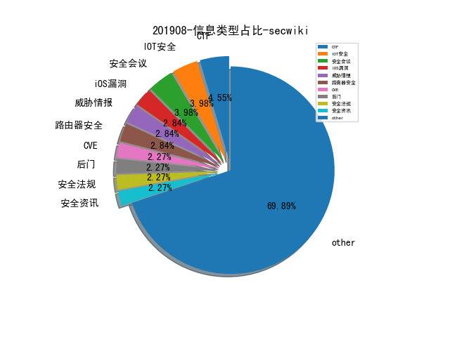
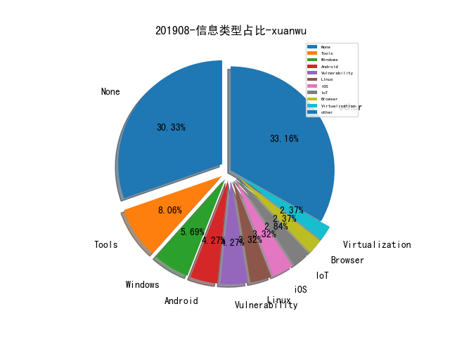
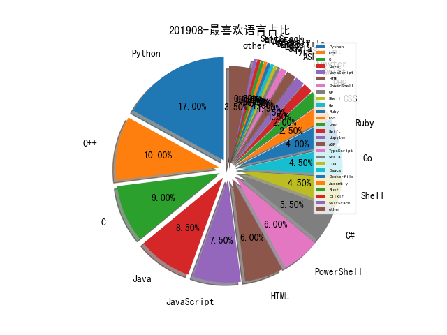

# [数据年报](README_YEAR.md)
# [数据月报-7月](README_7.md)
# [数据月报-6月](README_6.md)
# [数据月报-5月](README_5.md)
# [数据月报-4月](README_4.md)
# [数据月报-3月](README_3.md)
# 201908 信息源与信息类型占比

# 微信公众号 推荐
| nickname_english | weixin_no | url | title| 
| --- | --- | --- | ---| 
| 奇安信 CERT |  | https://mp.weixin.qq.com/s/qxkV_7MZVhUYYq5QGcwCtQ | WebLogic安全研究报告 | 1| 
| 安全喷子 |  | https://mp.weixin.qq.com/s/xxU0R5eVcP_42VVd2DQeXQ | 网络安全“圣地”之行 | 1| 
| APT攻击 | cncg_team | https://mp.weixin.qq.com/s/d9AYfW9r8RjCZxxs9jjheA | APT29之来去影无踪——特殊的CnC渠道 | 1| 
| ChaMd5安全团队 | chamd5sec | https://mp.weixin.qq.com/s/EN8cch8uO8Qnfb_eewbw9w | De1CTF 2019-WriteUp | 2| 
| SIGAI | SIGAICN | https://mp.weixin.qq.com/s/b4_OdxgxsK8CCU5b8qCEfw | NLP技术也能帮助程序分析？ | 1| 
| 天融信阿尔法实验室 |  | https://mp.weixin.qq.com/s/SavldFETaFea3l7kVX2RyA | ATT&CK之后门持久化（一） | 2| 
| 威胁情报小屋 |  | https://mp.weixin.qq.com/s/IrM60hbB6dWdbWxpFbO1lA | 海莲花攻击手法概述 | 1| 
| 安全学术圈 | secquan | https://mp.weixin.qq.com/s/6_cEwkqFX-oeuLk6thZUcQ | ​利用无人机通过激光与物理隔离设备建立隐蔽信道 | 2| 
| 水滴安全实验室 | EversecLab | https://mp.weixin.qq.com/s/KPw81stOcBthxZHlanS0BA | 物联网固件漏洞挖掘——经典命令执行漏洞分析复现 | 1| 
| 汉客儿 |  | https://mp.weixin.qq.com/s/wna8pBu1s_jNI8kDeBGEwA | 一次美丽的误会引发对函数调用保护的思考 | 1| 
| 绿盟科技 | NSFOCUS-weixin | https://mp.weixin.qq.com/s/pHYpHw1PuLddW2NJZZzA6A | 2019TechWorld技术嘉年华精华大放送【附PPT下载】 | 1| 
| 孟极实验室 | mengjiteam | https://mp.weixin.qq.com/s/HDZUsTbffeGhgwu1FOWQNg | 一条命令实现端口复用后门 | 1| 

# 组织github账号 推荐
| github_id | title | url | org_url | org_profile | org_geo | org_repositories | org_people | org_projects | repo_lang | repo_star | repo_forks| 
| --- | --- | --- | --- | --- | --- | --- | --- | --- | --- | --- | ---| 
| pywinauto | pywinauto - Python 实现的 Windows 平台 GUI 自动化测试工具，可以向 UI 组件发送鼠标和键盘事件 | https://github.com/pywinauto/pywinauto | http://pywinauto.github.io/ | Windows GUI Automation with Python | http://pywinauto.github.io/ | 0 | 0 | 0 | Python,CSS,C++ | 1600 | 337 | 1| 
| nccgroup | nccgroup团队基于Sulley构造的一个对网络协议进行模糊测试的工具。 | https://github.com/nccgroup/fuzzowski | https://www.nccgroup.trust | Please report all security issues to security at nccgroup dot com | Global | 0 | 0 | 0 | C,Shell,Java,Python,JavaScript,C++,C#,HTML,Elixir,Ruby,PowerShell,Rust | 760 | 104 | 1| 
| CENSUS | Windows 10 RS2/RS3 Bypass GDI pushlock Mitigation 的两个技巧 | https://github.com/CENSUS/windows_10_rs2_rs3_exploitation_primitives | http://census-labs.com/ |  | Greece | 0 | 0 | 0 | Python,C++ | 0 | 0 | 1| 
| Riscure | 用AFL Fuzz OP-TEE的系统调用 | https://github.com/Riscure/optee_fuzzer | http://www.riscure.com | Riscure Security Lab | http://www.riscure.com | 0 | 0 | 0 | Python,C,Julia | 0 | 0 | 1| 
| ssd-secure-disclosure | 详细介绍了iOS安全缓解措施的一步步进化 | https://github.com/ssd-secure-disclosure/typhooncon2019/blob/master/Siguza%20-%20Mitigations.pdf | https://ssd-disclosure.com/ | SSD helps security researchers turn their skills in uncovering security vulnerabilities into a career. | https://ssd-disclosure.com/ | 0 | 0 | 0 | Python,C | 0 | 0 | 1| 
| ucsb-seclab | sasi：基于Angr来清除二进制中冗余代码的工具，相对已有工具的性能提高主要来源于它能更加准确完整地恢复CFG | https://github.com/ucsb-seclab/sasi | http://seclab.cs.ucsb.edu | The Computer Security Group at UC Santa Barbara | Santa Barbara | 0 | 0 | 0 | Python,C,Java,C++ | 0 | 0 | 1| 

# 私人github账号 推荐
| github_id | title | url | p_url | p_profile | p_loc | p_company | p_repositories | p_projects | p_stars | p_followers | p_following | repo_lang | repo_star | repo_forks | 
| --- | --- | --- | --- | --- | --- | --- | --- | --- | --- | --- | --- | --- | --- | ---| 
| s0md3v | goop: Google Search Scraper | https://github.com/s0md3v/goop | https://github.com/s0md3v | I make things, I break things and I make things that break things. Twitter: @s0md3v | None | None | 31 | 0 | 0 | 2600 | 0 | Python,JavaScript | 6900 | 868 | 1| 
| smealum | 爱感（LOVENSE）Hush 情趣用品的漏洞利用代码 | https://github.com/smealum/butthax | http://smealum.net |  | None | None | 38 | 0 | 15 | 1200 | 2 | C,Assembly | 468 | 137 | 1| 
| jas502n | 开源企业搜索平台 Solr 被发现 DataImport Handler RCE | https://github.com/jas502n/CVE-2019-0193 | None | 1.misc 2.crypto 3. web 4. reverse 5. android 6. pwn 7. elf | None | None | 160 | 0 | 174 | 1100 | 134 | Python,C#,C,Shell | 301 | 110 | 1| 
| shmilylty | OneForAll 一款功能强大的子域收集工具 | https://github.com/shmilylty/OneForAll | https://github.com/Qihoo360 | Information security researcher, CTF enthusiast. | Beijing, China | @Qihoo360 | 108 | 0 | 992 | 753 | 116 | Python,Go,JavaScript,HTML | 747 | 216 | 1| 
| Kevin-Robertson | Windows网络协议层攻击套件包括 SMB LLMNR NBNS mDNS DNS | https://github.com/Kevin-Robertson/InveighZero | https://github.com/NetSPI |  | None | @NetSPI | 7 | 0 | 226 | 364 | 8 | C#,PowerShell | 929 | 231 | 1| 
| zer0yu | Berserker-针对Pentest或者CTF的一个fuzz payload项目 | https://github.com/zer0yu/Berserker | http://zeroyu.xyz/ | Red Team@PolarisLab / CTFer->Web@LZ | None | None | 34 | 0 | 2300 | 268 | 1300 | Python,HTML,CSS | 292 | 43 | 1| 
| rk700 | 之前推过AFL-Unicorn项目可以让AFL fuzz能用Unicorn模拟的闭源binary，这个uniFuzzer项目很类似，是要把libfuzzer应用在闭源binary上 | https://github.com/rk700/uniFuzzer// | http://rk700.github.io |  | None | None | 18 | 0 | 57 | 248 | 2 | Python,C,Java | 606 | 161 | 1| 
| meitar | Awesome Cybersecurity Blue Team - 蓝队防御相关的工具、文章资料收集 | https://github.com/meitar/awesome-cybersecurity-blueteam | https://web.archive.org/web/20190206200948/https://maymay.net/blog/2019/02/06/why-i-am-publicly-disassociating-myself-from-the-recurse-center/ | ⚑ Ⓐnti-capitalist Free Software developer, pro white genocide, abolish all prisons, 0xACAB ⚑ | https://cyberbusking.org/ | Code signing GPG key: C42F 2F04 C42D 489E 23DD 71CE 07EF AA28 AB94 BC85 | 196 | 0 | 48 | 240 | 0 | Shell,PHP,HTML | 398 | 44 | 1| 
| cobbr | SharpSploit - C# 语言编写的基于 .NET 的后渗透测试工具 | https://github.com/cobbr/SharpSploit | https://cobbr.io |  | Dallas, TX | SpecterOps | 17 | 0 | 48 | 230 | 1 | C#,PowerShell | 570 | 89 | 1| 
| 1522402210 | 一套 webkit 完整 rce 的详细分析 (render rce+sbx) | https://github.com/1522402210/Issue-198327 | None | BlockChain Fans | None | None | 599 | 0 | 3800 | 198 | 1700 | Python,Go,PowerShell,C++ | 289 | 111 | 1| 
| maddiestone | Chamois - 2018 年 Android 平台影响最大的 Botnet 恶意软件 | https://github.com/maddiestone/ConPresentations/blob/master/KasperskySAS2019.Chamois.pdf | http://twitter.com/maddiestone |  | None | None | 3 | 0 | 2 | 186 | 1 | Python | 457 | 96 | 1| 
| rockbruno | swiftshield - Swift/OBJ-C 代码混淆工具 | https://github.com/rockbruno/swiftshield | https://github.com/ifood | Software Engineer (iOS) at @ifood, Writer https://swiftrocks.com | Brazil | @ifood | 41 | 0 | 15 | 159 | 0 | Java,Ruby,Swift,C++ | 48700 | 7800 | 1| 
| lazyparser | SpiderMonkey Internals - SpiderMonkey JavaScript 引擎学习相关的笔记 | https://github.com/lazyparser/spidermonkey-internals | http://lazyparser.com |  | None | None | 48 | 0 | 199 | 134 | 62 | HTML | 93 | 53 | 1| 
| brompwnie | Break out the Box (BOtB) - Blackhat Arsenal 会议上公开的一款用于容器分析和常见容器漏洞利用的工具 | https://github.com/brompwnie/botb/releases/tag/1.2.0 | https://twitter.com/brompwnie | Keyboard wrangler ⌨️ | None | None | 18 | 0 | 9 | 62 | 14 | CSS,Go,Java,Smali,C++ | 462 | 213 | 1| 
| NotMedic | rdp-tunnel: Pre-compiled tools to tunnel TCP over RDP Conn... | https://github.com/NotMedic/rdp-tunnel | None |  | None | None | 16 | 0 | 2 | 40 | 0 | HTML,C,JavaScript,PowerShell,C++ | 219 | 36 | 1| 
| dahall | Vanara - 方便从 .NET 调用 Windows Native API 而写的 .NET 字节码库 | https://github.com/dahall/Vanara | None | Ive been writing and designing code for over 20 years for both commercial and open source use. I work as a CTO for tech firm. | United States | None | 14 | 0 | 2 | 38 | 0 | C# | 304 | 69 | 1| 
| artsploit | solr-injection: Apache Solr Injection Research | https://github.com/artsploit/solr-injection | https://artsploit.blogspot.com/ |  | None | Veracode | 5 | 0 | 8 | 28 | 0 | PHP,Java | 191 | 16 | 1| 
| Ch1ngg | AggressorScript-CreateCloneHiddenAccount | https://github.com/Ch1ngg/AggressorScript-CreateCloneHiddenAccount | https://www.ch1ng.com/ |  | no | no | 7 | 0 | 99 | 21 | 14 | C#,Python,ASP,Java,PowerShell | 16 | 5 | 2| 
| baronpan | SysmonHunter：一个简单的基于ATT&CK的Sysmon日志狩猎工具 | https://github.com/baronpan/SysmonHunter | http://threatmobile.blogspot.com |  | None | None | 11 | 0 | 10 | 17 | 5 | Python,Batchfile,JavaScript,Java,PowerShell | 31 | 7 | 1| 
| butterflyhack | linux蓝牙模块空指针引用漏洞PoC。 | https://github.com/butterflyhack/CVE-2019-10207/ | None |  | None | None | 129 | 0 | 19 | 13 | 28 | Python,C,Java | 15 | 7 | 1| 
| chame1eon | jni 函数调用 trace 模块，基于 frida | https://github.com/chame1eon/jnitrace | None |  | None | None | 3 | 0 | 0 | 5 | 0 | Python,Lua,JavaScript | 71 | 9 | 1| 
| lion-gu | IOC Explorer：自动化关联失陷指标的工具 | https://github.com/lion-gu/ioc-explorer | None |  | None | None | 1 | 0 | 3 | 2 | 0 | Python | 22 | 2 | 1| 
| MegadodoPublications | Mautic Remote Code Execution | https://github.com/MegadodoPublications/exploits/blob/master/mautic.md | None |  | Germany | None | 1 | 0 | 0 | 1 | 0 |  | 4 | 1 | 1| 

# 日更新程序
`python update_daily.py`