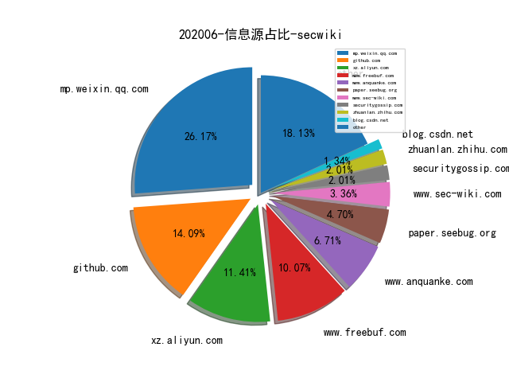

# [数据--所有](README_20.md)
# [数据--年度](README_2020.md)
# 202006 信息源与信息类型占比

# 微信公众号 推荐
| nickname_english | weixin_no | title | url| 
| --- | --- | --- | ---| 

# 组织github账号 推荐
| github_id | title | url | org_url | org_profile | org_geo | org_repositories | org_people | org_projects | repo_lang | repo_star | repo_forks| 
| --- | --- | --- | --- | --- | --- | --- | --- | --- | --- | --- | ---| 

# 私人github账号 推荐
| github_id | title | url | p_url | p_profile | p_loc | p_company | p_repositories | p_projects | p_stars | p_followers | p_following | repo_lang | repo_star | repo_forks | 
| --- | --- | --- | --- | --- | --- | --- | --- | --- | --- | --- | --- | --- | --- | ---| 
| 0xricksanchez | FI(le) SY(stem) - 针对 BSD 系统内核的 Fuzzer | https://github.com/0xricksanchez/fisy-fuzz | https://0x434b.dev | Trying to advance in the areas of IT-Sec, reversing and hacking. Also doing administrative jobs @ www.0x00sec.org | @0xricksanchez | None | 20 | 0 | 426 | 64 | 54 | Python,C,PLSQL | 35 | 7 | 1| 
| NomadCN112 | ATT&CK 框架图中文翻译版 | https://github.com/NomadCN112/Chinese-translation-ATT-CK-framework | None | 憨批独眼小子 (如果可以的话，谁愿意拿命去战斗呢) | None | None | 15 | 0 | 10 | 25 | 2 | Python,C# | 131 | 37 | 1| 
| cbwang505 | Windows CardSpace 服务符号链接导致任意文件替换漏洞 Exploit | https://github.com/cbwang505/CVE-2020-1066-EXP | https://blog.csdn.net/oShuangYue12 | 始于C#，精于C&C++，醉心于Windows内核与Com组件安全研究 | China ZheJiang Ningbo | ZheJiang Guoli Security Technology | 30 | 0 | 17 | 24 | 5 | C,C++ | 43 | 9 | 1| 
| joinsec | BadDNS: 使用公共 DNS 服务器进行多层子域名探测的极速工具 | https://github.com/joinsec/BadDNS | None | None | None | None | 0 | 0 | 0 | 0 | 0 | Go,Python,Rust | 0 | 0 | 1| 

# medium_xuanwu 推荐
| title | url| 
| --- | ---| 
| 索尼网站XSS漏洞 | http://link.medium.com/UhLfjkZeU6| 

# medium_secwiki 推荐
| title | url| 
| --- | ---| 

# zhihu_xuanwu 推荐
| title | url| 
| --- | ---| 

# zhihu_secwiki 推荐
| title | url| 
| --- | ---| 

# 日更新程序
`python update_daily.py`