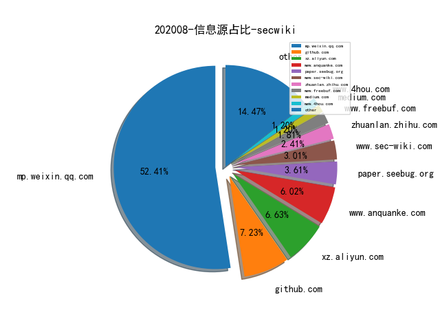
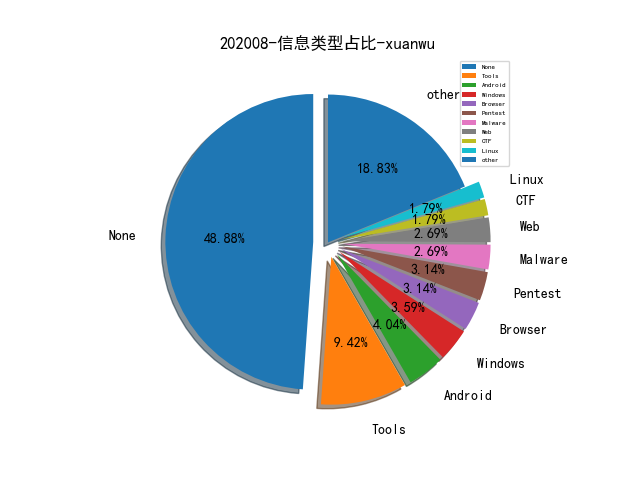

# [数据--所有](README_20.md)
# [数据--年度](README_2020.md)
# 202008 信息源与信息类型占比

# 微信公众号 推荐
| nickname_english | weixin_no | title | url| 
| --- | --- | --- | ---| 
| AX科技圈 | axkjq2006 | 【M水堇】数字化平台建设总结--技术篇 | https://mp.weixin.qq.com/s/qmMRmEcSnGmD6Y4vg6zjow | 1| 
| FreeBuf | freebuf | 内网渗透：不出网渗透技巧 | https://mp.weixin.qq.com/s/wpJKZAxMUScGRX2XIocK0g | 1| 
| OPPO安全应急响应中心 | opposrc | OPPO互联网DevSecOps实践 | https://mp.weixin.qq.com/s/eCwXozibaABcZjUOqTn4Zg | 1| 
| Piz0n | gh_339ee98cec1b | 从乙方到甲方 , 我所亲历的信息安全建设之变迁【1】 | https://mp.weixin.qq.com/s/mJNcCZfElyCAbq1aSHHTDw | 1| 
| 安全学术圈 | secquan | SecureComm 2020 论文录用列表 | https://mp.weixin.qq.com/s/6RYi-oBdshpZUGARzLE-4A | 2| 
| 情报分析师 | qingbaofenxishi | 恐怖组织使用加密货币的可能性与需求 | https://mp.weixin.qq.com/s/W0kZLbLcja1Sxh7QM8os_g | 1| 
| 虎符智库 | TT_Thinktank | 十年百余起事件，软件供应链面临安全危机 | https://mp.weixin.qq.com/s/zWp0j805H62nUbl9KTOohw | 1| 
| 阿里安全响应中心 | alisrc | 污点传递理论在Webshell检测中的应用 -- PHP篇 | https://mp.weixin.qq.com/s/MFmSliCQaaVEQ0E66vN5Xg | 3| 
| 零队 | gh_a3bc6828636a | MySQL蜜罐获取攻击者微信ID | https://mp.weixin.qq.com/s/m4I_YDn98K_A2yGAhv67Gg | 1| 
| 404 Not F0und | gh_8cea5d3d902b | 入职一月的体感与思考 | https://mp.weixin.qq.com/s/O2CpObfiGOLa8CZbkP08Hg | 1| 
| Tide安全团队 | TideSec | ​某地市攻防演练总结与反思 | https://mp.weixin.qq.com/s/QoMn-T_KKT4oo7I-TRGAUQ | 1| 
| 绿盟科技 | NSFOCUS-weixin | AISecOps : 从DARPA TC项目看终端攻防 | https://mp.weixin.qq.com/s/gS5_yLCMflFMq_K3zsklLA | 1| 
| 网络安全观 | SecurityInsights | 美国网络安全 , MITRE Shield 积极防御知识库 | https://mp.weixin.qq.com/s/cljI9AFVNEb4YkglzYayDg | 4| 
| Python遇见机器学习 | Python_DL | 万字长文总结机器学习的模型评估与调参，附代码下载 | https://mp.weixin.qq.com/s/Uenwe66pwl4SzcW1P2B7Iw | 1| 
| Secquan圈子社区 | secquan_org | Jenkins的后门实现（密码窃取,命令执行） | https://mp.weixin.qq.com/s/C002y-fBZVFv-dQztdC6Bg | 1| 
| 安全客 | anquanbobao | 萌新从0开始的专业渗透测试报告编写指南 | https://mp.weixin.qq.com/s/BKwPy27aVM4fSrTSlLbq7g | 1| 
| ChaMd5安全团队 | chamd5sec | 浅谈哥斯拉内存Shell技术 | https://mp.weixin.qq.com/s/D0ACXtPsj91chP4zmGpUjQ | 7| 
| ChaBug | ChaBugSec | 护网礼盒：哥斯拉Godzilla shell管理工具 | https://mp.weixin.qq.com/s/_4ACLzaImDMQbZWfhSHnwg | 1| 
| Coggle数据科学 | gh_8df601c10cb4 | 2020腾讯广告算法大赛方案分享及代码（冠军） | https://mp.weixin.qq.com/s/-lizDyP2y357plcG1M64TA | 1| 
| DataFunTalk | datafuntalk | Fraudar算法在京东关系网络反欺诈中的应用 | https://mp.weixin.qq.com/s/Qp1Yrlu92LwZ-n4kipq0sw | 1| 
| DeadEye安全团队 | gh_fcf5d3d1e57d | 关于Cobalt Strike检测方法与去特征的思考 | https://mp.weixin.qq.com/s/5MWDXN3eCaw9m-XHDGaXcQ | 1| 
| Pai Sec Team | huahuaSec | 半自动化冰蝎流量分析的实践 | https://mp.weixin.qq.com/s/w40qI2iPNLx9GjgkYRyhpg | 1| 
| ZoomEye | ZoomEye_Team | 利用 ZoomEye 追踪多种 Redteam C&C 后渗透攻击框架 | https://mp.weixin.qq.com/s/H66J0ab8UAyVrxRb1RLO4g | 1| 
| vivo千镜安全实验室 | gh_54ff3f871510 | 软件源码安全攻防之道（上） | https://mp.weixin.qq.com/s/jb3VQyK3U6BQS0-0ad0K_w | 1| 
| 丁爸 情报分析师的工具箱 | dingba2016 | 【图文资料】基于开源情报网络分析与网页分析 | https://mp.weixin.qq.com/s/UIKHaQzXWc6p6Mjonrk8cg | 1| 
| 中国信息安全 | chinainfosec | 院士谈 , 陈纯院士、冯登国院士论数据安全治理 | https://mp.weixin.qq.com/s/JWBAZfDPW1QIjrRdc5Yb3Q | 1| 
| 唯品会安全应急响应中心 | VIP_SRC | 【技术分享】大规模数据安全分类系统架构实践 | https://mp.weixin.qq.com/s/mRmDEuDKJSJ_xrYyBMn4Dw | 1| 
| 国家网络威胁情报共享开放平台 | CNTIC2017 | DataCon2020 恶意代码分析冠军writeup | https://mp.weixin.qq.com/s/e69Fg9UBX3B2BFiGvsg4Gg | 1| 
| 奇安信威胁情报中心 | gh_166784eae33e | 从补丁分析到在野利用：揭秘CVE-2020-1464 Windows文件签名验证绕过漏洞疑云 | https://mp.weixin.qq.com/s/CRdDJeen-Zqc0RCnMr4kzQ | 1| 
| 湛卢工作室 | xuehao_studio | 冰蝎3.0简要分析 | https://mp.weixin.qq.com/s/4FeZwDlLdWOjgITdWH1ucQ | 2| 
| 米斯特安全团队 | acmesec | 代码审计 , PHPCMS V9 前台RCE挖掘分析 | https://mp.weixin.qq.com/s/zLXJtekT9O3OuzwBLigMsA | 1| 
| 谈数据 | learning-bigdata | 数据中台：基于标签体系的360°用户画像 | https://mp.weixin.qq.com/s/zIbhQjP9OTIPG9uRr64xtA | 1| 
| 这里是河马 | gh_d110440c4890 | 河马查杀1.8.2 发布,支持检测冰蝎、哥斯拉后门 | https://mp.weixin.qq.com/s/GpGubo6CRL9OOEumkyL29A | 2| 
| Gorgias的一己之见 | GorgiasInsight | 固件提取系列(一)-固件载体 | https://mp.weixin.qq.com/s/xWUoAwilc6v_0BMZXpbZqA | 1| 
| 明不可欺 | gh_1405d616adc7 | 网络赌博的管辖权、代理、赌资、四方的法律规定 | https://mp.weixin.qq.com/s/XAp40kxf-I0nmOjDBAD7Dg | 1| 
| 公务员与事业单位 | gwy-sydw | 警惕！2020年多名公务员因微信办公违规被处理，案例鲜活，教训惨痛 | https://mp.weixin.qq.com/s/QOUFyVa4c4xGO1v4FroLXw | 1| 
| Gcow安全团队 | Gcow666 | CVE-2017-0261及利用样本分析 | https://mp.weixin.qq.com/s/Sk7Lx0sKAfD_wTuhcWiBig | 1| 
| NEO攻防队 | gh_5afc80b9df33 | 浅谈蓝队反制手段 | https://mp.weixin.qq.com/s/qjM7Fh0u0Edsz5C7L_ErGQ | 1| 
| 互联网安全内参 | anquanneican | 中小型银行实战攻防演练经验分享 | https://mp.weixin.qq.com/s/sGoGelUKd8ehYlghOgg7gw | 1| 
| 图谱学苑 | gh_eb1997a4e380 | 神秘Palantir-平台介绍 | https://mp.weixin.qq.com/s/JgLkd4_J5s93FDuS31F-Cg | 1| 
| 宽字节安全 | gh_2de2b9f7d076 | s2 059 初步分析 | https://mp.weixin.qq.com/s/smJCN_nktLJiZUrGk34KGw | 4| 
| 时间之外沉浮事 | tasnrh | 调研报告 , 以色列网络安全调研报告 | https://mp.weixin.qq.com/s/uaMfeENw6DexSNNO-Cbl_Q | 2| 
| 极光无限 | AuroraInfinity | 2020数据泄露调查报告 | https://mp.weixin.qq.com/s/agMbnkeE39LlgfcivfCexA | 1| 
| 纸鱼AI | gh_5cb3929923da | 智源&计算所-互联网虚假新闻检测挑战赛（冠军）方案分享，代码已开源 | https://mp.weixin.qq.com/s/c8f0wDHigNQUlmxtFVG0aA | 1| 
| 网信中国 | cacweixin | 国家互联网应急中心（CNCERT）发布《2019年中国互联网网络安全报告》 | https://mp.weixin.qq.com/s/0GU_cC9PGwWPKA1ZdxCF4g## | 1| 
| 贝塔安全实验室 | BetaSecLab | Windows通用应用平台UWP持久化 | https://mp.weixin.qq.com/s/rHE2Xj335RzhlB-KvxJLpQ | 1| 
| 跨越鸿沟 | gh_0bae97403201 | 信息安全：研究体系(220页) | https://mp.weixin.qq.com/s/WeBXUyP3-gbzrRrHmPyY9w | 1| 
| 锦行信息安全 | jeeseensec | 安全技术,BloodHound 使用指南 | https://mp.weixin.qq.com/s/dBWq1rCZYVS9oDgIGwcCdA | 1| 
| 雷神众测 | thorsrc | 护网自动化脚本 | https://mp.weixin.qq.com/s/uHNx28XFZ5M6KwykMC4Jsg | 2| 
| 看雪学院 | ikanxue | 某Nginx后门分析复现与改写 | https://mp.weixin.qq.com/s/U2trVwV75yEW5HpVn0Ki8A | 1| 
| 安全鸭 | yliang53 | 横向渗透的常见方法 | https://mp.weixin.qq.com/s/eMXWYV-5sKR0HfcqMJOBWg | 1| 
| 腾讯安全应急响应中心 | tsrc_team | 红蓝对抗之域名搜集方法总结 | https://mp.weixin.qq.com/s/rECW5vKbUfI89F31WEQjyw | 1| 
| GobySec | gobysec | 技术分享 , Goby食用指南之红蓝对抗 | https://mp.weixin.qq.com/s/G-Vn4htAhjwlJb67v2TtRw | 1| 
| SCUCTF | scuctf | WMCTF2020 WP by 0x401 | https://mp.weixin.qq.com/s/Ll-f25pLOPbkjlo9zGFbFA | 1| 

# 组织github账号 推荐
| github_id | title | url | org_url | org_profile | org_geo | org_repositories | org_people | org_projects | repo_lang | repo_star | repo_forks| 
| --- | --- | --- | --- | --- | --- | --- | --- | --- | --- | --- | ---| 

# 私人github账号 推荐
| github_id | title | url | p_url | p_profile | p_loc | p_company | p_repositories | p_projects | p_stars | p_followers | p_following | repo_lang | repo_star | repo_forks | 
| --- | --- | --- | --- | --- | --- | --- | --- | --- | --- | --- | --- | --- | --- | ---| 
| 7Hxz233 | Lilac 2020 暑期pwn培训课件 | https://github.com/7Hxz233/Lilac_2020_summer_pwn | None | None | None | None | 0 | 0 | 0 | 0 | 0 | PostScript,C,HTML,Ruby,PHP | 0 | 0 | 1| 
| CTF-MissFeng | Watchdog: SRC资产管理系统 | https://github.com/CTF-MissFeng/Watchdog | None |  | None | None | 6 | 0 | 0 | 0 | 0 | Python,Go | 738 | 192 | 1| 
| Droidzzzio | 用于枚举子域wordlist，php文件路径，html文件路径和js文件路径的开源工具 | https://github.com/Droidzzzio/EnumerationList | https://twitter.com/ShMalav | Security Researcher Bug Bounty Hunter | INDIA | None | 44 | 0 | 0 | 0 | 0 | Python | 32 | 8 | 1| 
| Jewel591 | XSSMAP-一款快速检测Web应用程序中的XSS漏洞的开源工具 | https://github.com/Jewel591/xssmap | http://Jewel591.fun | Security operations engineer | United Kingdom | A security consulting firm | 15 | 0 | 0 | 0 | 0 | Python,C,Perl | 30 | 5 | 1| 
| SecureAuthCorp | RCE in any MS Exchange via Exchange Trusted Subsystem | https://github.com/SecureAuthCorp/impacket/pull/857 | None | None | None | None | 0 | 0 | 0 | 0 | 0 | C,Java,Python,JavaScript,C#,HTML,Go | 0 | 0 | 1| 
| arieljt | VT Code Similarity Yara Generator | https://github.com/arieljt/VTCodeSimilarity-YaraGen | https://twitter.com/arieljt |  | None | None | 3 | 0 | 0 | 0 | 0 | Python | 34 | 6 | 1| 
| avast | Radare2 插件，用于将 RetDec 反汇编工具集成进 Radare2 | https://github.com/avast/retdec-r2plugin | None | None | None | None | 0 | 0 | 0 | 0 | 0 | Groovy,LLVM,Java,Scala,Python,Kotlin,JavaScript,C++,HTML,Go | 5500 | 657 | 1| 
| cobbr | .NET 编写的一款 C&C 渗透框架 | https://github.com/cobbr/Covenant | https://cobbr.io |  | Dallas, TX | SpecterOps | 20 | 0 | 0 | 0 | 0 | C#,PowerShell | 1600 | 307 | 1| 
| darvincisec | 无需 root 和重打包，将 App 安装到克隆 App 内实现动态分析 | https://github.com/darvincisec/VirtualDynamicAnalysis | https://darvincitech.wordpress.com | Security Researcher | Singapore | None | 10 | 0 | 0 | 0 | 0 | C,Java,Smali | 93 | 25 | 1| 
| doyensec | Electron.js Hacking 相关的资料收集整理 | https://github.com/doyensec/awesome-electronjs-hacking | None | None | None | None | 0 | 0 | 0 | 0 | 0 | Python,C,JavaScript,Java,C++ | 0 | 0 | 1| 
| duffelhq | Elixir Ecto Paginator 刚刚修复了一个 RCE 漏洞 | https://github.com/duffelhq/paginator/security/advisories/GHSA-w98m-2xqg-9cvj | None | None | None | None | 0 | 0 | 0 | 0 | 0 | Shell,Python,JavaScript,HTML,Elixir,Go,Erlang | 0 | 0 | 1| 
| googleprojectzero | Samsung Qmage MMS Exploit (CVE-2020-8899) | https://github.com/googleprojectzero/SkCodecFuzzer/tree/master/mms_exploit | None | None | None | None | 0 | 0 | 0 | 0 | 0 | C,C#,C++,Python,HTML,Swift | 0 | 0 | 1| 
| hslatman | 一些恶意软件分析会用到的工具和资源集合 | https://github.com/hslatman/awesome-malware-analysis | https://hermanslatman.nl |  | None | DistributIT | 116 | 0 | 0 | 0 | 0 | Python,Go,HTML,JavaScript | 46100 | 11600 | 1| 
| kisec | Kibana CVE-2019-7609 RCE Exploit 代码 | https://github.com/kisec/CVE-2019-7609?fbclid=IwAR02m1XrcGDleYn8KzrjBRuIFNXzwJumhrYi2n7zSFeq9fvPk39FxPyAyWY | http://www.kisec.com | Korea Information Security Education Center | None | 한국정보보호교육센터 | 25 | 0 | 0 | 0 | 0 | Python,Go,Shell | 13 | 2 | 1| 
| latentgod | OpenSA: 运维自动化平台 | https://github.com/latentgod/OpenSA | None |  | None | None | 38 | 0 | 0 | 0 | 0 | Python,PHP,JavaScript,Vim | 6 | 10 | 1| 
| maubot | 适用于maubot的GitLab客户端和Webhook接收器。 | https://github.com/maubot/gitlab | None | None | None | None | 0 | 0 | 0 | 0 | 0 | Python,HTML | 129 | 27 | 1| 
| mitre-attack | 关于辅助实现自动化ATT＆CK归纳的python脚本 | https://github.com/mitre-attack/attack-scripts/tree/master/layers | None | None | None | None | 0 | 0 | 0 | 0 | 0 | TypeScript,Zeek,Python,JavaScript,HTML,PowerShell | 0 | 0 | 1| 
| napocahv | Napoca - Bitdefender 开源的 Hypervisor，提供多个安全相关的功能 | https://github.com/napocahv/napoca | None | None | None | None | 0 | 0 | 0 | 0 | 0 | C | 87 | 22 | 1| 
| nautilus-fuzz | 基于 NDSS 2019 一篇 Paper 实现的一个基于 Grammar、Coverage Guided 的 Fuzzer | https://github.com/nautilus-fuzz/nautilus | None | None | None | None | 0 | 0 | 0 | 0 | 0 | Python | 0 | 0 | 1| 
| nomi-sec | PoC auto collect from GitHub | https://github.com/nomi-sec/PoC-in-GitHub | None | None | None | None | 0 | 0 | 0 | 0 | 0 |  | 0 | 0 | 1| 
| osixia | 运行 OpenLDAP 的 Docker 镜像环境 | https://github.com/osixia/docker-openldap | None | None | None | None | 0 | 0 | 0 | 0 | 0 | Shell,Dockerfile,JavaScript,Smarty,HTML,Go,PHP,Ruby,CSS | 2500 | 692 | 1| 
| securesystemslab | Agamotto: Accelerating Kernel Driver Fuzzing with Lightweight Virtual Machine Checkpoints | https://github.com/securesystemslab/agamotto | None | None | None | None | 0 | 0 | 0 | 0 | 0 | C,Shell,Java,Objective-C++,Python,C++,CMake,Rust | 0 | 0 | 1| 
| taomujian | linbing: 临兵漏洞扫描系统 | https://github.com/taomujian/linbing | None |  | 以色列 | None | 14 | 0 | 0 | 0 | 0 | Python,C#,Java,HTML,Dockerfile | 139 | 48 | 1| 
| ttonys | 获取每日最新的CVE和CNVD漏洞 | https://github.com/ttonys/Scrapy-CVE-CNVD | https://www.sys71m.top/ | 只见树木，不见森林 | None | None | 5 | 0 | 0 | 0 | 0 | Python,PHP,HTML,CSS | 15 | 1 | 1| 
| zer0yu | Awesome CobaltStrike | https://github.com/zer0yu/Awesome-CobaltStrike | http://zeroyu.xyz/ | RedTeam@PolarisLab / CTFer@kn0ck | None | None | 40 | 0 | 0 | 0 | 0 | Python,HTML | 626 | 111 | 1| 

# medium_xuanwu 推荐
| title | url| 
| --- | ---| 
| Vault 101：Samsung CTF App逆向工程挑战赛题目。 | http://medium.com/bugbountywriteup/vault-101-samsung-ctf-android-reverse-engineering-challenge-write-up-d5a2b16a9212| 
| DHCP starvation attack without making any DHCP requests - DHCP IP 资源耗尽攻击 | http://medium.com/bugbountywriteup/dhcp-starvation-attack-without-making-any-dhcp-requests-bef0022133c9| 
| wget缓存中毒 | http://medium.com/bugbountywriteup/cache-poisoning-of-wget-94a4d70104b1?source=rss----7b722bfd1b8d---4| 
| 常见的Linux权限提升手法 | http://medium.com/bugbountywriteup/write-up-11-common-linux-privilege-escalation-92528853b616?source=rss----7b722bfd1b8d---4| 
| 无括号的XSS | http://medium.com/@terjanq/arbitrary-parentheses-less-xss-e4a1cf37c13d| 
| 如何利用Kali下的神器Bloodhound 进行横向移动 | http://medium.com/@rootsecdev/bloodhound-part-1-a-walkthrough-in-lateral-movements-and-paths-to-domain-admin-870dd05abde6| 
| 关于2020年Tor网络的安全分析第一部分 | http://medium.com/@nusenu/how-malicious-tor-relays-are-exploiting-users-in-2020-part-i-1097575c0cac| 

# medium_secwiki 推荐
| title | url| 
| --- | ---| 
| FAQs on Getting Started in Cyber Threat Intelligence | https://medium.com/katies-five-cents/faqs-on-getting-started-in-cyber-threat-intelligence-f567f267348e| 
| How Malicious Tor Relays are Exploiting Users in 2020 (Par... | https://medium.com/@nusenu/how-malicious-tor-relays-are-exploiting-users-in-2020-part-i-1097575c0cac| 

# zhihu_xuanwu 推荐
| title | url| 
| --- | ---| 

# zhihu_secwiki 推荐
| title | url| 
| --- | ---| 
| DataCon2020 僵尸网络追踪第一题writeup | https://zhuanlan.zhihu.com/p/186254809| 
| 写给技术创业者的创业思考框架 | https://zhuanlan.zhihu.com/p/84058442| 
| 从现状看威胁情报发展趋势 | https://zhuanlan.zhihu.com/p/183993203| 
| 人物图谱构建技术 | https://zhuanlan.zhihu.com/p/166587883| 

# xz_xuanwu 推荐
| title | url| 
| --- | ---| 

# xz_secwiki 推荐
| title | url| 
| --- | ---| 
| 以OpenRASP为基础-展开来港港RASP的类加载 | https://xz.aliyun.com/t/8148| 
| 针对学校内网的一次渗透测试 | https://xz.aliyun.com/t/8147| 
| TP5.0.xRCE&5.0.24反序列化分析 | https://xz.aliyun.com/t/8143| 
| 无字母数字webshell总结 | https://xz.aliyun.com/t/8107| 
| 浅探内网横向移动-Pass The Hash | https://xz.aliyun.com/t/8117| 
| 浅谈PHP无回显命令执行的利用 | https://xz.aliyun.com/t/8125| 
| OneThink前台注入分析 | https://xz.aliyun.com/t/8081| 
| 关于检测web蜜罐利用jsonp获取信息的一些想法 | https://xz.aliyun.com/t/8111| 
| 实战绕过双重waf结合sqlmap tamper获取数据 | https://xz.aliyun.com/t/8064| 
| Android渗透测试HTTPS证书校验绕过 | https://xz.aliyun.com/t/8047| 

# 日更新程序
`python update_daily.py`