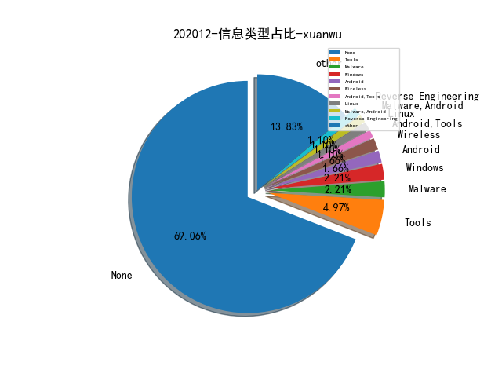
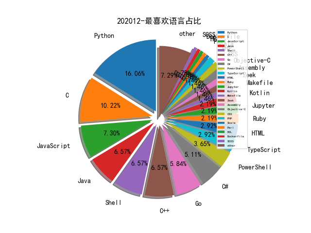

# [数据--所有](README_20.md)
# [数据--年度](README_2020.md)
# 202012 信息源与信息类型占比

# 微信公众号 推荐
| nickname_english | weixin_no | title | url| 
| --- | --- | --- | ---| 
| 青藤实验室 | gh_151a64925040 | SharePoint Rce 系列分析（二） | https://mp.weixin.qq.com/s/ZLSFXUoNNAFxqeiD9RpYZg | 2| 
| 360Quake空间测绘 | gh_0284fd4851e7 | 利用JARM指纹进行TLS服务端标记 | https://mp.weixin.qq.com/s/CTBO22SuQft1dBoHv2WRQg | 1| 
| SecOps急行军 | SecOpsWithU | NIST、CIS、MITRE、SANS 傻傻分不清楚 | https://mp.weixin.qq.com/s/wZF3TAVPr5t2KxMi_Gc2-w | 3| 
| qz安全情报分析 | lookvul | SolarWinds事件八卦解读 | https://mp.weixin.qq.com/s/aWZ0mrapJTpHwL0nBnGhmg | 1| 
| 公安部网安局 | gh_e406f4bcdf34 | 公安机关网安部门打击网络黑产犯罪工作取得显著成效 | https://mp.weixin.qq.com/s/h53qn-2vODsakiCxf9CvXQ | 1| 
| 潇湘信安 | xxxasec | 命令注入靶场空格过滤绕过测试 | https://mp.weixin.qq.com/s/pdU1XnBhnxRRGlncY3pDxQ | 3| 
| 落水轩 | gh_c10ee4802699 | 吐槽国内对SolarWinds事件的分析 | https://mp.weixin.qq.com/s/ytm62hJ59XIDi-QRlZTfEg | 1| 
| 陌陌安全 | MomoSecurity | 陌陌数据安全探索与实践 | https://mp.weixin.qq.com/s/yGLrdlpSmEe5ChiVn4b8Kg | 1| 
| 360威胁情报中心 | CoreSec360 | 落鹰行动-史上影响力最大的供应链攻击行动揭秘 | https://mp.weixin.qq.com/s/lh7y_KHUxag_-pcFBC7d0Q | 1| 
| CodeWisdom | gh_2395906a410f | 技术分享, 基于静态依赖分析的安卓GUI自动化探测方法 | https://mp.weixin.qq.com/s/YQDxUqo_ufjt3cuDNOUfwQ | 1| 
| 懒人在思考 | lazy-thought | 简单聊聊网络空间测绘纵横之道 | https://mp.weixin.qq.com/s/aBvptjz9gzxG_lPBY8ECVA | 1| 
| 看雪学院 | ikanxue | Go恶意样本分析 | https://mp.weixin.qq.com/s/22HqoBW-eVSf1Fzw7fxoFw | 1| 
| 中国信息安全 | chinainfosec | 盘点 , 各国数据隐私与保护情况 | https://mp.weixin.qq.com/s/B061CcZsJKavNEj_ggkRLQ | 1| 
| 安天 | Antiylab | FireEye红队工具失窃事件跟进分析 | https://mp.weixin.qq.com/s/X-bBV44nMQvDlnl6f4eX7Q | 2| 
| ATLAS Academy | atlas-cyber-academy | 2020网络安全大事记 - 监管判例篇 | https://mp.weixin.qq.com/s/60-O9GGYPNZZW6KVvY_c8w | 1| 
| ChaMd5安全团队 | chamd5sec | 逆向智能门锁漏洞分析PART（二） | https://mp.weixin.qq.com/s/IutPFguZmNvPZd5XrlK6Mg | 3| 
| 大超的记事本 | Dachao_Dachao | 数据安全怎么做——静态敏感数据治理 | https://mp.weixin.qq.com/s/AejcWwJWxZWHf9dDRfVWPA | 1| 
| 天地和兴 | bjtdhxkj | 针对以色列水利/水务基础设施的网络攻击回顾 | https://mp.weixin.qq.com/s/XvPf_irbpZF6B0-fnn1OBA | 1| 
| 奇安信 CERT | gh_64040028303e | 中间件内存马注入&冰蝎连接(附更改部分代码) | https://mp.weixin.qq.com/s/eI-50-_W89eN8tsKi-5j4g | 1| 
| 奇安信ATEAM | gh_266190cebfff | 从 CVE-2020-17144 看实战环境的漏洞武器化 | https://mp.weixin.qq.com/s/nVtE-OFoO076x6T0147AMw | 1| 
| 微步在线研究响应中心 | gh_c108d4d389bf | 30行代码搞定Monero活跃节点探测 | https://mp.weixin.qq.com/s/omsTd3q5tOkknfK35tXGXg | 1| 
| 我需要的是坚持 | MyPersistence2020 | 从FireEye的泄露看红队的差距 | https://mp.weixin.qq.com/s/K2W-hgCUFOzgxrhF6U1s1A | 1| 
| 数说安全 | SSAQ2016 | 中国网络安全公司资本关系图谱 V2.0 | https://mp.weixin.qq.com/s/cv8z0791TLrVG2HYKY1pdg | 1| 
| 深信服千里目安全实验室 | Further_eye | 【组件攻击链】Spring全家桶各类RCE漏洞浅析 | https://mp.weixin.qq.com/s/gfCtSJoefYLjJpaksbKLrQ | 1| 
| 情报分析师 | qingbaofenxishi | 【原创】手机app数据画像分析技战法 | https://mp.weixin.qq.com/s/FdOeOC6JZE5a0r328nmtew | 1| 
| IRT工业安全红队 | ICSRedTeam | 基于Codesys工控软PLC环境 | https://mp.weixin.qq.com/s/28BgVoIt7Naij84HEDqtFQ | 1| 
| 安小记 | AnSecNote | MITRE ATT&CK基本概念 | https://mp.weixin.qq.com/s/yOJNWazCeGKKMR8titj3cg | 1| 
| 绿盟科技研究通讯 | nsfocus_research | 【云原生攻防研究 】针对AWS Lambda的运行时攻击 | https://mp.weixin.qq.com/s/duF1Z0EDC3n_G378Aq_XYA | 1| 
| 酒仙桥六号部队 | anfu-360 | 玩转graphQL | https://mp.weixin.qq.com/s/gp2jGrLPllsh5xn7vn9BwQ | 1| 

# 组织github账号 推荐
| github_id | title | url | org_url | org_profile | org_geo | org_repositories | org_people | org_projects | repo_lang | repo_star | repo_forks| 
| --- | --- | --- | --- | --- | --- | --- | --- | --- | --- | --- | ---| 

# 私人github账号 推荐
| github_id | title | url | p_url | p_profile | p_loc | p_company | p_repositories | p_projects | p_stars | p_followers | p_following | repo_lang | repo_star | repo_forks | 
| --- | --- | --- | --- | --- | --- | --- | --- | --- | --- | --- | --- | --- | --- | ---| 
| 2freeman | POC 会议议题 《Three Dark clouds over the Android kernel》 | https://github.com/2freeman/Slides/blob/main/PoC-2020-Three%20Dark%20clouds%20over%20the%20Android%20kernel.pdf | None |  | None | None | 1 | 0 | 0 | 0 | 0 |  | 7 | 1 | 1| 
| AdaLogics | Software security paper list | https://github.com/AdaLogics/software-security-paper-list | https://adalogics.com | We do advanced software security. | Oxford, UK | Ada Logics | 3 | 0 | 0 | 0 | 0 | Python | 41 | 5 | 1| 
| Ch1ngg | WebLogicPasswordDecryptor - 解密 WebLogic 密文 | https://github.com/Ch1ngg/WebLogicPasswordDecryptorUi | https://www.ch1ng.com/ |  | no | no | 24 | 0 | 0 | 0 | 0 | Python,C#,ASP,Java | 118 | 21 | 1| 
| KasperskyLab | TinyCheck - 卡巴斯基开源的智能手机流量劫持工具 | https://github.com/KasperskyLab/TinyCheck | None | None | None | None | 0 | 0 | 0 | 0 | 0 | C,Shell,Java,Python,Kotlin,C++,C#,PHP | 0 | 0 | 1| 
| ShiHuang-ESec | EHole: (棱洞)-红队重点攻击系统指纹探测工具 | https://github.com/ShiHuang-ESec/EHole | None |  | None | None | 2 | 0 | 0 | 0 | 0 |  | 113 | 17 | 1| 
| beurtschipper | Depix - 从截屏马赛克处理后的图片中还原原始密码 | https://github.com/beurtschipper/Depix | https://www.graa.nl/ |  | None | None | 26 | 0 | 0 | 0 | 0 | Python,C | 5300 | 262 | 1| 
| bsauce | Linux 内核多个漏洞的 Exploit 与 Writeup | https://github.com/bsauce/kernel_exploit_factory// | https://www.jianshu.com/u/a12c5b882be2 | 2nd year Ph.D. student majoring in binary analysis. | None | None | 25 | 0 | 0 | 0 | 0 | Python,C | 156 | 23 | 1| 
| charles2gan | 一款全新的 Android 反编译工具，支持 APK、DEX、ODEX、OAT、JAR、AAR、CLASS 文件格式的反编译 | https://github.com/charles2gan/GDA-android-reversing-Tool | https://www.zhihu.com/people/gjden | Leader of a Research Team, Senior security researcher. Malware Analysis, Vulnerability Analysis, Threat Intelligence etc. | None | adlab | 25 | 0 | 0 | 0 | 0 | Python,Makefile,Java,Ruby,C | 1100 | 152 | 1| 
| fireeye | Speakeasy - FireEye 开源的用于模拟执行 Windows 用户态、内核态恶意软件的工具 | https://github.com/fireeye/speakeasy | None | None | None | None | 0 | 0 | 0 | 0 | 0 | C,Vue,Python,JavaScript,C++,C#,TypeScript,Go,PowerShell | 0 | 0 | 1| 
| ggerganov | Keytap2 - 通过机器学习训练键盘击键声音，通过侧信道的方式实现 Keylogger | https://github.com/ggerganov/kbd-audio/discussions/31 | https://github.com/viewray-inc |  | Sofia, Bulgaria | @viewray-inc | 34 | 0 | 0 | 0 | 0 | HTML,C++ | 3100 | 277 | 1| 
| google | Atheris: A Coverage-Guided, Native Python Fuzzer，用于 Fuzz Python 代码的工具 | https://github.com/google/atheris | None | None | None | None | 0 | 0 | 0 | 0 | 0 | C,TypeScript,Java,Python,Kotlin,JavaScript,C++,Dart,Crystal,HTML,Starlark,Go | 0 | 0 | 1| 
| kevoreilly | CAPEv2: Malware Configuration And Payload Extraction | https://github.com/kevoreilly/CAPEv2 | https://twitter.com/CapeSandbox | CAPE developer | None | None | 8 | 0 | 0 | 0 | 0 | Python,C | 318 | 90 | 1| 
| r0eXpeR | 红队中易被攻击的一些重点系统漏洞整理 | https://github.com/r0eXpeR/redteam_vul | None | Unomi@棱角 | China,ShangHai | None | 4 | 0 | 0 | 0 | 0 |  | 657 | 96 | 1| 
| r3nhat | GRAT2 C2 - 支持 DNS Listener，HTTPS Listener | https://github.com/r3nhat/GRAT2 | https://medium.com/@r3n_hat | Cyber Security Addicted. OSCE, OSCP, OSWP, eCPTX, eWPTX, CRTE, PACES, CEH Certified. | None | None | 7 | 0 | 0 | 0 | 0 | C#,Shell | 211 | 52 | 1| 
| rtcatc | 一款针对Webpack等前端打包工具所构造的网站进行快速、高效安全检测的扫描工具 | https://github.com/rtcatc/Packer-Fuzzer | https://www.hackinn.com | 嗷呜 NJI12*3*%*2*M*R%* ç(-é$ùé&ù$$$éùù =$m$=$ | None | None | 16 | 0 | 0 | 0 | 0 | Python | 535 | 60 | 1| 
| seemoo-lab | ToothPicker - 针对 Apple 蓝牙协议栈的 Fuzzing 测试 | https://github.com/seemoo-lab/toothpicker | None | None | None | None | 0 | 0 | 0 | 0 | 0 | C,Shell,Jupyter,Python,Swift,JavaScript,C++,Objective-C,MATLAB,Kotlin,Java,Ruby | 4600 | 333 | 1| 
| susam | UNIX命令语言（1976）资源。 | https://github.com/susam/tucl | https://susam.in/ |  | None | None | 29 | 0 | 0 | 0 | 0 | Python,C,JavaScript,Makefile,CSS | 1500 | 66 | 1| 
| tacnetsol | IOT Exploitation Ghidra Scripts | https://github.com/tacnetsol/ghidra_scripts | None | None | None | None | 0 | 0 | 0 | 0 | 0 | Python | 0 | 0 | 1| 
| tech-srl | Neural Reverse Engineering of Stripped Binaries using Augmented Control Flow Graphs（Paper） | https://github.com/tech-srl/Nero | None | None | None | None | 0 | 0 | 0 | 0 | 0 | C,Assembly,Python,JavaScript,C#,Java,Jupyter | 0 | 0 | 1| 
| wcventure | FuzzingPaper: Recent Fuzzing Paper | https://github.com/wcventure/FuzzingPaper | https://wcventure.github.io/ | I am a Ph.D. student at Shenzhen University. My research interest is in the area of Cyber Security(SEC), Programming Language(PL), and Software Engineering(SE). | Shenzhen, Guangdong Province, China, 518060 | Shenzhen University | 12 | 0 | 0 | 0 | 0 | Python,C | 684 | 117 | 1| 

# medium_xuanwu 推荐
| title | url| 
| --- | ---| 
| 利用 Windows 的 Native 二进制程序实现数据的向外渗透 | http://debugactiveprocess.medium.com/data-exfiltration-with-lolbins-20e5e9c1ed8e| 
| 使用Dexcalibur和JEB逆向工具分析Android恶意软件。 | http://link.medium.com/YFOeWtKMecb| 
| Attacking Unattended Installs on macOS | http://medium.com/tenable-techblog/attacking-unattended-installs-on-macos-dfc1f57984e0| 
| How I Found The Facebook Messenger Leaking Access Token Of Million Users | http://medium.com/bugbountywriteup/how-i-found-the-facebook-messenger-leaking-access-token-of-million-users-8ee4b3f1e5e3| 
| iOS 内核的地址随机化（ASLR）分析 | http://medium.com/@bellis1000/aslr-the-ios-kernel-how-virtual-address-spaces-are-randomised-d76d14dc7ebb| 
| Exploiting SIGRed (CVE-2020–1350) on Windows Server 2012/2016/2019 | http://datafarm-cybersecurity.medium.com/exploiting-sigred-cve-2020-1350-on-windows-server-2012-2016-2019-80dd88594228| 
| 勒索软件的体系结构研究（1/2） | http://medium.com/bugbountywriteup/architecture-of-a-ransomware-1-2-1b9fee757fcb| 
| 使用开放网络进行MITM WiFi攻击测试。 | http://medium.com/bugbountywriteup/mitm-wifi-attacks-using-open-networks-7c0cc283524c?source=rss----7b722bfd1b8d---4| 

# medium_secwiki 推荐
| title | url| 
| --- | ---| 
| Mapping ATT&CK Data Sources to Security Events via OSSEM | https://medium.com/threat-hunters-forge/mapping-att-ck-data-sources-to-security-events-via-ossem-%EF%B8%8F-b606d99e738c| 

# zhihu_xuanwu 推荐
| title | url| 
| --- | ---| 

# zhihu_secwiki 推荐
| title | url| 
| --- | ---| 
| 网络空间测绘技术之：协议识别（RDP篇） | https://zhuanlan.zhihu.com/p/336936793| 

# xz_xuanwu 推荐
| title | url| 
| --- | ---| 

# xz_secwiki 推荐
| title | url| 
| --- | ---| 
| SQL注入渗透PostgreSQL(bypass tricks) | https://xz.aliyun.com/t/8621| 
| 从mimikatz学Windows本地hash抓取 | https://xz.aliyun.com/t/8601| 
| 云安全威胁检测项 | https://help.aliyun.com/document_detail/191144.html| 
| 内网技巧-RDP劫持及利用hash登录 | https://xz.aliyun.com/t/8574| 
| As-Exploits: 中国蚁剑后渗透框架 | https://xz.aliyun.com/t/8591| 

# 日更新程序
`python update_daily.py`