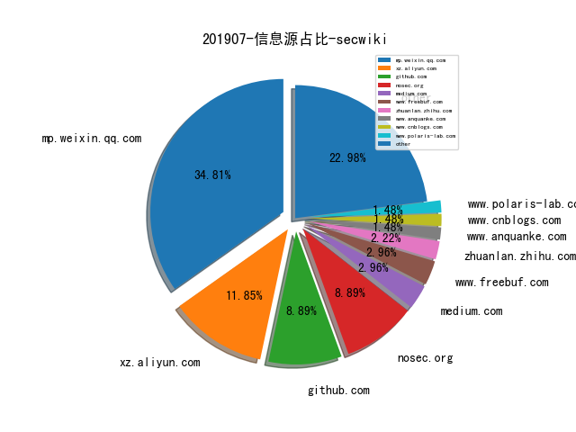
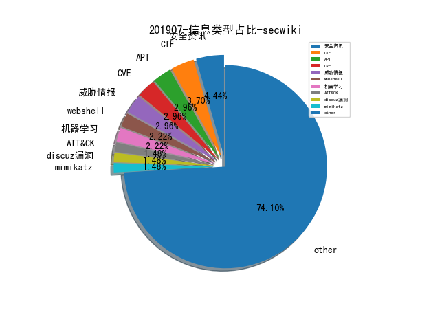

# [数据年报](README_YEAR.md)
# [数据月报-6月](README_6.md)
# [数据月报-5月](README_5.md)
# [数据月报-4月](README_4.md)
# [数据月报-3月](README_3.md)
# 201907 信息源与信息类型占比

# 微信公众号 推荐
| nickname_english | weixin_no | url | title| 
| --- | --- | --- | ---| 
| nmask | nmask-article | https://mp.weixin.qq.com/s/yZFdVXPDh2O_qN_S1DsBPw | 当子域名遇上搜索引擎 | 1| 
| 奇安信威胁情报中心 |  | https://mp.weixin.qq.com/s/As902I82uYq5eYQHhUToaA | 全球高级持续性威胁（APT）2019年中报告 | 1| 
| 安全学术圈 | secquan | https://mp.weixin.qq.com/s/zKv3wKEXRT8CgOnVHOXi0Q | 骗局的艺术：剖析以太坊智能合约中的蜜罐 | 1| 
| 安全牛 | aqniu-wx | https://mp.weixin.qq.com/s/ftcks4wPVNmKMpODvOcfBQ | 国内四大UEBA解决方案 | 1| 
| 漏洞战争 | vulwar | https://mp.weixin.qq.com/s/79k5bxGr1ykCpN4lSeiTqw | 关于漏洞挖掘的一点想法 | 1| 
| 继之宫 |  | https://mp.weixin.qq.com/s/wpBeoTEC7g-wFX-DA61gmA | 威胁剑魔杂谈 | 1| 
| 高效运维 | greatops | https://mp.weixin.qq.com/s/7A4lI1zeE5_BljzbKkInbw | 利用 ELK 搭建 Docker 容器化应用日志中心 | 1| 

# 组织github账号 推荐
| github_id | title | url | org_url | org_profile | org_geo | org_repositories | org_people | org_projects | repo_lang | repo_star | repo_forks| 
| --- | --- | --- | --- | --- | --- | --- | --- | --- | --- | --- | ---| 
| microsoft | 微软开源 Windows 10 使用的 Windows Subsystem for Linux 2 (WSL2) 版本 Linux 内核的源码 | https://github.com/microsoft/WSL2-Linux-Kernel | https://opensource.microsoft.com | Open source, from Microsoft with love | Redmond, WA | 0 | 0 | 0 | TypeScript,Java,C#,JavaScript,C++,Python,HTML,CSS,Rich,Go,Jupyter,PowerShell,HCL | 79000 | 11000 | 1| 
| ipasimulator | ipasim - Windows 平台的一款 iOS 模拟器 | https://github.com/ipasimulator/ipasim | None | iOS emulator for Windows | None | 0 | 0 | 0 | C,LLVM,Objective-C++,C++ | 104 | 16 | 1| 
| fgsect | 用AFL-Unicorn来fuzz内核，集合了afl的覆盖率和unicorn的局部模拟执行 | https://github.com/fgsect/unicorefuzz | https://www.isti.tu-berlin.de/security_in_telecommunications/menue/overview/ | The Computer Security Group at Berlin University of Technology | Berlin, Germany | 0 | 0 | 0 | Python,JavaScript | 0 | 0 | 1| 

# 私人github账号 推荐
| github_id | title | url | p_url | p_profile | p_loc | p_company | p_repositories | p_projects | p_stars | p_followers | p_following | repo_lang | repo_star | repo_forks | 
| --- | --- | --- | --- | --- | --- | --- | --- | --- | --- | --- | --- | --- | --- | ---| 
| pasta-auto | 丰田公司开发了一套汽车ECU系统的测试工具，包含软件和硬件，repo里面有这套工具的相关介绍，目前应该是在售的状态。 | https://github.com/pasta-auto/PASTA1.0 | None |  | None | None | 1 | 0 | 0 | 262 | 0 | C | 49 | 11 | 1| 
| Bypass007 | Safety-Project-Collection: 收集一些比较优秀的开源安全项目 | https://github.com/Bypass007/Safety-Project-Collection | None | 欢迎关注公众号Bypass--，专注于信息安全。 | Xiamen, China | None | 4 | 0 | 4 | 221 | 0 | Java | 1100 | 274 | 1| 
| maddiestone | 谷歌安全团队成员在Recon 2019会议上分享的Android病毒逆向分析，病毒通过各种反射和混淆隐藏自身真实payload，但通过仔细逆向，仍然能够将其分析清楚，毕竟Java编译之后的代码语义的留存还是挺多的 | https://github.com/maddiestone/ConPresentations/blob/master/REcon2019.PathToThePayload.pdf | http://twitter.com/maddiestone |  | None | None | 3 | 0 | 2 | 160 | 1 | Python | 436 | 91 | 1| 
| luguanxing | Cheating-Plugin-Program: 从零开始研究外挂设计原理 | https://github.com/luguanxing/Cheating-Plugin-Program | http://luguanxing.online:8080 |  | None | None | 17 | 0 | 7 | 102 | 2 | C,JavaScript,HTML,C++ | 412 | 106 | 1| 
| niemand-sec | AntiCheat-Testing-Framework - 游戏反外挂测试框架，作者在 Recon2019 会议有一个关于这个工具的演讲 | https://github.com/niemand-sec/AntiCheat-Testing-Framework | None | Twitter: @niemand_sec | None | None | 23 | 0 | 21 | 32 | 4 | C#,Python,C++ | 102 | 21 | 1| 
| Alexandre-Bartel | DOSBox 模拟器缓冲区溢出漏洞 CVE-2019-12594 Exploit | https://github.com/Alexandre-Bartel/CVE-2019-12594/ | https://www.abartel.net |  | None | None | 15 | 0 | 4 | 26 | 1 | Python,C,Java | 7 | 2 | 1| 
| KibodWapon | Axis-1.4-RCE-Poc: Axis | https://github.com/KibodWapon/Axis-1.4-RCE-Poc | https://kibodwapon.github.io/ |  | None | None | 4 | 0 | 5 | 21 | 0 | Python,HTML | 97 | 59 | 1| 
| paul-axe | paul-axe 公开的 WCTF 2019 P Door 赛题的 writeup | https://github.com/paul-axe/ctf/tree/master/wctf2019/p-door | None |  | None | None | 5 | 0 | 94 | 19 | 10 | Python,C,PHP,Haskell | 7 | 1 | 1| 
| blaCCkHatHacEEkr | 渗透测试、红队攻击、网络安全资源大集合 | https://github.com/blaCCkHatHacEEkr/PENTESTING-BIBLE | https://twitter.com/cry__pto | MalwareHacker||OSPentester||NetworkBreaker||ForensicsExpert||SocialEngineeringPro||WebProtector||: ::::::::::GPG:68E11CD1:::::::::: | syria | None | 2 | 0 | 21 | 16 | 13 |  | 85 | 19 | 1| 

# 日更新程序
`python update_daily.py`