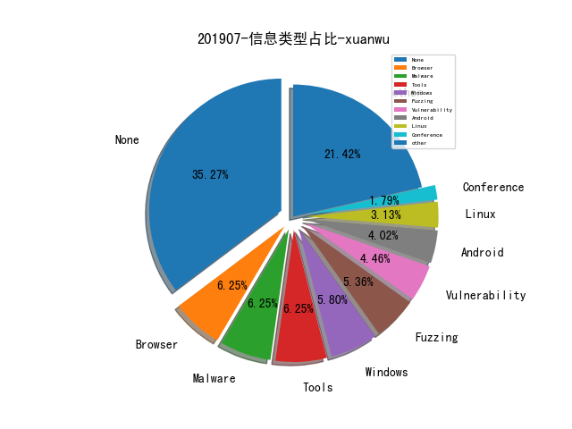
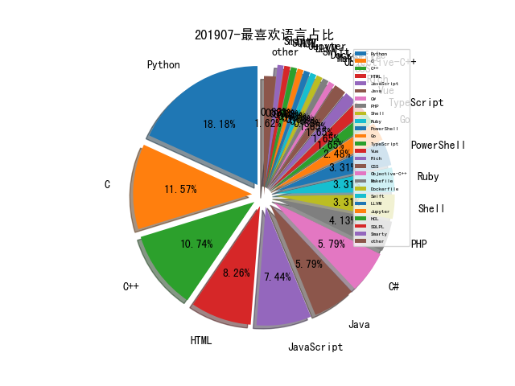

# [数据年报](README_YEAR.md)
# [数据月报-6月](README_6.md)
# [数据月报-5月](README_5.md)
# [数据月报-4月](README_4.md)
# [数据月报-3月](README_3.md)
# 201907 信息源与信息类型占比

# 微信公众号 推荐
| nickname_english | weixin_no | url | title| 
| --- | --- | --- | ---| 
| nmask | nmask-article | https://mp.weixin.qq.com/s/yZFdVXPDh2O_qN_S1DsBPw | 当子域名遇上搜索引擎 | 1| 
| 高效运维 | greatops | https://mp.weixin.qq.com/s/7A4lI1zeE5_BljzbKkInbw | 利用 ELK 搭建 Docker 容器化应用日志中心 | 1| 

# 组织github账号 推荐
| github_id | title | url | org_url | org_profile | org_geo | org_repositories | org_people | org_projects | repo_lang | repo_star | repo_forks| 
| --- | --- | --- | --- | --- | --- | --- | --- | --- | --- | --- | ---| 
| microsoft | 微软开源 Windows 10 使用的 Windows Subsystem for Linux 2 (WSL2) 版本 Linux 内核的源码 | https://github.com/microsoft/WSL2-Linux-Kernel | https://opensource.microsoft.com | Open source, from Microsoft with love | Redmond, WA | 0 | 0 | 0 | TypeScript,Java,C#,JavaScript,C++,Python,HTML,CSS,Rich,Go,Jupyter,PowerShell,HCL | 79000 | 11000 | 1| 

# 私人github账号 推荐
| github_id | title | url | p_url | p_profile | p_loc | p_company | p_repositories | p_projects | p_stars | p_followers | p_following | repo_lang | repo_star | repo_forks | 
| --- | --- | --- | --- | --- | --- | --- | --- | --- | --- | --- | --- | --- | --- | ---| 
| maddiestone | 谷歌安全团队成员在Recon 2019会议上分享的Android病毒逆向分析，病毒通过各种反射和混淆隐藏自身真实payload，但通过仔细逆向，仍然能够将其分析清楚，毕竟Java编译之后的代码语义的留存还是挺多的 | https://github.com/maddiestone/ConPresentations/blob/master/REcon2019.PathToThePayload.pdf | http://twitter.com/maddiestone |  | None | None | 3 | 0 | 2 | 160 | 1 | Python | 436 | 91 | 1| 
| Alexandre-Bartel | DOSBox 模拟器缓冲区溢出漏洞 CVE-2019-12594 Exploit | https://github.com/Alexandre-Bartel/CVE-2019-12594/ | https://www.abartel.net |  | None | None | 15 | 0 | 4 | 26 | 1 | Python,C,Java | 7 | 2 | 1| 
| blaCCkHatHacEEkr | 渗透测试、红队攻击、网络安全资源大集合 | https://github.com/blaCCkHatHacEEkr/PENTESTING-BIBLE | https://twitter.com/cry__pto | MalwareHacker||OSPentester||NetworkBreaker||ForensicsExpert||SocialEngineeringPro||WebProtector||: ::::::::::GPG:68E11CD1:::::::::: | syria | None | 2 | 0 | 21 | 16 | 13 |  | 85 | 19 | 1| 

# 日更新程序
`python update_daily.py`