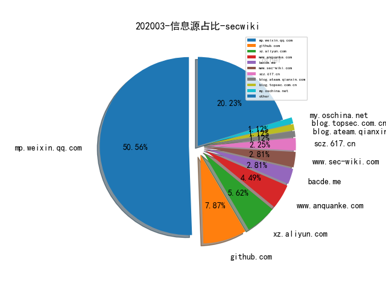
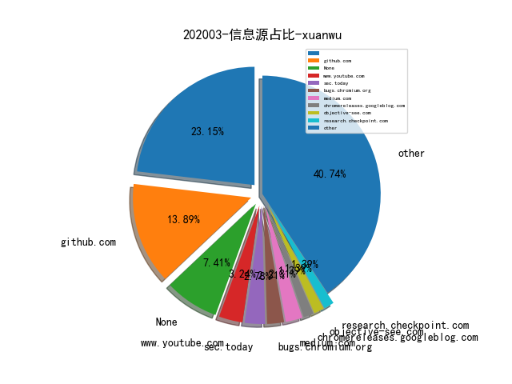
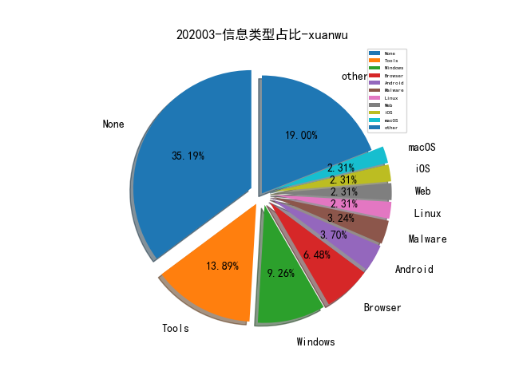

# [数据月报--202002](README_202002.md)
# [数据月报--202001](README_202001.md)
# [2019数据年报](README_YEAR_2019.md)
# [数据月报--2019-12月](README_12.md)
# [数据月报--2019-11月](README_11.md)
# [数据月报--2019-10月](README_10.md)
# [数据月报--2019-9月](README_9.md)
# [数据月报--2019-8月](README_8.md)
# [数据月报--2019-7月](README_7.md)
# [数据月报--2019-6月](README_6.md)
# [数据月报--2019-5月](README_5.md)
# [数据月报--2019-4月](README_4.md)
# [数据月报--2019-3月](README_3.md)
# [数据年报--2019-3月之前](README_YEAR.md)
# 202003 信息源与信息类型占比

# 微信公众号 推荐
| nickname_english | weixin_no | title | url| 
| --- | --- | --- | ---| 
| SecWiki | SecWiki | 2020 Google夏日编程之安全项目列表 | https://mp.weixin.qq.com/s/Gf937RjTpA0QsT2DJFQRqQ | 1| 
| 大潘点点 | dapandiandian | 网安产业结构和动力分析——从合规型向能力型 | https://mp.weixin.qq.com/s/V6P-6X_fnw_kvHWMxtqwLg | 1| 

# 组织github账号 推荐
| github_id | title | url | org_url | org_profile | org_geo | org_repositories | org_people | org_projects | repo_lang | repo_star | repo_forks| 
| --- | --- | --- | --- | --- | --- | --- | --- | --- | --- | --- | ---| 

# 私人github账号 推荐
| github_id | title | url | p_url | p_profile | p_loc | p_company | p_repositories | p_projects | p_stars | p_followers | p_following | repo_lang | repo_star | repo_forks | 
| --- | --- | --- | --- | --- | --- | --- | --- | --- | --- | --- | --- | --- | --- | ---| 

# medium_xuanwu 推荐
| title | url| 
| --- | ---| 

# medium_secwiki 推荐
| title | url| 
| --- | ---| 

# 日更新程序
`python update_daily.py`