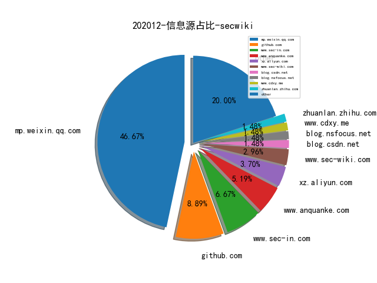
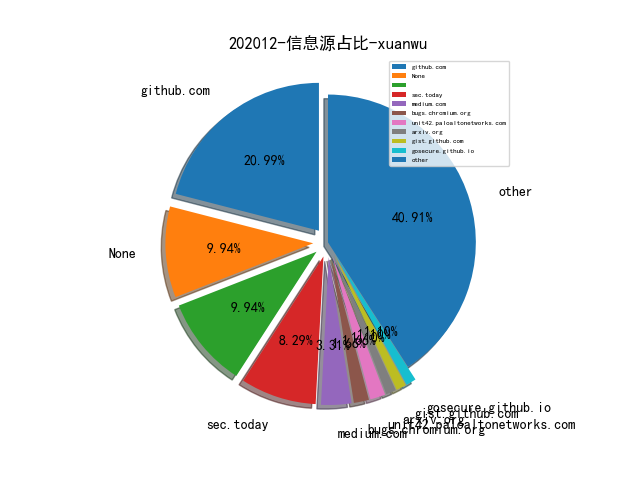

# [数据--所有](README_20.md)
# [数据--年度](README_2020.md)
# 202012 信息源与信息类型占比

# 微信公众号 推荐
| nickname_english | weixin_no | title | url| 
| --- | --- | --- | ---| 
| ChaMd5安全团队 | chamd5sec | RoarCTF-WriteUp | https://mp.weixin.qq.com/s/Ipy-PCnxQWlctQk1oI9arw | 1| 
| 天地和兴 | bjtdhxkj | 针对以色列水利/水务基础设施的网络攻击回顾 | https://mp.weixin.qq.com/s/XvPf_irbpZF6B0-fnn1OBA | 1| 
| 数说安全 | SSAQ2016 | 中国网络安全公司资本关系图谱 V2.0 | https://mp.weixin.qq.com/s/cv8z0791TLrVG2HYKY1pdg | 1| 
| SecOps急行军 | SecOpsWithU | 红蓝对抗中的溯源反制实战 | https://mp.weixin.qq.com/s/Dswz7lxNpW5yLxmWKtqY6Q | 1| 
| 情报分析师 | qingbaofenxishi | 【原创】手机app数据画像分析技战法 | https://mp.weixin.qq.com/s/FdOeOC6JZE5a0r328nmtew | 1| 
| IRT工业安全红队 | ICSRedTeam | 基于Codesys工控软PLC环境 | https://mp.weixin.qq.com/s/28BgVoIt7Naij84HEDqtFQ | 1| 
| 安小记 | AnSecNote | MITRE ATT&CK基本概念 | https://mp.weixin.qq.com/s/yOJNWazCeGKKMR8titj3cg | 1| 
| 绿盟科技研究通讯 | nsfocus_research | 【云原生攻防研究 】针对AWS Lambda的运行时攻击 | https://mp.weixin.qq.com/s/duF1Z0EDC3n_G378Aq_XYA | 1| 
| 酒仙桥六号部队 | anfu-360 | 玩转graphQL | https://mp.weixin.qq.com/s/gp2jGrLPllsh5xn7vn9BwQ | 1| 

# 组织github账号 推荐
| github_id | title | url | org_url | org_profile | org_geo | org_repositories | org_people | org_projects | repo_lang | repo_star | repo_forks| 
| --- | --- | --- | --- | --- | --- | --- | --- | --- | --- | --- | ---| 

# 私人github账号 推荐
| github_id | title | url | p_url | p_profile | p_loc | p_company | p_repositories | p_projects | p_stars | p_followers | p_following | repo_lang | repo_star | repo_forks | 
| --- | --- | --- | --- | --- | --- | --- | --- | --- | --- | --- | --- | --- | --- | ---| 
| AdaLogics | Software security paper list | https://github.com/AdaLogics/software-security-paper-list | https://adalogics.com | We do advanced software security. | Oxford, UK | Ada Logics | 3 | 0 | 0 | 0 | 0 | Python | 41 | 5 | 1| 
| Ch1ngg | WebLogicPasswordDecryptor - 解密 WebLogic 密文 | https://github.com/Ch1ngg/WebLogicPasswordDecryptorUi | https://www.ch1ng.com/ |  | no | no | 24 | 0 | 0 | 0 | 0 | Python,C#,ASP,Java | 118 | 21 | 1| 
| KasperskyLab | TinyCheck - 卡巴斯基开源的智能手机流量劫持工具 | https://github.com/KasperskyLab/TinyCheck | None | None | None | None | 0 | 0 | 0 | 0 | 0 | C,Shell,Java,Python,Kotlin,C++,C#,PHP | 0 | 0 | 1| 
| ShiHuang-ESec | EHole: (棱洞)-红队重点攻击系统指纹探测工具 | https://github.com/ShiHuang-ESec/EHole | None |  | None | None | 2 | 0 | 0 | 0 | 0 |  | 113 | 17 | 1| 
| beurtschipper | Depix - 从截屏马赛克处理后的图片中还原原始密码 | https://github.com/beurtschipper/Depix | https://www.graa.nl/ |  | None | None | 26 | 0 | 0 | 0 | 0 | Python,C | 5300 | 262 | 1| 
| charles2gan | 一款全新的 Android 反编译工具，支持 APK、DEX、ODEX、OAT、JAR、AAR、CLASS 文件格式的反编译 | https://github.com/charles2gan/GDA-android-reversing-Tool | https://www.zhihu.com/people/gjden | Leader of a Research Team, Senior security researcher. Malware Analysis, Vulnerability Analysis, Threat Intelligence etc. | None | adlab | 25 | 0 | 0 | 0 | 0 | Python,Makefile,Java,Ruby,C | 1100 | 152 | 1| 
| fireeye | Speakeasy - FireEye 开源的用于模拟执行 Windows 用户态、内核态恶意软件的工具 | https://github.com/fireeye/speakeasy | None | None | None | None | 0 | 0 | 0 | 0 | 0 | C,Vue,Python,JavaScript,C++,C#,TypeScript,Go,PowerShell | 0 | 0 | 1| 
| google | Atheris: A Coverage-Guided, Native Python Fuzzer，用于 Fuzz Python 代码的工具 | https://github.com/google/atheris | None | None | None | None | 0 | 0 | 0 | 0 | 0 | C,TypeScript,Java,Python,Kotlin,JavaScript,C++,Dart,Crystal,HTML,Starlark,Go | 0 | 0 | 1| 
| kevoreilly | CAPEv2: Malware Configuration And Payload Extraction | https://github.com/kevoreilly/CAPEv2 | https://twitter.com/CapeSandbox | CAPE developer | None | None | 8 | 0 | 0 | 0 | 0 | Python,C | 318 | 90 | 1| 
| seemoo-lab | ToothPicker - 针对 Apple 蓝牙协议栈的 Fuzzing 测试 | https://github.com/seemoo-lab/toothpicker | None | None | None | None | 0 | 0 | 0 | 0 | 0 | C,Shell,Jupyter,Python,Swift,JavaScript,C++,Objective-C,MATLAB,Kotlin,Java,Ruby | 4600 | 333 | 1| 
| susam | UNIX命令语言（1976）资源。 | https://github.com/susam/tucl | https://susam.in/ |  | None | None | 29 | 0 | 0 | 0 | 0 | Python,C,JavaScript,Makefile,CSS | 1500 | 66 | 1| 
| tacnetsol | IOT Exploitation Ghidra Scripts | https://github.com/tacnetsol/ghidra_scripts | None | None | None | None | 0 | 0 | 0 | 0 | 0 | Python | 0 | 0 | 1| 
| tech-srl | Neural Reverse Engineering of Stripped Binaries using Augmented Control Flow Graphs（Paper） | https://github.com/tech-srl/Nero | None | None | None | None | 0 | 0 | 0 | 0 | 0 | C,Assembly,Python,JavaScript,C#,Java,Jupyter | 0 | 0 | 1| 

# medium_xuanwu 推荐
| title | url| 
| --- | ---| 
| How I Found The Facebook Messenger Leaking Access Token Of Million Users | http://medium.com/bugbountywriteup/how-i-found-the-facebook-messenger-leaking-access-token-of-million-users-8ee4b3f1e5e3| 
| iOS 内核的地址随机化（ASLR）分析 | http://medium.com/@bellis1000/aslr-the-ios-kernel-how-virtual-address-spaces-are-randomised-d76d14dc7ebb| 
| Exploiting SIGRed (CVE-2020–1350) on Windows Server 2012/2016/2019 | http://datafarm-cybersecurity.medium.com/exploiting-sigred-cve-2020-1350-on-windows-server-2012-2016-2019-80dd88594228| 
| 勒索软件的体系结构研究（1/2） | http://medium.com/bugbountywriteup/architecture-of-a-ransomware-1-2-1b9fee757fcb| 
| 使用开放网络进行MITM WiFi攻击测试。 | http://medium.com/bugbountywriteup/mitm-wifi-attacks-using-open-networks-7c0cc283524c?source=rss----7b722bfd1b8d---4| 

# medium_secwiki 推荐
| title | url| 
| --- | ---| 
| Mapping ATT&CK Data Sources to Security Events via OSSEM | https://medium.com/threat-hunters-forge/mapping-att-ck-data-sources-to-security-events-via-ossem-%EF%B8%8F-b606d99e738c| 

# zhihu_xuanwu 推荐
| title | url| 
| --- | ---| 

# zhihu_secwiki 推荐
| title | url| 
| --- | ---| 

# xz_xuanwu 推荐
| title | url| 
| --- | ---| 

# xz_secwiki 推荐
| title | url| 
| --- | ---| 
| 云安全威胁检测项 | https://help.aliyun.com/document_detail/191144.html| 
| 内网技巧-RDP劫持及利用hash登录 | https://xz.aliyun.com/t/8574| 
| As-Exploits: 中国蚁剑后渗透框架 | https://xz.aliyun.com/t/8591| 

# 日更新程序
`python update_daily.py`