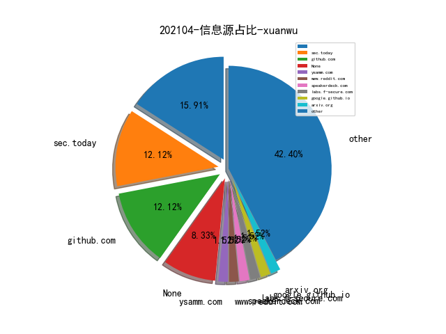
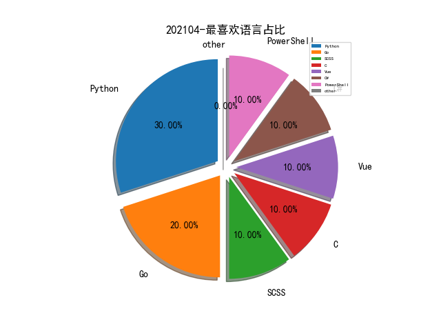

# [数据--所有](README_20.md)
# [数据--年度](README_2021.md)
# 202104 信息源与信息类型占比

# 微信公众号 推荐
| nickname_english | weixin_no | title | url| 
| --- | --- | --- | ---| 
| 安全学术圈 | secquan | S&P 2021 论文录用列表 | https://mp.weixin.qq.com/s/8GUnjS_T1H7gqSVPInFObg | 1| 
| NEO攻防队 | NEO_TEAM | 某VPN客户端远程下载文件执行挖掘（已修复） | https://mp.weixin.qq.com/s/XbsxziIFKx8VhGd-pv0Ghg | 1| 
| 互联网安全内参 | anquanneican | 深度剖析：俄罗斯网络空间攻击特点与模式 | https://mp.weixin.qq.com/s/oMy1EDOYPT82ec5QEdiIVA | 1| 
| 威胁棱镜 | THREAT_PRISM | Dragos：2020 年全球工控网络安全状况不容乐观 | https://mp.weixin.qq.com/s/ceASNJrgKkqgzlCnxNps7Q | 1| 
| 学蚁致用 | sudo_i | 【As-Exploits】你不能错过的antSword插件 | https://mp.weixin.qq.com/s/8G0il9gIkubI1w15gOBX6A | 1| 
| 娜璋AI安全之家 | gh_91f1fe28fc6e | [AI安全论文] 03.什么是生成对抗网络？GAN的前世今生（Goodfellow） | https://mp.weixin.qq.com/s/CGngRxjVtOKHNsTrXBiD7w | 1| 
| 穿过丛林 | gh_f90eac70537b | 硬件安全技术研究 | https://mp.weixin.qq.com/s/YuYmMryfgFi0XqD96WelHg | 1| 
| 锦行信息安全 | jeeseensec | 技术分享 , Git-RCE：CVE-2021-21300 | https://mp.weixin.qq.com/s/VO2dHNVbPcpZQtnBRMNNag | 1| 
| 哔哩哔哩安全应急响应中心 | gh_951c3555f599 | DGA域名检测的工程实践 | https://mp.weixin.qq.com/s/GlWqTWQzBfoXt8J8uJAPRQ | 1| 
| 数世咨询 | dwconcn | 数世咨询：网络空间资产测绘(CAM)能力指南 | https://mp.weixin.qq.com/s/p3LwmZq7nrGOy5qy7p9SDQ | 1| 
| 绿盟科技研究通讯 | nsfocus_research | 安全是一门语言的艺术：威胁调查分析语言概述 | https://mp.weixin.qq.com/s/U8E4JxMDeL5IeVGAh9fuiQ | 1| 
| 网安思考 | gh_e53abd003964 | 对美军新近发展作战理念的梳理与思考 | https://mp.weixin.qq.com/s/D8T6ImssRi8sjDqD4_bGpg | 1| 
| NISL实验室 | NISL_THU2020 | 【研究成果】国内伪基站垃圾短信生态系统研究 | https://mp.weixin.qq.com/s/te4igYM_PHbf2xedXdmQxw | 1| 
| BlockSec Team | gh_57d94ebc8526 | 鸠占鹊巢: Furucombo 攻击事件分析 | https://mp.weixin.qq.com/s/jDQhFNEeIMT_cdjHkggYjw | 1| 
| 君哥的体历 | jungedetili | 邬晓磊：基于关键词的大型红蓝对抗经验分享 | https://mp.weixin.qq.com/s/8boR_ZucLk5nMJwfi2UdGA | 1| 
| 火线安全平台 | huoxian_cn | 洞态IAST Agent正式开源 | https://mp.weixin.qq.com/s/iSHmK4Fbl0whDvIH-u8tag | 1| 

# 组织github账号 推荐
| github_id | title | url | org_url | org_profile | org_geo | org_repositories | org_people | org_projects | repo_lang | repo_star | repo_forks| 
| --- | --- | --- | --- | --- | --- | --- | --- | --- | --- | --- | ---| 

# 私人github账号 推荐
| github_id | title | url | p_url | p_profile | p_loc | p_company | p_repositories | p_projects | p_stars | p_followers | p_following | repo_lang | repo_star | repo_forks | 
| --- | --- | --- | --- | --- | --- | --- | --- | --- | --- | --- | --- | --- | --- | ---| 
| BC-SECURITY | Starkiller：1.7.0 版本发布。基于 Electron 实现的 Powershell Empire 可视化工具。 | https://github.com/BC-SECURITY/Starkiller/releases | None | None | None | None | 0 | 0 | 0 | 0 | 0 | Python,C#,C,Vue,PowerShell | 0 | 0 | 1| 

# medium_xuanwu 推荐
| title | url| 
| --- | ---| 
| Justin Warner：Using Kaitai to Parse Cobalt Strike Beacon Configs | http://sixdub.medium.com/using-kaitai-to-parse-cobalt-strike-beacon-configs-f5f0552d5a6e| 
| AFINE：总结当前的 Java 反序列化的测试和利用方法。 | http://afinepl.medium.com/testing-and-exploiting-java-deserialization-in-2021-e762f3e43ca2| 
| Mikko Kenttälä：macOS Mail 的一个无交互的漏洞。由于符号连接未正确删除，通过自动解压附件，可以实现在 Mail.app 的沙箱环境中添加或修改任意文件。 | http://mikko-kenttala.medium.com/zero-click-vulnerability-in-apples-macos-mail-59e0c14b106c| 

# medium_secwiki 推荐
| title | url| 
| --- | ---| 

# zhihu_xuanwu 推荐
| title | url| 
| --- | ---| 

# zhihu_secwiki 推荐
| title | url| 
| --- | ---| 
| 你关注了哪些关于网络安全技术分享的个人或团队 | https://www.zhihu.com/answer/1814752324| 

# xz_xuanwu 推荐
| title | url| 
| --- | ---| 

# xz_secwiki 推荐
| title | url| 
| --- | ---| 
| ELK在渗透测试中的利用与安全配置解析 | https://xz.aliyun.com/t/9370| 
| 内网渗透--对不出网目标的打法 | https://xz.aliyun.com/t/9372| 
| CVE-2016-0165 Win32k漏洞分析笔记 | https://xz.aliyun.com/t/9348| 

# 日更新程序
`python update_daily.py`