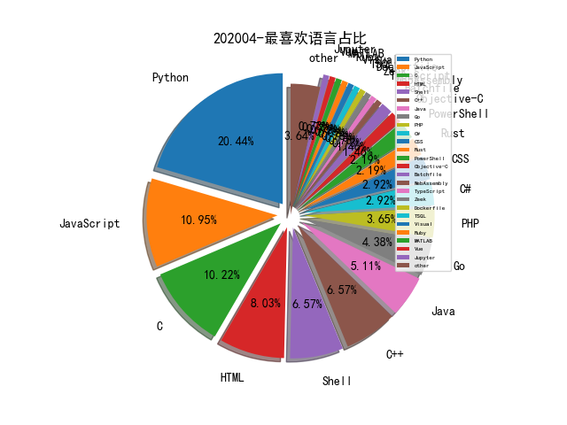

# [数据--所有](README_20.md)
# [数据--年度](README_2020.md)
# 202004 信息源与信息类型占比

# 微信公众号 推荐
| nickname_english | weixin_no | title | url| 
| --- | --- | --- | ---| 
| 人工智能架构 |  | 基于大数据的Uber数据实时监控（Part 1：Spark机器学习） | https://mp.weixin.qq.com/s/mr-007pdIzOXPDaAUha1Ww | 3| 
| 七夜安全博客 | qiye_safe | WebShell 干掉 RASP | https://mp.weixin.qq.com/s/yykliM-b4_rStX5ucPWO2w | 2| 
| 君哥的体历 | jungedetili | 何艺：零信任安全架构实践之路 | https://mp.weixin.qq.com/s/jWBnS144PvBRM-wnMnwseA | 3| 
| 百度安全应急响应中心 | baidu_sec | 构建企业级研发安全编码规范 | https://mp.weixin.qq.com/s/PNvCvV4gYJkfIsKJ1ccneA | 1| 
| 谛听ditecting |  | 2019年工业控制网络安全态势白皮书 | https://mp.weixin.qq.com/s/phcpafQnNBnyQ10FOcSriQ | 1| 
| SecWiki | SecWiki | [Sec-Trans-5] Subdomain Takeover: Thoughts on Risks | https://mp.weixin.qq.com/s/fn3_2kC6ljUL3ac1Mhuh1A | 1| 
| qz安全情报分析 | lookvul | 刨析NSA/ASD的WebShell防御指南 | https://mp.weixin.qq.com/s/oswnCc18UhYOrc6OC0COaA | 2| 
| Tide安全团队 | TideSec | 远控免杀专题(67)-白名单(113个)总结篇 | https://mp.weixin.qq.com/s/2bC5otYgIgGnod-cXwkfqw | 9| 
| VIPKID安全响应中心 | vk_src | 【技术分享】基于数据流的越权检测 | https://mp.weixin.qq.com/s/FC6ROeMAdGUxkjVjFd914A | 1| 
| heysec | bloodzer007 | 一次有趣的钓鱼测试 | https://mp.weixin.qq.com/s/JZs26mle8diovfPpAggP7A | 6| 
| 安全研究与实践 | secsky001 | 体系化的WAF安全运营实践 | https://mp.weixin.qq.com/s/BiH23k7xAeuwb5wwaOEKVw | 1| 
| 白帽汇 | baimaohui888 | 打“怪”升级的靶场——Vulfocus | https://mp.weixin.qq.com/s/ArDDWYuc1A64qUzeyPRzZA | 1| 
| 腾讯安全应急响应中心 | tsrc_team | 流量分析在安全攻防上的探索实践 | https://mp.weixin.qq.com/s/xz9v7cxQiGdsCUWbl5Lp1A | 2| 
| 雷神众测 | thorsrc | 近源渗透测试之USBninja实战 | https://mp.weixin.qq.com/s/qCA-6zXbwpj8nyn5791zfg | 1| 
| 黑金笔谈 | heijinbitan | Windows域环境及域渗透知识分享 | https://mp.weixin.qq.com/s/gvDzKFIsdhtkOKRANscEJA | 1| 
| VMware中国研发中心 | vmwarechinard | 使用FATE进行图片识别的深度神经网络联邦学习 | https://mp.weixin.qq.com/s/wlB8Hz4nTgz9zEP3OEQDAQ | 1| 
| vessial的安全Trash Can | vx_security | 移动基带安全研究系列文章之概念与系统篇 | https://mp.weixin.qq.com/s/YYicKHHZuI4Hgyw25AvFsQ | 1| 
| 中国白客联盟 | China_Baiker | 渗透中的后门利用 | https://mp.weixin.qq.com/s/EfzSC979qQqXxXLZsV9LpA | 1| 
| 中国警察网 | zgjcwcpd | 公安部公布十起侵犯公民个人信息违法犯罪典型案件 | https://mp.weixin.qq.com/s/3P4zEOepOxBETOcvBYhpDA | 1| 
| 中睿天下 | zorelworld | 干货|一次对钓鱼邮件攻击者的溯源分析 | https://mp.weixin.qq.com/s/-v7-M05Qyob5Rpzm_9lPQQ | 1| 
| 美团安全应急响应中心 |  | 复杂风控场景下，如何打造一款高效的规则引擎 | https://mp.weixin.qq.com/s/m4jFHUP3JYF9Z8TUxi9UIg | 1| 
| 腾讯御见威胁情报中心 |  | 微软发布字体解析远程代码执行漏洞补丁，建议用户尽快修补 | https://mp.weixin.qq.com/s/RvTZWvcXiXsI7xB6L9RWIg | 2| 
| 404 Not F0und |  | 我对安全与NLP的实践和思考 | https://mp.weixin.qq.com/s/_q5s1fHc0DB3feSd4gQZyw | 1| 
| 中国信息安全 | chinainfosec | 专题·原创 | 国际网络安全应急响应体系介绍 | https://mp.weixin.qq.com/s/1_cJGTpH4dU780K6qngkjQ | 1| 
| 信息通信技术与政策 | caict_dsc | APT供应链攻击防护应对分析及意义 | https://mp.weixin.qq.com/s/qGMRjCeIyHSHk_aXI8Fxbg | 1| 
| 永安在线反欺诈 | YongAnOnline | 永安在线 | 生鲜电商拉新场景业务安全测评报告 | https://mp.weixin.qq.com/s/oiSYOA-BDn9fUnb7EhO2vA | 1| 
| 绿盟科技研究通讯 | nsfocus_research | Provenance Mining：终端溯源数据挖掘与威胁狩猎 | https://mp.weixin.qq.com/s/Te7c3HvCcxX3ci9HTn8lEQ | 1| 
| 腾讯安全智能 | TX_Security_AI | 基于SOC机器学习检测平台的行为分析建模---HTTP隐蔽通信检测 | https://mp.weixin.qq.com/s/ggFbaQvn8yUJOFi_-DPNOw | 1| 
| ChaMd5安全团队 | chamd5sec | 领略cdn绕过的魅力 | https://mp.weixin.qq.com/s/7wpQXujqKk03GghPbmiwMw | 4| 
| 漏洞战争 | vulwar | 关于Adobe PDF 0day的故事 | https://mp.weixin.qq.com/s/fx8MQ8ZMhZHwrruigLFbGA | 1| 
| 360CERT | CERT-360 | “震网”三代和二代漏洞技术分析报告 | https://mp.weixin.qq.com/s/qc25c_nuUax6UoknAVLrAw | 1| 
| Ms08067安全实验室 | Ms08067_com | 六种bypass安全软件防护执行的方式 | https://mp.weixin.qq.com/s/sfxJbyJMB6FyGfa6H0G3hA | 1| 
| 云众可信 | yunzhongkexin | 原创干货 | 对某大型企业的一次web漏洞挖掘过程 | https://mp.weixin.qq.com/s/GuJgbLfJobTcJ2FMii3IzA | 1| 
| 关注安全技术 | heresecurity | 常见的web容器后门笔记 | https://mp.weixin.qq.com/s/-cmM1k3--H6p1ditfQHPEw | 1| 
| 小议安全 | xiaoyianquan | 零信任架构实战系列：干掉密码，无密码化方案落地 | https://mp.weixin.qq.com/s/xs-xybNs6Ha6_-Qr_EE-qw | 1| 
| 网安国际 | inforsec | 【InForSec通讯】安全漏洞报告的差异性测量 | Usenix Security2019 | https://mp.weixin.qq.com/s/h6xLJyqybGASORugqsvmgg | 1| 
| 锦行信息安全 | jeeseensec | 浅析HTTP走私攻击 | https://mp.weixin.qq.com/s/IMZrvJGQjcLBZS74kMWRnA | 1| 
| 国防科技要闻 | CDSTIC | 2021财年DARPA预算概况及发展动向解析 | https://mp.weixin.qq.com/s/yEsrMmI0BpvllXaf3TBWkw | 1| 
| 大路咨询 | daluzixun | 中国工业网络安全厂商综合能力概览（2020年第1期） | https://mp.weixin.qq.com/s/6i17MV8T3rou8j0rY-ZbIQ | 1| 

# 组织github账号 推荐
| github_id | title | url | org_url | org_profile | org_geo | org_repositories | org_people | org_projects | repo_lang | repo_star | repo_forks| 
| --- | --- | --- | --- | --- | --- | --- | --- | --- | --- | --- | ---| 

# 私人github账号 推荐
| github_id | title | url | p_url | p_profile | p_loc | p_company | p_repositories | p_projects | p_stars | p_followers | p_following | repo_lang | repo_star | repo_forks | 
| --- | --- | --- | --- | --- | --- | --- | --- | --- | --- | --- | --- | --- | --- | ---| 
| vanhauser-thc | 为 libfuzzer 生成一个直观的 HTML 格式的覆盖率报告 | https://github.com/vanhauser-thc/libfuzzer-coverage// | https://www.mh-sec.de/ | Security researcher since 1994 https://www.mh-sec.de/ https://www.thc.org/ https://twitter.com/hackerschoice | Berlin | The Hackers Choice | mh-sec | me | myself | 27 | 0 | 64 | 932 | 22 | C,Shell,HTML,Python,C++,Batchfile | 3700 | 1000 | 1| 
| tandasat | 在 Hyper-V 环境中测试 UEFI | https://github.com/tandasat/MiniVisorPkg/blob/master/Docs/Testing_UEFI_on_Hyper-V.md | http://standa-note.blogspot.ca/ | Engineer @standa_t | Vancouver, Canada | None | 58 | 0 | 19 | 668 | 3 | C,C++ | 777 | 245 | 1| 
| qazbnm456 | awesome-web-security: List of Web Security materials and resources | https://github.com/qazbnm456/awesome-web-security | https://www.patreon.com/boik | https://www.boik.com.tw/ | Taiwan | None | 109 | 0 | 1100 | 550 | 20 | Python,JavaScript | 4700 | 907 | 1| 
| djhohnstein | SharpChromium - 用于从 Chromium 系列浏览器中获取 Cookie、访问历史、网站登录凭据等敏感信息的工具 | https://github.com/djhohnstein/SharpChromium | https://github.com/specterops | Operator at SpecterOps. Kali Contributor. | Seattle, WA | @specterops | 123 | 0 | 10 | 288 | 6 | C#,VBScript,C++ | 104 | 23 | 1| 
| haidragon | haidragon/KiwiVM-1: virtualization encryption software for mobile applications | https://github.com/haidragon/KiwiVM-1 | http://weibo.com/haidragon | QQ交流群 : 826038086 | 中国 北京 | None | 1200 | 0 | 57 | 227 | 532 | C,JavaScript,C++ | 87 | 31 | 1| 
| Wenzel | awesome-virtualization: Collection of resources about Virtualization | https://github.com/Wenzel/awesome-virtualization | None | Security Researcher | VMI hypervisor-level debugger | Paris, France | None | 110 | 0 | 363 | 192 | 104 | Python,Ruby,Rust | 517 | 103 | 1| 
| citronneur | rdp-rs: Remote Desktop Protocol in RUST | https://github.com/citronneur/rdp-rs | https://github.com/airbus-cert |  | Toulouse, France | @airbus-cert | 24 | 0 | 284 | 159 | 102 | Python,C#,JavaScript,Rust | 1200 | 305 | 1| 
| wcventure | MemLock: Memory Usage Guided Fuzzing | https://github.com/wcventure/MemLock-Fuzz | https://wcventure.github.io/ | Computer Software and Theory, Software Engineering, Machine Learning, Formal Method, Program Analysis, Software Verification, Cyber Security. | Shenzhen, Guangdong Province, China, 518060 | Shenzhen University | 15 | 0 | 98 | 138 | 14 | Python,C,Batchfile | 244 | 36 | 1| 
| gobysec | Goby新一代安全测试工具 | https://github.com/gobysec/Goby | http://gobies.org | Goby - Make Cybersecurity More Effective The new generation of network security technology | None | Goby | 7 | 0 | 1 | 128 | 0 | Python,Go | 73 | 9 | 1| 
| brompwnie | A HTTP PoC Endpoint for cve-2020-5260 | https://github.com/brompwnie/cve-2020-5260/ | https://twitter.com/brompwnie | Keyboard wrangler ⌨️ | None | None | 29 | 0 | 16 | 91 | 169 | Go,Shell | 269 | 25 | 1| 
| DimitriFourny | macOS/iOS CVE-2019-6207 内核信息泄漏的 PoC 代码 | https://github.com/DimitriFourny/cve-2019-6207 | https://dimitrifourny.github.io | French security researcher. | None | None | 17 | 0 | 70 | 69 | 6 | Python,C,C++ | 62 | 13 | 1| 
| bohops | GhostBuild - MSBuild launchers for various GhostPack/.NET projects | https://github.com/bohops/GhostBuild | http://bohops.com |  | None | None | 9 | 0 | 31 | 59 | 2 | Python,PowerShell | 105 | 17 | 1| 
| smodnix | This challenge is Inon Shkedys 31 days API Security Tips. | https://github.com/smodnix/31-days-of-API-Security-Tips | https://smodnix.codes | Experienced in Web related technologies and interested in security aspects as well. | None | None | 30 | 0 | 450 | 58 | 582 |  | 801 | 106 | 1| 
| pventuzelo | WARF - WebAssembly Runtimes Fuzzing project | https://github.com/pventuzelo/wasm_runtimes_fuzzing | https://webassembly-security.com/ | Independent Security Researcher, Trainer of WebAssembly & Rust Security, mainly focused on Fuzzing, Vulnerability Research, Reversing & Binary analysis | Paris, France | Independent Security Researcher | 40 | 0 | 254 | 53 | 55 | Python,WebAssembly,JavaScript,HTML,Rust | 230 | 38 | 1| 
| nafod | nafod 公开了自己 VMware UHCI ZDI-19-421 漏洞的 Exploit | https://github.com/nafod/advent-vmpwn// | None |  | None | None | 15 | 0 | 117 | 44 | 24 | C,JavaScript | 5 | 1 | 1| 
| ph4ntonn | Stowaway -- Multi-hop Proxy Tool for pentesters | https://github.com/ph4ntonn/Stowaway | None | The wheel turns,nothing is ever new | 0x7F000001 | Unknown | 32 | 0 | 36 | 39 | 17 | Go,Python,C,JavaScript | 157 | 26 | 1| 
| Qftm | Handbook of information collection for penetration testing and src | https://github.com/Qftm/Information_Collection_Handbook | https://qftm.github.io/ | CTFer，Pentester，BugBountyHunter，Security Researcher，Mobile Security and Development | Internet | None | 7 | 0 | 53 | 35 | 35 | Python,HTML,JavaScript,PHP,C++ | 254 | 56 | 1| 
| assafmo | xioc: Extract IOCs from text, including escaped ones. | https://github.com/assafmo/xioc | https://github.com/enigmampc |  | Israel | @enigmampc | 25 | 0 | 270 | 35 | 18 | Go,JavaScript | 140 | 12 | 2| 
| yusufqk | SystemToken: Steal privileged token to obtain SYSTEM shell | https://github.com/yusufqk/SystemToken | None | Twitter: @ZupOctopus | None | None | 5 | 0 | 6 | 26 | 37 | Python,C,JavaScript | 112 | 24 | 1| 
| S1lkys | XAMPP 本地提权漏洞分析（CVE-2020-11107） | https://github.com/S1lkys/CVE-2020-11107/ | None |  | None | None | 27 | 0 | 1 | 23 | 0 | Python,Shell | 12 | 3 | 1| 
| yardenshafir | KernelDataStructureFinder - 在内核 lookaside 链表中搜索数据结构的工具 | https://github.com/yardenshafir/KernelDataStructureFinder | None |  | None | None | 5 | 0 | 2 | 22 | 0 | C,C++ | 40 | 20 | 1| 
| mrlnc | 禁用LTE网络安全性-商业网络中的配置错误安全研究分享。 | https://github.com/mrlnc/LTE-ciphercheck | None | Research Assistant & PhD student. Mobile Network Security at Ruhr-Universität Bochum. | Bochum, Germany | Ruhr-Universität Bochum | 15 | 0 | 26 | 18 | 30 | C++ | 36 | 13 | 1| 
| chrivers | 三星SSD固件文件解密工具Samsung Firmware Magic发布 | https://github.com/chrivers/samsung-firmware-magic | http://christianiversenit.dk |  | Denmark | Iversen IT | 23 | 0 | 15 | 13 | 6 | Python,HTML,Smarty | 135 | 20 | 1| 
| xscorp | pingfisher: A ping detection tool for linux | https://github.com/xscorp/pingfisher | None | I am a computer science noob who loves programming and cyber security stuff. I believe in self learning and hard work rather than miracles :-) | None | None | 10 | 0 | 3 | 13 | 0 | Python,PHP,Hack | 18 | 2 | 1| 
| afilipovich | 用于 Google Safe Browsing API 交互的 Python 库 | https://github.com/afilipovich/gglsbl | None |  | Olomouc | None | 10 | 0 | 31 | 7 | 4 | Python,JavaScript | 66 | 30 | 1| 
| Tera0017 | APT组织TA505所使用的SDBbot RAT解包工具发布，支持x86和x64 | https://github.com/Tera0017/SDBbot-Unpacker | None | I dont get it. | None | None | 3 | 0 | 0 | 6 | 0 | Python | 38 | 4 | 1| 
| Martyx00 | Assistant plugin for vulnerability research | https://github.com/Martyx00/VulnFanatic | None |  | None | None | 4 | 0 | 2 | 5 | 0 | Python,Objective-C,Shell | 26 | 4 | 1| 
| weizman | WhatsApp Desktop 0.3.9309 之前版本 XSS 漏洞分析 | https://github.com/weizman/CVE-2019-18426 | http://www.weizmangal.com | javascript expert and web security enthusiastic :) | Israel | https://www.perimeterx.com | 8 | 0 | 3 | 4 | 1 | JavaScript | 5 | 1 | 1| 
| QAX-A-Team | sharpwmi: 基于RPC的横向移动工具 | https://github.com/QAX-A-Team/sharpwmi | None | None | None | None | 0 | 0 | 0 | 0 | 0 | C,Shell,Java,C#,C++,Python,Go,PowerShell | 0 | 0 | 1| 
| ail-project | AIL framework - Analysis Information Leak framework | https://github.com/ail-project/ail-framework | None | None | None | None | 0 | 0 | 0 | 0 | 0 | Python | 6 | 0 | 1| 
| aind-containers | AinD: Android (Anbox) in Docker，在 Docker 中运行 Android apps | https://github.com/aind-containers/aind | None | None | None | None | 0 | 0 | 0 | 0 | 0 | Dockerfile | 0 | 0 | 1| 
| appsecco | Attacking and Auditing Docker Containers and Kubernetes Clusters | https://github.com/appsecco/attacking-and-auditing-docker-containers-and-kubernetes-clusters | None | None | None | None | 0 | 0 | 0 | 0 | 0 | Shell,Java,Python,JavaScript,C#,Visual,HTML,ActionScript,PHP,CSS | 540 | 150 | 1| 
| ffffffff0x | Dork-Admin: 盘点近年来的数据泄露、供应链污染事件 | https://github.com/ffffffff0x/Dork-Admin | None | None | None | None | 0 | 0 | 0 | 0 | 0 | HTML,Java | 0 | 0 | 1| 
| fofapro | 基于 Docker 镜像的漏洞靶场平台 | https://github.com/fofapro/vulfocus | None | None | None | None | 0 | 0 | 0 | 0 | 0 | C,Vue,Java,Python,Go,CSS | 169 | 19 | 1| 
| seemoo-lab | Frankenstein - 用于为无线设备固件提供模拟执行和 Fuzz 环境的框架 | https://github.com/seemoo-lab/frankenstein/ | None | None | None | None | 0 | 0 | 0 | 0 | 0 | C,Shell,Jupyter,Python,JavaScript,TeX,Objective-C,HTML,MATLAB,Java | 4100 | 296 | 1| 
| sibears | 用于修改 IDA HexRays AST 的工具 | https://github.com/sibears/HRAST | None | None | None | None | 0 | 0 | 0 | 0 | 0 | Python,JavaScript,HTML,CSS | 0 | 0 | 1| 

# medium_xuanwu 推荐
| title | url| 
| --- | ---| 
| 安全策略（CSP）绕过技术内容介绍。 | http://medium.com/@bhaveshthakur2015/content-security-policy-csp-bypass-techniques-e3fa475bfe5d| 
| Windows 本地提权相关的技术总结 | http://medium.com/bugbountywriteup/privilege-escalation-in-windows-380bee3a2842?source=rss----7b722bfd1b8d---4| 
| Build your first LLVM Obfuscator | http://medium.com/@polarply/build-your-first-llvm-obfuscator-80d16583392b| 
| 写给入门者的 Web RCE 漏洞利用案例分析 | http://medium.com/bugbountywriteup/simple-remote-code-execution-vulnerability-examples-for-beginners-985867878311?source=rss----7b722bfd1b8d---4| 
| CVE-2020-0796 Windows SMBv3 LPE漏洞 POC详细分析 | http://medium.com/@knownsec404team/cve-2020-0796-windows-smbv3-lpe-exploit-poc-analysis-c77569124c87| 

# medium_secwiki 推荐
| title | url| 
| --- | ---| 
| Lateral Movement: PowerShell Remoting | https://medium.com/@subhammisra45/lateral-movement-powershell-remoting-89da402a9885| 
| Everything You Need to Know About IDOR | https://medium.com/@aysebilgegunduz/everything-you-need-to-know-about-idor-insecure-direct-object-references-375f83e03a87| 
| CATBERT — Detecting malicious emails with a bleeding-edge... | https://medium.com/@sophos.ai/detecting-malicious-emails-with-a-bleeding-edge-neural-language-model-355b366d8940| 

# zhihu_xuanwu 推荐
| title | url| 
| --- | ---| 

# zhihu_secwiki 推荐
| title | url| 
| --- | ---| 
| 从Google内部安全架构设计看威胁情报与威胁狩猎的应用场景 | https://zhuanlan.zhihu.com/p/129064940| 

# 日更新程序
`python update_daily.py`