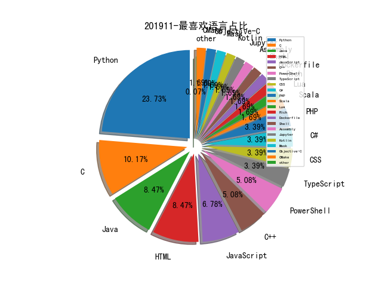

# [数据年报](README_YEAR.md)
# [数据月报-10月](README_10.md)
# [数据月报-9月](README_9.md)
# [数据月报-8月](README_8.md)
# [数据月报-7月](README_7.md)
# [数据月报-6月](README_6.md)
# [数据月报-5月](README_5.md)
# [数据月报-4月](README_4.md)
# [数据月报-3月](README_3.md)
# 201911 信息源与信息类型占比

# 微信公众号 推荐
| nickname_english | weixin_no | title | url| 
| --- | --- | --- | ---| 
| 七夜安全博客 | qiye_safe | 漫谈威胁建模下的安全通信 | https://mp.weixin.qq.com/s/m-ouMuBGX4BhHohV52Kykg | 1| 
| 奇门遁甲安全 |  | 浅谈新手入门级红蓝对抗系列之——Sysmon攻防 | https://mp.weixin.qq.com/s/_RcHF1vXPp1cnzXvGWnGvQ | 1| 
| 南方法治报 | nffzb1433 | 广东公安“净网2019”专项行动典型网络违法犯罪案例 | https://mp.weixin.qq.com/s/XIAaaZetvfLa5KO-7Q6rlg | 1| 
| 安全喷子 |  | ATT&CK 实战指南 | https://mp.weixin.qq.com/s/-K5B_ZdxLxN7oSCVfWMWpg | 1| 
| 开放知识图谱 | OpenKG-CN | 论文浅尝 | 探索将预训练语言模型用于事件抽取和事件生成 | https://mp.weixin.qq.com/s/8G-d3VT_I6ucRVrGm4VO2A | 1| 
| 水滴安全实验室 | EversecLab | 汽车安全测试Checklist | https://mp.weixin.qq.com/s/Pbru2pe-KeptQ909w4pk9w | 1| 
| AI科技评论 | aitechtalk | 数据挖掘领头人韩家炜教授：如何从无结构文本到有用的知识？ | https://mp.weixin.qq.com/s/aKGh9wOdWsleSted_iEmBQ | 1| 
| baronpan |  | 浅谈“归因” | https://mp.weixin.qq.com/s/WILKc7v_lJqoodiWCz9zog | 1| 
| 现代服务产业技术创新战略联盟 |  | 深度学习实体关系抽取研究综述（下） | https://mp.weixin.qq.com/s/vefsmswv8aTA1zF5lJ_WxA | 3| 
| 绿盟科技研究通讯 | nsfocus_research | 2019年度容器安全现状分析 | https://mp.weixin.qq.com/s/jtDlMe5SprpZfIfXryAjzg | 1| 
| 情报分析师 | qingbaofenxishi | 社交网络在开源安全情报中的应用（一） | https://mp.weixin.qq.com/s/QTcvAtaSe1jWvGTg9ZcfiQ | 1| 
| 青藤云安全资讯 | qingtengyun | 基于ATT&CK框架的红蓝对抗，有效提升检测能力 | https://mp.weixin.qq.com/s/hpc3hIfZxWx11pwKvSy7Ww | 1| 
| 安全牛 | aqniu-wx | 从本质看未来：对网络安全行业的深度思考 | https://mp.weixin.qq.com/s/pYxoDxpSQSu867lmIbsWyg | 2| 
| 时间之外沉浮事 | tasnrh | 网络空间靶场发展态势综述①JIOR | https://mp.weixin.qq.com/s/B_oA7FCkFnRj4WOyVeFGmA | 3| 
| 星维九州 |  | 流量加密也不怕！多种姿势检测冰蝎 | https://mp.weixin.qq.com/s/ciAQNdL1YJ9B1HX7TMEDzA | 1| 
| 漏洞战争 | vulwar | Android应用逻辑漏洞半自动化挖掘思路 | https://mp.weixin.qq.com/s/tFFe_LOs0e1Po8nj9ifmKg | 1| 
| 汉客儿 |  | 注入技术系列：一个批量验证DLL劫持的工具 | https://mp.weixin.qq.com/s/qaKCG1RkBOnr3SkG9Oc1pA | 2| 
| ChaMd5安全团队 | chamd5sec | 详细分析Solr的CVE-2019-0193以及velocity模板注入新洞 | https://mp.weixin.qq.com/s/gl35WFkxhAbuw7BNQa1FiQ | 2| 
| 美团安全应急响应中心 |  | 大型互联网公司数据安全实践 | https://mp.weixin.qq.com/s/DtGLFwcwNMCZseOKOAOC9Q | 1| 

# 组织github账号 推荐
| github_id | title | url | org_url | org_profile | org_geo | org_repositories | org_people | org_projects | repo_lang | repo_star | repo_forks| 
| --- | --- | --- | --- | --- | --- | --- | --- | --- | --- | --- | ---| 

# 私人github账号 推荐
| github_id | title | url | p_url | p_profile | p_loc | p_company | p_repositories | p_projects | p_stars | p_followers | p_following | repo_lang | repo_star | repo_forks | 
| --- | --- | --- | --- | --- | --- | --- | --- | --- | --- | --- | --- | --- | --- | ---| 
| lcatro | 一些阅读源码和 Fuzzing 的经验，涵盖黑盒与白盒测试 | https://github.com/lcatro/Source-and-Fuzzing | https://github.com/lcatro/my-blog | Binary ,WEB vulnerability and Fuzzing Research .. | China | WeBank ,Tencent | 52 | 0 | 181 | 677 | 21 | Python,PHP,Mask,C++ | 405 | 107 | 1| 
| phantom0301 | PTEye: 代理黑盒漏洞审计工具 | https://github.com/phantom0301/PTEye | http://phantom0301.github.io/ | Free and Share | Chengdu | None | 80 | 0 | 32 | 279 | 10 | Python,JavaScript,PowerShell | 81 | 9 | 1| 
| bettenW | 2019腾讯广告算法大赛完整代码（冠军） | https://github.com/bettenW/Tencent2019_Finals_Rank1st | http://zhuanlan.zhihu.com/DataAI | 鱼遇雨欲语与余 | China, Beijing | 京东集团，算法工程师 | 12 | 0 | 46 | 260 | 6 | Python,Jupyter | 235 | 83 | 1| 
| h2hconference | Hackers to Hackers(H2HC) 2019 会议的议题 PPT 公开了 | https://github.com/h2hconference/2019 | https://www.h2hc.com.br | Hackers To Hackers Conference (H2HC) é uma conferência organizada por pessoas que trabalham ou que estão diretamente envolvidas com pesquisas e desenvolvimento | Brazil | H2HC | 18 | 0 | 0 | 203 | 0 | Python,HTML | 50 | 12 | 1| 
| rootclay | Powershell攻击指南----黑客后渗透之道 | https://github.com/rootclay/Powershell-Attack-Guide | http://rootclay.com | A man who wants to be a ... | beijing | 360 | 34 | 0 | 401 | 80 | 81 | Python,C#,HTML,PowerShell | 298 | 87 | 1| 
| DeepSpaceHarbor | 人工智能（AI）安全方向的资料整理 | https://github.com/DeepSpaceHarbor/Awesome-AI-Security | None |  | ¯\_(ツ)_/¯ | None | 8 | 0 | 15 | 52 | 1 | HTML | 882 | 134 | 1| 
| mohuihui | antispy: Windows下手工杀毒辅助工具开源 | https://github.com/mohuihui/antispy | None | QQ & WeChat：454858525 | None | Alibaba | 9 | 0 | 5 | 46 | 2 | C,Java,Objective-C | 242 | 133 | 1| 
| biggerwing | 绿盟科技漏洞扫描器(RSAS)漏洞知识库 | https://github.com/biggerwing/nsfocus-rsas-knowledge-base | None | YmlnZ2VyLndpbmdAZ21haWwuY29tCg== | None | None | 79 | 0 | 13 | 44 | 1 | Python,Lua,C,HTML | 141 | 42 | 1| 
| momika233 | ClamAV 反病毒软件 0Day Exploit | https://github.com/momika233/ClamAV_0Day_exploit/ | https://twitter.com/momika233 | momika233 | Korea | None | 4 | 0 | 4 | 34 | 0 | Python | 97 | 24 | 1| 
| xrkk | 跟 IDA Pro 有关的资源收集，当前包括的工具个数 450 左右 | https://github.com/xrkk/awesome-ida | None |  | None | None | 7 | 0 | 1400 | 21 | 0 | Python,TypeScript | 403 | 69 | 1| 
| Magpol | 利用 FRiDA 爆破 Samsung S7 Edge FDE 全盘加密 | https://github.com/Magpol/fridafde | https://twitter.com/may_pol17 | All things Android - Forensics | None | None | 4 | 0 | 1 | 8 | 1 | Python,Shell | 21 | 3 | 1| 
| qq4108863 | himqtt: MQTT物联网防火墙源码 | https://github.com/qq4108863/himqtt | None |  | None | None | 2 | 0 | 0 | 6 | 0 | C | 15 | 7 | 1| 
| wfh45678 | radar: 实时风控引擎(Risk Engine) | https://github.com/wfh45678/radar | http://radar.pgmmer.top | 它山之石，可以攻玉 | China/ShangHai | 票易通 | 2 | 0 | 18 | 6 | 1 | Java | 99 | 37 | 1| 
| android-hacker | 无 ROOT 版本 Xposed - VirtualXposed 新增对 Android 10 系统的支持 | https://github.com/android-hacker/VirtualXposed/releases/tag/0.18.0 | None | None | None | None | 0 | 0 | 0 | 0 | 0 | Kotlin,JavaScript,Java | 0 | 0 | 1| 
| microsoft | 微软研究员关于内存安全的一个演讲《Quest Memory Safety》 | https://github.com/microsoft/MSRC-Security-Research/tree/master/presentations/2019_09_Ekoparty | None | None | None | None | 0 | 0 | 0 | 0 | 0 | C,TypeScript,CMake,Python,JavaScript,C++,C#,Rich,Dockerfile,PowerShell | 0 | 0 | 1| 

# 日更新程序
`python update_daily.py`