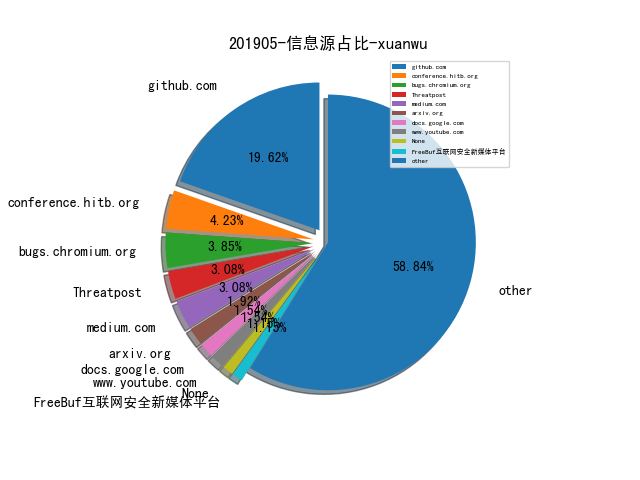
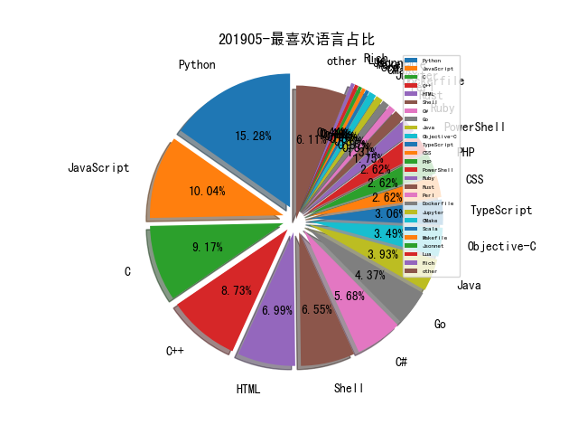

# [数据年报](README_YEAR.md)
# [数据月报-3月](README_3.md)
# 201905 信息源与信息类型占比

# 微信公众号 推荐
| nickname_english | weixin_no | url | title| 
| --- | --- | --- | ---| 
| APT攻击 | cncg_team | https://mp.weixin.qq.com/s/p53Vf4Xw0Zp03SvOmGTQxg | 从美国对APT10攻击的溯源看美国应急响应中心的追溯能力 | 1| 
| 中国保密协会科学技术分会 |  | https://mp.weixin.qq.com/s/zw0gcF2oSfpUxLEfOY4oxw | 数据驱动的网络安全风险事件预测技术探讨 | 1| 
| 中国信息安全 | chinainfosec | https://mp.weixin.qq.com/s/og_7zPM7a-axjc85BKzmAg | 专题 | 十八大以来我国主要电子政务政策法规汇编 | 1| 
| 安在 | AnZer_SH | https://mp.weixin.qq.com/s/EfTJdLsL_2bleoRsobxOUw | 百家 | 吕毅：浅析组织IT和安全战略 | 1| 
| 终结诈骗 | antifraud2 | https://mp.weixin.qq.com/s/eDq-QpEHjZieX-pjmDQFCg | 东南亚30万骗子，正在毁掉中国三代人！ | 1| 
| 逢人斗智斗勇 | xiaopigfly | https://mp.weixin.qq.com/s/qv3pYEzi08DMydqUj1dSRw | 深入浅出略谈威胁情报 | 1| 

# 组织github账号 推荐
| github_id | title | url | org_url | org_profile | org_geo | org_repositories | org_people | org_projects | repo_lang | repo_star | repo_forks| 
| --- | --- | --- | --- | --- | --- | --- | --- | --- | --- | --- | ---| 

# 私人github账号 推荐
| github_id | title | url | p_url | p_profile | p_loc | p_company | p_repositories | p_projects | p_stars | p_followers | p_following | repo_lang | repo_star | repo_forks | 
| --- | --- | --- | --- | --- | --- | --- | --- | --- | --- | --- | --- | --- | --- | ---| 

# 日更新程序
`python update_daily.py`